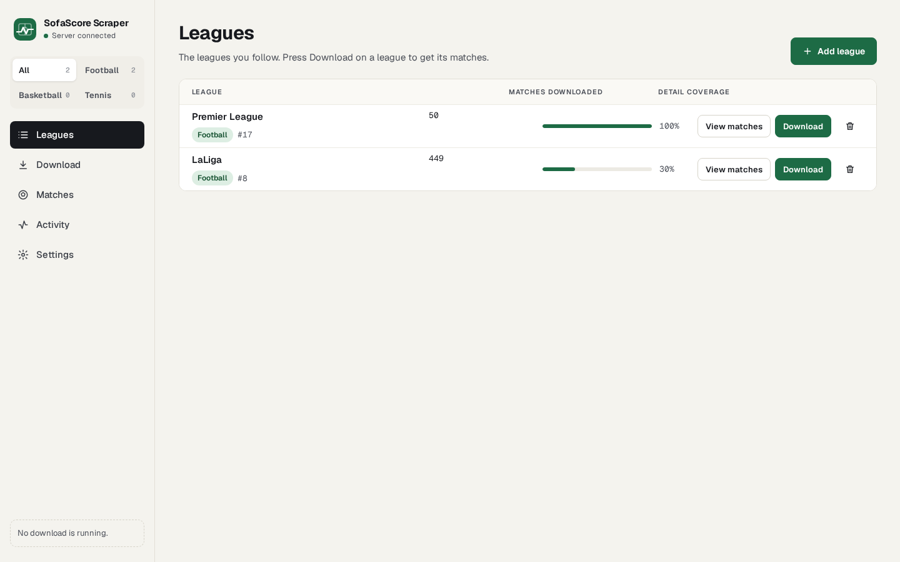
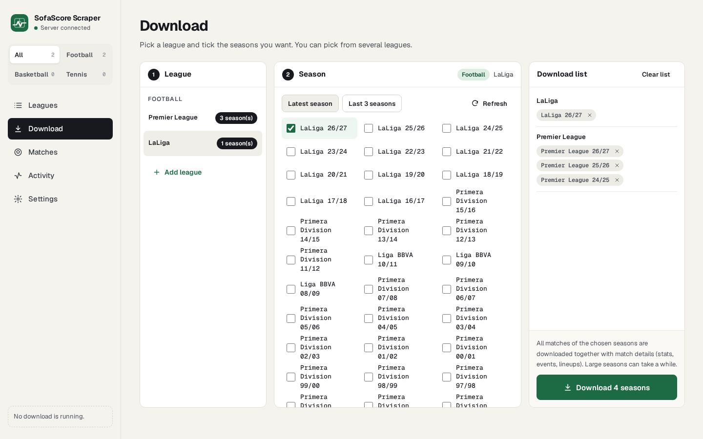
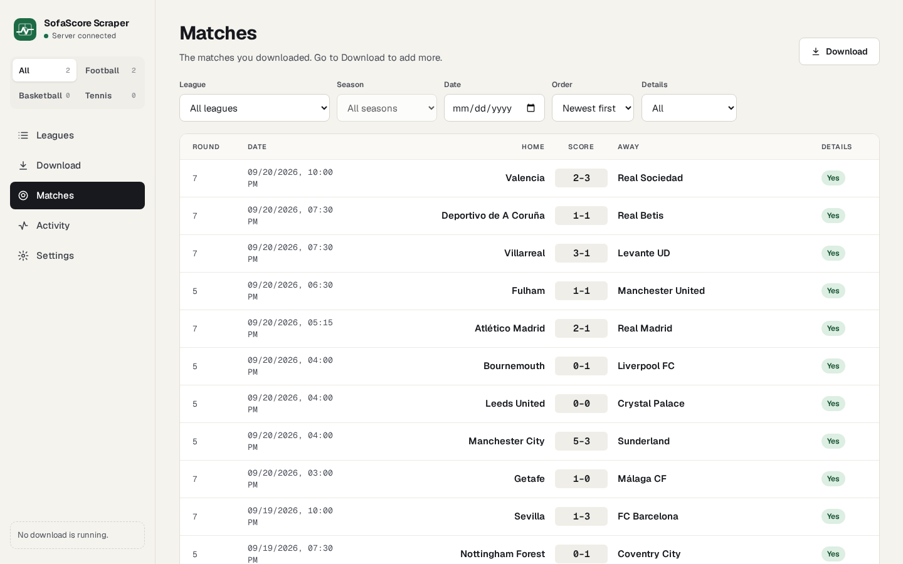
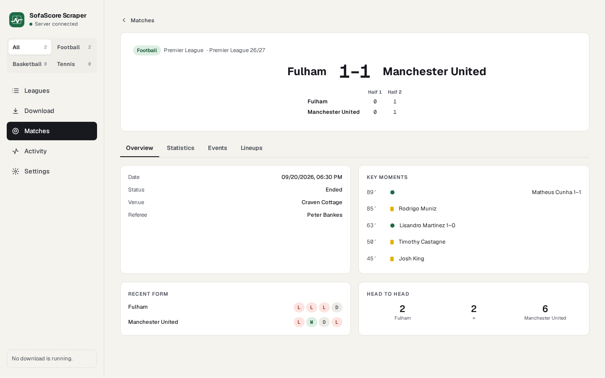
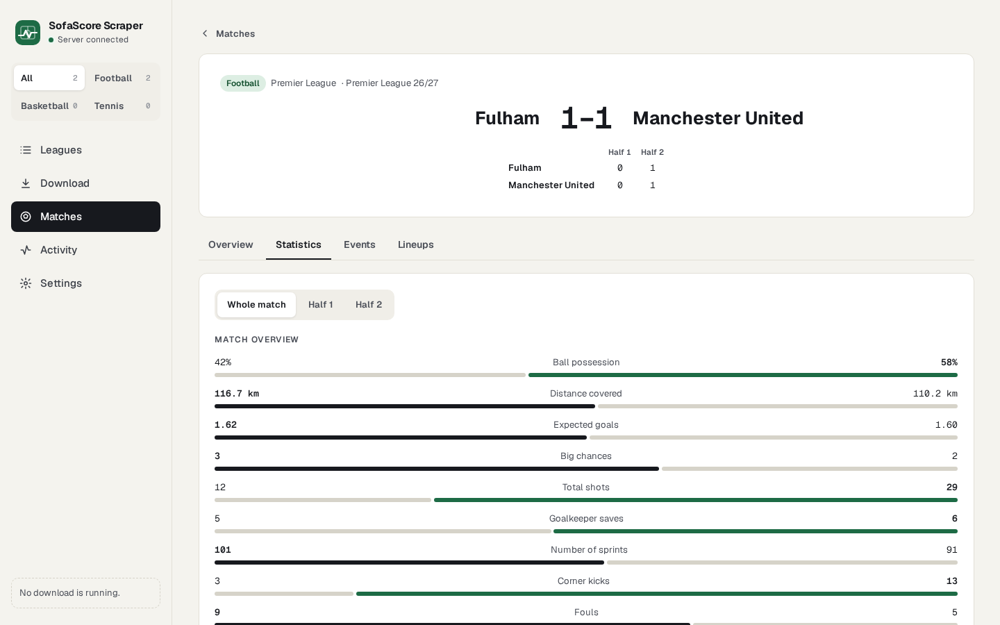

# SofaScore Scraper

[](https://github.com/tunjayoff/sofascore_scraper/actions/workflows/ci.yml)

**Türkçe:** [README.tr.md](README.tr.md)

Python tool to download football, basketball and tennis match data from [SofaScore](https://www.sofascore.com/) public HTTP APIs, store it locally (JSON and CSV), and browse it through a web app or a terminal UI.

This project is not affiliated with SofaScore. Use reasonable request rates and comply with applicable terms and laws.

## Features

- **Three sports** — Football, basketball and tennis. Every league remembers its sport, and the whole web app can be switched to one sport at a time.
- **Leagues** — Add tournaments by searching SofaScore (web) or by ID (`config/leagues.txt`).
- **Seasons & matches** — Pick seasons from one or several leagues and download them in one go; browse matches by league, season, date and whether details are downloaded.
- **Match details** — Statistics (per period), incidents, lineups, H2H and form; score lines per half, quarter or set depending on the sport.
- **Web app** — Leagues, Download, Matches, Activity and Settings pages; live progress (SSE) with a Stop that takes effect immediately; Turkish and English; light, dark or system theme.
- **Terminal UI** — Interactive menu for the same operations without the browser.
- **Automation** — Headless flags for CI/scripts (`--update-all`, `--fetch-mode`, `--league-id`, `--csv-export`, paths).
- **Export** — Processed “all matches” CSV and API export endpoints.

## Screenshots

The web app with two football leagues downloaded. The images follow your GitHub theme (light or dark).

**Leagues — followed leagues with downloaded match counts and detail coverage**

<picture>
  <source media="(prefers-color-scheme: dark)" srcset="docs/screenshots/leagues-en-dark.png">
  
</picture>

**Download — pick seasons from several leagues into one download list**

<picture>
  <source media="(prefers-color-scheme: dark)" srcset="docs/screenshots/download-en-dark.png">
  
</picture>

**Matches — filter by league, season, date and details**

<picture>
  <source media="(prefers-color-scheme: dark)" srcset="docs/screenshots/matches-en-dark.png">
  
</picture>

**Match — score by period, key moments, form and head to head**

<picture>
  <source media="(prefers-color-scheme: dark)" srcset="docs/screenshots/match-en-dark.png">
  
</picture>

**Match statistics — whole match or per period**

<picture>
  <source media="(prefers-color-scheme: dark)" srcset="docs/screenshots/match-stats-en-dark.png">
  
</picture>

## Requirements

- Python **3.10+** (3.11+ recommended).
- **Node.js 20.19+ or 22.12+ and npm** — to build the web app (`frontend/`). `scripts/start_web.py` builds it on the first run.
- **Git** — required for the one-line `curl | bash` installer (clones this repo); optional if you already extracted or cloned the project manually.
- Network access to SofaScore.

## Installation

### Quick install (script)

Official repository: [github.com/tunjayoff/sofascore_scraper](https://github.com/tunjayoff/sofascore_scraper).

**Linux / macOS / Git Bash**

Already cloned:

```bash
chmod +x scripts/install.sh   # once
./scripts/install.sh
```

**One-liner** (clones [tunjayoff/sofascore_scraper](https://github.com/tunjayoff/sofascore_scraper), creates `.venv`, installs dependencies, copies `.env`):

```bash
curl -fsSL https://raw.githubusercontent.com/tunjayoff/sofascore_scraper/main/scripts/install.sh | bash
```

Prefer to read a script before running it? Download it first:

```bash
curl -fsSLo install.sh https://raw.githubusercontent.com/tunjayoff/sofascore_scraper/main/scripts/install.sh
less install.sh && bash install.sh
```

- Optional **first argument**: target folder name (default `sofascore_scraper`), or set `SOFASCORE_SCRAPER_DIR`.
- To use another fork as default clone source: `export SOFASCORE_SCRAPER_REPO=https://github.com/YOU/fork.git` before `curl | bash`, or pass a **full git URL** as the first argument to `bash -s`:  
  `curl ... | bash -s -- https://github.com/YOU/fork.git [folder]`
- Override the built-in default URL only if needed: `SOFASCORE_SCRAPER_DEFAULT_REPO`.

**Windows** — PowerShell (clone is automatic if you are not already inside the repo):

```powershell
Set-ExecutionPolicy -Scope CurrentUser RemoteSigned   # if needed, once
Invoke-RestMethod https://raw.githubusercontent.com/tunjayoff/sofascore_scraper/main/scripts/install.ps1 | Invoke-Expression
```

Or after cloning:

```powershell
.\scripts\install.ps1
```

Explicit clone URL / folder:

```powershell
.\scripts\install.ps1 -RepoUrl https://github.com/tunjayoff/sofascore_scraper.git -InstallDir sofascore_scraper
```

From CMD: `scripts\install.bat`. Environment overrides: `SOFASCORE_SCRAPER_REPO`, `SOFASCORE_SCRAPER_DIR`, `SOFASCORE_SCRAPER_DEFAULT_REPO`.

**Prerequisites:** **Git** (for the one-liner / clone path), **Python 3.10+** on `PATH`. The scripts print clear errors if `git`, `python`, `venv`, or `pip install` fails (e.g. missing `python3-venv` on Debian/Ubuntu).

### Manual install

```bash
git clone https://github.com/tunjayoff/sofascore_scraper.git
cd sofascore_scraper
python -m venv .venv
source .venv/bin/activate   # Windows: .venv\Scripts\activate
pip install -r requirements.txt
python -m playwright install chromium   # only needed if Google Chrome isn't installed
```

Copy environment defaults and adjust:

```bash
cp .env.example .env
```

## Configuration

### Environment (`.env`)

See `.env.example` for all keys. Common ones:

| Variable | Purpose |
|----------|---------|
| `DATA_DIR` | Root folder for stored data (default `data`). Web app reads this via `ConfigManager`. |
| `APP_LANGUAGE` | `en` or `tr`: language of the terminal UI and server messages. The web app has its own switch under **Settings** (changing it there also updates this value). |
| `MAX_CONCURRENT` | Parallel detail requests cap. |
| `USE_PROXY` / `PROXY_URL` | Optional HTTP proxy. |
| `FETCH_ONLY_FINISHED` | Keep only finished matches (`status.type == finished`). Default `true`. Upcoming fixtures are dropped from schedule files. |
| `REFRESH_WINDOW_HOURS` | Hours after kick-off during which a saved match is provisional and gets re-read (default `72`, `0` = off). See [Refresh policy](#refresh-policy). |
| `RATE_LIMIT_*` / `SERVER_ERROR_*` | Circuit breaker thresholds when many errors occur. |

Tuning for the web UI (timeouts, retries, logging) is exposed under **Settings**; writing settings updates `.env`.

### Leagues (`config/leagues.txt`)

One line per league, `Name: ID`, where ID is the numeric SofaScore **unique tournament ID** (it appears in tournament URLs, e.g. `.../premier-league/17` → `17`). The file is yours and is not tracked by git: on first run it is created from `config/leagues.example.txt`. The app adds and removes lines itself when you manage leagues in the web app or the CLI.

CLI override:

```bash
python main.py --config /path/to/leagues.txt --data-dir /path/to/data
```

`--config` / `--data-dir` apply to **interactive** and **headless** modes. The web server loads the singleton `ConfigManager` from the project `.env` (`DATA_DIR`, etc.); align paths so the web UI and CLI see the same data if you use both.

## Usage

### How to use the app (quick start)

**Web (recommended for most users)**

1. Finish **Installation** and **Configuration** (`pip install`, `cp .env.example .env`). Optionally set `DATA_DIR` if you want data somewhere other than `./data`.
2. Start the app: `./start-sofascore.sh` (or `python scripts/start_web.py`). On the first run it builds the web app, then it opens `http://127.0.0.1:8000`. `python main.py --web` starts the server alone.
   After updating the code (`git pull`), rebuild the web app yourself: `cd frontend && npm install && npm run build`. The start script only builds when `frontend/dist/` is missing, so otherwise you keep seeing the old interface.
3. **Sport** — The switch at the top of the sidebar (All / Football / Basketball / Tennis) filters every page. Pick the sport you are working on.
4. **Leagues** — **Add league** searches SofaScore; filter the results by sport and press **Add**. A league whose sport is unknown (for example one added to `config/leagues.txt` by hand) shows a **Pick sport** box; choose once and it is saved.
5. **Download** — Left column: pick a league. Middle: tick seasons (the season list is fetched automatically the first time; **Latest season** / **Last 3 seasons** are shortcuts). You can pick seasons from several leagues; they collect in the **Download list** on the right. Press **Download N seasons**. Matches and their details (statistics, events, lineups) are downloaded together.
6. While a download runs, the card at the bottom left of the sidebar shows progress; **Stop** takes effect right away: no new requests are sent and retry waits are cut short; a request already in flight can take up to the request timeout (`REQUEST_TIMEOUT`) to return. Only one download runs at a time. **Activity** lists the current and past downloads.
7. **Matches** — Filter by league, season, date and **Details** (with / missing). When a league has matches without details (typically after a stopped download), a banner offers **Download missing**. Click a row to open the match: score by period, overview, statistics, events and lineups.
8. **Settings** — Language and theme; data folder, disk usage, **Back up** and **Delete all data**; advanced request settings (timeout, concurrency, waits, retries).

> **Delete all data** removes every downloaded season, match and detail and cannot be undone. Take a backup first. A backup is a zip under `data/backups/` (inside your `DATA_DIR`) holding `data/`, `leagues.txt` and `league_sports.json`. `.env` is left out because it can hold proxy credentials; add `?include_env=true` to `POST /api/data/backup` if you want it. To restore: stop the app, unzip `data/` into the project folder (or your `DATA_DIR`), and copy `leagues.txt` and `league_sports.json` to `config/` if you want those back too.

**Terminal menu**

Run `python main.py` and work through the numbered menus: manage leagues, refresh seasons, fetch match lists, fetch details, run stats, or export CSV. There is no counterpart of the web Download page; use the prompts to choose leagues and options.

**Tips**

- The first download of a big league can take a long time; start with one league and a few recent seasons.
- If you hit rate limits or many errors, lower **MAX_CONCURRENT** and raise waits slightly in **Settings**; avoid `--ignore-rate-limit` unless you know what you are doing.
- For the same dataset in **web** and **CLI/headless**, keep `DATA_DIR` in `.env` aligned with `--data-dir` when you use the command line.
- Prefer a season that already has finished matches. The newest label (e.g. European `26/27`) is often fixtures-only; the scraper can fall back automatically.
- Stopping a download keeps everything fetched so far. Matches whose details were not reached show **Details: No** in Matches; use **Download missing** there (or on the Download page) to complete them.

### Troubleshooting

**Seasons appear but fetch finds 0 matches** (`İşlenecek maç verisi bulunamadı` / `0it`)

1. Confirm the SofaScore **unique tournament ID** in the URL (MLS is **`242`** — that ID is correct).
2. Not every league exposes a sequential week schedule (`events/round/1..N`). **Premier League**-style competitions do; **MLS** and some others do not:
   - MLS `/rounds` is empty or only playoff-style IDs (e.g. `227`), and `events/round/1` returns nothing.
   - The scraper must use paginated **`events/last` + `events/next`** for those seasons.
   - Older builds that only probed weeks `1..50` therefore downloaded PL fine but returned **zero MLS matches**. Update to a release that includes the event-list fallback, refresh seasons, and re-run the fetch.
3. With `FETCH_ONLY_FINISHED=true` (default), not-yet-played fixtures are ignored. If a brand-new season has no finished games yet, pick the previous season (or wait / set `FETCH_ONLY_FINISHED=false` if you intentionally want fixtures).
4. Stale season IDs (SofaScore retired the ID after a refresh) also yield empty schedules — open the league on the **Download** page, press **Refresh** above its seasons, then download again.

### Interactive terminal

```bash
python main.py
```

### Web application

```bash
python main.py --web
```

Default URL: `http://127.0.0.1:8000`. The server only listens on this machine. `--host 0.0.0.0` opens it to your network, **with no login**: anyone who can reach it can change settings and delete data. `--port` changes the port and `--dev` reloads on code changes. Health: `GET /health`.

Background jobs report status via `GET /api/scrape/status` and `GET /api/scrape/stream` (SSE). Heavy API work runs off the asyncio event loop so the UI stays responsive during long fetches.

### Headless / automation

At least one of `--update-all` or `--csv-export` is required with `--headless`. Otherwise the process exits with code **2**.

| Flag | Meaning |
|------|---------|
| `--headless` | No terminal menu |
| `--update-all` | Run a fetch pipeline |
| `--fetch-mode full` | Seasons + match lists + details (default) |
| `--fetch-mode details` | Match details only (uses existing schedule/summary CSVs) |
| `--league-id ID` | Limit `--update-all` to one configured league |
| `--csv-export` | Build/export processed CSV dataset |
| `--ignore-rate-limit` | Disable circuit breaker (use with care) |
| `--refresh-only` | Only re-read provisional records (no `--headless` needed); see [Refresh policy](#refresh-policy) |
| `--refresh-legacy` | Also refresh records saved before `observation.json` existed, once |
| `--watch` | Live watcher with `--sport` and `--league-ids` or `--event-ids` (`--watch-hours` optional); see [Watch mode](#watch-mode) |

Examples:

```bash
python main.py --headless --update-all
python main.py --headless --update-all --fetch-mode details --league-id 52
python main.py --headless --csv-export --data-dir ./data
```

Exit codes: **0** success (or `APP_EXIT_CODE` if set by scraper), **1** unexpected error, **2** headless with no action.

### Command-line help

```bash
python main.py --help
```

## Data layout (under `DATA_DIR`)

Typical structure:

```text
data/
├── seasons/           # Season metadata per league
├── matches/           # Match list / summary CSVs by league & season
├── match_details/     # Per-match JSON folders (basic, stats, lineups, …)
│   └── processed/     # Aggregated CSV exports
├── datasets/          # Reserved / auxiliary
└── score_changes.jsonl  # Post-finish changes found by refresh (see Refresh policy)
```

Exact paths may vary slightly by league naming and migrations.

The match list reads the per-season summaries under `matches/`; the export CSV in `match_details/processed/` is only a fallback when no summaries exist.

Next to `config/leagues.txt` (the `name: id` list the CLI also reads), `config/league_sports.json` stores each league's sport as `{"<id>": "football" | "basketball" | "tennis"}`. It is filled when a league is added from the web app, when you pick a sport in the UI, or from a downloaded match of that league.

## Refresh policy

SofaScore keeps editing some results after a match has finished. In the research run (`docs/status-matrix/README.md`, "Geriye dönük"), the final or period score changed after `finished` in 78 of 255 lower-tier basketball matches, 6 of 240 lower-tier football matches and 4 of 145 upper-tier basketball matches. The latest final-score change came 66.4 h after kick-off. A match downloaded once can therefore differ from SofaScore's own final state.

- **When a record is refreshed.** Every saved match has `observation.json` next to `basic.json`, holding when we read it (`observed_at_utc`) and SofaScore's `changes.changeTimestamp`. A record is *provisional* while `observed_at_utc < startTimestamp + REFRESH_WINDOW_HOURS` (default **72**). On the next download (web job, `--update-all`, or `--refresh-only`), provisional records are re-read. Only `/event/{id}` is fetched; the stats and lineups are not. Refreshes run after new and incomplete matches, and the job card counts them separately ("N refreshed (M changed)"). A record is re-read at most once every `REFRESH_MIN_INTERVAL_HOURS` (default 6, advanced `.env` setting), so hourly downloads do not fetch the same match 72 times. Once a read lands after the window, the record is final and never fetched again.
- **Older records.** Matches saved before this feature have no `observation.json`. They count as final, so the default setting adds **no** requests for existing data. `--refresh-legacy` re-reads each of them once.
- **Turning it off.** Set `REFRESH_WINDOW_HOURS=0` (in `.env` or under **Settings**).
- **Change log.** When the status triple, `winnerCode`, any `homeScore`/`awayScore` field or `startTimestamp` differs, `basic.json` is overwritten and one line is appended to `DATA_DIR/score_changes.jsonl` (ignored by git):

```json
{"ts_utc": "2026-09-30T08:00:00+00:00", "event_id": 16950622, "sport": "football",
 "tournament": {"id": 17, "name": "Premier League"}, "tier_hint": true,
 "start_ts": 1789497000, "hours_after_start": 2.1,
 "changed": {"awayScore.penalties": [6, 5]}, "old_change_ts": 1789504592, "new_change_ts": 1789504600,
 "status_class": ["completed", "completed"]}
```

  - `changed` gives the old and new value of each field. `changes` from SofaScore only names the fields, so this file is the first record of *how much* a result changed.
  - `hours_after_start` is the new `changeTimestamp` minus kick-off.
  - `tier_hint` is SofaScore's player-statistics coverage flag (tournament or event level). It shows how much SofaScore covers the league, not the league's real level.
  - If a match that counted as played turns void (`completed` → `void`, e.g. cancelled afterwards), the line carries `"status_regressed": true`. The same flag goes into `observation.json`. The record is **not** deleted; that decision is yours.

```bash
python main.py --refresh-only                 # re-read provisional records only (e.g. a daily cron)
python main.py --refresh-only --league-id 17  # one league
python main.py --refresh-only --refresh-legacy
```

## Watch mode

`python main.py --watch` follows live matches and writes **events**; it does not settle anything. A consumer (a separate service, the web UI, or you with `tail -f`) decides what to do with them.

```bash
python main.py --watch --sport football --league-ids 17,8     # every live match of these leagues
python main.py --watch --sport tennis --event-ids 17196038,17210464 --watch-hours 3
```

- **How it polls.** Every 30 s one request to `/sport/{sport}/events/live`, plus `/event/{id}`:
  - immediately when a tracked live match drops out of the live list (the earliest end signal);
  - every 30 s while a match is near its end;
  - every 5 min for a stuck match.
- **Near the end:**
  - football: 2nd half from minute 80 or once `injuryTime2` appears;
  - basketball: `played ≥ 90%` of regulation, or the last period when there is no clock data;
  - tennis: the deciding set.
- **Rate budget.** At most `WATCH_MAX_EVENT_POLLS` (default 20) match pages per round, requests at least 1 s apart. That is under 1 request/s in total. If more matches are near the end than that, match pages drop to every 60 s and a warning is logged.
- **Stuck match.** Still live or not started 4 h after kick-off (tennis: 6 h after the real first-set start, since its `startTimestamp` is only the scheduled slot): one `stuck` event, then polled every 5 min. If it turns void and its start time has moved (suspended tennis continues the next day with the same id), it stays tracked.
- **Events.** One JSON line per event in `DATA_DIR/watch_events.jsonl`:
  - `status_changed` `{event_id, from, to, at_utc, change_ts, scores}`. `scores` comes from `extract_scores`. The first `completed` carries `provisional: true` until the refresh window closes; see [Refresh policy](#refresh-policy).
  - `score_changed` for live scores `{event_id, from, to, at_utc}`.
  - `stuck`.
- **Restarts.** The last known class per match is kept in `DATA_DIR/watch_state.json`, so a restart does not emit the same transition twice. Ctrl+C stops cleanly.
- **When it exits.** With `--event-ids`, the watcher exits when every tracked match is over.

Why these numbers: `events/live` is cached for 5 s at the CDN, and whistle → `finished` took a median of 20 s (max 302 s) in the research (`docs/status-matrix/README.md`). Polling faster than 30 s gains nothing.

## REST API (overview)

All routes are prefixed with `/api` unless noted.

- **Leagues**: list (each with `sport`), create (optional `sport`), `PATCH /api/leagues/{id}` to set the sport, delete, search (local / remote, remote results carry `sport`), seasons, refresh seasons, missing-details.
- **Matches**: `GET /api/matches` — paginated, filters `league_id` (one id or several comma-separated, e.g. `17,8`), `season_id`, `date`, `details=present|missing`, `sort=asc|desc`; every row has `has_details`. Also single-match JSON and on-demand fetch for one match.
- **Scraper**: `POST /api/fetch` (body: mode `full` or `details`, `selections: [{league_id, season_ids, match_ids}]`), `POST /api/scrape/cancel` (no new requests after it; retry waits are cut short), status, SSE stream.
- **Dashboard / stats / settings**: JSON for the web UI; settings mirror `.env` keys.
- **Data**: backup zip, clear scopes, CSV export.
- **Bypass Status**: `GET /api/bypass/status` and live test `POST /api/bypass/test`.

OpenAPI: `GET /docs` when the server is running.

## Anti-Bot Protection (BrowserBridge)

SofaScore rejects plain HTTP clients: API requests get `403 {"reason": "challenge"}` whatever TLS fingerprint `curl_cffi` presents. The app therefore makes API calls from inside a real browser page:

1. **BrowserBridge** starts a headless Chromium through [Scrapling](https://github.com/D4Vinci/Scrapling)'s `StealthySession` (patchright with stealth settings) and keeps one page open.
2. **Challenge:** on a 403 challenge it opens `sofascore.com/captcha.html`; Scrapling passes the embedded Cloudflare Turnstile and the resulting `sofa_captcha` cookie unlocks the API. Concurrent 403s share one solve; a failed solve is not retried for 3 minutes.
3. **Browser-first mode:** once curl is blocked and the browser succeeds, requests go straight to the browser for 10 minutes instead of failing through curl first.

The browser always runs **headless**, on a desktop and on a server alike, so the same code path is used everywhere; no display, Xvfb or Google Chrome is needed. Measured on the three sports: full seasons of Premier League (50 matches), Wimbledon (239) and EuroBasket (76) downloaded at 100% coverage without a display. Set `SOFASCORE_BROWSER_HEADED=1` to watch the browser while debugging.

The browser profile (cookies, solved challenge) lives in `~/.cache/sofascore_scraper/chrome_profile`; change it with `SOFASCORE_BROWSER_PROFILE`. A restart with an existing profile answers its first request in about 1–6 s.

### Server setup (Linux / Docker)

```bash
pip install -r requirements.txt
python -m playwright install chromium
# Debian/Ubuntu only, once: system libraries Chromium needs (uses sudo)
python -m playwright install-deps chromium
```

## Development

Run the web app with auto-reload:

```bash
python main.py --web --dev
```

The web app is a Vue 3 + TypeScript + Vite project in `frontend/` (Pinia, vue-router, vue-i18n, Tailwind). The server serves the built files from `frontend/dist/`.

```bash
cd frontend
npm install
npm run dev      # http://localhost:5173, proxies /api to 127.0.0.1:8000
npm run build    # type-check (vue-tsc) + production build into frontend/dist/
```

Layout: `src/views/` one file per page, `src/components/` shared pieces, `src/stores/` (leagues, sport filter, running job), `src/api/client.ts` every backend call, `src/locales/{tr,en}.ts` all UI text.

Tests and lint (CI runs the same on Python 3.10 and 3.14):

```bash
pip install pytest pytest-asyncio httpx ruff
ruff check .
python -m pytest -q
```

`tests/conftest.py` points `DATA_DIR`, `config/` and `.env` at a temporary folder with a small synthetic data set, so the suite never touches your data or settings. Tests that call SofaScore are marked `live` and skipped by default; run them with `python -m pytest -m live`.

## Contributing

Contributions are welcome. You can help in several ways:

- **Bug reports** — Open an issue with steps to reproduce, expected vs actual behaviour, OS/Python version, and relevant `.env` flags (redact secrets).
- **Feature ideas** — Suggest use cases and constraints; maintainers may triage and discuss scope in the issue.
- **Pull requests** — Fork the repo, use a focused branch, keep changes small and on-topic, and describe *what* and *why* in the PR. Match existing code style; avoid drive-by refactors. If you touch user-visible text, update both languages: `frontend/src/locales/tr.ts` and `en.ts` for the web app, `locales/en.json` and `locales/tr.json` for the terminal UI.
- **Docs & translations** — Improvements to these READMEs or locale strings are appreciated.

By submitting a contribution, you agree that it is licensed under the project's license and that the maintainer may also offer it under other terms (for example, a commercial license). Be respectful in issues and reviews. If you are unsure whether an idea fits, open an issue first.

## License

[PolyForm Noncommercial 1.0.0](LICENSE). You may use, modify and share this software for **noncommercial purposes** — personal use, study, research, hobby projects, and use by charities, educational institutions and public bodies. **Commercial use is not permitted** without a separate license; to ask about one, open an issue or contact [@tunjayoff](https://github.com/tunjayoff).

Versions released before this change remain available under the MIT license.
