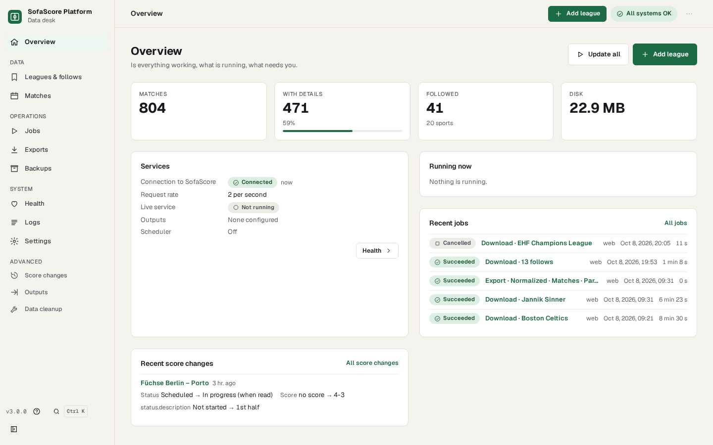
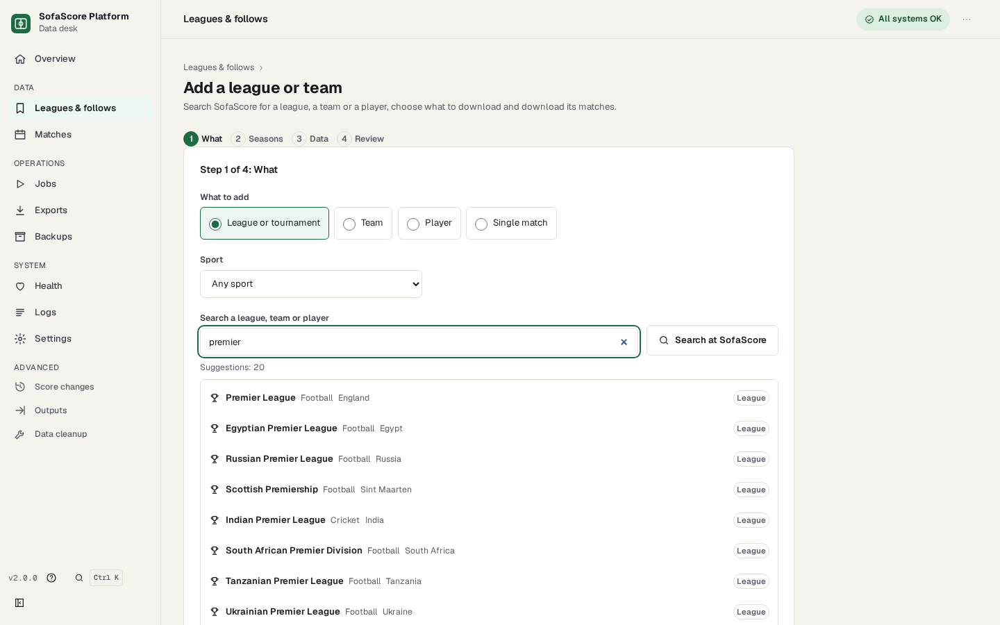
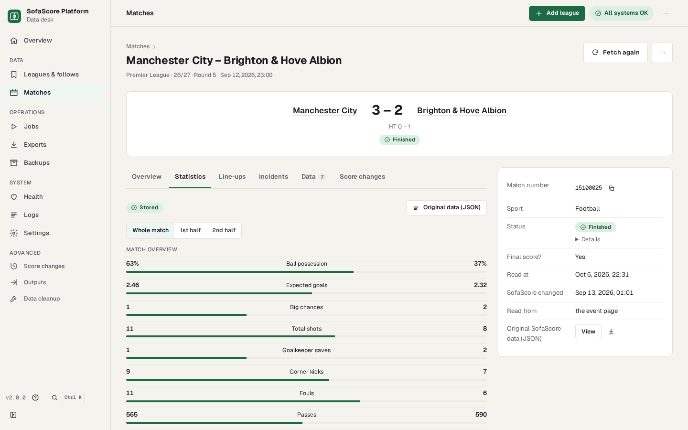
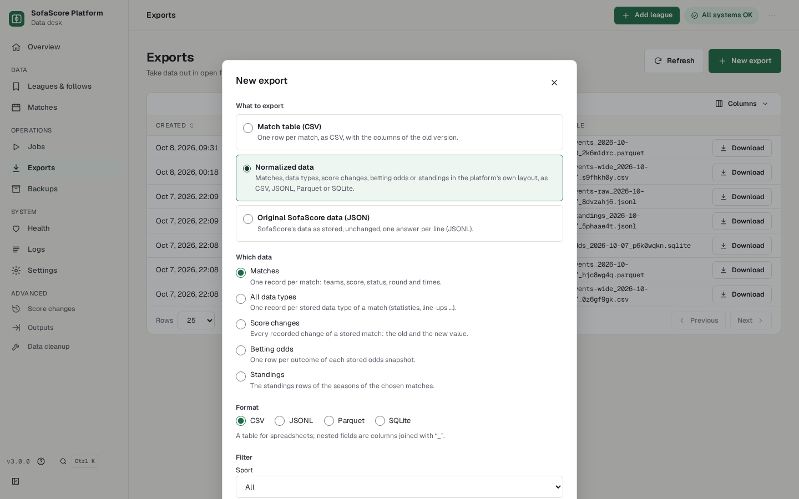
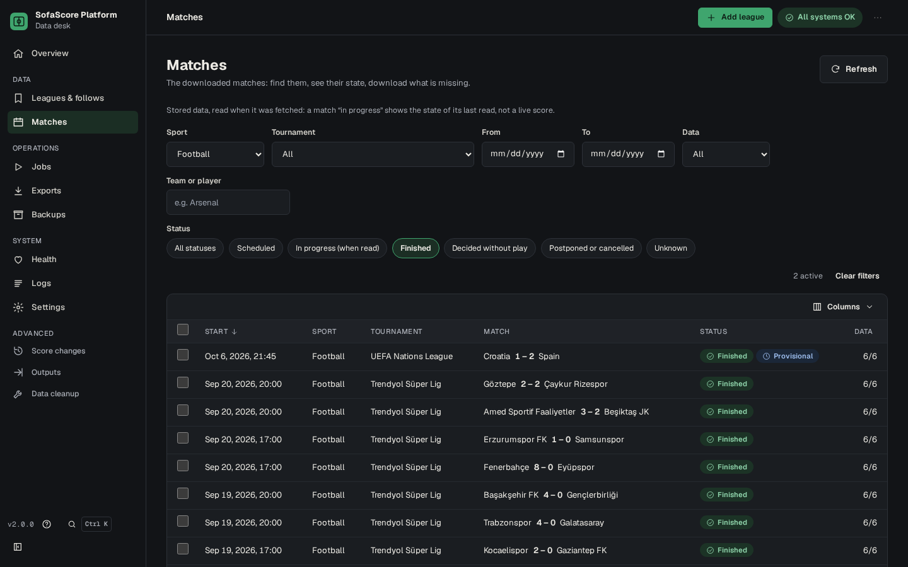

# SofaScore Scraper

[English](README.md) · **Türkçe**

[](https://github.com/tunjayoff/sofascore_scraper/actions/workflows/ci.yml)
[](LICENSE)


**SofaScore maç verileri için kendi sunucunuzda çalışan bir veri platformu.** 21 sporda ligleri, takımları, oyuncuları ya da tek tek maçları takip edin, geçmişlerini yerel bir depoya indirin ve CSV, JSONL, Parquet ya da SQLite olarak dışarı alın.

Tek çekirdek, üç yüz: bir **Python kütüphanesi**, sunucular ve otomasyon için **`ssc` komut satırı** ve üzerinde bir **web arayüzü** bulunan sürümlü bir **HTTP API**. Kendi bilgisayarınızda ya da sunucunuzda çalışır.

> **3.1.0 kaynaktan kurulan bir sürüm olarak yayımlandı.** Bir checkout'tan kurun (aşağıdaki Docker ya da pip adımları); GitHub'daki her sürümde derlenmiş web arayüzünü içeren bir kaynak arşivi de vardır, Docker imajı ise `ghcr.io/tunjayoff/sofascore_scraper`'dır. PyPI'de paket yoktur. 3.0'dan geçiyorsanız: [3.0'dan yükseltme](#30dan-yükseltme); 2.x'ten geçiyorsanız: [2.x'ten yükseltme](#2xten-yükseltme).

Resmî değildir, SofaScore ile bir bağı yoktur; bkz. [sorumluluk reddi](#sorumluluk-reddi).

**İçindekiler:** [Özellikler](#özellikler) · [Ekran görüntüleri](#ekran-görüntüleri) · [Hızlı başlangıç](#hızlı-başlangıç) · [Komut satırı](#komut-satırı-ssc) · [HTTP API](#http-api) · [Python kütüphanesi](#python-kütüphanesi) · [Yapılandırma](#yapılandırma) · [Veri ve dışa aktarma](#veri-ve-dışa-aktarma) · [Canlı izleme](#canlı-izleme) · [Güvenlik modeli](#güvenlik-modeli) · [3.0'dan yükseltme](#30dan-yükseltme) · [2.x'ten yükseltme](#2xten-yükseltme) · [SSS](#sss) · [Belgeler](#belgeler) · [Katkı](#katkı-ve-geliştirme) · [Lisans](#lisans)

## Özellikler

- **21 spor**: futbol, basketbol, tenis, Amerikan futbolu, Avustralya futbolu, buz hokeyi, hentbol, ragbi, futsal, mini futbol, florbol, voleybol, badminton, masa tenisi, padel, snooker, beyzbol, kriket, e-spor, dart ve MMA; her birinin kendi skor yapısı vardır.
- **Takipler**: bir lig (sezonlarıyla), bir takım, bir oyuncu ya da tek bir maç. SofaScore'da adla arayın ya da adresteki kimliği girin.
- **Neyin indirileceğini siz seçersiniz**: maç ayrıntıları, istatistikler, kadrolar, olaylar, karşılıklı maçlar, form ve seriler varsayılan olarak açıktır; bahis oranları, puan durumu, sezon verileri, liderler, sıralamalar ve oyuncu istatistikleri siz seçene kadar kapalıdır. Seçim her spor için, spor başına ya da takip başına yapılır.
- **İstek bütçesiyle geçmiş indirme**: varsayılan olarak tüm süreçler için toplam saniyede 5 istek; SofaScore istekleri reddetmeyi sürdürürse işi durduran bir devre kesici.
- **Depolama**: sıkıştırılmış ham yanıtlar ve yeniden kurulabilen bir katalog (SQLite); her maç durumu saklanır, SofaScore'un sonradan düzelttiği sonuçlar yeniden okunur ve kaydedilir.
- **Dışa aktarma**: normalleştirilmiş veri kümeleri (maçlar, veri türleri, skor değişiklikleri, oranlar, puan durumu) CSV, JSONL, Parquet ya da SQLite olarak; ham yanıtlar olduğu gibi; 2.x'in geniş CSV'si. Dosya adı ligin, takımın ya da oyuncunun veya veri kümesinin adından ve tarihten oluşur.
- **Yedekleme ve geri yükleme**: veri klasörünün yedeği, web arayüzünden ya da komut satırından.
- **`ssc watch` ile canlı izleme**: canlı maçlardaki değişiklikler bir olay günlüğüne ve hedeflere (stdout'a JSON satırları, bir dosya, bir webhook) gider. Web arayüzünde canlı görünüm bilerek yoktur.
- **Otomasyon**: soru sormayan, JSON çıktılı ve anlamlı çıkış kodları olan bir CLI; ortam değişkenleriyle ezilebilen bildirimsel bir yapılandırma dosyası (`sofascore.toml`); systemd birimleri ve bir Docker imajı. Uygulama içi zamanlayıcı vardır, varsayılan olarak kapalıdır.
- **Varsayılan dil İngilizce**; sistemin ya da tarayıcının dili Türkçeyse **Türkçe**.
- **Platformlar**: Linux ve Docker resmî olarak desteklenir; Windows ve macOS en iyi çaba düzeyindedir. Web arayüzü Safari 16.4, Chrome 111 ya da Firefox 128 ve üstünü ister.

## Ekran görüntüleri



| | |
|---|---|
|  |  |
| **Lig ekle**: yazarken öneriler ya da SofaScore kimliği, sonra sezonlar ve veriler. | **Bir maç**: skor, devrelere göre istatistikler, kadrolar, olaylar, oranlar ve ham veri. |
|  |  |
| **Dışa aktarımlar**: normalleştirilmiş veri, maç tablosu ya da ham yanıtlar. | Koyu temada **Maçlar**. |

Ekran görüntüleri İngilizce arayüzden alındı ve 2026-10-08'de indirilmiş gerçek SofaScore verisini gösterir.

## Hızlı başlangıç

İlk iki yoldan birini seçin, sonra web arayüzüyle devam edin.

### Docker (Compose)

```bash
git clone https://github.com/tunjayoff/sofascore_scraper.git
cd sofascore_scraper
docker compose up -d          # web arayüzü ve API: http://127.0.0.1:8000
docker compose logs -f        # uygulama günlüğünü stdout'a yazar
```

İmajda Python, derlenmiş web arayüzü ve uygulamanın ihtiyaç duyduğu başsız Chromium bulunur; veriler, yapılandırma, tarayıcı profili ve günlükler adlandırılmış birimlerde durur. Bağlantı noktası yalnızca `127.0.0.1` üzerinde açılır. Ayrıntılar (birimler, erişim anahtarı, kapsayıcıda canlı servis, tek seferlik komutlar): [docs/deploy/docker.md](docs/deploy/docker.md) (İngilizce).

### pip ve sanal ortam

Python 3.10+ ve web arayüzü için Node.js 20.19+ ya da 22.12+ gerekir.

```bash
git clone https://github.com/tunjayoff/sofascore_scraper.git
cd sofascore_scraper
python -m venv .venv
source .venv/bin/activate                            # Windows: .venv\Scripts\activate
pip install -r requirements.txt -c constraints.txt   # constraints.txt: CI'ın test ettiği sürümler
pip install -e .                                     # ssc komutu
python -m patchright install chromium --no-shell     # uygulamanın SofaScore'a ulaştığı tarayıcı
cd frontend && npm install && npm run build && cd .. # web arayüzü (yalnızca CLI ya da API için gerekmez)
ssc doctor                                           # kurulumu denetler; SofaScore'a bağlanmaz
ssc serve                                            # http://127.0.0.1:8000
```

Google Chrome kurulu olsa da tarayıcı adımı gereklidir: uygulama, masaüstünde de sunucuda da patchright'ın kendi Chromium'unu başsız olarak başlatır. Yalın bir Debian ya da Ubuntu sunucusunda `python -m patchright install-deps chromium` gereken sistem kitaplıklarını kurar. Parquet dışa aktarması için: `pip install -e ".[parquet]"`.

Masaüstü için kısayollar: `./scripts/install.sh` (Linux, macOS, Git Bash) ya da `scripts\install.ps1` (Windows) `.venv`'i oluşturur, paketleri ve tarayıcıyı kurar ve web arayüzünü derler; `./start-sofascore.sh`, `Start SofaScore.bat` ya da `Start SofaScore.command` uygulamayı başlatıp tarayıcıyı açar.

### Web arayüzünde ilk adımlar

1. `http://127.0.0.1:8000` adresini açın. **Genel bakış** bir "Nasıl başlanır" kartı gösterir.
2. **Lig ekle** (üst çubuk): lig, takım, oyuncu ya da tek maç seçin, SofaScore'da adla arayın (ya da adresindeki kimliği girin: `.../premier-league/17` içindeki `17`), sonra sezonları ve indirilecek verileri seçin. **Ekle**, **Ekledikten sonra hemen indirmeye başla** işaretini kaldırmadıysanız indirmeyi başlatır.
3. İndirmeyi **İşler**'den izleyin (üst çubuktaki gösterge çalışan işi gösterir). Durdurulan bir iş o ana kadar çekileni korur.
4. **Maçlar**'da gezinin (spor, turnuva, tarih, takım, durum ve saklanan veriye göre süzgeçler); istatistikleri, kadroları, olayları ve ham veriyi görmek için bir maçı açın.
5. Verileri **Dışa aktarımlar** → **Yeni dışa aktarım** ile dışarı alın, kopyalarını **Yedekler**'de saklayın.

**Sağlık** SofaScore bağlantısını ve istek bütçesini gösterir; **Yardım** (⋯ menüsü ya da yan menünün altındaki ?) arayüzde geçen kavramları açıklar.

## Komut satırı (`ssc`)

Sunucular, betikler ve ajanlar için. Hiç soru sormaz: sonuç stdout'a, günlük ve hatalar stderr'e gider, çıkış kodu ne olduğunu söyler. `pip install -e .` yapılmadıysa proje klasöründe `python -m sofascore_scraper.cli.main <komut>` kullanın.

| Komut | Ne yapar |
|---|---|
| `ssc doctor` | Python'u, paketleri, tarayıcıyı, klasörleri, web arayüzü derlemesini ve `.env`'i denetler |
| `ssc serve` | Web arayüzünü ve HTTP API'yi çalıştırır (`--host`, `--port`, `--scheduler`) |
| `ssc follows add tournament 17 --name "Premier League" --sport football --seasons last:2` | Bir ligi takibe alır (ayrıca `team`, `player`, `event`); `follows list`, `follows remove` |
| `ssc sync` | Etkin her takibi güncel hale getirir: sezon listeleri, fikstürler, sonra maç ayrıntıları |
| `ssc sync --dry-run` | Neyin çekileceğini ve en az kaç istek gerektiğini gösterir; istek göndermez |
| `ssc fetch event 12345678` | Verilen maçları (ya da `fetch tournament ID --season ID`) takip edilsin edilmesin çeker |
| `ssc status` | Veri özeti, deponun sağlığı, çalışan ve son iş, canlı servis |
| `ssc export --dataset events --format csv --out events.csv` | Bir veri kümesi yazar (`events`, `slices`, `changes`, `odds`, `standings`) |
| `ssc backup create` | Veri klasörünü yedekler; `backup list`, `backup verify NAME`, `backup restore NAME --yes` |
| `ssc watch --stdout` | Takip edilen canlı maçları izler, değişiklikleri JSON satırları olarak yazar |

`ssc --help` ve `ssc <komut> --help` her komutu ve seçeneği anlatır; `ssc describe` sporları, veri türlerini, komutları, şemaları, yapılandırma anahtarlarını, hata kodlarını ve çıkış kodlarını programlar için JSON olarak verir. Diğer komutlar: `refresh`, `jobs`, `events`, `data`, `config`, `catalog`, `migrate`, `diagnostics`, `version`.

- **JSON çıktı:** `--json` tek bir belge yazar (`{"ok", "command", "schema", "version", "data" | "error"}`); akışlar (`ssc events`, `ssc jobs tail`) satır başına bir JSON nesnesi yazar.
- **Çıkış kodları:** `0` başarılı ya da yapılacak iş yok · `1` genel hata · `2` kullanım ya da yapılandırma hatası · `3` kısmi başarı · `4` SofaScore engelliyor (devre kesici işi durdurdu) · `5` depolama hatası · `6` veri klasörünü başka bir süreç tutuyor · `130` / `143` Ctrl+C / SIGTERM ile iptal.
- **Veri klasörü başına tek yazıcı:** ikinci bir indirme `6` ile çıkar ve klasörü tutanı söyler; `--wait SANİYE` çıkmak yerine bekler.
- **Servis olarak:** `ssc serve`, `ssc watch` için systemd birimleri ve `ssc sync` için bir zamanlayıcı [docs/deploy](docs/deploy/README.md) klasöründedir (İngilizce).

## HTTP API

`ssc serve`, sürümlü API'yi `/api/v1` altında sunar; web arayüzü yalnızca onu kullanır. Sözleşme [docs/api/openapi-v1.json](docs/api/openapi-v1.json) dosyasındadır; çalışan sunucu onu `/docs` ve `/redoc` adreslerinde de gösterir. Sporları ve veri türlerini, takipleri ve SofaScore aramasını, turnuvaları, sezonları, veri dilimleriyle maçları, oranları ve puan durumunu, ham yanıtları, skor değişikliklerini, işleri (ilerlemesi sunucu gönderimli olaylarla), dışa aktarımları, yedekleri, ayarları, günlükleri, tanılamayı ve durumu kapsar. Tek kayıt `{"data": ...}`, liste `"page": {"limit", "next_cursor"}` ile, hata `{"error": {"code", "message", "details", "request_id"}}` olarak döner. Canlı veri için uç nokta yoktur: canlı veri diğer programlara bir webhook hedefiyle ulaşır.

```bash
curl "http://127.0.0.1:8000/api/v1/events?tournament=17&limit=5"
```

## Python kütüphanesi

CLI ve API, bir Python programının doğrudan kullanabileceği aynı servislerin üzerindeki ince katmanlardır. Henüz ayrı bir kütüphane giriş noktası yoktur; içe aktarılan paketin adı `sofascore_scraper`'dır (3.0.0'dan önce `src`'ydi). Saklanan maçları okumak şöyle görünür:

```python
from sofascore_scraper.services.query import EventFilter, QueryService
from sofascore_scraper.store import open_store

store = open_store("data")               # veri klasörü
query = QueryService(store)
for event in query.events(EventFilter(tournament_ids=(17,)), limit=5).items:
    home, away = event.participants.home, event.participants.away
    print(event.start_utc, home.name, event.score.home, "-", event.score.away, away.name)
store.close()
```

Kayıtlar veri şeması v1'e uyar ([docs/design/04-schema-v1.md](docs/design/04-schema-v1.md), İngilizce). Proje klasöründen ya da `pip install -e .` sonrasında çalıştırın.

## Yapılandırma

Yapılandırma dosyası olmadan da her şey çalışır. Bir sunucu için kurulumu `sofascore.toml` dosyasına yazın (proje klasöründe ya da `config/` içinde; ya da `--config` / `SOFASCORE_CONFIG` ile verilir):

```toml
[client]
rate = 5                  # saniyedeki istek, tüm süreçler birlikte

[defaults]
slices = ["core"]         # varsayılan veri türleri; "odds", "standings", ... eklenebilir

[[follow]]
tournament = 17
name = "Premier League"
sport = "football"
seasons = "last:2"
live = true               # ssc watch izler

[[follow]]
team = 42
name = "Arsenal"
sport = "football"
```

```bash
ssc config validate     # dosyayı ve ortamı denetler; geçersizse çıkış kodu 2
ssc config show         # her ayar, değeri ve nereden geldiği (gizli değerler maskeli)
ssc config init         # açıklamalı bir başlangıç dosyası yazdırır
ssc describe config     # her bölüm ve anahtar, JSON Schema olarak
```

- **Katmanlar**, sonraki kazanır: yerleşik varsayılan → `config/overrides.json` (web arayüzündeki **Ayarlar** sayfasının kaydettikleri) → `sofascore.toml` → ortam değişkenleri (`.env` ortama yüklenir) → komut satırı seçenekleri. Dosyanın, ortamın ya da bir seçeneğin sabitlediği değer Ayarlar sayfasında kilitli görünür.
- **Ortamla ezme**: her anahtar `SOFASCORE_<BÖLÜM>__<ANAHTAR>` biçiminde, örneğin `SOFASCORE_CLIENT__RATE=2` ya da `SOFASCORE_LIVE__SOURCE=poll` (`.env.example` hepsini listeler). 2.x'in değişken adları (`DATA_DIR`, `REQUEST_RATE_LIMIT`, `APP_LANGUAGE`, …) 3.1.0'dan beri okunmaz; dördü (`SOFASCORE_API_TOKEN`, `SOFASCORE_ALLOWED_HOSTS`, `USE_PROXY`, `PROXY_URL`) kullanımdan kalktı ve 3.2'ye kadar okunur; `ssc doctor` ve `ssc config show` hâlâ duran her birinin yeni adını söyler.
- **Gizli değerler** yalnızca ortamdan okunur: erişim anahtarı `SOFASCORE_SERVER__TOKEN` ve webhook imza anahtarları (`secret_env` değişkenin adını verir).
- **Dil**: `SOFASCORE_DISPLAY__LANGUAGE=en|tr` (ya da `[display] language`) dili sabitler; sabitlenmemişse Türkçe sistemler ve tarayıcılar Türkçe, diğerleri İngilizce görür. `--lang` tek bir komut için ayarlar; JSON çıktı hiçbir zaman çevrilmez.

## Veri ve dışa aktarma

Tüm veriler tek bir klasördedir, varsayılan olarak `data/` (`[storage] data_dir`, `SOFASCORE_STORAGE__DATA_DIR`, `--data-dir`):

```text
data/
├── .meta/catalog.db   # saklanan dosyaların dizini; yeniden kurulabilir (ssc catalog rebuild)
├── .meta/state.db     # uygulamada eklenen takipler, iş geçmişi, olay günlüğü
├── v3/                # sıkıştırılmış yanıtlar: maç başına bir klasör, sezonlar, takımlar, oyuncular
├── changes/           # SofaScore'un bitişten sonra değiştirdiği sonuçlar
├── exports/           # dışa aktarımların yazdığı dosyalar
└── backups/           # yedekler
```

- **Veri türleri** (`ssc describe slices`): `core` (istatistikler, kadrolar, olaylar, karşılıklı maçlar, form, seriler ve spora göre sayı sayı akış, kriket devreleri ya da e-spor oyunları) varsayılan olarak açıktır. `odds`, `standings`, `season`, `leaders`, `rankings` ve `players`; **Ayarlar → Veri**'de, bir takibin sayfasında, `[defaults] slices`, `[slices.<sport>]` ya da takibin `slices` alanında seçilir. Seçilmeyen veri hiç istenmez.
- **Her durum saklanır** (başlamamış, canlı, bitmiş, iptal); bir maç, sonucu hâlâ değişebilirken (varsayılan olarak başlamasından 72 saat sonrasına kadar) yeniden okunur ve her düzeltme kaydedilir.
- **Dışa aktarma**: web arayüzündeki **Dışa aktarımlar**'dan, API'den ya da CLI'dan:

```bash
ssc export --dataset events --format parquet --tournament 17 --out pl.parquet   # pyarrow gerekir
ssc export --dataset slices --format sqlite --out slices.sqlite
ssc export --dataset events --format csv --team 3071 --player 822471 --out benim.csv  # bir takımın ya da oyuncunun maçları
ssc export --schema raw --format jsonl --out raw.jsonl     # saklanan SofaScore yanıtları
ssc export --out matches.csv                               # 2.x'in geniş CSV'si
```

- **Yedekler** takipleri, iş geçmişini, olay günlüğünü, saklanan verileri ve **Ayarlar** sayfasında kaydedilen ayarları (`config/overrides.json`; proxy parolasını taşıyabildiği için böyle bir yedeği yalnızca sahibi okuyabilir) içerir; `.env` yalnızca `--include-secrets` ile eklenir. **Geri yükleme** (web arayüzünde **Yedekler** ya da `ssc backup restore NAME --yes`) yedeği denetler, sonra veri klasörünü değiştirir; kaydedilen ayarlar da onunla geri gelir (yalnızca sahibi okuyabilir) ve yeniden yüklenir. Bu ayarları taşımayan bir yedek mevcut ayarlara dokunmaz; 2.x'in yaptığı yedekler de geri yüklenir. Yedeklerin ve indirmelerin zamanlanması: [docs/deploy](docs/deploy/README.md#scheduled-downloads) (İngilizce).

## Canlı izleme

`ssc watch` canlı servistir: canlı maçları izleyen ve değişikliklerini (`live.status_changed`, `live.score_changed`, `live.stuck`) olay günlüğüne ve yapılandırılmış hedeflere yazan, ön planda çalışan bir süreç. Web arayüzünün parçası değildir. Canlı olarak işaretli bir takip yoksa 2 koduyla çıkar; `ssc watch --idle` (Compose örneği ve systemd birimi bunu kullanır) bunun yerine bekler ve takipleri her 60 saniyede bir yeniden okur. Setlerle oynanan sporlarda (tenis, masa tenisi, voleybol, badminton, padel) bir `live.score_changed` kazanılan bir settir; set içindeki bir oyun ya da sayı değildir.

```bash
ssc watch                                                    # canlı olarak işaretli takipler
ssc watch --sport football --tournament 17 --stdout          # bir ligin tüm canlı maçları
ssc events --follow --type 'live.*'                          # olay günlüğünü büyüdükçe oku
```

| Kaynak | Nasıl çalışır | Bellek |
|---|---|---|
| `page` (varsayılan) | izlenen her spor için bir tarayıcı sayfası açık tutar ve SofaScore'un kendi sayfasının açtığı anlık bildirim bağlantısını dinler | spor başına yaklaşık 1,8–2,6 GB |
| `poll` | yalnızca yoklama (30 saniyede bir), tarayıcı yok | ek bellek yok |
| `direct` (açıkça seçilir) | hafif bir istemci, sayfanın kendi bağlantısından okunan ve yalnızca bellekte tutulan kimlik bilgisiyle anlık bildirim sunucusuna kendisi bağlanır | yaklaşık 0,2 GB |

Yoklama her zaman yedek yoldur. **`direct` sizin yerinize hiçbir zaman seçilmez**: yalnızca `--source direct`, `[live] source = "direct"` ya da `SOFASCORE_LIVE__SOURCE=direct` onu seçer. Seçmeden önce bilin:

1. SofaScore'un kendi istemci kimlik bilgisini sitenin istemcisi dışında kullanır;
2. kimlik bilgisi ya da sunucu değiştiğinde haber vermeden bozulabilir;
3. IP adresinizin engellenmesine yol açabilir;
4. kullanım koşulları açısından bilerek seçtiğiniz bir gri alandır.

Hedefler `sofascore.toml` içinde `[[sink]]` tablolarıdır (`stdout`, `file` ya da HMAC imzalı `webhook`). Servisi systemd ya da Docker altında çalıştırma ve her kaynağın bellek ihtiyacı: [docs/deploy/watch.md](docs/deploy/watch.md) (İngilizce).

## Güvenlik modeli

Web arayüzünde **kullanıcı hesabı yoktur** ve varsayılan olarak `127.0.0.1` üzerinde dinler. Onu bir ağa açmak kuranın kararı ve sorumluluğudur:

- `SOFASCORE_SERVER__TOKEN`'ı uzun, rastgele bir değere ayarlayın (bundan sonra her `/api` isteği `Authorization: Bearer <token>` ya da web arayüzünün oturum çerezini ister);
- uygulamaya hangi adlarla ulaşıldığını `SOFASCORE_SERVER__ALLOWED_HOSTS` içinde listeleyin (`ssc serve --host 0.0.0.0` bu liste olmadan başlamaz);
- önüne bir güvenlik duvarı ya da VPN ve TLS (bir ters vekil sunucu) koyun.

Uygulama yalnızca izin verilen sunucu adlarına yanıt verir, başka sitelerin gönderdiği durum değiştiren istekleri reddeder, sıkı bir Content-Security-Policy gönderir, anahtarsız açıldığında uyarır ve `.env`'i, ayar dosyasını ve tarayıcı profilini yalnızca sahibinin okuyabileceği biçimde tutar. Ayrıntılar: [docs/deploy](docs/deploy/README.md#access-token) (İngilizce).

## 3.0'dan yükseltme

```bash
git pull
pip install -r requirements.txt -c constraints.txt
pip install -e .
cd frontend && npm install && npm run build && cd ..
ssc doctor                # hâlâ verilmiş her 2.x ayar adını söyler
```

Docker Compose ile: `git pull`, ardından `docker compose pull` (ya da `docker compose build`) ve `docker compose up -d`.

- **2.x ortam adlarını yeniden adlandırın.** 3.1.0 `DATA_DIR`, `REQUEST_RATE_LIMIT`, `APP_LANGUAGE`, `LOG_LEVEL` ve öteki 2.x adlarını, nerede verilmiş olurlarsa olsunlar (`.env`, kabuk, bir servis dosyası, konteyner ayarları), artık okumaz; yerlerine varsayılan geçerlidir: eski bir `DATA_DIR` uygulamayı varsayılan veri klasöründe bırakır. Dördü ise kullanımdan kalktı: `SOFASCORE_API_TOKEN`, `SOFASCORE_ALLOWED_HOSTS`, `USE_PROXY` ve `PROXY_URL` 3.1'de bir uyarıyla hâlâ çalışır, 3.2'de kaldırılır; yeni adı da verilmişse yenisi geçerlidir. `SOFASCORE_<BÖLÜM>__<ANAHTAR>` adlarını kullanın (`SOFASCORE_STORAGE__DATA_DIR`, `SOFASCORE_SERVER__TOKEN`, `SOFASCORE_SERVER__ALLOWED_HOSTS`, `SOFASCORE_CLIENT__PROXY`, …). `ssc doctor` ve `ssc config show` hâlâ verilmiş her eski adı yeni adıyla ve nerede verildiğiyle listeler; `ssc config init --from-legacy > sofascore.toml` eski ayarları bir yapılandırma dosyası olarak yazar.
- **Katalog ilk açılışta yeniden kurulur** (katalog şeması 2): `catalog.db` saklanan dosyalardan bir kez, SofaScore'a istek göndermeden yeniden kurulur; büyük bir veri klasöründe ilk başlangıç bu yüzden daha uzun sürer.
- **Kaldırılanlar**: `main.py` seçenekleri (eski bir seçenek, yerine geçen `ssc` komutunu söyleyen bir kullanım hatasıdır), `/api/...` altındaki 2.x yolları (404 döner; yerine `/api/v1`) ve `config`, `seasons`, `matches`, `match_details` yedek kapsamları (yerlerine `all`, `state` ya da `data`; eski yedekler yine geri yüklenir). 3.0.0'dan önce derlenmiş bir web arayüzü sıkı Content-Security-Policy altında çalışmaz: yeniden derleyin.
- **`ssc export` dosya adları**: `--out` verilmezse dosya bir web dışa aktarması gibi adlandırılır (`exports/premier-league_2026-10-09_142530.jsonl`); geniş CSV `all_matches_<epoch>.csv` yerine `match_details/processed/events-wide_<tarih>_<saat>.csv` olur.

Tam liste [CHANGELOG.md](CHANGELOG.md#310---2026-10-09) dosyasındadır (İngilizce).

## 2.x'ten yükseltme

```bash
git pull
pip install -r requirements.txt -c constraints.txt
pip install -e .          # her güncellemeden sonra yeniden: içe aktarılan paket artık sofascore_scraper
cd frontend && npm install && npm run build && cd ..
ssc migrate --dry-run     # isteğe bağlı: yeni düzene neyin taşınacağı
```

- **Veriler**: hiçbir şey kendiliğinden taşınmaz. Eski veriler bulundukları yerden okunur; yeni yazmalar yeni düzeni kullanır. `ssc migrate` eski klasörleri dönüştürüp doğrular ve eskilerini korur; `ssc migrate --delete-legacy --yes` doğrulanmış eski kopyaları sonradan siler.
- **Terminal menüsü kaldırıldı.** `python main.py` argümansız çalıştırılınca kısa bir yardım yazar ve `2` ile çıkar. Web arayüzünü ya da betikler için `ssc`'yi kullanın.
- **İçe aktarılan paket `sofascore_scraper`'dır** (önceden `src`'ydi ve takma adı yoktur): kendi systemd birimleriniz ve betikleriniz `python -m src.cli.main` yerine `python -m sofascore_scraper.cli.main` çalıştırır, kütüphane kodu `sofascore_scraper`'ı içe aktarır.
- **3.1.0'da kaldırılanlar** (3.0.0'da kullanımdan kalkmıştı): `main.py` seçenekleri (kullanım hatası her birinin yerine geçen komutu söyler: `--headless --update-all` `ssc sync`, `--refresh-only` `ssc refresh`, `--watch` `ssc watch --source poll --stdout`, `--web` `ssc serve`, …), `/api/...` altındaki 2.x yolları (yerine `/api/v1`), `config`, `seasons`, `matches`, `match_details` yedek kapsamları (yerlerine `all`, `state` ya da `data`; eski yedekler yine geri yüklenir) ve 2.x'in ortam adları (dördü kullanımdan kalktı ve 3.2'ye kadar okunur; bkz. [3.0'dan yükseltme](#30dan-yükseltme)). Çıkış kodları yeni tabloya uyar (devre kesicinin durdurduğu iş artık `2` değil `4`).
- **Ayarlar**: `.env`'deki 2.x adlarını yeniden adlandırın (`ssc doctor` her birini yeni adıyla listeler) ya da eski `.env`'i ve `config/leagues.txt`'yi bir yapılandırma dosyası olarak yazan `ssc config init --from-legacy > sofascore.toml` komutunu çalıştırın. `config/leagues.txt`'deki ligler indirilmeye devam eder; ligin sayfasındaki **Buraya taşı** onu uygulamaya taşır.

Değişikliklerin tam listesi [CHANGELOG.md](CHANGELOG.md) dosyasındadır (İngilizce).

## SSS

**Bu resmî bir SofaScore API'si mi?**
Hayır. SofaScore web sitesinin oturum açmadan gösterdiği herkese açık verileri, sitenin yaptığı gibi bir tarayıcı üzerinden okur. SofaScore ile bağlantılı değildir, onun tarafından onaylanmamıştır. İstek bütçesini düşük tutun; SofaScore'un kullanım koşullarına ve bulunduğunuz yerin yasalarına uyun.

**Neden Chromium gerekiyor?**
SofaScore düz HTTP istemcilerini reddeder; bu yüzden uygulama isteklerini başsız bir tarayıcı sayfasından (patchright'ın Chromium'u) gönderir ve sitenin doğrulamasını orada geçer. Kurulu bir Google Chrome kullanılmaz. `ssc doctor` tarayıcının kurulu olduğunu ve başladığını denetler.

**Bir indirme ne kadar sürer?**
Varsayılan veri türleriyle bir futbol maçı 7 istek tutar; 380 maçlık bir sezon yaklaşık 2.700 istektir, varsayılan saniyede 5 istekle kabaca 9 dakika. Bütçeyi yükseltmek (`--rate`, **Ayarlar → İstekler**) hızlandırır ama engellenme olasılığını artırır.

**Web arayüzünde canlı skorları görebilir miyim?**
Hayır, bilerek böyle: web arayüzü saklanan veriyi gösterir. Canlı değişiklikler programlar içindir: webhook, dosya ya da stdout hedefiyle `ssc watch`. Bir maçı kendiniz izlemek için SofaScore'u kullanın.

**Bir sezon 0 maç indiriyor. Neden?**
Çoğunlukla en yeni sezonda yalnızca fikstür vardır ve maç ayrıntıları maç bittikten sonra indirilir. Önceki sezonu seçin ya da bekleyin. SofaScore sezonu yeniden numaralandırdıysa `ssc sync --tournament ID --only seasons` sezon listesini yeniden okur.

**İndirmeler başarısız oluyor ya da 4 koduyla duruyor. Ne yapmalıyım?**
SofaScore istekleri reddediyor ve devre kesici işi durdurdu. **Sağlık** sayfasına (ya da `ssc status`'a) bakın, istek bütçesini düşürün ve sonra yeniden deneyin. Hata bildirimine `ssc diagnostics` ile ya da **Günlükler** sayfasından alınan paketi ekleyin; gizli değerler maskelidir ama göndermeden önce okuyun.

**Bir NAS'ta ya da sunucuda çalıştırıp dizüstü bilgisayarımdan kullanabilir miyim?**
Evet, Docker ya da systemd birimleriyle. Önce erişim anahtarını ve izin verilen sunucu adlarını ayarlayın ve önüne TLS koyun ([Güvenlik modeli](#güvenlik-modeli), [docs/deploy](docs/deploy/README.md)).

## Belgeler

| Nerede | Ne var |
|---|---|
| `ssc --help`, `ssc describe` | Her komut, seçenek, veri türü, yapılandırma anahtarı, hata kodu ve çıkış kodu |
| [docs/deploy/README.md](docs/deploy/README.md) | Sunucular: systemd, erişim anahtarı, ters vekil sunucu, zamanlanmış indirmeler, yedekler, `ssc migrate` |
| [docs/deploy/docker.md](docs/deploy/docker.md) | Docker imajı ve Compose dosyası |
| [docs/deploy/watch.md](docs/deploy/watch.md) | Canlı servisin bir servis olarak çalıştırılması, kaynakları ve belleği |
| [docs/api/openapi-v1.json](docs/api/openapi-v1.json) | HTTP API sözleşmesi (çalışan sunucuda `/docs` adresinde de) |
| [docs/design/04-schema-v1.md](docs/design/04-schema-v1.md) | API'nin ve dışa aktarımların veri şeması, alan alan |
| [docs/design/README.md](docs/design/README.md) | 3.0.0 platformunun tasarımı |
| [frontend/README.md](frontend/README.md) | Web arayüzünün kodu |
| [CHANGELOG.md](CHANGELOG.md) | Sürüm sürüm değişiklikler |

Bu README dışındaki belgeler İngilizcedir.

## Katkı ve geliştirme

Hata bildirimleri ve çekme istekleri memnuniyetle karşılanır; büyük bir değişiklik için önce bir konu (issue) açın. Çekme isteklerini odaklı tutun ve kullanıcının gördüğü bir metni değiştirdiğinizde iki dili de güncelleyin (web arayüzü için `frontend/src/locales/`, komut satırı için `locales/en.json` ve `locales/tr.json`, iki README).

```bash
pip install -r requirements-dev.txt -c constraints.txt
ruff check .
python -m pytest -q                     # SofaScore'a bağlanmaz; canlı testler isteğe bağlıdır (-m live)
ssc serve --dev                         # kod değişince yeniden yüklenir
cd frontend && npm run dev              # http://localhost:5173, /api'yi 127.0.0.1:8000'e yönlendirir
```

CI, ruff'ı ve Python testlerini (Linux'ta Python 3.10 ve 3.14 ile; Windows ve macOS en iyi çaba düzeyinde), web arayüzünün lint, test ve derlemesini çalıştırır. Sürüm tek bir yerde, `pyproject.toml` içinde belirlenir.

**Sürüm yayımlama** (bakımcı için): `pyproject.toml` içindeki sürümü ayarlayın, `CHANGELOG.md` içindeki `## [Unreleased]` başlığını sürüm ve tarihle değiştirin, `python scripts/release.py check-tag vX.Y.Z` ve `python scripts/release.py notes` ile denetleyin, sonra `vX.Y.Z` etiketini gönderin. Sürüm iş akışı test eder, derler, Docker imajını `ghcr.io/tunjayoff/sofascore_scraper` adresine ve derlenmiş web arayüzüyle birlikte GitHub sürümünü yayımlar.

Bir katkı gönderdiğinizde, katkının projenin lisansıyla lisanslanmasını ve bakımcının onu başka koşullarla da (örneğin ticari bir lisansla) sunabilmesini kabul etmiş olursunuz.

## Lisans

[PolyForm Noncommercial 1.0.0](LICENSE): **ticari olmayan amaçlarla** (kişisel kullanım, öğrenim, araştırma, hobi projeleri, hayır kurumları, eğitim kurumları, kamu kurumları) kullanabilir, değiştirebilir ve paylaşabilirsiniz. Ticari kullanım ayrı bir lisans gerektirir; bir konu açarak ya da [@tunjayoff](https://github.com/tunjayoff) ile iletişime geçerek sorun. Bu lisanstan önce yayımlanmış sürümler MIT lisansıyla kullanılabilir olmaya devam eder.

## Sorumluluk reddi

Bu resmî olmayan bir araçtır; SofaScore ile bağlantılı değildir, onun tarafından onaylanmamış ya da desteklenmemiştir. SofaScore web sitesinin oturum açmadan herkese açık gösterdiği verileri okur ve hiçbir oturum bilgisi saklamaz. Nasıl kullandığınızdan siz sorumlusunuz: SofaScore'un kullanım koşullarına uyun, engellenme riskini kabul etmiyorsanız varsayılan istek bütçesini koruyun ve paylaşma hakkınız olmayan verileri yeniden dağıtmayın.
