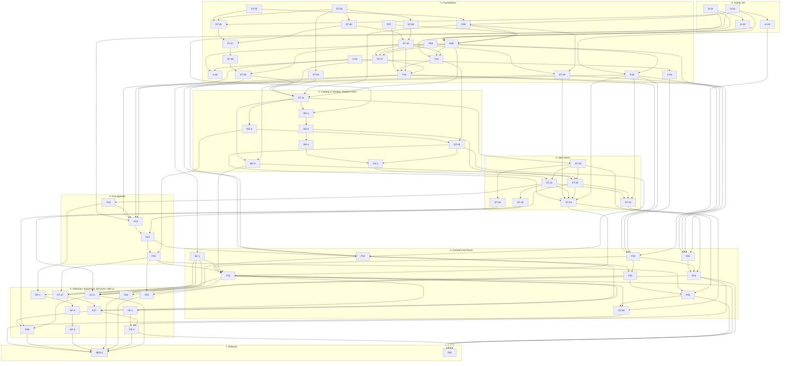

# 03 — Implementation plan

Status: reconciled plan for platform 3.0.0, 2026-10-01. Baseline: `origin/main` at `3ae2599`.
This is the one ordered list of pull requests for `01-storage.md` and `02-services.md`. It replaces the two
separate PR lists the designs were drafted with; section 12 maps the old ids to the ids used here.

The plan has 67 pull requests. Each has an id, a lane, its dependencies, the files it owns, the
behaviour change it makes (if any), a size (S: up to about 200 changed lines, M: up to about 600, L: more)
and a brief that an implementer can work from without reading the other briefs.

## 1. Before anything else

Three pull requests are open and stacked on each other: #24 (`feat/log-files-diagnostics`), #23
(`fix/blocked-state-ux`, contains #24) and #32 (`chore/post-wave2`, contains both). Together they change
`main.py`, `src/config_manager.py`, `src/logger.py`, `src/utils.py`, `src/season_fetcher.py`, `src/doctor.py`,
`src/web/app.py`, four route modules, `tests/conftest.py`, the installers, the CI workflow and the changelog.
Plan items that own one of those files are marked **after open PRs** below and must not start before the
three are merged. Everything else in the first batch can start now.

## 2. Rules for every pull request

1. **Goldens first.** A PR that moves or rewrites code names the golden or characterization test that pins the
   behaviour, and that test is merged before it. If output changes, the PR text lists every difference.
2. **One owner per file at a time.** A PR edits only the files it owns. Two PRs that are not ordered by a
   dependency never own the same file. Exceptions, where a conflict is trivial and resolved by rebasing:
   `CHANGELOG.md`, the READMEs, `.env.example`, the locale files, `pyproject.toml`, the per-module ratchet files under
   `tests/store_boundary/baseline/`, the per-class API snapshots under `tests/fixtures/store_api/`, and the
   generated `docs/api/openapi-v1.json` (regenerate it after a rebase).
3. **Behaviour changes are stated.** A PR whose behaviour-change field is not "none" says so in its title or
   first paragraph and adds a changelog entry.
4. **No network.** No test and no design step sends a request to SofaScore. Tests use the fake transport of G-01.
5. **The coverage floor holds** (`pyproject.toml`, `fail_under = 53`). A PR that deletes tested code moves its
   tests instead of dropping them.
6. **Three platforms.** CI runs Linux (Python 3.10 and 3.14), Windows and macOS (3.14). Store, lease and file
   tests must pass on all of them.
7. **Docs travel with the code.** A PR that changes something these design documents describe updates the
   document in the same PR.

## 3. Phases

| Phase | Content | Plan items |
|---|---|---|
| 0. Safety net | Golden and characterization tests of today's behaviour. Tests only. | G-01, G-02, G-03, G-04 |
| 1. Foundations | Store core, catalog, state db, leases, client facade, config, job manager, CLI skeleton, the small defaults. Additive or behaviour-preserving, except where a PR says otherwise. | ST-02, ST-03, P07, P09, X-01, X-02, X-03, ST-04, ST-05, ST-06, ST-09, P05, ST-07, ST-10, P08, P18, ST-08, ST-17, ST-18, P10, ST-30, P11 |
| 2. Catalog in shadow; readers move | Existing writers keep the catalog current; every reader moves once, into a service that reads the Store. The on-disk layout does not change. | ST-11, RD-1, RD-4, RD-5, RD-2, ST-19, RD-3, EX-1 |
| 3. New layout | The v3 writer, the switch of the writers, migrate, backup format 2 and restore, raw export. | ST-20, ST-26, ST-22, ST-21, ST-23, ST-24, ST-25 |
| 4. One pipeline | Need computation, the unified fetch pipeline, listings as typed work, removal of the old fetcher modules. | P12, P13, P14, P15 |
| 5. Contract and faces | Schema v1, API v1 with legacy adapters, the CLI, sinks, the live service (polling), removal of the terminal UI and of the transition code. | SC-1, P20, P22, P19, P23, P21, P25, P26, ST-28 |
| 6. Selection, expansion, live push, web UI | All statuses, selectable slices, normalized exports, 18 more sports, odds and non-match data, the push source, the scheduler, the web UI. | ST-27, P27, SC-2, SP-1, SP-2, SP-3, P28, P24, P29, FE-1, FE-2 |
| 7. Release | The optional package rename before the release candidate, and the 3.1 clean-up. | REN-1, P30 |

The owner's waves (`00-platform.md` section 10) map onto the phases like this: wave 3 is phases 0 to 4; wave 4
is SC-1, P20, P21, ST-27, P27, ST-25 and SC-2; wave 5 is SP-1 to SP-3, ST-26 and P28; wave 6 is P18, P19, P22
to P26, P29, FE-1 and FE-2. One wave-6 item starts early because other work stands on it: the CLI skeleton
(P18) provides the error table and the command registry that `migrate` (ST-23), `backup` (ST-24) and API v1
(P20) use. The wave of each item is in the table of section 9.

## 4. Dependency diagram

An arrow points from a pull request to one that needs it. Only direct dependencies are drawn.

## 5. What can start when

**First batch — can start immediately and in parallel.** These five own disjoint files, depend on nothing and
touch no file of the open pull requests:

- **G-01** test: fake SofaScore transport and fetch-flow goldens (M; lane `goldens-fetch`)
- **G-02** test: legacy fixture factory and data-reader goldens (M; lane `goldens-read`)
- **ST-02** refactor: slice outcome and presence predicates in src/slices.py (S; lane `fetcher`)
- **ST-03** store: core modules (errors, codec, files, layout, manifest) (M; lane `store`)
- **P07** jobs: progress and job model in src/jobs (S; lane `jobs`)

**As soon as #24, #23 and #32 are merged** these two join the first batch (no dependencies, but they own files
the open pull requests change): **P09**, **X-01**.

**Readiness levels.** A pull request of level *n* can start when its dependencies, all of a lower level, are
merged. Pull requests on the same level can run in parallel; pull requests in the same lane are sequential.

| Level | Pull requests |
|---|---|
| 1 | G-01, G-02, ST-02, ST-03, P07, P09, X-01 |
| 2 | G-03, G-04, X-02, X-03, ST-04, ST-05, ST-06, ST-09, P05 |
| 3 | ST-07, ST-10, P08, P18 |
| 4 | ST-08, ST-17, ST-18, P10 |
| 5 | ST-30, P11 |
| 6 | ST-11, SC-1, P20, P22 |
| 7 | RD-1, RD-4, RD-5, ST-20 |
| 8 | RD-2, ST-19, ST-26, P23 |
| 9 | RD-3, ST-22, P24 |
| 10 | EX-1 |
| 11 | ST-21 |
| 12 | ST-23, ST-24, ST-25, P12 |
| 13 | P13, SP-1 |
| 14 | P14, SP-2 |
| 15 | P15, P19, SP-3 |
| 16 | P21, P25 |
| 17 | ST-27, P26, SC-2, P29, FE-1 |
| 18 | P27, ST-28 |
| 19 | P28, FE-2 |
| 20 | REN-1, P30 |

## 6. File ownership chains

The files below are edited by many pull requests. Each chain is the only order in which they may be touched;
the dependencies in section 10 enforce it.

| File | Order of owners |
|---|---|
| `src/match_data_fetcher.py` | ST-02 → P05 → ST-11 → RD-1 → RD-3 → EX-1 → ST-21 → P12 → P13 → P15 |
| `src/match_fetcher.py` | P05 → ST-11 → ST-22 → P14 → P15 |
| `src/season_fetcher.py` | P05 → ST-11 → RD-5 → ST-22 → P14 → P15 |
| `src/web/routes/matches.py` | ST-10 → RD-1 → RD-2 → RD-3 → P13 → P21 |
| `src/web/routes/data.py` | P08 → ST-11 → RD-4 → ST-19 → EX-1 → P21 |
| `src/web/routes/leagues.py` | P05 → P08 → RD-5 → P21 |
| `src/web/fetch_job.py` | P08 → P11 → P13 → P21 |
| `main.py` | ST-10 → P10 → P11 → P19 → P26 |
| `src/config_manager.py` | P09 → ST-17 |
| `src/watcher.py` | P05 → ST-18 → P23 → P30 |
| `src/services/sync.py` | P08 → P10 → P13 → P14 |
| `src/services/context.py` | P08 → ST-17 → P11 → P15 |
| `src/services/query.py` | RD-1 → RD-2 → RD-3 → P21 → ST-27 → P30 |
| `src/services/planning.py` | P12 → P13 → P14 → ST-27 → P27 → P28 |
| `src/store/events.py` | ST-30 → ST-20 → ST-26 |
| `src/store/api.py` | ST-10 → ST-30 → ST-11 → ST-19 |
| `src/store/jobs.py` | ST-09 → ST-10 → P11 |
| `src/store/indexer.py` | ST-07 → ST-08 → ST-11 → ST-26 |
| `tests/conftest.py` | ST-04 → ST-11 |
| `src/sports.py` | P12 → P27 → P28 |

`src/sports.py` is also edited by SP-1 to SP-3 (new sport entries) while P27 and P28 edit its slice table, and
`src/schema/models.py` and `mappers.py` get score models from SP-1 to SP-3 and odds models from P28. They touch
different parts of those files; whichever merges second rebases.

## 7. Where golden and characterization tests come first

| Before this work starts | These tests must be merged |
|---|---|
| any change to the request layer or the fetch flows (P05, P08, P10, P13, P14) | G-01 (fake transport, request sequences, the divergence table pinned row by row) |
| any reader moving to the catalog (ST-05, RD-1 to RD-5, EX-1) and the legacy API adapters (P21) | G-02 (fixture directories in every legacy form, reader goldens) |
| any change to `main.py` behaviour (P10, P19) | G-03 (stdout, stderr, exit code and files per flag) |
| API v1 and the legacy adapters (P20, P21) | G-04 (legacy OpenAPI snapshot, remaining routes) |
| any Store write path being used (ST-21, ST-22, ST-23) | the logical dump (ST-05, extended in ST-20), rebuild equivalence and crash injection (ST-20) |
| any PR that removes a boundary violation | ST-04 (the ratchet) |
| the first reader of the catalog (RD-1) | ST-11 (the shadow check: catalog equals a rebuild after every test that writes) |
| the pipeline (P13) | the divergence tests of G-01, flipped one by one inside P13 with each change named |
| the live service (P23) | the reducer goldens taken from `tests/test_watcher.py` scenarios, written first inside P23 |

## 8. Release points

| Point | After | What it is | Check before tagging |
|---|---|---|---|
| A. Optional 2.x release | RD-1 to RD-5, ST-19, EX-1 (and everything before them) | The on-disk layout is unchanged; lists, search and "what is missing" run from the catalog; one writer per data directory across processes. Fully reversible: deleting `.meta/catalog.db`, `.meta/state.db` and `.meta/schema.json` returns the directory to its previous state | Reader goldens identical or every difference approved; the owner's real data directory indexes without reported errors |
| B. 3.0.0 alpha | ST-21, ST-22, ST-23, ST-24, ST-25 | New data is written in the v3 layout; `migrate`, backup format 2 and restore exist. From here a downgrade to 2.x no longer sees newly written data | `migrate --dry-run` and a full `migrate` on a copy of the owner's data: logical dump equal, `verify --deep` clean; backup and restore round trip |
| C. 3.0.0 beta | P13 to P15, P19, P20, P21, P22, P23, P25, P26, ST-28 | One pipeline, the CLI, API v1 with the legacy adapters, sinks, the polling live service; the terminal UI is gone | Idempotency golden (a second sync makes no detail requests); exit-code tests; OpenAPI snapshot; the current web UI still works on the legacy adapters |
| D. 3.0.0 release candidate | ST-27, P27, SC-2, SP-1 to SP-3, P28, P24, P29, FE-2, then REN-1 | Feature complete: all statuses, selectable slices, 21 sports, odds and non-match data, push, the new web UI | The whole suite on three platforms; Docker smoke test; changelog lists every behaviour change of this plan |
| E. 3.1 | P30 | Aliases, legacy routes and shims removed | One release has shipped with the deprecation notices |

Do not cut a release between ST-21 and P26 without the notice ST-21 adds to the terminal UI: in that window its
data menus see only the old layout.

## 9. Plan table

| # | Id | Title | Lane | Depends on | Size | Wave | After open PRs | Behaviour change |
|---|---|---|---|---|---|---|---|---|
| 1 | G-01 | test: fake SofaScore transport and fetch-flow goldens | `goldens-fetch` | — | M | 3 | no | none |
| 2 | G-02 | test: legacy fixture factory and data-reader goldens | `goldens-read` | — | M | 3 | no | none |
| 3 | G-03 | test: CLI goldens for today's main.py flags | `goldens-fetch` | G-01 | M | 3 | yes | none |
| 4 | G-04 | test: legacy OpenAPI snapshot and goldens of the remaining routes | `goldens-read` | G-02 | S | 3 | yes | none |
| 5 | ST-02 | refactor: slice outcome and presence predicates in src/slices.py | `fetcher` | — | S | 3 | no | none |
| 6 | ST-03 | store: core modules (errors, codec, files, layout, manifest) | `store` | — | M | 3 | no | none |
| 7 | P07 | jobs: progress and job model in src/jobs | `jobs` | — | S | 3 | no | none |
| 8 | P09 | config: Settings model and loader (file, environment, legacy) | `config` | — | M | 3 | yes | none |
| 9 | X-01 | defaults: request rate 5 per second | `defaults` | — | S | 3 | yes | **yes** |
| 10 | X-02 | defaults: English by default, Turkish when the system language is Turkish | `config` | P09, X-01 | S | 3 | yes | **yes** |
| 11 | X-03 | security: basic response headers | `defaults` | X-01 | S | 3 | yes | **yes** |
| 12 | ST-04 | test: Store boundary, layering and API-surface tests with a ratchet | `store-guard` | ST-03 | M | 3 | yes | none |
| 13 | ST-05 | store: read-only legacy layout reader | `store-legacy` | G-02, ST-02, ST-03 | M | 3 | no | none |
| 14 | ST-06 | store: catalog schema, connections, derive, query-plan tests | `store` | ST-03 | M | 3 | no | none |
| 15 | ST-09 | store: state.db, migration runner, job store on it | `state` | ST-03 | M | 3 | no | none |
| 16 | P05 | client: one Client facade over the request layer | `fetcher` | G-01, ST-02 | M | 3 | yes | **yes** |
| 17 | ST-07 | store: indexer for events and slices; rebuild and verify | `store` | ST-05, ST-06 | L | 3 | no | none |
| 18 | ST-10 | store: leases and the Store facade; writer lease for jobs and CLI | `state` | ST-06, ST-09 | M | 3 | yes | **yes** |
| 19 | P08 | services: SyncService carrying today's web flow; web stops importing the terminal UI | `services` | G-01, G-02, P05, P07 | M | 3 | yes | none |
| 20 | P18 | cli: command skeleton, output rules, exit codes | `cli` | G-03, P09 | M | 6 | yes | **yes** |
| 21 | ST-08 | store: indexer for schedules, season lists, listing rows and the change log; reconcile | `store` | ST-07 | L | 3 | no | none |
| 22 | ST-17 | store: follows table as a mirror of the league files and the config file | `state` | ST-10, P09, P08 | M | 3 | yes | none |
| 23 | ST-18 | store: watcher state and event streams | `streams` | ST-10, P05 | M | 3 | via dependencies | none |
| 24 | P10 | cli: headless paths call SyncService (no terminal-UI object) | `services` | G-03, P08, ST-10 | M | 3 | yes | **yes** |
| 25 | ST-30 | store: read API (events, entities, slices, planning queries) | `store` | ST-08, ST-10 | M | 3 | via dependencies | none |
| 26 | P11 | jobs: cross-process job manager (heartbeat, cancel, job events, partial state) | `jobs` | P07, P10, ST-10, ST-17 | L | 3 | yes | **yes** |
| 27 | ST-11 | store: shadow mode, existing writers keep the catalog current | `store` | ST-30, ST-04, P05, P08 | M | 3 | yes | none |
| 28 | SC-1 | schema: normalized schema v1 (models, mappers, JSON Schema) | `contract` | ST-30 | L | 4 | via dependencies | none |
| 29 | RD-1 | readers: match detail and path lookups through the Store | `fetcher` | ST-11, G-02 | S | 3 | via dependencies | none |
| 30 | RD-4 | readers: statistics and dashboard from the catalog | `status` | ST-11 | M | 3 | via dependencies | **yes** |
| 31 | RD-5 | readers: season lists and league sport inference from the catalog | `seasons` | ST-11, ST-17 | M | 3 | yes | **yes** |
| 32 | ST-20 | store: v3 writer (put, observe, promotion), not yet used | `store` | ST-11 | L | 3 | via dependencies | none |
| 33 | P20 | api v1 foundation: error model, router, access token, OpenAPI snapshot | `api` | P11, P18, X-03, G-04 | M | 4 | yes | **yes** |
| 34 | P22 | sinks: dispatcher, stdout, file and webhook sinks; `events` command | `live` | P09, P11, P18, ST-18 | M | 6 | via dependencies | **yes** |
| 35 | RD-2 | readers: match lists from the catalog | `fetcher` | RD-1 | M | 3 | via dependencies | none |
| 36 | ST-19 | services: backup and clear through the Store | `status` | RD-4, P10 | M | 3 | via dependencies | none |
| 37 | ST-26 | store: slice history (versioned slices for odds) | `store` | ST-20 | M | 5 | via dependencies | none |
| 38 | RD-3 | readers: missing details, need classification, refresh candidates from the catalog | `fetcher` | RD-2 | M | 3 | via dependencies | none |
| 39 | EX-1 | services: legacy CSV export as an ExportService profile reading the Store | `fetcher` | RD-3, ST-19 | L | 3 | via dependencies | **yes** |
| 40 | ST-22 | store: schedule and season writers use the Store | `seasons` | RD-2, RD-5, ST-20 | M | 3 | yes | **yes** |
| 41 | ST-21 | store: detail writers use the Store (new matches are written in the v3 layout) | `fetcher` | EX-1, ST-20 | L | 3 | via dependencies | **yes** |
| 42 | ST-23 | store: migrate command (convert, verify, optional delete) | `migrate` | ST-21, ST-22, P18 | L | 3 | via dependencies | **yes** |
| 43 | ST-24 | store: backup format 2, restore, retention | `status` | ST-19, ST-18, ST-21, ST-22, P18 | M | 3 | via dependencies | **yes** |
| 44 | ST-25 | store: raw export and row writers (JSONL, CSV, SQLite, Parquet) | `export` | ST-21 | M | 4 | via dependencies | none |
| 45 | P12 | domain: need computation in services/planning.py; SliceSpec fields | `fetcher` | ST-21 | M | 3 | via dependencies | none |
| 46 | P13 | pipeline: one event fetch pipeline replaces the async and sync paths | `fetcher` | G-01, P11, P12, X-01, ST-18 | L | 3 | via dependencies | **yes** |
| 47 | P14 | pipeline: season lists and schedules as typed listing work | `fetcher` | P13, ST-22 | L | 3 | yes | **yes** |
| 48 | P15 | retire match_data_fetcher.py; coverage as a service | `fetcher` | P14, RD-4 | M | 3 | via dependencies | none |
| 49 | P19 | cli: data commands, signals, single-instance behaviour, main.py shim | `cli` | P11, P14, P18, ST-19 | L | 6 | yes | **yes** |
| 50 | P23 | live service (polling): supervisor, reducer, sequenced events, SSE, `watch` | `live` | P22, P20, ST-20 | L | 6 | via dependencies | **yes** |
| 51 | P21 | api v1 resources and legacy adapters | `api` | P15, P20, SC-1, RD-5, ST-24 | L | 4 | yes | **yes** |
| 52 | P25 | serve command, launchers and Docker entrypoint | `cli` | P19, P20 | M | 6 | yes | **yes** |
| 53 | ST-27 | store every match status; refresh events a newer listing disagrees with | `contract` | P15, SC-1, P21 | M | 4 | yes | **yes** |
| 54 | P26 | remove the terminal menu UI | `cli` | P25, P15, ST-24 | M | 6 | yes | **yes** |
| 55 | P27 | user-selectable slices, end to end | `contract` | ST-27, P21, P19 | M | 4 | via dependencies | **yes** |
| 56 | SC-2 | export: normalized datasets in JSONL, CSV, Parquet and SQLite | `export` | SC-1, ST-25, P19, P21 | M | 4 | via dependencies | **yes** |
| 57 | ST-28 | remove the transition code; boundary tests become strict | `store-guard` | P26, P21, ST-23 | S | 6 | via dependencies | none |
| 58 | SP-1 | sports: eight period-based sports | `sports` | SC-1, P12 | M | 5 | via dependencies | **yes** |
| 59 | SP-2 | sports: five set-based sports | `sports` | SP-1 | M | 5 | via dependencies | **yes** |
| 60 | SP-3 | sports: five sports with their own status or score logic | `sports` | SP-2 | L | 5 | via dependencies | **yes** |
| 61 | P28 | odds and non-match slices | `contract` | P27, ST-26, SC-2 | L | 5 | via dependencies | **yes** |
| 62 | P24 | live: push source (page listening) and source arbitration | `live` | P23 | L | 6 | via dependencies | **yes** |
| 63 | P29 | optional in-app scheduler | `jobs` | P25, P15 | M | 6 | via dependencies | none |
| 64 | FE-1 | web UI: screen design for approval | `frontend` | P21 | M | 6 | via dependencies | none |
| 65 | FE-2 | web UI on API v1 | `frontend` | FE-1, P23, P27 | L | 6 | via dependencies | **yes** |
| 66 | REN-1 | rename the import package (only if decision D1 says so) | `release` | ST-28, P28, SP-3, P24, P29, FE-2, SC-2 | M | 6 | via dependencies | **yes** |
| 67 | P30 | 3.1: remove legacy flags, legacy /api aliases and compatibility shims | `cli` | P26, P21, P23, FE-2 | S | 3.1 | yes | **yes** |

## 10. Briefs

### Phase 0: Safety net

#### G-01 — test: fake SofaScore transport and fetch-flow goldens

- Order 1, lane `goldens-fetch`, size M, wave 3.
- Depends on: nothing.
- Owns: `tests/fakes/__init__.py`, `tests/fakes/sofascore.py`, `tests/characterization/__init__.py`, `tests/characterization/test_fetch_flows.py`, `tests/characterization/test_pipeline_divergence.py`, `tests/characterization/fixtures/fetch/*`.
- Behaviour change: none (tests only).

Tests only; no file under `src/` changes. Add a fake transport that is installed at the request-layer boundary (`src/utils.make_api_request` / `make_api_request_async`), serves canned payloads, records every URL in order and can inject 403, 429, 5xx and timeouts. With it, pin today's behaviour: request sequence and resulting files for the web job in modes full, details and explicit match ids (`src/web/fetch_job.py`), the single-match route (`src/web/routes/matches.py:396-418`), refresh-only and recheck-unavailable. Add one test per row of the divergence table in `docs/design/02-services.md` section 1.4 (optional slices, finished filter, retry counts, 'not finished' counted as failed, second `/event` on refill, markers only for required slices of finished events). No test may touch the network.

#### G-02 — test: legacy fixture factory and data-reader goldens

- Order 2, lane `goldens-read`, size M, wave 3.
- Depends on: nothing.
- Owns: `tests/store_fixtures.py`, `tests/characterization/test_reader_goldens.py`, `tests/golden/readers/*`.
- Behaviour change: none (tests only).

Tests only. Add `tests/store_fixtures.py`, which builds data directories in every legacy form listed in `docs/design/01-storage.md` section 5.1 (L1-L5, round files with and without `_complete`, event pages, summary JSON/CSV, old `_matches.csv`, the four season-list file names, `league_seasons.csv`, `score_changes.jsonl`, watcher files, every combination of `observation.json`, `_unavailable.json` and `_slice_status.json`) from the payloads in `tests/fixtures/status/`. Include a football match decided on penalties (homeScore.current differs from display), an event listed in two summary files, and a league with two season-list files. Record as golden files the current output of GET `/api/matches` (league, season, date, details, sort, limit/offset), `/api/seasons/{id}/matches`, `/api/leagues/{id}/missing-details`, `/api/matches/{id}`, `/api/dashboard`, `/api/stats/system` and `/api/export/csv`, and of `MatchDataFetcher._needs_detail_fetch` per event, `refresh_due_ids`, `collect_detail_match_ids`, `pending_detail_ids` and `reset_unavailable_markers`. A flag regenerates the goldens; CI fails on any difference. Do not edit `tests/conftest.py`.

#### G-03 — test: CLI goldens for today's main.py flags

- Order 3, lane `goldens-fetch`, size M, wave 3.
- Depends on: G-01.
- Owns: `tests/characterization/test_cli_goldens.py`, `tests/characterization/cli_env/sitecustomize.py`.
- Behaviour change: none (tests only).

Tests only. Run `main.py` in a subprocess with the fake transport of G-01 enabled through a sitecustomize module that exists only in the test tree (no production change). Pin stdout, stderr, exit code and written files for `--headless` `--update-all` (all leagues, `--league-id`, `--fetch-mode` details), `--headless` `--csv-export`, `--refresh-only` (success, and breaker stop with exit code 2), `--recheck-unavailable`, `--watch` with event ids, usage errors (2), a storage error (1), `--version` and `--doctor` `--json`. Also pin that `--config` is ignored today (`docs/design/02-services.md` 1.7). Wait for the open PRs #24, #23 and #32 to merge (they edit files this PR owns).

#### G-04 — test: legacy OpenAPI snapshot and goldens of the remaining routes

- Order 4, lane `goldens-read`, size S, wave 3.
- Depends on: G-02.
- Owns: `tests/characterization/test_openapi_legacy_snapshot.py`, `tests/snapshots/openapi-legacy.json`, `tests/characterization/test_api_misc_goldens.py`, `tests/snapshots/api/*`.
- Behaviour change: none (tests only).

Tests only. Commit a snapshot of the current app.openapi() as the legacy contract with a test that compares it, and golden JSON for the routes G-02 does not cover: `/api/leagues`, `/api/leagues/{id}/seasons`, `/api/settings`, `/api/status`, `/api/jobs`, `/api/sports`, `/api/scrape/status`. These routes are changed by the open PRs, so this PR is recorded after them. Wait for the open PRs #24, #23 and #32 to merge (they edit files this PR owns).

### Phase 1: Foundations

#### ST-02 — refactor: slice outcome and presence predicates in src/slices.py

- Order 5, lane `fetcher`, size S, wave 3.
- Depends on: nothing.
- Owns: `src/slices.py`, `src/match_data_fetcher.py`, `tests/test_slices.py`.
- Behaviour change: none.

Create the pure module `src/slices.py`. Move SliceOutcome and the `SLICE_*` constants (`src/match_data_fetcher.py:60-89`) into it as class Outcome with the fields status, data, reason, `http_status` plus the new optional fields `fetched_at`, via and meta, and the additional status 'skipped' (unused for now); keep SliceOutcome as an alias. Move `_statistics_has_data`, `_has_lineups_data_dict`, `_has_h2h_data_dict`, `_has_pregame_form_data_dict`, `_has_team_streaks_data_dict`, `_has_incidents_data_dict` and `match_detail_slice_present` (:559-637) to module-level functions. MatchDataFetcher keeps its method names and delegates; `src/match_data_fetcher.py` re-exports the moved names so existing imports and tests keep working. New table-driven test: old methods and new functions give equal results on the status fixtures and on hand-made empty bodies.

#### ST-03 — store: core modules (errors, codec, files, layout, manifest)

- Order 6, lane `store`, size M, wave 3.
- Depends on: nothing.
- Owns: `src/store/__init__.py`, `src/store/errors.py`, `src/store/codec.py`, `src/store/files.py`, `src/store/layout.py`, `src/store/manifest.py`, `src/fsutil.py`, `tests/test_store_codec.py`, `tests/test_store_files.py`, `tests/test_store_layout.py`, `tests/test_store_manifest.py`.
- Behaviour change: none (nothing uses the package yet).

Create `src/store/` as specified in `docs/design/01-storage.md` sections 2.2, 4.1, 4.2 and 4.4. `errors.py`: StoreError(StorageError) with the fatal property preserved and the subclasses listed in 2.3. `codec.py`: canonical JSON bytes, deterministic gzip level 6 with `mtime=0`, sha256 over the uncompressed bytes, a reader that dispatches on the suffix (`.json`, `.json.gz`, .json.zst when a zstd module is importable). `files.py`: atomic write and replace with the Windows retry, staging and trash directories, optional fsync; `src/fsutil.py` re-exports from it. `layout.py`: the pure v3 path functions. `manifest.py`: dataclasses, read, write, validate (format 1). Tests: round trip for every status fixture; the same payload twice gives byte-identical files; truncated and garbage files raise PayloadCorrupt; layout paths for small, 8-digit and 10-digit ids; `tests/test_fsutil.py` passes unchanged. `src/store/__init__.py` exports only the error classes in this PR.

#### P07 — jobs: progress and job model in src/jobs

- Order 7, lane `jobs`, size S, wave 3.
- Depends on: nothing.
- Owns: `src/jobs/__init__.py`, `src/jobs/progress.py`, `src/jobs/model.py`, `src/web/progress.py`, `tests/test_jobs_model.py`.
- Behaviour change: none.

Create the package `src/jobs`. Move `src/web/progress.py` to `src/jobs/progress.py` and leave a re-export shim. Add `src/jobs/model.py` with Job, JobKind, JobState and the mapping from today's status strings (running, queued, completed, failed, cancelled, interrupted; `src/web/jobs.py`) to JobState, as in `docs/design/02-services.md` section 2.8. Do not move `src/web/jobs.py`: the job store moves to the Store package in ST-09. `tests/test_job_progress.py` and `tests/test_job_list_payload.py` pass unchanged; add unit tests for the state mapping.

#### P09 — config: Settings model and loader (file, environment, legacy)

- Order 8, lane `config`, size M, wave 3.
- Depends on: nothing.
- Owns: `src/config/__init__.py`, `src/config/settings.py`, `src/config/loader.py`, `src/config/schema.py`, `src/config_manager.py`, `pyproject.toml`, `requirements.txt`, `constraints.txt`, `tests/test_config_loader.py`, `tests/test_dependency_pins.py`.
- Behaviour change: none without a config file; a `sofascore.toml`, if present, is honoured.

Add `src/config` as in `docs/design/02-services.md` section 4.3: frozen Settings dataclasses, a loader with the precedence defaults `<` `overrides.json` `<` config file `<` environment `<` flags, `SOFASCORE_<SECTION>__<KEY>` overrides, the current environment names and .env as a legacy source, JSON Schema of the file, and the source of each value for `config show`. Model every section of the file shown there, including [`slices.*`], [[sink]], [schedule], [live] and [server], although their consumers come in later PRs, so that those PRs do not have to edit `src/config/settings.py`. TOML is read with tomllib, or the tomli backport on Python 3.10 (add it to requirements and constraints). ConfigManager getters read from the active Settings; with no config file every value must resolve exactly as today (`tests/test_config_manager.py` passes unchanged). Relative paths are resolved against the config file's directory, never the working directory. Follows of the config file are parsed into FollowSpec values but not applied anywhere yet (ST-17 does that). Wait for the open PRs #24, #23 and #32 to merge (they edit files this PR owns).

#### X-01 — defaults: request rate 5 per second

- Order 9, lane `defaults`, size S, wave 3.
- Depends on: nothing.
- Owns: `src/throttle.py`, `.env.example`, `tests/test_throttle.py`, `README.md`, `README.tr.md`, `CHANGELOG.md`.
- Behaviour change: The default request budget drops from 10 requests per second per concurrent request (100 with default settings) to 5 requests per second in total. `REQUEST_RATE_LIMIT=0` or off still removes the limit.

Change the default in `src/throttle.py` (`DEFAULT_RATE_PER_CONCURRENT` / `DEFAULT_RATE_LIMIT`, :55-57, and `default_rate`) to a fixed 5 requests per second shared by all processes, as the owner decided (`docs/design/00-platform.md` section 1). Keep `configured_rate` semantics (:83-100): an explicit value wins, 0/off disables. Update .env.example, both READMEs and the changelog with the new default and with how to raise or remove it. Adjust `tests/test_throttle.py`. Wait for the open PRs #24, #23 and #32 to merge (they edit files this PR owns).

#### X-02 — defaults: English by default, Turkish when the system language is Turkish

- Order 10, lane `config`, size S, wave 3.
- Depends on: P09, X-01.
- Owns: `src/i18n.py`, `.env.example`, `tests/test_i18n_default.py`, `CHANGELOG.md`.
- Behaviour change: Without `APP_LANGUAGE` the application speaks English, or Turkish when the system locale is Turkish. Today the default is Turkish.

`src/i18n.py` defaults to 'tr' (`app_language`, :13; I18nManager, :36). Change the default to: `APP_LANGUAGE` if set; else 'tr' when the system locale (`LC_ALL`, `LC_MESSAGES`, LANG, or locale.getlocale) starts with tr; else 'en'. Settings (P09) already carries the language value; only its default changes here. The web UI's own default language must follow the same rule (it reads the language from the API). Tests for each branch with a patched environment.

#### X-03 — security: basic response headers

- Order 11, lane `defaults`, size S, wave 3.
- Depends on: X-01.
- Owns: `src/web/app.py`, `tests/test_web_security.py`.
- Behaviour change: Responses carry X-Content-Type-Options, Referrer-Policy and a frame-ancestors policy.

`docs/design/00-platform.md` section 9 asks for basic security headers independent of the host allowlist. Add one middleware in `src/web/app.py` that sets X-Content-Type-Options: nosniff, Referrer-Policy: same-origin and Content-Security-Policy: frame-ancestors 'none' (plus X-Frame-Options: DENY) on every response, without breaking the SPA or the SSE route. The origin check (:37-47) and the host check (:51) stay as they are. The other two items of section 9 land elsewhere: the GET that writes an export file is fixed in EX-1, and `serve` stops widening allowed hosts in P25. Extend `tests/test_web_security.py`. Wait for the open PRs #24, #23 and #32 to merge (they edit files this PR owns).

#### ST-04 — test: Store boundary, layering and API-surface tests with a ratchet

- Order 12, lane `store-guard`, size M, wave 3.
- Depends on: ST-03.
- Owns: `tests/test_store_boundary.py`, `tests/test_layers.py`, `tests/test_store_api_surface.py`, `tests/store_boundary/baseline/*`, `tests/fixtures/store_api/*`, `tests/conftest.py`.
- Behaviour change: none (tests only).

Tests only, as specified in `docs/design/01-storage.md` section 2.4. (1) A static AST check that modules under `src/` outside `src/store/` make no file-system or sqlite3 calls and import only the src.store package root, with a documented allowlist. (2) An audit hook in `tests/conftest.py` that records accesses to the test `DATA_DIR` whose nearest `src/` frame is outside `src/store/`. (3) A layering check: `src/store` imports only src.sports, src.status, src.slices, src.exceptions, src.version. (4) A snapshot of the public Store API, one file per public class under `tests/fixtures/store_api/`. Today's violations go into `tests/store_boundary/baseline/<module>.txt`, one file per source module; a new violation fails, and so does a baseline entry that no longer occurs. Include self-tests of the checker. Wait for the open PRs #24, #23 and #32 to merge (they edit files this PR owns).

#### ST-05 — store: read-only legacy layout reader

- Order 13, lane `store-legacy`, size M, wave 3.
- Depends on: G-02, ST-02, ST-03.
- Owns: `src/store/legacy.py`, `tests/test_store_legacy.py`, `tests/store_dump.py`.
- Behaviour change: none.

Add `src/store/legacy.py`: read-only discovery and readers for every legacy form in `docs/design/01-storage.md` section 5.1, returning layout-independent records (event with payloads, observation and marker counts mapped to `empty_count` / `unverified_empty_count` / error as in section 2.3; schedule page; season list; change-log lines; watcher state). No function in the module writes. Apply the duplicate-id rule (newest `basic.json` wins) and the season-list rule (newest file of any name). Tests on every fixture form of G-02: the set of event ids equals `_build_match_index`; a characterization table records which of today's walkers find fewer or more events; the expected slices equal `MatchDataFetcher._expected_slices` for each marker combination. Introduce `tests/store_dump.py` (the logical dump) for legacy trees. Do not touch `src/store/__init__.py`.

#### ST-06 — store: catalog schema, connections, derive, query-plan tests

- Order 14, lane `store`, size M, wave 3.
- Depends on: ST-03.
- Owns: `src/store/schema/catalog.sql`, `src/store/catalog.py`, `src/store/derive.py`, `tests/test_store_catalog.py`, `tests/test_store_derive.py`, `tests/test_store_query_plans.py`.
- Behaviour change: none.

Add the catalog DDL exactly as printed in `docs/design/01-storage.md` section 3.3 (`src/store/schema/catalog.sql`), `catalog.py` (thread-local connections, the PRAGMAs of section 3.2, WAL fallback, minimum SQLite 3.24 check, `user_version` and `derive_version` handling, a BEGIN IMMEDIATE helper that raises StoreBusy on timeout) and `derive.py` (event payload to row including `home_score_current`, `away_score_current`, `stage_name`; tournament, season and participant rows; name folding). Tests: a golden row for every payload in `tests/fixtures/status/` (`status_class` equals `classify_status`, `scores_json` equals `extract_scores`); EXPLAIN QUERY PLAN contains the named index for every hot query of section 3.7; a writer in BEGIN IMMEDIATE and a reader in another process see consistent snapshots. Do not touch `src/store/__init__.py`.

#### ST-09 — store: state.db, migration runner, job store on it

- Order 15, lane `state`, size M, wave 3.
- Depends on: ST-03.
- Owns: `src/store/state.py`, `src/store/migrations/state/0001_initial.sql`, `src/store/jobs.py`, `src/web/jobs.py`, `tests/test_store_state.py`.
- Behaviour change: none visible: job history is kept (imported); the file that holds it changes from `.meta/jobs.db` to `.meta/state.db`, and `jobs.db` is left in place.

Add `src/store/state.py` with the `state.db` DDL of `docs/design/01-storage.md` section 3.3 as migration 0001, the forward-only migration runner of section 7.3 (copy before migrating, rollback on failure, SchemaTooNew for a newer file), `synchronous=FULL`, and the RuntimeFacts key/value API. Move JobStore from `src/web/jobs.py` to `src/store/jobs.py` on `state.db` with the same methods and error classes; `src/web/jobs.py` re-exports every name it exports today, including `default_db_path` and `get_job_store` (`src/web/routes/settings.py` imports them). On first creation import the rows of `.meta/jobs.db` once, read-only. rebind on a `DATA_DIR` change keeps its behaviour. `tests/test_job_store.py` and `tests/test_job_guards.py` pass unchanged; new tests cover the import, a failing migration and a dummy second migration.

#### P05 — client: one Client facade over the request layer

- Order 16, lane `fetcher`, size M, wave 3.
- Depends on: G-01, ST-02.
- Owns: `src/client/__init__.py`, `src/client/transport.py`, `src/client/context.py`, `src/client/endpoints.py`, `src/utils.py`, `src/bridge_health.py`, `src/match_data_fetcher.py`, `src/match_fetcher.py`, `src/season_fetcher.py`, `src/watcher.py`, `src/web/routes/leagues.py`, `tests/test_client.py`.
- Behaviour change: `API_BASE_URL` now applies to every request (today only to relative URLs); otherwise none.

Add `src/client` as in `docs/design/02-services.md` section 2.4: Client.get / `get_sync` returning the Outcome of `src/slices.py`, `request_context`, `endpoints.py` with every URL template. Move the bodies of `make_api_request`, `_request_sync`, `_request_async` and the ContextVars from `src/utils.py` into `src/client/transport.py` and `context.py`; `src/utils.py` keeps thin re-exports so existing imports and tests keep working. Replace the four hard-coded base URLs (`src/match_data_fetcher.py:519`, `src/season_fetcher.py:35`, `src/watcher.py:32`, `src/web/routes/leagues.py:54`) with endpoints plus one `base_url`; touch only those lines in those files. Add an `on_health_change` callback to the bridge health; the client writes nothing under `DATA_DIR`. Map the silent None at the end of the async body (`src/utils.py:624`) to a failed outcome. The G-01 goldens stay green. Wait for the open PRs #24, #23 and #32 to merge (they edit files this PR owns).

#### ST-07 — store: indexer for events and slices; rebuild and verify

- Order 17, lane `store`, size L, wave 3.
- Depends on: ST-05, ST-06.
- Owns: `src/store/indexer.py`, `src/store/verify.py`, `scripts/catalog_tool.py`, `tests/test_store_indexer.py`, `tests/golden/catalog/*`.
- Behaviour change: none (nothing in the application reads the catalog yet).

Add `src/store/indexer.py`: build events, `event_slices`, participants, `event_participants` and tournament/season rows from event payloads, for v3 directories and all legacy forms, with the v3-over-legacy precedence (`docs/design/01-storage.md` sections 3.4 and 5.2). Add CatalogAdmin.rebuild in both modes (in place, recreate) and the quick verify of section 3.6 (`src/store/verify.py`). Add `scripts/catalog_tool.py` (rebuild, verify, stats) for manual use. Tests: golden catalog rows for each fixture directory of G-02; rebuilding twice gives identical rows; a corrupt payload is reported and does not abort; an event present in both layouts resolves to v3 with `legacy_path` set; an in-place rebuild is invisible to a concurrent reader until commit.

#### ST-10 — store: leases and the Store facade; writer lease for jobs and CLI

- Order 18, lane `state`, size M, wave 3.
- Depends on: ST-06, ST-09.
- Owns: `src/store/lease.py`, `src/store/api.py`, `src/store/__init__.py`, `src/store/jobs.py`, `src/web/routes/matches.py`, `main.py`, `locales/en.json`, `locales/tr.json`, `tests/test_store_lease.py`, `tests/test_store_open.py`.
- Behaviour change: A second process that wants to write the same data directory is refused: the web API answers 409 with code `job_running`, the CLI prints who holds the lease and exits non-zero. Today both would run and write the same files. Two `--watch` processes for the same sport on one directory are refused as well.

Add `src/store/lease.py` (OS file locks under `DATA_DIR/.meta/locks`, the shared/exclusive scheme and the lease table of `docs/design/01-storage.md` section 6.1, the unclean marker) and `src/store/api.py` (`open_store`, per-directory registry, Store.info, `schema.json` creation and checks of section 7.1). Export the facade from `src/store/__init__.py`. Implement JobStore.exclusive and `create_running` with the leases so their interface and error classes do not change. In `main.py` take the writer lease for headless runs and `--refresh-only` and the `watcher:<sport>` lease for `--watch`. In `src/web/routes/matches.py` change only the guard of the single-match fetch (:471-476) so that it is also refused while another process holds the writer lease. Two-process tests: second writer gets LeaseHeld with holder info; the lease is free after SIGKILL; maintenance excludes writer and watcher and the reverse. They must pass on Linux, macOS and Windows in CI. Wait for the open PRs #24, #23 and #32 to merge (they edit files this PR owns).

#### P08 — services: SyncService carrying today's web flow; web stops importing the terminal UI

- Order 19, lane `services`, size M, wave 3.
- Depends on: G-01, G-02, P05, P07.
- Owns: `src/services/context.py`, `src/services/sync.py`, `src/services/export.py`, `src/web/fetch_job.py`, `src/web/routes/data.py`, `src/web/routes/leagues.py`, `tests/test_breaker_phases.py`, `tests/test_job_progress.py`, `tests/test_storage_errors.py`, `tests/test_sync_service.py`.
- Behaviour change: none (web jobs behave identically; the CSV step no longer prints menu text to the server console).

Add `src/services/context.py` (ServiceContext and `build_context`, which builds the three fetchers and data directories, replacing `src/SofaScoreUi.py:79-95`) and `src/services/sync.py` with the orchestration moved from `src/web/fetch_job.py:108-343` (phases, breaker, detail planning), parameterised by a handle object instead of module globals. `fetch_job.py` becomes an adapter (payload to SyncSpec, handle to job store). Add `src/services/export.py::export_all_csv` calling `MatchDataFetcher.convert_all_matches_to_csv` directly. Replace the SimpleSofaScoreUI imports at `src/web/fetch_job.py:19`, `src/web/routes/data.py:193` and `src/web/routes/leagues.py:90`, and update the three tests that patch fj.SimpleSofaScoreUI. The G-01 and G-02 goldens stay green. Add a test that `src/web` imports nothing from src.ui or src.SofaScoreUi.

#### P18 — cli: command skeleton, output rules, exit codes

- Order 20, lane `cli`, size M, wave 6.
- Depends on: G-03, P09.
- Owns: `src/cli/__init__.py`, `src/cli/main.py`, `src/cli/output.py`, `src/cli/exit_codes.py`, `src/cli/commands/__init__.py`, `src/cli/commands/meta.py`, `src/errors.py`, `src/logger.py`, `pyproject.toml`, `tests/test_cli_skeleton.py`, `tests/test_cli_describe.py`.
- Behaviour change: New commands exist next to `main.py`; nothing existing changes. For the new CLI's processes, log lines go to stderr.

Add `src/cli` as in `docs/design/02-services.md` section 4: an argparse tree in which each command is a module under `src/cli/commands/` that registers itself (so later PRs add a file instead of editing a shared one), the JSON envelope of section 4.4, the exit-code table of section 4.5, error rendering from the new `src/errors.py` (PlatformError hierarchy and the table of section 2.6), logs on stderr (`src/logger.py`: stream selection only) and `--lang`. Commands in this PR: version, doctor, describe, config show|validate|init|path, diagnostics. Add the console-script entry in `pyproject.toml`. Do not edit `main.py`; the shim and the legacy-flag translation come in P19. Tests: envelope and exit code per command; `describe` output checked against the argparse tree, the slice registry and the error table. Wait for the open PRs #24, #23 and #32 to merge (they edit files this PR owns).

#### ST-08 — store: indexer for schedules, season lists, listing rows and the change log; reconcile

- Order 21, lane `store`, size L, wave 3.
- Depends on: ST-07.
- Owns: `src/store/indexer.py`, `src/store/changes.py`, `src/store/entities.py`, `tests/test_store_indexer_listings.py`, `tests/test_store_reconcile.py`.
- Behaviour change: none.

Index legacy matches/ round and page files and seasons files into `entity_slices`, seasons, tournaments and listing rows of events, with the rules of `docs/design/01-storage.md` section 8.2 (including `listed_in` and the stale flag, which nothing reads yet); the summary-CSV fallback for seasons without round JSON; the change-log index with stable seq from `score_changes.jsonl`; `legacy_roots` signatures and CatalogAdmin.reconcile (section 3.5). Tests: golden rows for listing-only events; a listing never changes a row that has an event payload; the newest listing wins; stale is 1 exactly when a newer listing differs in a `diff_basic` field. For the finished subset, id, names, status text and `home_score_current` / `away_score_current` equal the rows of the season summary CSV. Reconcile picks up a file added to a legacy directory after the build. The change seq equals the line number and survives a rebuild.

#### ST-17 — store: follows table as a mirror of the league files and the config file

- Order 22, lane `state`, size M, wave 3.
- Depends on: ST-10, P09, P08.
- Owns: `src/store/follows.py`, `src/config_manager.py`, `src/web/league_sports.py`, `src/services/context.py`, `tests/test_store_follows.py`.
- Behaviour change: none: `config/leagues.txt` and `league_sports.json` stay the source of truth for existing installations and are edited exactly as today.

Add FollowStore on `state.db` (`docs/design/01-storage.md` section 2.3) with the three origins legacy, config and api. ConfigManager keeps reading and writing `config/leagues.txt` as today; after every load or change it calls store.follows.apply(..., `origin='legacy'`) so the table mirrors the two files. `src/web/league_sports.py` does the same for the sport sidecar. `build_context` applies the [[follow]] entries of a config file with `origin='config'`. The files are never rewritten from the table. Tests: a round trip of `leagues.txt` and `league_sports.json` through the mirror; uniqueness on id and on tournament name as today (`tests/test_config_manager.py` passes unchanged); apply() is idempotent and prunes only its own origin; a hand edit of `leagues.txt` is picked up on the next read, as today; update or remove of a config follow raises FollowManaged.

#### ST-18 — store: watcher state and event streams

- Order 23, lane `streams`, size M, wave 3.
- Depends on: ST-10, P05.
- Owns: `src/store/streams.py`, `src/store/watch.py`, `src/watcher.py`, `tests/test_store_streams.py`.
- Behaviour change: none visible: the same lines reach stdout and `watch_events.jsonl`. Live events are additionally stored with sequence numbers in `state.db`.

Add StreamLog and WatchStateStore (`docs/design/01-storage.md` section 2.3) on the `stream_events`, `sink_cursors` and `watch_state` tables. MatchWatcher (`src/watcher.py`) loads and saves its state through store.watch, importing `watch_state_<sport>.json` once, and appends each event to the 'live' stream; it keeps appending `watch_events.jsonl` through the Store until P23. Tests: `tests/test_watcher.py` passes unchanged; seq is strictly increasing across two appending processes; `read(after=)` resumes exactly; a duplicate `dedup_key` is stored once; prune reports `gap=True` for a consumer behind the cut; wait() wakes for an event appended by another process; cursor and `set_cursor` round trip.

#### P10 — cli: headless paths call SyncService (no terminal-UI object)

- Order 24, lane `services`, size M, wave 3.
- Depends on: G-03, P08, ST-10.
- Owns: `main.py`, `src/services/sync.py`, `src/services/maintenance.py`, `tests/characterization/test_cli_goldens.py`.
- Behaviour change: Headless runs follow the web flow: retired season ids are resolved and schedule failures are counted; the console text of a headless run changes (no menu banners). Exit codes and written files do not change.

In `main.py`, `--headless` `--update-all`, `--csv-export`, `--refresh-only` and `--recheck-unavailable` build a ServiceContext and call SyncService and the new `MaintenanceService.recheck_unavailable` (`src/services/maintenance.py`) instead of SimpleSofaScoreUI (`main.py:296-358`). Replace the `APP_EXIT_CODE` environment plumbing (`main.py:348`, :376-378; `src/match_data_fetcher.py:2102` is read only through the typed result) with the SyncResult. Exit codes stay as they are in this PR. `main.py` imports SimpleSofaScoreUI only on the interactive branch. Update the G-03 goldens for the changed stdout only; request sequences and files must match or the difference is listed in the PR text.

#### ST-30 — store: read API (events, entities, slices, planning queries)

- Order 25, lane `store`, size M, wave 3.
- Depends on: ST-08, ST-10.
- Owns: `src/store/events.py`, `src/store/entities.py`, `src/store/api.py`, `src/store/__init__.py`, `tests/test_store_read_api.py`, `tests/fixtures/store_api/*`.
- Behaviour change: none.

Implement the read side of `docs/design/01-storage.md` section 2.3 on the catalog: EventStore.get, list (keyset cursor and the offset mode), count, iter, payload (both layouts, raw mode), payloads, slices, slice, states, missing, `refresh_candidates`, stale, `open_events`, summary; EntityStore.payload, slices, slice, tournament, tournaments, seasons, season, participants, `sport_of_tournament`; ChangeLog.list and `last_seq`. No write methods yet. Tests on the fixture catalogs of ST-07/ST-08: each method against hand-checked expectations; missing() equals the file-based `_needs_detail_fetch` `==` 'refill' set; `refresh_candidates()` equals `refresh_due_ids` for random observation states, including a record whose status went back to a non-terminal class; the reader retry after FileNotFoundError; query plans as in section 3.7. Update the API-surface snapshot.

#### P11 — jobs: cross-process job manager (heartbeat, cancel, job events, partial state)

- Order 26, lane `jobs`, size L, wave 3.
- Depends on: P07, P10, ST-10, ST-17.
- Owns: `src/jobs/manager.py`, `src/jobs/model.py`, `src/store/jobs.py`, `src/store/migrations/state/0002_job_manager.sql`, `src/services/context.py`, `src/web/fetch_job.py`, `src/web/routes/scrape.py`, `main.py`, `tests/test_job_manager.py`, `tests/test_jobs_cross_process.py`.
- Behaviour change: CLI runs appear in the web job history. A job can be cancelled from another process. A job stopped by the circuit breaker is stored as partial (the legacy API still renders it as Completed). Job rows beyond the newest 500 are removed.

Add `src/jobs/manager.py` (JobManager, JobHandle) as in `docs/design/02-services.md` section 2.8, on top of store.jobs and store.lease: submit in a thread or inline; liveness `=` row plus lease; `reap_stale` replaces the unconditional sweep (`src/web/jobs.py:129-148`); cancel through the row, polled every second; heartbeat every 5 s; coalesced job events. Add state migration 0002 (`origin_json`, `spec_json`, `error_json`, `heartbeat_at`, `job_events`) and the matching JobStore methods. The web job (`src/web/fetch_job.py`, `src/web/routes/scrape.py`) and the headless paths of `main.py` run through JobManager. `build_context` wires the client's `on_health_change` to store.runtime. Subprocess tests: lease contention, cancel from another process, a stale row is reaped only when the lease is free, heartbeat. `tests/test_job_guards.py` and the G-04 jobs goldens stay green.

### Phase 2: Catalog in shadow; readers move

#### ST-11 — store: shadow mode, existing writers keep the catalog current

- Order 27, lane `store`, size M, wave 3.
- Depends on: ST-30, ST-04, P05, P08.
- Owns: `src/store/indexer.py`, `src/store/api.py`, `src/match_data_fetcher.py`, `src/match_fetcher.py`, `src/season_fetcher.py`, `src/web/routes/data.py`, `tests/conftest.py`, `tests/test_store_shadow.py`.
- Behaviour change: none (`catalog.db` is written next to the data).

After each legacy write the existing code calls a Store hook that re-indexes that event or file from disk: `_save_match_data`, marker updates and resets, `refresh_match` and the score-change append (`src/match_data_fetcher.py`), round and page saves and the season summary (`src/match_fetcher.py`), the season list save (`src/season_fetcher.py`) and clear (`src/web/routes/data.py:152-182`). Add one line per site; do not restructure. Reconcile runs on Store open. No feature reads the catalog yet. With `STORE_SHADOW_CHECK=1`, set for the whole test suite in `tests/conftest.py`, the catalog is compared with a fresh rebuild at the end of every test that wrote data. Dedicated tests for each hook, including a refresh with and without a change, a marker reset and clear. The reader goldens of G-02 are unchanged.

#### RD-1 — readers: match detail and path lookups through the Store

- Order 29, lane `fetcher`, size S, wave 3.
- Depends on: ST-11, G-02.
- Owns: `src/services/query.py`, `src/web/routes/matches.py`, `src/match_data_fetcher.py`, `tests/store_boundary/baseline/*`.
- Behaviour change: none.

Create `src/services/query.py` with `match_detail_legacy(event_id)`, which returns today's dictionary (the basic key plus one key per slice) from store.events.payloads. GET `/api/matches/{id}` (`src/web/routes/matches.py:361-393`, :462-468) calls it. In `src/match_data_fetcher.py`, `_find_match_path`, `_build_match_index` and `_load_match_data_from_dir` read through the Store; `begin_job_cache` keeps only the need cache. The G-02 golden for `/api/matches/{id}` is byte-identical on every fixture form, including the combined-file form and `_no_tournament`; `tests/test_storage_errors.py` and `tests/test_refresh.py` pass unchanged. Remove the fixed entries from the ratchet baseline files of the two modules.

#### RD-4 — readers: statistics and dashboard from the catalog

- Order 30, lane `status`, size M, wave 3.
- Depends on: ST-11.
- Owns: `src/services/status.py`, `src/services/stats.py`, `src/web/routes/data.py`, `tests/test_status_service.py`, `tests/store_boundary/baseline/*`.
- Behaviour change: Counts become consistent with the other readers: events under `_no_tournament/` and flat event directories are counted as details, and an event or a season list that appears in two files is counted once. On data directories without those cases the numbers are unchanged.

Add `src/services/status.py` (StatusService.summary) that takes counts from the catalog (store.events.summary, store.entities.seasons) and disk usage from store.info (the walk happens inside the Store, cached for 60 s). The dashboard and system-stats routes (`src/web/routes/data.py:28-84`) call it; `src/services/stats.py` becomes a thin forwarder that keeps today's response keys. Touch only those functions in `routes/data.py`. The G-02 goldens for `/api/dashboard` and `/api/stats/system` are identical on fixtures without the two cases above; an explicit test documents the corrected numbers on fixtures with them (today: `src/services/stats.py:80-81`, :95, :128-132). `tests/test_data_correctness.py` passes unchanged.

#### RD-5 — readers: season lists and league sport inference from the catalog

- Order 31, lane `seasons`, size M, wave 3.
- Depends on: ST-11, ST-17.
- Owns: `src/services/tournaments.py`, `src/web/routes/common.py`, `src/web/routes/leagues.py`, `src/season_fetcher.py`, `src/web/league_sports.py`, `tests/test_tournaments_service.py`, `tests/store_boundary/baseline/*`.
- Behaviour change: When several season-list files exist for one league id, every reader uses the newest one. Today the web routes prefer a bare `<id>_seasons.json` and SeasonFetcher prefers the file named after the configured league.

Add `src/services/tournaments.py` (`seasons_of`, `sport_of`) on store.entities.seasons and `sport_of_tournament`. Switch `routes/common._find_league_seasons_json` (`src/web/routes/common.py:26-38`), the season read in `src/web/routes/leagues.py:173-187`, `SeasonFetcher.get_seasons_for_league`, `_load_existing_season_data` and the has-matches check (`src/season_fetcher.py`) and `league_sports.infer_from_data` (`src/web/league_sports.py:77-89`) to it. Response shapes do not change. The G-04 goldens for `/api/leagues` and `/api/leagues/{id}/seasons` are identical; `tests/test_seasons_league_isolation.py`, `tests/test_stale_season_resolve.py` and `tests/test_league_sports.py` pass unchanged; a new test states the rule for several season-list files.

#### RD-2 — readers: match lists from the catalog

- Order 35, lane `fetcher`, size M, wave 3.
- Depends on: RD-1.
- Owns: `src/services/query.py`, `src/web/routes/matches.py`, `tests/test_query_service.py`, `tests/store_boundary/baseline/*`.
- Behaviour change: none intended. Any row-level difference the goldens reveal (for example a season that only has an old `_matches.csv`) must be listed in the PR description and approved.

`/api/matches` and `/api/seasons/{id}/matches` (`src/web/routes/matches.py:134-303`) read from store.events.list through functions in `src/services/query.py` that produce the same row dictionaries as today: the ten summary columns (`src/match_fetcher.py:547-548`) with `home_score` / `away_score` from `home_score_current` / `away_score_current` (default 0), tournament from `stage_name`, round from the listing (`listed_in` for event-page seasons), `match_date` as naive local ISO text, plus `league_folder` and `has_details`, and the same offset paging and sort. `FETCH_ONLY_FINISHED` becomes the status filter of the query. The G-02 goldens for both routes are byte-identical for every filter combination, both sorts, offsets beyond the end, `details=present|missing` and the date substring. `tests/test_league_sports.py` and `tests/test_delivery_api.py` pass unchanged.

#### ST-19 — services: backup and clear through the Store

- Order 36, lane `status`, size M, wave 3.
- Depends on: RD-4, P10.
- Owns: `src/store/backup.py`, `src/store/api.py`, `src/services/backup.py`, `src/services/maintenance.py`, `src/web/routes/data.py`, `tests/test_backup_service.py`, `tests/store_boundary/baseline/*`.
- Behaviour change: none (same zip layout and file name; clear removes the same trees).

Add BackupManager.create (today's zip layout and name for the legacy trees, `src/web/routes/data.py:103-149`) and Store.clear (section 9.3 of `docs/design/01-storage.md`) and the services BackupService.create/list and MaintenanceService.clear. The backup and clear routes (`src/web/routes/data.py:234-276`) call the services inside the proper lease; touch only those functions. Clear also empties the matching catalog rows in the same critical section. Golden: the member list of the backup zip is identical on the fixture directories (timestamp in the file name excluded). `tests/test_job_guards.py` and `tests/test_delivery_api.py` pass unchanged; after a clear the catalog equals a rebuild.

#### RD-3 — readers: missing details, need classification, refresh candidates from the catalog

- Order 38, lane `fetcher`, size M, wave 3.
- Depends on: RD-2.
- Owns: `src/services/query.py`, `src/web/routes/matches.py`, `src/match_data_fetcher.py`, `tests/test_need_from_catalog.py`, `tests/store_boundary/baseline/*`.
- Behaviour change: none intended. Candidate difference to confirm with the goldens: today's missing-details counts a match as fetched when any league has a directory with that id (`src/web/routes/matches.py:340-347`); ids are unique, so results should be equal.

`/api/leagues/{id}/missing-details` (`src/web/routes/matches.py:309-358`) and, in `src/match_data_fetcher.py`, `collect_detail_match_ids`, `pending_detail_ids`, `_order_by_need`, `_compute_detail_need` and `refresh_due_ids` (:813-854, :917-935, :1953-2011) use store.events.missing, `refresh_candidates` and the catalog's event list. The job no longer loads every slice file to decide what to fetch. The G-02 goldens for missing-details, `_needs_detail_fetch` per event, `refresh_due_ids`, `collect_detail_match_ids` and `pending_detail_ids` are identical. `tests/test_refresh.py`, `tests/test_data_correctness.py` and `tests/test_detail_endpoints_characterization.py` pass unchanged. Property test: for random marker and observation states the need from the catalog equals the file-based one.

#### EX-1 — services: legacy CSV export as an ExportService profile reading the Store

- Order 39, lane `fetcher`, size L, wave 3.
- Depends on: RD-3, ST-19.
- Owns: `src/services/export.py`, `src/match_data_fetcher.py`, `src/web/routes/data.py`, `src/SofaScoreUi.py`, `src/ui/match_ui.py`, `tests/test_export_service.py`, `tests/store_boundary/baseline/*`.
- Behaviour change: GET `/api/export/csv` returns the same CSV but no longer writes a file into `match_details/processed/` (a GET must not change state). The CSV step at the end of a web job is removed; the export is produced when it is asked for.

Move the CSV flattening out of `src/match_data_fetcher.py` (`process_match_for_csv` :1243-1446, `create_csv_dataset` :1535-1820, `convert_*` :2152-2321) into `src/services/export.py` as the 'legacy-wide-csv' profile of ExportService (`docs/design/02-services.md` section 2.7). It reads events through store.events and so covers both layouts; this must land before the detail writers switch (ST-21), otherwise new matches would be missing from the export. The fetcher methods forward to the service. GET `/api/export/csv` (`src/web/routes/data.py:185-221`, :282-289) streams the profile's output. The export phase of SyncService is removed (decision D9). The terminal UI's CSV menu (`src/ui/match_ui.py`, `src/SofaScoreUi.py:394-397`) calls the service. The G-02 export golden is byte-identical in columns and rows.

### Phase 3: New layout

#### ST-20 — store: v3 writer (put, observe, promotion), not yet used

- Order 32, lane `store`, size L, wave 3.
- Depends on: ST-11.
- Owns: `src/store/events.py`, `src/store/changes.py`, `src/store/manifest.py`, `tests/store_dump.py`, `tests/test_store_put.py`, `tests/test_store_promotion.py`, `tests/test_store_crash.py`, `tests/test_store_concurrency.py`, `tests/fixtures/store_api/*`.
- Behaviour change: none (no caller yet).

Implement EventStore.put and observe with the write protocol of `docs/design/01-storage.md` section 6.2 (intent marker, catalog mutex, manifest read-modify-write), the slice state rules of section 2.3 (ok / empty / failed-as-error / skipped ignored, `count_empties`, `on_event_change` under the mutex, an older observation is superseded), change-log segments under `changes/` (section 8.5), promotion of a legacy event (section 5.3), `reset_empty_markers` and delete. Extend `tests/store_dump.py` to v3 trees. Tests: a state-transition table for every (previous state, outcome) pair compared with what `_update_slice_markers` produces for the same sequence; rebuild equivalence after random write sequences; crash injection at every step of put and of promotion followed by `verify(deep=True)`; two processes writing different slices of one event 500 times each; a reader loop during rewrites never sees an invalid payload; promotion leaves the legacy directory byte-identical.

#### ST-26 — store: slice history (versioned slices for odds)

- Order 37, lane `store`, size M, wave 5.
- Depends on: ST-20.
- Owns: `src/store/history.py`, `src/store/events.py`, `src/store/indexer.py`, `tests/test_store_history.py`, `tests/fixtures/store_api/*`.
- Behaviour change: none until an odds slice is registered (P28).

Implement `keep_history` in put (append one gzip member to `_history/<key>/.jsonl.gz` when the content hash changed), the `slice_history` index and its rebuild from history files, HistoryStore (index, snapshots, snapshot, prune) and the torn-tail handling, as in `docs/design/01-storage.md` sections 2.3 and 4.2. Tests: N changed and M unchanged payloads give N members; the whole file is a valid multi-member gzip stream; random access to member n by offset and length; a file truncated inside the last member reads the first N-1 and the next append repairs it; a rebuild reproduces `slice_history`; prune keeps the newest snapshot.

#### ST-22 — store: schedule and season writers use the Store

- Order 40, lane `seasons`, size M, wave 3.
- Depends on: RD-2, RD-5, ST-20.
- Owns: `src/store/entities.py`, `src/match_fetcher.py`, `src/season_fetcher.py`, `tests/test_data_correctness.py`, `tests/test_match_fetcher_schedule.py`, `tests/test_store_entities_put.py`, `tests/store_boundary/baseline/*`, `tests/fixtures/store_api/*`, `CHANGELOG.md`.
- Behaviour change: Season lists and schedule pages are stored under `DATA_DIR/v3/tournaments/`. The per-season summary JSON and CSV files and `seasons/<id>_<name>_seasons.json` are no longer written for new downloads; existing ones stay.

Implement EntityStore.put with listing upserts (`docs/design/01-storage.md` sections 2.3 and 8.2). In `src/match_fetcher.py` the round and page saves and the round cache (`_load_cached_round` becomes slice info with meta.complete and `fetched_at`) go through it, and `_save_season_summary` stops writing summary JSON/CSV (readers already use the catalog, RD-2). In `src/season_fetcher.py` `_save_seasons_json` goes through it. Tests: the logical dump of schedules and season lists is equal before and after for the fake-API runs of `tests/test_match_fetcher_schedule.py`; the round cache tests (complete round reused, incomplete refetched after the TTL, legacy file refetched once) pass with the Store as backend; the listing rows of a fetched season equal the rows the summary CSV used to contain.

#### ST-21 — store: detail writers use the Store (new matches are written in the v3 layout)

- Order 41, lane `fetcher`, size L, wave 3.
- Depends on: EX-1, ST-20.
- Owns: `src/match_data_fetcher.py`, `src/ui/settings_ui.py`, `src/ui/stats_ui.py`, `tests/test_data_integrity.py`, `tests/test_storage_errors.py`, `tests/test_observation.py`, `tests/test_refresh.py`, `tests/store_boundary/baseline/*`, `CHANGELOG.md`, `README.md`, `README.tr.md`.
- Behaviour change: New and re-written matches are stored compressed under `DATA_DIR/v3/events/` instead of `match_details/<league>/season_<name>/<id>/`. Programs that read the old folders directly do not see them. Existing folders stay where they are and stay readable in the app. Changes after the finish go to `changes/<yyyy>-<mm>.jsonl` instead of `score_changes.jsonl`.

In `src/match_data_fetcher.py`, `_save_match_data`, `_update_slice_markers`, `reset_unavailable_markers`, `refresh_match` and `_append_score_change` (:664-802, :856-915, :1194-1241) call store.events.put, observe (with an `on_event_change` callback built from `diff_basic` and `change_row`) and `reset_empty_markers`. Keep today's marker rules through the arguments: count empties and record errors only for finished events and required slices. Remove `_match_storage_dir` and the marker file code. New events are written to v3; legacy events are promoted on their next write. Add a one-line notice to the terminal UI's data menus (`src/ui/settings_ui.py`, `src/ui/stats_ui.py`) that they cover the old layout only. Writer characterization: for the async batch, single fetch, refill and refresh pipelines driven by the fake API, the logical dump after the run equals the dump recorded from the legacy writer. Tests that assert on file paths are rewritten to assert through the Store with the same intent; the StorageError fatality tests pass against the Store.

#### ST-23 — store: migrate command (convert, verify, optional delete)

- Order 42, lane `migrate`, size L, wave 3.
- Depends on: ST-21, ST-22, P18.
- Owns: `src/store/migrate.py`, `src/services/maintenance.py`, `src/cli/commands/migrate.py`, `src/cli/commands/catalog.py`, `scripts/migrate_match_details.py`, `scripts/catalog_tool.py`, `tests/test_store_migrate.py`, `tests/fixtures/store_api/*`, `README.md`, `README.tr.md`.
- Behaviour change: New commands `migrate` and `catalog rebuild|verify`. Nothing changes unless they are run.

Implement Migrator.plan and run as in `docs/design/01-storage.md` section 5.4: events, schedules, season lists and the change log; staging, read-back verification, publish by rename; the legacy copy is kept unless `delete_legacy` is set, and is then removed through the trash directory; `--purge-derived`; `migration_runs` rows; refuses while a live service or watcher holds its lease. Add MaintenanceService.migrate and `rebuild_catalog` and the CLI commands `migrate` (`--dry-run`, `--exact`, `--tournament`, `--limit`, `--delete-legacy` with `--yes`, `--purge-derived`) and `catalog rebuild|verify`. Remove `scripts/migrate_match_details.py` and `scripts/catalog_tool.py`. Tests: a dry run leaves the tree hash unchanged and its counts equal what a real run then does; after a full run the logical dump is equal, the catalog equals a rebuild and unknown files are under `_extra/`; an injected verification failure keeps the legacy directory; a crash at each of the six steps followed by a second run gives the same result; `--delete-legacy` removes only verified copies; seasons with only summary CSVs are reported and left alone.

#### ST-24 — store: backup format 2, restore, retention

- Order 43, lane `status`, size M, wave 3.
- Depends on: ST-19, ST-18, ST-21, ST-22, P18.
- Owns: `src/store/backup.py`, `src/store/streams.py`, `src/services/backup.py`, `src/cli/commands/backup.py`, `tests/test_store_backup.py`, `tests/fixtures/store_api/*`, `CHANGELOG.md`.
- Behaviour change: Backups also contain `state.db` (API-created follows, job history, streams), the v3 tree and the change log. A restore operation exists. Stream events older than 7 days are removed.

Extend BackupManager as in `docs/design/01-storage.md` section 9: `backup.json` (format 2), `state.db` through SQLite's online backup API, v3 and changes in the archive, `.json.gz` members stored without re-deflating; verify; restore with path checks, the empty-target rule, force through the trash directory, a dry run, catalog rebuild and verify afterwards; restore of 2.x archives as legacy trees; BackupManager.prune and StreamLog.prune with the defaults of section 9.3. Add BackupService.verify and restore and the `backup create|list|verify|restore` command. Tests: backup then restore into an empty directory gives an equal logical dump, follows, jobs and change log; an archive with ../ or absolute member paths is rejected before anything is written; restore into a non-empty directory is refused without force; a 2.x archive restores to a readable legacy tree; a backup taken while a watcher writes restores to a directory that passes verify after reconcile.

#### ST-25 — store: raw export and row writers (JSONL, CSV, SQLite, Parquet)

- Order 44, lane `export`, size M, wave 4.
- Depends on: ST-21.
- Owns: `src/store/export.py`, `pyproject.toml`, `tests/test_store_export.py`, `tests/fixtures/store_api/*`.
- Behaviour change: none (new functions; exposed by SC-2).

Implement Exporter.raw (tree and JSONL, streaming, one read snapshot, legacy and v3 events) and Exporter.rows for JSONL, CSV, SQLite and Parquet, as in `docs/design/01-storage.md` section 4.5. pyarrow is an optional extra in `pyproject.toml`; without it the Parquet writer raises a StoreError that names the package. Tests: each file of a raw tree export parses to the same object as the stored payload; legacy and v3 copies of one event give identical JSONL lines; exporting a large synthetic payload set never holds more than one payload in memory; CSV, JSONL and SQLite round trips; the Parquet test is skipped when pyarrow is absent and the error message is tested.

### Phase 4: One pipeline

#### P12 — domain: need computation in services/planning.py; SliceSpec fields

- Order 45, lane `fetcher`, size M, wave 3.
- Depends on: ST-21.
- Owns: `src/services/planning.py`, `src/sports.py`, `src/match_data_fetcher.py`, `tests/test_planning.py`, `tests/test_sports_registry.py`.
- Behaviour change: none.

Move the need computation (`src/match_data_fetcher.py:813-854`, by now on the catalog) to `src/services/planning.py` as the pure function `compute_need` over the Store's EventState, with WorkItem and the need rules of `docs/design/02-services.md` section 3.2; MatchDataFetcher forwards. Extend DetailSlice in `src/sports.py` to SliceSpec with owner, subs, phases, group, `keep_history` and `max_age`, with defaults that reproduce today's behaviour, and add `select_slices()`; `slices_for()` delegates and DetailSlice stays as an alias. Table-driven tests for `compute_need` from the G-01 fixtures; `tests/test_sports_registry.py`, `tests/test_sports_consumers.py` and `tests/test_match_detail_sections.py` stay green.

#### P13 — pipeline: one event fetch pipeline replaces the async and sync paths

- Order 46, lane `fetcher`, size L, wave 3.
- Depends on: G-01, P11, P12, X-01, ST-18.
- Owns: `src/services/pipeline.py`, `src/services/sync.py`, `src/services/refresh.py`, `src/services/planning.py`, `src/match_data_fetcher.py`, `src/web/routes/matches.py`, `src/web/fetch_job.py`, `tests/test_pipeline.py`, `tests/characterization/test_pipeline_divergence.py`, `tests/characterization/test_fetch_flows.py`, `tests/test_breaker_phases.py`, `tests/test_detail_endpoints_characterization.py`, `tests/test_fetch_cancel.py`, `tests/test_refresh.py`, `tests/test_storage_errors.py`, `tests/test_data_integrity.py`, `CHANGELOG.md`.
- Behaviour change: Matches picked by id and single-match fetches get the same slices as league downloads (including optional ones) and honour `FETCH_ONLY_FINISHED`; unfinished events are reported as skipped, not failed; the per-match triple retry and the fixed sleeps are gone (the shared rate limit governs); single-match fetches run under a breaker; a blocked single fetch reports blocked instead of HTTP 429; slice marks are kept for optional slices too.

Add `src/services/pipeline.py` (FetchPipeline: async workers, one writer thread behind a bounded queue, WorkItem / ItemResult, breaker and cancel handling) as in `docs/design/02-services.md` section 3.3. Route every caller through it: the detail phase of SyncService, explicit match ids, the single-match route (`src/web/routes/matches.py:396-418`, :471-480), refill and refresh (`src/services/refresh.py`). The pipeline writes with store.events.put / observe and appends change.recorded to the 'change' stream after the write. Delete from `src/match_data_fetcher.py` the async batch (:192-505), the sync single / refill / batch code (:985-1149, :1448-1533), the refresh loops (:856-983) and the batch orchestration (:1886-2149). Port the tests that patch private fetcher methods to the client fake; do not delete them. Flip the divergence tests of G-01 one by one, naming each change in the PR text; add the idempotency golden (a second run issues zero detail requests). Must not merge before X-01.

#### P14 — pipeline: season lists and schedules as typed listing work

- Order 47, lane `fetcher`, size L, wave 3.
- Depends on: P13, ST-22.
- Owns: `src/services/listing.py`, `src/services/sync.py`, `src/services/planning.py`, `src/season_fetcher.py`, `src/match_fetcher.py`, `tests/test_listing.py`, `tests/test_match_fetcher_schedule.py`, `tests/test_stale_season_resolve.py`, `tests/test_seasons_league_isolation.py`, `tests/characterization/test_fetch_flows.py`.
- Behaviour change: A failed season list or round is reported as a failed item (the job ends partial) instead of looking like 'no seasons' or 'no matches'. The previous-season fallback applies only to follows with `seasons=current`.

Add `src/services/listing.py` from `src/season_fetcher.py:49-78` and :263-287 and `src/match_fetcher.py:166-482` (rounds versus event pages, round cache policy) as 'listing' work items whose Outcomes are written with store.entities.put; a listing that reveals newly terminal events enqueues event items in the same job. Remove the terminal progress bar. `src/season_fetcher.py` and `src/match_fetcher.py` become thin compatibility wrappers. Listing unit tests with injected failures; port the schedule tests; regenerate the G-01 goldens of the full flow and review them.

#### P15 — retire match_data_fetcher.py; coverage as a service

- Order 48, lane `fetcher`, size M, wave 3.
- Depends on: P14, RD-4.
- Owns: `src/match_data_fetcher.py`, `src/match_fetcher.py`, `src/season_fetcher.py`, `src/services/status.py`, `src/services/context.py`, `tests/test_data_correctness.py`, `tests/test_paths.py`, `tests/store_boundary/baseline/*`.
- Behaviour change: none for API users. The coverage report is computed from the catalog on request and is no longer written into `match_details/processed/`.

Move the coverage report (`src/match_data_fetcher.py:2323-2482`) to StatusService.coverage over the catalog. Delete what remains of `src/match_data_fetcher.py`, `src/match_fetcher.py` and `src/season_fetcher.py`, or leave a deprecation stub that only re-exports names a test still imports. Remove every print() and tqdm use from `src/` outside `src/ui`. `build_context` no longer builds fetchers. The G-02 goldens stay green. Coverage unit tests on the fixture directories.

### Phase 5: Contract and faces

#### SC-1 — schema: normalized schema v1 (models, mappers, JSON Schema)

- Order 28, lane `contract`, size L, wave 4.
- Depends on: ST-30.
- Owns: `src/schema/__init__.py`, `src/schema/models.py`, `src/schema/mappers.py`, `src/schema/jsonschema.py`, `docs/design/04-schema-v1.md`, `tests/test_schema_v1.py`, `tests/golden/schema/*`.
- Behaviour change: none (new module; nothing serves it yet).

Design and implement the public data contract of `docs/design/00-platform.md` section 3 as a pure package `src/schema`: typed models for Sport, Tournament, Season, Category, Participant, Event (status triple plus class, score by score family from `src/status.extract_scores`, winner, aggregate, quality with `observed_at_utc`, `change_ts`, provisional, `tier_hint`), Slice, Change and LiveEvent; mappers from Store rows (EventRow, SliceInfo, ChangeRow, stream events) to those models; `SCHEMA_VERSION` `=` 1; JSON Schema output for `describe schemas`. Write the field-level contract first as `docs/design/04-schema-v1.md` and get the owner's approval before the code is merged, because this contract is public. Odds and non-match models are added by P28. Golden tests: every status fixture maps to a reviewed normalized record.

#### P20 — api v1 foundation: error model, router, access token, OpenAPI snapshot

- Order 33, lane `api`, size M, wave 4.
- Depends on: P11, P18, X-03, G-04.
- Owns: `src/web/app.py`, `src/web/errors.py`, `src/web/deps.py`, `src/web/sse.py`, `src/web/api/__init__.py`, `src/web/api/v1/__init__.py`, `src/web/api/v1/meta.py`, `src/web/api/v1/jobs.py`, `src/web/api/v1/settings.py`, `src/web/openapi.py`, `docs/api/openapi-v1.json`, `tests/test_openapi_snapshot.py`, `tests/test_api_v1_errors.py`, `tests/test_api_v1_jobs.py`, `tests/snapshots/openapi-legacy.json`.
- Behaviour change: New `/api/v1` routes; legacy routes gain deprecation headers only. An optional access token (off by default) protects every `/api/*` route when configured.

Add the v1 foundation of `docs/design/02-services.md` section 6: `src/web/errors.py` (PlatformError to the JSON error with code and status from the table of section 2.6, request ids), `src/web/deps.py` (service context, optional bearer token from the env var named in [server] `token_env`), an `/api/v1` router with health, status, sports, jobs (list, get, cancel, start, events as SSE with Last-Event-ID resume) and settings (GET/PATCH with locked fields). Commit `docs/api/openapi-v1.json` with a snapshot test and `python -m src.web.openapi --write`. Mark the legacy routes deprecated and add Deprecation and Link headers; their bodies are unchanged (update the legacy OpenAPI snapshot once for the deprecated flags). Tests: the error mapping for every code; token on and off.

#### P22 — sinks: dispatcher, stdout, file and webhook sinks; `events` command

- Order 34, lane `live`, size M, wave 6.
- Depends on: P09, P11, P18, ST-18.
- Owns: `src/sinks/__init__.py`, `src/sinks/base.py`, `src/sinks/dispatcher.py`, `src/sinks/stdout.py`, `src/sinks/file.py`, `src/sinks/webhook.py`, `src/jobs/manager.py`, `src/cli/commands/events.py`, `tests/test_sinks.py`, `tests/test_webhook_contract.py`.
- Behaviour change: New optional feature; nothing is delivered unless a sink is configured.

Add `src/sinks` as in `docs/design/02-services.md` section 5: the Sink protocol, the Dispatcher with one cursor per sink (store.streams.cursor / `set_cursor`) under the 'sinks' lease, and the stdout, file and webhook sinks (HMAC signature, batching, retries with back-off, max-age drop recorded as `system.sink_dropped`). JobManager appends job.started and job.finished to the 'job' stream. Add the `events` command (`src/cli/commands/events.py`) and the [[sink]] section of the config. Sinks can be configured only in the config file or environment. Tests against a local test server: signature, ordering, retry with a fake clock, replay after restart, 410 disables the sink, max-age drop; file sink rotation and cursor recovery; a one-shot drain at exit.

#### P19 — cli: data commands, signals, single-instance behaviour, main.py shim

- Order 49, lane `cli`, size L, wave 6.
- Depends on: P11, P14, P18, ST-19.
- Owns: `src/cli/main.py`, `src/cli/signals.py`, `src/cli/legacy_flags.py`, `src/cli/commands/sync.py`, `src/cli/commands/export.py`, `src/cli/commands/data.py`, `src/cli/commands/follows.py`, `src/cli/commands/status.py`, `src/cli/commands/jobs.py`, `main.py`, `tests/test_cli_data_commands.py`, `tests/test_cli_signals.py`, `tests/characterization/test_cli_goldens.py`, `CHANGELOG.md`.
- Behaviour change: `python main.py <legacy flags>` keeps working through a translation layer and prints one deprecation line on stderr. Exit codes change: breaker stop 2 to 4, storage error 1 to 5, Ctrl+C 0 to 130, partial failure to 3, lease held to 6. Log lines of CLI processes move from stdout to stderr.

Add the commands sync, fetch, refresh, export (the legacy-wide-csv profile and raw export for now), data clear|recheck-unavailable, follows, status and jobs list|show|cancel|tail on the services (`docs/design/02-services.md` section 4): `--dry-run` plans with request estimates, `--wait` for leases, SIGINT/SIGTERM handling of section 4.6, exit codes of section 4.5. `main.py` becomes a shim: a subcommand goes to the new CLI, legacy flags are translated by `src/cli/legacy_flags.py` (table in section 4.7). Subprocess tests for every exit code; a cancelled run leaves a consistent store and a cancelled job row; NDJSON progress on stderr; a dry run makes no requests. The G-03 goldens are updated for the new codes and streams, each difference listed in the PR text.

#### P23 — live service (polling): supervisor, reducer, sequenced events, SSE, `watch`

- Order 50, lane `live`, size L, wave 6.
- Depends on: P22, P20, ST-20.
- Owns: `src/services/live/__init__.py`, `src/services/live/supervisor.py`, `src/services/live/reducer.py`, `src/services/live/poll_source.py`, `src/watcher.py`, `src/cli/commands/watch.py`, `src/web/api/v1/live.py`, `docs/api/openapi-v1.json`, `tests/test_live_reducer.py`, `tests/test_live_service.py`, `tests/test_watcher.py`.
- Behaviour change: One watch process covers several sports and only one live service runs per data directory. Events carry sequence numbers and are read from the stream log; the legacy `--watch` alias still writes `watch_events.jsonl` for one release.

Add `src/services/live` as in `docs/design/02-services.md` section 8: the supervisor, the pure reducer taken from `MatchWatcher._observe` (`src/watcher.py:232-307`), PollSource from the tick (:337-387), state in store.watch, scope from follows with `live=true`, the 'live' lease, its own request context and back-off when blocked. Events are appended to the 'live' stream with a `dedup_key`; a terminal status is confirmed by one `/event` request stored with store.events.observe. Add the `watch` command, GET `/api/v1/live/status|events|stream` and `serve --live`. `src/watcher.py` becomes a wrapper used only by the legacy alias. Tests: reducer goldens from the scenarios of `tests/test_watcher.py`; a restart does not re-emit; a second instance exits 6; SSE resume and gap; the supervisor restarts a crashing source (fake clock).

#### P21 — api v1 resources and legacy adapters

- Order 51, lane `api`, size L, wave 4.
- Depends on: P15, P20, SC-1, RD-5, ST-24.
- Owns: `src/web/api/v1/tournaments.py`, `src/web/api/v1/events.py`, `src/web/api/v1/follows.py`, `src/web/api/v1/exports.py`, `src/web/api/v1/backups.py`, `src/web/api/legacy.py`, `src/web/routes/*`, `src/web/fetch_job.py`, `src/web/league_sports.py`, `src/services/query.py`, `src/services/follows.py`, `docs/api/openapi-v1.json`, `tests/test_api_v1_resources.py`, `tests/test_api_raw.py`, `tests/test_layers.py`.
- Behaviour change: New endpoints. Legacy endpoints keep their response shapes.

Add the v1 routers for tournaments, seasons, events, slices, raw payloads, odds (empty until P28), changes, follows, exports and backups (`docs/design/02-services.md` section 6) on QueryService, FollowsService, ExportService and BackupService, with the models of `src/schema`. Re-implement every old `/api` route in `src/web/api/legacy.py` as an adapter over the same services (table in section 6.1) and delete `src/web/routes/*`, `src/web/fetch_job.py` and the module state of `routes/common.py`. The G-02 and G-04 goldens run against the legacy adapters and stay green. The raw routes return the stored payload bytes with ETag and X-Sofascore-Fetched-At. Complete `tests/test_layers.py`: faces import only services, jobs, config and errors. Update the OpenAPI snapshot.

#### P25 — serve command, launchers and Docker entrypoint

- Order 52, lane `cli`, size M, wave 6.
- Depends on: P19, P20.
- Owns: `src/cli/commands/serve.py`, `src/cli/legacy_flags.py`, `scripts/start_web.py`, `start-sofascore.sh`, `Start SofaScore.bat`, `Start SofaScore.command`, `SofaScore Scraper.desktop`, `docker/entrypoint.sh`, `docker/smoke-test.sh`, `Dockerfile`, `docker-compose.yml`, `docs/deploy/*`, `tests/test_start_web.py`, `tests/test_packaging.py`, `tests/test_cli_serve.py`.
- Behaviour change: `--web --host 0.0.0.0` no longer sets allowed hosts to `*`; the admin lists the hosts. A warning is printed when the server is bound to a non-loopback address without a token.

Add the `serve` command (host, port, allowed hosts, token, `--live`, `--dev`) replacing `main.py` `--web` (`main.py:248-285`) and direct uvicorn starts. It never widens allowed hosts by itself and warns when exposed without a token (`docs/design/00-platform.md` section 9). Switch `scripts/start_web.py`, the launchers, `docker/entrypoint.sh`, the Dockerfile and `docker-compose.yml` to the new commands, and add the two systemd units and the timer example under `docs/deploy/`. Tests for the serve arguments and the warning; packaging tests updated; the Docker smoke test uses the new commands.

#### P26 — remove the terminal menu UI

- Order 54, lane `cli`, size M, wave 6.
- Depends on: P25, P15, ST-24.
- Owns: `src/ui/*`, `src/SofaScoreUi.py`, `main.py`, `requirements.txt`, `constraints.txt`, `src/doctor.py`, `locales/en.json`, `locales/tr.json`, `README.md`, `README.tr.md`, `scripts/install.sh`, `scripts/install.ps1`, `CHANGELOG.md`, `tests/test_doctor.py`, `tests/test_dependency_pins.py`.
- Behaviour change: `python main.py` no longer opens a menu; it prints the available commands and exits 2.

Delete `src/ui/` and `src/SofaScoreUi.py`. `main.py` without arguments prints the command list and exits 2. Remove colorama and tqdm (and rich if the logger no longer needs it) from requirements, constraints and `doctor.REQUIRED_MODULES` (`src/doctor.py:55-69`). Prune the locale keys that only the menus used after a usage scan. Update `README.md`, `README.tr.md`, the installers (`scripts/install.sh:157`) and the changelog with the replacement table of `docs/design/02-services.md` section 7.3. Every menu function must have its replacement merged first: restore (ST-24), coverage (P15), export (EX-1), the CLI commands (P19). Tests: no module imports src.ui; the doctor module list matches the requirements; every remaining locale key is referenced.

#### ST-28 — remove the transition code; boundary tests become strict

- Order 57, lane `store-guard`, size S, wave 6.
- Depends on: P26, P21, ST-23.
- Owns: `src/paths.py`, `src/fsutil.py`, `tests/store_boundary/baseline/*`, `tests/test_store_boundary.py`, `tests/test_paths.py`.
- Behaviour change: none.

Delete the data-layout helpers of `src/paths.py` (keep the config and browser-profile paths), the `src/fsutil.py` shim and the ratchet baseline directory. The static and runtime boundary tests then allow no violation outside the documented allowlist of `docs/design/01-storage.md` section 2.4. `tests/test_paths.py` is reduced to the config and profile helpers. The full suite passes.

### Phase 6: Selection, expansion, live push, web UI

#### ST-27 — store every match status; refresh events a newer listing disagrees with

- Order 53, lane `contract`, size M, wave 4.
- Depends on: P15, SC-1, P21.
- Owns: `src/services/planning.py`, `src/services/listing.py`, `src/services/pipeline.py`, `src/services/query.py`, `src/utils.py`, `.env.example`, `tests/test_all_statuses.py`, `CHANGELOG.md`.
- Behaviour change: Matches that are not finished are stored as well. With `FETCH_ONLY_FINISHED=true` the existing pages and exports show the same matches as before; with false they also show fixtures. A finished match whose stored score differs from a newer schedule page is re-read on the next refresh.

Remove the write-time finished filters, which by now live in the planner and the listing service (originally `src/match_data_fetcher.py:210-214`, :1038-1043 and `src/match_fetcher.py:189-200`, :368-378), so that fixtures, live and void events are stored. `FETCH_ONLY_FINISHED` becomes a read-time default filter of the legacy routes (`src/services/query.py`) and `SAVE_EMPTY_ROUNDS` is retired. The refresh selection passes the terminal status classes to `store.events.refresh_candidates` and adds store.events.stale() first (`docs/design/01-storage.md` sections 8.2 and 8.3). Tests: with the flag true the reader goldens are unchanged while the catalog holds `not_started`, live and void rows; with the flag false fixtures appear; the stale flow (listing with a different score sets the flag, refresh re-reads the event, a change-log row is written, the flag is cleared); the number of requests per finished match is unchanged except for stale events.

#### P27 — user-selectable slices, end to end

- Order 55, lane `contract`, size M, wave 4.
- Depends on: ST-27, P21, P19.
- Owns: `src/services/planning.py`, `src/services/pipeline.py`, `src/services/listing.py`, `src/sports.py`, `src/web/api/v1/settings.py`, `src/cli/commands/sync.py`, `docs/api/openapi-v1.json`, `tests/test_slice_selection.py`, `CHANGELOG.md`.
- Behaviour change: Unselected slices are never requested; their state is reported as `not_requested`. Fixtures, postponed and cancelled events appear in lists, filterable by status.

Wire SliceSelection end to end (`docs/design/02-services.md` section 3.1): the config sections [defaults], [`slices.<sport>`] and follow.slices, the job spec, the settings API and `describe slices`; the planner applies the phase-aware slice rules (pre, live, post). A slice that is not selected is never fetched. Tests: the set of requests for each selection; the phase table; list endpoints with the status filter; the legacy `FETCH_ONLY_FINISHED` setting maps to a default filter.

#### SC-2 — export: normalized datasets in JSONL, CSV, Parquet and SQLite

- Order 56, lane `export`, size M, wave 4.
- Depends on: SC-1, ST-25, P19, P21.
- Owns: `src/services/export.py`, `src/cli/commands/export.py`, `src/web/api/v1/exports.py`, `tests/test_export_datasets.py`, `README.md`, `README.tr.md`.
- Behaviour change: New export datasets and formats.

ExportService.export for the datasets events, slices and changes in the normalized schema (rows from the `src/schema` mappers, written with store.export.rows) and in raw form (store.export.raw), in JSONL, CSV, Parquet and SQLite; NotSupportedError when pyarrow is missing. The SQLite export writes the contract's tables, not a copy of `catalog.db`. Expose it in `ssc export` and as an export job in API v1. Tests: each dataset and format round trips; a filtered export equals the filtered list of the API; the export of a 2.x directory that was never migrated equals the export after migration.

#### SP-1 — sports: eight period-based sports

- Order 58, lane `sports`, size M, wave 5.
- Depends on: SC-1, P12.
- Owns: `src/sports.py`, `src/status.py`, `src/schema/mappers.py`, `frontend/src/lib/sport.ts`, `frontend/src/locales/en.ts`, `frontend/src/locales/tr.ts`, `tests/fixtures/status/*`, `tests/test_scores_extract.py`, `tests/test_sports_registry.py`, `CHANGELOG.md`.
- Behaviour change: American football, Aussie rules, ice hockey, handball, rugby, futsal, mini football and floorball can be followed; their scores are mapped. The catalog is rebuilt once (`derive_version` changes).

Add the eight class A period-based sports of `docs/all-sports/README.md` to the registry (`src/sports.py`: SportSpec with score family 'periods' and watcher parameters) and map their scores in `src/status.extract_scores`, including the handball penalties and aggregate keys. Bump `DERIVE_VERSION` so catalogs rebuild. Add credential-free fixture payloads from `research/all_sports` and golden score sheets. Keep the frontend sport list equal to the registry (`tests/test_sports_registry.py` checks it). No network requests in tests.

#### SP-2 — sports: five set-based sports

- Order 59, lane `sports`, size M, wave 5.
- Depends on: SP-1.
- Owns: `src/sports.py`, `src/status.py`, `src/schema/mappers.py`, `frontend/src/lib/sport.ts`, `frontend/src/locales/en.ts`, `frontend/src/locales/tr.ts`, `tests/fixtures/status/*`, `tests/test_scores_extract.py`, `CHANGELOG.md`.
- Behaviour change: Volleyball, badminton, table tennis, padel and snooker can be followed; their scores are mapped.

Add volleyball, badminton, table tennis, padel and snooker (`docs/all-sports/README.md`, class A, set-based) to the registry with score family 'sets' and map their scores; snooker's frames follow the note in that document. Table tennis live codes 11 and 12 are already classified by status type; add them to the code sets. Fixtures and golden score sheets as in SP-1; bump `DERIVE_VERSION`.

#### SP-3 — sports: five sports with their own status or score logic

- Order 60, lane `sports`, size L, wave 5.
- Depends on: SP-2.
- Owns: `src/sports.py`, `src/status.py`, `src/schema/models.py`, `src/schema/mappers.py`, `frontend/src/lib/sport.ts`, `frontend/src/locales/en.ts`, `frontend/src/locales/tr.ts`, `tests/fixtures/status/*`, `tests/test_scores_extract.py`, `tests/test_status_classify.py`, `CHANGELOG.md`.
- Behaviour change: Baseball, cricket, e-sports, darts and MMA can be followed.

Add the five class B sports of `docs/all-sports/README.md`. Baseball: innings score family, live codes 28 and 29. Cricket: innings with score, wickets and overs; the status type willcontinue (code 141) needs a decision on its class before coding. E-sports: codes 1001 and 1002 and the `/event/{id}/esports-games` slice; game objects are not indexed as events. Darts: sets or legs depending on bestOfSets / bestOfLegs. MMA: no score; result method from winnerCode, winType and finalRound. This may be split into one PR per sport; each needs new score models in `src/schema` and a schema review. Fixtures and goldens as in SP-1; bump `DERIVE_VERSION`.

#### P28 — odds and non-match slices

- Order 61, lane `contract`, size L, wave 5.
- Depends on: P27, ST-26, SC-2.
- Owns: `src/sports.py`, `src/client/endpoints.py`, `src/services/planning.py`, `src/services/pipeline.py`, `src/schema/models.py`, `src/schema/mappers.py`, `src/web/api/v1/events.py`, `src/web/api/v1/tournaments.py`, `src/services/export.py`, `docs/api/openapi-v1.json`, `tests/test_owner_slices.py`, `tests/test_odds_slices.py`.
- Behaviour change: New optional data types, off unless selected.

Add registry rows and planner owner items for odds (provider as sub, `keep_history`, refetched until kick-off and once after the finish) and for season, team, player and sport owners (standings, season info, squads, rankings, statistics) with `max_age` (`docs/design/02-services.md` section 3.1). Add the Odds and non-match models and mappers to `src/schema`, the v1 odds and owner-slice resources and the export datasets. The endpoint list and which provider id works without login must be verified first (open questions); no test may call SofaScore. Tests: the planner emits one item per owner, not per event; `max_age` refetch; pre-match odds refetch until kick-off; odds history snapshots.

#### P24 — live: push source (page listening) and source arbitration

- Order 62, lane `live`, size L, wave 6.
- Depends on: P23.
- Owns: `src/services/live/push_source.py`, `src/services/live/arbiter.py`, `src/services/live/supervisor.py`, `src/client/bridge.py`, `tests/test_live_push_source.py`, `tests/test_live_arbiter.py`, `docs/push-channel/README.md`.
- Behaviour change: Live events arrive about a second after the change instead of up to a poll interval when push is healthy; a browser stays open while the live service runs.

Add PushSource: listen to the frames of the connection that SofaScore's own page opens on per-sport pages, parse the frames, merge dotted-path updates into the last known event object. It opens no connection of its own, sends no subscription and never reads or stores the connection's credentials; page requests are throttled or aborted; it uses its own browser profile (decision D10). Add the arbiter (push health, polling fallback, `system.live_source_changed`, confirmation fetch for terminal statuses). Parameters come from the endurance run; do not start before its results are written down in `docs/push-channel/README.md`. Tests: frame parser and merge from recorded, credential-free frames; the arbiter state machine with a fake clock; de-duplication across sources; an offline browser test in the style of `tests/test_bridge_offline_browser.py`.

#### P29 — optional in-app scheduler

- Order 63, lane `jobs`, size M, wave 6.
- Depends on: P25, P15.
- Owns: `src/jobs/scheduler.py`, `src/cli/commands/serve.py`, `src/services/status.py`, `tests/test_scheduler.py`.
- Behaviour change: none unless enabled (off by default).

Add `src/jobs/scheduler.py`: the [schedule] tasks of the config file (every / cron) are submitted through JobManager with `origin=scheduler` inside `serve --scheduler`; a task whose previous run still holds the lease is skipped and logged; `status` shows the next run times. Off by default (`docs/design/00-platform.md` section 1). Fake-clock tests for interval and cron triggers, coalescing and shutdown.

#### FE-1 — web UI: screen design for approval

- Order 64, lane `frontend`, size M, wave 6.
- Depends on: P21.
- Owns: `docs/design/05-web-ui.md`, `docs/design/web-ui/*`.
- Behaviour change: none (design document).

Docs only. Design the screens of the updated web UI against API v1: follows with slice selection, events with status filter and raw view, jobs, live stream, exports, backup and restore, settings with locked fields, sinks and their lag (read-only). The owner approves the screens before FE-2 starts (`docs/design/00-platform.md` section 10, item 12).

#### FE-2 — web UI on API v1

- Order 65, lane `frontend`, size L, wave 6.
- Depends on: FE-1, P23, P27.
- Owns: `frontend/*`.
- Behaviour change: The web UI uses `/api/v1` only and offers slice selection, all statuses, restore, live events and exports.

Implement the approved screens of FE-1 in the Vue frontend. Types are generated from `docs/api/openapi-v1.json`; the client moves from the legacy `/api` routes to `/api/v1` and handles the v1 error model by code. The frontend tests and the build run in the existing CI job. May be split per screen; each part leaves the UI working.

### Phase 7: Release

#### REN-1 — rename the import package (only if decision D1 says so)

- Order 66, lane `release`, size M, wave 6.
- Depends on: ST-28, P28, SP-3, P24, P29, FE-2, SC-2.
- Owns: `src/* (renamed)`, `tests/*`, `pyproject.toml`, `main.py`, `Dockerfile`, `scripts/*`.
- Behaviour change: The library is imported as `sofascore_scraper` instead of src.

One mechanical PR, done when no other branch is open: rename the package src to `sofascore_scraper`, update every import, the console-script entry, the coverage and ruff configuration, the Dockerfile and the scripts. No functional change; the whole suite passes. Skip this PR if the owner decides to keep the name (decision D1).

#### P30 — 3.1: remove legacy flags, legacy /api aliases and compatibility shims

- Order 67, lane `cli`, size S, wave 3.1.
- Depends on: P26, P21, P23, FE-2.
- Owns: `src/cli/legacy_flags.py`, `src/web/api/legacy.py`, `src/watcher.py`, `src/web/jobs.py`, `src/web/progress.py`, `src/utils.py`, `src/config/loader.py`, `src/services/query.py`, `src/store/schema/catalog.sql`, `tests/snapshots/openapi-legacy.json`, `tests/golden/readers/*`, `CHANGELOG.md`.
- Behaviour change: Old flags, old environment names and old `/api` paths stop working (announced in 3.0.0).

After 3.0.0 has shipped with the aliases for one release: delete `src/cli/legacy_flags.py`, `src/web/api/legacy.py`, `src/watcher.py`, the shims `src/web/jobs.py` and `src/web/progress.py`, the re-exports in `src/utils.py`, the legacy environment names, the legacy response shapes in `src/services/query.py`, the legacy OpenAPI snapshot and the reader goldens. Drop the four legacy-shape columns of the events table (`home_score_current`, `away_score_current`, `stage_name`, `listed_in`) and bump the catalog schema. A test asserts that an old flag produces a usage error that names the new command.

## 11. Contradictions between the two designs and how they were resolved

1. Non-rebuildable state. The storage design put follows, jobs, live events and watcher state in a new `.meta/state.db`; the service design kept an extended `.meta/jobs.db` and asked for a home for event streams, sink cursors and API follows. Resolved: one `state.db` owned by the Store holds jobs, job events, all event streams, sink cursors, follows, watcher state and runtime facts; `jobs.db` is imported once and left in place; `catalog.db` stays fully rebuildable.
2. Store interface. The service design defined its own Store and EventLog protocols plus a LegacyLayoutStore extraction (its PR P06); the storage design defined a concrete API. Resolved: no second interface. Services use the Store API directly; `02-services.md` 2.5 maps every need onto it. P06 is dropped; the Store track extracts the storage code.
3. Two requirements of the services had no counterpart in the Store: comparing old and new event payload atomically with the write, and 'an older observation must not replace a newer one' (job and live service write the same event). Resolved in the Store: `put(on_event_change=callback)` runs the comparison under the write mutex, and an event outcome older than the stored observation is ignored (PutResult.superseded).
4. Outcome type. Three definitions (today's SliceOutcome with status ok/empty/failed; the storage design's Outcome with state ok/empty/error; the service design's Outcome with ok/empty/failed/skipped). Resolved: one Outcome in `src/slices.py` with ok/empty/failed/skipped; the Store stores 'failed' as slice state 'error' (the word of the owner's schema) and ignores 'skipped', which now also covers the open circuit breaker.
5. Leases. The storage design had writer / `watcher:<name>` / maintenance in `src/store/lease.py`; the service design had data.lock / live.lock / sinks.lock in `src/jobs/lease.py` with holder info inside the lock file. Resolved: one implementation in the Store with the leases writer, `watcher:<sport>` (until the live service exists), live, sinks and maintenance; holder info in the leases table; the job manager uses Store.lease().
6. Job store location. Storage: `src/store/jobs.py` on `state.db` (ST-09). Services: `src/jobs/store.py` on `jobs.db` (P07, P11). Resolved: persistence in `src/store/jobs.py`; `src/jobs` holds the model, progress and manager and contains no SQL. P07 shrinks to progress and model; P11 builds on ST-10's leases.
7. Event stream sequence. Storage: one `live_events` table with one sequence. Services: four streams, each with its own sequence and a cursor per sink and stream. Resolved: one `stream_events` table with a stream column, a de-duplication key and one sequence for all streams; one cursor per sink. Numbers are strictly increasing, not consecutive within a stream.
8. Change log versus change stream. The storage design keeps changes as files with their own gap-free seq; the service design had a 'change' stream. Resolved: the change log is the record; change.recorded in the stream is a notification that carries the `change_seq`.
9. Follows. Storage: `state.db` becomes the source of truth and `leagues.txt` is exported after every change (manual edits imported only when newer). Services: file follows read-only, API follows in state, legacy files read when no config file exists. Resolved: three origins (legacy, config, api). Without a config file the legacy files stay authoritative and are mirrored into the table; they are never rewritten from it.
10. migrate default. Storage: delete the legacy copy after verification unless `--keep-legacy`. Services: `delete_source` defaults to false. Resolved: keep by default; `--delete-legacy` (with `--yes`) is a second explicit step that can run later.
11. migrate and the live service. Storage: migrate needs the writer lease only. Services: it also needs the live lock. Resolved: writer lease, and migrate refuses to start while a live service or watcher holds its lease.
12. Backup lease and restore modes. Services: shared data lock for backup, restore with merge/replace. Storage: backup takes the writer lease, restore into an empty directory or with force. Resolved: the storage design's rules; no merge mode.
13. Raw payloads. Services promised 'bytes as received' and 'verbatim' `/raw` routes; the Store keeps the parsed response serialised again. Resolved: 'raw' means the stored payload (same values and key order).
14. Bridge health file. The service design had the client write `DATA_DIR/.meta/health.json`, which breaks 'only the Store touches `DATA_DIR'`. Resolved: the client reports through a callback and the context stores the snapshot in `state.db` (store.runtime).
15. Slice addressing. Storage: key plus sub (standings / total). Services: one key per variant (`standings_total`). Resolved: key plus sub; SliceSpec gets a subs field.
16. Module for the presence predicates. Storage: `src/slice_presence.py` (ST-02). Services: `src/slices.py` (P12). Resolved: `src/slices.py`, moved once in ST-02 together with the outcome type; P12 keeps the need computation.
17. Readers moved twice. Storage moved readers to the catalog inside the routes (ST-12 to ST-16) and services later moved the same logic into QueryService (P16). Resolved: each reader moves once, into a service that reads the Store (RD-1 to RD-5); the legacy response shapes live in the services, not in a Store compat module.
18. Backup and maintenance services. Storage ST-19/ST-24 and services P17 covered the same routes. Resolved: ST-19 (backup, clear through services and Store) and ST-24 (format 2, restore, retention); P17 is merged into them.
19. Order on shared files. Both tracks edit `src/match_data_fetcher.py`, the two other fetchers, `routes/matches.py`, `routes/data.py` and `main.py`. Resolved: one ownership chain per file (plan section 6); the Store track's reader and writer PRs come before the pipeline (P12 to P15), as the owner's wave order says.
20. Legacy CSV export. Storage had `Exporter.legacy_all_matches_csv` in the Store (ST-19); services moved CSV flattening into ExportService late (P15). Resolved: EX-1 moves it into ExportService before the detail writers switch, because an export that walks the old tree would miss v3 events.
21. Gaps neither design covered: the normalized schema layer both rely on (added as SC-1 and SC-2), the wave-3 defaults (X-01 rate, X-02 language, X-03 security headers), the class A and B sports (SP-1 to SP-3) and the web UI (FE-1, FE-2) are now plan items.

Claims of the two designs that did not hold against the code:

1. 01 storage: 'the web routes take the newest season-list file by mtime'. They take the bare `<id>_seasons.json` first and only otherwise the newest `<id>_*_seasons.json` (`src/web/routes/common.py:31-38`). Inventory and section 5.1 corrected; the Store's rule (newest of any name) is now stated as a difference from both readers and as a behaviour change of RD-5.
2. 01 storage: 'provisional' was defined over the terminal status classes and that condition was built into the `events_unsettled` index. `refresh_due` has no status condition (`src/refresh.py:63-81`), so a record that a refresh moved to a non-terminal status would silently drop out of refresh. Index predicate and section 8.3 changed: no status filter by default, status classes are a parameter.
3. 01 storage: the test 'catalog rows equal the summary CSV' (ST-08) and the byte-identical match lists (ST-13) cannot hold with `home_score` `=` display: the summary writes homeScore.current with default 0, tournament.name, and the page name as round for event-page seasons (`src/match_fetcher.py:570-574`, :372). Added the columns `home_score_current`, `away_score_current`, `stage_name` and `listed_in` for the legacy shapes; the DDL was executed again.
4. 01 storage: the statistics reader's only known difference was said to be the `season_*` glob. The statistics also sum CSV rows and every `*_seasons.json` without de-duplicating (`src/services/stats.py:95`, :128-131). Added as a second known difference of RD-4.
5. 01 storage: line references. Windows and macOS CI rows are `.github/workflows/ci.yml:62-63` (not :59-60) and run Python 3.14 only; the pytest steps are :85-93; `NO_TOURNAMENT_DIR` is `src/match_data_fetcher.py:58`; the terminal UI's restore is `src/ui/settings_ui.py:459-549`.
6. 01 storage: the local data directory has no `score_changes.jsonl`, no watcher files, no backups/ and no `_slice_status.json`, so those forms are covered only by the fixture factory. Stated in section 1.3.
7. 02 services: `get_raw` 'bytes as received' and '/raw returns SofaScore's response verbatim'. The application stores the parsed response serialised again (`src/fsutil.py:33-36`). Wording changed in sections 2.5 and 6.
8. 02 services: 'open PRs #23 and #24 touch `utils.py`, `season_fetcher.py`, `logger.py`, `main.py` and three route modules'. #23 is stacked on #24, a third open PR (#32) is stacked on both, and together they also change `src/config_manager.py`, `src/web/app.py`, `src/web/routes/api.py`, `tests/conftest.py`, `src/doctor.py`, the installers and the CI workflow. More PRs are gated than the draft assumed (P09, ST-04, ST-10, X-01, X-03, G-03, G-04).
9. 02 services: 'two tqdm bars'. There are five (`src/match_data_fetcher.py:496`, :1480, :1615, :1654, :2347).
10. 02 services: the open circuit breaker is today a failed outcome with reason 'breaker' (`src/match_data_fetcher.py:71`, :693-694), not a separate status; and slice marks are written only for required slices of finished events (:684, :1228-1229). Both added to the divergence table and to P13's behaviour changes.
11. 02 services: line references. Default rate constants are `src/throttle.py:55-57`; DetailSlice starts at `src/sports.py:170`; data directories are created at `src/SofaScoreUi.py:79-83`.
12. Both: the other file:line citations that were spot-checked held, including the whole divergence table of 02 section 1.4, the job store, the fetch job, the exit codes in `main.py`, the walkers of 01 section 1.2 and the SimpleSofaScoreUI import sites). The local measurements were repeated: 423 event directories, 2,532 files, 64,630,040 bytes of pretty JSON, 36,280,272 compact, 5,985,526 with gzip-6, 63 job rows; all identical to the storage design's numbers.

## 12. Old ids

| Storage draft | Here | Service draft | Here |
|---|---|---|---|
| ST-01 | G-02 | P01 | this pull request |
| ST-02 (src/slice_presence.py) | ST-02 (src/slices.py) | P02 | G-01 |
| ST-03 … ST-11 | same ids; the read API was split out of ST-10 as ST-30 | P03 | G-02, G-04 |
| ST-12 | RD-1 | P04 | G-03 |
| ST-13 | RD-2 | P05, P07 … P11 | same ids (P07 and P11 narrowed) |
| ST-14 | RD-3 | P06 | dropped |
| ST-15 | RD-4 | P12 | ST-02 and P12 |
| ST-16 | RD-5 | P13, P14, P15 | same ids |
| ST-17, ST-18 | same ids (ST-17 is a mirror; the change-log append moved to ST-21) | P16 | RD-1 … RD-5 |
| ST-19 | ST-19 (backup, clear) and EX-1 (CSV export) | P17 | ST-19, ST-24 |
| ST-20 … ST-26 | same ids | P18 … P26 | same ids (the main.py shim moved from P18 to P19) |
| ST-27 | ST-27 | P27 | ST-27 and P27 |
| ST-28 | ST-28 | P28, P29, P30 | same ids |
| — | new: X-01, X-02, X-03, SC-1, SC-2, SP-1, SP-2, SP-3, FE-1, FE-2, REN-1 |  |  |

## 13. Decisions needed

Where the owner's fixed requirements do not settle a point, the plan goes ahead with the option that keeps
existing data safe and the change reversible. Each line names that option; the owner can overrule it before
the PR that implements it starts.

- S1. Two SQLite files or one? The draft lists follows, `live_events` and jobs as catalog tables and also says the catalog can be deleted and rebuilt. Chosen: `catalog.db` fully derived, `.meta/state.db` for everything that cannot be rebuilt, included in every backup. Alternative: one file whose rebuild must preserve some tables and which must be in every backup. Reason: a corrupt or deleted catalog can never lose follows or job history.
- S2. Compression codec. Chosen: gzip level 6 from the standard library (measured 10.8x smaller than today). Alternative: zstd level 9, 6.5 % smaller, needs backports.zstd on Python 3.10-3.13. The draft left this to measurement; the reader accepts both later either way, so the choice is reversible.
- S3. A legacy-layout event that gets a new write is copied to v3 first; the legacy folder is never modified or deleted outside migrate. Alternative: keep writing such events in the old format. Confirm that copying single events without being asked is within 'no automatic migration'. Reason: nothing old is touched, and one writer code path.
- S4. Derived files. After the writers move, the per-season summary JSON/CSV and `match_details/processed/*.csv` are no longer written; the same data comes from export commands. Alternative: keep writing them for one release for users who read these files directly. Reversible either way (they are derived).
- S5. Is `catalog.db` a supported interface? The draft's section 7 calls the catalog 'already a queryable SQLite file'. Chosen: no; its schema is internal and changes by rebuild, and the supported database output is the SQLite export in the public schema. Alternative: yes, and every catalog schema change becomes a breaking change. This deviates from the draft's wording and needs the owner's confirmation.
- S6. Payload durability. Chosen: no fsync, as today; after a power cut damaged files are detected by hash and fetched again; `STORE_DURABILITY=full` opts in. Alternative: fsync by default (safer, slower, cost not measured).
- S7. migrate default. The draft says 'verify, then delete the old one'. Chosen: migrate converts and verifies and keeps the old copy; migrate `--delete-legacy` `--yes` removes verified old copies as a second step. Alternative: delete by default with `--keep-legacy` as the opt-out. Reason: the safest default for existing data; the result after both steps is the same.
- S8. Follows for existing installations. Chosen: without a config file, `leagues.txt` and `league_sports.json` stay the source of truth and are mirrored into `state.db`; with a config file, its follows are read-only and API follows live in `state.db`. Alternative: move the source of truth to `state.db` and export the files. Reason: a hand edit can never be lost and a downgrade finds its files current.
- S9. Raw fidelity. Chosen: keep today's behaviour (the parsed response written again; same values and key order). Alternative: store the bytes of the response, which needs the client to hand them over and changes what 'unchanged' means for refresh. The draft says 'SofaScore's response as it is'.
- S10. Season-list file precedence when several exist for one league: the newest file of any name. This differs from both of today's readers in rare directories; confirm.
- S11. An optional 2.x-compatible release after the readers have moved (catalog in shadow, layout unchanged), or go straight to 3.0.0 pre-releases? The plan marks the point; the owner decides whether to tag.
- D1. Import package for the library face. Chosen: keep `src` during the build-out and rename to `sofascore_scraper` in one mechanical PR (REN-1) just before the 3.0.0 release candidate. Alternatives: rename first (conflicts with every open PR), or never (a library called `src`).
- D2. Name of the executable. Chosen: `sofascore-scraper` with the short alias `ssc`; `python main.py <command>` keeps working.
- D3. Config file format. Chosen: TOML, read with tomllib and the tomli backport on Python 3.10. Alternatives: raise the minimum Python to 3.11, or YAML.
- D4. Config file versus edits in the web UI. Chosen: file and environment win; UI edits go to a machine-written overrides file and are shown as locked when pinned. Alternatives: the UI rewrites the file, or UI edits win.
- D5. Exit codes of deprecated flag aliases during the grace period. Chosen: the new codes, with a changelog entry. Alternative: aliases keep today's codes (two tables to test).
- D6. Exit code of a one-shot command stopped by a signal. Chosen: 130 (SIGINT) and 143 (SIGTERM); long-running serve/watch exit 0. The draft lists codes 0 to 6 only, so this is an addition to confirm.
- D8. A CLI job while another process holds the writer lease. Chosen: fail fast with exit 6, optional `--wait`. Alternative: hand the job to the running server.
- D9. CSV export at the end of every web job. Chosen: drop it; exports are produced on request and the legacy GET streams one without writing a file. Alternative: keep it for one release.
- D10. Browser profile of the live service. Chosen: its own profile directory. Alternatives: only one process may use a browser, or a broker process. Depends on the endurance run.
- D11. Where sinks are configured. Chosen: config file and environment only. Reason: with no accounts, an API that registers outbound URLs is an open relay.
- D12. Webhook signing. Chosen: a secret is required unless the sink sets `allow_unsigned` `=` true.
- D13. Scope of the optional access token. Chosen: every `/api/*` route including reads and SSE; `/health` exempt.
- P1. Merge the open PRs #24, #23 and #32 before the gated plan items start. They change files that many early plan items own.
- P2. The normalized schema v1 (SC-1) is the public contract. Its field-level document needs the owner's approval before the code merges; the same holds for the web UI screens (FE-1).

## 14. Open questions

- Push channel: the endurance run's results were not available. Unknown: whether `sport.{sport}` carries every event of the sport, how the site reconnects, the ping cadence to use as the silence threshold, the memory and CPU cost of keeping per-sport pages open. P24 and decision D10 depend on them.
- Odds: which provider id works without login and per region, whether `/event/{id}/odds/{provider}/all` still answers after the finish (closing odds), whether the changes endpoint exists for every sport. Seen only in `docs/all-sports/endpoints.csv`; not verified (no requests were made).
- Non-match data: the exact endpoint list, which sports each applies to, sensible `max_age` values, and the fan-out of player-level statistics under a 5 req/s budget.
- Are per-player or per-team slices of an event in scope (heat maps, player statistics per event)? They decide whether one file per slice stays reasonable.
- Does the public schema expose a third settlement value ('open') next to provisional/final, or only the boolean?
- Retention of odds history and of stream events (7 days and 1,000,000 rows proposed): no odds are stored yet and the push volume is unknown.
- Catalog rebuild time for 100,000+ events on a cold cache or a spinning disk; fsync cost per write on ext4, btrfs and NTFS; gzip speed with stock zlib (measured with zlib-ng). Only 423 real events of three sports were available.
- Windows and macOS: CI runs Python 3.14 only on those systems, so the SQLite bundled with Python 3.10 there is not exercised; lease and replace behaviour is untested until ST-03 and ST-10 run in CI.
- Are SofaScore event ids ever reused or retired? Season ids are (`src/season_fetcher.py:263-287`). The design assumes event ids are stable and unique.
- Legacy seasons that only have a summary CSV carry match dates as naive local time (`src/match_fetcher.py:572`). Their start time in the catalog is a best-effort conversion with the machine's time zone. Acceptable, or should such rows have no start time?
- A football match decided on penalties: the legacy lists show homeScore.current (which includes the penalties), API v1 shows the normalized score. Is it acceptable that the two differ for one release?
- Cricket's status type willcontinue (code 141) is classified UNKNOWN today. Which class should it get? Needed before SP-3.
- Is the per-request 'human-like' delay (`WAIT_TIME_MIN/MAX`, `src/utils.py:431-433` and :616-618) still needed once the default is 5 req/s? It lowers throughput below the configured rate. Not measured.
- Is any supported deployment expected to put `DATA_DIR` on NFS/SMB? File locks and SQLite WAL are unreliable there; leases would need a different mechanism.
- Can the raw API routes pass the stored gzip bytes through with Content-Encoding, or must they always decompress? Affects P21 only.
- Should the legacy `--watch` alias keep writing `watch_events.jsonl` during the grace period (assumed in P23) or only print?
- `SAVE_EMPTY_ROUNDS` (`src/utils.py:38`) is assumed obsolete once every listing payload is stored; not confirmed.
- Should the Store warn when a 2.x process modified the legacy trees after 3.x wrote v3 data (it can see changed directory signatures), or is documenting 'do not run both' enough?
- The research scripts write `data/research_index` and `data/finish_lag` through a hard-coded path. The Store ignores unknown top-level directories; should these move out of the data directory?
- When the live service and a job both append to the streams, order across them is commit order. Is that enough for consumers, or is a per-event ordering guarantee needed?
- How many locale keys are used only by the terminal menu was not counted (`locales/en.json` has 436 lines); P26 needs a usage scan.
- PR #24's logger writes to stdout in containers by design. Should `serve` log to stderr as the one-shot CLI commands will, or keep stdout?
- Not every file:line citation of the two designs was checked individually (for example `src/challenge_solver.py:394-456` and several ranges in `src/ui/`). They are kept as written by the design authors.
