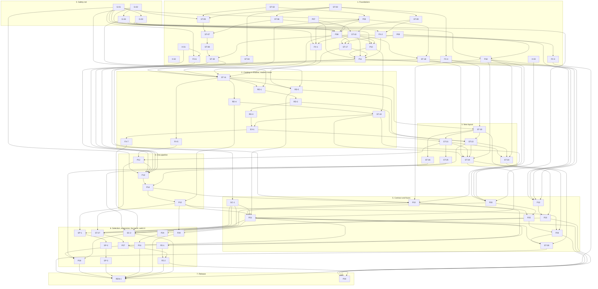

# 03 — Implementation plan

Status: reconciled plan for platform 3.0.0, 2026-10-01; revised the same day after the first two implementation
batches (pull requests #33 to #47) and after the owner's decisions on live watching. Baseline of the plan:
`origin/main` at `3ae2599`. The revision was checked against `origin/main` at `0aa73b4`.
This is the one ordered list of pull requests for `01-storage.md` and `02-services.md`. It replaces the two
separate PR lists the designs were drafted with; section 12 maps the old ids to the ids used here.

The plan has 75 pull requests: the 67 of the first version, one more live item (P31) and seven small fix items
(FX-1 to FX-7) that came out of the first batches. Each has an id, a lane, its dependencies, the files it owns,
the behaviour change it makes (if any), a size (S: up to about 200 changed lines, M: up to about 600, L: more)
and a brief that an implementer can work from without reading the other briefs.

## Status (2026-10-01)

| Item | PR | State | Note |
|---|---|---|---|
| G-01 | #38 | merged | fake transport, fetch-flow goldens, the divergence table pinned row by row |
| G-02 | #40 | merged | fixture factory, 36 reader goldens |
| ST-02 | #36 | merged | |
| ST-03 | #37 | merged | |
| P07 | #35 | merged | |
| ST-05 | #45 | merged | |
| ST-06 | #46 | merged | |
| ST-09 | #44 | merged | |
| X-01 | #33 | merged | done outside the plan's brief, before the plan itself was merged |
| X-02 | #39 | merged | done outside the plan's brief, without waiting for P09 |
| G-04 | #41 | merged | |
| ST-04 | #47 | merged | |
| X-03 | #43 | merged | done and exceeded by the web security hardening pull request, outside the plan's brief |
| P20 (part) | #43 | merged | the optional access token for every `/api/*` route; the rest of P20 is not started |
| P25 (part) | #43 | merged | the Host allow-list is never widened; startup warning; both for `main.py --web`; the rest of P25 is not started |
| EX-1 (part) | #43 | merged | `GET /api/export/csv` no longer creates a file; the rest of EX-1 is not started |
| (research) | #42 | merged | push-channel measurements; they settle what P24 waited for and are the basis of P31 |

Every other item is not started, and no pull request of the plan is open. (#41, #43 and #47 were in review
while this revision was written and were merged the same evening.) What this revision changed:

- **Owner decisions of 2026-10-01 on live watching** (`00-platform.md` sections 1 and 8). Live data is not part
  of the web UI and has no HTTP endpoint; `watch` is a CLI service that delivers to sinks. Live has two
  selectable push sources, `page` (default) and `direct` (explicit opt-in, with warnings), and polling as the
  fallback that is always present. Changed items: P22, P23, P24, P25, FE-1, FE-2, P09 (the `[live]` section);
  new item: P31.
- **Items done outside their brief** (X-01, X-02, X-03 and parts of P20, P25 and EX-1) are recorded as built,
  and what they left over is placed (sections 10 and 16).
- **Seven fix items** for defects and follow-ups that no planned item removed: FX-1 (single-match fetch says
  when SofaScore blocks), FX-2 (status and settings routes), FX-3 (one SQLite connection module), FX-4 (file
  mode and sub names in the Store), FX-5 (presence predicates), FX-6 (request budget after a cancel), FX-7
  (legacy CSV columns).
- **Every brief** of a merged or open item has a paragraph "As built"; every brief that a merged pull request
  left a note for has a paragraph "Notes from earlier items".
- **Three new sections**: known defects pinned by characterization tests (15), follow-ups and where they went
  (16), what is deliberately not planned (17).
- **Estimates.** The first batches were larger than estimated: G-01 about 2,480 lines, G-02 about 7,100 with
  its goldens, ST-04 2,850, ST-09 about 2,050, each against an estimate of M. The sizes of those four are
  corrected; test-heavy items that are still to do should be read as one size up.

## 1. Before anything else

Nothing the plan waits for is open. The three pull requests the first version of this plan waited for (#24,
#23 and #32) are merged, and so are the three that were in review while this revision was written: #41 (G-04),
#47 (ST-04) and #43 (web security hardening). The gate "after open PRs" no longer exists. What the last three
mean for every pull request from now on:

- **#41 (G-04).** A pull request that changes a route signature, a docstring, a response model or the FastAPI
  and pydantic pins regenerates `tests/snapshots/openapi-legacy.json` (section 7) and lists the differences.
- **#47 (ST-04).** A pull request that adds, removes or moves a file-system or sqlite3 call outside
  `src/store/` edits the ratchet baseline in the same pull request (section 7).
- **#43 (web security hardening).** It was not written from a brief of this plan. It covers X-03 and parts of
  P20, P25 and EX-1; section 10 says what is left of each. It changed `main.py`, `src/config_manager.py`,
  `src/bridge_health.py`, `src/challenge_solver.py`, `src/redact.py`, `src/web/app.py`, `src/web/fetch_job.py`,
  three route modules (`api.py`, `data.py`, `leagues.py`), `tests/conftest.py`, both locale files, the
  frontend, the Docker files and the four export goldens of G-02, and it added `src/private_files.py`,
  `src/web/security.py` and `src/web/routes/auth.py`. The briefs of the items that own or pin those files
  (G-03, P05, P09, ST-10 and FX-6, which can start now, and P08 behind P05) cite line numbers from before it.

Open pull requests that are not plan work: the dependency updates #27 to #31. #31 changes `constraints.txt`,
which P09 owns, and a FastAPI or pydantic bump changes the legacy OpenAPI snapshot. #30 raises vue-i18n from 9
to 11; the eval-free frontend build that the Content-Security-Policy of #43 relies on uses a vue-i18n build
flag, so #30 has to pass `frontend/tests/csp.test.ts`.

## 2. Rules for every pull request

1. **Goldens first.** A PR that moves or rewrites code names the golden or characterization test that pins the
   behaviour, and that test is merged before it. If output changes, the PR text lists every difference.
2. **One owner per file at a time.** A PR edits only the files it owns. Two PRs that are not ordered by a
   dependency never own the same file. Exceptions, where a conflict is trivial and resolved by rebasing:
   `CHANGELOG.md`, the READMEs, `.env.example`, the locale files, `pyproject.toml`, `requirements.txt`,
   `constraints.txt`, the per-module ratchet files under `tests/store_boundary/baseline/`, the per-class API
   snapshots under `tests/fixtures/store_api/`, and generated files: `docs/api/openapi-v1.json`,
   `tests/snapshots/openapi-legacy.json`, and the goldens under `tests/golden/`, `tests/snapshots/api/` and
   `tests/characterization/fixtures/fetch/`. A generated file is regenerated after a rebase (section 7), and
   the PR lists the differences again.
3. **Behaviour changes are stated.** A PR whose behaviour-change field is not "none" says so in its title or
   first paragraph and adds a changelog entry.
4. **No network.** No test and no design step sends a request to SofaScore. Tests use the fake transport of G-01.
5. **The coverage floor holds** (`pyproject.toml`, `fail_under = 53`). A PR that deletes tested code moves its
   tests instead of dropping them.
6. **Three platforms.** CI runs Linux (Python 3.10 and 3.14), Windows and macOS (3.14). Store, lease and file
   tests must pass on all of them.
7. **Docs travel with the code.** A PR that changes something these design documents describe updates the
   document in the same PR. When a batch of parallel PRs is told to leave `docs/design/` alone (two PRs editing
   the same document conflict), each PR lists its mismatches in its description under that heading, and one
   docs PR after the batch folds them in. The first two batches worked that way; this revision is that docs PR.
8. **Log messages are English.** Logs are not localised (neither is `--json` output, `02-services.md` 4.4). A
   PR that adds or moves a log message writes it in English; text for people (CLI text output, the web UI) is
   localised through codes and the locale files.
9. **Work done outside a brief is recorded, not repeated.** When a pull request that was not written from a
   brief covers a plan item (X-01, X-02, X-03 and parts of P20, P25 and EX-1 so far), the brief gets an
   "As built" paragraph, the remaining scope is stated, and what the pull request left over is placed in
   section 16.

## 3. Phases

| Phase | Content | Plan items |
|---|---|---|
| 0. Safety net | Golden and characterization tests of today's behaviour. Tests only. | G-01, G-02, G-03, G-04 |
| 1. Foundations | Store core, catalog, state db, leases, client facade, config, job manager, CLI skeleton, the small defaults and the early fixes. Additive or behaviour-preserving, except where a PR says otherwise. | ST-02, ST-03, P07, P09, X-01, X-02, X-03, FX-6, ST-04, ST-05, ST-06, ST-09, FX-2, FX-4, P05, ST-07, ST-10, FX-1, FX-3, P08, P18, ST-08, ST-17, ST-18, P10, ST-30, P11 |
| 2. Catalog in shadow; readers move | Existing writers keep the catalog current; every reader moves once, into a service that reads the Store. The on-disk layout does not change. | ST-11, FX-5, RD-1, RD-4, RD-5, RD-2, ST-19, RD-3, EX-1, FX-7 |
| 3. New layout | The v3 writer, the switch of the writers, migrate, backup format 2 and restore, raw export. | ST-20, ST-26, ST-22, ST-21, ST-23, ST-24, ST-25 |
| 4. One pipeline | Need computation, the unified fetch pipeline, listings as typed work, removal of the old fetcher modules. | P12, P13, P14, P15 |
| 5. Contract and faces | Schema v1, API v1 with legacy adapters, the CLI, sinks, the live service (polling, CLI only), removal of the terminal UI and of the transition code. | SC-1, P20, P22, P19, P23, P21, P25, P26, ST-28 |
| 6. Selection, expansion, live push, web UI | All statuses, selectable slices, normalized exports, 18 more sports, odds and non-match data, the two push sources, the scheduler, the web UI. | ST-27, P27, SC-2, SP-1, SP-2, SP-3, P28, P24, P31, P29, FE-1, FE-2 |
| 7. Release | The optional package rename before the release candidate, and the 3.1 clean-up. | REN-1, P30 |

The owner's waves (`00-platform.md` section 10) map onto the phases like this: wave 3 is phases 0 to 4 and the
seven FX items; wave 4 is SC-1, P20, P21, ST-27, P27, ST-25 and SC-2; wave 5 is SP-1 to SP-3, ST-26 and P28;
wave 6 is P18, P19, P22 to P26, P29, P31, FE-1 and FE-2. One wave-6 item starts early because other work stands
on it: the CLI skeleton (P18) provides the error table and the command registry that `migrate` (ST-23),
`backup` (ST-24) and API v1 (P20) use. The wave of each item is in the table of section 9.

## 4. Dependency diagram

An arrow points from a pull request to one that needs it. Only direct dependencies are drawn. Items that are
merged or done keep their node, so that the diagram and the table of section 9 show the same set.

## 5. What can start when

**Merged.** The table "Status" at the top. The first batch (G-01, G-02, ST-02, ST-03, P07) and the second
(G-04, ST-04, ST-05, ST-06, ST-09) are done, and X-01, X-02 and X-03 were done outside their briefs.

**Can start now and in parallel.** Every dependency of these eight is merged, and they own disjoint files:

- **G-03** test: CLI goldens for today's main.py flags (M; lane `goldens-fetch`)
- **P05** client: one Client facade over the request layer (M; lane `fetcher`)
- **P09** config: Settings model and loader (M; lane `config`)
- **ST-07** store: indexer for events and slices; rebuild and verify (L; lane `store`)
- **ST-10** store: leases and the Store facade; writer lease for jobs and CLI (M; lane `state`)
- **FX-4** store: file mode of payload files and lower-case sub names (S; lane `fix-files`; needs decisions S12
  and S13 confirmed)
- **FX-6** throttle: cancelled work returns its reservations (S; lane `fix-throttle`; decision D14 for its
  burst part)
- **FX-2** web: small defects of the status and settings routes (S; lane `fix-web`)

G-03, P05, P09, ST-10 and FX-6 own or pin files that #43 changed after their briefs were written (section 1).

**Readiness levels.** A pull request of level *n* can start when its dependencies, all of a lower level, are
merged. Pull requests on the same level can run in parallel; pull requests in the same lane are sequential.
The levels of the first version did not change; the new items were added to them.

| Level | Pull requests |
|---|---|
| 1 | G-01, G-02, ST-02, ST-03, P07, P09, X-01, X-02, X-03 |
| 2 | G-03, G-04, FX-6, ST-04, ST-05, ST-06, ST-09, FX-4, P05 |
| 3 | FX-2, ST-07, ST-10, P08, P18 |
| 4 | FX-1, FX-3, ST-08, ST-17, ST-18, P10 |
| 5 | ST-30, P11 |
| 6 | ST-11, SC-1, P20, P22 |
| 7 | FX-5, RD-1, RD-4, RD-5, ST-20 |
| 8 | RD-2, ST-19, ST-26, P23 |
| 9 | RD-3, ST-22, P24 |
| 10 | EX-1, P31 |
| 11 | FX-7, ST-21 |
| 12 | ST-23, ST-24, ST-25, P12 |
| 13 | P13, SP-1 |
| 14 | P14, SP-2 |
| 15 | P15, P19, SP-3 |
| 16 | P21, P25 |
| 17 | ST-27, P26, SC-2, P29, FE-1 |
| 18 | P27, ST-28 |
| 19 | P28, FE-2 |
| 20 | REN-1, P30 |

## 6. File ownership chains

The files below are edited by many pull requests. Each chain is the only order in which they may be touched;
the dependencies in section 10 enforce it. "(#43)" marks a file that pull request #43 edited after the briefs
were written and before the first plan item of the chain.

| File | Order of owners |
|---|---|
| `src/match_data_fetcher.py` | ST-02 → P05 → FX-1 → ST-11 → RD-1 → RD-3 → EX-1 → ST-21 → P12 → P13 → P15 |
| `src/match_fetcher.py` | P05 → ST-11 → ST-22 → P14 → P15 |
| `src/season_fetcher.py` | P05 → ST-11 → RD-5 → ST-22 → P14 → P15 |
| `src/web/routes/matches.py` | ST-10 → FX-1 → RD-1 → RD-2 → RD-3 → P13 → P21 |
| `src/web/routes/data.py` | (#43) → P08 → ST-11 → RD-4 → ST-19 → EX-1 → P21 |
| `src/web/routes/leagues.py` | (#43) → P05 → P08 → RD-5 → P21 |
| `src/web/routes/scrape.py` | FX-2 → P11 → P21 |
| `src/web/routes/settings.py` | FX-2 → P21 |
| `src/web/fetch_job.py` | (#43) → P08 → P11 → P13 → P21 |
| `src/web/app.py` | X-03 (#43) → P20 → P30 |
| `main.py` | (#43) → ST-10 → P10 → P11 → P19 → P26 |
| `src/config_manager.py` | (#43) → P09 → ST-17 → ST-28 |
| `src/watcher.py` | P05 → ST-18 → P23 → P30 |
| `src/slices.py` | ST-02 → P05 (only if it lifts the import in `from_error`) → FX-5 |
| `src/throttle.py` | X-01 (#33) → FX-6 |
| `tests/characterization/test_pipeline_divergence.py` | G-01 → FX-6 → P13 |
| `src/doctor.py` | P18 → P26 |
| `src/logger.py` | P18 → ST-28 |
| `src/services/sync.py` | P08 → P10 → P13 → P14 |
| `src/services/context.py` | P08 → ST-17 → P11 → P15 |
| `src/services/query.py` | RD-1 → RD-2 → RD-3 → P21 → ST-27 → P30 |
| `src/services/planning.py` | P12 → P13 → P14 → ST-27 → P27 → P28 |
| `src/services/export.py` | P08 → EX-1 → FX-7 → SC-2 → P28 |
| `src/services/live/supervisor.py`, `arbiter.py` | P23 → P24 → P31 |
| `src/cli/commands/watch.py` | P23 → P24 → P31 |
| `src/store/events.py` | ST-30 → ST-20 → ST-26 |
| `src/store/api.py` | ST-10 → ST-30 → ST-11 → ST-19 |
| `src/store/jobs.py` | ST-09 → ST-10 → P11 |
| `src/store/state.py` | ST-09 → ST-10 → FX-3 |
| `src/store/catalog.py` | ST-06 → FX-3 |
| `src/store/files.py`, `src/store/layout.py` | ST-03 → FX-4 |
| `src/store/derive.py` | ST-06 → FX-5 → SP-1 → SP-2 → SP-3 |
| `src/store/legacy.py` | ST-05 → FX-5 |
| `src/store/indexer.py` | ST-07 → ST-08 → ST-11 → ST-26 |
| `tests/conftest.py` | ST-04 (#47; #43 edited it too) → ST-11 |
| `tests/fakes/sofascore.py` | G-01 → P05 |
| `src/sports.py` | P12 → P27 → P28 |

`src/sports.py` is also edited by SP-1 to SP-3 (new sport entries) while P27 and P28 edit its slice table, and
`src/schema/models.py` and `mappers.py` get score models from SP-1 to SP-3 and odds models from P28. They touch
different parts of those files; whichever merges second rebases.

## 7. Where golden and characterization tests come first

| Before this work starts | These tests must be merged |
|---|---|
| any change to the request layer or the fetch flows (P05, P08, P10, P13, P14, FX-1) | G-01 (fake transport, request sequences, the divergence table pinned row by row) |
| any reader moving to the catalog (ST-05, RD-1 to RD-5, EX-1) and the legacy API adapters (P21) | G-02 (fixture directories in every legacy form, reader goldens) |
| any change to `main.py` behaviour (P10, P19) | G-03 (stdout, stderr, exit code and files per flag) |
| API v1, the legacy adapters and the routes G-02 does not cover (P20, P21, RD-5, FX-2) | G-04 (legacy OpenAPI snapshot, remaining routes) |
| any Store write path being used (ST-21, ST-22, ST-23) | the logical dump (ST-05, extended in ST-20), rebuild equivalence and crash injection (ST-20) |
| any PR that removes a boundary violation | ST-04 (the ratchet) |
| the first reader of the catalog (RD-1) | ST-11 (the shadow check: catalog equals a rebuild after every test that writes) |
| the pipeline (P13) | the divergence tests of G-01, flipped one by one inside P13 with each change named |
| the live service (P23) | the reducer goldens taken from `tests/test_watcher.py` scenarios, written first inside P23 |
| the push sources (P24, P31) | recorded, credential-free frames and an offline fake of the push server, written first inside each PR |

The test tools that exist now, and how each is regenerated or updated:

| Tool | Files | Regenerate or update |
|---|---|---|
| fetch-flow goldens (G-01) | `tests/characterization/fixtures/fetch/*.golden.json`, world `world.json` | `UPDATE_GOLDENS=1 python -m pytest tests/characterization` |
| reader goldens (G-02) | `tests/golden/readers/<directory>.<reader>.json` | `REGEN_READER_GOLDENS=1 python -m pytest tests/characterization/test_reader_goldens.py` |
| legacy OpenAPI snapshot (G-04) | `tests/snapshots/openapi-legacy.json` | `REGEN_OPENAPI_SNAPSHOT=1` |
| route goldens (G-04) | `tests/snapshots/api/*.json` | a new golden name is added to `test_every_golden_file_belongs_to_a_test` |
| derive golden (ST-06) | the golden of `tests/test_store_derive.py` | `REGEN_DERIVE_GOLDEN=1 python -m pytest tests/test_store_derive.py` |
| boundary ratchet (ST-04) | `tests/store_boundary/baseline/<module>.txt` | `STORE_BOUNDARY_UPDATE=prune python -m pytest` removes entries that no longer occur; `=rewrite` regenerates the files and can add entries. Run the whole suite, so that the `[runtime]` sections are updated too |
| Store API snapshot (ST-04) | `tests/fixtures/store_api/*.txt` | `STORE_API_UPDATE=1 python -m pytest tests/test_store_api_surface.py` |

What every user of the fake transport must know (`tests/fakes/sofascore.py`): it skips `time.sleep` and
`asyncio.sleep` for callers in `src.*`, `main` and `__main__`, except the modules in `REAL_SLEEP_MODULES`
(`src.store` today), so a module outside `src.store` that sleeps while waiting for the file system or for a
lease must be added there; request-layer modules are listed in `REQUEST_LAYER_MODULES`; the suite runs with
`REQUEST_RATE_LIMIT=0`. A changed fixture of G-02 must keep the start times of listed matches distinct.

## 8. Release points

| Point | After | What it is | Check before tagging |
|---|---|---|---|
| A. Optional 2.x release | RD-1 to RD-5, ST-19, EX-1, FX-1 to FX-7 (and everything before them) | The on-disk layout is unchanged; lists, search and "what is missing" run from the catalog; one writer per data directory across processes. Fully reversible: deleting `.meta/catalog.db`, `.meta/state.db` and `.meta/schema.json` returns the directory to its previous state | Reader goldens identical or every difference approved; the owner's real data directory indexes without reported errors |
| B. 3.0.0 alpha | ST-21, ST-22, ST-23, ST-24, ST-25 | New data is written in the v3 layout; `migrate`, backup format 2 and restore exist. From here a downgrade to 2.x no longer sees newly written data | `migrate --dry-run` and a full `migrate` on a copy of the owner's data: logical dump equal, `verify --deep` clean; backup and restore round trip |
| C. 3.0.0 beta | P13 to P15, P19, P20, P21, P22, P23, P25, P26, ST-28 | One pipeline, the CLI, API v1 with the legacy adapters, sinks, the polling live service as `ssc watch`; the terminal UI is gone | Idempotency golden (a second sync makes no detail requests); exit-code tests; OpenAPI snapshot; the current web UI still works on the legacy adapters |
| D. 3.0.0 release candidate | ST-27, P27, SC-2, SP-1 to SP-3, P28, P24, P31, P29, FE-2, then REN-1 | Feature complete: all statuses, selectable slices, 21 sports, odds and non-match data, both push sources, the new web UI | The whole suite on three platforms; Docker smoke test; changelog lists every behaviour change of this plan; the `direct` source is off in every default and its warnings are in the README |
| E. 3.1 | P30 | Aliases, legacy routes and shims removed | One release has shipped with the deprecation notices |

Do not cut a release between ST-21 and P26 without the notice ST-21 adds to the terminal UI: in that window its
data menus see only the old layout.

## 9. Plan table

The column "State" replaces "After open PRs" of the first version: the three pull requests it referred to
are merged. "—" means not started. Lanes order the work that is still to do.

| # | Id | Title | Lane | Depends on | Size | Wave | State | Behaviour change |
|---|---|---|---|---|---|---|---|---|
| 1 | G-01 | test: fake SofaScore transport and fetch-flow goldens | `goldens-fetch` | — | L | 3 | merged #38 | none |
| 2 | G-02 | test: legacy fixture factory and data-reader goldens | `goldens-read` | — | L | 3 | merged #40 | none |
| 3 | G-03 | test: CLI goldens for today's main.py flags | `goldens-fetch` | G-01 | M | 3 | — | none |
| 4 | G-04 | test: legacy OpenAPI snapshot and goldens of the remaining routes | `goldens-read` | G-02 | S | 3 | merged #41 | none |
| 5 | ST-02 | refactor: slice outcome and presence predicates in src/slices.py | `fetcher` | — | S | 3 | merged #36 | none |
| 6 | ST-03 | store: core modules (errors, codec, files, layout, manifest) | `store` | — | M | 3 | merged #37 | none |
| 7 | P07 | jobs: progress and job model in src/jobs | `jobs` | — | S | 3 | merged #35 | none |
| 8 | P09 | config: Settings model and loader (file, environment, legacy) | `config` | — | M | 3 | — | none |
| 9 | X-01 | defaults: request rate 5 per second | `defaults` | — | S | 3 | done by #33 | **yes** |
| 10 | X-02 | defaults: English by default, Turkish when the system language is Turkish | `i18n` | — | S | 3 | done by #39 | **yes** |
| 11 | X-03 | security: basic response headers | `security` | — | S | 3 | done by #43 | **yes** |
| 11a | FX-6 | throttle: cancelled work returns its reservations; cancellable slot wait; burst rule | `fix-throttle` | G-01, X-01 | S | 3 | — | **yes** |
| 12 | ST-04 | test: Store boundary, layering and API-surface tests with a ratchet | `store-guard` | ST-03 | L | 3 | merged #47 | none |
| 13 | ST-05 | store: read-only legacy layout reader | `store-legacy` | G-02, ST-02, ST-03 | M | 3 | merged #45 | none |
| 14 | ST-06 | store: catalog schema, connections, derive, query-plan tests | `store` | ST-03 | M | 3 | merged #46 | none |
| 15 | ST-09 | store: state.db, migration runner, job store on it | `state` | ST-03 | L | 3 | merged #44 | none |
| 15a | FX-2 | web: small defects of the status and settings routes | `fix-web` | G-04, ST-09 | S | 3 | — | **yes** |
| 15b | FX-4 | store: file mode of payload files and lower-case sub names | `fix-files` | ST-03 | S | 3 | — | **yes** |
| 16 | P05 | client: one Client facade over the request layer | `fetcher` | G-01, ST-02 | M | 3 | — | **yes** |
| 17 | ST-07 | store: indexer for events and slices; rebuild and verify | `store` | ST-05, ST-06 | L | 3 | — | none |
| 18 | ST-10 | store: leases and the Store facade; writer lease for jobs and CLI | `state` | ST-06, ST-09 | M | 3 | — | **yes** |
| 18a | FX-1 | web: the single-match fetch reports a blocked upstream | `fix-route` | G-01, P05, ST-10 | S | 3 | — | **yes** |
| 18b | FX-3 | store: one SQLite connection module for catalog.py and state.py | `fix-sqlite` | ST-10 | S | 3 | — | none |
| 19 | P08 | services: SyncService carrying today's web flow; web stops importing the terminal UI | `services` | G-01, G-02, P05, P07 | M | 3 | — | none |
| 20 | P18 | cli: command skeleton, output rules, exit codes | `cli` | G-03, P09 | M | 6 | — | **yes** |
| 21 | ST-08 | store: indexer for schedules, season lists, listing rows and the change log; reconcile | `store` | ST-07 | L | 3 | — | none |
| 22 | ST-17 | store: follows table as a mirror of the league files and the config file | `state` | ST-10, P09, P08 | M | 3 | — | none |
| 23 | ST-18 | store: watcher state and event streams | `streams` | ST-10, P05 | M | 3 | — | none |
| 24 | P10 | cli: headless paths call SyncService (no terminal-UI object) | `services` | G-03, P08, ST-10 | M | 3 | — | **yes** |
| 25 | ST-30 | store: read API (events, entities, slices, planning queries) | `store` | ST-08, ST-10 | M | 3 | — | none |
| 26 | P11 | jobs: cross-process job manager (heartbeat, cancel, job events, partial state) | `jobs` | P07, P10, ST-10, ST-17, FX-2 | L | 3 | — | **yes** |
| 27 | ST-11 | store: shadow mode, existing writers keep the catalog current | `store` | ST-30, ST-04, P05, P08, FX-1 | M | 3 | — | none |
| 27a | FX-5 | slices: total presence predicates and a rule for every registered slice | `fix-slices` | ST-11 | S | 3 | — | **yes** |
| 28 | SC-1 | schema: normalized schema v1 (models, mappers, JSON Schema) | `contract` | ST-30 | L | 4 | — | none |
| 29 | RD-1 | readers: match detail and path lookups through the Store | `fetcher` | ST-11, G-02 | S | 3 | — | **yes** |
| 30 | RD-4 | readers: statistics and dashboard from the catalog | `status` | ST-11 | M | 3 | — | **yes** |
| 31 | RD-5 | readers: season lists and league sport inference from the catalog | `seasons` | ST-11, ST-17, G-04 | M | 3 | — | **yes** |
| 32 | ST-20 | store: v3 writer (put, observe, promotion), not yet used | `store` | ST-11, FX-4 | L | 3 | — | none |
| 33 | P20 | api v1 foundation: error model, router, access token, OpenAPI snapshot | `api` | P11, P18, X-03, G-04 | M | 4 | partly #43 | **yes** |
| 34 | P22 | sinks: dispatcher, stdout, file and webhook sinks; `events` command | `live` | P09, P11, P18, ST-18 | M | 6 | — | **yes** |
| 35 | RD-2 | readers: match lists from the catalog | `fetcher` | RD-1 | M | 3 | — | **yes** |
| 36 | ST-19 | services: backup and clear through the Store | `status` | RD-4, P10 | M | 3 | — | none |
| 37 | ST-26 | store: slice history (versioned slices for odds) | `store` | ST-20 | M | 5 | — | none |
| 38 | RD-3 | readers: missing details, need classification, refresh candidates from the catalog | `fetcher` | RD-2 | M | 3 | — | **yes** |
| 39 | EX-1 | services: legacy CSV export as an ExportService profile reading the Store | `fetcher` | RD-3, ST-19 | L | 3 | partly #43 | **yes** |
| 39a | FX-7 | export: formation columns and integer columns of the legacy CSV | `fix-export` | EX-1 | S | 3 | — | **yes** |
| 40 | ST-22 | store: schedule and season writers use the Store | `seasons` | RD-2, RD-5, ST-20 | M | 3 | — | **yes** |
| 41 | ST-21 | store: detail writers use the Store (new matches are written in the v3 layout) | `fetcher` | EX-1, ST-20 | L | 3 | — | **yes** |
| 42 | ST-23 | store: migrate command (convert, verify, optional delete) | `migrate` | ST-21, ST-22, P18 | L | 3 | — | **yes** |
| 43 | ST-24 | store: backup format 2, restore, retention | `status` | ST-19, ST-18, ST-21, ST-22, P18 | M | 3 | — | **yes** |
| 44 | ST-25 | store: raw export and row writers (JSONL, CSV, SQLite, Parquet) | `export` | ST-21 | M | 4 | — | none |
| 45 | P12 | domain: need computation in services/planning.py; SliceSpec fields | `fetcher` | ST-21, FX-5 | M | 3 | — | none |
| 46 | P13 | pipeline: one event fetch pipeline replaces the async and sync paths | `fetcher` | G-01, P11, P12, X-01, ST-18, FX-6 | L | 3 | — | **yes** |
| 47 | P14 | pipeline: season lists and schedules as typed listing work | `fetcher` | P13, ST-22 | L | 3 | — | **yes** |
| 48 | P15 | retire match_data_fetcher.py; coverage as a service | `fetcher` | P14, RD-4 | M | 3 | — | none |
| 49 | P19 | cli: data commands, signals, single-instance behaviour, main.py shim | `cli` | P11, P14, P18, ST-19 | L | 6 | — | **yes** |
| 50 | P23 | live service (polling): supervisor, reducer, sequenced events, `watch` | `live` | P22, ST-20 | L | 6 | — | **yes** |
| 51 | P21 | api v1 resources and legacy adapters | `api` | P15, P20, SC-1, RD-5, ST-24 | L | 4 | — | **yes** |
| 52 | P25 | serve command, launchers and Docker entrypoint | `cli` | P19, P20 | M | 6 | partly #43 | **yes** |
| 53 | ST-27 | store every match status; refresh events a newer listing disagrees with | `contract` | P15, SC-1, P21 | M | 4 | — | **yes** |
| 54 | P26 | remove the terminal menu UI | `cli` | P25, P15, ST-24 | M | 6 | — | **yes** |
| 55 | P27 | user-selectable slices, end to end | `contract` | ST-27, P21, P19 | M | 4 | — | **yes** |
| 56 | SC-2 | export: normalized datasets in JSONL, CSV, Parquet and SQLite | `export` | SC-1, ST-25, P19, P21, FX-7 | M | 4 | — | **yes** |
| 57 | ST-28 | remove the transition code; boundary tests become strict | `store-guard` | P26, P21, ST-23 | S | 6 | — | none |
| 58 | SP-1 | sports: eight period-based sports | `sports` | SC-1, P12 | M | 5 | — | **yes** |
| 59 | SP-2 | sports: five set-based sports | `sports` | SP-1 | M | 5 | — | **yes** |
| 60 | SP-3 | sports: five sports with their own status or score logic | `sports` | SP-2 | L | 5 | — | **yes** |
| 61 | P28 | odds and non-match slices | `contract` | P27, ST-26, SC-2 | L | 5 | — | **yes** |
| 62 | P24 | live: `page` push source (page listening) and source arbitration | `live` | P23 | L | 6 | — | **yes** |
| 62a | P31 | live: `direct` push source (explicit opt-in) | `live` | P24 | M | 6 | — | **yes** |
| 63 | P29 | optional in-app scheduler | `jobs` | P25, P15 | M | 6 | — | none |
| 64 | FE-1 | web UI: screen design for approval | `frontend` | P21 | M | 6 | — | none |
| 65 | FE-2 | web UI on API v1 | `frontend` | FE-1, P27 | L | 6 | — | **yes** |
| 66 | REN-1 | rename the import package (only if decision D1 says so) | `release` | ST-28, P28, SP-3, P31, P29, FE-2, SC-2, FX-3 | M | 6 | — | **yes** |
| 67 | P30 | 3.1: remove legacy flags, legacy /api aliases and compatibility shims | `cli` | P26, P21, P23, FE-2 | S | 3.1 | — | **yes** |

## 10. Briefs

A brief is the text its item was, or will be, implemented from. Items that are merged or open keep their brief
and get a paragraph "As built"; items that are still to do get a paragraph "Notes from earlier items" with what
the merged pull requests learned about them. File and line references inside the original brief text are at
`3ae2599`; references marked `0aa73b4` were checked for this revision.

### Phase 0: Safety net

#### G-01 — test: fake SofaScore transport and fetch-flow goldens

- Order 1, lane `goldens-fetch`, size L (estimated M), wave 3.
- Depends on: nothing.
- Owns: `tests/fakes/__init__.py`, `tests/fakes/sofascore.py`, `tests/characterization/__init__.py`, `tests/characterization/test_fetch_flows.py`, `tests/characterization/test_pipeline_divergence.py`, `tests/characterization/fixtures/fetch/*`.
- Behaviour change: none (tests only).
- State: merged in #38.

Tests only; no file under `src/` changes. Add a fake transport that is installed just below the request-layer functions `src/utils.make_api_request` / `make_api_request_async`, at the curl calls, and that serves canned payloads, records every URL in order and can inject 403, 429, 5xx and timeouts. With it, pin today's behaviour: request sequence and resulting files for the web job in modes full, details and explicit match ids (`src/web/fetch_job.py`), the single-match route (`src/web/routes/matches.py:396-418`), refresh-only and recheck-unavailable. Add one test per row of the divergence table in `docs/design/02-services.md` section 1.4 (optional slices, finished filter, retry counts, 'not finished' counted as failed, second `/event` on refill, markers only for required slices of finished events). No test may touch the network.

As built (PR #38). The fake replaces `curl_cffi.requests.get` and the `AsyncSession` name in `src.utils`, one level below the request functions: replacing the functions themselves would have made the 403/429/5xx/timeout injection and the retry-count rows of the divergence table meaningless, and the existing tests fake the same boundary. `refresh-only` and `recheck-unavailable` are inline code in `main.py`, not callable flows; the goldens pin the call sequence `main.py` uses on MatchDataFetcher (`begin_job_cache` / `refresh_due_ids` / `refresh_matches`, and `reset_unavailable_markers`) and the CLI itself is left to G-03. The goldens are `tests/characterization/fixtures/fetch/*.golden.json` over the canned world `world.json`; `UPDATE_GOLDENS=1` regenerates them. The PR was rebased on #33, so row 7 of the divergence table (pacing) pins 'no pause on either path, the budget paces'. The fake skips `time.sleep` and `asyncio.sleep` for callers in `src.*` except the modules listed in `REAL_SLEEP_MODULES` (`src.store`: the replace retry of `src/store/files.py` must really wait). The data directory's `.meta/` is left out of the file summaries. Size: about 1,370 lines of Python and 1,110 lines of fixtures. The defects these goldens pin are in section 15.

#### G-02 — test: legacy fixture factory and data-reader goldens

- Order 2, lane `goldens-read`, size L (estimated M), wave 3.
- Depends on: nothing.
- Owns: `tests/store_fixtures.py`, `tests/characterization/test_reader_goldens.py`, `tests/golden/readers/*`.
- Behaviour change: none (tests only).
- State: merged in #40.

Tests only. Add `tests/store_fixtures.py`, which builds data directories in every legacy form listed in `docs/design/01-storage.md` section 5.1 (L1-L5, round files with and without `_complete`, event pages, summary JSON/CSV, old `_matches.csv`, the four season-list file names, `league_seasons.csv`, `score_changes.jsonl`, watcher files, every combination of `observation.json`, `_unavailable.json` and `_slice_status.json`) from the payloads in `tests/fixtures/status/`. Include a football match decided on penalties (homeScore.current differs from display), an event listed in two summary files, and a league with two season-list files. Record as golden files the current output of GET `/api/matches` (league, season, date, details, sort, limit/offset), `/api/seasons/{id}/matches`, `/api/leagues/{id}/missing-details`, `/api/matches/{id}`, `/api/dashboard`, `/api/stats/system` and `/api/export/csv`, and of `MatchDataFetcher._needs_detail_fetch` per event, `refresh_due_ids`, `collect_detail_match_ids`, `pending_detail_ids` and `reset_unavailable_markers`. A flag regenerates the goldens; CI fails on any difference. Do not edit `tests/conftest.py`.

As built (PR #40). Four fixture directories: `canonical`, `legacy`, `processed_only` and `empty` (`store_fixtures.FIXTURE_NAMES`). The golden files are flat, named `<directory>.<reader>.json` (36 files). `/api/matches` is stored compactly: each row once, plus per query the totals and the `[match id, has_details]` list; the test asserts that every query returns exactly those rows. The factory's own tests and the fidelity tests (the factory writes what today's writers write) live in `test_reader_goldens.py`, because the item owns no other test file. `REGEN_READER_GOLDENS=1 python -m pytest tests/characterization/test_reader_goldens.py` regenerates; start times of listed matches must stay distinct (a test enforces it). Both placements of the first version's files are in the `legacy` fixture (`01-storage.md` 5.1). Size: about 1,030 lines of factory, 760 of tests and 5,300 of golden JSON. The defects these goldens pin are in section 15.

#### G-03 — test: CLI goldens for today's main.py flags

- Order 3, lane `goldens-fetch`, size M, wave 3.
- Depends on: G-01.
- Owns: `tests/characterization/test_cli_goldens.py`, `tests/characterization/cli_env/sitecustomize.py`.
- Behaviour change: none (tests only).

Tests only. Run `main.py` in a subprocess with the fake transport of G-01 enabled through a sitecustomize module that exists only in the test tree (no production change). Pin stdout, stderr, exit code and written files for `--headless` `--update-all` (all leagues, `--league-id`, `--fetch-mode` details), `--headless` `--csv-export`, `--refresh-only` (success, and breaker stop with exit code 2), `--recheck-unavailable`, `--watch` with event ids, usage errors (2), a storage error (1), `--version` and `--doctor` `--json`. Also pin that `--config` is ignored today (`docs/design/02-services.md` 1.7).

Notes from earlier items. (G-01) `tests/characterization/` is a package: its `__init__.py` holds `assert_golden`, `snapshot_tree` and `pin_default_settings`, and test modules there import as `characterization.<module>`. Install the fake in the sitecustomize module with `FakeSofaScore.from_file(world_path).install()` and write its log at exit with `save_log(path)` (requests, canonical log, sleeps, sessions); faults can be declared under `faults` in the world JSON as `{pattern, outcome, times, body, headers, via}`. The fake skips `time.sleep` and `asyncio.sleep` for callers in `src.*`, `main` and `__main__`, so a `--watch` loop does not wait in real time. The subprocess needs `REQUEST_RATE_LIMIT=0`, its own `SOFASCORE_THROTTLE_DIR` and the isolated environment that `tests/conftest.py` sets; the goldens assume the budget is off. `refresh-only` and `recheck-unavailable` were pinned by G-01 only as fetcher call sequences; their CLI behaviour is pinned here. (#39) `--help` and the terminal messages are translated now: pin the language explicitly. (#43) `main.py --web` on a wildcard bind exits 2 until `SOFASCORE_ALLOWED_HOSTS` is set, and has the new flag `--allow-any-host`; pin that usage error too.

#### G-04 — test: legacy OpenAPI snapshot and goldens of the remaining routes

- Order 4, lane `goldens-read`, size S, wave 3.
- Depends on: G-02.
- Owns: `tests/characterization/test_openapi_legacy_snapshot.py`, `tests/snapshots/openapi-legacy.json`, `tests/characterization/test_api_misc_goldens.py`, `tests/snapshots/api/*`.
- Behaviour change: none (tests only).
- State: merged in #41.

Tests only. Commit a snapshot of the current app.openapi() as the legacy contract with a test that compares it, and golden JSON for the routes G-02 does not cover: `/api/leagues`, `/api/leagues/{id}/seasons`, `/api/settings`, `/api/status`, `/api/jobs`, `/api/sports`, `/api/scrape/status`. These routes are changed by the open PRs, so this PR is recorded after them.

As built (PR #41). The legacy comparison excludes `/api/v1` paths and the schemas only they reference (`_legacy_view`), so the items that add v1 routes without owning the snapshot (P21, P27, P28) do not break it. The snapshot contains `GET /api/logs`, `/api/diagnostics` and `/api/diagnostics/bundle` (`src/web/routes/diagnostics.py`, added by #24), which the first version of `02-services.md` 6.1 omitted. Goldens: `tests/snapshots/api/<directory>.leagues.json` and `<directory>.league_seasons.json` for the four fixture directories, `league_seasons_files.json`, `settings.json` (five environment scenarios), `status.json`, `jobs.json`, `scrape_status.json` and `sports.json`. `REGEN_OPENAPI_SNAPSHOT=1` regenerates the snapshot, and the failure message prints the installed FastAPI and pydantic versions next to the `constraints.txt` pins. A test fails if `tests/snapshots/api/` contains a file that no test produces (add new golden names to `test_every_golden_file_belongs_to_a_test`). The `job_records` fixture rebinds `common._job_store` with `default_db_path(...)` and patches `_utc_now` in the module that defines the store class; the store moved to `src/store/jobs.py` with ST-09 (#44), and #41 was merged on top of it. It was also merged after #43, so the snapshot already contains the routes #43 added or changed (`/api/auth`, `/api/auth/login`, `/api/auth/logout`, `POST /api/export/csv`, `POST /api/leagues/search-remote`). The defects these goldens pin are in section 15.

### Phase 1: Foundations

#### ST-02 — refactor: slice outcome and presence predicates in src/slices.py

- Order 5, lane `fetcher`, size S, wave 3.
- Depends on: nothing.
- Owns: `src/slices.py`, `src/match_data_fetcher.py`, `tests/test_slices.py`.
- Behaviour change: none.
- State: merged in #36.

Create the pure module `src/slices.py`. Move SliceOutcome and the `SLICE_*` constants (`src/match_data_fetcher.py:60-89`) into it as class Outcome with the fields status, data, reason, `http_status` plus the new optional fields `fetched_at`, via and meta, and the additional status 'skipped' (unused for now); keep SliceOutcome as an alias. Move `_statistics_has_data`, `_has_lineups_data_dict`, `_has_h2h_data_dict`, `_has_pregame_form_data_dict`, `_has_team_streaks_data_dict`, `_has_incidents_data_dict` and `match_detail_slice_present` (:559-637) to module-level functions. MatchDataFetcher keeps its method names and delegates; `src/match_data_fetcher.py` re-exports the moved names so existing imports and tests keep working. New table-driven test: old methods and new functions give equal results on the status fixtures and on hand-made empty bodies.

As built (PR #36). The module-level predicates carry the old method names without the leading underscore: `statistics_has_data`, `has_lineups_data_dict`, `has_h2h_data_dict`, `has_pregame_form_data_dict`, `has_team_streaks_data_dict`, `has_incidents_data_dict`, plus `match_detail_slice_present(key, d)`. They take the merged match dictionary and read only their own key. `Outcome.fetched_at` is optional with default None, which the consumer treats as now: a 'now' taken at construction would make two otherwise equal outcomes unequal. The open circuit breaker is still a failed outcome with reason `breaker`; `SLICE_SKIPPED` exists but nothing produces it yet (P05, P13). `Outcome.from_error` imports `src.breaker` inside the function, because that module loads the logger at import; `tests/test_slices.py::test_slices_module_is_pure` pins that importing `src.slices` loads only `src.exceptions`. `src/match_data_fetcher.py` re-exports `SLICE_EMPTY`, `SLICE_FAILED`, `SLICE_OK` and `SliceOutcome` only; `Outcome` and `SLICE_SKIPPED` are imported from `src.slices`. `Outcome.status` is annotated, not validated at runtime, as before. The line references of this brief matched `origin/main` exactly.

#### ST-03 — store: core modules (errors, codec, files, layout, manifest)

- Order 6, lane `store`, size M, wave 3.
- Depends on: nothing.
- Owns: `src/store/__init__.py`, `src/store/errors.py`, `src/store/codec.py`, `src/store/files.py`, `src/store/layout.py`, `src/store/manifest.py`, `src/fsutil.py`, `tests/test_store_codec.py`, `tests/test_store_files.py`, `tests/test_store_layout.py`, `tests/test_store_manifest.py`.
- Behaviour change: none (nothing uses the package yet).
- State: merged in #37.

Create `src/store/` as specified in `docs/design/01-storage.md` sections 2.2, 4.1, 4.2 and 4.4. `errors.py`: StoreError(StorageError) with the fatal property preserved and the subclasses listed in 2.3. `codec.py`: canonical JSON bytes, deterministic gzip level 6 with `mtime=0`, sha256 over the uncompressed bytes, a reader that dispatches on the suffix (`.json`, `.json.gz`, .json.zst when a zstd module is importable). `files.py`: atomic write and replace with the Windows retry, staging and trash directories, optional fsync; `src/fsutil.py` re-exports from it. `layout.py`: the pure v3 path functions. `manifest.py`: dataclasses, read, write, validate (format 1). Tests: round trip for every status fixture; the same payload twice gives byte-identical files; truncated and garbage files raise PayloadCorrupt; layout paths for small, 8-digit and 10-digit ids; `tests/test_fsutil.py` passes unchanged. `src/store/__init__.py` exports only the error classes in this PR.

As built (PR #37). `src/fsutil.py` imports the submodule `src.store.files` (the package root exports only the error classes in this PR) and keeps `file_lock` as a thin wrapper instead of a re-export, because `tests/test_fsutil.py` disables the lock through `fsutil.fcntl`. The 2.x helpers (`atomic_write_*`) keep raising OSError: a replace that still fails after the retries raises `ReplaceBusy`, a PermissionError subclass, which 2.x callers turn into a fatal StorageError as today; only the Store-layer functions (`write_bytes`, `replace`, `publish_dir`, `move_to_trash`) raise the non-fatal StoreError of the design. `STORE_DURABILITY=full` is honoured by the Store-layer functions only, so today's writers never fsync. Key and sub validation is stricter than the two patterns: Windows device names are rejected and the sub `_` is reserved. A manifest slice entry may carry `meta`, unknown fields are preserved at every level, and timestamps keep sub-second precision. These points and the error types chosen where the design was silent are now in `01-storage.md` 2.3, 4.1, 4.2 and 4.4. All 3,389 `.json` files of the owner's data directory round-trip through the codec in memory (84.0 MB today, 7.5 MB with gzip).

#### P07 — jobs: progress and job model in src/jobs

- Order 7, lane `jobs`, size S, wave 3.
- Depends on: nothing.
- Owns: `src/jobs/__init__.py`, `src/jobs/progress.py`, `src/jobs/model.py`, `src/web/progress.py`, `tests/test_jobs_model.py`.
- Behaviour change: none.
- State: merged in #35.

Create the package `src/jobs`. Move `src/web/progress.py` to `src/jobs/progress.py` and leave a re-export shim. Add `src/jobs/model.py` with Job, JobKind, JobState and the mapping from today's status strings (running, queued, completed, failed, cancelled, interrupted; `src/web/jobs.py`) to JobState, as in `docs/design/02-services.md` section 2.8. Do not move `src/web/jobs.py`: the job store moves to the Store package in ST-09. `tests/test_job_progress.py` and `tests/test_job_list_payload.py` pass unchanged; add unit tests for the state mapping.

As built (PR #35). `src/jobs/model.py` also defines `Origin` (pure data: the caller fills pid and host) and `ErrorInfo` (code, message, details, matching the `error_json` column of state migration 0002), which `Job` needs and which the brief did not list. `JobEvent` is not implemented; it comes with P11. `Job.id` is a plain string and no id generator was added (today's ids are uuid4, `src/store/jobs.py:278` at `0aa73b4`). `created_at`, `started_at` and `finished_at` are ISO-8601 UTC text as in today's rows and `heartbeat_at` is epoch milliseconds; `created_at` has no column yet. `job_state_from_status(status, breaker_triggered=...)` turns a completed row into partial from the `circuit_breaker_triggered` column, not from the text, because the text is localised. `JobKind` and `JobState` are `(str, Enum)` whose `str()` is the plain value on every supported Python; `JobState.terminal` is false only for queued and running. `LEGACY_STATUS_TO_STATE` is read-only, also accepts the capitalised mirror strings (Running, Completed, Failed, Cancelled) and maps Idle to None. The layer test scans the top-level files of `src/jobs` and fails on an import of `src.web`, `src.ui`, `src.cli`, `src.SofaScoreUi` or `sqlite3`; it does not ban `os`, because the manager of P11 needs the pid.

#### P09 — config: Settings model and loader (file, environment, legacy)

- Order 8, lane `config`, size M, wave 3.
- Depends on: nothing.
- Owns: `src/config/__init__.py`, `src/config/settings.py`, `src/config/loader.py`, `src/config/schema.py`, `src/config_manager.py`, `pyproject.toml`, `requirements.txt`, `constraints.txt`, `tests/test_config_loader.py`, `tests/test_dependency_pins.py`.
- Behaviour change: none without a config file; a `sofascore.toml`, if present, is honoured.

Add `src/config` as in `docs/design/02-services.md` section 4.3: frozen Settings dataclasses, a loader with the precedence defaults `<` `overrides.json` `<` config file `<` environment `<` flags, `SOFASCORE_<SECTION>__<KEY>` overrides, the current environment names and .env as a legacy source, JSON Schema of the file, and the source of each value for `config show`. Model every section of the file shown there, including [`slices.*`], [[sink]], [schedule], [live] and [server], although their consumers come in later PRs, so that those PRs do not have to edit `src/config/settings.py`. TOML is read with tomllib, or the tomli backport on Python 3.10 (add it to requirements and constraints). ConfigManager getters read from the active Settings; with no config file every value must resolve exactly as today (`tests/test_config_manager.py` passes unchanged). Relative paths are resolved against the config file's directory, never the working directory. Follows of the config file are parsed into FollowSpec values but not applied anywhere yet (ST-17 does that).

Notes from earlier items. (#39) The language rule is implemented in `src/language.py` (explicit `APP_LANGUAGE`, else the detected system language, else English); the Settings default calls it and defines no second rule. (#33) The rate default is 5 (`src/throttle.py:54` at `0aa73b4`). (G-01) `pin_default_settings` in `tests/characterization/__init__.py` sets `src.utils.FETCH_ONLY_FINISHED` and `SAVE_EMPTY_ROUNDS` and clears `MAX_RETRIES`, `REFRESH_*`, the breaker thresholds and similar environment variables; if those module constants move into Settings, that helper follows. (G-02) The reader goldens set the leagues through the test `leagues.txt` and the data directory through `DATA_DIR`, and import ConfigManager. (G-04, #41) `tests/snapshots/api/settings.json` pins today's environment parsing rules in five scenarios, odd ones included: booleans are true only for the word `true` (so `FETCH_ONLY_FINISHED=1` and `USE_PROXY=yes` read as false), `LOG_LEVEL` is echoed as written, empty `API_BASE_URL`, `DATA_DIR` and `DATE_FORMAT` are returned empty, `REQUEST_TIMEOUT=10.5` and `RATE_LIMIT_THRESHOLD_CONSECUTIVE=1e2` fall back to the defaults, `REFRESH_WINDOW_HOURS=-5` becomes 0. The legacy names keep exactly these rules until P30; the config file and the new `SOFASCORE_<SECTION>__<KEY>` names are parsed strictly and a rejected value is `config_invalid`. That test sets the environment per scenario and pins the system language through `LC_MESSAGES` with `LC_ALL` removed; if Settings is cached, invalidate the cache per scenario. (ST-03) Model `STORE_DURABILITY` (as `[storage] durability`); its line in `.env.example` comes with the first writer that uses the Store (ST-22). (#43) `config_manager.reload_config()` overwrites environment values with empty `.env` values; only the access token is protected against that. The loader's precedence (environment above `.env`) removes the defect for every setting, and a test pins it. #43 edited `src/config_manager.py` (the `.env` file is created with mode 0600 and stays so); the line references above are older than that. (#39) `tests/test_delivery_api.py::test_settings_roundtrip_safe` posts back the settings it read and leaves `APP_LANGUAGE` set in the test process; isolate it. (ST-02) Importing `src.utils` builds a module-level ConfigManager, which writes `config/leagues.txt` and `logs/` into the working directory when they are missing. Building the configuration must not create files; if `tests/test_config_manager.py` pins the creation, say so in the PR and the defect stays until P15. (Live decisions) Model `[live]` with `source` (`page` | `direct` | `poll`, default `page`) instead of a `sources` list, and without an `enabled` key: there is no live hosting inside `serve` (`02-services.md` 4.3 and 8).

#### X-01 — defaults: request rate 5 per second

- Order 9, lane `defaults`, size S, wave 3.
- Depends on: nothing.
- Owns: `src/throttle.py`, `.env.example`, `tests/test_throttle.py`, `README.md`, `README.tr.md`, `CHANGELOG.md`.
- Behaviour change: The default request budget drops from 10 requests per second per concurrent request (100 with default settings) to 5 requests per second in total. `REQUEST_RATE_LIMIT=0` or off still removes the limit.
- State: done by #33, merged before this plan was.

Change the default in `src/throttle.py` (`DEFAULT_RATE_PER_CONCURRENT` / `DEFAULT_RATE_LIMIT`, :55-57, and `default_rate`) to a fixed 5 requests per second shared by all processes, as the owner decided (`docs/design/00-platform.md` section 1). Keep `configured_rate` semantics (:83-100): an explicit value wins, 0/off disables. Update .env.example, both READMEs and the changelog with the new default and with how to raise or remove it. Adjust `tests/test_throttle.py`.

Done by PR #33, which was not written from this brief. Besides the default (`DEFAULT_RATE_LIMIT = 5.0`, `src/throttle.py:54` at `0aa73b4`) it removed the four fixed pauses that the budget makes redundant (1 s between batches in two places, 0.2 s per match on the one-by-one path, 1 s per match in refresh-only), stopped counting the wait for a slot towards the bridge timeout, and added an explanation and a warning to the Settings page. Measured offline: 100 football matches (700 requests) take 139.6 s at 5.0 requests per second on average. Left alone: the per-request wait `WAIT_TIME_MIN/MAX` (open question, section 14), the back-off after errors and the session warm-up wait. What remains is placed elsewhere: FX-6 (reservations of a cancelled job, the slot wait that cannot be interrupted, the burst rule of decision D14) and P18 (a doctor warning when the budget is above the default or off).

#### X-02 — defaults: English by default, Turkish when the system language is Turkish

- Order 10, lane `i18n`, size S, wave 3.
- Depends on: nothing (as built; the brief named P09 and X-01).
- Owns: `src/i18n.py`, `.env.example`, `tests/test_i18n_default.py`, `CHANGELOG.md`.
- Behaviour change: Without `APP_LANGUAGE` the application speaks English, or Turkish when the system locale is Turkish. Today the default is Turkish.
- State: done by #39.

`src/i18n.py` defaults to 'tr' (`app_language`, :13; I18nManager, :36). Change the default to: `APP_LANGUAGE` if set; else 'tr' when the system locale (`LC_ALL`, `LC_MESSAGES`, LANG, or locale.getlocale) starts with tr; else 'en'. Settings (P09) already carries the language value; only its default changes here. The web UI's own default language must follow the same rule (it reads the language from the API). Tests for each branch with a patched environment.

Done by PR #39, without waiting for P09. The rule lives in `src/language.py`: an explicit setting (`APP_LANGUAGE`; the old `LANGUAGE` only when it equals a supported code), else the detected system language (`LC_ALL`, `LC_MESSAGES`, `LANG` in that order; on Windows the user's UI language), else English. The CLI, `--doctor`, the launcher, the installers and the web server apply it; the web UI picks the language from the browser on the first visit. `.env.example` and the Compose example pin no language. What #39 left open is placed in section 16: server text that the web UI shows as it is, error messages without a code, Turkish docstrings in `/docs`, the language of log messages, the `--help` description.

#### X-03 — security: basic response headers

- Order 11, lane `security`, size S, wave 3.
- Depends on: nothing (as built; the brief named X-01).
- Owns: `src/web/app.py`, `tests/test_web_security.py`.
- Behaviour change: Responses carry X-Content-Type-Options, Referrer-Policy and a frame-ancestors policy.
- State: done by #43.

`docs/design/00-platform.md` section 9 asks for basic security headers independent of the host allowlist. Add one middleware in `src/web/app.py` that sets X-Content-Type-Options: nosniff, Referrer-Policy: same-origin and Content-Security-Policy: frame-ancestors 'none' (plus X-Frame-Options: DENY) on every response, without breaking the SPA or the SSE route. The origin check (:37-47) and the host check (:51) stay as they are. The other two items of section 9 land elsewhere: the GET that writes an export file is fixed in EX-1, and `serve` stops widening allowed hosts in P25. Extend `tests/test_web_security.py`.

Done and exceeded by PR #43, which was not written from this brief. One middleware in the new `src/web/security.py` adds to every response `X-Content-Type-Options: nosniff`, `X-Frame-Options: DENY`, `Referrer-Policy: no-referrer`, `Cross-Origin-Resource-Policy: same-origin` and a full Content-Security-Policy (`default-src 'self'` down to `frame-ancestors 'none'`); `/docs` and `/redoc` get a policy of their own. The origin check moved there and reads `Sec-Fetch-Site` first. The same PR adds the optional access token (see P20), the Host allow-list rule and the startup warning for `main.py --web` (see P25), turns `GET /api/leagues/search-remote` into a POST, stops `GET /api/export/csv` from creating a file (see EX-1) and tightens the file modes of `.env` and the browser profile. Nothing of this item remains. One follow-up: the CSP's `'unsafe-eval'` compatibility path for old frontend builds is dropped in P30.

#### FX-6 — throttle: cancelled work returns its reservations; cancellable slot wait; burst rule

- Order 11a, lane `fix-throttle`, size S, wave 3.
- Depends on: G-01, X-01.
- Owns: `src/throttle.py`, `src/challenge_solver.py` (the slot wait only), `tests/test_throttle.py`, `tests/characterization/test_pipeline_divergence.py` (the `request_budget` fixture only).
- Behaviour change: After a job is stopped, the next request no longer waits for the reservations the stopped job had queued. If decision D14 chooses the strict rule, no second ever sees more than the configured number of requests.

Follow-ups of PR #33. (1) Stop does not return reserved slots: a cancelled bulk job leaves its queued reservations in the shared state, so the next request from any process can wait up to `MAX_CONCURRENT` x 7 / 5 s (14 s with the defaults, about 70 s at `MAX_CONCURRENT=50`). Give a reservation back when its request is cancelled before it is sent. (2) The wait for a slot inside the bridge cannot be interrupted on the sync path (the curl path's wait can); make it honour the cancel check. (3) Burst allowance: after idle time, up to one second of budget (5 requests) goes out at once, so the busiest second can see 9 or 10 requests. Decision D14 says whether that stays; a strict 'never more than N in any second' is `burst=1`, which also changes how explicit values behave, and is implemented here only if the owner chooses it. Notes from earlier items. (G-01) The `request_budget` fixture in `tests/characterization/test_pipeline_divergence.py` uses `throttle.reserve`, `throttle.reset_for_tests`, `throttle.configured_rate` and the environment variables `REQUEST_RATE_LIMIT` / `SOFASCORE_THROTTLE_DIR`; a rename needs the fixture to follow. `test_row07_pacing` asserts exactly one reservation per transport request and does not pin burst size or exact delays, so a burst change does not break it; a returned reservation must not be counted as a second one. The file-lock poll in `src/throttle.py` (`time.sleep(_LOCK_POLL_SECONDS)`) is skipped while the fake transport is installed; this has no effect in the suite because the budget is off there. (#43) changed `src/challenge_solver.py` (the profile directory's mode). Tests: a cancelled job's reservations are free for the next caller (fake clock, two processes); the bridge wait stops within one cancel-check interval; the burst rule that D14 selects.

#### ST-04 — test: Store boundary, layering and API-surface tests with a ratchet

- Order 12, lane `store-guard`, size L (estimated M), wave 3.
- Depends on: ST-03.
- Owns: `tests/test_store_boundary.py`, `tests/test_layers.py`, `tests/test_store_api_surface.py`, `tests/store_boundary/baseline/*`, `tests/fixtures/store_api/*`, `tests/conftest.py`.
- Behaviour change: none (tests only).
- State: merged in #47.

Tests only, as specified in `docs/design/01-storage.md` section 2.4. (1) A static AST check that modules under `src/` outside `src/store/` make no file-system or sqlite3 calls and import only the src.store package root, with a documented allowlist. (2) An audit hook in `tests/conftest.py` that records accesses to the test `DATA_DIR` whose nearest `src/` frame is outside `src/store/`. (3) A layering check: `src/store` imports only src.sports, src.status, src.slices, src.exceptions, src.version. (4) A snapshot of the public Store API, one file per public class under `tests/fixtures/store_api/`. Today's violations go into `tests/store_boundary/baseline/<module>.txt`, one file per source module; a new violation fails, and so does a baseline entry that no longer occurs. Include self-tests of the checker.

As built (PR #47). `01-storage.md` 2.4 now describes the tests as built. In short: the baseline files have a `[static]` section (entries `function:call`, with a count such as `x3`) and a `[runtime]` section that holds only accesses in functions the static list does not already track; at `0aa73b4` there are 23 files with 166 static entries covering 291 calls in 21 modules, and 3 runtime entries (the PR counted 21 files, 162 entries and 287 calls before #43 was merged). The runtime hook follows the current value of the `DATA_DIR` environment variable, not only the directory of `tests/conftest.py`, because most reader and route tests point `DATA_DIR` at their own temporary directory. The layering rule is checked as the allow-list of section 2.1 (stricter than the deny-list the brief quotes) and includes what the allowed modules pull in. The stale-entry check for runtime entries runs only when the whole suite runs, and not on Windows. `STORE_BOUNDARY_UPDATE=prune|rewrite` and `STORE_API_UPDATE=1` update the files (section 7). The hook adds no measurable time to the suite. The Store modules merged in parallel fit the rules: `src/store/legacy.py` imports only `src.slices`, `src.sports` and `src.store.*`, `src/store/derive.py` imports `src.sports` and `src.status`, and `src.store.__all__` is unchanged; `tests/store_dump.py` and the Store tests import submodules, which the rule allows for tests. From now on a PR that adds, removes or moves a file-system or sqlite3 call outside `src/store/` edits the baseline in the same PR; #43 was merged just before #47, and its new modules `src/private_files.py` and `src/web/security.py` are in the baseline. Size: 2,850 added lines, about 1,700 of them self-tests of the checkers.

#### ST-05 — store: read-only legacy layout reader

- Order 13, lane `store-legacy`, size M, wave 3.
- Depends on: G-02, ST-02, ST-03.
- Owns: `src/store/legacy.py`, `tests/test_store_legacy.py`, `tests/store_dump.py`.
- Behaviour change: none.
- State: merged in #45.

Add `src/store/legacy.py`: read-only discovery and readers for every legacy form in `docs/design/01-storage.md` section 5.1, returning layout-independent records (event with payloads, observation and marker counts mapped to `empty_count` / `unverified_empty_count` / error as in section 2.3; schedule page; season list; change-log lines; watcher state). No function in the module writes. Apply the duplicate-id rule (newest `basic.json` wins) and the season-list rule (newest file of any name). Tests on every fixture form of G-02: the set of event ids equals `_build_match_index` (on the `legacy` fixture the reader finds one event more, see below); a characterization table records which of today's walkers find fewer or more events; the expected slices equal `MatchDataFetcher._expected_slices` for each marker combination. Introduce `tests/store_dump.py` (the logical dump) for legacy trees. Do not touch `src/store/__init__.py`.

As built (PR #45). Where the brief and the design disagreed, the design was followed: a directory that holds only the combined file `<id>.json` is an event directory (event 17018554 of the `legacy` fixture, which no walker on main finds), and a directory whose event payload carries another id is reported as a problem and not yielded. A slice is read from the separate file first and from the combined file otherwise, and `observation.json` is always read (today's loader does the opposite). `round_<n>_full.json` of the first version is returned as a round page with sub `round_<n>_full` and meta `{filtered: true}`; a round file named `<n>_matches.json`, which only the terminal UI accepts, is reported as `unknown_name`; `league_seasons.csv` is used only for a tournament without a JSON list; a name-only season file is resolved through a caller-supplied id-to-name map; one schedule page stored in two directories of one season resolves to the newest mtime, ties to the smaller path; `_unavailable.json` holding `Infinity` is reported as malformed. All of this is now in `01-storage.md` 5.1 and 5.2. The predicates are called as `src.slices.match_detail_slice_present(key, {key: payload})` and an AttributeError from a malformed body is treated as a corrupt payload. On `canonical`, `processed_only` and `empty` every walker equals the reader; the differences on `legacy` are the walker rows of section 15. On the owner's real data (read-only): 423 event directories (all form L1), 69 observations, 90 schedule files listing 1,051 events, no problems and no duplicates; discovery takes 0.03 s and a full read with payloads 0.85 s.

#### ST-06 — store: catalog schema, connections, derive, query-plan tests

- Order 14, lane `store`, size M, wave 3.
- Depends on: ST-03.
- Owns: `src/store/schema/catalog.sql`, `src/store/catalog.py`, `src/store/derive.py`, `tests/test_store_catalog.py`, `tests/test_store_derive.py`, `tests/test_store_query_plans.py`.
- Behaviour change: none.
- State: merged in #46.

Add the catalog DDL exactly as printed in `docs/design/01-storage.md` section 3.3 (`src/store/schema/catalog.sql`), `catalog.py` (thread-local connections, the PRAGMAs of section 3.2, WAL fallback, minimum SQLite 3.24 check, `user_version` and `derive_version` handling, a BEGIN IMMEDIATE helper that raises StoreBusy on timeout) and `derive.py` (event payload to row including `home_score_current`, `away_score_current`, `stage_name`; tournament, season and participant rows; name folding). Tests: a golden row for every payload in `tests/fixtures/status/` (`status_class` equals `classify_status`, `scores_json` equals `extract_scores`); EXPLAIN QUERY PLAN contains the named index for every hot query of section 3.7; a writer in BEGIN IMMEDIATE and a reader in another process see consistent snapshots. Do not touch `src/store/__init__.py`.

As built (PR #46). `DERIVE_VERSION` is defined in `src/store/derive.py` and re-exported by `catalog.py`. `derive.event_row` has an extra keyword `sport` (a fallback when the payload names no sport; the payload's own sport wins) and returns exactly `derive.EVENT_DERIVED_COLUMNS`. `home_score` / `away_score` are `homeScore.display`, else `.current`, as the column comment says; no score-sheet field is that value for all three sports. `derive.season_sort_key` returns 0.0 where `SeasonFetcher._get_sortable_year_value` raises or returns NaN. `configure()` retries the switch to WAL for up to the busy timeout, because SQLite returns SQLITE_BUSY at once when two connections switch a new file together; `inspect()` reads the file's identity in one read transaction. A replaced catalog file is detected by device and inode, not by size. `upsert`, `clear`, the meta helpers and the `attach` parameter are in `catalog.py` although the brief does not list them, because the indexer needs them and no later item owned the file. `prepare()` never rebuilds. The query-plan tests found a third spelling rule and one condition for the stream-read plan (`01-storage.md` 3.7). `REGEN_DERIVE_GOLDEN=1 python -m pytest tests/test_store_derive.py` regenerates the derive golden.

#### ST-09 — store: state.db, migration runner, job store on it

- Order 15, lane `state`, size L (estimated M), wave 3.
- Depends on: ST-03.
- Owns: `src/store/state.py`, `src/store/migrations/state/0001_initial.sql`, `src/store/jobs.py`, `src/web/jobs.py`, `tests/test_store_state.py`.
- Behaviour change: none visible: job history is kept (imported); the file that holds it changes from `.meta/jobs.db` to `.meta/state.db`, and `jobs.db` is left in place.
- State: merged in #44.

Add `src/store/state.py` with the `state.db` DDL of `docs/design/01-storage.md` section 3.3 as migration 0001, the forward-only migration runner of section 7.3 (copy before migrating, rollback on failure, SchemaTooNew for a newer file), `synchronous=FULL`, and the RuntimeFacts key/value API. Move JobStore from `src/web/jobs.py` to `src/store/jobs.py` on `state.db` with the same methods and error classes; `src/web/jobs.py` re-exports every name it exports today, including `default_db_path` and `get_job_store` (`src/web/routes/settings.py` imports them). On first creation import the rows of `.meta/jobs.db` once, read-only. rebind on a `DATA_DIR` change keeps its behaviour. `tests/test_job_store.py` passes unchanged and `tests/test_job_guards.py` with one changed line (it named the file `jobs.db`); new tests cover the import, a failing migration and a dummy second migration.

As built (PR #44). Migration 0001 uses `CREATE TABLE IF NOT EXISTS`, as section 7.3 of the storage design asks. Leases arrive with ST-10, so until then the migration transaction (BEGIN IMMEDIATE, the version re-read inside it) is the cross-process mutex. `StateDb` retries the switch to WAL for up to the busy timeout and then raises StoreBusy, and uses a Connection subclass that closes itself (Python 3.13+ warns about unclosed connections from the connection's own finalizer). `src/diagnostics.py` reads the job history from `state.db` and falls back to `jobs.db` for a directory 3.x has not opened (`src/diagnostics.py:389-398` at `0aa73b4`); neither the design nor the plan had named diagnostics as a reader. Job retention (`01-storage.md` 9.3) is not implemented here; it is P11's. `meta.imported_jobs_db` is a JSON record `{file, found, rows, imported, at}`, written even when no `jobs.db` exists. `src/web/routes/settings.py` still catches only `(OSError, sqlite3.Error)` around the rebind, so a data directory whose `state.db` is newer than the code answers 500 (FX-2). Size: about 1,100 source lines including SQL (500 of them the moved job store) and 950 test lines.

#### FX-2 — web: small defects of the status and settings routes

- Order 15a, lane `fix-web`, size S, wave 3.
- Depends on: G-04, ST-09.
- Owns: `src/web/routes/scrape.py` (the status handler only), `src/web/routes/settings.py`, `tests/snapshots/api/status.json`, `tests/test_settings_proxy.py`, `tests/test_web_small_fixes.py`.
- Behaviour change: GET `/api/status` reports the application version instead of `1.0.0`. A change of the data directory to a folder the Store cannot open answers 400 `data_dir_unusable` instead of 500. A masked proxy password is restored only when scheme, host and port are unchanged.

Three defects that no other plan item removes, in two files that have no owner before P11 and P21. (1) GET `/api/status` returns a hard-coded `"version": "1.0.0"` (`src/web/routes/scrape.py:112` at `0aa73b4`) while the application is 2.0.0; `/health` and the OpenAPI document carry the real one. Return `src.version`'s value and update `tests/snapshots/api/status.json` (G-04). (2) `src/web/routes/settings.py:221` catches only `(OSError, sqlite3.Error)` around the job-store rebind. Since ST-09 a store failure is a StoreError, so a data directory whose `state.db` is newer than the code answers 500; the same uncaught path exists for a file that is not a state database, a failed migration and a five-second lock. Add StoreError to the except, so that the route answers the existing 400 `data_dir_unusable` and nothing is changed. Checked by hand on #44: after the 500, `DATA_DIR` and the job store stay on the old folder and the next `/api/fetch` works. (3) The proxy password is restored from `***` when only the scheme or the port of the proxy changes (pinned by a test from #23). Someone who can write settings could downgrade `https` to `http` on the same host and receive the password in clear; restore it only when scheme, host and port are all unchanged. Also correct the comment in `src/web/routes/settings.py` that still says `jobs.db`. Tests for each case; the legacy OpenAPI snapshot does not change (no signature changes).

#### FX-4 — store: file mode of payload files and lower-case sub names

- Order 15b, lane `fix-files`, size S, wave 3.
- Depends on: ST-03.
- Owns: `src/store/files.py`, `src/store/layout.py`, `tests/test_store_files.py`, `tests/test_store_layout.py`, `tests/test_fsutil.py` (one xfail reason).
- Behaviour change: Payload files, manifests and change-log segments that the Store layer writes get the mode the process umask gives instead of 0600 (decision S12); a `sub` with an upper-case letter is rejected (decision S13). Today's writers are not affected: nothing writes through the Store layer yet.

Two findings of ST-03 that must be settled before the v3 writer (ST-20) produces files. (1) Files written through `atomic_write_*` get mode 0600 because `tempfile.mkstemp` creates them that way, and v3 payloads written through `files.write_bytes` inherit it. With a Docker bind mount read by another user, or a backup tool running under another account, the data is then unreadable. Apply decision S12 in the Store-layer functions (`write_bytes`, `publish_dir`): payloads, manifests and change-log segments follow the umask; the 2.x helpers keep today's mode, and files that hold secrets are not written through these functions (`.env` and the browser profile are handled by `src/private_files.py` of #43). (2) The sub pattern `[A-Za-z0-9_.-]{0,80}` is case-sensitive, but Windows and default macOS file systems are not: the subs `A` and `a` of one key would share a file there. Apply decision S13: `validate_sub` accepts lower-case letters only (every sub known today is lower-case: `round_12`, `last_0`, `total`, provider ids, `<ut>-<sid>`). Also correct the stale xfail reason of `replace_fails_on_windows` in `tests/test_fsutil.py`, which still says `atomic_write_text` does not retry. Tests: file modes under two umasks (POSIX only); the sub rule; `tests/test_store_layout.py` updated.

#### P05 — client: one Client facade over the request layer

- Order 16, lane `fetcher`, size M, wave 3.
- Depends on: G-01, ST-02.
- Owns: `src/client/__init__.py`, `src/client/transport.py`, `src/client/context.py`, `src/client/endpoints.py`, `src/utils.py`, `src/bridge_health.py`, `src/match_data_fetcher.py`, `src/match_fetcher.py`, `src/season_fetcher.py`, `src/watcher.py`, `src/web/routes/leagues.py`, `tests/test_client.py`, `tests/fakes/sofascore.py` (the module lists only).
- Behaviour change: `API_BASE_URL` now applies to every request (today only to relative URLs); otherwise none.

Add `src/client` as in `docs/design/02-services.md` section 2.4: Client.get / `get_sync` returning the Outcome of `src/slices.py`, `request_context`, `endpoints.py` with every URL template. Move the bodies of `make_api_request`, `_request_sync`, `_request_async` and the ContextVars from `src/utils.py` into `src/client/transport.py` and `context.py`; `src/utils.py` keeps thin re-exports so existing imports and tests keep working. Replace the four hard-coded base URLs (`src/match_data_fetcher.py:519`, `src/season_fetcher.py:35`, `src/watcher.py:32`, `src/web/routes/leagues.py:54`) with endpoints plus one `base_url`; touch only those lines in those files. Add an `on_health_change` callback to the bridge health; the client writes nothing under `DATA_DIR`. Map the silent None at the end of the async body (`src/utils.py:624`) to a failed outcome. The G-01 goldens stay green.

Notes from earlier items. (ST-02) Build outcomes with `src.slices.Outcome(...)` or `Outcome.from_error(exc)`; `from_error` leaves `fetched_at`, `via` and `meta` as None, so the client fills them (for example with `dataclasses.replace`). `from_error` treats only ResourceNotFoundError as a definitive empty: an APIError with `status_code=404` that is not a ResourceNotFoundError becomes failed/`404` (pinned in `tests/test_slices.py`); the client's mapping makes every 404 `empty/404`. The open breaker is still failed/`breaker`, and `_update_slice_markers` in `src/match_data_fetcher.py` checks `outcome.failed and outcome.reason == BREAKER_OPEN`: if this PR switches the breaker to skipped, that check changes in the same PR; otherwise the switch is P13's. `Outcome` and `SLICE_SKIPPED` are not re-exported by `src/match_data_fetcher.py`. This PR may lift the function-level import of `src.breaker` in `Outcome.from_error` if the kind mapping moves somewhere import-clean; `tests/test_slices.py::test_slices_module_is_pure` (importing `src.slices` loads exactly `src`, `src.exceptions` and `src.slices`) is then updated deliberately. (G-01) When the request-layer body moves out of `src/utils.py`, add the new module to `REQUEST_LAYER_MODULES` in `tests/fakes/sofascore.py`: the fake replaces the names `AsyncSession`, `_sleep` and `_asleep` in each listed module and calls its `raise_if_cancelled`. The sync side patches `curl_cffi.requests.get` on the `curl_cffi` module itself, so it follows the code wherever it lives. `pin_default_settings` and the tests `test_row03` and `test_row12` patch `src.utils.FETCH_ONLY_FINISHED`; keep that name or update them. With the budget on, per-request slot waits go through `src.utils._sleep` / `_asleep` and the warm-up request's wait through `src.throttle.wait_async`. (#47) Code with file-system calls moves between modules here: update the ratchet with `STORE_BOUNDARY_UPDATE=rewrite python -m pytest` and name the added baseline lines in the PR (section 7). (#43) changed `src/bridge_health.py` (the last error detail goes through `redact_text`) and `src/web/routes/leagues.py` (the remote league search is a POST now); the line references above are older than that.

#### ST-07 — store: indexer for events and slices; rebuild and verify

- Order 17, lane `store`, size L, wave 3.
- Depends on: ST-05, ST-06.
- Owns: `src/store/indexer.py`, `src/store/verify.py`, `scripts/catalog_tool.py`, `tests/test_store_indexer.py`, `tests/golden/catalog/*`.
- Behaviour change: none (nothing in the application reads the catalog yet).

Add `src/store/indexer.py`: build events, `event_slices`, participants, `event_participants` and tournament/season rows from event payloads, for v3 directories and all legacy forms, with the v3-over-legacy precedence (`docs/design/01-storage.md` sections 3.4 and 5.2). Add CatalogAdmin.rebuild in both modes (in place, recreate) and the quick verify of section 3.6 (`src/store/verify.py`). Add `scripts/catalog_tool.py` (rebuild, verify, stats) for manual use. Tests: golden catalog rows for each fixture directory of G-02; rebuilding twice gives identical rows; a corrupt payload is reported and does not abort; an event present in both layouts resolves to v3 with `legacy_path` set; an in-place rebuild is invisible to a concurrent reader until commit.

Notes from earlier items. (ST-06) Open the catalog with `cat = Catalog(catalog.catalog_path(data_dir)); state = cat.prepare()`. Write inside `with cat.write():` (BEGIN IMMEDIATE, StoreBusy after the busy timeout); use `cat.clear()` for an in-place rebuild and call `cat.stamp_derive_version()` as the last step: `prepare()` never rebuilds, and a schema that was created but never stamped keeps reporting `derive_version`, so an interrupted build never looks usable. `cat.upsert(table, rows)` writes only the given columns, so an event payload does not overwrite `listed_in` / `stale` and a season row from an event does not overwrite `listed` / `position`; `on_conflict='ignore'` is 'only where none exists yet'. `derive.event_row` returns exactly `derive.EVENT_DERIVED_COLUMNS` (use it for invariant I4); `status_regressed`, `stale`, `listed_in`, `layout`, `path`, `legacy_path`, `sig`, `first_seen_at` and `updated_at` are the indexer's to fill. A payload without an integer id raises PayloadCorrupt. `derive.epoch_seconds` converts manifest datetimes. For recreate mode build `Catalog(path + '.build')`, close both catalogs before `os.replace`, then remove `catalog.sidecar_paths(path)`. Run `ANALYZE main`, not plain `ANALYZE`, when `state.db` is attached. (ST-05) `for event in LegacyReader(data_dir).iter_events(payloads=False, report=report)` yields the winners in id order: `event.event` is the payload for derive, `event.slices` the slice rows (key `event` first), `event.dir.path` and `event.dir.sig` the path and sig columns, and `event.observation.observed_at` is None when there is no usable observation. `report.superseded` and `report.problems` are what verify reports. A slice with state `error` and reason `corrupt` is the 'corrupt payload is reported and does not abort' case; `has_payload` is false for an unparseable file and true for a parseable file whose shape makes the predicate raise. An `ok` slice may still carry marker counts or an error mark; they are passed on as found. (ST-03) `codec.read_payload(path)` reads legacy `.json` as well as `.json.gz`, and `codec.read_raw` returns the stored bytes after decompression; both raise PayloadMissing for a missing file (not FileNotFoundError) and PayloadCorrupt for a damaged one. `layout.event_id_from_dir` is the inverse of `event_dir`. (G-02) `store_fixtures.build_fixture(name, path)` returns a `LegacyFixture` with `details` (event id, form L1/L2/L3/L5, `combined`, `has_basic`, relative path, file names), `listed`, `summary_files` and `leagues`; `FIXTURE_NAMES`, `CANONICAL_DETAILS`, the listing tables and the `Ev` constants are public. In `legacy` the duplicate event 16837335 has the newer `basic.json` in the league directory and a copy ten days older in the flat directory; `seasons/17_seasons.json` is 30 days older than `17_Premier_League_seasons.json`. (#47) The layering test loads every module under `src/store/` in a fresh interpreter; allowed imports from `src` are `sports`, `status`, `slices`, `exceptions` and `version`.

#### ST-10 — store: leases and the Store facade; writer lease for jobs and CLI

- Order 18, lane `state`, size M, wave 3.
- Depends on: ST-06, ST-09.
- Owns: `src/store/lease.py`, `src/store/api.py`, `src/store/__init__.py`, `src/store/jobs.py`, `src/web/routes/matches.py`, `main.py`, `locales/en.json`, `locales/tr.json`, `tests/test_store_lease.py`, `tests/test_store_open.py`, `src/store/state.py`, `src/web/jobs.py`.
- Behaviour change: A second process that wants to write the same data directory is refused: the web API answers 409 with code `job_running`, the CLI prints who holds the lease and exits non-zero. Today both would run and write the same files. Two `--watch` processes for the same sport on one directory are refused as well.

Add `src/store/lease.py` (OS file locks under `DATA_DIR/.meta/locks`, the shared/exclusive scheme and the lease table of `docs/design/01-storage.md` section 6.1, the unclean marker) and `src/store/api.py` (`open_store`, per-directory registry, Store.info, `schema.json` creation and checks of section 7.1). Export the facade from `src/store/__init__.py`. Implement JobStore.exclusive and `create_running` with the leases so their interface and error classes do not change. In `main.py` take the writer lease for headless runs and `--refresh-only` and the `watcher:<sport>` lease for `--watch`. In `src/web/routes/matches.py` change only the guard of the single-match fetch (:471-476) so that it is also refused while another process holds the writer lease. Two-process tests: second writer gets LeaseHeld with holder info; the lease is free after SIGKILL; maintenance excludes writer and watcher and the reverse. They must pass on Linux, macOS and Windows in CI.

Notes from earlier items. (ST-09) `JobStore` holds a `StateDb` in `self._state` and all SQL goes through `state.write()` and `state.connection()`, so the facade hands it the Store's StateDb instead of a path. `import_legacy_jobs(state, legacy_path)` is separate from JobStore, safe to call from `open_store` and a no-op once `meta.imported_jobs_db` exists; that record is written even when no `jobs.db` exists, so a `jobs.db` that appears later is not imported, and an unreadable one is not recorded and is retried on the next open. `get_job_store` and its module-level singleton still live in `src/store/jobs.py`. Wrap StateDb's migration step in the `maintenance` lease (this PR owns `src/store/state.py` for that); until now the migration transaction was the only cross-process mutex. `src/web/jobs.py` imports the submodule `src.store.jobs`: once the root exports the facade, switch it and remove the baseline entry. (ST-06) `Catalog(path, attach={'state': state_path})` attaches `state.db` on every thread's connection (the file must exist). Share one Catalog per data directory across threads; `close()` closes all connections and later use reopens. `Catalog.journal_mode` is what the doctor reports. (ST-03) `layout` has `CATALOG_DB`, `STATE_DB`, `LEGACY_JOBS_DB` and `SCHEMA_FILE` as relative paths (`layout.resolve(data_dir, rel)`); `layout.lock_path('watcher:tennis')` gives `.meta/locks/watcher-tennis.lock`; `layout.UNCLEAN_MARKER` is defined. `LeaseHeld` takes keyword-only `name`, `pid`, `host`, `purpose` and `started_at` (epoch seconds); every error subclass keeps the base constructor, so `Class.from_exception(exc, path, reading=True)` works on each. `files.purge_staging` / `purge_trash` exist for 'emptied when the writer lease is taken' and raise StoreError after trying every entry. (#47) Adding a public name to `src.store`: run `STORE_API_UPDATE=1 python -m pytest tests/test_store_api_surface.py` and commit the new files; every public name bound in `src/store/__init__.py` must be in `__all__`. (G-01) The fake transport skips `time.sleep` for modules outside `src.store`; code outside it that sleeps while waiting for a lease must be added to `REAL_SLEEP_MODULES`. (#43) changed `main.py` (the allow-list rule, `--allow-any-host`, the startup warning) and both locale files; the line references above are older than that.

#### FX-1 — web: the single-match fetch reports a blocked upstream

- Order 18a, lane `fix-route`, size S, wave 3.
- Depends on: G-01, P05, ST-10.
- Owns: `src/web/routes/matches.py` (the single-fetch functions only), `src/match_data_fetcher.py` (the single-fetch path only), `tests/characterization/fixtures/fetch/single_match_route.golden.json`, `tests/test_single_match_blocked.py`.
- Behaviour change: POST `/api/matches/{id}/fetch` answers the typed upstream error of `src/web/upstream.py` (reason `blocked`, `rate_limited`, `network` or `upstream`) when SofaScore refused the `/event` request or every slice request. Today it answers 404 'Match data could not be fetched (may be unfinished or unavailable)' in the first case and 200 'success' with nothing stored in the second.

Today `_fetch_single_match_sync` (`src/web/routes/matches.py:396-418` at `0aa73b4`) cannot tell a blocked request from a missing match: `MatchDataFetcher._fetch_match_basic` swallows the error and returns None, so the route's own mapping of 403 and rate-limit texts (`:416-417`) is never reached. With every slice blocked the route answers 200 after 18 slice requests and the failures are recorded only in `_slice_status.json`. Both are pinned by G-01 (`single_match_route.golden.json`, steps `blocked` and `blocked_slices_only`). PR #23 gave the league search and the season refresh a vocabulary for exactly this (`upstream.reason_for`, `upstream.http_error`); this route was missed. Make the single-fetch path keep the outcome of its `/event` request and of its slice requests, and let the route answer `upstream.http_error(reason)` when the event request failed for an upstream reason or when no slice request succeeded for one. A match that is unknown or not finished still answers 404, and a fetch with some slices stored still answers success. Touch only the single-fetch functions in both files (their next owners are ST-11 and RD-1). Update the two golden steps and name the change in the PR. P13 keeps the behaviour when the route moves to the pipeline and maps it to the v1 codes.

#### FX-3 — store: one SQLite connection module for catalog.py and state.py

- Order 18b, lane `fix-sqlite`, size S, wave 3.
- Depends on: ST-10.
- Owns: `src/store/sqlite.py`, `src/store/catalog.py`, `src/store/state.py`, `tests/test_store_sqlite.py`, `tests/test_store_query_plans.py`.
- Behaviour change: none.

ST-06 and ST-09 were written in parallel and each has its own copy of the connection handling: thread-local connections, the retry around the switch to WAL (SQLite does not wait for `PRAGMA journal_mode = WAL`; both PRs found the 'database is locked' failure independently), `BEGIN IMMEDIATE` turned into StoreBusy, `is_busy_error`, the mapping of sqlite3 errors to StoreError, the SQLite version check and the statement splitter. `state.py` additionally has the Connection subclass that closes itself, which `catalog.py` needs for the same reason (Python 3.13+ warns about unclosed connections from the connection's own finalizer, and for cyclic garbage that finalizer can run before a wrapper's `__del__`). Move the shared part into `src/store/sqlite.py` and make both modules use it; public classes and signatures do not change (the API-surface snapshot stays identical). In `tests/test_store_query_plans.py` replace the copy of the `follows` and `stream_events` DDL with the migration file. Do not add an ANALYZE on `state.db`. Tests: the concurrent-first-open stress test of both PRs runs against the shared code; `tests/test_store_catalog.py` and `tests/test_store_state.py` pass unchanged.

#### P08 — services: SyncService carrying today's web flow; web stops importing the terminal UI

- Order 19, lane `services`, size M, wave 3.
- Depends on: G-01, G-02, P05, P07.
- Owns: `src/services/context.py`, `src/services/sync.py`, `src/services/export.py`, `src/web/fetch_job.py`, `src/web/routes/data.py`, `src/web/routes/leagues.py`, `tests/test_breaker_phases.py`, `tests/test_job_progress.py`, `tests/test_storage_errors.py`, `tests/test_sync_service.py`.
- Behaviour change: none (web jobs behave identically; the CSV step no longer prints menu text to the server console).

Add `src/services/context.py` (ServiceContext and `build_context`, which builds the three fetchers and data directories, replacing `src/SofaScoreUi.py:79-95`) and `src/services/sync.py` with the orchestration moved from `src/web/fetch_job.py:108-343` (phases, breaker, detail planning), parameterised by a handle object instead of module globals. `fetch_job.py` becomes an adapter (payload to SyncSpec, handle to job store). Add `src/services/export.py::export_all_csv` calling `MatchDataFetcher.convert_all_matches_to_csv` directly. Replace the SimpleSofaScoreUI imports at `src/web/fetch_job.py:19`, `src/web/routes/data.py:193` and `src/web/routes/leagues.py:90`, and update the three tests that patch fj.SimpleSofaScoreUI. The G-01 and G-02 goldens stay green. Add a test that `src/web` imports nothing from src.ui or src.SofaScoreUi.

Notes from earlier items. (P07) Import JobProgress from `src.jobs.progress` (or `src.jobs`) and switch `src/web/fetch_job.py` off the shim; `tests/test_job_progress.py` and `tests/test_refresh.py` still import `src.web.progress`. (G-01) The job goldens include the job log lines, result, phases and counters (`_job_summary` in `test_fetch_flows.py`); `run_job` patches `fetch_job._job_store` and `_refresh_scraper_state`, so that fixture follows if those names move. (ST-02) Import `Outcome` and `SLICE_SKIPPED` from `src.slices`. (#47) Code with file-system calls moves between modules here: update the ratchet with `STORE_BOUNDARY_UPDATE=rewrite python -m pytest` and name the added baseline lines in the PR (section 7). (#41) A changed route signature, docstring or response model changes `tests/snapshots/openapi-legacy.json`: regenerate it with `REGEN_OPENAPI_SNAPSHOT=1` and list the differences. (#43) changed `src/web/fetch_job.py` (the job's error text goes through `redact_text`), `src/web/routes/data.py` (POST creates the CSV export, GET only downloads it) and `src/web/routes/leagues.py`; the line references above are older than that.

#### P18 — cli: command skeleton, output rules, exit codes

- Order 20, lane `cli`, size M, wave 6.
- Depends on: G-03, P09.
- Owns: `src/cli/__init__.py`, `src/cli/main.py`, `src/cli/output.py`, `src/cli/exit_codes.py`, `src/cli/commands/__init__.py`, `src/cli/commands/meta.py`, `src/errors.py`, `src/logger.py`, `pyproject.toml`, `tests/test_cli_skeleton.py`, `tests/test_cli_describe.py`, `src/doctor.py` (one check), `tests/test_doctor.py`.
- Behaviour change: New commands exist next to `main.py`; nothing existing changes. For the new CLI's processes, log lines go to stderr.

Add `src/cli` as in `docs/design/02-services.md` section 4: an argparse tree in which each command is a module under `src/cli/commands/` that registers itself (so later PRs add a file instead of editing a shared one), the JSON envelope of section 4.4, the exit-code table of section 4.5, error rendering from the new `src/errors.py` (PlatformError hierarchy and the table of section 2.6), logs on stderr (`src/logger.py`: stream selection only) and `--lang`. Commands in this PR: version, doctor, describe, config show|validate|init|path, diagnostics. Add the console-script entry in `pyproject.toml`. Do not edit `main.py`; the shim and the legacy-flag translation come in P19. Tests: envelope and exit code per command; `describe` output checked against the argparse tree, the slice registry and the error table.

Notes from earlier items. (#33) Add a doctor check that warns when the request budget is above the default or off, as the Settings page does; this PR owns `src/doctor.py` for that one check (its next owner is P26). (#39) `--help` and the terminal messages are translated; the description still says 'football match data' although basketball and tennis are supported: correct it in the new CLI. Log messages are English only (rule 8): this PR owns `src/logger.py` and writes its stderr warnings in English. (G-03) The CLI goldens run with the budget off and an isolated environment; the new commands' tests do the same. (Live decisions) `describe` documents the `watch` sources and prints the warnings of the `direct` source (`02-services.md` 8.3) once P31 registers it.

#### ST-08 — store: indexer for schedules, season lists, listing rows and the change log; reconcile

- Order 21, lane `store`, size L, wave 3.
- Depends on: ST-07.
- Owns: `src/store/indexer.py`, `src/store/changes.py`, `src/store/entities.py`, `tests/test_store_indexer_listings.py`, `tests/test_store_reconcile.py`.
- Behaviour change: none.

Index legacy matches/ round and page files and seasons files into `entity_slices`, seasons, tournaments and listing rows of events, with the rules of `docs/design/01-storage.md` section 8.2 (including `listed_in` and the stale flag, which nothing reads yet); the summary-CSV fallback for seasons without round JSON; the change-log index with stable seq from `score_changes.jsonl`; `legacy_roots` signatures and CatalogAdmin.reconcile (section 3.5). Tests: golden rows for listing-only events; a listing never changes a row that has an event payload; the newest listing wins; stale is 1 exactly when a newer listing differs in a `diff_basic` field. For the finished subset, id, names, status text and `home_score_current` / `away_score_current` equal the rows of the season summary CSV. Reconcile picks up a file added to a legacy directory after the build. The change seq equals the line number and survives a rebuild.

Notes from earlier items. (ST-05) `schedule_pages()` is already in the scan order of `01-storage.md` 3.4 (mtime, then path) and marks superseded pages through `superseded_by`; `read_schedule()` returns the payload without `_complete` and the meta that section 5.2 defines; `signature(path)` is the `legacy_roots.sig` format; `change_log()` gives seq = line number and the line as written. Seasons with summaries but no page are `{(s.tournament_id, s.season_id) for s in summary_files()} - {(p.tournament_id, p.season_id) for p in schedule_pages()}`, which is (17, 76986) in the `legacy` fixture; `read_summary_rows()` reads CSV rows without pandas. `season_lists(league_names)` needs an id-to-name map to resolve `<name>_seasons.json`; without it the record has `tournament_id` None and an `unresolved_tournament` problem (the Store may not read the league configuration, so the caller supplies the map). (ST-06) `derive.season_list_rows(payload, tournament_id=, updated_at=)` sets `listed` and `position`. `event_row(event, 'listing', sport=<tournament sport>)` gives `has_event_payload = 0`. `listed_in` is not derived.

#### ST-17 — store: follows table as a mirror of the league files and the config file

- Order 22, lane `state`, size M, wave 3.
- Depends on: ST-10, P09, P08.
- Owns: `src/store/follows.py`, `src/config_manager.py`, `src/web/league_sports.py`, `src/services/context.py`, `tests/test_store_follows.py`.
- Behaviour change: none: `config/leagues.txt` and `league_sports.json` stay the source of truth for existing installations and are edited exactly as today.

Add FollowStore on `state.db` (`docs/design/01-storage.md` section 2.3) with the three origins legacy, config and api. ConfigManager keeps reading and writing `config/leagues.txt` as today; after every load or change it calls store.follows.apply(..., `origin='legacy'`) so the table mirrors the two files. `src/web/league_sports.py` does the same for the sport sidecar. `build_context` applies the [[follow]] entries of a config file with `origin='config'`. The files are never rewritten from the table. Tests: a round trip of `leagues.txt` and `league_sports.json` through the mirror; uniqueness on id and on tournament name as today (`tests/test_config_manager.py` passes unchanged); apply() is idempotent and prunes only its own origin; a hand edit of `leagues.txt` is picked up on the next read, as today; update or remove of a config follow raises FollowManaged.

Notes from earlier items. (ST-09) `StateDb.write()` joins an outer transaction on the same thread instead of nesting; `connection()` outside `write()` is in autocommit mode; `StateDb(path, migrations_dir=...)` lets tests add migrations. Do not run ANALYZE on `state.db` (see ST-18). (ST-05) The id-to-name map that `LegacyReader.season_lists` needs to resolve name-only season files comes from this item's follows (`FollowStore.leagues()`). (#43) changed `src/config_manager.py`.

#### ST-18 — store: watcher state and event streams

- Order 23, lane `streams`, size M, wave 3.
- Depends on: ST-10, P05.
- Owns: `src/store/streams.py`, `src/store/watch.py`, `src/watcher.py`, `tests/test_store_streams.py`.
- Behaviour change: none visible: the same lines reach stdout and `watch_events.jsonl`. Live events are additionally stored with sequence numbers in `state.db`.

Add StreamLog and WatchStateStore (`docs/design/01-storage.md` section 2.3) on the `stream_events`, `sink_cursors` and `watch_state` tables. MatchWatcher (`src/watcher.py`) loads and saves its state through store.watch, importing `watch_state_<sport>.json` once, and appends each event to the 'live' stream; it keeps appending `watch_events.jsonl` through the Store until P23. Tests: `tests/test_watcher.py` passes unchanged; seq is strictly increasing across two appending processes; `read(after=)` resumes exactly; a duplicate `dedup_key` is stored once; prune reports `gap=True` for a consumer behind the cut; wait() wakes for an event appended by another process; cursor and `set_cursor` round trip.

Notes from earlier items. (ST-06, ST-09) Do not run ANALYZE on `state.db`: with statistics the planner reads a stream by rowid range and filters on `stream`; without them it uses `stream_events_stream`, which `tests/test_store_query_plans.py` pins. That test carries a copy of the `follows` and `stream_events` DDL; FX-3 replaces the copy with the migration file. `StateDb.write()` joins an outer transaction on the same thread. (G-02) `watch_events.jsonl` is appended in text mode today, so on Windows it gets CRLF line endings while every other data file is LF; when the append moves into the Store, write bytes with LF. (ST-05) `tests/test_store_legacy.py::test_names_equal_the_writers_constants` compares the reader's file names with constants in `src/watcher.py`: keep the constants or update the test. (G-01) If `StreamLog.wait` is called from code outside `src/store` that sleeps itself, add that module to `REAL_SLEEP_MODULES` in the fake. (Live decisions) The `live` stream has no HTTP consumer: its readers are `ssc events`, `watch --stdout` and the sink dispatcher.

#### P10 — cli: headless paths call SyncService (no terminal-UI object)

- Order 24, lane `services`, size M, wave 3.
- Depends on: G-03, P08, ST-10.
- Owns: `main.py`, `src/services/sync.py`, `src/services/maintenance.py`, `tests/characterization/test_cli_goldens.py`.
- Behaviour change: Headless runs follow the web flow: retired season ids are resolved and schedule failures are counted; the console text of a headless run changes (no menu banners). Exit codes and written files do not change.

In `main.py`, `--headless` `--update-all`, `--csv-export`, `--refresh-only` and `--recheck-unavailable` build a ServiceContext and call SyncService and the new `MaintenanceService.recheck_unavailable` (`src/services/maintenance.py`) instead of SimpleSofaScoreUI (`main.py:296-358`). Replace the `APP_EXIT_CODE` environment plumbing (`main.py:348`, :376-378; `src/match_data_fetcher.py:2102` is read only through the typed result) with the SyncResult. Exit codes stay as they are in this PR. `main.py` imports SimpleSofaScoreUI only on the interactive branch. Update the G-03 goldens for the changed stdout only; request sequences and files must match or the difference is listed in the PR text.

Notes from earlier items. (G-01) `refresh-only` and `recheck-unavailable` are inline code in `main()` today; the G-01 goldens pin the call sequence on MatchDataFetcher (`begin_job_cache` / `refresh_due_ids` / `refresh_matches`, and `reset_unavailable_markers`), which the services reproduce. (#33) `--refresh-only` no longer pauses for a second between matches. (#47) Code with file-system calls moves between modules here: update the ratchet with `STORE_BOUNDARY_UPDATE=rewrite python -m pytest` and name the added baseline lines in the PR (section 7). (#43) changed `main.py`; the line references above are from before #23, #24, #32 and #43.

#### ST-30 — store: read API (events, entities, slices, planning queries)

- Order 25, lane `store`, size M, wave 3.
- Depends on: ST-08, ST-10.
- Owns: `src/store/events.py`, `src/store/entities.py`, `src/store/api.py`, `src/store/__init__.py`, `tests/test_store_read_api.py`, `tests/fixtures/store_api/*`.
- Behaviour change: none.

Implement the read side of `docs/design/01-storage.md` section 2.3 on the catalog: EventStore.get, list (keyset cursor and the offset mode), count, iter, payload (both layouts, raw mode), payloads, slices, slice, states, missing, `refresh_candidates`, stale, `open_events`, summary; EntityStore.payload, slices, slice, tournament, tournaments, seasons, season, participants, `sport_of_tournament`; ChangeLog.list and `last_seq`. No write methods yet. Tests on the fixture catalogs of ST-07/ST-08: each method against hand-checked expectations; missing() equals the file-based `_needs_detail_fetch` `==` 'refill' set; `refresh_candidates()` equals `refresh_due_ids` for random observation states, including a record whose status went back to a non-terminal class; the reader retry after FileNotFoundError; query plans as in section 3.7. Update the API-surface snapshot.

Notes from earlier items. (ST-06) Fold search text with `derive.fold_name` before LIKE. Write partial-index conditions as literals in the index's spelling: `state != 'ok'`; `has_event_payload = 1 AND observed_at IS NOT NULL`; `status_class IN ('not_started', 'live', 'unknown')` as three literals in that order (a reordered list, a subset or bound parameters do not reach `events_open`, and `status_class IN ('live')` does not reach `events_live`). Query shapes and the `plan()` / `uses()` helpers are in `tests/test_store_query_plans.py`. (ST-05) `LegacyReader.read_payload(path, key, raw=True)` returns the file's bytes as stored (pretty JSON), or canonical bytes for a slice that lives in the combined file; `event_dir_at(path)` rebuilds a LegacyEventDir from a catalog path. (ST-09) `StateDb.write()` joins an outer transaction on the same thread; `connection()` outside `write()` is in autocommit mode. (#47) Update the API snapshot with `STORE_API_UPDATE=1 python -m pytest tests/test_store_api_surface.py`.

#### P11 — jobs: cross-process job manager (heartbeat, cancel, job events, partial state)

- Order 26, lane `jobs`, size L, wave 3.
- Depends on: P07, P10, ST-10, ST-17, FX-2.
- Owns: `src/jobs/manager.py`, `src/jobs/model.py`, `src/store/jobs.py`, `src/store/migrations/state/0002_job_manager.sql`, `src/services/context.py`, `src/web/fetch_job.py`, `src/web/routes/scrape.py`, `main.py`, `tests/test_job_manager.py`, `tests/test_jobs_cross_process.py`.
- Behaviour change: CLI runs appear in the web job history. A job can be cancelled from another process. A job stopped by the circuit breaker is stored as partial (the legacy API still renders it as Completed). A job that finishes after a cancel request is stored as cancelled. Job rows beyond the newest 500 are removed.

Add `src/jobs/manager.py` (JobManager, JobHandle) as in `docs/design/02-services.md` section 2.8, on top of store.jobs and store.lease: submit in a thread or inline; liveness `=` row plus lease; `reap_stale` replaces the unconditional sweep (`src/web/jobs.py:129-148`); cancel through the row, polled every second; heartbeat every 5 s; coalesced job events. Add state migration 0002 (`origin_json`, `spec_json`, `error_json`, `heartbeat_at`, `job_events`) and the matching JobStore methods. The web job (`src/web/fetch_job.py`, `src/web/routes/scrape.py`) and the headless paths of `main.py` run through JobManager. `build_context` wires the client's `on_health_change` to store.runtime. Subprocess tests: lease contention, cancel from another process, a stale row is reaped only when the lease is free, heartbeat. `tests/test_job_guards.py` and the G-04 jobs goldens stay green.

Notes from earlier items. (P07) This PR owns `src/jobs/model.py` next: add `JobEvent` and id generation (ids are uuid4 today; a sortable id is new) and store `created_at` (migration 0002 adds the column; rows written before it read `started_at`). `job_state_from_status` implements only the read normalisation the design names (completed plus breaker becomes partial); whether old completed rows with `matches_failed > 0` also read as partial is decision D15. `Origin` is pure data: the caller fills pid and host. New modules in `src/jobs` must pass the layer test in `tests/test_jobs_model.py` (no face modules, no `sqlite3`). (ST-09) Migration 0002 only needs to be added to `src/store/migrations/state/`; the `ALTER TABLE ... ADD COLUMN` lines of `01-storage.md` 3.3 can be used as printed, because the runner skips a column that already exists. Scripts are split with `sqlite3.complete_statement` and must number 0001, 0002, ... without gaps. `JOB_COLUMNS` in `src/store/jobs.py` is the legacy row shape that `list_jobs` and `get_job` expose. Job retention is not implemented yet and is this PR's. `tests/test_job_guards.py:243` leaves a connection open (`with sqlite3.connect(...)` does not close it); close it when the file is edited. (G-04, #41) The interrupted job of `tests/snapshots/api/jobs.json` is produced with `JobStore.mark_stale_running_interrupted()`; when `reap_stale` replaces it, call that in `_record_jobs`. `jobs.json` holds the breaker-stopped job as `completed` with `circuit_breaker_triggered: true`, which the legacy API must keep rendering. (Section 15) Defects this PR removes: `queued` is never written today; `JobStore.update(finished=True)` writes an unrecognised status verbatim; a job still in status Running that finishes with `cancel_requested` set is stored as completed; an interrupted job keeps its last `current_task` and a cancel request adds no log line; the in-memory mirror keeps showing the last finished job until the next one starts; a web job creates a job database under the data directory even when the job store in use lives elsewhere. (#39) The job card falls back to the free-text `current_task`, which holds fixed English strings and four strings in the server's language (`fetch_zero_matches`, `fetch_stopped_by_breaker`, `fetch_completed_with_warning`, `storage_error_abort`): job events and the terminal error carry codes, and the client produces the text. (FX-2) edited the status handler of `src/web/routes/scrape.py`. (#47) Code with file-system calls moves between modules here: update the ratchet with `STORE_BOUNDARY_UPDATE=rewrite python -m pytest` and name the added baseline lines in the PR (section 7). (#43) changed `src/web/fetch_job.py` and `main.py`.

### Phase 2: Catalog in shadow; readers move

#### ST-11 — store: shadow mode, existing writers keep the catalog current

- Order 27, lane `store`, size M, wave 3.
- Depends on: ST-30, ST-04, P05, P08, FX-1.
- Owns: `src/store/indexer.py`, `src/store/api.py`, `src/match_data_fetcher.py`, `src/match_fetcher.py`, `src/season_fetcher.py`, `src/web/routes/data.py`, `tests/conftest.py`, `tests/test_store_shadow.py`.
- Behaviour change: none (`catalog.db` is written next to the data).

After each legacy write the existing code calls a Store hook that re-indexes that event or file from disk: `_save_match_data`, marker updates and resets, `refresh_match` and the score-change append (`src/match_data_fetcher.py`), round and page saves and the season summary (`src/match_fetcher.py`), the season list save (`src/season_fetcher.py`) and clear (`src/web/routes/data.py:152-182`). Add one line per site; do not restructure. Reconcile runs on Store open. No feature reads the catalog yet. With `STORE_SHADOW_CHECK=1`, set for the whole test suite in `tests/conftest.py`, the catalog is compared with a fresh rebuild at the end of every test that wrote data. Dedicated tests for each hook, including a refresh with and without a change, a marker reset and clear. The reader goldens of G-02 are unchanged.

Notes from earlier items. (#47) This PR is the next owner of `tests/conftest.py`: the boundary recorder is `conftest.STORE_BOUNDARY` (`records` maps (module, line, call) to (first test, path)); the audit hook cannot be removed once installed, so add recorders to `conftest.BOUNDARY_RECORDERS` instead of installing a second hook; tests that open a Store on a directory without setting `DATA_DIR` register it with `STORE_BOUNDARY.add_data_dir(path)`. The docstring of `tests/conftest.py` still says `jobs.db`. (ST-06) `Catalog.prepare()` never rebuilds. The automatic rebuild on open of `01-storage.md` 3.4 (catalog missing, version mismatch, failed quick check) is wired here, where the indexer and the facade meet. (G-01) `snapshot_tree` summarises the legacy layout and skips `.meta/`, so the catalog files do not change the fetch goldens. (FX-1) edited the single-fetch functions of `src/match_data_fetcher.py`.

#### FX-5 — slices: total presence predicates and a rule for every registered slice

- Order 27a, lane `fix-slices`, size S, wave 3.
- Depends on: ST-11.
- Owns: `src/slices.py`, `src/store/legacy.py` (the call of the predicates only), `src/store/derive.py` (the version), `tests/test_slices.py`, `tests/test_store_legacy.py`, `tests/golden/catalog/*`, `tests/golden/readers/*`.
- Behaviour change: A slice body of an unexpected type no longer raises inside the presence check. `{"pointByPoint": []}` counts as no data. Catalogs are rebuilt once (`derive_version` changes).

Two findings of ST-02, pinned in `tests/test_slices.py`. (1) The presence predicates are not total: a body of an unexpected type raises AttributeError instead of returning False (`MALFORMED_CASES`: statistics as a string or a non-None number including 0, a statistics list whose first element is not a dict, a non-dict inside groups, `h2h.teamDuel` as a non-empty list, `team_streaks` as a non-empty list or string). The legacy reader wraps the call and reports such a file as `error` / `corrupt`; any other caller crashes. (2) Keys without a predicate of their own (`basic`, `point_by_point`, any future slice) count as present when the value is truthy, so `{"pointByPoint": []}` counts as data. That matters as soon as such a slice is tracked, which P13 does for optional slices. Make `match_detail_slice_present` total, give `point_by_point` and every other registered slice a rule of its own, and add a function that returns one of three answers for a body: data, no data, malformed. The legacy reader keeps mapping malformed to `error` / `corrupt` (through the new function instead of a caught exception); the pipeline of P13 maps a malformed fetched body to failed/`parse`. Bump `DERIVE_VERSION` so that catalogs rebuild, regenerate the catalog goldens, and list every difference in the reader goldens (the fallback rule is visible there). The `IMPLEMENTATIONS` table of `tests/test_slices.py` still includes the MatchDataFetcher delegate methods until P15, so old and new stay equal.

#### RD-1 — readers: match detail and path lookups through the Store

- Order 29, lane `fetcher`, size S, wave 3.
- Depends on: ST-11, G-02.
- Owns: `src/services/query.py`, `src/web/routes/matches.py`, `src/match_data_fetcher.py`, `tests/store_boundary/baseline/*`.
- Behaviour change: On old forms of the data three corrections, each listed in the PR text: a directory that holds only the combined file becomes visible, a record with a combined file becomes due for refresh, and a truncated slice file no longer makes the whole match unreadable. Nothing changes on directories written by current code.

Create `src/services/query.py` with `match_detail_legacy(event_id)`, which returns today's dictionary (the basic key plus one key per slice) from store.events.payloads. GET `/api/matches/{id}` (`src/web/routes/matches.py:361-393`, :462-468) calls it. In `src/match_data_fetcher.py`, `_find_match_path`, `_build_match_index` and `_load_match_data_from_dir` read through the Store; `begin_job_cache` keeps only the need cache. The G-02 golden for `/api/matches/{id}` is byte-identical on `canonical`, `processed_only` and `empty`, and on `legacy` (which includes the combined-file form and `_no_tournament`) except for the corrections in the notes; `tests/test_storage_errors.py` and `tests/test_refresh.py` pass unchanged. Remove the fixed entries from the ratchet baseline files of the two modules.

Notes from earlier items. (G-02) `legacy.api_match_detail.json` holds the combined-file form, both `_no_tournament` forms, the 500 for the truncated slice and the 404s (no `basic.json`; combined file only). (ST-05) Reading through the legacy reader changes three things on the `legacy` goldens: the directory that holds only the combined file `<id>.json` becomes visible (event 17018554; `/api/matches/{id}` answers 404 for it today and the need is `full`); a record with a combined file becomes due for refresh, because `observation.json` is now read (today the combined file hides it, so the need is `none` where separate files give `refresh`); and a truncated slice file affects only that slice instead of answering 500 for the whole match. An event stored in two places resolves to the copy with the newest `basic.json`; today `_find_match_path` takes the league/season copy while the job cache (`_build_match_index`) takes whichever directory is listed first, which with a sorted listing is the stale flat copy. `LegacyEventDir.has_basic` is false for the combined-only directory, if a consumer has to reproduce today's answer. (FX-1) edited the single-fetch functions of both files. (#47) Remove the fixed entries from the ratchet with `STORE_BOUNDARY_UPDATE=prune python -m pytest` on the whole suite (section 7).

#### RD-4 — readers: statistics and dashboard from the catalog

- Order 30, lane `status`, size M, wave 3.
- Depends on: ST-11.
- Owns: `src/services/status.py`, `src/services/stats.py`, `src/web/routes/data.py`, `tests/test_status_service.py`, `tests/store_boundary/baseline/*`.
- Behaviour change: Counts become consistent with the other readers: events under `_no_tournament/` and flat event directories are counted as details, and an event or a season list that appears in two files is counted once. On data directories without those cases the numbers are unchanged.

Add `src/services/status.py` (StatusService.summary) that takes counts from the catalog (store.events.summary, store.entities.seasons) and disk usage from store.info (the walk happens inside the Store, cached for 60 s). The dashboard and system-stats routes (`src/web/routes/data.py:28-84`) call it; `src/services/stats.py` becomes a thin forwarder that keeps today's response keys. Touch only those functions in `routes/data.py`. The G-02 goldens for `/api/dashboard` and `/api/stats/system` are identical on fixtures without the two cases above; an explicit test documents the corrected numbers on fixtures with them (today: `src/services/stats.py:80-81`, :95, :128-132). `tests/test_data_correctness.py` passes unchanged.

Notes from earlier items. (G-02) `canonical` has none of the double-counting cases, so its dashboard and statistics goldens stay identical; `legacy` has all of them: Premier League shows 10 matches for 8 events and LaLiga 4 for 2 (sums of CSV rows), the system season count is 8 (every season-list file added), a league whose list file has no id prefix shows 0 seasons, and details are 4 where the walkers find 8 events (only `season_*` directories are counted). The dashboard's disk total includes `datasets/`, which it does not list: decide whether `store.info` reports that directory as a line of its own or leaves it out, and say so in the PR. (ST-05) `services/stats._detail_basics` misses both flat events and the three events under `_no_tournament/`. (#47) Remove the fixed entries from the ratchet with `STORE_BOUNDARY_UPDATE=prune python -m pytest` on the whole suite (section 7).

#### RD-5 — readers: season lists and league sport inference from the catalog

- Order 31, lane `seasons`, size M, wave 3.
- Depends on: ST-11, ST-17, G-04.
- Owns: `src/services/tournaments.py`, `src/web/routes/common.py`, `src/web/routes/leagues.py`, `src/season_fetcher.py`, `src/web/league_sports.py`, `tests/test_tournaments_service.py`, `tests/store_boundary/baseline/*`.
- Behaviour change: When several season-list files exist for one league id, every reader uses the newest one. Today the web routes prefer a bare `<id>_seasons.json` and SeasonFetcher prefers the file named after the configured league. GET `/api/leagues` no longer rewrites `config/league_sports.json`. GET `/api/leagues/search` returns each league's sport instead of null.

Add `src/services/tournaments.py` (`seasons_of`, `sport_of`) on store.entities.seasons and `sport_of_tournament`. Switch `routes/common._find_league_seasons_json` (`src/web/routes/common.py:26-38`), the season read in `src/web/routes/leagues.py:173-187`, `SeasonFetcher.get_seasons_for_league`, `_load_existing_season_data` and the has-matches check (`src/season_fetcher.py`) and `league_sports.infer_from_data` (`src/web/league_sports.py:77-89`) to it. Response shapes do not change. The G-04 goldens `canonical.*` and `processed_only.*` stay identical; `legacy.league_seasons.json` (league 17) and `league_seasons_files.json` (league 54) pin the bare-name preference this PR removes, and the `sports_file_after` entries of `<directory>.leagues.json` pin the write side effect it removes, so those entries change and are listed in the PR; `tests/test_seasons_league_isolation.py`, `tests/test_stale_season_resolve.py` and `tests/test_league_sports.py` pass unchanged; a new test states the rule for several season-list files.

Notes from earlier items. (G-04, #41) GET `/api/leagues` has a write side effect today: when it infers a sport from downloaded matches it rewrites `config/league_sports.json`, dropping unknown sports and non-numeric keys but keeping entries of unconfigured leagues (#43 looked at it and left it). With the sport read from the catalog at request time the write goes away; a sport the user stored still wins over the inferred one. Leagues whose matches sit in a league directory without id or only under `_no_tournament/` get sport null today; the catalog knows the tournament from the payload. GET `/api/leagues/search` always returns `sport: null`, also for leagues with a stored sport. GET `/api/leagues/{id}/seasons` answers 200 with an empty list and `fetched: false` for a truncated file or one with a UTF-8 BOM, and `fetched: true` for an object without `seasons`, null or a string; it does not find an id-less `LaLiga_seasons.json` and does not look at the configured leagues. Decide the answers for unreadable lists and pin them. (ST-05) The season-list rule has two additions (`01-storage.md` 5.1): `league_seasons.csv` is used only for a tournament without a JSON list, and a name-only file is resolved through the id-to-name map of the follows. `test_season_list_rule_newest_file_of_any_name` shows where the new rule and `_find_league_seasons_json` pick different files. (#43) changed `src/web/routes/leagues.py`. (#47) Remove the fixed entries from the ratchet with `STORE_BOUNDARY_UPDATE=prune python -m pytest` on the whole suite (section 7). (#41) A changed route signature, docstring or response model changes `tests/snapshots/openapi-legacy.json`: regenerate it with `REGEN_OPENAPI_SNAPSHOT=1` and list the differences.

#### RD-2 — readers: match lists from the catalog

- Order 35, lane `fetcher`, size M, wave 3.
- Depends on: RD-1.
- Owns: `src/services/query.py`, `src/web/routes/matches.py`, `tests/test_query_service.py`, `tests/store_boundary/baseline/*`.
- Behaviour change: On old forms of the data the catalog corrects what the walkers get wrong (the notes list each case), and the fallback to `match_details/processed/*.csv` is dropped (decision S14). Nothing changes on directories written by current code. Every row-level difference the goldens reveal is listed in the PR description and approved.

`/api/matches` and `/api/seasons/{id}/matches` (`src/web/routes/matches.py:134-303`) read from store.events.list through functions in `src/services/query.py` that produce the same row dictionaries as today: the ten summary columns (`src/match_fetcher.py:547-548`) with `home_score` / `away_score` from `home_score_current` / `away_score_current` (default 0), tournament from `stage_name`, round from the listing (`listed_in` for event-page seasons), `match_date` as naive local ISO text, plus `league_folder` and `has_details`, and the same offset paging and sort. `FETCH_ONLY_FINISHED` becomes the status filter of the query. The G-02 goldens for both routes are byte-identical on `canonical` and `empty` for every filter combination, both sorts, offsets beyond the end, `details=present|missing` and the date substring; on `legacy` and `processed_only` they differ as the notes say. `tests/test_league_sports.py` and `tests/test_delivery_api.py` pass unchanged.

Notes from earlier items. (G-02) The `legacy` list goldens contain three quirks the catalog removes: `has_details` is false for flat events and, with a league filter, also for a league directory without id, while the same event is true without the filter; a season that has only `_matches.csv` is missing from `/api/matches`, which reads only `*_summary.csv`, while missing-details, `/api/seasons/{id}/matches`, `collect_detail_match_ids` and the statistics see it; and `/api/seasons/{id}/matches` returns an event twice when the season has two summary files, in directory-listing order. In `canonical` the LaLiga 26/27 season was written with `FETCH_ONLY_FINISHED=false`, so its summary has not-started, postponed, cancelled and interrupted rows; a query-time status filter changes those rows. `processed_only` pins the fallback of `/api/matches` to an export CSV (`src/web/routes/matches.py:134-150`), where `match_date` is Unix seconds, so `date=2026-09-15` never matches and `date=17894` does; the catalog does not index `processed/*.csv`, so that golden becomes an empty list. Rows tied on date would depend on directory order today; the fixtures avoid ties and a test enforces distinct start times. (#47) Remove the fixed entries from the ratchet with `STORE_BOUNDARY_UPDATE=prune python -m pytest` on the whole suite (section 7).

#### ST-19 — services: backup and clear through the Store

- Order 36, lane `status`, size M, wave 3.
- Depends on: RD-4, P10.
- Owns: `src/store/backup.py`, `src/store/api.py`, `src/services/backup.py`, `src/services/maintenance.py`, `src/web/routes/data.py`, `tests/test_backup_service.py`, `tests/store_boundary/baseline/*`.
- Behaviour change: none (same zip layout and file name; clear removes the same trees).

Add BackupManager.create (today's zip layout and name for the legacy trees, `src/web/routes/data.py:103-149`) and Store.clear (section 9.3 of `docs/design/01-storage.md`) and the services BackupService.create/list and MaintenanceService.clear. The backup and clear routes (`src/web/routes/data.py:234-276`) call the services inside the proper lease; touch only those functions. Clear also empties the matching catalog rows in the same critical section. Golden: the member list of the backup zip is identical on the fixture directories (timestamp in the file name excluded). `tests/test_job_guards.py` and `tests/test_delivery_api.py` pass unchanged; after a clear the catalog equals a rebuild.

Notes from earlier items. (#43) A backup that includes `.env` is named `backup_<scope>_with_env_<time>.zip` and is created with mode 0600; keep both. (#47) Remove the fixed entries from the ratchet with `STORE_BOUNDARY_UPDATE=prune python -m pytest` on the whole suite (section 7). (#41) A changed route signature, docstring or response model changes `tests/snapshots/openapi-legacy.json`: regenerate it with `REGEN_OPENAPI_SNAPSHOT=1` and list the differences.

#### RD-3 — readers: missing details, need classification, refresh candidates from the catalog

- Order 38, lane `fetcher`, size M, wave 3.
- Depends on: RD-2.
- Owns: `src/services/query.py`, `src/web/routes/matches.py`, `src/match_data_fetcher.py`, `tests/test_need_from_catalog.py`, `tests/store_boundary/baseline/*`.
- Behaviour change: Nothing changes on directories written by current code. On old forms of the data: refresh candidates include flat events and, with a league filter, events under `_no_tournament/` and in league directories without id; a record with a combined file can be due for refresh; a truncated slice file no longer hides the slices after it. Candidate difference to confirm with the goldens: today's missing-details counts a match as fetched when any league has a directory with that id (`src/web/routes/matches.py:340-347`); ids are unique, so results should be equal.

`/api/leagues/{id}/missing-details` (`src/web/routes/matches.py:309-358`) and, in `src/match_data_fetcher.py`, `collect_detail_match_ids`, `pending_detail_ids`, `_order_by_need`, `_compute_detail_need` and `refresh_due_ids` (:813-854, :917-935, :1953-2011) use store.events.missing, `refresh_candidates` and the catalog's event list. The job no longer loads every slice file to decide what to fetch. The G-02 goldens for missing-details, `_needs_detail_fetch` per event, `refresh_due_ids`, `collect_detail_match_ids` and `pending_detail_ids` are identical on `canonical`, `processed_only` and `empty`; the differences on `legacy` are the ones in the notes. `tests/test_refresh.py`, `tests/test_data_correctness.py` and `tests/test_detail_endpoints_characterization.py` pass unchanged. Property test: for random marker and observation states the need from the catalog equals the file-based one.

Notes from earlier items. (G-02) The `fetcher` and `reset_markers` goldens need the clock at `store_fixtures.FIXTURE_NOW`; the test patches `time.time`, so adapt the `frozen_clock` fixture if the catalog path takes its clock elsewhere. Expected differences on `legacy`: `refresh_due_ids` starts returning flat events and, with a league filter, events under `_no_tournament/` and in league directories without id (today's walk reaches none of them, and it visits the directory without `basic.json`, 17018572, which the need check then drops); the record with a combined file becomes due for refresh; a truncated slice file no longer drops every slice after the broken one from the need computation; `collect_detail_match_ids()` without a league no longer depends on directory order. `reset_unavailable_markers` keeps its walker until ST-21. (ST-05) For every event of every fixture, and for a grid of 99 marker value pairs including broken values, the expected slices derived from the reader's counters equal `MatchDataFetcher._expected_slices`, and 'an expected slice is not ok' equals `_needs_detail_fetch == 'refill'`; the property test of this PR can start from those tables. (#47) Remove the fixed entries from the ratchet with `STORE_BOUNDARY_UPDATE=prune python -m pytest` on the whole suite (section 7).

#### EX-1 — services: legacy CSV export as an ExportService profile reading the Store

- Order 39, lane `fetcher`, size L, wave 3.
- Depends on: RD-3, ST-19.
- Owns: `src/services/export.py`, `src/match_data_fetcher.py`, `src/web/routes/data.py`, `src/SofaScoreUi.py`, `src/ui/match_ui.py`, `tests/test_export_service.py`, `tests/store_boundary/baseline/*`.
- Behaviour change: GET `/api/export/csv` returns the CSV computed on request, and nothing is written into `match_details/processed/`. The CSV step at the end of a web job is removed; the export is produced when it is asked for. (PR #43 already stopped the GET from creating a file: since then the GET only downloads an existing export and answers 404 otherwise, and `POST /api/export/csv` creates it.)
- State: partly done by #43: the GET no longer creates a file.

Move the CSV flattening out of `src/match_data_fetcher.py` (`process_match_for_csv` :1243-1446, `create_csv_dataset` :1535-1820, `convert_*` :2152-2321) into `src/services/export.py` as the 'legacy-wide-csv' profile of ExportService (`docs/design/02-services.md` section 2.7). It reads events through store.events and so covers both layouts; this must land before the detail writers switch (ST-21), otherwise new matches would be missing from the export. The fetcher methods forward to the service. GET `/api/export/csv` (`src/web/routes/data.py:185-221`, :282-289) streams the profile's output. The export phase of SyncService is removed (decision D9). The terminal UI's CSV menu (`src/ui/match_ui.py`, `src/SofaScoreUi.py:394-397`) calls the service. The G-02 export golden is byte-identical in columns, and in rows on every fixture except `legacy` (see the notes).

Since #43 the route pair is GET (download an existing export, 404 otherwise) and POST (create it). This PR makes the GET stream the profile's output on demand, with nothing written under `DATA_DIR`, and keeps the POST for one release as an alias that answers with the same stream; the 404 of #43 and the fallback to an existing file in `processed/` go away. If the owner prefers #43's contract (POST creates, GET downloads), the POST writes into `exports/` through the Store instead: decision D16, to be taken before this PR starts.

Notes from earlier items. (G-02) `api_export_csv` records the columns in order, the rows sorted, the headers with the timestamp masked, and `processed_files_before` / `processed_files_after` (the side effect this PR removes); `processed_only` pins that an existing export file is served as is. #43 added a `get_before_create` entry to each of the four goldens. Expected differences on `legacy`: flat events are written once instead of twice, and the event that is also stored in a league directory once instead of three times; row order no longer follows the directory listing. Two defects are moved unchanged and fixed in FX-7: the `home_formation` / `away_formation` columns are always empty, and the per-league export turns integer columns with gaps into `1.0`, `61.0`. (#47) Remove the fixed entries from the ratchet with `STORE_BOUNDARY_UPDATE=prune python -m pytest` on the whole suite (section 7). (#41) A changed route signature, docstring or response model changes `tests/snapshots/openapi-legacy.json`: regenerate it with `REGEN_OPENAPI_SNAPSHOT=1` and list the differences.

#### FX-7 — export: formation columns and integer columns of the legacy CSV

- Order 39a, lane `fix-export`, size S, wave 3.
- Depends on: EX-1.
- Owns: `src/services/export.py`, `tests/test_export_service.py`, `tests/golden/readers/*.api_export_csv.json`.
- Behaviour change: The `home_formation` and `away_formation` columns of the legacy wide CSV are filled. The per-league export keeps integer columns as integers.

Two defects of today's export that EX-1 moves unchanged so that its golden stays comparable. (1) `home_formation` / `away_formation` are always empty: the code expects an object, SofaScore sends a string such as `4-2-3-1` (checked against the local data, read-only). (2) The per-league export passes the file through pandas, so integer columns with gaps come back as `1.0`, `61.0`. Fix both in the `legacy-wide-csv` profile and regenerate the four export goldens, listing the changed cells. Column names and column order do not change.

### Phase 3: New layout

#### ST-20 — store: v3 writer (put, observe, promotion), not yet used

- Order 32, lane `store`, size L, wave 3.
- Depends on: ST-11, FX-4.
- Owns: `src/store/events.py`, `src/store/changes.py`, `src/store/manifest.py`, `tests/store_dump.py`, `tests/test_store_put.py`, `tests/test_store_promotion.py`, `tests/test_store_crash.py`, `tests/test_store_concurrency.py`, `tests/fixtures/store_api/*`.
- Behaviour change: none (no caller yet).

Implement EventStore.put and observe with the write protocol of `docs/design/01-storage.md` section 6.2 (intent marker, catalog mutex, manifest read-modify-write), the slice state rules of section 2.3 (ok / empty / failed-as-error / skipped ignored, `count_empties`, `on_event_change` under the mutex, an older observation is superseded), change-log segments under `changes/` (section 8.5), promotion of a legacy event (section 5.3), `reset_empty_markers` and delete. Extend `tests/store_dump.py` to v3 trees. Tests: a state-transition table for every (previous state, outcome) pair compared with what `_update_slice_markers` produces for the same sequence; rebuild equivalence after random write sequences; crash injection at every step of put and of promotion followed by `verify(deep=True)`; two processes writing different slices of one event 500 times each; a reader loop during rewrites never sees an invalid payload; promotion leaves the legacy directory byte-identical.

Notes from earlier items. (ST-03) `manifest.validate()` returns a list of problems; it requires `bytes`, `raw_bytes` and `sha256` together, a payload for state ok and an error mark for state error. `write_manifest` refuses an invalid manifest with LayoutError and always writes format 1. `files.publish_dir` refuses an existing target (even an empty directory) on every platform. `codec.write_payload` returns `Encoded(raw, stored, sha256)` with `raw_bytes` and `stored_bytes` for the manifest entry. Compressed bytes are not guaranteed identical across machines (`01-storage.md` 4.1): tests compare the sha256 of the uncompressed bytes or the parsed object, never compressed files produced elsewhere. A reader that holds a file open in a tight loop defeats the ten replace retries on Windows; the 'reader loop during rewrites' test uses Store readers, which read in one call and close. (ST-05) `LegacyReader.read_event()` returns everything a promotion needs, including `extra_files` (leftover `.tmp` files appear there too) and `combined_extra_keys`. In `tests/store_dump.py` add the v3 side next to `dump_legacy` and make `dump` merge the two with v3-over-legacy precedence; v3 change-log lines carry seq inside the row, legacy rows do not. (FX-4) Payload files written here follow decisions S12 (file mode) and S13 (lower-case subs). (G-02) Write change-log segments as bytes with LF line endings. (#47) Update the API snapshot with `STORE_API_UPDATE=1`.

#### ST-26 — store: slice history (versioned slices for odds)

- Order 37, lane `store`, size M, wave 5.
- Depends on: ST-20.
- Owns: `src/store/history.py`, `src/store/events.py`, `src/store/indexer.py`, `tests/test_store_history.py`, `tests/fixtures/store_api/*`.
- Behaviour change: none until an odds slice is registered (P28).

Implement `keep_history` in put (append one gzip member to `_history/<key>/.jsonl.gz` when the content hash changed), the `slice_history` index and its rebuild from history files, HistoryStore (index, snapshots, snapshot, prune) and the torn-tail handling, as in `docs/design/01-storage.md` sections 2.3 and 4.2. Tests: N changed and M unchanged payloads give N members; the whole file is a valid multi-member gzip stream; random access to member n by offset and length; a file truncated inside the last member reads the first N-1 and the next append repairs it; a rebuild reproduces `slice_history`; prune keeps the newest snapshot.

#### ST-22 — store: schedule and season writers use the Store

- Order 40, lane `seasons`, size M, wave 3.
- Depends on: RD-2, RD-5, ST-20.
- Owns: `src/store/entities.py`, `src/match_fetcher.py`, `src/season_fetcher.py`, `tests/test_data_correctness.py`, `tests/test_match_fetcher_schedule.py`, `tests/test_store_entities_put.py`, `tests/store_boundary/baseline/*`, `tests/fixtures/store_api/*`, `CHANGELOG.md`, `.env.example`.
- Behaviour change: Season lists and schedule pages are stored under `DATA_DIR/v3/tournaments/`. The per-season summary JSON and CSV files and `seasons/<id>_<name>_seasons.json` are no longer written for new downloads; existing ones stay.

Implement EntityStore.put with listing upserts (`docs/design/01-storage.md` sections 2.3 and 8.2). In `src/match_fetcher.py` the round and page saves and the round cache (`_load_cached_round` becomes slice info with meta.complete and `fetched_at`) go through it, and `_save_season_summary` stops writing summary JSON/CSV (readers already use the catalog, RD-2). In `src/season_fetcher.py` `_save_seasons_json` goes through it. Tests: the logical dump of schedules and season lists is equal before and after for the fake-API runs of `tests/test_match_fetcher_schedule.py`; the round cache tests (complete round reused, incomplete refetched after the TTL, legacy file refetched once) pass with the Store as backend; the listing rows of a fetched season equal the rows the summary CSV used to contain.

Notes from earlier items. (ST-05) `tests/test_store_legacy.py::test_names_equal_the_writers_constants` and the walker tests call today's writers and readers; rewrite or remove them with the code they call. (ST-03) This is the first writer on the Store layer: add the `STORE_DURABILITY` line to `.env.example` (P09 models the setting). A transient `os.replace` failure on Windows is fatal for 2.x callers today (PermissionError with EACCES, classified fatal by `StorageError.from_exception`); through the Store it is a non-fatal StoreError. (G-01) `snapshot_tree` summarises the legacy layout, so a layout change alters the fetch goldens: regenerate them with `UPDATE_GOLDENS=1` and review. (G-02) The fidelity tests at the end of `test_reader_goldens.py` import `MatchFetcher`; delete them together with the writer. (#47) Remove the fixed entries from the ratchet with `STORE_BOUNDARY_UPDATE=prune python -m pytest` on the whole suite (section 7).

#### ST-21 — store: detail writers use the Store (new matches are written in the v3 layout)

- Order 41, lane `fetcher`, size L, wave 3.
- Depends on: EX-1, ST-20.
- Owns: `src/match_data_fetcher.py`, `src/ui/settings_ui.py`, `src/ui/stats_ui.py`, `tests/test_data_integrity.py`, `tests/test_storage_errors.py`, `tests/test_observation.py`, `tests/test_refresh.py`, `tests/store_boundary/baseline/*`, `CHANGELOG.md`, `README.md`, `README.tr.md`.
- Behaviour change: New and re-written matches are stored compressed under `DATA_DIR/v3/events/` instead of `match_details/<league>/season_<name>/<id>/`. Programs that read the old folders directly do not see them. Existing folders stay where they are and stay readable in the app. Changes after the finish go to `changes/<yyyy>-<mm>.jsonl` instead of `score_changes.jsonl`.

In `src/match_data_fetcher.py`, `_save_match_data`, `_update_slice_markers`, `reset_unavailable_markers`, `refresh_match` and `_append_score_change` (:664-802, :856-915, :1194-1241) call store.events.put, observe (with an `on_event_change` callback built from `diff_basic` and `change_row`) and `reset_empty_markers`. Keep today's marker rules through the arguments: count empties and record errors only for finished events and required slices. Remove `_match_storage_dir` and the marker file code. New events are written to v3; legacy events are promoted on their next write. Add a one-line notice to the terminal UI's data menus (`src/ui/settings_ui.py`, `src/ui/stats_ui.py`) that they cover the old layout only. Writer characterization: for the async batch, single fetch, refill and refresh pipelines driven by the fake API, the logical dump after the run equals the dump recorded from the legacy writer. Tests that assert on file paths are rewritten to assert through the Store with the same intent; the StorageError fatality tests pass against the Store.

Notes from earlier items. (G-02) With a league filter `reset_unavailable_markers` reaches neither `_no_tournament/` nor league directories without id today; `store.events.reset_empty_markers(scope)` does. `score_changes.jsonl` is appended in text mode (CRLF on Windows); the `changes/` segments are written as bytes with LF. The fidelity tests at the end of `test_reader_goldens.py` import `src.refresh.change_row`, `src.status.observation_record` and the writers; delete them together with the writers. (ST-05) `test_names_equal_the_writers_constants` compares the reader's file names with constants in `src/match_data_fetcher.py`, `src/refresh.py` and `src/status.py`. (ST-03) A transient `os.replace` failure on Windows stops being fatal when the write goes through the Store. (G-01) `snapshot_tree` summarises the legacy layout: regenerate the fetch goldens and review. (#47) Remove the fixed entries from the ratchet with `STORE_BOUNDARY_UPDATE=prune python -m pytest` on the whole suite (section 7).

#### ST-23 — store: migrate command (convert, verify, optional delete)

- Order 42, lane `migrate`, size L, wave 3.
- Depends on: ST-21, ST-22, P18.
- Owns: `src/store/migrate.py`, `src/services/maintenance.py`, `src/cli/commands/migrate.py`, `src/cli/commands/catalog.py`, `scripts/migrate_match_details.py`, `scripts/catalog_tool.py`, `tests/test_store_migrate.py`, `tests/fixtures/store_api/*`, `README.md`, `README.tr.md`.
- Behaviour change: New commands `migrate` and `catalog rebuild|verify`. Nothing changes unless they are run.

Implement Migrator.plan and run as in `docs/design/01-storage.md` section 5.4: events, schedules, season lists and the change log; staging, read-back verification, publish by rename; the legacy copy is kept unless `delete_legacy` is set, and is then removed through the trash directory; `--purge-derived`; `migration_runs` rows; refuses while a live service or watcher holds its lease. Add MaintenanceService.migrate and `rebuild_catalog` and the CLI commands `migrate` (`--dry-run`, `--exact`, `--tournament`, `--limit`, `--delete-legacy` with `--yes`, `--purge-derived`) and `catalog rebuild|verify`. Remove `scripts/migrate_match_details.py` and `scripts/catalog_tool.py`. Tests: a dry run leaves the tree hash unchanged and its counts equal what a real run then does; after a full run the logical dump is equal, the catalog equals a rebuild and unknown files are under `_extra/`; an injected verification failure keeps the legacy directory; a crash at each of the six steps followed by a second run gives the same result; `--delete-legacy` removes only verified copies; seasons with only summary CSVs are reported and left alone.

Notes from earlier items. (ST-05) `LegacyReader.read_event()` gives `extra_files` and `combined_extra_keys` for `_extra/`. A legacy season may hold the first version's files: `round_<n>_full.json` is migrated as a filtered round page; `round_<n>_matches.csv` inside the season directory and a round file named `<n>_matches.json` are reported and left in place (`01-storage.md` 5.1). (ST-03) Verification compares parsed objects and the sha256 of the uncompressed bytes, not compressed bytes. (#47) Remove the fixed entries from the ratchet with `STORE_BOUNDARY_UPDATE=prune python -m pytest` on the whole suite (section 7).

#### ST-24 — store: backup format 2, restore, retention

- Order 43, lane `status`, size M, wave 3.
- Depends on: ST-19, ST-18, ST-21, ST-22, P18.
- Owns: `src/store/backup.py`, `src/store/streams.py`, `src/services/backup.py`, `src/cli/commands/backup.py`, `tests/test_store_backup.py`, `tests/fixtures/store_api/*`, `CHANGELOG.md`.
- Behaviour change: Backups also contain `state.db` (API-created follows, job history, streams), the v3 tree and the change log. A restore operation exists. Stream events older than 7 days are removed.

Extend BackupManager as in `docs/design/01-storage.md` section 9: `backup.json` (format 2), `state.db` through SQLite's online backup API, v3 and changes in the archive, `.json.gz` members stored without re-deflating; verify; restore with path checks, the empty-target rule, force through the trash directory, a dry run, catalog rebuild and verify afterwards; restore of 2.x archives as legacy trees; BackupManager.prune and StreamLog.prune with the defaults of section 9.3. Add BackupService.verify and restore and the `backup create|list|verify|restore` command. Tests: backup then restore into an empty directory gives an equal logical dump, follows, jobs and change log; an archive with ../ or absolute member paths is rejected before anything is written; restore into a non-empty directory is refused without force; a 2.x archive restores to a readable legacy tree; a backup taken while a watcher writes restores to a directory that passes verify after reconcile.

Notes from earlier items. (ST-09) `state.db` is in WAL mode: back it up through SQLite's backup API, never by copying the file. The `state.db.bak-v<N>` files sit next to it in `.meta/` and are not part of a backup. (#43) A backup with `.env` has `_with_env` in its name and mode 0600; format 2 keeps both. (ST-03) `.json.gz` members are compared by content hash, not by compressed bytes.

#### ST-25 — store: raw export and row writers (JSONL, CSV, SQLite, Parquet)

- Order 44, lane `export`, size M, wave 4.
- Depends on: ST-21.
- Owns: `src/store/export.py`, `pyproject.toml`, `tests/test_store_export.py`, `tests/fixtures/store_api/*`.
- Behaviour change: none (new functions; exposed by SC-2).

Implement Exporter.raw (tree and JSONL, streaming, one read snapshot, legacy and v3 events) and Exporter.rows for JSONL, CSV, SQLite and Parquet, as in `docs/design/01-storage.md` section 4.5. pyarrow is an optional extra in `pyproject.toml`; without it the Parquet writer raises a StoreError that names the package. Tests: each file of a raw tree export parses to the same object as the stored payload; legacy and v3 copies of one event give identical JSONL lines; exporting a large synthetic payload set never holds more than one payload in memory; CSV, JSONL and SQLite round trips; the Parquet test is skipped when pyarrow is absent and the error message is tested.

### Phase 4: One pipeline

#### P12 — domain: need computation in services/planning.py; SliceSpec fields

- Order 45, lane `fetcher`, size M, wave 3.
- Depends on: ST-21, FX-5.
- Owns: `src/services/planning.py`, `src/sports.py`, `src/match_data_fetcher.py`, `tests/test_planning.py`, `tests/test_sports_registry.py`.
- Behaviour change: none.

Move the need computation (`src/match_data_fetcher.py:813-854`, by now on the catalog) to `src/services/planning.py` as the pure function `compute_need` over the Store's EventState, with WorkItem and the need rules of `docs/design/02-services.md` section 3.2; MatchDataFetcher forwards. Extend DetailSlice in `src/sports.py` to SliceSpec with owner, subs, phases, group, `keep_history` and `max_age`, with defaults that reproduce today's behaviour, and add `select_slices()`; `slices_for()` delegates and DetailSlice stays as an alias. Table-driven tests for `compute_need` from the G-01 fixtures; `tests/test_sports_registry.py`, `tests/test_sports_consumers.py` and `tests/test_match_detail_sections.py` stay green.

Notes from earlier items. (G-01) `world.json` events for the `compute_need` tables: 9100001 complete, 9100002 pregame-form 404 and empty lineups, 9100003 complete, 9100004 not started, 9100010 complete (paged season), 9300001 live, 9200001 tennis with point-by-point. `_make_provisional` in `test_fetch_flows.py` shows how to make a record refresh-due. (FX-5) Every registered slice has a presence rule of its own by now, and a malformed body is a third answer next to data and no data. (G-04, #41) `tests/snapshots/api/sports.json` follows the registry: regenerate it if the slice table's output changes.

#### P13 — pipeline: one event fetch pipeline replaces the async and sync paths

- Order 46, lane `fetcher`, size L, wave 3.
- Depends on: G-01, P11, P12, X-01, ST-18, FX-6.
- Owns: `src/services/pipeline.py`, `src/services/sync.py`, `src/services/refresh.py`, `src/services/planning.py`, `src/match_data_fetcher.py`, `src/web/routes/matches.py`, `src/web/fetch_job.py`, `tests/test_pipeline.py`, `tests/characterization/test_pipeline_divergence.py`, `tests/characterization/test_fetch_flows.py`, `tests/test_breaker_phases.py`, `tests/test_detail_endpoints_characterization.py`, `tests/test_fetch_cancel.py`, `tests/test_refresh.py`, `tests/test_storage_errors.py`, `tests/test_data_integrity.py`, `CHANGELOG.md`.
- Behaviour change: Matches picked by id and single-match fetches get the same slices as league downloads (including optional ones) and honour `FETCH_ONLY_FINISHED`; unfinished events are reported as skipped, not failed; the per-match triple retry is gone (the fixed sleeps were already removed by #33; the shared rate limit governs); single-match fetches run under a breaker and report a blocked upstream with the v1 codes (FX-1 already stopped the route from answering 404 or 'success'); slice marks are kept for optional slices too; an open breaker is a skipped outcome.

Add `src/services/pipeline.py` (FetchPipeline: async workers, one writer thread behind a bounded queue, WorkItem / ItemResult, breaker and cancel handling) as in `docs/design/02-services.md` section 3.3. Route every caller through it: the detail phase of SyncService, explicit match ids, the single-match route (`src/web/routes/matches.py:396-418`, :471-480), refill and refresh (`src/services/refresh.py`). The pipeline writes with store.events.put / observe and appends change.recorded to the 'change' stream after the write. Delete from `src/match_data_fetcher.py` the async batch (:192-505), the sync single / refill / batch code (:985-1149, :1448-1533), the refresh loops (:856-983) and the batch orchestration (:1886-2149). Port the tests that patch private fetcher methods to the client fake; do not delete them. Flip the divergence tests of G-01 one by one, naming each change in the PR text; add the idempotency golden (a second run issues zero detail requests). X-01 is merged (#33), so the request budget already paces every path.

Notes from earlier items. (G-01) Flip the tests in `test_pipeline_divergence.py` one by one; `test_row01` to `test_row12` follow the table order. Row 7 (pacing) is no longer a divergence: `test_row07_pacing` pins 'no pause on either path, the budget paces' and asserts exactly one reservation per transport request (14 on the sync path, 15 on the async path including the warm-up) at 1 request per second, so nothing is flipped there. `test_row11` pins that a not-finished event is a failed match on both paths (the async path also counts it as `other` in `last_status_counts`, the sync path leaves that empty). The single-match route golden pins that the route runs without a breaker. The goldens also pin that a details run always opens and warms an async session (one GET to `https://www.sofascore.com/`), even when all the work is refill or refresh on the sync path in worker threads. Regenerate the flow goldens with `UPDATE_GOLDENS=1` and review the diff: the canonical log keeps order for requests made while no async session is open and sorts everything made while one is open, so a pipeline with a different session model changes the shape of the log. The tests rely on `REQUEST_RATE_LIMIT=0` from `tests/conftest.py`; if the throttle starts returning a delay in tests, the exact request-layer sleep assertions (for example `[3.0, 6.0]`) need the throttle waits filtered out. A slice that answers 200 with no data is written to disk (lineups with empty players, an empty point-by-point list) while a 404 leaves no file; this is kept (`01-storage.md` 2.3). (ST-02) If the breaker becomes a skipped outcome here and not in P05, the check in `_update_slice_markers` (`outcome.failed and outcome.reason == BREAKER_OPEN`) goes with the fetcher code. (FX-5) A fetched body that is malformed is failed/`parse`, not empty. (FX-6) A cancelled request gives its reservation back; the pipeline's cancel path relies on that, and FX-6 edited the `request_budget` fixture of `test_pipeline_divergence.py` before this PR. (#47) Code with file-system calls moves between modules here: update the ratchet with `STORE_BOUNDARY_UPDATE=rewrite python -m pytest` and name the added baseline lines in the PR (section 7).

#### P14 — pipeline: season lists and schedules as typed listing work

- Order 47, lane `fetcher`, size L, wave 3.
- Depends on: P13, ST-22.
- Owns: `src/services/listing.py`, `src/services/sync.py`, `src/services/planning.py`, `src/season_fetcher.py`, `src/match_fetcher.py`, `tests/test_listing.py`, `tests/test_match_fetcher_schedule.py`, `tests/test_stale_season_resolve.py`, `tests/test_seasons_league_isolation.py`, `tests/characterization/test_fetch_flows.py`.
- Behaviour change: A failed season list or round is reported as a failed item (the job ends partial) instead of looking like 'no seasons' or 'no matches'. The previous-season fallback applies only to follows with `seasons=current`.

Add `src/services/listing.py` from `src/season_fetcher.py:49-78` and :263-287 and `src/match_fetcher.py:166-482` (rounds versus event pages, round cache policy) as 'listing' work items whose Outcomes are written with store.entities.put; a listing that reveals newly terminal events enqueues event items in the same job. Remove the terminal progress bar. `src/season_fetcher.py` and `src/match_fetcher.py` become thin compatibility wrappers. Listing unit tests with injected failures; port the schedule tests; regenerate the G-01 goldens of the full flow and review them.

Notes from earlier items. (G-01) `job_full_rerun.golden.json` pins that every full update requests the season list, the rounds metadata and the `events/last` and `events/next` pages again, while round files on disk are not requested again within the cache TTL and the third run makes no detail request. The idempotency rule of `02-services.md` 3.5 therefore needs a freshness rule for the season list, the rounds metadata and the event pages as well (`fetched_at` plus a TTL on the slice); state the values chosen in the PR. (ST-05) An `events_*` page written with `FETCH_ONLY_FINISHED=false` is unfiltered, but nothing in a legacy file says so; legacy pages are indexed with meta `{filtered: true}` and are refetched once. (#47) Code with file-system calls moves between modules here: update the ratchet with `STORE_BOUNDARY_UPDATE=rewrite python -m pytest` and name the added baseline lines in the PR (section 7).

#### P15 — retire match_data_fetcher.py; coverage as a service

- Order 48, lane `fetcher`, size M, wave 3.
- Depends on: P14, RD-4.
- Owns: `src/match_data_fetcher.py`, `src/match_fetcher.py`, `src/season_fetcher.py`, `src/services/status.py`, `src/services/context.py`, `tests/test_data_correctness.py`, `tests/test_paths.py`, `tests/store_boundary/baseline/*`.
- Behaviour change: none for API users. The coverage report is computed from the catalog on request and is no longer written into `match_details/processed/`.

Move the coverage report (`src/match_data_fetcher.py:2323-2482`) to StatusService.coverage over the catalog. Delete what remains of `src/match_data_fetcher.py`, `src/match_fetcher.py` and `src/season_fetcher.py`, or leave a deprecation stub that only re-exports names a test still imports. Remove every print() and tqdm use from `src/` outside `src/ui`. `build_context` no longer builds fetchers. The G-02 goldens stay green. Coverage unit tests on the fixture directories.

Notes from earlier items. (ST-02) `tests/test_slices.py` is table-driven over an `IMPLEMENTATIONS` list; when the MatchDataFetcher delegate methods are removed, drop the two `method-*` entries and the tables keep working. (ST-05) `tests/test_store_legacy.py` compares the reader with today's walkers and with the writers' constants (`test_names_equal_the_writers_constants`, the walker and expected-slices tests); remove or rewrite them with the code. `generate_file_report` counts a directory without `basic.json` as a match; the coverage from the catalog does not. (G-02) The reader goldens import `MatchDataFetcher`; the fidelity tests at the end of `test_reader_goldens.py` import the writers and go with them. (#39) The CSV and report prints in `match_data_fetcher.py` that only the terminal menu reaches go here. (ST-02) Importing `src.match_data_fetcher` (through `src.utils`) creates `config/leagues.txt` and `logs/` in the working directory; if P09 could not remove that, it ends here. (#47) Remove the fixed entries from the ratchet with `STORE_BOUNDARY_UPDATE=prune python -m pytest` on the whole suite (section 7).

### Phase 5: Contract and faces

#### SC-1 — schema: normalized schema v1 (models, mappers, JSON Schema)

- Order 28, lane `contract`, size L, wave 4.
- Depends on: ST-30.
- Owns: `src/schema/__init__.py`, `src/schema/models.py`, `src/schema/mappers.py`, `src/schema/jsonschema.py`, `docs/design/04-schema-v1.md`, `tests/test_schema_v1.py`, `tests/golden/schema/*`.
- Behaviour change: none (new module; nothing serves it yet).

Design and implement the public data contract of `docs/design/00-platform.md` section 3 as a pure package `src/schema`: typed models for Sport, Tournament, Season, Category, Participant, Event (status triple plus class, score by score family from `src/status.extract_scores`, winner, aggregate, quality with `observed_at_utc`, `change_ts`, provisional, `tier_hint`), Slice, Change and LiveEvent; mappers from Store rows (EventRow, SliceInfo, ChangeRow, stream events) to those models; `SCHEMA_VERSION` `=` 1; JSON Schema output for `describe schemas`. Write the field-level contract first as `docs/design/04-schema-v1.md` and get the owner's approval before the code is merged, because this contract is public. Odds and non-match models are added by P28. Golden tests: every status fixture maps to a reviewed normalized record.

Notes from earlier items. (ST-06) The catalog's `scores_json` holds `{"family": ..., <sport-specific fields>}` with sorted keys; the five common ScoreSheet fields are not repeated in it, and it is NULL for a sport without a score family. `home_score` / `away_score` are `homeScore.display`, else `.current`. (Live decisions) The LiveEvent model is the contract of the sinks and of `ssc events`; no HTTP resource serves it.

#### P20 — api v1 foundation: error model, router, access token, OpenAPI snapshot

- Order 33, lane `api`, size M, wave 4.
- Depends on: P11, P18, X-03, G-04.
- Owns: `src/web/app.py`, `src/web/errors.py`, `src/web/deps.py`, `src/web/sse.py`, `src/web/api/__init__.py`, `src/web/api/v1/__init__.py`, `src/web/api/v1/meta.py`, `src/web/api/v1/jobs.py`, `src/web/api/v1/settings.py`, `src/web/openapi.py`, `docs/api/openapi-v1.json`, `tests/test_openapi_snapshot.py`, `tests/test_api_v1_errors.py`, `tests/test_api_v1_jobs.py`, `tests/snapshots/openapi-legacy.json`.
- Behaviour change: New `/api/v1` routes; legacy routes gain deprecation headers only. (The optional access token that protects every `/api/*` route is PR #43's.)
- State: partly done by #43: the access token.

Add the v1 foundation of `docs/design/02-services.md` section 6: `src/web/errors.py` (PlatformError to the JSON error with code and status from the table of section 2.6, request ids), `src/web/deps.py` (service context; the token check itself exists since #43 in `src/web/security.py`, see below), an `/api/v1` router with health, status, sports, jobs (list, get, cancel, start, events as SSE with Last-Event-ID resume) and settings (GET/PATCH with locked fields). Commit `docs/api/openapi-v1.json` with a snapshot test and `python -m src.web.openapi --write`. Mark the legacy routes deprecated and add Deprecation and Link headers; their bodies are unchanged (update the legacy OpenAPI snapshot once for the deprecated flags). Tests: the error mapping for every code; the token on and off on `/api/v1`.

Already done by PR #43. The optional access token: `SOFASCORE_API_TOKEN`, off by default. When it is set, every `/api` request needs `Authorization: Bearer <token>` or the session cookie that `POST /api/auth/login` sets (HttpOnly, SameSite=Strict, an HMAC of the token; `POST /api/auth/logout` and `GET /api/auth` exist), including reads and the SSE stream; `/health` stays open and answers only `{"status": "ok"}` without the token. The token is read once at startup and compared in constant time. This is decision D13 as chosen. The response headers of X-03 exist as well. What remains of the token here: read it through Settings (`[server] token_env`, default name `SOFASCORE_API_TOKEN`), answer a missing or wrong token on `/api/v1` with the error code `unauthorized` (the legacy routes keep 401 `auth_required`), and limit repeated failed logins (a short delay or lockout per client; #43 left them unlimited).

Notes from earlier items. (G-04, #41) Regenerate `tests/snapshots/openapi-legacy.json` once for the deprecated flags. `/api/v1` paths and the schemas only they reference are excluded by `_legacy_view`, so v1 work does not touch that file. FastAPI 0.141 no longer flattens included routers into `app.routes` (a private `_IncludedRouter` entry instead): enumerate routes from the OpenAPI document in route and layer tests. (#39) v1 never returns localised text: `message` is English and clients translate by `code`, so a language change in Settings needs no restart (today the `get_i18n()` singleton fixes the server's language at first use). Error texts that have no code today ('League ID or Name already exists.', 'League not found.', 'Scraping process is already running.') get codes from the table of `02-services.md` 2.6. (Live decisions) There is no live router and no live SSE route; `src/web/sse.py` serves job events only.

#### P22 — sinks: dispatcher, stdout, file and webhook sinks; `events` command

- Order 34, lane `live`, size M, wave 6.
- Depends on: P09, P11, P18, ST-18.
- Owns: `src/sinks/__init__.py`, `src/sinks/base.py`, `src/sinks/dispatcher.py`, `src/sinks/stdout.py`, `src/sinks/file.py`, `src/sinks/webhook.py`, `src/jobs/manager.py`, `src/cli/commands/events.py`, `tests/test_sinks.py`, `tests/test_webhook_contract.py`.
- Behaviour change: New optional feature; nothing is delivered unless a sink is configured.

Add `src/sinks` as in `docs/design/02-services.md` section 5: the Sink protocol, the Dispatcher with one cursor per sink (store.streams.cursor / `set_cursor`) under the 'sinks' lease, and the stdout, file and webhook sinks (HMAC signature, batching, retries with back-off, max-age drop recorded as `system.sink_dropped`). JobManager appends job.started and job.finished to the 'job' stream. Add the `events` command (`src/cli/commands/events.py`). Sinks are read from the [[sink]] section that P09 already models. Sinks can be configured only in the config file or environment. Tests against a local test server: signature, ordering, retry with a fake clock, replay after restart, 410 disables the sink, max-age drop; file sink rotation and cursor recovery; a one-shot drain at exit.

Notes from earlier items. (Live decisions) Sinks are the only way live events leave the process: stdout NDJSON, file, webhook. There is no HTTP endpoint for the live stream, so a program on another host uses a webhook sink. A sink never assumes consecutive sequence numbers, and the events of one match may skip intermediate states after a connection gap (P23). (ST-06, ST-09) No ANALYZE on `state.db`; `StateDb.write()` joins an outer transaction on the same thread. (G-01) A dispatcher that sleeps between retries outside `src/store` is skipped by the fake transport in tests unless its module is in `REAL_SLEEP_MODULES`; use the injected clock.

#### P19 — cli: data commands, signals, single-instance behaviour, main.py shim

- Order 49, lane `cli`, size L, wave 6.
- Depends on: P11, P14, P18, ST-19.
- Owns: `src/cli/main.py`, `src/cli/signals.py`, `src/cli/legacy_flags.py`, `src/cli/commands/sync.py`, `src/cli/commands/export.py`, `src/cli/commands/data.py`, `src/cli/commands/follows.py`, `src/cli/commands/status.py`, `src/cli/commands/jobs.py`, `main.py`, `tests/test_cli_data_commands.py`, `tests/test_cli_signals.py`, `tests/characterization/test_cli_goldens.py`, `CHANGELOG.md`.
- Behaviour change: `python main.py <legacy flags>` keeps working through a translation layer and prints one deprecation line on stderr. Exit codes change: breaker stop 2 to 4, storage error 1 to 5, Ctrl+C 0 to 130, partial failure to 3, lease held to 6. Log lines of CLI processes move from stdout to stderr.

Add the commands sync, fetch, refresh, export (the legacy-wide-csv profile and raw export for now), data clear|recheck-unavailable, follows, status and jobs list|show|cancel|tail on the services (`docs/design/02-services.md` section 4): `--dry-run` plans with request estimates, `--wait` for leases, SIGINT/SIGTERM handling of section 4.6, exit codes of section 4.5. `main.py` becomes a shim: a subcommand goes to the new CLI, legacy flags are translated by `src/cli/legacy_flags.py` (table in section 4.7). Subprocess tests for every exit code; a cancelled run leaves a consistent store and a cancelled job row; NDJSON progress on stderr; a dry run makes no requests. The G-03 goldens are updated for the new codes and streams, each difference listed in the PR text.

Notes from earlier items. (#43) `main.py --web` has the flag `--allow-any-host` and refuses a wildcard bind without an allow-list; the legacy-flag table carries both to `serve` (P25). (#39) Help texts are translated; the JSON output never is. (Live decisions) There is no `serve --live`; the legacy `--watch` alias maps to `ssc watch ... --source poll --stdout`, so existing cron and systemd setups do not start a browser when P24 makes `page` the default (decision D18).

#### P23 — live service (polling): supervisor, reducer, sequenced events, `watch`

- Order 50, lane `live`, size L, wave 6.
- Depends on: P22, ST-20.
- Owns: `src/services/live/__init__.py`, `src/services/live/supervisor.py`, `src/services/live/reducer.py`, `src/services/live/poll_source.py`, `src/watcher.py`, `src/cli/commands/watch.py`, `tests/test_live_reducer.py`, `tests/test_live_service.py`, `tests/test_watcher.py`.
- Behaviour change: One watch process covers several sports and only one live service runs per data directory. Events carry sequence numbers and are read from the stream log by `ssc events`, `watch --stdout` and the sinks; the legacy `--watch` alias still writes `watch_events.jsonl` for one release.

Add `src/services/live` as in `docs/design/02-services.md` section 8: the supervisor, the pure reducer taken from `MatchWatcher._observe` (`src/watcher.py:232-307`), PollSource from the tick (:337-387), state in store.watch, scope from follows with `live=true`, the 'live' lease, its own request context and back-off when blocked. Events are appended to the 'live' stream with a `dedup_key`; a terminal status is confirmed by one `/event` request stored with store.events.observe. Add the `watch` command, which runs the service in the foreground; polling is the only source until P24. Live data is a CLI service (owner decision of 2026-10-01): this PR adds no HTTP route, no SSE stream and no `serve --live`. `ssc status` and `/api/v1/status` report only whether a live service holds the lease, which source leads and its last heartbeat. The reducer keeps the last known state per event and tolerates gaps: a source may miss intermediate states (the push connection is dropped about every 30 minutes), so a status may jump and a score may move by more than one step, and events are derived from the difference between the stored state and the observation, never from an assumed previous frame. `src/watcher.py` becomes a wrapper used only by the legacy alias. Tests: reducer goldens from the scenarios of `tests/test_watcher.py` plus gap scenarios (live to completed without the frames in between; a score that jumps); a restart does not re-emit; a second instance exits 6; `events --follow` resumes after a sequence number and reports a gap (`StreamBatch.gap`); the supervisor restarts a crashing source (fake clock).

Notes from earlier items. (ST-18) The watcher already appends to the `live` stream and keeps its state in store.watch. (G-02) `watch_events.jsonl` is written with LF line endings on every platform once the Store appends it. (G-01) The fake transport skips `time.sleep` and `asyncio.sleep` for callers in `src.*`, so a poll loop does not wait in real time in tests; use the injected clock. (P22) The sinks deliver; this PR calls no sink.

#### P21 — api v1 resources and legacy adapters

- Order 51, lane `api`, size L, wave 4.
- Depends on: P15, P20, SC-1, RD-5, ST-24.
- Owns: `src/web/api/v1/tournaments.py`, `src/web/api/v1/events.py`, `src/web/api/v1/follows.py`, `src/web/api/v1/exports.py`, `src/web/api/v1/backups.py`, `src/web/api/legacy.py`, `src/web/routes/*`, `src/web/fetch_job.py`, `src/web/league_sports.py`, `src/services/query.py`, `src/services/follows.py`, `docs/api/openapi-v1.json`, `tests/test_api_v1_resources.py`, `tests/test_api_raw.py`, `tests/test_layers.py`, `tests/snapshots/openapi-legacy.json`, `tests/characterization/test_api_misc_goldens.py` (the seeding helper).
- Behaviour change: New endpoints. Legacy endpoints keep their response shapes.

Add the v1 routers for tournaments, seasons, events, slices, raw payloads, odds (empty until P28), changes, follows, exports and backups (`docs/design/02-services.md` section 6) on QueryService, FollowsService, ExportService and BackupService, with the models of `src/schema`. Re-implement every old `/api` route in `src/web/api/legacy.py` as an adapter over the same services (table in section 6.1) and delete `src/web/routes/*`, `src/web/fetch_job.py` and the module state of `routes/common.py`. The G-02 and G-04 goldens run against the legacy adapters and stay green. The raw routes return the stored payload bytes with ETag and X-Sofascore-Fetched-At. Complete `tests/test_layers.py`: faces import only services, jobs, config and errors. Update the OpenAPI snapshot.

Notes from earlier items. (Live decisions) No live resources: the v1 API has no `/live/*` route. (G-04, #41) The legacy OpenAPI document includes operationId and summary (derived from function names) and description (docstrings), so adapters with other function names or docstrings change it. Write the adapters' docstrings and Query descriptions in English (many of today's are Turkish and show in `/docs`), regenerate the snapshot once with `REGEN_OPENAPI_SNAPSHOT=1` and list the differences. The misc goldens import `src.web.routes.common` (`_job_store`, `_refresh_scraper_state`), which this PR removes; give the seeding helper a new entry point. The legacy document also contains `GET /api/logs`, `/api/diagnostics` and `/api/diagnostics/bundle` (`src/web/routes/diagnostics.py`), which need adapters, and since #43 `/api/auth`, `/api/auth/login`, `/api/auth/logout`, `POST /api/export/csv` and `POST /api/leagues/search-remote`. Enumerate routes from the OpenAPI document, not from `app.routes` (FastAPI 0.141). (#47) `tests/test_layers.py` already has `imported_modules(source, package)` and `module_name(path, root)` for the 'faces import only services' rule. (FX-2) `src/web/routes/settings.py` answers 400 `data_dir_unusable` for a data directory the Store cannot open; the adapter keeps that. (G-04) The top-level `eta_seconds` of the legacy job shape is always null (only `detail.eta_seconds` has a value) and stays so until P30. (#39) Error messages carry codes (P20). (#47) Remove the fixed entries from the ratchet with `STORE_BOUNDARY_UPDATE=prune python -m pytest` on the whole suite (section 7).

#### P25 — serve command, launchers and Docker entrypoint

- Order 52, lane `cli`, size M, wave 6.
- Depends on: P19, P20.
- Owns: `src/cli/commands/serve.py`, `src/cli/legacy_flags.py`, `scripts/start_web.py`, `start-sofascore.sh`, `Start SofaScore.bat`, `Start SofaScore.command`, `SofaScore Scraper.desktop`, `docker/entrypoint.sh`, `docker/smoke-test.sh`, `Dockerfile`, `docker-compose.yml`, `docs/deploy/*`, `tests/test_start_web.py`, `tests/test_packaging.py`, `tests/test_cli_serve.py`.
- Behaviour change: `ssc serve` replaces `main.py --web`. (That a wildcard bind no longer sets the allowed hosts to `*`, and the warning for a non-loopback bind without a token, are PR #43's; `serve` keeps both.)
- State: partly done by #43: the allow-list rule and the startup warning, for `main.py --web`.

Add the `serve` command (host, port, allowed hosts, token, `--dev`; `--scheduler` arrives with P29) replacing `main.py` `--web` and direct uvicorn starts. There is no `--live` option: live watching is `ssc watch` only (owner decision of 2026-10-01). Carry the rules of #43 into `serve` unchanged: allowed hosts the user set are used as written and never overwritten; a loopback bind allows the loopback names; a wildcard bind (`0.0.0.0`, `::`) refuses to start (exit 2) until the allowed hosts are set, with `--allow-any-host` as the explicit opt-out that is documented as insecure; one concrete non-loopback address allows the loopback names plus that address; a non-loopback bind without a token prints the warning (`docs/design/00-platform.md` section 9). Switch `scripts/start_web.py`, the launchers, `docker/entrypoint.sh`, the Dockerfile and `docker-compose.yml` to the new commands, and add the two systemd units and the timer example under `docs/deploy/`; the page of the watch unit carries the memory figures of `docs/design/02-services.md` 8.5 and, for the `direct` source, its warnings. Docker (decision D17): #43 left the entrypoint on a direct uvicorn start, because going through `main.py` would refuse `0.0.0.0` without an allow-list and would warn at every start of a container that is published on `127.0.0.1` only (the application cannot see the published address). This PR settles both and writes the entrypoint's warning in English. Tests for the serve arguments, the allow-list matrix and the warning; packaging tests updated; the Docker smoke test uses the new commands.

#### P26 — remove the terminal menu UI

- Order 54, lane `cli`, size M, wave 6.
- Depends on: P25, P15, ST-24.
- Owns: `src/ui/*`, `src/SofaScoreUi.py`, `main.py`, `requirements.txt`, `constraints.txt`, `src/doctor.py`, `locales/en.json`, `locales/tr.json`, `README.md`, `README.tr.md`, `scripts/install.sh`, `scripts/install.ps1`, `CHANGELOG.md`, `tests/test_doctor.py`, `tests/test_dependency_pins.py`.
- Behaviour change: `python main.py` no longer opens a menu; it prints the available commands and exits 2.

Delete `src/ui/` and `src/SofaScoreUi.py`. `main.py` without arguments prints the command list and exits 2. Remove colorama and tqdm (and rich if the logger no longer needs it) from requirements, constraints and `doctor.REQUIRED_MODULES` (`src/doctor.py:55-69`). Prune the locale keys that only the menus used after a usage scan. Update `README.md`, `README.tr.md`, the installers (`scripts/install.sh:157`) and the changelog with the replacement table of `docs/design/02-services.md` section 7.3. Every menu function must have its replacement merged first: restore (ST-24), coverage (P15), export (EX-1), the CLI commands (P19). Tests: no module imports src.ui; the doctor module list matches the requirements; every remaining locale key is referenced.

Notes from earlier items. (#33) The terminal settings menu never offered the request budget; there is nothing to port. (#43) The terminal UI prints the proxy URL in clear (`src/ui/settings_ui.py`); it goes with the menu. (P18) edited `src/doctor.py` for the budget warning. (#39) The locale files changed with #39 and #43; run the usage scan on the current files.

#### ST-28 — remove the transition code; boundary tests become strict

- Order 57, lane `store-guard`, size S, wave 6.
- Depends on: P26, P21, ST-23.
- Owns: `src/paths.py`, `src/fsutil.py`, `tests/store_boundary/baseline/*`, `tests/test_store_boundary.py`, `tests/test_paths.py`, `tests/test_store_files.py`, `tests/test_fsutil.py`, `src/config_manager.py`, `src/logger.py` (the `file_lock` import only).
- Behaviour change: none.

Delete the data-layout helpers of `src/paths.py` (keep the config and browser-profile paths), the `src/fsutil.py` shim and the ratchet baseline directory. The static and runtime boundary tests then allow no violation outside the documented allowlist of `docs/design/01-storage.md` section 2.4. `tests/test_paths.py` is reduced to the config and profile helpers. The full suite passes.

Notes from earlier items. (#47) Deleting `tests/store_boundary/baseline/` makes both checks strict with no code change (`read_baselines` treats a missing directory as empty). Decide first, and write the outcome into `01-storage.md` 2.4: `src/version.py` (`read_version` reads `pyproject.toml`; the Store may import this module), `src/redact.py` (`_env_file_values` stats the `.env` file) and `src/web/league_sports.py` (`load` reads `league_sports.json`) touch files outside `DATA_DIR` and are not on the allowlist; `src/doctor.py::_dir_state` creates and removes a probe file in the data directory and `src/diagnostics.py::_jobs` opens `state.db` (or `jobs.db`) read-only, and each needs a Store method or a named exception; the modules #43 added, `src/private_files.py` and `src/web/security.py`, are in the baseline as well. Call sites that write through the `src/fsutil.py` shim are invisible to both checks today, because their nearest `src/` frame is `src/store/files.py`; they appear when the shim is deleted. (ST-03) `tests/test_store_files.py` imports `src.fsutil` for four shim tests; remove them with the shim, and `tests/test_fsutil.py` goes or moves with it. `files.file_lock` is still the config-file lock (no lock on Windows); `config_manager`, `league_sports` and `logger` need a new import path for it.

### Phase 6: Selection, expansion, live push, web UI

#### ST-27 — store every match status; refresh events a newer listing disagrees with

- Order 53, lane `contract`, size M, wave 4.
- Depends on: P15, SC-1, P21.
- Owns: `src/services/planning.py`, `src/services/listing.py`, `src/services/pipeline.py`, `src/services/query.py`, `src/utils.py`, `.env.example`, `tests/test_all_statuses.py`, `CHANGELOG.md`.
- Behaviour change: Matches that are not finished are stored as well. With `FETCH_ONLY_FINISHED=true` the existing pages and exports show the same matches as before; with false they also show fixtures. A finished match whose stored score differs from a newer schedule page is re-read on the next refresh.

Remove the write-time finished filters, which by now live in the planner and the listing service (originally `src/match_data_fetcher.py:210-214`, :1038-1043 and `src/match_fetcher.py:189-200`, :368-378), so that fixtures, live and void events are stored. `FETCH_ONLY_FINISHED` becomes a read-time default filter of the legacy routes (`src/services/query.py`) and `SAVE_EMPTY_ROUNDS` is retired. The refresh selection passes the terminal status classes to `store.events.refresh_candidates` and adds store.events.stale() first (`docs/design/01-storage.md` sections 8.2 and 8.3). Tests: with the flag true the reader goldens are unchanged while the catalog holds `not_started`, live and void rows; with the flag false fixtures appear; the stale flow (listing with a different score sets the flag, refresh re-reads the event, a change-log row is written, the flag is cleared); the number of requests per finished match is unchanged except for stale events.

Notes from earlier items. (G-02) In the `canonical` fixture the LaLiga 26/27 season was written with `FETCH_ONLY_FINISHED=false`, so the goldens already contain not-started, postponed, cancelled and interrupted rows for the read-time filter. (ST-05) Legacy `events_*` pages carry meta `{filtered: true}`.

#### P27 — user-selectable slices, end to end

- Order 55, lane `contract`, size M, wave 4.
- Depends on: ST-27, P21, P19.
- Owns: `src/services/planning.py`, `src/services/pipeline.py`, `src/services/listing.py`, `src/sports.py`, `src/web/api/v1/settings.py`, `src/cli/commands/sync.py`, `docs/api/openapi-v1.json`, `tests/test_slice_selection.py`, `CHANGELOG.md`, `tests/snapshots/api/sports.json`.
- Behaviour change: Unselected slices are never requested; their state is reported as `not_requested`. Fixtures, postponed and cancelled events appear in lists, filterable by status.

Wire SliceSelection end to end (`docs/design/02-services.md` section 3.1): the config sections [defaults], [`slices.<sport>`] and follow.slices, the job spec, the settings API and `describe slices`; the planner applies the phase-aware slice rules (pre, live, post). A slice that is not selected is never fetched. Tests: the set of requests for each selection; the phase table; list endpoints with the status filter; the legacy `FETCH_ONLY_FINISHED` setting maps to a default filter.

Notes from earlier items. (G-04, #41) `tests/snapshots/api/sports.json` follows the registry: regenerate it in this PR. (FX-5) Each slice has its own presence rule.

#### SC-2 — export: normalized datasets in JSONL, CSV, Parquet and SQLite

- Order 56, lane `export`, size M, wave 4.
- Depends on: SC-1, ST-25, P19, P21, FX-7.
- Owns: `src/services/export.py`, `src/cli/commands/export.py`, `src/web/api/v1/exports.py`, `tests/test_export_datasets.py`, `README.md`, `README.tr.md`.
- Behaviour change: New export datasets and formats.

ExportService.export for the datasets events, slices and changes in the normalized schema (rows from the `src/schema` mappers, written with store.export.rows) and in raw form (store.export.raw), in JSONL, CSV, Parquet and SQLite; NotSupportedError when pyarrow is missing. The SQLite export writes the contract's tables, not a copy of `catalog.db`. Expose it in `ssc export` and as an export job in API v1. Tests: each dataset and format round trips; a filtered export equals the filtered list of the API; the export of a 2.x directory that was never migrated equals the export after migration.

Notes from earlier items. (FX-7) The legacy wide CSV has filled formation columns and integer columns by now; the normalized datasets do not reuse its flattening. (ST-03) Exported payload files are compared by content, not by compressed bytes.

#### SP-1 — sports: eight period-based sports

- Order 58, lane `sports`, size M, wave 5.
- Depends on: SC-1, P12.
- Owns: `src/sports.py`, `src/status.py`, `src/schema/mappers.py`, `frontend/src/lib/sport.ts`, `frontend/src/locales/en.ts`, `frontend/src/locales/tr.ts`, `tests/fixtures/status/*`, `tests/test_scores_extract.py`, `tests/test_sports_registry.py`, `CHANGELOG.md`, `src/store/derive.py` (the version), `tests/snapshots/api/sports.json`.
- Behaviour change: American football, Aussie rules, ice hockey, handball, rugby, futsal, mini football and floorball can be followed; their scores are mapped. The catalog is rebuilt once (`derive_version` changes).

Add the eight class A period-based sports of `docs/all-sports/README.md` to the registry (`src/sports.py`: SportSpec with score family 'periods' and watcher parameters) and map their scores in `src/status.extract_scores`, including the handball penalties and aggregate keys. Bump `DERIVE_VERSION` so catalogs rebuild. Add credential-free fixture payloads from `research/all_sports` and golden score sheets. Keep the frontend sport list equal to the registry (`tests/test_sports_registry.py` checks it). No network requests in tests.

Notes from earlier items. (ST-06) `DERIVE_VERSION` lives in `src/store/derive.py` (FX-5 bumped it before this PR). Regenerate the derive golden with `REGEN_DERIVE_GOLDEN=1 python -m pytest tests/test_store_derive.py`; a test fails when the golden's recorded version and the code differ. (G-04, #41) `tests/snapshots/api/sports.json` follows the registry: regenerate it here.

#### SP-2 — sports: five set-based sports

- Order 59, lane `sports`, size M, wave 5.
- Depends on: SP-1.
- Owns: `src/sports.py`, `src/status.py`, `src/schema/mappers.py`, `frontend/src/lib/sport.ts`, `frontend/src/locales/en.ts`, `frontend/src/locales/tr.ts`, `tests/fixtures/status/*`, `tests/test_scores_extract.py`, `CHANGELOG.md`, `src/store/derive.py` (the version), `tests/snapshots/api/sports.json`.
- Behaviour change: Volleyball, badminton, table tennis, padel and snooker can be followed; their scores are mapped.

Add volleyball, badminton, table tennis, padel and snooker (`docs/all-sports/README.md`, class A, set-based) to the registry with score family 'sets' and map their scores; snooker's frames follow the note in that document. Table tennis live codes 11 and 12 are already classified by status type; add them to the code sets. Fixtures and golden score sheets as in SP-1; bump `DERIVE_VERSION`.

Notes from earlier items. As for SP-1: bump `DERIVE_VERSION` in `src/store/derive.py`, regenerate the derive golden (`REGEN_DERIVE_GOLDEN=1`) and `tests/snapshots/api/sports.json`.

#### SP-3 — sports: five sports with their own status or score logic

- Order 60, lane `sports`, size L, wave 5.
- Depends on: SP-2.
- Owns: `src/sports.py`, `src/status.py`, `src/schema/models.py`, `src/schema/mappers.py`, `frontend/src/lib/sport.ts`, `frontend/src/locales/en.ts`, `frontend/src/locales/tr.ts`, `tests/fixtures/status/*`, `tests/test_scores_extract.py`, `tests/test_status_classify.py`, `CHANGELOG.md`, `src/store/derive.py` (the version), `tests/snapshots/api/sports.json`.
- Behaviour change: Baseball, cricket, e-sports, darts and MMA can be followed.

Add the five class B sports of `docs/all-sports/README.md`. Baseball: innings score family, live codes 28 and 29. Cricket: innings with score, wickets and overs; the status type willcontinue (code 141) needs a decision on its class before coding. E-sports: codes 1001 and 1002 and the `/event/{id}/esports-games` slice; game objects are not indexed as events. Darts: sets or legs depending on bestOfSets / bestOfLegs. MMA: no score; result method from winnerCode, winType and finalRound. This may be split into one PR per sport; each needs new score models in `src/schema` and a schema review. Fixtures and goldens as in SP-1; bump `DERIVE_VERSION`.

Notes from earlier items. As for SP-1: bump `DERIVE_VERSION` in `src/store/derive.py`, regenerate the derive golden (`REGEN_DERIVE_GOLDEN=1`) and `tests/snapshots/api/sports.json`.

#### P28 — odds and non-match slices

- Order 61, lane `contract`, size L, wave 5.
- Depends on: P27, ST-26, SC-2.
- Owns: `src/sports.py`, `src/client/endpoints.py`, `src/services/planning.py`, `src/services/pipeline.py`, `src/schema/models.py`, `src/schema/mappers.py`, `src/web/api/v1/events.py`, `src/web/api/v1/tournaments.py`, `src/services/export.py`, `docs/api/openapi-v1.json`, `tests/test_owner_slices.py`, `tests/test_odds_slices.py`, `tests/snapshots/api/sports.json`.
- Behaviour change: New optional data types, off unless selected.

Add registry rows and planner owner items for odds (provider as sub, `keep_history`, refetched until kick-off and once after the finish) and for season, team, player and sport owners (standings, season info, squads, rankings, statistics) with `max_age` (`docs/design/02-services.md` section 3.1). Add the Odds and non-match models and mappers to `src/schema`, the v1 odds and owner-slice resources and the export datasets. The endpoint list and which provider id works without login must be verified first (open questions); no test may call SofaScore. Tests: the planner emits one item per owner, not per event; `max_age` refetch; pre-match odds refetch until kick-off; odds history snapshots.

Notes from earlier items. (FX-4) Subs are lower-case: a provider id as sub is its decimal digits. (G-04, #41) Regenerate `tests/snapshots/api/sports.json`. (Live decisions) `live.odds_changed` events, if added later, leave through the sinks like every live event.

#### P24 — live: `page` push source (page listening) and source arbitration

- Order 62, lane `live`, size L, wave 6.
- Depends on: P23.
- Owns: `src/services/live/push_source.py`, `src/services/live/arbiter.py`, `src/services/live/supervisor.py`, `src/client/bridge.py`, `tests/test_live_push_source.py`, `tests/test_live_arbiter.py`, `src/cli/commands/watch.py`, `tests/fixtures/push/*`, `CHANGELOG.md`.
- Behaviour change: `ssc watch` gets the option `--source page|poll`, with `page` as the default: live events arrive about a second after the change instead of up to a poll interval, and one browser page per watched sport stays open while the service runs (about 1.8 to 2.6 GB of memory per page). The legacy `--watch` alias keeps polling only.

Add the `page` source of `docs/design/02-services.md` section 8.2: for every watched sport the service keeps a real browser page of that sport open and listens to the frames of the connection that SofaScore's own page opens. Only a sport page (or its live filter) subscribes to `sport.{sport}`, which carries the whole sport; a match page subscribes to `event.{id}` only. The source opens no connection of its own, sends no subscription and never reads or stores the connection's credentials. Frames carry only the changed fields of an event as dotted paths (`docs/all-sports/README.md`), so the source keeps the last known state per event, seeds it from the polling list at start and after every reconnect, and merges each frame into it before handing an observation to the reducer. Page requests are throttled or aborted and ads, analytics and images are blocked (measured: 1.8 to 2.6 GB RSS per sport page with blocking, 2 to 3 GB without). The page uses its own browser profile (decision D10). Add the arbiter: push health per sport (connection open, last frame, last ping; the site's client pings every 120 s), polling at the slow safety interval while push is healthy and at `poll_interval` when it is silent or disconnected, one poll round after every reconnect, `system.live_source_changed` at every switch, the confirmation fetch for terminal statuses. The connection is dropped about every 30 minutes and the site's code reconnects by itself; in the measured run 22 of the 36 transitions that fell into such windows were never repeated on push, which is why the polling fallback is mandatory and not an optimisation. The measurements are in `docs/push-channel/README.md` (PR #42); this PR needs no further run. The legacy `--watch` alias passes `--source poll` (decision D18). Tests: frame parser and merge from recorded, credential-free frames; a missed frame is healed by the next poll round; the arbiter state machine with a fake clock; de-duplication across sources; an offline browser test in the style of `tests/test_bridge_offline_browser.py`.

Notes from earlier items. (P23) The reducer already tolerates gaps and keeps state in store.watch; this PR adds a source and the arbiter and changes nothing downstream of the reducer. (#42) Push also carried finished matches that one-minute polling never listed (football 74, basketball 25 in 99 minutes), so events in scope that were never seen by polling can appear from push first: the reducer creates their state from the frame plus one `/event` request. (#43) The browser profile directory is created with mode 0700; the live profile follows. (FX-6) edited the slot wait in `src/challenge_solver.py` before this PR moves the bridge to `src/client/bridge.py`.

#### P31 — live: `direct` push source (explicit opt-in)

- Order 62a, lane `live`, size M, wave 6.
- Depends on: P24.
- Owns: `src/services/live/direct_source.py`, `src/services/live/supervisor.py`, `src/services/live/arbiter.py`, `src/cli/commands/watch.py`, `src/redact.py`, `tests/test_live_direct_source.py`, `tests/test_live_direct_optin.py`, `README.md`, `README.tr.md`, `CHANGELOG.md`.
- Behaviour change: New optional source, off unless selected: `ssc watch --source direct` (or `[live] source = "direct"`) connects a lightweight client to SofaScore's push server instead of keeping a sport page open (about 0.2 GB instead of 1.8 to 2.6 GB per sport). Nothing changes for anyone who does not select it.

Add the `direct` source of `docs/design/02-services.md` sections 8.2 and 8.3 (owner decision of 2026-10-01; measured in `docs/push-channel/README.md`, section 7). A plain WebSocket client connects to the push server, authenticates with the credential that SofaScore's own page uses, subscribes to `sport.{sport}` for every watched sport, and feeds the same frame parser, last-known-state merge, reducer and arbiter as the `page` source. Rules. (1) Credential: it is read at runtime from the `CONNECT` frame of the connection that the bridge page opens by itself; it is held in memory only; it is never written to disk, to `state.db`, to a log line, to a stream event, to the diagnostics bundle or to the repository, and `src/redact.py` masks it wherever a frame could be printed; when the server rejects it, it is read again from a fresh page, with back-off, and after repeated failures the source reports unhealthy and the service stays on polling. (2) Behaviour on the wire: one connection, subscribe only, no publish, no wildcard subjects, a PING every 120 s as the site's client sends; reconnect with back-off after the drop that happens about every 30 minutes, then subscribe again and run one poll round. (3) Warnings: the four statements of section 8.3 (it uses the site's own client credential outside the site's client; it may break without notice if the credential or the server changes; it may get the IP address blocked; it is a terms-of-use grey area that the user chooses knowingly) are printed in the `--help` text of the option, in `describe`, in `config validate` and `config show` when the source is `direct`, in both READMEs and in the comment of the config example, and are logged at every start of the service with this source. The deployment page of the watch unit is written by P25, which is merged later, and carries them too. (4) Polling stays the fallback, exactly as for `page`.

Acceptance criteria. The source is opt-in: the default of `[live] source` is `page`; the direct client is constructed only when the configured source is literally `direct`, set by the flag, the config file or the environment; no fallback path, no error path and no 'auto' value selects it; when `page` fails the service falls back to polling, never to `direct`. `tests/test_live_direct_optin.py` asserts for every other configuration, including a failing `page` source, that no connection to the push host is attempted (the socket layer is faked) and that the credential reader is never called. After a test run with a fake credential, a search of the data directory, the log files, the stream events and a diagnostics bundle for that credential finds nothing. All tests are offline: an in-process fake of the push server (INFO, CONNECT check, SUB, MSG, PING/PONG, `-ERR`, a dropped connection); recorded frames are credential-free.

Limits of what was measured, to be stated in the documentation and not exceeded by claims: one evening, one region, one connection, the single subject `sport.football`, about 38 minutes, one reconnect; no TLS fingerprint imitation was needed. Several subjects on one connection, runs of hours, and the rotation interval of the credential are not measured (section 14). If a WebSocket library has to be added, it is pinned in `requirements.txt` and `constraints.txt` in this PR (rule 2 lists both as rebase-only files). Notes from earlier items. (P24) The frame parser, the merge and the arbiter exist; this PR adds a source and the credential reader. (#43) `SOFASCORE_API_TOKEN` is in `redact.KNOWN_SECRET_KEYS`; the push credential is masked by value, because it has no setting name.

#### P29 — optional in-app scheduler

- Order 63, lane `jobs`, size M, wave 6.
- Depends on: P25, P15.
- Owns: `src/jobs/scheduler.py`, `src/cli/commands/serve.py`, `src/services/status.py`, `tests/test_scheduler.py`.
- Behaviour change: none unless enabled (off by default).

Add `src/jobs/scheduler.py`: the [schedule] tasks of the config file (every / cron) are submitted through JobManager with `origin=scheduler` inside `serve --scheduler`; a task whose previous run still holds the lease is skipped and logged; `status` shows the next run times. Off by default (`docs/design/00-platform.md` section 1). Fake-clock tests for interval and cron triggers, coalescing and shutdown.

Notes from earlier items. (P07) `src/jobs/scheduler.py` must pass the layer test in `tests/test_jobs_model.py` (no face modules, no `sqlite3`). `queued` is written only by the scheduler. (Live decisions) The scheduler does not start a live service; `serve` has no live hosting.

#### FE-1 — web UI: screen design for approval

- Order 64, lane `frontend`, size M, wave 6.
- Depends on: P21.
- Owns: `docs/design/05-web-ui.md`, `docs/design/web-ui/*`.
- Behaviour change: none (design document).

Docs only. Design the screens of the updated web UI against API v1: follows with slice selection, events with status filter and raw view, jobs, exports, backup and restore, settings with locked fields, sinks and their lag (read-only), and the token prompt and sign-out that #43 added. There is no live view (owner decision of 2026-10-01): a person at a screen can watch live scores on SofaScore itself, and the live stream is for servers and programs. The UI shows at most whether a live service is running, from `/api/v1/status`. The owner approves the screens before FE-2 starts (`docs/design/00-platform.md` section 10, item 12).

#### FE-2 — web UI on API v1

- Order 65, lane `frontend`, size L, wave 6.
- Depends on: FE-1, P27.
- Owns: `frontend/*`.
- Behaviour change: The web UI uses `/api/v1` only and offers slice selection, all statuses, restore and exports. It has no live view.

Implement the approved screens of FE-1 in the Vue frontend. Types are generated from `docs/api/openapi-v1.json`; the client moves from the legacy `/api` routes to `/api/v1` and handles the v1 error model by code. The frontend tests and the build run in the existing CI job. May be split per screen; each part leaves the UI working.

Notes from earlier items. (#39) The UI translates by code: job phase and message codes (P11) and error codes (P20) replace the server text it shows as it is today. (#43) The build is eval-free (`__INTLIFY_JIT_COMPILATION__` in `frontend/vite.config.ts`, marker `<meta name="sofascore-csp" content="no-eval">`); keep it, so that P30 can drop the `'unsafe-eval'` compatibility path. The token prompt, the sign-out button and the POST for the remote league search exist since #43. (P07) `frontend/src/api/client.ts:122` names `src/web/progress.py` in a comment.

### Phase 7: Release

#### REN-1 — rename the import package (only if decision D1 says so)

- Order 66, lane `release`, size M, wave 6.
- Depends on: ST-28, P28, SP-3, P31, P29, FE-2, SC-2, FX-3.
- Owns: `src/* (renamed)`, `tests/*`, `pyproject.toml`, `main.py`, `Dockerfile`, `scripts/*`.
- Behaviour change: The library is imported as `sofascore_scraper` instead of src.

One mechanical PR, done when no other branch is open: rename the package src to `sofascore_scraper`, update every import, the console-script entry, the coverage and ruff configuration, the Dockerfile and the scripts. No functional change; the whole suite passes. Skip this PR if the owner decides to keep the name (decision D1).

Notes from earlier items. Every FX item and P31 are merged before this PR; FX-3, the one FX item that nothing else depends on, is drawn as its dependency for that reason.

#### P30 — 3.1: remove legacy flags, legacy /api aliases and compatibility shims

- Order 67, lane `cli`, size S, wave 3.1.
- Depends on: P26, P21, P23, FE-2.
- Owns: `src/cli/legacy_flags.py`, `src/web/api/legacy.py`, `src/watcher.py`, `src/web/jobs.py`, `src/web/progress.py`, `src/utils.py`, `src/config/loader.py`, `src/services/query.py`, `src/store/schema/catalog.sql`, `tests/snapshots/openapi-legacy.json`, `tests/golden/readers/*`, `CHANGELOG.md`, `tests/characterization/test_openapi_legacy_snapshot.py`, `tests/characterization/test_api_misc_goldens.py`, `tests/snapshots/api/*`, `tests/test_jobs_model.py`, `src/web/app.py`, `src/web/security.py`.
- Behaviour change: Old flags, old environment names and old `/api` paths stop working (announced in 3.0.0).

After 3.0.0 has shipped with the aliases for one release: delete `src/cli/legacy_flags.py`, `src/web/api/legacy.py`, `src/watcher.py`, the shims `src/web/jobs.py` and `src/web/progress.py`, the re-exports in `src/utils.py`, the legacy environment names, the legacy response shapes in `src/services/query.py`, the legacy OpenAPI snapshot and the reader goldens. Drop the four legacy-shape columns of the events table (`home_score_current`, `away_score_current`, `stage_name`, `listed_in`) and bump the catalog schema. A test asserts that an old flag produces a usage error that names the new command.

Notes from earlier items. (G-04, #41) Delete `tests/characterization/test_openapi_legacy_snapshot.py`, `test_api_misc_goldens.py` and `tests/snapshots/api/` together with the legacy snapshot; the first version of this brief listed only the snapshot. (P07) The shim tests `test_old_import_path_re_exports_the_same_objects` and `test_shim_holds_no_logic_of_its_own` in `tests/test_jobs_model.py` go with `src/web/progress.py`; update the comment at `frontend/src/api/client.ts:122`. (#43) Drop the `'unsafe-eval'` compatibility path of the Content-Security-Policy once old frontend builds are no longer expected. (G-04) The environment parsing rules that `settings.json` pins go with the legacy environment names.

## 11. Contradictions between the two designs and how they were resolved

1. Non-rebuildable state. The storage design put follows, jobs, live events and watcher state in a new `.meta/state.db`; the service design kept an extended `.meta/jobs.db` and asked for a home for event streams, sink cursors and API follows. Resolved: one `state.db` owned by the Store holds jobs, job events, all event streams, sink cursors, follows, watcher state and runtime facts; `jobs.db` is imported once and left in place; `catalog.db` stays fully rebuildable.
2. Store interface. The service design defined its own Store and EventLog protocols plus a LegacyLayoutStore extraction (its PR P06); the storage design defined a concrete API. Resolved: no second interface. Services use the Store API directly; `02-services.md` 2.5 maps every need onto it. P06 is dropped; the Store track extracts the storage code.
3. Two requirements of the services had no counterpart in the Store: comparing old and new event payload atomically with the write, and 'an older observation must not replace a newer one' (job and live service write the same event). Resolved in the Store: `put(on_event_change=callback)` runs the comparison under the write mutex, and an event outcome older than the stored observation is ignored (PutResult.superseded).
4. Outcome type. Three definitions (today's SliceOutcome with status ok/empty/failed; the storage design's Outcome with state ok/empty/error; the service design's Outcome with ok/empty/failed/skipped). Resolved: one Outcome in `src/slices.py` with ok/empty/failed/skipped; the Store stores 'failed' as slice state 'error' (the word of the owner's schema) and ignores 'skipped', which now also covers the open circuit breaker.
5. Leases. The storage design had writer / `watcher:<name>` / maintenance in `src/store/lease.py`; the service design had data.lock / live.lock / sinks.lock in `src/jobs/lease.py` with holder info inside the lock file. Resolved: one implementation in the Store with the leases writer, `watcher:<sport>` (until the live service exists), live, sinks and maintenance; holder info in the leases table; the job manager uses Store.lease().
6. Job store location. Storage: `src/store/jobs.py` on `state.db` (ST-09). Services: `src/jobs/store.py` on `jobs.db` (P07, P11). Resolved: persistence in `src/store/jobs.py`; `src/jobs` holds the model, progress and manager and contains no SQL. P07 shrinks to progress and model; P11 builds on ST-10's leases.
7. Event stream sequence. Storage: one `live_events` table with one sequence. Services: four streams, each with its own sequence and a cursor per sink and stream. Resolved: one `stream_events` table with a stream column, a de-duplication key and one sequence for all streams; one cursor per sink. Numbers are strictly increasing, not consecutive within a stream.
8. Change log versus change stream. The storage design keeps changes as files with their own gap-free seq; the service design had a 'change' stream. Resolved: the change log is the record; change.recorded in the stream is a notification that carries the `change_seq`.
9. Follows. Storage: `state.db` becomes the source of truth and `leagues.txt` is exported after every change (manual edits imported only when newer). Services: file follows read-only, API follows in state, legacy files read when no config file exists. Resolved: three origins (legacy, config, api). Without a config file the legacy files stay authoritative and are mirrored into the table; they are never rewritten from it.
10. migrate default. Storage: delete the legacy copy after verification unless `--keep-legacy`. Services: `delete_source` defaults to false. Resolved: keep by default; `--delete-legacy` (with `--yes`) is a second explicit step that can run later.
11. migrate and the live service. Storage: migrate needs the writer lease only. Services: it also needs the live lock. Resolved: writer lease, and migrate refuses to start while a live service or watcher holds its lease.
12. Backup lease and restore modes. Services: shared data lock for backup, restore with merge/replace. Storage: backup takes the writer lease, restore into an empty directory or with force. Resolved: the storage design's rules; no merge mode.
13. Raw payloads. Services promised 'bytes as received' and 'verbatim' `/raw` routes; the Store keeps the parsed response serialised again. Resolved: 'raw' means the stored payload (same values and key order).
14. Bridge health file. The service design had the client write `DATA_DIR/.meta/health.json`, which breaks 'only the Store touches `DATA_DIR'`. Resolved: the client reports through a callback and the context stores the snapshot in `state.db` (store.runtime).
15. Slice addressing. Storage: key plus sub (standings / total). Services: one key per variant (`standings_total`). Resolved: key plus sub; SliceSpec gets a subs field.
16. Module for the presence predicates. Storage: `src/slice_presence.py` (ST-02). Services: `src/slices.py` (P12). Resolved: `src/slices.py`, moved once in ST-02 together with the outcome type; P12 keeps the need computation.
17. Readers moved twice. Storage moved readers to the catalog inside the routes (ST-12 to ST-16) and services later moved the same logic into QueryService (P16). Resolved: each reader moves once, into a service that reads the Store (RD-1 to RD-5); the legacy response shapes live in the services, not in a Store compat module.
18. Backup and maintenance services. Storage ST-19/ST-24 and services P17 covered the same routes. Resolved: ST-19 (backup, clear through services and Store) and ST-24 (format 2, restore, retention); P17 is merged into them.
19. Order on shared files. Both tracks edit `src/match_data_fetcher.py`, the two other fetchers, `routes/matches.py`, `routes/data.py` and `main.py`. Resolved: one ownership chain per file (plan section 6); the Store track's reader and writer PRs come before the pipeline (P12 to P15), as the owner's wave order says.
20. Legacy CSV export. Storage had `Exporter.legacy_all_matches_csv` in the Store (ST-19); services moved CSV flattening into ExportService late (P15). Resolved: EX-1 moves it into ExportService before the detail writers switch, because an export that walks the old tree would miss v3 events.
21. Gaps neither design covered: the normalized schema layer both rely on (added as SC-1 and SC-2), the wave-3 defaults (X-01 rate, X-02 language, X-03 security headers), the class A and B sports (SP-1 to SP-3) and the web UI (FE-1, FE-2) are now plan items.

Claims of the two designs that did not hold against the code:

1. 01 storage: 'the web routes take the newest season-list file by mtime'. They take the bare `<id>_seasons.json` first and only otherwise the newest `<id>_*_seasons.json` (`src/web/routes/common.py:31-38`). Inventory and section 5.1 corrected; the Store's rule (newest of any name) is now stated as a difference from both readers and as a behaviour change of RD-5.
2. 01 storage: 'provisional' was defined over the terminal status classes and that condition was built into the `events_unsettled` index. `refresh_due` has no status condition (`src/refresh.py:63-81`), so a record that a refresh moved to a non-terminal status would silently drop out of refresh. Index predicate and section 8.3 changed: no status filter by default, status classes are a parameter.
3. 01 storage: the test 'catalog rows equal the summary CSV' (ST-08) and the byte-identical match lists (ST-13) cannot hold with `home_score` `=` display: the summary writes homeScore.current with default 0, tournament.name, and the page name as round for event-page seasons (`src/match_fetcher.py:570-574`, :372). Added the columns `home_score_current`, `away_score_current`, `stage_name` and `listed_in` for the legacy shapes; the DDL was executed again.
4. 01 storage: the statistics reader's only known difference was said to be the `season_*` glob. The statistics also sum CSV rows and every `*_seasons.json` without de-duplicating (`src/services/stats.py:95`, :128-131). Added as a second known difference of RD-4.
5. 01 storage: line references. Windows and macOS CI rows are `.github/workflows/ci.yml:62-63` (not :59-60) and run Python 3.14 only; the pytest steps are :85-93; `NO_TOURNAMENT_DIR` is `src/match_data_fetcher.py:58`; the terminal UI's restore is `src/ui/settings_ui.py:459-549`.
6. 01 storage: the local data directory has no `score_changes.jsonl`, no watcher files, no backups/ and no `_slice_status.json`, so those forms are covered only by the fixture factory. Stated in section 1.3.
7. 02 services: `get_raw` 'bytes as received' and '/raw returns SofaScore's response verbatim'. The application stores the parsed response serialised again (`src/fsutil.py:33-36`). Wording changed in sections 2.5 and 6.
8. 02 services: 'open PRs #23 and #24 touch `utils.py`, `season_fetcher.py`, `logger.py`, `main.py` and three route modules'. #23 is stacked on #24, a third open PR (#32) is stacked on both, and together they also change `src/config_manager.py`, `src/web/app.py`, `src/web/routes/api.py`, `tests/conftest.py`, `src/doctor.py`, the installers and the CI workflow. More PRs are gated than the draft assumed (P09, ST-04, ST-10, X-01, X-03, G-03, G-04).
9. 02 services: 'two tqdm bars'. There are five (`src/match_data_fetcher.py:496`, :1480, :1615, :1654, :2347).
10. 02 services: the open circuit breaker is today a failed outcome with reason 'breaker' (`src/match_data_fetcher.py:71`, :693-694), not a separate status; and slice marks are written only for required slices of finished events (:684, :1228-1229). Both added to the divergence table and to P13's behaviour changes.
11. 02 services: line references. Default rate constants are `src/throttle.py:55-57`; DetailSlice starts at `src/sports.py:170`; data directories are created at `src/SofaScoreUi.py:79-83`.
12. Both: the other file:line citations that were spot-checked held, including the whole divergence table of 02 section 1.4, the job store, the fetch job, the exit codes in `main.py`, the walkers of 01 section 1.2 and the SimpleSofaScoreUI import sites). The local measurements were repeated: 423 event directories, 2,532 files, 64,630,040 bytes of pretty JSON, 36,280,272 compact, 5,985,526 with gzip-6, 63 job rows; all identical to the storage design's numbers.

Claims of the designs and of this plan that did not hold against the code, found by the first two
implementation batches (PRs #33 to #47), and where each was corrected:

1. 02 services, 1.4, pacing row: "1 s between batches, twice", "0.2 s per match", "refresh-only 1 s". The pause inside `fetch_matches_batch_async` could never run when the batch is reached through `fetch_detail_ids` (at most 100 matches per call), and PR #33 removed all four pauses. The row now says so; P13 has nothing to flip there (`test_row07_pacing`).
2. 02 services, 1.5 and 6: the single-match route's "error-to-status mapping by substring" and "today answers 429". For a blocked `/event` the mapping is not reached: `_fetch_match_basic` swallows the error and the route answers 404; with only the slices blocked it answers 200. Both sections corrected; FX-1 fixes the route, and P13's behaviour-change text no longer says 429.
3. 02 services, 6.1: the table omitted `GET /api/logs`, `/api/diagnostics` and `/api/diagnostics/bundle` (added by #24), and its line references were stale after #23, #24 and #32. Rows added; references are now at `0aa73b4`.
4. 02 services, 2.4 against 01 storage, 2.3: `fetched_at: datetime` against `datetime | None`; a skipped reason `unavailable` in one list only; both list `breaker` under skipped although today's code returns failed/`breaker` and `_update_slice_markers` relies on it. Both documents now carry one definition (optional `fetched_at`, None meaning now; one reason list) and say that the breaker switch happens in P05 or P13 together with that check.
5. 02 services, 2.8: `Job` used the types Origin and ErrorInfo that no brief created; JobEvent had no shape; `created_at` has no column; the timestamps were untyped; "sortable (ULID)" against today's uuid4; "Completed with a breaker text" although the text is localised. Section 2.8 now gives the types as built (P07), marks the sortable id as P11's, and migration 0002 in 01 storage 3.3 adds `created_at`.
6. 02 services, 2.1 rule 5: "`src/jobs` contains no SQL and no file access". File access cannot be detected from imports and the manager needs `os` for the pid; the test enforces "no face modules, no `sqlite3`". Rule reworded.
7. 02 services, 10, and the G-01 brief: the fake transport "installed at the client boundary / at `make_api_request`". It is installed one level below, at the curl calls. Both corrected.
8. 01 storage, 5.1: old `*_matches.csv` was placed only in the league directory. The first version wrote `round_<n>_matches.csv` (13 other columns) and `round_<n>_full.json` inside the season directory; the code accepts both places (`src/match_data_fetcher.py:1790-1797` at `0aa73b4`). Also missing: the header of `league_seasons.csv`, the terminal UI's `<n>_matches.json` round files, and the fact that no walker on main finds a directory that holds only the combined file or checks the payload's id against the directory name. Section 5.1 rewritten.
9. 01 storage, 5.2: "a slice is read from `<key>.json` or from the combined file". Today's loader does the opposite: a combined file hides the separate files and `observation.json`. The Store's rule (separate file first, observation always read) is now stated as a correction with its three visible effects (RD-1, RD-3).
10. 01 storage, 5.1: the season-list rule did not say how `league_seasons.csv` and name-only files take part, and nothing covered one schedule page stored in two directories of a season. Rules added as implemented by ST-05; decision S10 extended.
11. 01 storage, 2.3: key and sub validation, the manifest (per-slice `meta`, preserved unknown fields, sub-second timestamps) and the error type of several failures were unspecified. Stated as built (ST-03).
12. 01 storage, 4.4: "the writer ... raises a non-fatal StoreError". True for the Store-layer functions only; the 2.x helpers must keep raising OSError and raise PermissionError (`ReplaceBusy`), which 2.x callers treat as fatal. `STORE_DURABILITY` is honoured by the Store-layer functions only. Corrected.
13. 01 storage, 4.1: "the same payload always gives the same file". Only on one machine: the gzip header's OS byte and the deflate stream depend on the Python and zlib build. Corrected; the sha256 is over the uncompressed bytes and unaffected.
14. 01 storage, 3.2: `busy_timeout` was assumed to cover the opening of a connection. SQLite does not wait for the switch to WAL; both the catalog and the state db retry it. Corrected; FX-3 merges the two copies.
15. 01 storage, 3.3: the note that `home_score` / `away_score` "come from `classify_status` and `extract_scores`" (they are `homeScore.display`, else `.current`); plain `CREATE TABLE` for `state.db` against 7.3's "safe to run again"; the signature of `derive.event_row`; `seasons.sort_key` "as `SeasonFetcher._get_sortable_year_value`", which raises on some inputs. All corrected.
16. 01 storage, 3.7: two spelling rules for partial indexes; there is a third (`events_open`), and the stream-read plan holds only while `state.db` has no statistics. Added.
17. 01 storage, 6.3: a replaced catalog is detected by "inode and size"; size changes with every write. It is device and inode.
18. 01 storage, 7.2 and 7.3: `DERIVE_VERSION` is in `derive.py`, not `catalog.py`; state migrations cannot run under the `maintenance` lease before leases exist (ST-10). Corrected.
19. 01 storage, 2.4: the allowlist omits three modules that touch files outside `DATA_DIR`; the runtime check has no allowlist although two allowlisted modules touch `DATA_DIR`; the hook was to look only at the `DATA_DIR` of `tests/conftest.py`; the baseline format was `function:call` for both checks; the layering rule was a deny-list in 2.4 and an allow-list in 2.1. Section 2.4 rewritten as built (#47).
20. 01 storage and 02 services: neither named `src/diagnostics.py` as a reader of the job history. Added to 01 storage 1.1.
21. This plan, briefs: G-01 (fake boundary; refresh-only and recheck-unavailable are not callable flows); ST-05 (the id set cannot equal `_build_match_index` and follow section 5.1 at once); ST-09 ("`tests/test_job_guards.py` passes unchanged" against its own file change); RD-1, RD-2, RD-3 and EX-1 ("byte-identical" on fixtures whose goldens pin walker defects); RD-5 (goldens identical and a new season-list rule at once); P30 (its file list omitted the tests and goldens of G-04); P21, P27 and P28 add v1 routes without owning the legacy snapshot (solved in #41 by excluding `/api/v1` from it). All corrected in section 10.
22. This plan, baseline: it names `origin/main` at `3ae2599`; main was at `8f4895e` (the merge of the design documents) when the first batch branched. No code difference affected an item. Rule 7 could not be followed by the batches, because `docs/design/` was off limits for them; rule 7 now says how that case is handled.

## 12. Old ids

| Storage draft | Here | Service draft | Here |
|---|---|---|---|
| ST-01 | G-02 | P01 | this pull request |
| ST-02 (src/slice_presence.py) | ST-02 (src/slices.py) | P02 | G-01 |
| ST-03 … ST-11 | same ids; the read API was split out of ST-10 as ST-30 | P03 | G-02, G-04 |
| ST-12 | RD-1 | P04 | G-03 |
| ST-13 | RD-2 | P05, P07 … P11 | same ids (P07 and P11 narrowed) |
| ST-14 | RD-3 | P06 | dropped |
| ST-15 | RD-4 | P12 | ST-02 and P12 |
| ST-16 | RD-5 | P13, P14, P15 | same ids |
| ST-17, ST-18 | same ids (ST-17 is a mirror; the change-log append moved to ST-21) | P16 | RD-1 … RD-5 |
| ST-19 | ST-19 (backup, clear) and EX-1 (CSV export) | P17 | ST-19, ST-24 |
| ST-20 … ST-26 | same ids | P18 … P26 | same ids (the main.py shim moved from P18 to P19) |
| ST-27 | ST-27 | P27 | ST-27 and P27 |
| ST-28 | ST-28 | P28, P29, P30 | same ids |
| — | new: X-01, X-02, X-03, SC-1, SC-2, SP-1, SP-2, SP-3, FE-1, FE-2, REN-1 |  |  |
| — | new in the revision of 2026-10-01: P31, FX-1, FX-2, FX-3, FX-4, FX-5, FX-6, FX-7 |  |  |

## 13. Decisions needed

Where the owner's fixed requirements do not settle a point, the plan goes ahead with the option that keeps
existing data safe and the change reversible. Each line names that option; the owner can overrule it before
the PR that implements it starts.

Settled since the first version (2026-10-01):

- Live data is not part of the web UI and is not exposed over HTTP; `watch` is a CLI service that delivers to sinks (owner). Recorded in `00-platform.md` sections 1 and 8.
- Live has two selectable push sources, `page` (default) and `direct` (explicit opt-in with warnings), and polling as the fallback that is always present (owner). Same place.
- P1 (merge #24, #23 and #32 first): done.
- The defaults of wave 3: 5 requests per second (#33), English by default (#39), the security fixes (#43).
- D13 (scope of the optional access token): implemented by #43 as chosen: every `/api/*` route including reads and SSE; `/health` stays open and answers less to an anonymous caller.

Open:

- S1. Two SQLite files or one? The draft lists follows, `live_events` and jobs as catalog tables and also says the catalog can be deleted and rebuilt. Chosen: `catalog.db` fully derived, `.meta/state.db` for everything that cannot be rebuilt, included in every backup. Alternative: one file whose rebuild must preserve some tables and which must be in every backup. Reason: a corrupt or deleted catalog can never lose follows or job history.
- S2. Compression codec. Chosen: gzip level 6 from the standard library (measured 10.8x smaller than today). Alternative: zstd level 9, 6.5 % smaller, needs backports.zstd on Python 3.10-3.13. The draft left this to measurement; the reader accepts both later either way, so the choice is reversible.
- S3. A legacy-layout event that gets a new write is copied to v3 first; the legacy folder is never modified or deleted outside migrate. Alternative: keep writing such events in the old format. Confirm that copying single events without being asked is within 'no automatic migration'. Reason: nothing old is touched, and one writer code path.
- S4. Derived files. After the writers move, the per-season summary JSON/CSV and `match_details/processed/*.csv` are no longer written; the same data comes from export commands. Alternative: keep writing them for one release for users who read these files directly. Reversible either way (they are derived).
- S5. Is `catalog.db` a supported interface? The draft's section 7 calls the catalog 'already a queryable SQLite file'. Chosen: no; its schema is internal and changes by rebuild, and the supported database output is the SQLite export in the public schema. Alternative: yes, and every catalog schema change becomes a breaking change. This deviates from the draft's wording and needs the owner's confirmation.
- S6. Payload durability. Chosen: no fsync, as today; after a power cut damaged files are detected by hash and fetched again; `STORE_DURABILITY=full` opts in. Alternative: fsync by default (safer, slower, cost not measured).
- S7. migrate default. The draft says 'verify, then delete the old one'. Chosen: migrate converts and verifies and keeps the old copy; migrate `--delete-legacy` `--yes` removes verified old copies as a second step. Alternative: delete by default with `--keep-legacy` as the opt-out. Reason: the safest default for existing data; the result after both steps is the same.
- S8. Follows for existing installations. Chosen: without a config file, `leagues.txt` and `league_sports.json` stay the source of truth and are mirrored into `state.db`; with a config file, its follows are read-only and API follows live in `state.db`. Alternative: move the source of truth to `state.db` and export the files. Reason: a hand edit can never be lost and a downgrade finds its files current.
- S9. Raw fidelity. Chosen: keep today's behaviour (the parsed response written again; same values and key order). Alternative: store the bytes of the response, which needs the client to hand them over and changes what 'unchanged' means for refresh. The draft says 'SofaScore's response as it is'.
- S10. Season-list file precedence when several exist for one league: the newest file of any name. This differs from both of today's readers in rare directories; confirm. As implemented by ST-05, with two additions to confirm as well: `league_seasons.csv` is used only for a tournament that has no JSON list, and a file named after the league only (`<name>_seasons.json`) is resolved through the follows. One schedule page stored in two directories of a season resolves to the newest mtime.
- S11. An optional 2.x-compatible release after the readers have moved (catalog in shadow, layout unchanged), or go straight to 3.0.0 pre-releases? The plan marks the point; the owner decides whether to tag.
- S12. File mode of payload files (new; finding of ST-03). Files written through today's helpers are 0600, because `tempfile.mkstemp` creates them so, and v3 payloads would inherit that. Chosen: payloads, manifests and change-log segments written by the Store follow the process umask (the two SQLite files already do), so that a Docker bind mount or a backup tool under another account can read them; files that hold secrets keep 0600 (#43). Alternative: keep 0600 for everything. Implemented by FX-4, before the v3 writer.
- S13. Sub names (new; finding of ST-03). The sub pattern allows upper-case letters, but Windows and default macOS file systems do not distinguish case, so two subs of one key could share a file. Chosen: subs are lower-case only (every sub known today is). Alternative: keep the pattern and reject a sub that differs from an existing one only by case. Implemented by FX-4.
- S14. The fallback of `GET /api/matches` to an export CSV (new; finding of G-02). A data directory that holds only `match_details/processed/*.csv` lists matches from that file today. The catalog does not index derived exports. Chosen: drop the fallback in RD-2 and state it as a behaviour change. Alternative: keep it as a Store reader of export files.
- D1. Import package for the library face. Chosen: keep `src` during the build-out and rename to `sofascore_scraper` in one mechanical PR (REN-1) just before the 3.0.0 release candidate. Alternatives: rename first (conflicts with every open PR), or never (a library called `src`).
- D2. Name of the executable. Chosen: `sofascore-scraper` with the short alias `ssc`; `python main.py <command>` keeps working.
- D3. Config file format. Chosen: TOML, read with tomllib and the tomli backport on Python 3.10. Alternatives: raise the minimum Python to 3.11, or YAML.
- D4. Config file versus edits in the web UI. Chosen: file and environment win; UI edits go to a machine-written overrides file and are shown as locked when pinned. Alternatives: the UI rewrites the file, or UI edits win.
- D5. Exit codes of deprecated flag aliases during the grace period. Chosen: the new codes, with a changelog entry. Alternative: aliases keep today's codes (two tables to test).
- D6. Exit code of a one-shot command stopped by a signal. Chosen: 130 (SIGINT) and 143 (SIGTERM); long-running serve/watch exit 0. The draft lists codes 0 to 6 only, so this is an addition to confirm.
- D8. A CLI job while another process holds the writer lease. Chosen: fail fast with exit 6, optional `--wait`. Alternative: hand the job to the running server.
- D9. CSV export at the end of every web job. Chosen: drop it; exports are produced on request and the legacy GET streams one without writing a file. Alternative: keep it for one release.
- D10. Browser profile of the live service (updated with the measurements of #42). For the `page` source the choice stands: its own profile directory, because a page listener keeps a browser open permanently and Chromium allows one process per profile. Its measured cost is about 1.8 to 2.6 GB of memory per sport page with ads, analytics and images blocked (2 to 3 GB without blocking); an idle bridge tab alone is about 1.1 GB. The `direct` source keeps no page open: it reads the credential from the bridge page's own connection and so uses the bridge profile for that moment; it needs no second profile. Alternatives as before: only one process may use a browser, or a broker process.
- D11. Where sinks are configured. Chosen: config file and environment only. Reason: with no accounts, an API that registers outbound URLs is an open relay.
- D12. Webhook signing. Chosen: a secret is required unless the sink sets `allow_unsigned` `=` true.
- D14. Burst allowance of the request budget (new; follow-up of #33). After idle time up to one second of budget (5 requests) goes out at once, so the busiest second can see 9 or 10 requests; the average stays 5. Chosen: leave it. Alternative: `burst=1`, 'never more than 5 in any second', which also changes how explicit values behave. FX-6 implements the alternative if it is chosen.
- D15. Old job rows (new; follow-up of P07). The terminal-state rule makes a job with failed items partial. Should rows written before P11 that are completed with `matches_failed > 0` read as partial too? Chosen: no; only the breaker flag is normalised on read, and old rows keep what they said. Alternative: yes.
- D16. Contract of the legacy CSV export route after #43 (new). #43: GET downloads an existing export and answers 404 otherwise, POST creates it. EX-1 as planned: the GET streams the export computed on request and nothing is written. Chosen: EX-1's (a read that writes nothing may be a GET), with the POST kept as an alias for one release. Alternative: keep #43's contract and let the POST write into `exports/` through the Store.
- D17. Docker entrypoint (new; follow-up of #43). Should the entrypoint start through the CLI, which refuses a wildcard bind without an allow-list, and how should a container published beyond `127.0.0.1` without a token warn, given that the application cannot see the published address? Chosen: the entrypoint calls `ssc serve` and the Compose example sets the allowed hosts explicitly; the warning is printed whenever the bind is non-loopback and no token is set, and the Docker documentation says when it can be ignored. Decided in P25.
- D18. Polling alone as a selectable source (new). The owner's decision names two selectable push sources and polling as the fallback. Chosen: `--source poll` stays selectable (it is what P23 delivers and what a host without the memory for a browser needs), and the legacy `--watch` alias maps to it, so that existing cron and systemd setups do not start a browser when `page` becomes the default in P24. Alternative: no polling-only mode once the push sources exist.
- P2. The normalized schema v1 (SC-1) is the public contract. Its field-level document needs the owner's approval before the code merges; the same holds for the web UI screens (FE-1).

## 14. Open questions

- Push channel, after the endurance run (`docs/push-channel/README.md`, PR #42). Answered for one evening, one region and three sports: `sport.{sport}` carried practically every status change (football 234 of 234, tennis 92 of 92, basketball 128 of 129); the site reconnects by itself about every 30 minutes; its client pings every 120 s; a blocked sport page costs 1.8 to 2.6 GB of memory. Still open: how often the `CONNECT` credential changes (it was constant across 15 connections in that window; days and weeks are unknown); whether the server refuses plain, non-browser clients in the long run or with several connections (one connection for 38 minutes was accepted); whether `sport.{sport}` carries every event at quiet hours and for the other 18 sports; why the connection is dropped after 30 minutes (server or client); how a direct client behaves with several subjects and over hours. P31 states these limits in its documentation.
- Odds: which provider id works without login and per region, whether `/event/{id}/odds/{provider}/all` still answers after the finish (closing odds), whether the changes endpoint exists for every sport. Seen only in `docs/all-sports/endpoints.csv`; not verified (no requests were made).
- Non-match data: the exact endpoint list, which sports each applies to, sensible `max_age` values, and the fan-out of player-level statistics under a 5 req/s budget.
- Are per-player or per-team slices of an event in scope (heat maps, player statistics per event)? They decide whether one file per slice stays reasonable.
- Does the public schema expose a third settlement value ('open') next to provisional/final, or only the boolean?
- Retention of odds history and of stream events (7 days and 1,000,000 rows proposed): no odds are stored yet. The push volume is now known in outline (225 frames of `sport.football` in about 30 minutes of a European cup evening); the proposal stands.
- Catalog rebuild time for 100,000+ events on a cold cache or a spinning disk; fsync cost per write on ext4, btrfs and NTFS; gzip speed with stock zlib (measured with zlib-ng). Only 423 real events of three sports were available.
- Windows and macOS: CI runs Python 3.14 only on those systems, so the SQLite bundled with Python 3.10 there is not exercised. The replace behaviour is tested since ST-03 (a reader that holds a file open in a tight loop still defeats the retries on Windows, section 15); lease behaviour is untested until ST-10 runs in CI.
- Are SofaScore event ids ever reused or retired? Season ids are (`src/season_fetcher.py:263-287`). The design assumes event ids are stable and unique.
- Legacy seasons that only have a summary CSV carry match dates as naive local time (`src/match_fetcher.py:572`). Their start time in the catalog is a best-effort conversion with the machine's time zone. Acceptable, or should such rows have no start time?
- A football match decided on penalties: the legacy lists show homeScore.current (which includes the penalties), API v1 shows the normalized score. Is it acceptable that the two differ for one release?
- Cricket's status type willcontinue (code 141) is classified UNKNOWN today. Which class should it get? Needed before SP-3.
- Is the per-request 'human-like' delay (`WAIT_TIME_MIN/MAX`) still needed now that the default is 5 req/s? PR #33 left it in place as a user setting; it lowers throughput below the configured rate (refresh-only runs at about 1.5 to 2 requests per second because of it). Not measured against blocking.
- Is any supported deployment expected to put `DATA_DIR` on NFS/SMB? File locks and SQLite WAL are unreliable there; leases would need a different mechanism.
- Can the raw API routes pass the stored gzip bytes through with Content-Encoding, or must they always decompress? Affects P21 only.
- Should the legacy `--watch` alias keep writing `watch_events.jsonl` during the grace period (assumed in P23) or only print?
- `SAVE_EMPTY_ROUNDS` (`src/utils.py:38`) is assumed obsolete once every listing payload is stored; not confirmed.
- Should the Store warn when a 2.x process modified the legacy trees after 3.x wrote v3 data (it can see changed directory signatures), or is documenting 'do not run both' enough?
- The research scripts write `data/research_index` and `data/finish_lag` through a hard-coded path. The Store ignores unknown top-level directories; should these move out of the data directory?
- When the live service and a job both append to the streams, order across them is commit order. Is that enough for consumers, or is a per-event ordering guarantee needed?
- How many locale keys are used only by the terminal menu was not counted (`locales/en.json` had 436 lines before #39 and #43); P26 needs a usage scan.
- PR #24's logger writes to stdout in containers by design. Should `serve` log to stderr as the one-shot CLI commands will, or keep stdout?
- What should the answer of the legacy season route be for a season-list file that is truncated or starts with a UTF-8 BOM (today: 200, an empty list, `fetched: false`)? RD-5 decides and pins it.
- Not every file:line citation of the two designs was checked individually (for example `src/challenge_solver.py:394-456` and several ranges in `src/ui/`). They are kept as written by the design authors, at `3ae2599`; main has moved since (#23, #24, #32, #33, #43 and the first batches), so a brief's line numbers are a starting point, not an address.

## 15. Known defects pinned by characterization tests

The goldens and characterization tests of the first batches pin today's behaviour, including behaviour that is
wrong. Nothing here was fixed by the PR that found it. Each row names the test or golden that pins the defect
and the plan item that is expected to remove it; that item changes the golden and lists the difference.
Goldens of G-01 are under `tests/characterization/fixtures/fetch/`, goldens of G-02 under
`tests/golden/readers/`, goldens of G-04 under `tests/snapshots/api/`.

| # | Defect (today's behaviour) | Pinned by | Removed by |
|---|---|---|---|
| 1 | `POST /api/matches/{id}/fetch` with a blocked `/event` (403 on all three attempts) answers 404 'Match data could not be fetched (may be unfinished or unavailable)' | `single_match_route.golden.json`, step `blocked` | FX-1; P13 keeps it |
| 2 | Same route with every slice blocked answers 200 'success' after 18 slice requests, with no slice stored; the failures are only in `_slice_status.json` | `single_match_route.golden.json`, step `blocked_slices_only` | FX-1; P13 keeps it |
| 3 | A not-finished event is reported as a failed match on both paths; the async path also counts it as `other` in `last_status_counts`, the sync path leaves that empty | `test_pipeline_divergence.py::test_row11` | P13 |
| 4 | A details run always opens and warms an async session (one GET to `https://www.sofascore.com/`), even when all the work is refill or refresh on the sync path | `job_full_rerun.golden.json`, `recheck_unavailable.golden.json` | P13 |
| 5 | Every full update requests the season list, the rounds metadata and the `events/last` / `events/next` pages again | `job_full_rerun.golden.json` | P14 |
| 6 | A web job creates a job database under the data directory even when the job store in use lives elsewhere | not in a golden (`.meta/` is left out of the file summaries); seen in G-01 | P11 |
| 7 | `/api/matches`: `has_details` is false for flat events, and with a league filter also for a league directory without id; the same event is true without the filter | `legacy.api_matches.json` | RD-2 |
| 8 | `/api/matches` reads only `*_summary.csv`: a season that has only `_matches.csv` is missing from the list, while missing-details, `/api/seasons/{id}/matches`, `collect_detail_match_ids` and the statistics see it | `legacy.api_matches.json` | RD-2 |
| 9 | `/api/seasons/{id}/matches` returns an event twice when the season has two summary files; row order follows the directory listing | `legacy.api_season_matches.json` | RD-2 |
| 10 | Statistics double-count: Premier League shows 10 matches for 8 events and LaLiga 4 for 2 (sums of CSV rows); the season count adds every season-list file; a league whose list file has no id prefix shows 0 seasons; details are 4 where the walkers find 8 events | `legacy.api_dashboard.json`, `legacy.api_stats_system.json` | RD-4 |
| 11 | The dashboard's disk total includes `datasets/`, which it does not list | `*.api_dashboard.json` | RD-4 |
| 12 | A record with a combined file is never due for refresh: the combined file hides `observation.json` | `legacy.fetcher.json` | RD-1 (read), RD-3 (refresh candidates) |
| 13 | A directory that holds only the combined file `<id>.json` is found by no walker: `/api/matches/{id}` answers 404 and the need is `full` | `legacy.api_match_detail.json`; walker table in `tests/test_store_legacy.py` | RD-1 |
| 14 | An event stored in two places: `_find_match_path` takes the league/season copy, the job cache takes whichever directory is listed first (with a sorted listing the stale flat copy) | `legacy.fetcher.json` | RD-1 |
| 15 | A truncated slice file makes `/api/matches/{id}` answer 500 for the whole match, and the need computation drops every slice after the broken one | `legacy.api_match_detail.json`, `legacy.fetcher.json` | RD-1, RD-3 |
| 16 | `refresh_due_ids` does not return flat events; with a league filter it and `reset_unavailable_markers` reach neither `_no_tournament/` nor league directories without id; the refresh walk visits a directory without `basic.json` | `legacy.fetcher.json`, `legacy.reset_markers.json`; walker table in `tests/test_store_legacy.py` | RD-3; ST-21 for the marker reset |
| 17 | The walkers disagree on which events exist: `_detail_match_ids` and the refresh walk miss both flat events; `services/stats._detail_basics` also misses the three events under `_no_tournament/`; with a league filter the walkers miss the league directory without id and the flat events; `generate_file_report` counts a directory without `basic.json` as a match | walker table in `tests/test_store_legacy.py` | RD-1 to RD-4; P15 for the report |
| 18 | The CSV export writes flat events twice, and three times for an event that is also stored in a league directory | `legacy.api_export_csv.json` | EX-1 |
| 19 | The export's `home_formation` / `away_formation` columns are always empty (the code expects an object, SofaScore sends a string such as `4-2-3-1`) | `*.api_export_csv.json` | FX-7 |
| 20 | The per-league export passes the file through pandas: integer columns with gaps come back as `1.0`, `61.0` | `*.api_export_csv.json` | FX-7 |
| 21 | On the fallback of `/api/matches` to an export CSV, `match_date` is Unix seconds: `date=2026-09-15` never matches, `date=17894` does | `processed_only.api_matches.json` | RD-2 (the fallback is dropped, decision S14) |
| 22 | Four outputs depend on directory listing order: `collect_detail_match_ids()` without a league, `/api/seasons/{id}/matches` for a season with two summary files, the rows of both export variants. The goldens store them sorted | `legacy.fetcher.json`, `legacy.api_season_matches.json`, `*.api_export_csv.json` | RD-2, RD-3, EX-1 |
| 23 | `watch_events.jsonl` and `score_changes.jsonl` are appended in text mode: CRLF line endings on Windows, LF everywhere else | the fidelity test in `test_reader_goldens.py`, which normalises `\r\n` before comparing | ST-18, ST-21 |
| 24 | Slices without a predicate of their own count as present for any truthy value: `{'pointByPoint': []}` is data | `tests/test_slices.py`; visible in the reader goldens | FX-5 |
| 25 | The presence predicates are not total: a body of an unexpected type raises AttributeError | `tests/test_slices.py::MALFORMED_CASES` | FX-5 |
| 26 | `SliceOutcome.from_error`: an APIError with `status_code=404` that is not a ResourceNotFoundError becomes failed/`404`, not empty | `tests/test_slices.py` | P05 |
| 27 | Importing `src.match_data_fetcher` (through `src.utils`, which builds a ConfigManager at import) writes `config/leagues.txt` and `logs/` into the working directory when they are missing | not pinned; seen in ST-02 | P09, at the latest P15 |
| 28 | On Windows a transient `os.replace` failure is a PermissionError with EACCES, which `StorageError.from_exception` classifies as fatal: one sharing violation can stop a whole job. The retry of ST-03 makes it rarer | `tests/test_fsutil.py`, `tests/test_store_files.py` | ST-21, ST-22 (through the Store it is not fatal) |
| 29 | Files written through `atomic_write_*` get mode 0600, not the umask default | `tests/test_store_files.py` | FX-4 for Store-layer files (decision S12); 2.x files stay as they are |
| 30 | The sub pattern is case-sensitive, Windows and default macOS file systems are not | not pinned; noted by ST-03 | FX-4 (decision S13) |
| 31 | `queued` is never written by today's code; it appears only in the restart sweep | not pinned; noted by P07 | P11 |
| 32 | `JobStore.update(finished=True)` writes a status it does not recognise verbatim into `jobs.status` | `tests/test_jobs_model.py` pins only that the state mapping returns None for such a row | P11 |
| 33 | A job that reports Completed after a cancel request is stored as cancelled, but a job still in status Running that finishes with `cancel_requested` set is stored as completed | not pinned; noted by P07 | P11 |
| 34 | A job stopped by the circuit breaker is stored as `completed`; row statuses are lower case, mirror statuses capitalised | `jobs.json`, `scrape_status.json` | P11 (stored as partial; the legacy API keeps rendering Completed until P30) |
| 35 | An interrupted job keeps its last `current_task`; a cancel request changes `current_task` but adds no log line; the mirror keeps showing the last finished job until the next one starts or the server restarts | `jobs.json`, `scrape_status.json` | P11 |
| 36 | Jobs: the top-level `eta_seconds` is always null in rows and in the mirror; only `detail.eta_seconds` has a value | `jobs.json`, `scrape_status.json` | P30 (the field goes with the legacy routes; v1 has it under `progress`) |
| 37 | `GET /api/status` returns a hard-coded `"version": "1.0.0"`; the application is 2.0.0 | `status.json` | FX-2 |
| 38 | `GET /api/leagues` has a write side effect: when it infers a sport from downloaded matches it rewrites `config/league_sports.json`, dropping unknown sports and non-numeric keys but keeping entries of unconfigured leagues | `<directory>.leagues.json` (`sports_file_after`) | RD-5 |
| 39 | Leagues whose matches sit in a league directory without id or only under `_no_tournament/` get sport null; `GET /api/leagues/search` always returns `sport: null` | `<directory>.leagues.json` (key `search` for the second) | RD-5 |
| 40 | `GET /api/leagues/{id}/seasons` answers 200 with an empty list and `fetched: false` for a truncated file or one with a UTF-8 BOM, and `fetched: true` for an object without `seasons`, null or a string; it does not find an id-less `LaLiga_seasons.json`, prefers the bare `<id>_seasons.json` over a newer named file, and does not look at the configured leagues | `legacy.league_seasons.json`, `league_seasons_files.json` | RD-5 |
| 41 | `GET /api/settings`: booleans are true only for the word `true`; `LOG_LEVEL` is echoed as written although POST accepts only the upper-case names; empty `API_BASE_URL`, `DATA_DIR` and `DATE_FORMAT` are returned empty; `REQUEST_TIMEOUT=10.5` and `RATE_LIMIT_THRESHOLD_CONSECUTIVE=1e2` fall back to the defaults; `REFRESH_WINDOW_HOURS=-5` becomes 0 | `settings.json` (five scenarios) | P09 for the config file and the new names; the legacy names keep these rules until P30 |
| 42 | A change of `DATA_DIR` through `POST /api/settings` to a folder whose `state.db` is newer than the code answers 500 instead of 400 `data_dir_unusable` | not pinned; checked by hand in ST-09 | FX-2 |
| 43 | 291 file-system and sqlite3 calls in 21 modules outside the Store (`src/match_data_fetcher.py` 105, `src/ui/settings_ui.py` 67, `src/web/routes/matches.py` 26, `src/web/routes/data.py` 24, `src/services/stats.py` 17, `src/season_fetcher.py` 11, the rest 6 or fewer) | `tests/store_boundary/baseline/*.txt` | RD-1 to RD-5, ST-19, EX-1, ST-21, ST-22, P15, P26, ST-28 |

Pinned, and kept on purpose (not defects of the target design):

- A slice that answers 200 with no data is written to disk (`lineups.json` with empty players, `point_by_point.json` with an empty list), while a 404 slice leaves no file. The Store keeps this rule (`01-storage.md` 2.3).
- Ten replace retries 20 ms apart do not help against a reader that holds the file open in a tight loop: `test_reader_never_sees_a_partial_file_while_it_is_rewritten` still fails on the Windows runner (expected failure). Store readers read a file in one call and close it (`01-storage.md` 4.4).
- Compressed files are not guaranteed byte-identical across machines; the sha256 over the uncompressed bytes is (`01-storage.md` 4.1).
- `Catalog.prepare()` never rebuilds; the rebuild on open is wired by ST-11.

## 16. Follow-ups of the merged and open pull requests, and where they went

| Follow-up | From | Placed in |
|---|---|---|
| Burst allowance: after idle, 5 requests go out at once, so the busiest second can see 9 or 10 | #33 | decision D14; FX-6 if the strict rule is chosen |
| Stop does not return reserved slots: the next request can wait up to `MAX_CONCURRENT` x 7 / 5 s | #33 | FX-6 |
| The slot wait inside the bridge cannot be interrupted on the sync path | #33 | FX-6 |
| `--doctor` could warn when the budget is above the default or off | #33 | P18 |
| The terminal settings menu does not offer the budget | #33, open since #19 | not planned (section 17) |
| The research scripts use their own lock file instead of `src/throttle.py` | #33, open since #19 | not planned (section 17) |
| Server text the web UI shows as it is: the job card's free-text `current_task` | #39 | P11 (codes), FE-2 (translation) |
| Error messages without a code or reason, English only | #39 | P20, P21 |
| Translate log messages, the stderr warnings of `src/logger.py` and the warning of `docker/entrypoint.sh` | #39 | rule 8 (logs are English); P18 (`src/logger.py`), P25 (entrypoint); a Turkish translation of logs is not planned (section 17) |
| `/docs` shows endpoint docstrings and Query descriptions, many of them Turkish | #39 | P21 |
| The `--help` description says 'football match data' | #39 | P18 |
| `test_settings_roundtrip_safe` leaves `APP_LANGUAGE` set in the test process | #39 | P09 |
| The `get_i18n()` singleton fixes the server's language at first use | #39 | P20 (v1 never returns localised text), FE-2 |
| CSV and report prints that only the terminal menu reaches | #39 | P15 |
| The plan overlaps with #43 (X-03, P25, EX-1) | #43 | this revision: X-03, P20, P25 and EX-1 in section 10, decision D16 |
| #41 and #43 change the same route list | #43 | settled: #41 was merged after #43 with the snapshot regenerated |
| Docker: should the entrypoint go through the CLI, and how does an exposed container without a token warn | #43 | P25, decision D17 |
| Drop the `'unsafe-eval'` compatibility path of the CSP | #43 | P30 |
| The proxy password is restored from `***` when only the scheme or port changes | #43 | FX-2 |
| Login attempts are not rate-limited | #43 | P20 |
| `config_manager.reload_config()` overwrites environment values with empty `.env` values | #43 | P09 |
| The terminal UI prints the proxy URL in clear | #43 | not planned (section 17) |
| `src/web/routes/settings.py` does not catch StoreError around the rebind | #44 | FX-2 |
| Stale wording `jobs.db` in `src/web/routes/settings.py` and in the docstring of `tests/conftest.py` | #44 | FX-2, ST-11 |
| `state.py` and `catalog.py` each have their own connection handling | #44, #46 | FX-3 |
| The copy of the `follows` and `stream_events` DDL in `tests/test_store_query_plans.py` | #46 | FX-3 |
| Job retention (newest 500 rows) is not implemented | #44 | P11 |
| `tests/test_job_guards.py:243` leaves a SQLite connection open | #44 | P11 |
| `Job.created_at` has no column; `JobEvent` and sortable ids do not exist | #35 | P11 |
| Should old completed rows with failed matches read as partial | #35 | decision D15 |
| The shim tests of `src/web/progress.py` and the comment at `frontend/src/api/client.ts:122` | #35 | P30 |
| `STORE_DURABILITY` is missing from `.env.example` and from the config model | #37 | P09 (model), ST-22 (`.env.example`) |
| The stale xfail reason of `replace_fails_on_windows` | #37 | FX-4 |
| Two regenerate flags in `tests/characterization` (six in the suite by now) | #38, #40 | the table in section 7; one common flag is not planned (section 17) |
| P30's file list misses the tests and goldens of G-04 | #41 | P30 |
| Five modules need a decision before the boundary tests can become strict | #47 | ST-28 |
| The design documents were not updated by the batches | #36, #37, #40, #44, #47 | this revision |

## 17. Deliberately not planned

- Offering the request budget in the terminal settings menu (#33). The menu is removed by P26; the web Settings page and the config file have the setting.
- Moving the research scripts under `scripts/` onto `src/throttle.py` (#33). They are run by hand, one at a time, at one request per second or less under their own lock, and are not part of the product. Do not run them while a download runs.
- Translating log messages into Turkish (#39). Logs are English only (rule 8): they are read by tools and pasted into issues, and a second language doubles every message.
- Masking the proxy URL in the terminal UI (#43). The terminal UI is removed by P26.
- One regenerate flag for every golden family. Each flag rewrites one family; a single switch would rewrite unrelated goldens in a PR that meant to change one. Section 7 lists the flags.
- Byte-identical compressed files across machines (ST-03). It would need a pinned zlib; nothing depends on it, because the content hash is over the uncompressed bytes.
- More replace retries against a reader that holds a file open in a tight loop on Windows (ST-03). The Store's readers do not do that.
- Running the stale-entry check of the runtime ratchet on Windows and on narrowed test runs (#47). A run that does not execute every test proves nothing about an entry that was not observed; new violations fail everywhere.
- Validating `Outcome.status` at runtime (ST-02). It is typed, and every producer is in the code base.
- A different rule for slices that answer 200 with no data (G-01). Storing them is what makes 'empty' a definitive answer; the Store keeps the rule.

Feedback lines that describe the work of a pull request and not the product were recorded without action:
rebase and worktree notes of G-01 (including that the reader goldens of #40 pass unchanged inside the new
test package), scratch-only setup notes of G-02, the test counts and CI runs quoted by G-02 and ST-04, bugs
that ST-04 and ST-06 found and fixed in their own pull requests before pushing, a stale docstring reference
that ST-02 dropped, the line coverage of `src/store/legacy.py`, and the remark that the file-lock poll of
`src/throttle.py` is skipped while the fake transport is installed (no effect: the budget is off in the
suite). The measurements they contain (real-data timings, codec sizes) are
in `01-storage.md` section 11.
