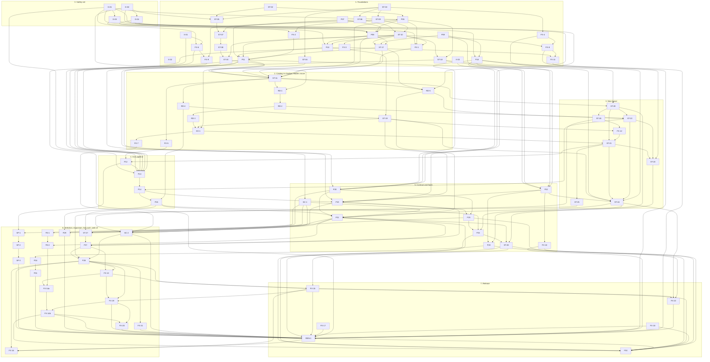

# 03 — Implementation plan

Status: reconciled plan for platform 3.0.0, 2026-10-01; revised the same day after the first two implementation
batches (pull requests #33 to #47) and after the owner's decisions on live watching. Baseline of the plan:
`origin/main` at `3ae2599`. The revision was checked against `origin/main` at `0aa73b4`. Revised again on
2026-10-02 after batches three and four (pull requests #48 to #66); that revision was checked against
`origin/main` at `f286723`. Revised a third time, later on 2026-10-02, after batches five to seven (pull
requests #68 to #76); that revision was checked against `origin/main` at `e0bae0c`. Revised a fourth time,
at the end of 2026-10-02, after batches eight to ten (pull requests #77 to #93); that revision was checked
against `origin/main` at `9b03c64`. Revised a fifth time, on 2026-10-03, after batches eleven to nineteen
(pull requests #95 and #97 to #133); that revision was checked against `origin/main` at `b3cb819`. Revised a
sixth time, on 2026-10-06, after P27 to FX-19 and the first-time-user review of the web UI (pull requests
#134 to #161); that revision was checked against `origin/main` at `b6caf2f`. Revised a seventh time, on
2026-10-07, after FX-20 to REN-1 and the rewrite of the user documents (pull requests #163 to #168); this
revision was checked against `origin/main` at `6f79344`.
This is the one ordered list of pull requests for `01-storage.md` and `02-services.md`. It replaces the two
separate PR lists the designs were drafted with; section 12 maps the old ids to the ids used here.

The plan has 91 items: the 67 of the first version, one more live item (P31) and twenty-three small fix items
(FX-1 to FX-22, with FX-14 split into FX-14a and FX-14b) that came out of the batches. Most items are one
pull request; P21 took five, FE-2 three and FX-13 two. Each has an id, a lane, its dependencies, the files it owns, the behaviour change it makes (if any),
a size (S: up to about 200 changed lines, M: up to about 600, L: more) and a brief that an implementer can
work from without reading the other briefs.

## Status (2026-10-07)

| Item | PR | State | Note |
|---|---|---|---|
| G-01 | #38 | merged | fake transport, fetch-flow goldens, the divergence table pinned row by row |
| G-02 | #40 | merged | fixture factory, 36 reader goldens |
| ST-02 | #36 | merged | |
| ST-03 | #37 | merged | |
| P07 | #35 | merged | |
| ST-05 | #45 | merged | |
| ST-06 | #46 | merged | |
| ST-09 | #44 | merged | |
| X-01 | #33 | merged | done outside the plan's brief, before the plan itself was merged |
| X-02 | #39 | merged | done outside the plan's brief, without waiting for P09 |
| G-04 | #41 | merged | |
| ST-04 | #47 | merged | |
| X-03 | #43 | merged | done and exceeded by the web security hardening pull request, outside the plan's brief |
| P20 (part) | #43 | merged | the optional access token for every `/api/*` route; the rest of P20 was done by #74 (below) |
| P25 (part) | #43 | merged | the Host allow-list is never widened; startup warning; both for `main.py --web`; the rest of P25 is not started |
| EX-1 (part) | #43 | merged | `GET /api/export/csv` no longer creates a file; the rest of EX-1 is not started |
| (research) | #42 | merged | push-channel measurements; they settle what P24 waited for and are the basis of P31 |
| P05 | #48 | merged | third batch; `API_BASE_URL` applies to every request |
| ST-07 | #49 | merged | third batch; deep verify and repair as well |
| ST-10 | #50 | merged | third batch; the Store half and the web job store. The CLI leases went to P10, the single-match guard and the import switch to FX-1 |
| G-03 | #52 | merged | fourth batch; 18 goldens of today's CLI |
| FX-4 | #53 | merged | decisions S12 and S13 |
| FX-2 | #54 | merged | |
| FX-3 | #55 | merged | |
| P09 | #56 | merged | a `sofascore.toml` is honoured from here on |
| P08 | #57 | merged | the web no longer imports the terminal UI |
| FX-6 | #58 | merged | parts 1 and 2; the burst allowance stays (decision D14) |
| ST-18 | #59 | merged | `--watch` opens the Store |
| FX-1 | #60 | merged | with the two web leftovers of ST-10 |
| ST-08 | #61 | merged | |
| ST-17 | #62 | merged | the follows table mirrors the league files and the config file |
| P10 | #64 | merged | with the CLI leases that ST-10 left; a refused run exits with 6 |
| P18 | #65 | merged | the new CLI exists next to `main.py`: `version`, `doctor`, `describe`, `config`, `diagnostics` |
| ST-30 | #68 | merged | the read API on the catalog |
| P11 | #69 | merged | headless runs appear in the job history and can be stopped from another process; `state.db` is at schema version 2 |
| FX-8 | #70 | merged | decision S15; the migration's log line is English |
| (diagnostics) | #71 | merged | not a plan item and not written from a brief (rule 9): the diagnostics bundle selects its job columns by name and leaves out the host name |
| SC-1 | #72 | merged | schema v1; its document is approved (decision P2, settled on 2026-10-02) |
| P22 | #73 | merged | the sink library and `ssc events`; no process hosts the dispatcher yet |
| P20 | #74 | merged | the `/api/v1` foundation; the access token itself was #43's |
| ST-11 | #75 | merged | the catalog is built on the first open, reconciled on every later one and kept current by the legacy writers |
| FX-5 | #77 | merged | eighth batch; with a fix commit: a fetched body of an unexpected shape is a failed request (`parse`) |
| RD-4 | #78 | merged | the counting rules beyond the brief are accepted (decision D21) |
| RD-1 | #80 | merged | the first reader of the catalog |
| RD-5 | #79 | merged | with a fix of `sofascore_scraper/store/sqlite.py`: closes of one connection are serialized (Python 3.10 crashed) |
| ST-20 | #82 | merged | the v3 writer, not yet called by the downloads; P23 calls `observe` |
| FX-9 | #83 | merged | ninth batch; decision P3: the coverage floor is 85 |
| FX-10 | #84 | merged | |
| FX-11 | #85 | merged | decision S15 is complete |
| (terminal menu) | #86 | merged | not a plan item and not written from a brief (rule 9): the terminal menu's clear, restore and data-folder move call the shadow hooks |
| (CI limit) | #87 | merged | not a plan item (rule 9): the time limit of the python jobs of CI is 30 minutes instead of 15 |
| (test robustness) | #88 | merged | not a plan item (rule 9): job threads are joined before a test's store is closed; `_winapi.CopyFile2` is recorded on Windows |
| RD-2 | #89 | merged | tenth batch; decision S14 is implemented |
| ST-19 | #90 | merged | decision S17 is implemented (`STORE_OPEN_RECONCILE_SECONDS`) |
| P23 | #91 | merged | `ssc watch`: the first host of the sinks; polling only |
| ST-26 | #92 | merged | |
| (job finish) | #93 | merged | not a plan item (rule 9): a job gives up its writer lease only after its last store access |
| (changelog) | #63, #66, #76 | merged | the changelog entries of batches four to seven, in three bookkeeping pull requests (rule 3) |
| (changelog) | #94 | merged | the entries of batches eight to ten and a release-notes pass; it changes only `CHANGELOG.md` |
| RD-3 | #97 | merged | eleventh batch; the planning of downloads, refreshes and "missing details" reads the catalog |
| ST-22 | #98 | merged | eleventh batch; season lists and schedule pages are written in the v3 layout |
| P24 | #95 | merged | eleventh batch; `ssc watch --source page`, the default |
| EX-1 | #99 | merged | the CSV export is computed from the Store when it is asked for |
| FX-12 | #100 | merged | accepted as a new item on 2026-10-02 |
| P31 | #101 | merged | `ssc watch --source direct`, an explicit opt-in |
| (summary CSV) | #102 | merged | not a plan item (rule 9): new downloads no longer write the per-season summary CSV, which ST-22 had kept as a bridge for RD-3 (decision S4) |
| FE-1 | #105 | merged | `05-web-ui.md`; approved by the owner with all 22 of its decisions on 2026-10-02 |
| ST-21 | #104 | merged | new matches are written in the v3 layout; the terminal menu's clear goes through the Store |
| FX-7 | #103 | merged | |
| FE-2 | #107 | merged | FE-2a: the new web UI's shell, design system and first screens; the old views moved under `/classic` |
| P12 | #106 | merged | |
| ST-25 | #108 | merged | |
| ST-24 | #109 | merged | `ssc backup`; backup format 2 and restore |
| ST-23 | #110 | merged | `ssc migrate` and `ssc catalog` |
| (export test) | #111 | merged | not a plan item (rule 9): the bound of ST-25's memory test, for the Windows runner |
| P13 | #113 | merged | one fetch pipeline for every download |
| SP-1 | #112 | merged | |
| (changelog) | #114 | merged | the entries of #94 to #113 and a release-notes pass; it changes only `CHANGELOG.md` |
| P14 | #116 | merged | |
| SP-2 | #115 | merged | |
| P15 | #117 | merged | |
| SP-3 | #118 | merged | all 21 sports are in the registry |
| P19 | #119 | merged | the data commands of `ssc`; `main.py` is a shim over them |
| (per-sport slices) | #121 | merged | not a plan item (rule 9): each sport requests the detail slices SofaScore offers for it; three proposals wait for the live validation (FX-16) |
| (Windows tests) | #120 | merged | not a plan item (rule 9): tests close the Store before they remove a data folder |
| P25 | #125 | merged | `ssc serve` replaces `main.py --web` |
| P21 | #122 | merged | first of five: the `auth` routes, the details of `/status`, the connection check, the sinks |
| P21 | #123 | merged | tournaments, seasons, events, slices, raw payloads and changes |
| P21 | #124 | merged | follows and the tournament search |
| P21 | #126 | merged | the job kinds export, backup, clear, rebuild and restore check; exports, backups, logs and diagnostics |
| P21 | #127 | merged | the legacy routes are adapters in `sofascore_scraper/web/api/legacy.py`; `src/web/routes/` is gone |
| ST-27 | #129 | merged | |
| SC-2 | #130 | merged | |
| P29 | #128 | merged | |
| FE-2 | #132 | merged | FE-2b: Exports, Backups, Maintenance, Logs, Sinks; Overview and Health from `/status` |
| FE-2 | #133 | merged | FE-2b: Follows, the Follow editor, Events, Event detail with the raw view, Corrections, quick search |
| P26 | #131 | merged | the terminal menu is removed |
| (dependencies) | #27, #29 | merged | not plan work: the frontend's minor and patch updates and the GitHub Actions updates, merged after `b3cb819` |
| P27 | #134 | merged | merged while the fifth revision was written; recorded in this one |
| ST-28 | #135 | merged | merged while the fifth revision was written; the boundary tests are strict, with no ratchet |
| (frontend audit) | #136 | merged | not a plan item (rule 9): Tailwind CSS 4 clears the `npm audit` advisory for `braces` (GHSA-vfj7-8cjw-p6xm) through `chokidar`, `fast-glob` and `micromatch` in `frontend/`, which #131 reported (supersedes #28); the browser floor is Safari 16.4, Chrome 111 and Firefox 128 |
| (frontend i18n) | #137 | merged | not a plan item (rule 9): vue-i18n 11 (supersedes #30); the eval-free check of #43 is kept |
| FX-18 | #139 | merged | |
| P28 | #140 | merged | before FX-13, which the plan had put first; FX-13 rebased on it, and the dependency is reversed since the sixth revision; its five schema models wait in `PENDING_MODELS` for FX-21 |
| FX-17 | #145 | merged | two Windows jobs, `store` and `rest`; the whole CI run went from 24.9 to 14.4 minutes |
| (dependencies) | #143, #146, #147, #148, #149 | merged | not plan work: vue-router 5, vite 8.3.2 with source-map-js 1.2.2 (GHSA-68fv-2mgg-jv7q), dependabot ignores TypeScript majors, the python minor and patch group, eslint 10.12 and vue-tsc 3.3.12 |
| FX-13 | #152 | merged | the sync reads the follows table; a real restore; the routes the new web UI lacked |
| FX-13 | #153 | merged | the running job's record is kept through a restore on Windows |
| FX-14a | #154 | merged | split from FX-14 on 2026-10-06: the newcomer pass of the first-time-user review |
| FX-15 | #155 | merged | |
| FX-19 | #156 | merged | new on 2026-10-06: the backend gaps of the review; team, player and match follows download |
| (changelog) | #158 | merged | the entries of #115 to #156 and a release-notes pass; it changes only `CHANGELOG.md` |
| (dependabot) | #159 | merged | not a plan item (rule 9): `pydantic-core` moves only together with `pydantic` |
| FX-14b | #161 | merged | split from FX-14 on 2026-10-06: the API features of FX-13 and FX-19 in the UI; the classic views removed |
| (user documents) | #163 | merged | not a plan item (rule 9): every user-facing document checked against the code for 3.0.0; what may not be published removed; its code follow-ups became FX-22 |
| FX-21 | #164 | merged | proposed by the sixth revision |
| FX-22 | #165 | merged | new on 2026-10-07, from #163's code follow-ups; it had no brief when it ran (the seventh revision adds one) |
| (README) | #166 | merged | not a plan item (rule 9): both READMEs rewritten from scratch for the 3.0.0 platform, five offline screenshots |
| FX-20 | #167 | merged | new on 2026-10-06; continued by a second agent after the first one's session ended before it pushed |
| REN-1 | #168 | merged | ran alone, with no other branch open (decision D1) |

Every other item is not started. 89 of the 91 items are merged or done, and two are to do: FX-16, after the
live validation, and P30, which comes after the release; section 18 says what remains before the 3.0.0
release. What this revision, the seventh (2026-10-07), changed:

- **FX-20 to REN-1 are recorded.** Four items (FX-21 #164, FX-22 #165, FX-20 #167, REN-1 #168) have a state
  and a paragraph "As built"; FX-22 was given by the orchestrator from the code follow-ups of the audit of
  the user documents (#163) and has a brief written after the fact. Every brief that one of them left a
  note for has it under "Notes from FX-20 to REN-1"; `01-storage.md` (the Settings page's settings in a
  backup and a restore), `02-services.md` (the search as the user types, the suggestions route, the
  recorded job spec, the restore rule, the package), `04-schema-v1.md` (the odds and standings records in
  version 1) and `05-web-ui.md` (the screens of FX-20) describe what was built, and section 11 lists the
  corrections. The two pull requests that were not plan items (#163 and #166) have a row in the status
  table and a line in section 1 (rule 9).
- **The package is `sofascore_scraper`.** REN-1 renamed `src`; these documents write the package's paths
  with the new name, in the briefs, the ownership chains of section 6 and the prose. A `file:line`
  reference keeps the line it had at the commit its revision names (`3ae2599`, `b3cb819`, `b6caf2f`, …):
  REN-1 rewrote module paths in place and kept every file's line count, so the rename moved no line. Paths
  of files removed before the rename (`src/web/routes/`, `src/ui/`, `src/web/fetch_job.py`,
  `src/SofaScoreUi.py`, `src/fsutil.py` and the draft names that were never built) keep the old form.
  The systemd units of `docs/deploy/` ran `python -m src.cli.main` and broke with REN-1; this revision's
  pull request corrects them first.
- **Decisions of 2026-10-07** (section 13), the owner's: the raw research files keep the push server's
  address; before the live validation the orchestrator tests every feature end to end through the web UI
  against the real site (1 request per second, the owner's Chrome, `direct` excluded); the repository's
  description and its 14 topics were updated. Open for the owner: whether 3.0.0 is published as a package
  (the wheel lacks the Store's `.sql` files, the locales and the web build), and whether the type-ahead
  list stays grouped by kind.
- **One new item, FX-22** (merged): the settings saved on the Settings page in backups and restores, the
  live browser profile on a volume in the Compose example, the start scripts that follow the language set
  in the app, and the stale 2.x texts of `ssc doctor`, `main.py --help`, `ssc config` and the image label.
  Its dependencies are recorded as built (FX-15, ST-24, P25); REN-1 depended on it, since REN-1 ran only
  when no other branch was open.
- **Sections 14 to 18.** Section 14 has the packaging question; sections 15, 16 and 17 have the findings
  of these pull requests with their owners (counts in the pull request of this revision) and the work
  notes in the closing paragraph of section 17; section 18 is rewritten for what remains now.
- **Estimates.** By lines added in the pull request: REN-1 about 4,330 (mechanical; about 4,300 removed),
  FX-20 about 2,620, FX-22 about 880 and FX-21 about 780. FX-21 was two steps larger than estimated (S to
  L: the three examples and the text pass over the score fields), FX-20 and REN-1 one step (M to L); FX-22
  was sized when it was recorded. Only FX-16 (S) and P30 (S) are left; read both two steps up.

What the sixth revision (PR #162, 2026-10-06) changed. At that time 85 of the then 90 items were merged or
done, one was in progress (FX-20) and four were to do (FX-21, REN-1, FX-16 and P30); FX-20 was written from
a brief of the orchestrator after FX-14b, and its brief in section 10 records its scope:

- **P27 to FX-19 are recorded.** Ten items (P27, ST-28, FX-18, P28, FX-17, FX-13, FX-14a, FX-15, FX-19,
  FX-14b) have a state and a paragraph "As built"; FX-13 took two pull requests (#152, and #153 for the
  restore on Windows). Every brief that one of them left a note for has it under "Notes from P27 to FX-19";
  `01-storage.md`, `02-services.md`, `04-schema-v1.md` and `05-web-ui.md` describe what was built, and
  section 11 lists the corrections. The pull requests that were not plan items (#136, #137, #143, #146 to
  #149 and #159) have a row in the status table and a line in section 1 (rule 9); #158 added the changelog
  entries of #115 to #156.
- **The first-time-user review of 2026-10-06.** An offline review of the new web UI by a newcomer's tasks (at
  `b567409`; the report and its 120 screenshots are outside the repository) found that the owner could not
  find "add a league" once data existed, that team, player and match follows downloaded nothing, and that
  seasons, data types, restore and the deletion of one league's data could not be chosen in the UI. FX-14
  was split into FX-14a (the newcomer pass: entry points for adding a league, plain words in both languages,
  help and a glossary, finish notices) and FX-14b (the API features in the UI; the classic views removed),
  and FX-19 was added for the backend gaps. After FX-14b the review's twelve tasks were done again offline:
  all pass except Settings (hard) and live watching (hard by design, `00-platform.md` section 8).
- **Decisions** (section 13). The owner: D1, the package becomes `sofascore_scraper` (REN-1 goes ahead when
  no other branch is open); team, player and single-match follows work in 3.0.0; a type-ahead search like
  the site's (FX-20). Delegated: S11 closed; the four old backup scope names deprecated in 3.0.0 and
  removed in P30; the two ST-27 rules kept as built; the scheduler's `every` counted from the last run; the
  odds country recorded only when the user sets it; the history pruning task off by default; pydantic-core
  updated only with pydantic.
- **New items.** FX-19 (merged), FX-20 (in progress) and FX-21 (proposed by this revision: the five schema
  models of P28 enter schema v1). A docs-only pull request cannot do FX-21, because the document test
  compares the generated field tables of `04-schema-v1.md` with `schema.MODELS`; this revision adds the five
  blocks as copies of the models, which FX-21 turns into generated, checked tables.
- **Changed dependencies.** REN-1 no longer waits for FX-16: the rename goes before the live validation,
  and FX-16 waits for REN-1. REN-1 waits for FX-19, FX-20 and FX-21; P30 waits for FX-14b instead of FX-14.
  Levels and chains are in sections 5 and 6.
- **Sections 14 to 18.** Questions of section 14 that the batch answered say so; sections 15, 16 and 17
  have the findings of the batch with their owners (counts in the pull request of this revision) and the
  work notes in the closing paragraph of section 17; section 18 is rewritten for what remains now.
- **Estimates.** By lines added in the pull request: FX-19 about 5,270, P28 about 3,800, FX-14b about 3,190
  (and 6,740 removed), FX-13 about 2,780 over two pull requests, FX-14a about 2,230, P27 about 1,530, FX-15
  about 1,290 (and 1,860 removed), ST-28 about 490 (and 970 removed), FX-18 about 240 and FX-17 about 40.
  Five of the seven items that had an estimate were one step larger (P27, FX-13 and FX-15 from M to L,
  ST-28 and FX-18 from S to M); P28 and FX-17 were as estimated. FX-14a, FX-14b and FX-19 were sized when
  they were added. The rule stands: read every remaining size one step up.

What the fifth revision (PR #138, 2026-10-03) changed. At that time 75 of the then 86 items were merged or
done, two were in progress (P27 and ST-28, which merged as #134 and #135 while it was written) and nine were
to do:

- **Batches eleven to nineteen are recorded.** Twenty-seven items (RD-3, ST-22, P24, EX-1, FX-12, P31,
  FX-7, ST-21, FE-1, P12, FE-2, ST-25, ST-24, ST-23, SP-1, P13, SP-2, P14, P15, SP-3, P19, P21, P25, P29,
  ST-27, SC-2, P26) have a state and a paragraph "As built"; P21 took five pull requests, and FE-2 three in
  the two parts the owner split it into (FE-2a and FE-2b). Every brief that one of them left a note for has
  it; `01-storage.md`, `02-services.md`, `04-schema-v1.md` and `05-web-ui.md` describe what was built, and
  section 11 lists the corrections. Four pull requests were not written from a brief (#102, #111, #120,
  #121); each has a row in the status table, a line in section 1 and its leftovers in section 16 (rule 9).
  The per-sport table of #121 is a new section of `docs/all-sports/README.md` ("Maç detay dilimleri, spor
  başına"). Several feedback lines of the first batches were overtaken by later pull requests of the same
  revision (the terminal menu that P26 removed, the summary CSV that #102 dropped, the need rules that
  ST-27 rewrote); the documents follow the code at `b3cb819`.
- **Decisions of 2026-10-02 and 2026-10-03** (section 13): the web UI is designed and built from scratch on
  the same stack; `05-web-ui.md` is approved with all 22 of its decisions, and FE-2 was split in two; S18 as
  chosen; FX-12 as a new item; the rule for the Windows CI job; Windows and macOS best-effort, with merges on
  a green Linux CI plus a local full run; the live validation against the real site postponed to the end of
  the project and done once, in a busy match window; the Saturday watch-run timer cancelled.
- **Six new fix items** for what no planned item removes: FX-13 (the routes the new web UI still lacks, the
  sync from the follows table, the Store closed after a data-folder change), FX-14 (the last screens; the
  classic views removed), FX-15 (dead code and stale names), FX-16 (the slice proposals of #121 after the
  live validation), FX-17 (the Windows job of CI passed 25 minutes and is split; one job with the Parquet
  extra) and FX-18 (the cancel checks of the request path). FX-17 and FX-18 can start now.
- **Changed scopes and dependencies.** FE-1 depends on P20 and FE-2 on FE-1 and P21: the owner let both
  start before P21 and P27, and the slice selection of the Follow editor went to FX-14. P28 depends on
  FX-13 (both edit the event and tournament routes) and also renames the heading of `04-schema-v1.md`
  section 9 with the assertion that pins it, and corrects the generated schema texts. P30 also removes the
  remaining fetcher faces of P15, the legacy parser of `main.py` and the fallback of `docker/entrypoint.sh`.
  REN-1 and P30 depend on the new items. Section 6 has the chains of the new items.
- **Sections 14 to 17.** Section 15 has rows 97 to 100, and 52 earlier rows say what removed them or who has what is left; section 16 has 146 new follow-ups with their owners, and 90 earlier rows are updated; section 17 has 48 more points that are deliberately not planned, ten earlier ones are corrected, and the work notes of the batches are in its closing paragraph. Questions of section 14 that the batches answered say so.
- **Section 18 is new**: what remains before 3.0.0, step by step, for the owner.
- **Estimates.** By lines added in the pull request: FE-2 about 18,400 over three pull requests, P21 about
  16,500 over five (about 9,500 of them two generated files), ST-21 about 8,100 (6,300 of them regenerated
  goldens), P19 about 4,500, SP-3 about 3,800, ST-24 about 3,500, P24 about 3,000, ST-23 about 2,900, P13
  about 2,850, P31 about 2,150, ST-22 and P14 about 2,000 each, P25 about 1,800, P29 about 1,600, ST-25
  about 1,550, SP-1 and SC-2 about 1,450 each, EX-1 about 1,300, FE-1 about 1,250, SP-2 about 1,150, P15
  about 870, P12 and ST-27 about 800 each, RD-3 about 700, FX-12 about 520, P26 about 420 (and 4,160 lines
  removed) and FX-7 about 290. Fifteen of the twenty-seven were larger than estimated, each by one step
  (RD-3, ST-22, P31, FE-1, P12, ST-25, ST-24, SP-1, SP-2, P15, P25, P29, ST-27 and SC-2 from M to L, FX-7
  from S to M). Their sizes are corrected in sections 9 and 10. For the items still to do, read every size
  one step up, and two steps for an item that brings goldens.

What the fourth revision, the third of 2026-10-02 (PR #96), changed. At that time 48 of the then 80 items
were merged or done, three were in progress (RD-3, ST-22 and P24) and two were partly done by #43 (P25 and
EX-1):

- **Batches eight to ten are recorded.** Twelve items (FX-5, RD-4, RD-1, RD-5, ST-20, FX-9, FX-10, FX-11,
  RD-2, ST-19, P23, ST-26) have a state and a paragraph "As built"; every brief that one of them left a
  note for has it under "Notes from earlier items"; `01-storage.md`, `02-services.md` and
  `04-schema-v1.md` describe what was built, and section 11 lists the corrections. Three pieces of work
  were finished by a second agent: ST-20, whose last commit the first agent could not push (403), RD-5's
  rebase onto main, and the terminal-menu fix #86. Four pull requests were not written from a brief
  (#86, #87, #88, #93); each has a row in the status table, a line in section 1, and what it left in
  section 16 (rule 9). The four readers that read the catalog now (RD-1, RD-2, RD-4, RD-5) changed
  reader and route goldens, three of them beyond what their briefs expected; every difference was listed in
  the pull request and is summarised in the "As built" paragraphs.
- **Decisions settled on 2026-10-02** (the owner's delegate). S17 as chosen: the reconcile on open skips
  the pass over the legacy event directories when an open of the same folder did it less than a minute
  ago (ST-19, #90; `STORE_OPEN_RECONCILE_SECONDS`). P3 as chosen: the coverage floor is 85 (FX-9, #83).
  D21 (new): RD-4's two counting rules, which RD-2 applies to the match lists as well: the match count
  comes from the catalog's events with `FETCH_ONLY_FINISHED` applied when the page is read, and a match
  with stored details that no schedule lists counts as a match. S14 (no export-CSV fallback of the match
  list) is implemented by RD-2 and S10 (the newest season-list file of any name) by RD-5 in every reader.
  One new point needs the owner: S18, `EventStore.delete` against decision 4 of `01-storage.md`
  (section 13).
- **One new fix item**, FX-12, which can start now: a write of the v3 writer keeps its change row when it
  is interrupted between the payload and the change log, and `Store.close()` waits for a job that is
  finishing (the last path of the crash that #93 fixed); with two small leftovers of FX-11 (a bare
  `sqlite3.OperationalError` out of `open_store`, seven Turkish log lines of the Store). P23's live service
  already calls `observe`, so the first defect is reachable by `ssc watch` today. ST-21 depends on it.
- **Changed scopes.** ST-21 (the terminal menu's clear goes through `MaintenanceService.clear` under the
  `maintenance` lease, which ST-19 could not do; depends on FX-12), ST-23 (owns `sofascore_scraper/store/changes.py`,
  which has no owner after ST-20; copies `_extra/` and `_history/`), P13 (keeps the `parse` mapping of
  FX-5's fix commit and both cancel checks of FX-9; removes the falsy-body divergence of the async path
  and the two reasons of a 404), P19 and P21 (the live fields of `/api/v1/status` and `ssc status` from
  `live_status(store)`, which P23 did not add to `sofascore_scraper/web/api/v1/meta.py`), P24 (a cancel check in
  `_wait_for_slot`), P15 (the per-league disk walk and the size cache), and the file chains of section 6.
- **Sections 15, 16 and 17** have the findings of the three batches: rows 89 to 96 of section 15, rows of
  earlier revisions that the batches removed say "removed by", the follow-ups with their owners, and what
  is deliberately not planned, with the work notes of the batches.
- **Estimates.** By lines added in the pull request: ST-19 about 7,500 (6,450 of them the generated
  backup golden), ST-20 about 4,200, P23 about 3,750, ST-26 about 1,250, FX-5 about 1,250, RD-5 about
  1,100, RD-4 and RD-1 about 1,050 each, RD-2 about 700, FX-11 about 650, FX-10 about 500 and FX-9 about
  130. Nine of the twelve were larger than estimated: FX-5, RD-1 and FX-11 by two steps (S to L), FX-10
  by one (S to M), RD-4, RD-5, RD-2, ST-19 and ST-26 by one (M to L). Their sizes are corrected in
  sections 9 and 10. The rule of the last revisions holds: read every remaining size one step up, and two
  steps for an item that brings goldens; a fix item estimated S is better read as M.

What the second revision of 2026-10-02 (PR #81) changed. At that time 36 of the then 79 items were merged
or done, five were in progress (FX-5, RD-4, RD-5 and RD-1 as open pull requests, ST-20 without one) and two
were partly done by #43:

- **Batches five to seven are recorded.** Seven items (ST-30, P11, FX-8, SC-1, P22, P20, ST-11) have a
  state and a paragraph "As built"; every brief that one of them left a note for has it under "Notes from
  earlier items"; `01-storage.md` and `02-services.md` describe what was built, and section 11 lists the
  corrections. Three of the seven (ST-11, P20 and P22) were cut off by a usage limit and finished by a
  second agent from the first one's worktree, which is why their pull requests describe two passes. One
  pull request was not written from a brief: #71 took the host name out of the diagnostics bundle after
  P11 had put it there; it is recorded in sections 1, 15 and 16 (rule 9).
- **Decisions settled on 2026-10-02.** P2: the owner delegated the approval of `04-schema-v1.md` to the
  orchestrator, who approved schema v1 as written; the 28 choices of its section 9 stand. S15 as chosen
  (FX-8), S16 as chosen (ST-20 implements it), D19 as built by P09, and one new point, D20: job events
  carry the origin of the job with host name and pid, and sinks and API v1 show it. Two new points need
  the owner: S17 (the cost of the reconcile on open) and P3 (the coverage floor); section 13.
- **Three new fix items**, each with every dependency merged: FX-9 (a cancel check after the request
  semaphore, which ends a test that fails on a slow CI runner, and the coverage floor), FX-10 (three
  places where a host name, a sink address or the value of an unknown sink option can still reach the
  diagnostics bundle, an error text or `config show`) and FX-11 (`state.db` and `catalog.db` follow the
  umask, which completes decision S15; the Store's remaining Turkish log lines).
- **Changed scopes.** P19 (owns `sofascore_scraper/cli/commands/meta.py`: `describe schemas` and `ssc version` show the
  data schema; the release-notes pass over the changelog), ST-22 (Store read methods for categories and
  sports, which P21 needs), ST-19 (the terminal UI's clear and restore call the Store; the bound on the
  reconcile on open that decision S17 chooses), P21 (the `/api/v1/auth` routes that the `Link` headers
  already name; the legacy settings route writes through the overrides file; more files of P20), P23 (the
  live fields of `/api/v1/status`; one envelope for the sinks and the schema), ST-24 (the pruning defaults
  leave the dispatcher), RD-3 (one helper of the fetch-flow tests), SP-1 to SP-3 and P28 (the schema's
  test and goldens), P25 (the deployment pages say that the attempt limit counts per remote address), P13
  (depends on FX-9), P19 and ST-24 (depend on P22, whose files they edit), P30 and REN-1 (depend on the
  new fix items).
- **Sections 15, 16 and 17** have the findings of the three batches: rows 77 to 88 of section 15, the
  follow-ups with their owners, and what is deliberately not planned.
- **Estimates.** By lines added in the pull request: SC-1 about 7,500 (4,100 of them golden JSON and 870
  the document), P20 about 6,800 (1,900 of them the committed OpenAPI document), P22 about 4,650, ST-30
  about 3,450, P11 about 3,350 and ST-11 about 2,200, against an estimate of L for SC-1 and P11 and of M
  for the other four; FX-8 had 170 lines, as estimated (S). The sizes of ST-30, ST-11, P20 and P22 are
  corrected in sections 9 and 10. The rule of the last revision holds: read every remaining size one step
  up, and two steps for an item that brings goldens.

What the first revision of 2026-10-02 (PR #67) changed. At that time 29 of the then 76 items were merged or
done and three were partly done by #43; the last three of its batch (ST-17, P10, P18) were written from the
briefs on main at `0aa73b4` plus the feedback of the items before them, and merged while that revision was
written:

- **Batches three and four are recorded.** Sixteen items (P05, ST-07, ST-10, G-03, FX-4, FX-2, FX-3, P09,
  P08, FX-6, ST-18, FX-1, ST-08, ST-17, P10, P18) have a state and a paragraph "As built"; every brief that
  one of them left a note for has it under "Notes from earlier items"; the design documents `01` and `02`
  describe what was built (section 11 lists the corrections).
- **ST-10's leftovers were delivered by two other items.** ST-10 (#50) could not touch `main.py`,
  `src/web/routes/matches.py` and the locale files. P10 (#64) took the CLI leases (the writer lease for
  headless, `--refresh-only` and `--recheck-unavailable` runs; `watcher:<sport>` for `--watch`; a refused
  lease prints the holder and exits with 6). FX-1 (#60) took the single-match guard and the import switch of
  `sofascore_scraper/web/jobs.py`.
- **Decisions settled on 2026-10-02** by the owner's delegate: S12 and S13 as chosen (implemented by FX-4),
  D14 "leave the burst allowance as it is" (FX-6 implemented parts 1 and 2 only), D18 as chosen (polling
  alone stays selectable as `--source poll`, and the legacy `--watch` alias maps to it). Three new points
  need the owner: S15, S16 and D19 (section 13).
- **One new fix item**, FX-8 (lock files follow the umask; the migration's log line in English), and changed
  scopes: P10 and FX-1 (above), P19 (the three global flags P18 left out, the JSON log format, the doctor's
  check list), ST-11 (depends on ST-17; owns `scripts/catalog_tool.py`), ST-30 (owns
  `sofascore_scraper/store/changes.py` for `ChangeLog.list`), ST-20 and ST-26 (own `sofascore_scraper/store/verify.py` for invariants I7
  and I8; ST-20 also owns the indexer for the v3 sources), EX-1 (depends on P11; removes the export phase in
  `sofascore_scraper/services/sync.py` and `src/web/fetch_job.py`), P13 (owns `sofascore_scraper/client/transport.py`), P23 and P30 (own
  `sofascore_scraper/store/watch.py`), P24 (the allow-list of one test in `tests/test_client.py`), ST-28
  (`sofascore_scraper/store/files.py`), P30 (depends on ST-28; switches the modules that still read a setting from the
  environment), FX-5 (upper-case legacy round files).
- **Rules 2, 3 and 7** say how a parallel batch handles the changelog, the design documents and the Store's
  root module (section 2).
- **Sections 15, 16 and 17** have the defects that G-03 pinned in today's CLI and the other findings of the
  two batches, the follow-ups with their owners, and what is deliberately not planned.
- **Estimates.** The two batches were again larger than estimated. By lines added in the pull request:
  P18 about 4,100, G-03 about 3,900 (920 of test code, 200 of the sitecustomize module, 2,770 of golden
  JSON), P09 about 3,450, ST-10 about 2,300, P05 about 2,250, ST-17 about 2,000, ST-18 about 1,900, P08 and
  P10 about 1,700 each, all against an estimate of M; FX-3 about 1,250, FX-6 about 770, FX-1 about 630, FX-4
  about 390 and FX-2 about 320, each against an estimate of S. Their sizes are corrected in sections 9 and
  10. For the items still to do, read every size one step up, and two steps for an item that brings goldens.

What the revision of 2026-10-01 (PR #51) changed:

- **Owner decisions of 2026-10-01 on live watching** (`00-platform.md` sections 1 and 8). Live data is not part
  of the web UI and has no HTTP endpoint; `watch` is a CLI service that delivers to sinks. Live has two
  selectable push sources, `page` (default) and `direct` (explicit opt-in, with warnings), and polling as the
  fallback that is always present. Changed items: P22, P23, P24, P25, FE-1, FE-2, P09 (the `[live]` section);
  new item: P31.
- **Items done outside their brief** (X-01, X-02, X-03 and parts of P20, P25 and EX-1) are recorded as built,
  and what they left over is placed (sections 10 and 16).
- **Seven fix items** for defects and follow-ups that no planned item removed: FX-1 (single-match fetch says
  when SofaScore blocks), FX-2 (status and settings routes), FX-3 (one SQLite connection module), FX-4 (file
  mode and sub names in the Store), FX-5 (presence predicates), FX-6 (request budget after a cancel), FX-7
  (legacy CSV columns).
- **Every brief** of a merged or open item has a paragraph "As built"; every brief that a merged pull request
  left a note for has a paragraph "Notes from earlier items".
- **Three new sections**: known defects pinned by characterization tests (15), follow-ups and where they went
  (16), what is deliberately not planned (17).
- **Estimates.** The first batches were larger than estimated: G-01 about 2,480 lines, G-02 about 7,100 with
  its goldens, ST-04 2,850, ST-09 about 2,050, each against an estimate of M. The sizes of those four are
  corrected; test-heavy items that are still to do should be read as one size up.

## 1. Before anything else

The three pull requests the first version of this plan waited for (#24, #23 and #32) are merged, and so is
everything that was in review during the revisions: #41 (G-04), #47 (ST-04), #43 (web security hardening),
the third batch (#48 to #50), the fourth batch (#52 to #65), batches five to seven (#68 to #75) and
batches eight to ten (#77 to #93), batches eleven to nineteen (#95 and #97 to #133), the items from P27
to FX-19 (#134 to #161) and those from FX-20 to REN-1 with the two documentation pull requests (#163 to
#168). The gate "after open PRs" no longer exists. No plan item is in progress at `6f79344`. The changelog
entries were added by bookkeeping pull requests up to #156 (#63, #66, #76, #94, #114 and #158, merged); the
entries of #161 and #163 to #168 are still in the descriptions of their pull requests (section 18; #159
changed only the dependabot configuration). Section 5 says what can start. What the merged pull
requests mean for every pull request from now on:

- **#41 (G-04).** A pull request that changes a route signature, a docstring, a response model or the FastAPI
  and pydantic pins regenerates `tests/snapshots/openapi-legacy.json` (section 7) and lists the differences.
- **#47 (ST-04).** A pull request that adds, removes or moves a file-system or sqlite3 call outside
  `sofascore_scraper/store/` edits the ratchet baseline in the same pull request (section 7).
- **#43 (web security hardening).** It was not written from a brief of this plan. It covers X-03 and parts of
  P20, P25 and EX-1; section 10 says what is left of each. It changed `main.py`, `sofascore_scraper/config_manager.py`,
  `sofascore_scraper/bridge_health.py`, `sofascore_scraper/challenge_solver.py`, `sofascore_scraper/redact.py`, `sofascore_scraper/web/app.py`, `src/web/fetch_job.py`,
  three route modules (`api.py`, `data.py`, `leagues.py`), `tests/conftest.py`, both locale files, the
  frontend, the Docker files and the four export goldens of G-02, and it added `sofascore_scraper/private_files.py`,
  `sofascore_scraper/web/security.py` and `src/web/routes/auth.py`. The briefs of the items that own or pin those files
  (G-03, P05, P08, P09, ST-10 and FX-6) cite line numbers from before it.
- **#52 (G-03).** A pull request that changes `main.py`, or a message or a log line that is printed during a
  CLI run, regenerates the CLI goldens (section 7) and lists the differences. Log lines are part of stdout
  today, so a reworded log message changes a golden.
- **#56 (P09).** A `sofascore.toml` in the working directory or in the config directory is read by every
  process that imports `sofascore_scraper.config_manager`. The test suite runs with `SOFASCORE_CONFIG=none`
  (`tests/conftest.py`); a subprocess that a test starts needs the variable in its own environment.
- **#50 and #59 (product code opens the Store).** The first open of a data directory logs one line per
  state migration at INFO, on stdout: `Store: state.db migration applied: 0001_initial` and, since #69,
  `Store: state.db migration applied: 0002_job_manager`. The line is English since #70; before, it read
  `Store: state.db geçişi uygulandı: <name>`. An item that makes a command open the Store for the first
  time gets the pair in the command's CLI golden on a fresh directory: #59 added the first line to
  `watch_event_ids.golden.json`, #64 to the goldens of the headless runs, and the pair now stands in
  seven places of five goldens. The shadow mode of ST-11 (#75) added no line to a golden: its reconcile
  on open logs at DEBUG. `tests/conftest.py` closes every Store of the registry after each test, so a
  fixture with a wider scope than one test must not hold a Store.
- **#55 (FX-3).** Importing `sofascore_scraper.store.catalog` or `sofascore_scraper.store.state` also loads `sofascore_scraper.store.sqlite`; a test
  that pins loaded modules lists it.
- **#64 (P10).** The command line takes the data directory's leases: `writer` for a headless download, a
  refresh and a recheck, `watcher:<sport>` for `--watch`. A lease is not re-entrant in one process, so an
  item that adds a second acquirer to the CLI process removes `main.py`'s (P11).
- **#65 (P18).** A new command is a new module under `sofascore_scraper/cli/commands/`; nothing shared is edited. The
  error codes, exit codes and HTTP statuses come from the one table in `sofascore_scraper/errors.py`.
- **#69 (P11).** Jobs go through `JobManager` (`sofascore_scraper/jobs/manager.py`), for the web and for the headless
  runs of `main.py`, which now appear in the job history. `state.db` is at schema version 2; the next
  state migration is `0003`. Opening a second job store no longer interrupts a running job, so a test
  simulates a crash with `store.close()` (the lease drops and the row stays running). A migration-runner
  test that needs a version-1 world uses the fixture `first_migration_only` of `tests/test_store_state.py`.
- **#71 (diagnostics fix).** Not written from a brief. The diagnostics bundle selects the job columns by
  name (`_JOB_COLUMNS` in `sofascore_scraper/diagnostics.py`): a column that a later migration adds to `jobs` does not
  reach the bundle unless it is added to that list, and a host name is masked wherever it stands in a job
  row. The bundle is made to be handed to other people; sinks and API v1 are not, and they show the
  origin of a job as it is (decision D20).
- **#72 (SC-1).** The field tables of `04-schema-v1.md` are generated from `sofascore_scraper/schema/models.py`, and
  every example of the document is validated against the JSON Schema. A change to a table is made in the
  models and regenerated (section 7), or `tests/test_schema_v1.py` fails. The same test pins the heading
  line of the document's section 9.
- **#73 (P22).** The secret scanner of the repository reads every commit of a pull request and flags a
  variable named `password` (probably also `secret` and `token`) that is assigned a string literal,
  whatever the value. A test assembles a fake credential at run time from visibly fake parts and does not
  name the variable after a credential; a flagged commit has to be rewritten, not ignored.
- **#74 (P20).** `/api/v1` exists. A new v1 router is one more entry of the tuple in
  `sofascore_scraper/web/api/v1/__init__.py`; every legacy route has a row in `LEGACY_SUCCESSORS`
  (`sofascore_scraper/web/api/__init__.py`), and a test fails on a missing or a stale row; after a change to a v1 route
  the committed document is regenerated with `python -m sofascore_scraper.web.openapi --write`, and a new GET is added
  to `READ_ONLY_GETS` in `tests/test_web_hardening.py`.
- **#75 (ST-11).** `open_store` builds the catalog on the first open and reconciles it on every later
  one, and every write of the legacy writers is followed by a `shadow_*` hook of the Store. The suite
  runs with `STORE_SHADOW_CHECK=1` (`tests/conftest.py`): a product write under `match_details/`,
  `matches/`, `seasons/`, `score_changes.jsonl` or `league_seasons.csv` that no hook follows fails the
  test with "written without a shadow hook afterwards", and after every test that wrote data the catalog
  must equal a fresh rebuild. A test that opens a Store on a hand-built catalog passes
  `sync_catalog=False`, or the open reconciles the catalog against the files (section 7).
- **#77 (FX-5).** Every slice registered in `DETAIL_SLICES` has a presence rule of its own in
  `_BODY_RULES` of `sofascore_scraper/slices.py`, and `slices.slice_body_state(key, body)` answers data, no data or
  malformed for any body; a pull request that adds a slice adds its rule, or
  `test_every_registered_slice_has_a_rule_of_its_own` fails. `DERIVE_VERSION` is 2: a change of a rule
  that alters the rows the same files give bumps it, which rebuilds every catalog once, and the nine
  goldens that record it are regenerated (section 7).
- **#78, #79, #80 (RD-4, RD-5, RD-1).** The dashboard, the statistics, the season lists, the league sports
  and the match detail read the catalog. A test that writes or edits files while a Store of that directory
  is open, and then calls a reader that touches no file, must reopen the Store (`open_store(dir).close()`)
  first: the recorder of the shadow check resyncs only when a product frame touches the file system, and a
  reader that goes through the Store touches none (section 7). A legacy GET route may now create and update
  the derived files under `.meta/` (`schema.json`, `catalog.db`) on its first read: the read-only check of
  `tests/test_web_hardening.py` opens the Store before it takes its digest, and a new route that reads the
  Store is added to `GETS_THAT_MAY_WRITE_A_CACHE` there.
- **#79 (RD-5).** `Connection.close` in `sofascore_scraper/store/sqlite.py` is serialized by a re-entrant module lock;
  two threads that closed one connection at once crashed Python 3.10. Closing a Store from one thread
  while another thread is inside a read is still outside the contract of `close_all`.
- **#82 (ST-20).** `EventStore.put`, `observe`, `reset_empty_markers` and `delete`, `ChangeLog.append` and
  the change-log segments under `changes/` exist and are tested with crash injection
  (`tests/test_store_crash.py`); the downloads do not call them yet (ST-21). Taking the writer lease
  removes the writer's staging entries under `.meta/tmp`, the entries of no lease that are older than a
  day, and what is left in `.meta/trash` (decision S16). Store tests
  that start processes or write many files are several times slower on the Windows runner: keep trees
  small and subprocess counts low.
- **#83 (FX-9).** The coverage floor is 85 (`pyproject.toml`); the coverage job measured 91.10 % on the
  pull request. An item that deletes code together with its tests has about six points of room.
- **#85 (FX-11).** A place that may create a SQLite file of the data directory calls
  `sqlite.create_database_file(path)` before a bare `sqlite3.connect(path)`, or uses `sqlite.connect()`,
  which does it; `tests/test_store_sqlite.py::test_every_new_database_file_is_created_with_the_store_file_mode`
  lists the creating places.
- **#86 (terminal menu hooks).** Not written from a brief; it is the hook half of point (1) of ST-19's brief,
  and it was finished by a second agent after an interruption. `_clear_all_data`, `_clear_selected_data`,
  `restore_data` (only when a data tree was restored) and `_change_data_directory` with "move data" in
  `src/ui/settings_ui.py` call `shadow_cleared` in a `finally` around their file operations (`:621`, `:683`,
  `:546` and `:204` at `9b03c64`), so the catalog describes what reached the disk also when the operation
  stops half way, and a failing hook does not fail the operation. `tests/test_settings_ui_catalog.py` drives
  the menu functions on a real data directory with the Store already open; its half-way tests break the clear
  through the module's own `shutil` name, so the item that moves the menu's clear into the Store (ST-21)
  changes those tests to make the Store's delete fail (for example by patching `sofascore_scraper.store.files.remove_tree`).
  The suite's audit hook reports both paths of a copy as written, the source included, so a test that copies
  out of a data directory expects that one report (`check_reports_only_the_copy_source`). The menu still takes
  no lease and still empties `datasets/` and `reports/` (ST-21).
- **#87 (CI time limit).** Not written from a brief. `timeout-minutes` of the `python` matrix job in
  `.github/workflows/ci.yml` is 30 (`:56` at `9b03c64`): a guard against a hung run, about twice the slowest
  normal run, not a performance budget. The Windows job, which is best-effort and shows no test result when
  the limit cancels it, took 10 to 15 minutes on main when it merged; since then ST-20 took 13 min 10 s, ST-26
  15 min 30 s and P23 19 min 9 s. A pull request that adds subprocess or file-heavy tests keeps its trees
  small and its subprocess counts low (ST-20's note), because starting a process and writing files are several
  times slower on the Windows runner. `latest-deps.yml` (20 minutes, Linux only) and the browser job (15
  minutes) are unchanged.
- **#88 (test robustness).** Not written from a brief; test code only. `tests/conftest.py` has `job_threads()`
  and `join_job_threads(before, timeout=20)` (`:454` and `:459` at `9b03c64`): the `store` fixtures of
  `tests/test_job_manager.py` and `tests/test_api_v1_jobs.py` join the job threads (`job-*`) that started
  during the test before they close the store, and a thread still alive after 20 s fails the test. A fixture
  that starts background jobs does the same, because closing a job store while a job thread is inside SQLite
  can kill the whole test session (4 of 100 runs before the fix). `_winapi.CopyFile2`, the only audit event of
  `shutil.copy2` on Windows with Python 3.12 and later, is in `FS_AUDIT_EVENTS` and `_WRITE_AUDIT_EVENTS`
  (`:167` and `:368`), so the shadow check and the store-boundary recorder see such a copy on Windows too;
  `check_reports_only_the_copy_source` (`tests/test_settings_ui_catalog.py:111`) is strict again. The product
  defect behind the crash was fixed by #93.
- **#90 (ST-19).** Backup and clear go through the Store (`store.backup`, `Store.clear`) and the services
  `BackupService(store)` and `MaintenanceService(ctx=None, *, store=None)`; `Store.catalog_current` says
  whether the catalog could be brought up to date, and a reader that plans work refuses to plan when it is
  False. An open of a folder that another open reconciled less than `STORE_OPEN_RECONCILE_SECONDS` ago
  (60 by default) skips the pass over the legacy event directories (decision S17): a test or a harness
  that edits event directories where the shadow check does not see it (a subprocess, a hand edit) and
  reopens the folder within that time sets the variable to 0, or bumps the directory's mtime and calls
  `store.catalog.reconcile()`.
- **#91 (P23).** `ssc watch` hosts the live service and the sinks; `main.py --watch` keeps its state only
  in `state.db` (`store.watch`, under the sport's name, shared with the service). A data operation that a
  live service or a watcher blocks answers `instance_running`. A new source implements `start(tracker,
  event_ids)` and `tick(tracker)` and is added to `AVAILABLE_SOURCES` in
  `sofascore_scraper/services/live/supervisor.py` and to `describe config` (`live_sources`). Code outside `sofascore_scraper/store/`
  imports only `from sofascore_scraper.store import ...`: the static check of ST-04 flags `import sofascore_scraper.store.derive`.
- **#93 (job finish window).** Not written from a brief. `JobManager.run` wraps `_finish` and the read-back of
  the job in `JobStore._job_finishing()` (`sofascore_scraper/jobs/manager.py:366` and `:373`, `sofascore_scraper/store/jobs.py:418` at
  `9b03c64`): `update(finished=True)` writes the row and the mirror as before, but the `writer` lease is
  released when the block ends. During the block `rebind` and `exclusive` raise JobRunningError (409
  `job_running`), `JobStore.close()` waits up to 30 s (`_FINISH_WAIT_SECONDS`, `sofascore_scraper/store/jobs.py:72`) and
  `create_running` on the same store waits. An item that adds a store access after a job's final row update
  puts it inside the block; another process can see a job row finished while its lease is held a few
  milliseconds longer. With 200 background jobs per process each followed by a data-folder change, 14 of 60
  processes segfaulted on main and 0 of 60 with the fix. Left: `Store.close()` closes the state database
  without waiting for a finishing job of `store.jobs` (`sofascore_scraper/store/api.py:655-666` at `9b03c64`), which FX-12
  closes with one wait through a small public JobStore helper; closing a store while a job is in the middle of
  its run is not covered.
- **#95 (P24).** The bridge is `sofascore_scraper/client/bridge.py`; `sofascore_scraper.challenge_solver` is an alias of the same module object, so a patch through either name reaches it, but new code imports `sofascore_scraper.client.bridge` (P30 removes the alias). `ssc watch` starts the `page` source by default and so a browser: a test that runs `ssc watch` passes an opener through `SERVICE_OPTIONS` (`IdleOpener` in `tests/test_live_service.py`). The bridge resolves relative paths through `transport.api_url` and holds no API base of its own.
- **#97 (RD-3).** The download planners and missing-details read the catalog, and every planner raises `CatalogNotCurrent` (a StorageError) when `Store.catalog_current` is False. Under `STORE_SHADOW_CHECK` the conftest resync of a directory that a test edited by hand runs only when a planner starts (`QueryService.require_current`): a test that edits files by hand and then calls a reader that is not a planner (match detail, the lists, missing-details) reopens the Store first. Test-time patches of `src` modules are installed by a session fixture, not in `pytest_configure`: importing product modules there sets up console logging before pytest's capture and broke tests that read stderr on Windows. Whoever merges second among pull requests that regenerate `tests/golden/readers/*.fetcher.json` or `*.api_missing_details.json` rebases, runs `REGEN_READER_GOLDENS=1` and lists the differences again.
- **#98 (ST-22).** Season lists and schedule pages are written through `EntityStore.put` under `v3/tournaments/`, with the `pending_writes` kinds `tournament` and `season`; a product write of a list or a page goes through the Store, not through a file under `matches/` or `seasons/`. `snapshot_tree` in `tests/characterization/__init__.py` writes `manifest.json` inline in a golden, with `created_at`, `updated_at`, `fetched_at`, `checked_at`, `at` and the compressed `bytes` masked, so that v3 trees are deterministic across platforms (`sha256` and `raw_bytes` still pin the payloads).
- **#99 (EX-1).** The CSV export is `ExportService(store)` with the `legacy-wide-csv` profile and reads the Store; `GET` and `POST /api/export/csv` compute it on request and write nothing; a job has no export phase. A pull request that touches `tests/golden/readers/*`, `tests/characterization/fixtures/{cli,fetch}/*`, `tests/snapshots/openapi-legacy.json` or `tests/store_boundary/baseline/*` and merges second rebases and regenerates them (section 7).
- **#100 (FX-12).** Every log line of `sofascore_scraper/store` is English, and `tests/test_store_lease.py::test_log_messages_of_the_store_modules_are_english` checks every module of that package. `Store.close()` waits up to 30 s for a finishing job; a test or a caller that closes a Store while a job is in the middle of its run is still outside the contract. `.meta/pending_changes/` is transient: `migrate` reconciles before it rewrites the change log, and backups leave it out. A change to `JobStore`'s public methods regenerates `tests/fixtures/store_api/JobStore.txt`; whoever merges second regenerates it.
- **#101 (P31).** A value with no setting name that must never appear in a log is registered with `redact.add_runtime_secret()`. The `direct` client is built only when the requested source is literally `direct`; no fallback, error path or other value may select it, and `tests/test_live_direct_optin.py` enforces that. Tests of the live service fake the socket layer (`direct_source.open_socket`) and assemble fake credentials at run time (`fake_value()`).
- **#102 (summary-CSV bridge removed).** Not written from a brief; the follow-up of ST-22 (#98) once RD-3 (#97) had merged, and the half of decision S4 that ST-22 left. New downloads no longer write `matches/<league>/<season>_summary.csv`: `MatchFetcher._write_summary_csv`, its call in `_report_season`, the helper `_get_nested_value` and the imports only they used are removed. The catalog indexer's summary-CSV fallback and the legacy reader (`LegacyReader.summary_files`, `read_summary_rows`, `read_summary_json`) still read existing files where they are a season's only source, and the tests that write a summary CSV by hand pin that reading and stay. The fetch goldens `job_full` and `job_details_league` and the CLI goldens `headless_update_all` and `headless_update_breaker` lost the two CSV entries, and in the CLI goldens `data/matches/` shows as an empty directory, because `MatchFetcher.__init__` still creates it; `tests/test_store_shadow.py::test_fetching_a_season_schedule_indexes_rounds_and_summary` became `..._indexes_rounds`, and `tests/test_store_entities_put.py::test_the_schedule_writer_stores_what_the_legacy_writer_wrote` asserts that nothing is written under `matches/`. A table for a user is the CSV export (`--csv-export`, `GET /api/export/csv`). It left product-dead helpers: `MatchDataFetcher._season_summary_files` (removed by P15, #117), `sofascore_scraper.paths.summary_paths`, the Store hook `shadow_schedules` and two docstrings that name removed writers (FX-15; what ST-28 removes first, FX-15 drops).
- **#103 (FX-7).** The CLI goldens `headless_csv_export` and `lease_refused` record a hash of the written CSV: any change of a cell of the wide CSV changes them too (`UPDATE_GOLDENS=1`), not only the reader goldens.
- **#104 (ST-21).** The downloads write through `store.events.put` and `observe`, and the catalog update is part of the write: a catalog that stays busy after 4 retries fails that match as a non-fatal StorageError. Records of older versions are built with the frozen writer `tests/legacy_writer.py` (never with `MatchDataFetcher`), and a stored record of either layout is read or edited with `tests/detail_records.py`. A test that makes Store writes fail by path matches path segments relative to the data folder (`v3`, or `.meta` followed by `tmp`), not substrings: on the GitHub Ubuntu runners `tmp_path` itself is under `/tmp/`.
- **#105 (FE-1).** `docs/design/05-web-ui.md` is the reference for every frontend change and for the `/api/v1` fields the UI reads; its section 7.3 names the gaps by number (G1 to G24), which briefs and pull requests cite.
- **#106 (P12).** A slice is a `SliceSpec` row; `select_slices()` is the one selection point, and a slice or group name that the registry does not know raises `UnknownSliceName`. Needs come from `planning.compute_need`; the `QueryService` methods forward to it since ST-27 (#129).
- **#107, #132, #133 (FE-2).** The frontend's types are generated: a pull request that changes `docs/api/openapi-v1.json` runs `npm run gen:api` in `frontend/` and commits `frontend/src/api/v1/schema.ts`, or `frontend/tests/apiTypes.test.ts` fails (P21, P29 and SC-2 already did so). New texts of the new app go under `ui` in `frontend/src/locales/ui/en.ts` and `tr.ts`; `frontend/tests/uiLocale.test.ts` fails on a missing or unused key. Every new screen gets an axe check, and `frontend/tests/tokens.test.ts` pins the colour tokens and their contrast. The classic views (`/classic`) stay on the legacy routes until FX-14.
- **#109 (ST-24).** Backup members are relative to the data folder (no `data/` prefix) and config files are under `config/`; a test that names members uses the format-2 paths. `DEFAULT_PRUNE_MAX_AGE_SECONDS` and `DEFAULT_PRUNE_MAX_ROWS` are exported from `sofascore_scraper.store` and are the defaults of `StreamLog.prune`; the dispatcher's own constants are gone.
- **#110 (ST-23).** `scripts/catalog_tool.py` and `scripts/migrate_match_details.py` are gone; `ssc catalog rebuild|verify|reconcile` and `ssc migrate` replace them. Once `changes/0000-legacy.jsonl` exists it is the indexed change-log file in place of `score_changes.jsonl`, and `tests/store_dump.py` does not count the old file's rows twice; `verify.directory_files` skips `_extra/` as it skips `_history/`.
- **#111 (ST-25's memory test bound for Windows).** Not written from a brief; test code only, and it has no design mismatch. `tests/test_store_export.py::test_a_large_legacy_export_holds_one_payload_at_a_time` bounds the peak at 4.0 payloads instead of 3.5: CPython's unicode writer over-allocates by 50 % on Windows against 25 % on Linux and macOS, so `json.dumps` of one 2 MB payload peaked at 3.58 payloads there. A memory bound measured with tracemalloc on Linux needs that margin before it is used on the Windows runner.
- **#112 and #118 (SP-1, SP-3).** A pull request that changes a model of `sofascore_scraper/schema/models.py` regenerates the field tables of `04-schema-v1.md` with `REGEN_SCHEMA_DOC=1` and adds the new field to the document's JSON examples, also under a batch rule that forbids edits of `docs/**`: `tests/test_schema_v1.py` fails otherwise. Only generated content and example lines change; the prose waits for the docs pull request.
- **#112, #115 and #118 (SP-1 to SP-3).** A new sport changes, besides the registry and `sofascore_scraper/status.py`: its fixtures under `tests/fixtures/status/<sport>/`, `tests/fixtures/status_golden.json` (`REGEN_STATUS_GOLDEN=1`), the derive golden and the 8 catalog goldens when `DERIVE_VERSION` moves, the fixture count and the sheet-class map of `tests/test_store_derive.py`, the REGISTERED tuples of `tests/test_sports_api.py` and `tests/test_sports_consumers.py`, `tests/test_sports_registry.py` (it checks the frontend list), `frontend/src/lib/sport.ts` (`EXACT`), both `frontend/src/locales` files and `frontend/tests/sport.test.ts`, `tests/snapshots/api/sports.json`, `tests/test_status_classify.py` for new codes, and, for a new slice, `sofascore_scraper/slices.py`, `tests/test_slices.py` and `tests/test_store_legacy.py`. `DERIVE_VERSION` is 5, the registry has 21 sports, and the unregistered examples of the tests are waterpolo, motorsport and beach-volley.
- **#113 (P13).** Every match-detail download runs through `FetchPipeline` (`sofascore_scraper/services/pipeline.py`); the `MatchDataFetcher` methods only build work items. Tests that count requests under a breaker set `MAX_CONCURRENT=1`, because concurrent items make the count timing-dependent. A test that fakes the request layer patches both `sofascore_scraper.utils.make_api_request_async` and `sofascore_scraper.utils.create_session_async`, or the Client opens a real warmed session. Downloads append `change.recorded` to the `change` stream.
- **#114 (changelog bookkeeping).** Not written from a brief; `CHANGELOG.md` only. It adds the `[Unreleased]` entries of #95 to #113 that the batches left out on purpose (27 entries, each the text under "Changelog entry" of its pull request with the number added; #108's optional line for the `parquet` extra included), and a release-notes pass of 25 sentences that later entries had made wrong, each checked against the code at `78fc5d9`. #96, #105, #106 and #111 needed no entry. #95's entry lost its sentence on `--source direct` (untrue since #101), and #97's entry names the two rules #113 changed later. The pull requests merged after it (#115 to #119 and #121 to #133) have no entry on main yet; #120 changed tests only. Their entries, and a release-notes pass over the sentences that #119, #125, #128 and #131 made wrong, are the changelog close, a bookkeeping pull request before the release (section 18).
- **#116 (P14).** Listings have a freshness rule: a sync does not request a season list younger than 6 h or a schedule younger than 15 min, so a test or a golden that expects listing requests on a second run sets both TTLs to 0 (`test_web_job_full_update_past_the_listing_ttl`). A season list goes through a pipeline session, which adds one warm-up request per run that requests one. A fake of the context used by `SyncService` needs `list_seasons` and `list_schedule` (`_listing_faces(ui)` in `tests/test_breaker_phases.py`).
- **#117 (P15).** The context builds the fetchers lazily: a command that never uses one builds none, logs no "SeasonFetcher started" and creates no `match_details/processed/`; `build_context` does not touch `NO_COLOR`. The detail phase's console lines are `MatchDataFetcher` log lines in the CLI goldens. The three fetcher modules stay as thin faces until P30.
- **#119 (P19).** `python main.py` is a shim over the new CLI: a legacy flag is translated by `sofascore_scraper/cli/legacy_flags.py` and a test of `main.py` asserts the translated command (`legacy_flags.translate`, `is_subcommand`) or runs a subprocess; the CLI goldens are regenerated with `UPDATE_GOLDENS=1 python -m pytest tests/characterization/test_cli_goldens.py`, and their log lines are on stderr. Exit codes: 3 partial, 4 breaker stop, 5 storage error, 6 lease held, 130 and 143 for a cancel. A command that writes its own lines calls `Output.begin_stream()` and `line()`. One-shot job commands register the sinks before the job and drain them after it. `sofascore_scraper/store/__init__.py` exports `LAYOUT_VERSION`, `CATALOG_SCHEMA` and `load_migrations`.
- **#120 (Windows: tests close the Store before removing a data folder).** Not written from a brief; tests only, and it made the Windows job green again, red on main since P14 (#116). Since P14 `MatchFetcher.fetch_all_rounds_async` writes through `open_store(data_dir)`, and the registry keeps one Store per data folder open for the life of the process, with `catalog.db` open; four tests of `TestFetchStrategyMocked` in `tests/test_match_fetcher_schedule.py` removed their `TemporaryDirectory` inside the test body and failed on Windows with `PermissionError: [WinError 32]` on `.meta/catalog.db`. They now use a `_data_dir()` context manager that closes the registry Store of the folder before it removes the folder, and the store-closing autouse fixture of `tests/conftest.py` fails a test that leaves an open registry Store pointing at a data folder that no longer exists, so the Windows-only failure shows on Linux too (on main it flagged exactly those four tests). For every later pull request: a test that removes or moves a data folder closes the Store of that folder first; in the product, deleting or moving a data folder while the app runs needs `Store.close()` first on Windows (FX-13).
- **#121 (per-sport detail slices).** Not written from a brief (rule 9). Each sport requests only the event detail slices that SofaScore's own match page asks for in that sport, from the offline evidence of `research/all_sports` (no request made): `SliceSpec` gains `not_in` and `optional_in` and `counts_in(sport)`; `Store.events.missing(exclusive=True)` lets a sport's own entry replace `""`, and `required_detail_keys()` lists every registered sport; two sport-specific slices are added, cricket `innings` (required, live and post) and darts `point_by_point` (required); nine sports changed (cricket, darts, mma, padel, snooker, esports, futsal, ice-hockey, minifootball), with fewer requests per finished match (padel 12 → 5, snooker 12 → 5, darts 11 → 6, mma 10 → 5, esports 12 → 7, futsal 11 → 7, cricket 10 → 8, ice-hockey 9 → 7, minifootball 9 → 7), while football, basketball and tennis are unchanged because goldens pin them. The evidence is weak (one match page per sport, opened for about 20 s, and none or only 403 answers for some sports); the per-sport table is in `docs/all-sports/README.md` and `tests/fixtures/sport_slices/evidence.json`, which `tests/sport_evidence.py` derives and `tests/test_sport_slices.py` checks. `DETAIL_SLICE_KEYS`, `REQUIRED_FILES` and `legacy_detail_keys()` now mean "required and not sport-specific", so the legacy layout is unchanged; `innings` is not in the schema's known slice keys (P28). `ssc describe slices` shows `not_in` and `optional_in`; `GET /api/sports` and `/api/v1/sports` report `required` per sport. It edited `sofascore_scraper/sports.py`, `sofascore_scraper/slices.py`, `sofascore_scraper/services/planning.py`, `sofascore_scraper/services/query.py`, `sofascore_scraper/store/events.py`, `sofascore_scraper/match_data_fetcher.py`, `sofascore_scraper/cli/commands/meta.py`, `sofascore_scraper/web/api/v1/meta.py` and `src/web/routes/sports.py` (section 6). The proposals for football, basketball and tennis wait for the live validation (FX-16).
- **#122 to #127 (P21).** Every v1 route of 02 services 6 except the live ones exists. A response model of a schema record is `records.mirror(cls)` (`sofascore_scraper/web/api/v1/records.py`); a route never builds a model from the dataclass. The web's shared objects are functions of `sofascore_scraper/web/deps.py` (`config_manager()`, `job_store()`, `job_manager()`, `refresh_job_mirror()`), created on first use; tests patch them there (`monkeypatch.setattr(deps, "job_store", lambda: store)`), and the legacy job body is `sofascore_scraper.web.api.legacy.run_fetch_job`. `sofascore_scraper/web` may import only services, jobs, config, errors and itself, plus the modules of `WEB_ALSO_IMPORTS` in `tests/test_layers.py`, a ratchet in which a new module and a stale entry both fail. A job holds `writer` or `maintenance` (`JobStore.create_running(..., lease=)`). `GET /api/v1/status` carries `schema_version`, and the records do not (decision 19 of `04-schema-v1.md`, settled by P21 in #122). After a route change, both `docs/api/openapi-v1.json` and `frontend/src/api/v1/schema.ts` are regenerated (the frontend's drift test fails otherwise).
- **#125 (P25).** `ssc serve` is the only way the web app starts (`main.py --web` is translated to it); the launchers, the Docker image and the deploy pages under `docs/deploy/` use it. A pull request that changes a command line, an exit code or a warning of `serve` or `watch` updates `docs/deploy/` in the same pull request.
- **#128 (P29).** `ssc serve --scheduler` (or `[schedule] enabled`) runs `[[schedule.task]]` entries as ordinary jobs with origin `scheduler` under the writer lease; a task skipped because the lease is held is logged, not queued. `/api/v1/status` has the required field `schedule`, so the pinned key list of `/status` in `tests/test_api_v1_jobs.py` grows with it.
- **#129 (ST-27).** Matches of every status are stored, `FETCH_ONLY_FINISHED` applies only when data is read, and `SAVE_EMPTY_ROUNDS` is the constant False (a round without matches is never stored). A test that expects an unfinished event to be skipped by a download expects it stored now; `compute_need` gives `none` to open records, so a fixture world needs `pending_detail_ids` without them. The planner (`sofascore_scraper/services/planning.py`) is the one rule for needs and refresh candidates; `QueryService.detail_needs` and `refresh_due` forward to it.
- **#130 (SC-2).** A pull request that changes a schema model changes the dataset columns too (`leaf_paths`, `column_types`); a new dataset follows the note of P28. Whoever merges second among pull requests that regenerate `docs/api/openapi-v1.json`, `frontend/src/api/v1/schema.ts` or `tests/fixtures/store_api/Exporter.txt` rebases and regenerates them (section 7).
- **#131 (P26).** Every key of `locales/en.json` and `locales/tr.json` must be used by `main.py`, `sofascore_scraper/` or `scripts/` (`tests/test_no_terminal_menu.py::test_every_locale_key_is_referenced`): a new key needs a use, a key built from a prefix needs its prefix in `DYNAMIC_PREFIXES`, and a pull request that removes the last use of a key removes the key. No module may import `src.ui` or `src.SofaScoreUi`. The doctor's module list must match `requirements.txt` in both directions (`tests/test_doctor.py`).

- **#134 (P27).** The slices of a match come from one `SelectionPolicy` per run
  (`planning.configured_policy(store)`, `sofascore_scraper/services/planning.py:280` at `b6caf2f`), which reads the
  configuration and the follows table and resolves the selection per event: the narrowest follow that
  covers the event wins. A new slice row sets `group` and `phases` when they differ from the defaults, and
  an unset `[defaults] slices` means the registry's defaults, not the literal group `core`. `required`
  only means "counts for completeness": no API or screen refuses a selection without it. A new setting
  gets its row in the `metadata` list of `GET /api/v1/settings`.
- **#135 (ST-28).** The store-boundary tests are strict and have no ratchet: a new file access outside
  `DATA_DIR` needs an entry with a reason in `FS_ALLOWLIST` (`tests/test_store_boundary.py:55`), and an
  access of the data folder outside the Store that cannot be avoided an entry with a reason and the item
  that removes it in `NAMED_EXCEPTIONS` (`:80`); the pull request says so. Configuration files are written
  through `sofascore_scraper/config_files.py` (atomic, mode 0600, the config-file lock); Store files through the Store.
- **#136 and #137 (Tailwind CSS 4, vue-i18n 11).** Not plan items. The frontend builds with Tailwind CSS 4
  (`source(none)`, the `@config` of the old configuration and a block that keeps the v3 defaults the
  screens rely on; 140 screenshots were pixel-identical), so the browser floor is Safari 16.4, Chrome 111
  and Firefox 128. vue-i18n 11 compiles messages without `eval` by default; the `__INTLIFY_JIT_COMPILATION__`
  define is gone, and `frontend/tests/csp.test.ts` renders the screens under
  `--disallow-code-generation-from-strings` and scans `dist/` (`tests/test_web_hardening.py` asserts
  vue-i18n 10 or newer).
- **#139 (FX-18).** Every request path checks a stop before it sends: keep `cancellable=True` on the
  bridge's `fetch_json` and `solve_challenge` calls (not on `ensure_ready`) and the exemption of a shared
  challenge in `_wait_for_slot`; `tests/test_bridge_cancel.py` fails without them.
- **#140 (P28).** Data that belongs to a season, a team, a player or a sport is a slice with its owner
  kind and is planned once per owner, not per event; odds slices have the group `odds` and are off by
  default. A new schema model that has no block in `04-schema-v1.md` yet waits in `models.PENDING_MODELS`
  (the API and the export use it, `describe schemas` does not show it); FX-21 moves the five of P28.
- **#145 (FX-17).** The Windows tests run as two best-effort jobs, `python (windows-latest, 3.14, store)`
  (`tests/test_store_*.py`) and `... rest` (`.github/workflows/ci.yml:83` and `:88` at `b6caf2f`); a
  pull request that reports the Windows time names the slower one. The pytest step runs in bash on every
  runner. The Linux 3.10 job installs the `parquet` extra at its floor (`pyarrow==16.0.0`, `:74`) and
  fails if it does not import, so the Parquet tests run there.
- **#152 and #153 (FX-13).** A job spec names exactly one target: `league_id`, `selections`, `follows` or
  `event_ids`. Job log lines of the sync and fetch path carry a code and parameters, and the web UI shows
  them through its locale files: a new log line of a job gets a code. A real restore replaces the job
  history with the backup's, plus the restore job itself, which is written into the staged copy before
  one SQLite backup step swaps it in.
- **#154 and #161 (FX-14a, FX-14b).** The words of the first-time-user review win over `05-web-ui.md` where
  they disagree (owner, 2026-10-06): a new screen text uses the renamed words of both locales ("Add
  league", "Download", "Leagues & follows", "Matches", "Data cleanup" and the others of `05-web-ui.md`). The
  classic views are gone (`/classic/...` redirects to the new screens): no frontend code calls the legacy
  `/api` routes any more, so P30 can remove them.
- **#155 (FX-15).** pandas is not installed (the `parquet` extra needs `pyarrow>=16`); tests that drove the
  removed menu paths and Store hooks use `tests/schedule_runner.py` and `tests/catalog_index.py`. The
  settings-route tests no longer write the shared test `.env`. `tests/test_cli_signals.py` sends SIGINT
  to the commands it starts; a background job of a non-interactive shell (`&`) ignores SIGINT and its
  children inherit that, so run the suite in the foreground.
- **#156 (FX-19).** New follows are always rows of the follows table (`origin: "api"`); `config/leagues.txt`
  is a read-only legacy source whose rows are adopted with `PATCH {"origin": "api"}`. Team, player and event
  follows are downloaded by `sofascore_scraper/services/follow_sync.py`; a search is one request
  (`FollowsService.search(..., kinds=)`). The connection state of `/status` is per process.
- **#143, #146 to #149, #159 (dependencies).** Not plan items. vue-router 5 and vite 8.3.2 are in;
  dependabot ignores TypeScript majors until `typescript-eslint` and `vue-tsc` support TypeScript 7, and
  `@types/node` majors while CI runs Node 22; `pydantic-core` is ignored and `pydantic` has its own
  group, so a pydantic update sets `pydantic-core` in `constraints.txt` to the version the new pydantic
  pins, by hand (CI fails until it is done).
- **#163 and #166 (the user documents).** Not plan items (rule 9). #163 audited every user-facing document
  against the code (READMEs, `docs/deploy/`, `.env.example`, `config/leagues.example.txt`,
  `frontend/README.md`, the research notes) and removed what may not be published (the push server's
  address and software version, the client's country, third-party push hosts); #166 then rewrote both
  READMEs from scratch (about 320 lines each) with five screenshots in `docs/images/` taken offline from a
  synthetic demo world, and a "3.0.0 is in preparation" note that the release pull request drops. A
  change of behaviour that a user sees updates the READMEs in the same pull request (rule 2 lets the
  READMEs be shared). The raw research files keep the push server's address (owner, 2026-10-07; section
  13).
- **#164 (FX-21).** Every model of the schema is in `MODELS` (no `PENDING_MODELS`), every model of
  `MODELS` has a generated block in `04-schema-v1.md`, and every record in `RECORDS` has a `json example:`
  there. A new slice key in the registry fails `test_slice_key_lists_every_registered_slice` until it is
  among the known values of `Slice.key` (an example only, no version change). A new record: add it to
  `MODELS` and `RECORDS`, add its block and example, run `REGEN_SCHEMA_DOC=1` and `REGEN_SCHEMA_GOLDEN=1`.
- **#165 (FX-22).** `tests/test_user_texts.py` keeps the 2.x claims (football only, the terminal modes,
  settings only in `.env`) out of the user texts. `tests/conftest.py::join_job_threads` waits for each
  listed thread's start before it joins it (the macOS teardown race of #167). A backup that holds
  `config/overrides.json` is created 0600.
- **#167 (FX-20).** Every SofaScore request of the web UI's search goes through `POST
  /tournaments/search`, which keeps answers for 10 minutes and does not send a request whose client left;
  a new type-ahead must not call SofaScore from another route. The recorded spec of a download job has the
  request body's fields and `names` (`sofascore_scraper/services/job_spec.py`); a new job field is added
  there, in both directions (`record` and `body`).
- **#168 (REN-1).** The import package is `sofascore_scraper`; there is no `src` alias. After pulling it, a
  checkout runs `pip install -e .` again (the old `ssc` script imports `src`). Run the suite with `TMPDIR`
  and `--basetemp` in two different folders. Paths in these documents use the new name; a `file:line` of
  an earlier revision keeps its line (the rename moved none).

Pull requests that are not plan work: the dependency updates. #27 (the frontend's minor and patch updates)
and #29 (the GitHub Actions, among them `actions/checkout` and `setup-python` to v7) change no file of `src/`
and no test. #31, #144, #151 and #157 (pydantic-core alone, which pydantic pins exactly) were closed, and
#159 keeps dependabot from proposing it again. #28 (Tailwind CSS 4) and #30 (vue-i18n 11) were replaced by
#136 and #137; #141 by #146; #142 (TypeScript 7) was closed by #147; #150 and #160 (`@types/node` majors) were
closed. vue-router 5 (#143) adds about 20 build-time packages to the production tree that `npm audit
--omit=dev` counts.

## 2. Rules for every pull request

1. **Goldens first.** A PR that moves or rewrites code names the golden or characterization test that pins the
   behaviour, and that test is merged before it. If output changes, the PR text lists every difference.
2. **One owner per file at a time.** A PR edits only the files it owns. Two PRs that are not ordered by a
   dependency never own the same file. Exceptions, where a conflict is trivial and resolved by rebasing:
   `CHANGELOG.md` (outside a parallel batch, rule 3), the READMEs, `.env.example`, the locale files,
   `pyproject.toml`, `requirements.txt`, `constraints.txt`, the per-module ratchet files under
   `tests/store_boundary/baseline/`, the per-class API snapshots under `tests/fixtures/store_api/`, and
   generated files: `docs/api/openapi-v1.json`, `tests/snapshots/openapi-legacy.json`, and the goldens under
   `tests/golden/`, `tests/snapshots/api/`, `tests/characterization/fixtures/fetch/` and
   `tests/characterization/fixtures/cli/`. A generated file is regenerated after a rebase (section 7), and
   the PR lists the differences again. Two files of the Store are exceptions of the same kind since the
   fourth batch, because every item that adds a public Store class needs them: in `sofascore_scraper/store/__init__.py` a
   PR adds its names as one contiguous block in the `TYPE_CHECKING` import, in `_LAZY` and in `__all__`, and
   in `sofascore_scraper/store/api.py` it adds its attribute line to `Store.__init__` (ST-18 and ST-17 did so). A PR that
   had to edit any other file it does not own says so under "Files outside ownership", with the reason.
3. **Behaviour changes are stated.** A PR whose behaviour-change field is not "none" says so in its title or
   first paragraph and has a changelog entry. A PR that runs alone adds the entry to `CHANGELOG.md` itself.
   A PR of a parallel batch does not edit `CHANGELOG.md`: its description carries the exact text under the
   heading "Changelog entry" (or says that none is needed), and one bookkeeping PR after the batch adds the
   entries of all its PRs. Every PR of a batch adds lines at the same place of that file, so each merge
   made the others conflict: the third batch needed a round of rebases for nothing else, the fourth batch
   worked this way and needed none.
4. **No network.** No test and no design step sends a request to SofaScore. Tests use the fake transport of G-01.
5. **The coverage floor holds** (`pyproject.toml`, `fail_under = 85`). A PR that deletes tested code moves its
   tests instead of dropping them. The floor was 53 until FX-9 (#83) raised it to 85 (decision P3, settled on
   2026-10-02); the coverage job measured 91.10 % on that pull request, so an item that deletes code together
   with its tests (P15, P26) has about six points of room.
6. **Three platforms.** CI runs Linux (Python 3.10 and 3.14), Windows and macOS (3.14). Store, lease and file
   tests must pass on all of them. The Windows and macOS jobs are best-effort (`.github/workflows/ci.yml`): a
   failure there does not fail the workflow, so a pull request says when it merges without a green result
   on them. Every python job stops after 30 minutes (#87); the Windows jobs are the slowest (section 16).
   Since 2026-10-03 (owner) a pull request is merged on a green Linux CI plus a local run of the full suite on
   its merge with main. The Windows job passed 25 minutes in batches eleven to nineteen (28.6 minutes on
   #131), so FX-17 (#145) split it, as the rule settled on 2026-10-02 says: since then there are two Windows
   jobs, `store` (`tests/test_store_*.py`) and `rest`, and the bookkeeping of the slowest Windows run
   records the slower of the two.
7. **Docs travel with the code.** A PR that runs alone and changes something these design documents describe
   updates the document in the same PR. For a batch of parallel PRs the standing rule (since 2026-10-02) is
   the one of rule 3: a PR of a batch edits neither `docs/**` nor `CHANGELOG.md`. It lists what it found
   wrong or missing in the documents under the heading "Design mismatches" in its description, and one docs
   PR after the batch folds the mismatches of all its PRs in, corrects the briefs and updates the status.
   Every batch so far worked that way for the documents; the revision of 2026-10-01 and the two of
   2026-10-02 are those docs PRs. The docs PR places every reported line: corrected in a document, folded
   into a brief, listed in section 15 or 16, or listed in section 17 with a reason. One exception: an
   item whose brief owns a design document edits that document in its own PR, also inside a batch, and no
   other (SC-1 wrote `04-schema-v1.md`).
8. **Log messages are English.** Logs are not localised (neither is `--json` output, `02-services.md` 4.4). A
   PR that adds or moves a log message writes it in English; text for people (CLI text output, the web UI) is
   localised through codes and the locale files.
9. **Work done outside a brief is recorded, not repeated.** When a pull request that was not written from a
   brief covers a plan item (X-01, X-02, X-03 and parts of P20, P25 and EX-1 so far), the brief gets an
   "As built" paragraph, the remaining scope is stated, and what the pull request left over is placed in
   section 16. A pull request that covers no plan item (#42, the push-channel measurements; #71, the fix
   of the diagnostics bundle; #86, #87, #88 and #93 of batches eight to ten; #102, #111, #120 and #121 of
   batches eleven to nineteen; #136, #137 and #159 after them) gets a row in the status table and a line in
   section 1, and what it left over is placed in section 16 in the same way.

## 3. Phases

| Phase | Content | Plan items |
|---|---|---|
| 0. Safety net | Golden and characterization tests of today's behaviour. Tests only. | G-01, G-02, G-03, G-04 |
| 1. Foundations | Store core, catalog, state db, leases, client facade, config, job manager, CLI skeleton, the small defaults and the early fixes. Additive or behaviour-preserving, except where a PR says otherwise. | ST-02, ST-03, P07, P09, X-01, X-02, X-03, FX-6, ST-04, ST-05, ST-06, ST-09, FX-2, FX-4, P05, ST-07, ST-10, FX-1, FX-3, FX-8, FX-9, FX-11, P08, P18, ST-08, ST-17, ST-18, P10, ST-30, P11 |
| 2. Catalog in shadow; readers move | Existing writers keep the catalog current; every reader moves once, into a service that reads the Store. The on-disk layout does not change. | ST-11, FX-5, RD-1, RD-4, RD-5, RD-2, ST-19, RD-3, EX-1, FX-7 |
| 3. New layout | The v3 writer, the switch of the writers, migrate, backup format 2 and restore, raw export. | ST-20, ST-26, FX-12, ST-22, ST-21, ST-23, ST-24, ST-25 |
| 4. One pipeline | Need computation, the unified fetch pipeline, listings as typed work, removal of the old fetcher modules. | P12, P13, P14, P15 |
| 5. Contract and faces | Schema v1, API v1 with legacy adapters, the CLI, sinks, the live service (polling, CLI only), removal of the terminal UI and of the transition code. | SC-1, P20, P22, FX-10, P19, P23, P21, P25, P26, ST-28 |
| 6. Selection, expansion, live push, web UI | All statuses, selectable slices, normalized exports, 18 more sports, odds and non-match data, the two push sources, the scheduler, the web UI, the routes and screens it still lacked, and what the first-time-user review asked for. | ST-27, P27, SC-2, SP-1, SP-2, SP-3, P28, FX-21, P24, P31, P29, FE-1, FE-2, FX-13, FX-19, FX-14a, FX-14b, FX-20, FX-16 |
| 7. Release | The clean-up after the transition code, the split of the Windows CI job and the last cancel checks of the request path, the package rename before the release candidate (decision D1), and the 3.1 clean-up. | FX-15, FX-17, FX-18, REN-1, P30 |

The owner's waves (`00-platform.md` section 10) map onto the phases like this: wave 3 is phases 0 to 4 and the
fix items FX-1 to FX-12, FX-17 and FX-18 (FX-13 and FX-19 belong to wave 4, FX-16 and FX-21 to wave 5,
FX-14a, FX-14b, FX-15 and FX-20 to wave 6); wave 4 is SC-1, P20, P21, ST-27, P27, ST-25 and SC-2; wave 5 is SP-1 to SP-3, ST-26 and P28; wave 6 is
P18, P19, P22 to P26, P29, P31, FE-1 and FE-2. One wave-6 item starts early because other work stands on it:
the CLI skeleton (P18) provides the error table and the command registry that `migrate` (ST-23), `backup`
(ST-24) and API v1 (P20) use. The wave of each item is in the table of section 9.

## 4. Dependency diagram

An arrow points from a pull request to one that needs it. Only direct dependencies are drawn. Items that are
merged or done keep their node, so that the diagram and the table of section 9 show the same set.

## 5. What can start when

**Merged.** The table "Status" at the top. Everything of the first version except P30 is done: the safety
net (G-01 to G-04), the whole Store with the v3 writers, `migrate`, backup format 2 with restore, the raw
export, slice history and the strict boundary (ST-02 to ST-11, ST-17 to ST-28, ST-30), the five readers on
the catalog (RD-1 to RD-5) and the CSV export on the Store (EX-1), the one pipeline (P12 to P15), the client,
the configuration, the job manager and the services (P05, P07 to P11), the CLI with `serve` and without the
terminal menu (P18, P19, P25, P26), schema v1 and API v1 with the legacy adapters (SC-1, P20, P21), the
sinks and the live service with both push sources (P22, P23, P24, P31), the 18 new sports (SP-1 to SP-3),
selectable slices, odds and non-match data (P27, P28), the normalized exports (SC-2), the scheduler (P29),
the new web UI (FE-1, FE-2, FX-14a, FX-14b, FX-20), the rename of the package (REN-1), the fix items FX-1 to
FX-15 and FX-17 to FX-22, and X-01, X-02 and X-03, which were done outside their briefs.

**In progress.** Nothing at `6f79344`.

**Can start now.** No plan item: FX-16 waits for the live validation, and P30 for the release. What
comes first is not a plan item: the orchestrator's end-to-end test of every feature through the web UI
against the real site (owner, 2026-10-07; section 18).

**Next, in this order** (section 18 has the whole path to the tag):

- The end-to-end test through the web UI, and a fix item for each finding.
- The live validation (Talimat 07), then **FX-16** (the detail slices of the three main sports, the
  owner's decision on the proposals of #121 with the evidence of the validation), then the release pull
  request.
- **P30** comes after 3.0.0 has shipped.

**Readiness levels.** A pull request of level *n* can start when its dependencies, all of a lower level, are
merged. Pull requests on the same level can run in parallel; pull requests in the same lane are sequential.
The levels of the first version did not change; the new items were added to them. Since the fifth revision
FE-1 depends on P20 instead of P21 and FE-2 on P21 instead of P27 (the owner let the design start before
P21, and the slice selection of the Follow editor went to FX-14), which moved FE-1 to level 7 and FE-2 to
level 17. Since the sixth, FX-14 is two items (FX-14a, FX-14b), FX-19 to FX-21 are new, REN-1 comes
before FX-16 (the rename goes before the live validation that FX-16 waits for), and FX-13 depends on P28
instead of the reverse (P28 merged first, and FX-13 rebased on it). Since the seventh, FX-22 is new (level 22, after FX-15),
and REN-1 depends on it.

| Level | Pull requests |
|---|---|
| 1 | G-01, G-02, ST-02, ST-03, P07, P09, X-01, X-02, X-03, FX-17, FX-18 |
| 2 | G-03, G-04, FX-6, ST-04, ST-05, ST-06, ST-09, FX-4, P05 |
| 3 | FX-2, FX-9, ST-07, ST-10, P08, P18 |
| 4 | FX-1, FX-3, FX-8, ST-08, ST-17, ST-18, P10 |
| 5 | ST-30, P11, FX-11 |
| 6 | ST-11, SC-1, P20, P22 |
| 7 | FX-5, RD-1, RD-4, RD-5, ST-20, FX-10, FE-1 |
| 8 | RD-2, ST-19, ST-26, P23 |
| 9 | RD-3, ST-22, P24, FX-12 |
| 10 | EX-1, P31 |
| 11 | FX-7, ST-21 |
| 12 | ST-23, ST-24, ST-25, P12 |
| 13 | P13, SP-1 |
| 14 | P14, SP-2 |
| 15 | P15, P19, SP-3 |
| 16 | P21, P25 |
| 17 | ST-27, P26, SC-2, P29, FE-2 |
| 18 | P27, ST-28 |
| 19 | P28 |
| 20 | FX-13, FX-21 |
| 21 | FX-14a, FX-15 |
| 22 | FX-19, FX-22 |
| 23 | FX-14b |
| 24 | FX-20 |
| 25 | REN-1 |
| 26 | FX-16, P30 |

## 6. File ownership chains

The files below are edited by many pull requests. Each chain is the only order in which they may be touched;
the dependencies in section 10 enforce it. "(#43)" marks a file that pull request #43 edited after the briefs
were written and before the first plan item of the chain. An item in brackets edited a few lines of a file
it did not own and said so in its pull request; the chain is otherwise unchanged by it.

| File | Order of owners |
|---|---|
| `sofascore_scraper/match_data_fetcher.py` | ST-02 → P05 → FX-1 → ST-11 → RD-1 → RD-3 → EX-1 → ST-21 → P12 → P13 → P15 → [#121: `DETAIL_SLICE_KEYS` and `REQUIRED_FILES` are the required slices that are not sport-specific] → [P26: the `APP_EXIT_CODE` write] → [ST-28: the import of `league_dir_name`; two docstrings that named `sofascore_scraper/paths` and `_save_season_summary`] → FX-15 (the forwarders of the CSV export and the methods only the terminal menu used) → P30 (the ignored `only_finished` keyword; the paths only tests use: `fetch_match_data`, `refill_missing_match_slices`, `refresh_match`, `SingleFetchReport`, `_save_match_data`, whose tests move to `FetchPipeline`; the module goes with the other fetcher faces of P15) |
| `sofascore_scraper/match_fetcher.py` | P05 → ST-11 → ST-22 → [#102: the summary-CSV writer removed] → P14 → P15 → FX-15 (the empty `matches/` directory; the menu-only parts) → P30 (the ignored `only_finished` and `save_empty_rounds` keywords; the module goes) |
| `sofascore_scraper/season_fetcher.py` | P05 → ST-11 → RD-5 → ST-22 → P14 → P15 → FX-15 (the empty `seasons/` directory; the menu-only parts) → P30 (the ignored keywords; the module goes) |
| `src/web/routes/matches.py` | FX-1 → RD-1 → RD-2 → RD-3 → P13 → P21 (deleted by #127; the routes are in `sofascore_scraper/web/api/legacy.py`) (ST-10 did not touch it; its guard went to FX-1) |
| `src/web/routes/data.py` | (#43) → P08 → ST-11 → RD-4 → ST-19 → EX-1 → P21 (deleted by #127; the routes are in `sofascore_scraper/web/api/legacy.py`) |
| `src/web/routes/leagues.py` | (#43) → P05 → P08 → RD-5 → P21 (deleted by #127; the routes are in `sofascore_scraper/web/api/legacy.py`) |
| `src/web/routes/scrape.py` | FX-2 → P11 → P21 (deleted by #127; the routes are in `sofascore_scraper/web/api/legacy.py`) |
| `src/web/routes/settings.py` | FX-2 → P21 (deleted by #127; the routes are in `sofascore_scraper/web/api/legacy.py`) |
| `src/web/fetch_job.py` | (#43) → P08 → P11 → EX-1 (the export phase only) → P13 (owned it and made no change) → P21 (deleted by #127; the job body is `sofascore_scraper.web.api.legacy.run_fetch_job`) |
| `sofascore_scraper/web/app.py` | X-03 (#43) → P20 → [P21: two lines, the legacy router] → P30 (the legacy router; the Turkish `*` allow-list warning at `:61`) |
| `main.py` | (#43) → P10 → P11 → P19 (the shim) → [P25: the `--web` branch and `_run_web` removed] → P26 → REN-1 (the imports) → [FX-22: none; the `--help` texts are locale texts] → P30 (`print_no_menu_help` and the legacy parser) (ST-10 did not touch it; its CLI leases went to P10) |
| `sofascore_scraper/config_manager.py` | (#43) → P09 → ST-17 → ST-28 (the writes through `sofascore_scraper/config_files.py`) → [FX-15: `read_league_file` for `ssc config init --from-legacy`] |
| `sofascore_scraper/config/loader.py` | P09 → [P22: one call in `_sink_row`] → FX-10 (the sink rows and the text of one error) → [P27: the call of `sports.check_slice_names`] → [FX-22: docstrings that name the Settings page's `overrides.json`] → REN-1 (the module paths) → P30 |
| `sofascore_scraper/config/overrides.py` | P20 → [P27: the writer of `slices.<sport>`] → [ST-28: the import of `sofascore_scraper.config_files`, one line] → FX-22 (`current_bytes`, `reload_or_put_back` for the restore) → REN-1 (the module paths) |
| `sofascore_scraper/config_files.py` | ST-28 (new: the 2.x file helpers of `src/fsutil.py`, atomic, mode 0600, the config-file lock, a plain `PermissionError` after the Windows retries) → [FX-15: `read_league_file` lives in `sofascore_scraper/config_manager.py`, which is on `FS_ALLOWLIST`] |
| `sofascore_scraper/web/league_sports.py` | ST-17 → RD-5 → [ST-28: the import of `sofascore_scraper.config_files`, one line] → [FX-15: `resolve_all` removed] |
| `sofascore_scraper/watcher.py` | P05 → ST-18 → P23 → P30 |
| `sofascore_scraper/slices.py` | ST-02 → FX-5 (P05 did not lift the import in `from_error`) → [SP-3: the rule of `esports_games`; #121: the rule of `innings`] |
| `sofascore_scraper/throttle.py` | X-01 (#33) → FX-6 → P30 (the read of the setting only) |
| `sofascore_scraper/client/transport.py` | P05 → [FX-6] → FX-9 (the cancel check after the request semaphore) → P13 (owned it and made no change) → FX-18 (the cancel rule of the pause after the bridge's answer on the browser-first path, section 15 row 91) → P30 (the read of the settings and the imports of the alias `sofascore_scraper.challenge_solver`) |
| `tests/test_throttle.py` | X-01 (#33) → FX-6 → FX-9 → FX-18 (the pinned count of `test_stop_reaches_browser_first_requests_waiting_for_a_request_slot`, 10 to 0) → [FX-15: the fixture `env_file_restored`, so the settings-route test no longer leaves `REQUEST_RATE_LIMIT` in the shared test `.env`] → [FX-14b: `test_settings_page_knows_the_same_default` reads `SAFE_RATE` of `frontend/src/screens/settings/settingsMeta.ts`, not the removed classic view] |
| `sofascore_scraper/challenge_solver.py` | (#43) → FX-6 (the slot wait) → P24 (moved to `sofascore_scraper/client/bridge.py`; the alias stays; the cancel check in `_wait_for_slot` was not added; FX-18 added it in `sofascore_scraper/client/bridge.py`) → P30 (removes the alias) |
| `tests/characterization/test_pipeline_divergence.py` | G-01 → P13 → [ST-27: rows 03, 09 and 11 for the stored unfinished events] → [FX-15: the menu-only fetcher calls replaced by the paths every caller uses (`fetch_detail_ids`, `fetch_match_data`)] (FX-6 did not need to edit the `request_budget` fixture) |
| `tests/characterization/test_cli_goldens.py` | G-03 → P10 → [P13: one line, `MAX_CONCURRENT=1` for the `--refresh-only` breaker case] → P19 → P26 (the flip of the menu test) → [FX-15: the doctor's `config` check in the portable check list] |
| `tests/characterization/test_fetch_flows.py` | G-01 → [RD-1: `_make_provisional` replaces the file and bumps the mtime] → RD-3 (the helper `_make_provisional` only) → P13 → P14 → [FX-15: `index_event` of `tests/catalog_index.py` instead of the removed hook `shadow_event`] |
| `tests/test_client.py` | P05 → P24 (the allow-list of one test) → [FX-15: the list of modules the client must not load names `sofascore_scraper.config_files` instead of `src.fsutil`, and no longer `src.ui`] |
| `sofascore_scraper/doctor.py` | P18 → P19 (the check list) → P26 → FX-15 (pandas out of `REQUIRED_MODULES`; the `config` check) → FX-22 (the language of the start scripts in the loader's order, `Context`; the frontend check's text; `overrides.json` among the sources) → REN-1 (the module paths) → P30 (the `SAVE_EMPTY_ROUNDS` key; the `.env` layer of the language order; the import of the alias `sofascore_scraper.challenge_solver`) |
| `sofascore_scraper/diagnostics.py` | [#71: the job columns and the host names] → FX-10 (the log tail) → FX-15 (`_sink_list`; pandas in the package list; a comment that names `src/web/routes/*`) → P30 (the `SAVE_EMPTY_ROUNDS` key) |
| `sofascore_scraper/redact.py` | (#43) → [P22: `mask_webhook_url`] → P31 → FX-15 (`_mask_sink_list` through `loader.mask_sink_table`) |
| `sofascore_scraper/cli/commands/meta.py` | P18 → [P23: `describe config` got the key `live_sources`] → [P24: `page` in `describe_live_sources()`] → [P31: `direct` in `describe_live_sources()`] → P19 (`version`, `describe schemas` and `config validate`) → [#121: `describe slices` shows `not_in` and `optional_in`] → [P27: `describe slices` with groups and phases] → [P28: the odds and owner slices in `describe slices`] → FX-13 (`config validate` and `describe` check the run names of `[[schedule.task]]`; `describe config` lists `schedule_runs`) → FX-15 (`config init --from-legacy` without ConfigManager) → FX-21 (`describe schemas` shows the five models of P28) → P30 (the `live_direct_source` warning in `config show --json`) |
| `sofascore_scraper/logger.py` | P18 → P19 (the JSON log format) → ST-28 → FX-15 (a comment that names the terminal menu) → P30 (the read of the settings only) |
| `sofascore_scraper/services/sync.py` | P08 → P10 → EX-1 (the export phase only) → P13 (the docstring only) → P14 → [P28: the extras step that plans odds and owner data, about 30 lines] → FX-13 (the sync reads the follows table; codes of the job log lines; `failed_listings` in the v1 result; the `sync_extras` code of P28's log line) → FX-15 (`SyncSpec.export`; the comments that name `src/web/fetch_job.py`) → [FX-19: the follow steps `_other_follows`, `_follow_listings` and `_follow_details`, a skip in `_leagues`, the `FailedListing` docstring] → P30 (straight to `FetchPipeline` and `ListingService`, without the fetcher faces) |
| `sofascore_scraper/services/context.py` | P08 → ST-17 → P11 → P15 (the fetchers built lazily) → FX-15 (the docstring that names `src/SofaScoreUi.py`) → P30 (the fetcher properties go) |
| `sofascore_scraper/services/maintenance.py` | P10 → ST-19 → ST-23 → FX-19 (the clear of one tournament or one season through `Store.purge`) → P30 (`recheck_unavailable` without the fetcher faces) |
| `sofascore_scraper/services/follow_sync.py` | FX-19 (new: team, player and event follows; the window from the follow's seasons, `MAX_LAST_PAGES`) → P30 (with `SyncService` straight on `FetchPipeline`) |
| `sofascore_scraper/services/query.py` | RD-1 → RD-2 → RD-3 → [#121: `legacy_detail_keys`, `required_detail_keys` per sport] → P21 → ST-27 → [ST-28: the import of `league_dir_name`; the docstrings that named `sofascore_scraper/paths`] → [FX-13: `QueryService.changes(sport=, regressed=)`, about 10 lines] → FX-15 (`detail_needs` and `refresh_due`, which only tests called; the docstring that names `_save_season_summary` now calls it the 2.x writer) → FX-20 (`suggest` for `GET /catalog/suggest`) → REN-1 (the module paths) → P30 (`planning.configured_policy(store)` in `slices` and `slices_summary`; the selection instead of `_required_by_sport`; the sub keys of the `not_requested` placeholders) |
| `sofascore_scraper/services/planning.py` | P12 → P13 → P14 → [#121: the per-sport completeness] → ST-27 → P27 (`SelectionPolicy`, `configured_policy`) → P28 (the owner items, the odds window) → [FX-15: `odds_country` in `SelectionPolicy`] → FX-19 (`via_events`, the player follow link of the selection chain) |
| `sofascore_scraper/services/export.py` | P08 → EX-1 → FX-7 → SC-2 → P28 → FX-15 (`export_all_csv`) |
| `sofascore_scraper/services/live/supervisor.py`, `arbiter.py` | P23 → P24 → P31 → [ST-24: one import line and the prune call, the pruning constants of the Store] |
| `sofascore_scraper/cli/commands/watch.py` | P23 → P24 → P31 |
| `sofascore_scraper/store/events.py` | ST-30 → ST-20 → ST-26 → FX-12 (the write order of `_apply`, the change intent and `recover_change`; `CHANGE_INTENT_DIR` stays in this file) → [#121: `missing(exclusive=)`] |
| `sofascore_scraper/store/api.py` | ST-10 → [ST-18, ST-17: one attribute line each, rule 2] → ST-30 → ST-11 → [ST-26: one attribute line, rule 2] → ST-19 → [ST-22: the v3 trees of `Store.clear` through `entities.clear_v3_listings`] → FX-12 (`Store.close`, `_sync_schema`) → [ST-25, ST-23: one import and one attribute line each (`export`, `migrate`), rule 2] → FX-15 (the five shadow hooks removed; `_shadow` stays as the body of `Store.clear`'s rebuild) → [FX-19: one import and the attribute line `purge`, rule 2] |
| `sofascore_scraper/store/purge.py` | FX-19 (new: `Store.purge`, `Purger.tournament`; a tournament purge leaves empty bucket directories, section 16) |
| `sofascore_scraper/store/follows.py` | ST-17 → FX-19 (`FollowStore.adopt`: a `leagues.txt` row becomes an `api` row in place) |
| `sofascore_scraper/store/backup.py` | ST-19 → ST-24 → FX-13 (#152: `_load_state` keeps the running job's rows and events) → FX-13 (#153: the kept rows are written into the staged copy, then one SQLite backup step swaps it in) → FX-22 (`config/overrides.json` in `all`, `state` and `config`, 0600; restored with the data and rolled back with it) → REN-1 (the module paths) → P30 (the four old backup scope names) |
| `sofascore_scraper/store/migrate.py` | ST-23 → [FX-13: `Migrator.last_run()`, 19 lines] |
| `sofascore_scraper/store/__init__.py` | ST-03 → ST-10 → [ST-18, ST-17: one block of names each, rule 2] → ST-30 → [ST-11, ST-20, ST-26, ST-19, ST-22 (`CategoryRow`, `SportRow`), ST-25, ST-24, ST-23, P19 (`LAYOUT_VERSION`, `CATALOG_SCHEMA`, `load_migrations`), ST-28 (`league_dir_name`), FX-15 (the hooks out), FX-19 (`Purger`, `TournamentClearReport`, `ExportFile`): one block of names each, rule 2] |
| `sofascore_scraper/store/jobs.py` | ST-09 → ST-10 → P11 → [P23: `InstanceRunningConflict`; #93: the finishing block of a job] → FX-12 (the public wait `wait_for_finishing_job`; two log lines and the wait's warning) → [P21: the lease choice of `create_running`, `writer` or `maintenance`] |
| `sofascore_scraper/web/jobs.py` | ST-09 → FX-1 → P30 |
| `sofascore_scraper/store/lease.py` | ST-10 → FX-8 → [ST-20: a granted lease purges its own staging entries] → FX-11 (four log lines) |
| `sofascore_scraper/store/state.py` | ST-09 → ST-10 → FX-3 → FX-8 (the log line of the migration runner) → FX-11 (the identity probe, the copy before a migration and its log line) |
| `sofascore_scraper/store/sqlite.py` | FX-3 → [RD-5: `Connection.close` serialized by a module lock] → FX-11 |
| `sofascore_scraper/store/catalog.py` | ST-06 → FX-3 |
| `sofascore_scraper/store/layout.py` | ST-03 → FX-4 → [ST-23: the constant `EXTRA_DIR_NAME`] |
| `sofascore_scraper/store/files.py` | ST-03 → FX-4 → [ST-20: the holder of a staging entry, decision S16] → ST-28 (the 0600 path of the 2.x helpers) → [FX-22: `write_bytes(..., mode=)`] → REN-1 (the module paths) → P30 (the read of `STORE_DURABILITY`) |
| `sofascore_scraper/store/derive.py` | ST-06 → FX-5 → FX-12 (one log line) → SP-1 → SP-2 → SP-3 (`DERIVE_VERSION` 5, unchanged at `b6caf2f`: P28 changed no derived value; the next bump, to 6, belongs to the item that does, FX-16 if the validation changes one) |
| `sofascore_scraper/store/legacy.py` | ST-05 → FX-5 → [ST-28: the 2.x naming rule `league_dir_name` and its export] → FX-15 (docstrings that name removed fetcher helpers: `:541`, `:604`, `:907`) |
| `sofascore_scraper/store/indexer.py` | ST-07 → ST-08 → ST-11 → ST-20 → ST-26 → [ST-22: `_scan_listings` adds the seasons that have v3 pages; `_refresh_listing` reads a v3 page] → FX-12 (two log lines; one import and the call of `recover_changes` at the start of `_reconcile_events`) |
| `sofascore_scraper/store/verify.py` | ST-07 → ST-20 (I7) → ST-26 (I8) → FX-12 (two log lines) → [ST-23: `directory_files` skips `_extra/`; I7 exempts both line-numbered change-log files] |
| `sofascore_scraper/store/entities.py` | ST-08 → ST-30 → ST-22 → FX-13 (a listing of the tournaments that have a `seasons` slice) |
| `sofascore_scraper/store/changes.py` | ST-08 → ST-30 → ST-20 → ST-23 (the migrated change log) |
| `sofascore_scraper/store/streams.py` | ST-18 → ST-24 → FX-15 (the module docstring on `stream_id`) |
| `sofascore_scraper/sinks/base.py` | P22 → P23 (the envelope) |
| `sofascore_scraper/sinks/dispatcher.py` | P22 → ST-24 (the pruning constants) |
| `sofascore_scraper/web/api/v1/meta.py` | P20 → [#121: `required` per sport] → P21 (the data summary, the live fields, leases, capabilities, `schema_version`; P23 left the file alone and provides `live_status(store)`) → [P29: `schedule` and `capabilities.scheduler`] → [P27: the G9 fields of `/sports`] → [P28: two lines, `/sports` lists the registry's new slices] → FX-13 (the data-folder path, a disk total that counts the v3 tree, the last migration, the sink state) → FX-19 (`connection` with `last_check`; `bridge.last_*_at` for every transport; `followed` from the follows table) |
| `sofascore_scraper/web/deps.py` | P20 → P21 → [FX-19: `FollowsService` built without `config_file`] |
| `sofascore_scraper/web/security.py` | (#43) → P21 (`AUTH_OPEN_PATHS` only) → [FX-15: the comment above `CSP_MARKER` without the removed `__INTLIFY_JIT_COMPILATION__` define] → P30 |
| `src/ui/settings_ui.py` | [#86: the hooks after clear, restore and the data-folder move] → ST-21 (the clear through the service; the notice) → P26 (deleted it, #131) (ST-19 owned the clear and restore functions and left them, because #86 had added the hooks and its test pins the menu's own `shutil.rmtree`) |
| `sofascore_scraper/store/watch.py` | ST-18 → P23 → P30 |
| `scripts/catalog_tool.py` | ST-07 → ST-11 → ST-23 (removed it in #110, with `scripts/migrate_match_details.py`) |
| `tests/conftest.py` | ST-04 (#47; #43 edited it too) → [P09: `SOFASCORE_CONFIG=none`; ST-18: the fixture that closes the stores] → ST-11 → [#88: the audit event `_winapi.CopyFile2`] → [RD-3: `_resync_before_planning`, installed by a session-scoped autouse fixture] → [#120: a test that leaves an open registry Store on a deleted data folder fails] → [FX-15: the shadow-check texts without the hooks; the boundary records are compared with `FS_ALLOWLIST` and `NAMED_EXCEPTIONS`, not with the removed baseline] → [FX-20: the server search cache cleared between tests] → FX-22 (`join_job_threads` waits for a thread's start before it joins it) → REN-1 (patch targets and module names) → P30 (the import of the alias `sofascore_scraper.challenge_solver`) |
| `tests/fakes/sofascore.py` | G-01 → P05 |
| `sofascore_scraper/sports.py` | P12 → [SP-1, SP-2, SP-3: the sport entries] → [#121: `not_in`, `optional_in`, the per-sport rows, `innings`, darts `point_by_point`] → P27 → P28 (`ODDS_SLICES`, `OWNER_SLICES`, `body_key`) → [FX-15: a docstring] → REN-1 → FX-16 |
| `sofascore_scraper/client/bridge.py` | P24 → FX-18 (the cancel check of the async path; the check before the reservation in `_wait_for_slot`) → [FX-15: `report_health` of the live bridge] → P30 (the read of the settings only) |
| `sofascore_scraper/web/api/legacy.py` | P21 → P30 (deletes it) |
| `sofascore_scraper/services/follows.py` | P21 → [P27: follows accept and return the selection] → FX-13 (the CLI's follows commands go through it; `/follows` by sport; `sync_tournaments`) → FX-19 (new follows always `api` rows; `adopt`; `search(..., kinds=)`) → FX-20 (the 10-minute search cache; the search under a cancel check) → REN-1 (the module paths) |
| `sofascore_scraper/cli/commands/follows.py` | P19 → FX-13 (through `FollowsService`) |
| `sofascore_scraper/cli/commands/status.py` | P19 → FX-13 (the data-folder path, the last migration, the sink lag) |
| `sofascore_scraper/cli/commands/sync.py` | P19 → P27 (the selection flags) → FX-13 (`--only seasons`; the sync of the follows) → [FX-15: `export=False` at the callers of `SyncSpec` removed] → FX-19 (`--follow KIND:ID`; the dry run of a follow) → FX-20 (the recorded spec through `job_spec.record`, with `names`) → REN-1 (the module paths) |
| `sofascore_scraper/cli/commands/serve.py` | P25 → P29 |
| `sofascore_scraper/services/status.py` | RD-4 → P15 (the coverage service) → FX-13 (a disk total that counts the v3 tree; the per-season counts) → [FX-15: a docstring] → P30 (`missing_slice_keys` and `season_counts` with the follows table's selections) |
| `sofascore_scraper/services/stats.py` | P08 → RD-4 → [ST-28: `league_stats` and `system_stats` removed with their boundary-baseline lines] → FX-13 and FX-15 (both owned it and made no change: ST-28 had removed what FX-15 was to remove) |
| `sofascore_scraper/services/tournaments.py` | RD-5 → FX-13 (the listing of tournaments with a season list in `season_lists`; a v3 list over a name-only legacy file in `_named_only_lists`) |
| `sofascore_scraper/services/data_jobs.py` | P21 (#126) → [SC-2: normalized requests, three filter fields, raw through the service] → [P28: one line, the two new datasets] → FX-13 (owned it and made no change) → FX-19 (the readable export file name `export_name`; the clear of one tournament or one season) |
| `sofascore_scraper/web/api/v1/jobs.py` | P21 → [SC-2: `ExportJobSpec.dataset` gains `changes`, `ExportFilter` gains three fields] → [P28: one line, the two new datasets] → FX-13 (the season-list, follows and event-id specs; `?origin=` and `?target=`; the real restore) → [FX-15: `export=False` at the callers of `SyncSpec` removed] → FX-19 (`clear` with `tournament_id` and `season_id`; the follow specs of every kind) → FX-20 (the recorded spec in the body's shape, `names`; the `Job.spec` description) → [FX-22: the backup job passes `overrides.json` through the service] → REN-1 (the module paths) → P30 (the four old backup scope names, deprecated in 3.0.0 and removed with the legacy aliases, decided on 2026-10-03) |
| `sofascore_scraper/web/api/v1/events.py`, `tournaments.py` | P21 → P28 (`/events/{id}/odds/{key}`, `/seasons/{id}/slices`, `/seasons/{id}/standings`) → FX-13 (merged after P28 and rebased on it) → FX-19 (`tournaments.py`: the search with `kinds`) → FX-20 (`tournaments.py`: `GET /catalog/suggest`; the search `async`, cached, 499 when the client left) → REN-1 (the module paths) → P30 (`/tournaments/search` may become `/search`) |
| `sofascore_scraper/web/api/v1/follows.py`, `backups.py` | P21 → [P27: `follows.py`, the selection] → FX-13 (`follows.py`: `?sport=`; `backups.py`: owned it and made no change, the real restore is a job of `jobs.py`) → FX-19 (`follows.py`: `PATCH {"origin": "api"}`, `DELETE ...?delete_data=true` with `data.clear_job`) |
| `sofascore_scraper/web/api/v1/settings.py` | P20 → [P21: the import of the proxy rule from `sofascore_scraper/web/api/proxy.py`] → P27 → FX-13 (closes the registry Store of the old folder after a data-folder change) → P30 (`fetch.save_empty_rounds`) |
| `sofascore_scraper/services/pipeline.py` | P13 → [P14: the listing dispatch `_list`, `ListingHandler`, `listing=`, `ItemResult.listing` and `ItemResult.follow_up`] → ST-27 → P27 → P28 → [FX-15: `odds_country` in the odds slices' meta] |
| `sofascore_scraper/services/listing.py` | P14 → ST-27 → P27 (owned it and made no change) |
| `sofascore_scraper/store/history.py` | ST-26 → P28 (owned it and made no change: P28 calls no `prune`) (the first caller of `prune` is FX-15's scheduler task `prune-history`, `sofascore_scraper/jobs/scheduler.py:351` at `b6caf2f`; pruning entity history and a concurrency test of a prune against readers are not built, section 16) |
| `sofascore_scraper/jobs/scheduler.py` | P29 → FX-15 (`every` counts from the last run in the job history; the task `prune-history`, off unless configured; `export=False` removed) → FX-20 (its earlier runs compared in the body's shape) → REN-1 (the module paths) |
| `sofascore_scraper/client/endpoints.py` | P05 → P28 (the odds and owner endpoints) → FX-19 (`/search/all`, the event lists of a team and a player) |
| `sofascore_scraper/breaker.py`, `sofascore_scraper/bridge_health.py` | (#43) → P05 → FX-19 (the connection state: every answer counts, `last_check`) → [FX-22: a docstring of `bridge_health.py`] → REN-1 (the module paths) → P30 (the read of the settings only) |
| `sofascore_scraper/web/api/v1/exports.py` | P21 (#126) → [SC-2: the normalized exports] → FX-19 (`/exports` lists the files `ssc export` wrote: `source: "file"`, id `file:<name>`) |
| `sofascore_scraper/schema/models.py` | SC-1 → SP-1 → SP-2 → SP-3 → P28 (`Odds`, `OddsMarket`, `OddsChoice`, `OddsLine`, `StandingsRow`, kept in `PENDING_MODELS`) → FX-21 (the five models into `MODELS`, and `Odds`, `OddsLine`, `StandingsRow` into `RECORDS`; the new keys among the known `Slice.key` values) → REN-1 |
| `sofascore_scraper/schema/mappers.py` | SC-1 → SP-1 → SP-2 → SP-3 → P28 (the odds and standings mappers) → REN-1 |
| `tests/test_schema_v1.py`, `tests/golden/schema/*` | SC-1 → SP-1 → SP-2 → SP-3 → FX-21 (the five models in the document test and the JSON Schema golden; the heading `## 9. Open questions` of `04-schema-v1.md` renamed with its assertion, at `tests/test_schema_v1.py:1172` after it) → REN-1 (the `x-source` paths in the golden) (P28 checked its models in `tests/test_odds_slices.py` and edited neither file) |
| `docs/design/04-schema-v1.md` | SC-1 → [SP-1, SP-3: generated content] → the docs pull requests after each batch → this revision (the blocks of the five models of P28, with field tables copied from the models and not yet checked) → FX-21 (those tables become generated, checked blocks; the heading of section 9; three `json example:` blocks; the five notes "copied from the model" removed) → REN-1 (8 generated rows: the `x-source` paths) → the seventh revision (the prose FX-21 made stale) |
| `sofascore_scraper/store/export.py` | ST-25 → [SC-2: Parquet column types from the schema models, the `types` keyword of `Exporter.rows`] → FX-19 (`files` and `file_path`: the export files of `ssc export` listed) |
| `sofascore_scraper/paths.py` | ST-28 (the data-layout helpers, `summary_paths` with them) → P30 (the read of the settings only) |
| `sofascore_scraper/config/settings.py` | P09 → FX-15 (the help text of `fetch.only_finished`; `[client] odds_country`) → P30 (`fetch.save_empty_rounds`) |
| `sofascore_scraper/jobs/progress.py` | P07 → FX-15 (the `export` weight of `PHASE_WEIGHTS`) |
| `sofascore_scraper/services/live/__init__.py` | P23 → P24 → P31 → FX-15 (the lazy exports of the names of P24 and P31) |
| `sofascore_scraper/cli/__init__.py` | P18 → FX-15 (the docstring that says the old entry point is connected "with P19") |
| `requirements.txt`, `constraints.txt` | P26 → FX-15 (pandas) → [#148: the python minor and patch group, `pydantic-core` and `opentelemetry-api` pinned] (a pydantic update sets `pydantic-core` in `constraints.txt` by hand, #159) |
| `docker/entrypoint.sh` | (#43) → P25 → FX-22 (the stale Chromium lock of the live profile cleared for `watch`) → REN-1 (`python -m sofascore_scraper.cli.main serve`) → P30 (the fallback becomes `python -m sofascore_scraper.cli.main "$@"`; the `web` alias goes) |
| `Dockerfile` | (#43) → P25 → [FX-22: the label and comments] → REN-1 (the package name; `pip install --no-deps -e .`, so `ssc` is on the PATH) → the release pull request (the image built and smoke-tested from the release commit) |
| `docker-compose.yml` | (#43) → P25 → [#163: comments] → FX-22 (the volume `watch-browser-profile-live` of `sofascore-watch`) |
| `docs/deploy/*` | P25 (the pages and the units) → #163 (the audit: the scheduler, the seven backup scopes, the web restore) → [FX-22: the backup and the live profile] → the seventh revision (the units run `python -m sofascore_scraper.cli.main`; `docker exec … ssc`) |
| `sofascore_scraper/services/job_spec.py` | FX-20 (new: the recorded spec of a download job and its conversion) → P30 (the legacy card's `mode`, with the legacy routes) |
| `sofascore_scraper/services/backup.py` | ST-19 → ST-24 → FX-22 (the Settings file lock around a restore; the reload and the rollback of `overrides.json`) → REN-1 (the module paths) |
| `start-sofascore.sh`, `Start SofaScore.command` | X-02 (#39) → FX-22 (the language from the app's settings, in the loader's order; `scripts/start_web.py` gets it through `doctor.Context`) → REN-1 (the module paths) |
| `locales/*.json` | rule 2 exception: every item that changes a CLI text; [FX-22: the doctor's frontend check, `main.py --help`, the sources of `ssc config`] → P30 (the help keys of the legacy flags) |
| `README.md`, `README.tr.md` | rule 2 exception: [#163: the audit] → #166 (rewritten from scratch) → [FX-22: the backup bullet] → [REN-1: the library example and `python -m`] → the release pull request (the "in preparation" note dropped; screenshots from real data) |
| `.github/workflows/ci.yml` | [#87: `timeout-minutes` 30 for the `python` jobs] → FX-17 (two Windows jobs, `store` and `rest`; the Linux 3.10 job installs `pyarrow==16.0.0`; the pytest step in bash on every runner) |
| `.github/dependabot.yml` | (#22) → [#147: TypeScript majors ignored] → [#159: `pydantic-core` ignored; a `pydantic` group] |
| `pyproject.toml` | rule 2 exception, in order: [FX-9: `fail_under = 85`] → [ST-25: the `parquet` extra] → [FX-15: `pyarrow>=16`] → REN-1 (the package name and the console script) → the release pull request (`version = "3.0.0"`) |
| `frontend/*` | FE-2 (#107, #132, #133) → [P21 (#122, #123, #124, #126), P29 (#128), SC-2 (#130): `frontend/src/api/v1/schema.ts` regenerated] → [SP-1 (#112), SP-2 (#115), SP-3 (#118): `frontend/src/lib/sport.ts`, the classic locale files and `frontend/tests/sport.test.ts`, sport names of the classic views] → [#136: Tailwind CSS 4, `package.json`, `package-lock.json`, `postcss.config.js`, `src/style.css`; #137: vue-i18n 11, `vite.config.ts`, `index.html`, `tests/csp.test.ts`] → [P27, P28: `schema.ts` regenerated] → [#146, #143, #149: dependency updates of `package.json` and `package-lock.json`] → [FX-13: `schema.ts` regenerated] → FX-14a (#154: the newcomer pass; `src/app/GettingStarted.vue`, `HelpPanel.vue`, `help.ts`, `jobWatch.ts`, `src/ui/HelpTip.vue`) → [FX-19: `schema.ts` regenerated] → FX-14b (#161: every API feature in the UI; `frontend/src/classic/`, `frontend/src/views/`, `frontend/src/api/client.ts` and their tests deleted) → [FX-21: `src/api/v1/schema.ts` regenerated, 15 comments] → FX-20 (#167: `src/app/suggest.ts`, `src/screens/follows/FollowSearch.vue`, the Ctrl K section, job names, small gaps, the classic rules of `src/style.css` removed) → [REN-1: nine comments that name Python modules] |
| `tests/characterization/__init__.py` | G-01 → [ST-22: `snapshot_tree` writes `manifest.json` inline and masks its times and `bytes`] → [ST-21: `snapshot_tree` masks the month of the `changes/<yyyy-mm>.jsonl` segment name] |
| `tests/characterization/test_reader_goldens.py` | G-02 → [ST-22: `test_fidelity_schedule_and_summary_files` removed with the old writer] → [ST-28: the naming checks read `sofascore_scraper.store.legacy`, not `sofascore_scraper.paths`] → FX-15 (the job-cache exclusion, `UNORDERED_SEASONS`, the docstring of `test_fetcher_readers`) → P30 (deletes the reader goldens and their test) |
| `tests/characterization/cli_env/sitecustomize.py` | G-03 → [P19: the concurrency markers on stderr too] → FX-15 (`BRIDGE_MODULE` names the bridge, not the alias) |
| `tests/test_planning.py` | P12 → [P13: the 'same rules today' test replaced by tests of the three rows] → ST-27 → FX-15 (the self-comparison of `test_needs_equal_the_catalog_queries_of_rd3`) |
| `tests/test_match_fetcher_schedule.py` | ST-22 → [#120: the `_data_dir()` helper of `TestFetchStrategyMocked`] |
| `tests/store_dump.py` | ST-20 → [ST-23: the old change-log file counted once when the copy exists] |
| `tests/test_live_direct_source.py` | P31 → FX-15 (the macOS flake of `test_a_refused_handshake_counts_as_a_rejection`) |
| `docs/push-channel/README.md` | (#42) → the sixth revision (the push server's address of lines 3 and 160, which FX-15 was to remove; a pull request of a batch edits no `docs/**`, rule 7) → #163 (the server's software version, the client's region; a note on today's behaviour) → [#166: the link to the README's "Live watching"] |
| `docs/all-sports/README.md` | [SP-1, SP-2, SP-3, #121: the sport and slice tables] → the fifth revision (the section on the per-sport detail slices) → the sixth revision (the push server's address of lines 58 and 243, which FX-15 was to remove) → #163 (two third-party push hosts; a note on today's state) → the seventh revision (five `src/` paths) → FX-16 (the statements SP-1 to SP-3 found wrong; the slice table from the validation run) |
| `docs/design/05-web-ui.md` | FE-1 → the docs pull requests after each batch (this revision corrected it as built) |

`sofascore_scraper/sports.py` is also edited by SP-1 to SP-3 (new sport entries) while P27 and P28 edit its slice table, and
`sofascore_scraper/schema/models.py` and `mappers.py` get score models from SP-1 to SP-3 and odds models from P28. They touch
different parts of those files; whichever merges second rebases. The same holds for the test of the schema
package, `tests/test_schema_v1.py`, which SP-1 to SP-3 and P28 extend (its goldens under
`tests/golden/schema/` are generated files, rule 2). P23 (#91) was not ordered against P19 and P21 and merged
long before either starts: it added the key `live_sources` to `describe config` in
`sofascore_scraper/cli/commands/meta.py` and named it under "Files outside ownership"; it did not add the live fields to
`Status` in `sofascore_scraper/web/api/v1/meta.py`, which P21 adds from `live_status(store)`.

FX-12 edits a few lines of files whose last owners are merged (`sofascore_scraper/store/derive.py` after FX-5,
`sofascore_scraper/store/jobs.py` after P11, `tests/test_store_lease.py` after FX-8 and FX-11); the consistency check of
the plan reports such pairs as "not ordered", which does not matter for merged items. The chains above put
FX-12 after them.

`sofascore_scraper/sports.py` is edited by SP-1 to SP-3 (new sport entries) and by #121 (the per-sport rows of the slice table, which P27, P28 and FX-16 edit after it); `sofascore_scraper/schema/models.py` and `tests/test_schema_v1.py` got score models and their tests from SP-1 to SP-3. P28 added its five models to `sofascore_scraper/schema/models.py` but kept them out of `MODELS` and did not edit `tests/test_schema_v1.py`, so the text pass over the generated field texts (`SetScore`, `SetsScore`, `PeriodsScore`, `innings` among the known `Slice.key` values), if still needed, and the rename of the heading of section 9 of `04-schema-v1.md` go to FX-21, the next owner of both files (a docs pull request cannot rename the heading, because the test asserts it). P28 merged before FX-13 (#140 before #152), against the dependency of section 9; FX-13 rebased on it and regenerated `docs/api/openapi-v1.json` and `frontend/src/api/v1/schema.ts`, so the chains of the event and tournament routes, `sofascore_scraper/services/sync.py` and `sofascore_scraper/web/api/v1/meta.py` put P28 first. From P27 to FX-19 these files were edited outside ownership and named in their pull requests: P27 `sofascore_scraper/config/loader.py`, `sofascore_scraper/config/overrides.py`, `sofascore_scraper/services/follows.py`, `sofascore_scraper/web/api/v1/follows.py`, `sofascore_scraper/web/api/v1/meta.py` and `sofascore_scraper/cli/commands/meta.py`; ST-28 `sofascore_scraper/config/overrides.py`, `sofascore_scraper/web/league_sports.py`, `sofascore_scraper/store/legacy.py`, `sofascore_scraper/store/__init__.py`, `sofascore_scraper/services/query.py`, `sofascore_scraper/match_data_fetcher.py` and `sofascore_scraper/services/stats.py`; P28 `sofascore_scraper/services/sync.py`, `sofascore_scraper/services/owner_data.py` (new), `sofascore_scraper/web/api/v1/meta.py`, `sofascore_scraper/cli/commands/meta.py`, `sofascore_scraper/web/api/v1/jobs.py`, `sofascore_scraper/services/data_jobs.py`, `sofascore_scraper/cli/commands/export.py` and the locale files; FX-13 `sofascore_scraper/store/backup.py`, `sofascore_scraper/store/migrate.py`, `sofascore_scraper/services/query.py` and four test files; FX-15 `sofascore_scraper/cli/commands/sync.py`, `sofascore_scraper/jobs/scheduler.py`, `sofascore_scraper/web/api/v1/jobs.py`, `sofascore_scraper/web/league_sports.py`, `sofascore_scraper/config_manager.py`, `sofascore_scraper/client/bridge.py`, `sofascore_scraper/services/live/push_source.py`, `sofascore_scraper/services/live/direct_source.py`, `sofascore_scraper/services/pipeline.py`, `sofascore_scraper/services/planning.py`, `sofascore_scraper/web/security.py`, and docstrings of `sofascore_scraper/sports.py`, `sofascore_scraper/client/context.py`, `sofascore_scraper/store/errors.py`, `sofascore_scraper/store/state.py`, `sofascore_scraper/cli/legacy_flags.py` and `sofascore_scraper/services/status.py`; FX-19, which had no brief when it was written, `sofascore_scraper/services/sync.py`, `sofascore_scraper/store/api.py` and `sofascore_scraper/store/__init__.py`; FX-14b `tests/test_throttle.py` and `tests/test_sports_registry.py` (one test each). Batches eleven to nineteen also edited, outside ownership and named in their pull requests: SP-1 `docs/design/04-schema-v1.md` (generated content), `frontend/src/components/SportBadge.vue` and `frontend/tests/a11y.test.ts`; SP-2 `tests/test_status_classify.py` (codes 11 and 12, before its owner SP-3) and `frontend/tests/sport.test.ts`; SP-3 `sofascore_scraper/slices.py`, `sofascore_scraper/schema/__init__.py` and `docs/design/04-schema-v1.md` (generated content); P14 `sofascore_scraper/services/pipeline.py`; P15 `src/ui/match_ui.py` and both locale files; P24 `tests/test_doctor.py` (the bridge's new path) and, with P31, `tests/test_live_service.py` (renamed tests and the `fake_service` fixture); P13 `tests/test_store_read_api.py`, `tests/test_store_legacy.py` and `tests/test_need_from_catalog.py` (live and stale records left out of the comparisons); P21 `sofascore_scraper/jobs/manager.py` (`start` and `submit` pass `lease=`); FX-12 `tests/test_store_state.py` (one assertion string); EX-1, P25 and P26 `tests/test_web_hardening.py`. `src/services/refresh.py`, named in the P13 ownership list, does not exist (refresh runs as pipeline `refresh` items; `sofascore_scraper/refresh.py` is unchanged). The chains of `sofascore_scraper/store/changes.py`, `sofascore_scraper/sinks/dispatcher.py` and `sofascore_scraper/store/catalog.py` end with merged items; ST-28 edits `sofascore_scraper/store/changes.py` only if it removes the reading of `score_changes.jsonl`.

FX-12's paragraph above applies to `tests/test_store_state.py` as well (after FX-11). REN-1 (#168) renamed every file under `src/` to `sofascore_scraper/` and edited `main.py`, `Dockerfile`, `pyproject.toml`, `scripts/*`, the start scripts, `docker/entrypoint.sh` and the tests once every chain above that ends before the release candidate had ended, after FX-20, FX-21 and FX-22, with no other branch open (decision D1); "→ REN-1 (the module paths)" in a chain above means that rename, which touched nearly every module and is not repeated in every row. FX-16 comes after it (the rename goes before the live validation that FX-16 waits for), and P30 follows both and is the last owner of the files it names. FX-15 did not remove the push server's address from `docs/push-channel/README.md` and `docs/all-sports/README.md` (rule 7 kept it out of `docs/**`); the sixth revision did, and #163 removed the rest of what may not be published, so FX-16 is the next owner of `docs/all-sports/README.md` alone.

## 7. Where golden and characterization tests come first

| Before this work starts | These tests must be merged |
|---|---|
| any change to the request layer or the fetch flows (P05, P08, P10, P13, P14, FX-1) | G-01 (fake transport, request sequences, the divergence table pinned row by row) |
| any reader moving to the catalog (ST-05, RD-1 to RD-5, EX-1) and the legacy API adapters (P21) | G-02 (fixture directories in every legacy form, reader goldens) |
| any change to `main.py` behaviour (P10, P19) | G-03 (stdout, stderr, exit code, requests and files per flag) |
| API v1, the legacy adapters and the routes G-02 does not cover (P20, P21, RD-5, FX-2) | G-04 (legacy OpenAPI snapshot, remaining routes) |
| any Store write path being used (ST-21, ST-22, ST-23) | the logical dump (ST-05, extended in ST-20), rebuild equivalence and crash injection (ST-20) |
| any PR that removes a boundary violation | ST-04 (the ratchet) |
| the first reader of the catalog (RD-1) | ST-11 (the shadow check: catalog equals a rebuild after every test that writes) |
| the pipeline (P13) | the divergence tests of G-01, flipped one by one inside P13 with each change named |
| the live service (P23) | the reducer goldens taken from `tests/test_watcher.py` scenarios, written first inside P23 |
| the push sources (P24, P31) | recorded, credential-free frames and an offline fake of the push server, written first inside each PR |

The test tools that exist now, and how each is regenerated or updated:

| Tool | Files | Regenerate or update |
|---|---|---|
| fetch-flow goldens (G-01) | `tests/characterization/fixtures/fetch/*.golden.json`, world `world.json` | `UPDATE_GOLDENS=1 python -m pytest tests/characterization` |
| reader goldens (G-02) | `tests/golden/readers/<directory>.<reader>.json` | `REGEN_READER_GOLDENS=1 python -m pytest tests/characterization/test_reader_goldens.py` |
| legacy OpenAPI snapshot (G-04) | `tests/snapshots/openapi-legacy.json` | `REGEN_OPENAPI_SNAPSHOT=1` |
| route goldens (G-04) | `tests/snapshots/api/*.json` | `REGEN_API_GOLDENS=1 python -m pytest tests/characterization/test_api_misc_goldens.py`; a new golden name is added to `test_every_golden_file_belongs_to_a_test` |
| derive golden (ST-06) | `tests/golden/derive/event_rows.json` | `REGEN_DERIVE_GOLDEN=1 python -m pytest tests/test_store_derive.py`. It records `DERIVE_VERSION`, like the catalog goldens: a bump of the version regenerates nine files (FX-5) |
| boundary ratchet (ST-04) | `tests/store_boundary/baseline/<module>.txt` | `STORE_BOUNDARY_UPDATE=prune python -m pytest` removes entries that no longer occur; `=rewrite` regenerates the files and can add entries. Run the whole suite, so that the `[runtime]` sections are updated too |
| Store API snapshot (ST-04) | `tests/fixtures/store_api/*.txt` | `STORE_API_UPDATE=1 python -m pytest tests/test_store_api_surface.py` |
| CLI goldens (G-03, P10) | `tests/characterization/fixtures/cli/*.golden.json` (20 files, 18 of G-03 and two of P10 for a refused lease: `argv`, `exit_code`, `stdout`, `stderr`, `requests`, `sleeps`, `files`) | `UPDATE_GOLDENS=1 python -m pytest tests/characterization/test_cli_goldens.py`; review the diff and list the differences |
| catalog goldens (ST-07, ST-08) | `tests/golden/catalog/*.json` (the event directories of each fixture), `tests/golden/catalog_listings/*.json` (the whole trees) | `REGEN_CATALOG_GOLDEN=1 python -m pytest tests/test_store_indexer.py` and the same flag with `tests/test_store_indexer_listings.py` |
| schema goldens and field tables (SC-1) | `tests/golden/schema/*`; the field tables of `docs/design/04-schema-v1.md` | `REGEN_SCHEMA_GOLDEN=1 python -m pytest tests/test_schema_v1.py` for the goldens, `REGEN_SCHEMA_DOC=1` with the same command for the tables of the document |
| OpenAPI document of API v1 (P20) | `docs/api/openapi-v1.json` | `python -m sofascore_scraper.web.openapi --write`; `tests/test_openapi_snapshot.py` pins the operation list and the operation ids |
| backup members (ST-19) | `tests/golden/backup/members.json` (name, size, CRC and compression of every member, per scope, with and without `.env`, on the four fixture directories) | `REGEN_BACKUP_GOLDEN=1 python -m pytest tests/test_backup_service.py`. The CRC of the CSV members is left out: the fixture CSVs carry match times in the machine's time zone, so their bytes differ between machines, and a golden that takes a checksum of them fails in CI |
| live reducer (P23) | `tests/golden/live/reducer.json` (14 scenarios, recorded from the 2.x watcher) | `REGEN_LIVE_GOLDENS=1 python -m pytest tests/test_live_reducer.py` |
| writer characterization (ST-21) | `tests/characterization/fixtures/fetch/detail_writer.golden.json` (the logical dump left by the parallel batch, single fetch, refill, refresh and marker reset against the fake API, recorded from the legacy writer) | `UPDATE_GOLDENS=1 python -m pytest tests/characterization/test_detail_writer.py`; the golden must not change when only the writer changes |
| frozen legacy writer (ST-21) | `tests/legacy_writer.py` (the pre-ST-21 `_save_match_data`, `_match_storage_dir` and `_update_slice_markers`, unchanged, each write followed by `shadow_event`) and `tests/detail_records.py` (`record_dir`, `drop_slices`, `set_observed_at`, `stored_slices`, `legacy_view`, `slice_marks` for a record of either layout) | not regenerated; build records of older versions with them |
| status golden (SP-1 to SP-3) | `tests/fixtures/status_golden.json` (the score sheet and the watcher decision of every status fixture; SP-1 added 25 entries, SP-2 24, SP-3 28) | `REGEN_STATUS_GOLDEN=1 python -m pytest tests/test_status_golden.py`; each new status fixture adds an entry, and no existing entry may change |
| per-sport slice evidence (#121) | `tests/fixtures/sport_slices/evidence.json` | `python tests/sport_evidence.py > tests/fixtures/sport_slices/evidence.json`, when `research/all_sports` changes; `tests/test_sport_slices.py` checks that the file re-derives from the research data, that every (sport, slice) pair of the registry follows the verdict, and pins the open proposals in `PROPOSALS` |
| frontend API types (FE-2, P21) | `frontend/src/api/v1/schema.ts` (the TypeScript types of `docs/api/openapi-v1.json`) | `npm run gen:api` in `frontend/` (`node frontend/scripts/gen-api-types.mjs`) after `python -m sofascore_scraper.web.openapi --write`; `frontend/tests/apiTypes.test.ts` (and `--check`) fails on a stale file |
| recorded push frames (P31) | `tests/fixtures/push/recorded_wire.jsonl` (recorded push bodies as NATS wire frames, without `CONNECT`, with `INFO` reduced to version, `auth_required` and `tls_required`; provenance in `tests/fixtures/push/README.md`) | not regenerated; a new recording is reduced the same way and contains no credential |
| web layer ratchet (P21) | `WEB_ALSO_IMPORTS` in `tests/test_layers.py` (the modules outside services, jobs, config and errors that `sofascore_scraper/web` imports, each with a reason) | edited by hand; a new import and a stale entry both fail |

What every user of the fake transport must know (`tests/fakes/sofascore.py`): it skips `time.sleep` and
`asyncio.sleep` for callers in `src.*`, `main` and `__main__`, except the modules in `REAL_SLEEP_MODULES`
(`sofascore_scraper.store` today), so a module outside `sofascore_scraper.store` that sleeps while waiting for the file system or for a
lease must be added there; request-layer modules are listed in `REQUEST_LAYER_MODULES`; the suite runs with
`REQUEST_RATE_LIMIT=0`. A changed fixture of G-02 must keep the start times of listed matches distinct.

What the third and fourth batches added to that list:

- **Request layer (P05).** `REQUEST_LAYER_MODULES` is `("sofascore_scraper.utils", "sofascore_scraper.client.transport")`. Existing
  patches on `sofascore_scraper.utils` keep working through the forwarding class `_UtilsModule` in `sofascore_scraper/utils.py`; new
  tests patch `sofascore_scraper.client.transport` (or `sofascore_scraper.client.context`) directly. `_browser_first_until` has no copy
  in `sofascore_scraper.utils`.
- **Throttle (FX-6).** A test that replaces `throttle.reserve` may keep returning plain numbers:
  `throttle.give_back` and `give_back_if_interrupted` ignore them. The `request_budget` fixture of
  `test_pipeline_divergence.py` still counts one reservation per transport request; a give-back is a
  separate call and is not counted.
- **CLI goldens (G-03).** `main.py` runs in a subprocess whose environment is an allow-list (`_PASS_THROUGH`
  in `test_cli_goldens.py`), with its own sandbox for data, config, `.env`, logs, throttle state and `HOME`,
  `REQUEST_RATE_LIMIT=0` and a dead proxy, so that a request the fake does not see cannot leave the machine.
  The fake is installed by `tests/characterization/cli_env/sitecustomize.py`, which takes the module list
  from `REQUEST_LAYER_MODULES` and wraps the fake's `_open_session` and `_close_session` to mark concurrent
  output: lines written while an async session is open are compared sorted, because worker threads and
  concurrent tasks write there. If those two names change, every CLI test fails at once with an
  AttributeError. `sleeps` in a golden is keyed by the module that waits (`sofascore_scraper.client.transport` for the
  warm-up), so moving that code changes the key; waits of `sofascore_scraper.throttle` are not counted. `.meta/` is left
  out of `files`, so lease and catalog files do not change a golden; a new log line or message does. The
  test module imports `_change_score`, `_make_provisional` and `_match_dir` from `test_fetch_flows.py`. The
  module adds about 20 s to the suite (52 subprocess runs). Since P10 it also has
  `lease_held_elsewhere(data_dir, name, purpose)`, which starts a helper process that holds a lease,
  `terminal_ui_modules(run)`, which lists the loaded menu modules, and `_refused_golden`, which masks pid,
  host and time. The subprocess does not set `SOFASCORE_CONFIG=none` yet (section 16).
- **New CLI (P18).** The `cli` fixture of `tests/test_cli_skeleton.py` runs `main()` in process and restores
  what a call leaves behind (working directory, active settings and projected environment, log stream and
  level); import it as `cli = skeleton.cli`. `Sandbox` in the same module runs a real subprocess with an
  isolated environment and the budget off. Locale texts of the CLI use the prefix `ssc_`: a key that no file
  under `sofascore_scraper/cli` uses fails a test, every raised error code with an exit code needs `ssc_error_<code>`, and
  a help text must not contain a bare `%`. Command modules keep module-level imports light
  (`test_importing_the_cli_loads_no_heavy_module`). `test_global_options_are_the_ones_of_the_design` pins
  the list of global flags.
- **Configuration (P09).** `tests/conftest.py` sets `SOFASCORE_CONFIG=none`. A test that needs a config file
  points the variable at its own file and calls `loader.reload()`; `loader.reset()` undoes what the
  environment bridge wrote. `tests/test_config_loader.py` has one row per module that still reads a legacy
  name itself (`TODAYS_READERS`); a module that switches to the Settings removes its row.
- **Stores in tests (ST-10, ST-18).** `tests/conftest.py` closes every Store of the `open_store` registry
  after each test (a Store keeps about eight file descriptors open; the macOS default limit is 256). A
  fixture with a wider scope than one test must not hold a Store. `tests/test_store_lease.py::other_process`
  starts a helper process that holds a lease until the block ends, and `wait_until_free` polls after a kill.
  `main.py` closes the Store it opened for its lease, so a test that calls `main.main()` in process and
  holds the same Store object finds it closed. A test that holds a bare `LeaseManager` lease opens the Store
  once before (`open_store(dir).close()`), or the first open waits 5 s for the migration lock.
- **Store API snapshot (ST-17).** A class with `StateDb` in a public signature pulls two more snapshot files
  in (`StateDb.txt`, `Connection.txt`); the Store's classes take the Store instead. If `Store.txt` conflicts
  after a rebase, regenerate it with `STORE_API_UPDATE=1`.
- **Catalog tests (ST-07, ST-08).** Signatures are coarse (`01-storage.md` 3.5): a test that changes a tree
  bumps the mtimes explicitly, with a value that never repeats for a path. Quick verify relies on
  signatures, so a test that checks the catalog against the files uses `verify(deep=True)` or compares with
  a rebuild.
- **Route goldens (FX-2).** `tests/snapshots/api/status.json` stores the version as `<app version>`, so a
  version bump needs no regeneration.

What batches five to seven added to that list:

- **Shadow check (ST-11).** With `STORE_SHADOW_CHECK=1`, which `tests/conftest.py` sets for the whole
  suite, two things are checked after every test for each data directory a writer touched: a product
  write under an indexed root that no hook followed is reported, and the catalog must equal a fresh
  rebuild (the comparison rule is in `01-storage.md` 3.5). The audit hook of ST-04 has a second recorder
  that tells the Store what the test itself wrote (fixtures, hand-made damage), so the catalog is
  reconciled without trusting signatures before the next product call; a directory that the test edited
  after the last product call is not compared. The check does not run inside a subprocess: the
  environment of the CLI goldens is an allow-list (section 16). A test that edits a file in place and
  then starts a subprocess must replace the file atomically or bump the directory's mtime, because the
  reconcile on open goes by signatures; `_make_provisional` in `test_fetch_flows.py` is the known case
  (RD-3).
- **Jobs (P11).** A crash is simulated with `store.close()`; opening a second `JobStore` interrupts
  nothing. A fake service context needs no `store`: `fetch_job._open_store` skips a context without one.
  `JobStore.update` takes `job_id` (ignored when it is not the running job), `state` and `error`, and
  `create_running(replace_running=False)` refuses a second job on a store that already runs one.
- **Lock-file modes (FX-8).** `tests/test_store_lease.py` has the `umask` fixture and the helpers `_mode`
  and `_lock_files` for a later test of lock-file modes.
- **Schema (SC-1).** A module-scoped fixture cannot hand out an open Store, because `tests/conftest.py`
  closes every Store after each test; the schema tests open one per test on a module-scoped directory.
  The records are validated with a small validator inside the test module, for the subset of JSON Schema
  that the generated document uses: the `jsonschema` package is not a dependency.
  `test_importing_the_package_loads_no_store_and_no_io_module` pins the exact set of `src` modules that
  importing `sofascore_scraper.schema` loads (`sofascore_scraper.refresh`, `sofascore_scraper.sports`, `sofascore_scraper.status` and `sofascore_scraper.schema.*`), so a new
  import in `sofascore_scraper/status.py` or `sofascore_scraper/sports.py` changes that list.
- **API v1 (P20).** The per-route security tests of `tests/test_api_v1_errors.py` pick up a new route by
  themselves; a new write route can get a body in `WRITE_BODIES`.
- **Working directory.** Importing `sofascore_scraper.match_data_fetcher` from the repository root creates
  `config/leagues.txt`, `logs/` and `data/seasons` there (section 15, row 27), and importing `sofascore_scraper.web.app`
  creates the job store, `config/leagues.txt` and the log file. All are git-ignored; a scratch script or
  a narrowed test run leaves them in the worktree.

What batches eight to ten added to that list:

- **Readers on the catalog (RD-1, RD-2, RD-4, RD-5).** The recorder of the shadow check resyncs a data
  directory when a product frame touches the file system. A reader that goes through the Store touches
  none, so a test that writes or edits files while a Store of that directory is open sees the catalog as
  it was before the edit. Such a test reopens the Store before it calls the reader: `open_store(dir).close()`,
  the helper `reopen` of `tests/test_query_service.py` or `reopened` of `tests/test_tournaments_service.py`.
  The guarantee that ST-11's note gave ("a test that edits files by hand while the Store is open needs
  nothing in process") holds only for code that reads files itself. A hook in `tests/conftest.py` on the
  Store's read entry would restore it and is deliberately not planned (section 17). The helpers of
  `tests/test_query_service.py` (`_fixture`, `service`, `files_detail`, `reopen`) set `DATA_DIR`, so that
  the boundary recorder watches the directory.
- **The bound of the reconcile on open (ST-19, decision S17).** An open skips the pass over the legacy event
  directories when an open of the same folder did it less than `STORE_OPEN_RECONCILE_SECONDS` ago (60 by
  default). A test or harness that edits event directories where the shadow check does not see it (in a
  subprocess, by hand) and reopens the same path within that time sets the variable to 0 (the fixture
  `every_open_reconciles` of `tests/test_store_shadow.py`), or bumps the directory's mtime and calls
  `store.catalog.reconcile()`.
- **Read-only GET routes (RD-4, RD-5).**
  `tests/test_web_hardening.py::test_no_get_route_writes_files_or_sends_requests` opens the Store of its
  data directory before it takes the digest (the first open creates `.meta/schema.json` and `catalog.db`),
  digests `catalog.db` by its content like `state.db` and skips their
  `-wal` and `-shm` files; a GET route that reads the Store is entered in `GETS_THAT_MAY_WRITE_A_CACHE`
  with the reason. RD-4 had left the two files out of the digest instead; RD-5's form was kept.
- **Crash injection (ST-20).** `tests/test_store_crash.py` kills a process at each checkpoint of the write
  protocol (`EventStore._checkpoint`, the `STEP_*` names) and checks the logical dump and the catalog of
  every interrupted state; `CHANGE_LOST` names the states in which the change row is lost today (FX-12).
  `tests/store_dump.py` has `dump_v3`. Starting a process and writing files are several times slower on the
  Windows runner: keep trees small and subprocess counts low (the first version of ST-20's tests added more
  than four minutes there).
- **Request slots (FX-9).** The fixture `request_slots` of `tests/test_throttle.py` sizes the request
  semaphore (it patches `transport._cm.get_max_concurrent`); the suite itself runs with `MAX_CONCURRENT=5`,
  which `tests/conftest.py` seeds into the env file. `_stopped_job(request, count)` starts N requests and
  stops the job in the same loop turn.
- **Modes and a second account (FX-11).** `tests/test_store_lease.py` has `umask_of`,
  `_as_the_group_sees_it`, `_second_account` and `_state_db_at_schema_version_1`, next to the `umask`
  fixture, `_mode` and `_lock_files` of FX-8. A new place that creates a SQLite file of the data directory
  is added to `tests/test_store_sqlite.py::test_every_new_database_file_is_created_with_the_store_file_mode`.
- **Jobs in tests (#88, #93).** A test that follows a job until its end joins the job's thread before the
  store fixture closes the store; closing the SQLite connection under a job thread crashed the test
  session (Python 3.14, a segfault). Since #93 `JobStore.close` waits for a job that is finishing.
- **Presence rules (FX-5).** `tests/store_fixtures.py` has neither an empty point-by-point file nor an
  upper-case round file; both rules are pinned with hand-built trees in `tests/test_store_legacy.py`
  (section 16).

What batches eleven to nineteen added to that list:

- **Shadow resync at the planners (RD-3).** `tests/conftest.py` wraps `QueryService.require_current` (`_resync_before_planning`, a session-scoped autouse fixture): under `STORE_SHADOW_CHECK` a directory that the test edited by hand is reconciled when a planner starts. A reader that is not a planner and touches no file (match detail, the lists, missing-details) gets no resync, so a test reopens the Store first (`open_store(dir).close()`). The known case of the ST-11 note above, `_make_provisional` in `test_fetch_flows.py`, is settled: RD-1 (#80) made the helper replace the file and bump the directory's mtime, and RD-3 (#97) found that enough under decision S17, because every CLI-golden sandbox is a fresh copy.
- **v3 trees in goldens (ST-22, ST-21).** `snapshot_tree` in `tests/characterization/__init__.py` writes `manifest.json` inline and masks `created_at`, `updated_at`, `fetched_at`, `checked_at`, `at` and the compressed `bytes`, whose value depends on the platform's zlib; `sha256` and `raw_bytes` still pin the payloads. It also masks the month of the change-log segment name, so the fetch and CLI goldens do not change with the calendar.
- **Writers on the Store (ST-21, ST-23, #111).** A test that makes Store writes fail by path matches path segments relative to the data folder (`v3`, `.meta` followed by `tmp`), never a substring such as `/tmp/`. `tests/test_cli_migrate.py` holds the tests of the `catalog` commands that replaced the script. A memory bound measured with tracemalloc on Linux leaves room for the Windows over-allocation of CPython's string builder (#111: 4.0 payloads where Linux measures 3.33).
- **Log language of the Store (FX-12).** `tests/test_store_lease.py::test_log_messages_of_the_store_modules_are_english` scans every module of `sofascore_scraper/store` for log calls, and `test_the_log_scan_finds_the_calls` makes sure the scan finds calls in four modules; a new Turkish log line in the package fails it.
- **Crash tests (FX-12, ST-23).** `tests/test_store_crash.py` has the checkpoint `change_intent` and no `CHANGE_LOST` set: every interrupted state ends with the change rows of the AFTER state after the reopen and after the repeated write, and with no intent file. The crash tests of migrate raise a BaseException at each of its seven checkpoints and reopen the Store.
- **Removed data folders (#120).** The store-closing autouse fixture of `tests/conftest.py` fails a test that leaves an open registry Store whose data folder no longer exists; `_data_dir()` in `tests/test_match_fetcher_schedule.py` is the pattern: close the registry Store of the folder, then remove the folder.
- **Backup members and API snapshots (ST-24, ST-25, ST-23).** The backup golden is of format 2 since ST-24 (#109); `tests/test_backup_service.py` leaves out the size and CRC of `backup.json`, `.meta/schema.json` and `.meta/state.db`, which carry `store_id` and times, and no fixture has v3 or `.gz` files, so `ZIP_STORED` members are covered by `tests/test_store_backup.py` only. `Store.txt` has `export` and `migrate`; a conflict in a snapshot after a rebase is regenerated with `STORE_API_UPDATE=1`, not merged by hand.
- **The request layer in tests (P13).** A test that fakes the request layer patches both `sofascore_scraper.utils.make_api_request_async` and `sofascore_scraper.utils.create_session_async` (`_session_of(fake_get)` in `tests/test_data_integrity.py` gives a fake async session), or the Client opens a real warmed session. Tests that count requests under a breaker set `MAX_CONCURRENT=1`. `job_idempotency.golden.json` (`test_web_job_runs_are_idempotent`) pins that a second run of picked complete matches issues no request and opens no session.
- **Push sources (P24, P31).** `FakeNatsServer` (`tests/test_live_direct_source.py`) is an in-process NATS-over-WebSocket server on 127.0.0.1 with the handshake, `INFO`, the `CONNECT` check, `SUB`/`UNSUB`, `PING`/`PONG`, `MSG`, `-ERR` and a drop; `fake_value(tag)` assembles fake credentials at run time; `IdleOpener` (`tests/test_live_service.py`) is a page opener that opens nothing. No test starts a real browser.
- **Listing freshness (P14).** A test or a golden that expects listing requests on a second run sets both TTLs to 0; a fake context of `SyncService` needs `list_seasons` and `list_schedule` (`_listing_faces(ui)`).
- **A new sport (SP-1 to SP-3, #121).** The files a new sport changes are listed in section 1 (#112, #115 and #118); the schema field tables follow the models (`REGEN_SCHEMA_DOC=1`), also under a batch rule that forbids edits of `docs/**`.
- **CLI goldens and the web's shared objects (P19, P21).** Still 20 files and the same command; since P19 their stdout is the result only and their log lines are on stderr, the subprocess sets `SOFASCORE_CONFIG=none`, and `ts` of event envelopes is masked. The web's shared objects are patched in `sofascore_scraper/web/deps.py`; `tests/test_web_deps.py` pins that importing the app creates neither the league file nor the job store. P21 regenerated `JobStore.txt` (the `lease` parameter), and P19 added four snapshot files for the new root names.
- **Wide CSV (FX-7).** The CLI goldens `headless_csv_export` and `lease_refused` hold a hash of the written wide CSV: a change of the wide CSV regenerates them too.
- **Locale keys and coverage (P26).** `tests/test_no_terminal_menu.py` requires every locale key to be referenced and no `src.ui` import. `tests/test_store_shadow.py` registers a stand-in product writer with `conftest.ShadowEdits._owners`: code compiled under a file name inside the project but not on disk breaks `coverage report` in CI ("No source for code"), so such test code is compiled under a name outside the project.
- **The new web UI (FE-2).** The fake v1 API is `frontend/tests/v1.ts`; the screen tests run axe-core; the kitchen-sink page `/dev/kitchen-sink` exists in development builds only. Other new tests that a later item keeps green: `tests/test_export_datasets.py` (dataset columns from the models; filtered exports equal the API lists; unmigrated equals migrated) and `tests/test_cli_serve.py` (the allow-list matrix, one real server on POSIX).

What P27 to FX-19 added to that list:

- **Slice selection (P27, P28).** `tests/test_slice_selection.py` checks the requests of each selection and
  the precedence of the layers; `tests/test_owner_slices.py` and `tests/test_odds_slices.py` check the owner
  and odds slices with fixtures under `tests/fixtures/p28/` (recorded samples; regenerate them from the live
  validation where it records better ones). `tests/test_odds_slices.py` applied the field-contract checks of
  `tests/test_schema_v1.py` to `models.PENDING_MODELS` until FX-21 moved them into `MODELS`; it now names
  the five models.
- **The strict boundary (ST-28).** `tests/test_store_boundary.py` has no baseline directory; an access it
  flags is either moved into the Store, given an `FS_ALLOWLIST` entry (outside the data folder) or a
  `NAMED_EXCEPTIONS` entry (inside it) with a reason and the item that removes it.
- **Cancel checks on the bridge (FX-18).** `tests/test_bridge_cancel.py` drives the async bridge path with
  offline fakes and asserts that no bridge request is sent after a stop; timing is checked against fakes
  only.
- **Restore and the job record (FX-13).** `tests/test_restore_keeps_the_running_job.py` restores while the
  restore job runs and checks that its record survives (the Windows case of #153). The FX-13 tests are
  `tests/test_fx13_*.py`.
- **Menu paths and Store hooks in tests (FX-15).** `tests/schedule_runner.py` runs the listing's
  `ScheduleLister` with a fake request function of the old signature, in place of
  `MatchFetcher.fetch_all_matches_for_season` and `fetch_all_rounds_async`, which FX-15 removed;
  `tests/catalog_index.py` indexes old-layout files that a test wrote by hand (`Catalog.index_event`,
  `sync_listings`), in place of the removed `shadow_*` hooks.
- **Follows that download (FX-19).** `tests/test_fx19_*.py` with the fixtures of `tests/fixtures/fx19/`
  (`/search/all`, a team's last and next events, a player's last events; trimmed research samples, so their
  page sizes and the player's event ids are assumptions the live validation checks). New Store API
  snapshots: `Purger.txt`, `TournamentClearReport.txt`, `ExportFile.txt` under `tests/fixtures/store_api/`.
- **The web UI after the review (FX-14a, FX-14b).** `frontend/tests/newcomer.test.ts`,
  `followKinds.test.ts`, `dataTypes.test.ts`, `exportsRestore.test.ts` and `jobWords.test.ts`; the classic
  views' tests went with them. Both pull requests took offline screenshots of every changed screen (both
  languages, 1440 and 390 px, light and dark) with a script outside the repository against the fake
  SofaScore of the CLI goldens.
- **CI shards (FX-17).** The Windows job runs as two jobs split by file name (`tests/test_store_*.py` and
  the rest); a new Store test file named `tests/test_store_*.py` lands in the `store` shard.

What FX-20 to REN-1 added to that list:

- **The schema of odds and standings (FX-21).** The five P28 models are in the document test and the JSON
  Schema golden; `test_slice_key_lists_every_registered_slice` ties the known values of `Slice.key` to the
  registry, and `test_odds_and_standings_records_follow_the_json_schema` validates the records mapped from
  the recorded odds and standings bodies.
- **Type-ahead and job names (FX-20).** `tests/test_fx20_typeahead.py` (the suggestions route, the server
  cache, the cancel check of a client that left) and `tests/test_fx20_job_spec.py` (the body-shape spec,
  `names`, old records converted, the `target` filter of a job by event ids); the frontend's suggestion
  tests count requests with fake timers. The request counts are those of the fakes; the live validation
  counts them on the real site.
- **Backups with the Settings page's file, user texts, test threads (FX-22).**
  `tests/test_backup_overrides.py` (the member, the 0600 archive, the restore with a reload and with a
  document that cannot be loaded, older archives); `tests/test_user_texts.py` keeps 2.x claims out of the
  user texts; `tests/test_conftest_job_threads.py` builds the moment a listed job thread has not started
  yet, which `tests/conftest.py::join_job_threads` now waits for.
- **The package name (REN-1).** `tests/test_packaging.py::test_image_installs_the_package_for_the_ssc_command`
  checks that the image installs the package for `ssc`; the module-name tables of the tests (the boundary
  tables, `tests/test_layers.py`, the fake transport's module lists, the CLI goldens' `src_modules` and
  `sleeps`, the 96 Store API snapshots) name `sofascore_scraper`. Run the suite with `TMPDIR` and
  `--basetemp` in two different folders.

## 8. Release points

| Point | After | What it is | Check before tagging |
|---|---|---|---|
| A. Optional 2.x release | RD-1 to RD-5, ST-19, EX-1, FX-1 to FX-11 (and everything before them) | The on-disk layout is unchanged; lists, search and "what is missing" run from the catalog; one writer per data directory across processes. Fully reversible: deleting `.meta/catalog.db`, `.meta/state.db` and `.meta/schema.json` returns the directory to its previous state | Reader goldens identical or every difference approved; the owner's real data directory indexes without reported errors |
| B. 3.0.0 alpha | ST-21, ST-22, ST-23, ST-24, ST-25 | New data is written in the v3 layout; `migrate`, backup format 2 and restore exist. From here a downgrade to 2.x no longer sees newly written data | `migrate --dry-run` and a full `migrate` on a copy of the owner's data: logical dump equal, `verify --deep` clean; backup and restore round trip |
| C. 3.0.0 beta | P13 to P15, P19, P20, P21, P22, P23, P25, P26, ST-28 | One pipeline, the CLI, API v1 with the legacy adapters, sinks, the polling live service as `ssc watch`; the terminal UI is gone | Idempotency golden (a second sync makes no detail requests); exit-code tests; OpenAPI snapshot; the current web UI still works on the legacy adapters |
| D. 3.0.0 release candidate | ST-27, P27, SC-2, SP-1 to SP-3, P28, P24, P31, P29, FE-2, FX-13 to FX-22, then REN-1, the end-to-end test through the web UI, the live validation and FX-16 | Feature complete: all statuses, selectable slices, 21 sports, odds and non-match data, both push sources, the new web UI | The whole suite on three platforms; Docker smoke test; changelog lists every behaviour change of this plan; the `direct` source is off in every default and its warnings are in the README |
| E. 3.1 | P30 | Aliases, legacy routes and shims removed | One release has shipped with the deprecation notices |

Do not cut a release between ST-21 and P26 without the notice ST-21 adds to the terminal UI: in that window its
data menus see only the old layout. (That window is closed: ST-21 added the notices in #104, and P26 removed the
terminal UI in #131.)

State on 2026-10-07: points A to C are passed without a tag (decision S11, closed on 2026-10-03: no 2.x
release was cut). FX-20, FX-21, FX-22 and REN-1 are merged; point D waits for the orchestrator's end-to-end
test through the web UI and its fixes, the live validation, FX-16 and the release pull request; the Docker
build and smoke test of this table run on the release commit before the tag, because `release.yml` builds
and smoke-tests the image only when a tag is pushed. Section 18 lists every step to the 3.0.0 tag. "The whole suite on three
platforms" reads, since 2026-10-03: a green Linux CI and a local run of the full suite on the release commit,
with the Windows and macOS jobs best-effort (rule 6).

## 9. Plan table

The column "State" replaces "After open PRs" of the first version: the three pull requests it referred to
are merged. "—" means not started. Lanes order the work that is still to do. A size that the pull request
showed to be wrong is corrected here; the brief keeps the estimate in brackets.

| # | Id | Title | Lane | Depends on | Size | Wave | State | Behaviour change |
|---|---|---|---|---|---|---|---|---|
| 1 | G-01 | test: fake SofaScore transport and fetch-flow goldens | `goldens-fetch` | — | L | 3 | merged #38 | none |
| 2 | G-02 | test: legacy fixture factory and data-reader goldens | `goldens-read` | — | L | 3 | merged #40 | none |
| 3 | G-03 | test: CLI goldens for today's main.py flags | `goldens-fetch` | G-01 | L | 3 | merged #52 | none |
| 4 | G-04 | test: legacy OpenAPI snapshot and goldens of the remaining routes | `goldens-read` | G-02 | S | 3 | merged #41 | none |
| 5 | ST-02 | refactor: slice outcome and presence predicates in sofascore_scraper/slices.py | `fetcher` | — | S | 3 | merged #36 | none |
| 6 | ST-03 | store: core modules (errors, codec, files, layout, manifest) | `store` | — | M | 3 | merged #37 | none |
| 7 | P07 | jobs: progress and job model in sofascore_scraper/jobs | `jobs` | — | S | 3 | merged #35 | none |
| 8 | P09 | config: Settings model and loader (file, environment, legacy) | `config` | — | L | 3 | merged #56 | none |
| 9 | X-01 | defaults: request rate 5 per second | `defaults` | — | S | 3 | done by #33 | **yes** |
| 10 | X-02 | defaults: English by default, Turkish when the system language is Turkish | `i18n` | — | S | 3 | done by #39 | **yes** |
| 11 | X-03 | security: basic response headers | `security` | — | S | 3 | done by #43 | **yes** |
| 11a | FX-6 | throttle: cancelled work returns its reservations; cancellable slot wait; burst rule | `fix-throttle` | G-01, X-01 | L | 3 | merged #58 | **yes** |
| 12 | ST-04 | test: Store boundary, layering and API-surface tests with a ratchet | `store-guard` | ST-03 | L | 3 | merged #47 | none |
| 13 | ST-05 | store: read-only legacy layout reader | `store-legacy` | G-02, ST-02, ST-03 | M | 3 | merged #45 | none |
| 14 | ST-06 | store: catalog schema, connections, derive, query-plan tests | `store` | ST-03 | M | 3 | merged #46 | none |
| 15 | ST-09 | store: state.db, migration runner, job store on it | `state` | ST-03 | L | 3 | merged #44 | none |
| 15a | FX-2 | web: small defects of the status and settings routes | `fix-web` | G-04, ST-09 | M | 3 | merged #54 | **yes** |
| 15b | FX-4 | store: file mode of payload files and lower-case sub names | `fix-files` | ST-03 | M | 3 | merged #53 | **yes** |
| 16 | P05 | client: one Client facade over the request layer | `fetcher` | G-01, ST-02 | L | 3 | merged #48 | **yes** |
| 17 | ST-07 | store: indexer for events and slices; rebuild and verify | `store` | ST-05, ST-06 | L | 3 | merged #49 | none |
| 18 | ST-10 | store: leases and the Store facade; writer lease for jobs and CLI | `state` | ST-06, ST-09 | L | 3 | merged #50 | **yes** |
| 18a | FX-1 | web: the single-match fetch reports a blocked upstream | `fix-route` | G-01, P05, ST-10 | M | 3 | merged #60 | **yes** |
| 18b | FX-3 | store: one SQLite connection module for catalog.py and state.py | `fix-sqlite` | ST-10 | L | 3 | merged #55 | none |
| 18c | FX-8 | store: lock files follow the umask | `fix-lease` | ST-10, FX-4 | S | 3 | merged #70 | **yes** |
| 18d | FX-9 | client: cancel check after the request semaphore; coverage floor | `fix-throttle` | FX-6, P05 | S | 3 | merged #83 | **yes** |
| 18e | FX-11 | store: the SQLite files follow the umask; remaining Turkish log lines | `fix-sqlite` | FX-3, FX-8 | L | 3 | merged #85 | **yes** |
| 19 | P08 | services: SyncService carrying today's web flow; web stops importing the terminal UI | `services` | G-01, G-02, P05, P07 | L | 3 | merged #57 | none |
| 20 | P18 | cli: command skeleton, output rules, exit codes | `cli` | G-03, P09 | L | 6 | merged #65 | **yes** |
| 21 | ST-08 | store: indexer for schedules, season lists, listing rows and the change log; reconcile | `store` | ST-07 | L | 3 | merged #61 | none |
| 22 | ST-17 | store: follows table as a mirror of the league files and the config file | `state` | ST-10, P09, P08 | L | 3 | merged #62 | none |
| 23 | ST-18 | store: watcher state and event streams | `streams` | ST-10, P05 | L | 3 | merged #59 | none |
| 24 | P10 | cli: headless paths call SyncService (no terminal-UI object) | `services` | G-03, P08, ST-10 | L | 3 | merged #64 | **yes** |
| 25 | ST-30 | store: read API (events, entities, slices, planning queries) | `store` | ST-08, ST-10 | L | 3 | merged #68 | none |
| 26 | P11 | jobs: cross-process job manager (heartbeat, cancel, job events, partial state) | `jobs` | P07, P10, ST-10, ST-17, FX-2 | L | 3 | merged #69 | **yes** |
| 27 | ST-11 | store: shadow mode, existing writers keep the catalog current | `store` | ST-30, ST-04, P05, P08, FX-1, ST-17 | L | 3 | merged #75 | none |
| 27a | FX-5 | slices: total presence predicates and a rule for every registered slice | `fix-slices` | ST-11 | L | 3 | merged #77 | **yes** |
| 28 | SC-1 | schema: normalized schema v1 (models, mappers, JSON Schema) | `contract` | ST-30 | L | 4 | merged #72 | none |
| 29 | RD-1 | readers: match detail and path lookups through the Store | `fetcher` | ST-11, G-02 | L | 3 | merged #80 | **yes** |
| 30 | RD-4 | readers: statistics and dashboard from the catalog | `status` | ST-11 | L | 3 | merged #78 | **yes** |
| 31 | RD-5 | readers: season lists and league sport inference from the catalog | `seasons` | ST-11, ST-17, G-04 | L | 3 | merged #79 | **yes** |
| 32 | ST-20 | store: v3 writer (put, observe, promotion), not yet used | `store` | ST-11, FX-4 | L | 3 | merged #82 | none |
| 33 | P20 | api v1 foundation: error model, router, access token, OpenAPI snapshot | `api` | P11, P18, X-03, G-04 | L | 4 | merged #74 | **yes** |
| 34 | P22 | sinks: dispatcher, stdout, file and webhook sinks; `events` command | `live` | P09, P11, P18, ST-18 | L | 6 | merged #73 | **yes** |
| 34a | FX-10 | redaction: the bundle's log tail; sink addresses in config errors and options | `fix-redact` | P22 | M | 3 | merged #84 | **yes** |
| 35 | RD-2 | readers: match lists from the catalog | `fetcher` | RD-1 | L | 3 | merged #89 | **yes** |
| 36 | ST-19 | services: backup and clear through the Store | `status` | RD-4, P10 | L | 3 | merged #90 | none |
| 37 | ST-26 | store: slice history (versioned slices for odds) | `store` | ST-20 | L | 5 | merged #92 | none |
| 37a | FX-12 | store: a write keeps its change row; Store.close waits for a finishing job | `fix-store` | ST-19, ST-26 | M | 3 | merged #100 | **yes** |
| 37b | FX-17 | ci: split the Windows job; one job with the parquet extra | `ci` | — | S | 3 | merged #145 | none |
| 37c | FX-18 | client: cancel checks on the async bridge path and before a due slot is sent | `fix-client` | — | M | 3 | merged #139 | **yes** |
| 38 | RD-3 | readers: missing details, need classification, refresh candidates from the catalog | `fetcher` | RD-2 | L | 3 | merged #97 | **yes** |
| 39 | EX-1 | services: legacy CSV export as an ExportService profile reading the Store | `fetcher` | RD-3, ST-19, P11 | L | 3 | merged #99 | **yes** |
| 39a | FX-7 | export: formation columns and integer columns of the legacy CSV | `fix-export` | EX-1 | M | 3 | merged #103 | **yes** |
| 40 | ST-22 | store: schedule and season writers use the Store | `seasons` | RD-2, RD-5, ST-20 | L | 3 | merged #98 | **yes** |
| 41 | ST-21 | store: detail writers use the Store (new matches are written in the v3 layout) | `fetcher` | EX-1, ST-20, FX-12 | L | 3 | merged #104 | **yes** |
| 42 | ST-23 | store: migrate command (convert, verify, optional delete) | `migrate` | ST-21, ST-22, P18 | L | 3 | merged #110 | **yes** |
| 43 | ST-24 | store: backup format 2, restore, retention | `status` | ST-19, ST-18, ST-21, ST-22, P18, P22 | L | 3 | merged #109 | **yes** |
| 44 | ST-25 | store: raw export and row writers (JSONL, CSV, SQLite, Parquet) | `export` | ST-21 | L | 4 | merged #108 | none |
| 45 | P12 | domain: need computation in services/planning.py; SliceSpec fields | `fetcher` | ST-21, FX-5 | L | 3 | merged #106 | none |
| 46 | P13 | pipeline: one event fetch pipeline replaces the async and sync paths | `fetcher` | G-01, P11, P12, X-01, ST-18, FX-6, FX-9 | L | 3 | merged #113 | **yes** |
| 47 | P14 | pipeline: season lists and schedules as typed listing work | `fetcher` | P13, ST-22 | L | 3 | merged #116 | **yes** |
| 48 | P15 | retire match_data_fetcher.py; coverage as a service | `fetcher` | P14, RD-4 | L | 3 | merged #117 | none |
| 49 | P19 | cli: data commands, signals, single-instance behaviour, main.py shim | `cli` | P11, P14, P18, ST-19, P22 | L | 6 | merged #119 | **yes** |
| 50 | P23 | live service (polling): supervisor, reducer, sequenced events, `watch` | `live` | P22, ST-20 | L | 6 | merged #91 | **yes** |
| 51 | P21 | api v1 resources and legacy adapters | `api` | P15, P20, SC-1, RD-5, ST-24 | L | 4 | merged #122, #123, #124, #126, #127 | **yes** |
| 52 | P25 | serve command, launchers and Docker entrypoint | `cli` | P19, P20 | L | 6 | merged #125 | **yes** |
| 53 | ST-27 | store every match status; refresh events a newer listing disagrees with | `contract` | P15, SC-1, P21 | L | 4 | merged #129 | **yes** |
| 54 | P26 | remove the terminal menu UI | `cli` | P25, P15, ST-24 | M | 6 | merged #131 | **yes** |
| 55 | P27 | user-selectable slices, end to end | `contract` | ST-27, P21, P19 | L | 4 | merged #134 | **yes** |
| 55a | FX-13 | api: the routes the new web UI still lacks; the sync reads the follows; the Store is closed after a data-folder change | `api` | P27, P28 | L | 4 | merged #152, #153 | **yes** |
| 55b | FX-19 | follows: team, player and match follows that download; editable web follows; per-league delete | `api` | FX-13, P28, FX-15 | L | 4 | merged #156 | **yes** |
| 56 | SC-2 | export: normalized datasets in JSONL, CSV, Parquet and SQLite | `export` | SC-1, ST-25, P19, P21, FX-7 | L | 4 | merged #130 | **yes** |
| 57 | ST-28 | remove the transition code; boundary tests become strict | `store-guard` | P26, P21, ST-23 | M | 6 | merged #135 | none |
| 57a | FX-15 | cleanup: dead code and stale names left by the batches; the macOS flake | `fix-cleanup` | ST-28, FX-13, P28 | L | 6 | merged #155 | **yes** |
| 58 | SP-1 | sports: eight period-based sports | `sports` | SC-1, P12 | L | 5 | merged #112 | **yes** |
| 59 | SP-2 | sports: five set-based sports | `sports` | SP-1 | L | 5 | merged #115 | **yes** |
| 60 | SP-3 | sports: five sports with their own status or score logic | `sports` | SP-2 | L | 5 | merged #118 | **yes** |
| 61 | P28 | odds and non-match slices | `contract` | P27, ST-26, SC-2 | L | 5 | merged #140 | **yes** |
| 61a | FX-16 | sports: the detail slices of football, basketball and tennis after the live validation | `sports` | P28, FX-15, REN-1 | S | 5 | — | **yes** |
| 61b | FX-21 | schema: the odds and standings models of P28 in schema v1 | `contract` | P28 | L | 5 | merged #164 | **yes** |
| 62 | P24 | live: `page` push source (page listening) and source arbitration | `live` | P23 | L | 6 | merged #95 | **yes** |
| 62a | P31 | live: `direct` push source (explicit opt-in) | `live` | P24 | L | 6 | merged #101 | **yes** |
| 63 | P29 | optional in-app scheduler | `jobs` | P25, P15 | L | 6 | merged #128 | none |
| 64 | FE-1 | web UI: screen design for approval | `frontend` | P20 | L | 6 | merged #105 | none |
| 65 | FE-2 | web UI on API v1 | `frontend` | FE-1, P21 | L | 6 | merged #107, #132, #133 | **yes** |
| 65a | FX-14a | web: the newcomer pass (entry points for adding a league, plain words, help) | `frontend` | FE-2, FX-13 | L | 6 | merged #154 | **yes** |
| 65b | FX-14b | web: the API features of FX-13 and FX-19 in the UI; the classic views removed | `frontend` | FX-14a, FX-19 | L | 6 | merged #161 | **yes** |
| 65c | FX-20 | web: type-ahead search, one search across kinds, job names, small gaps of the UI | `frontend` | FX-14b, FX-19 | L | 6 | merged #167 | **yes** |
| 65d | FX-22 | fix: the Settings page's settings in backups, stale 2.x texts, the live browser profile on a volume | `fix-release` | FX-15, ST-24, P25 | L | 6 | merged #165 | **yes** |
| 66 | REN-1 | rename the import package to sofascore_scraper | `release` | ST-28, P28, SP-3, P31, P29, SC-2, FX-3, FX-8, FX-10, FX-11, FX-14b, FX-15, FX-17, FX-18, FX-19, FX-20, FX-21, FX-22 | L | 6 | merged #168 | **yes** |
| 67 | P30 | 3.1: remove legacy flags, legacy /api aliases and compatibility shims | `cli` | P26, P21, P23, ST-28, FX-10, FX-14b, FX-15, FX-18, REN-1 | S | 3.1 | — | **yes** |

## 10. Briefs

A brief is the text its item was, or will be, implemented from. Items that are merged or open keep their brief
and get a paragraph "As built"; items that are still to do get a paragraph "Notes from earlier items" with what
the merged pull requests learned about them. File and line references inside the original brief text are at
`3ae2599`; references marked `0aa73b4` were checked for the revision of 2026-10-01, references marked
`f286723` for the first revision of 2026-10-02, references marked `e0bae0c` for the second and references
marked `9b03c64` for the third. A sentence that begins "Added on 2026-10-02" changes the scope of an item
that is not started; "(third revision)" marks the changes of the third.

### Phase 0: Safety net

#### G-01 — test: fake SofaScore transport and fetch-flow goldens

- Order 1, lane `goldens-fetch`, size L (estimated M), wave 3.
- Depends on: nothing.
- Owns: `tests/fakes/__init__.py`, `tests/fakes/sofascore.py`, `tests/characterization/__init__.py`, `tests/characterization/test_fetch_flows.py`, `tests/characterization/test_pipeline_divergence.py`, `tests/characterization/fixtures/fetch/*`.
- Behaviour change: none (tests only).
- State: merged in #38.

Tests only; no file under `src/` changes. Add a fake transport that is installed just below the request-layer functions `sofascore_scraper/utils.make_api_request` / `make_api_request_async`, at the curl calls, and that serves canned payloads, records every URL in order and can inject 403, 429, 5xx and timeouts. With it, pin today's behaviour: request sequence and resulting files for the web job in modes full, details and explicit match ids (`src/web/fetch_job.py`), the single-match route (`src/web/routes/matches.py:396-418`), refresh-only and recheck-unavailable. Add one test per row of the divergence table in `docs/design/02-services.md` section 1.4 (optional slices, finished filter, retry counts, 'not finished' counted as failed, second `/event` on refill, markers only for required slices of finished events). No test may touch the network.

As built (PR #38). The fake replaces `curl_cffi.requests.get` and the `AsyncSession` name in `sofascore_scraper.utils`, one level below the request functions: replacing the functions themselves would have made the 403/429/5xx/timeout injection and the retry-count rows of the divergence table meaningless, and the existing tests fake the same boundary. `refresh-only` and `recheck-unavailable` are inline code in `main.py`, not callable flows; the goldens pin the call sequence `main.py` uses on MatchDataFetcher (`begin_job_cache` / `refresh_due_ids` / `refresh_matches`, and `reset_unavailable_markers`) and the CLI itself is left to G-03. The goldens are `tests/characterization/fixtures/fetch/*.golden.json` over the canned world `world.json`; `UPDATE_GOLDENS=1` regenerates them. The PR was rebased on #33, so row 7 of the divergence table (pacing) pins 'no pause on either path, the budget paces'. The fake skips `time.sleep` and `asyncio.sleep` for callers in `src.*` except the modules listed in `REAL_SLEEP_MODULES` (`sofascore_scraper.store`: the replace retry of `sofascore_scraper/store/files.py` must really wait). The data directory's `.meta/` is left out of the file summaries. Size: about 1,370 lines of Python and 1,110 lines of fixtures. The defects these goldens pin are in section 15.

#### G-02 — test: legacy fixture factory and data-reader goldens

- Order 2, lane `goldens-read`, size L (estimated M), wave 3.
- Depends on: nothing.
- Owns: `tests/store_fixtures.py`, `tests/characterization/test_reader_goldens.py`, `tests/golden/readers/*`.
- Behaviour change: none (tests only).
- State: merged in #40.

Tests only. Add `tests/store_fixtures.py`, which builds data directories in every legacy form listed in `docs/design/01-storage.md` section 5.1 (L1-L5, round files with and without `_complete`, event pages, summary JSON/CSV, old `_matches.csv`, the four season-list file names, `league_seasons.csv`, `score_changes.jsonl`, watcher files, every combination of `observation.json`, `_unavailable.json` and `_slice_status.json`) from the payloads in `tests/fixtures/status/`. Include a football match decided on penalties (homeScore.current differs from display), an event listed in two summary files, and a league with two season-list files. Record as golden files the current output of GET `/api/matches` (league, season, date, details, sort, limit/offset), `/api/seasons/{id}/matches`, `/api/leagues/{id}/missing-details`, `/api/matches/{id}`, `/api/dashboard`, `/api/stats/system` and `/api/export/csv`, and of `MatchDataFetcher._needs_detail_fetch` per event, `refresh_due_ids`, `collect_detail_match_ids`, `pending_detail_ids` and `reset_unavailable_markers`. A flag regenerates the goldens; CI fails on any difference. Do not edit `tests/conftest.py`.

As built (PR #40). Four fixture directories: `canonical`, `legacy`, `processed_only` and `empty` (`store_fixtures.FIXTURE_NAMES`). The golden files are flat, named `<directory>.<reader>.json` (36 files). `/api/matches` is stored compactly: each row once, plus per query the totals and the `[match id, has_details]` list; the test asserts that every query returns exactly those rows. The factory's own tests and the fidelity tests (the factory writes what today's writers write) live in `test_reader_goldens.py`, because the item owns no other test file. `REGEN_READER_GOLDENS=1 python -m pytest tests/characterization/test_reader_goldens.py` regenerates; start times of listed matches must stay distinct (a test enforces it). Both placements of the first version's files are in the `legacy` fixture (`01-storage.md` 5.1). Size: about 1,030 lines of factory, 760 of tests and 5,300 of golden JSON. The defects these goldens pin are in section 15.

#### G-03 — test: CLI goldens for today's main.py flags

- Order 3, lane `goldens-fetch`, size L (estimated M), wave 3.
- Depends on: G-01.
- Owns: `tests/characterization/test_cli_goldens.py`, `tests/characterization/cli_env/sitecustomize.py`.
- Behaviour change: none (tests only).
- State: merged in #52.

Tests only. Run `main.py` in a subprocess with the fake transport of G-01 enabled through a sitecustomize module that exists only in the test tree (no production change). Pin stdout, stderr, exit code and written files for `--headless` `--update-all` (all leagues, `--league-id`, `--fetch-mode` details), `--headless` `--csv-export`, `--refresh-only` (success, and breaker stop with exit code 2), `--recheck-unavailable`, `--watch` with event ids, usage errors (2), a storage error (1), `--version` and `--doctor` `--json`. Also pin that `--config` is ignored today (`docs/design/02-services.md` 1.7).

Notes from earlier items. (G-01) `tests/characterization/` is a package: its `__init__.py` holds `assert_golden`, `snapshot_tree` and `pin_default_settings`, and test modules there import as `characterization.<module>`. Install the fake in the sitecustomize module with `FakeSofaScore.from_file(world_path).install()` and write its log at exit with `save_log(path)` (requests, canonical log, sleeps, sessions); faults can be declared under `faults` in the world JSON as `{pattern, outcome, times, body, headers, via}`. The fake skips `time.sleep` and `asyncio.sleep` for callers in `src.*`, `main` and `__main__`, so a `--watch` loop does not wait in real time. The subprocess needs `REQUEST_RATE_LIMIT=0`, its own `SOFASCORE_THROTTLE_DIR` and the isolated environment that `tests/conftest.py` sets; the goldens assume the budget is off. `refresh-only` and `recheck-unavailable` were pinned by G-01 only as fetcher call sequences; their CLI behaviour is pinned here. (#39) `--help` and the terminal messages are translated now: pin the language explicitly. (#43) `main.py --web` on a wildcard bind exits 2 until `SOFASCORE_ALLOWED_HOSTS` is set, and has the new flag `--allow-any-host`; pin that usage error too.

As built (PR #52). `main.py` runs in a real subprocess. `tests/characterization/cli_env/sitecustomize.py` installs the fake of G-01 at the moment the application has imported the request layer, not earlier, so `--version` and `--doctor` are still answered before the heavy imports; it blocks a browser launch and writes the fake's log at exit. Each run has a sandbox (data, config, `.env`, logs, throttle state, browser profile, `HOME`) and an allow-list environment, and a dead proxy catches any request the fake does not see. The 18 goldens are in `tests/characterization/fixtures/cli/`, a directory the brief did not list, and hold `argv`, `exit_code`, `stdout`, `stderr`, `requests`, `sleeps` and `files`; log timestamps, process ids and paths are masked, only the last state of a progress bar is kept, and stdout lines written while an async session is open are compared sorted (one early version of the storage-error scenario was racy until it was reduced to a single failing match). Pinned: `--version` (it wins over every other flag, valid or not), `--help`, the usage errors (`--headless` alone in English and in Turkish, `--watch` without sport or scope, `--web --host 0.0.0.0` without an allow-list, an unknown flag, an invalid choice, `--doctor` with another flag), the interactive menu as the default mode, `--headless --update-all` for all leagues and with `--league-id` including a second and a third run, `--fetch-mode details`, the breaker stop (exit 2), a run that is blocked from the first request (exit 0), a storage error (exit 1; POSIX only, skipped when run as root), an unexpected error, `--csv-export` with data and on an empty directory, `--config` (ignored) and `--data-dir`, `--refresh-only` with its three exit codes, `--ignore-rate-limit` and `--refresh-legacy`, `--recheck-unavailable`, `--watch --event-ids` across a restart, and `--diagnostics PATH`. `--doctor --json` is pinned with `--only profile,data_dir,config_dir,env`, because the full command starts a real Chromium for the browser check; a second test runs `--skip browser` and checks only the shape of the report, whose python, packages and frontend checks depend on the machine. `doctor_env_problems.golden.json` pins three messages of the `.env` check (`REQUEST_TIMEOUT`, `USE_PROXY`, `API_BASE_URL`). Not pinned: `--web` beyond the allow-list error (it would bind a port and block), Ctrl+C, the text of the interactive menu, `--watch --league-ids`, the content of the log file and of the diagnostics bundle (only that the files exist), the doctor's browser check and `--doctor --live`; section 16 says where each went. Today's exit codes as pinned are in `02-services.md` 4.5 and the defects the goldens pin are rows 44 to 51 of section 15. Size: about 920 lines of test code, 200 of the sitecustomize module and 2,770 of golden JSON; the module adds about 20 s to the suite (52 subprocess runs).

#### G-04 — test: legacy OpenAPI snapshot and goldens of the remaining routes

- Order 4, lane `goldens-read`, size S, wave 3.
- Depends on: G-02.
- Owns: `tests/characterization/test_openapi_legacy_snapshot.py`, `tests/snapshots/openapi-legacy.json`, `tests/characterization/test_api_misc_goldens.py`, `tests/snapshots/api/*`.
- Behaviour change: none (tests only).
- State: merged in #41.

Tests only. Commit a snapshot of the current app.openapi() as the legacy contract with a test that compares it, and golden JSON for the routes G-02 does not cover: `/api/leagues`, `/api/leagues/{id}/seasons`, `/api/settings`, `/api/status`, `/api/jobs`, `/api/sports`, `/api/scrape/status`. These routes are changed by the open PRs, so this PR is recorded after them.

As built (PR #41). The legacy comparison excludes `/api/v1` paths and the schemas only they reference (`_legacy_view`), so the items that add v1 routes without owning the snapshot (P21, P27, P28) do not break it. The snapshot contains `GET /api/logs`, `/api/diagnostics` and `/api/diagnostics/bundle` (`src/web/routes/diagnostics.py`, added by #24), which the first version of `02-services.md` 6.1 omitted. Goldens: `tests/snapshots/api/<directory>.leagues.json` and `<directory>.league_seasons.json` for the four fixture directories, `league_seasons_files.json`, `settings.json` (five environment scenarios), `status.json`, `jobs.json`, `scrape_status.json` and `sports.json`. `REGEN_OPENAPI_SNAPSHOT=1` regenerates the snapshot, and the failure message prints the installed FastAPI and pydantic versions next to the `constraints.txt` pins. A test fails if `tests/snapshots/api/` contains a file that no test produces (add new golden names to `test_every_golden_file_belongs_to_a_test`). The `job_records` fixture rebinds `common._job_store` with `default_db_path(...)` and patches `_utc_now` in the module that defines the store class; the store moved to `sofascore_scraper/store/jobs.py` with ST-09 (#44), and #41 was merged on top of it. It was also merged after #43, so the snapshot already contains the routes #43 added or changed (`/api/auth`, `/api/auth/login`, `/api/auth/logout`, `POST /api/export/csv`, `POST /api/leagues/search-remote`). The defects these goldens pin are in section 15.

### Phase 1: Foundations

#### ST-02 — refactor: slice outcome and presence predicates in sofascore_scraper/slices.py

- Order 5, lane `fetcher`, size S, wave 3.
- Depends on: nothing.
- Owns: `sofascore_scraper/slices.py`, `sofascore_scraper/match_data_fetcher.py`, `tests/test_slices.py`.
- Behaviour change: none.
- State: merged in #36.

Create the pure module `sofascore_scraper/slices.py`. Move SliceOutcome and the `SLICE_*` constants (`sofascore_scraper/match_data_fetcher.py:60-89`) into it as class Outcome with the fields status, data, reason, `http_status` plus the new optional fields `fetched_at`, via and meta, and the additional status 'skipped' (unused for now); keep SliceOutcome as an alias. Move `_statistics_has_data`, `_has_lineups_data_dict`, `_has_h2h_data_dict`, `_has_pregame_form_data_dict`, `_has_team_streaks_data_dict`, `_has_incidents_data_dict` and `match_detail_slice_present` (:559-637) to module-level functions. MatchDataFetcher keeps its method names and delegates; `sofascore_scraper/match_data_fetcher.py` re-exports the moved names so existing imports and tests keep working. New table-driven test: old methods and new functions give equal results on the status fixtures and on hand-made empty bodies.

As built (PR #36). The module-level predicates carry the old method names without the leading underscore: `statistics_has_data`, `has_lineups_data_dict`, `has_h2h_data_dict`, `has_pregame_form_data_dict`, `has_team_streaks_data_dict`, `has_incidents_data_dict`, plus `match_detail_slice_present(key, d)`. They take the merged match dictionary and read only their own key. `Outcome.fetched_at` is optional with default None, which the consumer treats as now: a 'now' taken at construction would make two otherwise equal outcomes unequal. The open circuit breaker is still a failed outcome with reason `breaker`; `SLICE_SKIPPED` exists but nothing produces it yet (P05, P13). `Outcome.from_error` imports `sofascore_scraper.breaker` inside the function, because that module loads the logger at import; `tests/test_slices.py::test_slices_module_is_pure` pins that importing `sofascore_scraper.slices` loads only `sofascore_scraper.exceptions`. `sofascore_scraper/match_data_fetcher.py` re-exports `SLICE_EMPTY`, `SLICE_FAILED`, `SLICE_OK` and `SliceOutcome` only; `Outcome` and `SLICE_SKIPPED` are imported from `sofascore_scraper.slices`. `Outcome.status` is annotated, not validated at runtime, as before. The line references of this brief matched `origin/main` exactly.

#### ST-03 — store: core modules (errors, codec, files, layout, manifest)

- Order 6, lane `store`, size M, wave 3.
- Depends on: nothing.
- Owns: `sofascore_scraper/store/__init__.py`, `sofascore_scraper/store/errors.py`, `sofascore_scraper/store/codec.py`, `sofascore_scraper/store/files.py`, `sofascore_scraper/store/layout.py`, `sofascore_scraper/store/manifest.py`, `src/fsutil.py`, `tests/test_store_codec.py`, `tests/test_store_files.py`, `tests/test_store_layout.py`, `tests/test_store_manifest.py`.
- Behaviour change: none (nothing uses the package yet).
- State: merged in #37.

Create `sofascore_scraper/store/` as specified in `docs/design/01-storage.md` sections 2.2, 4.1, 4.2 and 4.4. `errors.py`: StoreError(StorageError) with the fatal property preserved and the subclasses listed in 2.3. `codec.py`: canonical JSON bytes, deterministic gzip level 6 with `mtime=0`, sha256 over the uncompressed bytes, a reader that dispatches on the suffix (`.json`, `.json.gz`, .json.zst when a zstd module is importable). `files.py`: atomic write and replace with the Windows retry, staging and trash directories, optional fsync; `src/fsutil.py` re-exports from it. `layout.py`: the pure v3 path functions. `manifest.py`: dataclasses, read, write, validate (format 1). Tests: round trip for every status fixture; the same payload twice gives byte-identical files; truncated and garbage files raise PayloadCorrupt; layout paths for small, 8-digit and 10-digit ids; `tests/test_fsutil.py` passes unchanged. `sofascore_scraper/store/__init__.py` exports only the error classes in this PR.

As built (PR #37). `src/fsutil.py` imports the submodule `sofascore_scraper.store.files` (the package root exports only the error classes in this PR) and keeps `file_lock` as a thin wrapper instead of a re-export, because `tests/test_fsutil.py` disables the lock through `fsutil.fcntl`. The 2.x helpers (`atomic_write_*`) keep raising OSError: a replace that still fails after the retries raises `ReplaceBusy`, a PermissionError subclass, which 2.x callers turn into a fatal StorageError as today; only the Store-layer functions (`write_bytes`, `replace`, `publish_dir`, `move_to_trash`) raise the non-fatal StoreError of the design. `STORE_DURABILITY=full` is honoured by the Store-layer functions only, so today's writers never fsync. Key and sub validation is stricter than the two patterns: Windows device names are rejected and the sub `_` is reserved. A manifest slice entry may carry `meta`, unknown fields are preserved at every level, and timestamps keep sub-second precision. These points and the error types chosen where the design was silent are now in `01-storage.md` 2.3, 4.1, 4.2 and 4.4. All 3,389 `.json` files of the owner's data directory round-trip through the codec in memory (84.0 MB today, 7.5 MB with gzip).

#### P07 — jobs: progress and job model in sofascore_scraper/jobs

- Order 7, lane `jobs`, size S, wave 3.
- Depends on: nothing.
- Owns: `sofascore_scraper/jobs/__init__.py`, `sofascore_scraper/jobs/progress.py`, `sofascore_scraper/jobs/model.py`, `sofascore_scraper/web/progress.py`, `tests/test_jobs_model.py`.
- Behaviour change: none.
- State: merged in #35.

Create the package `sofascore_scraper/jobs`. Move `sofascore_scraper/web/progress.py` to `sofascore_scraper/jobs/progress.py` and leave a re-export shim. Add `sofascore_scraper/jobs/model.py` with Job, JobKind, JobState and the mapping from today's status strings (running, queued, completed, failed, cancelled, interrupted; `sofascore_scraper/web/jobs.py`) to JobState, as in `docs/design/02-services.md` section 2.8. Do not move `sofascore_scraper/web/jobs.py`: the job store moves to the Store package in ST-09. `tests/test_job_progress.py` and `tests/test_job_list_payload.py` pass unchanged; add unit tests for the state mapping.

As built (PR #35). `sofascore_scraper/jobs/model.py` also defines `Origin` (pure data: the caller fills pid and host) and `ErrorInfo` (code, message, details, matching the `error_json` column of state migration 0002), which `Job` needs and which the brief did not list. `JobEvent` is not implemented; it comes with P11. `Job.id` is a plain string and no id generator was added (today's ids are uuid4, `sofascore_scraper/store/jobs.py:278` at `0aa73b4`). `created_at`, `started_at` and `finished_at` are ISO-8601 UTC text as in today's rows and `heartbeat_at` is epoch milliseconds; `created_at` has no column yet. `job_state_from_status(status, breaker_triggered=...)` turns a completed row into partial from the `circuit_breaker_triggered` column, not from the text, because the text is localised. `JobKind` and `JobState` are `(str, Enum)` whose `str()` is the plain value on every supported Python; `JobState.terminal` is false only for queued and running. `LEGACY_STATUS_TO_STATE` is read-only, also accepts the capitalised mirror strings (Running, Completed, Failed, Cancelled) and maps Idle to None. The layer test scans the top-level files of `sofascore_scraper/jobs` and fails on an import of `sofascore_scraper.web`, `src.ui`, `sofascore_scraper.cli`, `src.SofaScoreUi` or `sqlite3`; it does not ban `os`, because the manager of P11 needs the pid.

#### P09 — config: Settings model and loader (file, environment, legacy)

- Order 8, lane `config`, size L (estimated M), wave 3.
- Depends on: nothing.
- Owns: `sofascore_scraper/config/__init__.py`, `sofascore_scraper/config/settings.py`, `sofascore_scraper/config/loader.py`, `sofascore_scraper/config/schema.py`, `sofascore_scraper/config_manager.py`, `pyproject.toml`, `requirements.txt`, `constraints.txt`, `tests/test_config_loader.py`, `tests/test_dependency_pins.py`.
- Behaviour change: none without a config file; a `sofascore.toml`, if present, is honoured.
- State: merged in #56.

Add `sofascore_scraper/config` as in `docs/design/02-services.md` section 4.3: frozen Settings dataclasses, a loader with the precedence defaults `<` `overrides.json` `<` config file `<` environment `<` flags, `SOFASCORE_<SECTION>__<KEY>` overrides, the current environment names and .env as a legacy source, JSON Schema of the file, and the source of each value for `config show`. Model every section of the file shown there, including [`slices.*`], [[sink]], [schedule], [live] and [server], although their consumers come in later PRs, so that those PRs do not have to edit `sofascore_scraper/config/settings.py`. TOML is read with tomllib, or the tomli backport on Python 3.10 (add it to requirements and constraints). ConfigManager getters read from the active Settings; with no config file every value must resolve exactly as today (`tests/test_config_manager.py` passes unchanged). Relative paths are resolved against the config file's directory, never the working directory. Follows of the config file are parsed into FollowSpec values but not applied anywhere yet (ST-17 does that).

Notes from earlier items. (#39) The language rule is implemented in `sofascore_scraper/language.py` (explicit `APP_LANGUAGE`, else the detected system language, else English); the Settings default calls it and defines no second rule. (#33) The rate default is 5 (`sofascore_scraper/throttle.py:54` at `0aa73b4`). (G-01) `pin_default_settings` in `tests/characterization/__init__.py` sets `sofascore_scraper.utils.FETCH_ONLY_FINISHED` and `SAVE_EMPTY_ROUNDS` and clears `MAX_RETRIES`, `REFRESH_*`, the breaker thresholds and similar environment variables; if those module constants move into Settings, that helper follows. (G-02) The reader goldens set the leagues through the test `leagues.txt` and the data directory through `DATA_DIR`, and import ConfigManager. (G-04, #41) `tests/snapshots/api/settings.json` pins today's environment parsing rules in five scenarios, odd ones included: booleans are true only for the word `true` (so `FETCH_ONLY_FINISHED=1` and `USE_PROXY=yes` read as false), `LOG_LEVEL` is echoed as written, empty `API_BASE_URL`, `DATA_DIR` and `DATE_FORMAT` are returned empty, `REQUEST_TIMEOUT=10.5` and `RATE_LIMIT_THRESHOLD_CONSECUTIVE=1e2` fall back to the defaults, `REFRESH_WINDOW_HOURS=-5` becomes 0. The legacy names keep exactly these rules until P30; the config file and the new `SOFASCORE_<SECTION>__<KEY>` names are parsed strictly and a rejected value is `config_invalid`. That test sets the environment per scenario and pins the system language through `LC_MESSAGES` with `LC_ALL` removed; if Settings is cached, invalidate the cache per scenario. (ST-03) Model `STORE_DURABILITY` (as `[storage] durability`); its line in `.env.example` comes with the first writer that uses the Store (ST-22). (#43) `config_manager.reload_config()` overwrites environment values with empty `.env` values; only the access token is protected against that. The loader's precedence (environment above `.env`) removes the defect for every setting, and a test pins it. #43 edited `sofascore_scraper/config_manager.py` (the `.env` file is created with mode 0600 and stays so); the line references above are older than that. (#39) `tests/test_delivery_api.py::test_settings_roundtrip_safe` posts back the settings it read and leaves `APP_LANGUAGE` set in the test process; isolate it. (ST-02) Importing `sofascore_scraper.utils` builds a module-level ConfigManager, which writes `config/leagues.txt` and `logs/` into the working directory when they are missing. Building the configuration must not create files; if `tests/test_config_manager.py` pins the creation, say so in the PR and the defect stays until P15. (Live decisions) Model `[live]` with `source` (`page` | `direct` | `poll`, default `page`) instead of a `sources` list, and without an `enabled` key: there is no live hosting inside `serve` (`02-services.md` 4.3 and 8).

As built (PR #56). `02-services.md` 4.3 now describes the model and the loader as built; in short, where they differ from the brief. The `.env` layer sits below `overrides.json` and the config file, and the process environment above the file: python-dotenv loads `.env` into the environment, so with the brief's order every line of an installer-made `.env` would beat the config file (decision D19). The model keeps the code's defaults (`timeout_seconds = 10`, `allowed_hosts` with `[::1]`) and has four more sections (`[breaker]`, `[bridge]`, `[fetch]`, `[display]`) and fifteen more keys for today's settings. `token_env = ""` means 'no other variable'; a named `token_env` or `proxy_env` variable that is unset or empty is a ConfigError. A proxy given in the file switches the proxy on unless `use_proxy = false` says otherwise. `SOFASCORE_CONFIG=none` turns the file search off. The deprecation warning for a legacy name is logged only when a config file is present and the name is set in the process environment. Relative paths resolve against the config file's directory for the file, `overrides.json` and the new variables; legacy names and flags are left as written. `FollowSpec` is defined in `sofascore_scraper/config/settings.py`, because the Store may not import `sofascore_scraper.config`, with `slices` as None, `{include}` or `{enable, disable}`; `ClientSettings` now exists twice (P05's class in `sofascore_scraper/client` and the model's section class), and a test builds the first from the second. Behaviour changes: a `sofascore.toml` is read when `sofascore_scraper.config_manager` is imported; a broken config file, an unknown `SOFASCORE_*__*` variable or an invalid `overrides.json` stops the start with ConfigError (through `main.py` a traceback and exit code 1 until P18 and P19 render it); with a config file or new-style variables the loader writes the effective values to `os.environ` under their legacy names (the environment bridge), and nothing otherwise; `reload_config()` no longer overwrites process-environment values with `.env` lines; the warning for a legacy value that does not parse is English now; new log lines appear only with a config file; `--doctor` counts one more required package, and `tomli` is a new requirement on Python 3.10 (imported only when a config file is read). `tests/test_config_manager.py` passes unchanged. Not done: the modules that read `os.environ` themselves were not switched to the Settings (not owned; the bridge reaches them, and P30 removes it); `main.py --config` is still the dead leagues-file flag; there is no README or `.env.example` text about the config file (`config init` is P18's); follows, sinks, schedule tasks, the slice selection, `[server] host` and `port`, `[log] format` and `[client] odds_provider` are modelled and validated but nothing uses them; slice names and schedule task names are not checked against a registry; `pyproject.toml` needed no change. Constructing ConfigManager still creates `config/leagues.txt` (section 15, row 27). A ConfigManager getter costs about 40 µs instead of about 0.5 µs, because the environment is compared on every call. Files outside the brief: `tests/conftest.py` (`SOFASCORE_CONFIG=none`) and `sofascore_scraper/doctor.py` (one entry of `REQUIRED_MODULES`). Size: about 3,450 added lines.

#### X-01 — defaults: request rate 5 per second

- Order 9, lane `defaults`, size S, wave 3.
- Depends on: nothing.
- Owns: `sofascore_scraper/throttle.py`, `.env.example`, `tests/test_throttle.py`, `README.md`, `README.tr.md`, `CHANGELOG.md`.
- Behaviour change: The default request budget drops from 10 requests per second per concurrent request (100 with default settings) to 5 requests per second in total. `REQUEST_RATE_LIMIT=0` or off still removes the limit.
- State: done by #33, merged before this plan was.

Change the default in `sofascore_scraper/throttle.py` (`DEFAULT_RATE_PER_CONCURRENT` / `DEFAULT_RATE_LIMIT`, :55-57, and `default_rate`) to a fixed 5 requests per second shared by all processes, as the owner decided (`docs/design/00-platform.md` section 1). Keep `configured_rate` semantics (:83-100): an explicit value wins, 0/off disables. Update .env.example, both READMEs and the changelog with the new default and with how to raise or remove it. Adjust `tests/test_throttle.py`.

Done by PR #33, which was not written from this brief. Besides the default (`DEFAULT_RATE_LIMIT = 5.0`, `sofascore_scraper/throttle.py:54` at `0aa73b4`) it removed the four fixed pauses that the budget makes redundant (1 s between batches in two places, 0.2 s per match on the one-by-one path, 1 s per match in refresh-only), stopped counting the wait for a slot towards the bridge timeout, and added an explanation and a warning to the Settings page. Measured offline: 100 football matches (700 requests) take 139.6 s at 5.0 requests per second on average. Left alone: the per-request wait `WAIT_TIME_MIN/MAX` (open question, section 14), the back-off after errors and the session warm-up wait. What remains is placed elsewhere: FX-6 (reservations of a cancelled job, the slot wait that cannot be interrupted, the burst rule of decision D14) and P18 (a doctor warning when the budget is above the default or off).

#### X-02 — defaults: English by default, Turkish when the system language is Turkish

- Order 10, lane `i18n`, size S, wave 3.
- Depends on: nothing (as built; the brief named P09 and X-01).
- Owns: `sofascore_scraper/i18n.py`, `.env.example`, `tests/test_i18n_default.py`, `CHANGELOG.md`.
- Behaviour change: Without `APP_LANGUAGE` the application speaks English, or Turkish when the system locale is Turkish. Today the default is Turkish.
- State: done by #39.

`sofascore_scraper/i18n.py` defaults to 'tr' (`app_language`, :13; I18nManager, :36). Change the default to: `APP_LANGUAGE` if set; else 'tr' when the system locale (`LC_ALL`, `LC_MESSAGES`, LANG, or locale.getlocale) starts with tr; else 'en'. Settings (P09) already carries the language value; only its default changes here. The web UI's own default language must follow the same rule (it reads the language from the API). Tests for each branch with a patched environment.

Done by PR #39, without waiting for P09. The rule lives in `sofascore_scraper/language.py`: an explicit setting (`APP_LANGUAGE`; the old `LANGUAGE` only when it equals a supported code), else the detected system language (`LC_ALL`, `LC_MESSAGES`, `LANG` in that order; on Windows the user's UI language), else English. The CLI, `--doctor`, the launcher, the installers and the web server apply it; the web UI picks the language from the browser on the first visit. `.env.example` and the Compose example pin no language. What #39 left open is placed in section 16: server text that the web UI shows as it is, error messages without a code, Turkish docstrings in `/docs`, the language of log messages, the `--help` description.

#### X-03 — security: basic response headers

- Order 11, lane `security`, size S, wave 3.
- Depends on: nothing (as built; the brief named X-01).
- Owns: `sofascore_scraper/web/app.py`, `tests/test_web_security.py`.
- Behaviour change: Responses carry X-Content-Type-Options, Referrer-Policy and a frame-ancestors policy.
- State: done by #43.

`docs/design/00-platform.md` section 9 asks for basic security headers independent of the host allowlist. Add one middleware in `sofascore_scraper/web/app.py` that sets X-Content-Type-Options: nosniff, Referrer-Policy: same-origin and Content-Security-Policy: frame-ancestors 'none' (plus X-Frame-Options: DENY) on every response, without breaking the SPA or the SSE route. The origin check (:37-47) and the host check (:51) stay as they are. The other two items of section 9 land elsewhere: the GET that writes an export file is fixed in EX-1, and `serve` stops widening allowed hosts in P25. Extend `tests/test_web_security.py`.

Done and exceeded by PR #43, which was not written from this brief. One middleware in the new `sofascore_scraper/web/security.py` adds to every response `X-Content-Type-Options: nosniff`, `X-Frame-Options: DENY`, `Referrer-Policy: no-referrer`, `Cross-Origin-Resource-Policy: same-origin` and a full Content-Security-Policy (`default-src 'self'` down to `frame-ancestors 'none'`); `/docs` and `/redoc` get a policy of their own. The origin check moved there and reads `Sec-Fetch-Site` first. The same PR adds the optional access token (see P20), the Host allow-list rule and the startup warning for `main.py --web` (see P25), turns `GET /api/leagues/search-remote` into a POST, stops `GET /api/export/csv` from creating a file (see EX-1) and tightens the file modes of `.env` and the browser profile. Nothing of this item remains. One follow-up: the CSP's `'unsafe-eval'` compatibility path for old frontend builds is dropped in P30.

#### FX-6 — throttle: cancelled work returns its reservations; cancellable slot wait; burst rule

- Order 11a, lane `fix-throttle`, size L (estimated S), wave 3.
- Depends on: G-01, X-01.
- Owns: `sofascore_scraper/throttle.py`, `sofascore_scraper/challenge_solver.py` (the slot wait only), `tests/test_throttle.py`, `tests/characterization/test_pipeline_divergence.py` (the `request_budget` fixture only).
- Behaviour change: After a job is stopped, the next request no longer waits for the reservations the stopped job had queued. If decision D14 chooses the strict rule, no second ever sees more than the configured number of requests.
- State: merged in #58.

Follow-ups of PR #33. (1) Stop does not return reserved slots: a cancelled bulk job leaves its queued reservations in the shared state, so the next request from any process can wait up to `MAX_CONCURRENT` x 7 / 5 s (14 s with the defaults, about 70 s at `MAX_CONCURRENT=50`). Give a reservation back when its request is cancelled before it is sent. (2) The wait for a slot inside the bridge cannot be interrupted on the sync path (the curl path's wait can); make it honour the cancel check. (3) Burst allowance: after idle time, up to one second of budget (5 requests) goes out at once, so the busiest second can see 9 or 10 requests. Decision D14 says whether that stays; a strict 'never more than N in any second' is `burst=1`, which also changes how explicit values behave, and is implemented here only if the owner chooses it. Notes from earlier items. (G-01) The `request_budget` fixture in `tests/characterization/test_pipeline_divergence.py` uses `throttle.reserve`, `throttle.reset_for_tests`, `throttle.configured_rate` and the environment variables `REQUEST_RATE_LIMIT` / `SOFASCORE_THROTTLE_DIR`; a rename needs the fixture to follow. `test_row07_pacing` asserts exactly one reservation per transport request and does not pin burst size or exact delays, so a burst change does not break it; a returned reservation must not be counted as a second one. The file-lock poll in `sofascore_scraper/throttle.py` (`time.sleep(_LOCK_POLL_SECONDS)`) is skipped while the fake transport is installed; this has no effect in the suite because the budget is off there. (#43) changed `sofascore_scraper/challenge_solver.py` (the profile directory's mode). Tests: a cancelled job's reservations are free for the next caller (fake clock, two processes); the bridge wait stops within one cancel-check interval; the burst rule that D14 selects.

As built (PR #58). Parts 1 and 2; part 3 is closed by decision D14 (the burst allowance stays). `throttle.reserve()` and `RequestThrottle.reserve()` return a `Reservation`, a float subclass whose value is the wait in seconds, with `give_back()`; `advance()` keeps its signature and a new `take()` also returns the queue position; the state file `<lane>.json` can carry an optional `free` list, and a file without it is read as before. A wait for a slot runs inside `throttle.give_back_if_interrupted(delay)`, which returns the slot when the wait ends with an exception. One rule is not in the brief: a slot whose time has already come is not given back, because the next caller would take it with zero wait and a stopped job's queued requests would still go out. `give_back` never raises: when the state file cannot be locked the slot is not returned, one English warning is logged and the throttle falls back to its in-process counter for 30 s, as `reserve` does. The slot wait inside the bridge honours the cancel check on the sync and on the async entry point and stops within 0.25 s with FetchCancelled. Measured offline at 5 requests per second: after a stop the next request waited 12.95 s before and 0.15 s after with `MAX_CONCURRENT=10`, 68.94 s and 0.13 s with `MAX_CONCURRENT=50`; a stopped job with the default settings left 65 reservations, which confirms the brief's formula. Files outside the brief's list: `sofascore_scraper/client/transport.py` (two lines and a comment: `_throttle` and `_athrottle` wait inside `give_back_if_interrupted`; this is where the curl path reserves and waits since P05, and without it part 1 has no effect on the path a bulk job uses) and, in `sofascore_scraper/challenge_solver.py` besides the slot wait, one line in `BrowserBridge.solve_challenge` and a `shared` flag on `_SlotWait`, so that a cancelled job does not fail a challenge solve that other callers wait for. The `request_budget` fixture of `test_pipeline_divergence.py` was not edited: `throttle.reserve` is still the one entry point it spies on. Found and not fixed (section 15, rows 60 and 61; section 17 for the last two): requests that wait for the request semaphore are still sent after a stop when the budget is off or not the limit; a caller that waits for a shared challenge solve or for the page's `fetch()` cannot be interrupted on the sync path; a process of an older version that shares the throttle directory rewrites the state without the `free` list; the fifth request after idle time can get a delay of about 1e-14 s instead of 0. Nothing was run against SofaScore and no browser was started locally.

#### ST-04 — test: Store boundary, layering and API-surface tests with a ratchet

- Order 12, lane `store-guard`, size L (estimated M), wave 3.
- Depends on: ST-03.
- Owns: `tests/test_store_boundary.py`, `tests/test_layers.py`, `tests/test_store_api_surface.py`, `tests/store_boundary/baseline/*`, `tests/fixtures/store_api/*`, `tests/conftest.py`.
- Behaviour change: none (tests only).
- State: merged in #47.

Tests only, as specified in `docs/design/01-storage.md` section 2.4. (1) A static AST check that modules under `src/` outside `sofascore_scraper/store/` make no file-system or sqlite3 calls and import only the sofascore_scraper.store package root, with a documented allowlist. (2) An audit hook in `tests/conftest.py` that records accesses to the test `DATA_DIR` whose nearest `src/` frame is outside `sofascore_scraper/store/`. (3) A layering check: `sofascore_scraper/store` imports only sofascore_scraper.sports, sofascore_scraper.status, sofascore_scraper.slices, sofascore_scraper.exceptions, sofascore_scraper.version. (4) A snapshot of the public Store API, one file per public class under `tests/fixtures/store_api/`. Today's violations go into `tests/store_boundary/baseline/<module>.txt`, one file per source module; a new violation fails, and so does a baseline entry that no longer occurs. Include self-tests of the checker.

As built (PR #47). `01-storage.md` 2.4 now describes the tests as built. In short: the baseline files have a `[static]` section (entries `function:call`, with a count such as `x3`) and a `[runtime]` section that holds only accesses in functions the static list does not already track; at `0aa73b4` there are 23 files with 166 static entries covering 291 calls in 21 modules, and 3 runtime entries (the PR counted 21 files, 162 entries and 287 calls before #43 was merged). The runtime hook follows the current value of the `DATA_DIR` environment variable, not only the directory of `tests/conftest.py`, because most reader and route tests point `DATA_DIR` at their own temporary directory. The layering rule is checked as the allow-list of section 2.1 (stricter than the deny-list the brief quotes) and includes what the allowed modules pull in. The stale-entry check for runtime entries runs only when the whole suite runs, and not on Windows. `STORE_BOUNDARY_UPDATE=prune|rewrite` and `STORE_API_UPDATE=1` update the files (section 7). The hook adds no measurable time to the suite. The Store modules merged in parallel fit the rules: `sofascore_scraper/store/legacy.py` imports only `sofascore_scraper.slices`, `sofascore_scraper.sports` and `sofascore_scraper.store.*`, `sofascore_scraper/store/derive.py` imports `sofascore_scraper.sports` and `sofascore_scraper.status`, and `sofascore_scraper.store.__all__` is unchanged; `tests/store_dump.py` and the Store tests import submodules, which the rule allows for tests. From now on a PR that adds, removes or moves a file-system or sqlite3 call outside `sofascore_scraper/store/` edits the baseline in the same PR; #43 was merged just before #47, and its new modules `sofascore_scraper/private_files.py` and `sofascore_scraper/web/security.py` are in the baseline. Size: 2,850 added lines, about 1,700 of them self-tests of the checkers.

#### ST-05 — store: read-only legacy layout reader

- Order 13, lane `store-legacy`, size M, wave 3.
- Depends on: G-02, ST-02, ST-03.
- Owns: `sofascore_scraper/store/legacy.py`, `tests/test_store_legacy.py`, `tests/store_dump.py`.
- Behaviour change: none.
- State: merged in #45.

Add `sofascore_scraper/store/legacy.py`: read-only discovery and readers for every legacy form in `docs/design/01-storage.md` section 5.1, returning layout-independent records (event with payloads, observation and marker counts mapped to `empty_count` / `unverified_empty_count` / error as in section 2.3; schedule page; season list; change-log lines; watcher state). No function in the module writes. Apply the duplicate-id rule (newest `basic.json` wins) and the season-list rule (newest file of any name). Tests on every fixture form of G-02: the set of event ids equals `_build_match_index` (on the `legacy` fixture the reader finds one event more, see below); a characterization table records which of today's walkers find fewer or more events; the expected slices equal `MatchDataFetcher._expected_slices` for each marker combination. Introduce `tests/store_dump.py` (the logical dump) for legacy trees. Do not touch `sofascore_scraper/store/__init__.py`.

As built (PR #45). Where the brief and the design disagreed, the design was followed: a directory that holds only the combined file `<id>.json` is an event directory (event 17018554 of the `legacy` fixture, which no walker on main finds), and a directory whose event payload carries another id is reported as a problem and not yielded. A slice is read from the separate file first and from the combined file otherwise, and `observation.json` is always read (today's loader does the opposite). `round_<n>_full.json` of the first version is returned as a round page with sub `round_<n>_full` and meta `{filtered: true}`; a round file named `<n>_matches.json`, which only the terminal UI accepts, is reported as `unknown_name`; `league_seasons.csv` is used only for a tournament without a JSON list; a name-only season file is resolved through a caller-supplied id-to-name map; one schedule page stored in two directories of one season resolves to the newest mtime, ties to the smaller path; `_unavailable.json` holding `Infinity` is reported as malformed. All of this is now in `01-storage.md` 5.1 and 5.2. The predicates are called as `sofascore_scraper.slices.match_detail_slice_present(key, {key: payload})` and an AttributeError from a malformed body is treated as a corrupt payload. On `canonical`, `processed_only` and `empty` every walker equals the reader; the differences on `legacy` are the walker rows of section 15. On the owner's real data (read-only): 423 event directories (all form L1), 69 observations, 90 schedule files listing 1,051 events, no problems and no duplicates; discovery takes 0.03 s and a full read with payloads 0.85 s.

#### ST-06 — store: catalog schema, connections, derive, query-plan tests

- Order 14, lane `store`, size M, wave 3.
- Depends on: ST-03.
- Owns: `sofascore_scraper/store/schema/catalog.sql`, `sofascore_scraper/store/catalog.py`, `sofascore_scraper/store/derive.py`, `tests/test_store_catalog.py`, `tests/test_store_derive.py`, `tests/test_store_query_plans.py`.
- Behaviour change: none.
- State: merged in #46.

Add the catalog DDL exactly as printed in `docs/design/01-storage.md` section 3.3 (`sofascore_scraper/store/schema/catalog.sql`), `catalog.py` (thread-local connections, the PRAGMAs of section 3.2, WAL fallback, minimum SQLite 3.24 check, `user_version` and `derive_version` handling, a BEGIN IMMEDIATE helper that raises StoreBusy on timeout) and `derive.py` (event payload to row including `home_score_current`, `away_score_current`, `stage_name`; tournament, season and participant rows; name folding). Tests: a golden row for every payload in `tests/fixtures/status/` (`status_class` equals `classify_status`, `scores_json` equals `extract_scores`); EXPLAIN QUERY PLAN contains the named index for every hot query of section 3.7; a writer in BEGIN IMMEDIATE and a reader in another process see consistent snapshots. Do not touch `sofascore_scraper/store/__init__.py`.

As built (PR #46). `DERIVE_VERSION` is defined in `sofascore_scraper/store/derive.py` and re-exported by `catalog.py`. `derive.event_row` has an extra keyword `sport` (a fallback when the payload names no sport; the payload's own sport wins) and returns exactly `derive.EVENT_DERIVED_COLUMNS`. `home_score` / `away_score` are `homeScore.display`, else `.current`, as the column comment says; no score-sheet field is that value for all three sports. `derive.season_sort_key` returns 0.0 where `SeasonFetcher._get_sortable_year_value` raises or returns NaN. `configure()` retries the switch to WAL for up to the busy timeout, because SQLite returns SQLITE_BUSY at once when two connections switch a new file together; `inspect()` reads the file's identity in one read transaction. A replaced catalog file is detected by device and inode, not by size. `upsert`, `clear`, the meta helpers and the `attach` parameter are in `catalog.py` although the brief does not list them, because the indexer needs them and no later item owned the file. `prepare()` never rebuilds. The query-plan tests found a third spelling rule and one condition for the stream-read plan (`01-storage.md` 3.7). `REGEN_DERIVE_GOLDEN=1 python -m pytest tests/test_store_derive.py` regenerates the derive golden.

#### ST-09 — store: state.db, migration runner, job store on it

- Order 15, lane `state`, size L (estimated M), wave 3.
- Depends on: ST-03.
- Owns: `sofascore_scraper/store/state.py`, `sofascore_scraper/store/migrations/state/0001_initial.sql`, `sofascore_scraper/store/jobs.py`, `sofascore_scraper/web/jobs.py`, `tests/test_store_state.py`.
- Behaviour change: none visible: job history is kept (imported); the file that holds it changes from `.meta/jobs.db` to `.meta/state.db`, and `jobs.db` is left in place.
- State: merged in #44.

Add `sofascore_scraper/store/state.py` with the `state.db` DDL of `docs/design/01-storage.md` section 3.3 as migration 0001, the forward-only migration runner of section 7.3 (copy before migrating, rollback on failure, SchemaTooNew for a newer file), `synchronous=FULL`, and the RuntimeFacts key/value API. Move JobStore from `sofascore_scraper/web/jobs.py` to `sofascore_scraper/store/jobs.py` on `state.db` with the same methods and error classes; `sofascore_scraper/web/jobs.py` re-exports every name it exports today, including `default_db_path` and `get_job_store` (`src/web/routes/settings.py` imports them). On first creation import the rows of `.meta/jobs.db` once, read-only. rebind on a `DATA_DIR` change keeps its behaviour. `tests/test_job_store.py` passes unchanged and `tests/test_job_guards.py` with one changed line (it named the file `jobs.db`); new tests cover the import, a failing migration and a dummy second migration.

As built (PR #44). Migration 0001 uses `CREATE TABLE IF NOT EXISTS`, as section 7.3 of the storage design asks. Leases arrive with ST-10, so until then the migration transaction (BEGIN IMMEDIATE, the version re-read inside it) is the cross-process mutex. `StateDb` retries the switch to WAL for up to the busy timeout and then raises StoreBusy, and uses a Connection subclass that closes itself (Python 3.13+ warns about unclosed connections from the connection's own finalizer). `sofascore_scraper/diagnostics.py` reads the job history from `state.db` and falls back to `jobs.db` for a directory 3.x has not opened (`sofascore_scraper/diagnostics.py:389-398` at `0aa73b4`); neither the design nor the plan had named diagnostics as a reader. Job retention (`01-storage.md` 9.3) is not implemented here; it is P11's. `meta.imported_jobs_db` is a JSON record `{file, found, rows, imported, at}`, written even when no `jobs.db` exists. `src/web/routes/settings.py` still catches only `(OSError, sqlite3.Error)` around the rebind, so a data directory whose `state.db` is newer than the code answers 500 (FX-2). Size: about 1,100 source lines including SQL (500 of them the moved job store) and 950 test lines.

#### FX-2 — web: small defects of the status and settings routes

- Order 15a, lane `fix-web`, size M (estimated S), wave 3.
- Depends on: G-04, ST-09.
- Owns: `src/web/routes/scrape.py` (the status handler only), `src/web/routes/settings.py`, `tests/snapshots/api/status.json`, `tests/test_settings_proxy.py`, `tests/test_web_small_fixes.py`.
- Behaviour change: GET `/api/status` reports the application version instead of `1.0.0`. A change of the data directory to a folder the Store cannot open answers 400 `data_dir_unusable` instead of 500. A masked proxy password is restored only when scheme, host and port are unchanged.
- State: merged in #54.

Three defects that no other plan item removes, in two files that have no owner before P11 and P21. (1) GET `/api/status` returns a hard-coded `"version": "1.0.0"` (`src/web/routes/scrape.py:112` at `0aa73b4`) while the application is 2.0.0; `/health` and the OpenAPI document carry the real one. Return `sofascore_scraper.version`'s value and update `tests/snapshots/api/status.json` (G-04). (2) `src/web/routes/settings.py:221` catches only `(OSError, sqlite3.Error)` around the job-store rebind. Since ST-09 a store failure is a StoreError, so a data directory whose `state.db` is newer than the code answers 500; the same uncaught path exists for a file that is not a state database, a failed migration and a five-second lock. Add StoreError to the except, so that the route answers the existing 400 `data_dir_unusable` and nothing is changed. Checked by hand on #44: after the 500, `DATA_DIR` and the job store stay on the old folder and the next `/api/fetch` works. (3) The proxy password is restored from `***` when only the scheme or the port of the proxy changes (pinned by a test from #23). Someone who can write settings could downgrade `https` to `http` on the same host and receive the password in clear; restore it only when scheme, host and port are all unchanged. Also correct the comment in `src/web/routes/settings.py` that still says `jobs.db`. Tests for each case; the legacy OpenAPI snapshot does not change (no signature changes).

As built (PR #54). All three parts. (1) `GET /api/status` reports `sofascore_scraper.version.__version__`. `tests/characterization/test_api_misc_goldens.py`, which G-04 owns and the brief does not list, had to be edited: the test asserts the real version and stores it as `<app version>` in `tests/snapshots/api/status.json`, because a golden with the literal version would fail at every release. (2) The rebind's except is `(OSError, sqlite3.Error, StoreError)` and answers 400 `data_dir_unusable` for every StoreError: SchemaTooNew, a SQLite file that is not a state database, a failed migration, StoreBusy and, a fifth cause that ST-10 added, LeaseHeld; `DATA_DIR`, `.env` and the job store stay as they were. SchemaTooNew, a foreign SQLite file and a non-SQLite file are tested with real files; StoreBusy, LeaseHeld and the failed migration are simulated by raising from `JobStore._open`. (3) A masked proxy password is restored only when user, scheme, host and port are all unchanged; a changed scheme or port answers 422 `proxy_password_required` and writes nothing. Scheme and host compare case-insensitively, a port that is not written is not equal to any written port (`http://host` and `http://host:80` differ), and an unparsable port counts as a different address. The test of #23 that pinned the old rule was removed; its request is a row of the new test. The stale `jobs.db` wording was in the docstring of `update_settings`, which FastAPI publishes as the operation's description, so the legacy OpenAPI snapshot changed by one word, although the brief said it would not. Left as found (sections 16 and 17): the 400 keeps the message 'The data folder cannot be created or written to; nothing was changed.', which does not name the cause; the log line of that branch and the docstring of `update_settings` are Turkish; a failed change leaves in the new folder whatever the attempt created; the comparison ignores the path and the query of the proxy URL.

#### FX-4 — store: file mode of payload files and lower-case sub names

- Order 15b, lane `fix-files`, size M (estimated S), wave 3.
- Depends on: ST-03.
- Owns: `sofascore_scraper/store/files.py`, `sofascore_scraper/store/layout.py`, `tests/test_store_files.py`, `tests/test_store_layout.py`, `tests/test_fsutil.py` (one xfail reason).
- Behaviour change: Payload files, manifests and change-log segments that the Store layer writes get the mode the process umask gives instead of 0600 (decision S12); a `sub` with an upper-case letter is rejected (decision S13). Today's writers are not affected: nothing writes through the Store layer yet.
- State: merged in #53.

Two findings of ST-03 that must be settled before the v3 writer (ST-20) produces files. (1) Files written through `atomic_write_*` get mode 0600 because `tempfile.mkstemp` creates them that way, and v3 payloads written through `files.write_bytes` inherit it. With a Docker bind mount read by another user, or a backup tool running under another account, the data is then unreadable. Apply decision S12 in the Store-layer functions (`write_bytes`, `publish_dir`): payloads, manifests and change-log segments follow the umask; the 2.x helpers keep today's mode, and files that hold secrets are not written through these functions (`.env` and the browser profile are handled by `sofascore_scraper/private_files.py` of #43). (2) The sub pattern `[A-Za-z0-9_.-]{0,80}` is case-sensitive, but Windows and default macOS file systems are not: the subs `A` and `a` of one key would share a file there. Apply decision S13: `validate_sub` accepts lower-case letters only (every sub known today is lower-case: `round_12`, `last_0`, `total`, provider ids, `<ut>-<sid>`). Also correct the stale xfail reason of `replace_fails_on_windows` in `tests/test_fsutil.py`, which still says `atomic_write_text` does not retry. Tests: file modes under two umasks (POSIX only); the sub rule; `tests/test_store_layout.py` updated.

As built (PR #53). S12: files written through the Store layer (`files.write_bytes`, hence `codec.write_payload`, `manifest.write_manifest` and `.meta/schema.json`) get the mode the umask gives (0644 under 022, 0600 under 077, 0664 under 002). The mode is set when the temporary file is created (`os.open` with `files.STORE_FILE_MODE`, 0666); there is no chmod and the umask is never read; a rewrite does not keep the old file's mode; the 2.x helpers keep 0600. `publish_dir` needed no change, because `new_staging_dir` uses `os.makedirs`, not `mkdtemp`; it cannot normalise a tree that was staged by other means, and a test pins that. The brief lists change-log segments, but `sofascore_scraper/store/files.py` has no function that writes them, and no append primitive was added. Temporary files are still named `.<name>.<8 random characters>.tmp` but are opened with `os.open` instead of `mkstemp`; after 100 taken names the write fails with a non-fatal StoreError. S13: `layout.validate_sub` (and so `slice_name`, `slice_path`, `history_path` and `split_slice_name`) rejects a sub with an upper-case letter with LayoutError; it does not fold. In `tests/test_store_layout.py` the valid case `A.b-c_d` became `a.b-c_d` in two tests and one malformed case was added. The xfail reason in `tests/test_fsutil.py` was corrected: on the Windows runner the six-concurrent-writers test now passes and only the tight-loop reader test fails; the marker stays shared and non-strict. `tests/test_store_files.py` imports `codec` and `manifest` for one integration test and has a `umask` fixture (four umasks, restored on teardown) that later mode tests can reuse; the mode tests are skipped on Windows. No test on main read a file mode before this PR, although row 29 of section 15 said so; it is pinned now for both layers. Nothing in the application wrote through the Store layer when this was merged. Found and left (sections 15 to 17): `legacy.schedule_sub` returns None for a legacy round file with an upper-case slug (FX-5); lock files are created with 0644 whatever the umask (FX-8); a `.meta/schema.json` from an earlier build stays 0600 until it is rewritten.

#### P05 — client: one Client facade over the request layer

- Order 16, lane `fetcher`, size L (estimated M), wave 3.
- Depends on: G-01, ST-02.
- Owns: `sofascore_scraper/client/__init__.py`, `sofascore_scraper/client/transport.py`, `sofascore_scraper/client/context.py`, `sofascore_scraper/client/endpoints.py`, `sofascore_scraper/utils.py`, `sofascore_scraper/bridge_health.py`, `sofascore_scraper/match_data_fetcher.py`, `sofascore_scraper/match_fetcher.py`, `sofascore_scraper/season_fetcher.py`, `sofascore_scraper/watcher.py`, `src/web/routes/leagues.py`, `tests/test_client.py`, `tests/fakes/sofascore.py` (the module lists only).
- Behaviour change: `API_BASE_URL` now applies to every request (today only to relative URLs); otherwise none.
- State: merged in #48.

Add `sofascore_scraper/client` as in `docs/design/02-services.md` section 2.4: Client.get / `get_sync` returning the Outcome of `sofascore_scraper/slices.py`, `request_context`, `endpoints.py` with every URL template. Move the bodies of `make_api_request`, `_request_sync`, `_request_async` and the ContextVars from `sofascore_scraper/utils.py` into `sofascore_scraper/client/transport.py` and `context.py`; `sofascore_scraper/utils.py` keeps thin re-exports so existing imports and tests keep working. Replace the four hard-coded base URLs (`sofascore_scraper/match_data_fetcher.py:519`, `sofascore_scraper/season_fetcher.py:35`, `sofascore_scraper/watcher.py:32`, `src/web/routes/leagues.py:54`) with endpoints plus one `base_url`; touch only those lines in those files. Add an `on_health_change` callback to the bridge health; the client writes nothing under `DATA_DIR`. Map the silent None at the end of the async body (`sofascore_scraper/utils.py:624`) to a failed outcome. The G-01 goldens stay green.

Notes from earlier items. (ST-02) Build outcomes with `sofascore_scraper.slices.Outcome(...)` or `Outcome.from_error(exc)`; `from_error` leaves `fetched_at`, `via` and `meta` as None, so the client fills them (for example with `dataclasses.replace`). `from_error` treats only ResourceNotFoundError as a definitive empty: an APIError with `status_code=404` that is not a ResourceNotFoundError becomes failed/`404` (pinned in `tests/test_slices.py`); the client's mapping makes every 404 `empty/404`. The open breaker is still failed/`breaker`, and `_update_slice_markers` in `sofascore_scraper/match_data_fetcher.py` checks `outcome.failed and outcome.reason == BREAKER_OPEN`: if this PR switches the breaker to skipped, that check changes in the same PR; otherwise the switch is P13's. `Outcome` and `SLICE_SKIPPED` are not re-exported by `sofascore_scraper/match_data_fetcher.py`. This PR may lift the function-level import of `sofascore_scraper.breaker` in `Outcome.from_error` if the kind mapping moves somewhere import-clean; `tests/test_slices.py::test_slices_module_is_pure` (importing `sofascore_scraper.slices` loads exactly `src`, `sofascore_scraper.exceptions` and `sofascore_scraper.slices`) is then updated deliberately. (G-01) When the request-layer body moves out of `sofascore_scraper/utils.py`, add the new module to `REQUEST_LAYER_MODULES` in `tests/fakes/sofascore.py`: the fake replaces the names `AsyncSession`, `_sleep` and `_asleep` in each listed module and calls its `raise_if_cancelled`. The sync side patches `curl_cffi.requests.get` on the `curl_cffi` module itself, so it follows the code wherever it lives. `pin_default_settings` and the tests `test_row03` and `test_row12` patch `sofascore_scraper.utils.FETCH_ONLY_FINISHED`; keep that name or update them. With the budget on, per-request slot waits go through `sofascore_scraper.utils._sleep` / `_asleep` and the warm-up request's wait through `sofascore_scraper.throttle.wait_async`. (#47) Code with file-system calls moves between modules here: update the ratchet with `STORE_BOUNDARY_UPDATE=rewrite python -m pytest` and name the added baseline lines in the PR (section 7). (#43) changed `sofascore_scraper/bridge_health.py` (the last error detail goes through `redact_text`) and `src/web/routes/leagues.py` (the remote league search is a POST now); the line references above are older than that.

As built (PR #48). `02-services.md` 2.4 now describes the client as built; in short, where it differs from the brief and from the first design text. `Client(settings=None, *, health=None, on_health_change=None, clock=...)` has `url`, `get`, `get_sync`, `health`, `aclose` and `close`; there is no `throttle` and no `lane` argument, because the request bodies are module-level functions that read `sofascore_scraper.throttle` themselves. `ClientSettings` (`base_url`, `retries`, `timeout_seconds`; None means that `MAX_RETRIES` / `REQUEST_TIMEOUT` are read per request) is defined in `sofascore_scraper/client/__init__.py` and raises ValueError for a base that is not http(s); proxy, the post-request wait and `max_concurrent` are still read from ConfigManager per request, and `ClientSettings.from_environment()` takes the base from `transport.base_url()`, which is read once at import, so a base URL changed on the Settings page still needs a restart. The sync body was moved, not deleted (the brief says to move `_request_sync`, the G-01 goldens pin sync requests as such, and five callers still use `make_api_request`); `get_sync` uses it. A curl session belongs to the event loop that opened it and jobs run one `asyncio.run` each, so `aclose()` closes the running loop's session only and leaves the client usable; `close()` detaches the health callback. The client returns `skipped`/`breaker` for an open breaker; `Outcome.from_error` and MatchDataFetcher still report failed/`breaker` (P13 switches both). The silent None the brief cites (`utils.py:624`, which was `:629` on main) cannot be reached with at least one retry; the reachable case is a 200 whose body is JSON null, and the client maps both to failed/`other`. The base URL was hard-coded in more places than the four of the brief: an unused attribute at `sofascore_scraper/match_fetcher.py:44` (replaced), the bridge (`sofascore_scraper/challenge_solver.py:393`, and the probe URL at `:42`) and the default in `sofascore_scraper/config_manager.py:317`. `self.base_url` on the three fetchers is `sofascore_scraper.client.base_url()` now, read at construction; the watcher's default fetch is `make_api_request(api_url(path))` with function-level imports, and `watcher.BASE_URL` is gone. The league search of the web app kept its literal until P08 applied the change that this PR prepared. `REQUEST_LAYER_MODULES` of the fake is `("sofascore_scraper.utils", "sofascore_scraper.client.transport")`. `sofascore_scraper/utils.py` forwards to the moved code through the module class `_UtilsModule` (with `_LIVE_STATE` and `_forwarding_table`), so that existing patches on `sofascore_scraper.utils` reach it; `_browser_first_until` has no copy in `sofascore_scraper.utils`. The forwarding is load-bearing: with it disabled the existing suite starts sleeping through real back-offs. The moved code still logs under the logger name `Utils`, so no log line changed. `sofascore_scraper/slices.py` was not edited: the function-level import of `sofascore_scraper.breaker` in `from_error` stays, and the comments at `:22` and `:34-35`, which say that nothing produces `skipped` yet, are stale (FX-5). The boundary ratchet needed no baseline edit: no file-system call was added or moved. Found and left (section 15): importing `sofascore_scraper.client`, like `sofascore_scraper.utils` before, constructs a ConfigManager at import; `src/web/routes/scrape.py` calls the bridge directly with a relative path; `src/web/fetch_job.py` set the cancel check and never reset it (fixed by P08).

#### ST-07 — store: indexer for events and slices; rebuild and verify

- Order 17, lane `store`, size L, wave 3.
- Depends on: ST-05, ST-06.
- Owns: `sofascore_scraper/store/indexer.py`, `sofascore_scraper/store/verify.py`, `scripts/catalog_tool.py`, `tests/test_store_indexer.py`, `tests/golden/catalog/*`.
- Behaviour change: none (nothing in the application reads the catalog yet).
- State: merged in #49.

Add `sofascore_scraper/store/indexer.py`: build events, `event_slices`, participants, `event_participants` and tournament/season rows from event payloads, for v3 directories and all legacy forms, with the v3-over-legacy precedence (`docs/design/01-storage.md` sections 3.4 and 5.2). Add CatalogAdmin.rebuild in both modes (in place, recreate) and the quick verify of section 3.6 (`sofascore_scraper/store/verify.py`). Add `scripts/catalog_tool.py` (rebuild, verify, stats) for manual use. Tests: golden catalog rows for each fixture directory of G-02; rebuilding twice gives identical rows; a corrupt payload is reported and does not abort; an event present in both layouts resolves to v3 with `legacy_path` set; an in-place rebuild is invisible to a concurrent reader until commit.

Notes from earlier items. (ST-06) Open the catalog with `cat = Catalog(catalog.catalog_path(data_dir)); state = cat.prepare()`. Write inside `with cat.write():` (BEGIN IMMEDIATE, StoreBusy after the busy timeout); use `cat.clear()` for an in-place rebuild and call `cat.stamp_derive_version()` as the last step: `prepare()` never rebuilds, and a schema that was created but never stamped keeps reporting `derive_version`, so an interrupted build never looks usable. `cat.upsert(table, rows)` writes only the given columns, so an event payload does not overwrite `listed_in` / `stale` and a season row from an event does not overwrite `listed` / `position`; `on_conflict='ignore'` is 'only where none exists yet'. `derive.event_row` returns exactly `derive.EVENT_DERIVED_COLUMNS` (use it for invariant I4); `status_regressed`, `stale`, `listed_in`, `layout`, `path`, `legacy_path`, `sig`, `first_seen_at` and `updated_at` are the indexer's to fill. A payload without an integer id raises PayloadCorrupt. `derive.epoch_seconds` converts manifest datetimes. For recreate mode build `Catalog(path + '.build')`, close both catalogs before `os.replace`, then remove `catalog.sidecar_paths(path)`. Run `ANALYZE main`, not plain `ANALYZE`, when `state.db` is attached. (ST-05) `for event in LegacyReader(data_dir).iter_events(payloads=False, report=report)` yields the winners in id order: `event.event` is the payload for derive, `event.slices` the slice rows (key `event` first), `event.dir.path` and `event.dir.sig` the path and sig columns, and `event.observation.observed_at` is None when there is no usable observation. `report.superseded` and `report.problems` are what verify reports. A slice with state `error` and reason `corrupt` is the 'corrupt payload is reported and does not abort' case; `has_payload` is false for an unparseable file and true for a parseable file whose shape makes the predicate raise. An `ok` slice may still carry marker counts or an error mark; they are passed on as found. (ST-03) `codec.read_payload(path)` reads legacy `.json` as well as `.json.gz`, and `codec.read_raw` returns the stored bytes after decompression; both raise PayloadMissing for a missing file (not FileNotFoundError) and PayloadCorrupt for a damaged one. `layout.event_id_from_dir` is the inverse of `event_dir`. (G-02) `store_fixtures.build_fixture(name, path)` returns a `LegacyFixture` with `details` (event id, form L1/L2/L3/L5, `combined`, `has_basic`, relative path, file names), `listed`, `summary_files` and `leagues`; `FIXTURE_NAMES`, `CANONICAL_DETAILS`, the listing tables and the `Ev` constants are public. In `legacy` the duplicate event 16837335 has the newer `basic.json` in the league directory and a copy ten days older in the flat directory; `seasons/17_seasons.json` is 30 days older than `17_Premier_League_seasons.json`. (#47) The layering test loads every module under `sofascore_scraper/store/` in a fresh interpreter; allowed imports from `src` are `sports`, `status`, `slices`, `exceptions` and `version`.

As built (PR #49). `01-storage.md` 3.4 to 3.6 now describe the indexer, the rebuild and verify as built. Beyond the brief: `CatalogAdmin.rebuild` has the keyword `mode` (auto, in_place, recreate), and `ensure()`, `index_event()` and `stats()` were added; deep verify (I2, I4, I9) and repair are implemented as well as the quick verify, because no later item owned `sofascore_scraper/store/verify.py` and the crash tests of ST-20 need `verify(deep=True)`. I7 and I8 are not checked: their tables were filled later (ST-08) or are not filled yet (ST-26); section 16 gives the two invariants owners. Where the design was wrong or silent: recreate removes the old `-wal`/`-shm` files before the replace, not after it; a legacy event has no manifest, so its `first_seen_at` and `updated_at` are the oldest and the newest mtime of its payload files, the `checked_at` of a legacy slice is the newest of payload mtime, empty-mark time and error-mark time, `raw_bytes` is NULL and `stored_bytes` is the file size; a v3 directory whose event payload cannot be read is no valid v3 event, is reported, and the legacy copy, if any, is indexed instead; a participant row is replaced only by an event payload at least as new; of several legacy directories of one id the one the duplicate rule prefers becomes `legacy_path`, decided from stat only; quick verify also compares legacy events by directory signature; the indexer takes no lease (leases arrived in parallel, with ST-10), so the caller must make sure that no other writer runs. Values SQLite cannot store (a lone surrogate from a JSON escape, integers beyond 64 bits) are replaced or clamped, and verify derives the same values. The legacy duplicate rule is repeated in `indexer.legacy_order` with `legacy._FORM_RANK`, a private name of `sofascore_scraper/store/legacy.py`, because quick verify needs the rule without reading files; a test pins that it equals `LegacyReader.iter_events` on every fixture and on a tree with ties and unreadable copies. Signatures are coarse (a file edited in place inside a legacy directory, or two changes within one clock tick, are not seen by quick verify; pinned). An event whose newest legacy copy is unreadable is read again on every quick verify and is reported as a problem, not as an inconsistency (pinned). After repair marked the event payload of a v3-only event as corrupt, the directory stays on disk and is reported until the event is fetched again. `meta.counts` and `meta.built_at` describe the build and go stale after single-event writes. The `categories` table is empty on all fixtures of G-02, because their category objects carry no id. `scripts/catalog_tool.py` has `rebuild`, `verify` and `stats`. Measured: the owner's 423 event directories index in 0.56 to 0.69 s (the design's 0.22 s did not read slice files), quick verify 0.02 s without reading a file, deep verify 0.59 s, catalog 676 KB; 20,000 synthetic v3 events rebuild in 7.0 s (0.35 ms per event, about 35 s per 100,000 against the design's 15 to 30 s). Size: about 1,440 lines of source, 170 of script, 1,610 of tests and 500 of golden rows.

#### ST-10 — store: leases and the Store facade; writer lease for jobs and CLI

- Order 18, lane `state`, size L (estimated M), wave 3.
- Depends on: ST-06, ST-09.
- Owns: `sofascore_scraper/store/lease.py`, `sofascore_scraper/store/api.py`, `sofascore_scraper/store/__init__.py`, `sofascore_scraper/store/jobs.py`, `tests/test_store_lease.py`, `tests/test_store_open.py`, `sofascore_scraper/store/state.py` (as built; the brief also named `main.py` and the locale files, which went to P10, and `src/web/routes/matches.py` and `sofascore_scraper/web/jobs.py`, which went to FX-1).
- Behaviour change: As built: a second process that wants to write the same data directory through the web API is refused with 409 (`job_running`, or `data_operation_running` for a data operation); before, both would run and write the same files. The CLI half of the brief's change (the CLI prints who holds the lease and exits non-zero; two `--watch` processes for the same sport on one directory are refused) is P10's.
- State: merged in #50.

Add `sofascore_scraper/store/lease.py` (OS file locks under `DATA_DIR/.meta/locks`, the shared/exclusive scheme and the lease table of `docs/design/01-storage.md` section 6.1, the unclean marker) and `sofascore_scraper/store/api.py` (`open_store`, per-directory registry, Store.info, `schema.json` creation and checks of section 7.1). Export the facade from `sofascore_scraper/store/__init__.py`. Implement JobStore.exclusive and `create_running` with the leases so their interface and error classes do not change. In `main.py` take the writer lease for headless runs and `--refresh-only` and the `watcher:<sport>` lease for `--watch`. In `src/web/routes/matches.py` change only the guard of the single-match fetch (:471-476) so that it is also refused while another process holds the writer lease. Two-process tests: second writer gets LeaseHeld with holder info; the lease is free after SIGKILL; maintenance excludes writer and watcher and the reverse. They must pass on Linux, macOS and Windows in CI.

Notes from earlier items. (ST-09) `JobStore` holds a `StateDb` in `self._state` and all SQL goes through `state.write()` and `state.connection()`, so the facade hands it the Store's StateDb instead of a path. `import_legacy_jobs(state, legacy_path)` is separate from JobStore, safe to call from `open_store` and a no-op once `meta.imported_jobs_db` exists; that record is written even when no `jobs.db` exists, so a `jobs.db` that appears later is not imported, and an unreadable one is not recorded and is retried on the next open. `get_job_store` and its module-level singleton still live in `sofascore_scraper/store/jobs.py`. Wrap StateDb's migration step in the `maintenance` lease (this PR owns `sofascore_scraper/store/state.py` for that); until now the migration transaction was the only cross-process mutex. `sofascore_scraper/web/jobs.py` imports the submodule `sofascore_scraper.store.jobs`: once the root exports the facade, switch it and remove the baseline entry. (ST-06) `Catalog(path, attach={'state': state_path})` attaches `state.db` on every thread's connection (the file must exist). Share one Catalog per data directory across threads; `close()` closes all connections and later use reopens. `Catalog.journal_mode` is what the doctor reports. (ST-03) `layout` has `CATALOG_DB`, `STATE_DB`, `LEGACY_JOBS_DB` and `SCHEMA_FILE` as relative paths (`layout.resolve(data_dir, rel)`); `layout.lock_path('watcher:tennis')` gives `.meta/locks/watcher-tennis.lock`; `layout.UNCLEAN_MARKER` is defined. `LeaseHeld` takes keyword-only `name`, `pid`, `host`, `purpose` and `started_at` (epoch seconds); every error subclass keeps the base constructor, so `Class.from_exception(exc, path, reading=True)` works on each. `files.purge_staging` / `purge_trash` exist for 'emptied when the writer lease is taken' and raise StoreError after trying every entry. (#47) Adding a public name to `sofascore_scraper.store`: run `STORE_API_UPDATE=1 python -m pytest tests/test_store_api_surface.py` and commit the new files; every public name bound in `sofascore_scraper/store/__init__.py` must be in `__all__`. (G-01) The fake transport skips `time.sleep` for modules outside `sofascore_scraper.store`; code outside it that sleeps while waiting for a lease must be added to `REAL_SLEEP_MODULES`. (#43) changed `main.py` (the allow-list rule, `--allow-any-host`, the startup warning) and both locale files; the line references above are older than that.

As built (PR #50). The Store half and the web job store; `01-storage.md` 2.1, 2.3, 6.1, 6.4, 7.1 and 7.3 describe them. The limits of the batch forbade `main.py`, `src/web/routes/matches.py` and the locale files, which this brief owns (the conflict that probably motivated the limit was gone when the PR was opened, because #43 had merged), so three pieces were left over and were reassigned by the orchestrator: the CLI leases went to P10, and the single-match guard and the switch of `sofascore_scraper/web/jobs.py` to the package root went to FX-1 (#60, merged). What exists: `sofascore_scraper/store/lease.py` (the five leases, the shared and exclusive scheme, the `leases` table, the unclean marker), `sofascore_scraper/store/api.py` (`open_store`, the registry, `Store.lease`, `lease_holder`, `info(sizes=)`, `runtime`, `store_id`, `closed`, `close`, and `schema.json`), the facade exported from the root, and `JobStore.exclusive` / `create_running` on the leases with unchanged interface and error classes, plus `JobStore.writer_busy()`. Where it differs from the design: LeaseHeld is filled by probing the OS locks, not from the table; backup takes `writer` with purpose `op:backup`, so its error class stays DataOperationRunningError; `.meta/tmp` is not emptied when the writer lease is taken, because exports and the live service stage files there without that lease (decision S16); `schema.json` is created under the write lock of `state.db` and rewritten only by a writable open that finds other versions; the registry is keyed by directory and `readonly`; `jobs` is not attached to the Store; the public names of the root are loaded lazily; the migration lease waits 5 s; a held `live` or `watcher` lease that blocks a data operation raises DataOperationRunningError, because InstanceRunningError does not exist yet; a file system without lock support gets the same single-process fallback as a failed switch to WAL. A forked child inherits the lease's descriptors, so `Lease.release` in a forked copy only closes them (pinned). Left as found (sections 15 to 17): the unconditional start-up sweep; `open_store` imports 2.x job rows without sweeping them; LeaseHeld is a StorageError, so `main.py`'s `except StorageError` would print a refused lease as a storage error; after a data-directory change the `maintenance` row of the old directory stays in its `leases` table; for a moment after a lock is taken the row can be missing or show the previous holder; on Windows at most 64 processes can hold one lock file shared; `Store.info()` walks the whole data directory unless `sizes=False`. `CatalogAdmin`, `RebuildReport` and `VerifyReport` are not exported from the root and `open_store` never builds the catalog (ST-11); a scratch run after the merge showed that `CatalogAdmin(store.data_dir, store._catalog).ensure()` composes with the leases on all four fixture directories (the rebuild under the maintenance lease, the writer refused meanwhile, `Store.info()` reports the catalog usable). Size: about 1,000 changed source lines and 1,150 test lines.

#### FX-1 — web: the single-match fetch reports a blocked upstream

- Order 18a, lane `fix-route`, size M (estimated S), wave 3.
- Depends on: G-01, P05, ST-10.
- Owns: `src/web/routes/matches.py` (the single-fetch functions only), `sofascore_scraper/match_data_fetcher.py` (the single-fetch path only), `tests/characterization/fixtures/fetch/single_match_route.golden.json`, `tests/test_single_match_blocked.py`, `sofascore_scraper/web/jobs.py`, `tests/store_boundary/baseline/src.web.jobs.txt` (both added by the orchestrator: leftovers of ST-10).
- Behaviour change: POST `/api/matches/{id}/fetch` answers the typed upstream error of `sofascore_scraper/web/upstream.py` (reason `blocked`, `browser`, `rate_limited`, `network` or `upstream`) when SofaScore refused the `/event` request or every slice request. Before, it answered 404 'Match data could not be fetched (may be unfinished or unavailable)' in the first case and 200 'success' with nothing stored in the second. The route is refused with 409 `job_running` while another process holds the writer lease of the data directory, not only while a job of the same server runs.
- State: merged in #60.

Today `_fetch_single_match_sync` (`src/web/routes/matches.py:396-418` at `0aa73b4`) cannot tell a blocked request from a missing match: `MatchDataFetcher._fetch_match_basic` swallows the error and returns None, so the route's own mapping of 403 and rate-limit texts (`:416-417`) is never reached. With every slice blocked the route answers 200 after 18 slice requests and the failures are recorded only in `_slice_status.json`. Both are pinned by G-01 (`single_match_route.golden.json`, steps `blocked` and `blocked_slices_only`). PR #23 gave the league search and the season refresh a vocabulary for exactly this (`upstream.reason_for`, `upstream.http_error`); this route was missed. Make the single-fetch path keep the outcome of its `/event` request and of its slice requests, and let the route answer `upstream.http_error(reason)` when the event request failed for an upstream reason or when no slice request succeeded for one. A match that is unknown or not finished still answers 404, and a fetch with some slices stored still answers success. Touch only the single-fetch functions in both files (their next owners are ST-11 and RD-1). Update the two golden steps and name the change in the PR. P13 keeps the behaviour when the route moves to the pipeline and maps it to the v1 codes.

As built (PR #60), with the two web leftovers of ST-10. (1) `MatchDataFetcher` has a `SingleFetchReport` (the outcome of the `/event` request and of each slice request); `fetch_match_data` and `refill_missing_match_slices` take an optional keyword `report`, and with a report the `/event` request goes through the new `_fetch_event_outcome`. Without a report (every batch path) the call is `_fetch_match_basic(mid)` exactly as before. The route answers `upstream.http_error(reason)` when the event request failed or when slices were requested and none was answered: status 502 with reason `blocked`, `browser`, `network` or `upstream`, or 503 with `rate_limited`. `browser` is a fifth reason next to the four of the brief: a 403 caused by a failed browser start, as the league routes report it. With every slice refused, the reason is the most frequent failure among the slices, the first requested on a tie. A match that is unknown or not finished, and a 200 answer without an `event` key, still answer 404; one answered slice (data, or a definitive 404 or empty 200) still answers success. With every slice refused the match directory still gets `basic.json`, `observation.json` and `_slice_status.json`, so the next fetch is a refill. Beyond the brief: a stored match whose `/event` request was refused is not requested a second time (3 requests instead of 6), and the substring mapping to 429 is removed (it was never reached for a refused request, and it turned any other error whose text contained `403` or `rate` into 'rate limit or block'; such errors answer 500 now). (2) The guard is `_job_store.writer_busy()`: the route is refused with 409 `job_running` while a job of the same server runs or another process holds the writer lease. For a job of the same process the 409 body changed from a plain string to the same `job_running` object (the old guard had no code). The fetch does not hold the lease while it runs (section 15, row 65). (3) `sofascore_scraper/web/jobs.py` imports the six public names from the `sofascore_scraper.store` root (it no longer re-exports the private `_utc_now`), and `tests/store_boundary/baseline/src.web.jobs.txt` is deleted. Golden: the steps `blocked` and `blocked_slices_only` of `single_match_route.golden.json` changed from 404 and 200 to the typed 502; requests and files are unchanged, and no existing test was modified. No locale key was needed: the new texts are the existing English API messages of `sofascore_scraper/web/upstream.py` and of JobRunningError. No frontend change: `MatchView.vue` still shows the server's English message for the typed error (FE-2). Size: about 630 added lines, 480 of them tests.

#### FX-3 — store: one SQLite connection module for catalog.py and state.py

- Order 18b, lane `fix-sqlite`, size L (estimated S), wave 3.
- Depends on: ST-10.
- Owns: `sofascore_scraper/store/sqlite.py`, `sofascore_scraper/store/catalog.py`, `sofascore_scraper/store/state.py`, `tests/test_store_sqlite.py`, `tests/test_store_query_plans.py`.
- Behaviour change: none.
- State: merged in #55.

ST-06 and ST-09 were written in parallel and each has its own copy of the connection handling: thread-local connections, the retry around the switch to WAL (SQLite does not wait for `PRAGMA journal_mode = WAL`; both PRs found the 'database is locked' failure independently), `BEGIN IMMEDIATE` turned into StoreBusy, `is_busy_error`, the mapping of sqlite3 errors to StoreError, the SQLite version check and the statement splitter. `state.py` additionally has the Connection subclass that closes itself, which `catalog.py` needs for the same reason (Python 3.13+ warns about unclosed connections from the connection's own finalizer, and for cyclic garbage that finalizer can run before a wrapper's `__del__`). Move the shared part into `sofascore_scraper/store/sqlite.py` and make both modules use it; public classes and signatures do not change (the API-surface snapshot stays identical). In `tests/test_store_query_plans.py` replace the copy of the `follows` and `stream_events` DDL with the migration file. Do not add an ANALYZE on `state.db`. Tests: the concurrent-first-open stress test of both PRs runs against the shared code; `tests/test_store_catalog.py` and `tests/test_store_state.py` pass unchanged.

As built (PR #55). `sofascore_scraper/store/sqlite.py` holds the shared part: `connect`, `configure` (with the retried switch to WAL), `ThreadConnections`, `begin_immediate`, `is_busy_error`, `to_store_error`, `check_sqlite_version`, `split_statements` and the Connection subclass that closes itself; `01-storage.md` 3.2 describes it. Public classes and signatures are unchanged and the API snapshot is identical. The old module-level names still work (`catalog.configure`, `catalog.is_busy_error`, `catalog.to_store_error`, `catalog.check_sqlite_version`, `catalog.split_statements`, `catalog._set_journal_mode`, `state.is_busy_error`, `state.check_sqlite_version`, `state.split_statements`, `state.BUSY_TIMEOUT_MS`), because the two test files patch some of them; that is also why `configure()` takes a `request_wal` hook and `ThreadConnections` has `__len__`. Private names that are gone: `Catalog._generation`, `Catalog._warned_no_wal`, `Catalog._close_quietly`, `catalog._rollback`, `StateDb._local`, `StateDb._connections_lock`, `StateDb._begin_immediate`, `state._Connection`, `state._strip_comments`. Where the two old copies disagreed, one had to win: only SQLITE_BUSY counts as busy (SQLITE_LOCKED no longer does in `state.py`; `tests/test_store_catalog.py` pins the catalog's rule, and no path of `state.py` or `jobs.py` produces that code); one splitter, at semicolons, with a trailing `--` comment kept with its statement (the SQL executed from the two shipped scripts is unchanged); the three StoreBusy errors of `state.py` have the catalog's wording; the SQLite version error has one wording and always carries the found version; the WAL fall-back warning is English (rule 8, because it moved) and is logged once per file per process for the catalog too; the WAL retry of `state.py` pauses 5 ms doubling to 100 ms instead of a fixed 10 ms; a finished thread's catalog connection is closed when the thread ends. No behaviour change is intended and no changelog entry was proposed. The brief's 'both test files pass unchanged' could not hold together with 'make both modules use it': `tests/test_store_catalog.py::test_module_imports_only_what_the_store_may_import` pins the exact set of loaded modules, and `sofascore_scraper.store.sqlite` was added to it (one line in a file of ST-06). In `tests/test_store_query_plans.py` the DDL copy is gone: the fixture opens `state.db` with StateDb and asserts that it has no `sqlite_stat` tables; all 40 pinned plans are unchanged. The two identity probes (`StateDb._check_identity`, `Catalog.inspect`) were not merged (section 17). Without the retry, eight threads switching a new file at once fail in 16 of 100 rounds; with the shared code in none.

#### FX-8 — store: lock files follow the umask

- Order 18c, lane `fix-lease`, size S, wave 3.
- Depends on: ST-10, FX-4.
- Owns: `sofascore_scraper/store/lease.py` (the creation of the lock files only), `tests/test_store_lease.py`, `sofascore_scraper/store/state.py` (the log line of the migration runner only), `tests/characterization/fixtures/cli/*`.
- Behaviour change: Lock files under `.meta/locks/` are created with the mode the process umask gives (0664 under umask 002) instead of always 0644, so that a second account of the same group can take a lease on a data directory it shares. Nothing changes under the usual umask 022. The log line of a state-db migration is English.
- State: merged in #70.

A finding of FX-4 (#53) that no planned item removes; new in the revision of 2026-10-02. `sofascore_scraper/store/lease.py` creates its lock files with `os.open(path, flags, 0o644)` (`:312`, and the probe at `:408`, at `f286723`), so under umask 002 they are 0644, not 0664. Since decision S12 the files of the Store follow the umask, which lets a second account of the group read them and, with umask 002, write them; but that account cannot open a lock file that the first account created, so every lease it asks for fails with a StoreError. Create the lock files with `files.STORE_FILE_MODE` (0666), as the Store's other files are. Existing lock files keep their mode, because nothing changes the mode of an existing file; say so in the PR. Decision S15 asks the owner whether a data directory shared by two accounts of one group is a supported setup; if the answer is no, this item is dropped and the documentation says that one account writes. Tests (POSIX only, with the `umask` fixture of `tests/test_store_files.py` as the pattern): the mode of a new lock file under four umasks; a lease on a lock file that the caller cannot open for writing fails with a StoreError that names the file. The two-process lease tests pass unchanged on Linux, macOS and Windows.

Added while the revision was written (finding of P10). The first open of a data directory logs `Store: state.db geçişi uygulandı: 0001_initial`, a Turkish line of ST-09's migration runner. Since ST-18 and P10 it is printed by the first `--watch` and the first headless run in a directory and is in six places of the CLI goldens. `sofascore_scraper/store/state.py` has no owner after FX-3, so this item owns it for that one line: write it in English (rule 8) and regenerate the CLI goldens (`UPDATE_GOLDENS=1 python -m pytest tests/characterization/test_cli_goldens.py`), listing the changed lines.

As built (PR #70). Both parts. `LeaseManager._open` and the probe behind `holder()` and `holders()` (`_exclusively_held`) open a lock file with `files.STORE_FILE_MODE` (`sofascore_scraper/store/lease.py:317` and `:413` at `e0bae0c`), so a new lock file is 0644 under umask 022, 0664 under 002, 0600 under 077 and 0640 under 027; there is no chmod and the umask is not read. An existing lock file keeps its mode: a data directory whose lock files were created before this change needs `chmod g+w DATA_DIR/.meta/locks/*.lock` once, or its lock files deleted while nothing uses the directory. The migration's log line is `state.db migration applied: <name>` (`sofascore_scraper/store/state.py:317`). Golden differences: the brief counted six places; since P11 a fresh directory logs two migrations, so the pair of lines changed in seven places of five goldens (14 lines: `headless_update_all` 1, `headless_update_league` 1, `headless_update_breaker` 2, `headless_update_blocked` 2, `watch_event_ids` 1); exit codes, stderr, requests and files are identical. No existing test body changed; `tests/test_store_lease.py` gained 25 tests, among them the modes under four umasks (POSIX only), "every open of a lock file asks for `STORE_FILE_MODE`" (all platforms) and a lease on a lock file that the caller cannot open, which fails with a StoreError that carries EACCES and the file's path and is not a LeaseHeld. No file outside the brief's list was touched. Where the brief was wrong: lock files were not the only obstacle to a data directory that two accounts of one group share. SQLite creates `state.db` and `catalog.db` (and their `-wal` and `-shm` files) with 0644 less the umask, so under umask 002 they stay 0644 while everything else in a fresh directory is 0664 or 0775 (measured). Simulated on one account with the two database files read-only: the Store opens and the lease is granted, the holder row cannot be written (a warning; `lease_holder` then returns a LeaseInfo without pid and host), and any write to `state.db` or `catalog.db` (a job row, the index) would fail. FX-11 closes that. Found and left (sections 15 to 17): the other Turkish log lines of the two modules (FX-11); `holder()` and `holders()` report "not held" for a lock file the caller cannot open, because the probe swallows the OSError, while `acquire` fails with the StoreError (pinned by the new test); a shared lock is taken on a descriptor that was opened read-write, so read-only access to `maintenance.lock` is not enough to take `writer`; the "unclean" marker is written with a plain `open(path, 'w')` and followed the umask before this PR. Not verified: two real accounts of one group (one account was available; the case is simulated with a 0444 lock file and skipped for root); macOS and Windows through CI only. Size: about 170 added lines, 144 of them tests.

#### FX-9 — client: cancel check after the request semaphore; coverage floor

- Order 18d, lane `fix-throttle`, size S, wave 3.
- Depends on: FX-6, P05.
- Owns: `sofascore_scraper/client/transport.py` (the cancel check in `_request_async` only), `tests/test_throttle.py`, `pyproject.toml` (the coverage floor).
- Behaviour change: After a job is stopped, a request that was still waiting for a free request slot is no longer sent. Before, such a request went out whenever its place in the request budget had already come: almost every waiting request with the budget off or high, and about one request per interval with the default budget on a slow machine.
- State: merged in #83.

New in the second revision of 2026-10-02. A finding of FX-6 (#58) that the diagnostics fix #71 traced to its cause. `_request_async` checks for a cancel at the top of each attempt, before it waits for the request semaphore, and not after (`sofascore_scraper/client/transport.py:553` and `:564-568` at `e0bae0c`): a request that gets the semaphore after Stop goes on to `breaker.check` and `_athrottle()`. While its reserved slot lies in the future, the wait sees the cancel and gives the slot back (FX-6). Once the clock has passed the end of the queue, one interval after the last request that was sent, the next waiter reserves a slot that is already due, `_athrottle()` does not sleep, and the request is sent after the stop. With the budget off or high that is most of the queue (60 of 70 requests at `REQUEST_RATE_LIMIT=0` and at 1000 in FX-6's measurement); with the budget as the limit it is one request per interval for as long as cancelling the queued requests takes. Row 60 of section 15 said "with the request budget off or not the limit" and "not pinned"; both were too narrow. `tests/test_throttle.py::test_stopped_bulk_job_leaves_no_queue_behind` pins the behaviour at one request per second (70 requests start, the job is stopped after the first, and the test asserts `session.get.await_count == 1`) and is timing-dependent for exactly this reason: unloaded, the last of the 70 reservations happens 0.27 s after the first; with 12 ms added to every reservation it falls at 1.02 s and the count is 2. It failed that way in the coverage job of #68 and of #75 and passed when it was run again. The owner of the file was P13, which is on readiness level 13, and a test that fails at random makes every pull request before it harder to merge, so the fix is an item of its own that can start now. (1) Add one `raise_if_cancelled()` after `async with semaphore:` in the retry loop, before `breaker.check(url)`. The bridge-first branch above it (`:534-540`) takes the same semaphore after its own check: give it the same check if a request can be sent from there after a stop. Do not put a fake clock into the existing test: it would hide the defect. (2) Tests: the existing test passes with a delay injected into every reservation (with the check the count is 1 whatever the delay, and 11 reservations are made instead of 70, as #71 measured); a cancelled waiter makes no reservation; the other tests of FX-6 pass unchanged. The G-01 goldens and `test_row07_pacing` (one reservation per transport request) stay green. (3) Raise the coverage floor in `pyproject.toml` from 53 to 85 and write its comment in English (decision P3): the coverage job has measured about 90 % since ST-30, so a floor of 53 guards nothing, and 85 leaves room for the differences between runs and for the items that delete code together with its tests. If the owner decides otherwise before this item starts, part 3 is dropped or takes the other number. The changelog entry is one line under Fixed, for part 1.

Notes from earlier items. (FX-6) A wait for a slot runs inside `throttle.give_back_if_interrupted(delay)`. A slot whose time has already come is not given back, on purpose (section 15, "kept on purpose"), which is why the check has to come before the reservation. `tests/test_throttle.py` uses the `shared_dir` fixture and a real budget; its docstrings are Turkish. (P05) The request layer is `sofascore_scraper/client/transport.py`; existing tests patch `sofascore_scraper.utils`, which forwards. (#71) `pytest-cov` is not installed in the shared environment; the failure was reproduced with an injected delay, not under `--cov` (50 plain runs did not fail). (P13) rewrites the request paths later and keeps the check.

As built (PR #83). `02-services.md` 2.4, 3.4 and 10 describe the result. One `raise_if_cancelled()` directly after `async with semaphore:`, before `breaker.check(url)` and before the reservation, on the curl path and on the browser-first path of `_request_async` (`sofascore_scraper/client/transport.py:541` and `:570` at `9b03c64`); `FetchCancelled` is a BaseException, so the `except Exception` blocks do not turn it into a network error or a retry. The brief made the browser-first check conditional; it was needed: 30 of 30 queued requests went out through the bridge after a stop. Decision P3 is implemented as chosen: `fail_under` is 85 in `pyproject.toml`, with an English comment, and the CI coverage job measured 91.10 %. Where it differs from the brief: "11 reservations instead of 70" holds at `MAX_CONCURRENT=10`, and the suite runs at 5 (`tests/conftest.py` seeds it), where the existing test makes 6 reservations with the check, so the new tests pin the semaphore width with the fixture `request_slots`. Row 60 of section 15 and the three rows of section 16 (the cancel check, the timing-dependent test, the floor of 53) are done. Found and left (sections 15 to 17): inside the bridge a request whose slot is due is still sent after a stop, because `_wait_for_slot` in `sofascore_scraper/challenge_solver.py` looks at the cancel only while it sleeps (P24; the browser-first test pins 10 sent and then expects 0); a response that arrives during a stop is returned on the curl path and dropped with FetchCancelled on the browser-first path; the sync path and the bridge still have no check between the reservation and the send; the existing test keeps a real budget and fails when one reservation takes a full second (it passed at 800 ms and failed at 1,100 ms), which only a fake clock would remove. Behaviour: after a job is stopped, a request that was still waiting for a free request slot is not sent, makes no reservation and is not reported to the breaker; offline, 70 requests with the budget not the limit: 70 sent before, the 10 in flight after; browser-first, 30 requests: 30 before, 10 after. No existing test changed, and no file outside the brief's list was touched. Measured: the unchanged flaky test with 12 ms added to every reservation failed 20 of 20 runs on main and passed 200 of 200 with the fix (250 of 250 without the delay). Not measured: coverage locally (`pytest-cov` is missing in the shared environment); nothing was run against SofaScore and no browser was started. Tests: four new tests in `tests/test_throttle.py` (five cases). Size: about 130 added lines, 123 of them tests.

#### FX-11 — store: the SQLite files follow the umask; remaining Turkish log lines

- Order 18e, lane `fix-sqlite`, size L (estimated S), wave 3.
- Depends on: FX-3, FX-8.
- Owns: `sofascore_scraper/store/sqlite.py` (the creation of a database file), `sofascore_scraper/store/state.py` (one log line), `sofascore_scraper/store/lease.py` (three log lines), `tests/test_store_sqlite.py`, `tests/test_store_lease.py`.
- Behaviour change: `state.db` and `catalog.db` are created with the mode the process umask gives (0664 under umask 002) instead of 0644, so that a second account of the same group can write a data directory it shares. Nothing changes under the usual umask 022, and existing files keep their mode. Four log lines of the Store are English.
- State: merged in #85.

New in the second revision of 2026-10-02. A finding of FX-8 (#70) that no planned item removes: `sofascore_scraper/store/sqlite.py` has no owner after FX-3. Decision S15 (settled) wants a data directory that two accounts of one group share to work. FX-4 made the payload files follow the umask and FX-8 the lock files; the two database files are what is left. SQLite creates a database file with mode 0644 less the umask (`sqlite3.connect` in `sofascore_scraper/store/sqlite.py:130` at `e0bae0c`), and the `-wal` and `-shm` files take the mode of the database file, so under umask 002 they are 0644 where every other file of a fresh directory is 0664. Since ST-11 every process that opens the directory writes `catalog.db`, and since P11 every job writes `state.db`, so the second account fails on its first write. (1) In `connect()`, when the file does not exist, create it with `files.STORE_FILE_MODE` (`os.open` with `O_CREAT`, never truncating) before SQLite opens it; SQLite keeps the mode it finds and gives it to the `-wal` and `-shm` files. Check the two other places that create a database file: the recreate mode of the catalog (`<path>.build`, replaced over the old file) and the copy `state.db.bak-v<N>` that the migration runner writes. An existing file keeps its mode; the pull request and the changelog entry say how to repair a directory that was created before (`chmod g+w` on the two files while nothing runs). (2) Write the four remaining Turkish log lines of the two modules in English (rule 8): `state.db şema sürümü %s kopyalandı: %s` (`sofascore_scraper/store/state.py:283`; since P11 every existing data directory logs it once, when it moves from schema version 1 to 2) and the three warnings of `sofascore_scraper/store/lease.py` (`Kilit sahibi bilgisi yazılamadı`, `Temiz kapanmama işareti yazılamadı`, `Dosya sistemi kilit desteklemiyor`). The texts of StoreError and LeaseHeld are not log lines and stay an open question (section 14). None of the four is in a CLI golden, because the goldens start from fresh directories; run the golden test to confirm. Tests (POSIX only, with the `umask` fixture of `tests/test_store_lease.py`): the mode of a new `state.db` and `catalog.db` and of their `-wal` and `-shm` files under four umasks; an existing file keeps its mode; the concurrent-first-open stress test of FX-3 passes unchanged (two processes that create the file at once must not truncate each other's file); with the database files and the lock files group-writable, a write that failed before succeeds (simulated on one account by modes, as FX-8 did).

Notes from earlier items. (FX-3) `sqlite.connect`, `configure` and `ThreadConnections` are the shared connection code, and `Catalog` and `StateDb` call them; public signatures do not change, so the API snapshot stays identical. (FX-4, FX-8) `files.STORE_FILE_MODE` is 0o666; there is no chmod, and the umask is never read. (FX-8) With the two database files read-only the Store still opens and the lease is granted; only the holder row cannot be written (one of the warnings this item translates), and `lease_holder` then returns a LeaseInfo without pid and host. `tests/test_store_lease.py` has the helpers `umask`, `_mode` and `_lock_files`. No test with two real accounts exists; if the environment has one account, say so. (P11) The next state migration is 0003; this item needs none. (ST-11) A hook waits up to 5 s for the write lock of `catalog.db`; nothing to change.

As built (PR #85). `01-storage.md` 4.4 describes the result. It completes decision S15: FX-4 made the payload files follow the umask, FX-8 the lock files, and this item the two database files. `sqlite.create_database_file(path)` (`sofascore_scraper/store/sqlite.py:141` at `9b03c64`) creates a missing file, empty, with `files.STORE_FILE_MODE` through `os.open` with `O_CREAT | O_EXCL`, never truncating, before SQLite opens it; SQLite keeps the mode and gives it to the `-wal`, `-shm` and `-journal` files; an error returns False and leaves the error to SQLite, so no caller's error path changed. It is called in `sqlite.connect()` (`catalog.db` and the `.build` file of the recreate mode), in `StateDb._check_identity` and in `StateDb._backup` (`sofascore_scraper/store/state.py:228` and `:275` at `9b03c64`). Where it differs from the brief: a new `state.db` is created by the identity probe of `StateDb._check_identity`, a bare `sqlite3.connect` that runs before `connect()`, so with `connect()` fixed alone `state.db` stayed 0644 under umask 002, and `sofascore_scraper/store/state.py` changed in three places besides the log line; the two modules had five Turkish log lines, not four (a DEBUG line in `lease.py`); `files` is imported inside the function, because two tests pin what an import of the module loads; the repair of an old directory is `chmod g+w DATA_DIR/.meta/state.db* DATA_DIR/.meta/catalog.db*`, not the two files alone, because the `-wal` and `-shm` files that a failed attempt of the second account leaves behind keep the old mode and block every writer until they are changed too (measured on one account); a recreated `catalog.db` and the copy `state.db.bak-v<N>` are new files and follow the umask of the writing process. Row 77 of section 15, the open question of section 14 on the log lines of these modules and the rows of section 16 for #53, #65, #70 and #75 are done. Left: seven Turkish log lines in other Store modules, which no brief owned (`sofascore_scraper/store/indexer.py:1043` and `:1051`, `sofascore_scraper/store/jobs.py:282` and `:296`, `sofascore_scraper/store/verify.py:547` and `:587`, `sofascore_scraper/store/derive.py:202` at `9b03c64`; FX-12); `open_store` lets a bare `sqlite3.OperationalError` out of `Store._sync_schema` when `state.db` can be read but its WAL index cannot be written (FX-12); `Catalog.inspect` checks `os.path.exists` and then opens with a bare `sqlite3.connect`, so a file that disappears in between would be created with SQLite's mode (not reachable in normal use); a process that can read but not write the database files leaves `-wal` and `-shm` files behind on every open. Behaviour: `state.db`, `catalog.db` and their `-wal` and `-shm` files are created with the mode that the process umask gives (0664 under umask 002) instead of always 0644; nothing changes under umask 022; existing files keep their mode; five more log lines are English, among them `Store: state.db copied before migration (schema version 1): …`, which an existing directory logs once when its state database is upgraded. Existing tests changed: the asserted warning text of `test_a_closed_state_db_does_not_break_the_lease` and `test_a_file_system_without_locks_degrades_to_single_process_mode` in `tests/test_store_lease.py`; the CLI goldens are unchanged. No file outside the brief's list was touched. Not verified: two real accounts of one group (simulated on one account by putting the group bits in place of the owner bits); a network file system; Windows (its job was still pending at the last allowed check). Tests: 46, 17 in `tests/test_store_sqlite.py` (among them "every place that creates a database file asks for `STORE_FILE_MODE` with `O_EXCL`", on every platform) and 29 in `tests/test_store_lease.py`. Size: about 650 added lines, 590 of them tests.

#### P08 — services: SyncService carrying today's web flow; web stops importing the terminal UI

- Order 19, lane `services`, size L (estimated M), wave 3.
- Depends on: G-01, G-02, P05, P07.
- Owns: `sofascore_scraper/services/context.py`, `sofascore_scraper/services/sync.py`, `sofascore_scraper/services/export.py`, `src/web/fetch_job.py`, `src/web/routes/data.py`, `src/web/routes/leagues.py`, `tests/test_breaker_phases.py`, `tests/test_job_progress.py`, `tests/test_storage_errors.py`, `tests/test_sync_service.py`.
- Behaviour change: none (web jobs behave identically; the CSV step no longer prints menu text to the server console).
- State: merged in #57.

Add `sofascore_scraper/services/context.py` (ServiceContext and `build_context`, which builds the three fetchers and data directories, replacing `src/SofaScoreUi.py:79-95`) and `sofascore_scraper/services/sync.py` with the orchestration moved from `src/web/fetch_job.py:108-343` (phases, breaker, detail planning), parameterised by a handle object instead of module globals. `fetch_job.py` becomes an adapter (payload to SyncSpec, handle to job store). Add `sofascore_scraper/services/export.py::export_all_csv` calling `MatchDataFetcher.convert_all_matches_to_csv` directly. Replace the SimpleSofaScoreUI imports at `src/web/fetch_job.py:19`, `src/web/routes/data.py:193` and `src/web/routes/leagues.py:90`, and update the three tests that patch fj.SimpleSofaScoreUI. The G-01 and G-02 goldens stay green. Add a test that `sofascore_scraper/web` imports nothing from src.ui or src.SofaScoreUi.

Notes from earlier items. (P07) Import JobProgress from `sofascore_scraper.jobs.progress` (or `sofascore_scraper.jobs`) and switch `src/web/fetch_job.py` off the shim; `tests/test_job_progress.py` and `tests/test_refresh.py` still import `sofascore_scraper.web.progress`. (G-01) The job goldens include the job log lines, result, phases and counters (`_job_summary` in `test_fetch_flows.py`); `run_job` patches `fetch_job._job_store` and `_refresh_scraper_state`, so that fixture follows if those names move. (ST-02) Import `Outcome` and `SLICE_SKIPPED` from `sofascore_scraper.slices`. (#47) Code with file-system calls moves between modules here: update the ratchet with `STORE_BOUNDARY_UPDATE=rewrite python -m pytest` and name the added baseline lines in the PR (section 7). (#41) A changed route signature, docstring or response model changes `tests/snapshots/openapi-legacy.json`: regenerate it with `REGEN_OPENAPI_SNAPSHOT=1` and list the differences. (#43) changed `src/web/fetch_job.py` (the job's error text goes through `redact_text`), `src/web/routes/data.py` (POST creates the CSV export, GET only downloads it) and `src/web/routes/leagues.py`; the line references above are older than that.

As built (PR #57). `02-services.md` 2.3 and 2.7 describe the context and the service as built, as the current stage. `ServiceContext` carries `config`, `data_dir` and the three fetchers; `build_context(config_manager, *, data_dir=None)` creates the data directories and builds them; there is no `settings`, `store`, `client` or `jobs` field, because none of those existed and opening the Store in a web job would have created `.meta` files. `SyncSpec` is today's request (`mode`, `league_id`, `selections`) and `SyncResult` today's result (`state`, `schedule_empty_seasons`, `breaker`, `progress`); `plan` and `fetch_events` do not exist, because today's flow has no plan step. `JobHandle` is a Protocol in `sofascore_scraper/services/sync.py` with `id`, `progress`, `cancelled()`, `log(message)` and `publish(fields)`; without a handle the service runs detached (`DetachedHandle`). The flow is in `_SyncRun` (`execute`, `_listings`, `_details`). `export_all_csv(ctx)` swallows and logs every error, as the menu step it replaces did (`src/ui/match_ui.py`), so that an export error does not fail the job; a bare call, as the brief words it, would have turned such an error into a failed job. `src/SofaScoreUi.py` is not in the ownership list and is unchanged: the menu and `main.py` keep their own wiring until P10 and P26. The service installs the request context with `request_context` and takes it back when the job ends; the cancel check used to stay set, which leaked into later tests when a job ran on the main thread. Behaviour: the league search of the web app (`POST /api/leagues/search-remote`) follows `API_BASE_URL`; the CSV step of a web download and `POST /api/export/csv` no longer print the menu's lines to the server console ('--> Exporting to CSV...' and the two '--> Background Task' lines are still printed); log lines of the moved code carry the logger name `SyncService` instead of `WebAPI`, three messages were reworded in English (rule 8), and the UI's per-job start-up line is no longer logged; `config_manager.get_leagues()` runs inside the service, so an exception there ends the job Failed instead of leaving it Running (not covered by a test). Tests: four test files patched `fj.SimpleSofaScoreUI`, not three (the fourth, `tests/test_web_hardening.py`, came with #43 and is not owned); they now replace `fetch_job.build_context` and `export_all_csv`, and no assertion changed. A new ratchet file, `tests/store_boundary/baseline/src.services.context.txt`, holds the two directory calls that moved from the UI constructor. `tests/test_sync_service.py::test_web_imports_nothing_from_the_terminal_ui` runs in a subprocess and checks `src.SofaScoreUi` and `src.ui` only: tqdm imports colorama on Windows, so 'colorama is not loaded' proves nothing. The web imports the fetchers and the request layer inside functions, and the route modules keep it so. Not done: no Client and no Store in the context and no health wiring (ST-17, P11); `tests/test_refresh.py` and `tests/test_jobs_model.py` still import the `sofascore_scraper.web.progress` shim. The brief's line references were stale (`src/web/routes/data.py:193` was `:202`, `src/web/routes/leagues.py:90` was `:122`, the flow in `src/web/fetch_job.py` was `:110-346`). Size: about 1,700 added lines.

#### P18 — cli: command skeleton, output rules, exit codes

- Order 20, lane `cli`, size L (estimated M), wave 6.
- Depends on: G-03, P09.
- Owns: `sofascore_scraper/cli/__init__.py`, `sofascore_scraper/cli/main.py`, `sofascore_scraper/cli/output.py`, `sofascore_scraper/cli/exit_codes.py`, `sofascore_scraper/cli/commands/__init__.py`, `sofascore_scraper/cli/commands/meta.py`, `sofascore_scraper/errors.py`, `sofascore_scraper/logger.py`, `pyproject.toml`, `tests/test_cli_skeleton.py`, `tests/test_cli_describe.py`, `sofascore_scraper/doctor.py` (one check), `tests/test_doctor.py`.
- Behaviour change: New commands exist next to `main.py`; nothing existing changes. For the new CLI's processes, log lines go to stderr.
- State: merged in #65.

Add `sofascore_scraper/cli` as in `docs/design/02-services.md` section 4: an argparse tree in which each command is a module under `sofascore_scraper/cli/commands/` that registers itself (so later PRs add a file instead of editing a shared one), the JSON envelope of section 4.4, the exit-code table of section 4.5, error rendering from the new `sofascore_scraper/errors.py` (PlatformError hierarchy and the table of section 2.6), logs on stderr (`sofascore_scraper/logger.py`: stream selection only) and `--lang`. Commands in this PR: version, doctor, describe, config show|validate|init|path, diagnostics. Add the console-script entry in `pyproject.toml`. Do not edit `main.py`; the shim and the legacy-flag translation come in P19. Tests: envelope and exit code per command; `describe` output checked against the argparse tree, the slice registry and the error table.

Notes from earlier items. (#33) Add a doctor check that warns when the request budget is above the default or off, as the Settings page does; this PR owns `sofascore_scraper/doctor.py` for that one check (its next owner is P26). (#39) `--help` and the terminal messages are translated; the description still says 'football match data' although basketball and tennis are supported: correct it in the new CLI. Log messages are English only (rule 8): this PR owns `sofascore_scraper/logger.py` and writes its stderr warnings in English. (G-03) The CLI goldens run with the budget off and an isolated environment; the new commands' tests do the same. (Live decisions) `describe` documents the `watch` sources and prints the warnings of the `direct` source (`02-services.md` 8.3) once P31 registers it. (P09) `loader.active().describe()` gives key, value (secrets masked), source layer, source name and locked for `config show`; `loader.active().warnings` are `ConfigWarning(code, message)`; `config_schema()` is the schema; `loader.find_config_file()` is `config path`; `loader.load_settings(config_file=...)` validates without touching the process; ConfigError is `config_invalid`, and a broken config file ends `main.py` with a traceback and exit code 1 today. Pass global flags through `loader.activate(config_file=..., flags={"storage.data_dir": ...})` and make relative flag paths absolute first: `main.py` sets flags through `os.environ`, which loses to a config file when the value equals the `.env` line. `sofascore_scraper/doctor.py` `REQUIRED_MODULES` has a new entry (tomllib / tomli), so the count in `doctor_packages_ok` is one higher. There is no README or `.env.example` text about `sofascore.toml` yet; `config init` and that text come here. `[log] format` is modelled and unused. `sofascore_scraper/logger.py` reads `LOG_*`, `DEBUG` and `USE_COLOR` from the environment; `active_settings()` has the same values, and `LOG_MAX_MB=inf` and `LOG_BACKUP_COUNT=inf` raise OverflowError in today's readers (section 15, row 55). (ST-10) The doctor and `status` can report `store.info().journal_modes` (`delete` means single-process mode) and `info().leases`. (G-03) `doctor_env_problems.golden.json` pins three messages of the `.env` check; today's exit codes as pinned are in `02-services.md` 4.5; the doctor's browser check and `--doctor --live` are never run by a test.

As built (PR #65). `02-services.md` 2.6 and 4.1 to 4.4 describe the result. A second entry point next to `main.py`: `python -m sofascore_scraper.cli.main <command>`, or `ssc <command>` after `pip install -e .`. `sofascore_scraper/errors.py` holds the error table (per code its class, exit code and HTTP statuses), `PlatformError` and its subclasses, and `to_platform_error()`, which maps the classes that already existed (ConfigError, StorageError and every StoreError, LeaseHeld through `lease_error_code(name, purpose)`, FollowExists, FollowManaged, the job store's two conflict classes, Ctrl+C). The subclasses take `(message, details=None, *, code=None)`, because the class fixes the code; ConfigError, StorageError and JobRunningError in the table are the existing classes, and `data_operation_running` has two classes. `sofascore_scraper/cli/exit_codes.py` reads the codes from that table and has `combine()` for the precedence 5 > 4 > 6 > 3 > 1; `sofascore_scraper/cli/output.py` renders text for people or one JSON envelope `sofascore.cli/1`, with its JSON Schema; `sofascore_scraper/cli/commands/__init__.py` is the registry (`@command(...)`, `group(...)`, `CommandResult`); `sofascore_scraper/cli/main.py` has the global flags (accepted before or after the command), loads the settings through `loader.activate(config_file=..., flags=...)` and renders results and errors; `sofascore_scraper/cli/commands/meta.py` has `version`, `doctor`, `describe`, `config show|validate|init|path` and `diagnostics`. `sofascore_scraper/logger.py` got `set_console_stream("stderr")` (stream selection only; the default stays stdout), and its three stderr warnings are English, for `main.py` and the web server too. `sofascore_scraper/doctor.py` got the check `budget`. `pyproject.toml` got `[project.scripts]`, `[build-system]` and `[tool.setuptools.packages.find]` (without the last two, setuptools treats `src/` as a src-layout and would install `cli`, `web` and `store` as top-level packages); only an editable install is supported, because the version, the locale files and the web UI build are read from the project folder. Where it differs from the brief and the design: the budget check runs only in the new CLI (`doctor.EXTRA_CHECKS`, `run_checks(extra=True)`), because the CLI goldens pin the check list of `main.py --doctor` and run with the budget off; `--log-format`, `--wait` and `--progress` are not added, because nothing could honour them yet; the CLI changes to the project folder like `main.py`, so `./sofascore.toml` is the project folder's, and relative `--config`, `--data-dir` and `--out` are resolved against the invoking directory; `version` prints only the envelope's and the config file's schema versions, because the Store does not export its layout, catalog and state versions from its root; `doctor` reads `.env` and the environment, not the config file, and reports a broken config file as a warning; `describe slices` shows today's DetailSlice registry, and `describe` has no section for the watch sources yet (the choices and the `direct` warning appear through `describe config`); `warnings` entries are objects `{code, message}`; the error envelope is written to stdout; a failed doctor check is `ok: true` with exit code 1; `--output ndjson` on a one-shot command prints the envelope on one line; with no arguments the help goes to stderr under a usage-error line; `[display] language` applies only to the text of commands that load the settings; the CLI imports `sofascore_scraper.doctor`, `sofascore_scraper.diagnostics`, `sofascore_scraper.sports`, `sofascore_scraper.logger`, `sofascore_scraper.redact` and, for `config init --from-legacy`, `sofascore_scraper.config_manager` and `sofascore_scraper.web.league_sports`, which rule 1 of `02-services.md` 2.1 does not allow and no service replaces yet; locale keys are flat with the prefix `ssc_` (64 keys in each file), because `tests/test_language.py` requires every top-level value to be a string and `cli_*` keys to be used by `main.py`; argparse's coloured help of Python 3.14 is turned off. A broken config file is `config_invalid`, exit code 2, one line on stderr or the error envelope, no traceback; `config path` and `config validate` do not need a valid file, and `version` and `describe` do not read it. `--version`, `version`, `--help` and `doctor` run with only the standard library. Error messages and tracebacks go through `sofascore_scraper.redact`; `config init --from-legacy` never prints a secret, writes paths as absolute paths, `seasons = "all"` on every follow and `use_proxy = false` when `USE_PROXY` is not set. The `--help` description names the sports of the registry. Tests: 96 in `tests/test_cli_skeleton.py`, 19 in `tests/test_cli_describe.py`, 18 in `tests/test_doctor.py`; the error table and the exit-code table equal the tables of the design row by row; the G-03 goldens, the ratchet and the OpenAPI snapshot pass unchanged. Files outside the brief: one assertion of `tests/test_logger.py` (the translated warning) and the locale files. Found and left (sections 15 and 16): `ssc doctor`, like `main.py --doctor`, does not validate `sofascore.toml`; `loader.load_settings()` sees only the `.env` values that are already in the process environment, so the commands that must not touch the process build that view themselves (`read_settings()`); `config init --from-legacy` constructs ConfigManager, which creates `config/leagues.txt` and since ST-17 mirrors the follows; the log message 'Log seviyesi değişti' in `sofascore_scraper/logger.py` is still Turkish (pinned by `tests/test_logger.py`); the messages of StorageError and of the Store's errors are Turkish, and the mapping builds an English message only from the OS reason and the path; in-process calls of the CLI leave process-wide traces (working directory, active settings and projected environment, log stream and level), which the `cli` fixture undoes. Not done: signal handling beyond Ctrl+C to exit 130 (P19); the `main.py` shim (P19); README and `.env.example` text; `ssc` was not installed with `pip install -e .` (only the wheel metadata of a scratch copy was checked); `doctor --live` was never run against SofaScore. Size: about 4,100 added lines.

#### ST-08 — store: indexer for schedules, season lists, listing rows and the change log; reconcile

- Order 21, lane `store`, size L, wave 3.
- Depends on: ST-07.
- Owns: `sofascore_scraper/store/indexer.py`, `sofascore_scraper/store/changes.py`, `sofascore_scraper/store/entities.py`, `tests/test_store_indexer_listings.py`, `tests/test_store_reconcile.py`.
- Behaviour change: none.
- State: merged in #61.

Index legacy matches/ round and page files and seasons files into `entity_slices`, seasons, tournaments and listing rows of events, with the rules of `docs/design/01-storage.md` section 8.2 (including `listed_in` and the stale flag, which nothing reads yet); the summary-CSV fallback for seasons without round JSON; the change-log index with stable seq from `score_changes.jsonl`; `legacy_roots` signatures and CatalogAdmin.reconcile (section 3.5). Tests: golden rows for listing-only events; a listing never changes a row that has an event payload; the newest listing wins; stale is 1 exactly when a newer listing differs in a `diff_basic` field. For the finished subset, id, names, status text and `home_score_current` / `away_score_current` equal the rows of the season summary CSV. Reconcile picks up a file added to a legacy directory after the build. The change seq equals the line number and survives a rebuild.

Notes from earlier items. (ST-05) `schedule_pages()` is already in the scan order of `01-storage.md` 3.4 (mtime, then path) and marks superseded pages through `superseded_by`; `read_schedule()` returns the payload without `_complete` and the meta that section 5.2 defines; `signature(path)` is the `legacy_roots.sig` format; `change_log()` gives seq = line number and the line as written. Seasons with summaries but no page are `{(s.tournament_id, s.season_id) for s in summary_files()} - {(p.tournament_id, p.season_id) for p in schedule_pages()}`, which is (17, 76986) in the `legacy` fixture; `read_summary_rows()` reads CSV rows without pandas. `season_lists(league_names)` needs an id-to-name map to resolve `<name>_seasons.json`; without it the record has `tournament_id` None and an `unresolved_tournament` problem (the Store may not read the league configuration, so the caller supplies the map). (ST-06) `derive.season_list_rows(payload, tournament_id=, updated_at=)` sets `listed` and `position`. `event_row(event, 'listing', sport=<tournament sport>)` gives `has_event_payload = 0`. `listed_in` is not derived.

As built (PR #61). `01-storage.md` 3.3 to 3.5 and 8.2 describe the listing indexer, the change-log index and reconcile as built. New modules: `sofascore_scraper/store/entities.py` (season lists, schedule pages, listing rows, the stale rule) and `sofascore_scraper/store/changes.py` (the legacy change log). `CatalogAdmin` takes `league_names` (a mapping or a callable) and has `reconcile(*, deep=False, v3=False) -> ReconcileReport`; `RebuildReport` has five more fields (`season_lists`, `schedules`, `listed`, `changes`, `superseded_files`) and a rebuild has the progress stage `listings`; `EventRecord` has `digest` and `compared_at`. The root module and the API snapshot are unchanged. Where the design was wrong or silent: listings are written per season (a global `fetched_at` order cannot hold together with re-listing one season); `reconcile` has the keyword `v3`; `legacy_roots` uses four kinds and its `scanned_at` is the clock; a directory signature takes the newest mtime of the source files in it; the time of the stored event payload in the stale rule is `observed_at`, else the `fetched_at` of the event slice; a listing row takes tournament and season from its directory (a differing listed object is reported as `season_mismatch`); the newest page wins for tournament rows, and participants are written for listing rows; summary-only seasons are indexed after the events and are found as 'no round or page file for that season in any directory'; entity tables only grow in a reconcile. Only the legacy sources are indexed: v3 change-log segments and v3 entity directories have no writer yet. `ChangeLog.list` and `last_seq`, which the ST-30 brief lists, are not implemented here; I7 was not added to `verify.py`, which this item does not own. Nothing calls `reconcile()` yet (ST-11), and there is no public single-season entry point for writers. An event whose directory is gone but which a page still lists falls back to its listing row instead of being deleted, as ST-07's note asked. `pending_writes` rows of kinds other than `event` are counted and left in place. `tests/test_store_indexer.py` (of ST-07): its three fixtures now pass the tree through a helper that removes `matches/`, `seasons/`, `league_seasons.csv` and `score_changes.jsonl`, because those 77 tests assert exact counts for event directories; no test body and no golden under `tests/golden/catalog/` changed, and a second golden set, `tests/golden/catalog_listings/`, holds the whole trees. Not handled: an event listed under two seasons, or two tournament directories with the same season id (the last one applied wins). Since FX-4 a legacy round file with an upper-case slug is reported as `unknown_name` and not indexed (FX-5). On the owner's data: no listed event names another tournament or season than its directory (1,051 checked), no superseded page or season list, nothing stale; a rebuild takes 0.7 to 1.0 s (the design's 0.22 s was the prototype) and a reconcile 13 ms. Not verified: a cold cache, a spinning disk, more than 38,000 listed events.

#### ST-17 — store: follows table as a mirror of the league files and the config file

- Order 22, lane `state`, size L (estimated M), wave 3.
- Depends on: ST-10, P09, P08.
- Owns: `sofascore_scraper/store/follows.py`, `sofascore_scraper/config_manager.py`, `sofascore_scraper/web/league_sports.py`, `sofascore_scraper/services/context.py`, `tests/test_store_follows.py`.
- Behaviour change: none: `config/leagues.txt` and `league_sports.json` stay the source of truth for existing installations and are edited exactly as today.
- State: merged in #62.

Add FollowStore on `state.db` (`docs/design/01-storage.md` section 2.3) with the three origins legacy, config and api. ConfigManager keeps reading and writing `config/leagues.txt` as today; after every load or change it calls store.follows.apply(..., `origin='legacy'`) so the table mirrors the two files. `sofascore_scraper/web/league_sports.py` does the same for the sport sidecar. `build_context` applies the [[follow]] entries of a config file with `origin='config'`. The files are never rewritten from the table. Tests: a round trip of `leagues.txt` and `league_sports.json` through the mirror; uniqueness on id and on tournament name as today (`tests/test_config_manager.py` passes unchanged); apply() is idempotent and prunes only its own origin; a hand edit of `leagues.txt` is picked up on the next read, as today; update or remove of a config follow raises FollowManaged.

Notes from earlier items. (ST-09) `StateDb.write()` joins an outer transaction on the same thread instead of nesting; `connection()` outside `write()` is in autocommit mode; `StateDb(path, migrations_dir=...)` lets tests add migrations. Do not run ANALYZE on `state.db` (see ST-18). (ST-05) The id-to-name map that `LegacyReader.season_lists` needs to resolve name-only season files comes from this item's follows (`FollowStore.leagues()`). (#43) changed `sofascore_scraper/config_manager.py`. (P09) `active_settings().follows` are the `[[follow]]` entries as FollowSpec (defined in `sofascore_scraper/config/settings.py`, with the same fields as the Store's); `loader.active().config_file` says whether a config file is in force; `ConfigManager.get_settings()` returns the active Settings; a follow without a name is named `<kind>-<id>`, and without `seasons` it takes `[defaults] seasons`. `reload_config()` calls `settings_loader.reload()` instead of `load_dotenv(override=True)`, and `update_env_variable()` calls `settings_loader.note_dotenv_write()`: keep both, or the distinction between `.env` and the process environment breaks. (P08) ServiceContext is a frozen dataclass; four test files (`test_breaker_phases`, `test_job_progress`, `test_storage_errors`, `test_sync_service`) pass a SimpleNamespace with `config` and the three fetchers in its place, so a new field that a service reads has to be added to those fakes; `build_context` is called once per job and once per season-refresh or export request, so opening the Store there opens it per request. (ST-10) Inside the package a Store gives `_state`, `_catalog` and `_leases`; a new attribute on Store is one line in `sofascore_scraper/store/api.py`, and a new root name goes into `_LAZY`, the `TYPE_CHECKING` block and `__all__` of `sofascore_scraper/store/__init__.py` (rule 2), with `STORE_API_UPDATE=1` for the snapshot. (FX-3) Connection handling lives in `sofascore_scraper/store/sqlite.py`; keep using `StateDb.connection()` and `write()`. (ST-08) `FollowStore.leagues` is the `league_names` argument of CatalogAdmin.

As built (PR #62). `01-storage.md` 2.3 describes the follows table as built. `FollowStore(store)` is `store.follows`, with `list`, `get`, `add`, `update`, `remove`, `apply` and `leagues`; `Follow`, `ApplyResult` and `FollowConflict` are defined; `apply_follows(data_dir, desired, origin=, prune=, create=False)` applies a list over a short-lived connection and returns None when the directory has no `state.db` (`desired` may be a function that is called only when there is a table). `ConfigManager` mirrors the leagues with origin `legacy` after every load (start, `reload_config`, a hand edit noticed on the next read) and after `add_league` / `remove_league`; `sofascore_scraper/web/league_sports.py` mirrors after `set_sport` and after `resolve_all` learned a sport; `build_context` applies the `[[follow]]` entries with origin `config` and then mirrors the league files. Where it differs from the brief and the design: neither `ConfigManager` nor `build_context` opens the Store or calls `store.follows.apply`, and `ServiceContext` has no `store` field. `open_store` keeps a Store open for the life of the process and creates `schema.json` and `catalog.db`, and a ConfigManager is constructed by every `main.py` run and by hundreds of tests, each in its own directory. The mirror writes only where a `state.db` already exists (the sidecar is not read either when there is no table); only `build_context` with `[[follow]]` entries creates one. `build_context` also mirrors the league files, which the brief does not name, so that a league dropped from the config file comes back as `legacy`. `FollowStore` takes the Store, not the StateDb, as the classes of #59 do. `FollowSpec` exists in the Store and in `sofascore_scraper/config/settings.py`. Rules the design left open: `config` > `api` > `legacy` for one entity, and the stronger origin takes the row over; a tournament name held by another row is reported as `name_taken` and never taken away; a list that repeats an id or a name keeps the later entry; `update` raises KeyError for a missing row and `remove` returns False; `position` is the index in the origin's own list. `meta.legacy_follows_sig` is not written: a repeated `apply` is one SELECT and no write. A hand edit of `league_sports.json` is not watched, as today. `config` is applied by every `build_context` call, not at process start. With a config file `leagues.txt` is still read. Behaviour: none without a config file, and no changelog entry. In a data directory that already has a `state.db`, the table is filled from the two league files. With `[[follow]]` entries `build_context` creates `.meta/state.db` if it is missing and logs 'Follows of the config file applied: N added, N updated, N removed' at INFO when something changed; an entry that cannot be applied is logged once per process at WARNING; a mirror that cannot be written is logged ('Leagues could not be mirrored into the follows table: ...', 'Follows of the config file could not be applied: ...') and the league operation or the job continues. The entries have no effect yet on what is downloaded. `tests/test_config_manager.py` and `tests/test_league_sports.py` pass unchanged; no CLI golden changed. Files outside the brief (rule 2): two lines of `sofascore_scraper/store/api.py` (the import and `self.follows`), six names in `sofascore_scraper/store/__init__.py`, six new API snapshot files and `Store.txt`. The module docstring of `sofascore_scraper/store/api.py` still lists follows among the APIs to come (ST-30). Found and left (sections 15 and 16): `open_store(create=False)` refuses a directory in which only the web job store created `state.db`; with a config file `FollowStore.leagues()` gives the config name of a tournament that is in both sources; a config follow that took over an `api` row deletes it when it leaves the config file; with an unusable `state.db` `build_context` logs two warnings per call. Not done: no FollowsService, `sync` does not read the table, `api` rows have no caller yet. The brief's line references (`sofascore_scraper/config_manager.py:489`, `:490-495`) were stale after #43 and #56. Measured on a copy of the owner's `jobs.db`: a ConfigManager start with the first mirror 1.6 ms, a repeat without changes 0.68 ms, `add_league` with its mirror 1.1 ms. Size: about 2,000 added lines.

#### ST-18 — store: watcher state and event streams

- Order 23, lane `streams`, size L (estimated M), wave 3.
- Depends on: ST-10, P05.
- Owns: `sofascore_scraper/store/streams.py`, `sofascore_scraper/store/watch.py`, `sofascore_scraper/watcher.py`, `tests/test_store_streams.py`.
- Behaviour change: none visible: the same lines reach stdout and `watch_events.jsonl`. Live events are additionally stored with sequence numbers in `state.db`.
- State: merged in #59.

Add StreamLog and WatchStateStore (`docs/design/01-storage.md` section 2.3) on the `stream_events`, `sink_cursors` and `watch_state` tables. MatchWatcher (`sofascore_scraper/watcher.py`) loads and saves its state through store.watch, importing `watch_state_<sport>.json` once, and appends each event to the 'live' stream; it keeps appending `watch_events.jsonl` through the Store until P23. Tests: `tests/test_watcher.py` passes unchanged; seq is strictly increasing across two appending processes; `read(after=)` resumes exactly; a duplicate `dedup_key` is stored once; prune reports `gap=True` for a consumer behind the cut; wait() wakes for an event appended by another process; cursor and `set_cursor` round trip.

Notes from earlier items. (ST-06, ST-09) Do not run ANALYZE on `state.db`: with statistics the planner reads a stream by rowid range and filters on `stream`; without them it uses `stream_events_stream`, which `tests/test_store_query_plans.py` pins. That test carries a copy of the `follows` and `stream_events` DDL; FX-3 replaces the copy with the migration file. `StateDb.write()` joins an outer transaction on the same thread. (G-02) `watch_events.jsonl` is appended in text mode today, so on Windows it gets CRLF line endings while every other data file is LF; when the append moves into the Store, write bytes with LF. (ST-05) `tests/test_store_legacy.py::test_names_equal_the_writers_constants` compares the reader's file names with constants in `sofascore_scraper/watcher.py`: keep the constants or update the test. (G-01) If `StreamLog.wait` is called from code outside `sofascore_scraper/store` that sleeps itself, add that module to `REAL_SLEEP_MODULES` in the fake. (Live decisions) The `live` stream has no HTTP consumer: its readers are `ssc events`, `watch --stdout` and the sink dispatcher.

As built (PR #59). `01-storage.md` 2.3 defines the stream types and the two classes as built. `StreamLog(store)` and `WatchStateStore(store)` take the Store; producers append `StreamEvent`, readers get `StreamRecord` in a `StreamBatch`; `last_seq`, `gap`, the creation of `stream_id` and `head()` on an empty log are specified there. `WatchStateStore` has three helpers for the 2.x files, because the watcher may not touch them: `import_legacy`, `mirror_legacy_state` and `append_legacy_events`. The watcher's state is authoritative in the `watch_state` table (watcher name = sport); `watch_state_<sport>.json` is read once, on the first run, and afterwards written as a copy, because `tests/test_watcher.py` and the fidelity test of G-02 assert that the file exists after a round ('passes unchanged' and 'the state leaves the file' could not both hold). Each event goes to the `live` stream with its 2.x fields as they are, envelope source `poll`, and no `dedup_key`: whether `changeTimestamp` differs between two transitions that end in the same state cannot be checked offline, and a wrong key would drop a real event. Not 'none visible', as the brief has it: `--watch` now opens the Store, so the data directory gets `.meta/` (`schema.json`, `state.db`, `catalog.db`); the first run on a directory without `state.db` prints the migration's INFO line, and after an upgrade once 'Legacy watch state watch_state_<sport>.json imported: N of N entries'; the state file follows the umask (decision S12); `watch_events.jsonl` is appended as bytes with LF on every platform; after a restart the state is loaded in event-id order, which can change only the order of event-page requests among matches due in the same round; a sport name that is not a single file-name component is refused with LayoutError; MatchWatcher fails at construction with a StoreError when the directory cannot be opened as a store (before: an OSError at the first save). Not done (sections 15 and 16): the `watcher:<sport>` lease (P10), a caller of `StreamLog.prune`, a retry on StoreBusy, a method that lists sink cursors with `last_error`. Files outside the brief: `sofascore_scraper/store/api.py` (`Store.streams`, `Store.watch`), `sofascore_scraper/store/__init__.py` (six names), six new API snapshot files and `Store.txt`, `tests/store_boundary/baseline/src.watcher.txt` (deleted: its four entries are gone), `tests/conftest.py` (an autouse fixture that closes every Store of the registry after each test: 154 tests of `tests/test_status_golden.py` alone would leave about 1,200 file descriptors open), `tests/characterization/test_reader_goldens.py` (the fidelity test leaves `.meta/` out and no longer normalises CRLF, so the three 2.x files must equal the factory's bytes on every platform) and `watch_event_ids.golden.json` of G-03 (one added line, the migration's INFO line). `tests/test_watcher.py` passes unchanged. Retention as built: the age is the row's `updated_at`, checked on every save for the saved watcher only, without SQLite JSON functions. Measured on tmpfs with 200,200 rows: an append 0.04 ms, a read of 500 rows 2.7 ms, pruning 100,201 rows 165 ms. No real `--watch` run against SofaScore was made. Size: about 1,900 added lines.

#### P10 — cli: headless paths call SyncService (no terminal-UI object)

- Order 24, lane `services`, size L (estimated M), wave 3.
- Depends on: G-03, P08, ST-10.
- Owns: `main.py`, `sofascore_scraper/services/sync.py`, `sofascore_scraper/services/maintenance.py`, `tests/characterization/test_cli_goldens.py`, `locales/en.json`, `locales/tr.json`, `tests/characterization/fixtures/cli/*`.
- Behaviour change: Headless runs follow the web flow: retired season ids are resolved and schedule failures are counted; the console text of a headless run changes (no menu banners). Written files do not change. Added on 2026-10-02 (from ST-10): a second process that wants to write the same data directory is refused; the CLI prints who holds the lease and exits with 6, and two `--watch` processes for the same sport on one directory are refused as well. The other exit codes do not change, with the two exceptions named under "As built".
- State: merged in #64.

In `main.py`, `--headless` `--update-all`, `--csv-export`, `--refresh-only` and `--recheck-unavailable` build a ServiceContext and call SyncService and the new `MaintenanceService.recheck_unavailable` (`sofascore_scraper/services/maintenance.py`) instead of SimpleSofaScoreUI (`main.py:296-358`). Replace the `APP_EXIT_CODE` environment plumbing (`main.py:348`, :376-378; `sofascore_scraper/match_data_fetcher.py:2102` is read only through the typed result) with the SyncResult. Exit codes stay as they are in this PR. `main.py` imports SimpleSofaScoreUI only on the interactive branch. Update the G-03 goldens for the changed stdout only; request sequences and files must match or the difference is listed in the PR text.

Added on 2026-10-02 (the CLI half of ST-10, assigned by the orchestrator). This PR takes the leases in `main.py`: wrap the headless, `--refresh-only` and `--recheck-unavailable` branches in `with open_store(args.data_dir).lease('writer', purpose='headless')` and `--watch` in `lease(f'watcher:{sport}')`. Catch LeaseHeld before the existing `except StorageError`: LeaseHeld is a StorageError and would otherwise be printed as a storage error with exit code 1. It carries `name`, `pid`, `host`, `purpose` and `started_at` (epoch seconds). A refused lease prints the holder and exits non-zero; the locale strings are added in the same PR. Any purpose that does not start with `op:` makes the web API answer `job_running` to its own callers. LeaseHeld needs its own scenario in the CLI goldens.

Notes from earlier items. (G-01) `refresh-only` and `recheck-unavailable` are inline code in `main()` today; the G-01 goldens pin the call sequence on MatchDataFetcher (`begin_job_cache` / `refresh_due_ids` / `refresh_matches`, and `reset_unavailable_markers`), which the services reproduce. (#33) `--refresh-only` no longer pauses for a second between matches. (#47) Code with file-system calls moves between modules here: update the ratchet with `STORE_BOUNDARY_UPDATE=rewrite python -m pytest` and name the added baseline lines in the PR (section 7). (#43) changed `main.py`; the line references above are from before #23, #24, #32 and #43. (P08) `SyncService(build_context(config, data_dir=...)).run(SyncSpec(mode=..., league_id=...))` runs without a handle (DetachedHandle: no job record, job-log lines go to the SyncService logger, it cannot be cancelled). `SyncResult.breaker` is what the `APP_EXIT_CODE` plumbing reports today (exit code 2); `sofascore_scraper/match_data_fetcher.py` still sets `os.environ['APP_EXIT_CODE']` on a breaker stop, in the web server process too, until P13 deletes that code. The export phase is inside `run`; `--csv-export` alone is `export_all_csv(ctx)`. `build_context` raises OSError when a data directory cannot be created. (G-03) Regenerate the CLI goldens with `UPDATE_GOLDENS=1 python -m pytest tests/characterization/test_cli_goldens.py`, review the diff and list the differences; log lines are part of stdout, so a reworded log message changes a golden. `.meta/` is left out of `files`, so lease and catalog files do not change a golden. The subprocess environment does not set `SOFASCORE_CONFIG=none` (`test_cli_goldens.py` at `f286723` passes `SOFASCORE_CONFIG_DIR` only), so a `sofascore.toml` in the checkout would be read by every CLI golden run: add the variable. `headless_update_blocked.golden.json` and the empty-directory case of `headless_csv_export.golden.json` are the two places where a failure exits with 0 today, and the usage error for `--headless` without an action comes after the UI object is built (section 15, rows 44, 45 and 47). (ST-09, ST-18) A command that opens the Store for the first time prints `LOG INFO Store: state.db geçişi uygulandı: 0001_initial` on a fresh directory: expect that line in the goldens of the commands that take a lease; a branch written before #59 merged must rebase and regenerate `watch_event_ids.golden.json`, to which #59 added the line. (ST-18) Decide whether a StoreBusy from the watcher's append should end a `--watch` run; today it does, and P23 retries. (FX-1) `tests/test_single_match_blocked.py` uses `open_store(data_dir).lease('writer', purpose='headless')` in a second process as the stand-in for a CLI run; the route answers `job_running` for any writer holder, whatever the purpose.

As built (PR #64), with the CLI half of ST-10. `02-services.md` 1.3, 2.7, 4.5 and 4.6 describe the result. In `sofascore_scraper/services/sync.py`: `SyncSpec.export` (default True, so the web job is unchanged; the CLI passes False, because `--csv-export` is its own step and `--update-all` alone writes no CSV, as before); `SyncSpec(mode="refresh")` with the call order of the old inline code (`begin_job_cache`, `refresh_due_ids`, `refresh_matches`, `end_job_cache`; it is `_SyncRun._refresh`, accepts a handle, and its progress uses the `details` phase); and `SyncResult.refresh: RefreshCounts | None` (`due`, `refreshed`, `changed`, `failed`, `skipped`; `refresh_matches` reports no failed ids, so `failed` is a number only). There is no RefreshService, and `--refresh-legacy` is still the `REFRESH_LEGACY` environment variable that `main.py` sets. New `sofascore_scraper/services/maintenance.py`: `MaintenanceService(ctx).recheck_unavailable(league_id=None, *, include_confirmed=False) -> ResetCounts` (no `Scope` type yet; no `clear`, `migrate` or `rebuild_catalog`); it takes no lease, returns a frozen dataclass and logs in English. In `main.py`: `--headless --update-all`, `--csv-export`, `--refresh-only` and `--recheck-unavailable` build a ServiceContext and call the services (`_run_services`, `_report_sync`, `_run_refresh_only`); SimpleSofaScoreUI is imported only on the interactive branch; `ConfigManager()` is constructed at import, which the import of the terminal UI used to do as a side effect (it keeps the two ConfigManager log lines and keeps `--config` the dead flag it is). The exit code of a breaker stop comes from `SyncResult.breaker`: `main.py` no longer writes `APP_EXIT_CODE` and the service modes do not read it; the interactive branch still reads it, and `sofascore_scraper/match_data_fetcher.py` still writes it (`:2110` at `f286723`; the brief's `:2102`). Leases: `_data_dir_lease(data_dir, name, purpose)` opens the Store, holds the lease for the block and closes the Store; purposes `headless`, `refresh`, `recheck-unavailable` and `watch`; one lease covers a combined run; LeaseHeld has its own except clause before StorageError; a refused run prints the holder (pid, host, purpose, since when) in the application's language on stderr and exits with 6 (`EXIT_LEASE_HELD`). `--headless --csv-export` alone takes no lease, as the design says for an export; `--recheck-unavailable` takes `writer`, which the lease tables did not list. The services take no lease: the caller does. Not as the brief says ('exit codes and written files do not change'): exit code 6 for a refused lease; `.meta/` (`schema.json`, `state.db`, `catalog.db`, `locks/`) in the data directory of every run that takes a lease, and the migration's log line on the first such run; an unexpected (non-storage) exception in the detail phase ends the run with a traceback and exit 1 instead of being logged and swallowed, as a web job fails; `APP_EXIT_CODE` set in the calling environment no longer overrides the exit code of a headless run. Golden differences: 14 of the CLI goldens regenerated and two added (`lease_refused`, `lease_refused_watch`); exit codes and files are identical; one request sequence differs: with the season list refused, the all-leagues path asks for it once per run instead of twice (`headless_update_blocked`: 3 requests instead of 6); the menu's banners are gone from stdout and a run ends with one line, 'Download finished. Matches that needed details: N (N fetched, N failed). Provisional records refreshed: N (N changed).'; seasons without a match list are counted and reported on stderr; `--headless --csv-export` prints only the result line; the log lines that moved are English (rule 8) and the service's job-log lines appear as SyncService log lines; modes that exit early (usage errors, `--diagnostics`, `--web`) no longer load the request layer or the terminal UI (`request_layer_loaded` true to false in 7 golden cases). Unpinned differences of the all-leagues path: leagues are processed in ascending id order (was the order of `leagues.txt`) and seasons in the order of the season list file (was sorted by year); with no league configured, `--update-all` looks for missing details in every league directory under `matches/` (the menu handler returned early). Tests: `tests/test_cli_goldens.py` asserts that headless, refresh, recheck, CSV and watch runs load no `src.ui` / `src.SofaScoreUi` module and that the interactive run does, and has two new tests for a refused writer and a refused watcher; no existing assertion changed. Files outside the brief, each with its reason in the PR: three locale keys in both files (`cli_sync_summary`, `cli_sync_empty_schedules`, `cli_lease_held`), the goldens, the new test modules `tests/test_headless_services.py` and `tests/test_cli_services.py`, one patch point in `tests/test_storage_errors.py` (`fetch_all_match_details` became `collect_detail_match_ids`; no assertion changed), and the exit-code sentence of `README.md` and `README.tr.md` (code 6; no `APP_EXIT_CODE`). Found and left (sections 15 and 16): after a breaker stop the progress says that every detail is done and none failed, so the CLI prints no summary numbers; `--headless --update-all` still exits with 0 when the season list cannot be fetched, and now also prints the 'Download finished' line; the interactive menu takes no lease; a lease is not re-entrant in one process; `SimpleSofaScoreUI.run_headless_fetch`, `update_all_leagues` and `export_all_to_csv` and `MatchDataFetcher.last_storage_error` have no caller or reader left; the migration's log line is Turkish. Not done: `--wait`; a golden with two leagues or with a season list that is not newest first; a golden for the 'No match list for N season(s)' line (an in-process test covers it); Ctrl+C during a run that holds a lease; nothing was run against real data or the real network. Size: about 1,700 added lines.

#### ST-30 — store: read API (events, entities, slices, planning queries)

- Order 25, lane `store`, size L (estimated M), wave 3.
- Depends on: ST-08, ST-10.
- Owns: `sofascore_scraper/store/events.py`, `sofascore_scraper/store/entities.py`, `sofascore_scraper/store/api.py`, `sofascore_scraper/store/__init__.py`, `tests/test_store_read_api.py`, `tests/fixtures/store_api/*`, `sofascore_scraper/store/changes.py`.
- Behaviour change: none.
- State: merged in #68.

Implement the read side of `docs/design/01-storage.md` section 2.3 on the catalog: EventStore.get, list (keyset cursor and the offset mode), count, iter, payload (both layouts, raw mode), payloads, slices, slice, states, missing, `refresh_candidates`, stale, `open_events`, summary; EntityStore.payload, slices, slice, tournament, tournaments, seasons, season, participants, `sport_of_tournament`; ChangeLog.list and `last_seq`. No write methods yet. Tests on the fixture catalogs of ST-07/ST-08: each method against hand-checked expectations; missing() equals the file-based `_needs_detail_fetch` `==` 'refill' set; `refresh_candidates()` equals `refresh_due_ids` for random observation states, including a record whose status went back to a non-terminal class; the reader retry after FileNotFoundError; query plans as in section 3.7. Update the API-surface snapshot.

Added on 2026-10-02. `ChangeLog.list` and `last_seq` are implemented in `sofascore_scraper/store/changes.py`, which ST-08 created and ST-20 owns next; this item owns the file between the two.

Notes from earlier items. (ST-06) Fold search text with `derive.fold_name` before LIKE. Write partial-index conditions as literals in the index's spelling: `state != 'ok'`; `has_event_payload = 1 AND observed_at IS NOT NULL`; `status_class IN ('not_started', 'live', 'unknown')` as three literals in that order (a reordered list, a subset or bound parameters do not reach `events_open`, and `status_class IN ('live')` does not reach `events_live`). Query shapes and the `plan()` / `uses()` helpers are in `tests/test_store_query_plans.py`. (ST-05) `LegacyReader.read_payload(path, key, raw=True)` returns the file's bytes as stored (pretty JSON), or canonical bytes for a slice that lives in the combined file; `event_dir_at(path)` rebuilds a LegacyEventDir from a catalog path. (ST-09) `StateDb.write()` joins an outer transaction on the same thread; `connection()` outside `write()` is in autocommit mode. (#47) Update the API snapshot with `STORE_API_UPDATE=1 python -m pytest tests/test_store_api_surface.py`. (ST-10) The facade so far has `lease`, `lease_holder`, `info(sizes=)`, `runtime`, `streams`, `watch`, `store_id`, `closed` and `close`. Inside the package a Store gives `_state` (StateDb), `_catalog` (the Catalog with `state` attached; the schema is created, not built) and `_leases`. Create the sub-APIs after `_state` exists and give them the Store, not the StateDb: `StreamLog(store)` and `WatchStateStore(store)` read `store._state` and `store.data_dir` in their constructors. A new root name goes into `_LAZY`, the `TYPE_CHECKING` block and `__all__` of `sofascore_scraper/store/__init__.py`; keep helpers there under private names. ST-17 (#62) added `self.follows` and six root names to the same two files. (ST-07) For legacy rows `raw_bytes` is NULL, `stored_bytes` is the size of the `.json` file (NULL for a slice held in the combined file), `path` is the event directory and `sub` is ''; for v3 rows `path` is NULL and `legacy_path` names a superseded legacy directory. Rows in `events` with `has_event_payload = 1` always equal `derive.event_row` plus `EVENT_STORAGE_COLUMNS`. The `categories` table is empty on all G-02 fixtures. `meta.counts` and `meta.built_at` describe the last build, not the current rows. (ST-08) `entity_slices` of a legacy season list is `('tournament', <ut>, 'seasons', '')`, of a page `('season', <season id>, 'schedule', )`; `path` is the file. A listing-only row has `layout`, `path` and `sig` NULL, the tournament and season of its directory, and `listed_in` set (NULL only for a summary row whose round is neither a number nor a page name); a summary row has `status_type`, `status_code` and the team ids NULL. `changes.fields` is the comma-joined key list of `changed`, and `row_json` is the line as written. `stale` is maintained by rebuild, reconcile and `index_event`. `entities.py` and `changes.py` use only `Catalog.write()`, `connection()` and `upsert()`; importing them loads `sofascore_scraper.store.sqlite`. (FX-3) On a lock timeout from either file `StoreBusy.detail` is SQLite's own text ('database is locked'); `Catalog.write()` nests with savepoints. (ST-17) `FollowStore(store)` reads `store._state` in its constructor, so it must be created after `_state`. The module docstring of `sofascore_scraper/store/api.py` still lists follows among the APIs to come: fix it. If `Store.txt` conflicts after another change, regenerate it with `STORE_API_UPDATE=1`. A class with StateDb in a public signature pulls two more snapshot files in (`StateDb.txt`, `Connection.txt`), because the scanner matches the identifier `Connection` in `sqlite3.Connection`. (P18) `ssc version` cannot print the Store's layout, catalog and state versions, because the root does not export them: export the three numbers here (P19 prints them).

As built (PR #68). `01-storage.md` 2.3, 3.7 and 6.3 now describe the read API as built. New module `sofascore_scraper/store/events.py` (`EventStore` and the shared types `Ref`, `Scope`, `EventQuery`, `Page`, `EventRow`, `EventState`, `SliceInfo`, `SliceError`, `MissingRow`, `TournamentSummary`); `EntityStore` with `TournamentRow`, `SeasonRow` and `ParticipantRow` in `sofascore_scraper/store/entities.py`; `ChangeLog.list` and `last_seq` with `ChangeRow` in `sofascore_scraper/store/changes.py`. `Store` got `events`, `entities` and `changes`, and the root exports 17 more names. Every method of the brief exists and none writes. Every question is one or two SQL statements on `catalog.db`, and a payload is read from the place the catalog row names. Where the design was silent or differs: the result types were not specified (`EventRow` mirrors the `events` table column for column, the row types carry epoch seconds as integers, `SliceInfo` carries `datetime`); `payload()` trusts the catalog, so no slice row or `has_payload = 0` answers None without touching the disk, a truncated legacy slice file reads as "no payload" instead of raising, and `basic` and `observation` are not slice keys; a file that is missing where the row names it surfaces as PayloadMissing from the codec, not as FileNotFoundError: the row is read once more and the read is retried, and None is returned if the row no longer shows a payload; the keys of `payloads()` are the manifest's slice names (`key`, or `key/sub` for a slice with a sub); `Scope.followed` means enabled tournament follows only, and team, player and event follows do not widen the scope; `EventQuery.text` searches `participants.name_folded`, so a row that comes only from a summary CSV, which has no participant ids, cannot be found by name; `EventQuery.sort` has `start_desc` and `start_asc` only, so the "changed since" shape of 3.7 cannot be expressed, `updated_after` works as a filter only, and no API query uses `events_updated`; rows without a start time are a second region of keyset paging (last in `start_desc`, first in `start_asc`), entered with a second query, because a row-value comparison never matches a NULL; `states()` runs two statements per batch (events in id order, then their slices by primary key), because a BETWEEN on the id range would read the slices of foreign events in a sparse scope; `missing()` uses a left join, so an event without a payload is returned even when nothing is required for its sport, returns the keys in the caller's order, counts a key that is listed under `''` and under a sport once, takes an empty `status_classes` as "no status filter" and returns an iterator over a materialised list; `refresh_candidates()` returns nothing for `window_s <= 0`, also with `include_unobserved`, as today's `refresh_due` does, and `observed_at` is whole seconds in the catalog; `Ref.season` needs no `tournament_id` for a read, because `entity_slices` is keyed by kind and id; `EntityStore.payload` returns a legacy round file without the `_complete` key (it is in `SliceInfo.meta`), so `raw=True` gives canonical bytes for it and not the file's bytes, returns a season list that exists only in `league_seasons.csv` as `{"seasons": [...]}` and forwards a `Ref` of kind `event` to `Store.events`; `sport_of_tournament` returns the slug as stored; an argument error is a ValueError (as in `follows.py`), an integer outside SQLite's 64-bit range included, and an invalid slice key or sub is a LayoutError; the ordered listing of followed tournaments is planned as a scan of `events_start` with the follow list as a filter, while its count and unordered forms use `events_tournament_season`. The catalog was not built on open when this merged, so the API answered from an empty catalog until ST-11 (#75). File outside the first brief: `sofascore_scraper/store/changes.py` (`ChangeRow`, `ChangeLog` and two docstring sentences; no existing function changed), which #67 gave to this item while the pull request was in CI. No existing test changed, and no changelog entry was needed: nothing in the application called the read API. Not done: no write methods (`EventStore.put`, `observe`, `reset_empty_markers` and `delete`, `EntityStore.put`, `ChangeLog.append`; ST-20 and ST-22); `Store.catalog`, history, migrate, export and backup are not on the facade (their own items; ST-11 added `Store.catalog`); the Store's layout, catalog and state version numbers, which the note of P18 asked this item to export, are not exported from the root (`_LAZY` in `sofascore_scraper/store/__init__.py` at `e0bae0c` has no such name; `LAYOUT_VERSION` is in `sofascore_scraper/store/api.py`, and `Store.info()` reports all of them for an open directory), so P19 takes them from there; the catalog has the tables `categories` and `sports`, and the read API has no method and no row class for them (ST-22). The v3 branch of `EntityStore.payload` is tested with a hand-written catalog row, because v3 entity directories and `changes/*.jsonl` segments are not indexed yet. On the `legacy` fixture the catalog and the file-based readers differ exactly where the briefs of RD-1 and RD-3 say, and all four cases are pinned in the new tests: the directory that holds only the combined file is an event with a payload (today the need is `full`); the record with a combined file is due for refresh (today its observation is not read); flat directories are refresh candidates with `REFRESH_LEGACY`; a truncated slice file makes only that slice missing (today the reader drops every file of the match and reports all six). Tests: `tests/test_store_read_api.py`, 130 tests, among them `missing()` against the file-based refill set on all four fixture directories, `refresh_candidates()` minus `missing()` against `refresh_due_ids`, a property test with 12 seeds, the reader retry, and 14 query-plan tests on 7,200 synthetic events. Measured on a read-only scratch copy of the owner's data (1,051 events, 423 with a payload): the refill set is 266 of 266, `refresh` and `full` agree, and all 2,441 slice payloads and every schedule and season-list payload are readable; `missing()` for the whole catalog takes 3.7 ms against 376 ms for the file-based check, `states()` for everything 23 ms, the first list page with its total 0.4 ms, a rebuild 0.72 s. Not measured: the 300,000-event catalog of `01-storage.md` 3.7 (the plans are pinned on 7,200 synthetic events) and a cold cache; Windows and macOS were verified in CI only. Total coverage of the suite with this PR: 90.15 %, while the floor is 53 (decision P3). Size: about 3,450 added lines, 1,785 of them tests.

#### P11 — jobs: cross-process job manager (heartbeat, cancel, job events, partial state)

- Order 26, lane `jobs`, size L, wave 3.
- Depends on: P07, P10, ST-10, ST-17, FX-2.
- Owns: `sofascore_scraper/jobs/manager.py`, `sofascore_scraper/jobs/model.py`, `sofascore_scraper/store/jobs.py`, `sofascore_scraper/store/migrations/state/0002_job_manager.sql`, `sofascore_scraper/services/context.py`, `src/web/fetch_job.py`, `src/web/routes/scrape.py`, `main.py`, `tests/test_job_manager.py`, `tests/test_jobs_cross_process.py`.
- Behaviour change: CLI runs appear in the web job history. A job can be cancelled from another process. A job stopped by the circuit breaker is stored as partial (the legacy API still renders it as Completed). A job that finishes after a cancel request is stored as cancelled. Job rows beyond the newest 500 are removed.
- State: merged in #69.

Add `sofascore_scraper/jobs/manager.py` (JobManager, JobHandle) as in `docs/design/02-services.md` section 2.8, on top of store.jobs and store.lease: submit in a thread or inline; liveness `=` row plus lease; `reap_stale` replaces the unconditional sweep (`sofascore_scraper/web/jobs.py:129-148`); cancel through the row, polled every second; heartbeat every 5 s; coalesced job events. Add state migration 0002 (`origin_json`, `spec_json`, `error_json`, `heartbeat_at`, `job_events`) and the matching JobStore methods. The web job (`src/web/fetch_job.py`, `src/web/routes/scrape.py`) and the headless paths of `main.py` run through JobManager. `build_context` wires the client's `on_health_change` to store.runtime. Subprocess tests: lease contention, cancel from another process, a stale row is reaped only when the lease is free, heartbeat. `tests/test_job_guards.py` and the G-04 jobs goldens stay green.

Notes from earlier items. (P07) This PR owns `sofascore_scraper/jobs/model.py` next: add `JobEvent` and id generation (ids are uuid4 today; a sortable id is new) and store `created_at` (migration 0002 adds the column; rows written before it read `started_at`). `job_state_from_status` implements only the read normalisation the design names (completed plus breaker becomes partial); whether old completed rows with `matches_failed > 0` also read as partial is decision D15. `Origin` is pure data: the caller fills pid and host. New modules in `sofascore_scraper/jobs` must pass the layer test in `tests/test_jobs_model.py` (no face modules, no `sqlite3`). (ST-09) Migration 0002 only needs to be added to `sofascore_scraper/store/migrations/state/`; the `ALTER TABLE ... ADD COLUMN` lines of `01-storage.md` 3.3 can be used as printed, because the runner skips a column that already exists. Scripts are split with `sqlite3.complete_statement` and must number 0001, 0002, ... without gaps. `JOB_COLUMNS` in `sofascore_scraper/store/jobs.py` is the legacy row shape that `list_jobs` and `get_job` expose. Job retention is not implemented yet and is this PR's. `tests/test_job_guards.py:243` leaves a connection open (`with sqlite3.connect(...)` does not close it); close it when the file is edited. (G-04, #41) The interrupted job of `tests/snapshots/api/jobs.json` is produced with `JobStore.mark_stale_running_interrupted()`; when `reap_stale` replaces it, call that in `_record_jobs`. `jobs.json` holds the breaker-stopped job as `completed` with `circuit_breaker_triggered: true`, which the legacy API must keep rendering. (Section 15) Defects this PR removes: `queued` is never written today; `JobStore.update(finished=True)` writes an unrecognised status verbatim; a job still in status Running that finishes with `cancel_requested` set is stored as completed; an interrupted job keeps its last `current_task` and a cancel request adds no log line; the in-memory mirror keeps showing the last finished job until the next one starts; a web job creates a job database under the data directory even when the job store in use lives elsewhere. (#39) The job card falls back to the free-text `current_task`, which holds fixed English strings and four strings in the server's language (`fetch_zero_matches`, `fetch_stopped_by_breaker`, `fetch_completed_with_warning`, `storage_error_abort`): job events and the terminal error carry codes, and the client produces the text. (FX-2) edited the status handler of `src/web/routes/scrape.py`. (#47) Code with file-system calls moves between modules here: update the ratchet with `STORE_BOUNDARY_UPDATE=rewrite python -m pytest` and name the added baseline lines in the PR (section 7). (#43) changed `src/web/fetch_job.py` and `main.py`. (ST-10) `JobStore._leases` is the LeaseManager of the store's directory and `_writer` the lease of the running job; `conflict_from_lease(LeaseHeld)` maps to the two conflict classes; `JOB_PURPOSE` is 'job' and data operations use 'op:<name>'. A row is stale when it says running and the writer lease is free (`store.lease_holder('writer') is None`, or `_leases.holder('writer')`); `lease.holder` is the id meant for `jobs.owner`. Replace `mark_stale_running_interrupted` with that check and attach the job store to the Store. The unconditional start-up sweep is still there: a second web server that starts on the same directory marks the first one's running job row `interrupted` until that job's next progress update rewrites it. `open_store` imports 2.x job rows without sweeping them, so a row that 2.x left as `running` stays `running` until a JobStore is constructed on the directory; `reap_stale` covers both. (P05, P08) The context has no Client and no Store: this PR adds them, passes `on_health_change=lambda snap: store.runtime.set("bridge_health", snap)` to the Client and calls `client.close()` when a context is replaced. JobHandle in `sofascore_scraper/services/sync.py` is a Protocol with `id`, `progress`, `cancelled()`, `log(message)` and `publish(fields)`; `progress` must be built with `spec.job_phases`. The adapter's handle prints '--> Exporting to CSV...' when the service logs in the export phase; drop that when the console text goes. `SyncResult.state` already follows the terminal-state rule (partial for a breaker stop or a failed match); the adapter still writes Completed with the card text. The service installs the request context itself (`cancel=handle.cancelled`, `on_wait=handle.progress.wait`, one breaker). Keep the fetcher and request-layer imports of the route modules at function level, or web start-up loads `curl_cffi`, `rich`, `tqdm` and the three fetchers. (FX-2) The status handler uses `__version__` imported from `sofascore_scraper.version` at module level, and `tests/test_web_small_fixes.py` patches `sofascore_scraper.web.routes.scrape.__version__`; if the handler moves, move that patch target with it. (ST-18) Decide whether a producer retries `StreamLog.append` on StoreBusy: a writer can be starved past the 5 s busy timeout, and a job must not be lost to it. (FX-3) A migration script may put several statements on one line; a `--` comment after a statement on the same line stays with that statement; the `ALTER TABLE ... ADD COLUMN` detection is unchanged. (P10) `_run_services` in `main.py` is where `JobManager.submit(..., background=False)` goes. `_data_dir_lease(data_dir, name, purpose)` is the only place the CLI takes a lease (purposes `headless`, `refresh`, `recheck-unavailable`, `watch`). A lease is not re-entrant in one process, so when the job manager takes the writer lease, remove it from `main.py` in the same PR; once the Store is in the ServiceContext, `_data_dir_lease` uses `ctx.store` instead of `open_store` and must then not close it. `SyncService.run(SyncSpec(mode='refresh'))` accepts a handle; build its progress with `spec.job_phases` (`('details',)` for refresh; no `export` phase when `spec.export` is False). `_report_sync` and `_run_refresh_only` map the result to today's exit codes. `main.py` constructs `ConfigManager()` at import and passes that singleton to `build_context`. (ST-17) `_sync_follows(config_manager, data_dir)` in `sofascore_scraper/services/context.py` runs right after the data directories are created; once the context holds a Store, replace `apply_follows(data_dir, ...)` with `store.follows.apply(...)` (`create=` then has no meaning). `_reported_conflicts` keeps one warning per process per entry; with an unusable `state.db` and a config file with follows, `build_context` logs two warnings per call. The web job store creates `.meta/state.db` without `schema.json` or `catalog.db`, so `open_store(create=False)` refuses a web installation's directory as 'not a store yet'; opening the Store from the web ends that. (P18) ErrorInfo in `sofascore_scraper/jobs/model.py` has the same three fields as `PlatformError.to_dict()`; `errors.lease_error_code(name, purpose)` gives `job_running`, `data_operation_running` or `instance_running`.

As built (PR #69). `02-services.md` 2.3 and 2.8 and `01-storage.md` 2.3, 3.3, 6.1 and 9.3 describe the result. `sofascore_scraper/jobs/manager.py` has `JobManager` with `start` (takes the `writer` lease and writes the row), `run` (executes a started job: handle, ticker, terminal state) and `submit` (both, in a thread or inline), and `get`, `list`, `active`, `cancel`, `events(follow=)` and `reap_stale`; `JobHandle` has `id`, `cancelled()`, `progress`, `log(message, **fields)` and `publish(fields)`, which the Protocol in `sofascore_scraper/services/sync.py` needs; `JobOutcome` and `JobNotActive` are new. `start` and `run` exist beside `submit` because tests pin `run_fetch_job(job_id, payload)` for a job that already exists and replace that function as a hook: the web calls `start` in the route and `run` in the thread. `submit` and `run` also take `phases`, `payload`, `lease_purpose`, `on_change` and `on_log`. The ticker reads the cancel flag from the row every second and writes the heartbeat every 5 s, to the job row only and not to `leases.heartbeat_at`. Job events: every phase, log, failed-item and breaker event, and at most two progress events per second (the first version wrote a progress event with every failed-item event, so a burst of failures exceeded that; found in self-review and fixed in the last commit); `job.started` with `{job_id, kind, origin}` and `job.finished` with `{job_id, kind, state, counts, error_code}` go to the `job` stream with source `job`, best effort and not retried. `sofascore_scraper/jobs/model.py` got `JobEvent`, `JobEventType`, sortable 26-character ids (ULID) instead of UUIDs, `job_from_record`, `terminal_state` and `breaker_error`. State migration 0002 adds `origin_json`, `spec_json`, `error_json`, `heartbeat_at` and `created_at` to `jobs` and the table `job_events`; `state.db` is at schema version 2, the first open after the upgrade writes `.meta/state.db.bak-v1` and logs the migration, and a build from before this PR then refuses the directory (SchemaTooNew); 2.x is unaffected, and `jobs.db` is still not written. `JobStore` got `for_store`, `reap_stale`, `cancel`, `poll_cancel`, `heartbeat`, `append_event`, `read_events`, `announce`, `get_record`, `list_records` and `active_record`; `create_running` gained `job_id`, `kind`, `origin`, `spec`, `wait`, `purpose` and `replace_running`, `cancel_requested` gained `job_id`, and `update` gained `job_id`, `state` and `error`. `ServiceContext` got a `client` field and lazy `store` and `jobs` properties; bridge-health transitions are written to `state.db` under the runtime key `bridge_health`, in the data directory of the latest context, which opens the Store there if it was not open. `/api/fetch` starts its job with `JobManager.start`, and `run_fetch_job` runs it; `/api/scrape/cancel` also cancels a job that another process runs. In `main.py`, `--headless --update-all` (kind `sync`) and `--refresh-only` (kind `refresh`) are submitted inline with origin `cli`, and `main.py` no longer takes the writer lease for them; the lease purposes `headless` and `refresh`, which P10's in-process tests pin, are kept through `JobManager.start(lease_purpose=)`, and a web job's purpose stays `job`. Where it differs from the brief and the design: the job store was not attached to the Store by this PR, because `sofascore_scraper/store/api.py` was ST-30's in the batch (`JobStore.for_store(store)` returns one job store per open Store through a weak cache; ST-11 then added `Store.jobs` on top of it); `build_context` does not open the Store and `apply_follows` is unchanged, because `tests/test_store_follows.py` (ST-17) pins that a context without follows creates no `.meta/` and survives an unusable `state.db`, and `tests/test_cli_services.py` (P10) pins that `--headless --csv-export` opens no Store; there is no `client.close()` when a context is replaced, because the health callback is one module-level function that is added once, however many contexts are built; `queued` is still never written, also not while `submit` waits for the lease (the row is written after the lease is taken); success is still written to the column as `completed`, the 2.x name, and read as succeeded, and only `partial` is new in the column; `Job.progress` is the live value for a job of this process and the last `progress` event for a job of another process, which lags by up to one ticker round (1 s); `conflict_from_lease` still has no `instance_running` (a job cannot be blocked by `live` or `watcher`; the case exists only for data operations); on a file system without lock support no holder can be seen, so every running row of another process reads as stale (single-process mode, as 2.x swept at start); `mark_stale_running_interrupted` was kept as the explicit, unconditional variant, so `tests/characterization/test_api_misc_goldens.py` is untouched; `_data_dir_lease` still opens and closes its own Store and is used only by `--recheck-unavailable` alone and by `--watch`. The brief asked to remove the defects of the job rows and to keep the G-04 jobs goldens green. Both cannot hold for the legacy API, which still shows an interrupted job with its last `current_task`, a cancel request without a log line and the mirror with the last finished job (section 15, rows 34 and 35); in the new model these facts are events, and `JobManager.active()` never returns a finished job. Behaviour, beyond the brief's list: a job with a failed match is stored as `partial` too, and the legacy API and the live mirror still show completed; a final status that the store does not recognise is stored as `failed`, with a warning, instead of verbatim; each job keeps its newest 2,000 events (the limit is checked at every 100th event), and finished job rows beyond the newest 500 are removed with their events when a job is created; starting a second server or CLI process no longer marks the first one's running job interrupted, and a job whose process died is marked interrupted by the next process that opens the directory, lists the history or starts a job; a CLI run that was cancelled from another process prints "Program terminated by user." and exits with 0, without the summary line; a web job opens the Store of its data directory (best effort), so `.meta/schema.json` and `.meta/catalog.db` appear next to `state.db` at the first job; a `state.db` that stays locked for more than 5 s (StoreBusy) no longer fails a job on a progress or log write, and the end of a job is tried three times; `/api/jobs` lists two jobs that started in the same second newest first (the order was undefined); a store that starts a second job without finishing its first, which only a direct call of `create_running` can do, leaves the first row interrupted instead of running forever, and the manager passes `replace_running=False` and gets JobRunningError instead; a cross-process cancel can no longer be lost to a progress write, which used to write `cancel_requested` from the mirror and now writes the larger of row and mirror. Golden differences: one added line per first open of a fresh directory (the second migration) in five CLI goldens, seven lines in all; exit codes, stderr, requests and files are identical, also after `main.py` moved to the job manager. Existing tests changed, each named in the pull request: `tests/test_store_state.py` (the fixture `first_migration_only` for ten migration-runner tests whose fake `0002` script collided with the real one; four assertions follow the schema; one fake future migration is numbered after the shipped ones), `tests/test_store_open.py` (`state_schema` 1 to 2 in three assertions), one added `close()` each in `tests/test_job_store.py`, `tests/test_jobs_model.py` and `tests/test_job_guards.py`, because a crash can no longer be simulated by opening a second store, the closed SQLite connection in `tests/test_job_guards.py` that the brief asked for, and two changes in `tests/test_cli_services.py` (the fake service asserts that a handle is given; the refusal test runs `--recheck-unavailable`, because the refresh path no longer uses `_data_dir_lease`). Generated: `tests/fixtures/store_api/JobStore.txt` and the five goldens. No source file outside the ownership list was edited; `tests/characterization/test_api_misc_goldens.py`, the G-04 goldens, the legacy OpenAPI snapshot and every boundary baseline are unchanged. Found and left (sections 15 and 16): `sofascore_scraper/diagnostics.py` read the job history with `SELECT * FROM jobs`, so the bundle carried the host name of the process that ran a job (fixed by #71); a web job still creates a job database under the data directory when the job store in use lives elsewhere, because the process-wide job store is created when `src/web/routes/common.py` is imported (P21); `fetch_zero_matches` still reaches the job log as text in the server's language, because it is logged in `sofascore_scraper/services/sync.py`, although `JobHandle.log` accepts `code=` (P13); the single-match fetch still only asks `writer_busy()` (P13). Not done: `ssc jobs` and `--wait` (P19); exit codes are today's (breaker 2), and `partial` has no exit code of its own (P19); the web UI has no button to stop a CLI run, and `/api/scrape/status` still shows only the server's own job (FE-2); no committed golden for the job row that a real CLI subprocess run leaves (checked by hand through the G-03 harness: `--headless --update-all --league-id 17` leaves a `sync` row `completed` with 14 events and both stream events, and the 403 scenario a `partial` row with error code `blocked`; the in-process tests run `main.main()` with a fake SyncService). Measured on a copy of the owner's `jobs.db` (63 rows) on tmpfs: import and both migrations 11.6 ms, the rows read as 42 cancelled, 14 succeeded and 7 interrupted, a list 1.5 ms, `reap_stale` 0.007 ms, an empty job 1.4 ms, `jobs.db` byte-identical afterwards. Tests: 77 in `tests/test_job_manager.py` and 7 in `tests/test_jobs_cross_process.py`, where a helper process runs a job. Size: about 3,350 added lines.

### Phase 2: Catalog in shadow; readers move

#### ST-11 — store: shadow mode, existing writers keep the catalog current

- Order 27, lane `store`, size L (estimated M), wave 3.
- Depends on: ST-30, ST-04, P05, P08, FX-1, ST-17.
- Owns: `sofascore_scraper/store/indexer.py`, `sofascore_scraper/store/api.py`, `sofascore_scraper/match_data_fetcher.py`, `sofascore_scraper/match_fetcher.py`, `sofascore_scraper/season_fetcher.py`, `src/web/routes/data.py`, `tests/conftest.py`, `tests/test_store_shadow.py`, `scripts/catalog_tool.py`.
- Behaviour change: none (`catalog.db` is written next to the data).
- State: merged in #75.

After each legacy write the existing code calls a Store hook that re-indexes that event or file from disk: `_save_match_data`, marker updates and resets, `refresh_match` and the score-change append (`sofascore_scraper/match_data_fetcher.py`), round and page saves and the season summary (`sofascore_scraper/match_fetcher.py`), the season list save (`sofascore_scraper/season_fetcher.py`) and clear (`src/web/routes/data.py:152-182`). Add one line per site; do not restructure. Reconcile runs on Store open. No feature reads the catalog yet. With `STORE_SHADOW_CHECK=1`, set for the whole test suite in `tests/conftest.py`, the catalog is compared with a fresh rebuild at the end of every test that wrote data. Dedicated tests for each hook, including a refresh with and without a change, a marker reset and clear. The reader goldens of G-02 are unchanged.

Added on 2026-10-02. This item depends on ST-17 as well: the reconcile on open needs the id-to-name map of the follows (`league_names`) to resolve season-list files that are named after the league alone. It also owns `scripts/catalog_tool.py` until ST-23 removes it: the script gets a `reconcile` command and passes the league names.

Notes from earlier items. (#47) This PR is the next owner of `tests/conftest.py`: the boundary recorder is `conftest.STORE_BOUNDARY` (`records` maps (module, line, call) to (first test, path)); the audit hook cannot be removed once installed, so add recorders to `conftest.BOUNDARY_RECORDERS` instead of installing a second hook; tests that open a Store on a directory without setting `DATA_DIR` register it with `STORE_BOUNDARY.add_data_dir(path)`. The docstring of `tests/conftest.py` still says `jobs.db`. (ST-06) `Catalog.prepare()` never rebuilds. The automatic rebuild on open of `01-storage.md` 3.4 (catalog missing, version mismatch, failed quick check) is wired here, where the indexer and the facade meet. (G-01) `snapshot_tree` summarises the legacy layout and skips `.meta/`, so the catalog files do not change the fetch goldens. (ST-07, ST-10) Construct `CatalogAdmin(store.data_dir, store._catalog, league_names=...)` with the Store's shared Catalog (an attached `state.db` is fine; only `ANALYZE main` is run); `close()` does not close a shared catalog; recreate mode closes every connection of the shared catalog and later use reopens. Export `CatalogAdmin`, `RebuildReport` and `VerifyReport` (and `IndexProblem`, `SupersededDir`, `VerifyIssue`) from the root, attach the admin as `store.catalog`, and refresh the API snapshot; `stats()` has what `Store.info` needs for the catalog. A rebuild and `verify(repair=True)` hold `store.lease('maintenance', purpose='op:rebuild')`. `info().catalog_rebuild_reason` stays `derive_version` until `stamp_derive_version()`, and `info().last_rebuild` shows the catalog meta `built_at` as written (`api.META_BUILT_AT`). (ST-08) On open call `admin.ensure()` and then `admin.reconcile()` (13 ms on the owner's data), with `v3=True` when the writer lease was unclean (`Lease.unclean`; nothing reacts to it yet), and pass `league_names=` (a callable is asked on every scan). `reconcile()` raises StoreError on an unusable catalog. After a legacy event write call `admin.index_event(event_id, paths=[directory])` (paths are relative to `DATA_DIR`); it maintains `listed_in` and `stale`, and several calls can share one `with catalog.write():`. After a legacy schedule or season-list write there is no single-season entry point: use `reconcile()`, or build one from `CatalogAdmin._scan_listings()` and `_index_season()`; `_scan_listings()` walks the whole `matches/` tree (0.08 s for 3,800 pages). The shadow check: `admin.verify().ok` in quick mode relies on directory signatures, so in tests use `verify(deep=True)` or compare with a rebuild, and bump mtimes with a value that never repeats for a path. Two things make a reconcile differ from a rebuild, and the comparison of this PR has to settle both (section 16): entity tables only grow (a tournament, season, participant, sport or category row is never deleted), and `ReconcileReport.changed` is true on every run for a tree whose newest copy of an event is unreadable. (P05) `self.base_url` on the three fetchers is `sofascore_scraper.client.base_url()`, read at construction. (FX-1) In `sofascore_scraper/match_data_fetcher.py` the changes are `SingleFetchReport`, the keyword `report` on `fetch_match_data` and `refill_missing_match_slices`, and the new `_fetch_event` / `_fetch_event_outcome`; `_fetch_match_basic` is untouched and is still used by the batch paths (as `_fetch_match_basic(mid)` when no report is passed) and by `refresh_match`. (P09) `tests/conftest.py` sets `SOFASCORE_CONFIG=none`; a test that needs a config file points the variable at its own file and calls `loader.reload()`, and `loader.reset()` undoes what the bridge wrote. (ST-18) `tests/conftest.py` closes every Store after each test, so the per-file fixture of `tests/test_store_open.py` is redundant, and a fixture with a wider scope than one test must not hold a Store. (ST-09, ST-18) The first open of a directory logs the migration's INFO line on stdout, which adds a line to the CLI golden of every command that starts opening the Store on a fresh directory. (ST-17) `store.follows.leagues()` is the id-to-name map of the follows; it includes every origin and disabled follows. With a config file, the name of a tournament that is in both sources is the config name (for example `premier-league`), while directory and file names on disk are built from the `leagues.txt` name: take the names for `league_names` from ConfigManager (`get_leagues()`) for as long as readers resolve legacy file names. `apply_follows(data_dir, desired_or_function, origin=, prune=, create=False)` is the call for code without an open Store. (P10) A headless run opens the Store for its lease before `build_context`, so the follows mirror runs in CLI runs too; it prints nothing at the default log level. The CLI goldens of the commands that take a lease already carry the migration's log line.

As built (PR #75). `01-storage.md` 2.3, 3.4 and 3.5 describe the result. The item was cut off by a usage limit and finished by a second agent from the first one's worktree. `open_store` brings the catalog up to date: a catalog that is not usable (missing, another schema or derive version, corrupt) is rebuilt from the files, and a usable one is reconciled by signatures, quietly: the summary line of the reconcile on open is DEBUG, so no CLI golden changed. The first build logs one INFO line, only when the directory has data: `Store: Catalog built from the files in <dir>: N events with details, N listed only, N problems`. `open_store` has the keyword `sync_catalog` (False leaves the catalog as found: admin tools, tests of an unbuilt catalog), and a read-only Store syncs as well, because the catalog is derived. `Store.catalog` is the CatalogAdmin on the shared catalog, with the names of the follows as `league_names`; `Store.jobs` is a lazy property (`JobStore.for_store`, created on first access, because creating it sweeps stale rows and an attribute line in `__init__` would do that on every open); the root exports `CatalogAdmin`, `RebuildReport`, `ReconcileReport`, `IndexProblem`, `SupersededDir`, `VerifyReport` and `VerifyIssue`, and five hooks: `shadow_event(data_dir, event_id, directory)`, `shadow_schedules`, `shadow_season_lists`, `shadow_changes` and `shadow_cleared`. A hook opens the Store of the directory and re-indexes what was written from disk. The legacy writers call the hooks at eight sites (`sofascore_scraper/match_data_fetcher.py:763`, `:864`, `:880` and `:1244`, `sofascore_scraper/match_fetcher.py:505` and `:603`, `sofascore_scraper/season_fetcher.py:386` and `src/web/routes/data.py:191`, at `e0bae0c`): after `_save_match_data`, which also writes the markers, after the marker reset, after `refresh_match` and after the score-change append; after the round and page fetch and after the season summary; after the season-list save; after clear. That is not "one line per site", as the brief has it: five of the eight calls sit in a `finally` (the pull request counted four), and `fetch_all_rounds_parallel` got a `try` around its one statement, so that a fetch that is cut short still indexes what it saved. In the indexer, `sync_listings(kinds)` is the listing half of a reconcile for one kind of source (schedules, season lists, change log), not for one season: a schedule hook lists the whole `matches/` tree (1.6 ms on the owner's data) and re-indexes the seasons whose signature changed; `diff_from_rebuild()` compares the catalog row by row with a rebuild of the same tree in a temporary file; `index_event` also re-lists a season whose summary rows can take a sport from the tournament that the event brought. Where it differs from the design: the reconcile on open takes no lease (it is one write transaction, ordered against the hooks by SQLite, and taking `maintenance` on every open would refuse the open of a web job, which holds `writer` first, and of any second process); only the rebuild takes `maintenance` (purpose `op:rebuild`), and when another holder has the directory and the schema fits, the catalog is built in place in one write transaction without the lease, while a file that has to be recreated waits, with one warning, for an open while nothing else runs; "unclean" is not `Lease.unclean`, because the open takes no writer lease, but "the marker exists and nobody holds `writer`": the open then runs `PRAGMA quick_check` and reconciles with `v3=True`, on every open until a writer lease is released cleanly; a catalog that cannot be synced never fails the open or a write (one warning per Store; the hooks leave it alone and try again after 30 s); the summary line of a rebuild in the indexer is DEBUG and English (it was INFO and Turkish, and nothing called it). The comparison rule, which section 16 asked this item to settle: the catalog is compared with a rebuild by rows, not by `ReconcileReport.changed`; `meta` and `legacy_roots.scanned_at` are not compared; the five entity tables (`sports`, `categories`, `tournaments`, `seasons`, `participants`) only grow, so every row that a rebuild writes must be in the catalog, and extra rows and differing values are allowed; every other table must be equal row by row; clear rebuilds in place, so after a clear the entity tables equal a rebuild as well. `scripts/catalog_tool.py` got `reconcile [--deep] [--v3]`, passes the league names of the follows, opens the directory with `open_store(create=False, sync_catalog=False)` and holds `maintenance` for `rebuild`, `reconcile --deep` and `verify --repair` (purposes `op:rebuild`, `op:reconcile` and `op:verify`; exit code 3 while a job runs). In `tests/conftest.py`, `STORE_SHADOW_CHECK=1` is set for the whole suite (section 7): 182 directory comparisons in 17 test files. Not done: the league names do not come from ConfigManager, as the note of ST-17 in this brief asked, but from `store.follows.leagues()`. The Store may not import ConfigManager, and the reconcile on open runs where none exists (the lease of `main.py`, the watcher, the bridge-health callback). It matters only for a season-list file that is named after the league alone, together with a `sofascore.toml` whose name for that tournament differs from the one in `leagues.txt`: that file is then not indexed (section 15, row 74; RD-5 reads season lists first). The terminal UI's clear and restore have no hook (ST-19). There is no committed test with two real processes (a writer in one, an open in the other), and the comparison does not run inside the subprocesses of the CLI goldens, whose environment is an allow-list in `test_cli_goldens.py`; checked by hand, all 39 stores that those runs leave equal a rebuild once the harness's own in-place edits are reconciled. Behaviour: `.meta/` now also appears after any legacy write (single-match fetch, terminal UI downloads, season refresh), and `catalog.db` is filled; nothing reads it yet, and it can be deleted at any time. Existing tests changed: `test_store_package_root_is_unchanged` of `tests/test_store_indexer.py` became `test_store_package_root_exports_the_admin_and_its_reports`; `test_info_follows_the_catalog` and `test_info_copes_with_a_catalog_of_another_schema` of `tests/test_store_open.py` (a fresh Store reports a built catalog; the second holds a writer lease while it reopens); `test_an_unbuilt_catalog_answers_empty` and the synthetic fixture of `tests/test_store_read_api.py` open with `sync_catalog=False`, as ST-30's note asked; `test_reconcile_on_the_shared_catalog_of_the_store_facade` of `tests/test_store_reconcile.py` calls `rebuild()`; the helper `_tree` of `tests/characterization/test_reader_goldens.py` leaves `.meta/` out (a file of G-02, three lines); the Store API snapshots were regenerated (CatalogAdmin and its reports, the five hooks). The CLI, fetch, reader and catalog goldens, the legacy OpenAPI snapshot and every boundary baseline are unchanged. Found and left (sections 15 to 17): a file that is rewritten in place inside an event directory is not seen by the reconcile on open, which is the documented limit of signatures (RD-3 for the test helper that does it); the reconcile on open is linear in the legacy event directories (decision S17); `shadow_changes` re-indexes the whole `score_changes.jsonl` on every append; a hook waits up to 5 s when another process holds the write lock of `catalog.db`, then logs one warning and tries again every 30 s; `state.db` and `catalog.db` are created 0644 whatever the umask, and the catalog is now written by every process that opens the directory (FX-11); exporting `CatalogAdmin` widened the API snapshot to `Catalog`, `CatalogState`, `Connection`, `LegacyEventDir` and `LegacySuperseded`; the suite leaves an empty `data/seasons` in the working directory, on main as well. Measured on a scratch copy of the owner's data (tmpfs, warm cache; 3,461 files, 423 event directories, 1,051 catalog events): the first open 0.75 to 0.8 s (17 ms on main), every later open 15 ms (1.2 ms on main), of which the reconcile 11.5 ms; a match save plus 1.3 ms; a season's schedule fetch plus 82 ms when the season's directory changed; a season-list save plus 4 ms; a refresh that found a change re-indexes `score_changes.jsonl` in 13 ms at 1,000 lines, 170 ms at 10,000 and 2.2 s at 100,000. With every event directory copied ten times (4,230 directories): first open 5.6 s, later opens 111 ms. Extrapolated to 100,000 legacy event directories: about two minutes for the first open and about 2.6 s for every later one (26 µs per directory). The suite takes 119 s with this PR against 103 s on main. Tests: 50 in `tests/test_store_shadow.py`. Size: about 2,200 added lines.

#### FX-5 — slices: total presence predicates and a rule for every registered slice

- Order 27a, lane `fix-slices`, size L (estimated S), wave 3.
- Depends on: ST-11.
- Owns: `sofascore_scraper/slices.py`, `sofascore_scraper/store/legacy.py` (the call of the predicates and `schedule_sub`), `sofascore_scraper/store/derive.py` (the version), `tests/test_slices.py`, `tests/test_store_legacy.py`, `tests/golden/catalog/*`, `tests/golden/readers/*`.
- Behaviour change: A slice body of an unexpected type no longer raises inside the presence check. `{"pointByPoint": []}` counts as no data. A legacy round file whose name has an upper-case letter is read as a schedule page again. Catalogs are rebuilt once (`derive_version` changes).
- State: merged in #77.

Two findings of ST-02, pinned in `tests/test_slices.py`. (1) The presence predicates are not total: a body of an unexpected type raises AttributeError instead of returning False (`MALFORMED_CASES`: statistics as a string or a non-None number including 0, a statistics list whose first element is not a dict, a non-dict inside groups, `h2h.teamDuel` as a non-empty list, `team_streaks` as a non-empty list or string). The legacy reader wraps the call and reports such a file as `error` / `corrupt`; any other caller crashes. (2) Keys without a predicate of their own (`basic`, `point_by_point`, any future slice) count as present when the value is truthy, so `{"pointByPoint": []}` counts as data. That matters as soon as such a slice is tracked, which P13 does for optional slices. Make `match_detail_slice_present` total, give `point_by_point` and every other registered slice a rule of its own, and add a function that returns one of three answers for a body: data, no data, malformed. The legacy reader keeps mapping malformed to `error` / `corrupt` (through the new function instead of a caught exception); the pipeline of P13 maps a malformed fetched body to failed/`parse`. Bump `DERIVE_VERSION` so that catalogs rebuild, regenerate the catalog goldens, and list every difference in the reader goldens (the fallback rule is visible there). The `IMPLEMENTATIONS` table of `tests/test_slices.py` still includes the MatchDataFetcher delegate methods until P15, so old and new stay equal.

Added on 2026-10-02. (3) Since FX-4 (#53) `layout.validate_sub` rejects upper-case subs, so `legacy.schedule_sub` returns None for a legacy round file whose name has an upper-case letter (`round_1_Final.json`): the legacy reader no longer treats it as a schedule page and the indexer reports it as `unknown_name`. Fold the file name to lower case when deriving the sub (the file on disk keeps its name), and pin the choice with a fixture in `tests/test_store_legacy.py`; the indexer then picks such pages up without a change of its own.

Notes from earlier items. (P05) `sofascore_scraper/slices.py:22` and `:34-35` say that no path produces `skipped` yet; the client does since P05: update the comments. The function-level import of `sofascore_scraper.breaker` in `Outcome.from_error` was left as it is. (ST-07, ST-08) `legacy._problem_of` and `legacy._FORM_RANK` are used by `entities.py` and `indexer.py`; keep them or update both. (ST-11) A changed `DERIVE_VERSION` takes effect by itself since #75: the next open of a data directory rebuilds the catalog and logs the one INFO line of the build. The shadow check of the suite compares the catalog with a rebuild after every test that wrote data.

As built (PR #77). `01-storage.md` 2.3 and 7.2 and `02-services.md` 2.4 describe the result. `sofascore_scraper/slices.py` has `slice_body_state(key, body)` (`sofascore_scraper/slices.py:225` at `9b03c64`), which returns one of three answers, `BODY_DATA`, `BODY_NO_DATA` or `BODY_MALFORMED`, and never raises; `_BODY_RULES` holds one rule per slice of `DETAIL_SLICES` (seven keys, `point_by_point` new), `PRESENCE_RULE_KEYS` names them, and a slice added to the registry without a rule fails `test_every_registered_slice_has_a_rule_of_its_own`. `match_detail_slice_present` and the six `*_has_data*` functions keep their signatures and are true exactly on `BODY_DATA`. For the six older rules "data" and "no data" are the True and False of the old predicates and "malformed" is where they raised, so no slice state of the legacy reader changed for them; `point_by_point` is no data for `null`, `{}`, `[]` or an empty `pointByPoint`, and malformed for any other body that is not an object or a `pointByPoint` that is not a list. `basic` is not in the registry and keeps the truthy fallback. The legacy reader calls `slice_body_state` instead of catching exceptions (`_has_data` is gone; `_problem_of` and `_FORM_RANK` are kept) and maps malformed to `error` / `corrupt` with a `malformed` problem. `legacy.schedule_sub` folds the slug of a legacy round file to lower case (`round_1_Final.json` gives `round_1_final`; the path keeps the name on disk), and two files of one directory that differ only in case are one page: the newest wins and the other is reported as superseded. `DERIVE_VERSION` is 2, and `derive.py` says that a rule outside the module (presence rules, legacy names) also bumps it. A fix commit before the merge (`5456182`) did what the brief left to P13: `MatchDataFetcher._answered_outcome` maps the three answers (`sofascore_scraper/match_data_fetcher.py:319-344` at `9b03c64`), so a fetched body of an unexpected shape is a failed request with reason `parse` (`breaker.PARSE`): it is not counted as an empty answer, not written to disk, not reported to the circuit breaker, and requested again on the next run. On main the async path reached the same result through the raised exception (with reason `other`), while the sync path aborted the whole batch (`fetch_matches_batch` caught only StorageError), the single-match route answered 500 and the async refill retried the match three times and reported it failed. Where it differs from the brief: the reader goldens show no difference, because none of them mentions `point_by_point` (the fallback was pinned by `test_fidelity_slices_and_names` in `tests/characterization/test_reader_goldens.py`); the derive version is also recorded in `tests/golden/catalog_listings/*` and `tests/golden/derive/event_rows.json`, and three tests held it as a literal; some malformed shapes raised TypeError or KeyError, not AttributeError; the fold of a legacy name is an exception to decision S13 on the read side only (an upper-case sub is still refused for writing). Rows 24, 25 and 64 of section 15 are done. Left (sections 15 to 17): the async path still returns `empty` / `empty` for any falsy body without asking the rule (`if data:`, `sofascore_scraper/match_data_fetcher.py:315` at `9b03c64`), so a body of `0`, `false` or `""` counts towards "unavailable" there, pinned by `test_falsy_malformed_body_is_still_empty_on_the_async_path`, and a 404 has the reason `404` on the async path and `empty` on the sync path (both P13); the six older rules stay less strict than the new one (a list as `lineups` body is no data, not malformed), which is deliberately left (section 17); `tests/store_fixtures.py` has neither an empty point-by-point file nor an upper-case round file, so only hand-built trees in `tests/test_store_legacy.py` show the two rules. Behaviour: a stored slice body of an unexpected shape no longer breaks the presence check and is marked unreadable in the catalog; a downloaded one is a failed request that is asked again, and the match is saved without that slice; `{"pointByPoint": []}` counts as no data; a round file with an upper-case letter is a schedule page again; every catalog is rebuilt once on the next open. Existing tests changed: in `tests/test_slices.py`, `test_malformed_body_raises_attribute_error` became `test_malformed_body_is_absent_and_does_not_raise`, the `BODY_CASES` row of an empty point-by-point body is False, `point_by_point` left `GENERIC_KEYS`, and `test_fetcher_reports_an_unreadable_body_as_empty_for_now` became `test_fetcher_maps_the_three_answers_to_outcomes`; in `tests/test_store_legacy.py::test_slice_states_from_files` the empty point-by-point file is `empty`; outside ownership, three lines of `test_fidelity_slices_and_names` and one literal each in `tests/test_store_catalog.py` (the `newer-derive` case writes `DERIVE_VERSION + 1`), `tests/test_store_indexer.py::test_rebuild_meta_and_report` and `tests/test_store_indexer_listings.py`; nine generated goldens (`tests/golden/catalog/*`, `tests/golden/catalog_listings/*`, `tests/golden/derive/event_rows.json`) changed in `derive_version` only. Files outside ownership: `sofascore_scraper/match_data_fetcher.py` (`_answered_outcome` only, with function-level imports so that RD-1's import block stayed as it was) and the new `tests/test_malformed_slice_body.py`. Measured on a read-only copy of the owner's data: 2,018 stored slice bodies, none answered differently (1,919 data, 99 no data, 0 malformed; 239 point-by-point files, all with data); 90 schedule pages, none with an upper-case name; the rebuild of a catalog stamped with version 1 took 0.73 s, later opens 15 ms. Not verified: the upgrade of a catalog that main's code wrote was simulated by setting the stamp back to 1; whether the case-only test ran or skipped on the macOS and Windows runners was not checked. Tests: 21 in `tests/test_malformed_slice_body.py` (both fetch paths on the fake transport), and `tests/test_slices.py` compares the new rules with a copy of the old predicates on 1,078 generated bodies; the suite went from 6,551 to 6,815 passed. Size: about 1,230 added lines, about 980 of them tests.

#### RD-1 — readers: match detail and path lookups through the Store

- Order 29, lane `fetcher`, size L (estimated S), wave 3.
- Depends on: ST-11, G-02.
- Owns: `sofascore_scraper/services/query.py`, `src/web/routes/matches.py`, `sofascore_scraper/match_data_fetcher.py`, `tests/store_boundary/baseline/*`.
- Behaviour change: On old forms of the data three corrections, each listed in the PR text: a directory that holds only the combined file becomes visible, a record with a combined file becomes due for refresh, and a truncated slice file no longer makes the whole match unreadable. Nothing changes on directories written by current code.
- State: merged in #80.

Create `sofascore_scraper/services/query.py` with `match_detail_legacy(event_id)`, which returns today's dictionary (the basic key plus one key per slice) from store.events.payloads. GET `/api/matches/{id}` (`src/web/routes/matches.py:361-393`, :462-468) calls it. In `sofascore_scraper/match_data_fetcher.py`, `_find_match_path`, `_build_match_index` and `_load_match_data_from_dir` read through the Store; `begin_job_cache` keeps only the need cache. The G-02 golden for `/api/matches/{id}` is byte-identical on `canonical`, `processed_only` and `empty`, and on `legacy` (which includes the combined-file form and `_no_tournament`) except for the corrections in the notes; `tests/test_storage_errors.py` and `tests/test_refresh.py` pass unchanged. Remove the fixed entries from the ratchet baseline files of the two modules.

Notes from earlier items. (G-02) `legacy.api_match_detail.json` holds the combined-file form, both `_no_tournament` forms, the 500 for the truncated slice and the 404s (no `basic.json`; combined file only). (ST-05) Reading through the legacy reader changes three things on the `legacy` goldens: the directory that holds only the combined file `<id>.json` becomes visible (event 17018554; `/api/matches/{id}` answers 404 for it today and the need is `full`); a record with a combined file becomes due for refresh, because `observation.json` is now read (today the combined file hides it, so the need is `none` where separate files give `refresh`); and a truncated slice file affects only that slice instead of answering 500 for the whole match. An event stored in two places resolves to the copy with the newest `basic.json`; today `_find_match_path` takes the league/season copy while the job cache (`_build_match_index`) takes whichever directory is listed first, which with a sorted listing is the stale flat copy. `LegacyEventDir.has_basic` is false for the combined-only directory, if a consumer has to reproduce today's answer. (FX-1) In `src/web/routes/matches.py` the changes are `_fetch_single_match_sync`, `_single_fetch_reason`, the guard of `fetch_single_match` (`_job_store.writer_busy()`) and the imports of `sofascore_scraper.breaker`, `sofascore_scraper.bridge_health`, `sofascore_scraper.web.upstream` and `JobRunningError` from `sofascore_scraper.web.jobs`; in `sofascore_scraper/match_data_fetcher.py` they are `SingleFetchReport`, the keyword `report` on `fetch_match_data` and `refill_missing_match_slices`, and `_fetch_event` / `_fetch_event_outcome`. (#47) Remove the fixed entries from the ratchet with `STORE_BOUNDARY_UPDATE=prune python -m pytest` on the whole suite (section 7). (ST-30) `store.events.payloads(id)` gives `{'event': ..., '<slice>': ...}`; rename `event` to `basic` for the legacy shape. A slice that the catalog marks corrupt is simply absent, and a legacy file whose content is JSON null is returned as None under its key. The corrections on the `legacy` fixture are already pinned on the Store's side in `tests/test_store_read_api.py`. (ST-11) The catalog is current after `open_store` and after every legacy write. A test that edits files by hand while the Store is open needs nothing more in process: the recorder of `tests/conftest.py` reconciles before the next product access.

As built (PR #80). `01-storage.md` 2.3 and 5.1 and `02-services.md` 2.3 and 2.7 describe the result. It is the first reader of the catalog. `sofascore_scraper/services/query.py` is new: `QueryService(store).match_detail_legacy(event_id)` returns the dictionary of `GET /api/matches/{id}`, `basic` and one key per stored required slice, read through `store.events.payloads`; `QueryService._payloads` falls back to reads key by key when a file is missing or damaged behind the catalog; `legacy_detail_keys()` is the slice list of the legacy response. `_get_match_details_sync` of `src/web/routes/matches.py` calls it and no longer builds a `MatchDataFetcher`. In `sofascore_scraper/match_data_fetcher.py`, `_find_match_path` is one lookup of `store.events.get` (same tuple, same path spelling), `_build_match_index` lists `store.events.iter` and no job uses it, `_load_match_data_from_dir` forwards to the service and adds the observation, rebuilt from the catalog row, and `begin_job_cache` keeps only the need cache (there is no `_match_index` any more). Where it differs from the brief: besides the three corrections, two more differences come with the switch: an event stored in two places resolves to the copy with the newest event payload, with and without the job cache, and a directory whose payload id is not its name is not a record (`01-storage.md` 5.1); the response has one key per required slice, not per slice, because today's never held an optional one; the read API has no call for the observation, so the loader rebuilds it from `EventRow` (`observed_at` in whole seconds, `status_regressed`, and `change_ts` from the stored payload, which can differ from `observation.json` after a refresh that found no change); `QueryService` takes a Store, and nothing wires it into the ServiceContext yet. Rows 13, 14 and 15 of section 15 are done, row 15 in both halves; row 12 is done for the read half (flat directories stay for RD-3); in row 17 the index and the path lookup now equal the reader. Behaviour: on old forms of the data only: a match stored only as the combined file `<id>/<id>.json` is found (it was 404 and was downloaded again), a match with a combined file is refreshed while it is provisional, a truncated slice file drops only that slice (the route answered 500), and of two copies the newer is used; folders written by current code behave as before; the route no longer creates `match_details/` and `match_details/processed/`, and it creates `.meta/` when absent. Existing tests changed: six assertion sites of `tests/test_store_legacy.py` (`test_event_ids_equal_build_match_index`, `test_first_level_directory_with_basic_json_is_a_flat_event_as_today`, `test_missing_slices_equal_today_s_refill_need`, `test_combined_file_next_to_basic_json`, `test_combined_file_alone_is_an_event_directory`, `WALKER_DIFFERENCES`); two comparisons of `tests/test_store_read_api.py`; `tests/test_observation.py` (`_event()` sets the payload id, and one test reopens the Store after removing `observation.json`); `_make_provisional` of `tests/characterization/test_fetch_flows.py` replaces the file and bumps the directory mtime, because three CLI golden tests failed with an in-place write (the goldens did not change); three `legacy` reader goldens (`api_match_detail`, `fetcher`, `reset_markers`); the boundary baselines lost 27 calls. `tests/test_storage_errors.py` and `tests/test_refresh.py` pass unchanged. Files outside ownership: the new `tests/test_query_service.py` (RD-2's name, which RD-2 extended) and the test files above. Found and left (sections 15 to 17): a catalog that could not be synced was read as if it were current, which `Store.catalog_current` (ST-19) now answers; the shadow recorder of `tests/conftest.py` reacts to file-system events of product frames, so it does not resync before a read through the Store, and a test that edits files while a Store is open and then calls a reader that touches no file must reopen the Store (RD-3 meets this widely); `refill_missing_match_slices` writes to the directory computed from the live payload, so a flat, combined-only or renamed record gets a second directory (ST-21); `_find_match_path` answers only for legacy events (`MatchDataFetcher._stored_event`), so a v3 event would be `full` for the legacy path until ST-21 switches the need computation; a naive `observed_at_utc` is UTC for the Store and was local time for `refresh._parse_utc`; the exclusion of events stored twice in `test_needs_are_the_same_with_the_job_cache` is no longer needed (RD-3). Measured on a copy of the owner's data (423 stored events, 628 listed only): every route body, location, load and need equal to main; the route's worker 568 ms for 423 events (594 ms on main); the needs of 1,051 ids in a job 494 ms (359 ms), slower by 0.13 ms per id until RD-3 takes the payload loading out of it; `_find_match_path` 37 µs per call. Not measured: a cold cache and a spinning disk; no test with two real processes. Tests: 45 in `tests/test_query_service.py`. Size: about 1,030 added lines, 590 of them tests and 215 golden JSON.

#### RD-4 — readers: statistics and dashboard from the catalog

- Order 30, lane `status`, size L (estimated M), wave 3.
- Depends on: ST-11.
- Owns: `sofascore_scraper/services/status.py`, `sofascore_scraper/services/stats.py`, `src/web/routes/data.py`, `tests/test_status_service.py`, `tests/store_boundary/baseline/*`.
- Behaviour change: Counts become consistent with the other readers: events under `_no_tournament/` and flat event directories are counted as details, and an event or a season list that appears in two files is counted once. On data directories without those cases the numbers are unchanged.
- State: merged in #78.

Add `sofascore_scraper/services/status.py` (StatusService.summary) that takes counts from the catalog (store.events.summary, store.entities.seasons) and disk usage from store.info (the walk happens inside the Store, cached for 60 s). The dashboard and system-stats routes (`src/web/routes/data.py:28-84`) call it; `sofascore_scraper/services/stats.py` becomes a thin forwarder that keeps today's response keys. Touch only those functions in `routes/data.py`. The G-02 goldens for `/api/dashboard` and `/api/stats/system` are identical on fixtures without the two cases above; an explicit test documents the corrected numbers on fixtures with them (today: `sofascore_scraper/services/stats.py:80-81`, :95, :128-132). `tests/test_data_correctness.py` passes unchanged.

Notes from earlier items. (G-02) `canonical` has none of the double-counting cases, so its dashboard and statistics goldens stay identical; `legacy` has all of them: Premier League shows 10 matches for 8 events and LaLiga 4 for 2 (sums of CSV rows), the system season count is 8 (every season-list file added), a league whose list file has no id prefix shows 0 seasons, and details are 4 where the walkers find 8 events (only `season_*` directories are counted). The dashboard's disk total includes `datasets/`, which it does not list: decide whether `store.info` reports that directory as a line of its own or leaves it out, and say so in the PR. (ST-05) `services/stats._detail_basics` misses both flat events and the three events under `_no_tournament/`. (#47) Remove the fixed entries from the ratchet with `STORE_BOUNDARY_UPDATE=prune python -m pytest` on the whole suite (section 7). (ST-10) `Store.info()` walks the whole data directory to sum bytes (15 ms on a copy of the owner's data, 3,460 files); `info(sizes=False)` skips the walk (0.5 ms). The 60 s cache this brief speaks of does not exist yet. (ST-30) `store.events.summary()` gives per tournament `events`, `with_payload`, `finished`, `seasons`, `by_status`, the first and the last start and `updated_at`; events without a unique tournament are one row with `tournament_id=None`. It is a full scan by design, like the unscoped `missing()`. (ST-11) The catalog is current after `open_store` and after every legacy write.

As built (PR #78). `02-services.md` 2.7 and `01-storage.md` 1.2 and 2.3 describe the result. `sofascore_scraper/services/status.py` is new: `StatusService(store).summary(tournament_ids=, only_finished=)` returns a `DataSummary` (totals, one `TournamentCounts` per tournament with `matches`, `details`, `events`, `finished`, `seasons`, `seasons_with_events`, `last_update` and the `coverage` property, and a `DiskUsage`), read from `store.events.summary()`, `store.entities.seasons()` and `store.info()` without touching the file system. The constructor takes a Store, not a ServiceContext, because importing `sofascore_scraper/services/context.py` loads the three fetchers and the request layer. `sofascore_scraper/services/stats.py` is a forwarder that keeps today's keys (`league_counts`, `system_counts`, `disk_usage`; `league_stats` and `system_stats` for the terminal UI), and the dashboard and system-statistics routes of `src/web/routes/data.py` call `_data_summary(data_dir, leagues)` once per request. The counting rules are decision D21, taken on 2026-10-02 after this pull request went beyond its brief: (a) the match count comes from catalog events and `FETCH_ONLY_FINISHED` applies when the page is read (with the setting on, an event counts when it is finished or has stored details; with it off, every event), where it came from summary CSV rows filtered when they were written; (b) a match with stored details that no schedule lists counts as a match. `TournamentSummary.events` alone would have raised the owner's LaLiga count from 449 to 762, and `finished` alone would have dropped an event whose stored details are no longer finished and let coverage exceed 100 %; with the rule `details` is always a subset of `matches`. `seasons` is the length of the tournament's season list, the total counts every list once (the row count of `seasons` minus the seasons that no list names), `seasons_fetched` is the number of distinct seasons among the events, and `last_update` is the newest change of the league's indexed files in whole seconds. Where it differs from the brief: the goldens of `canonical` and `processed_only` changed too (D21; the brief expected them identical); the 60 s cache of the disk usage is in the service (`SIZES_MAX_AGE`, `forget_sizes(store)`), because `Store.info` has none, and it is also dropped when the catalog changes (row counts or the newest `updated_at`); per-league disk sizes (`league_stats(...)["disk"]`, terminal UI only) still walk the league directories, because `StoreInfo.bytes` has one number per top-level entry, so eight file-system calls stay in the baseline of `sofascore_scraper/services/stats.py`; the service works around three gaps of the read API (no count of unfinished events with a payload in `TournamentSummary`, no `Scope` for "no tournament", no listing of the tournaments that have a season list); `only_finished_setting()` reads the environment at call time (`sofascore_scraper/services/status.py:56` at `9b03c64`), while the writers read `sofascore_scraper.utils.FETCH_ONLY_FINISHED` once at import. Row 10 of section 15 is done, with 9 details on `legacy`, not 8, because the catalog also sees the combined-file-only directory (RD-1); row 11 is decided as "keep": `store.info` reports `datasets/` as a line of its own, and the dashboard total keeps including it. Behaviour: the dashboard and the statistics, web and terminal, count from the catalog: an event listed in two summary files and a league with two season-list files are counted once, details outside a league's season folders are counted, a downloaded match that no schedule lists counts, and the match count follows `FETCH_ONLY_FINISHED` when the page is read; disk usage is measured at most once a minute unless the catalog changed; the first request on an existing folder builds the catalog. Existing tests changed: in `tests/test_store_legacy.py` the walker `stats_detail_basics` is gone and `test_counting_walkers` asserts `system["details"] == len(events)`; `tests/test_web_hardening.py::test_no_get_route_writes_files_or_sends_requests` left the Store's derived files out of its digest and lists the two routes in `GETS_THAT_MAY_WRITE_A_CACHE` (RD-5, #79, replaced the exclusion by opening the Store before the first digest); six reader goldens (dashboard and system statistics of `canonical`, `legacy` and `processed_only`); the baseline of `sofascore_scraper/services/stats.py` went from 17 calls to 8. Files outside ownership: `tests/test_store_legacy.py`, `tests/test_web_hardening.py` and the six generated goldens. Found and left (sections 15 to 17): the terminal UI's clear and restore had no hook, so the statistics of the same session stayed stale (fixed by #86); files changed by hand while a process runs are not seen until the next open (the documented limit of 3.5); `store.events.summary()` runs two full GROUP BY scans; a per-league byte count and a cache inside `Store.info` would remove the service's cache and the last eight boundary entries; `only_finished_setting()` moves to Settings with P30; `DataSummary.catalog_rebuild_reason` is set when the catalog does not describe the files, and the legacy routes do not show it (P21). Measured on a copy of the owner's data: every count and size equal to main, `last_update` without microseconds; the dashboard 17 ms when the sizes are measured and 1.9 ms with kept sizes (21 ms on main); on a synthetic catalog without files 72 ms at 50,000 events and 470 ms at 300,000 (228 ms of it `summary()`). Not measured: a cold cache and a real disk. Tests: 41 in `tests/test_status_service.py`, among them a copy of the old counting that runs next to the new one on all four fixtures with a table of every expected difference. Size: about 1,050 added lines, 580 of them tests.

#### RD-5 — readers: season lists and league sport inference from the catalog

- Order 31, lane `seasons`, size L (estimated M), wave 3.
- Depends on: ST-11, ST-17, G-04.
- Owns: `sofascore_scraper/services/tournaments.py`, `src/web/routes/common.py`, `src/web/routes/leagues.py`, `sofascore_scraper/season_fetcher.py`, `sofascore_scraper/web/league_sports.py`, `tests/test_tournaments_service.py`, `tests/store_boundary/baseline/*`.
- Behaviour change: When several season-list files exist for one league id, every reader uses the newest one. Today the web routes prefer a bare `<id>_seasons.json` and SeasonFetcher prefers the file named after the configured league. GET `/api/leagues` no longer rewrites `config/league_sports.json`. GET `/api/leagues/search` returns each league's sport instead of null.
- State: merged in #79.

Add `sofascore_scraper/services/tournaments.py` (`seasons_of`, `sport_of`) on store.entities.seasons and `sport_of_tournament`. Switch `routes/common._find_league_seasons_json` (`src/web/routes/common.py:26-38`), the season read in `src/web/routes/leagues.py:173-187`, `SeasonFetcher.get_seasons_for_league`, `_load_existing_season_data` and the has-matches check (`sofascore_scraper/season_fetcher.py`) and `league_sports.infer_from_data` (`sofascore_scraper/web/league_sports.py:77-89`) to it. Response shapes do not change. The G-04 goldens `canonical.*` and `processed_only.*` stay identical; `legacy.league_seasons.json` (league 17) and `league_seasons_files.json` (league 54) pin the bare-name preference this PR removes, and the `sports_file_after` entries of `<directory>.leagues.json` pin the write side effect it removes, so those entries change and are listed in the PR; `tests/test_seasons_league_isolation.py`, `tests/test_stale_season_resolve.py` and `tests/test_league_sports.py` pass unchanged; a new test states the rule for several season-list files.

Notes from earlier items. (G-04, #41) GET `/api/leagues` has a write side effect today: when it infers a sport from downloaded matches it rewrites `config/league_sports.json`, dropping unknown sports and non-numeric keys but keeping entries of unconfigured leagues (#43 looked at it and left it). With the sport read from the catalog at request time the write goes away; a sport the user stored still wins over the inferred one. Leagues whose matches sit in a league directory without id or only under `_no_tournament/` get sport null today; the catalog knows the tournament from the payload. GET `/api/leagues/search` always returns `sport: null`, also for leagues with a stored sport. GET `/api/leagues/{id}/seasons` answers 200 with an empty list and `fetched: false` for a truncated file or one with a UTF-8 BOM, and `fetched: true` for an object without `seasons`, null or a string; it does not find an id-less `LaLiga_seasons.json` and does not look at the configured leagues. Decide the answers for unreadable lists and pin them. (ST-05) The season-list rule has two additions (`01-storage.md` 5.1): `league_seasons.csv` is used only for a tournament without a JSON list, and a name-only file is resolved through the id-to-name map of the follows. `test_season_list_rule_newest_file_of_any_name` shows where the new rule and `_find_league_seasons_json` pick different files. (#43) changed `src/web/routes/leagues.py`. (#47) Remove the fixed entries from the ratchet with `STORE_BOUNDARY_UPDATE=prune python -m pytest` on the whole suite (section 7). (#41) A changed route signature, docstring or response model changes `tests/snapshots/openapi-legacy.json`: regenerate it with `REGEN_OPENAPI_SNAPSHOT=1` and list the differences. (ST-08, ST-17) A season-list file named after the league alone is resolved through the `league_names` argument of CatalogAdmin, which ST-11 fills from `FollowStore.leagues`. (ST-17) Use `store.follows.leagues()` for the id-to-name map. It includes every origin and disabled follows. With a config file the name of a tournament that is in both sources is the config name, so directory names still have to come from ConfigManager until the readers stop depending on them. (ST-30) `entities.seasons(tournament_id)` is newest first by `sort_key`; the order of the season-list payload is `SeasonRow.position` (rows with `listed=True`). `sport_of_tournament` returns the slug as stored, not normalised: `normalize_sport` is web-layer code that the Store may not import. A tournament that has a season list and no event has seasons and no tournament row. (ST-11) `store.catalog` resolves a season-list file that is named after the league alone through `store.follows.leagues()`, not through ConfigManager, so row 74 of section 15 is still open and is this item's.

As built (PR #79). `01-storage.md` 1.2, 2.3, 3.2 and 5.1 and `02-services.md` 2.2 describe the result. Its rebase onto main (at `8b3d9f7`) was interrupted by a usage limit and finished by a second agent. `sofascore_scraper/services/tournaments.py` is a module of functions on an open Store (`seasons_of`, `season_lists`, `schedule_pages`, `has_matches`, `sport_of`), not a class on ServiceContext, because `SeasonFetcher`, itself a member of the context, calls it. `SeasonFetcher.get_seasons_for_league`, the stored lists behind `league_seasons` and the has-matches check of `get_current_season_id` go through it; `league_seasons` is a lazy property with a setter, loaded on first use, because loading in the constructor would open the Store in `build_context`, which tests of ST-17 and P10 forbid. `GET /api/leagues/{id}/seasons` answers from `seasons_of`, `GET /api/leagues` and `/api/leagues/search` take the sport from the new `league_sports.sports_for` (stored, else catalog; writes nothing), `infer_from_data` asks `tournaments.sport_of`, and `_find_league_seasons_json` is removed. The rule: of several season-list files for one league id the newest by mtime wins, whatever its name, and `league_seasons.csv` counts only for a league without a JSON list. Decided here, for the open question of section 14: a file that cannot be read as a season list (truncated, not UTF-8, empty, a JSON array or a string) is not a list, and the league's newest readable file is used; a UTF-8 byte order mark is read; an object whose `seasons` is not a list is an existing, empty list (`fetched: true`). Where it differs from the brief: `seasons_of` reads the season-list payload (`store.entities.payload(Ref.tournament(id), "seasons")`), not `store.entities.seasons`, because the legacy response is SofaScore's own objects; the `.leagues.json` goldens of `canonical`, `processed_only` and `empty` change in `sports_file_after` and `search` (their `GET /api/leagues` bodies are identical); `tests/test_league_sports.py` had to change; matches under `_no_tournament/` still give no league a sport, because their payload names no unique tournament (only a league directory without id is now attributed). Row 74 of section 15 is solved on the reader side only: the readers pass the ConfigManager name, and when the follows table names the tournament differently the service resolves the legacy list files once more with that name; the catalog still reports such a file as `unresolved_tournament`, because `Store._league_names` can only use the follows table. `season_lists` finds the lists of tournaments without an event through `store.catalog.reader.season_lists`, because `EntityStore` cannot list them. A Store fix outside ownership: the first CI run died on Python 3.10, where a finished thread's `Connection.__del__` and `ThreadConnections.close_all` or `close_finished` could close the same connection at once; `Connection.close` now takes a re-entrant module lock (`_close_lock`, `sofascore_scraper/store/sqlite.py:61` and `:132` at `9b03c64`), which also covers the Store reads of RD-1 and RD-4 from route threads. Rows 38, 39 (the search half) and 40 of section 15 are done. Behaviour: every reader (web route, downloads, terminal menu) uses the newest season-list file of a league; `GET /api/leagues` no longer rewrites `config/league_sports.json` (a chosen sport still wins, and a learned sport no longer reaches the follows table or `config init --from-legacy`); search returns each league's sport; a name-only list and one with a byte order mark are found; downloads find the list of a league that is no longer in `leagues.txt`; the first league or season request of a server process opens the Store and creates `.meta/`; the season reader's log lines are English; on Python 3.10 a double close no longer aborts the process. Existing tests changed: `tests/test_league_sports.py::test_infer_from_downloaded_match_and_remember` and `tests/test_store_follows.py::test_a_sport_learned_from_downloaded_data_is_mirrored` (the hand-written `basic.json` gets an event id and a unique tournament; assertions unchanged); the last lines of `tests/test_store_legacy.py::test_season_list_rule_newest_file_of_any_name`; `tests/test_web_hardening.py` opens the Store before the digest, digests `catalog.db` by content and lists the three league routes in `GETS_THAT_MAY_WRITE_A_CACHE` (merged with RD-4's version, whose `_STORE_DERIVED` is gone); three docstrings and one message of `tests/characterization/test_api_misc_goldens.py`; six route goldens (league 54 takes the newer file, league 59 with a byte order mark is read, leagues 50 and 56 are no longer lists, league 17 has three seasons, league 8 takes the CSV, LaLiga's sport is football); 14 CLI goldens, in log lines of `SeasonFetcher` only; the boundary baselines lost 15 entries. Files outside ownership: `sofascore_scraper/store/sqlite.py`, one test in `tests/test_store_sqlite.py`, `tests/fixtures/store_api/Connection.txt` and the four test files above. Left: `league_sports.resolve_all` has only tests as callers (P21); `EntityStore` needs a listing of the tournaments with a `seasons` slice when the lists move to v3 (ST-22); a `close_all` while another thread runs a statement on the same connection still crashes Python 3.10, which is `close_all`'s documented precondition, and `Store.close()` from one thread while a route thread reads is such a case; a list edited by hand while a process has the Store open is seen after the next season-list write or a restart. Measured on a copy of the owner's data: `get_seasons_for_league` 1.5 ms per call (a file read before), `get_current_season_id(17)` 10 ms (0.7 ms), the sports of six leagues 0.3 ms (0.9 ms); a stress script on CPython 3.10.21 crashed main's `sqlite.py` in every `close_all` run, and the fixed code survived 100,000 rounds in both modes. Not verified: a real `sofascore.toml` that renames a league (simulated with a `config` follow), and the suite on Python 3.10 locally (CI only). Tests: 31 in `tests/test_tournaments_service.py` and one in `tests/test_store_sqlite.py`. Size: about 1,120 added lines, 650 of them tests.

#### RD-2 — readers: match lists from the catalog

- Order 35, lane `fetcher`, size L (estimated M), wave 3.
- Depends on: RD-1.
- Owns: `sofascore_scraper/services/query.py`, `src/web/routes/matches.py`, `tests/test_query_service.py`, `tests/store_boundary/baseline/*`.
- Behaviour change: On old forms of the data the catalog corrects what the walkers get wrong (the notes list each case), and the fallback to `match_details/processed/*.csv` is dropped (decision S14). Nothing changes on directories written by current code. Every row-level difference the goldens reveal is listed in the PR description and approved.
- State: merged in #89.

`/api/matches` and `/api/seasons/{id}/matches` (`src/web/routes/matches.py:134-303`) read from store.events.list through functions in `sofascore_scraper/services/query.py` that produce the same row dictionaries as today: the ten summary columns (`sofascore_scraper/match_fetcher.py:547-548`) with `home_score` / `away_score` from `home_score_current` / `away_score_current` (default 0), tournament from `stage_name`, round from the listing (`listed_in` for event-page seasons), `match_date` as naive local ISO text, plus `league_folder` and `has_details`, and the same offset paging and sort. `FETCH_ONLY_FINISHED` becomes the status filter of the query. The G-02 goldens for both routes are byte-identical on `canonical` and `empty` for every filter combination, both sorts, offsets beyond the end, `details=present|missing` and the date substring; on `legacy` and `processed_only` they differ as the notes say. `tests/test_league_sports.py` and `tests/test_delivery_api.py` pass unchanged.

Notes from earlier items. (G-02) The `legacy` list goldens contain three quirks the catalog removes: `has_details` is false for flat events and, with a league filter, also for a league directory without id, while the same event is true without the filter; a season that has only `_matches.csv` is missing from `/api/matches`, which reads only `*_summary.csv`, while missing-details, `/api/seasons/{id}/matches`, `collect_detail_match_ids` and the statistics see it; and `/api/seasons/{id}/matches` returns an event twice when the season has two summary files, in directory-listing order. In `canonical` the LaLiga 26/27 season was written with `FETCH_ONLY_FINISHED=false`, so its summary has not-started, postponed, cancelled and interrupted rows; a query-time status filter changes those rows. `processed_only` pins the fallback of `/api/matches` to an export CSV (`src/web/routes/matches.py:134-150`), where `match_date` is Unix seconds, so `date=2026-09-15` never matches and `date=17894` does; the catalog does not index `processed/*.csv`, so that golden becomes an empty list. Rows tied on date would depend on directory order today; the fixtures avoid ties and a test enforces distinct start times. (#47) Remove the fixed entries from the ratchet with `STORE_BOUNDARY_UPDATE=prune python -m pytest` on the whole suite (section 7). (ST-08) `home_score_current` / `away_score_current`, `stage_name` and `listed_in` reproduce the summary CSV on the fixtures and on the owner's data (738 of 738 rows); `match_date` is `datetime.fromtimestamp(start_ts).isoformat()`. The CSV's `round` of a round file is the requested round number, while the catalog has `roundInfo.round` in `round` and the page name in `listed_in`. A listing row is attributed to its directory's tournament and season. A row that comes only from a summary CSV has no team ids and no status type or code, and its `start_ts` is right only when the process runs in the time zone the file was written in. (ST-30) `EventQuery(offset=, limit=)` with `list(..., with_total=True)` is the old paging; `status_classes=('completed', 'decided_without_play')` is `FETCH_ONLY_FINISHED`; `has_details` is `has_event_payload`; `EventRow.path` is the legacy event directory, for `league_folder`. There is no date-substring filter: use `start_from` and `start_to`. Rows that come only from a summary CSV cannot be found by `text`. (ST-11) The catalog is current after `open_store` and after every legacy write.

As built (PR #89). `01-storage.md` 2.3 and `02-services.md` 2.3 describe the result. `QueryService.matches_legacy(...)` and `season_matches_legacy(...)` (`sofascore_scraper/services/query.py:129` and `:170` at `9b03c64`) build the old row dictionaries from `store.events`: the ten summary columns (`LEGACY_LIST_COLUMNS`) plus `league_folder` and `has_details`, with the scores from `*_score_current` (default 0), `tournament` from `stage_name`, `round` from the listing (the round number of `round_<n>[_slug]`, the page name for event pages, otherwise the payload round), `match_date` as `datetime.fromtimestamp(start_ts).isoformat()` and `has_details` from `has_event_payload`. `_get_matches_sync` (same signature) and `_get_season_matches_sync` call the service; the DataFrame helpers and the export-CSV fallback are removed from `src/web/routes/matches.py` (`_build_schedule_matches_dataframe`, `_read_processed_matches`, `_normalize_schedule_match_row`, `_schedule_match_date_sort_key`, `_is_empty_schedule_val`, `_filter_matches_df_by_league`). It implements decision S14 (the fallback to `match_details/processed/*.csv` is dropped) and applies D21 to the two lists: with `FETCH_ONLY_FINISHED` on, an event is listed when it is finished or has stored details. Because `EventQuery` joins its conditions with AND, that rule runs as two disjoint queries (`_list_queries`) merged in order (`_merged`, `heapq.merge` over `events.iter`); a single catalog query pages with `events.list(offset=, limit=, with_total=True)`. Rows are sorted by start time, with the event id breaking ties. The date filter stays a substring match on the local ISO text; an ISO prefix first narrows the query to a start-time range, widened by a day on each side. Where it differs from the brief: the `canonical` goldens are not byte-identical (the read-time status filter removes three unfinished LaLiga 26/27 matches, 17060394 shows its stored event payload, which is newer than its schedule row, and the season route is ordered by start time, because the catalog keeps no listing position); the `processed_only` list is not empty but holds the two matches with details (D21, rule b); `tests/test_league_sports.py` had to change; `EventRow.path` gives `league_folder` only for events with a legacy detail directory, so for listing-only rows and v3 events it is derived with `sofascore_scraper/paths.league_dir_name(id, config or catalog name)`; ties on start time are common on the owner's data, not only a fixture concern. Behaviour: the two list routes read the catalog and are much faster; for data written by current versions the rows are the same, and matches that start at the same moment may change order; `FETCH_ONLY_FINISHED` applies when the list is shown, with the dashboard's rule; a match with downloaded details shows the scores and status of its details; for older data a season stored only as `_matches.csv` is listed, details in a flat or `_no_tournament` folder are listed with "details", "details" no longer depends on the league filter, and a match in two summary files appears once; an export CSV no longer fills the list; a season's list is ordered by start time. Existing tests changed: four tests of `tests/test_league_sports.py` go through `_get_matches_sync` (`test_match_list_falls_back_to_export_csv_without_summaries` became `test_match_list_does_not_fall_back_to_the_export_csv`, and `test_match_rows_say_whether_details_exist` gives its CSV a status and its `basic.json` an id); the `api_matches` and `api_season_matches` reader goldens of `canonical`, `legacy` and `processed_only` (totals 32 to 29 on `canonical`, 8 to 13 on `legacy`); the baseline of `src/web/routes/matches.py` lost 9 calls. Files outside ownership: `src/web/routes/api.py` (two re-exported names removed), `tests/test_league_sports.py` and the generated goldens. Left: `_detail_match_ids` has no product caller and stays only because `tests/test_store_legacy.py` and `tests/test_storage_errors.py` compare it, and `_get_missing_details_sync` is the last file walker of the module (RD-3, which can reuse `FINISHED_CLASSES`, `_list_queries` and `_merged`); `UNORDERED_SEASONS` in `tests/characterization/test_reader_goldens.py` still sorts a season whose order is now deterministic; an OR between status and `has_details` on `EventQuery` would let the rule page in SQL; the catalog indexer and missing-details still read summary CSVs (ST-22, RD-3). Measured on a copy of the owner's data: 738 of 738 rows and every total equal to main, the order differing only between matches with the same kickoff time; the full list 2.7 to 9.7 ms (96 to 208 ms on main), the four season lists together 29 ms (12 ms). Not measured: a cold cache. Tests: 44 new in `tests/test_query_service.py`, among them every summary row of `canonical` against the service's row, column by column, and the list total against the dashboard's. Size: about 690 added lines, 250 of them tests and 170 golden JSON.

#### ST-19 — services: backup and clear through the Store

- Order 36, lane `status`, size L (estimated M), wave 3.
- Depends on: RD-4, P10.
- Owns: `sofascore_scraper/store/backup.py`, `sofascore_scraper/store/api.py`, `sofascore_scraper/services/backup.py`, `sofascore_scraper/services/maintenance.py`, `src/web/routes/data.py`, `tests/test_backup_service.py`, `tests/store_boundary/baseline/*`, `src/ui/settings_ui.py` (the clear and restore functions only), `tests/test_store_shadow.py`.
- Behaviour change: none (same zip layout and file name; clear removes the same trees).
- State: merged in #90.

Add BackupManager.create (today's zip layout and name for the legacy trees, `src/web/routes/data.py:103-149`) and Store.clear (section 9.3 of `docs/design/01-storage.md`) and the services BackupService.create/list and MaintenanceService.clear. The backup and clear routes (`src/web/routes/data.py:234-276`) call the services inside the proper lease; touch only those functions. Clear also empties the matching catalog rows in the same critical section. Golden: the member list of the backup zip is identical on the fixture directories (timestamp in the file name excluded). `tests/test_job_guards.py` and `tests/test_delivery_api.py` pass unchanged; after a clear the catalog equals a rebuild.

Added on 2026-10-02 (second revision). Three things come here, because this item gives clear to the Store and is the next owner of `sofascore_scraper/store/api.py`. (1) The terminal UI's clear and restore (`_clear_all_data`, `_clear_selected_data` and `restore_data` in `src/ui/settings_ui.py`, `:574`, `:613` and `:459` at `e0bae0c`) change the indexed trees without a shadow hook, so the catalog is stale until the next open when the Store is already open in that process. No test runs these functions. Make the two clear functions call the service of this item, follow the restore with `shadow_cleared(data_dir)`, and add a test for each. The file is ST-21's and P26's after this item. (2) The bound on the reconcile on open that decision S17 chooses. Today every open stats every legacy event directory (26 µs each: 11.5 ms on the owner's data, about 2.6 s per open at 100,000 directories), in every process that opens the directory. (3) A committed test with two real processes, a writer in one and an open in the other; ST-11 tested the lease cases in one process.

Notes from earlier items. (#43) A backup that includes `.env` is named `backup_<scope>_with_env_<time>.zip` and is created with mode 0600; keep both. (#47) Remove the fixed entries from the ratchet with `STORE_BOUNDARY_UPDATE=prune python -m pytest` on the whole suite (section 7). (#41) A changed route signature, docstring or response model changes `tests/snapshots/openapi-legacy.json`: regenerate it with `REGEN_OPENAPI_SNAPSHOT=1` and list the differences. (ST-10) Backup is a data operation under the `writer` lease with purpose `op:backup`; clear takes `maintenance` (`JobStore.exclusive` does both today). (ST-08) A reconcile never deletes tournament, season or participant rows; 'after a clear the catalog equals a rebuild' needs the clear to remove the entity rows of the cleared scope itself, or the comparison rule that ST-11 settled. (P10) `sofascore_scraper/services/maintenance.py` exists with `MaintenanceService(ctx).recheck_unavailable`; it takes no lease itself, returns a frozen dataclass and logs in English. `clear` goes next to it. (ST-11) `shadow_cleared` rebuilds the catalog in place and takes no lease, because the route holds `maintenance`; `Store.clear` can replace it. After a clear the catalog equals a rebuild, the entity tables included: that is the comparison rule which ST-11 settled.

As built (PR #90). `01-storage.md` 3.5, 9.1 and 9.3 and `02-services.md` 2.5 and 2.7 describe the result. `BackupManager` (`Store.backup`, `sofascore_scraper/store/backup.py`) writes today's zip: `backups/backup_<scope>[_with_env]_<yyyymmdd_hhmmss>.zip`, the config files at the root, `.env` only when it is passed and the scope is `all` or `config` (then the name carries `_with_env` and the file is 0600), and `seasons/`, `matches/` and `match_details/` under the data directory's name; a partial zip is removed and an OSError becomes a StoreError; it takes no lease (the route holds `writer`, purpose `op:backup`, through `JobStore.exclusive("backup")`). `BackupService(store)` has `create(scope, *, config_files=(), include_secrets=False)` and `list()`. `Store.clear(scope)` (`sofascore_scraper/store/api.py:590` at `9b03c64`) takes the scopes of 9.3 (`events`, `schedules`, `seasons`, `all`), removes `v3/events` and the legacy trees in the order of today's web clear, never touches `state.db`, `score_changes.jsonl`, `changes/`, `backups/` or `exports/`, and rebuilds the catalog in place in a `finally` under the same lease, also when the delete stops half way; it runs under `maintenance` when the process holds it and takes it (`op:clear`) otherwise. `MaintenanceService(ctx=None, *, store=None).clear(scope, *, confirm)` maps today's names and the Store's. The two routes of `src/web/routes/data.py` call the services inside the same leases as before. `Store.catalog_current` (`:505`) is False when the catalog could not be synced or a hook could not write; it answers RD-1's request. It implements decision S17 as chosen: an open skips the pass over the legacy event directories when an open of the same directory finished one less than `STORE_OPEN_RECONCILE_SECONDS` (default 60; `0` turns the bound off) ago, `pending_writes` is empty, the previous writer released cleanly and the shadow check did not mark the directory; the stamp (`meta.open_reconciled_at`) holds the time and the real path of the folder, so a copied folder never skips; only the open in the Store's constructor applies the bound, while hooks, retries and `CatalogAdmin.reconcile()` always run the full pass; the season-list, schedule and change-log half (`sync_listings()`) runs on every open. Without the path in the stamp five CLI goldens failed, because their harness edits a copied seed within the same minute. The committed test with two real processes that the brief asked for: a child holds `writer`, moves a match directory into place and calls `shadow_event`, and an open in the test process sees the match although the bound skips the event pass, while `Store.clear` is refused with LeaseHeld. Where it differs from the brief: point (1), the hooks of the terminal menu, was done by #86 before this item, and the menu's `_clear_all_data` and `_clear_selected_data` do not call `MaintenanceService.clear`, because `tests/test_settings_ui_catalog.py` of #86 breaks the clear half way by replacing the module's own `shutil.rmtree`, which a clear inside the Store does not use, and because the menu's clear also empties `datasets/` and `reports/` and takes no lease; `src/ui/settings_ui.py` is untouched and keeps `shadow_cleared`; ST-21 moves the menu's clear onto `MaintenanceService(store=...).clear` under the maintenance lease, keeping `datasets/` and `reports/` in the menu. Against the design: the backup keeps today's five scopes, the config files at the zip root and `env_file` as an argument (format 2, verify, restore and prune are ST-24's); `MaintenanceService` takes a Store, because `build_context` creates data subdirectories; `v3/events` is the only v3 tree to clear, because the v3 entity trees have no writer yet (ST-22); `shadow_cleared` now follows only the terminal menu, and its warning still says "after a clear"; ST-20's note on `meta.changes_indexed` does not apply, because a clear never removes the change log. `EventStore.delete` is still not called: `Store.clear` removes whole trees, as the web clear always did, so the conflict of `delete` with decision 4 stays open (S18). Behaviour: an open of a data folder less than a minute after another full reconcile skips the pass over the match folders, so a change made to them by hand or by a 2.x version within that minute shows at the next start after the minute, or with `scripts/catalog_tool.py reconcile`; backup and clear are unchanged (same zip members and name, same trees, same responses), except that the route answers 500 `Backup failed` instead of an unhandled 500 when `backups/` cannot be created. Existing tests changed: three tests of `tests/test_store_shadow.py` get the fixture `every_open_reconciles` (`STORE_OPEN_RECONCILE_SECONDS=0`), because they reopen within a second; `test_the_check_reports_a_clear_that_no_hook_follows` drives the menu's clear with `shadow_cleared` patched out; the baseline of `src/web/routes/data.py` lost 16 calls. Files outside ownership: one block of names in `sofascore_scraper/store/__init__.py`, the regenerated Store API snapshots and the new golden `tests/golden/backup/members.json`. Left: FX-11's note on the `sqlite3.Error` of `Store._sync_schema` (FX-12); RD-5's note on the `leagues.txt` names in `Store._league_names` (row 74); RD-4's notes on a size cache and per-league bytes in `Store.info`; the variable moves to Settings (P30); a test or harness that edits event directories outside the shadow check's sight and reopens the same path within a minute sets `STORE_OPEN_RECONCILE_SECONDS=0`; `catalog reconcile` (ST-23) calls `CatalogAdmin.reconcile()` directly. The member golden first failed on Windows, because the test wrote three config files as text with CRLF; it writes them with `newline="\n"`. Measured on a copy of the owner's data: an open 21.8 ms with the pass and 5.9 ms with the bound (median of 7). Not measured: 100,000 event directories. Tests: 13 in `tests/test_backup_service.py`, among them the member list (name, size, CRC, compression) of every scope on all four fixtures against the golden taken from the old route code, and 18 in `tests/test_store_shadow.py`. Size: about 7,530 added lines, 6,460 of them the generated member golden; without it about 1,070, 530 of them tests.

#### RD-3 — readers: missing details, need classification, refresh candidates from the catalog

- Order 38, lane `fetcher`, size L (estimated M), wave 3.
- Depends on: RD-2.
- Owns: `sofascore_scraper/services/query.py`, `src/web/routes/matches.py`, `sofascore_scraper/match_data_fetcher.py`, `tests/test_need_from_catalog.py`, `tests/store_boundary/baseline/*`, `tests/characterization/test_fetch_flows.py` (the helper `_make_provisional` only).
- Behaviour change: Nothing changes on directories written by current code. On old forms of the data: refresh candidates include flat events and, with a league filter, events under `_no_tournament/` and in league directories without id; a record with a combined file can be due for refresh; a truncated slice file no longer hides the slices after it. Candidate difference to confirm with the goldens: today's missing-details counts a match as fetched when any league has a directory with that id (`src/web/routes/matches.py:340-347`); ids are unique, so results should be equal.
- State: merged in #97.

`/api/leagues/{id}/missing-details` (`src/web/routes/matches.py:309-358`) and, in `sofascore_scraper/match_data_fetcher.py`, `collect_detail_match_ids`, `pending_detail_ids`, `_order_by_need`, `_compute_detail_need` and `refresh_due_ids` (:813-854, :917-935, :1953-2011) use store.events.missing, `refresh_candidates` and the catalog's event list. The job no longer loads every slice file to decide what to fetch. The G-02 goldens for missing-details, `_needs_detail_fetch` per event, `refresh_due_ids`, `collect_detail_match_ids` and `pending_detail_ids` are identical on `canonical`, `processed_only` and `empty`; the differences on `legacy` are the ones in the notes. `tests/test_refresh.py`, `tests/test_data_correctness.py` and `tests/test_detail_endpoints_characterization.py` pass unchanged. Property test: for random marker and observation states the need from the catalog equals the file-based one.

Added on 2026-10-02 (second revision). This item owns the helper `_make_provisional` of `tests/characterization/test_fetch_flows.py`. It rewrites `observation.json` in place with `write_text`, which the reconcile on open does not see (signatures are coarse), so in the sandboxes of the CLI goldens the catalog keeps the old `observed_at` (4 of 39 runs; found by ST-11). That is harmless while nothing reads the catalog and wrong as soon as `refresh_due_ids` does, which is this PR: make the helper replace the file atomically or bump the directory's mtime, and regenerate a golden only if its content changes.

Notes from earlier items. (G-02) The `fetcher` and `reset_markers` goldens need the clock at `store_fixtures.FIXTURE_NOW`; the test patches `time.time`, so adapt the `frozen_clock` fixture if the catalog path takes its clock elsewhere. Expected differences on `legacy`: `refresh_due_ids` starts returning flat events and, with a league filter, events under `_no_tournament/` and in league directories without id (today's walk reaches none of them, and it visits the directory without `basic.json`, 17018572, which the need check then drops); the record with a combined file becomes due for refresh; a truncated slice file no longer drops every slice after the broken one from the need computation; `collect_detail_match_ids()` without a league no longer depends on directory order. `reset_unavailable_markers` keeps its walker until ST-21. (ST-05) For every event of every fixture, and for a grid of 99 marker value pairs including broken values, the expected slices derived from the reader's counters equal `MatchDataFetcher._expected_slices`, and 'an expected slice is not ok' equals `_needs_detail_fetch == 'refill'`; the property test of this PR can start from those tables. (#47) Remove the fixed entries from the ratchet with `STORE_BOUNDARY_UPDATE=prune python -m pytest` on the whole suite (section 7). (ST-30) `missing(scope, required, status_classes=())` reproduces `refill` when `required` is `{'': [required keys of slices_for(None)], '<sport>': [...]}`; rows with `has_event_payload=False` are `full`. `refresh_due_ids` equals `refresh_candidates(now=, window_s=refresh_window_hours()*3600, min_interval_s=..., include_unobserved=refresh_legacy_enabled())` minus the ids that `missing()` returns. The property test in `tests/test_store_read_api.py` can be the start of this PR's. (ST-11) A test that edits a file in place and then starts a subprocess must replace it atomically or bump the directory's mtime. (RD-1) `_find_match_path` and `_load_match_data_from_dir` read the catalog since #80, so `_compute_detail_need` mixes catalog data (location, payloads, observation) with one file read (`_expected_slices` -> `_load_unavailable`); `begin_job_cache` resets only `_need_cache`, and there is no `_match_index` any more. Until this item removes the payload loading from the need computation it is slower: 494 ms against 359 ms for 1,051 ids on the owner's data. RD-1 already changed `_make_provisional` (it replaces `observation.json` and bumps the directory's mtime), which is what the paragraph "Added on 2026-10-02 (second revision)" asked; the helper stays this item's. A test that edits files while the Store is open and then calls a reader that touches no file must reopen the Store (`open_store(dir).close()`). `test_needs_are_the_same_with_the_job_cache` in `tests/characterization/test_reader_goldens.py` can drop its exclusion of events stored twice. (RD-2) `_detail_match_ids` in `src/web/routes/matches.py` has no product caller: remove it together with its comparisons in `tests/test_store_legacy.py` and `tests/test_storage_errors.py` and its baseline entries. `_get_missing_details_sync` is the last file walker of that module; `query.FINISHED_CLASSES`, `_list_queries` and `_merged` can be reused, and missing-details does not apply `FETCH_ONLY_FINISHED` today. `UNORDERED_SEASONS` in `test_reader_goldens.py` still sorts the legacy season, although the season route's order is deterministic now. (ST-19) `Store.catalog_current` says whether the catalog could be brought up to date; refuse to plan when it is False, because an empty catalog makes every match `full`. Under decision S17 a test that edits event directories where the shadow check does not see them (a subprocess) and reopens the folder within 60 s sets `STORE_OPEN_RECONCILE_SECONDS=0`.

As built (PR #97). `01-storage.md` 1.2 and 8.3 and `02-services.md` 3.2 describe the result. `sofascore_scraper/services/query.py` got the planning queries: `QueryService.detail_needs` (the need per event from `Store.events.missing` and `refresh_candidates`, 500 ids per chunk, no payload read), `refresh_due`, `listed_events`, `detail_candidates` and `require_current`, with `RefreshPolicy` (the settings of `sofascore_scraper/refresh.py` in seconds; `RefreshPolicy.current()`), `required_detail_keys()` (the `required` map of `missing()`, from `slices_for`) and `CatalogNotCurrent`, a StoreError and so a StorageError (`sofascore_scraper/services/query.py:130`, `:144`, `:166` and `:387` at `b3cb819`). In `sofascore_scraper/match_data_fetcher.py`, `_compute_detail_need`, `_needs_detail_fetch`, `_order_by_need` and `pending_detail_ids` ask the catalog, and with the job cache on all needs of a job are computed in one batch (`_prepare_needs`); `refresh_due_ids` is the catalog's candidates minus `refill`, in the order of the old walk (the record's legacy path), with the league filter on the event's tournament; `collect_detail_match_ids` lists the events that a schedule or a summary lists, per tournament, seasons newest first and start time inside a season (ties by id), tournaments by id when no league is given, and prints the same lines. Every planner raises `CatalogNotCurrent` when `Store.catalog_current` is False, so `fetch_all_match_details` stops with a storage error instead of treating every match as missing. `GET /api/leagues/{id}/missing-details` reads `QueryService.missing_details_legacy` (`:462`): the listed events of the tournament (or season) that have no event payload. `_detail_match_ids` is removed with its comparisons in `tests/test_store_legacy.py` and `tests/test_storage_errors.py` (RD-2's note); `src/web/routes/matches.py` touched no file any more (its baseline was deleted), and `sofascore_scraper.match_data_fetcher.txt` lost the entries of `collect_detail_match_ids` and `refresh_due_ids` (`STORE_BOUNDARY_UPDATE=prune`, nothing added). `_make_provisional` was not changed: RD-1 (#80) had already made it replace `observation.json` and bump the directory's mtime, and that is enough under decision S17, because every CLI-golden sandbox is a fresh copy of the seed whose `open_reconciled_at` stamp names another folder, so the first open in it always runs the full pass. `tests/conftest.py` (outside ownership) got `_resync_before_planning`, which wraps `QueryService.require_current` so that, under `STORE_SHADOW_CHECK`, a directory the test edited by hand is reconciled when a planner starts: the old planners read files and so triggered the audit hook's resync, the new ones touch no file. It is RD-1's finding 12 narrowed to the planners, because a hook on every Store read broke `test_slice_file_removed_behind_the_catalog_is_left_out`. It is installed by a session-scoped autouse fixture: the first push installed it in `pytest_configure`, and importing product modules that early set up console logging before pytest's capture, which on Windows broke `test_bridge_health.py::test_cli_prints_one_line_to_stderr_per_state_change` and `test_cli_services.py::test_a_storage_error_from_the_service_exits_with_1_and_releases_the_lease` (a cp1252 "Logging error"). Behaviour: on data written by current versions the decisions are the same, and inside a season matches are taken in kick-off order; `FETCH_ONLY_FINISHED` applies when the plan is made, so a season downloaded with the setting off no longer offers its unfinished matches while the setting is on, and a summary row without a status (status class unknown) is still a candidate, as summary rows always were; for older data, records in flat folders, in `_no_tournament` folders and in league folders without id are refreshed, and a match saved only as one combined file counts as downloaded in missing-details; a catalog that cannot be brought up to date stops a download with a storage error. Goldens regenerated with `REGEN_READER_GOLDENS=1`: `canonical.fetcher.json` (start-time order inside a season; LaLiga 26/27, written with `FETCH_ONLY_FINISHED=false`, loses 16599919, 16425949 and 17148292, so the full list goes from 32 to 29 and league 8 from 5 to 2), `canonical.api_missing_details.json` (league 8 with and without `season_id=97532`: total 5 to 2, missing 3 to 0), `legacy.fetcher.json` (with `REFRESH_LEGACY=true` `refresh_due_ids()` gains the flat records 16867839 and 17018554, in path order; league 17's candidates in start-time order), `legacy.api_missing_details.json` (17018554, a combined file only, counts as downloaded: league 17 missing 4 to 3, season 96668 2 to 1), and the `empty` and `processed_only` fetcher goldens (`collect_detail_match_ids()` without a league returns `[]` instead of `null` when there is no `matches/` folder; with a league it is still `null`); `_needs_detail_fetch`, `pending_detail_ids` and every `refresh_due_ids` of `canonical` are unchanged. Where it differs from the design: the brief's "identical on `canonical`" cannot hold, because the summary CSV's row order (the API's page order inside a round) is not kept by the catalog and LaLiga 26/27 was written with the setting off and is read with it on, the same reason as RD-2's; missing-details does not use `store.events.missing` (the brief and `01-storage.md`) but the catalog's event list, the listed events without an event payload, while `missing()` and `refresh_candidates()` serve the need computation and `refresh_due_ids`, and `QueryService` has no passthrough of `missing`; events under `_no_tournament/` are not reached "with a league filter", because a `_no_tournament` record has no tournament, so only the unfiltered `refresh_due_ids()` reaches them; the catalog's `listed_in` is NULL for a summary row whose round label `entities.round_sub` does not recognise, so a payload event listed only by such a row is not a candidate (old forms only); a league's candidates are listed events only, so a detail-only match that no schedule lists is not a candidate and does not count in `total_matches`, as before and unlike RD-4's dashboard count; ST-19's note "refuse to plan when `catalog_current` is False" is done for the planners, and the missing-details route does not refuse, because it is a read, like RD-2's lists; the warning `Maç dizini bulunamadı!` is gone. Existing tests changed: `tests/test_store_read_api.py::test_refresh_candidates_equal_refresh_due_ids[legacy]` expects the empty set instead of `{LEE, BRE}`, because `refresh_due_ids` reaches flat directories; the walker table of `tests/test_store_legacy.py` lost `refresh_due_ids_walk`, `web_detail_match_ids` and `web_missing_details` with `_probe_missing_details`, `PROBE_LEAGUE`, `FLAT` and their `WALKER_DIFFERENCES` rows, and `test_league_filter_characterization` (four parameters) and `LEAGUE_FILTER_MISSES` are removed, because both walkers it compared are gone (the league filter is tested in `tests/test_need_from_catalog.py`); `tests/test_storage_errors.py::test_fallback_directory_is_found_by_readers` lost its `_detail_match_ids` line and import. `tests/test_refresh.py`, `tests/test_data_correctness.py`, `tests/test_detail_endpoints_characterization.py`, all CLI goldens and the fetch-flow goldens pass unchanged. Files outside ownership: `tests/conftest.py`, `tests/test_store_read_api.py`, `tests/test_store_legacy.py`, `tests/test_storage_errors.py` and the generated reader goldens. Left: `tests/characterization/test_reader_goldens.py` (not owned) still leaves events stored twice out of `test_needs_are_the_same_with_the_job_cache` (RD-1's note), and the docstring of `test_fetcher_readers` still speaks of directory listing order, which no longer applies to `collect_detail_match_ids()` (both still so at `b3cb819`). Measured on a read-only copy of the owner's data (1,051 catalog events, 423 with details): the needs, `pending_detail_ids`, `refresh_due_ids()`, the candidate set (738) and every league's missing-details answer equal main's, and only the order inside a league's candidate list differs; `pending_detail_ids` for all ids inside a job 478 to 10 ms, `refresh_due_ids()` 461 to 0.1 ms, missing-details for the three leagues 56 to 10 ms, `collect_detail_match_ids()` 1.7 to 8.8 ms (warm cache, best of three). Not measured: a cold cache, and nothing at 300,000 events. Tests: 18 in `tests/test_need_from_catalog.py`, among them a property test over 8 seeds in which the need of every event from the catalog equals the rule computed from the files, plus the old forms with the league filter, the read-time setting, summary rows without a status, `CatalogNotCurrent` for every planner and chunking past 500 ids. Size: about 700 added lines, 310 of them tests and 30 generated.

#### EX-1 — services: legacy CSV export as an ExportService profile reading the Store

- Order 39, lane `fetcher`, size L, wave 3.
- Depends on: RD-3, ST-19, P11.
- Owns: `sofascore_scraper/services/export.py`, `sofascore_scraper/match_data_fetcher.py`, `src/web/routes/data.py`, `src/SofaScoreUi.py`, `src/ui/match_ui.py`, `tests/test_export_service.py`, `tests/store_boundary/baseline/*`, `sofascore_scraper/services/sync.py` (the export phase only), `src/web/fetch_job.py` (the export phase and its console line only).
- Behaviour change: GET `/api/export/csv` returns the CSV computed on request, and nothing is written into `match_details/processed/`. The CSV step at the end of a web job is removed; the export is produced when it is asked for. (PR #43 already stopped the GET from creating a file: since then the GET only downloads an existing export and answers 404 otherwise, and `POST /api/export/csv` creates it.)
- State: merged in #99.

Move the CSV flattening out of `sofascore_scraper/match_data_fetcher.py` (`process_match_for_csv` :1243-1446, `create_csv_dataset` :1535-1820, `convert_*` :2152-2321) into `sofascore_scraper/services/export.py` as the 'legacy-wide-csv' profile of ExportService (`docs/design/02-services.md` section 2.7). It reads events through store.events and so covers both layouts; this must land before the detail writers switch (ST-21), otherwise new matches would be missing from the export. The fetcher methods forward to the service. GET `/api/export/csv` (`src/web/routes/data.py:185-221`, :282-289) streams the profile's output. The export phase of SyncService is removed (decision D9). The terminal UI's CSV menu (`src/ui/match_ui.py`, `src/SofaScoreUi.py:394-397`) calls the service. The G-02 export golden is byte-identical in columns, and in rows on every fixture except `legacy` (see the notes).

Since #43 the route pair is GET (download an existing export, 404 otherwise) and POST (create it). This PR makes the GET stream the profile's output on demand, with nothing written under `DATA_DIR`, and keeps the POST for one release as an alias that answers with the same stream; the 404 of #43 and the fallback to an existing file in `processed/` go away. If the owner prefers #43's contract (POST creates, GET downloads), the POST writes into `exports/` through the Store instead: decision D16, to be taken before this PR starts.

Added on 2026-10-02. Since P08 the export phase lives in `sofascore_scraper/services/sync.py` (which imports `export_all_csv` by name) and its console line in the handle of `src/web/fetch_job.py`. Removing the phase needs edits in both files, so both are in this item's ownership list for that phase only, and P11, which owns `src/web/fetch_job.py` before, is a dependency.

Notes from earlier items. (G-02) `api_export_csv` records the columns in order, the rows sorted, the headers with the timestamp masked, and `processed_files_before` / `processed_files_after` (the side effect this PR removes); `processed_only` pins that an existing export file is served as is. #43 added a `get_before_create` entry to each of the four goldens. Expected differences on `legacy`: flat events are written once instead of twice, and the event that is also stored in a league directory once instead of three times; row order no longer follows the directory listing. Two defects are moved unchanged and fixed in FX-7: the `home_formation` / `away_formation` columns are always empty, and the per-league export turns integer columns with gaps into `1.0`, `61.0`. (#47) Remove the fixed entries from the ratchet with `STORE_BOUNDARY_UPDATE=prune python -m pytest` on the whole suite (section 7). (#41) A changed route signature, docstring or response model changes `tests/snapshots/openapi-legacy.json`: regenerate it with `REGEN_OPENAPI_SNAPSHOT=1` and list the differences. (P08) `export_all_csv(ctx)` returns the path or None and swallows every error like the menu step did, a StorageError included: a full disk during the export phase ends the web job as Completed without a CSV (pinned in `tests/test_sync_service.py`), and the route's '500 CSV generation failed' is reached only when `build_context` raises. The service of this PR returns a typed result and raises. (G-03) The progress-bar label of the CSV export is Turkish in English mode ('Maçlar işleniyor', on stderr), and `--headless --csv-export` on an empty data directory prints 'Error occurred while creating CSV file.' and exits with 0 (`headless_csv_export.golden.json`): the profile has no progress bar, and an empty directory is an empty export, not an error; P19 gives the exit code. (P11) The export phase is inside `_fetch` only through SyncService; the handle `_ConsoleHandle` of `src/web/fetch_job.py` prints '--> Exporting to CSV...' when the service logs in the export phase. The fake contexts of the tests need no `store`: `_open_store` skips a context without one. (RD-2) `LEGACY_LIST_COLUMNS` and `_legacy_row` in `sofascore_scraper/services/query.py` hold the rule of a summary-CSV row (round from `listed_in`, scores from `*_score_current` with default 0, tournament from `stage_name`, `match_date` as local ISO text). (RD-1) The CSV code of `sofascore_scraper/match_data_fetcher.py` is untouched and still reads the files.

As built (PR #99). `02-services.md` 2.7 and 7.1 describe the result. `sofascore_scraper/services/export.py` holds `ExportService(store)` with the `legacy-wide-csv` profile and the types `ExportSpec` (`dataset`, `format`, `profile`, `tournament_ids`, `event_ids` and the legacy `league_id`, a `league_folder` prefix filter), `ExportResult`, `LegacyTable` and `PreparedExport`; `process_match_for_csv` moved there with the same rule as `legacy_wide_row`, and the column-order rule as `legacy_columns`. The service finds matches through the catalog (`store.events.iter(EventQuery(has_details=True, sort="start_asc"))`) and reads payloads through `store.events.payloads`, so both layouts are covered and rows are in kick-off order; `league_folder` and `season_folder` come from the directory names of a legacy record at league/season/match depth, a flat `match_details/<id>` record has neither, and any other record gets the names the legacy writer would choose (`legacy_folders`, pinned by `tests/test_export_service.py::test_a_v3_event_gets_the_names_of_the_legacy_writer`). `MatchDataFetcher.create_csv_dataset` and `convert_all_matches_to_csv` forward to the service and still write into `match_details/processed/`; the tree walkers (`process_match_for_csv`, `_write_matches_to_csv`, `_extract_match_ids_from_csv`, `convert_match_to_csv`, `convert_league_matches_to_csv`) are deleted. Decisions D16 and D9 as chosen: `GET /api/export/csv` builds the CSV on request and streams it, writes nothing under `DATA_DIR` and never serves an old `processed/all_matches_*.csv`; `POST /api/export/csv` is an alias with the same answer for one release; pandas, glob and the fallback to a file in `processed/` left the route. The export phase of SyncService is gone: `FULL_PHASES` is `("seasons", "matches", "details")` and `DETAILS_PHASES` is `("details",)`, `_ConsoleHandle` of `src/web/fetch_job.py` is removed, the log line 'Background update and export completed.' became 'Background update completed.', and the server console line '--> Exporting to CSV...' is gone. The file of the CLI and the menu is written with plain `open()` (`_write_file`), which follows the umask as before; the `src.fsutil` atomic writer was not used because it creates 0600 files. Small robustness changes: an event whose payload cannot be processed drops only that event (the old code could empty the whole export), a non-numeric match id in the menu gave the "could not create" message, and a league key of None becomes `Unknown`. `import time` stays in `sofascore_scraper/match_data_fetcher.py` with `noqa`, because tests patch `sofascore_scraper.match_data_fetcher.time.sleep`. Reader goldens (`tests/golden/readers/*.api_export_csv.json`): canonical's `all` and `league_id=*` entries are byte-identical, `get_before_create` changes from 404 to the full table and `processed_files_after` becomes `[]`; on `empty` every 404 says `No CSV data available. Run a fetch first.`; on `legacy` 16837335 appears once instead of three times and 16867839 once instead of twice, 17018554 (stored only as a combined file) is added, and 17099711 fills its slice columns from the combined file (RD-1's rule; as floats in the league download until FX-7); on `processed_only` the stale fixture file is no longer served and the rows come from the two matches with stored details. CLI goldens (`headless_csv_export`, `lease_refused`): the stderr progress bar ('Maçlar işleniyor') is gone, the Turkish MatchDataFetcher log lines became English ExportService lines, and the empty case also logs the two `state.db` migration lines because the export opens the Store; files, exit codes and the stdout result line are unchanged. Fetch goldens: no `processed/all_matches` CSV is written, no '[Running] Exporting data to CSV...' line, and `export` is gone from `phases`. The legacy OpenAPI snapshot changed only in the descriptions of GET and POST `/api/export/csv`. Boundary ratchet: 16 entries left `sofascore_scraper.match_data_fetcher.txt` and 4 left `sofascore_scraper.web.routes.data.txt`; the new `sofascore_scraper.services.export.txt` held 3 moved entries, `_write_file:open` (the file of the CLI and the menu) and `_league_csv:pandas.read_csv` and `_league_csv:DataFrame.to_csv` (the pandas pass of the league download, in memory on `StringIO`; the static rule flags every `pandas.read_*` call), and FX-7 removed the last two. Measurements: none; the export builds the whole table in memory before streaming, as the old file-based code did, and it was not measured on real or large data, nor with a cold cache. Where it differs from the design: in 02 2.7 `ExportSpec` has `filter: EventFilter`, but it has `tournament_ids`, `event_ids` and the legacy `league_id`; `export()` takes a path or a text stream, not a `BinaryIO`; there is no `handle` argument; the Store had no `store.export.rows` or `store.export.raw` at the time (ST-25, #108, added them, and SC-2 uses them); 02 2.7 and 7.1 point 3 say ExportService and ExportSpec do not exist, and they exist now; `SyncSpec.export` stays and is ignored, because `main.py` and `sofascore_scraper/web/api/v1/jobs.py` passed it and job records store the spec (P13 did not remove it either: section 16); 02 and the P11 note say "`--headless --csv-export` opens no Store", but the real export now opens the Store, which creates `.meta/` on a folder that never had it, and `tests/test_cli_services.py` still passes because it patches `export_all_csv`; the brief's "byte-identical in rows on every fixture except `legacy`" did not hold for `processed_only`, because the brief's own behaviour change removes the file fallback, and on `legacy` 17099711 changed in its slice columns as well as the duplicate rows; the brief cites `src/SofaScoreUi.py:394-397`, but `SimpleSofaScoreUI.export_all_to_csv` was dead code (P10) and was left alone (it called the menu, which called the service; P26 deleted both); `export_all_csv(ctx)` still swallows errors and returns None for an empty folder, so `--headless --csv-export` on an empty folder printed the error line and exited 0 until P19 (#119) translated the flag to `ssc export`, which answers `not_found` with exit 1 (`sofascore_scraper/cli/commands/export.py:206`); `PHASE_WEIGHTS` in `sofascore_scraper/jobs/progress.py:12` and the classic frontend's `JobPhase` (`frontend/src/api/client.ts:121`) and `JobCard.vue` still list `export` (harmless); `LEGACY_SUCCESSORS` in `sofascore_scraper/web/api/__init__.py` named `/jobs` and `/exports` as successors of the export routes while `POST /api/v1/jobs` with kind `export` still answered 501 (the export job exists since P21, #126); the docstring of `tests/characterization/test_reader_goldens.py::test_api_export_csv` ('POST üretir ... EX-1 dosya yazmayı kaldırır') is stale (a file EX-1 did not own). The formation columns and the pandas float defect were moved unchanged for FX-7. Behaviour: the CSV export is built when it is asked for; every saved match appears once, a match stored only as a combined file is included, and a web download has no CSV step (changelog text in #99, added by #114). Files outside ownership: ten existing test files (patch targets and expected phases; listed in the description of #99) and the generated reader, CLI and fetch goldens and `tests/snapshots/openapi-legacy.json`.

#### FX-7 — export: formation columns and integer columns of the legacy CSV

- Order 39a, lane `fix-export`, size M (estimated S), wave 3.
- Depends on: EX-1.
- Owns: `sofascore_scraper/services/export.py`, `tests/test_export_service.py`, `tests/golden/readers/*.api_export_csv.json`.
- Behaviour change: The `home_formation` and `away_formation` columns of the legacy wide CSV are filled. The per-league export keeps integer columns as integers.
- State: merged in #103.

Two defects of today's export that EX-1 moves unchanged so that its golden stays comparable. (1) `home_formation` / `away_formation` are always empty: the code expects an object, SofaScore sends a string such as `4-2-3-1` (checked against the local data, read-only). (2) The per-league export passes the file through pandas, so integer columns with gaps come back as `1.0`, `61.0`. Fix both in the `legacy-wide-csv` profile and regenerate the four export goldens, listing the changed cells. Column names and column order do not change.

As built (PR #103). Defects 19 and 20 of section 15 are removed in the `legacy-wide-csv` profile of `sofascore_scraper/services/export.py`, one commit each with its regenerated goldens. (1) `legacy_wide_row` reads the formation through `_formation()` (`sofascore_scraper/services/export.py:864`): SofaScore's text (`"4-2-3-1"`) is used, the `{"name": ...}` object the old code expected is still accepted, and anything else (missing, empty text, a number) gives an empty cell; the key is still written only when the side's lineup is an object. All 362 formation values in the 181 `lineups.json` files of the owner's data were strings (a read-only check). (2) `_league_csv`, which sent the whole table through `pandas.read_csv` and `to_csv`, is replaced by `_league_rows` (`:686`): the rows of the combined table whose `league_folder` starts with `<league id>_` (`170_` is not league 17), written with the same `csv.DictWriter` and columns as the full export; `PreparedExport.chunks()` for the league download now streams in batches of 500 rows instead of returning one pre-built string. Reader goldens (`REGEN_READER_GOLDENS=1`): the first commit changes `home_formation` from '' to '4-3-3' and `away_formation` from '' to '4-4-2' in every row with lineups (canonical 11 matches, legacy 7, processed_only 1), in the `all`, `get_before_create` and `league_id` entries, and no other cell; the second commit changes only the `league_id` entries: 445 cells lose a `.0` suffix (canonical league 17: 193, 132: 71, 19: 44, 2361: 37, 8: 30; legacy league 17: 53; processed_only league 17: 17) and 2 `away_rating` cells of 17185003 change from '6.5' to '6.50' (canonical and legacy league 17); columns and row sets are unchanged, and every league entry now equals the `all` entry filtered on `league_folder`. The CLI goldens `headless_csv_export` and `lease_refused` change only in the hash of the written `all_matches` CSV (`sha256:bbb79fb45fde` became `sha256:cff343a91bb1`) because the formation cells are filled, and the ratchet `tests/store_boundary/baseline/src.services.export.txt` lost its two `_league_csv` entries (only `_write_file:open` remains; nothing added). In `tests/test_export_service.py`, `test_the_row_rule_is_the_one_of_the_old_export` now expects `home_formation == '4-3-3'` (it pinned the defect as None), `test_the_league_download_goes_through_pandas` became `test_the_league_download_holds_the_rows_of_the_whole_export` (the rows equal the full export's rows for the league, no cell ends in `.0` although the column has gaps, lines end in `\r\n`), and `test_the_league_filter_keeps_every_row_when_no_row_has_a_league_folder` pins an edge kept from the pandas code: when no row has a `league_folder` column (every saved match is a flat `match_details/<id>` record), `?league_id=N` returns all rows (section 15, new row). Measurements: none; the export was not run on the owner's full data, only its formation values were read. Where it differs from the design: the brief lists only `tests/golden/readers/*.api_export_csv.json` as goldens to regenerate, but the CLI goldens `headless_csv_export` and `lease_refused` record a hash of the written CSV and changed too; the brief says to regenerate the four export goldens, but `empty.api_export_csv.json` does not change because it has no rows; defect 20 was described only as integer columns becoming `1.0`, but the pandas pass also rewrote number-like text (`avgRating` "6.50" became 6.5, leading zeros were lost), emptied cells reading NA or null, and used the platform's line ending (`os.linesep`); all of these are gone, and the per-league download now ends lines with `\r\n` on every platform, like the full export. pandas is no longer used by `sofascore_scraper/services/export.py`; the PR did not check the dependency elsewhere, and at `b3cb819` no module of `src/` imports pandas while it stays a required dependency (`requirements.txt:9`, `constraints.txt`, `doctor.REQUIRED_MODULES` at `sofascore_scraper/doctor.py:61`; section 16). Behaviour: the `home_formation` and `away_formation` columns hold the formation, and the per-league download no longer turns whole numbers into decimals or rewrites values such as a rating of `6.50` (changelog text in #103, added by #114). Files outside ownership: the two CLI goldens and the ratchet file.

### Phase 3: New layout

#### ST-20 — store: v3 writer (put, observe, promotion), not yet used

- Order 32, lane `store`, size L, wave 3.
- Depends on: ST-11, FX-4.
- Owns: `sofascore_scraper/store/events.py`, `sofascore_scraper/store/changes.py`, `sofascore_scraper/store/manifest.py`, `tests/store_dump.py`, `tests/test_store_put.py`, `tests/test_store_promotion.py`, `tests/test_store_crash.py`, `tests/test_store_concurrency.py`, `tests/fixtures/store_api/*`, `sofascore_scraper/store/indexer.py` (the v3 sources and the intent markers), `sofascore_scraper/store/verify.py` (invariant I7).
- Behaviour change: none (no caller yet).
- State: merged in #82.

Implement EventStore.put and observe with the write protocol of `docs/design/01-storage.md` section 6.2 (intent marker, catalog mutex, manifest read-modify-write), the slice state rules of section 2.3 (ok / empty / failed-as-error / skipped ignored, `count_empties`, `on_event_change` under the mutex, an older observation is superseded), change-log segments under `changes/` (section 8.5), promotion of a legacy event (section 5.3), `reset_empty_markers` and delete. Extend `tests/store_dump.py` to v3 trees. Tests: a state-transition table for every (previous state, outcome) pair compared with what `_update_slice_markers` produces for the same sequence; rebuild equivalence after random write sequences; crash injection at every step of put and of promotion followed by `verify(deep=True)`; two processes writing different slices of one event 500 times each; a reader loop during rewrites never sees an invalid payload; promotion leaves the legacy directory byte-identical.

Added on 2026-10-02. This item owns two more files for the v3 sources. In `sofascore_scraper/store/indexer.py`: the `changes/*.jsonl` segments in the rebuild and the reconcile, the re-index of `pending_writes` rows of every kind (a reconcile counts the rows of kinds other than `event` and leaves them today), and the call of the v3 entity scan in `CatalogAdmin._fill` before the legacy lists (the scan itself is ST-22's, in `entities.py`). In `sofascore_scraper/store/verify.py`: invariant I7 (`changes.seq` is gap-free and equals the `seq` stored in each v3 log line), which ST-07 left out; with only the legacy file `seq` has legitimate gaps, so the check applies to v3 segments.

Notes from earlier items. (ST-03) `manifest.validate()` returns a list of problems; it requires `bytes`, `raw_bytes` and `sha256` together, a payload for state ok and an error mark for state error. `write_manifest` refuses an invalid manifest with LayoutError and always writes format 1. `files.publish_dir` refuses an existing target (even an empty directory) on every platform. `codec.write_payload` returns `Encoded(raw, stored, sha256)` with `raw_bytes` and `stored_bytes` for the manifest entry. Compressed bytes are not guaranteed identical across machines (`01-storage.md` 4.1): tests compare the sha256 of the uncompressed bytes or the parsed object, never compressed files produced elsewhere. A reader that holds a file open in a tight loop defeats the ten replace retries on Windows; the 'reader loop during rewrites' test uses Store readers, which read in one call and close. (ST-05) `LegacyReader.read_event()` returns everything a promotion needs, including `extra_files` (leftover `.tmp` files appear there too) and `combined_extra_keys`. In `tests/store_dump.py` add the v3 side next to `dump_legacy` and make `dump` merge the two with v3-over-legacy precedence; v3 change-log lines carry seq inside the row, legacy rows do not. (FX-4) Payload files written here follow decisions S12 (file mode) and S13 (lower-case subs). (G-02) Write change-log segments as bytes with LF line endings. (#47) Update the API snapshot with `STORE_API_UPDATE=1`. (ST-07) `events.sig` of a v3 event is `indexer.file_signature(manifest.json)` ('mtime_ns:size'); `put` must store the same value, or quick verify re-reads the event. `v3_event_record(read_v3_event(data_dir, id), legacy_path=...)` gives the rows a rebuild would write; `RowWriter(cat).add(record)` plus `flush()` writes them inside the open transaction. Participant rows follow 'the newest `updated_at` wins', where `updated_at` is the event slice's `fetched_at`. `verify.mark_corrupt` sets state error with reason corrupt, drops sha256 and both sizes and keeps the file; I9 tolerates the file of a slice marked that way. Deep verify treats any other file in an event directory (outside `_history/`) as unknown and `.name.xxxx.tmp` as a leftover that repair removes. A v3 directory is a valid event only if the manifest's event slice is ok and `event.json.gz` carries the same id; a directory whose event payload was marked corrupt stays on disk and is reported by every rebuild and verify, so `put` must be able to write a fresh event payload over it. (ST-08) `changes.index_all` is what the rebuild calls; `index_legacy` deletes and rewrites only the rows of its own segment. `put` clears `stale` by writing a payload newer than the listing; `entities.is_stale` and `compare_digest` are the rule, and `EventRecord.digest` / `compared_at` let a writer set the flag without reading the page. (FX-4) Payloads and manifests written through `codec.write_payload`, `manifest.write_manifest` or `files.write_bytes` follow the umask; build entity directories with `files.new_staging_dir` and fill them through those functions, so that the published tree follows the umask at every level. Do not create Store files with `tempfile.mkstemp`, `mkdtemp` or the `atomic_write_*` helpers: they give 0600 / 0700 and `publish_dir` will not correct it. A segment appended with a plain `open(path, 'ab')` follows the umask; with `os.open` use `files.STORE_FILE_MODE` (0o666); `files.py` has no append primitive. Subs match `[a-z0-9_.-]{0,80}`; upper case is rejected, not folded. `tests/test_store_files.py` has a `umask` fixture that mode tests can reuse. (ST-10) Decide how `.meta/tmp` is purged before wiring `files.purge_staging` to the writer lease: decision S16 (staging entries named by their holder) is the proposal; exports and the live service stage there without the writer lease. (FX-3) Keep using `Catalog.read()` / `write()`; `Catalog.write()` nests with savepoints. (ST-30) `read_with_retry`, `slice_info`, `not_requested`, `check_int`, `int_list` and `SLICE_COLUMNS` in `sofascore_scraper/store/events.py` are shared with `entities.py` and `changes.py`. `ChangeLog` only reads; add `append` beside it. `put` must keep `event_slices.has_payload` true exactly when the file exists, because `payload()` trusts it. (ST-11) The hooks of the legacy writers call `index_event(id, paths=[dir])` and `sync_listings(kinds)`; `put` can call the same two. `diff_from_rebuild` is the comparison to extend for the v3 sources. `shadow_changes` re-indexes the whole `score_changes.jsonl` on every append, because `changes.index_legacy` starts from the first line; an incremental index removes that (section 15, row 84). (Decisions) S16 is settled as chosen: a staging entry under `.meta/tmp` is named by its holder.

As built (PR #82). `01-storage.md` 2.3, 3.4 to 3.6, 4.4, 5.3, 6.2, 8.5 and 9.3 describe the result. The first agent's push of its last commit (`c4767be`) was refused twice with 403; the orchestrator pushed it from the preserved worktree, and a second agent rebased and finished the item (the pull request describes two continuation passes, the first of which stopped before it ran the suite). `EventStore` got `put(event_id, outcomes, *, count_empties, on_event_change, status_regressed) -> PutResult`, `observe`, `reset_empty_markers(scope, *, include_confirmed, threshold)` and `delete`; `PutResult` is exported from the root. `put` follows 6.2: an intent marker in its own transaction, `BEGIN IMMEDIATE` on the catalog as the mutex, the manifest read and rewritten under it, the payload files, the manifest, the change-log line, the catalog rows through `CatalogAdmin.index_event` (so the rows are those a rebuild derives and `events.sig` is the manifest's signature), and the removal of the marker. A new event is staged and published with one rename. Promotion of a legacy event reads every legacy file, builds the v3 directory under `.meta/tmp`, reads every file back and compares it, and publishes it with one rename; the legacy directory is not touched; `promote_legacy` and `manifest_from_legacy` are module functions for `migrate`. `ChangeLog.append(row) -> seq` writes `changes/<yyyy>-<mm>.jsonl`, and the change-log index is incremental (`meta.changes_indexed` holds per file the offset, line count, size, mtime and a digest of the tail), which closes row 84 of section 15. `heal_v3_event` trusts a payload file that is newer than its manifest entry where an intent marker says a write was unfinished. The indexer calls `entities.apply_v3_entities` and `entities.index_v3_entity` by name once `entities.py` provides them (ST-22). Invariant I7 applies to v3 segments only (the quick form from the index and the file sizes, the deep form reads the segments). Decision S16 is implemented in files outside ownership: `files.purge_staging(data_dir, holder=None, *, older_than=None, skip=())`; taking `writer` removes `writer.*`, entries of no lease older than a day and `.meta/trash`, and taking `live` removes `live.*`; `put` labels its staging `writer`, `live`, or a third label `put` when the process holds neither (`LeaseManager.held_here`). Where it differs from the design: `put` had no `keep_history` (ST-26 added it); a put without an `event` outcome raises UnknownEvent for any id without a stored event payload, a listing-only event included; a 404 or an error on an `ok` slice leaves it `ok` and counts the answer or records the mark, as `_update_slice_markers` does; `failed` with reason `breaker` is treated as skipped; an uncounted `empty` creates a slice row, and the caller passes `empty` with data for a 200 body without content (ST-21 leaves out the outcomes of non-required slices and the failed outcomes of unfinished events); superseded compares with the observation time, else with the event slice's `fetched_at`; `on_event_change` is called with None for an event without a payload, before any file is written; `PutResult.created` means "had no stored payload"; a reconcile on open in another process can remove the intent marker before the mutex is taken, so `put` sets it again (StoreBusy after five rounds); promotion copies no extra files and no combined extra keys (deep verify would report them as I9); an unreadable manifest is rewritten only by a put with an `event` outcome, and a newer manifest format is never overwritten; `changes/0000-legacy.jsonl` is not a segment (ST-23); `put` appends no `change.recorded` (the caller announces `PutResult.change_seq`). Found and left (sections 15 to 17): `EventStore._apply` writes the payload and the manifest first and the change-log line last (`sofascore_scraper/store/events.py:1594-1624` at `9b03c64`), so a write killed or failing between them loses the change row for good, pinned by `CHANGE_LOST` in the crash tests (FX-12; P23's live service already calls `observe`); `delete` moves every legacy copy of the event to `.meta/trash` and removes it, found by listing `match_details/` once, which contradicts decision 4 of `01-storage.md` (decision S18, open); `delete` and every reconcile on open are linear in the legacy event directories; quick verify reads the `changes` table once for I7 (60 ms at 100,000 rows); `put` does not check `Catalog.inspect()` on every call. Behaviour: none for the application, which calls none of the new write methods; an append to `score_changes.jsonl` no longer re-indexes the whole file, the first open after the upgrade indexes the change log once, taking `writer` purges `.meta/tmp` and `.meta/trash` (both empty today), and quick verify also checks I7. Existing tests changed: two assertions of `tests/test_store_read_api.py` that `EventStore` and `ChangeLog` have no write methods (the one for `EntityStore` stays); the Store API snapshots `EventStore.txt`, `ChangeLog.txt` and `CatalogAdmin.txt` (`recover_event`), and the new `PutResult.txt`. Files outside ownership: `sofascore_scraper/store/files.py` (43 lines), `sofascore_scraper/store/lease.py` (52 lines) and one name in `sofascore_scraper/store/__init__.py`. Measured: the state table of 84 (previous state, outcome) pairs equals the dump that `_save_match_data` gives on a legacy directory; 44 interrupted states and 10 killed processes each leave a catalog that equals a rebuild and a clean deep verify; two processes writing different slices of one event 500 times each lose nothing; on a scratch copy of the owner's data all 423 events were promoted with the legacy tree identical, and `v3/` took 6.8 MB next to 66.8 MB of `match_details/`; an append plus hook at 100,000 lines 0.75 ms (3.0 s on main), the first open of a 100,000-line folder 1.95 s (8.0 s); a put of one slice 1.3 ms, a promotion 5.8 ms. Not verified: the mutation run and the real-data promotion were done on the earlier test set and not repeated on the final head; no cold cache and no `STORE_DURABILITY=full`. The first version of the tests added more than four minutes to the Windows job, whose limit was 15 minutes (#87 raised it to 30); after a trim the job took 13 min 10 s. Tests: 129 in four new files (`tests/test_store_put.py` 53, `tests/test_store_crash.py` 57, `tests/test_store_promotion.py` 14, `tests/test_store_concurrency.py` 5). Size: about 4,220 added lines, 2,660 of them tests.

#### ST-26 — store: slice history (versioned slices for odds)

- Order 37, lane `store`, size L (estimated M), wave 5.
- Depends on: ST-20.
- Owns: `sofascore_scraper/store/history.py`, `sofascore_scraper/store/events.py`, `sofascore_scraper/store/indexer.py`, `tests/test_store_history.py`, `tests/fixtures/store_api/*`, `sofascore_scraper/store/verify.py` (invariant I8).
- Behaviour change: none until an odds slice is registered (P28).
- State: merged in #92.

Implement `keep_history` in put (append one gzip member to `_history/<key>/.jsonl.gz` when the content hash changed), the `slice_history` index and its rebuild from history files, HistoryStore (index, snapshots, snapshot, prune) and the torn-tail handling, as in `docs/design/01-storage.md` sections 2.3 and 4.2. Tests: N changed and M unchanged payloads give N members; the whole file is a valid multi-member gzip stream; random access to member n by offset and length; a file truncated inside the last member reads the first N-1 and the next append repairs it; a rebuild reproduces `slice_history`; prune keeps the newest snapshot.

Added on 2026-10-02. This item owns `sofascore_scraper/store/verify.py` after ST-20, for invariant I8 (each `slice_history` row points at a readable gzip member with that sha256), which ST-07 left out.

Notes from earlier items. (ST-07) Add the `slice_history` step to `CatalogAdmin._fill`; `verify.directory_files` skips `_history/`. (FX-4) A history file appended with a plain `open(path, 'ab')` follows the umask; with `os.open` use `files.STORE_FILE_MODE`. (ST-11) `CatalogAdmin.diff_from_rebuild()` is the comparison of the shadow check; `slice_history` has to be equal row by row in it.

As built (PR #92). `01-storage.md` 2.3, 3.4, 3.6, 4.2 and 4.4 describe the result. `sofascore_scraper/store/history.py` is new: a slice with history has `_history/<key>/.jsonl.gz` in the event directory, with one gzip member per snapshot holding one line `{"fetched_at", "sha256", "payload"}`, built by hand so that the payload bytes and their sha256 are those of the slice file; a scanner reads member by member and stops at the first incomplete one, so a torn tail is ignored, and `append` cuts the file back to the last good member before it writes; `history_rows` builds the `slice_history` rows. `HistoryStore` (`Store.history`; `sofascore_scraper/store/history.py:360` at `9b03c64`) has `index` (catalog only), `snapshots(since=, raw=)` (one read of the file, each member opened by offset and length and checked against the catalog's sha256, retried once on a mismatch), `snapshot(n)` and `prune(ref=None, older_than=)`, which rewrites the files under the write protocol and always keeps the newest snapshot. `EventStore.put` takes `keep_history` (slice keys; a key covers all of its subs) and writes the payload files, then the history members, then the manifest, whose `history` mark (`count`, `last_sha256`) is set from what `append` returned; `PutResult.history` names the slices that got a snapshot. History rows travel with each v3 event record (`read_v3_event` fills `V3Event.history`), so the rebuild, the single-event re-index, the reconcile and `diff_from_rebuild` cover `slice_history`; `heal_v3_event` corrects the mark after a write interrupted between the append and the manifest. Invariant I8 is in the quick and in the deep checks, with the kinds `history_file`, `history_rows` and `history_member`; repair re-indexes the event. Where it differs from the design: the comparison is with the last snapshot, not with the stored payload, so a slice with a payload and no history gets its first snapshot on the first kept put even when its file does not change; only outcomes with data are kept (a 404, a failure, a skip and a superseded event outcome append nothing); `index` gives `fetched_at` in whole seconds and `snapshots` the precise time; `n` is the position in the file and `prune` renumbers it; `prune` needs the `writer` lease held by the calling process, handles events only and drops a torn tail; the quick form of I8 stats the files and reads none; an unreadable history file leaves the event valid without rows, and a history file without a slice entry in the manifest is not reported. Behaviour: none until P28 registers an odds slice; verify also checks I8, and a rebuild lists each v3 event's `_history` directory. No existing test changed; the Store API snapshots `EventStore.txt`, `PutResult.txt` and `Store.txt` were regenerated, and `HistoryStore.txt`, `Snapshot.txt` and `SnapshotInfo.txt` are new. Files outside ownership: one import and one attribute line in `sofascore_scraper/store/api.py` and one block of names in `sofascore_scraper/store/__init__.py`. Left: no history for other entities, because there is no `EntityStore.put` yet (ST-22 writes it with `history.append` and `encode_member`, indexes it with `history_rows` and extends `prune`); `_history/` has to be copied whenever a v3 directory is staged or rebuilt (ST-23); no concurrency test of `prune` against readers; a mark that says count N while the file is missing is not reported. Measured on 3,000 v3 events plus 100 with 50 snapshots each: an in-place rebuild 0.98 to 1.06 s against 0.83 s without the history scan, quick verify 0.06 s, deep verify 1.78 s, reading 50 snapshots 1.35 ms, a put that appends a snapshot about 2.3 ms. The first full run on the branch crashed once in a `job-fetch` thread inside `sofascore_scraper/store/state.py`, probably the race of a finishing job thread that #88 and #93 removed; the rerun was green. The Windows job took 15 min 30 s, under the limit of 30 minutes that #87 set. Tests: 24 in `tests/test_store_history.py`, each write test ending with `diff_from_rebuild() == []` and a clean quick and deep verify. Size: about 1,260 added lines, 490 of them tests.

#### FX-12 — store: a write keeps its change row; Store.close waits for a finishing job

- Order 37a, lane `fix-store`, size M, wave 3.
- Depends on: ST-19, ST-26.
- Owns: `sofascore_scraper/store/events.py` (the write order of `_apply`), `sofascore_scraper/store/api.py` (`Store.close` and `_sync_schema`), `sofascore_scraper/store/jobs.py` (one public helper and one log line), `sofascore_scraper/store/indexer.py`, `sofascore_scraper/store/verify.py` and `sofascore_scraper/store/derive.py` (one or two log lines each), `tests/test_store_crash.py`, `tests/test_store_open.py`, `tests/test_store_lease.py`, `tests/fixtures/store_api/*`.
- Behaviour change: A match change that `ssc watch` records is no longer lost when the write is interrupted between the stored match and the change log. Seven more log lines of the data store are English.
- State: merged in #100.

Added on 2026-10-02 (third revision). Four small defects of the Store that no planned item removes, because no planned item owns these files after ST-19 and ST-26. (1) `EventStore._apply` writes the payload and the manifest first and appends the change-log line last (`sofascore_scraper/store/events.py:1594-1624` at `9b03c64`, the step order of `01-storage.md` 6.2). A write that is killed or fails between the two loses the change row for good: a repeated write sees an identical payload and records nothing. ST-20's crash tests pin it (`CHANGE_LOST` in `tests/test_store_crash.py`). P23's live service already calls `store.events.observe` for a finished match (`sofascore_scraper/services/live/supervisor.py:521`), so `ssc watch` can lose a change row today; ST-21 makes every download call `put` and depends on this item. Change the order so that the change row survives an interruption: for example, write the intent marker with the computed change row before the payload is replaced, and let the heal on the next write or open append it when the payload is already the new one; or append first and let a reader ignore a row whose payload never landed. Choose the form that keeps invariant I7 and the read-back rule of 6.2, describe it in `01-storage.md` 6.2, and turn `CHANGE_LOST` into a test that the row survives every interrupted state. (2) `Store.close()` closes `self._state` directly (`sofascore_scraper/store/api.py:655-666`) and does not wait for a job of `store.jobs` that is in its finishing block (`JobStore._job_finishing`, #93); a library user who closes the Store while a background job finishes can still close the SQLite connection under the job thread, which crashed the process in #88's tests. Add a small public helper to `JobStore` (wait for the finishing block, with the 30 s limit that `JobStore.close` has) and call it before the state database is closed; a Store whose job is still running is outside the contract of `close_all` (`01-storage.md` 3.2) and is documented, not handled. (3) `open_store` lets a bare `sqlite3.OperationalError` out of `Store._sync_schema` when `state.db` can be read but its WAL index cannot be written (leftover read-only `-shm` files, found by FX-11): wrap it into a StoreError with the path, so that callers that catch StoreError show the storage message. (4) Seven log lines of the Store are still Turkish (`sofascore_scraper/store/indexer.py`, `sofascore_scraper/store/jobs.py`, `sofascore_scraper/store/verify.py` and `sofascore_scraper/store/derive.py`; FX-11 found them at `789925a`): translate them (rule 8) and widen `tests/test_store_lease.py::test_log_messages_of_the_lease_state_and_connection_modules_are_english` to every module of `sofascore_scraper/store`. Tests: the crash tests of ST-20 with the new order; a Store closed while a job finishes waits and does not crash (a stress loop as in #93, kept short for the Windows runner); the wrapped error; the widened log check. Regenerate the API snapshot if the new helper is public.

As built (PR #100). `01-storage.md` 3.2, 4.2 and 6.2 describe the result. Four commits. (1) The seven Turkish log lines are English (`derive.py:202`, `indexer.py:1043` and `:1051`, `jobs.py:282` and `:296`, `verify.py:547` and `:587` at `491a387`), and `tests/test_store_lease.py::test_log_messages_of_the_store_modules_are_english`, parametrized over every module of `sofascore_scraper/store`, replaces the check of three modules, with `test_the_log_scan_finds_the_calls` beside it. (2) `JobStore.wait_for_finishing_job(store) -> bool` (`sofascore_scraper/store/jobs.py:445` at `b3cb819`), a classmethod, looks up the job store of that Store without creating one, waits up to `_FINISH_WAIT_SECONDS` (30 s) when one of its jobs is inside the finishing block (`_job_finishing`, #93), does not wait when it is called from the finishing thread itself, and on a timeout logs one warning (`Closing the store %s while a finishing job still uses it ...`) and returns False; `Store.close()` (`sofascore_scraper/store/api.py:675`) calls it before it closes the databases. A job in the middle of its run and a read in another thread are not waited for (3.2); the docstring says so. (3) `Store._sync_schema` (`:315`) wraps a `sqlite3.Error` with `sqlite.to_store_error(e, <path of state.db>)`, a "readonly database" message gets `errno=EROFS`, so `fatal` is true, and the body moved unchanged into `_sync_schema_locked`. (4) The change row survives an interruption. When the event payload changes and `on_event_change` returns a row, `{"event_id", "sha256" of the new event payload, "row"}` is written atomically to `.meta/pending_changes/<event_id>.json` in step 4 of 6.2, before promotion, staging or any payload file is touched (a new checkpoint, `change_intent`), and the file is removed after `changes.append_row` (step 6). `events.recover_change(cat, data_dir, event_id)` (`sofascore_scraper/store/events.py:927`) runs under the catalog write lock: when the stored event payload has the intent's sha256, the row is appended unless the change log already holds it (the last 20 rows of the event, `seq` ignored, after a `changes.sync`, which covers a crash between the append and the removal of the intent); otherwise the intent is dropped and the repeated write records the row itself; an unreadable or invalid intent is logged and removed. It runs at the start of every write of that event (`_entity_write`, right after the lock) and in every reconcile, before the pending markers (`CatalogAdmin._reconcile_events` calls `events.recover_changes`, `sofascore_scraper/store/indexer.py:1541`), which also removes leftover `.*.tmp` files of a killed intent write. The intent file is written and removed only under the catalog write lock, so a lock holder that sees one knows its writer died or failed; a body that fails before the event's files were touched removes it while the lock is still held. A write that recovers a row and records none of its own returns the recovered seq in `PutResult.change_seq`, so a caller such as the live supervisor announces `change.recorded` for it, and its `dedup_key` `change:<seq>` prevents a double event. Invariant I7 holds, because the recovered row goes through `append_row` (`max(seq)+1`, under the lock). Of the two forms the brief offered, the item chose the intent, kept in a file rather than in a `pending_writes` column: the row is computed inside catalog transaction B, which the crash it must survive rolls back, so a catalog column would be lost exactly when it is needed. Behaviour: a match change is no longer lost when a write is interrupted between storing the match and writing the change log (for example `ssc watch` stopped at that moment): the change is added on the next write of that match or at the next start; a change row that cannot be serialized to JSON raises StoreError before the disk is touched, where before the payload was written and the row lost; `Store.close()` waits for a finishing background job; a `state.db` that cannot be written on open is reported as a storage error; every log message of the Store is English; a new transient directory `.meta/pending_changes/` holds the intent files and is normally empty. Where it differs from the design: `CHANGE_INTENT_DIR` lives in `sofascore_scraper/store/events.py` (`:648`), because `sofascore_scraper/store/layout.py` was not this item's; 4.2 does not list `.meta/pending_changes/`, and a catalog rebuild does not process intent files, only a reconcile or the next write of the event does (after a crash the next open reconciles anyway, because the pending marker of the interrupted write is still there and decision S17 does not skip, so this matters only when the catalog is rebuilt at that open); 3.2 and item 85 of `01-storage.md` section 15 still say that `Store.close()` does not wait and that `_sync_schema` lets a bare `sqlite3.OperationalError` out, and both open points are resolved; the brief gave `jobs.py` "one log line" (the file had two Turkish lines, 282 and 296, both translated, plus the new warning) and `indexer.py` log lines only (it also got one import and the call line of `recover_changes`, the heal on open the brief asked for). Existing tests changed: `tests/test_store_crash.py` (`CHANGE_LOST` removed; every AFTER and MIXED state now expects `changes == after` both after the reopen and after the repeated write, with no duplicate and no intent file left; the step `change_intent` added to the `update` and `promote` scenarios, expected BEFORE; the module docstring), `tests/test_store_lease.py` (the widened log check, as the brief asked), and one assertion string of `tests/test_store_state.py::test_unreadable_legacy_file_does_not_block_and_is_retried`, outside ownership, which matched the Turkish text of the legacy job-history warning. Generated: `tests/fixtures/store_api/JobStore.txt` adds `@classmethod wait_for_finishing_job(cls, store: 'Store') -> bool`; no other snapshot, golden or baseline changed. Left: no end-to-end test of the live supervisor announcing a recovered `change_seq` (its tests are not this item's), and a row recovered by a reconcile at open gets no `change.recorded` stream event; closing a Store while a job is in the middle of its run is still not handled and is documented as outside the contract. Measured on the home disk (300 observes each): a write that records a change row 1.54 ms against 1.45 ms on main (one more small atomic write and one remove), a write with an unchanged payload 1.01 ms against 1.02 ms. Without the fix the new 15-round stress loop of `Store.close` logged `Background job ... failed: StoreError: state.db kapatılmış` in every round, and for (2) and (4) the new tests were checked to fail with the code reverted. Tests: new in `tests/test_store_crash.py` (the next write recovers the row and returns its seq without a reconcile, an intent whose payload never landed is dropped, an error between the intent and the payload leaves neither an intent nor a marker, four forms of an unreadable intent, a row that is not JSON) and in `tests/test_store_open.py` (a close during a held finishing window waits, the stress loop in a subprocess so that a segfault fails the test, a close from the finishing thread, the timeout, no job store created by `close`, the wrapped error for EROFS and for another OperationalError). Size: about 520 added lines, 320 of them tests.

#### ST-22 — store: schedule and season writers use the Store

- Order 40, lane `seasons`, size L (estimated M), wave 3.
- Depends on: RD-2, RD-5, ST-20.
- Owns: `sofascore_scraper/store/entities.py`, `sofascore_scraper/match_fetcher.py`, `sofascore_scraper/season_fetcher.py`, `tests/test_data_correctness.py`, `tests/test_match_fetcher_schedule.py`, `tests/test_store_entities_put.py`, `tests/store_boundary/baseline/*`, `tests/fixtures/store_api/*`, `CHANGELOG.md`, `.env.example`.
- Behaviour change: Season lists and schedule pages are stored under `DATA_DIR/v3/tournaments/`. The per-season summary JSON and CSV files and `seasons/<id>_<name>_seasons.json` are no longer written for new downloads; existing ones stay.
- State: merged in #98.

Implement EntityStore.put with listing upserts (`docs/design/01-storage.md` sections 2.3 and 8.2). In `sofascore_scraper/match_fetcher.py` the round and page saves and the round cache (`_load_cached_round` becomes slice info with meta.complete and `fetched_at`) go through it, and `_save_season_summary` stops writing summary JSON/CSV (readers already use the catalog, RD-2). In `sofascore_scraper/season_fetcher.py` `_save_seasons_json` goes through it. Tests: the logical dump of schedules and season lists is equal before and after for the fake-API runs of `tests/test_match_fetcher_schedule.py`; the round cache tests (complete round reused, incomplete refetched after the TTL, legacy file refetched once) pass with the Store as backend; the listing rows of a fetched season equal the rows the summary CSV used to contain.

Added on 2026-10-02 (second revision). This item adds the read methods for categories and sports that the Store lacks. The catalog has the tables `categories` and `sports`; `EntityStore` returns tournaments, seasons and participants and has no method and no row class for the other two (found by SC-1; decision 24 in section 9 of `04-schema-v1.md`). Add `EntityStore.category`, `categories`, `sport` and `sports` with the row classes `CategoryRow` and `SportRow`, in the style of ST-30's row types, export them and update the API snapshot. The mappers `schema.category_from_row` and `sport_from_row` take a mapping today and need no change. P21 needs the methods before `/tournaments` can show a category; this item is the next owner of `sofascore_scraper/store/entities.py` and is merged before P21.

Notes from earlier items. (ST-05) `tests/test_store_legacy.py::test_names_equal_the_writers_constants` and the walker tests call today's writers and readers; rewrite or remove them with the code they call. (ST-03) This is the first writer on the Store layer: add the `STORE_DURABILITY` line to `.env.example` (P09 models the setting). A transient `os.replace` failure on Windows is fatal for 2.x callers today (PermissionError with EACCES, classified fatal by `StorageError.from_exception`); through the Store it is a non-fatal StoreError. (G-01) `snapshot_tree` summarises the legacy layout, so a layout change alters the fetch goldens: regenerate them with `UPDATE_GOLDENS=1` and review. (G-02) The fidelity tests at the end of `test_reader_goldens.py` import `MatchFetcher`; delete them together with the writer. (#47) Remove the fixed entries from the ratchet with `STORE_BOUNDARY_UPDATE=prune python -m pytest` on the whole suite (section 7). (ST-08) `entities.apply_season_lists(fresh=False)` resets `listed` / `position` of all seasons and deletes only `layout='legacy'` list slices; `apply_season` deletes only the legacy schedule slices of its season but upserts without looking at the layout of an existing row. Both need the v3 precedence once `EntityStore.put` writes v3 lists and pages. `entities.write_entity_rows(newest=True)` is the rule for rows from listings. The v3 scan of `01-storage.md` 3.4 steps 1 and 3 belongs in `entities.py`; ST-20 adds its call to `CatalogAdmin._fill`. Not handled today and to be given a rule here: an event listed under two different seasons, and two tournament directories that hold the same season id (the last one applied wins, so a reconcile of one season can differ from a rebuild). (P09) `STORE_DURABILITY` is modelled as `[storage] durability` (normal | full); the `.env.example` line is still to add. (FX-4) Lower a SofaScore slug before using it in a sub. (ST-30) `EntityStore._read_file` takes the v3 location from `entity_slices.path` (the entity directory) plus `layout.slice_path`; `Ref.season` carries `tournament_id` for the write side, and a read does not need it. The v3 branch of `EntityStore.payload` is tested only with a hand-written catalog row. (ST-11) A product write under `matches/`, `seasons/` or `league_seasons.csv` that no shadow hook follows fails the suite; a write through `EntityStore.put` indexes itself, and the hook of the legacy write it replaces goes with that write. (FX-5) A legacy schedule page's sub is always lower case, while its path keeps the name on disk: read the file through the path of the catalog row, never through a name rebuilt from the sub. Two legacy files can fold to one sub; the superseded one must not overwrite the winner. (RD-5) Read lists with `tournaments.seasons_of(store, id, name=<ConfigManager name>)`. `SeasonFetcher.league_seasons` is a lazy property with a setter, and `_stored_seasons` asks by id when a league is missing from it. When lists move to v3, give EntityStore a listing of the tournaments that have a `seasons` slice and replace `_legacy_lists` in `season_lists`; `_named_only_lists` is legacy only by nature. (RD-4) `TournamentSummary` has no count of unfinished events with a payload, `Scope` cannot select events without a tournament, and EntityStore cannot list the tournaments that have a season list; `sofascore_scraper/services/status.py` works around all three. (RD-2) The two match-list routes no longer read summary CSVs; the indexer (seasons that have only a summary) and missing-details (until RD-3) still do. (ST-20) Provide `entities.apply_v3_entities(cat, data_dir, *, fresh, problems)` and `entities.index_v3_entity(cat, data_dir, kind, entity_id, *, problems)`: the indexer looks them up by name (`indexer.V3_ENTITY_SCAN`, `V3_ENTITY_INDEX`), and `tests/test_store_put.py::test_the_v3_entity_indexer_is_called_before_the_legacy_lists_and_for_pending_rows` asserts today that they do not exist; change it with the code. `EventStore._entity_write` is written for the kind `event`; `tests/store_dump.dump_v3` already reads `v3/tournaments`. (ST-26) Inside `EntityStore.put`, write entity history with `history.append(path, history.encode_member(raw, sha256, fetched_at), known=...)` and set the manifest's HistoryMark from the returned n; index it with `history.history_rows(data_dir, kind, id, directory)` in `apply_v3_entities` and `index_v3_entity`, deleting the entity's `slice_history` rows first, and extend `prune_event` to entity kinds. HistoryStore reads already resolve entity directories. (ST-19) Add `v3/tournaments` and the other v3 entity trees to `Store.clear` for the scopes `schedules` and `seasons` (`_CLEAR_TREES` in `sofascore_scraper/store/api.py`: a few lines outside this item's ownership, named in the pull request; FX-12 edits other functions of that file).

As built (PR #98). `01-storage.md` 2.3, 3.4, 4.2, 8.2 and 9.3 describe the result. `EntityStore.put(ref, outcomes, *, count_empties=True, keep_history=()) -> PutResult` (`sofascore_scraper/store/entities.py:1594` at `b3cb819`) writes the entities other than events in the v3 layout: a tournament under `v3/tournaments/<ut>/` (`manifest.json`, `seasons.json.gz`), a season under `v3/tournaments/<ut>/seasons/<sid>/` (`manifest.json`, `schedule/.json.gz`), teams, players and sports in their own directories. Its slice rules (ok, the two empty forms, failed, skipped and breaker, `count_empties`, `Outcome.meta`, `keep_history`) and its write protocol (a `pending_writes` marker of kind `ref.kind`, the catalog write lock, payload files, history, manifest, then a re-index in the same critical section) are those of `EventStore.put`; entity history is appended with `history.append` and indexed into `slice_history`. It refuses `Ref.event`, a season without `tournament_id`, and a season id that already has a v3 directory under another tournament. Both layouts are indexed together: in `apply_season_lists` a v3 list replaces the legacy file of its tournament, and in `read_season` / `apply_season` a v3 page replaces the legacy page with the same sub while the other legacy pages of the season are still read, pages applied in time order (v3 `fetched_at`, legacy mtime, ties by path); nothing legacy is deleted, and the superseded file stays unchanged. `apply_v3_entities` and `index_v3_entity` (`:1130` and `:1170`) are the entry points the indexer looks up by name; they index the non-listing slices and the history files of v3 entity directories, and `index_v3_entity` also re-indexes the tournament's list or the season's pages, so pending markers of every kind are now recovered. `EntityStore.category`, `categories(*, sport, ids, limit)`, `sport(slug)` and `sports()` with the row classes `CategoryRow` and `SportRow` are exported from `sofascore_scraper.store` (the request of the second revision, for P21). Writers: `SeasonFetcher._save_seasons_json` calls `entities.put(Ref.tournament(id), {"seasons": ...})`, an empty list is stored with state `empty`, and an error is logged and the run goes on, as before; `MatchFetcher` saves rounds with `meta={"complete": bool}` and event pages with `meta={"filtered": True}` through `entities.put(Ref.season(league, season), {("schedule", sub): ...})`; `_load_cached_round(league_id, season_id, sub)` reads the slice's catalog record (`meta.complete`, `fetched_at`), so a legacy round file in any directory of the season is reused when it has `_complete` and fetched again once otherwise; `MatchFetcher.schedule_sub` builds the lower-case sub, equal to the one `legacy.schedule_sub` derives from the old file names; the `output_dir` parameters and the shadow hooks of the replaced writes are gone. `.env.example` lists `STORE_DURABILITY`. Behaviour: season lists and schedules of new downloads are stored compressed under `DATA_DIR/v3/tournaments/`; the per-season summary JSON is no longer written; existing files stay where they are and are still read, and a newer download of the same list or page takes their place in the app; `Store.clear('schedules')` and `Store.clear('seasons')` also remove the v3 schedule pages and season lists; the log lines of the two writers are English. The per-season summary CSV was kept with the same bytes as a temporary bridge (`MatchFetcher._write_summary_csv`, marked `GEÇİCİ KÖPRÜ`), because the detail job's match list and missing-details still read it until RD-3; a test confirmed that without it the web full job and the CLI headless update write no `match_details/` at all. #102 removed the bridge once RD-3 (#97) and ST-22 had both merged. Golden differences (`UPDATE_GOLDENS=1`): in the fetch goldens `job_full` and `job_details_league` and the CLI goldens `headless_update_all`, `headless_update_all_again`, `headless_update_breaker` and `headless_update_league`, `v3/tournaments/17/{manifest.json, seasons.json.gz}` and `v3/tournaments/17/seasons/{61627,52186}/{manifest.json, schedule/*.json.gz}` replace the round and page files, the `*_summary.json` files and `seasons/17_Premier_League_seasons.json`; `data/seasons/` shows as an empty directory in the CLI tree; three log lines per run change to `Season list of league 17 stored (2 seasons)` and `League 17, season N: P schedule pages, M matches listed`; the summary CSV digests are unchanged, and the OpenAPI snapshot, `tests/snapshots/api` and `tests/golden` did not change. Where it differs from the design: the brief's "readers already use the catalog (RD-2)" was wrong for `MatchDataFetcher.collect_detail_match_ids` and `/api/leagues/{id}/missing-details`, so ST-22 in effect depended on RD-3 for dropping the CSV; there is no `index_listed_events` (`01-storage.md` 2.3): schedule pages always give listing rows, because a rebuild derives them from the stored pages and a switch would make the catalog differ from a rebuild, and only season `schedule/*` pages give listing rows, team `events` pages do not; the v3 scan of 3.4 steps 1 and 3 indexes the non-listing slices and the history files, while season lists and schedule pages of both layouts are applied together in `apply_season_lists` and `read_season` / `apply_season`, where precedence is decided, the indexer's listing scan includes the seasons that have v3 pages, and v3 entity directories have no `legacy_roots` signature, so a change behind the catalog is found through a pending marker or a deep reconcile, not by a quick reconcile; the rule the ST-08 note asked for (8.2) is given only for new writes: `put` refuses a season id that already has a v3 directory under another tournament, a tree built otherwise keeps "the last one applied wins", and so does an event listed under two seasons; `tournament.json.gz` (4.2) is not written, because nothing fetches `/unique-tournament/{id}` yet; clear removes the v3 schedules and season lists too (9.3, against ST-19's finding "only `v3/events` is removed"); a v3 event page stored with `FETCH_ONLY_FINISHED=false` still carries `meta={"filtered": true}`, as the legacy reader reports every page, kept so the logical dump stays equal (5.2); `EntityStore` has no query for the tournaments that have a seasons slice (RD-5's note), so `tournaments.season_lists` misses a v3-only list of a tournament that is not configured, not followed and has no events; in `sofascore_scraper/services/tournaments.py` `_named_only_lists`, when the configured league name differs from the follows name, a legacy `<name>_seasons.json` still wins over a newer v3 list in `seasons_of` and `season_lists`; the terminal status line (`_season_json_count` in `src/SofaScoreUi.py`, gone with the menu since P26) and the season-list disk size (`sofascore_scraper/services/stats.py:130`) count only `seasons/*_seasons.json`, so new lists are not counted there; `index_v3_entity('tournament', id)` without a v3 list falls back to the legacy files scanned without league names, so a name-only `<name>_seasons.json` is found only by a rebuild or a reconcile, which have the names. Existing tests changed: `tests/test_store_shadow.py::test_fetching_a_season_schedule_indexes_rounds_and_summary` asserts the v3 schedule files plus the bridge CSV (its `legacy_roots` holds only the league directory); `tests/test_tournaments_service.py::test_a_fetched_list_is_what_the_readers_see_next` finds the list in `v3/tournaments/17/seasons.json.gz` and no new `seasons/` file; `tests/test_store_put.py::test_the_v3_entity_indexer_is_called_before_the_legacy_lists_and_for_pending_rows` asserts that the two entry points exist; `tests/test_store_read_api.py::test_store_has_the_entity_store` lost the "no write methods" assertion (ST-20's note); `tests/test_store_reconcile.py::test_pending_writes_are_reindexed_and_cleared` re-indexes a season marker, so `(pending, skipped)` goes from `(2, 1)` to `(3, 0)`; `test_fidelity_schedule_and_summary_files` of `tests/characterization/test_reader_goldens.py` is removed with the old writer (G-02's note) and replaced by `test_the_schedule_writer_stores_what_the_legacy_writer_wrote` in `tests/test_store_entities_put.py`; the owned `tests/test_data_correctness.py` and `tests/test_match_fetcher_schedule.py` rewrite the round-cache and page-save tests for the Store with the same intent. Generated: `EntityStore.txt` gains `category`, `categories`, `sport`, `sports` and `put`, and `CategoryRow.txt` and `SportRow.txt` are new (`STORE_API_UPDATE=1`); `tests/store_boundary/baseline/src.match_fetcher.txt` is deleted (its four calls are gone: `_load_cached_round` `open`, `os.path.exists` and `os.path.getmtime`, and `os.makedirs` in `fetch_all_rounds_async`; no line was added). Files outside ownership: `sofascore_scraper/store/indexer.py` (`_scan_listings` adds the seasons that have v3 pages to `scan.pages`, so a rebuild indexes them as paged seasons with marks, and `_refresh_listing` reads a v3 page), `sofascore_scraper/store/api.py` (`Store.clear` removes the v3 lists and pages through `entities.clear_v3_listings`, ST-19's note: one import, one table and two lines), one block of names in `sofascore_scraper/store/__init__.py`, `snapshot_tree` in `tests/characterization/__init__.py` (it writes `manifest.json` inline and masks its times and its compressed size `bytes`, which depends on the platform's zlib; without it the goldens of v3 files could not be deterministic), and the tests listed above. Left: `HistoryStore.prune` still prunes event history only, although `EntityStore.put` writes entity history (`sofascore_scraper/store/history.py` was not this item's); the follow-up of PR #93, `Store.close()` and a finishing job, which FX-12 closed; `SeasonFetcher` still creates an empty `seasons/` directory. Measured on a read-only scratch copy of the owner's `matches/`, `match_details/` and `seasons/` (no network): the first open built the catalog in 1.11 s; all 90 legacy schedule pages and 6 season lists re-written through `EntityStore.put` give an identical `store_dump` of schedules and season lists and an empty `diff_from_rebuild()` (0.8 s), and `events_by_layout` stays legacy 423, listing 628; one put takes 60.6 ms on average (87 ms at most), because each schedule-page put re-indexes its whole season from both layouts and lists `matches/`, which costs about 2 s of indexing for a 38-round season during a download. Not measured: a cold cache, or more than the owner's 90 pages. Tests: 23 in `tests/test_store_entities_put.py`, each ending with `diff_from_rebuild() == []`. Size: about 2,030 added lines, 580 of them tests and 400 generated.

#### ST-21 — store: detail writers use the Store (new matches are written in the v3 layout)

- Order 41, lane `fetcher`, size L, wave 3.
- Depends on: EX-1, ST-20, FX-12.
- Owns: `sofascore_scraper/match_data_fetcher.py`, `src/ui/settings_ui.py`, `src/ui/stats_ui.py`, `tests/test_settings_ui_catalog.py`, `tests/test_data_integrity.py`, `tests/test_storage_errors.py`, `tests/test_observation.py`, `tests/test_refresh.py`, `tests/store_boundary/baseline/*`, `CHANGELOG.md`, `README.md`, `README.tr.md`.
- Behaviour change: New and re-written matches are stored compressed under `DATA_DIR/v3/events/` instead of `match_details/<league>/season_<name>/<id>/`. Programs that read the old folders directly do not see them. Existing folders stay where they are and stay readable in the app. Changes after the finish go to `changes/<yyyy>-<mm>.jsonl` instead of `score_changes.jsonl`.
- State: merged in #104.

In `sofascore_scraper/match_data_fetcher.py`, `_save_match_data`, `_update_slice_markers`, `reset_unavailable_markers`, `refresh_match` and `_append_score_change` (:664-802, :856-915, :1194-1241) call store.events.put, observe (with an `on_event_change` callback built from `diff_basic` and `change_row`) and `reset_empty_markers`. Keep today's marker rules through the arguments: count empties and record errors only for finished events and required slices. Remove `_match_storage_dir` and the marker file code. New events are written to v3; legacy events are promoted on their next write. Add a one-line notice to the terminal UI's data menus (`src/ui/settings_ui.py`, `src/ui/stats_ui.py`) that they cover the old layout only. Writer characterization: for the async batch, single fetch, refill and refresh pipelines driven by the fake API, the logical dump after the run equals the dump recorded from the legacy writer. Tests that assert on file paths are rewritten to assert through the Store with the same intent; the StorageError fatality tests pass against the Store.

Added on 2026-10-02 (third revision). Two things come here. (1) The terminal menu's clear (`_clear_all_data` and `_clear_selected_data` in `src/ui/settings_ui.py`) still deletes the trees itself, takes no lease (the web clear takes `maintenance`) and also empties `datasets/` and `reports/`. ST-19 was asked to make it call the service and could not: `tests/test_settings_ui_catalog.py` (#86) makes a clear fail half-way by replacing that module's own `shutil.rmtree`, which a clear inside the Store does not use. Make the two functions call `MaintenanceService(store=...).clear` under the `maintenance` lease, keep `datasets/` and `reports/` in the menu (they are not Store trees), keep `shadow_cleared` after restore and after the data-folder move, and change `test_a_clear_that_fails_half_way_still_rebuilds_the_catalog` to make the Store's delete fail (for example by patching `sofascore_scraper.store.files.remove_tree`). The menu's downloads still take no lease (section 15, row 70: P26). (2) This item depends on FX-12: the first caller of `put` among the downloads must not start before a write keeps its change row when it is interrupted.

Notes from earlier items. (G-02) With a league filter `reset_unavailable_markers` reaches neither `_no_tournament/` nor league directories without id today; `store.events.reset_empty_markers(scope)` does. `score_changes.jsonl` is appended in text mode (CRLF on Windows); the `changes/` segments are written as bytes with LF. The fidelity tests at the end of `test_reader_goldens.py` import `sofascore_scraper.refresh.change_row`, `sofascore_scraper.status.observation_record` and the writers; delete them together with the writers. (ST-05) `test_names_equal_the_writers_constants` compares the reader's file names with constants in `sofascore_scraper/match_data_fetcher.py`, `sofascore_scraper/refresh.py` and `sofascore_scraper/status.py`. (ST-03) A transient `os.replace` failure on Windows stops being fatal when the write goes through the Store. (G-01) `snapshot_tree` summarises the legacy layout: regenerate the fetch goldens and review. (#47) Remove the fixed entries from the ratchet with `STORE_BOUNDARY_UPDATE=prune python -m pytest` on the whole suite (section 7). (ST-18) `watch_events.jsonl` is written with LF on every platform since #59; `score_changes.jsonl` is still appended in text mode until this PR. (ST-11) `shadow_event` and `shadow_changes` follow the legacy writes that this PR replaces; `put` and `observe` index what they write, so those hook calls go with the legacy code. A writer under `match_details/` or of `score_changes.jsonl` without a hook fails the suite. (ST-19) took the clear and restore functions of `src/ui/settings_ui.py`; this PR adds only the notice. (RD-1) `MatchDataFetcher._stored_event` is the one place that says "legacy layout only": switch the need computation together with the v3 writer, or v3 events are `full` for the legacy path. `refill_missing_match_slices` writes to the directory computed from the live payload, so a flat, combined-only or renamed record gets a second directory, and the Store then prefers the newer copy. A naive `observed_at_utc` (no code ever wrote one) is UTC for the Store and was local time for `refresh._parse_utc`. (ST-20) `put(id, outcomes, count_empties=<required keys> or False, on_event_change=...)`; the key of basic is `event`. Pass empty-with-data for a 200 body without content; leave out outcomes of non-required slices and failed outcomes of unfinished events, because an uncounted empty without data still creates a slice row (state `empty`, count 0). `failed` with reason `breaker` is treated as skipped. A put without an event outcome raises UnknownEvent for an id that has no stored event payload, also when a listing knows it. `refresh_match` becomes `observe(id, new, observed_at=..., on_event_change=...)`, which returns the change row or None; a true `status_regressed` of the returned row sets the sticky flag; the callback must not write to the Store. `reset_unavailable_markers(league_id)` is `reset_empty_markers(Scope(tournament_ids=[league_id]))`, with a `threshold` keyword. StoreBusy and a non-fatal StoreError are transient: retry. Hold the writer lease, so that staging is labelled `writer` (decision S16). (RD-4, #86) The statistics read the catalog since #78; the hooks after the menu's clear, restore and data-folder move exist since #86. (P23) `ssc watch` already stores finished matches through `observe`; the live service and the downloads use the same write path from this item on.

As built (PR #104). `01-storage.md` 2.3, 5.3, 6.2, 8.5 and 9.3 describe the result. `_save_match_data` calls `store.events.put`: a new match goes to `v3/events/<id // 1e6>/<(id // 1e3) % 1000>/<id>/` (a manifest and one `.json.gz` per slice), a match of the old layout is promoted by its next write (`promote_legacy`, decision S3) and its `match_details/` folder is never changed (decision 4). The marker rules of 2.x are kept through the arguments of `put` (`_slice_outcomes`): empties are counted and errors recorded only for finished matches, only for the sport's required slices and only for the outcomes of this call; a 200 without content is passed as empty-with-data; a non-required slice stores only a body that came back; a request the breaker skipped is ignored. `refresh_match` calls `observe(id, new, on_event_change=...)` with a callback built from `diff_basic` and `change_row` that only compares; the sticky `status_regressed` flag comes from the returned row, and the change row goes to `changes/<yyyy>-<mm>.jsonl` in the critical section of the payload, so FX-12's intent keeps it through an interrupted write (`test_a_change_row_survives_a_refresh_interrupted_before_the_change_log`). `reset_unavailable_markers(league_id)` is `reset_empty_markers(Scope(tournament_ids=(league_id,)), threshold=2)`; refill and the need computation read the expected set and the stored records of both layouts from the Store (`_expected_slice_keys`, `_stored_event`). Removed together with their shadow hooks: `_match_storage_dir`, `_update_slice_markers`, `_load_unavailable`, `_load_slice_status`, `_reset_match_markers`, `_expected_slices`, `_append_score_change` and `_SCORE_CHANGES_LOCK`. A busy Store is retried 4 times with a backoff from 0.5 s (since P13 in `put_retrying`, `sofascore_scraper/services/pipeline.py:105-106` and `:568` at `b3cb819`); any other unexpected error becomes a non-fatal StorageError, so only that match fails. The terminal menu's clear (`_clear_all_data`, `_clear_selected_data`) calls `MaintenanceService(store=...).clear` under `maintenance`: one `all` clear when the three Store trees are selected, otherwise one clear per selected scope; seasons, matches and match details are removed in both layouts (decision S18), the catalog is rebuilt inside `Store.clear` also when the delete stops half way, `datasets/` and `reports/` are still emptied by the menu itself, and `shadow_cleared` stays after restore and after the data-folder move. Three locale keys (`notice_menu_backup_old_layout`, `notice_menu_clear_both_layouts`, `notice_menu_disk_old_layout`) printed the notices of the menu. Writer characterization: `tests/characterization/test_detail_writer.py` records the logical dump that five download paths leave against the fake API (parallel batch, single fetch, refill, refresh, marker reset), recorded from the legacy writer before the switch; the golden `detail_writer.golden.json` holds unchanged after it. `tests/legacy_writer.py` is a frozen copy of the pre-ST-21 writer (the oracle of the twin tests of `test_store_put.py`, `test_store_legacy.py` and `test_store_read_api.py`, and the builder of records of older versions), and `tests/detail_records.py` reads and edits a stored record in either layout. `tests/test_detail_writer_store.py` shows that the CSV export of the same matches is identical whether they were written in the old layout or only in v3. Behaviour: the writer's log lines, the refresh and the marker reset are English (`Match 9100001 stored (7 files written)`), a storage error names the v3 folder, matches without a unique tournament are stored by their id (no new `_no_tournament/` folders), `score_changes.jsonl` is kept and read but no longer appended, the "not available" counts and failure marks live in the manifest instead of `_unavailable.json` and `_slice_status.json`, the marker reset selects by the match's tournament (so it now reaches league folders without an id; `scanned` counts matches that have a counter in the Store), and the menu's clear prints `success_dir_cleared` for every selected Store tree and is refused (LeaseHeld) while another process holds `maintenance` or writes. Goldens: the seven fetch goldens and nine CLI goldens changed only in the writer's files (v3 manifest and `.json.gz` instead of `match_details/*.json` and marker files; `changes/<yyyy-mm>.jsonl` instead of `score_changes.jsonl`) and log lines; exit codes, requests, stdout result lines and phases are unchanged, and `tests/characterization/__init__.py` masks the month of the segment name. The reader goldens `{canonical,legacy}.reset_markers.json` now read the marks from the Store, which makes the `corrupt` error mark of one fixture record (17185003, `statistics`) visible. The store-boundary baseline lost 12 lines of `sofascore_scraper.match_data_fetcher.txt` (prune) and moved 5 lines each of `_clear_all_data` and `_clear_selected_data` of `src.ui.settings_ui.txt` to `_clear_dirs` (rewrite; no new call). Existing tests changed: `test_a_clear_that_fails_half_way_still_rebuilds_the_catalog` injects the failure into `sofascore_scraper.store.files.remove_tree`, and because the Store deletes `match_details` first, the expected state is `ONLY_LISTS` instead of `NO_SEASON_LISTS`; in `tests/test_store_shadow.py`, `test_the_check_reports_a_clear_that_no_hook_follows` became `test_the_menus_clear_goes_through_the_store_and_needs_no_hook`, `test_a_catalog_that_cannot_be_written_does_not_fail_the_save` was replaced by `test_a_catalog_that_stays_busy_fails_the_save_of_the_downloader`, and `test_a_failed_save_still_indexes_what_reached_the_disk` became `test_a_failed_save_leaves_the_catalog_equal_to_the_disk`; the `_no_tournament` tests of `tests/test_storage_errors.py` became "stored by its id" tests and its `_failing_writer` helper matches path segments; `tests/test_observation.py::test_fetch_saves_observation_next_to_basic` became `test_fetch_saves_observation_with_the_match`; `tests/test_sports_consumers.py` calls `_expected_slice_keys(42, ...)`; the other files listed in the pull request assert the same intent through the Store or the frozen writer. Where it differs from the design: the brief's notice ("the data menus cover the old layout only") did not hold, because the clear moved into the Store in the same item and covers both layouts (S18) and the statistics counts come from the catalog since #78, so only backup, restore and the disk sizes said "old layout only"; RD-3's note that `_expected_slices` and `_load_unavailable` stay for the writers did not hold, both were removed and `_expected_slice_keys` reads the Store's `settled_empty`; `MaintenanceService.clear` takes one scope, so the menu called it once per selected scope (one catalog rebuild each) or once with `all`; decision S16 and the brief's "hold the writer lease" hold for CLI and web jobs, which hold `writer` through the job store, while the menu's downloads took no lease and their staging was labelled unleased (section 15 row 70, until P26 removed the menu); "the catalog is secondary; a failed catalog update never fails a write" (01 storage, 2.3 and the shadow-mode text) no longer holds for the downloads, because the catalog is updated inside `put` and a catalog that stays busy after 4 retries fails that match as a non-fatal StorageError without data loss; `Store.clear` removes each legacy tree and recreates it empty where the old menu emptied the contents (the visible result is the same); and the README sentence "the export CSV in `match_details/processed/` is only a fallback" is stale since EX-1 (#99), outside this item's text. Measured on a read-only copy of the owner's data (423 matches with details, 628 listed only, warm cache, no network, two runs): the writes of a full download take 1.28 to 1.29 s into an empty folder against 1.30 to 1.31 s on main (median about 2.1 ms per match on both), a second pass 1.18 s against 1.59 s (unchanged payloads are not rewritten), and over a copy of the owner's tree 4.71 s (median 5.96 ms, p95 14 ms) against main's in-place rewrite at 2.70 s, because every match is promoted once; about 1.1 s of each figure is the first open building the catalog. The same 423 matches take 6.55 MB apparent in `v3/events` (2,625 files, 13.4 MB allocated) against 55.19 MB in `match_details` (2,803 files, 62.1 MB allocated), 8.4 times smaller; `.meta/` is 0.81 MB against 0.95 MB. On the measured copies `diff_from_rebuild()` is empty, `verify(deep=True)` is clean (after promotion it lists the 423 superseded old folders), `match_details/` stays byte-identical after promotion, and the CSV export (424 lines) of the v3-only folder and of the promoted copy equals the legacy export. Not measured: a cold cache and more data than the owner's 423 matches; Windows and macOS were verified in CI only. A CI-only failure came from the test helper `_failing_writer`, which matched `/tmp/` as a substring while GitHub's Ubuntu runners place `tmp_path` under `/tmp`; it matches path segments now (section 1). Files outside ownership: `locales/en.json` and `locales/tr.json` (three keys), `tests/characterization/__init__.py` (the month mask), the characterization and store test files rewritten through the Store or `tests/legacy_writer.py`, the new test files and the regenerated goldens. Left at the merge: the menu's downloads took no `writer` lease and the menu's backup and restore copied only the old folders (P26 removed the menu in #131), Turkish log lines in the async batch code of `sofascore_scraper/match_data_fetcher.py` (none is left at `b3cb819`: the batch code moved to the pipeline in P13 and P15) and the dead helper `MatchDataFetcher._season_summary_files` (removed by P15, #117). Size: about 8,080 added lines, 6,320 of them regenerated goldens and baselines, 1,410 tests and 310 product code.

#### ST-23 — store: migrate command (convert, verify, optional delete)

- Order 42, lane `migrate`, size L, wave 3.
- Depends on: ST-21, ST-22, P18.
- Owns: `sofascore_scraper/store/migrate.py`, `sofascore_scraper/store/changes.py`, `sofascore_scraper/services/maintenance.py`, `sofascore_scraper/cli/commands/migrate.py`, `sofascore_scraper/cli/commands/catalog.py`, `scripts/migrate_match_details.py`, `scripts/catalog_tool.py`, `tests/test_store_migrate.py`, `tests/fixtures/store_api/*`, `README.md`, `README.tr.md`.
- Behaviour change: New commands `migrate` and `catalog rebuild|verify|reconcile`. Nothing changes unless they are run.
- State: merged in #110.

Implement Migrator.plan and run as in `docs/design/01-storage.md` section 5.4: events, schedules, season lists and the change log; staging, read-back verification, publish by rename; the legacy copy is kept unless `delete_legacy` is set, and is then removed through the trash directory; `--purge-derived`; `migration_runs` rows; refuses while a live service or watcher holds its lease. Add MaintenanceService.migrate and `rebuild_catalog` and the CLI commands `migrate` (`--dry-run`, `--exact`, `--tournament`, `--limit`, `--delete-legacy` with `--yes`, `--purge-derived`) and `catalog rebuild|verify`. Remove `scripts/migrate_match_details.py` and `scripts/catalog_tool.py`. Tests: a dry run leaves the tree hash unchanged and its counts equal what a real run then does; after a full run the logical dump is equal, the catalog equals a rebuild and unknown files are under `_extra/`; an injected verification failure keeps the legacy directory; a crash at each of the six steps followed by a second run gives the same result; `--delete-legacy` removes only verified copies; seasons with only summary CSVs are reported and left alone.

Notes from earlier items. (ST-05) `LegacyReader.read_event()` gives `extra_files` and `combined_extra_keys` for `_extra/`. A legacy season may hold the first version's files: `round_<n>_full.json` is migrated as a filtered round page; `round_<n>_matches.csv` inside the season directory and a round file named `<n>_matches.json` are reported and left in place (`01-storage.md` 5.1). (ST-03) Verification compares parsed objects and the sha256 of the uncompressed bytes, not compressed bytes. (#47) Remove the fixed entries from the ratchet with `STORE_BOUNDARY_UPDATE=prune python -m pytest` on the whole suite (section 7). (ST-07) Remove `scripts/catalog_tool.py` as planned; its tests are `test_catalog_tool` and `test_catalog_tool_runs_as_a_script` in `tests/test_store_indexer.py`. The `promote()` helper in that test file shows a manifest that keeps every catalog fact of a legacy event; `legacy_path` stays set while the legacy directory exists. (ST-08, ST-11) The `catalog` command gets `reconcile` next to `rebuild` and `verify`, and passes the league names of the follows, as the script does since ST-11. (ST-10) `migrate` can take `writer` and then `live`, each with a purpose; no extra kind of lease is needed. The purge of `.meta/tmp` follows decision S16. (P18) The `migrate` and `catalog` commands are modules with `@command(...)` and `group("catalog", ...)`; the rules of the registry, of the locale keys and of the test fixtures are in the notes of P19. (ST-11) `scripts/catalog_tool.py` shows the calls that the `catalog` commands need: `open_store(create=False, sync_catalog=False)` and the lease purposes `op:rebuild`, `op:reconcile` and `op:verify`; it exits with 3 while a job runs. (ST-20) `events.promote_legacy(data_dir, event, label=..., prepared=...)` and `manifest_from_legacy(event)` cover steps 1 to 4 of `01-storage.md` 5.4 for one event without `_extra/`. Promotion does not copy extra files or the extra keys of a combined file, and deep verify reports any file the manifest does not name as I9: copy them and teach `verify.directory_files` about `_extra/` before a promoted event's legacy directory is deleted. `changes/0000-legacy.jsonl` is not a segment for the indexer (it is reported as `unknown_name`), and `sofascore_scraper/store/changes.py` has no owner after ST-20: this item owns it for the migrated change log. (ST-26) Legacy events have no history; when a v3 directory is staged or rebuilt, copy `_history/` with it (`verify.directory_files` skips `_history/`). (ST-19) `catalog reconcile` calls `CatalogAdmin.reconcile()` directly: `open_store` alone may skip the pass over the event directories under decision S17. (FX-5) Read a legacy schedule page through the path of its catalog row; two legacy files can fold to one sub, and the superseded one must not overwrite the winner. (S18) `EventStore.delete` removes legacy copies through `.meta/trash`; decision S18 (section 13) says whether that stays or only `--delete-legacy` may do it.

As built (PR #110). `01-storage.md` 2.3, 5.4 and 8.5 and `02-services.md` 2.7 and 4.1 describe the result. `sofascore_scraper/store/migrate.py` is new: `Migrator` (`Store.migrate`, `sofascore_scraper/store/migrate.py:379` at `b3cb819`) has `plan(*, tournaments=(), limit=None, exact=False, delete_legacy=False, purge_derived=False)` (`:390`), the dry run, which writes nothing and takes no lease and reports counts per kind, bytes before, the size after (estimated from an even sample of `SAMPLE_EVENTS` = 200 events, or from every event with `exact=True`), unknown files that would go to `_extra/`, conflicts, unconvertible seasons, unrecognised entries and derived files; and `run(*, tournaments=(), limit=None, delete_legacy=False, purge_derived=False, should_stop=None, progress=None)` (`:461`), which takes `writer` and then `live` (purpose `op:migrate`), so that a download, a live service or a `--watch` watcher refuses it with LeaseHeld, reconciles the catalog first (closing unfinished writes and FX-12's change intents) and builds its work list from the catalog. Each event goes through checkpoints inside `EventStore._entity_write` (pending marker, catalog write lock, recovery of an earlier unfinished write): read the legacy directory, stage under `.meta/tmp/writer.<random>`, read every file back and compare (parsed object and sha256, `_extra/` files byte for byte), publish with one rename (an existing v3 directory is never overwritten: the legacy slices are compared with it and a difference is a conflict), re-index; with `delete_legacy`, after the v3 payloads match their manifest (`verify.payload_fault`), every legacy slice equals the v3 one or the v3 one is newer and `_extra/` is complete (the missing extras of an event that `put` had promoted are copied at this point), each legacy copy of the event, duplicates included, goes to `.meta/trash` and is removed there, and the event is re-indexed. The brief's six steps are seven checkpoints (`STEP_READ` to `STEP_DELETED`, `:98-104`; step 6 is split into trashed and deleted). `_extra/` (`layout.EXTRA_DIR_NAME`) receives, unchanged, the unknown files of an event directory (subdirectories included), unreadable slice files and a combined file that has unknown keys; leftover `.tmp` files are not copied. Schedule pages are written with one `EntityStore.put` per season, each page read through the path of its catalog row with meta and `fetched_at` from the legacy file; the newest season list per tournament is written with `EntityStore.put`; `score_changes.jsonl` is copied byte for byte to `changes/0000-legacy.jsonl`. `sofascore_scraper/store/changes.py` treats `0000-legacy.jsonl` as a numbered segment (seq = line number) that, when present, takes the place of `score_changes.jsonl` (`LEGACY_COPY`, `NUMBERED_SEGMENTS`, `:61-63`; `copy_legacy`, `legacy_copy_state` and `legacy_copy_verified` are new). `delete_legacy` also removes verified schedule files, season-list files and `score_changes.jsonl` when the copy is identical; `purge_derived` removes the summaries of seasons that have pages and `match_details/processed/*`; seasons with only summary files are reported and never touched. `limit` and `should_stop` stop between two events; every real run leaves a `migration_runs` row with the counts and a JSON summary. `MaintenanceService` gains `migrate` (`sofascore_scraper/services/maintenance.py:104`: `dry_run`, `exact`, `tournaments`, `limit`, `delete_legacy`, `purge_derived`, `confirm`, `should_stop`, `progress`; `delete_legacy` and `purge_derived` need `confirm=True`), `rebuild_catalog(mode=)`, `verify_catalog` and `reconcile_catalog`, which take `maintenance` when they write (rebuild, `--repair`, `--deep`). `ssc migrate` (`--dry-run`, `--exact`, `--tournament ID`, `--limit N`, `--delete-legacy`, `--purge-derived`, `--yes`) mirrors `config/leagues.txt` into the follows first and exits with 2 (`confirmation_required`) without `--yes`, 3 when items failed and 6 when a lease is held; `ssc catalog rebuild [--mode]`, `verify [--deep] [--repair]` and `reconcile [--deep]` open the Store with `sync_catalog=False`, reconcile always calls `CatalogAdmin.reconcile()` (ST-19's note), and an inconsistency left gives exit 1. `scripts/catalog_tool.py` and `scripts/migrate_match_details.py` are removed; the README has a section on moving old data with `ssc migrate`. Where it differs from the design: staging follows decision S16 (`.meta/tmp/writer.<random>`, because migrate holds `writer`), not `.meta/tmp/migrate/<id>/` of 5.4 step 2; `migration_runs.dry_run` is always 0, because only real runs are recorded and a dry run writes nothing, `state.db` included; the 2.3 signatures take `tournaments=` (ids) instead of `scope: Scope`, `plan` also takes `limit`, `delete_legacy` and `purge_derived` so that its counts are those of the matching run, `run` takes `purge_derived`, and the plan's `legacy_copies` counts directories, not events, because duplicates count; `MaintenanceService.migrate` (02 services 2.7) returns `MigrationPlan | MigrationReport` and takes `confirm`, `exact`, `tournaments`, `limit`, `purge_derived`, `should_stop` and `progress` but no `handle`, `rebuild_catalog(mode=)` has no `handle`, and `verify_catalog` and `reconcile_catalog` are new; 02 services 4.1 listed `catalog rebuild|verify` with `--deep --repair`, and `catalog reconcile [--deep]` was added and `rebuild` has `--mode`; 5.4 step 1 did not say how `combined_extra_keys` is kept (the whole combined file goes to `_extra/`, and so do unreadable slice files, but not leftover `.tmp` files); while both change-log files exist, the copy takes the place of `score_changes.jsonl` in the index and the `segment` column names the copy, lines a 2.x process appends after the copy stay invisible until the next migrate extends the copy, a copy that is not a prefix of the old file is a conflict and nothing is written, and a 2.x append after v3 rows exist gives duplicate seqs, the known unsupported case that I7 reports; on runs with `delete_legacy` or `purge_derived` every empty directory of the legacy trees is removed (except the roots and `processed/`), not only those emptied in the run, or a run killed in step 6 would leave empty league and season folders for good; season lists named only after a league (`<name>_seasons.json`) resolve only through the follows, so the CLI mirrors `config/leagues.txt` first and an unresolved file is reported (`unresolved`) and kept; `--purge-derived` does not delete the summaries of summary-only seasons (their only source) and purges first-version `round_<n>_matches.csv` files inside a paged season as derived, where ST-05's note said "reported and left in place" (5.1 lists them as summaries); unrecognised entries (a directory without an event payload, a corrupt `basic.json`, an unknown schedule name) are reported as `unrecognised` and left in place, also with `--delete-legacy`, which the design did not mention; schedule and season-list files are deleted one file at a time through the trash, which 5.4 described only for event directories, and `league_seasons.csv` goes only when every tournament in it has a verified v3 list and only in a run without `--tournament`; `--limit` counts matches, and when it cuts the work list, schedules, season lists, the change log and the purge wait for a later run; deep verify does not check `_extra/`, because the manifest does not name its files, so `_extra/` is checked when it is written (read-back) and before a delete; a dry run on a folder that is not yet a store creates `.meta/` (`state.db`, `catalog.db`), because the CLI opens the Store, while the data trees are untouched; and the README sentence on `match_details/processed/` as a fallback is still stale (ST-21's last mismatch, not this item's text). Tests: 46 in `tests/test_store_migrate.py` (a dry run leaves the whole tree hash unchanged, `.meta/` included except WAL files, and its counts equal those of the following run, on `canonical` and `legacy`, with and without delete and purge; after a full run the logical dump is equal, the legacy tree is byte- and mtime-identical, the catalog equals a rebuild, deep verify is clean and unknown files are in `_extra/`; an injected read-back failure keeps the legacy directory and the next run converts the event; a run stopped at each of the seven checkpoints and run again gives the tree of an uninterrupted run with no staging or trash left; `delete_legacy` keeps a newer different copy and a copy whose v3 file does not match its manifest and removes verified duplicates; summary-only seasons are left alone, also with `--purge-derived`; limit, `should_stop`, tournament scope, the change-log copy with its extension and conflict, `migration_runs`, refusal while `writer`, `live` or `watcher:football` is held elsewhere, read-only stores) and 18 in `tests/test_cli_migrate.py` (envelopes, texts, exit codes 0, 1, 2, 3 and 6, the four ported tests of the catalog script, a subprocess run). The crash tests raise a BaseException at each checkpoint, which skips every `except Exception` clean-up, and reopen the Store; they do not kill a process. Existing tests changed: `tests/test_store_put.py::test_files_in_the_changes_directory_that_are_no_segment_are_reported` no longer lists `changes/0000-legacy.jsonl` (the new rule is `test_segments_prefer_the_copy_of_the_legacy_file`), and `test_catalog_tool` and `test_catalog_tool_runs_as_a_script` of `tests/test_store_indexer.py` and `test_catalog_tool_reconcile_on_a_directory_that_is_not_a_store` and `test_catalog_tool_on_a_store_uses_the_follows_and_the_maintenance_lease` of `tests/test_store_shadow.py` moved to `tests/test_cli_migrate.py` as tests of the `catalog` commands. The Store API snapshots were regenerated: `Store.txt` gains `migrate: Migrator`, and `Migrator.txt`, `MigrationPlan.txt`, `MigrationReport.txt`, `MigrationProgress.txt` and `MigrationIssue.txt` are new; no golden, OpenAPI snapshot or boundary baseline changed. Measured on a copy of the owner's data (warm cache, no network; the data has no `score_changes.jsonl`): first open 1.10 s; dry run 0.87 s (1.20 s with `exact`); conversion of 423 matches, 90 schedule pages in 4 seasons and 6 season lists 2.72 s; delete 2.11 s; CLI wall times including start-up 2.1, 2.9 and 2.3 s for the dry run, the conversion and delete plus purge; `diff_from_rebuild` 0.90 s and deep verify 0.80 s afterwards. Sizes in apparent bytes: `match_details` 66.78 MB, `matches` 12.81 MB and `seasons` 0.04 MB before; `v3/` 7.23 MB after the conversion (15.3 MB allocated, 2,970 files), against an estimate of 7.17 MB from the sample and 7.20 MB with `exact`; after delete and purge the old folders hold nothing and `.meta/` is 1.35 MB after a checkpoint. A read-through check over every event row (storage columns excluded), 2,441 payloads of 1,051 events, 2,453 slice states, 90 schedule pages and 6 season lists found 0 differences after converting and 0 after deleting, with an equal logical dump, an empty rebuild diff and a clean deep verify each time; the owner's data had no unconvertible entries, extra files or conflicts. Found: a corrupt `basic.json` makes a match invisible to the catalog, so migrate reports it as `unrecognised` and leaves it; an old folder named after one match id that holds another match's payload stays the catalog's `legacy_path`, so every delete run reports it as kept and exits with 3 (section 17). Not measured: a cold cache, more data than the owner's 423 matches, the change-log copy on real data; Windows and macOS in CI only. Files outside ownership: `sofascore_scraper/store/verify.py` (`directory_files` skips `_extra/`; I7 exempts both line-numbered change-log files), one constant in `sofascore_scraper/store/layout.py`, one import and one attribute line in `sofascore_scraper/store/api.py`, one block of names in `sofascore_scraper/store/__init__.py`, `ssc_*` locale keys, `tests/store_dump.py` (the old file's rows are not counted twice when the copy exists) and the moved tests. Size: about 2,880 added lines, 1,760 of them product code and 890 tests.

#### ST-24 — store: backup format 2, restore, retention

- Order 43, lane `status`, size L (estimated M), wave 3.
- Depends on: ST-19, ST-18, ST-21, ST-22, P18, P22.
- Owns: `sofascore_scraper/store/backup.py`, `sofascore_scraper/store/streams.py`, `sofascore_scraper/services/backup.py`, `sofascore_scraper/cli/commands/backup.py`, `tests/test_store_backup.py`, `tests/fixtures/store_api/*`, `CHANGELOG.md`, `sofascore_scraper/sinks/dispatcher.py` (the pruning constants only).
- Behaviour change: Backups also contain `state.db` (API-created follows, job history, streams), the v3 tree and the change log. A restore operation exists. Stream events older than 7 days are removed.
- State: merged in #109.

Extend BackupManager as in `docs/design/01-storage.md` section 9: `backup.json` (format 2), `state.db` through SQLite's online backup API, v3 and changes in the archive, `.json.gz` members stored without re-deflating; verify; restore with path checks, the empty-target rule, force through the trash directory, a dry run, catalog rebuild and verify afterwards; restore of 2.x archives as legacy trees; BackupManager.prune and StreamLog.prune with the defaults of section 9.3. Add BackupService.verify and restore and the `backup create|list|verify|restore` command. Tests: backup then restore into an empty directory gives an equal logical dump, follows, jobs and change log; an archive with ../ or absolute member paths is rejected before anything is written; restore into a non-empty directory is refused without force; a 2.x archive restores to a readable legacy tree; a backup taken while a watcher writes restores to a directory that passes verify after reconcile.

Notes from earlier items. (ST-09) `state.db` is in WAL mode: back it up through SQLite's backup API, never by copying the file. The `state.db.bak-v<N>` files sit next to it in `.meta/` and are not part of a backup. (#43) A backup with `.env` has `_with_env` in its name and mode 0600; format 2 keeps both. (ST-03) `.json.gz` members are compared by content hash, not by compressed bytes. (ST-18) `StreamLog.prune(max_age_s=, max_rows=)` exists and has no defaults; this PR gives it the defaults of `01-storage.md` 9.3, which its callers (the holders of `sinks` and `live`, P22 and P23) pass by hand until then. Add the method that lists the sink cursors with `last_error`, which the status command needs. (FX-3) Connection handling is in `sofascore_scraper/store/sqlite.py`. (P18) The `backup` commands are a module with `group("backup", ...)` and `@command(...)` (rules in the notes of P19). (P22) The dispatcher prunes with constants of its own (7 days, 1,000,000 rows): make them the defaults of `StreamLog.prune` and drop the constants in `sofascore_scraper/sinks/dispatcher.py`, which this item owns for that. The cursor listing for `status` can show the `sink_cursors` rows; the `store.runtime` keys `sink:<name>` mark the sinks that were ever registered, and the rows of removed sinks stay. `ssc status` per sink (cursor, newest sequence, lag, last error) waits for this listing; a sink's address is shown through `redact.mask_webhook_url()`. (ST-19) `BackupManager` (`sofascore_scraper/store/backup.py`) is the place for format 2, verify, restore and prune. As built, `create(scope, *, config_files, include_secrets)` keeps today's five scopes, puts config files at the root of the zip and takes `env_file` separately; `backup_info()` parses today's names and `list()` ignores other files. The member golden `tests/golden/backup/members.json` (`REGEN_BACKUP_GOLDEN=1`) leaves out the CRC of the CSV members, because the fixture CSVs carry match times in the machine's time zone. (P23) `sofascore_scraper/services/live/supervisor.py` imports `PRUNE_MAX_AGE_SECONDS` and `PRUNE_MAX_ROWS` from `sofascore_scraper.sinks.dispatcher`: move them together (one import line of that file, outside this item's ownership).

As built (PR #109). `01-storage.md` 9.1 to 9.3 and `02-services.md` 2.7 and 4.1 describe the result. `BackupManager` (`sofascore_scraper/store/backup.py:379` at `b3cb819`) writes format 2: `backup.json` (format 2, app version, layout version, state schema, scope, `with_env`, local and UTC time, `store_id`, and counts of files, v3 and legacy events, tournaments, follows, API follows, jobs, stream events and sink cursors), `.meta/schema.json`, `.meta/state.db` (taken with SQLite's online backup API into `.meta/tmp/backup.<random>`, set to journal mode DELETE, its `leases` rows dropped), `v3/**`, `changes/**`, the legacy trees and `score_changes.jsonl`, and the config files under `config/`, with `config/.env` only on request (the name keeps `_with_env` and the mode 0600). Members ending in `.gz` are stored with `ZIP_STORED`, all others deflated; never included: `exports/`, `backups/`, `catalog.db`, locks, tmp, trash, `pending_changes/`, `state.db.bak-v*`, leftover `.*.tmp` files and symlinks. Scopes: `all`, `state` and `data` next to the four old ones, which take their v3 counterpart (`match_details` → `v3/events`; `matches` → `v3/tournaments/*/seasons/**`; `seasons` → the rest of `v3/tournaments`). `verify(name)` returns `BackupCheck` (the zip opens, every member's CRC by reading it, safe member paths, layout and state versions not newer than the code, `quick_check` and `application_id` of `state.db`). `restore(name, *, force, dry_run)` (`:649`) returns `RestoreReport` (`restored`, `replaced`, `occupied`, `skipped`, `counts`): it takes only a name inside `backups/` (FE-1 decision 15; anything else is `BackupNotFound`), checks the whole archive before anything is written (an absolute member, a drive letter, a backslash, a `..`, `.` or empty component, an unknown member or format is `BackupInvalid`; a newer layout or schema is `SchemaTooNew`), applies the empty-target rule (`RestoreRefused` with `reasons` unless `force`), takes `maintenance` (`op:restore`) unless this process holds it, extracts to `.meta/tmp/restore.<random>` (a staged `state.db` that is older is migrated there), moves the entries it replaces to `.meta/trash/restore-<ts>.<random>` and renames the staged ones into place, saves the live `state.db` to the trash with the backup API and copies the staged state over the open database, puts the lease rows of the running process back and writes a new `stream_id`; any failure rolls back (placed entries removed, old data moved back, old state reloaded; a failed rollback keeps the trash and names it), and on success the catalog is rebuilt in place through the shadow hook (as `Store.clear` does) and `catalog.verify()` runs. `dry_run` takes no lease and writes nothing. Format 1 (2.x and ST-19 zips, no `backup.json`) restores members `<one root>/<seasons|matches|match_details>/...` as legacy trees and skips root-level files; a zip with two roots is rejected. `prune(keep=None, max_age_days=None, *, now=None)` (`:874`) removes nothing by default. `BackupInfo` gains `format`, read from the zip. `sofascore_scraper/store/streams.py` has `DEFAULT_PRUNE_MAX_AGE_SECONDS` (7 days) and `DEFAULT_PRUNE_MAX_ROWS` (1,000,000) as the defaults of `StreamLog.prune` (`:57-58`, `:380`; `None` still turns a limit off) and `cursors()` (`:440`) → `SinkCursor(sink, seq, updated_at, last_error)` sorted by name; the dispatcher's `PRUNE_MAX_AGE_SECONDS` and `PRUNE_MAX_ROWS` are gone, and the dispatcher and the live supervisor pass the Store's defaults explicitly. `BackupService` has seven scopes and `verify`, `restore` and `prune`; `BackupNotFound` maps to `not_found`, `BackupInvalid` to `invalid_request`, `RestoreRefused` to `confirmation_required` with `details.occupied`. `ssc backup create [--scope] [--include-secrets]` (holds `writer`, `op:backup`, for every scope except `config`; the config files are `leagues.txt`, `league_sports.json` and the active `sofascore.toml`), `list`, `verify NAME` (exit 1 on problems) and `restore NAME [--force] [--dry-run] [--yes]` (without `--yes` and without `--dry-run`: `confirmation_required`). Behaviour: backups are format 2 and also contain `state.db`, `v3/` and both change logs; data member paths no longer start with the data folder's name; `StreamLog.prune()` without arguments now prunes at 7 days and 1,000,000 rows (before, it removed nothing); a restored `state.db` gets a new `stream_id`, so event-log consumers see that their stored positions no longer apply. Where it differs from the design: the old partial scopes are kept next to `all`, `state` and `data`, because the web route pinned them, and 9.1 did not say what they contain (they take their v3 counterpart as above); `include_catalog` is not built: the catalog is always rebuilt after a restore (1.1 s on the owner's data), and a `catalog.db` member is accepted and skipped; every `.gz` member is stored, not only `.json.gz` (history files `*.jsonl.gz` too); config files and `.env` are never restored and are reported as skipped, which 9.1 and 9.2 did not settle; the empty-target rule of 9.2 step 2 is applied literally (no non-empty `v3/`, legacy tree or API follows) and in addition a non-empty `changes/` or `score_changes.jsonl` blocks a restore when the archive brings its own, while `force` moves every data entry to the trash only when the archive carries data (a state-only archive with `force` replaces only `state.db` and keeps the data); 9.2 step 3 "move the top-level entries into place" does not hold for `state.db`, which cannot be renamed under an open Store (WAL, and the catalog attaches it), so it is loaded with the backup API after the current state is saved to the trash, and the archive's `.meta/schema.json` is not restored (the target keeps its own `schema.json` and `store_id`); 9.2 and the docstring of `streams.py` said `stream_id` changes only when `state.db` is recreated, and a restore is a second case; the catalog rebuild and verify after a restore also run under `maintenance`, as in `Store.clear`; 02 services 2.7 lacked `verify`, `restore` and `prune` of BackupService, and restore errors map to `not_found`, `invalid_request` and `confirmation_required` (a non-empty target gives exit 2 with `details.occupied`) with no dedicated code; the CLI has no `backup prune`, because the brief listed create, list, verify and restore, and `BackupManager.prune` and `BackupService.prune` exist with keep-all defaults and no caller; and ST-19's note did not hold in one point: `BackupInfo.format` is read from the zip while `with_env` still comes from the file name. Tests: 32 in `tests/test_store_backup.py` (backup then restore into an empty directory gives an equal logical dump, equal content hashes of every data file with `.gz` compared decompressed, equal follows, jobs, change log, stream events and sink cursors, and a catalog equal to a rebuild, also after reopening; six unsafe member paths rejected before anything is written, in a real run and a dry run; a non-empty target refused without `force`, and `force` replaces and never mixes; a failure midway rolls back; a format-1 archive restores to a readable legacy tree with the same dump; a backup taken while a writer adds v3 events mid-archive restores to a directory that passes verify after reconcile; scopes, `.env` only on request, newer versions refused, prune, the stream defaults, `cursors()`, the error mapping and the CLI end to end). Existing tests changed only in member names: `tests/test_backup_service.py` ignores the size and CRC of `backup.json`, `.meta/schema.json` and `.meta/state.db` (they carry `store_id` and times) and expects `config/.env` and `config/leagues.txt`; `tests/test_job_guards.py`, `tests/test_web_hardening.py::test_backup_with_env_says_so_in_its_name` and `tests/test_web_security.py::test_backup_is_outside_static_and_excludes_env` use the format-2 paths. The member golden `tests/golden/backup/members.json` was regenerated (`REGEN_BACKUP_GOLDEN=1`): all 1,064 earlier members are unchanged in size, CRC and compression once renamed (the `data/` prefix dropped, config files and `.env` under `config/`), and the added members are `backup.json` in every archive (40), `.meta/schema.json` in every scope except `config` (32), `.meta/state.db` in `all` (8) and `score_changes.jsonl` in `all` for the two fixtures that have it (2); no fixture has v3 or `.gz` files, so `ZIP_STORED` is covered by the new tests only. The Store API snapshots `BackupInfo`, `BackupManager` and `StreamLog` changed, and eight are new (`BackupCheck`, `BackupInvalid`, `BackupNotFound`, `RestoreRefused`, `RestoreReport`, `SinkCursor`, `DEFAULT_PRUNE_MAX_AGE_SECONDS`, `DEFAULT_PRUNE_MAX_ROWS`). Measured on a copy of the owner's data (2,636 data files, 1,051 events; `datasets/` and `reports/` are outside the backup, as before): a format-2 backup is created in 0.6 s (8.77 MB) and verified in 0.1 s, a format-1 zip built the way the 2.x and ST-19 code builds it takes 0.6 s (8.78 MB), and each restores into an empty folder in 1.0 to 1.1 s with `verify_ok`, identical file hashes, the same event ids and empty dump and rebuild diffs. Not measured: a real 2.x zip (the owner's data folder has no `backups/`), and Windows and macOS locally (directory renames and the SQLite backup API under them). The canonical fixture's 2.x watcher files at the data-folder root (`watch_events.jsonl`, `watch_state_*.json`) were never backed up and still are not (section 17). Files outside ownership: one block of names in `sofascore_scraper/store/__init__.py`, one import line and the prune call in `sofascore_scraper/services/live/supervisor.py` (named in the brief's P23 note), the `ssc_backup_*` and `ssc_help_*backup*` locale keys, and member-name assertions in four test files. Size: about 3,510 added lines, 1,100 of them product code, 640 tests and 1,730 regenerated golden and snapshot lines.

#### ST-25 — store: raw export and row writers (JSONL, CSV, SQLite, Parquet)

- Order 44, lane `export`, size L (estimated M), wave 4.
- Depends on: ST-21.
- Owns: `sofascore_scraper/store/export.py`, `pyproject.toml`, `tests/test_store_export.py`, `tests/fixtures/store_api/*`.
- Behaviour change: none (new functions; exposed by SC-2).
- State: merged in #108.

Implement Exporter.raw (tree and JSONL, streaming, one read snapshot, legacy and v3 events) and Exporter.rows for JSONL, CSV, SQLite and Parquet, as in `docs/design/01-storage.md` section 4.5. pyarrow is an optional extra in `pyproject.toml`; without it the Parquet writer raises a StoreError that names the package. Tests: each file of a raw tree export parses to the same object as the stored payload; legacy and v3 copies of one event give identical JSONL lines; exporting a large synthetic payload set never holds more than one payload in memory; CSV, JSONL and SQLite round trips; the Parquet test is skipped when pyarrow is absent and the error message is tested.

As built (PR #108). `01-storage.md` 2.3, 4.2 and 4.5 describe the result. `sofascore_scraper/store/export.py` is new: `Exporter` (`Store.export`, `sofascore_scraper/store/export.py:447` at `b3cb819`) has `raw(q, dest, *, keys=None, fmt="tree"|"jsonl", pretty=False, overwrite=False) -> ExportReport` and `rows(rows, columns, dest, fmt="jsonl"|"csv"|"sqlite"|"parquet", *, table="rows", overwrite=False) -> ExportReport`. `ExportReport` (`:122`) has `fmt`, `dest`, `events`, `items`, `bytes` and `skipped`, a list of `ExportSkip` (`:111`: `event_id`, `key`, `sub`, `reason` `missing` or `corrupt`, `detail`). A tree export writes `<dest>/events/<id>/<key>.json` (or `<key>/.json`), unpacking v3 files with `gzip.open` in 64 KiB chunks; `pretty=True` parses and indents each payload. A JSONL export writes one line per slice, `{"event_id","key","sub","fetched_at","payload"}`, with `fetched_at` the catalog's time as UTC ISO 8601 and the v3 payload copied into the line in chunks without parsing (a payload found corrupt on the way is truncated back out of the line). The export runs in one catalog read transaction (`Catalog.read()`), pages through the events with the keyset pages of `EventStore` in the order of the query (`q.cursor` is honoured; `limit` and `offset` are ignored, as in `iter`), and looks up each page's slices with `event_id IN (<page ids>)`. Legacy events are read through `LegacyReader.read_payload` (combined files included) and written as the canonical bytes that v3 stores, so the legacy and the v3 copy of an event give byte-identical trees and JSONL. `rows` reads its rows once, as a stream, in `columns` order (a missing key is None, other keys are ignored, dates and times are ISO text): CSV is UTF-8 with `\n`, None as an empty cell, booleans `true`/`false`, dicts and lists as canonical JSON; SQLite is a new file with one quoted table, booleans 0/1, JSON text, integers beyond int64 as text, 1,000 rows per insert in one transaction; Parquet infers bool, int64, float64 or string from the first 10,000 rows (`PARQUET_BATCH`, `:103`; SC-2 later typed the columns from the schema models) and raises a StoreError naming the column for a later value that does not fit. Without pyarrow the Parquet call raises `StoreError("Parquet export needs the 'pyarrow' package ...", detail="pyarrow")` before a row is read; `pyproject.toml` has the optional extra `parquet = ["pyarrow>=14"]`. `dest` is a path or a binary stream that is never closed: JSONL and CSV go straight into the stream, SQLite and Parquet are built under `.meta/tmp/export.<random>`, copied in and the staging removed. An export to a path is built under a hidden name next to the target and renamed into place at the end; a target that exists raises StoreError unless `overwrite=True` (an empty directory does not count), and on failure the old target is kept and no hidden leftover remains. Where it differs from the design: the `overwrite` keyword on `raw` and `rows` is not in the 2.3 signatures (callers outside `sofascore_scraper/store` may not delete files, ST-04, and 9.3 says the export can replace its previous output); `ExportReport` and `ExportSkip` were not specified; the slices of a page are looked up by primary key with `event_id IN (...)`, not "by primary-key range", because a page in start-time order holds no contiguous id range; an export to a path stages next to the target, not in `.meta/tmp` (4.2 and decision S16), because `.meta/tmp` may be on another file system than an outside target, and only stream exports in SQLite and Parquet stage in `.meta/tmp/export.<random>` (the writer lease's one-day purge of unleased entries covers them); "each file the stored bytes after decompression" holds for v3, while legacy payloads (indent=2 files) are re-encoded to the canonical bytes, or "legacy and v3 copies give identical output" could not hold; the JSONL payload is streamed in chunks as well, because `codec.read_raw` (`gzip.decompress`) measured about 4 times the payload size at peak; and a payload missing or corrupt after the snapshot is skipped and reported in `ExportReport.skipped` with a warning, not an abort, which the design did not say. Tests: 39 in `tests/test_store_export.py` (each tree file parses to the stored payload on both legacy fixtures and v3; legacy and v3 copies byte-identical in JSONL, tree and pretty tree, with the events promoted by `promote_legacy`, and equal before and after promotion because promotion keeps the whole-second file times; an event written by another thread during the export is not in it and a payload deleted during it is `missing`; corrupt and empty gzip files are skipped and leave no partial file or line; target and overwrite rules; round trips of CSV, JSONL and SQLite with odd identifiers, 2,500 rows and an int beyond int64; stream targets for every format). Memory, measured with tracemalloc on synthetic payloads: a raw export of 12 v3 payloads of 2 MB (24 MB written) peaks at about 0.75 MB in tree and in JSONL (bound: half of one payload), reading a whole payload with `codec.read_raw` peaks at about 3.9 times its size, and a legacy export peaks below 3.5 times one payload on Linux (one payload parsed and re-encoded at a time). The Windows job then failed that legacy bound at 3.58 payloads: `json.dumps` inside `codec.canonical_bytes` holds the parsed value, the escaped copy of the long string and CPython's unicode writer buffer, which over-allocates by 25 % on Linux and macOS and by 50 % on Windows, so the test peaks at 3.33 payloads on Linux and 3.58 on Windows; #111 set the bound of `test_a_large_legacy_export_holds_one_payload_at_a_time` to 4.0 payloads, which a second retained payload (4.33 on Linux, about 4.58 on Windows) still fails. Not measured: the owner's real data. Parquet was verified only with pyarrow 25.0.1 on Python 3.14; the floor `>=14` is not tested, and CI installs no pyarrow, so the two Parquet round-trip tests are skipped there while the missing-package test runs everywhere. Behaviour: none for users (SC-2, #130, exposes the functions). The Store API snapshots were regenerated: `Store.txt` gains `self.export`, and `Exporter.txt`, `ExportReport.txt` and `ExportSkip.txt` are new; no golden, OpenAPI snapshot or boundary baseline changed. Files outside ownership: one import and the attribute line in `sofascore_scraper/store/api.py`, one block of names in `sofascore_scraper/store/__init__.py`. Size: about 1,550 added lines, 850 of them product code and 660 tests.

### Phase 4: One pipeline

#### P12 — domain: need computation in services/planning.py; SliceSpec fields

- Order 45, lane `fetcher`, size L (estimated M), wave 3.
- Depends on: ST-21, FX-5.
- Owns: `sofascore_scraper/services/planning.py`, `sofascore_scraper/sports.py`, `sofascore_scraper/match_data_fetcher.py`, `tests/test_planning.py`, `tests/test_sports_registry.py`.
- Behaviour change: none.
- State: merged in #106.

Move the need computation (`sofascore_scraper/match_data_fetcher.py:813-854`, by now on the catalog) to `sofascore_scraper/services/planning.py` as the pure function `compute_need` over the Store's EventState, with WorkItem and the need rules of `docs/design/02-services.md` section 3.2; MatchDataFetcher forwards. Extend DetailSlice in `sofascore_scraper/sports.py` to SliceSpec with owner, subs, phases, group, `keep_history` and `max_age`, with defaults that reproduce today's behaviour, and add `select_slices()`; `slices_for()` delegates and DetailSlice stays as an alias. Table-driven tests for `compute_need` from the G-01 fixtures; `tests/test_sports_registry.py`, `tests/test_sports_consumers.py` and `tests/test_match_detail_sections.py` stay green.

Notes from earlier items. (G-01) `world.json` events for the `compute_need` tables: 9100001 complete, 9100002 pregame-form 404 and empty lineups, 9100003 complete, 9100004 not started, 9100010 complete (paged season), 9300001 live, 9200001 tennis with point-by-point. `_make_provisional` in `test_fetch_flows.py` shows how to make a record refresh-due. (FX-5) Every registered slice has a presence rule of its own by now, and a malformed body is a third answer next to data and no data. (G-04, #41) `tests/snapshots/api/sports.json` follows the registry: regenerate it if the slice table's output changes. (P09) Slice names in the configuration (`[defaults] slices`, `[slices.<sport>]`, a follow's `slices`) are not checked against a registry yet; `select_slices()` is where an unknown name is rejected. (ST-30) `store.events.missing()` takes `required` keyed by sport, with `''` for the keys of every sport, as the note of RD-3 describes; `compute_need` over `EventState` has to give the same answers. (FX-5) Every slice of `DETAIL_SLICES` has its own presence rule, and `slices.slice_body_state(key, body)` gives the three answers that the `SliceSpec` of this item can carry: data, no data, malformed. Optional slices can be tracked now: an empty point-by-point list is no data. `DERIVE_VERSION` is 2.

As built (PR #106). `02-services.md` 3.1 and 3.2 describe the result. In `sofascore_scraper/sports.py`, `DetailSlice` became `SliceSpec` (`DetailSlice` stays as an alias) with the new fields `owner`, `subs` (None, a tuple or `"provider"`), `phases`, `group`, `keep_history` and `max_age`, checked in `__post_init__`; the field order of the old dataclass is kept, so positional construction still works, and the defaults reproduced the behaviour of the time: every registered slice was an `event` slice of group `core`, valid in every phase, with no subs, no history and no `max_age`. `select_slices(owner, sport, selection=None, *, phase=None)` is the one selection point and `slices_for()` delegates to it; a selection is None (the registry's `default_enabled`), a list of names or a `SliceSelection(base, enable, disable)`; a name is a slice key or a group name, and an unknown name raises `UnknownSliceName` (a ValueError); `check_slice_names()` and `known_slice_names()` are there for the config loader. `sofascore_scraper/services/planning.py` is new: `compute_need(state, selection, policy, *, threshold, layout)` is a pure function over `EventState` that returned `full`, `refill`, `refresh` or `none` with the rules of RD-3's catalog queries (`full`: no record, or an event known only from a listing; `refill`: a selected, applicable, phase-valid slice that counts for completeness is neither `ok` nor settled empty; `refresh`: the condition of `Store.events.refresh_candidates` for one row); the helpers are `phase_of`, `expected_slice_keys`, `missing_slice_keys`, `slice_missing`, `refresh_due`, `WorkItem` with `work_item()` and `order_by_need`; `event_needs(store, ids, policy, ...)` reads `store.events.states()` in chunks of 500, and `refresh_due_events(store, policy, tournament_ids=...)` takes its candidates from `refresh_candidates()` and its decision from `compute_need`. `MatchDataFetcher` forwards `_compute_detail_needs`, `_order_by_need`, `refresh_due_ids` and `_expected_slice_keys` to it and still calls `QueryService(store).require_current()` first, where the resync hook of the test conftest (RD-3) is attached. Behaviour: none; no golden, snapshot, Store API fixture or boundary baseline changed, and `/api/sports`, `describe slices` and `/api/v1/sports` read the same fields as before. Where it differs from the design: `counts_for_completeness` is a read-only property over the field that keeps its code name `required`, and its readers (`/api/sports`, `/api/v1/sports`, `describe slices`, `query.py`, `legacy_detail_keys` and tests) still read `.required` (`sofascore_scraper/sports.py:404` and `:436` at `b3cb819`); the `phases` default is all three phases, not `frozenset({"post"})`, because nothing filtered by phase and a 'post'-only default would drop pre-match slices such as `pregame_form` and `h2h` from phase-filtered selections; `statistics` is both a slice key and a group name in the design, and such a name is allowed and selects both, while `known_slice_names()` lists it once; `compute_need` takes no separate `now`, because `RefreshPolicy` carries it, and `threshold` and `layout` are keyword arguments, as in RD-3's `detail_needs`; three rows of the 3.2 need table were not applied, because they change behaviour (stale records first; live events `none`; not-started or void events `none` when no pre-match slice is selected), and a test pinned that such events followed the four existing rules until P13 (#113) applied them; the planner reads `store.events.states()` and decides in Python instead of reading `missing`, `refresh_candidates`, `stale` and `states`, and the fetcher's planners no longer use `missing()`; `phase_of("void")` is `pre`, because the design table groups void with not started; `QueryService.detail_needs` and `refresh_due` in `sofascore_scraper/services/query.py`, which the item did not own, kept an SQL copy of the same rules, pinned equal by a test (ST-27, #129, made them forward to the planner). Measured on a scratch copy of the owner's `data/` (1,051 events, no network, warm cache, best of three): `event_needs` equals `QueryService.detail_needs` without `include_unobserved` (266 refill, 628 full, 157 none) and with it (266 refill, 628 full, 100 refresh, 57 none), and `refresh_due_events` equals `refresh_due` (100 rows); the Python rule is about three times slower than the SQL because it loads every slice row (`event_needs` 31.8 ms against 9.4 ms, `refresh_due_events` 19.9 ms against 5.1 ms), which is still milliseconds per thousand events. Not measured: a cold cache, or more than 1,051 events. In the G-01 world after one sync batch of all seven events, 9100002 and the tennis event 9200001 need a refill (their missing slices have one 'no data' answer each, below the threshold of 2), and 9100004 (not started) and 9300001 (live) need a full fetch, because `FETCH_ONLY_FINISHED` skips them; after a second batch both refills settle to none. Not done: the config loader does not call `check_slice_names` (`sofascore_scraper/config/**` was not owned; P27), and no caller passed a selection or a phase yet (P13 and P27). Existing tests: none changed; `tests/test_sports_registry.py` (owned) only gained tests. Files outside ownership: none. Tests: 53 in `tests/test_planning.py` (table-driven `compute_need` cases at the threshold edges, the unverified counts, sub rows, the layout filter, every refresh-policy edge, selection, phases, `WorkItem` and ordering; the G-01 world after one and two runs; equality with RD-3's queries on random states over 8 seeds, both values of `include_unobserved`, 3 thresholds and 3 layouts) and 22 new ones in `tests/test_sports_registry.py`. Size: about 800 added lines, about 410 of them tests.

#### P13 — pipeline: one event fetch pipeline replaces the async and sync paths

- Order 46, lane `fetcher`, size L, wave 3.
- Depends on: G-01, P11, P12, X-01, ST-18, FX-6, FX-9.
- Owns: `sofascore_scraper/services/pipeline.py`, `sofascore_scraper/services/sync.py`, `src/services/refresh.py`, `sofascore_scraper/services/planning.py`, `sofascore_scraper/match_data_fetcher.py`, `src/web/routes/matches.py`, `src/web/fetch_job.py`, `tests/test_pipeline.py`, `tests/characterization/test_pipeline_divergence.py`, `tests/characterization/test_fetch_flows.py`, `tests/test_breaker_phases.py`, `tests/test_detail_endpoints_characterization.py`, `tests/test_fetch_cancel.py`, `tests/test_refresh.py`, `tests/test_storage_errors.py`, `tests/test_data_integrity.py`, `CHANGELOG.md`, `sofascore_scraper/client/transport.py`.
- Behaviour change: Matches picked by id and single-match fetches get the same slices as league downloads (including optional ones) and honour `FETCH_ONLY_FINISHED`; unfinished events are reported as skipped, not failed; the per-match triple retry is gone (the fixed sleeps were already removed by #33; the shared rate limit governs); single-match fetches run under a breaker and report a blocked upstream with the v1 codes (FX-1 already stopped the route from answering 404 or 'success'); slice marks are kept for optional slices too; an open breaker is a skipped outcome.
- State: merged in #113.

Add `sofascore_scraper/services/pipeline.py` (FetchPipeline: async workers, one writer thread behind a bounded queue, WorkItem / ItemResult, breaker and cancel handling) as in `docs/design/02-services.md` section 3.3. Route every caller through it: the detail phase of SyncService, explicit match ids, the single-match route (`src/web/routes/matches.py:396-418`, :471-480), refill and refresh (`src/services/refresh.py`). The pipeline writes with store.events.put / observe and appends change.recorded to the 'change' stream after the write. Delete from `sofascore_scraper/match_data_fetcher.py` the async batch (:192-505), the sync single / refill / batch code (:985-1149, :1448-1533), the refresh loops (:856-983) and the batch orchestration (:1886-2149). Port the tests that patch private fetcher methods to the client fake; do not delete them. Flip the divergence tests of G-01 one by one, naming each change in the PR text; add the idempotency golden (a second run issues zero detail requests). X-01 is merged (#33), so the request budget already paces every path.

Added on 2026-10-02. This item owns `sofascore_scraper/client/transport.py` after FX-9. The first revision of that day gave this item the cancel check between the request semaphore and the send, which FX-6 had found missing; the second revision moved it to FX-9, because the defect is wider than "with the budget off or not the limit" (the brief of FX-9 has the cause) and makes a test fail at random in CI. The single-match fetch, routed through the pipeline here, runs as a job under the writer lease; since FX-1 it only asks `writer_busy()` before it starts.

Notes from earlier items. (G-01) Flip the tests in `test_pipeline_divergence.py` one by one; `test_row01` to `test_row12` follow the table order. Row 7 (pacing) is no longer a divergence: `test_row07_pacing` pins 'no pause on either path, the budget paces' and asserts exactly one reservation per transport request (14 on the sync path, 15 on the async path including the warm-up) at 1 request per second, so nothing is flipped there. `test_row11` pins that a not-finished event is a failed match on both paths (the async path also counts it as `other` in `last_status_counts`, the sync path leaves that empty). The single-match route golden pins that the route runs without a breaker. The goldens also pin that a details run always opens and warms an async session (one GET to `https://www.sofascore.com/`), even when all the work is refill or refresh on the sync path in worker threads. Regenerate the flow goldens with `UPDATE_GOLDENS=1` and review the diff: the canonical log keeps order for requests made while no async session is open and sorts everything made while one is open, so a pipeline with a different session model changes the shape of the log. The tests rely on `REQUEST_RATE_LIMIT=0` from `tests/conftest.py`; if the throttle starts returning a delay in tests, the exact request-layer sleep assertions (for example `[3.0, 6.0]`) need the throttle waits filtered out. A slice that answers 200 with no data is written to disk (lineups with empty players, an empty point-by-point list) while a 404 leaves no file; this is kept (`01-storage.md` 2.3). (ST-02) If the breaker becomes a skipped outcome here and not in P05, the check in `_update_slice_markers` (`outcome.failed and outcome.reason == BREAKER_OPEN`) goes with the fetcher code. (FX-5) A fetched body that is malformed is failed/`parse`, not empty. (FX-6) A cancelled request gives its reservation back; the pipeline's cancel path relies on that. The `request_budget` fixture of `test_pipeline_divergence.py` is unchanged: it still counts one reservation per transport request, and a give-back is not counted. (#47) Code with file-system calls moves between modules here: update the ratchet with `STORE_BOUNDARY_UPDATE=rewrite python -m pytest` and name the added baseline lines in the PR (section 7). (P05) Open one session per job with `async with client:` inside the job's loop (`aclose` closes the running loop's session only). `Client.get` returns skipped/`breaker` for an open breaker, while `_update_slice_markers` checks `outcome.failed and outcome.reason == BREAKER_OPEN`: switch both together. A 200 with an empty body is empty/`empty` with the body in `data`; slice-specific presence stays with the predicates of `sofascore_scraper/slices.py`; a null body is failed/`other`. Paths must start with '/' (ValueError otherwise): build them with `sofascore_scraper.client.endpoints`; `event_slice(key, id)` reads the path from the slice table of `sofascore_scraper/sports.py` and raises KeyError for an unknown key. Take `ClientSettings` from `sofascore_scraper.config`, or build P05's class from `settings.client` (`base_url=effective_base_url`, `retries`, `timeout_seconds`) as the test does. The request layer still logs under the logger name `Utils`. (FX-6) Wrap any wait for a slot in `with throttle.give_back_if_interrupted(delay):`; it works around an `await` too. (P08) The flow is in `_SyncRun` (`execute`, `_listings`, `_details`). Tests that fake the fetchers replace `fetch_job.build_context` and `sofascore_scraper.services.sync.export_all_csv`; the `run_job` fixture of `test_fetch_flows.py` still patches `fetch_job._job_store` and `_refresh_scraper_state`, and both names are unchanged. `tests/test_refresh.py` still imports the `sofascore_scraper.web.progress` shim. `sofascore_scraper/match_data_fetcher.py` sets `os.environ['APP_EXIT_CODE'] = '2'` on a breaker stop, in the web server process too; it goes with the batch orchestration. (FX-1) Keep the rule of `SingleFetchReport.upstream_failure()`: the event outcome if it failed; otherwise, if slices were requested and every one failed, the most frequent failure (the first requested on a tie); a definitive 'none' (404 or an empty 200) counts as an answer, and a 200 without an `event` key is 'no such match' (404), not `upstream`. `_single_fetch_reason(outcome, before)` maps reason `429` or HTTP 503 to `rate_limited`, `403` to `blocked` (or `browser` when `upstream.browser_failed_since(before)`), `timeout` / `network` to `network`, and everything else including `breaker` to `upstream`; the statuses are those of `upstream.py` (502, and 503 for `rate_limited`). It maps from the Outcome, not from the exception; a test pins that it equals `upstream.reason_for` for the typed errors the transport raises. With every slice refused the match directory still gets `basic.json`, `observation.json` and `_slice_status.json`, so the next fetch is a refill; the golden steps `blocked` and `blocked_slices_only` pin the typed 502 answer. When the single fetch holds the writer lease, `conflict_from_lease` gives `data_operation_running` for a backup instead of `job_running`, and `maintenance` operations exclude it. (G-03) The CLI test module imports `_change_score`, `_make_provisional` and `_match_dir` from `test_fetch_flows.py`; renaming them breaks the import. `sleeps` in the CLI goldens is keyed by the module that waits, so moving the warm-up changes the key; the sitecustomize module of G-03 wraps the fake's `_open_session` and `_close_session`. (P10) The refresh mode is `_SyncRun._refresh` (`begin_job_cache`, `refresh_due_ids`, `refresh_matches`, `end_job_cache`; pinned by G-01 and `tests/test_headless_services.py`). `refresh_matches` reports no failed ids, so `RefreshCounts.failed` is a number only. `SyncSpec.export=False` skips the CSV phase; the web passes the default. After a breaker stop the batch fetcher returns for the matches in flight without calling `failed_callback` and still advances the progress to the total (section 15, row 69). `MatchDataFetcher.last_storage_error` has no reader left. (ST-17) To sync from the follows read `store.follows.list(enabled=True)`; a league that is in `leagues.txt` and in `[[follow]]` appears once, as the config row. (FX-9) The cancel check after the request semaphore exists by now: keep it when the request paths are rewritten, and keep `tests/test_throttle.py::test_stopped_bulk_job_leaves_no_queue_behind` green without a fake clock. (P11) Pass `code="fetch_zero_matches"` to `job.log` in `sofascore_scraper/services/sync.py`: the text still reaches the job log in the server's language (section 15, row 86). `DetachedHandle` is no longer used by `main.py`. A handle's `progress` must be built with `spec.job_phases`; the manager does that from `phases=`. Run the single-match fetch as a job: `JobManager.start` in the route and `run` for the body, or `submit(background=False)`; with `replace_running=False` a second job on the same store gets JobRunningError. Until then the route only asks `writer_busy()` (`src/web/routes/matches.py:514` at `e0bae0c`), and since ST-11 it also writes the catalog through the hooks of the fetcher. (ST-11) The legacy writers that this PR deletes carry four of the shadow hooks; whatever still writes a legacy file afterwards needs its hook. (FX-5) Since the fix commit of #77, `MatchDataFetcher._answered_outcome` calls `slices.slice_body_state`: a fetched body of an unexpected shape is a failed request with reason `parse` (`breaker.PARSE`); it is not counted as an empty answer, not written to disk, not reported to the circuit breaker, and requested again on the next run, on both paths (`tests/test_malformed_slice_body.py`, `tests/test_slices.py::test_fetcher_maps_the_three_answers_to_outcomes`). Keep that mapping. Two divergences are left for this item, both pinned: `_fetch_endpoint_async` returns empty/`empty` for any falsy body (`if data:`, `sofascore_scraper/match_data_fetcher.py:315` at `9b03c64`) without asking the rule, so a body of 0, false or "" counts towards unavailable on the async path (`test_falsy_malformed_body_is_still_empty_on_the_async_path`); and a 404 has the reason `404` on the async path and `empty` on the sync path (both count). (FX-9) Keep both cancel checks when the request paths are rewritten: after the request semaphore, before the breaker check and before the reservation. `test_stop_reaches_requests_waiting_for_a_request_slot` and `test_stop_reaches_browser_first_requests_waiting_for_a_request_slot` fail without them with no dependence on the clock; they size the semaphore through the `request_slots` fixture, which patches `transport._cm.get_max_concurrent`, so a pipeline that sizes its concurrency elsewhere moves that fixture with it. `_stopped_job(request, count)` in `tests/test_throttle.py` is the helper for "start N requests, stop in the same loop turn". The two paths disagree about a response that arrives during a stop: the curl path returns the data in hand, while the browser-first path raises FetchCancelled from the unguarded pause after the bridge's answer and drops the data (not pinned; section 15). (ST-20, P23) Append `change.recorded` with `PutResult.change_seq` after `put` returned (`put` appends no stream event itself); the live service stages as `live` when it holds the live lease.

As built (PR #113). `02-services.md` 3.2 to 3.4 describe the result. Three commits, each green on its own. (1) `compute_need` applied the three rows that P12 deferred, in this order: full, then stale (refresh), live (none), pre-match (none), refill, refresh, none; so 'refresh, first' is a rule precedence, the ordering within the refresh tail (`order_by_need`) is unchanged, and a stale record with missing slices is refreshed first and refilled on the next plan; a refill `WorkItem` names every selected missing slice, optional ones included (`wanted_slice_keys`); `plan_items(store, ids, policy, needs=...)` builds ordered work items (full and refill, then refresh). ST-27 (#129) has since rewritten these rows (its paragraph has the rule as it stands). (2) `sofascore_scraper/services/pipeline.py`: `FetchPipeline` (asyncio workers, one warmed `Client` session per run, a single writer thread behind a bounded queue, `ItemResult` and `PipelineSummary`, breaker and cancel handling, `put_retrying`, `answered_outcome`, `upstream_failure`); writes go through `store.events.put` and `observe`, and when a write records a change row, `change.recorded` with `change_seq` is appended to the `change` stream after the write. (3) Every caller goes through it: `MatchDataFetcher.fetch_detail_ids`, `fetch_matches_batch`, `fetch_matches_batch_async`, `refresh_matches`, `refresh_match`, `fetch_match_data`, `refill_missing_match_slices` and `fetch_match_details` are thin forwarders that build work items; the async batch, the sync single, refill and batch code, the six `_fetch_<slice>` helpers, the refresh loop body, the 100-match batch orchestration, the per-match triple retry, the tqdm bar and the batch prints are deleted; `POST /api/matches/{id}/fetch` runs the pipeline directly under its own circuit breaker (`CircuitBreaker.from_config`), keeps the typed answers of FX-1 (`_single_fetch_reason` unchanged), maps a tripped breaker through `breaker.reason()` and keeps the `writer_busy()` guard (409 `job_running`); the route is now in `sofascore_scraper/web/api/legacy.py:546` at `b3cb819` (P21). Carried over: the malformed-body mapping of FX-5, both cancel checks of FX-9 in `sofascore_scraper/client/transport.py` (untouched; every request of the pipeline takes the async path that has them), the intent files of FX-12 through `observe` and `put(on_event_change=...)`, and the route answers of FX-1. Behaviour: picked matches, the single-match route and the terminal menu's single match get every selected slice, optional ones included (tennis `point_by_point`); `FETCH_ONLY_FINISHED` is honoured on every path, and an unfinished event is skipped (`not_due`), not failed; one retry policy (`MAX_RETRIES`, default 3) for `/event` and slices on every path, so the per-match triple retry with 1 s and 2 s back-off and the async path's lower counts (2 for `/event`, 1 for slices) are gone; a refill that cannot proceed does not request `/event` a second time and counts as skipped; single-match fetches run under a breaker with typed v1 answers, and an open breaker is a skipped outcome everywhere; empty-answer counts and error marks are kept for every requested slice of a finished event, optional slices included; every run opens one warmed session (one warm-up GET) and runs concurrently, refresh-only included, while a run with nothing to do opens no session; a refill always rewrites `/event` (the single route on a complete match stores the page) and a change found by a refill is recorded; `change.recorded` is appended to the change stream by downloads and refreshes, not only by the live service; need rows: a stale record is refreshed first, a live record needs nothing, and the not-started/void row was applied but inert with that registry; `--refresh-only` refreshes concurrently, and after a breaker stop the matches in flight count as failed; the details progress bar, the batch lines and the debug header summary are gone, the fetcher logs in English under `FetchPipeline`, and `APP_EXIT_CODE=2` was set only by the terminal menu's `fetch_all_match_details` (gone with P26, #131); a `/event` body of null is a failed request (`other`). Fixed (section 15): the falsy-body divergence (0, false and "" are read by the rule on every path and are failed/`parse`) and the two 404 reasons (a slice 404 is `empty`/`404` everywhere). Golden differences, all regenerated with `UPDATE_GOLDENS=1` and `REGEN_READER_GOLDENS=1`: every row of `tests/characterization/test_pipeline_divergence.py` now pins that both entry points behave alike (row 4: 3 `/event` requests on both, was 6 on the async path; row 5: a failed slice requested 3 times on both, was once on the async path; row 7: one session for 101 matches and 15 reservations on both paths; row 9: one `/event` and not failed; row 11: a not-started match skipped on both with `last_status_counts` `{}`), with the new row13 (a falsy body is `parse`) and row14 (the 404 reason is `404`); in `tests/characterization/test_fetch_flows.py` the explicit-ids test expects one session, the new `test_web_job_runs_are_idempotent` pins `job_idempotency.golden.json` (picked complete matches run again: zero requests and no session; a league run: the second run asks again for the two once-empty slices, the third makes no request), and `job_details_league`, `job_explicit_match_ids`, `job_full_rerun`, `recheck_unavailable`, `refresh_only` and `single_match_route` were regenerated (`sync` requests became `async` requests inside one session window, manifests record the empty reason `404`, tennis gets `point_by_point`, 9100004 is no longer failed, `stored_match_now_live` makes one `/event` request instead of two), while `job_full` is unchanged; ten CLI goldens and `detail_writer.golden.json` lost the batch lines, the progress bar, the Turkish fetcher lines and the sleeps keyed `sofascore_scraper.match_data_fetcher`, and retry `/event` 3 times under 403 (was 2); in `canonical.fetcher.json` and `canonical.reset_markers.json` the event 17060394 (stored 'abandoned', a newer listing says 'finished', so `stale`) is `refresh` instead of `refill`. Where it differs from the brief and the design: with P12's registry defaults (every slice valid in every phase) the 3.2 row 'not started or void, no pre-match slice selected: none' never fires; the 3.2 rows have no stated order, and the order above is the one built; 3.3 step 2 records an empty `/event` as an error mark on the event, but nothing is written for an unknown event (failed/`not_found`), as before; 3.3 gives a refill item the planned, applicable and phase-valid slices, but a refill also asks for missing optional slices (`planning.wanted_slice_keys`), and the pipeline re-applies the sport and phase filter after the fresh `/event`; the single-match fetch does not run as a job under the writer lease, because a job record for every click is a visible change the brief does not name, and the `writer_busy()` guard is kept (section 15, row 65); `src/services/refresh.py`, which the brief owns, does not exist: refresh runs as pipeline `refresh` items and `sofascore_scraper/refresh.py` is unchanged, and `sofascore_scraper/client/transport.py` and `src/web/fetch_job.py` needed no change; `QueryService.detail_needs` and `refresh_due` (RD-3's SQL copy) did not know the live and stale rows and nothing in `src/` called them (ST-27, #129, made them forward to the planner); since downloads no longer use the sync request path, its missing check between reservation and send (3.4) concerns only the doctor, status and league-search callers. Not done: `SyncService` still reaches the pipeline through the forwarders `fetch_detail_ids`, `fetch_matches_batch` and `refresh_matches`, because five non-owned test modules (`test_sync_service`, `test_job_progress`, `test_job_manager`, `test_api_v1_jobs`, `test_headless_services`) fake the detail phase at that seam; `SyncSpec.export` stays, because `main.py` and `sofascore_scraper/web/api/v1/jobs.py` passed it; `code="fetch_zero_matches"` is not passed to `job.log`, because the JobHandle protocol and the fake handles of non-owned tests take `log(message)` only (section 15, row 86). Found: before a network guard existed, an early full-suite run (stopped part-way) included tests not yet ported, and some of them reached the real request layer through an unpatched `create_session_async` (a warm-up GET to `www.sofascore.com` and `/event` requests); whether those requests left the machine is not known; a later guarded run blocked 115 real-request attempts from tests not yet ported then (`test_data_integrity` 100, `test_refresh` 12, `test_query_service` 3), and the final runs used the guard, a local pytest plugin that is not committed, and recorded no attempts; concurrency together with the breaker makes request counts timing-dependent when several items are in flight as it trips, so the CLI refresh breaker golden, which flaked once, runs with `MAX_CONCURRENT=1`, and the fetch, single-match, divergence, pipeline and breaker tests passed 12 times in a row and the CLI goldens 3 times. Measured with the fake transport (the G-01 world plus 300 cloned finished matches, 306 events of which 304 finished, `REQUEST_RATE_LIMIT=0`): main against P13 gives 2,141 against 2,138 requests and 6 against 3 sessions, the 3 fewer requests being warm-ups; 2,128 `/event` requests, 2.15 s and 2,438 files on both; 1,020,610 against 1,026,994 bytes (+0.6 %, not investigated); a second run makes 11 requests on both. Existing tests changed (owned): `tests/test_breaker_phases.py`, `test_detail_endpoints_characterization.py`, `test_fetch_cancel.py`, `test_refresh.py`, `test_storage_errors.py` and `test_data_integrity.py` moved from patched private methods to `FakeSofaScore` or a fake session, with expectations that follow the stated changes (retry counts, slices for picked matches, the 404 reason, no `storage` key in `last_status_counts`, no outer batches). Files outside ownership: the four locale keys used only by the deleted batch prints (`details_processing_parallel`, `details_progress_label`, `details_batch_start`, `details_batch_done`), because `tests/test_language.py` requires every `details_*` key to be used by the fetcher; one line of `tests/characterization/test_cli_goldens.py` (`MAX_CONCURRENT=1` for the `--refresh-only` breaker case); `tests/test_planning.py`, where the 'same rules today' test became tests of the three rows and the equality with RD-3's queries leaves out live records; `tests/test_store_read_api.py`, `tests/test_store_legacy.py` and `tests/test_need_from_catalog.py`, where live and stale records are left out of the comparisons with phase-agnostic Store queries and file rules and their decisions are pinned separately; the regenerated `canonical.fetcher.json` and `canonical.reset_markers.json`; ten test modules ported from deleted private fetcher methods to the client fake or a fake session (`tests/test_malformed_slice_body.py`, `test_single_match_blocked.py`, `test_network_layer.py`, `test_sports_consumers.py`, `test_client.py`, `test_observation.py`, `test_data_correctness.py`, `test_query_service.py`, `test_store_shadow.py`, `test_detail_writer_store.py`), with assertions changed only where a stated behaviour changed; the ten CLI goldens and `detail_writer.golden.json` (generated). The store-boundary baseline, the Store API snapshots and the OpenAPI snapshot are unchanged. Tests: 39 in `tests/test_pipeline.py`. Size: about 2,850 added and 1,840 removed lines, about 495 of them the new pipeline tests.

#### P14 — pipeline: season lists and schedules as typed listing work

- Order 47, lane `fetcher`, size L, wave 3.
- Depends on: P13, ST-22.
- Owns: `sofascore_scraper/services/listing.py`, `sofascore_scraper/services/sync.py`, `sofascore_scraper/services/planning.py`, `sofascore_scraper/season_fetcher.py`, `sofascore_scraper/match_fetcher.py`, `tests/test_listing.py`, `tests/test_match_fetcher_schedule.py`, `tests/test_stale_season_resolve.py`, `tests/test_seasons_league_isolation.py`, `tests/characterization/test_fetch_flows.py`.
- Behaviour change: A failed season list or round is reported as a failed item (the job ends partial) instead of looking like 'no seasons' or 'no matches'. The previous-season fallback applies only to follows with `seasons=current`.
- State: merged in #116.

Add `sofascore_scraper/services/listing.py` from `sofascore_scraper/season_fetcher.py:49-78` and :263-287 and `sofascore_scraper/match_fetcher.py:166-482` (rounds versus event pages, round cache policy) as 'listing' work items whose Outcomes are written with store.entities.put; a listing that reveals newly terminal events enqueues event items in the same job. Remove the terminal progress bar. `sofascore_scraper/season_fetcher.py` and `sofascore_scraper/match_fetcher.py` become thin compatibility wrappers. Listing unit tests with injected failures; port the schedule tests; regenerate the G-01 goldens of the full flow and review them.

Notes from earlier items. (G-01) `job_full_rerun.golden.json` pins that every full update requests the season list, the rounds metadata and the `events/last` and `events/next` pages again, while round files on disk are not requested again within the cache TTL and the third run makes no detail request. The idempotency rule of `02-services.md` 3.5 therefore needs a freshness rule for the season list, the rounds metadata and the event pages as well (`fetched_at` plus a TTL on the slice); state the values chosen in the PR. (ST-05) An `events_*` page written with `FETCH_ONLY_FINISHED=false` is unfiltered, but nothing in a legacy file says so; legacy pages are indexed with meta `{filtered: true}` and are refetched once. (#47) Code with file-system calls moves between modules here: update the ratchet with `STORE_BOUNDARY_UPDATE=rewrite python -m pytest` and name the added baseline lines in the PR (section 7). (G-03) When SofaScore answers 403 to every request, `--headless --update-all` exits with 0: the season list fails, nothing is left to do and the breaker does not trip (`headless_update_blocked.golden.json`). The failed season list becomes a failed item here, and P19 gives the exit code. The CLI test module imports three helpers from `test_fetch_flows.py`. (P08) The terminal progress bar of the schedule phase is the reason `build_context` sets `NO_COLOR`. (ST-17) Read the follows with `store.follows.list(enabled=True)`. (P10) `SyncService` does not count a season list that could not be fetched, so a run in which every request is refused ends `succeeded` and prints the 'Download finished' line; the all-leagues path processes leagues in ascending id order and seasons in the order of the season list file. (P11) The JobHandle Protocol in `sofascore_scraper/services/sync.py` can drop `publish` once `schedule_empty_seasons` travels in the result. (RD-5) The has-matches check is `tournaments.has_matches` (stored schedule pages, or events known from a listing); `schedule_pages` gives the page count.

As built (PR #116). `02-services.md` 3.3 and 3.5 and section 15 row 44 describe the result. `sofascore_scraper/services/listing.py` is new: the listing work items `planning.season_list_item(tid)` (owner `Ref.tournament`, slice `seasons`) and `planning.schedule_item(tid, sid)` (owner `Ref.season`, slice `schedule`); `ListingFetcher`, the pipeline's handler for every `need == "listing"` item, which gets the run's warmed session and writer thread; `ListingService` (`season_list`, `schedule`, `run`) as the single-call entry; `ScheduleLister` with the schedule rules moved from `sofascore_scraper/match_fetcher.py` (week rounds versus event pages, cup slugs, the round cache with the `complete` flag and a 6 h TTL, the finished filter, event-page dedupe, `SAVE_EMPTY_ROUNDS`, the retry counts); and the season-list functions moved from `sofascore_scraper/season_fetcher.py` (`season_list_of`, `store_season_list`, `preferred_season_id`, `resolve_season_id`, `sortable_year`). Requests and store access are injected, so the compatibility wrappers use the same rules. The typed `ListingResult` is `ok`, `failed` (the request reason, `not_found`, `parse` or `storage`) or `skipped` (`breaker` or `fresh`); a fatal StorageError stops the job. Freshness (`sofascore_scraper/services/listing.py:109-112`): a season list is fresh for 6 h (`SEASON_LIST_TTL_SECONDS`), a schedule for 15 min (`SCHEDULE_TTL_SECONDS`) when its newest stored page is younger than that and every page is complete or younger than that; incomplete rounds keep their 6 h cache and complete rounds are never fetched again. With `enqueue_events=True` a schedule returns `full` or `refill` items for finished matches that are missing from the catalog (`ItemResult.follow_up`), and the pipeline appends them to the same run. `SyncService` runs each season list and schedule through `ctx.season_fetcher.list_seasons(lid, max_age=…)` and `ctx.match_fetcher.list_schedule(lid, sid, max_age=…)`; a failed listing goes into the new `SyncResult.failed_listings` (`FailedListing(kind, league_id, season_id, reason)`), gets a job-log line ("The season list of league 17 could not be fetched (403).") and makes the job `partial`; `schedule_empty_seasons` counts only schedules that were listed and empty, or fresh and without matches. `sofascore_scraper/season_fetcher.py` and `sofascore_scraper/match_fetcher.py` became thin wrappers over `listing.py`, and the terminal progress bar of the schedule phase is gone. Behaviour: a failed season list or schedule is a failed item and the job ends `partial` instead of looking like "no seasons" or "no matches" (pages already fetched are still stored); the previous-season fallback applies only when no season was chosen; a full sync does not request a season list younger than 6 h or a schedule younger than 15 min, so a second run right after the first makes no listing request; a sync's season list goes through the pipeline's async session, which adds one warm-up GET per run that requests a season list; the listing code logs in English (logger `Listing`). Measured with the fake transport on the G-01 world plus three week-based seasons and one event-page season (not committed): the first run made 4,575 requests against main's 4,574 (one more warm-up) with identical files (5,199 files, 2,220,173 bytes) in 6.26 s against 6.19 s; the second run made 4 requests against 23 in 0.11 s against 0.16 s. Not measured on real data. Goldens: in `job_full.golden.json` the season list became a concurrent async request with a warm-up; `job_full_rerun.golden.json` has no listing request on the second and third runs; the CLI goldens `headless_update_all`, `_league` and `_breaker` show the async season list, 4 instead of 3 transport sleeps and English `Listing` lines instead of the Turkish `SeasonFetcher` / `MatchFetcher` lines and the empty progress-bar line; `headless_update_all_again` makes no listing request ("Season list of league 17 is fresh; not requested"); `headless_update_blocked` makes 4 requests instead of 3 (the warm-up also gets 403) and has the new job-log line. New: `tests/test_listing.py` (60 tests) and two tests in `tests/characterization/test_fetch_flows.py` (`test_web_job_full_update_past_the_listing_ttl`, `test_web_job_with_a_refused_season_list_is_partial`). Existing tests changed: `tests/test_match_fetcher_schedule.py` runs the compatibility path against a fake `make_api_request_async`; `tests/test_sync_service.py` (not owned) expects `partial`, the failed listing and its log line, and 1 empty schedule instead of 2; `tests/test_breaker_phases.py` and `tests/test_job_progress.py` (not owned) get the typed methods through a helper `_listing_faces(ui)`. Files outside ownership: `sofascore_scraper/services/pipeline.py` (P13's file: the listing dispatch `_list`, the `ListingHandler` protocol, the `listing=` argument, `ItemResult.listing` and `ItemResult.follow_up`), the three test files and the five CLI goldens. Where it differs from the design: the brief did not list `sofascore_scraper/services/pipeline.py`, which running listing items "as pipeline work" (`02-services.md` 3.3) needs; `02-services.md` 3.5 says listing payloads carry `complete` and `fetched_at`, but only round pages carry `complete`, event pages carry `{filtered: true}`, the season list carries nothing, and the rounds list is not stored at all, so its freshness is inferred from the pages; 3.3 says listing items yield new `full` items for events that became terminal, but in the sync the details phase does that from the catalog, and follow-up items are used only with `enqueue_events`; `SyncResult` gains `failed_listings`, which the target block of 2.7 does not have (its `counts.listings_failed` needs the `counts` field, not built yet); the file map of 1.1 moves `season_fetcher.py:423-463` (three legacy file names) to listing, but reading stored lists already belonged to the catalog (RD-5); SyncService still reaches the listings through the context's fetcher objects, so there is one session per season list and per schedule; the sync from the follows (`store.follows.list(enabled=True)` and a follow's season selector) is not done: the leagues still come from `ctx.config.get_leagues()` and every season of the list is synced; `fetch_seasons_for_league` and `fetch_seasons_checked` keep the sync request path for the terminal menu and `POST /api/leagues/{id}/seasons/refresh`. Left around section 15 row 44: the exit code stayed 0 (P19 made it 3, #119), the legacy status text stays "Completed", and the legacy web job still prints "Background Task Completed Successfully." for a partial job (section 16); `build_context` still set `NO_COLOR` for the bar that is gone (P15 removed it). Size: about 2,030 added lines, 750 of them tests.

#### P15 — retire match_data_fetcher.py; coverage as a service

- Order 48, lane `fetcher`, size L (estimated M), wave 3.
- Depends on: P14, RD-4.
- Owns: `sofascore_scraper/match_data_fetcher.py`, `sofascore_scraper/match_fetcher.py`, `sofascore_scraper/season_fetcher.py`, `sofascore_scraper/services/status.py`, `sofascore_scraper/services/context.py`, `tests/test_data_correctness.py`, `tests/test_paths.py`, `tests/store_boundary/baseline/*`.
- Behaviour change: none for API users. The coverage report is computed from the catalog on request and is no longer written into `match_details/processed/`.
- State: merged in #117.

Move the coverage report (`sofascore_scraper/match_data_fetcher.py:2323-2482`) to StatusService.coverage over the catalog. Delete what remains of `sofascore_scraper/match_data_fetcher.py`, `sofascore_scraper/match_fetcher.py` and `sofascore_scraper/season_fetcher.py`, or leave a deprecation stub that only re-exports names a test still imports. Remove every print() and tqdm use from `src/` outside `src/ui`. `build_context` no longer builds fetchers. The G-02 goldens stay green. Coverage unit tests on the fixture directories.

Notes from earlier items. (ST-02) `tests/test_slices.py` is table-driven over an `IMPLEMENTATIONS` list; when the MatchDataFetcher delegate methods are removed, drop the two `method-*` entries and the tables keep working. (ST-05) `tests/test_store_legacy.py` compares the reader with today's walkers and with the writers' constants (`test_names_equal_the_writers_constants`, the walker and expected-slices tests); remove or rewrite them with the code. `generate_file_report` counts a directory without `basic.json` as a match; the coverage from the catalog does not. (G-02) The reader goldens import `MatchDataFetcher`; the fidelity tests at the end of `test_reader_goldens.py` import the writers and go with them. (#39) The CSV and report prints in `match_data_fetcher.py` that only the terminal menu reaches go here. (ST-02) Importing `sofascore_scraper.match_data_fetcher` (through `sofascore_scraper.utils`) creates `config/leagues.txt` and `logs/` in the working directory; if P09 could not remove that, it ends here. (#47) Remove the fixed entries from the ratchet with `STORE_BOUNDARY_UPDATE=prune python -m pytest` on the whole suite (section 7). (P08) `build_context` reads `config_manager.get_use_color()` and writes `NO_COLOR` into `os.environ`; when the fetchers leave the context this belongs at process start-up (the logger already does it once from `USE_COLOR`), not in the context builder. (P09) Constructing ConfigManager still creates `config/leagues.txt`, and `tests/test_config_manager.py::test_missing_file_is_created_from_example_without_any_league` pins it; building the Settings creates no file. As the P09 brief allowed, the defect stays until this PR. (RD-4) `StatusService(store)` is in `sofascore_scraper/services/status.py`; `coverage(scope)` goes next to `summary`. `TournamentCounts` has `matches`, `details`, `events`, `finished`, `seasons`, `seasons_with_events`, `last_update` and the `coverage` property. The disk size is cached in that module (`_sizes`, `forget_sizes(store)`) for 60 s unless the catalog changed; the per-league sizes of the terminal statistics (`league_stats(...)['disk']`) still walk the league directories, the last eight boundary entries of `sofascore_scraper/services/stats.py`. (RD-5) The has-matches check is `tournaments.has_matches`. (FX-5) When the delegates of `MatchDataFetcher` go, drop the two `method-*` entries of `IMPLEMENTATIONS` in `tests/test_slices.py` and the test of `_FETCHER._answered_outcome`; `_REFERENCE` (the copy of the old predicates) does not depend on them. (FX-9) The coverage floor is 85 and CI measured 91.10 %: about six points of room for code deleted with its tests.

As built (PR #117). `02-services.md` 2.3, 2.7 and 7.3 and `01-storage.md` 5.1 describe the result. `StatusService.coverage(scope=None, *, threshold=2) -> CoverageReport` (`sofascore_scraper/services/status.py:367`) counts every event with a stored `/event` payload (events known only from a listing are not counted), grouped per tournament (a row with `tournament_id` None holds the events without a unique tournament) and per season (newest first, events without a season last); each group has `matches`, `complete`, `missing` (slice key → number of events that miss it, in registry order) and the property `completion_rate` (percent, two decimals, rounded like the old report). A slice is missing by the planner's own rule, `planning.missing_slice_keys`: expected for the event's sport and phase, not `ok`, and without `threshold` definitive "no data" answers. It reads only the catalog (`Store.events.states`), prints and writes nothing; the types are `CoverageReport` (with `catalog_rebuild_reason`), `TournamentCoverage` and `SeasonCoverage`. `MatchDataFetcher.generate_file_report` forwards to it and returns the old dictionary shape without `json_report_path` and `csv_report_path`; a custom path without `.meta/` answers `{}` and nothing is created there. The fetcher's `print()` lines became English log lines (logger `MatchDataFetcher`); the six slice-predicate delegates, `match_detail_slice_present`, `_answered_outcome`, `_season_summary_files`, `last_storage_error`, `last_rate_limit_headers` and the imports of pandas, tqdm, csv and i18n are gone, and so are four unused helpers of `MatchFetcher`; the log lines of `match_fetcher.py` and `season_fetcher.py` are English. `ServiceContext.season_fetcher`, `match_fetcher` and `match_data_fetcher` are `functools.cached_property` values built on first access (`sofascore_scraper/services/context.py:72-84`), imported only under TYPE_CHECKING, and `build_context` no longer writes `NO_COLOR` (the logger sets it at start-up from `USE_COLOR`). Line counts: `sofascore_scraper/match_data_fetcher.py` 1,268 → 1,114, `sofascore_scraper/match_fetcher.py` 358 → 333. Behaviour: the coverage report of the terminal menu is computed from the catalog and no longer writes `match_files_stats.json` and `match_files_report.csv` into `match_details/processed/`; it counts flat, `_no_tournament/` and v3 events too and no longer counts a folder without `basic.json`; a slice settled after enough "no data" answers is not missing, an empty slice below the threshold is; the console lines of the detail phase are log lines; a request or command that never uses a fetcher builds none, so it does not log "SeasonFetcher started" and does not create `match_details/processed/`. Goldens: 11 CLI goldens (prints became `LOG INFO MatchDataFetcher` lines, the nine-line rate-limit advice became one warning, "SeasonFetcher started" disappears or moves to the first listing, and `usage_errors` no longer creates `data/match_details/processed/`); `tests/store_boundary/baseline/src.match_data_fetcher.txt` became empty and was deleted (8 entries, 13 calls). New: `tests/test_status_coverage.py` (18 tests, on the four fixture directories and on events written through the Store API) and `tests/test_service_context.py`. Existing tests changed (named in the notes of ST-02, ST-05, FX-5, G-02 and P08 as going with this code): `tests/test_slices.py` dropped the two `method-*` rows of `IMPLEMENTATIONS` (228 parametrized cases fewer), `tests/test_data_integrity.py`, `tests/test_store_legacy.py` (`test_summary_files`, `test_counting_walkers`), `tests/test_store_read_api.py`, `tests/test_language.py`, `tests/characterization/test_reader_goldens.py`, and `tests/test_sync_service.py`, whose colour test became `test_build_context_leaves_the_colour_switch_to_the_logger`; the owned `tests/test_data_correctness.py` lost `test_summary_files_sorted_numerically_and_limited` and gained three report tests. Files outside ownership: `src/ui/match_ui.py` (the menu prints the report through `_print_coverage`), `locales/en.json` and `locales/tr.json` (six `coverage_*` keys) and the tests above. Where it differs from the brief and the design: the three fetcher modules are not deleted but stay as thin compatibility faces, because `SyncService`, `ExportService`, `MaintenanceService.recheck_unavailable`, `POST /api/leagues/{id}/seasons/refresh`, the terminal menu and about 60 test modules still call them, and moving those calls needs files this item did not own; `_save_match_data` stays for 12 test modules; "remove every print() outside `src/ui`" holds for the owned modules only; ConfigManager still creates `config/leagues.txt` (section 15 row 27, ST-28's file); `02-services.md` 2.7 gives `coverage(self, scope: Scope) -> CoverageReport` without fields, while `scope` is optional, a keyword `threshold` exists, and "complete" uses the planner's rule (expected slices of the sport and phase minus slices settled after enough definitive empty answers), not "every file exists"; the brief's `sofascore_scraper/match_data_fetcher.py:2323-2482` was `:1109-1268` at `400d750`; `01-storage.md` 5.1 lists the two report files as written by the fetcher; `ServiceContext` still carries the three fetchers (lazily) and not the target fields of 2.3 (settings, clock); stale docstrings outside the item's files still name removed helpers (`sofascore_scraper/store/legacy.py:907` `_season_summary_files`, `:541` and `:604` the walker names, `sofascore_scraper/services/query.py` `_save_season_summary`); `sofascore_scraper/paths.py:summary_paths` (ST-28) and `Store.shadow_schedules` (used by `tests/test_data_correctness.py`) are not this item's files. Since P26 (#131) removed the menu, `generate_file_report`, `fetch_all_match_details` and `fetch_match_details` have no product caller, and `StatusService.coverage` is reached only through `generate_file_report`; `ssc status --coverage` (P19) reads the per-tournament counts of `summary()` (`sofascore_scraper/cli/commands/status.py:126-127`). Size: about 870 added lines, 430 of them tests.

### Phase 5: Contract and faces

#### SC-1 — schema: normalized schema v1 (models, mappers, JSON Schema)

- Order 28, lane `contract`, size L, wave 4.
- Depends on: ST-30.
- Owns: `sofascore_scraper/schema/__init__.py`, `sofascore_scraper/schema/models.py`, `sofascore_scraper/schema/mappers.py`, `sofascore_scraper/schema/jsonschema.py`, `docs/design/04-schema-v1.md`, `tests/test_schema_v1.py`, `tests/golden/schema/*`.
- Behaviour change: none (new module; nothing serves it yet).
- State: merged in #72.

Design and implement the public data contract of `docs/design/00-platform.md` section 3 as a pure package `sofascore_scraper/schema`: typed models for Sport, Tournament, Season, Category, Participant, Event (status triple plus class, score by score family from `sofascore_scraper/status.extract_scores`, winner, aggregate, quality with `observed_at_utc`, `change_ts`, provisional, `tier_hint`), Slice, Change and LiveEvent; mappers from Store rows (EventRow, SliceInfo, ChangeRow, stream events) to those models; `SCHEMA_VERSION` `=` 1; JSON Schema output for `describe schemas`. Write the field-level contract first as `docs/design/04-schema-v1.md` and get the owner's approval before the code is merged, because this contract is public. Odds and non-match models are added by P28. Golden tests: every status fixture maps to a reviewed normalized record.

Notes from earlier items. (ST-06) The catalog's `scores_json` holds `{"family": ..., <sport-specific fields>}` with sorted keys; the five common ScoreSheet fields are not repeated in it, and it is NULL for a sport without a score family. `home_score` / `away_score` are `homeScore.display`, else `.current`. (Live decisions) The LiveEvent model is the contract of the sinks and of `ssc events`; no HTTP resource serves it. (ST-07) The `categories` table is empty on all fixtures of G-02, because their category objects carry no id; a golden for the Category model needs a fixture that has one.

As built (PR #72). The contract is `docs/design/04-schema-v1.md`, written first and approved on 2026-10-02 (decision P2: the owner delegated the approval to the orchestrator, who approved schema v1 as written, so the 28 choices of its section 9 stand). `sofascore_scraper/schema` is a pure package: `models.py` (frozen dataclasses for the nine records Sport, Category, Tournament, Season, Participant, Event, Slice, Change and LiveEvent and their parts; `SCHEMA_VERSION = 1`, id `sofascore.data/1`; each field's description, unit and source are field metadata), `mappers.py` (`event_from_row`, `tournament_from_row`, `season_from_row`, `participant_from_row`, `category_from_row`, `sport_from_row`, `slice_from_info`, `change_from_row`, `live_event_from_record`) and `jsonschema.py` (one JSON Schema document, generated from the models, and `describe()`). The field tables of the document are generated from the models and its examples are validated, so the document, the JSON Schema and the code cannot drift apart. Where it differs from the designs: the mappers take the Store's rows and the dicts that `sofascore_scraper/store/derive.py` returns, not payloads, because derive is the only payload reader for status class and score and `sofascore_scraper/schema` may not import the Store at run time (a `TYPE_CHECKING` import only); a payload is mapped as `event_from_row(derive.event_row(payload, 'event', observed_at))`. `tests/test_layers.py` checks the Store's imports only, so the purity of `sofascore_scraper/schema` is checked in `tests/test_schema_v1.py`. The schema gives slice payloads raw: this item covers the entities, Event, Slice, Change and LiveEvent, P28 adds odds and non-match models, and no item normalises statistics, lineups or incidents (the sentence of `01-storage.md` 2.3 that gave all of that to SC-1 is corrected). `quality.settlement` (open, provisional, final) is exposed next to `quality.provisional`, and the mapper already applies the "from ST-27 on" rows of `01-storage.md` 8.3 (a non-terminal status class is open), so the contract does not change its meaning when ST-27 merges. Live event types keep the stream prefix of the envelope (`live.status_changed`), where `00-platform.md` wrote the short names; `ts` has milliseconds, where the example of `02-services.md` 5.1 showed whole seconds; `data` is typed as an object, and the document shows the shape that is stored today next to the proposed one (P23 settles it); `change_ts` is an epoch integer, the one exception to "timestamps are ISO 8601 UTC strings". A Slice has `owner_kind` and `owner_id`, because `SliceInfo` also covers tournament and season slices. Only football events carry an aggregate, because `sofascore_scraper/status.extract_scores` reads `aggregated` only in the football family. Findings that the document records as decisions: SofaScore sends `changes.changeTimestamp: 0` for an event it has not changed, the catalog stores the 0, and the schema gives null; football payloads carry `extra1`, `extra2` and `overtime` in `homeScore` and `awayScore` (12 of the 48 football fixtures), which `extract_scores` does not read, so the schema does not map them; the tennis flags `retired` and `walkover` of the 2.x score sheet repeat status codes 92 and 91 and are left out of the score; `team.type` is 0 for every football and basketball side, 1 for tennis singles and 2 for doubles (with two `subTeams`) in all 154 research samples, which is the evidence for the participant types team, player and pair; the fixture `tennis/T5_live_tiebreak__17201991` has a deciding set of 10:7 together with tie-break points 9:6 for the same set, and the record passes both through. Not done: `ssc describe schemas` and `ssc version` do not show the data schema, because `sofascore_scraper/cli/commands/meta.py` had no owner after P18 and the behaviour change of this item is "none" (`schema.describe()` and `schema.SCHEMA_VERSION` are ready to be plugged in; P19); the Store has no read method for categories and sports, so the mappers take those catalog rows as mappings (ST-22); no tabular flattening (SC-2); no odds and non-match models (P28); no score models for the class A and B sports (SP-1 to SP-3); no typed `data` per live event type (P23); the listing-only branch of the mappers is tested on the fixture catalog (12 listing-only rows), not on the owner's data directory, and nothing was measured on real data. `EventRow.scores()` parses `scores_json` for the mapper; `home_score` and `away_score` are the normalised values and the `*_current` columns the legacy ones. No changelog entry: nothing imports the package yet. `docs/design/README.md` did not list the new document, because a PR of a batch edits only the design document it owns (rule 7); this revision adds it. Tests: `tests/test_schema_v1.py` with goldens under `tests/golden/schema/`; each of the 154 status payloads maps to a golden Event, and each field of those records is read a second time from the SofaScore path that the document names. Size: about 7,500 added lines, 4,100 of them golden JSON and 870 the document.

#### P20 — api v1 foundation: error model, router, access token, OpenAPI snapshot

- Order 33, lane `api`, size L (estimated M), wave 4.
- Depends on: P11, P18, X-03, G-04.
- Owns: `sofascore_scraper/web/app.py`, `sofascore_scraper/web/errors.py`, `sofascore_scraper/web/deps.py`, `sofascore_scraper/web/sse.py`, `sofascore_scraper/web/api/__init__.py`, `sofascore_scraper/web/api/v1/__init__.py`, `sofascore_scraper/web/api/v1/meta.py`, `sofascore_scraper/web/api/v1/jobs.py`, `sofascore_scraper/web/api/v1/settings.py`, `sofascore_scraper/web/openapi.py`, `docs/api/openapi-v1.json`, `tests/test_openapi_snapshot.py`, `tests/test_api_v1_errors.py`, `tests/test_api_v1_jobs.py`, `tests/snapshots/openapi-legacy.json`.
- Behaviour change: New `/api/v1` routes; legacy routes gain deprecation headers only. (The optional access token that protects every `/api/*` route is PR #43's.)
- State: merged in #74; the access token was done by #43.

Add the v1 foundation of `docs/design/02-services.md` section 6: `sofascore_scraper/web/errors.py` (PlatformError to the JSON error with code and status from the table of section 2.6, request ids), `sofascore_scraper/web/deps.py` (service context; the token check itself exists since #43 in `sofascore_scraper/web/security.py`, see below), an `/api/v1` router with health, status, sports, jobs (list, get, cancel, start, events as SSE with Last-Event-ID resume) and settings (GET/PATCH with locked fields). Commit `docs/api/openapi-v1.json` with a snapshot test and `python -m sofascore_scraper.web.openapi --write`. Mark the legacy routes deprecated and add Deprecation and Link headers; their bodies are unchanged (update the legacy OpenAPI snapshot once for the deprecated flags). Tests: the error mapping for every code; the token on and off on `/api/v1`.

Already done by PR #43. The optional access token: `SOFASCORE_API_TOKEN`, off by default. When it is set, every `/api` request needs `Authorization: Bearer <token>` or the session cookie that `POST /api/auth/login` sets (HttpOnly, SameSite=Strict, an HMAC of the token; `POST /api/auth/logout` and `GET /api/auth` exist), including reads and the SSE stream; `/health` stays open and answers only `{"status": "ok"}` without the token. The token is read once at startup and compared in constant time. This is decision D13 as chosen. The response headers of X-03 exist as well. What remains of the token here: read it through Settings (`[server] token_env`, default name `SOFASCORE_API_TOKEN`), answer a missing or wrong token on `/api/v1` with the error code `unauthorized` (the legacy routes keep 401 `auth_required`), and limit repeated failed logins (a short delay or lockout per client; #43 left them unlimited).

Notes from earlier items. (G-04, #41) Regenerate `tests/snapshots/openapi-legacy.json` once for the deprecated flags. `/api/v1` paths and the schemas only they reference are excluded by `_legacy_view`, so v1 work does not touch that file. FastAPI 0.141 no longer flattens included routers into `app.routes` (a private `_IncludedRouter` entry instead): enumerate routes from the OpenAPI document in route and layer tests. (#39) v1 never returns localised text: `message` is English and clients translate by `code`, so a language change in Settings needs no restart (today the `get_i18n()` singleton fixes the server's language at first use). Error texts that have no code today ('League ID or Name already exists.', 'League not found.', 'Scraping process is already running.') get codes from the table of `02-services.md` 2.6. (Live decisions) There is no live router and no live SSE route; `sofascore_scraper/web/sse.py` serves job events only. (P09) `Source.locked` is true for the layers file, env and flag; `overrides.json` has the shape of the config file without `[[follow]]`, `[[sink]]` and `[[schedule.task]]`. The token is `settings.server.token`; `token_env` naming an unset variable is a ConfigError. Until the settings API has locked fields, the Settings page reports success for a value that the config file pins, and the value has no effect (section 15, row 54): this PR ends that. `GET /api/settings` reports `debug` with its own rule (only the word `true`), while the logger and `log.debug` accept six spellings; v1 reports the model's value. (FX-2) The 400 `data_dir_unusable` has one message for every cause; a distinct code or message per cause (a folder written by a newer version, a folder locked by another process) is a contract change that belongs to v1. (P18) `ERROR_TABLE[...].http_status` and `PlatformError.to_dict()` are the HTTP side of the table of `02-services.md` 2.6; `to_platform_error()` already maps the existing exception classes. The messages of StorageError and of the Store's errors are Turkish in the code, and the mapping builds an English message only from the OS reason and the path; v1's `message` is English, so take it from the table and put the Store's text into `details`.

As built (PR #74). `02-services.md` 2.6, 4.3, 6 and 6.1 describe the result. The item was cut off by a usage limit before anything was committed and finished by a second agent from the first one's worktree. `sofascore_scraper/web/errors.py`: every `/api/v1` error is `{"error": {"code", "message", "details", "request_id"}}` with the HTTP status of the error table; `message` is English; a storage error gets an English message and the Store's own text goes to `details.store_message`; the framework's own errors on v1 paths (unknown path, wrong method, validation) use the same body; every v1 response carries `X-Request-Id`. Routes: `GET /api/v1/health`, `/status`, `/sports` and `/sports/{slug}`; `GET /jobs` (state and kind filters, cursor paging), `GET /jobs/{id}`, `POST /jobs` (202 with `Location`), `POST /jobs/{id}/cancel` and `GET /jobs/{id}/events` as SSE (`id: <seq>`, resume with `Last-Event-ID` or `?after=`, one `stream.gap` event when the position is older than the retained events); `GET` and `PATCH /settings`. Jobs go through `JobManager` on the process-wide job store, so the jobs of other processes are listed and can be cancelled. `PATCH /settings` is all or nothing, writes `CONFIG_DIR/overrides.json` through the new `sofascore_scraper/config/overrides.py` and refuses a key that `sofascore.toml`, the environment or a flag pins (`details.locked`) and a key that the API may not change (`details.read_only`); the writable keys are the `WRITABLE` table in `sofascore_scraper/web/api/v1/settings.py`. The token is read through Settings, so `[server] token_env` takes effect for the web app; a missing or wrong token on `/api/v1` is 401 `unauthorized`; and repeated wrong tokens are limited per client address (`deps.AttemptLimiter`, in memory): after five failed attempts from one address further attempts are refused for 30 s, doubling up to one hour, with 429 `too_many_attempts` on the legacy routes and 401 `unauthorized` with `Retry-After` on v1. The legacy routes are marked deprecated in OpenAPI and answer with `Deprecation: true` and a `Link` header that names the successor (`LEGACY_SUCCESSORS` in `sofascore_scraper/web/api/__init__.py`); their bodies are unchanged. `docs/api/openapi-v1.json` is committed, with `tests/test_openapi_snapshot.py` and `python -m sofascore_scraper.web.openapi --write`. Where it differs from the brief and the design: `POST /jobs` starts only `sync`, `fetch` and `refresh`, and `export`, `backup`, `clear` and `rebuild` answer 501 `not_supported` (P21, with EX-1 and ST-24); `/status` has no live-service fields, because P23 does not own `sofascore_scraper/web/api/v1/meta.py`, and no data summary (P21); `02-services.md` 6.1 names `/api/v1/auth*` as the successors of the three auth routes, and the `Link` header already points there, but those routes do not exist and no brief owned them (`security.AUTH_OPEN_PATHS` would have to name them; P21 now does); `Deprecation: true` is the form of the draft, and RFC 9745 defines a date; the error table has no row for too many attempts; `invalid_request` is 422 for a rejected value and 400 for a well-formed request that is refused; a Host refusal is Starlette's plain-text 400, outside the error model; "nothing writes `overrides.json` yet" in `02-services.md` 4.3 no longer holds; the token is handed from Settings to `security._startup_token` in `sofascore_scraper/web/app.py`, because `sofascore_scraper/web/security.py` still reads the environment itself (P30). Rows 54 and 56 of section 15 are done for v1, and "login attempts are not rate-limited" of section 16 is done. Golden differences: `tests/snapshots/openapi-legacy.json` has 38 differences, each of them `deprecated` added to one operation. Files outside the brief's list: `sofascore_scraper/config/overrides.py` (the writer of the overrides file, with one caller), `tests/test_api_v1_settings.py`, `tests/test_web_hardening.py` (`READ_ONLY_GETS` gains the eight v1 GET paths, and `test_with_a_token_every_api_route_needs_it` expects the v1 error body on v1 paths) and three entries in `tests/store_boundary/baseline/src.web.openapi.txt`. Found and left (sections 15 and 16): a value written through v1 shadows a later save of the legacy `POST /api/settings`, which still writes the key to `.env`, reports success and has no effect until the key is removed through v1 (pinned; P21); the attempt limit counts per remote address and lives in memory, so behind a reverse proxy all Bearer clients share one lock (P25, the deployment pages); the web UI has no text for `too_many_attempts` (FE-2); the v1 job shows `origin.pid` and `origin.host` (kept, decision D20); importing `sofascore_scraper.web.app` creates the job store, `config/leagues.txt` and the log file at import time, through `src/web/routes/common.py` (P21); a test on main leaves an empty `data/seasons` folder in the checkout; the start-up warning for a short token names `SOFASCORE_API_TOKEN` also when `token_env` names another variable (P30). Not done: no job was started against SofaScore; the frontend still uses the legacy routes, and generating its types from the committed document is not set up (FE-2). Size: about 6,800 added lines, 1,900 of them the committed document and 2,600 tests.

#### P22 — sinks: dispatcher, stdout, file and webhook sinks; `events` command

- Order 34, lane `live`, size L (estimated M), wave 6.
- Depends on: P09, P11, P18, ST-18.
- Owns: `sofascore_scraper/sinks/__init__.py`, `sofascore_scraper/sinks/base.py`, `sofascore_scraper/sinks/dispatcher.py`, `sofascore_scraper/sinks/stdout.py`, `sofascore_scraper/sinks/file.py`, `sofascore_scraper/sinks/webhook.py`, `sofascore_scraper/jobs/manager.py`, `sofascore_scraper/cli/commands/events.py`, `tests/test_sinks.py`, `tests/test_webhook_contract.py`.
- Behaviour change: New optional feature; nothing is delivered unless a sink is configured.
- State: merged in #73.

Add `sofascore_scraper/sinks` as in `docs/design/02-services.md` section 5: the Sink protocol, the Dispatcher with one cursor per sink (store.streams.cursor / `set_cursor`) under the 'sinks' lease, and the stdout, file and webhook sinks (HMAC signature, batching, retries with back-off, max-age drop recorded as `system.sink_dropped`). JobManager appends job.started and job.finished to the 'job' stream. Add the `events` command (`sofascore_scraper/cli/commands/events.py`). Sinks are read from the [[sink]] section that P09 already models. Sinks can be configured only in the config file or environment. Tests against a local test server: signature, ordering, retry with a fake clock, replay after restart, 410 disables the sink, max-age drop; file sink rotation and cursor recovery; a one-shot drain at exit.

Notes from earlier items. (Live decisions) Sinks are the only way live events leave the process: stdout NDJSON, file, webhook. There is no HTTP endpoint for the live stream, so a program on another host uses a webhook sink. A sink never assumes consecutive sequence numbers, and the events of one match may skip intermediate states after a connection gap (P23). (ST-06, ST-09) No ANALYZE on `state.db`; `StateDb.write()` joins an outer transaction on the same thread. (G-01) A dispatcher that sleeps between retries outside `sofascore_scraper/store` is skipped by the fake transport in tests unless its module is in `REAL_SLEEP_MODULES`; use the injected clock. (P09) `SinkSpec.secret_env` is a name; the loader does not read the value. Keys the model does not know are in `SinkSpec.options`. File sink paths are already absolute. A webhook without `secret_env` and without `allow_unsigned = true` is rejected at load. (ST-18) Follow with `batch = store.streams.read(after=cursor, ...)`, deliver, then `set_cursor(sink, batch.last_seq)`; block with `wait(after=batch.last_seq, timeout=...)`. Compare `batch.stream_id` with the remembered one and treat `batch.gap` as lost events. `types` is an exact match; globs are the sink's job. The holder of `sinks` calls `store.streams.prune(max_age_s=..., max_rows=...)` once per hour (`01-storage.md` 9.3); nothing calls it yet. A method that lists the cursors with `last_error` does not exist (ST-24 adds it). Until P23, `live` events carry the 2.x watcher's fields and no `dedup_key`. (P18) Add the `events` command as `sofascore_scraper/cli/commands/events.py` with `@command(...)`; the rules of the registry, of the locale keys (`ssc_`) and of the test fixtures are in the notes of P19.

As built (PR #73). `02-services.md` 4.1, 4.3 and 5 describe the result. The item was cut off by a usage limit after three commits and finished by a second agent, which rewrote the branch history, because the secret scanner had flagged a made-up test value, and added four commits after a review. Read this first: the PR adds the sink library and its dispatcher, and no process hosts the dispatcher yet. `watch` (P23), `serve` (P25) and the one-shot commands (P19) call it in their own items, so a configured `[[sink]]` is still not served. `sofascore_scraper/sinks/base.py` has the `sofascore.event/1` envelope, the event filter (type patterns such as `live.*`, optional sports, tournaments and match ids) and the Sink protocol; `dispatcher.py` has `Dispatcher(store, sinks, clock=, jitter=)` with one cursor per sink, `run(stop)` under the `sinks` lease, `drain(timeout)` and `register()` for one-shot commands, `follow(stop)` for sinks without a cursor, and `step(until=)` and `status()`; `stdout.py`, `file.py` (NDJSON, one fsync per batch, rotation by size or UTC day, the cursor recovered from the last line) and `webhook.py` (the contract of `02-services.md` 5.3, sent with `urllib`, no new dependency) are the sinks; `sofascore_scraper/sinks/__init__.py` has `build_sinks`, `dispatcher_for(store, specs)`, which returns None without sinks, and `drain_at_exit`. Delivery is at least once, ordered and resumable: the cursor advances only on success and is synced once per batch, a failed batch is retried with back-off from 1 s to 5 minutes, a 410 disables the sink until restart, and only the holder of the `sinks` lease prunes the stream log, once per hour (7 days and 1,000,000 rows, constants of the dispatcher until ST-24). Sinks are configured only in the config file or `SOFASCORE_SINKS` (decision D11, pinned by a test). `ssc events` (`sofascore_scraper/cli/commands/events.py`) reads the stream log, takes no lease and writes no cursor: `--stream`, `--after`, `--follow`, `--type`, `--event`, `--limit`. Since ST-11 its open of the Store reconciles the catalog, like every open, so "writes nothing" holds for the streams only. `sofascore_scraper/jobs/manager.py`, which the brief lists, was not edited: P11 already appends `job.started` and `job.finished`. Where the design was silent or differs: the envelope's `ts` has milliseconds; a new sink starts at "now" (a sink is known once `store.runtime` holds `sink:<name>`); max age is the age of the event, checked after a failed attempt, and all expired events are dropped at once and recorded as one `system.sink_dropped`; `serve` and `watch` cannot both hold the `sinks` lease, so `run()` waits for it; the type-specific option keys (`rotate_daily`, `rotate_size` and `keep` for a file; `batch_size`, `flush_seconds`, `max_age` and `timeout_seconds` for a webhook; `sports` and `tournaments` for every type) are not in `02-services.md` 4.3; SIGHUP does not reload the sinks, because nothing hosts them; the design does not say that the Store's calls can raise a plain `sqlite3.Error`, which the dispatcher now handles like StoreBusy. A webhook address is shown by its host only (`https://hooks.example.org/***`) in `ssc config show` and in the diagnostics bundle, for `[[sink]]` and for `SOFASCORE_SINKS`: before, its path and query were shown, and for some services those are the credential. That needed files outside the brief's list: `sofascore_scraper/redact.py` (`mask_webhook_url`, `KNOWN_SINK_LIST_KEYS` and the handling of `SOFASCORE_SINKS` in `mask_value`), one call in `sofascore_scraper/config/loader.py` (`_sink_row`), and eight `ssc_` locale keys in each locale file. One existing assertion changed (`tests/test_config_loader.py::test_follows_sinks_and_tasks_in_detail`: `http://***@127.0.0.1:9000/in` became `http://***@127.0.0.1:9000/***`). The envelope now exists twice: the sinks build theirs in `sinks.base.Envelope.to_dict`, and `schema.live_event_from_record(record).to_dict()`, which SC-1 offered for it, gives the same nine fields in the same order; no test compares the two (P23). Found and left (sections 15 to 17): `job.started` carries the origin with host name and pid, so a sink that is subscribed to `job.*` delivers them (kept, decision D20); a `SOFASCORE_SINKS` value of the wrong shape (a JSON list of strings) is quoted in the loader's ConfigError text, and `config show` prints a sink's `options` as they are (FX-10); the webhook uses `urllib`'s default opener, so `http_proxy` and `https_proxy` apply to it, and its time-out does not cover name resolution; `ssc events | head -1` exits with 1 on the closed pipe; a file sink that fails in the middle of a write (disk full) can repeat the complete lines of that batch at the retry; one thread delivers for all sinks, so a `deliver()` that never returns blocks the others and the shutdown (the webhook is bounded by its time-out). Not done: `ssc status` per sink (ST-24), `config validate` for sink options (P19). No changelog entry for the sinks themselves, only for `ssc events` and for the masked address: a user cannot notice a sink until a command hosts the dispatcher. Tests: 138 in `tests/test_sinks.py` and 42 in `tests/test_webhook_contract.py`, the latter against a real HTTP server on 127.0.0.1. Size: about 4,650 added lines, 2,500 of them tests.

#### FX-10 — redaction: the bundle's log tail; sink addresses in config errors and options

- Order 34a, lane `fix-redact`, size M (estimated S), wave 3.
- Depends on: P22.
- Owns: `sofascore_scraper/diagnostics.py` (the log tail), `sofascore_scraper/config/loader.py` (the sink rows of `describe()` and the text of one error), `tests/test_diagnostics.py`, `tests/test_config_loader.py`.
- Behaviour change: The log tail of the diagnostics bundle shows a host name as `***`, as the job history of the bundle does since #71. A `SOFASCORE_SINKS` value of the wrong shape is no longer quoted in the error message, and `ssc config show` no longer prints the value of a sink option it does not know.
- State: merged in #84.

New in the second revision of 2026-10-02: three places where something that should stay on the machine can still reach a text that is handed to other people. No planned item owns `sofascore_scraper/diagnostics.py`, and `sofascore_scraper/config/loader.py` has no owner before P30. (1) `log_tail.txt` of the diagnostics bundle is not masked for the host name (`log_tail_text`, `sofascore_scraper/diagnostics.py:285`, written into the bundle at `:603`, at `e0bae0c`). #71 masks host names in every string of a job row and in the setup check (`_mask_hosts`, `:152`: a name is masked where it stands alone, and for a dotted name its first label as well); the log tail goes through the secret redaction only. A LeaseHeld message names the holder's machine, and it reaches the log when a caller logs that exception or its traceback (#71 found no normal flow that does, and did not look further). Apply the same masking to the log tail, for the name of this machine and for the host names that are recorded in the selected job rows. (2) A `SOFASCORE_SINKS` value of the wrong shape, a JSON list of strings instead of tables, is quoted in the loader's ConfigError text (`expected a table, got '...'`, `sofascore_scraper/config/loader.py:577`), so a webhook address that was written that way appears in the error message of the command, in the log and in the error envelope. Name the type of the value instead of the value, for the list variables whose items can hold an address. (3) `ssc config show` and the bundle print a sink's `options` as they are (`_sink_row`, `sofascore_scraper/config/loader.py:992-997`). The option keys that P22 defines carry no secret, and a key that the user invents is refused as unknown when the sink is built, but it is shown before that. Print the values of the option keys that the sinks define and mask the value of any other key; if the loader may not import `sofascore_scraper/sinks`, the list of the known keys moves to a place that both can read. Tests: a bundle whose log holds this machine's name and another machine's name; the error text for a list of strings that contains an address with a path token; `config show`, as JSON and as text, for a sink with an unknown option that holds a secret-like value. The assertion that P22 changed in `tests/test_config_loader.py` stays as it is.

Notes from earlier items. (P22) `redact.mask_webhook_url()` shows an address by its host only. `sofascore_scraper/redact.py` is not owned by this item (its next owner is P31): call it and do not edit it. The sink option keys are validated in `sofascore_scraper/sinks/__init__.py` (`build_sinks`); `config validate` does not build sinks until P19. The secret scanner flags a variable that is named after a credential and assigned a string literal: assemble the fake values of the new tests at run time. (#71) `_host_names` and `_mask_hosts` in `sofascore_scraper/diagnostics.py` are the helpers; the store-boundary baseline has one runtime line for this module (`_jobs:sqlite3.connect`) and needs no change. (P20) `GET /api/v1/settings` masks secrets by the model's `secret` flag and does not list sinks.

As built (PR #84). `02-services.md` 2.8 and 4.3 describe the result. The agent was stopped by a usage limit after it opened the pull request and before it reported, so its feedback was taken from the pull request and the diff. (1) `log_tail_text()` of `sofascore_scraper/diagnostics.py` also applies `_mask_hosts` (the rule of #71) for the name of this machine and for the host names recorded in the job rows that the bundle lists (`_log_hosts()`, which calls `_jobs(found_hosts)`, so the job history is still read in one place; the bundle opens it twice, read-only); the order is secrets, the home directory, then host names, so that a home directory named like the machine still becomes `~`; `README.txt` of the bundle says so. `read_log_entries()` (`GET /api/logs`) is unchanged. (2) The errors of a sink row in `parse_sinks` name the type of a rejected value and never quote it (`url: expected a string, got a list`); a list of strings where tables are expected says `expected a list of tables, got a string at #1`; the `secret_env` message is worded so that `redact_text` leaves it whole. (3) `LoadedSettings.describe()` (`ssc config show`, JSON and text) prints the value of an option key that `sinks.COMMON_OPTIONS` plus `sinks.TYPE_OPTIONS[type]` define and `***` for any other key (the key stays visible); the bundle applies the same rule to each table of `SOFASCORE_SINKS` (`diagnostics._sink_list` through `loader.mask_sink_table`) before `redact.mask_value` masks the address. New public names of the loader: `SINK_KEYS`, `mask_sink_options(kind, options)` and `mask_sink_table(table)`; the import of `sofascore_scraper.sinks` is inside the function. Where it differs from the brief: the error text the brief names (`expected a table, got '...'`, `_table`) never quoted a sink value, because a list of strings is refused by `_table_list`, which never quoted it; what quoted the value were nine errors of one sink row in `parse_sinks`, and those changed; only `config show` prints a sink's `options` through `_sink_row`, while the bundle prints the `SOFASCORE_SINKS` variable and never a `[[sink]]` of the config file; `_settings()` of `sofascore_scraper/diagnostics.py` got three lines and a helper for point 3. Rows 81 and 82 of section 15 are done. Found and left (sections 15 to 17): `loader._named_secret` (`[server] token_env`, `[client] proxy_env`) quotes its value (P30); `sinks._secret` quotes `secret_env` when the sink is built, which reaches `config validate` once P19 builds sinks there; `redact_text` reads `secret_env: expected …` and `token_env: expected …` as a key-value pair and drops the next word (P31); the log tail masks only the names it can know, so a LeaseHeld text about a holder that no listed job recorded is not masked; a value under a modelled key of the wrong field (an address in `path`) is shown as it is; `_task_row` prints a task's `options` as they are. Behaviour: the log tail of the bundle shows a host name as `***`; the error for a `[[sink]]` entry or a `SOFASCORE_SINKS` value of the wrong shape names the type instead of quoting the value; `ssc config show` and the bundle print `***` for the value of a sink option that the sinks do not define. No existing test changed (the assertion that P22 changed in `tests/test_config_loader.py` is as it was), and no file outside the brief's list was touched. Not measured: the cost of the second read of the job history. Tests: 31 (4 in `tests/test_diagnostics.py`, 27 in `tests/test_config_loader.py`, among them the CLI output on stdout and stderr). Size: about 480 added lines, 330 of them tests.

#### P19 — cli: data commands, signals, single-instance behaviour, main.py shim

- Order 49, lane `cli`, size L, wave 6.
- Depends on: P11, P14, P18, ST-19, P22.
- Owns: `sofascore_scraper/cli/main.py`, `sofascore_scraper/cli/signals.py`, `sofascore_scraper/cli/legacy_flags.py`, `sofascore_scraper/cli/commands/sync.py`, `sofascore_scraper/cli/commands/export.py`, `sofascore_scraper/cli/commands/data.py`, `sofascore_scraper/cli/commands/follows.py`, `sofascore_scraper/cli/commands/status.py`, `sofascore_scraper/cli/commands/jobs.py`, `main.py`, `tests/test_cli_data_commands.py`, `tests/test_cli_signals.py`, `tests/characterization/test_cli_goldens.py`, `CHANGELOG.md`, `sofascore_scraper/logger.py` (the JSON log format), `sofascore_scraper/doctor.py` (the check list), `tests/test_doctor.py`, `README.md`, `README.tr.md`, `sofascore_scraper/cli/commands/meta.py`, `sofascore_scraper/cli/output.py`, `sofascore_scraper/cli/commands/events.py` (the streaming switch only), `tests/test_cli_describe.py`, `tests/test_cli_skeleton.py`.
- Behaviour change: `python main.py <legacy flags>` keeps working through a translation layer and prints one deprecation line on stderr. Exit codes change: breaker stop 2 to 4, storage error 1 to 5, Ctrl+C 0 to 130, partial failure to 3, lease held to 6. Log lines of CLI processes move from stdout to stderr.
- State: merged in #119.

Add the commands sync, fetch, refresh, export (the legacy-wide-csv profile and raw export for now), data clear|recheck-unavailable, follows, status and jobs list|show|cancel|tail on the services (`docs/design/02-services.md` section 4): `--dry-run` plans with request estimates, `--wait` for leases, SIGINT/SIGTERM handling of section 4.6, exit codes of section 4.5. `main.py` becomes a shim: a subcommand goes to the new CLI, legacy flags are translated by `sofascore_scraper/cli/legacy_flags.py` (table in section 4.7). Subprocess tests for every exit code; a cancelled run leaves a consistent store and a cancelled job row; NDJSON progress on stderr; a dry run makes no requests. The G-03 goldens are updated for the new codes and streams, each difference listed in the PR text.

Added on 2026-10-02. Three things P18 left without an owner come here. (1) The global flags `--wait`, `--progress` and `--log-format`; `tests/test_cli_describe.py::test_global_options_are_the_ones_of_the_design` pins the flag list. (2) `sofascore_scraper/logger.py` for the JSON log format: `[log] format = "json"` is modelled and nothing implements it, and `--log-format` waits for it; the Turkish log message 'Log seviyesi değişti' (pinned by `tests/test_logger.py`) gets English text in the same file. (3) `sofascore_scraper/doctor.py` and `tests/test_doctor.py` for the check list: when `--doctor` becomes an alias, `doctor.EXTRA_CHECKS` moves into `CHECKS` and the doctor goldens are regenerated (they run with the budget off, so the id list grows by `budget` and the report gains a warning). The README text on the new commands and on `sofascore.toml` comes here as well.

Added on 2026-10-02 (second revision). Four more things without an owner come here. (1) `sofascore_scraper/cli/commands/meta.py`, which no item owned after P18: `describe schemas` gets the data schema (`'data': schema.describe()`) and `ssc version` gets `schema.SCHEMA_VERSION`. SC-1 delivered both and could not wire them. `tests/test_cli_describe.py::test_schemas_describe_the_envelope` and the version tests in `tests/test_cli_skeleton.py` pin today's keys and are updated here. `ssc version` also prints the Store's layout, catalog and state versions: ST-30 did not export them from the root, so take them as `Store.info()` and `sofascore_scraper/store/api.py` have them, or add the three names to the root in this PR (rule 2). (2) The sinks at the edges of a one-shot command: `dispatcher = sinks.dispatcher_for(store, settings.sinks)`, `dispatcher.register()` before the job and `sinks.drain_at_exit(dispatcher)` after it (it never raises, closes the sinks and returns a DrainReport or None); without `register()` a sink that is seen for the first time at exit starts after the job's own events. `config validate` calls `sinks.build_sinks(settings.sinks, data_dir=...)`, so that a bad sink option or a missing secret is reported there. The first item that hosts the dispatcher (P23, P25 or this one) adds the changelog entry for the sinks with their option table. (3) Streaming commands: the output module has no path for a command that writes its own lines (`events`, `jobs tail`, `watch --stdout`). Give it one, drop `events._streamed`, decide whether an error in the middle of a stream is a `{"type":"error"}` line, and decide the exit code of a closed pipe (`ssc events | head -1` exits with 1 today). SIGHUP as "reload the sinks" (`02-services.md` 4.6) belongs to the signal handling of this item and to the hosts (P23, P25). (4) A release-notes pass over `CHANGELOG.md` before the changelog of 3.0.0 is closed. Later entries made six sentences of `[Unreleased]` inexact (listed by #76): the "Commands so far" list of the #65 entry lacks `ssc events` (#73); "log lines are still Turkish" in the #39 entry (the migration line is English since #70, and lines that moved are English by rule 8); "legacy routes keep working unchanged" in the #74 entry, against the 429 `too_many_attempts` that the same pull request added to the legacy routes; "files written by today's code keep 0600 except watch_state" in the #53 entry misses the lock files and `watch_events.jsonl`; "`python main.py` runs do not take the lock yet" in the older one-writer entry is contradicted by #64; and the #71 entry says that only the interface and the pid of a job's origin are kept, while the bundle also carries `same_host`.

Notes from earlier items. (#43) `main.py --web` has the flag `--allow-any-host` and refuses a wildcard bind without an allow-list; the legacy-flag table carries both to `serve` (P25). (#39) Help texts are translated; the JSON output never is. (Live decisions) There is no `serve --live`; the legacy `--watch` alias maps to `ssc watch ... --source poll --stdout`, so existing cron and systemd setups do not start a browser when P24 makes `page` the default (decision D18). (G-03) Today's exit codes as pinned: 0 for success, for nothing to do and for a run whose every request was refused; 1 for a storage error, an unexpected error, a refresh with every match failed and `--doctor` with a failed check; 2 for a usage error and a breaker stop. Regenerate the CLI goldens with `UPDATE_GOLDENS=1 python -m pytest tests/characterization/test_cli_goldens.py` and list the differences. The defects of today's CLI that end here are rows 44 to 53 of section 15: exit 0 for a fully blocked run and for a failed CSV export, the usage error that comes after files were created, `--doctor` rejecting `main.py`'s other flags, the unexpected error on stdout, logs on stdout, the ignored `--config`, `--data-dir` losing to a config file, and the traceback for a broken config file. Ctrl+C (exit 0 and 'terminated by user') is not pinned by G-03; `tests/test_cli_signals.py` pins the new behaviour. (P09) Pass global flags through `loader.activate(config_file=..., flags={...})` with relative flag paths made absolute first. `--config` becomes the config file here; a broken config file is `config_invalid`, exit 2. (ST-10) `status` can show `store.info().leases` and `journal_modes`; the cursors of the sinks with `last_error` need the method ST-24 adds, so `status` shows them only once that is merged. (P10) `main.py` takes the leases since P10; LeaseHeld becomes exit 6 here. (P10) `EXIT_LEASE_HELD = 6` in `main.py` should come from `sofascore_scraper/cli/exit_codes.py`; the other codes of `main.py` are still today's (breaker 2, storage 1). Headless user text keys: `cli_sync_summary`, `cli_sync_empty_schedules`, `cli_lease_held`. `main.py` has no `--wait`, and Ctrl+C during a run that holds a lease was not tested. The subprocess of the CLI goldens still does not set `SOFASCORE_CONFIG=none`: add it. Helpers of the golden module since P10: `lease_held_elsewhere(data_dir, name, purpose)`, `terminal_ui_modules(run)`, `_refused_golden`. (P18) Call `sofascore_scraper.cli.main.main(argv, prog="python main.py")` from the shim. `Invocation.resolve_path()` resolves user paths against the invoking directory, and `Invocation.flags` goes to `loader.activate`. Add `--wait` and `--progress` to `_global_options` and `GLOBAL_DESTS`. A refused lease already renders with the holder line (`ssc_error_holder`) and exit code 6. Partial success is `CommandResult(exit_code=exit_codes.PARTIAL)`, not an exception; `exit_codes.combine()` applies the precedence 5 > 4 > 6 > 3 > 1. A command is a module `sofascore_scraper/cli/commands/<name>.py` with `@command("jobs list", help="ssc_help_cmd_...", configure=fn, settings=True)` and `group("jobs", help=...)` for a parent; it returns `CommandResult(data, text, exit_code, warnings, notes)` and raises a PlatformError or lets LeaseHeld, StorageError and ConfigError through. Keep module-level imports light (`tests/test_cli_skeleton.py::test_importing_the_cli_loads_no_heavy_module` allows only `sofascore_scraper.cli.*`, `sofascore_scraper.errors`, `sofascore_scraper.exceptions`, `sofascore_scraper.language`, `sofascore_scraper.sports` and `sofascore_scraper.version`). Locale texts use the prefix `ssc_`; a key that no file under `sofascore_scraper/cli` uses fails a test, every raised error code with an exit code needs `ssc_error_<code>`, and help texts must not contain a bare '%'. Test a command with the `cli` fixture of `tests/test_cli_skeleton.py` (in process; it restores the process state) or with `Sandbox` (a real subprocess). `loader.load_settings()` sees only the `.env` values that are already in the process environment; `read_settings()` in `sofascore_scraper/cli/commands` builds that view. `config init --from-legacy` reads the leagues through `ConfigManager().get_leagues()`, `manager.league_config_path` and `sofascore_scraper.web.league_sports.load()`, which creates `config/leagues.txt` and mirrors the follows; replace that with `follows export` on the Store's follows, or keep those three names. `ssc version` prints the Store's versions once ST-30 exports them. (P11) `ssc jobs list|show|cancel|tail` map to `ctx.jobs.list`, `get`, `cancel` and `events(follow=True)`. `--wait` is `submit(wait_for_lease=)`. `main.py` catches JobStoreConflict and re-raises its `__cause__` (LeaseHeld), so the existing branch exits with 6. A run that was cancelled from another process returns the state `cancelled` and exits with 0 today; the exit codes are today's (breaker 2), and `partial` has no exit code of its own until this PR. `_data_dir_lease` in `main.py` still opens and closes its own Store and is used only by `--recheck-unavailable` alone and by `--watch`. No committed golden shows the job row that a real CLI subprocess run leaves; the jobs tests of this PR add one. (ST-11) The shadow comparison does not run inside the subprocesses of the CLI goldens, because their environment is an allow-list (`_PASS_THROUGH`); this item is the next owner of that module and can compare each sandbox's catalog with a rebuild after the run. (P23) `services.live.live_status(store)` gives `running`, `pid`, `host`, `source`, `sports`, `heartbeat_at`, `blocked` and `last` for `ssc status`; P23 did not add the live fields to `/api/v1/status` (they need `sofascore_scraper/web/api/v1/meta.py` and the OpenAPI document; P21). The legacy `--watch` alias still runs `MatchWatcher` under `watcher:<sport>`, with the reducer and the poll source of the service, because `main.py` was not P23's: decision D18 says it maps to `ssc watch --source poll`, which the `main.py` shim of this item does. No SIGHUP reload exists; the service re-reads the follows every 60 s. (ST-20) The Store's versions: unchanged since the note of P18. (#87) The CLI goldens add subprocess runs; the Windows job of CI took up to 19 minutes in batch ten (limit 30). (FX-10) When `config validate` builds the sinks, the `secret_env` message of `sinks._secret` (`sofascore_scraper/sinks/__init__.py`) reaches the output with the value quoted: word it like the loader's errors. A new sink type adds its option keys to `sinks.TYPE_OPTIONS`, or `config show` masks them.

As built (PR #119). `02-services.md` 4.1 and 4.4 to 4.7 describe the result. The new commands are modules of `sofascore_scraper/cli/commands`. `sync`, `fetch event ID…`, `fetch tournament ID [--season ID…]` and `refresh` (`sync.py`) run `SyncService` as a job of the job manager: the `writer` lease with the purpose `sync`, `fetch` or `refresh` (P10 used `headless`), a job row with origin `cli`, `--wait` as `wait_for_lease`. `--dry-run` sends no request, takes no lease and writes no job row; it plans the listings with `listing.season_list_is_fresh` and `schedule_is_fresh` and the events with `planning.plan_items`, and for `sync` its request estimate is a lower bound (`requests_is_minimum`). `--progress text|ndjson` writes the job's events on stderr in the line shape of `jobs tail`. `export` writes the legacy wide CSV to `match_details/processed/` by default (`--out PATH`, `--out -`) and the raw payloads through `Store.export.raw` (`--schema raw --format jsonl|tree`); nothing to export is `not_found`, exit 1, and writes nothing. `data clear --scope events|schedules|seasons|all | --all --yes` says in its help text that both layouts are removed (decision S18); `data recheck-unavailable` takes the writer lease with the purpose `recheck-unavailable` and is not a job; `follows list|add|remove|export` work on the Store's follows (`export` prints `[[follow]]` tables that `loader.parse_follows` reads back); `status [--coverage] [--check]` shows the data summary, the Store's versions, the leases, the running and the last job, `live_status()` with `leaders` and the sink cursors with `last_error`, and `--check` exits 1 when the catalog must be rebuilt; `jobs list|show|cancel|tail [--follow] [--after]`. `sofascore_scraper/cli/signals.py` has `CancelRequest` (`sofascore_scraper/cli/signals.py:89`): the first SIGINT, SIGTERM or SIGBREAK flags the job, the service stops at its next cancel check, the row becomes `cancelled`, the lease is released and the result is still printed, exit 130 or 143; a second signal leaves with `os._exit` and the row is reaped as `interrupted` later. `terminate_as_interrupt()` (`:70`) turns SIGTERM outside a job into a cancel with 143. The handler never writes to the store. `sofascore_scraper/cli/output.py` has a path for streaming commands (`begin_stream()`, `line()`, `raw_stream()`, `sofascore_scraper/cli/output.py:212`), and `events._streamed` is gone. The global flags are `--wait SECONDS`, `--progress none|text|ndjson` and `--log-format text|json`; `sofascore_scraper/logger.py` has `set_log_format` and `JsonFormatter` (one object per line with `time`, `level`, `logger`, `pid`, `message` and `exc`, redacted; console only, because `sofascore_scraper/diagnostics.py` parses the log file as text), and 'Log seviyesi değişti' is English. `ssc version` prints `schema.SCHEMA_VERSION` and the Store's layout, catalog and state versions through three names that `sofascore_scraper/store/__init__.py` now exports as one block (`LAYOUT_VERSION`, `CATALOG_SCHEMA`, `load_migrations`); `describe schemas` has `data`; `config validate` builds the sinks, with the `.env` values for `secret_env`. A one-shot job command hosts the sinks at its edges: `register()` before the job, `drain_at_exit` after it. `main.py` is a shim: a subcommand, also after global flags, goes to `sofascore_scraper.cli.main.main(argv, prog="python main.py")`; legacy flags are parsed by the unchanged legacy parser and translated by `sofascore_scraper/cli/legacy_flags.py` (`translate`, `Translation`), one deprecation line on stderr names the new command, and translated commands run one after the other, each in a restored process state, the next only when the previous ended with 0, 3 or 4. `--doctor` is translated before any heavy import, and `doctor.EXTRA_CHECKS` moved into `CHECKS`. `--watch` runs `ssc watch --source poll --stdout` (decision D18) and no longer writes `watch_events.jsonl`. The usage errors of the legacy combinations come before anything runs, and `_data_dir_lease` is gone. `--web` and the menu kept their code for P25 and P26 (both merged since, #125 and #131). Exit codes: breaker stop 2 to 4, storage error 1 to 5, Ctrl+C 0 to 130 (SIGTERM 143), partial failure (failed matches, season lists or schedules) to 3, lease held 6. A run in which SofaScore refused every request ends with 3, because the failed season list makes the job partial and the breaker did not trip, and a CSV export on an empty folder ends with 1. Decisions the brief left open: a cancel from another process ends the run with 130; a refresh in which every match failed is 3 (it was 1); `status` exits 0 without `--check`, and a folder that is not a store is an empty, healthy status for which nothing is created; `follows remove` of something not followed exits 0 with a note, `follows add` of an existing follow is `follow_exists`; `export` without `--out` keeps the old location. Goldens: every CLI golden was regenerated with `UPDATE_GOLDENS=1`, with the same requests in each; the pull request lists each difference (the deprecation line, the log lines on stderr, the exit codes above, no files created by a usage error or by the empty export, the `--watch` alias as `sofascore.event/1` lines, the doctor envelope), and the subprocess sets `SOFASCORE_CONFIG=none`. Tests: 37 in `tests/test_cli_data_commands.py` and 12 in `tests/test_cli_signals.py`, the second with real subprocesses on POSIX only. Not run: Windows and macOS locally, real data, any request to SofaScore. Where it differs from the design: in 02 services 4.1, `sync --follow NAME…`, `--only listing,events,non-match,refresh`, `--slices`, `--force` and `--limit N` are not built, and `sync` has `--tournament ID`, `--only events`, `--recheck-unavailable`, `--include-legacy` and `--dry-run`; the downloads still read the leagues of the configuration (`config.get_leagues()`), not the follows table, so a tournament that `ssc follows add` writes (an `api` row, `sofascore_scraper/cli/commands/follows.py:123`) is watched by `ssc watch` but not downloaded; `fetch tournament --season current|last:N` is not built (`--season ID`, repeatable, or every season) and `fetch event` has no `--sport`, `--slices` or `--force`; `export` had no `--dataset`, `--format parquet|sqlite|json`, `--schema normalized` or `--season`, `--from`, `--to` and `--status` until SC-2 (#130) added them; `data clear` takes the Store's scope names or `--all`; `follows add` takes `KIND ID`; `jobs list` has `--kind` and `--state`, `jobs tail` has `--after`. In 4.7, a `.txt` path given to `--config` is not used as a leagues file, only warned about, because `ConfigManager` cannot read another leagues file; "no arguments → prints help, exit 2" and `--web` were left to P26 and P25. In 4.6, there is no SIGHUP reload (no host for it in this item; `sofascore_scraper/cli/signals.py` does not touch SIGHUP), the 10 s drain is `sinks.drain_at_exit`, and Ctrl+Break is treated as Ctrl+C on Windows. In 4.4, a closed pipe ends a streaming command with 0 (`ssc events | head -1`) and a one-shot command with 1, and an error in the middle of a stream is a `{"type":"error","error":{…},"exit_code":N}` line on stdout. In 4.5, the refresh in which every match failed and the fully blocked run are `partial`, exit 3, under the row "job state `partial` without a breaker stop". In this brief, the Store's versions come from three new root names; `derive_version` and `manifest_format` were left out, because SP-3 bumps `DERIVE_VERSION` and a root export would make its API snapshot a shared generated file. Not done: a `ssc status` line for the last migration (`migration_runs`, the ST-23 note); the shadow comparison inside the CLI sandboxes (the ST-11 note); the release-notes pass, of which two sentences that this item made inexact are still in `CHANGELOG.md` (the "Commands so far … still started with `main.py`" sentence of the #65 entry and "Exit codes of headless runs are otherwise unchanged" of the #64 entry); `ssc config init --from-legacy` still constructs ConfigManager (section 15, row 72); the docstring of `sofascore_scraper/cli/__init__.py:16` still says that `main.py` is connected "with P19", and `BRIDGE_MODULE` in `tests/characterization/cli_env/sitecustomize.py` still names the alias `sofascore_scraper.challenge_solver` (neither file is owned). Files outside ownership: `sofascore_scraper/store/__init__.py` with four Store API snapshots (`LAYOUT_VERSION`, `CATALOG_SCHEMA`, `load_migrations`, `Migration`), both locale files, `tests/characterization/cli_env/sitecustomize.py` (the concurrency markers go to stderr too) and the tests of `main.py`'s service calls and exit codes (`tests/test_cli_services.py`, rewritten for the shim, `tests/test_job_manager.py`, `tests/test_storage_errors.py`, `tests/test_breaker_phases.py`, `tests/test_live_service.py`, `tests/test_language.py`, `tests/test_logger.py`). Size: about 4,490 added lines, about 2,400 of them source (`sofascore_scraper/cli`, `main.py`, `sofascore_scraper/logger.py`), 1,200 tests and 570 golden lines.

#### P23 — live service (polling): supervisor, reducer, sequenced events, `watch`

- Order 50, lane `live`, size L, wave 6.
- Depends on: P22, ST-20.
- Owns: `sofascore_scraper/services/live/__init__.py`, `sofascore_scraper/services/live/supervisor.py`, `sofascore_scraper/services/live/reducer.py`, `sofascore_scraper/services/live/poll_source.py`, `sofascore_scraper/watcher.py`, `sofascore_scraper/cli/commands/watch.py`, `tests/test_live_reducer.py`, `tests/test_live_service.py`, `tests/test_watcher.py`, `sofascore_scraper/store/watch.py`, `sofascore_scraper/sinks/base.py` (the envelope only).
- Behaviour change: One watch process covers several sports and only one live service runs per data directory. Events carry sequence numbers and are read from the stream log by `ssc events`, `watch --stdout` and the sinks; the legacy `--watch` alias still writes `watch_events.jsonl` for one release.
- State: merged in #91.

Add `sofascore_scraper/services/live` as in `docs/design/02-services.md` section 8: the supervisor, the pure reducer taken from `MatchWatcher._observe` (`sofascore_scraper/watcher.py:232-307`), PollSource from the tick (:337-387), state in store.watch, scope from follows with `live=true`, the 'live' lease, its own request context and back-off when blocked. Events are appended to the 'live' stream with a `dedup_key`; a terminal status is confirmed by one `/event` request stored with store.events.observe. Add the `watch` command, which runs the service in the foreground; polling is the only source until P24. Live data is a CLI service (owner decision of 2026-10-01): this PR adds no HTTP route, no SSE stream and no `serve --live`. `ssc status` and `/api/v1/status` report only whether a live service holds the lease, which source leads and its last heartbeat. The reducer keeps the last known state per event and tolerates gaps: a source may miss intermediate states (the push connection is dropped about every 30 minutes), so a status may jump and a score may move by more than one step, and events are derived from the difference between the stored state and the observation, never from an assumed previous frame. `sofascore_scraper/watcher.py` becomes a wrapper used only by the legacy alias. Tests: reducer goldens from the scenarios of `tests/test_watcher.py` plus gap scenarios (live to completed without the frames in between; a score that jumps); a restart does not re-emit; a second instance exits 6; `events --follow` resumes after a sequence number and reports a gap (`StreamBatch.gap`); the supervisor restarts a crashing source (fake clock).

Added on 2026-10-02. This item owns `sofascore_scraper/store/watch.py` after ST-18: `WatchStateStore.mirror_legacy_state` and the watcher's call go (the state file is only a copy since #59), and `import_legacy(sport, watcher=...)` imports the per-sport files under the service's own watcher name. `append_legacy_events` stays for as long as the legacy alias writes `watch_events.jsonl` and goes with `sofascore_scraper/watcher.py` in P30. The service retries a `StreamLog.append` that raises StoreBusy with back-off instead of ending (a writer can be starved past the 5 s busy timeout), sets the `dedup_key` and the final `data` shape of live events, and calls `StreamLog.prune` once per hour while it holds `live`.

Added on 2026-10-02 (second revision). (1) This item is the first to host the sink dispatcher: `dispatcher = sinks.dispatcher_for(store, settings.sinks)` returns None without sinks; run `dispatcher.run(stop)` in a daemon thread next to the live service (`stop` is anything with `is_set()` and `wait(timeout)`); on shutdown set `stop`, join with a time-out and call `dispatcher.close()`. `run()` waits while `serve` holds the `sinks` lease. `watch --stdout` is `Dispatcher(store, [StdoutSink()]).follow(stop)`, without the lease. The dispatcher prunes only while it holds `sinks`, so the live service still prunes when no sink is configured. One thread delivers for all sinks: a `deliver()` that never returns (stdout into a pipe that nobody reads, a file on a hung network mount) blocks the other sinks and the shutdown; decide here whether the host isolates the sinks or the documentation says so (section 15, row 88). If this item is the first to host the dispatcher, it adds the changelog entry for the sinks with their option table. (2) One envelope: the sinks build theirs in `sinks.base.Envelope.to_dict`, and the schema package has `schema.live_event_from_record(record).to_dict()`; both give the same nine fields today and no test compares them. This item owns `sofascore_scraper/sinks/base.py` for that: build the envelope from the schema's function, or pin the equality. When the `data` shapes are fixed, the section "LiveEvent data" of `04-schema-v1.md` is updated (rule 7); the schema types `data` as an object, so a typed model per event type would be an edit of `sofascore_scraper/schema/models.py`, which this item does not own: say so if it is needed. (3) The live fields of `/api/v1/status` go into `Status` in `sofascore_scraper/web/api/v1/meta.py`, a file of P20 and later of P21: edit it, regenerate `docs/api/openapi-v1.json` and name both under "Files outside ownership". The same holds for the `describe` section of the watch sources in `sofascore_scraper/cli/commands/meta.py`, which P19 owns later. (4) `conflict_from_lease` in the job store still has no `instance_running`, because until now no job could be blocked by `live` or `watcher`; this item adds the case together with the lease that makes it possible (`errors.lease_error_code` already gives the code).

Notes from earlier items. (ST-18) The watcher already appends to the `live` stream and keeps its state in store.watch. (G-02) `watch_events.jsonl` is written with LF line endings on every platform once the Store appends it. (G-01) The fake transport skips `time.sleep` and `asyncio.sleep` for callers in `src.*`, so a poll loop does not wait in real time in tests; use the injected clock. (P22) The sinks deliver; this PR calls no sink. (ST-18) The 2.x watcher sets no `dedup_key` and stores its 2.x event fields as they are (`from`, `to`, `at_utc`, `change_ts`, `source` = live|event, `scores`, `provisional`, `start_ts`, `status_class`) with the envelope source `poll`; without a key, a crash between an event append and the state save at the end of the round re-emits that transition after the restart, as 2.x did. `StreamLog.append` raises StoreBusy when a writer is starved past the busy timeout, and the 2.x watcher does not catch it, so a long `--watch` run ends there. `StreamLog.prune` is not called by anything yet. (P05) The watcher's default fetch is `make_api_request(api_url(path))` with function-level imports; `watcher.BASE_URL` is gone; the watcher does its own throttle-lane wait, and Client has no lane argument. (FX-6) `lane.wait()` gives its slot back when it is interrupted (Ctrl+C); nothing to do. (P09) `[live] source` is `page`, `direct` or `poll` (default `page`); there is no `enabled` key and no `sources` list; `live.max_event_polls` is the legacy `WATCH_MAX_EVENT_POLLS`. (G-03) `--watch --league-ids` is not pinned by the CLI goldens (only event ids are); pin the alias with league ids here. (P10) `main.py` takes `watcher:<sport>` around `--watch` since P10. (P18) Add the `watch` command as a module with `@command(...)` (rules in the notes of P19). `describe` has no section for the watch sources yet; add it with the command. (P22) Until this PR sets the `data` shape, the sinks deliver the 2.x watcher's fields as they are. `job.started` carries the origin with host name and pid (decision D20: kept). (SC-1) `ts` in the envelope has milliseconds, and `data` is passed through as stored.

As built (PR #91). `02-services.md` 5.1 and 8, `01-storage.md` 5.4 and 6.1 and the section "LiveEvent data" of `04-schema-v1.md` describe the result. The reducer golden came first: `tests/golden/live/reducer.json`, 14 scenarios recorded from today's `MatchWatcher._observe` (the scenarios of `tests/test_watcher.py` and gap scenarios: live to completed several goals on, not started to completed, a basketball jump of +7/+5, a void with and without a moved start, a completion after the refresh window). `sofascore_scraper/services/live/reducer.py` has the pure `reduce(state, Observation, sport) -> (state, events)` and `stream_event`; `poll_source.py` has `PollSource`, the old round of the watcher behind a `Tracker` protocol; `supervisor.py` has `LiveService`, which holds the `live` lease, runs in its own request context with the `watch` throttle lane, takes its scope from follows with `live = true` (player follows are skipped with a warning) and re-reads it every 60 s, keeps per-sport state in `store.watch` and imports the 2.x file once, appends `live` events with a `dedup_key` and retries an append that meets StoreBusy with back-off (0.5 s to 30 s), confirms a terminal status with one `/event` request stored through `store.events.observe` (`sofascore_scraper/services/live/supervisor.py:521` at `9b03c64`), rebuilds a crashing source with back-off (5 s to 5 minutes), writes `system.blocked` and `system.recovered` around a block (429, 403, an open breaker) with back-off from 1 to 10 minutes, prunes the event log hourly while it holds `live`, and writes a heartbeat that `live_status(store)` reads. `ssc watch [--sport] [--event] [--tournament] [--source page|direct|poll] [--stdout] [--hours]` (`sofascore_scraper/cli/commands/watch.py`) is the first host of the sink dispatcher: `register()` before the service starts, `run(stop)` in a daemon thread, a join with a time-out, then `drain_at_exit`; `--stdout` is a separate follower without the lease, in its own thread; SIGTERM stops it like Ctrl+C; `page` and `direct` fall back to polling with the warning `live_source_unavailable`. `sofascore_scraper/watcher.py` is a wrapper for the legacy alias on the shared reducer and PollSource and keeps its stdout lines and `watch_events.jsonl`; `WatchStateStore.mirror_legacy_state` is gone. A test pins `Envelope.from_record(r).to_dict() == schema.live_event_from_record(r).to_dict()`, so `sofascore_scraper/sinks/base.py` is unchanged. The `data` of live events is settled: `live.status_changed` has `from`, `to`, `change_ts`, `provisional` (true or false on the first `completed`, null otherwise) and `score`; `live.score_changed` has `from`, `to` (each `{home, away}`), `change_ts` and `score`; `live.stuck` has `status_class` and `start_utc`. The `dedup_key` is `<id>:<type>:<from>><to>:<change_ts or ->`, and `<id>:stuck:<start_ts>` for `stuck`. A data operation blocked by `live` or `watcher:<sport>` raises `InstanceRunningConflict` (`sofascore_scraper/store/jobs.py:210` at `9b03c64`), a subclass of DataOperationRunningError with the code `instance_running`. Where it differs from the brief and the design: the service imports the legacy files under the sport name, as the 2.x watcher does, not under a name of its own: the two leases exclude each other, and with a shared state a switch between `--watch` and `ssc watch` neither repeats nor loses events; the legacy alias still runs `MatchWatcher` under `watcher:<sport>`, not `ssc watch --source poll` (decision D18), because `main.py` is not this item's file; `describe` got no new topic (`tests/test_cli_describe.py` pins the list) but a `live_sources` key under `describe config`; the dedup key has no state hash, so a repeated identical transition without `change_ts` counts as a duplicate; "blocked" means 429 or RateLimitError, 403 and CircuitOpenError from `make_api_request(raise_on_failure=True)`, because the Client reports no "blocked" on this path; a confirmation writes a change row only when the stored payload was already terminal (the refresh rule of `sofascore_scraper/refresh.py`). Sink isolation (row 88 of section 15): `--stdout` runs apart from the configured sinks, which still share one dispatcher thread; shutdown is bounded (joins of 15 s and 5 s, `drain_at_exit` up to 10 s, skipped when the thread hung). Not done: the live fields of `/api/v1/status`, because `sofascore_scraper/web/api/v1/meta.py` was not in the ownership list and `docs/api/openapi-v1.json` was off limits (`live_status(store)` returns `running`, `pid`, `host`, `source`, `sports`, `heartbeat_at`, `blocked` and `last`; P19 for `ssc status`, P21 for the route); a SIGHUP reload (follows are re-read every 60 s instead); `live.detail_slices`, `detail_interval_seconds` and `system.live_source_changed` (P24); no run against SofaScore. Since this item the live service calls `observe`, so the lost change row of ST-20 is reachable through `ssc watch` (FX-12). Behaviour: `ssc watch` is added: one foreground process for every sport, events with sequence numbers in the event log and at the configured sinks, `--stdout` as JSON lines, one live service per data directory (a second one, or a `--watch` beside it, exits with 6), a pause with back-off instead of a stop when SofaScore blocks, and polling as the only source; `main.py --watch` no longer writes `watch_state_<sport>.json` (its state is in `state.db`, and an existing file is imported once) and no longer stops when the store is busy for a moment; live events in the event log have their final `data`, and the same transition is stored once; a clear or restore that a live service or a watcher blocks answers `instance_running` instead of `data_operation_running`. Existing tests changed: `tests/test_watcher.py` checks the state in `state.db` and an English rate-budget log line; in `tests/test_store_streams.py`, `test_mirror_writes_the_state_file_in_the_2x_format` is removed, the watcher stream test asserts the new `data` and a non-null `dedup_key`, and `test_watcher_state_is_in_the_store_and_the_file_is_only_a_copy` became `test_watcher_state_is_only_in_the_store`; `test_fidelity_watcher_files` of the reader goldens compares the state through `store.watch.load`; `watch_event_ids.golden.json` lost its two state-file entries, and its last log line is English (`All watched events have finished`); `WatchStateStore.txt` lost `mirror_legacy_state`. Files outside ownership: `sofascore_scraper/store/jobs.py` (about 20 lines, point 4 of the brief), `sofascore_scraper/cli/commands/meta.py` (`live_sources`), both locale files and the tests above. Left: a new source implements `start(tracker, event_ids)` and `tick(tracker)`, is passed as `LiveService(source_factory=...)` and is added to `AVAILABLE_SOURCES` and `describe_live_sources()` (P24, P31); ST-24 moves `PRUNE_MAX_AGE_SECONDS` and `PRUNE_MAX_ROWS` together with the supervisor's import of them; P30 removes `sofascore_scraper/watcher.py`, `append_legacy_events` and `watch_events.jsonl`. The Windows job took 19 min 9 s. Tests: 12 in `tests/test_live_reducer.py` and 37 in `tests/test_live_service.py` (fake fetch and fake clock), among them no re-emit after a restart, the restart of a crashing source and the `--watch --league-ids` alias. Size: about 3,750 added lines, 1,000 of them the reducer golden and 1,140 tests.

#### P21 — api v1 resources and legacy adapters

- Order 51, lane `api`, size L, wave 4.
- Depends on: P15, P20, SC-1, RD-5, ST-24.
- Owns: `sofascore_scraper/web/api/v1/tournaments.py`, `sofascore_scraper/web/api/v1/events.py`, `sofascore_scraper/web/api/v1/follows.py`, `sofascore_scraper/web/api/v1/exports.py`, `sofascore_scraper/web/api/v1/backups.py`, `sofascore_scraper/web/api/legacy.py`, `src/web/routes/*`, `src/web/fetch_job.py`, `sofascore_scraper/web/league_sports.py`, `sofascore_scraper/services/query.py`, `sofascore_scraper/services/follows.py`, `docs/api/openapi-v1.json`, `tests/test_api_v1_resources.py`, `tests/test_api_raw.py`, `tests/test_layers.py`, `tests/snapshots/openapi-legacy.json`, `tests/characterization/test_api_misc_goldens.py` (the seeding helper), `sofascore_scraper/web/api/__init__.py`, `sofascore_scraper/web/api/v1/__init__.py` (the router tuple), `sofascore_scraper/web/api/v1/meta.py` (the data summary of `/status`), `sofascore_scraper/web/api/v1/jobs.py` (the job kinds), `sofascore_scraper/web/api/v1/auth.py`, `sofascore_scraper/web/deps.py`, `sofascore_scraper/web/security.py` (`AUTH_OPEN_PATHS` only), `tests/test_web_hardening.py`, `tests/test_api_v1_settings.py`.
- Behaviour change: New endpoints. Legacy endpoints keep their response shapes.
- State: merged in #122, #123, #124, #126 and #127.

Add the v1 routers for tournaments, seasons, events, slices, raw payloads, odds (empty until P28), changes, follows, exports and backups (`docs/design/02-services.md` section 6) on QueryService, FollowsService, ExportService and BackupService, with the models of `sofascore_scraper/schema`. Re-implement every old `/api` route in `sofascore_scraper/web/api/legacy.py` as an adapter over the same services (table in section 6.1) and delete `src/web/routes/*`, `src/web/fetch_job.py` and the module state of `routes/common.py`. The G-02 and G-04 goldens run against the legacy adapters and stay green. The raw routes return the stored payload bytes with ETag and X-Sofascore-Fetched-At. Complete `tests/test_layers.py`: faces import only services, jobs, config and errors. Update the OpenAPI snapshot.

Added on 2026-10-02 (second revision). Four things that P20 left come here. (1) The v1 auth routes. `02-services.md` 6.1 names `/api/v1/auth`, `/auth/login` and `/auth/logout` as the successors of the three legacy auth routes, and the `Link` header of those routes already points there (`LEGACY_SUCCESSORS`, `sofascore_scraper/web/api/__init__.py:65-67` at `e0bae0c`), but the routes do not exist. Add them (`sofascore_scraper/web/api/v1/auth.py`) and name them in `security.AUTH_OPEN_PATHS` (`sofascore_scraper/web/security.py:123`), which this item owns for that one constant. (2) The settings shadowing. Once `PATCH /api/v1/settings` has written a key to `overrides.json`, the legacy `POST /api/settings`, which the current Settings page uses, still writes that key to `.env`, reports success and has no effect until the key is removed through v1. The legacy adapter writes through `sofascore_scraper.config.overrides.write_overrides`; the test that pins the defect, `tests/test_api_v1_settings.py::test_a_value_written_here_shadows_a_later_save_of_the_legacy_route`, then flips. (3) The job kinds `export`, `backup`, `clear` and `rebuild`, which answer 501 `not_supported` in `POST /api/v1/jobs` until their services exist (EX-1, ST-24), and the data summary of `/api/v1/status`. (4) The module state of `src/web/routes/common.py`: `sofascore_scraper/web/deps.py` reads `_job_store`, `_refresh_scraper_state` and `config_manager` from it at call time. When that module goes, give `deps` its own three functions, which is also the place to move the creation of the job store out of import time (section 15, rows 6 and 27). Decide with the adapters whether the `Deprecation` header keeps the draft form `true` or carries the date that RFC 9745 defines.

Notes from earlier items. (Live decisions) No live resources: the v1 API has no `/live/*` route. (G-04, #41) The legacy OpenAPI document includes operationId and summary (derived from function names) and description (docstrings), so adapters with other function names or docstrings change it. Write the adapters' docstrings and Query descriptions in English (many of today's are Turkish and show in `/docs`), regenerate the snapshot once with `REGEN_OPENAPI_SNAPSHOT=1` and list the differences. The misc goldens import `sofascore_scraper.web.routes.common` (`_job_store`, `_refresh_scraper_state`), which this PR removes; give the seeding helper a new entry point. The legacy document also contains `GET /api/logs`, `/api/diagnostics` and `/api/diagnostics/bundle` (`src/web/routes/diagnostics.py`), which need adapters, and since #43 `/api/auth`, `/api/auth/login`, `/api/auth/logout`, `POST /api/export/csv` and `POST /api/leagues/search-remote`. Enumerate routes from the OpenAPI document, not from `app.routes` (FastAPI 0.141). (#47) `tests/test_layers.py` already has `imported_modules(source, package)` and `module_name(path, root)` for the 'faces import only services' rule. (FX-2) `src/web/routes/settings.py` answers 400 `data_dir_unusable` for a data directory the Store cannot open; the adapter keeps that. (G-04) The top-level `eta_seconds` of the legacy job shape is always null (only `detail.eta_seconds` has a value) and stays so until P30. (#39) Error messages carry codes (P20). (#47) Remove the fixed entries from the ratchet with `STORE_BOUNDARY_UPDATE=prune python -m pytest` on the whole suite (section 7). (FX-2) The rebind except is `(OSError, sqlite3.Error, StoreError)`; the masked-password rule is `_proxy_endpoint` (scheme, host, port) plus the user, pinned in `tests/test_settings_proxy.py`. The log line of the data-folder branch ('Yeni veri dizini kullanılamıyor', which now also carries the Turkish StoreError message) and the docstring of `update_settings`, which shows in `/docs`, are Turkish and get English text here (rule 8). `tests/snapshots/api/status.json` stores the version as `<app version>`; an item that regenerates the G-04 goldens gets the masked form from `test_api_status`. (P05) `src/web/routes/scrape.py:163` calls the bridge directly with a relative path, so the connection test uses the bridge's hard-coded base whatever `API_BASE_URL` says; the adapter goes through the client. (P08) Keep fetcher and request-layer imports out of module level in the web, or start-up loads them. (FX-1) The legacy single-match route answers the typed error of `sofascore_scraper/web/upstream.py` (502, and 503 for `rate_limited`) and 409 `job_running`; the adapter keeps both. (ST-17) For a legacy follow, write through `ConfigManager.add_league` / `remove_league` and `league_sports.set_sport`; the mirror follows by itself. `FollowStore.update` and `remove` accept legacy rows, but the next mirror overwrites them; `update` raises KeyError for a missing row and FollowManaged for a config row. There is no FollowsService yet, and `api` rows have no caller. A config follow that took over an `api` row deletes it when it later leaves the config file, and the row the API created is not restored: decide that case and pin it. (P20) Add each new router to the tuple in `sofascore_scraper/web/api/v1/__init__.py`. Routes raise a PlatformError subclass or `errors.ValidationFailed`, declare `responses=error_responses(...)` and use `PageInfo`. `LEGACY_SUCCESSORS` needs a row per legacy route; a test fails on a missing or a stale row. `sofascore_scraper/web/api/v1/settings.py` imports `mask_proxy_url` and `_restore_proxy_password` from `src/web/routes/settings.py`. After a route change run `python -m sofascore_scraper.web.openapi --write`; `tests/test_openapi_snapshot.py` pins the operation list and the operation ids, and each new GET goes into `READ_ONLY_GETS` of `tests/test_web_hardening.py`. pydantic's message for an unknown `kind` in `POST /jobs` repeats the submitted tag; the validation details drop `input` and `ctx`, not the message text. (P11) Read jobs with `JobManager(_job_store)` (`get`, `list`, `active`, `events(follow=)`); `job_from_record` gives the v1 shape. The `finished` event carries `code` and `params` (`fetch_stopped_by_breaker`, `fetch_completed_with_warning`, `storage_error_abort`, `refresh_stopped_by_breaker`), and `Job.error.code` is from the error table. (SC-1) Use `schema.event_from_row(row, refresh_window_s=<REFRESH_WINDOW_HOURS x 3600>)`, `schema.slice_from_info(info, payload=store.events.payload(...))` for a slice with its payload and `schema.change_from_row(row)`; `.to_dict()` gives the JSON. Do not build a `response_model` from the dataclasses directly: `status.class` is an alias of the Python field `class_`, so FastAPI would name it wrongly; take the response schema from `schema.json_schema()['$defs']` or mirror the models. Categories need the Store read method that ST-22 adds. Section 7 of `04-schema-v1.md` says what `/raw` answers: the stored payload only, metadata in headers, `not_found` when no payload is stored. How API v1 states `schema_version` is this item's to decide (decision 19 of that document). (ST-30) `EventQuery.sort` has only the two start orders: a consumer-sync order (`updated_at`, `id`) needs its own cursor shape, and `events_updated` is unused by the API today (section 16). (RD-1, RD-2) `QueryService(store)`; `legacy_detail_keys()` is the slice list of the legacy detail response; `QueryService._payloads` is the resilient form of `store.events.payloads` (it falls back to per-key reads on PayloadMissing and PayloadCorrupt). `LEGACY_LIST_COLUMNS` and `_legacy_row` hold the row rule of the legacy lists. (RD-4) `DataSummary.catalog_rebuild_reason` is set when the catalog does not describe the files (the counts are then zero or partial); the legacy routes do not show it. `disk.entries` has every top-level entry of the data directory and `disk.measured_at` the time of the measurement. (RD-5) `league_sports.sports_for` is the lookup that writes nothing; `resolve_all` has only tests as callers (`tests/test_league_sports.py`, `tests/test_store_follows.py`) and can go with them. The legacy season adapter is `_stored_seasons` in `src/web/routes/leagues.py`. (P23) The live fields of `/api/v1/status` come from `services.live.live_status(store)`; P23 left `sofascore_scraper/web/api/v1/meta.py` and the OpenAPI document alone, so this item adds them with the data summary.

As built (PR #122, #123, #124, #126 and #127). `02-services.md` 2.7, 2.8, 6 and 6.1 and `05-web-ui.md` 7.2 and 7.3 describe the result. The item was split into five stacked pull requests. Part 1 (#122): `sofascore_scraper/web/api/v1/auth.py` has `GET /api/v1/auth`, `POST /api/v1/auth/login` and `POST /api/v1/auth/logout`, which set and delete the cookie of the legacy routes, are named in `security.AUTH_OPEN_PATHS` (`sofascore_scraper/web/security.py:123`) and share the attempt counter of the legacy login (401 `unauthorized` with `details.reason` `invalid_token` or `too_many_attempts`); `GET /api/v1/status` gained `schema_version`, `live` (from `live_status(store)`), `summary` (the data summary of `StatusService.summary` with `legacy_events`, `catalog_rebuild_reason`, `tournaments[]` and `disk`), `leases[]`, `capabilities` (`parquet`, `sse`, `scheduler`) and `storage_error` (a data folder that cannot be opened still answers, with `live` and `summary` null); `POST /api/v1/status/check` with the body `{"target": "sofascore"}` sends one request through the client (`api_url`, one try, 10 s) and answers 200 with `ok` and a `reason`; `GET /api/v1/sinks` (read-only) is computed by the new service `sofascore_scraper/services/sink_status.py`, so the web does not import `sofascore_scraper.sinks`. Part 2 (#123): `sofascore_scraper/web/api/v1/records.py` mirrors the dataclasses of `sofascore_scraper/schema` as pydantic models (`records.mirror(cls)`, `Status` renamed `EventStatus`), and a test compares each mirror with `schema.json_schema()`; `QueryService` (`sofascore_scraper/services/query.py`) gained `events`, `event`, `event_slices`, `event_slice`, `raw`, `tournaments`, `tournament`, `seasons`, `season`, `season_slice` and `changes`, which return schema v1 records; the routes are `GET /tournaments` (with `category` and `followed`), `/tournaments/{id}`, `/tournaments/{id}/seasons`, `/seasons/{id}`, `/seasons/{id}/slices/{key}`, `/events` (filters, `sort=-start_utc|start_utc`, `include=slices_summary`, `limit` up to 200, the Store's keyset cursor), `/events/{id}`, `/events/{id}/slices` (with the selected slices never requested as `not_requested`), `/events/{id}/slices/{key}`, the two raw routes (the stored bytes, `ETag`, `X-Sofascore-Fetched-At`, 304, 404 without a payload), `/events/{id}/odds` (empty until P28) and `/changes` in both orders. Part 3 (#124): `FollowsService(store, legacy, *, config_file)` (`sofascore_scraper/services/follows.py:140`) reads the follows table after the ConfigManager mirror and writes by origin: a `legacy` follow to `config/leagues.txt` and the sport sidecar through the `LegacyLeagues` writer that `sofascore_scraper/web/deps.py` builds, a `config` follow never (409 `follow_managed`), an `api` row for every field; the routes are `GET`, `POST /follows` and `GET`, `PATCH`, `DELETE /follows/{kind}:{id}`, a record carries `origin` and `writable`, removing is refused while a job runs; `POST /tournaments/search` sends one request through the client and returns at most 20 hits. Part 4 (#126): a job can hold `maintenance` (`JobStore.create_running(..., lease=)`, `sofascore_scraper/store/jobs.py:642`, and `JobManager.start`/`submit`), so `clear` and `rebuild` run under the lease their services take; `POST /api/v1/jobs` starts `export` (the wide CSV through `ExportService.legacy_table` and `Store.export.rows`, or the raw JSONL, to `DATA_DIR/exports/<job id>.<ext>`; the request and its check are in the new `sofascore_scraper/services/data_jobs.py`), `backup`, `clear` (with `confirm: true`), `rebuild` and a `restore` check; the resources are `GET /exports`, `/exports/{id}/download`, `/backups`, `/backups/{name}` (the zip), `/logs`, `/diagnostics` and `/diagnostics/bundle`, with downloads as a `FileResponse` subclass (`sofascore_scraper/web/api/v1/downloads.py`) that answers a v1 404 for a file that has gone. Part 5 (#127): the 38 legacy operations of `src/web/routes/*` and the job body of `src/web/fetch_job.py` are adapters in `sofascore_scraper/web/api/legacy.py` over the same services, with the same paths, operation ids, models and status codes; `src/web/routes/` and `src/web/fetch_job.py` are deleted; the module state of `routes/common.py` is `deps.config_manager()`, `deps.job_store()`, `deps.job_manager()` and `deps.refresh_job_mirror()` (`sofascore_scraper/web/deps.py:40-76`), created on first use, so importing the web app creates neither `config/leagues.txt` nor the job store; the proxy-password rule moved to `sofascore_scraper/web/api/proxy.py`; the legacy backup download asks `Store.backup.path_of`; `POST /api/settings` removes the keys it saved from `config/overrides.json` (section 15, row 78); `tests/test_layers.py` has the face rule of 02 services 2.1 with the ratchet `WEB_ALSO_IMPORTS` (22 modules with their reasons, `tests/test_layers.py:181`). #127 was rebased over #121, which had changed the deleted `src/web/routes/sports.py`: the per-sport `required` is ported into `_sport_model` of `sofascore_scraper/web/api/legacy.py` (`required=s.counts_in(spec.slug)`), and `tests/snapshots/api/sports.json` passes unchanged. Decisions: the raw routes always decompress (the open question of section 14; the Store has no method for the stored gzip bytes); `Deprecation` keeps the draft's `true`, because RFC 9745 wants a date and the 3.0.0 date is not known; a config follow that took over an `api` row deletes it, and the API's row does not come back (section 15, row 75; `test_an_api_row_taken_over_by_the_config_file_does_not_come_back`); API v1 states the schema version as `schema_version` in `/status` (decision 19 of `04-schema-v1.md`). Goldens: `tests/snapshots/openapi-legacy.json` was regenerated with 27 differences, all descriptions (22 operations and five parameter descriptions now in English); the G-02, G-04, fetch-flow and CLI goldens pass unchanged; `docs/api/openapi-v1.json` and `frontend/src/api/v1/schema.ts` were regenerated in each part. Tests: 27 in `tests/test_api_v1_status.py`, 61 in `tests/test_api_v1_resources.py`, 7 in `tests/test_api_raw.py`, 32 in `tests/test_api_v1_follows.py`, 24 in `tests/test_api_v1_data_jobs.py`, 3 in `tests/test_job_leases.py` and the new `tests/test_web_deps.py`; no request to SofaScore (the connection check and the search use a fake). Where it differs from the design: `05-web-ui.md` 7.3 G1 lists `next_retry_at` for a sink, which nothing persists (the retry time lives in the memory of the delivering process), and `dropped` is the sum of the retained `system.sink_dropped` events, so it can undercount after the event log is pruned; `tests/test_sinks.py` encoded decision D11 as "no route mentions sinks" and now allows exactly the read-only `GET /api/v1/sinks` (D11 holds: sinks come from the config file only); `02-services.md` 6 lists `POST /status/check` without a body, and as built it needs `{"target": "sofascore"}`, because the security tests call every v1 route without a body and an empty POST must not reach SofaScore; the v1 check goes through the client, so it can report `blocked` where the browser bridge of the legacy test would have succeeded, while `POST /api/bypass/test` keeps the browser path that `tests/test_bypass_test.py` pins (the P05 note is done only for v1); `/events/{id}/slices/{key}/raw` has no `?raw=1` form; the values of `has=` were not specified and are `details` and `missing`; `EventQuery` has no "changed since" order, which API v1 does not need for the screens of `05-web-ui.md` (a consumer that syncs uses `/changes?since=`); `05-web-ui.md` 6.4 uses `Tournament.category`, which schema v1 does not have (it has `category_id`), so the tournament resource adds `category` and `followed` next to the schema's fields; for a legacy event the raw bytes are the file's (indented), not the canonical form, with the same values and key order; `/tournaments/search` is POST with a JSON body, not GET with `?q=` (#43's rule, G5); `FollowsService.update` and `remove` take `(kind, entity_id)`, and `resolve(names)` is not built; with a config file, a tournament follow added through the API is an `api` row that `ssc watch` sees (when `live`) but that is not downloaded, because `SyncService` still reads `ConfigManager.get_leagues()` (`sofascore_scraper/services/sync.py:337`); `GET /api/leagues/search` maps to `/follows?q=` (a case-insensitive substring of the name); a follow's `slices` is shown but cannot be set (P27); in 02 services 2.8 an export takes "none", and as built an export job takes `writer`, because every job of the job manager holds a lease, so exports are refused while a download runs; restore under `maintenance` as a job is not built (`dry_run: false` answers 501, `sofascore_scraper/web/api/v1/jobs.py:617`), because `BackupManager.restore` loads the backup's `state.db` over the open one, which replaces the running job's row; normalized datasets, Parquet and SQLite answered 501 until SC-2 (#130) wired them; the wide CSV of an export job is written by the Store's row writer (UTF-8, `\n`, an empty cell for null) and differs in line endings from the legacy streaming download (`\r\n`); `GET /backups/{name}` is the zip, with no metadata route per backup; `BackupService` has no `path_of` (the route asks `Store.backup.path_of`); the legacy leagues routes still write `leagues.txt` through `ConfigManager`, not `FollowsService`, because they must keep writing that file also when a config file is in use; importing `sofascore_scraper.match_data_fetcher` still writes `config/leagues.txt` (section 15, row 27; `sofascore_scraper/utils.py:41` builds a ConfigManager at import); the web still imports 22 modules outside services, jobs, config and errors (`WEB_ALSO_IMPORTS`), most of them for the legacy module (P30); comments in `sofascore_scraper/services/sync.py`, `sofascore_scraper/store/errors.py` and some tests still name `src/web/fetch_job.py`, and comments in `sofascore_scraper/sports.py`, `sofascore_scraper/diagnostics.py`, `sofascore_scraper/store/state.py` and `sofascore_scraper/client/context.py` still name `src/web/routes/*`. Not done: slice-level coverage in `/status` (too heavy for a route the UI polls every 15 s); `league_sports.resolve_all` and `QueryService.detail_needs` / `refresh_due` are kept, because their only callers are tests the item does not own; the CLI face rule in `tests/test_layers.py`. Files outside ownership: `sofascore_scraper/services/sink_status.py`, `sofascore_scraper/services/data_jobs.py`, `sofascore_scraper/web/api/v1/records.py`, `sofascore_scraper/web/api/v1/downloads.py`, `sofascore_scraper/web/api/v1/diagnostics.py`, `sofascore_scraper/web/api/proxy.py` and `tests/test_web_deps.py` (new), `sofascore_scraper/store/jobs.py` and `sofascore_scraper/jobs/manager.py` (the lease choice, about 30 lines, with `tests/fixtures/store_api/JobStore.txt`), `sofascore_scraper/web/app.py` (two lines), `sofascore_scraper/web/api/v1/settings.py` (the proxy import), `frontend/src/api/v1/schema.ts` (generated), `tests/test_sinks.py`, `tests/test_api_v1_errors.py`, `tests/test_api_v1_jobs.py`, `tests/test_openapi_snapshot.py` and about 35 test files whose import paths and module state moved (#127). Size: about 16,500 added lines over the five pull requests, about 9,500 of them the two generated files.

#### P25 — serve command, launchers and Docker entrypoint

- Order 52, lane `cli`, size L (estimated M), wave 6.
- Depends on: P19, P20.
- Owns: `sofascore_scraper/cli/commands/serve.py`, `sofascore_scraper/cli/legacy_flags.py`, `scripts/start_web.py`, `start-sofascore.sh`, `Start SofaScore.bat`, `Start SofaScore.command`, `SofaScore Scraper.desktop`, `docker/entrypoint.sh`, `docker/smoke-test.sh`, `Dockerfile`, `docker-compose.yml`, `docs/deploy/*`, `tests/test_start_web.py`, `tests/test_packaging.py`, `tests/test_cli_serve.py`.
- Behaviour change: `ssc serve` replaces `main.py --web`. (That a wildcard bind no longer sets the allowed hosts to `*`, and the warning for a non-loopback bind without a token, are PR #43's; `serve` keeps both.)
- State: merged in #125.

Add the `serve` command (host, port, allowed hosts, token, `--dev`; `--scheduler` arrives with P29) replacing `main.py` `--web` and direct uvicorn starts. There is no `--live` option: live watching is `ssc watch` only (owner decision of 2026-10-01). Carry the rules of #43 into `serve` unchanged: allowed hosts the user set are used as written and never overwritten; a loopback bind allows the loopback names; a wildcard bind (`0.0.0.0`, `::`) refuses to start (exit 2) until the allowed hosts are set, with `--allow-any-host` as the explicit opt-out that is documented as insecure; one concrete non-loopback address allows the loopback names plus that address; a non-loopback bind without a token prints the warning (`docs/design/00-platform.md` section 9). Switch `scripts/start_web.py`, the launchers, `docker/entrypoint.sh`, the Dockerfile and `docker-compose.yml` to the new commands, and add the two systemd units and the timer example under `docs/deploy/`; the page of the watch unit carries the memory figures of `docs/design/02-services.md` 8.5 and, for the `direct` source, its warnings. Docker (decision D17): #43 left the entrypoint on a direct uvicorn start, because going through `main.py` would refuse `0.0.0.0` without an allow-list and would warn at every start of a container that is published on `127.0.0.1` only (the application cannot see the published address). This PR settles both and writes the entrypoint's warning in English. Tests for the serve arguments, the allow-list matrix and the warning; packaging tests updated; the Docker smoke test uses the new commands.

Notes from earlier items. (P09) The Docker image sets `SOFASCORE_BROWSER_PROFILE` in its `ENV`, so a container with a config file logs the legacy-name warning for it at every start: switch the image to `SOFASCORE_CLIENT__BROWSER_PROFILE`. `[server] host` and `port` are modelled and unused until `serve` reads them. (G-03) `--web` beyond the allow-list error is not pinned by the CLI goldens (the start-up text, `--dev`, `--allow-any-host`, the warning without a token), because it would bind a port and block; `tests/test_cli_serve.py` pins them for `serve`. (P18) `serve` is a module `sofascore_scraper/cli/commands/serve.py` with `@command(...)` (rules in the notes of P19). Only an editable install of `ssc` is supported so far; the launchers and the Docker image start it from the project folder. (P22) `serve` hosts the dispatcher: `sinks.dispatcher_for(store, settings.sinks)` and `dispatcher.run(stop)` in a daemon thread; on shutdown set `stop`, join with a time-out (it finishes the delivery in progress, then flushes for up to 10 s) and call `dispatcher.close()`. `build_sinks` raises ConfigError for a bad option or a missing secret; let it stop the start (exit code 2). The webhook is sent with `urllib`'s default opener, so `http_proxy` and `https_proxy` of the service's environment apply to it, and its time-out does not cover name resolution: the deployment pages say so. (P20) `serve` gets the token from Settings; `_token_from_settings` in `sofascore_scraper/web/app.py` applies it. The attempt limit counts per remote address and lives in memory: behind a reverse proxy every client has the proxy's address, so five wrong Bearer tokens lock every Bearer client (browser sessions keep working), there is no trusted-proxy setting, and the lock ends with the process. The deployment pages of this item say that, and that a reverse proxy should limit attempts itself. (FX-11) The deployment pages carry the repair of a data folder that an earlier version created and that a second account of the group should share: `chmod g+w DATA_DIR/.meta/locks/*.lock DATA_DIR/.meta/state.db* DATA_DIR/.meta/catalog.db*` while nothing runs, by the owner of each file or root (the `*` matters: `-wal` and `-shm` files that a failed attempt of the second account left need it too); `catalog.db` can instead be deleted while nothing runs. (P23) `serve` can host the sink dispatcher the way `watch` does: `register()` before work, `run(stop)` in a daemon thread, a join with a time-out, then `drain_at_exit`.

As built (PR #125). `02-services.md` 4.1, 4.6 and 8.4 and the pages of `docs/deploy/` describe the result. `sofascore_scraper/cli/commands/serve.py` adds `ssc serve` with `--host`, `--port`, `--allowed-hosts`, `--allow-any-host` and `--dev` (host and port default to `[server] host` and `port`); the access token comes from Settings (`[server] token` / `token_env`, `SOFASCORE_API_TOKEN`); there is no `--token` and no `--live` option (`--scheduler` and `--no-scheduler` came with P29, #128). The Host allow-list rules of #43 are kept through `security.allowed_hosts_for_bind`: names the user set (the flag, the config file, `SOFASCORE_SERVER__ALLOWED_HOSTS`, `SOFASCORE_ALLOWED_HOSTS`, `.env`) are used as written, and the flag goes into the loader's flag layer; a loopback bind leaves the environment alone; one concrete address gets the loopback names plus that address; a wildcard bind without names exits 2 (`invalid_request`, with the reason on stderr in the app's language); `--allow-any-host` gives `*`. A non-loopback bind without a token logs one English line and adds the JSON warning `exposed_without_token`, printed on stderr in the app's language when the log level hides the line. `serve` hosts the sink dispatcher the way `watch` does (`register()`, `run(stop)` in the daemon thread `serve-sinks`, a join of 15 s, then `drain_at_exit`, or `close()` when the thread hung); a bad sink is `config_invalid` (exit 2) before the server listens, and without sinks no Store is opened. SIGINT or SIGTERM gives exit 0; a server that cannot start (uvicorn's `sys.exit(3)`, a port in use) gives exit 1 with `server_failed`; uvicorn's access lines go to stderr through a copied `LOGGING_CONFIG`, so stdout carries only the result. `sofascore_scraper/cli/legacy_flags.py` translates `--web` into `serve --host H --port P [--allow-any-host] [--dev]` with the legacy defaults always passed (still 127.0.0.1:8000 whatever the config file says), and the `--web` branch and `_run_web` are removed from `main.py` (a file of P26, edited outside ownership). `scripts/start_web.py` starts `python -m sofascore_scraper.cli.main serve --host 127.0.0.1 --port $PORT` (`server_command()`), and every launcher goes through it. `docker/entrypoint.sh` runs `python -m sofascore_scraper.cli.main serve --host ${HOST:-0.0.0.0} --port ${PORT:-8000}` for no arguments, `serve [opts]` or the old `web`, and `python main.py "$@"` for anything else (`docker/entrypoint.sh:84` and `:87`); its profile-lock warning is English. The Dockerfile has `CMD ["serve"]`, sets `SOFASCORE_CLIENT__BROWSER_PROFILE` (and keeps `SOFASCORE_BROWSER_PROFILE` at the same value for `doctor`, which reads the environment directly) and creates `/app/browser-profile-live` for the app user; `docker-compose.yml` sets the allow-list explicitly (D17) and has an opt-in `sofascore-watch` service (`profiles: ["live"]`, health check off, its own profile and log volumes); `docker/smoke-test.sh` checks `serve --help`, `--json version`, the token warning and the loopback allow-list. `docs/deploy/README.md` covers the processes and their locks, `ssc serve` under systemd, the access token, the allow-list table, reverse proxies (nginx and Caddy examples, the attempt limit and `FORWARDED_ALLOW_IPS`), the sinks (webhooks use `http(s)_proxy`, and their time-out does not cover name resolution), scheduled downloads, backups and restore, `ssc migrate` and the FX-11 `chmod g+w` repair; `docs/deploy/watch.md` has the sources, the memory table of 02 8.5 and the four warnings of `direct`; `docs/deploy/docker.md` the image; the unit files are `sofascore-serve.service`, `sofascore-watch.service` (`MemoryMax`, `RestartPreventExitStatus=2 6`), `sofascore-sync.service` and `sofascore-sync.timer` (`--wait 900 sync`, `SuccessExitStatus=3`). CLI goldens: `doctor_json` and `doctor_env_problems` list `sofascore_scraper.cli.commands.serve`; `usage_errors` → `web_public_host_without_allow_list` keeps exit 2, starts with the deprecation line, names `--allowed-hosts` and `[server] allowed_hosts`, prints no more Turkish ConfigManager lines on stdout and creates no log file. Measured by hand: a real `ssc serve` answered `/health`, refused `Host: evil.example` with 400 and exited 0 on SIGTERM and on SIGINT; a port in use gave exit 1; with six wrong Bearer tokens per client behind a local proxy that sends `X-Forwarded-For`, client A was locked after five while client B still got 401, and with `FORWARDED_ALLOW_IPS=192.0.2.1` (an untrusted proxy) B was locked too (429). Not verified: the Docker image was not built or smoke-tested (no CI workflow builds it on a pull request; `release.yml` builds on a tag only), so the Dockerfile and `docker/smoke-test.sh` changes must be verified before the release, in the live validation run (Talimat 07); the entrypoint is tested only as a shell script outside a container (`tests/test_packaging.py`, with a fake `python`); the systemd units were not installed or checked with `systemd-analyze verify`; the nginx and Caddy snippets are untested. Where it differs from the design: 02 4.6 says the Docker entrypoint passes any other arguments to `ssc`, but they go to `python main.py`, because the image has no `ssc` console script (no `pip install -e`) and `main.py` both dispatches CLI commands and keeps the old flags for one release; in 3.1 the fallback becomes `python -m sofascore_scraper.cli.main "$@"` and the `web` alias goes (P30); D17 only says that the Compose example sets the allowed hosts, but the entrypoint also supplies the loopback names (`SOFASCORE_SERVER__ALLOWED_HOSTS=localhost,127.0.0.1,[::1]`) when no allow-list is set anywhere (neither variable, no `ALLOWED_HOSTS` line in `$SOFASCORE_ENV_FILE`, no config file found), so plain `docker run` keeps working, and a config file disables that default; the P20 note in this brief and section 17 say the attempt limit is per remote address, every client behind a reverse proxy has the proxy's address and there is no trusted-proxy setting, which is inexact: uvicorn's `ProxyHeadersMiddleware` is on by default and trusts `X-Forwarded-For` from `FORWARDED_ALLOW_IPS` (default `127.0.0.1,::1`), so the attempt limit behind a same-host proxy already counts per client (verified with a real server), and a remote or containerized proxy needs `FORWARDED_ALLOW_IPS` set to its address (the deploy page documents both, and warns against `*`); the brief's "serve command (host, port, allowed hosts, token, --dev)" has no `--token` option, because 02 4.1 has none and a command line is visible in the process list; 02 4.6 says SIGHUP reloads the config on `watch` and `serve`, which is built for neither (`sofascore_scraper/cli/signals.py:16`), so a changed `[[sink]]` needs a restart; 02 8.4 and D10 do not mention Docker for the live profile: `<profile>-live` resolves to `/app/browser-profile-live`, which the app user could not create, so the Dockerfile creates it (not a volume); `sofascore_scraper/web/app.py:61` still logs its own `*` allow-list warning in Turkish (rule 8), and `serve` does not repeat it (P30); the docstring of `allowed_hosts_for_bind` in `sofascore_scraper/web/security.py:66` still says "main.py --web --host için" (P30), and the docstring of `sofascore_scraper/cli/__init__.py:16` still says the old entry point is connected "with P19" (FX-15); `docs/push-channel/README.md` section 7 names the push server address (reported by P31), and the deploy pages do not repeat it. The old locale keys `web_server_starting`, `go_to_address`, `press_ctrl_c`, `err_web_packages_not_installed`, `run_pip_install`, `web_allowed_hosts_required` and `web_exposed_without_token` were left unused (removed by P26, #131). Behaviour: `ssc serve` replaces `python main.py --web`, which still works through the translation and prints one deprecation line; the launchers and the Docker image's default command start `serve`; live watching stays `ssc watch` only. Files outside ownership: `main.py`, the locale files and both READMEs (rule-2 exceptions), `tests/test_web_hardening.py`, `tests/test_cli_services.py`, `tests/test_language.py` and three regenerated CLI goldens.

#### P26 — remove the terminal menu UI

- Order 54, lane `cli`, size M, wave 6.
- Depends on: P25, P15, ST-24.
- Owns: `src/ui/*`, `src/SofaScoreUi.py`, `main.py`, `requirements.txt`, `constraints.txt`, `sofascore_scraper/doctor.py`, `locales/en.json`, `locales/tr.json`, `README.md`, `README.tr.md`, `scripts/install.sh`, `scripts/install.ps1`, `CHANGELOG.md`, `tests/test_doctor.py`, `tests/test_dependency_pins.py`.
- Behaviour change: `python main.py` no longer opens a menu; it prints the available commands and exits 2.
- State: merged in #131.

Delete `src/ui/` and `src/SofaScoreUi.py`. `main.py` without arguments prints the command list and exits 2. Remove colorama and tqdm (and rich if the logger no longer needs it) from requirements, constraints and `doctor.REQUIRED_MODULES` (`sofascore_scraper/doctor.py:55-69`). Prune the locale keys that only the menus used after a usage scan. Update `README.md`, `README.tr.md`, the installers (`scripts/install.sh:157`) and the changelog with the replacement table of `docs/design/02-services.md` section 7.3. Every menu function must have its replacement merged first: restore (ST-24), coverage (P15), export (EX-1), the CLI commands (P19). Tests: no module imports src.ui; the doctor module list matches the requirements; every remaining locale key is referenced.

Notes from earlier items. (#33) The terminal settings menu never offered the request budget; there is nothing to port. (#43) The terminal UI prints the proxy URL in clear (`src/ui/settings_ui.py`); it goes with the menu. (P18) edited `sofascore_scraper/doctor.py` for the budget warning. (#39) The locale files changed with #39 and #43; run the usage scan on the current files. (G-03) `tests/characterization/test_cli_goldens.py::test_interactive_menu_is_the_default_mode` is the test to flip; the text of the menu was never pinned. (P08) `sofascore_scraper/web` no longer imports `src.SofaScoreUi`, `src.ui` or the `sofascore_scraper/web/progress.py` shim, and `tests/test_sync_service.py::test_web_imports_nothing_from_the_terminal_ui` keeps it so. tqdm imports colorama on Windows, so 'colorama is not loaded' cannot prove that the terminal UI is absent. `src/SofaScoreUi.py` still has its own copy of the fetcher wiring. (P10) Delete `SimpleSofaScoreUI.run_headless_fetch`, `update_all_leagues` and `export_all_to_csv`, `MatchDataFetcher.last_storage_error`, `main.py`'s read of `APP_EXIT_CODE` on the interactive branch (the write in `sofascore_scraper/match_data_fetcher.py` goes with P13) and the `headless_*` locale keys. `test_interactive_menu_is_the_default_mode` now also asserts that `src.SofaScoreUi` is loaded, and `tests/test_cli_services.py` asserts that only `main()` imports it. The interactive menu takes no lease, so a download started from the menu and a web job can write the same directory at the same time until the menu is gone (section 15, row 70). (P18) Add a `config` check to `sofascore_scraper/doctor.py` for a broken `sofascore.toml` (today `ssc doctor` and `main.py --doctor` show it only as a warning) and read the directories from the Settings; `Context.request_rate` / `request_rate_source` is how a caller passes a resolved rate today. (ST-19) The clear and restore functions of `src/ui/settings_ui.py` call the Store since ST-19; they go with the menu. (RD-4) The per-league disk sizes of the terminal statistics (`league_stats(...)['disk']`) are the last walk of `sofascore_scraper/services/stats.py`; they go with the menu. (ST-19, #86) The menu's clear empties `datasets/` and `reports/` as well; ST-21 moves the clear onto the service.

As built (PR #131). `02-services.md` 7.3 describes the result, with the corrections below. `src/ui/` and `src/SofaScoreUi.py` are deleted. `python main.py` without arguments, or with legacy flags that name no action (`--data-dir`, `--config`, `--refresh-legacy` or `--ignore-rate-limit` alone), prints a short help on stderr (`print_no_menu_help`, locale key `cli_no_menu`) that points at `ssc serve`, `ssc --help` and `python main.py <command>`, and exits 2; every legacy action flag still works through P19's translation. `_run_interactive`, `_prepare_legacy_process`, `_unexpected` and the read of `APP_EXIT_CODE` are gone from `main.py`, and the write in `sofascore_scraper/match_data_fetcher.py` too (three lines outside ownership, as P10's note asked). The `ssc --help` epilog names `ssc serve` (`ssc_epilog`). colorama and tqdm left `requirements.txt`, `constraints.txt` and `doctor.REQUIRED_MODULES`; `rich` stays for `sofascore_scraper/logger.py`, and `tests/test_doctor.py` checks the doctor list against `requirements.txt` in both directions. A usage scan of `main.py`, `src/` and `scripts/` (with the dynamic prefixes `bridge_reason_`, `doctor_label_`, `launcher_` and `ssc_error_`) removed 350 unused locale keys: 324 used only by the menu, 7 start-up texts of the old `--web` branch that P25 left, and 19 progress texts of older fetcher code; 437 keys remain in each file, and four unused keys stay because other tests pin them (`KEPT_FOR_OTHER_TESTS`). Both READMEs carry the replacement table of the menu, and the installers name `python -m sofascore_scraper.cli.main --help`. The store-boundary baselines of the four deleted modules are deleted. `tests/test_no_terminal_menu.py` checks that no module imports `src.ui` or `src.SofaScoreUi`, the short help for four argument sets in both languages, and that every locale key is referenced; `tests/test_shadow_cleared_hook.py` tests the surviving `shadow_cleared` hook directly; `tests/test_settings_ui_catalog.py` is deleted. `tests/characterization/test_cli_goldens.py::test_interactive_menu_is_the_default_mode` became `test_without_arguments_a_short_help_replaces_the_menu` (no golden file changed). In `tests/test_store_shadow.py` the stand-in product writer is compiled under a file name outside the project and registered as product code with the audit recorder (`conftest.ShadowEdits._owners`), because a writer compiled under a `src/` file name that does not exist made `coverage report` fail in CI with "No source for code". Behaviour: the terminal menu is gone; `python main.py` without an action prints a short help and exits 2; colorama and tqdm are no longer dependencies; `ssc --help` names `ssc serve`. Where it differs from the design: 02 7.3 names `ssc sync --only listing`, which does not exist (`--only` accepts `events`; `sofascore_scraper/cli/commands/sync.py:78`): season lists alone are fetched by the web app's Download page or `POST /api/leagues/{id}/seasons/refresh`, and `ssc fetch tournament ID` fetches them together with schedules and details; 7.3 gives the web UI as the home of the CSV export, but the web UI had no CSV button (the home is `ssc export` and `GET /api/export/csv`; the Exports dialog of the new UI came with FE-2b); 7.3 has no row for the menu's data-folder move (it copied the trees and then set `DATA_DIR`), and nothing replaces it: the weakest replacement is a manual move plus `DATA_DIR`, which the README describes; the "File analysis report" of 7.3 was unreachable in the menu (`MatchDataMenuHandler.show_menu` was never called), and only a test reached it; the brief's "remove colorama and tqdm from constraints" is done, but colorama is still a Windows-only transitive dependency of click (uvicorn) and pytest, so on Windows it is now installed unpinned, as the constraints file's header says for such packages; the doctor `config` check of the P18 note (section 15, row 71) was not done, because it changes the doctor's output and goldens and the doctor must stay stdlib-only while the config loader is not; `league_stats` and `system_stats` of `sofascore_scraper/services/stats.py` (the per-league disk walk) have no caller in `src/` but stay, because the file belonged to a parallel item; `sofascore_scraper.store.shadow_cleared` has no product caller left and keeps its tests (ST-28); the menu-only fetcher code (`MatchDataFetcher.fetch_all_match_details`, `fetch_match_details`, `generate_file_report`, most of `SeasonFetcher` and `MatchFetcher`) stays; the docstrings of `shadow_cleared` in `sofascore_scraper/store/api.py:1074` and of `sofascore_scraper/services/context.py:4` still name `src/ui/settings_ui.py` / `src/SofaScoreUi.py`, files of parallel items. The CI `npm audit` job fails on a new high advisory for `braces` (GHSA-vfj7-8cjw-p6xm, through chokidar, fast-glob and micromatch in `frontend/`), which this PR does not touch; a frontend audit fix (not a plan item) is in progress. Files outside ownership: `sofascore_scraper/match_data_fetcher.py` (three lines), seven test files (two new, one deleted) and the four deleted baselines.

#### ST-28 — remove the transition code; boundary tests become strict

- Order 57, lane `store-guard`, size M (estimated S), wave 6.
- Depends on: P26, P21, ST-23.
- Owns: `sofascore_scraper/paths.py`, `src/fsutil.py`, `tests/store_boundary/baseline/*`, `tests/test_store_boundary.py`, `tests/test_paths.py`, `tests/test_store_files.py`, `tests/test_fsutil.py`, `sofascore_scraper/config_manager.py`, `sofascore_scraper/logger.py` (the `file_lock` import only), `sofascore_scraper/store/files.py` (the 0600 path of the 2.x helpers).
- Behaviour change: none.
- State: merged in #135.

Delete the data-layout helpers of `sofascore_scraper/paths.py` (keep the config and browser-profile paths), the `src/fsutil.py` shim and the ratchet baseline directory. The static and runtime boundary tests then allow no violation outside the documented allowlist of `docs/design/01-storage.md` section 2.4. `tests/test_paths.py` is reduced to the config and profile helpers. The full suite passes.

Notes from earlier items. (#47) Deleting `tests/store_boundary/baseline/` makes both checks strict with no code change (`read_baselines` treats a missing directory as empty). Decide first, and write the outcome into `01-storage.md` 2.4: `sofascore_scraper/version.py` (`read_version` reads `pyproject.toml`; the Store may import this module), `sofascore_scraper/redact.py` (`_env_file_values` stats the `.env` file) and `sofascore_scraper/web/league_sports.py` (`load` reads `league_sports.json`) touch files outside `DATA_DIR` and are not on the allowlist; `sofascore_scraper/doctor.py::_dir_state` creates and removes a probe file in the data directory and `sofascore_scraper/diagnostics.py::_jobs` opens `state.db` (or `jobs.db`) read-only, and each needs a Store method or a named exception; the modules #43 added, `sofascore_scraper/private_files.py` and `sofascore_scraper/web/security.py`, are in the baseline as well. Call sites that write through the `src/fsutil.py` shim are invisible to both checks today, because their nearest `src/` frame is `sofascore_scraper/store/files.py`; they appear when the shim is deleted. (ST-03) `tests/test_store_files.py` imports `src.fsutil` for four shim tests; remove them with the shim, and `tests/test_fsutil.py` goes or moves with it. `files.file_lock` is still the config-file lock (no lock on Windows); `config_manager`, `league_sports` and `logger` need a new import path for it. (FX-4) `files._open_private_tmp` and `atomic_write_*` exist only for the 2.x writers; when they go, the 0600 path and `test_legacy_helpers_keep_mode_0600_under_every_umask` go with them. This item owns `sofascore_scraper/store/files.py` for that since this revision. (P18) `logger.set_console_stream` is process-wide and survives `setup_logger(force=True)`. (ST-17) In `sofascore_scraper/config_manager.py` the mirror is `_mirror_follows`, `mirror_follows` and the module function `mirror_league_follows`; `sofascore_scraper/web/league_sports.py` calls the latter through `sys.modules`, so it still imports without the config module. P09's `settings_loader.reload()` and `note_dotenv_write()` calls are untouched. (P22) `tests/test_store_boundary.py` still lists `sofascore_scraper/sinks/file.py` in `ALLOWLIST_PLANNED` ("does not exist yet"); the module exists since #73, so the entry moves to the documented allowlist. (#71) `_jobs:sqlite3.connect` is still the one runtime line of `sofascore_scraper/diagnostics.py` in the baseline. (RD-1, RD-5) The recorder of the shadow check does not see reads through the Store; tests that edit files behind an open Store reopen it (section 7).

Notes from batches eleven to nineteen. (ST-23) After `ssc migrate --delete-legacy --purge-derived --yes` the old folders hold only unrecognised entries (a directory without an event payload, a corrupt `basic.json`, an unknown schedule name), which migrate reports and leaves; `ssc migrate` is the way out of the old layout, so the transition code can assume a migrated folder holds nothing it must read. (ST-21) The old writer exists only as `tests/legacy_writer.py`, and it and `tests/detail_records.py` call the hook `shadow_event` after each write; removing the shadow hooks means rewriting those two helpers (for example through `catalog.reconcile()`), and the tests that build old-version records keep using them, not `MatchDataFetcher`. (P26) `shadow_cleared` and the "written without a hook" branch of the shadow check are exercised only by tests (`tests/test_shadow_cleared_hook.py`; `tests/test_store_shadow.py` through `_restore_tree`, a stand-in product writer registered in `conftest.ShadowEdits`); if this item removes the hook, those tests go with it, and the docstring at `sofascore_scraper/store/api.py:1074` that names `src/ui/settings_ui.py`. (#102, P15) `sofascore_scraper.paths.summary_paths` has no product caller since #102 (only `tests/test_paths.py` and `tests/test_data_correctness.py` use it); it goes with the data-layout helpers of `sofascore_scraper/paths.py`, and what this item removes of FX-15's list (also `league_sports.resolve_all` and `QueryService.detail_needs` and `refresh_due`, which only tests call, P21) FX-15 drops. (P15) Constructing ConfigManager still creates `config/leagues.txt` (`tests/test_config_manager.py::test_missing_file_is_created_from_example_without_any_league`; section 15 row 27); `sofascore_scraper/utils.py:41` builds one at import, which is P30's file. `SyncService` still reaches the pipeline through the `MatchDataFetcher` faces (`sofascore_scraper/services/sync.py:383`, `:501`, `:536`); routing it straight to `FetchPipeline` and `ListingService` is P30's, not this item's.

As built (PR #135). `01-storage.md` 2.1 to 2.4 and 4.4 describe the result. Three commits, each green. (1) The 2.x write helpers (`atomic_write_text`, `atomic_write_json`, `file_lock`) had only callers that write configuration files outside `DATA_DIR` (`leagues.txt` through `sofascore_scraper/config_manager.py`, `league_sports.json` through `sofascore_scraper/web/league_sports.py`, `overrides.json` through `sofascore_scraper/config/overrides.py`, and the lock of the log rotation in `sofascore_scraper/logger.py`). They moved to the new module `sofascore_scraper/config_files.py`, outside the Store and on the allowlist, with the same behaviour (mode 0600 through mkstemp, no fsync, the same temporary names, 10 × 20 ms replace retries on Windows), except that the error after the Windows retries is the plain `PermissionError`, no longer `ReplaceBusy`, its subclass. `src/fsutil.py` is gone; `sofascore_scraper/store/files.py` lost its 2.x layer (`atomic_write_*`, `file_lock`, `_open_private_tmp`, the `fcntl` import), so the Store has no 0600 path any more; `tests/test_fsutil.py` became `tests/test_config_files.py`, with the 2.x tests of `tests/test_store_files.py`; `tests/legacy_writer.py` writes its legacy files itself. (2) `sofascore_scraper/paths.py` keeps only `.env`, the config directory and the browser profile. `safe_name` and `league_dir_name` moved to `sofascore_scraper/store/legacy.py`, and `league_dir_name` is exported from the Store root for the legacy responses (`sofascore_scraper/services/query.py`, the file report of `sofascore_scraper/match_data_fetcher.py`). `seasons_file`, `matches_*_dir`, `season_dir_name`, `league_label` and `summary_paths` had no callers and were deleted, and so were `league_stats`, `system_stats`, `dir_size` and `_league_dirs` of `sofascore_scraper/services/stats.py`, the per-league disk walk of the removed menu. (3) `tests/store_boundary/baseline/` and the ratchet code are deleted. The static and the runtime check fail on any access outside the Store that two lists do not cover: `FS_ALLOWLIST` (`tests/test_store_boundary.py:55` at `b6caf2f`), modules that touch files outside `DATA_DIR`, each with a reason, which now also names `sofascore_scraper/config_files.py`, `sofascore_scraper/private_files.py`, `sofascore_scraper/redact.py`, `sofascore_scraper/version.py`, `sofascore_scraper/web/security.py`, `sofascore_scraper/web/league_sports.py` and `sofascore_scraper/web/openapi.py`; and `NAMED_EXCEPTIONS` (`:80`), functions that still touch `DATA_DIR`, each with a reason and the item that removes it: `sofascore_scraper/doctor.py::_dir_state` (the write probe), `sofascore_scraper/diagnostics.py::_jobs` (reads the job database for the bundle), `sofascore_scraper/services/context.py::_ensure_directory` and `sofascore_scraper/utils.py::ensure_directory` (the 2.x folders; P30) and `sofascore_scraper/services/export.py::_write_file` (the output file at the path the user chose). A named exception that no longer occurs fails as well, and `test_the_ratchet_baseline_is_gone` keeps the directory from coming back. The Store API snapshot gained `league_dir_name.txt`. Tests: full suite with the shadow check 9,530 passed (9,549 and 7 xfailed on main; the difference is the tests of deleted code); before the baseline went, the static check listed exactly the 23 calls the two lists cover. Where it differs from the design: in `01-storage.md` 2.4 the ratchet paragraph, the `STORE_BOUNDARY_UPDATE` modes, the open points this item had to settle and the bullet that `fsutil` writes are invisible are obsolete, and the allowlist and the named exceptions are as above; 2.1, 2.2 and 4.4 said that `src/fsutil.py` imports `sofascore_scraper.store.files` and re-exports the 2.x helpers, which keep 0600 and raise `ReplaceBusy` (now `sofascore_scraper/config_files.py` holds them and raises `PermissionError`, which callers already caught); 2.3 did not list `league_dir_name` among the Store root's exports; the brief's "`tests/test_paths.py` is reduced to the config and profile helpers" is done, and the naming rule's tests live in `tests/test_store_legacy_names.py`; FX-4's note that the 0600 path goes with the helpers does not hold, because they still have real callers (configuration files that may hold the proxy URL) and the Store's umask mode would be a behaviour change, so they moved instead; five named exceptions instead of Store methods, because the methods would change modules of other items and removing `_ensure_directory` would change what a fresh data folder gets; the `shadow_*` hooks and the `MatchDataFetcher` entry points `fetch_all_match_details`, `fetch_match_details` and `create_csv_dataset` stayed for their test callers (FX-15 removed them, #155). Outside its Owns line: `sofascore_scraper/config/overrides.py` and `sofascore_scraper/web/league_sports.py` (one import line each), `sofascore_scraper/store/legacy.py` and `sofascore_scraper/store/__init__.py`, `sofascore_scraper/services/query.py` and `sofascore_scraper/match_data_fetcher.py` (the import of `league_dir_name` and stale docstrings), `sofascore_scraper/services/stats.py`. Left: `tests/conftest.py:149` still named the deleted baseline and `tests/test_client.py:919` listed `src.fsutil` (both corrected by FX-15, #155); `ShadowEdits` still skips `sofascore_scraper/store/files.py` frames, which FX-15 kept because tests edit data folders through that module; the `NAMED_EXCEPTIONS` rows of `ensure_directory` and `_ensure_directory` go when P30 removes the 2.x directory creation (the static check fails until they are deleted), and `durability_full()` in `sofascore_scraper/store/files.py` still reads `STORE_DURABILITY` from the environment (P30); whoever adds a Store method for the doctor's write probe or the bundle's job read removes its named exception. New file access outside the Store now fails at once: a file outside `DATA_DIR` needs an `FS_ALLOWLIST` entry with a reason, an unavoidable `DATA_DIR` access a `NAMED_EXCEPTIONS` entry with its reason and removing item, and the pull request names both; configuration files are written through `sofascore_scraper.config_files`, Store data through the Store. Size: about 490 added and 970 removed lines.

### Phase 6: Selection, expansion, live push, web UI

#### ST-27 — store every match status; refresh events a newer listing disagrees with

- Order 53, lane `contract`, size L (estimated M), wave 4.
- Depends on: P15, SC-1, P21.
- Owns: `sofascore_scraper/services/planning.py`, `sofascore_scraper/services/listing.py`, `sofascore_scraper/services/pipeline.py`, `sofascore_scraper/services/query.py`, `sofascore_scraper/utils.py`, `.env.example`, `tests/test_all_statuses.py`, `CHANGELOG.md`.
- Behaviour change: Matches that are not finished are stored as well. With `FETCH_ONLY_FINISHED=true` the existing pages and exports show the same matches as before; with false they also show fixtures. A finished match whose stored score differs from a newer schedule page is re-read on the next refresh.
- State: merged in #129.

Remove the write-time finished filters, which by now live in the planner and the listing service (originally `sofascore_scraper/match_data_fetcher.py:210-214`, :1038-1043 and `sofascore_scraper/match_fetcher.py:189-200`, :368-378), so that fixtures, live and void events are stored. `FETCH_ONLY_FINISHED` becomes a read-time default filter of the legacy routes (`sofascore_scraper/services/query.py`) and `SAVE_EMPTY_ROUNDS` is retired. The refresh selection passes the terminal status classes to `store.events.refresh_candidates` and adds store.events.stale() first (`docs/design/01-storage.md` sections 8.2 and 8.3). Tests: with the flag true the reader goldens are unchanged while the catalog holds `not_started`, live and void rows; with the flag false fixtures appear; the stale flow (listing with a different score sets the flag, refresh re-reads the event, a change-log row is written, the flag is cleared); the number of requests per finished match is unchanged except for stale events.

Notes from earlier items. (G-02) In the `canonical` fixture the LaLiga 26/27 season was written with `FETCH_ONLY_FINISHED=false`, so the goldens already contain not-started, postponed, cancelled and interrupted rows for the read-time filter. (ST-05) Legacy `events_*` pages carry meta `{filtered: true}`. (SC-1) `quality.settlement` already treats `not_started`, `live` and `unknown` as open; nothing changes in the schema.

As built (PR #129). `01-storage.md` 8.2 and 8.3 and `02-services.md` 3.2 describe the result. Listing (`sofascore_scraper/services/listing.py`): event pages (`events/last/N`, `events/next/N`) are stored with every match on them, where before they were cut down to finished matches while the setting was on; round pages were already stored raw. `only_finished` now filters only the result's `chunks`, the old callers' answer to "did this season list a match", which `MatchFetcher` uses to fall back to the previous season, and no longer changes what is stored. `SAVE_EMPTY_ROUNDS` is retired: a round without matches is never stored, and the `save_empty_rounds` keyword is accepted and has no effect. Pipeline (`sofascore_scraper/services/pipeline.py`): the write-time finished filter of `FetchPipeline._fetch` is gone; an unfinished event that the planner hands over is stored with its `/event` payload and the slices that answer with a body, and empty answers are not counted; the `only_finished` keyword is accepted and ignored, and `SKIP_NOT_DUE` is no longer produced but still exported. Planner (`sofascore_scraper/services/planning.py`), the need rules in order: an unknown event is `full`; an event known from a listing only is `full` when its status is finished, decided without play or unknown (a summary row without a status) and `none` when it is not started, live or void, because the listing keeps the row current and a newer listing that shows it finished makes it `full`; `stale` is `refresh` (P13); a stored record whose status is not settled (not started, live, unknown) is `none`, "open" in 8.3; a void record awaits no slices and is refreshed when due; a finished record is `refill`, then `refresh`, as before. `refresh_due` and `refresh_due_events` look only at `SETTLED_CLASSES` (completed, decided without play, void; `sofascore_scraper/services/planning.py:71` at `b3cb819`), which is the `status_classes` argument of `refresh_candidates`, and `refresh_due_events` (`:254`) adds `store.events.stale()`: stale rows first, then the due provisional rows, each group in id order. `QueryService.detail_needs` and `refresh_due` forward to the planner (`sofascore_scraper/services/query.py:392` and `:407`), following P13's note that RD-3's SQL copies did not know the live, stale and open rules and that nothing in `src` called them; the read-time filter of the legacy list routes is RD-2's and RD-4's and unchanged, which is already the read-time default filter the brief asks for. `sofascore_scraper/utils.py`: `SAVE_EMPTY_ROUNDS` is the constant False, kept for importers; the comment of `FETCH_ONLY_FINISHED` and its `.env.example` text describe the read-time meaning. Behaviour: season schedules keep fixtures, live, postponed and cancelled matches as well as finished ones; `FETCH_ONLY_FINISHED` only decides what the match lists and the dashboard show, the same matches as before with the setting on (the default) and fixtures too with it off; match details are downloaded once a match has finished whatever the setting, so with the setting off downloads no longer fetch the details of fixtures; a match fetched on purpose (a single match, or one picked by id) is stored even if it has not finished, so `POST /api/matches/{id}/fetch` answers 200 for a not-started match and stores it, while an unknown match still answers 404; when a later schedule shows a different score, status or kick-off time for a finished match, the next download or `--refresh-only` run reads that match first, records the change and clears the mark, also with `REFRESH_WINDOW_HOURS=0`; the refresh window applies only to records that are finished, decided without play, postponed or cancelled, and a record that has gone back to live or not started is kept up to date by the schedules and the live service. Goldens regenerated: `detail_writer.golden.json` (9100004 is stored, event only, in each snapshot, its six slice requests answer 404, and `success` goes from 6 to 7), `job_explicit_match_ids.golden.json` (9100004 is stored and its six slices are requested and answered 404), `single_match_route.golden.json` (`not_started`: 200 instead of 404, the six slice requests, the record stored; `stored_match_now_live`: 200 instead of 404, the new payload stored, one change row from completed to live), and `canonical.fetcher.json` and `canonical.reset_markers.json` (16425949, 16599919 and 17148292, LaLiga listing-only and not started or void, go from `full` to `none`; 17211681, not started with details, from `refill` to `none`; `refresh_due_ids()` gains the stale 17060394, also for league 132 and under every setting variant; `pending_detail_ids` loses the four); the reader goldens of the lists, the dashboard and the statistics did not change. Where it differs from the design: the need row "not started or void, no pre-match slice selected" of `02-services.md` 3.2 is not built as written, because with today's registry every slice is valid before the match, so the row would give `refill` to every not-started record on every run (its empties are not counted); an open record needs `none`, a void record is refresh-only, and P27 can bring pre-match slices back as an explicit choice; the order as built is unknown → full, listing-only and finished or unknown → full, listing-only and not started, live or void → none, stale → refresh, open → none, finished → refill → refresh; listing-only rows that are not finished are not downloaded, also with the setting off, where fixtures used to be downloaded in full (the design row "known from a listing only and terminal → full", read with void counted as not played); a stale record is refreshed also with `REFRESH_WINDOW_HOURS=0` (P13's rule: a listing correction is not the provisional policy); in 8.3 the sentence that the refresh service passes `status_classes=(completed, decided_without_play, void)` plus the ids of stale rows is now true (`planning.SETTLED_CLASSES`, `refresh_due_events`), the paragraph that says `refresh_candidates` keeps today's rule "until then" is outdated for the planner, and the Store call itself still applies no status by default (`status_classes=()`, `sofascore_scraper/store/events.py:1266`); rule 3 of 8.2 "ships with ST-27" only in part, because P13 already refreshed stale records in downloads and ST-27 adds them first to `--refresh-only` and `refresh_due_events`, while `MatchDataFetcher.refresh_due_ids` re-sorts its list by legacy path (`sofascore_scraper/match_data_fetcher.py:634`), so "first" holds for the planner's list only; v3 event pages still carry meta `{filtered: true}` although they are no longer filtered, kept so the logical dump and the goldens do not change, so the flag now means "a page of the deduplicated event list", not "finished matches only" (`01-storage.md` 5.2, the notes of ST-05 and ST-22); the write-time filters that the brief says "by now live in the planner and the listing service" lived in the pipeline (`FetchPipeline._fetch`) and in the listing's event pages; `QueryService.detail_candidates` still applies the setting when reading, now redundant for planning and harmless; the `only_finished` and `save_empty_rounds` keywords stay and do nothing, because removing them needs `sofascore_scraper/match_fetcher.py`, `sofascore_scraper/season_fetcher.py`, `sofascore_scraper/match_data_fetcher.py` and `src/web/routes/matches.py`, none of them this item's. Texts that still describe the old write-time meaning, in files outside this item: `sofascore_scraper/config/settings.py` (`fetch.only_finished`, "Keep finished events only in summaries and event pages", and `fetch.save_empty_rounds`), `README.md` and `README.tr.md` (the `FETCH_ONLY_FINISHED` rows and the fallback note), the frontend locale texts ("Matches that have not ended are not fetched.", "Keep empty rounds"), and the `SAVE_EMPTY_ROUNDS` key in `sofascore_scraper/config/loader.py`, `sofascore_scraper/doctor.py`, `sofascore_scraper/diagnostics.py`, the legacy settings route (`sofascore_scraper/web/api/legacy.py:1013` and `:1097` at `b3cb819`) and `sofascore_scraper/web/api/v1/settings.py`. Existing tests changed, all for the behaviour change: `tests/test_planning.py` (P13's test "statuses outside the live phase follow the refill rules" replaced by four tests: finished records refill and refresh, open records need nothing, void records refresh only, the listing-row matrix; in the G-01 world 9100004, not started, and 9300001, live, are stored after one batch and need `none` instead of `full`), `tests/test_pipeline.py` ("an unfinished event is skipped" becomes "an unfinished event is stored as it is now", for both values of the retired keyword), `tests/test_listing.py` (event pages keep unfinished matches with the setting on while `chunks` count finished matches only; empty rounds are never stored, even with `save_empty_rounds=True`), rows 03, 09 and 11 of `tests/characterization/test_pipeline_divergence.py` (a live match is stored on both paths whatever the setting; a refill whose `/event` is no longer finished stores the new payload and requests its missing slice, one more request, and the record is then open; a not-started match is stored on both paths with no marks, the six pre-match 404s), the file-based oracles of `tests/test_need_from_catalog.py` and `tests/test_store_read_api.py` (an ST-27 overlay: open records `none`, void records refresh-only, listing-only unfinished rows `none`, the stale ids added to `refresh_due_ids`; the canonical `full` count goes from 12 to 6, and with `REFRESH_WINDOW_HOURS=0` `refresh_due_ids` still returns the stale 17060394), `tests/test_store_legacy.py::test_missing_slices_equal_today_s_refill_need` (open and void records pinned separately; 17211681 is now `none`), and `tests/test_single_match_blocked.py` (a not-started match answers 200 and is stored). Left: `tests/test_planning.py::test_needs_equal_the_catalog_queries_of_rd3` now compares the planner with itself, because the two queries forward to it, and the independent oracle is the file-based one; a stale refresh does not queue the refill of slices in the same run, so a fixture fetched explicitly before kick-off gets its post-match slices on the next run after the listing marks it stale. Nothing was measured on real data and no SofaScore request was made. Tests: `tests/test_all_statuses.py`, new and offline with the G-01 fake world: a listing stores not-started, postponed, live and finished rows; with the setting on, the legacy season list, match list and dashboard count of a season stored with every status equal those of the same season written the old filtered way, and with it off the fixtures appear (1 against 4 matches); downloads with the setting on and off request exactly `/event` and the selected post-phase slices for each finished match and nothing for the four unfinished ones; a listed fixture is downloaded once a newer listing shows it finished; the stale flow (a newer listing with a corrected score sets `stale`, `refresh_due_events` returns it before a due provisional record with a lower id, the refresh requests only `/event`, one change-log row with `homeScore.current: [2, 3]` is written, the flag is cleared and the need becomes `none`); a record that went back to live is not a refresh candidate. Size: about 790 added lines, 430 of them tests and 260 generated.

#### P27 — user-selectable slices, end to end

- Order 55, lane `contract`, size L (estimated M), wave 4.
- Depends on: ST-27, P21, P19.
- Owns: `sofascore_scraper/services/planning.py`, `sofascore_scraper/services/pipeline.py`, `sofascore_scraper/services/listing.py`, `sofascore_scraper/sports.py`, `sofascore_scraper/web/api/v1/settings.py`, `sofascore_scraper/cli/commands/sync.py`, `docs/api/openapi-v1.json`, `tests/test_slice_selection.py`, `CHANGELOG.md`, `tests/snapshots/api/sports.json`.
- Behaviour change: Unselected slices are never requested; their state is reported as `not_requested`. Fixtures, postponed and cancelled events appear in lists, filterable by status.
- State: merged in #134.

Wire SliceSelection end to end (`docs/design/02-services.md` section 3.1): the config sections [defaults], [`slices.<sport>`] and follow.slices, the job spec, the settings API and `describe slices`; the planner applies the phase-aware slice rules (pre, live, post). A slice that is not selected is never fetched. Tests: the set of requests for each selection; the phase table; list endpoints with the status filter; the legacy `FETCH_ONLY_FINISHED` setting maps to a default filter.

Notes from earlier items. (G-04, #41) `tests/snapshots/api/sports.json` follows the registry: regenerate it in this PR. (FX-5) Each slice has its own presence rule. (P09) `settings.defaults.slices`, `settings.slices[sport]` (enable, disable) and `FollowSpec.slices` hold the selection; sport names are validated against `sofascore_scraper.sports.sport_slugs()`, so a config that names a sport SP-1 to SP-3 have not added yet is rejected; slice names are not checked against the registry yet. (FX-4) Subs match `[a-z0-9_.-]{0,80}`.

Notes from batches eleven to nineteen. (P12) Resolve the configuration into a `SliceSelection` and validate the names with `sports.check_slice_names`: a follow's `slices` include goes to `base`, enable and disable to `enable` and `disable`, `[defaults] slices` to `base`. Nothing in `sofascore_scraper/config/**` calls `check_slice_names` at `b3cb819`, and no caller hands a selection or a phase to the planner yet (`FetchPipeline` and `planning.plan_items` take `selection`); if the check goes into `sofascore_scraper/config/loader.py`, that file is outside this item's Owns line and the pull request says so. A new or changed slice row sets `phases` and `group` explicitly when they differ from the defaults (all three phases, group `core`); `select_slices(..., phase=...)` filters by them. (P24) `live.detail_slices` and `live.detail_interval_seconds` (`sofascore_scraper/config/settings.py:186-187`) are still read by nothing; they belong to the slice selection of live events. (#121) `SliceSpec` has `not_in` (sports whose match page does not offer the slice; never requested there) and `optional_in` (requested, not counted for completeness); `counts_in(sport)` is the per-sport answer and `counts_for_completeness` the sport-independent default (`sofascore_scraper/sports.py:446`). `Store.events.missing(..., exclusive=True)` lets a sport's own entry replace the `""` entry, and `required_detail_keys()` (`sofascore_scraper/services/query.py:130`) lists every registered sport in full. Decide whether a user selection may enable a slice that is in a sport's `not_in`, and keep the per-sport rows when the slice table is edited; `describe slices`, `GET /api/sports` and `/api/v1/sports` already report `required` per sport. (SP-3, #121) `esports_games` (e-sports, optional) and `innings` (cricket, required) exist only in the phases live and post; `point_by_point` is required for darts and optional for tennis. (ST-27) Pre-match slices for open records are the place for an explicit selection: `compute_need` returns `none` for not-started, live and unknown records today, and a void record awaits no slices; the need row "not started or void, no pre-match slice selected" of `02-services.md` 3.2 becomes real only with a selection. A stale refresh requests only `/event` and does not queue the refill of slices in the same run (section 17). (P14) `ListingFetcher` takes the freshness per run (`season_max_age`, `schedule_max_age`); the sync passes `SEASON_LIST_TTL_SECONDS` (6 h) and `SCHEDULE_TTL_SECONDS` (15 min), and a `--force` flag should pass None; `ssc sync` has no `--force` at `b3cb819`. (P19) `sync --slices`, `--force`, `--limit N`, `--follow NAME…` and `--only listing,events,non-match,refresh` of `02-services.md` 4.1 are not built; `fetch event` has no `--sport`, `--slices` or `--force`; this item owns `sofascore_scraper/cli/commands/sync.py` next. The sync from the follows table is FX-13's (after this item), and one pipeline session per job with `SyncService` straight on `FetchPipeline` is P30's. (P21, FE-2b #133) `FollowRecord.slices` is in the response of `/api/v1/follows`, but `FollowCreate` and `FollowPatch` have no `slices` field yet; the Follow editor's step 3 and Follow detail's Data selection tab are built read-only. Add `slices` to both and the settings `defaults.slices` and `slices.<sport>`, regenerate `docs/api/openapi-v1.json` and run `npm run gen:api` in `frontend/` (otherwise `frontend/tests/apiTypes.test.ts` fails); the registry fields `group` and `phases` in `/sports/{slug}.slices[]` (`05-web-ui.md` G9) let the picker group the slices. `slices_summary.selected` of `GET /events?include=slices_summary` uses the registry's default selection (`select_slices`); this item replaces it with the follow's selection. `/events?status=` takes every status class. Setting metadata (G4) went to FX-13; this item need not do it. (P26) A new locale key needs a use in `main.py`, `src/` or `scripts/`, or its prefix in `DYNAMIC_PREFIXES` (section 1, #131). P27 is in review (#134); its pull request was not read for this revision.

As built (PR #134). `02-services.md` 3.1 and 3.2 and `05-web-ui.md` G4 and G9 describe the result. Selection model (`sofascore_scraper/sports.py`): `SliceSelection` has ordered `layers` of enable and disable, a later layer overriding an earlier one and disable winning inside one layer; `resolve_selection` (`sofascore_scraper/sports.py:712` at `b6caf2f`) applies P12's mapping: a follow's `{"include": [...]}` is the base and nothing else applies; otherwise `[defaults] slices` is the base (unset: the registry's `default_enabled`), then `[slices.<sport>]`, then the follow's enable and disable. `follow_slices` (`:679`) accepts null, a list of names (an include), `{"include": [...]}` or `{"enable": [...], "disable": [...]}`, and every name goes through `check_slice_names`. Configuration (`sofascore_scraper/config/loader.py` and `sofascore_scraper/config/overrides.py`, outside the Owns line): an unknown slice name in `[defaults] slices`, `[slices.<sport>]` or a follow is a `ConfigError` that says where it is; each `[slices.<sport>]` table records its source; `overrides.json` can hold `slices.<sport>`. Planner and pipeline: `SelectionPolicy` (`sofascore_scraper/services/planning.py:105`) holds the defaults, the per-sport changes and the follows' selections and resolves one match with `for_event`, `for_row` or `for_payload`; when several follows cover a match the narrowest wins (the event, the tournament, the home team, the away team); `configured_policy(store)` (`:280`) builds it from the active settings and, given a store, from the enabled rows of the follows table. `event_needs`, `plan_items`, `refresh_due_events`, `work_item` and the slice-key helpers default to the configured policy, `compute_need` stays pure, and `FetchPipeline(selection=CONFIGURED)` resolves the policy once per run and selects per event from the `/event` payload, so every caller that passes no selection follows the configuration (the fetcher face, the listing service, the legacy single-match route, `ssc sync`). A slice that is not selected is never requested, has no catalog row and reports `not_requested`; completeness counts only the slices that are selected and count in the sport (`SliceSpec.counts_in`). CLI: `ssc sync --dry-run` estimates with each event's selection; `describe slices` adds `group`, `phases`, `keep_history`, `max_age_seconds` and `selected_in`. API v1: `POST` and `PATCH /follows` take `slices` (typed `Record<string, string[]>`; `null` returns to the defaults; a bad value is 400 with `details.field`), and a follow kept in `config/leagues.txt` answers 400 `unsupported: ["slices"]`, as for `seasons`; `GET /settings` gains `metadata[]` (G4: `type`, `section`, `description`, `minimum`, `exclusive_minimum`, `maximum`, `choices`, `max_length`, `restart_needed`) and `slices[]` (one row per sport with its source, lock and `writable`), and `defaults.slices` and `slices.<sport>` are writable under the lock rule; the slices of `/sports` gain `selected`, `group`, `owner`, `phases`, `keep_history` and `max_age_seconds` (G9). The status filter of `/events` and the read-time `FETCH_ONLY_FINISHED` filter of the legacy lists were already built (ST-27, P21) and are pinned by a test. With the default configuration every request and every stored file is the same as on main; no route, golden or legacy snapshot changed. Where it differs from the design: `02-services.md` 3.1 resolves `SliceSelection` "per follow", the code per event (`SelectionPolicy`), because a match can be covered by an event, a tournament or a team follow, or by none, and the narrowest follow wins; the precedence chain is built as above, where the design's arrows leave the include case open; `[defaults] slices` shows the default `["core"]` in `sofascore_scraper/config/settings.py`, but an unset value maps to the registry default, because "core" applied literally would also select core slices with `default_enabled=False` (P28's odds), while a value that is set is used as written, so naming a group selects all its slices; the need row "not started or void, no pre-match slice selected → none" of 3.2 is still not built (ST-27's mismatch), because every slice keeps the phases pre, live and post (#121's evidence is too weak to narrow them, and narrowing changes the requests of fixtures fetched on purpose), so open records still need `none`; `05-web-ui.md` G4 proposed the metadata per setting row, built as a parallel `metadata[]` list so that the rows keep their shape; `05-web-ui.md` 6.3's "slices with `required` true cannot be unticked" contradicts the owner decision that every data type is selectable: the API accepts any selection and `required` only means "counts for completeness"; `slices_summary.selected`, the `not_requested` placeholders of `GET /events/{id}/slices`, the SQL completeness of `QueryService` (`_required_by_sport`, `slices_for(..., required_only=True)`, used by the statistics and the legacy "missing details" list) and the counted set of `MatchDataFetcher._slice_outcomes` still use the registry's default selection, so with a narrower selection they can call a match incomplete while the planner needs `none` (P30, the next owner of `sofascore_scraper/services/query.py`); this brief owns `tests/snapshots/api/sports.json`, which did not change, because the legacy `/api/sports` did not; `sofascore_scraper/services/status.py` (`missing_slice_keys` per row) follows the configured defaults and the config follows but not the follows table, because it passes no store (still so after FX-19; P30); the job spec has no per-job selection (`SyncSpec` and the v1 job body were not this item's; the pipeline already takes `selection=`); a tournament follow in `config/leagues.txt` could not hold a selection, which FX-19 (#156) resolved by keeping every new follow in the follows table and letting a `leagues.txt` row be adopted; `restart_needed` is the item's own reading (the sections `server`, `live` and `schedule`, `storage.durability` and the `log` values read only at start). Tests: `tests/test_slice_selection.py`, 34 offline tests through the G-01 fake world (the layer order, follow values, the narrowest follow, unknown names in four places, the default configuration equal to the registry for every sport and phase, a slice off by default staying off, the request set of six selections on a football and a tennis match, the follows-table selection, completeness with optional slices, a refill of the selected missing slices only, the phase table with a synthetic pre- and live-only slice, the settings and follows routes and `/sports`); five existing tests gained the new keys. Full suite 9,589 passed against 9,555 on main. Left: narrowing `SliceSpec.phases` after the live validation, which would let ST-27's open-record rule request selected pre-match slices (FX-16, the next owner of `sofascore_scraper/sports.py`); `live.detail_slices` and `live.detail_interval_seconds` are still read by nothing. Size: about 1,530 added lines.

#### FX-13 — api: the routes the new web UI still lacks; the sync reads the follows; the Store is closed after a data-folder change

- Order 55a, lane `api`, size L (estimated M), wave 4.
- Depends on: P27, P28.
- Owns: `sofascore_scraper/web/api/v1/jobs.py`, `sofascore_scraper/web/api/v1/events.py`, `sofascore_scraper/web/api/v1/tournaments.py`, `sofascore_scraper/web/api/v1/follows.py`, `sofascore_scraper/web/api/v1/meta.py`, `sofascore_scraper/web/api/v1/backups.py`, `sofascore_scraper/web/api/v1/settings.py`, `sofascore_scraper/services/data_jobs.py`, `sofascore_scraper/services/sync.py`, `sofascore_scraper/services/follows.py`, `sofascore_scraper/services/stats.py`, `sofascore_scraper/services/status.py`, `sofascore_scraper/cli/commands/status.py`, `docs/api/openapi-v1.json`, `frontend/src/api/v1/schema.ts`, `tests/test_api_v1_resources.py`, `tests/test_api_v1_data_jobs.py`, `tests/test_api_v1_follows.py`, `tests/test_api_v1_status.py`, `sofascore_scraper/store/entities.py` (a listing of the tournaments that have a season list), `sofascore_scraper/services/tournaments.py`, `sofascore_scraper/cli/commands/sync.py`, `sofascore_scraper/cli/commands/follows.py`, `sofascore_scraper/cli/commands/meta.py` (`config validate`).
- Behaviour change: A tournament followed through the API or `ssc follows add` is downloaded by `sync`. New job kinds (a season list without a sync, a fetch of events by id alone, a real restore), new filters and fields of `/api/v1`. After a change of the data folder the old folder is no longer held open.
- State: merged in #152; #153 fixed its restore on Windows.

Added on 2026-10-03 (fifth revision). FE-2 (#107, #132, #133) built the new web UI on `/api/v1` and listed what it still lacks (`05-web-ui.md` section 7); P21 left a few gaps of its own. Two of them keep the classic views under `/classic` alive, because they have no `/api/v1` home: (1) a job kind that reads a tournament's season list without a sync (the listing service of P14 does the work; the classic league page reads it today), and (2) a fetch job for events given by id alone (the `fetch` job requires a tournament; `ssc fetch event` exists). Add both, then: (3) a real restore as a job: `restore` with `dry_run: false` answers 501 today (`sofascore_scraper/web/api/v1/jobs.py:617` at `b3cb819`), because `BackupManager.restore` loads the backup's `state.db` over the open one, which holds the restore job's own row; keep the job row outside what is replaced, or run the restore as a data operation with its own record, and answer with ST-24's `RestoreReport` (`occupied`, `replaced`, `restored`, `skipped`, counts) for the Check and Choose steps of the Backups screen; (4) the filters and fields the screens need (`05-web-ui.md` section 7 lists them with the screen that waits): per-season counts, `/jobs?target=`, `/changes` by sport and by "regressed" with the match names, `/follows` by sport; (5) in `/status` and `ssc status`: the data-folder path, a disk total that counts the v3 tree (`summary.disk.total` counts only the 2.x trees and reads 0 for a folder written by 3.0), the last migration (`migration_runs`, ST-23's note), and the sink state the Sinks screen needs; (6) `sync` downloads the follows table: `SyncService` still reads `ConfigManager.get_leagues()` (`sofascore_scraper/services/sync.py:337`), so a tournament followed through `POST /api/v1/follows`, or written by `ssc follows add` (`sofascore_scraper/cli/commands/follows.py:123`, which bypasses `FollowsService`), is watched by `ssc watch` but never downloaded; make the follows table the list a sync reads and route the CLI's follows commands through `FollowsService`; (7) after `PATCH /api/v1/settings` changed `storage.data_dir`, close the registry Store of the old folder (`_move_data_dir`, `sofascore_scraper/web/api/v1/settings.py:323`, rebinds only the job store), so that the old folder can be moved or deleted on Windows while the app runs (#120); (8) `ssc config validate` and `describe` check the `run` names of `[[schedule.task]]`, which only `serve` checks today (P29). Every changed route regenerates `docs/api/openapi-v1.json` and `frontend/src/api/v1/schema.ts`, and a new GET is added to `READ_ONLY_GETS`. Tests: each new job kind and filter; a follow added through the API is in the next sync's plan; the old folder of a data-folder change has no open Store in the registry; a restore through the API replaces the data and leaves a finished job record. P28 depends on this item because both edit `sofascore_scraper/web/api/v1/events.py` and `tournaments.py`.

Notes from earlier items. (P19, P21) `sync` reads the leagues of the configuration (`config.get_leagues()` in `sofascore_scraper/cli/commands/sync.py:502`, `ConfigManager.get_leagues()` in `sofascore_scraper/services/sync.py:337`), not the follows table; `ssc follows add` writes an `api` row straight into `store.follows` (`sofascore_scraper/cli/commands/follows.py:123`), not through `FollowsService`, so a tournament added there is watched but not downloaded, with or without a config file, and `ssc follows remove` of a `legacy` row is undone by the next mirror of `leagues.txt` (`sofascore_scraper/store/follows.py:440`). `FollowsService.list(kind="tournament", enabled=True)` is the list a sync reads once the follows table is the source; P14 kept `ctx.config.get_leagues()` and the "seasons=current" fallback of `MatchFetcher.fetch_matches_for_season(lid)` without a season id. (P21) A real restore through the API needs a job record that survives the restore, or a restore that keeps the `jobs` table: `BackupManager.restore` loads the backup's `state.db` over the open one (`dry_run: false` answers 501 today, `sofascore_scraper/web/api/v1/jobs.py:617`). (ST-24) The v1 restore job runs `BackupService.restore(..., dry_run=True)` only (`sofascore_scraper/web/api/v1/jobs.py:575-585`); the real restore calls `BackupService.restore(name, force=, dry_run=False)`, which takes `maintenance` itself unless the job store already holds it; `RestoreReport` has `occupied`, `replaced`, `restored`, `skipped` and `counts` for the Check and Choose steps of the UI. (ST-23) The last migration is shown nowhere: `migration_runs` rows (`report_json` from `Migrator._record_finish`) can give it in `/api/v1/status` and `ssc status`, next to `events_by_layout`, which P19 and P21 already show. (ST-24) `ssc status` lists the sink cursors (`store.streams.cursors()`) without the lag; `/api/v1/sinks` (P21, #122) has the lag and the masked address; lag is `streams.head().last_seq - seq`. (P21) `/status` has no slice-level coverage (`StatusService.coverage` reads every slice row); `next_retry_at` of a sink is not persisted anywhere; `dropped` undercounts after the event log is pruned. (P15) The per-season counts can come from `StatusService.coverage(scope)` (`TournamentCoverage.seasons`, with `completion_rate` and the missing slices per key); it has no product caller since P26 except `generate_file_report`, and `ssc status --coverage` reads `summary().tournaments` instead. (P14) The v1 sync job's result (`sofascore_scraper/web/api/v1/jobs.py:437`) has `schedule_empty_seasons` and the progress but no `failed_listings`; the scheduler and `ssc sync` include it. (P13) The legacy single-match fetch (`sofascore_scraper/web/api/legacy.py:546`) still only asks `writer_busy()`; the `/api/v1` face is the fetch job for event ids without a tournament, which runs under the writer lease. (P13, FE-2 #107) `sofascore_scraper/services/sync.py:478` logs `get_i18n().t("fetch_zero_matches")` as text without its code (section 15, row 86); pass the code, and give the other job log lines of the sync and fetch path codes too (`05-web-ui.md` G24), for FX-14's texts. (FE-2 #107, #132, #133) Besides the routes the brief names, `05-web-ui.md` 7.3 asks this item for setting metadata (G4: `type`, `min`, `max`, `choices`, `section`, `restart_needed`; moved from P27), `GET /jobs?origin=` (G14) and a job spec by target (G23: named follows, and an event list for `fetch` and `refresh`); whether team, player and event follows can be synced at all is open (section 14). (ST-22) Add an `EntityStore` listing of the tournaments that have a `seasons` slice and use it in `tournaments.season_lists`, so that a v3-only list of a tournament that is not configured, not followed and has no events is found; and let a v3 list win over a name-only legacy `<name>_seasons.json` in `_named_only_lists` (`sofascore_scraper/services/tournaments.py:53`), which today wins when the configured name differs from the follows name (section 15, new row). (#120) `open_store` keeps one Store per data folder open for the life of the process; on Windows a data folder cannot be deleted or moved while it is open. The data-folder change of `PATCH /api/v1/settings` (`_move_data_dir`, `sofascore_scraper/web/api/v1/settings.py:323`, which rebinds only the job store) and any clear or removal of a data folder close the registry Store of that folder first. (P29) `ssc config validate` and `describe` do not check the `run` names of `[[schedule.task]]` (only `serve` runs `check_tasks`, `sofascore_scraper/jobs/scheduler.py:355`); `/status` shows the scheduler only in its host process. (SC-2) If the screens need the CLI's dataset files, `GET /api/v1/exports` lists only export jobs, not the files `ssc export` writes under `DATA_DIR/exports/` (section 17). The Owns line lacks files this work needs: `sofascore_scraper/cli/commands/sync.py` and `sofascore_scraper/cli/commands/follows.py` (the sync from the follows; P27 owns `sync.py` before), `sofascore_scraper/cli/commands/meta.py` (`config validate` and `describe`), `sofascore_scraper/store/entities.py` and `sofascore_scraper/services/tournaments.py` (the season listing; `sofascore_scraper/store/__init__.py` by rule 2).

As built (PR #152, #153). It merged after P28, which the plan had put after it, and was rebased on it (`b567409`); the dependency is reversed in this revision. `02-services.md` 2.7, 4.1 and 6, `01-storage.md` 9.2 and `05-web-ui.md` section 7 describe the result. The first agent was cut off by a usage limit after two commits and part of the third; a second agent reviewed that work and finished the item. Store: `EntityStore.tournaments_with_slice` (`sofascore_scraper/store/entities.py:1504` at `b6caf2f`) lets `tournaments.season_lists` find a v3-only season list of a tournament that is neither configured nor followed and has no events, and a v3 list wins over a name-only legacy `<name>_seasons.json`; `Migrator.last_run()` (`sofascore_scraper/store/migrate.py:390`) reads the newest real run of `migration_runs`. Sync: `SyncService` reads the enabled tournament follows of every origin (`sync_targets`, `sofascore_scraper/services/sync.py:168`; `FollowsService.sync_tournaments`) instead of `ConfigManager.get_leagues()`, which is only the fallback when the store cannot be read, and applies each follow's season choice (`all`, `current`, `last:N`, ids) when it syncs every follow, while `league_id` keeps every season; `FollowsSyncSpec` syncs named follows; mode `seasons` re-reads season lists without the freshness limit and without schedules or details (`ssc sync --only seasons`); the job log lines of the sync path carry `code` and `params` (`sync_season_list`, `sync_season_list_failed`, `sync_schedule`, `sync_schedule_failed`, `sync_season_outdated`, `sync_follow_skipped`, `sync_refreshing`, `sync_details`, `sync_details_checking`, `sync_details_selected`, `sync_breaker_stopped`, `sync_extras`, and `fetch_zero_matches`, whose localised text stays the message); `ssc follows list|add|remove` go through `FollowsService`, and removing a `leagues.txt` follow removes it from the file, so the next mirror no longer brings it back. Jobs (`POST /api/v1/jobs`): the sync and fetch spec takes `follows` (at most 200), `only: "seasons"` and, for `fetch`, `event_ids` (at most 500); exactly one of `league_id`, `selections`, `follows` and `event_ids` (else 400 `invalid_request` with `details.fields`), a field the kind does not read is 400, an unknown follow 404; without a target a sync takes every enabled tournament follow; `fetch` by `event_ids` groups the events per tournament from the catalog (unknown ones under tournament 0); `refresh` takes `event_ids` (only their `/event`, due or not); the sync result has `failed_listings`; `restore` with `dry_run: false` restores under the `maintenance` lease (409 while a job or data operation runs), a non-empty data folder needs `force: true` or answers 400 `confirmation_required` with `details.occupied` before any job record is written (the occupancy is checked with a dry run inside the request), and the result adds `catalog_rebuilt`, `verify_ok` and `verify_issues`; afterwards the job history is the backup's plus the restore job, which ends `succeeded`. Reads: `/jobs?origin=` and `?target=tournament:<id>|event:<id>`, `/follows?sport=`, `/tournaments/{id}/seasons?include=counts` (`SeasonEntry` with `counts`: events, finished, details, complete, completion rate, missing per slice and the schedule's age; `StatusService.season_counts`), `/changes?sport=&regressed=` with the participant names under `include=names`. `/status`: `summary.data_dir`, `summary.disk.v3` and `changes` with a total that counts them (it read 0 for a folder written by 3.0), `summary.last_migration`, and a top-level `sinks` summary (G22; `SinksSummary` is read-only, decision D11 holds); `ssc status` shows the last migration and the sink lag, and the disk only with `--disk`. `PATCH /settings` with a new `storage.data_dir` closes this process's registry Stores of the old folder unless the process holds one of its leases (serve's sink dispatcher holds `sinks`), which is logged. `ssc config validate` runs the scheduler's task check (exit 2 with `config_invalid`) and `describe config` lists `schedule_runs`. No new route and no new GET. The restore keeps the running job (#153): `BackupManager._load_state` (`sofascore_scraper/store/backup.py:817`) first writes the rows to keep (the leases, the running and queued jobs with their events) and the new `stream_id` into the staged copy, then puts the copy in place in one backup step, so a reader sees either the old or the new content and the job is in both. #152 wrote them back in a second transaction after the backup step; on Windows, where each commit's flush is slow, a poll of the job between the two commits answered 404 (`tests/test_restore_keeps_the_running_job.py` now catches the gap on every platform; the rollback path uses the same function). Where it differs from the design: `05-web-ui.md` 7.3 G4 (setting metadata) was built by P27, not here, and this brief's note repeated it; G19's "match names" on `/changes` are built as `include=names`, because the default list must equal the `changes` export (SC-2) and a page-level map would break the `{data, page}` envelope; the Owns line lacked `sofascore_scraper/store/backup.py`, `sofascore_scraper/store/migrate.py`, `sofascore_scraper/services/query.py` (the change filters) and `tests/test_status_service.py`; section 15 row 65 and G16: the v1 face of the single-match fetch is `fetch` with `event_ids` under the writer lease, while the legacy route still asks only `writer_busy()` until P30 removes it; `02-services.md` 4.1's `sync --only listing,events,non-match,refresh` is built as `--only seasons` next to `events`, and the other values are not built; `/status.summary.tournaments[].followed` still meant "a configured league" while the sync read the follows table (fixed by FX-19, #156); team, player and event follows answered 400 `unsupported` and were skipped with `sync_follow_skipped` (FX-19 made them download); `01-storage.md` 9.2 did not say that the kept rows go in with the same backup step (#153; corrected there). Left: the tournament's own season-list age (the `seasons` slice's `fetched_at`) has no route, only each season's schedule age (section 17); `/exports` did not list the files `ssc export` writes (FX-19 lists them); `StatusService.season_counts` counts missing slices with the configured default selection, not a follow's own (P30, with `missing_slice_keys`); a write by another thread to the job's row between the read and the backup step (a heartbeat or a cancel) is not carried over; `ssc_help_sync_only` is still used by `fetch tournament --only`; no Windows run of the data-folder close; after a real restore the UI reloads the job list (done by FX-14b). Tests: `tests/test_fx13_store_reads.py`, `tests/test_fx13_sync_follows.py`, `tests/test_fx13_api_jobs.py`, `tests/test_fx13_cli_status.py`, `tests/test_fx13_config_tasks.py`, `tests/test_restore_keeps_the_running_job.py` and new cases in the API v1 test files; five existing tests changed for the new behaviour (a real restore into an occupied folder is 400 instead of 501, the key list of `/status`, `counts: null` on season items, `SinksSummary`, the disk total). Full suite 9,671 passed (#152) and 9,673 (#153). Size: about 2,630 added lines, and 145 for #153.

#### SC-2 — export: normalized datasets in JSONL, CSV, Parquet and SQLite

- Order 56, lane `export`, size L (estimated M), wave 4.
- Depends on: SC-1, ST-25, P19, P21, FX-7.
- Owns: `sofascore_scraper/services/export.py`, `sofascore_scraper/cli/commands/export.py`, `sofascore_scraper/web/api/v1/exports.py`, `tests/test_export_datasets.py`, `README.md`, `README.tr.md`.
- Behaviour change: New export datasets and formats.
- State: merged in #130.

ExportService.export for the datasets events, slices and changes in the normalized schema (rows from the `sofascore_scraper/schema` mappers, written with store.export.rows) and in raw form (store.export.raw), in JSONL, CSV, Parquet and SQLite; NotSupportedError when pyarrow is missing. The SQLite export writes the contract's tables, not a copy of `catalog.db`. Expose it in `ssc export` and as an export job in API v1. Tests: each dataset and format round trips; a filtered export equals the filtered list of the API; the export of a 2.x directory that was never migrated equals the export after migration.

Notes from earlier items. (FX-7) The legacy wide CSV has filled formation columns and integer columns by now; the normalized datasets do not reuse its flattening. (ST-03) Exported payload files are compared by content, not by compressed bytes. (SC-1) The rows of the datasets events, slices and changes are the `to_dict()` of Event, Slice and Change. SC-1 does not define column names for CSV, Parquet and SQLite; decision 23 of `04-schema-v1.md` proposes the path joined with `_` (`status_class`, `score_home`, `quality_observed_at_utc`), with lists as JSON text or as child tables in the SQLite export. How the exports state `schema_version` is this item's to decide (decision 19).

As built (PR #130). `04-schema-v1.md` decisions 19, 22 and 23 and `02-services.md` 2.7 and 4.1 describe the result. `sofascore_scraper/services/export.py` adds `DatasetFilter` (sport, tournament ids, season ids, event ids, status classes, `start_from` / `start_to`), `DatasetSpec(dataset, format, schema, filter: DatasetFilter)` (`sofascore_scraper/services/export.py:468`), `ExportService.export_dataset(spec, dest, *, overwrite, allow_empty)` and `ExportService.records(dataset, filter)`; `export()` takes either spec, and the legacy `ExportSpec` path is unchanged. Records come from the `sofascore_scraper/schema` mappers (`event_from_row`, `slice_from_info`, `change_from_row`) and are written by `Store.export.rows` (JSONL, CSV, Parquet, SQLite); the raw schema goes through `Store.export.raw` (JSONL or tree). JSONL is the nested `to_dict()` of each record, as API v1 returns it. CSV, Parquet and SQLite follow decision 23: the columns come from the models, one per leaf field named by its path joined with `_` (`events` 63 columns, `slices` 13, `changes` 14); every family of the `Score` union has its columns, null outside the record's family; lists (`score_periods`, `score_sets`, `score_innings`, `fields`) are JSON text; every column is in every row (decision 22); SQLite writes one table named after the dataset, not a copy of `catalog.db`. `events` holds every catalog event (listing-only ones too) by start time and then id; `slices` the catalog slice rows of those events, with `payload` null; `changes` log order (`seq`), with from/to on the recorded time and the season and status filters refused. `check_dataset` refuses invalid combinations (`invalid_request`); Parquet without `pyarrow` raises NotSupportedError before anything is written; `allow_empty=False` raises NotFoundError and writes no file. `Store.export.rows` gained the optional keyword `types` (column to `bool`, `int64`, `float64` or `string`; `sofascore_scraper/store/export.py:572`), and the datasets pass the model types (`column_types`), so an empty Parquet export has the same schema as a full one (about 30 lines in `sofascore_scraper/store/export.py`, outside ownership; `tests/fixtures/store_api/Exporter.txt` regenerated). In API v1, `ExportJobSpec.dataset` gains `changes`, `ExportFilter` gains `status_classes`, `from` and `to`, `sofascore_scraper/services/data_jobs.py` builds a `DatasetSpec` (`dataset_spec`) and runs the raw export through the service too, and `ExportRecord` (`GET /api/v1/exports`) gains `schema_version`; `docs/api/openapi-v1.json` and `frontend/src/api/v1/schema.ts` were regenerated. `ssc export` gains `--dataset`, `--format parquet|sqlite`, `--sport`, `--season`, `--status`, `--from` and `--to`: `--schema raw` gives the raw export, `--dataset` or `--schema normalized` a dataset (default `events` as JSONL), anything else the wide CSV, which refuses the new filters; without `--out` a dataset goes to `DATA_DIR/exports/<dataset>_<epoch>.<format>`, `--out -` streams JSONL or CSV (Parquet and SQLite on stdout are refused), `--force` replaces a target, and the `--json` result has `schema_version`. Decision 19 is settled here: a record does not carry `schema_version`; the container does (`ExportResult.schema_version`, the job result, `ExportRecord.schema_version` and `data.schema_version` of `ssc export --json`, null for raw exports and the wide CSV), and the files do not. `tests/test_export_datasets.py` (about 80 cases) checks the columns and types against the models (every score family), every dataset and format round trip, that a filtered export equals the filtered list of `GET /api/v1/events`, `/events/{id}/slices` (without the `not_requested` placeholders) and `/changes`, and that the export of a 2.x directory that was never migrated (`canonical`, `legacy`) is byte-identical to the export after `store.migrate.run()`. Measured on a read-only copy of the owner's data: `events` 1051 rows (JSONL 881 kB, CSV 339 kB, Parquet 68 kB, SQLite 315 kB), `slices` 2453 rows, `changes` 0 rows; each export took 0.2 to 0.35 s and peaked at 3 to 5 MB under tracemalloc, and the first Parquet call about 1 s and 40 MB (the pyarrow import); before the `types` keyword every integer column that was empty in the first 10 000 rows became a `string` column in Parquet. Not measured: the records were not compared one by one; Parquet was verified only with pyarrow 25.0.1 on Python 3.14 outside the venv, and CI installs no pyarrow, so the Parquet cases skip there. Behaviour: `ssc export --dataset events|slices|changes` and the v1 export job write the normalized datasets (before, both answered `not_supported`), and `ssc export --schema raw` writes the matches oldest first (it wrote them newest first). Where it differs from the design: 02 2.7 has one `ExportSpec` with `filter: EventFilter` and a `json` format, but there are two specs (the legacy `ExportSpec`, which is the profile, and `DatasetSpec`), `export` takes either one, there is no `handle` argument, and `ExportResult` has `rows, columns, bytes, path, events, skipped, schema_version`; 02 4.1 lists `--format json`, which is not built (JSONL covers it; a single JSON array would have to be held or framed by hand), and its table lacks `--profile`, `--event` and `--force`; a raw export without `--dataset` writes every payload; decision 23 of `04-schema-v1.md` allows child tables in SQLite, but lists are JSON text in SQLite too, because `Store.export.rows` writes one table per file; section 3 of `04` puts the version in "an export's manifest", but the exports have no manifest and no SQLite `meta` table; `01-storage.md` 2.3 and 4.5 do not have the `types` keyword of `Exporter.rows`, nor ST-25's `overwrite` and `ExportReport`; `05-web-ui.md` 6.10 gives the Exports dialog "the same filter controls as Events", but the export filter has sport, tournaments, seasons, events, status classes and from/to, and no participant, text, followed or has-details filter; the slices dataset holds the catalog's slice rows, not the `not_requested` placeholders the API adds, and its `payload` is always null (the payloads come with `--schema raw`); `changes` has no raw form (`invalid_request`); the CLI's dataset files under `DATA_DIR/exports/` are not listed by `GET /api/v1/exports`, which lists jobs. Files outside ownership: `sofascore_scraper/services/data_jobs.py` and `sofascore_scraper/web/api/v1/jobs.py` (P21's files), `sofascore_scraper/store/export.py` (ST-25's), the locale files, the regenerated `docs/api/openapi-v1.json`, `schema.ts` and `Exporter.txt`, and three test files.

#### SP-1 — sports: eight period-based sports

- Order 58, lane `sports`, size L (estimated M), wave 5.
- Depends on: SC-1, P12.
- Owns: `sofascore_scraper/sports.py`, `sofascore_scraper/status.py`, `sofascore_scraper/schema/mappers.py`, `frontend/src/lib/sport.ts`, `frontend/src/locales/en.ts`, `frontend/src/locales/tr.ts`, `tests/fixtures/status/*`, `tests/test_scores_extract.py`, `tests/test_sports_registry.py`, `CHANGELOG.md`, `sofascore_scraper/store/derive.py` (the version), `tests/snapshots/api/sports.json`, `sofascore_scraper/schema/models.py`, `tests/test_schema_v1.py`, `tests/golden/schema/*`.
- Behaviour change: American football, Aussie rules, ice hockey, handball, rugby, futsal, mini football and floorball can be followed; their scores are mapped. The catalog is rebuilt once (`derive_version` changes).
- State: merged in #112.

Add the eight class A period-based sports of `docs/all-sports/README.md` to the registry (`sofascore_scraper/sports.py`: SportSpec with score family 'periods' and watcher parameters) and map their scores in `sofascore_scraper/status.extract_scores`, including the handball penalties and aggregate keys. Bump `DERIVE_VERSION` so catalogs rebuild. Add credential-free fixture payloads from `research/all_sports` and golden score sheets. Keep the frontend sport list equal to the registry (`tests/test_sports_registry.py` checks it). No network requests in tests.

Notes from earlier items. (ST-06) `DERIVE_VERSION` lives in `sofascore_scraper/store/derive.py` (FX-5 bumped it before this PR). Regenerate the derive golden with `REGEN_DERIVE_GOLDEN=1 python -m pytest tests/test_store_derive.py`; a test fails when the golden's recorded version and the code differ. (G-04, #41) `tests/snapshots/api/sports.json` follows the registry: regenerate it here. (P09) The loader rejects a config that names a sport before the registry has it; the same file loads once this PR has added the sport. (SC-1) A new score structure is a dataclass in `sofascore_scraper/schema/models.py` (add it to `MODELS` and to the `Score` union), a branch in `mappers.score_from_row`, and a block `<!-- fields:Name -->` with a heading in `docs/design/04-schema-v1.md`; regenerate with `REGEN_SCHEMA_GOLDEN=1` and `REGEN_SCHEMA_DOC=1 python -m pytest tests/test_schema_v1.py`. New status fixtures change `tests/golden/schema/events.json`, and `tests/test_schema_v1.py::_expected_score` needs the rule of the new family; the brief did not list either file, so the item owns the test and its goldens since this revision. A sport that reuses the family `periods` needs a decision on `format` (today `quarters` or `halves`, an open enumeration) and on `periods[].number`; handball's `aggregated` is not read by the periods branch (decision 11 of the schema document). A new import in `sofascore_scraper/status.py` or `sofascore_scraper/sports.py` changes the module list that `test_importing_the_package_loads_no_store_and_no_io_module` pins. (FX-5) A slice added to `DETAIL_SLICES` needs its rule in `_BODY_RULES` of `sofascore_scraper/slices.py` in the same pull request, or `tests/test_slices.py::test_every_registered_slice_has_a_rule_of_its_own` fails (it also requires `PRESENCE_RULE_KEYS` to equal the registry keys). `DERIVE_VERSION` is 2, so the next bump is 3; the three tests that held the number follow the constant now, and nine goldens record it: regenerate them with `REGEN_CATALOG_GOLDEN=1` (`tests/test_store_indexer.py`, `tests/test_store_indexer_listings.py`) and `REGEN_DERIVE_GOLDEN=1` (`tests/test_store_derive.py`). (FX-12) One log line of `sofascore_scraper/store/derive.py` is translated by FX-12 before this item.

As built (PR #112). `04-schema-v1.md` (the `PeriodsScore` and `PeriodScore` tables and decision 11) and `docs/all-sports/README.md` describe the result. `sofascore_scraper/sports.py` registers `american-football`, `aussie-rules`, `ice-hockey`, `handball`, `rugby`, `futsal`, `minifootball` and `floorball` after the first three, with the score family `periods`; each `name` is SofaScore's own `category.sport.name` from `research/all_sports/samples`, so ice hockey is named `Hockey` and `/api/sports` shows the name `Hockey`, while the web UI shows the label 'Ice hockey' / 'Buz hokeyi'; the aliases are `ice hockey` and `mini football`. A new field `SportSpec.period_format` (`PeriodFormat` = `quarters`, `halves` or `thirds`, shared with the schema's `PeriodsFormat`) and the helper `sports.period_format(slug)` give the fixed division of regulation time: quarters for American football and Aussie rules, thirds for ice hockey and floorball, halves for handball, rugby, futsal and minifootball; basketball keeps `None` and its format is still detected from the scores. Watcher parameters: the near-end rule `played_ratio` for American football, ice hockey, handball, rugby and minifootball and `never` for Aussie rules, futsal and floorball, because clock data (`time.periodLength`, `totalPeriodCount`, `played`) appears in most handball and ice hockey payloads, in 30 of 75 finished American football games, in 1 of 47 rugby and 1 of 8 minifootball events, and never for Aussie rules, futsal or floorball; the stuck threshold is 4 h, and 5 h for American football, because one of 30 finished American football games had its last change 4.05 h after the start (`sofascore_scraper/sports.py:133`). `sofascore_scraper/status.py`: the `periods` branch of `extract_scores` uses the registry's format for these sports and returns the new sheet `PeriodsScores(BasketballScores)`, which also reads `penalties`, `aggregated` and `aggregatedWinnerCode`; basketball keeps `BasketballScores` with byte-identical output. Futsal and floorball tournaments often send only `current` and `display` (floorball sometimes only `normaltime`): those scores get format null and an empty periods list. Schema: `PeriodsFormat` gains `thirds` (an open enumeration, no version change), `PeriodsScore` gains `penalties`, `PeriodScore.number` is N of `periodN` except for basketball halves (period2 → 1, period4 → 2), and a handball second leg has an `aggregate` because `aggregate_from_row` reads any sheet's `aggregated`. `DERIVE_VERSION` 2 → 3, so the catalog rebuilds once. Fixtures: 25 credential-free payloads under `tests/fixtures/status/<sport>/`, 22 status triples from `research/all_sports/status_examples` and three score-structure cases (`handball/S1_aggregated`, `futsal/S2_halves_overtime`, `floorball/S3_normaltime_only`), with `fetched_at_utc` taken from the sport's last request in the recording. Frontend: `frontend/src/lib/sport.ts` lists eleven sports, `EXACT` mirrors the exact names of `normalize_sport`, and `periodLabel` names periods per format (new key `match.period.period`). Behaviour: American football, Aussie rules, ice hockey, handball, rugby, futsal, minifootball and floorball can be followed (`--sport`, config sport names and `[slices.<sport>]`; `GET /api/sports`, `/api/v1/sports`, `describe` and `ssc --help` list 11 sports); their scores are mapped into the catalog's `scores_json` and the schema's `Event.score` (quarters, halves or thirds, plus overtime and the handball penalties), with an aggregate for a handball second leg; `normalize_sport` (and `league_sports`, `services.tournaments.sport_of`) resolves 'American football' and 'minifootball' to their own slug instead of 'football', and 'Hockey', 'ice-hockey', 'Handball' and the other names instead of None; the watcher applies the new near-end and stuck rules; the classic web views show the eight sports in the sport switch, the picker, the Add league dialog and the Download page, with period columns labelled quarter, half or period. Generated files: the derive golden adds 25 rows and changes `derive_version` 2 → 3 with no existing row changed; the 8 catalog and catalog-listing goldens change `derive_version` only; `tests/fixtures/status_golden.json` adds 25 entries; the schema golden `events.json` adds 25 records and its 54 basketball records gain only `"penalties": null` (2 records of `payloads.json` and 6 of `store.json` the same, checked by a script); `json_schema.json` gains `penalties` and `thirds`; `tests/snapshots/api/sports.json` adds the eight sports. Existing tests changed: `tests/test_store_derive.py` (fixture count 154 → 179, `PeriodsScores` in the map from sheet class to family, volleyball as the unregistered sport), `tests/test_status_golden.py` (the sports of the golden are `sport_slugs()`), `tests/test_league_sports.py::test_normalize_sport` ('ice-hockey' resolves to itself), `tests/test_cli_skeleton.py::test_help_names_every_sport_and_not_only_football` (built from `sport_slugs()`), `tests/test_sports_api.py` and `tests/test_sports_consumers.py` (REGISTERED lists the 11 sports; the 422 message is built from REGISTERED; the near-end test accepts `never` and checks that futsal is not near the end), `tests/test_store_legacy.py` (`DERIVE_VERSION == 2` became `>= 2`), `tests/test_tournaments_service.py` (volleyball as the unregistered event), and the owned `tests/test_schema_v1.py` (`_expected_score` applies the registry format and `penalties`; the malformed sheet uses format `fifths` because `thirds` is now valid; golden coverage expects thirds, a shoot-out in a periods score and 3 aggregates), `tests/test_sports_registry.py` (rewritten for 11 sports) and `tests/test_scores_extract.py`. Files outside ownership: `docs/design/04-schema-v1.md` (generated content only: the two field tables regenerated with `REGEN_SCHEMA_DOC=1` and `"penalties": null` added to the `PeriodsScore` example, which `tests/test_schema_v1.py` requires), `frontend/src/components/SportBadge.vue` (its tone table became `Partial`, so unlisted sports get the neutral badge), `frontend/tests/a11y.test.ts`, the new `frontend/tests/sport.test.ts`, the eight Python test files above and the regenerated goldens that the brief did not name (derive, catalog, catalog listings, `status_golden.json`). Where it differs from the design: batch rule (b) "do not edit `docs/**`" cannot be met by any schema model change, because `tests/test_schema_v1.py` ties the field tables and the examples of `04-schema-v1.md` to `sofascore_scraper/schema/models.py` (section 1); `format` comes from the registry for the eight new sports and is detected only for basketball, and `thirds` is new, which answers the open question of section 14; decision 11 of `04-schema-v1.md` ("football only") is outdated because handball fills `aggregate`; the prose and the `PeriodsScore` heading of `04-schema-v1.md` say "basketball" while the model's SUMMARY lists the nine periods sports, and the units stay `points` (goals in the goal sports), because changing a unit would bump the schema version; `docs/all-sports/README.md` treats these sports as "like basketball", but in the one recorded handball shoot-out (15251094) `current` and `display` include the shoot-out goals (31 = 22 + 5 + 4), unlike football, where `display` excludes them, and the `penalties` field says so; `aggregatedWinnerCode` is read, but the recorded handball second leg (15986085) has no such field in the compact research record, so `aggregate.winner` is null there; the brief's ownership list named `tests/fixtures/status/*` but not the goldens and count assertions that every new fixture changes; the heading `## 9. Open questions` of `04-schema-v1.md` was not renamed and decision 11's prose was not updated, because both are prose (section 16). Not done: `research/all_sports` holds no live payload for any of the eight sports, only not started, finished, postponed and cancelled, so live status codes and the near-end rules on real live games are unverified, and ice hockey shoot-outs were never seen; every new sport got the six common detail slices as required, because the research visited one match page per sport (incidents for all, lineups, statistics and pregame form for some), so slices SofaScore does not offer would settle as "no data" only after the 404 threshold and cost requests until then (#121 added the per-sport rows); nothing was measured on real data and no SofaScore request was made. Left for SP-2 and SP-3: a new division goes into `SportSpec.period_format`, a new sheet class needs a line in `tests/test_store_derive.py`, and the REGISTERED tuples grow with each sport. Size: about 1,440 added lines, about 990 of them fixtures and generated goldens.

#### SP-2 — sports: five set-based sports

- Order 59, lane `sports`, size L (estimated M), wave 5.
- Depends on: SP-1.
- Owns: `sofascore_scraper/sports.py`, `sofascore_scraper/status.py`, `sofascore_scraper/schema/mappers.py`, `frontend/src/lib/sport.ts`, `frontend/src/locales/en.ts`, `frontend/src/locales/tr.ts`, `tests/fixtures/status/*`, `tests/test_scores_extract.py`, `CHANGELOG.md`, `sofascore_scraper/store/derive.py` (the version), `tests/snapshots/api/sports.json`, `sofascore_scraper/schema/models.py`, `tests/test_schema_v1.py`, `tests/golden/schema/*`.
- Behaviour change: Volleyball, badminton, table tennis, padel and snooker can be followed; their scores are mapped.
- State: merged in #115.

Add volleyball, badminton, table tennis, padel and snooker (`docs/all-sports/README.md`, class A, set-based) to the registry with score family 'sets' and map their scores; snooker's frames follow the note in that document. Table tennis live codes 11 and 12 are already classified by status type; add them to the code sets. Fixtures and golden score sheets as in SP-1; bump `DERIVE_VERSION`.

Notes from earlier items. As for SP-1: bump `DERIVE_VERSION` in `sofascore_scraper/store/derive.py`, regenerate the derive golden (`REGEN_DERIVE_GOLDEN=1`) and `tests/snapshots/api/sports.json`. (SC-1) As for SP-1: a new score family or a new fixture is followed by the schema's models, its test and its goldens. (FX-5) The rule for a new slice and the derive version: the notes of SP-1.

As built (PR #115). `04-schema-v1.md` (`SetsScore`, sections 4 and 5) and `docs/all-sports/README.md` describe the result. `sofascore_scraper/sports.py` registers volleyball, badminton, table tennis, padel and snooker with the score family `sets` and a new field `SportSpec.set_format` (`SetFormat`; helper `sports.set_format(slug)`), which says what one set counts, as `period_format` does for the periods family: `points` for volleyball, badminton and table tennis, `games` for padel (with set tie-breaks and a possible match tie-break), `frames` for snooker; tennis keeps `None` and its 2.x sheet. The name "Table tennis" now resolves to `table-tennis`, where the old substring rule made it `tennis`. Watcher parameters, measured on `research/all_sports/events`: the near-end rule `last_set` for volleyball, badminton, table tennis and padel and `never` for snooker (no set codes; its live code is 20 "Started"); the stuck threshold is 6 h for volleyball (3 of 19 finished games had a last change 4.2 to 5.17 h after the start), 4 h for badminton and table tennis, 6 h for padel counted from the play start like tennis, and 6 h for snooker (multi-session matches). `sofascore_scraper/status.py`: codes 11 and 12 (4th and 5th set) are in `_LIVE_CODES` (`sofascore_scraper/status.py:37`); the new sheet `SetsScores` holds `format`, `sets_won` (`current`), `sets` (set number → `periodN`, up to `period7`), `tiebreaks` (games format only) and `match_tiebreak`, and has no `retired` or `walkover` flags (decision 10 of `04-schema-v1.md`; the status says `decided_without_play`); sets keep their number because the recorded live table tennis payloads carry only the current set (`period4` alone in 17220207); snooker's `current` is frames won and becomes `sets_won`, while `period1` only repeats `current` in all 8 recorded samples, so a snooker score has no sets. Schema: `mappers._sets` also reads the numbered `sets`; no field was added, only the `SetsScore.SUMMARY` changed. `DERIVE_VERSION` 3 → 4. Frontend: the five sports, the exact name `table-tennis`, set labels and `match.period.frames` for snooker's column. Fixtures: 24 under `tests/fixtures/status/{volleyball,badminton,table-tennis,padel,snooker}/`, 22 from the status examples plus `volleyball/S4_five_sets__16885517` and `padel/S5_tiebreaks__17213167`. Behaviour: the five sports can be followed; their scores are read set by set (points, games and tie-breaks, frames won); a retirement or walkover shows in the status, not in the score; a table tennis league is no longer counted as tennis; the catalog rebuilds once. Generated files: the derive golden adds 24 rows (`derive_version` 3 → 4, no existing row changed); the 8 catalog goldens change the version only; `events.json` adds 24 records; `json_schema.json` changes the `SetsScore` description only; `status_golden.json` adds 24 entries; `sports.json` adds the five sports. Existing tests changed: REGISTERED has 16 sports in `tests/test_sports_registry.py`, `tests/test_sports_api.py` and `tests/test_sports_consumers.py`, and the unregistered examples are waterpolo and beach-volley; `tests/test_league_sports.py` and `tests/test_tournaments_service.py` use waterpolo; `tests/test_store_derive.py` counts 179 → 203 fixtures and maps `SetsScores` to `sets`; `tests/test_status_classify.py`, owned by SP-3, gains `(inprogress, 11)` and `(inprogress, 12)`; `frontend/tests/sport.test.ts` (not owned) follows the new names. Where it differs from the design: the generated `SetScore`/`SetsScore` field texts of `04-schema-v1.md` say "games", unit `games`, source `period1` to `period5` and "Headline score: sets won", while the per-set values are points for volleyball, badminton and table tennis, snooker's headline score and `sets_won` are frames with an empty `sets`, and up to `period7` is read; they were left unchanged under the batch rule, and a unit change would bump the schema version (SP-1 kept its units for the same reason); an additive `SetsScore.format` (points, games, frames) was proposed and SP-3 added it; sections 4 and 5 of `04-schema-v1.md` did not list the new sports; `docs/all-sports/README.md` calls badminton's `current` "games", but it is sets won like the others, and its snooker question is answered as "period1 is not a set" from all 8 recorded snooker samples, not from a definition by SofaScore; the brief's ownership list lacked the files every new fixture changes (the derive golden, `status_golden.json`, the catalog goldens, `tests/test_store_derive.py`, `tests/test_status_golden.py`, `tests/test_status_classify.py` for codes 11 and 12) and `tests/test_sports_registry.py`, which checks the frontend list against the registry. Not done: live behaviour is unverified (whether `/event/{id}` of table tennis carries all sets, whether a 6th or 7th set uses codes beyond 12, whether volleyball's `/event` carries `defaultPeriodCount` 5, without which the near-end rule starts at set 3); no per-sport detail slice was added. Size: about 1,150 added lines, about 800 of them fixtures and generated goldens.

#### SP-3 — sports: five sports with their own status or score logic

- Order 60, lane `sports`, size L, wave 5.
- Depends on: SP-2.
- Owns: `sofascore_scraper/sports.py`, `sofascore_scraper/status.py`, `sofascore_scraper/schema/models.py`, `sofascore_scraper/schema/mappers.py`, `frontend/src/lib/sport.ts`, `frontend/src/locales/en.ts`, `frontend/src/locales/tr.ts`, `tests/fixtures/status/*`, `tests/test_scores_extract.py`, `tests/test_status_classify.py`, `CHANGELOG.md`, `sofascore_scraper/store/derive.py` (the version), `tests/snapshots/api/sports.json`, `tests/test_schema_v1.py`, `tests/golden/schema/*`.
- Behaviour change: Baseball, cricket, e-sports, darts and MMA can be followed.
- State: merged in #118.

Add the five class B sports of `docs/all-sports/README.md`. Baseball: innings score family, live codes 28 and 29. Cricket: innings with score, wickets and overs; the status type willcontinue (code 141) needs a decision on its class before coding. E-sports: codes 1001 and 1002 and the `/event/{id}/esports-games` slice; game objects are not indexed as events. Darts: sets or legs depending on bestOfSets / bestOfLegs. MMA: no score; result method from winnerCode, winType and finalRound. This may be split into one PR per sport; each needs new score models in `sofascore_scraper/schema` and a schema review. Fixtures and goldens as in SP-1; bump `DERIVE_VERSION`.

Notes from earlier items. As for SP-1: bump `DERIVE_VERSION` in `sofascore_scraper/store/derive.py`, regenerate the derive golden (`REGEN_DERIVE_GOLDEN=1`) and `tests/snapshots/api/sports.json`. (SC-1) As for SP-1: a new score family or a new fixture is followed by the schema's models, its test and its goldens. Darts and MMA have persons as participants; `Participant.type` is verified on stored samples only for football, basketball and tennis (decision 13 of the schema document). (FX-5) The rule for a new slice and the derive version: the notes of SP-1.

As built (PR #118). `04-schema-v1.md` (`InningsScore`, `InningScore`, `CricketScore`, `CricketInnings`, `FightScore`, `SetsScore.format`, Status) and `docs/all-sports/README.md` describe the result; one pull request for the five sports. `sofascore_scraper/sports.py` registers `baseball`, `cricket`, `esports` ("E-sports"), `darts` and `mma` ("Mixed Martial Arts") with three new score families, `innings`, `cricket` and `fight`; e-sports and darts use `sets` with new set units: `legs` (darts in sets: `periodN` is the legs won in set N), `legs_won` (darts without sets; never in the registry, derived in `sofascore_scraper/status.py` when the event has no positive `bestOfSets`) and `games_won` (e-sports: `periodN` only marks the winner of game N with 1/0, unplayed games are 0-0). Watcher: no near-end rule for any of the five; stuck after 6 h for baseball, 6 days for cricket (`sofascore_scraper/sports.py:257`), 6 h for e-sports, the default 4 h for darts and MMA. Status: cricket's `willcontinue` (code 141, "End of day 1") is class `live`, like half time (31): `status.class` is a closed enumeration (section 2, point 8 of `04-schema-v1.md`), so a new value such as `paused` would need schema version 2, and `void` would settle a match whose result is still to come; such an event stays `settlement: open`, `FETCH_ONLY_FINISHED` treats it as not finished, and the watcher keeps it up to 6 days. Codes 21, 28, 29, 141, 1001 and 1002 are live without a type (`sofascore_scraper/status.py:37`); the unseen inning codes 22 to 27 stay unknown. New sheets: `InningsScores` (runs per inning from `innings.inningN.run`, else `periodN`; `regulation` from `normaltime`, `extra_innings` from `overtime`; `hits` and `errors` from `inningsBaseball`), `CricketScores` (each side's innings with runs, wickets and overs), `FightScores` (`method` from `winType`, kept as given: UD, SD, TKO, SUB; `final_round` from `finalRound`; the winner stays `winnerCode`). Schema: the five models in `MODELS` and the `Score` union; the additive `SetsScore.format` (an open set: games, points, frames, legs, legs_won, games_won; tennis maps to `games`), because darts changes its unit per event; `Status.type` lists `willcontinue` and `Slice.key` lists `esports_games`; `CricketInnings.overs` is a number in SofaScore's notation (68.1 is 68 overs and 1 ball); `FightScore.method` is plain text. New slice `esports_games` (`/event/{id}/esports-games`, e-sports only, phases live and post, optional), with its own presence rule in `sofascore_scraper/slices.py`; the game objects stay inside the slice payload and are never indexed as events (`tests/test_class_b_sports.py`). `DERIVE_VERSION` 4 → 5. Fixtures: 28 status payloads under `tests/fixtures/status/{baseball,cricket,esports,darts,mma}` and five full `/event` payloads under `tests/golden/schema/inputs`. Behaviour: the five sports can be followed; set-based scores in API v1 and in the normalized records say what they count (`score.format`); a cricket match between two days of play is live instead of unknown; a darts, baseball, cricket, e-sports or MMA league is shown under its sport. Generated files: the derive golden adds 28 rows (`derive_version` 4 → 5); the 8 catalog goldens change the version only; `status_golden.json` adds 28 entries; `events.json` adds 28 records, and its 76 existing `sets` records gain only `score.format` (56 `games`, 17 `points`, 3 `frames`), checked by a script; `payloads.json` adds 5 records and its 2 tennis records gain `format`, as do 6 tennis records of `store.json`; `json_schema.json` has the five models, `SetsScore.format` and the new examples; `sports.json` adds the five sports. Existing tests changed: REGISTERED has 21 entries and `motorsport` replaces `esports` as the unknown example (`tests/test_sports_registry.py`, `tests/test_sports_api.py`, `tests/test_sports_consumers.py`, not owned); `tests/test_slices.py` (not owned) covers `esports_games`; `tests/test_store_derive.py` counts 203 → 231 fixtures and maps the three new sheet classes; `tests/test_store_legacy.py::test_reader_never_raises_on_a_slice_body` follows `len(sports.DETAIL_SLICES)`; the owned `tests/test_status_classify.py` and `tests/test_schema_v1.py` (ScoreFamily has 6 values, 12 inputs, the participant types of decision 13); `frontend/tests/sport.test.ts` (not owned). Files outside ownership: `sofascore_scraper/slices.py` (the rule for `esports_games`, which FX-5 requires in the same pull request), `sofascore_scraper/schema/__init__.py` (the exports), `docs/design/04-schema-v1.md` (generated content only: five empty field blocks with their headings filled by `REGEN_SCHEMA_DOC=1`, the regenerated Sport, Event, Status, SetsScore and Slice tables, and `"format": "games"` in the SetsScore example), and the tests and goldens above. Where it differs from the brief and the design: the task text called the status-class enumeration "an open set", but `04-schema-v1.md` lists it as closed, and the decision holds under either reading; the prose class table of "Status" does not list the codes 21, 28, 29, 1001 and 1002 or a `willcontinue` row, and sections 4 and 5 do not list the five sports or the families `innings`, `cricket` and `fight`; for darts only `bestOfSets` decides, because `bestOfLegs` is present in both formats seen; the compact research records lost `bestOf*`, so the legs-only rule is not verified on a real legs-only `/event` payload, and the not-started World Grand Prix fixture (17099320) maps to `legs_won`; cricket's `runRate` and `targetRunRate` are not mapped (one is derived, the other a target) and the `/event/{id}/innings` endpoint was not added as a slice (#121 added it); `docs/all-sports/README.md` says an e-sports match has only `display`, while matches carry `current`, `display` and `period1` to `period5` (1/0 per game), and its "period1–2 = halves" describes the game objects of `/esports-games`; MMA's `time.period1..5` (round durations) is not mapped, and `totalPeriodCount` disagrees with the rounds fought in one sample (15962231: 3 scheduled, 5 fought); the generated SetsScore field texts still say "sets won" and unit `sets` for `home`, `away` and `sets_won`, which are frames, legs or games won for `frames`, `legs_won` and `games_won`, and only `format` says so (a unit change would bump the schema version); decision 13 of `04-schema-v1.md` is now verified for the five sports on one full payload each (darts and MMA `type` 1, `player`; baseball, cricket and e-sports `type` 0, `team`); the brief's ownership list lacked the files every new sport or slice changes (those of SP-1 and SP-2, plus `sofascore_scraper/slices.py`, `tests/test_slices.py` and `tests/test_store_legacy.py`). Not done: no live check beyond the research (inning codes 22 to 27, cricket breaks such as Stumps, Lunch, Tea and the innings break, MMA live codes, e-sports codes beyond 1002); no near-end rule for the five sports; no darts point-by-point and no cricket innings slice (#121 added both). Size: about 3,780 added lines, about 2,840 of them fixtures and generated goldens.

#### P28 — odds and non-match slices

- Order 61, lane `contract`, size L, wave 5.
- Depends on: P27, ST-26, SC-2.
- Owns: `sofascore_scraper/sports.py`, `sofascore_scraper/client/endpoints.py`, `sofascore_scraper/services/planning.py`, `sofascore_scraper/services/pipeline.py`, `sofascore_scraper/schema/models.py`, `sofascore_scraper/schema/mappers.py`, `sofascore_scraper/web/api/v1/events.py`, `sofascore_scraper/web/api/v1/tournaments.py`, `sofascore_scraper/services/export.py`, `docs/api/openapi-v1.json`, `tests/test_owner_slices.py`, `tests/test_odds_slices.py`, `tests/snapshots/api/sports.json`, `tests/test_schema_v1.py`, `tests/golden/schema/*`, `sofascore_scraper/store/history.py` (pruning of entity history).
- Behaviour change: New optional data types, off unless selected.
- State: merged in #140.

Add registry rows and planner owner items for odds (provider as sub, `keep_history`, refetched until kick-off and once after the finish) and for season, team, player and sport owners (standings, season info, squads, rankings, statistics) with `max_age` (`docs/design/02-services.md` section 3.1). Add the Odds and non-match models and mappers to `sofascore_scraper/schema`, the v1 odds and owner-slice resources and the export datasets. The endpoint list and which provider id works without login must be verified first (open questions); no test may call SofaScore. Tests: the planner emits one item per owner, not per event; `max_age` refetch; pre-match odds refetch until kick-off; odds history snapshots.

Notes from earlier items. (FX-4) Subs are lower-case: a provider id as sub is its decimal digits. (G-04, #41) Regenerate `tests/snapshots/api/sports.json`. (Live decisions) `live.odds_changed` events, if added later, leave through the sinks like every live event. (P09) `[client] odds_provider` is modelled and unused. (P05) `event_slice(key, id)` in `sofascore_scraper/client/endpoints.py` reads the path from the slice table of `sofascore_scraper/sports.py`. (SC-1) Add the Odds and non-match models to `MODELS` (and to `RECORDS` when they are given out on their own) with their blocks in `04-schema-v1.md`; `Slice.key` and `Slice.owner_kind` are open sets. (ST-26) Call `put(..., keep_history={'odds_all', 'odds_featured', 'winning_odds', ...})` with slice keys; a key covers all of its subs, and only outcomes with data are kept. Read with `store.history.snapshots(Ref.event(id), 'odds_all', '<provider>')`; prune with `store.history.prune(older_than=...)` while holding the writer lease (StoreError otherwise); `n` is the position in the file and changes when a prune rewrites it. `PutResult.history` names the slices that got a snapshot. There is no concurrency test of a prune against readers (they retry once when the sha256 does not match the catalog); add one with the first caller.

Notes from batches eleven to nineteen. (P21) `/events/{id}/odds` lists the stored slices whose key starts with `odds`; `/seasons/{id}/slices/{key}` serves standings once they are stored. (ST-22) `tournament.json.gz` is not written, because nothing fetches `/unique-tournament/{id}` yet; team `events` pages give no listing rows (`index_listed_events` is not built: only season `schedule/*` pages give listing rows). The first writer of either decides and states the rule. `HistoryStore.prune` prunes event history only (`sofascore_scraper/store/history.py:464`, the loop over events at `:496`), although `EntityStore.put(keep_history=...)` writes entity history; extend it to entity kinds with the first caller of `prune` (`sofascore_scraper/store/history.py` is not in the Owns line yet). (ST-25) `Exporter.raw` exports the current payload of each event slice; history snapshots (`_history/`) and entity slices are not exported. The backup takes `_history/` with `v3/**` (ST-24). (SC-2) A new dataset is added by adding its model to `record_model()` and a branch to `ExportService.records()`; columns, Parquet types and flattening follow the model (`leaf_paths`, `column_types`). Add the name to `DATASETS` in `sofascore_scraper/services/export.py` and `sofascore_scraper/services/data_jobs.py`, to `ExportJobSpec.dataset` in `sofascore_scraper/web/api/v1/jobs.py` and to the CLI choices, then regenerate `docs/api/openapi-v1.json` and `frontend/src/api/v1/schema.ts`. A new score structure in `Score` adds its `score_*` columns automatically (`test_every_score_family_is_covered_by_the_columns`); a field with the same path as an existing one but another type makes the column `string`. (FX-7) The legacy wide CSV has filled formation columns and integer columns; the per-league download is the full table filtered in memory (`_league_rows`) without pandas. (SP-1, SP-2, SP-3) `DERIVE_VERSION` is 5, so the next bump is 6; `tests/test_store_derive.py` asserts 231 fixtures and maps sheet classes to families by name; the REGISTERED tuples of `tests/test_sports_api.py` and `tests/test_sports_consumers.py` have 21 entries; the unregistered example sports of the tests are waterpolo, motorsport and beach-volley. (SP-1 to SP-3, #121) This item also makes one pass over the generated schema texts, with `REGEN_SCHEMA_DOC=1` and the schema goldens: the field texts of `SetScore` and `SetsScore` (per-set values that are points, frames, legs or games; up to `period7`; `sets_won` that counts frames, legs or games) and of `PeriodsScore` (nine sports), without changing a unit; `innings` in the known keys of `Slice.key` (`sofascore_scraper/schema/models.py:603`); and it renames the heading `## 9. Open questions` of `04-schema-v1.md` together with the assertion at `tests/test_schema_v1.py:1112`. A docs-only pull request cannot do these, because `tests/test_schema_v1.py` compares the tables with the models and asserts the heading. (#121) The registry has 9 detail slices. `CricketInnings.overs` is a number in overs.balls notation; do not sum it. Candidates seen in the evidence and not added: baseball `/at-bats` (200 on one not-started match), `/umpires`, `/weather` and `/comments` (404 only), tennis `/tennis-power` (no answer recorded), and the general match-page endpoints managers, best-players, best-players/summary, player-of-the-match, average-positions, heatmap, shotmap and graph (`OTHER_ENDPOINTS` in `tests/test_sport_slices.py`). (FE-2b #133) The Odds tab lists the stored odds slices with the raw view; the markets view, the odds history and the odds, season and team data groups of the picker wait for this item's registry and content; their screens are FX-14's if this item merges first, else a frontend part of this item.

As built (PR #140). It merged before FX-13, which the plan had put first; FX-13 rebased on it and the dependency is reversed in this revision. `02-services.md` 3.1 to 3.3 and 6 describe the result; `04-schema-v1.md` describes the five new models without generated tables (FX-21). Registry (`sofascore_scraper/sports.py`): two tables next to the unchanged `DETAIL_SLICES`: `ODDS_SLICES` (`:556` at `b6caf2f`; owner event, group `odds`: `odds_featured`, `odds_all`, `odds_changes` and `winning_odds`, with `subs="provider"` and `keep_history`) and `OWNER_SLICES` (`:576`; season: `standings` with the subs `total` and `home`, `season_info`, `cuptrees`, `top_players`, `top_teams`, `season_odds`; team: `team_rankings`; player: `player_statistics`; sport: `rankings` with the sub `5`, the ATP list). Every new slice is `default_enabled=False` and `required=False` and has a `max_age`; `SliceSpec` gains `body_key` (the top-level key that must be non-empty for "data") and `experimental`, and the methods `sub_keys(provider)` and `format_path`; the new groups are `season`, `leaders` and `players`; `registered_slices()` returns the three tables and `chosen_slices(selection)` the selected slices of any owner. Every path comes from `docs/all-sports/endpoints.csv` and every shape from `research/all_sports/samples`; no request was made. Endpoints: `event_slice(key, id, sub)` and `owner_slice(key, sub, **ids)` (`sofascore_scraper/client/endpoints.py:53`, `:64`). Planner (`sofascore_scraper/services/planning.py`): `SelectionPolicy` gains `provider` (`[client] odds_provider`, default 1, which nothing read before) and `for_owner` (the owner's own team or player follow, else the tournament follow, then the sport's changes and the defaults). Odds are timed slices (`timed_slice_due`, `:418`): before kick-off, inside a 7-day window (`PREMATCH_WINDOW_S`, `:402`), they are read when never read or older than `max_age` (30 minutes); after the end once more if the last read was before kick-off; never for live or void events; two empty answers on a finished event stop the requests. `compute_need` returns `refill` for a due event, also for a not-started one known only from a listing; `prematch_items` lists the pre-match odds items, because the detail candidates are finished events only. Owner items (`owner_items`, `:619`) are one item per owner: the seasons in the sync's scope, the teams of their events only when a team slice is selected, the followed players, and the sports through the catalog's numeric sport id; an owner slice is due when never read, or older than `max_age` while the owner is active (a season with an open event or one that started in the last 7 days, `SEASON_ACTIVE_S`); a finished season is read once. Pipeline: event fetches request each selected slice once per sub-key (`odds/1/all`), pass `keep_history` only for history slices, and record `meta.provider_id` (and, since FX-15, `meta.country` when `[client] odds_country` is set); the new `_owner` step requests an owner's slices concurrently and writes them with one `store.entities.put`; `run_extras` (`sofascore_scraper/services/pipeline.py:682`) runs the pre-match odds and the owner items and returns `None` without reading anything when nothing is selected. Sync (`sofascore_scraper/services/sync.py`, outside the Owns line): a fourth step after the details calls `run_extras` for the plan's leagues, a league without seasons taking its newest stored season; it does nothing without a selection, without a store or when the store cannot be opened (a warning, and the job completes). Schema: the models `Odds`, `OddsMarket`, `OddsChoice`, `OddsLine` (the flat export row) and `StandingsRow` with their mappers (`odds_from_payload`, `odds_lines`, `standings_rows`, `fraction_decimal`) are in `models.PENDING_MODELS` (`sofascore_scraper/schema/models.py:845`), not in `MODELS`, because the document test requires a generated table in `04-schema-v1.md` for every model of `MODELS` and a batch may not edit the documents; the API and the export use them, `describe schemas` does not show them, and a test applies the field-contract checks to them. Read service: `sofascore_scraper/services/owner_data.py` (new; odds read snapshot by snapshot from the slice history). API v1: `/events/{id}/odds` lists every slice of the `odds` group (it missed `winning_odds`); new `GET /events/{id}/odds/{key}` (`?sub=`, `?history=`; schema `Odds` records, oldest snapshot first; only `odds_all` and `odds_featured`), `GET /seasons/{id}/slices` and `GET /seasons/{id}/standings?table=total|home`; `/sports` lists every registered slice of the sport. Export: the normalized datasets `odds` (one row per outcome per snapshot) and `standings` (`ssc export --dataset`, the v1 export job). With the default configuration every request and every stored file is the same as on main; no golden and no legacy snapshot changed. Where it differs from the design: `02-services.md` 3.1's "pre-match odds are refetched on each sync until kick-off (`max_age`)" is limited to the 7-day window, because without it a season's whole fixture list would be requested on every sync (an unfinished event's 404 is not counted); `players` (owner team) is not built, because the catalog has no such endpoint, and standings has no `away` sub for the same reason; the owner set is not "the followed seasons and the teams seen in their events" but as above; the groups `season`, `leaders` and `players` were added, and `standings` and `rankings` are both a group and a slice key, so naming either selects both; in `02-services.md` 6 `/events/{id}/odds` lists slices, the normalized odds are at `/events/{id}/odds/{key}`, and the two season routes are additions; `04-schema-v1.md` had no blocks for the five models (the sixth revision adds them as text; moving the models into `MODELS` and `RECORDS` is FX-21), and the known values of `Slice.key` list none of the new keys; `01-storage.md` 2.3 and ST-26 expected this item to be the first caller of `prune`, and nothing here schedules one (FX-15 added the scheduler task `prune-history`); `QueryService.event_slices` (`sofascore_scraper/services/query.py`, P30) adds `not_requested` placeholders from the registry defaults, which for selected odds would use the sub `""`, not the provider; no `squads` slice (no documented endpoint); odds are not fetched during play (a sync plans no live events; live odds would be the live service's); the odds country was not recorded (decided on 2026-10-06: opt-in through `[client] odds_country`, built by FX-15). P28 made neither the pass over the generated schema texts nor the rename of the heading `## 9. Open questions` that this brief gave it; both went to FX-21. Needs live validation (section 18): `winning_odds` and `season_odds` have only 404 samples, so their shapes are unknown; `player_statistics` (`/player/{id}/statistics/seasons`), `rankings` (5 is the type id of the ATP page; the WTA id is not documented) and the `home` table of standings are catalog entries without a sample; which provider ids answer without login (every sample used provider 1, the default of `[client] odds_provider`); the sports in which each owner slice exists (the catalog limits `top_players` and `top_teams` to football and `team_rankings` to tennis; the other slices are not limited by sport); the fixtures in `tests/fixtures/p28/` can be regenerated from the run. Tests: `tests/test_odds_slices.py` (20) and `tests/test_owner_slices.py` (12), offline with the G-01 fake world and bodies copied from the research samples (the default selection selects and requests nothing new, provider sub-keys, `meta.provider_id`, one history snapshot per changed read, the timed rule as a table, one item per season and not per event, the `max_age` refetch, follow resolution per owner, the sync's new step, mappers, routes and datasets); seven existing tests changed (the `odds` group is no longer empty, `odds_all` and `odds` are no longer examples of unknown names, the v1 sports list and the route lists gain the new rows). Full suite 9,628 passed against 9,583. Left: the follow editor offers the new groups from `GET /sports/{slug}` (`owner` other than `event`; done by FX-14b, #161); the `event_slices` placeholders should use `spec.sub_keys(policy.provider)` (P30). Size: about 3,810 added lines.

#### FX-21 — schema: the odds and standings models of P28 in schema v1

- Order 61b, lane `contract`, size L (estimated S), wave 5.
- Depends on: P28.
- Owns: `sofascore_scraper/schema/models.py`, `tests/test_schema_v1.py`, `tests/golden/schema/*`, `docs/design/04-schema-v1.md` (the generated field tables and the heading of section 9 only), and the goldens that `describe schemas` changes (rule 2).
- Behaviour change: The JSON Schema and `ssc describe schemas` gain the five models `Odds`, `OddsMarket`, `OddsChoice`, `OddsLine` and `StandingsRow`.
- State: merged in #164.

Added on 2026-10-06 (sixth revision). P28 (#140) added five models that the v1 odds and standings routes and the `odds` and `standings` export datasets use, but kept them in `models.PENDING_MODELS` (`sofascore_scraper/schema/models.py:845` at `b6caf2f`), because `tests/test_schema_v1.py::test_document_field_tables_are_generated_from_the_models` (`:1087`) compares the set of generated blocks of `04-schema-v1.md` with `MODELS`: a docs-only pull request can add neither marked blocks (the sets would differ) nor the models. The sixth revision added the five blocks to `04-schema-v1.md` as text, with the field tables printed from the models but without the generated markers. Move `PENDING_MODELS` into `MODELS`, and `Odds`, `OddsLine` and `StandingsRow` into `RECORDS` (the records given out on their own); wrap the five tables in `<!-- fields:<Model> -->` markers and regenerate them with `REGEN_SCHEMA_DOC=1`; regenerate `tests/golden/schema/*` and the goldens that `describe schemas` changes, and list every difference. With it, three leftovers of P28's brief: the known values of `Slice.key` (`sofascore_scraper/schema/models.py:600`) gain the keys of P28's odds and owner slices and `innings`, which are missing; the pass over the generated schema texts (the field texts of `SetScore` and `SetsScore`: per-set values that are points, frames, legs or games, up to `period7`, and `sets_won` counting frames, legs or games; of `PeriodsScore` for its nine sports; no unit changes); and the rename of the heading `## 9. Open questions` of `04-schema-v1.md` together with its assertion (`tests/test_schema_v1.py:1112`). The `Odds` record has `provider_id` and no country; the country is only in the slice meta (`meta.country`, FX-15), and adding a field is a schema change outside this item unless the owner asks for it. Tests: the document tests with the five models; the JSON Schema golden; `describe schemas`. It can start now; it shares no file with FX-20.

As built (PR #164, `3968d07`). `04-schema-v1.md` section 4, "Odds and standings", and section 1 describe the result. Four commits, each green. (1) `MODELS` gains `Odds`, `OddsMarket`, `OddsChoice`, `OddsLine` and `StandingsRow` after `LiveEvent` (`sofascore_scraper/schema/models.py:859` at `6f79344`), `RECORDS` gains `Odds`, `OddsLine` and `StandingsRow` (`:872`), and `PENDING_MODELS` is removed, not left empty (an empty tuple would have left the parametrized test of `tests/test_odds_slices.py` without cases, skipped instead of failing). The five tables of `04-schema-v1.md` are wrapped in `<!-- fields:<Model> -->` markers; `REGEN_SCHEMA_DOC=1` left them unchanged, because they already matched the models. `tests/golden/schema/json_schema.json` gains five `$defs` and three `x-records`, and no existing definition changed, so `schema_version` stays 1; `ssc describe schemas` changes the same way (no CLI golden holds that output). (2) The known values of `Slice.key` gain `innings` and the 13 keys of P28's odds and owner slices; the new test `test_slice_key_lists_every_registered_slice` fails when a registry key is missing from them (the only known values outside the registry are `event`, `seasons` and `schedule`) and checks every registry owner against `owner_kind`. (3) `## 9. Open questions` is `## 9. Decisions`; the assertion pins the new heading and checks that the old one is gone (`tests/test_schema_v1.py:1172`, not `:1112` as this brief said). (4) The text pass: only descriptions, checked against `sofascore_scraper/status.py`. `SetScore.home`/`away` per set are games in tennis and padel (points in a match tie-break), points in volleyball, badminton and table tennis, and legs in darts played in sets; `SetScore.tiebreak` is always null outside tennis and padel; `SetsScore.home`, `away` and `sets_won` count frames, legs or games with the formats `frames`, `legs_won` and `games_won`; `SetsScore.sets` is empty for those formats and reads `period1` to `period7` (tennis to `period5`); `PeriodsScore` counts goals in the five goal sports and names the sports of each `format`. `docs/api/openapi-v1.json` changed in 15 `description` strings of `PeriodsScore`, `SetScore` and `SetsScore` (no path, operation or type), and `frontend/src/api/v1/schema.ts` in the same 15 comments. Where it differs from the design and the brief: three `json example:` blocks were added to `04-schema-v1.md` for `Odds`, `OddsLine` and `StandingsRow` (the document test requires one for every record and validates it against the JSON Schema; the values come from the mappers applied to `tests/fixtures/p28`), and the five notes "copied from the model" were removed, although the brief allowed only the generated blocks and the heading; the brief's "per-set values that are points, frames, legs or games" does not hold for frames, because snooker has no set list (`_COUNT_ONLY_UNITS`, its `period1` repeats `current`), so frames appear only in `SetsScore.home`, `away` and `sets_won`; the P28 models are not exported from `sofascore_scraper/schema/__init__.py` (reached as `sofascore_scraper.schema.models.Odds`); the prose of `04-schema-v1.md` that this item made stale (the revised paragraph, the records table of section 1, the `Slice` paragraphs, the `PENDING_MODELS` paragraph, the bullet of section 8, the first paragraph of section 9 and the `PeriodsScore` and `SetsScore` texts that still spoke of basketball and of sets), the references of `02-services.md`, `00-platform.md` and the design README, and this plan's line `:1112` were corrected by the seventh revision of the documents. Existing tests changed: `tests/test_odds_slices.py::test_the_new_models_carry_their_contract` (outside the Owns line) now names the five models and asserts that they are in `MODELS`; `test_version_and_ids`, `test_record_schema_and_describe` (its example of an unknown record is now `Standings`) and the heading assertion of `tests/test_schema_v1.py`. Generated files outside the Owns line: `docs/api/openapi-v1.json` and `frontend/src/api/v1/schema.ts` (rule 2). The `Odds` record still has no country field (`meta.country` only; section 17). Tests: 17 more (15 parametrized cases for the five models in `tests/test_schema_v1.py` and `tests/test_api_v1_resources.py`; `test_slice_key_lists_every_registered_slice`; `test_odds_and_standings_records_follow_the_json_schema`, which maps the recorded `odds_all`, `odds_featured` and `standings_total` bodies and validates every record, a wrong type and a missing field refused, an unknown `table` value accepted); full suite 9,752 passed against 9,735. Size: about 780 added lines.

#### FX-16 — sports: the detail slices of football, basketball and tennis after the live validation

- Order 61a, lane `sports`, size S, wave 5.
- Depends on: P28, FX-15, REN-1.
- Owns: `sofascore_scraper/sports.py`, `tests/test_sport_slices.py`, `tests/fixtures/sport_slices/evidence.json`, `docs/all-sports/README.md` (the section "Maç detay dilimleri, spor başına"), the goldens the change regenerates (rule 2). (`docs/all-sports/progress.md`, which the sixth revision gave it for one line, is no longer needed: #163 removed the push server's address there.)
- Behaviour change: The detail slices requested for football, basketball and tennis change as the owner decides after the live validation.

Added on 2026-10-03 (fifth revision). #121 gave each sport the detail slices SofaScore offers for it (`SliceSpec.not_in` and `optional_in`), from one recorded match page per sport in `research/all_sports`, and left three proposals open, pinned as `PROPOSALS` in `tests/test_sport_slices.py`: `pregame_form` optional for football, basketball and tennis (404 on every recorded finished and live match); tennis `lineups` and `incidents` not requested; tennis `point_by_point` required. They change goldens and the requests of every download of the three main sports, so the owner decides them after the live validation (section 18), which opens one finished and one live match page of each of the 21 sports, records which detail endpoints the page requests and their status, and regenerates `tests/fixtures/sport_slices/evidence.json`. This item applies the decision and any row that the new evidence changes for the other sports, regenerates the goldens and lists every difference. It depends on P28, the last owner of `sofascore_scraper/sports.py` before it, and on FX-15, which edits `docs/all-sports/README.md` first (it removes the push server's address).

Notes from earlier items. (#121) Decide the proposals for football, basketball and tennis after the live validation: `pregame_form` optional in all three (404 on every recorded finished and live match), tennis `lineups` and `incidents` not requested (neither complete tennis page asked for them), tennis `point_by_point` required (data on the finished and the live match). They are pinned in `PROPOSALS` of `tests/test_sport_slices.py` and change goldens (`tests/snapshots/api/sports.json`, the fetch-flow goldens). (#121, SP-1, SP-2, SP-3) The live validation run opens one finished and one live match page per sport (21 sports), records which detail endpoints the page requests and their status, and regenerates `tests/fixtures/sport_slices/evidence.json` with `python tests/sport_evidence.py`; the sports without usable evidence today are American football (every request 403), Aussie rules, badminton, table tennis, rugby and minifootball (partial pages) and the sports with only not-started pages. The same run checks the live status codes of the 18 new sports, the ice hockey shoot-out field, whether table tennis `/event` carries every set and uses codes beyond 12, whether volleyball's `/event` carries `defaultPeriodCount`, darts legs-only on a real `/event` payload, and the inning, cricket-break, MMA and e-sports codes not seen yet; a code or a rule that the run changes is a change of `sofascore_scraper/status.py`, which this item's Owns line does not name yet. (SP-1, SP-2, SP-3) A new sport, and a changed slice row, changes more files than the SP briefs listed (section 1, "#112, #115 and #118"); `DERIVE_VERSION` moves to 6 if a derived value changes. (Owner, 2026-10-03) This item owns the whole of `docs/all-sports/README.md` and corrects the statements SP-1 to SP-3 found wrong there: handball's displayed score includes the shoot-out goals in `current` and `display`; badminton's `current` is sets won, not games; snooker's `period1` repeats `current` (all 8 samples; the open question there is answered); e-sports matches carry `current`, `display` and `period1` to `period5`, and "period1–2 = halves" describes the game objects of `/esports-games`; ice hockey's registry name is `Hockey`; and the points 2 to 4 of its summary (willcontinue UNKNOWN, `extract_scores` for three sports) are outdated. FX-15 removes the push server's address from the same page first or after; whichever merges second rebases.

Notes from P27 to FX-19. (Sixth revision) This item also depends on REN-1: the rename goes before the live validation (section 18), so this item applies the owner's decision on the renamed package (`sofascore_scraper/sports.py` for `sofascore_scraper/sports.py`). FX-15 (#155) did not remove the push server's address from `docs/all-sports/README.md`, because a batch does not edit documents; the sixth revision removed it, so nothing of that page waits for another item. The address still stands in one line of `docs/all-sports/progress.md` (`:22` at `b6caf2f`), which this revision did not touch (it removed the address only from the two pages FX-15 named); this item removes it there, and its Owns line names that file for it. (P27) Every slice still has the phases pre, live and post, except `esports_games` and `innings` (live and post): when the live validation shows which slices exist before kick-off, narrow `SliceSpec.phases` here; the planner and the pipeline then skip them per phase, and ST-27's open-record rule can request selected pre-match slices (the need row "not started or void, no pre-match slice selected" of `02-services.md` 3.2). (P28) The odds and owner slices are in `ODDS_SLICES` and `OWNER_SLICES` next to `DETAIL_SLICES`, which this item edits; the items P28 left for the live validation (the 404-only odds slices, the catalog-only owner slices, the provider ids, the sports of each owner slice) are the validation's, not this item's, unless the run changes a row.

Notes from FX-20 to REN-1. (REN-1, #168) The registry is `sofascore_scraper/sports.py`; after pulling the rename, run `pip install -e .` again before the validation and this item. (FX-21, #164) A new or renamed slice key in the registry fails `tests/test_schema_v1.py::test_slice_key_lists_every_registered_slice` until it is among the known values of `Slice.key` in `sofascore_scraper/schema/models.py`; add it there, then `REGEN_SCHEMA_DOC=1` and `REGEN_SCHEMA_GOLDEN=1` (an example only, no version change). (#163) The push server's address is gone from `docs/all-sports/progress.md` (line 22 says "adresi yayımlanmaz"), so nothing of that file is left for this item; the raw research files keep it by the owner's decision of 2026-10-07 (section 13). (Owner, 2026-10-07) The orchestrator's end-to-end test through the web UI comes before the live validation (section 18); a finding of that test that changes a slice row of the three main sports is this item's, any other finding a fix item of its own.

#### P24 — live: `page` push source (page listening) and source arbitration

- Order 62, lane `live`, size L, wave 6.
- Depends on: P23.
- Owns: `sofascore_scraper/services/live/push_source.py`, `sofascore_scraper/services/live/arbiter.py`, `sofascore_scraper/services/live/supervisor.py`, `sofascore_scraper/client/bridge.py`, `tests/test_live_push_source.py`, `tests/test_live_arbiter.py`, `sofascore_scraper/cli/commands/watch.py`, `tests/fixtures/push/*`, `CHANGELOG.md`, `sofascore_scraper/challenge_solver.py` (the bridge moves out of it), `tests/test_client.py` (the allow-list of one test).
- Behaviour change: `ssc watch` gets the option `--source page|poll`, with `page` as the default: live events arrive about a second after the change instead of up to a poll interval, and one browser page per watched sport stays open while the service runs (about 1.8 to 2.6 GB of memory per page). The legacy `--watch` alias keeps polling only.
- State: merged in #95.

Add the `page` source of `docs/design/02-services.md` section 8.2: for every watched sport the service keeps a real browser page of that sport open and listens to the frames of the connection that SofaScore's own page opens. Only a sport page (or its live filter) subscribes to `sport.{sport}`, which carries the whole sport; a match page subscribes to `event.{id}` only. The source opens no connection of its own, sends no subscription and never reads or stores the connection's credentials. Frames carry only the changed fields of an event as dotted paths (`docs/all-sports/README.md`), so the source keeps the last known state per event, seeds it from the polling list at start and after every reconnect, and merges each frame into it before handing an observation to the reducer. Page requests are throttled or aborted and ads, analytics and images are blocked (measured: 1.8 to 2.6 GB RSS per sport page with blocking, 2 to 3 GB without). The page uses its own browser profile (decision D10). Add the arbiter: push health per sport (connection open, last frame, last ping; the site's client pings every 120 s), polling at the slow safety interval while push is healthy and at `poll_interval` when it is silent or disconnected, one poll round after every reconnect, `system.live_source_changed` at every switch, the confirmation fetch for terminal statuses. The connection is dropped about every 30 minutes and the site's code reconnects by itself; in the measured run 22 of the 36 transitions that fell into such windows were never repeated on push, which is why the polling fallback is mandatory and not an optimisation. The measurements are in `docs/push-channel/README.md` (PR #42); this PR needs no further run. The legacy `--watch` alias passes `--source poll` (decision D18). Tests: frame parser and merge from recorded, credential-free frames; a missed frame is healed by the next poll round; the arbiter state machine with a fake clock; de-duplication across sources; an offline browser test in the style of `tests/test_bridge_offline_browser.py`.

Notes from earlier items. (P23) The reducer already tolerates gaps and keeps state in store.watch; this PR adds a source and the arbiter and changes nothing downstream of the reducer. (#42) Push also carried finished matches that one-minute polling never listed (football 74, basketball 25 in 99 minutes), so events in scope that were never seen by polling can appear from push first: the reducer creates their state from the frame plus one `/event` request. (#43) The browser profile directory is created with mode 0700; the live profile follows. (FX-6) edited the slot wait in `sofascore_scraper/challenge_solver.py` before this PR moves the bridge to `sofascore_scraper/client/bridge.py`. (FX-6) `_cancellable_sleep` in `sofascore_scraper/challenge_solver.py` imports `sofascore_scraper.client.context` inside the function to avoid an import cycle; inside the package it can move to the top. `_SlotWait(shared=True)` marks the shared solve, whose slot wait must stay uncancellable by a single caller. A caller that waits for a shared challenge solve (up to 90 s) or for the page's `fetch()` (up to 20 s) cannot be interrupted on the sync path today (section 15, row 61); this PR lets such a caller stop waiting while the solve goes on. (P05) `sofascore_scraper/challenge_solver.py:393` and `:42` still hold the literal API base; the transport already hands the bridge full URLs. `tests/test_client.py::test_no_module_of_the_request_path_hard_codes_the_api_base` allows the literal in `config_manager.py`, `challenge_solver.py` and `web/routes/leagues.py` as a subset check; the last is gone since P08 and the bridge's goes here, so tighten the list (this item owns that test for it since this revision). (P09) `[live] source` and the warning text `settings.LIVE_DIRECT_WARNING` exist in the model. (FX-9) Inside the bridge a request whose slot is due is still sent after a stop: `_wait_for_slot` in `sofascore_scraper/challenge_solver.py` looks at the cancel check only while it sleeps, so a browser-first request that holds the request semaphore and waits for `ensure_ready()` when the job stops goes on to `fetch_json`. A cancel check before the reservation in `_wait_for_slot` stops it; `test_stop_reaches_browser_first_requests_waiting_for_a_request_slot` then expects 0 evaluated requests instead of `request_slots`. (P23) A source implements `start(tracker, event_ids)` and `tick(tracker)` and is passed as `LiveService(source_factory=...)`; add it to `AVAILABLE_SOURCES` in `sofascore_scraper/services/live/supervisor.py` and to the `available` list of `describe_live_sources()` in `sofascore_scraper/cli/commands/meta.py`. Merge partial push frames into the last event object before an Observation is built; the reducer tolerates gaps. A `Blocked` exception from a fetch pauses the service. `live.detail_slices` and `detail_interval_seconds` are not used yet, and `system.live_source_changed` is not produced: both are this item's.

As built (PR #95). `02-services.md` 8.1 to 8.5 describe the result. The bridge moved from `sofascore_scraper/challenge_solver.py` to `sofascore_scraper/client/bridge.py`; the old name is an alias of the same module object in `sys.modules`, so existing imports, `patch("sofascore_scraper.challenge_solver.X")` and the import hook of the CLI goldens keep working. The bridge has no API base of its own: relative paths and the probe go through `transport.api_url` (section 15, row 57), and the allow-list of `tests/test_client.py::test_no_module_of_the_request_path_hard_codes_the_api_base` is `config/settings.py` only. Row 61 for the sync path: a sync caller of the bridge looks at its own cancel flag every 0.25 s and stops waiting for a shared challenge solve or for the page's `fetch()` with FetchCancelled, while the shared solve (`asyncio.shield`) goes on for the other waiters; a coroutine in the slot wait gets 0.5 s to end itself, so that the slot is given back; `ensure_ready` stays uncancellable. `sofascore_scraper/services/live/arbiter.py` is a pure state machine per sport (`SportArbiter`): push is healthy while the connection is open and a sign of life (open, frame, PING/PONG) arrived within `SILENCE_SECONDS` = 180 s (1.5 times the site's 120 s ping); while it is healthy the push source leads and polling slows to `SAFETY_POLL_SECONDS` = 120 s, otherwise polling runs at `poll_interval`; every (re)connect and every switch to polling triggers one poll round; every switch returns a `Switch` that the service appends as `system.live_source_changed` with `{sport, from, to, reason}` and the reasons `push_connected`, `push_disconnected`, `push_silent` and `push_unavailable` (`sofascore_scraper/services/live/arbiter.py:31-38` at `b3cb819`). `sofascore_scraper/services/live/push_source.py` has `NatsReader` (a streaming NATS reader for ops split across frames, several ops in one frame and HMSG; the `INFO` body is dropped, and `-ERR` keeps only a known text of `NATS_ERRORS`, otherwise `other`), `PushFeed` (a thread-safe queue of signals from the browser thread; a WebSocket counts as the push connection only when its first frame is `INFO`, so the URL is never consulted; only `framereceived` and `close` get listeners, never `framesent`, so the `CONNECT` credential is never seen), `merge_frame` and `LastKnown` (each dotted-path frame is merged into the last known event; a code-only frame drops a `status.type` that contradicts the code), `PageSource` (it reopens the page with back-off from 5 s to 5 minutes) and `BrowserPageOpener`: a separate `BrowserBridge` instance with the profile `<profile>-live` (mode 0700, decision D10), the bridge's own tab on `robots.txt` and one page per sport at `HOME_URL/{sport}`; a page that lands on `captcha.html` is solved once and reloaded. In `page` mode the supervisor wakes every `PUSH_DRAIN_SECONDS` = 1 s, drains each sport's page, updates the arbiter and polls only the sports whose round is due; every event of the live list (in scope or not) and every event page seeds `LastKnown`; a frame for an event in state is merged and observed with the stream source `page`; a frame for an event that was listed but is not yet in state builds the state from the listed version first, so the transition is emitted; a status frame for an event that polling never saw is looked up with one `/event` request; a terminal status from push is confirmed with `/event`, retried every `CONFIRM_RETRY_SECONDS` = 20 s for at most `CONFIRM_ATTEMPTS` = 4 attempts in all while the event page still shows the match unfinished (`sofascore_scraper/services/live/supervisor.py:116-120` at `b3cb819`). `LiveReport` and `live_status()` gain `leaders`, `last_switch`, `push_frames` and `source_switches`, so the `watch --json` output has these keys too. `ssc watch` runs `page` as the default with no warning; `direct` still fell back to polling with the warning until P31 (#101); `describe config` lists `page` as available. Behaviour: live events arrive about a second after the change; each watched sport keeps one browser page open (about 1.8 to 2.6 GB, as measured in #42); the service opens no connection of its own and never reads the credential; live events and `change.recorded` events from push observations carry the source `page`; a download job that is stopped while it waits for the bridge's challenge solve or for the page's request stops waiting at once; the bridge uses the configured `API_BASE_URL` for relative paths (the connection test of the web app). Where it differs from the brief and the design: the option keeps P23's `page|direct|poll`, not `page|poll`; there is no real-Chromium test in the style of `tests/test_bridge_offline_browser.py`, because the batch rules forbid starting a browser, and the opener is tested against a fake bridge and fake Playwright pages; 8.1 gave no numbers for the safety interval and the silence threshold, and the chosen ones are those above; a push finish is not stored while the event page (a CDN copy) still shows the match unfinished, and the confirmation is retried; an event that push shows first gets its state from the frame plus one `/event` request (note #42), but no transition event, because its previous state is unknown, as at polling's first sighting, and the lookups need a tournament or team scope and are capped at `UNKNOWN_LOOKUPS_PER_MINUTE` = 6 per sport; page blocking is the measured light probe's, not "ads, analytics, images, media and fonts": every non-SofaScore host is aborted except `challenges.cloudflare.com`, images, media and fonts are aborted, and first-party API requests take a slot of the shared budget during the `LOAD_WINDOW_SECONDS` = 45 s load window and are aborted afterwards except `/token/` and `/config/` (`sofascore_scraper/services/live/push_source.py:63-68` at `b3cb819`); in `page` mode the live service ignores a poll observation that is older (by `changes.changeTimestamp`) than the last push frame, for example a CDN-cached list, a rule the design stated only for the Store, and poll-only mode is unchanged; `leaders` and `last_switch` reached no surface in this PR (P19 and P21 added them later); section 15, row 61 is done for the sync bridge path only, and the async path (`_run_on_background_loop`) has no caller-side cancel check. Found and left: the live bridge instance reports start-up failures to the process-wide `bridge_health`, as the main bridge does, so a failing live browser can mark bridge health degraded inside the watch process; running `tests/test_throttle.py` before `tests/test_config_loader.py` makes `test_config_file_is_honoured_by_getters_and_by_modules_that_read_the_environment` fail (`REQUEST_RATE_LIMIT` 2.0 instead of 0.0), on origin/main too, hidden by the default alphabetical order. Not done: the FX-9 suggestion, a cancel check in `_wait_for_slot` before the reservation, because it would change the pinned count of `tests/test_throttle.py::test_stop_reaches_browser_first_requests_waiting_for_a_request_slot` from 10 to 0 and is not in the brief (section 15, row 92); a watchdog that reloads a page that loads but never opens a push connection (a captcha loop, for example; the service keeps polling); lazy exports of `PageSource`, `SportArbiter` and the other new names from `sofascore_scraper/services/live/__init__.py`, which the item did not own; nothing was checked against the real site: whether the abort rules keep the site's push code working, whether Scrapling's `max_pages=2` limits `context.new_page()` for several sport pages, and whether `HOME_URL/{sport}` is the right page for sports other than football, tennis and basketball (the live validation at the end of the project). Existing tests changed: in `tests/test_live_service.py`, `test_every_requested_source_runs_as_polling_for_now` became `test_page_and_poll_run_as_requested_and_direct_falls_back_to_polling` and `test_watch_warns_that_page_and_direct_fall_back_to_polling` became `test_watch_uses_the_page_source_by_default_and_warns_that_direct_falls_back` (P31 renamed both again), the `fake_service` fixture passes an `IdleOpener` through `SERVICE_OPTIONS` so that `ssc watch` with the default source starts no browser in tests, and `test_watch_and_the_watch_sources_are_described` also asserts that `page` is available; `tests/test_doctor.py::test_bridge_errors_point_at_the_doctor_not_at_playwright` reads `sofascore_scraper/client/bridge.py` instead of `sofascore_scraper/challenge_solver.py`; the allow-list of the owned test of `tests/test_client.py` was tightened. No golden, snapshot or store-boundary baseline changed: the bridge makes no file-system call of its own. Files outside ownership: `sofascore_scraper/cli/commands/meta.py` (`page` in `describe_live_sources()`, as the P23 note asked), `ssc_help_watch_source` in both locale files (rule-2 exception), the two tests and the fixture of `tests/test_live_service.py`, one line of `tests/test_doctor.py`, and the new `tests/test_bridge_cancel.py` for the row-61 cancel and the API-base change. Tests: 10 in `tests/test_live_arbiter.py`, 45 in `tests/test_live_push_source.py` (among them a credential test: a fake credential in `CONNECT`, a fake client address in `INFO` and the credential echoed in `-ERR` appear in no log line and no file of the data directory) and 6 in `tests/test_bridge_cancel.py`; the frames are `tests/fixtures/push/recorded_wire.jsonl`, the recorded bodies of `research/all_sports/ws.jsonl` rewritten as NATS wire frames, without `CONNECT` and with `INFO` reduced to version, `auth_required` and `tls_required` (provenance in `tests/fixtures/push/README.md`). Size: about 3,035 added lines, about 1,035 of them tests.

#### P31 — live: `direct` push source (explicit opt-in)

- Order 62a, lane `live`, size L (estimated M), wave 6.
- Depends on: P24.
- Owns: `sofascore_scraper/services/live/direct_source.py`, `sofascore_scraper/services/live/supervisor.py`, `sofascore_scraper/services/live/arbiter.py`, `sofascore_scraper/cli/commands/watch.py`, `sofascore_scraper/redact.py`, `tests/test_live_direct_source.py`, `tests/test_live_direct_optin.py`, `README.md`, `README.tr.md`, `CHANGELOG.md`.
- Behaviour change: New optional source, off unless selected: `ssc watch --source direct` (or `[live] source = "direct"`) connects a lightweight client to SofaScore's push server instead of keeping a sport page open (about 0.2 GB instead of 1.8 to 2.6 GB per sport). Nothing changes for anyone who does not select it.
- State: merged in #101.

Add the `direct` source of `docs/design/02-services.md` sections 8.2 and 8.3 (owner decision of 2026-10-01; measured in `docs/push-channel/README.md`, section 7). A plain WebSocket client connects to the push server, authenticates with the credential that SofaScore's own page uses, subscribes to `sport.{sport}` for every watched sport, and feeds the same frame parser, last-known-state merge, reducer and arbiter as the `page` source. Rules. (1) Credential: it is read at runtime from the `CONNECT` frame of the connection that the bridge page opens by itself; it is held in memory only; it is never written to disk, to `state.db`, to a log line, to a stream event, to the diagnostics bundle or to the repository, and `sofascore_scraper/redact.py` masks it wherever a frame could be printed; when the server rejects it, it is read again from a fresh page, with back-off, and after repeated failures the source reports unhealthy and the service stays on polling. (2) Behaviour on the wire: one connection, subscribe only, no publish, no wildcard subjects, a PING every 120 s as the site's client sends; reconnect with back-off after the drop that happens about every 30 minutes, then subscribe again and run one poll round. (3) Warnings: the four statements of section 8.3 (it uses the site's own client credential outside the site's client; it may break without notice if the credential or the server changes; it may get the IP address blocked; it is a terms-of-use grey area that the user chooses knowingly) are printed in the `--help` text of the option, in `describe`, in `config validate` and `config show` when the source is `direct`, in both READMEs and in the comment of the config example, and are logged at every start of the service with this source. The deployment page of the watch unit is written by P25, which is merged later, and carries them too. (4) Polling stays the fallback, exactly as for `page`.

Acceptance criteria. The source is opt-in: the default of `[live] source` is `page`; the direct client is constructed only when the configured source is literally `direct`, set by the flag, the config file or the environment; no fallback path, no error path and no 'auto' value selects it; when `page` fails the service falls back to polling, never to `direct`. `tests/test_live_direct_optin.py` asserts for every other configuration, including a failing `page` source, that no connection to the push host is attempted (the socket layer is faked) and that the credential reader is never called. After a test run with a fake credential, a search of the data directory, the log files, the stream events and a diagnostics bundle for that credential finds nothing. All tests are offline: an in-process fake of the push server (INFO, CONNECT check, SUB, MSG, PING/PONG, `-ERR`, a dropped connection); recorded frames are credential-free.

Limits of what was measured, to be stated in the documentation and not exceeded by claims: one evening, one region, one connection, the single subject `sport.football`, about 38 minutes, one reconnect; no TLS fingerprint imitation was needed. Several subjects on one connection, runs of hours, and the rotation interval of the credential are not measured (section 14). If a WebSocket library has to be added, it is pinned in `requirements.txt` and `constraints.txt` in this PR (rule 2 lists both as rebase-only files). Notes from earlier items. (P24) The frame parser, the merge and the arbiter exist; this PR adds a source and the credential reader. (#43) `SOFASCORE_API_TOKEN` is in `redact.KNOWN_SECRET_KEYS`; the push credential is masked by value, because it has no setting name. (P09) Choosing `direct` already adds a ConfigWarning (`live_direct_source`) with the four points of `02-services.md` 8.3, logged at the first load; its text is `settings.LIVE_DIRECT_WARNING`. (P22) `redact.mask_webhook_url()` and `KNOWN_SINK_LIST_KEYS` exist in `sofascore_scraper/redact.py` since #73; use the first wherever a sink's address is shown.

Notes from earlier items. (P23) The interface of a source and the places that list the available sources are in the notes of P24. (FX-10) In `sofascore_scraper/redact.py`, `_mask_sink_list` can take the option masking (`loader.mask_sink_table`), and `diagnostics._sink_list` then goes. The key-value pattern of `redact_text` eats the word after `secret_env:` and `token_env:` in an error message.

As built (PR #101). `02-services.md` 8.2 to 8.4 and the section on the live sources of `ssc watch` in `README.md` and `README.tr.md` describe the result. `sofascore_scraper/redact.py`: `add_runtime_secret(value)` keeps a value that has no setting name in process memory only, and `redact_text` masks it everywhere together with its JSON-escaped and percent-encoded forms (values shorter than `MIN_SECRET_LENGTH` = 6 are not searched for); `runtime_secret_count()` is new; the key-value pattern no longer matches keys that end in `_env`, so `secret_env:` and `token_env:` no longer lose the next word. `sofascore_scraper/services/live/direct_source.py` is new. `BrowserCredentialReader` opens a `BrowserBridge` instance with the live profile `<profile>-live` and one sport page, finds the page's own NATS connection (the WebSocket whose first received frame is `INFO`), reads its address and the options of its outgoing `CONNECT` frame with a `framesent` listener of its own (the `page` source still attaches none), and closes the page and the browser; page requests follow the `route_action` rules of the `page` source. `Credential` shows `***` in `repr` and `str`, and `remember()` hands every string option except `lang`, `version`, `name` and `protocol`, and the address, to `redact.add_runtime_secret`. `WebSocket` is an RFC 6455 client on the standard library (no new dependency): masked outgoing frames, fragmentation, control frames, 16- and 64-bit lengths with a 4 MB limit, a required 101 (401 or 403 raises `HandshakeRejected`), verified TLS certificates. `DirectConnection` keeps one connection and one thread for every watched sport: `CONNECT` with the page's options, one `SUB sport.<sport>` per sport, then `PING`; the first `PONG`, or a `MSG` before it, within `AUTH_WAIT_SECONDS` = 30 s means the credential was accepted, and only then is each sport's `PushFeed` told that the connection is open, which makes the arbiter run one poll round; a server `PING` is answered, and the client pings every 120 s; sports added later get a `SUB` and removed ones an `UNSUB`, never a wildcard; it never publishes; silence for `STALE_FACTOR` = 2.5 ping intervals counts as a drop; reconnects back off from 2 s to 5 minutes (`RECONNECT_FIRST_SECONDS`, `RECONNECT_MAX_SECONDS`), and the failure counter resets only after a session of `STABLE_SESSION_SECONDS` = 60 s, so a server that accepts and drops at once is not hammered; an auth `-ERR` or a 401/403 handshake makes it read the credential again from a fresh page, and re-reads back off from 1 to 30 minutes (`READ_RETRY_FIRST_SECONDS`, `READ_RETRY_MAX_SECONDS`); after `UNHEALTHY_AFTER` = 5 failed attempts in a row the source is unhealthy, logs that once, and the service keeps polling (`sofascore_scraper/services/live/direct_source.py:74-83` at `b3cb819`); frames are re-serialised per sport into P24's `PushFeed`, so merge, `LastKnown`, arbiter and reducer are shared; the server's `INFO` body is never passed on, and only the known NATS error text of a `-ERR` line is kept. `DirectSource` is the per-sport handle with the interface of `PageSource` (`feed`, `ensure_open`, `drain`, `close`). In the supervisor `AVAILABLE_SOURCES` holds all three sources and the new `PUSH_SOURCES` is (`page`, `direct`) (`sofascore_scraper/services/live/supervisor.py:103-105` at `b3cb819`); the push source is `page` or `direct` only when that value was requested, and any other value (`auto`, `DIRECT`, a padded value) becomes `poll`, never `direct`; `_direct()` builds the connection only for `direct`, and an injected `direct_connection` is ignored for any other source; the service logs the four warnings at every start with `direct`; the arbiter takes `push_name`, so its leader is `direct`. Behaviour: `ssc watch --source direct` (or `[live] source = "direct"`, or `SOFASCORE_LIVE__SOURCE=direct`) runs the direct source, about 0.2 GB instead of 1.8 to 2.6 GB per sport, and no longer falls back with `live_source_unavailable`; live events and `change.recorded` events from it carry the source `direct`, and `leaders` and the `from` and `to` of `system.live_source_changed` can be `direct`; `describe config` reports `live_sources[direct].available` as true; an error message that names `secret_env` or `token_env` keeps the word that follows it in the log and the diagnostics bundle. Where it differs from the brief and the design: 8.4 and decision D10 say that `direct` reads the credential through the bridge page and needs no second profile, but the reader starts its own `BrowserBridge` with the live profile and closes it right after the read, so it never takes the bridge profile that `serve` or CLI jobs may hold (the two push sources exclude each other); 8.3 gave no numbers for re-reads, retries and unhealthy, and the chosen ones are those above; 8.3 does not mention proxies, and with a proxy configured `direct` never connects (it would bypass the proxy and expose the real address) and the service polls; 8.2 and 8.3 do not say what goes on the wire: `CONNECT` carries the page's options unchanged, the handshake sends `Origin` (the page's origin), no User-Agent and no subprotocol, and no TLS fingerprint is imitated; the P09 note says the warning is logged at the first load, but the service also logs it at every start and `ssc watch` when the flag selects it, so a `--source direct` run logs it twice; `config show` prints the `live_direct_source` warning only as the loader's log line on stderr, and its `--json` `warnings` array does not include it (`config_show` adds only `legacy_value_ignored`, `sofascore_scraper/cli/commands/meta.py:354` at `b3cb819`); `LiveReport` has no separate unhealthy field (it shows as leader `poll`, the switch reason `push_unavailable` and a log line). The server address is read at run time and is in no code or log line, while `docs/push-channel/README.md` (its opening paragraph and section 7) names it, against the rule never to write server infrastructure details. Found in the tests: the fake server first closed the socket right after `-ERR`, which sometimes reset the connection before the client read the error; a graceful `shutdown(SHUT_WR)` fixed the test, and the client handles a lost `-ERR` by retrying with the same credential and reading the error on the next attempt; P24's page source drops `MSG` frames that arrive before the session is accepted, while the direct client counts a `MSG` before the first `PONG` as acceptance, so frames sent between `SUB` and `PONG` are not lost. Not done: nothing was run against the real push server or a real browser, so it is unverified whether the server accepts this standard-library client (TLS, the `Origin` header, no User-Agent; the measured client was aiohttp), whether the unchanged `CONNECT` options hold over hours, how the credential reader behaves in Chromium, several subjects on one connection, and how often the credential rotates (the live validation at the end of the project, whose `direct` step needs the owner's approval); a configured proxy disables `direct` instead of tunnelling through it; the FX-10 suggestion (`_mask_sink_list` through `loader.mask_sink_table`, and `diagnostics._sink_list` removed), because the brief does not need it and `sofascore_scraper/diagnostics.py` was not owned; the deployment page of the watch unit, which is P25's (#125 wrote it with the four warnings). Existing tests changed, all in `tests/test_live_service.py` because `direct` no longer falls back: `test_page_and_poll_run_as_requested_and_direct_falls_back_to_polling` became `test_every_source_runs_as_requested` (`auto` still becomes `poll`), `test_watch_uses_the_page_source_by_default_and_warns_that_direct_falls_back` became `test_watch_uses_the_page_source_by_default_and_warns_when_direct_is_chosen` (the warnings are only `live_direct_source`), `test_watch_and_the_watch_sources_are_described` asserts that `direct` is available and still not the default, and the `fake_service` fixture passes a `DirectConnection` that is blocked from connecting, so `--source direct` starts no browser or socket. No golden, snapshot, store-boundary baseline or route changed, and no dependency was added. Files outside ownership: `sofascore_scraper/cli/commands/meta.py` (`direct` in `describe_live_sources()`, as the P24 note asked), `ssc_help_watch_source` in both locale files (rule-2 exception) and `tests/test_live_service.py`. Tests: 24 in `tests/test_live_direct_source.py`, against an in-process fake NATS-over-WebSocket server on 127.0.0.1 (`FakeNatsServer`: the handshake, the recorded credential-free `INFO`, the `CONNECT` check, `SUB` and `UNSUB`, `PING` and `PONG`, `MSG`, `-ERR` and a drop), and 27 in `tests/test_live_direct_optin.py` for the acceptance criteria: every other requested value (`page`, `poll`, `auto`, `DIRECT`, `Direct`, a padded value, the empty string) builds nothing, reads nothing and opens no socket; a failing `page` source falls back to polling and never to `direct`; `auto` is refused by the flag (exit 2) and by the environment (`config_invalid`); the four warnings are in `watch --help`, `describe config`, `config validate --json`, the log of `config show`, the `config init` example and both READMEs; a run with a fake credential leaves no trace of it or of the server address in the data directory, the log file, the stream events or a diagnostics bundle. Fake credentials are assembled at run time (`fake_value()`). Size: about 2,160 added lines, about 1,110 of them tests.

#### P29 — optional in-app scheduler

- Order 63, lane `jobs`, size L (estimated M), wave 6.
- Depends on: P25, P15.
- Owns: `sofascore_scraper/jobs/scheduler.py`, `sofascore_scraper/cli/commands/serve.py`, `sofascore_scraper/services/status.py`, `tests/test_scheduler.py`.
- Behaviour change: none unless enabled (off by default).
- State: merged in #128.

Add `sofascore_scraper/jobs/scheduler.py`: the [schedule] tasks of the config file (every / cron) are submitted through JobManager with `origin=scheduler` inside `serve --scheduler`; a task whose previous run still holds the lease is skipped and logged; `status` shows the next run times. Off by default (`docs/design/00-platform.md` section 1). Fake-clock tests for interval and cron triggers, coalescing and shutdown.

Notes from earlier items. (P07) `sofascore_scraper/jobs/scheduler.py` must pass the layer test in `tests/test_jobs_model.py` (no face modules, no `sqlite3`). `queued` is written only by the scheduler. (Live decisions) The scheduler does not start a live service; `serve` has no live hosting. (P09) `ScheduleTask` has `run`, `every`, `every_seconds`, `cron` and `options`; exactly one of `every` and `cron` is required. The `run` names are not checked against a registry yet; this PR rejects an unknown one. (P11) `queued` is still never written, also not while `submit` waits for the lease; this item is its first writer.

As built (PR #128). `00-platform.md` section 1, `02-services.md` 2.8 and 7 and `05-web-ui.md` 6.1 and 6.12 describe the result. `sofascore_scraper/jobs/scheduler.py` has `EveryTrigger` (the `every` value) and `CronTrigger` (five fields in the machine's local time with `*`, `*/n`, `a-b`, `a-b/n`, `a/n`, lists and month and day names; 0 and 7 are Sunday; when day of month and day of week are both restricted, either matches), `check_tasks` (`sofascore_scraper/jobs/scheduler.py:355`), which rejects an unknown `run` name, option or option value as a `ConfigError` that names the task's position (`[[schedule.task]] #2 run: ...`, exit 2), and `Scheduler` (`:406`) with `current()` (`:400`) and `stop()` (`:537`). The task kinds are `sync`, `fetch` and `refresh` (option `league_id`) and `backup` (`scope`, `include_env`). A due task is submitted with `JobManager.submit(..., origin=local_origin("scheduler"), background=True)` as an ordinary job under the writer lease, and the sync bodies call `SyncService` with the outcome rules of the CLI and the API. Coalescing: a run whose previous run is still going is skipped and logged (`skipped_running`), a run blocked by another job or data operation (`job_running`, `data_operation_running`, `instance_running`) is skipped and logged (`skipped_busy`), missed times are not replayed, and after a pause there is one run, the next time being the first slot after now. The loop wakes at least every 60 s (`MAX_WAIT_SECONDS`, `:68`); `stop()` cancels a scheduled job that is still running and waits up to 30 s (`STOP_TIMEOUT_SECONDS`). `sofascore_scraper/services/status.py` has `ScheduleStatus` and `schedule_status()` (`sofascore_scraper/services/status.py:298` and `:310`). `ssc serve` turns the scheduler on with `--scheduler` or `[schedule] enabled = true`; `--no-scheduler` turns the setting off for one run, the two flags exclude each other, invalid tasks stop the start with exit 2 before the server starts, no configured task gives the warning `scheduler_no_tasks` and no scheduler, and scheduled runs use the web process's job manager (`deps.job_manager`, `deps.refresh_job_mirror`), so they share the job store and the lease with jobs started from the web; the JSON output gains `scheduler_tasks`. `GET /api/v1/status` has `schedule: {enabled, next_runs[]}`, each entry with `index`, `run`, `every`, `cron`, `options`, `next_run_at_utc`, `last_run_at_utc`, `last_job_id` and `last_result` (`started`, `skipped_running`, `skipped_busy` or `failed_to_start`), and `capabilities.scheduler` is true while the scheduler runs (`sofascore_scraper/web/api/v1/meta.py:341`; it was false). Tests: 65 offline tests in `tests/test_scheduler.py` with a fake clock and a fixed UTC zone (one local-time case), among them coalescing and lease skips with a real `JobManager` and `JobStore`, the loop's shutdown and recovery, the status route and the serve flags. No server was started and no request was sent. Where it differs from the design: `queued` is still never written: a run either starts (the job row is written after the lease is taken) or is skipped and logged, a queued row would need a change of the job store outside this item's ownership and would contradict "skipped and logged", so the sentence of 02 services 2.8 that `queued` exists only for the in-app scheduler no longer holds (section 15, row 31); `05-web-ui.md` 6.12 reads as if both `[schedule] enabled` and `ssc serve --scheduler` were needed, while either one turns it on and `--no-scheduler` overrides the setting; the scheduler does not run with `--dev` (`--scheduler --dev` is a usage error, because the reloading server runs the app in a child process; with the setting only, a warning `scheduler_not_in_dev`); the first run of an `every` task comes one interval after the server starts, and a restart resets the count (no anchoring on the job history); cron uses the machine's local time; tasks have no name and are identified by their position (`index`) in the config file; `/status` shows the scheduler only in the process that hosts it, so `ssc status` and other processes always see it as off; the run names `sync`, `fetch`, `refresh` and `backup` and their options are not in the design (02 services 7 shows only `run = "sync"`), and export, clear and rebuild cannot be scheduled; an unknown run name is rejected only when `serve` starts the scheduler, not by `ssc config validate`, the loader or `describe`. Files outside ownership: `sofascore_scraper/web/api/v1/meta.py` (the models `ScheduleStatus` and `ScheduledRun`, `Status.schedule`, `capabilities()`), `docs/api/openapi-v1.json` and `frontend/src/api/v1/schema.ts` (generated), three keys in both locale files, one line each in `tests/test_api_v1_jobs.py` and `tests/test_cli_serve.py`. Size: about 1,600 added lines, 700 of them tests.

#### FE-1 — web UI: screen design for approval

- Order 64, lane `frontend`, size L (estimated M), wave 6.
- Depends on: P20 (P21 until 2026-10-02: the owner let the design start before P21).
- Owns: `docs/design/05-web-ui.md`, `docs/design/web-ui/*`.
- Behaviour change: none (design document).
- State: merged in #105.

Docs only. Design the screens of the updated web UI against API v1: follows with slice selection, events with status filter and raw view, jobs, exports, backup and restore, settings with locked fields, sinks and their lag (read-only), and the token prompt and sign-out that #43 added. There is no live view (owner decision of 2026-10-01): a person at a screen can watch live scores on SofaScore itself, and the live stream is for servers and programs. The UI shows at most whether a live service is running, from `/api/v1/status`. The owner approves the screens before FE-2 starts (`docs/design/00-platform.md` section 10, item 12).

As built (PR #105). `docs/design/05-web-ui.md` is the result, with one row in the reading order of `docs/design/README.md`. Following the owner's decision of 2026-10-02 the UI is designed from scratch on the same stack (Vue 3, TypeScript, Pinia, vue-router, vue-i18n, Vite, Tailwind CSS), not as an update of today's six views. The document has the binding rules (no live view, slice selection per follow with odds off by default, 21 sports from the registry, the token prompt, English by default and Turkish when detected, raw payloads on request), three kinds of users (operator, curator, data user), the information architecture (Overview; Data: Follows, Events, Corrections; Operations: Jobs, Exports, Backups, Maintenance; System: Health, Sinks, Logs, Settings), the URL map and the shell for desktop and phone, a design system (grid and breakpoints, type scale, spacing, colour tokens for light and dark, the status vocabulary, components, tables, keyboard and accessibility, language and time), the shared behaviour (no SofaScore request from a GET or from the browser; the error-code table and what the UI does for each code), sixteen screens with wireframe, elements with route and field, states and navigation, the route inventory (what P20 had built, what P21, P27, P28, P29, P13, SC-2, ST-24 and P25 planned, and thirteen gaps G1 to G13 with a proposed owner), notes for FE-2 with an order of five parts, what the UI deliberately does not do, and the 22 decisions with the chosen option and the alternative. The owner approved it on 2026-10-02 with all 22 decisions as chosen, which settles the second half of decision P2. Where it differs from the plan and the other documents, as the pull request reported: `02-services.md` section 6 lists `/tournaments/search` as GET although it calls SofaScore, and #43's rule makes it POST (G5; P21 built it as POST, #124); the job kind `restore` is in `JobKind` but not in P21's list of kinds to enable (G2; P21 enabled it as a dry run only, #126); no route served sink status or lag although FE-1's brief asks for it, and no item added the route (G1; P21 built `GET /api/v1/sinks`, #122); the design documents still described P24, P31 and EX-1 as open at `aff0bb0`, although they were merged (#95, #101, #99), which this docs update records. Since then FE-2 built the screens and P21, P29 and SC-2 the routes; `05-web-ui.md` section 7.3 now gives the state of G1 to G13 at `b3cb819` and of the gaps G14 to G24 that FE-2 found, each with an owner, and section 11 lists what changed while it was built. File outside the brief's ownership: `docs/design/README.md` (one row).

#### FE-2 — web UI on API v1

- Order 65, lane `frontend`, size L, wave 6.
- Depends on: FE-1, P21 (FE-1 and P27 until 2026-10-02; the slice selection of the Follow editor went to FX-14, FX-14b since the split of 2026-10-06).
- Owns: `frontend/*`.
- Behaviour change: The web UI uses `/api/v1` only and offers slice selection, all statuses, restore and exports. It has no live view.
- State: merged in #107, #132 and #133.

Implement the approved screens of FE-1 in the Vue frontend. Types are generated from `docs/api/openapi-v1.json`; the client moves from the legacy `/api` routes to `/api/v1` and handles the v1 error model by code. The frontend tests and the build run in the existing CI job. May be split per screen; each part leaves the UI working.

Notes from earlier items. (#39) The UI translates by code: job phase and message codes (P11) and error codes (P20) replace the server text it shows as it is today. (#43) The build is eval-free (marker `<meta name="sofascore-csp" content="no-eval">`); keep it, so that P30 can drop the `'unsafe-eval'` compatibility path. [Sixth revision: since vue-i18n 11 (#137) the define `__INTLIFY_JIT_COMPILATION__` is gone from `frontend/vite.config.ts`; vue-i18n compiles messages without `eval` by default, `frontend/tests/csp.test.ts` renders under `--disallow-code-generation-from-strings` and scans `dist/`, and the marker stays (`CSP_MARKER`, `sofascore_scraper/web/security.py:187` at `b6caf2f`).] The token prompt, the sign-out button and the POST for the remote league search exist since #43. (P07) `frontend/src/api/client.ts:122` names `sofascore_scraper/web/progress.py` in a comment. (FX-1) `MatchView.vue` `fetchNow` shows errors with `toastError(e)`, which prints the server's English message for a typed upstream error; `upstreamText(e)` from `frontend/src/lib/upstream.ts` shows the translated reason and the hint to run the connection check, as the league views do. The 409 `job_running` is already translated by code. (P20) The UI translates by `error.code` and needs a text for `too_many_attempts`; today the sign-in form shows what it shows for an unknown code. Generating the types from `docs/api/openapi-v1.json` is not set up yet. (P11) A CLI run can be stopped through the web API, but the Stop button exists only on the live card of the server's own job, and `/api/scrape/status` shows only the server's own job; the v1 job list shows the jobs of every process.

As built (PR #107, #132, #133). `05-web-ui.md` describes the result; its section 11 lists the 26 places where the build differs and section 7.3 the routes still missing. FE-2 is one plan item built in two parts. It was built from scratch on the same stack inside `frontend/` (owner decision of 2026-10-02, decision 22 of `05-web-ui.md`), and before P27 although the brief depends on it: the owner allowed the shell, the design system, Jobs, Job detail, Settings, Health and the token handling to come before P21, and the data selection is read-only until P27. FE-2a (#107): the design system in `frontend/src/ui/` (`tokens.css` with the colour tokens of 4.5 for light and dark, the type scale on a 14 px base, compact density and reduced motion; `DataTable` with real table markup, server or page sorting, optional columns stored per table, cursor paging without a page count, card lists on phone, skeleton, empty and error states; `FilterBar`, `UiBadge`/`StatusBadge`, `EmptyState`, `ErrorState` with the request id, toasts, `UiDialog` with a focus trap, `ConfirmDialog` with typed confirmation, `SidePanel`, `UiTabs`, `UiMenu`, `TimeText`, `ProgressBar`, `FactList`, `StatTile`, `CodeHint`, `CopyButton`, and a kitchen-sink page at `/dev/kitchen-sink` in development builds); the shell in `frontend/src/app/` (side rail with four groups, bottom bar with More on phone, health pill and job pill, the `⋯` menu with language, theme, density, shortcuts, Classic interface and Sign out, `Ctrl K` quick search, the shortcuts of 4.9, an offline banner with back-off, `/status` polled every 15 s while the tab is visible); the v1 client in `frontend/src/api/v1/` (`client.ts` sends its own `X-Request-Id` per request, `errors.ts` maps every code of the error table to a translated sentence and names the lease holder of a 409; `schema.ts` generated from `docs/api/openapi-v1.json` by `frontend/scripts/gen-api-types.mjs`, `npm run gen:api`, and `frontend/tests/apiTypes.test.ts` fails when the committed file differs); the screens Overview, Jobs, Job detail (the event log over SSE resumed with `Last-Event-ID`, the `stream.gap` reload, a polling fallback every 2 s; Stop for a job of any process; Run again), Settings (sources, locked values with the reason, secrets only replaced, all-or-nothing save, the control table `frontend/src/screens/settings/settingsMeta.ts`) and Health; the other screens were "Soon" placeholders that linked to the classic view. Today's views moved under `/classic` (`frontend/src/classic/ClassicLayout.vue` is the former `App.vue`); `axe-core` was added as a dev dependency. FE-2b, first part (#132): Exports (list, download, a new-export dialog with the wide CSV and raw JSONL), Backups (create, download, a three-step restore whose two checks are dry runs and whose last step gives `ssc backup restore <name> [--force] --yes`), Maintenance (rebuild, the old-layout count with the migrate commands, clear with a typed scope), Logs and diagnostics (log tail with filters, the summary, the doctor checks, the bundle), Sinks (read-only, back in the System menu), Overview and Health on the P21 fields of `/status` (tiles, live service, leases, connection check), the token prompt and Sign out on `/api/v1/auth*`, `FormError`, `frontend/src/app/pagedList.ts`, `frontend/src/app/sports.ts`, and the output of data jobs on Job detail. FE-2b, second part (#133, stacked on #132): Follows, the Follow editor in four steps with the search at SofaScore (`POST /tournaments/search`), the `SlicePicker` (read-only), Follow detail (seasons with Sync this season and Fetch missing details, events, data selection, jobs), Events (filters in the address, the Data column from `include=slices_summary`, bulk Fetch missing data and Fetch again), Event detail (score and quality, friendly views of statistics, line-ups and incidents for football, basketball and tennis and the raw tree for other sports, every slice with its state, corrections, odds slices) with the raw view and `JsonViewer`, Corrections, the quick search over follows and stored tournaments, and the old addresses sent to the new screens; the "Soon" placeholders are gone. Behaviour change: the web UI at `/` is the new app on `/api/v1`; the classic views stay under `/classic`, on the legacy routes, because two of their functions have no home in `/api/v1` (reading a tournament's season list without a sync: no listing job kind; fetching one match by id without its tournament: the fetch job needs `league_id`). The brief's behaviour line ("uses `/api/v1` only and offers slice selection, all statuses, restore and exports") holds for the new app except slice selection (read-only, P27), restore (a check only; G2) and the normalized exports (shown disabled). Notes from earlier items: (#39) the UI translates by code; the job log knows three codes, but the server sends only the two breaker codes, and the other log lines are shown as the server's text (G24); (#43) the build stays eval-free and `frontend/tests/csp.test.ts` passes unchanged with every new message; (P20) `too_many_attempts` has a countdown, and the types are generated; (P11) Job detail stops a job of any process; (FX-1) `MatchView.vue` is a classic view and unchanged, and Event detail shows errors by code; (P07) the comment at `frontend/src/api/client.ts:125` (the classic client) still names `sofascore_scraper/web/progress.py`. Measurements: none of time or size; served locally on 127.0.0.1 with a temporary data folder (for #132 and #133 filled from `tests/characterization/fixtures/fetch/world.json` through the fake transport), every screen opened in a headless Chromium at 1440 px and 390 px, light and dark, which aborted every request not to 127.0.0.1 and recorded none, and no console error; only local jobs were started (a backup, two exports, a restore dry run). Not measured or verified: no person used it in a real browser, Safari and Firefox were not tried, no job was started against SofaScore, and the SSE path was tested with a fake EventSource only. Where it differs from the design (`05-web-ui.md` section 11 has each with its section): `openapi-typescript` cannot be installed next to TypeScript 6, so a script of the project generates the types; FE-2a hid Sinks while its route was missing, and #132 put it back, without the rail's warning dot because `/status` has no sink state; FE-2a sent `/download`, `/matches` and `/match/:id` to the classic views, and #133 to the new screens (plus `/schedule`, `/leagues`, `/stats` and `/advanced/...`); the "Started by" filter of Jobs works within the page (no origin filter); the legacy login's 429 `too_many_attempts` shape is read next to the v1 401; the 14 px base applies only to the new app, the classic views keep 15 px, and the shared colour names took the 4.5 values, so `--muted` and three dark status backgrounds of the classic views changed slightly; the restore's step 3 gives the CLI command instead of a typed confirmation, and the kind is shown as "Restore check"; the clear scopes are the API's four distinct ones and the typed word is the API's scope name; the backup dialog offers three of the API's seven scopes; the sink states are Delivering, Retrying, Behind, Nothing delivered yet and Not delivered now, with no `disabled` and no `next_retry_at`; `/status` has no data-folder path (the Diagnostics tab shows it), and `summary.disk.total` counts only the 2.x trees and reads 0 for a v3 data folder, so the UI sums `summary.disk.entries`; the scheduler card shows on or off only (P29's next runs, merged in the same batch, are not read yet); the export dialog offers the wide CSV and raw JSONL and shows normalized datasets, Parquet and SQLite disabled, although SC-2 (#130) was merged meanwhile; the doctor's checks are shown in English with a note; the data selection is read-only with the defaults (no `slices` in the follows API, no groups or odds slices in the registry), the odds group shows the four markets disabled, and the season, team and player groups are hidden; step 2 has no "Get the season list" button (no listing job kind); Sync now is offered for tournament follows only (the spec has `league_id` / `selections`, not P13's `{follows}`); the Sport filter of Follows, the sport and regressed filters of Corrections and the Jobs tab of a follow filter within the page; Follow detail has no per-season counts and adds "Fetch missing details" for the tournament; both bulk actions of Events and Fetch again are `fetch` jobs with `selections[].match_ids` (`refresh` takes only a `league_id`), and events without a tournament are left out; deselecting every status chip writes `status=any`; Event detail's 404 offers "Follow this event" instead of "Fetch it"; the Odds tab lists the odds slices with their raw view; "Open on SofaScore" is `https://www.sofascore.com/<slug>/<custom_id>#id:<id>`, only when slug and custom id are stored; Corrections and Overview read the event of each change for the match names; the JsonViewer selects a node and shows its path and the copy buttons above the tree. Tests: frontend 242 tests in 29 files after #107 (139 before), 267 in 31 after #132, 300 in 33 after #133 (`frontend/tests/designSystem.test.ts`, `shell.test.ts`, `jobsScreen.test.ts`, `jobDetail.test.ts`, `settingsScreen.test.ts`, `healthOverview.test.ts`, `tokens.test.ts` with the WCAG AA contrast of 25 text pairs, `uiLocale.test.ts`, `v1client.test.ts`, `operationsScreens.test.ts`, `dataScreens.test.ts`, `jsonViewer.test.ts`, the fake API `frontend/tests/v1.ts`), with axe on every screen, the dialogs and the raw panel. Changed existing tests: `frontend/tests/errors.test.ts` mounts the classic layout instead of `App.vue` (#107); `shell.test.ts`, `jobsScreen.test.ts`, `v1client.test.ts` (#132); `shell.test.ts`, `healthOverview.test.ts` (#133). No file outside `frontend/` was edited.

#### FX-14a — web: the newcomer pass (entry points for adding a league, plain words, help)

- Order 65a, lane `frontend`, size L, wave 6.
- Depends on: FE-2, FX-13.
- Owns: `frontend/*`.
- Behaviour change: The web UI speaks the user's words (Add league, Download, Leagues & follows, Matches, Score changes, Outputs, Data cleanup); "Add league" is one click away on every screen and in Ctrl K; a Help panel with a glossary, toggletips and a getting-started card; a toast when a download ends; Matches shows every status by default; the health pill has a grey "connection not tried" state.
- State: merged in #154.

Added on 2026-10-06 (sixth revision): FX-14 was split into FX-14a and FX-14b. A first-time-user review of the new web UI (offline, at `b567409`, 120 screenshots; the report is outside the repository) found that the owner could not find "add a league": the only prompt went away once data existed, nothing on the screen said "league", "add" or "download", Ctrl K searched stored data only, and the classic views used plainer words than the new UI. It ranked ten problems, listed the functions a newcomer cannot reach and proposed a rename table. FX-14a is the frontend-only part: the entry points for adding a league, the review's words in both languages, help (a glossary, toggletips, a getting-started card), finish toasts, a health state for "never tried", the small fixes of the review, and the team, player and single-match follows kept behind a flag until FX-19 makes them download. The backend gaps are FX-19's and wiring the new API features is FX-14b's. Where the review and `05-web-ui.md` disagree, the review wins (the owner's request).

As built (PR #154). `05-web-ui.md` describes the result (sections 3 and 6, the rename table, section 11). Entry points: "+ Add league" is the Overview's primary action ("Update all" secondary), a top-bar button on every screen except the editor (a 44 px icon on a phone) and the first item of the phone's More sheet; the follows screen's button says "Add league" and the editor's title is "Add a league or team". Ctrl K has actions (Add league, Back up, Export, Settings, Help) found by label or by words in either language, opens the backup and export dialogs at once, and when nothing stored matches offers "Search SofaScore: '<text>'", which opens the editor with `?q=` and runs one search, sent only on that choice. The editor pre-selects a single unfollowed hit, explains the id field ("the SofaScore number, from the URL") and says "Last [2] seasons". Words: the review's rename table in both locales (the final list is in `05-web-ui.md`); developer text is gone from the UI (P27, P28, "later version", raw slice keys, "core", "Provider: 1"); a job's target is the league's name from the catalog the store already reads, else `progress.league_name`, else "League #17"; the origins read "Added here", "From the old league list" and "Python"; the status fact on the match page is the class in words, with SofaScore's own values under Details; "Final score?" replaces "Settlement"; the typed confirmation of Data cleanup is the shown localized word ("SİL" / "DELETE", any case); "Sink positions" is hidden in a backup's counts. Help: a side panel from the ⋯ menu, the rail's foot, the More sheet and Ctrl K, with one line on the app, the three getting-started steps, a glossary of seven terms (live watching is a separate service started on the server with `ssc watch`), the keyboard shortcuts and a README link; (i) toggletips next to those words; a dismissible "Getting started" card on Overview. Feedback: the shell follows the jobs started here and the running job of `/status` and tells each end once ("Premier League downloaded: 4 matches" with "See matches", "up to date: no new matches", partial and failed with a link; a stop says nothing; `app/jobWatch.ts`); a league's page and the follows list read themselves again when a download ends; counts have units. Health and Overview no longer say "Connected" too early: "Not tried yet" (grey) while the bridge has no `last_success_at`, "Last request failed" and "Last check failed" (amber; the failed check remembered in this tab). Small fixes: Matches shows every status by default with an "All statuses" chip (old `status=any` links work); the team filter has a placeholder; team names on the match page link to Matches by team; SofaScore's English statistic names carry `lang="en"` ("MATCH OVERVIEW", not "MATCH OVERVİEW"); the phone title no longer breaks mid-word; Score changes, Outputs and Data cleanup moved to a smaller "Advanced" group of the rail; team, player and single-match follows are shown disabled as "coming soon" behind `MORE_FOLLOW_KINDS` (`frontend/src/screens/follows/followText.ts`); the data step collapses to one line with a Details disclosure, odds listed once from the registry's groups, still read-only. The classic views stayed. Where it differs from the design (the review wins where the two disagree; no document was edited): 3.1 and 3.3: Follows, Events, Corrections, Sinks and Maintenance are now Leagues & follows, Matches, Score changes, Outputs and Data cleanup, the last three in a fifth, smaller group "Advanced", and the phone's bottom bar says "Leagues"; 3.3 top bar: a permanent "Add league" button, and Help in the ⋯ menu and at the rail's foot; 3.3 health pill: a fourth, grey "Connection not tried" state, and amber also for a failed last request or a failed check in this browser; 3.3 and decision 20, quick search: it has actions and, when nothing matches, offers one SofaScore search that the user picks (the design said it never sends a request to SofaScore); 6.1 Overview: "Add league" is primary also on the first run, "Update all" secondary, and a dismissible "Getting started" card sits above the content (the design had "Sync all follows" primary and the first-run page as one empty state); 6.2 to 6.4 wording: "+ Follow", "Follow something", "Sync now", "Sync now after saving", "Coverage", "Last sync" and "Origin" are now "Add league", "Add a league or team", "Download now", "Start downloading right away", "Matches with details", "Last download" and "Added from", and the `api` origin has a badge ("Added here"), which the design did not give it; 6.3 step 1: team, player and single event are disabled "coming soon" instead of followable by id, and a single hit is pre-selected; 6.3 step 3: one summary line with a Details disclosure instead of the full grouped checklist with the radios "Use the defaults / Choose", odds listed once from the registry's groups instead of a fixed list of four; 6.5 Matches: the default status filter is every status (the design: finished and decided without play), with an "All statuses" chip, and SofaScore's status text is no longer next to the badge; 6.6 Match detail: the status fact in words with type, code and description under Details, "Final score?" with yes, provisional and not yet, the tier hint hidden, the team names linking to Matches by team, and no "Follow this event" on the 404 page while single-match follows were coming soon; 6.11 Data cleanup: the user types the shown localized word, not the scope key; 6.11 restore and backups: the restore note led with "only on the server, from the command line", and "Sink positions" is hidden; new, not in the design: the Help panel with the glossary and the README link, the (i) toggletips, the finish toast and the league page reading itself again, units on counts, and the upper-case rule for English data (`lang="en"`). API gaps it found, and where they went: the bridge's `last_success_at` was set only by the browser bridge, so a download through curl still showed "not tried yet", and `/status` did not keep the last connection check (both done, FX-19: `connection` and the bridge times of every transport); a league added in the web UI was stored as a `legacy` row and locked (done, FX-19); no listing job for a league's season list before its first download, team and player search and a download of team, player and event follows, per-follow data selection and the global checklist, readable export names, a real restore and per-league delete (done, FX-19 and FX-14b; the season-list job is FX-13's, wired by FX-14b); `/health` serves JSON at an address a user might type (FX-14b: Ctrl K and Help lead to the Health screen; no server route changed); the job log lines are English inside the Turkish UI (FX-14b renders the coded lines of FX-13 and FX-19 through the locales; server logs stay English, rule 8); a league total per job for the finish toast, which uses `result.details_done` (section 16). Tests: frontend 329 tests in 34 files (301 on main), among them `tests/newcomer.test.ts` (28: the SofaScore search sends nothing until chosen and then exactly one request, the toast told once, the league page reading itself again); the axe checks pass with new ones for Help, the toggletip, the editor's review and the match page; four existing test files changed for the new words and behaviour; no Python test pins frontend text. Size: about 2,230 added lines.

#### FX-19 — follows: team, player and match follows that download; editable web follows; per-league delete

- Order 55b, lane `api`, size L, wave 4.
- Depends on: FX-13, P28, FX-15.
- Owns: `sofascore_scraper/services/follows.py`, `sofascore_scraper/services/follow_sync.py` (new), `sofascore_scraper/services/sync.py` (the follow steps), `sofascore_scraper/services/planning.py` (`via_events`), `sofascore_scraper/services/maintenance.py`, `sofascore_scraper/services/data_jobs.py`, `sofascore_scraper/store/purge.py` (new), `sofascore_scraper/store/follows.py`, `sofascore_scraper/store/export.py`, `sofascore_scraper/store/api.py` and `sofascore_scraper/store/__init__.py` (rule 2), `sofascore_scraper/breaker.py`, `sofascore_scraper/bridge_health.py`, `sofascore_scraper/client/endpoints.py`, `sofascore_scraper/web/api/v1/follows.py`, `sofascore_scraper/web/api/v1/tournaments.py`, `sofascore_scraper/web/api/v1/jobs.py`, `sofascore_scraper/web/api/v1/meta.py`, `sofascore_scraper/web/api/v1/exports.py`, `sofascore_scraper/web/deps.py`, `sofascore_scraper/cli/commands/sync.py`, `docs/api/openapi-v1.json`, `frontend/src/api/v1/schema.ts`, `tests/test_fx19_*.py`, `tests/fixtures/fx19/*`, the locale files and the Store API snapshots (rule 2).
- Behaviour change: A follow added through the API or the web UI is always kept in the follows table and every field stays editable (before, without a config file, a tournament follow was written to `config/leagues.txt` and shown locked); team, player and event follows download their matches in `ssc sync`, the scheduler and the v1 sync job (before, they were skipped or answered 400); the SofaScore search finds teams and players by name and answers an empty list for a 404; one league's or one season's stored data can be deleted; `/status` says whether a request ever reached SofaScore; export files have readable names, and `/exports` lists the files `ssc export` wrote.
- State: merged in #156.

Added on 2026-10-06 (sixth revision). The backend gaps of the first-time-user review (its problems 2, 3, 4, 9 and 10 and its list of missing functions) and the owner decision of 2026-10-06 that team, player and single-match follows work in 3.0.0, with a name search and their matches downloaded. The item was written from the orchestrator's brief before this text existed; this text records its scope: (1) follows added through the API or the web UI are always `api` rows, and `config/leagues.txt` is a read-only legacy source whose rows can be moved into the follows table; (2) a search for teams and players by name; (3) team, player and event follows download their matches with the follow's data selection; (4) deleting one league's or one season's stored data; (5) the connection state of the request layer in `/status`, `/health` and the connection check, the bridge times of every transport and the last connection check; (6) readable export file names, and the files of `ssc export` in `/exports`; (7) the `followed` flag of `/status` from the follows table. It depends on FX-13, whose sync from the follows table it extends, on P28 (the selection policy and the v1 routes it edits) and on FX-15, on which it was rebased (both edit `sofascore_scraper/services/sync.py` and `SelectionPolicy`).

Notes from earlier items. (FX-14a, #154) Gaps 1, 2, 3, 5, 7 and 10 of its report: the bridge's `last_success_at` counts only the browser bridge, `/status` keeps no connection check, a web-created league is a locked `legacy` row, no team or player search and no download of team, player or event follows, export files are named by the job id, and no real per-league delete. (FX-13, FX-15) The `followed` flag of `/status` is computed in `sofascore_scraper/web/api/v1/meta.py` (`data_summary(store, deps.config_manager().get_leagues())`), not in `sofascore_scraper/services/status.py`. (P27) A tournament follow in `config/leagues.txt` cannot hold a selection.

As built (PR #156). `02-services.md` 2.7, 3.1, 3.2, 4.1 and 6 and `01-storage.md` 9.3 describe the result. Seven commits, each green. (1) Follows: `FollowsService.add` always writes an `api` row; a `legacy` row of `config/leagues.txt` can change only `sport`, and `PATCH {"origin": "api"}` moves it into the follows table (`FollowsService.adopt`, `sofascore_scraper/services/follows.py:349` at `b6caf2f`; `FollowStore.adopt`, `sofascore_scraper/store/follows.py:440`, keeps the row's fields and position, then the line leaves the file and its sport sidecar, and the next mirror does not bring it back because `api` outranks `legacy`); the move is explicit; `/status.summary.tournaments[].followed` reads the follows table (every origin). (2) Search: `POST /api/v1/tournaments/search` takes `kinds` (`tournament`, `team`, `player`); tournaments alone keep `/search/unique-tournaments/{q}`, any other choice asks `/search/all?q=…&page=0`, one request per search either way (`FollowsService.search`, `:399`; `search_tournaments` is a wrapper); hits are typed by `kind`, with sport, country, a player's team and `followed` per kind; a 404 answer is an empty list. (3) Team, player and match follows (`sofascore_scraper/services/follow_sync.py`, wired in `SyncService._other_follows`, `_follow_listings` and `_follow_details`, `sofascore_scraper/services/sync.py:682`, `:716`, `:752`): a team reads `/team/{id}/events/next/0` and `/team/{id}/events/last/{n}`, a player only `/player/{id}/events/last/{n}` (the catalog has no `next` page for players), an event follow is the match itself; the follow's `seasons` is a window: `current` the matches that started in the last 365 days, `last:N` the last N × 365 days, `all` up to `MAX_LAST_PAGES` = 5 pages back (`sofascore_scraper/services/follow_sync.py:76`), season ids only the matches of those seasons; reading back stops at `hasNextPage: false` or 404, at the page limit, or when a page's oldest match is older than the window, and upcoming matches are not cut by the window. Needs: the planner's `compute_need` plus three rules (a match the list shows as ended that the catalog does not have as ended is `full`; an unknown match that has not ended gets its `/event` only; an event follow whose stored match should have started and has not ended is `full`). Each match goes through the fetch pipeline with the follows' selection, the narrowest winning, and a player's matches take the player follow's selection as the last link of the chain (`SelectionPolicy.via_events`, `sofascore_scraper/services/planning.py:130`). A sync without a target downloads every enabled team, player and event follow (`ssc sync`, the scheduler, `POST /jobs {"kind": "sync"}`); `follows=[…]` accepts these kinds; `ssc sync --follow KIND:ID` (repeatable; not with `--tournament` or `--only events`), and `--dry-run` counts them; `GET /jobs?target=` takes `team:` and `player:`; the lists run at the end of the match-list phase and the matches at the end of the details phase. An unreadable list is a failed listing of kind `team_events` or `player_events` (with the id in `league_id`) and the job ends `partial`; the request budget, the breaker and cancellation apply. New job log codes `sync_follow_listing`, `sync_follow_listing_failed` and `sync_follow_details`. (4) Per-league delete: `store.purge.tournament(id, season_id=)` (`sofascore_scraper/store/purge.py:89`, `Store.purge`) runs under the `maintenance` lease like `Store.clear` and deletes the tournament's events in both layouts (v3 event directories with their history, the legacy copies in `match_details` and empty legacy containers), the schedules (the v3 season directory, legacy `matches/<league>/<season>/` and its summary files) and, for the whole tournament, the season list, then rebuilds the catalog in place; follows, the change log, the job history, backups, exports and the team and player directories stay. `MaintenanceService.clear_tournament` calls it; the `clear` job takes `tournament_id` and `season_id` (`season_id` alone or `tournament_id` with a scope other than `all` is 400) and its result is `clear: {scopes: ["tournament"], tournament_id, season_id, events, event_dirs, listings, catalog_rebuilt}`; `DELETE /follows/{id}?delete_data=true` takes the lease for that clear job first (409 if it cannot), removes the follow, then runs the job and returns it as `data.clear_job` (400 for another kind, 409 for a config follow). (5) Connection: `report_ok` and `report_exception` of `sofascore_scraper/breaker.py` (`:298`, `:305`) feed `ConnectionState` (`sofascore_scraper/bridge_health.py:247`); `/status`, `/health` and `/status/check` carry `connection` with `state` `never_tried`, `ok` (200 or 404) or `failed` (403, 429, 5xx, timeout, network or parse error), the times, reason and status of the last failure, and `last_check {at, ok, reason}`, the last `POST /status/check` of this server; a request the breaker held back counts for neither; `bridge.last_success_at` and `last_failure_at` cover every transport (`public_snapshot`, `:332`), while the bridge's own state, the breaker and `sofascore_scraper/web/upstream.py` keep reading the bridge's own times. (6) Exports: new files are named `<league or dataset>_<UTC date>_<last 8 of the job id>.<ext>` (`sofascore_scraper/services/data_jobs.py:173`; a raw export adds `-raw`, the wide CSV `-wide`), and the download uses that name; `GET /exports` also lists the files of `exports/` that no job wrote (`source: "file"`, id `file:<name>`, `job_id` null; `Exporter.files()` and `file_path()`, `sofascore_scraper/store/export.py:471`, `:491`). No new path; the component names the frontend imports are kept (`TournamentHit`, `FollowRecord`, `ExportRecord`). Where it differs from the design: `02-services.md` 2.7 (`FollowsService`: "with a config file present, new follows get origin api; without one they are written to leagues.txt as today") and the "Follows (P21 part 3)" paragraph: new follows are always `api` rows, a `legacy` row's `writable` is `["sport", "origin"]`, and `PATCH origin: "api"` moves it; `config_file` of `FollowsService` no longer decides anything; the open question of section 14 ("Can team, player and event follows be synced at all?") is answered and built, `05-web-ui.md` G23 is done for every kind, and FX-13's "team, player or event follow → 400 unsupported" is gone; 2.7 names `search_tournaments`, built as `FollowsService.search(query, sport=, kinds=)` with the route still `/tournaments/search` and team and player hits under the component name `TournamentHit` (a neutral `/search` route could replace it in P30); P27's selection chain (event, tournament, home team, away team) gains a fifth link, the player follow that brought the match (`via_events`), because the match payload does not name the players; `01-storage.md` 9.3 knew only scope clears, and `Store.purge` with its lease, the catalog rebuild and what stays belong there and in `02-services.md` 2.7 (maintenance); the export names of `02-services.md` 6 ("written to `DATA_DIR/exports/<job id>.<ext>`") and the statement of section 17 that `/exports` does not list `ssc export` files are out of date; `FailedListing` gains the kinds `team_events` and `player_events`, with `league_id` reused for the team's or player's id (a separate field would have changed every failed listing's record and CLI output); the follow sync's window and limits (`MAX_LAST_PAGES` = 5, 365 days per season step, upcoming matches by `/event` only, listings not stored) belong in `02-services.md` 3.2 and 4.1; `01-storage.md` 6.3's `Scope.followed` ("team, player and event follows do not widen the scope") still holds for the read scope, so a team follow's matches are downloaded but are not "followed" in `GET /events?followed=true`. Needs live validation (section 18): `/search/all?q=&page=0` (the shape of `uniqueTournament` hits, built from the tournament search's entity shape because the trimmed sample has only `team` and `player`; whether no match is a 404 or an empty list; other result types); `/search/unique-tournaments/{q}` for an unknown name (404 or empty; both are `[]`); `/team/{id}/events/last/{n}` and `next/{n}` (the real page size, the samples being trimmed to 3, and `hasNextPage`; `next/0` answering 404 for a team without fixtures, as the catalog's `404:6` suggests; the sports beyond the nine of the catalog); `/player/{id}/events/last/{n}` (only football samples, the event `id` trimmed out of them, so the id field is assumed; no `next` endpoint known; other sports unknown); `MAX_LAST_PAGES` = 5 and the cost of a team follow with `all` (up to 6 list requests plus the matches); the `/event`-only read of upcoming matches; the connection state on the browser-first path (`BROWSER_FIRST`, `_request_sync` → `report_ok`). Left: team and player lists are not stored, because the Store has no team or player schedule slice, so they are read again on every sync (at least 2 requests per team and 1 per player; section 17); a player's upcoming matches are not read (no catalog endpoint; section 17); a team, player or event follow added without a `sport` keeps `sport: null` (FX-14b sends the hit's sport); no `ssc follows` command to move a `leagues.txt` follow into the follows table, only `PATCH` (section 16); `ssc watch` still skips player follows (`live_follow_skipped`; section 17, and FX-20 stops offering live watching for them); `missing_slice_keys` of `sofascore_scraper/services/status.py` still ignores the follows table's selections (P30); the connection state is per process, so `/status` of the web server does not see the requests of `ssc` commands or `ssc watch` (section 17); a tournament purge leaves empty bucket directories under `v3/events/` (section 16); `tests/test_api_v1_data_jobs.py::test_a_restore_replaces_the_data_and_leaves_a_finished_job` failed once in a combined run before the rebase and passed 65 later runs (section 16); the frontend wiring was FX-14b's (done, #161). Tests: `tests/test_fx19_search.py`, `tests/test_fx19_follow_sync.py` (paths against the catalog samples, the window table, the page limit and the stop rules, the need rules, a team follow downloading its four matches and the second sync requesting only the lists, the player selection, the event follow, skipped follows, a failed list ending `partial`, cancel, breaker, the v1 job and `ssc sync --follow`), `tests/test_fx19_clear.py`, `tests/test_fx19_connection.py`, `tests/test_fx19_exports.py`, and new cases in `tests/test_api_v1_follows.py` and `tests/test_store_follows.py`; seven existing test files changed for the new behaviour (the follows' origin rule, the `followed` flag, the selection of a new follow without a config file, `team:42` accepted, the key lists of `/health` and `/status`, `--follow`, the export file name). Full suite 9,735 passed against 9,671. Size: about 5,270 added lines.

#### FX-14b — web: the API features of FX-13 and FX-19 in the UI; the classic views removed

- Order 65b, lane `frontend`, size L, wave 6.
- Depends on: FX-14a, FX-19.
- Owns: `frontend/*`, `tests/test_throttle.py` and `tests/test_sports_registry.py` (one test each, which read a removed frontend file).
- Behaviour change: The old views under `/classic` are removed and their addresses lead to the new screens; team, player and single-match follows can be added by name or number and are downloaded; seasons can be chosen before a league's first download; the data types are checklists per follow, globally and per sport; the Exports dialog offers the normalized datasets as CSV, JSONL, Parquet and SQLite; a restore runs from the Backups screen and one league's data can be deleted; "Download now" of a league downloads its own season choice instead of every season.
- State: merged in #161.

Added on 2026-10-03 (fifth revision) as FX-14; on 2026-10-06 (sixth revision) FX-14 was split, and this part wires the APIs of FX-13 and FX-19 into the UI and removes the classic views, while the newcomer pass went first as FX-14a. The text of FX-14 follows unchanged.

Added on 2026-10-03 (fifth revision). FE-2 kept the classic views of the 2.x UI under `/classic` (decision 22 of `05-web-ui.md`: the old views go at the end), because two of their functions had no `/api/v1` home. When FX-13 has added the routes: (1) the season list of a tournament and the fetch of one match by id move to the new screens; (2) the Exports dialog enables the normalized datasets, Parquet and SQLite, which it shows disabled although SC-2 (#130) answers them; (3) the Follow editor sets a follow's slices (P27's `slices` field of `FollowCreate` and `FollowPatch`); (4) the Backups screen runs a real restore with the two steps Check and Choose; (5) the screens use the filters and fields that FX-13 adds (`05-web-ui.md` section 7 names each one); (6) the classic views (`frontend/src/classic`, `frontend/src/views`, their routes and their calls of the legacy `/api`) are deleted, so that P30 can remove the legacy routes; the legacy Settings route that reports success for a value the config file pins (section 15, row 54) goes with them. Keep the eval-free build (#43) and the drift test of the generated types. Tests: the frontend tests and the axe-core checks of each screen; no test calls the legacy `/api`.

Notes from earlier items. (FE-2 #132, #133) Wire the Exports dialog to SC-2's normalized datasets, Parquet and SQLite; read `/status.schedule` (`status.schedule.enabled` and `status.schedule.next_runs[]`, `ScheduledRun` in `frontend/src/api/v1/schema.ts`) on Overview and Health; the restore button after FX-13's real restore; the slice choice in the Follow editor and Settings after P27; the listing button (`05-web-ui.md` 6.3 step 2) and "Fetch it" (6.6, the 404 case) after G15 and G16; Sync now for team, player and event follows after G23 (if FX-13 builds it); the texts of the codes of G24 and of the diagnostics checks; the rail's Sinks dot and the amber pill for a lagging sink after G22; the stale comments `frontend/src/screens/HealthScreen.vue:26` and `frontend/src/screens/exports/ExportDialog.vue:16`; then remove `/classic`, `frontend/src/classic/`, `frontend/src/views/`, the classic locale keys and `frontend/src/api/client.ts` with their tests. (SC-2) The Exports dialog posts `POST /api/v1/jobs {"kind": "export", "spec": {"dataset", "format", "schema", "filter": {"sport", "tournament_ids", "season_ids", "event_ids", "status_classes", "from", "to"}}}`; `capabilities.parquet` in `/api/v1/status` says whether Parquet is available (without pyarrow the request is 501 `not_supported`, `StoreError.detail == "pyarrow"`, and the dialog says which package is missing); `ExportRecord.schema_version` is null for raw and the wide CSV; `legacy-wide-csv` stays the "Wide CSV (2.x columns)" choice. The export filter has no participant, text, followed or has-details filter (`05-web-ui.md` 6.10). (ST-24) The restore screen gets `RestoreReport.occupied`, `replaced`, `restored`, `skipped` and `counts` from the real restore job; a non-empty target is `confirmation_required` with `details.occupied`, which the Choose step shows before it sends `force`. (P21) `writable` of a follow tells the editor which fields to enable; `origin: "config"` follows are read-only. A failed v1 login is `error.details.reason` `invalid_token` or `too_many_attempts`. (EX-1) The classic frontend's `JobPhase` (`frontend/src/api/client.ts:121`) and `JobCard.vue` still know the `export` phase; they go with the classic views, and so does the comment at `frontend/src/api/client.ts:125` that names the `sofascore_scraper/web/progress.py` shim. (ST-27) The locale texts "Matches that have not ended are not fetched." (`frontend/src/locales/ui/en.ts:1336`) and "Keep empty rounds" (`:1278`, and `tr.ts:1280`) describe the old write-time meaning; `fetch.save_empty_rounds` is still a control in `frontend/src/screens/settings/settingsMeta.ts:47` and in the classic `SettingsView.vue`. Say that the setting only filters what is shown, and drop the retired control. (P28, FE-2b #133) The odds markets view and the odds, season and team data groups of the picker are this item's if P28 is merged first; else P28 carries them. (P30) P30 removes the legacy routes only after this item has removed the classic views.

Notes from P27 to FX-19. (FX-13, #152, #153) Every new route and body: `include=names` for the rows of Score changes and Overview; `include=counts` for the Follow detail; `only: "seasons"` for 6.3 step 2; `fetch` with `event_ids` for "Fetch it" on the 404 of 6.6 and the bulk fetch; `refresh` with `event_ids` for "Fetch again"; `/jobs?target=tournament:<id>` for a follow's Jobs tab and `?origin=` for "Started by"; the restore's Choose step sends `dry_run: false`, and `force: true` after showing `details.occupied`; `/status.sinks` for the rail's Sinks dot and the amber pill; the job log codes need texts. During a real restore the restore job stays readable; afterwards the history is the backup's plus the restore job, so the UI reloads the job list. (P28) The follow editor can offer the new groups from `GET /sports/{slug}` (`owner` other than `event` means the data belongs to a season, team, player or sport); the new routes are typed in `schema.ts`. (FX-15) A scheduled prune is a `clear` job with spec `{"scope": "history", "older_than": "90d"}` and result `prune_history`; give it its own label. (FX-14a, #154) Gaps 4, 6, 8, 9 and 11 of its report (the season list before the first download, the per-follow and global data selection, `/health`, the coded job log lines, a league total for the toast) and the flag `MORE_FOLLOW_KINDS`, to be turned on once FX-19 downloads team, player and event follows. (FX-19, #156) Follow editor: search with `kinds` and send the hit's `sport` with the follow (a follow without it keeps `sport: null`); `PATCH {origin: "api"}` behind an action for `legacy` rows; `writable` says which fields to enable. Remove dialog: `?delete_data=true` and `data.clear_job`. Data cleanup: `clear` with `tournament_id`. Health and Overview: `connection.state` (`never_tried` → "not tried yet", `failed` → amber with `last_failure_reason`) and `connection.last_check` instead of FX-14a's per-tab memory. Exports: rows with `source: "file"` have no job link (`job_id` null). Texts for the three new job log codes.

As built (PR #161). `05-web-ui.md` describes the result. Six commits, each green. (1) Team, player and single-match follows: `MORE_FOLLOW_KINDS` is on (`frontend/src/screens/follows/followText.ts:16` at `b6caf2f`); step 1 searches by name with the kind (`POST /tournaments/search {q, sport, kinds: [kind]}`, one request per search), a hit shows its kind, sport, country, a player's team and "already added", and picking it brings its sport along; a single match is added by its number, and the match page's ⋯ menu has "Follow this match" and "Follow <team>" for both teams (the editor opens prefilled), while the 404 page offers the follow and "Fetch this match" (`fetch` with `event_ids`); a team's or player's `seasons` is shown as FX-19's time window; "Download now" and "Start downloading right away" start `sync {follows: [id]}` for every kind; a team follow has a Matches tab (`/events?participant=`), and every follow's Jobs tab reads `GET /jobs?target=<kind>:<id>` merged with the downloads of every follow. (2) Seasons before the first download: "Choose seasons…" of a league without a season list offers "Get the season list from SofaScore" (one click, `sync {league_id, only: "seasons"}`), follows the job and shows the seasons by name as checkboxes; the same on the edit page and as the Seasons tab's empty state; the Seasons tab shows the per-season counts (`include=counts`) and the schedule's age. (3) Data types: the editor's data step and the edit page offer "use the defaults for <sport>" (`slices: null`) or "choose for this follow" (`{include: [...]}`), a checklist grouped by section (match, odds with "off by default", season, team, player, sport), optional match data marked, the cost per match following the ticks, a follow of the old league list saying why it cannot hold one; Settings › Data has `defaults.slices` as a checklist (unset shows the registry's own ticks as "built-in"; a fully ticked group is written by its name) and one collapsible checklist per sport writing `slices.<sport> {enable, disable}`, locked values showing where they are set. (4) Exports: the match table (CSV), normalized data (matches, all data types, score changes, odds, standings) as CSV, JSONL, Parquet or SQLite, and the original data (JSONL); Parquet is disabled with the reason when `/status.capabilities.parquet` is false; filters by sport, followed leagues, season and match numbers, status classes and a date range; the list shows the readable names and the files of `ssc export` (`source: "file"`, a badge, a download, no job link). (5) Restore: step 3 restores here after the typed word ("GERİ YÜKLE" / "RESTORE"), a 400 `confirmation_required` shows `details.occupied` and asks again before `force`, progress and result come from the job, the server command stays as an alternative, and the status is read again afterwards. (6) Delete one league's data: the remove dialog of a league follow has "also delete its stored matches" (typed word, `DELETE /follows/{id}?delete_data=true`, the toast links the clear job), Data cleanup has a fourth card for one league or one season (`clear {scope: all, tournament_id, season_id}`), and a follow of the old league list shows "Move here" (`PATCH {origin: "api"}`), after which every field is editable. (7) Connection: from `/status.connection` (FX-14a's per-tab memory is gone); Health adds the last failed request and the last connection check; servers without `connection` fall back to the bridge times. (8) Job log lines: every code of the download path has a text in both locales, with leagues, seasons and follows by name; unknown codes show the server text; job kinds are named by spec ("Season list", "Clean-up of old odds" for the `prune-history` clear, "League data deletion", "Restore"); Run again keeps follows, the season-list choice and event ids. (9) `/health`: Ctrl K finds Health in either language and Help says that `/health` in the address bar is the server's JSON check; no server route changed. (10) The classic views are removed (`src/views/**`, `src/classic/**`, the `/classic` routes, the menu entry), with the modules only they used (`src/components/**`, `src/stores/**`, `src/api/client.ts` and eight helpers of `lib/`), their 18 test files and the classic locale texts; `/classic/...` addresses redirect to the new screens (`frontend/src/router.ts`), the 2.x redirects stay, and the legacy `/api` routes stay until P30. A recheck of the review's twelve tasks, offline with the same method: ten are OK now; Settings stays hard and live watching hard by design (`ssc watch` on the server, explained in Help). Where it differs from the design: `05-web-ui.md` lines 8, 41, 138 to 145, 261, 299 to 301, 1272 to 1276, 1286 and 1387 still described the classic views, `/classic` and `frontend/src/api/client.ts`, which are gone, and `/classic/...` redirects; 6.2 and 6.4 "Sync now" is built as `sync {follows: [id]}` for every kind, with the follow's season choice, not `league_id`; 6.3 step 1: team and player are searched by name, one kind per search, a single match by number or from the match page; step 2 for team and player shows FX-19's time window; the data step brought back the radios that FX-14a had removed, with the grouped checklist, grouped by section rather than one group per `group` value, and `required` does not lock a box (P27's owner decision), it only marks optional match data; 6.4: the per-season counts (G17) are built, the Jobs tab reads by `target` plus the downloads of every follow, and team follows get a Matches tab by participant; 6.6: "Follow <team>" in the match's ⋯ menu, "Fetch again" without a tournament uses `event_ids`, and the 404 page offers "Fetch this match"; 6.10: the dialog's filter has status classes and a date range, and the files of `ssc export` are listed (section 17 of this plan said they are not); 6.11 restore: built as designed (Check, Choose, typed confirm) with a localized word instead of `restore`, and 400 `confirmation_required` asks again before `force`; Data cleanup gains a fourth card; 6.12 and 3.3: the connection state and the last check come from `/status.connection` (FX-19), not from the browser; 6.16 Data: `defaults.slices` and `slices.<sport>` are checklists as designed, unset defaults shown as the registry's ticks ("built-in"), a fully ticked group written by its group name; new: a Health action in quick search and a Health paragraph in Help, and job kind names by spec; `UiDialog`: a dialog inside a table row inherited `white-space: nowrap` and right alignment (since FE-2b), fixed in the overlay. API gaps it found, and where they went: a team or player job has no name in its record ("Team #42" unless the follows were read in that tab; a `target_name` on `Job` or the follow name in the recorded spec: FX-20); the recorded sync spec differs from the request body (`only: "seasons"` is recorded as `mode: "seasons"`, a fetch by `event_ids` as `mode: "details"` with per-tournament selections; the UI reads both forms; section 16); no route for a tournament's own season-list age (section 17); `/status.connection` is per process, so requests of `ssc` commands and `ssc watch` do not count (section 17); the search covers one kind at a time (FX-20); no upload of a backup archive (decision 15; section 17); the editor offers live watching for player follows, which `ssc watch` skips (FX-20). Not done: the phone screenshots of the row-menu dialogs; `src/style.css` still carries the classic stylesheet's shared names (pruning it is a separate visual-diff change, section 17); Settings › Data lists all 21 sports, collapsed per sport (FX-20); no live check of the team and player search answers (FX-19's list for the live validation stands). Tests: frontend 247 tests in 20 files (329 on main: 18 classic test files removed, 45 tests in four new files, `jobWords`, `dataTypes`, `followKinds` and `exportsRestore`); four existing test files changed for the new behaviour; `tests/test_throttle.py::test_settings_page_knows_the_same_default` and `tests/test_sports_registry.py::test_frontend_sport_list_matches_the_registry` read the new screens (the only Python changes); full suite 9,735 passed. Size: about 3,190 added and 6,740 removed lines.

#### FX-20 — web: type-ahead search, one search across kinds, job names, small gaps of the UI

- Order 65c, lane `frontend`, size L (estimated M), wave 6.
- Depends on: FX-14b, FX-19.
- Owns: `frontend/*`; for the job names and the search across kinds, the API files the pull request names (the job record and the search route, `docs/api/openapi-v1.json` and `frontend/src/api/v1/schema.ts` regenerated).
- Behaviour change: The SofaScore search suggests while the user types, first from stored data without a request and then from SofaScore after two characters; one search finds leagues, teams and players together; jobs name their follow instead of "Team #42"; small corrections of the UI.
- State: merged in #167.

Added on 2026-10-06 (sixth revision). The item's own brief was given by the orchestrator; this text records its scope, from the owner's request of 2026-10-06 and the gaps FX-14b (#161) left. (1) Type-ahead search like the site ("la" suggests La Liga): local suggestions first (followed and catalog tournaments, no request), then the SofaScore search after two or more characters with a debounce of about 350 ms; a stale request is cancelled, answers are cached per query for the session, and every request counts in the request budget; the suggestion list is navigable by keyboard; the same in Ctrl K. Today the SofaScore search runs only on the button or Enter (FX-14a chose so to save requests), and Ctrl K types ahead over stored data only. (2) One search across kinds: the editor searches one kind at a time (tournaments keep the tournament endpoint, whose answer shape is known), and a newcomer who types a team under "League" only gets a hint to switch the kind. (3) Job names: the Job detail of `sync {follows: ["team:42"]}` says "Team #42" unless the follows were read in that tab; the job record carries no follow name (only `progress.league_name` while listing), so a `target_name` on `Job`, or the follow name in the recorded spec, lets every screen name it without an extra request. (4) Small gaps of the UI: the editor's "include in live watching" is offered for player follows, which `ssc watch` skips (FX-19); Settings › Data lists all 21 sports, collapsed per sport; added by the sixth revision from the notes of FX-14 that FX-14a and FX-14b left: the retired `fetch.save_empty_rounds` is still a control (`frontend/src/screens/settings/settingsMeta.ts:47` at `b6caf2f`, "Keep empty rounds" at `frontend/src/locales/ui/en.ts:1567` and `tr.ts:1569`), and `fetch.only_finished` still has the old write-time text "Matches that have not ended are not fetched." (`en.ts:1625`), while the setting only filters what the lists show (ST-27); drop the control and correct the text (P30 removes the setting itself). Needs live validation (section 18): `/search/all` with short prefixes. Tests: the suggestion list with fake timers (no SofaScore request under two characters, one request per settled query, a stale request cancelled, the cache), keyboard navigation and the axe checks; a job named by its follow; the generated types without drift.

As built (PR #167, `9016dc7`). `02-services.md` 2.7 and 6 and `05-web-ui.md` 3.3, 6.2, 6.8, 6.12 and 6.16 describe the result. Ten commits by a first agent, whose session ended before it pushed; a second agent reviewed them against this brief, rebased them onto FX-21 (#164), regenerated the generated files, fixed two problems and opened the pull request. (1) Type-ahead (`frontend/src/app/suggest.ts`, `frontend/src/screens/follows/FollowSearch.vue`, `frontend/src/app/CommandPalette.vue`): the follows that match appear at once with no request; stored tournaments and teams follow about 120 ms later from the new `GET /api/v1/catalog/suggest` (`QueryService.suggest`, this server only); from 2 characters, 350 ms after the last keystroke, one SofaScore search for every kind (`POST /tournaments/search` with `kinds: [tournament, team, player]`, `/search/all` upstream). A newer keystroke aborts the older fetch, and the route, now `async`, runs the search with a cancel check tied to the client's connection, so a request still waiting for its turn in the request budget is never sent and gives its turn back (the route answers 499, not in the OpenAPI document); a request already sent cannot be stopped and its answer is kept. Answers are kept twice: by the page while it is open (a module-level map of up to 100 texts) and by the server for 10 minutes (up to 256 texts); both ignore case and spaces, and refusals and errors are not kept. One listbox grouped Leagues / Teams / Players (at most 6 each) with sport, country in the reader's language, a player's team, "in your data" and "Already added"; an ARIA combobox with arrow keys, Enter, Esc and a live status line; a pick fills in kind, number, name and sport. Ctrl K has an "On SofaScore" section from 2 characters. Fixed by the second agent: a trailing space no longer restarts the search (a keystroke that does not change the normalized text does nothing). Counted from the tests (fake timers and the server cache tests): `l` alone sends 0 SofaScore requests and 1 `GET /catalog/suggest`; "la liga" typed fast 1, typed slowly 5 (`la`, `la l`, `la li`, `la lig`, `la liga`), the same text again in the tab 0 (page cache), after a reload or from another tab within 10 minutes 0 (server cache). (2) One search across kinds: the kind radio of the editor is filled by the pick. (3) Job names (`sofascore_scraper/services/job_spec.py`, new): the job record carries `names` (`{"team:42": "Arsenal"}`; a league `clear` records the league's name), and the recorded spec of `sync`, `fetch` and `refresh` has the request body's fields (`league_id`, `selections`, `follows`, `only`, `event_ids`; refresh `league_id`, `event_ids`) instead of the service's `SyncSpec` (`mode`); older records are returned in the new shape, the scheduler still recognises its earlier runs, and Run again of an `ssc sync --only events` job starts a `fetch`. Fixed by the second agent, a regression of the first: a job by `event_ids` keeps its per-league `selections` (league 0 for an event that is not stored), so that `GET /jobs?target=tournament:17` still lists a download of that league's matches (G12). (4) Small gaps: no live switch for player follows (a player's edit page says why and shows it only when it is on); Settings › Data lists the followed sports first and the others in one closed "Other sports" group; the "Keep empty rounds" control is gone and "Show finished matches only" says that it only filters the lists; Health lists the scheduler's next runs with each task's league; a search hit's country is named in the reader's language; the classic views' rules are removed from `frontend/src/style.css` (42 offline screenshots before and after, byte-identical). Where it differs from the design and the brief: "answers are cached per query for the session" is per page in the browser (a reload clears it) plus the server's 10 minutes; the "local suggestions (followed and catalog tournaments, no request)" are the follows without a request and the catalog part as one request to this server (`/catalog/suggest`, debounced 120 ms), and the catalog part includes teams; the owner's "one mixed list of leagues, teams and players" is one listbox grouped by kind, not one relevance order across kinds (so "la" keeps LaLiga at the top; the owner may ask for an ungrouped order, section 13); `02-services.md` 6 still said the record had no follow name and recorded `SyncSpec`, and its route table lacked `/catalog/suggest` and the server cache (corrected by the seventh revision). Needs live validation (section 18): how `/search/all` answers a 2-letter prefix (`la`, `ba`, `fe`: whether it returns leagues at all, how many hits in which order, how often a 404 or an empty answer; the UI and the server cache treat a 404 as "nothing found"); the requests while typing on a real server (per settled text, what an aborted fetch costs, the 10-minute cache under real typing, watched in the request log and the budget); whether a fetch aborted by the browser closes the connection in time for the server's cancel check behind a reverse proxy (tested with uvicorn directly only). API changes: the new operation `suggestCatalog` (added to the read-only and may-write-a-cache GET lists of `tests/test_web_hardening.py` and to `tests/test_openapi_snapshot.py`) and the `Job.spec` description; `docs/api/openapi-v1.json` and `frontend/src/api/v1/schema.ts` regenerated; the legacy snapshot unchanged. Existing tests changed: `tests/test_fx19_search.py` (three searches of one text send one request), `tests/test_api_v1_jobs.py`, `tests/test_fx13_api_jobs.py`, `tests/test_job_manager.py`, `tests/test_scheduler.py` (the body-shape spec with `names`; the legacy card payload keeps `mode`), `tests/conftest.py` (the server search cache is cleared between tests) and the frontend tests of the replaced one-kind search. Left: macOS CI showed a teardown error in `test_a_scheduled_run_waits_for_nobody_when_another_job_holds_the_lease` (`tests/conftest.py::join_job_threads` joined a job thread not started yet), fixed in FX-22 (#165); the offline screenshots were not retaken after the two fixes (no visible change); main's frontend test count (about 247) was derived from the diff. Tests: `tests/test_fx20_typeahead.py` and `tests/test_fx20_job_spec.py` (+45; full suite 9,797 passed against 9,752); frontend 266 tests in 22 files (22 added, 3 replaced). Size: about 2,620 added and 600 removed lines.

### Phase 7: Release

#### FX-15 — cleanup: dead code and stale names left by the batches; the macOS flake

- Order 57a, lane `fix-cleanup`, size L (estimated M), wave 6.
- Depends on: ST-28, FX-13, P28.
- Owns: the helpers, comments and docstrings named below (a few lines each, in files whose last owner is merged), `requirements.txt`, `constraints.txt` (pandas), `README.md`, `README.tr.md` (one sentence each), `tests/test_live_direct_source.py`, `tests/characterization/cli_env/sitecustomize.py` (`BRIDGE_MODULE`), `tests/store_boundary/baseline/*`, in particular `sofascore_scraper/match_data_fetcher.py`, `sofascore_scraper/match_fetcher.py`, `sofascore_scraper/season_fetcher.py`, `sofascore_scraper/paths.py`, `sofascore_scraper/redact.py`, `sofascore_scraper/logger.py`, `sofascore_scraper/doctor.py`, `sofascore_scraper/diagnostics.py`, `sofascore_scraper/config/settings.py`, `sofascore_scraper/cli/__init__.py`, `sofascore_scraper/cli/commands/meta.py`, `sofascore_scraper/jobs/progress.py`, `sofascore_scraper/services/context.py`, `sofascore_scraper/services/export.py`, `sofascore_scraper/services/live/__init__.py`, `sofascore_scraper/services/query.py`, `sofascore_scraper/services/stats.py`, `sofascore_scraper/services/sync.py`, `sofascore_scraper/store/api.py`, `sofascore_scraper/store/legacy.py`, `sofascore_scraper/store/streams.py`, `tests/characterization/test_reader_goldens.py`, `tests/test_planning.py`, `.env.example`, `docs/push-channel/README.md` and `docs/all-sports/README.md` (the push server's address).
- Behaviour change: none for a user; pandas is no longer installed. As built (#155), also: a new data folder gets no empty `seasons/` and `matches/` folders; `ssc doctor` checks the config file; an `every` task of the scheduler counts from its last run; the scheduler task `prune-history`; the setting `[client] odds_country`.
- State: merged in #155.

Added on 2026-10-03 (fifth revision). What the batches left that no remaining item removes, collected after ST-28 (which removes the transition code and may take some of it; what it removes, this item drops), after FX-13 (which owns `sofascore_scraper/services/sync.py`, `stats.py` and the v1 job routes before it) and after P28 (which owns `sofascore_scraper/services/export.py` before it). (1) Product-dead code, with its tests moved to what they pinned or deleted: the `MatchDataFetcher` methods and forwarders that no product code calls (the CSV forwarders, the methods only the terminal menu used), `sofascore_scraper.paths.summary_paths` and the Store hook `shadow_schedules` (#102), `league_sports.resolve_all` and `QueryService.detail_needs` and `refresh_due` (only tests call them), `SyncSpec.export` with its callers and the `export` weight of `PHASE_WEIGHTS` (EX-1, P13), `export_all_csv`, the leftovers of `league_stats` and `system_stats` in `sofascore_scraper/services/stats.py` with their boundary-baseline lines, and pandas in `requirements.txt`, `constraints.txt` and the doctor (no module of `src/` imports it since FX-7). (2) Names that are wrong now, in comments, docstrings and two README sentences: `src/web/fetch_job.py`, `src/web/routes/*`, `src/ui/` and the terminal menu, `sofascore_scraper.challenge_solver` as the bridge (also `BRIDGE_MODULE` in the CLI sandbox), "with P19" (`sofascore_scraper/cli/__init__.py`), `_season_summary_files` (`sofascore_scraper/store/legacy.py:907` at `b3cb819`), the sentence of `sofascore_scraper/store/streams.py:16` that a new `stream_id` comes only with a new `state.db` (a restore writes one too), and the README sentence that calls the export CSV in `match_details/processed/` a fallback of the match list (`README.md:534`, `README.tr.md`). Turkish comments that describe code which no longer exists are removed or corrected; translating the rest is left to each next owner (rule 8). (3) Two small leftovers of the CLI: the doctor's `config` check (section 15, row 71) and `ssc config init --from-legacy`, which still builds ConfigManager (row 72; `follows export` reads the Store's follows). (4) The macOS flake: `tests/test_live_direct_source.py::test_a_refused_handshake_counts_as_a_rejection` timed out once on the macOS runner (#133's run); make its wait deterministic. The rows of sections 15 and 16 that name FX-15 list the details. Tests: the suite with the moved tests; the flaky test 50 times in a row.

Notes from earlier items. Owners of 2026-10-03: the request-path cancel leftovers (section 15, rows 61, 91 and 92) are FX-18's, the CI job with the `parquet` extra is FX-17's, `fetch_zero_matches` as a code is FX-13's, the text pass over the generated schema texts and the rename of the heading of `04-schema-v1.md` are P28's, and the removal of the three fetcher modules with `SyncService` straight on the pipeline is P30's; this item is clean-up only. What ST-28 removes first, this item drops. (#102, P15, P26) Product-dead code: the Store hook `shadow_schedules` (no product caller; in the Store API snapshot; `tests/test_data_correctness.py:55` uses it); `sofascore_scraper.paths.summary_paths`; `MatchDataFetcher.generate_file_report`, `legacy_file_report`, `fetch_all_match_details` and `fetch_match_details` and the menu-only parts of `SeasonFetcher` and `MatchFetcher` (`_save_match_data` is used only by tests); the forwarders `export_all_csv(ctx)` (`sofascore_scraper/services/export.py:876`), `MatchDataFetcher.create_csv_dataset` and `convert_all_matches_to_csv`, deleted with their tests (`tests/test_export_service.py`, `tests/test_store_legacy.py`, and the patch targets in `tests/test_sync_service.py`, `tests/test_job_manager.py`, `tests/test_job_progress.py`, `tests/test_headless_services.py`, `tests/test_breaker_phases.py`, `tests/test_storage_errors.py`, `tests/test_api_v1_jobs.py`, `tests/test_web_hardening.py`); `SyncSpec.export` (`sofascore_scraper/services/sync.py:95`), passed as `export=False` by `sofascore_scraper/jobs/scheduler.py:271`, `sofascore_scraper/web/api/v1/jobs.py:395` and `:403` and `sofascore_scraper/cli/commands/sync.py:609`, `:636` and `:664` (job records that store it must still load), and the `export` weight of `PHASE_WEIGHTS` (`sofascore_scraper/jobs/progress.py:12`); `league_stats` and `system_stats` of `sofascore_scraper/services/stats.py` (`:121`, `:143`) with the eight entries of `tests/store_boundary/baseline/src.services.stats.txt` and the `stats_service.league_stats` call in `tests/test_store_shadow.py`; `league_sports.resolve_all` (`sofascore_scraper/web/league_sports.py:125`) and `QueryService.detail_needs` and `refresh_due`, whose only callers are tests (`tests/test_planning.py::test_needs_equal_the_catalog_queries_of_rd3` compares the planner with itself; remove it or point it at the file-based oracle of `tests/test_need_from_catalog.py`); pandas in `requirements.txt:9`, `constraints.txt:80-81`, `doctor.REQUIRED_MODULES` (`sofascore_scraper/doctor.py:61`) and the package list of `sofascore_scraper/diagnostics.py:93`, after checking that no installed dependency needs it (`tests/test_doctor.py` checks the doctor list against `requirements.txt`); FX-10's suggestion `_mask_sink_list` (`sofascore_scraper/redact.py:151`) through `loader.mask_sink_table`, with `diagnostics._sink_list` (`sofascore_scraper/diagnostics.py:395`) removed. (ST-22) `SeasonFetcher` creates an empty `seasons/` directory (`sofascore_scraper/season_fetcher.py:56`) and `MatchFetcher.__init__` an empty `matches/` (`sofascore_scraper/match_fetcher.py:97`), which the CLI goldens show as `<empty dir>` (section 15, new row). (RD-3) `tests/characterization/test_reader_goldens.py`: `test_needs_are_the_same_with_the_job_cache` (`:445`) can drop its exclusion of events stored twice, the docstring of `test_fetcher_readers` (`:406`) no longer describes `collect_detail_match_ids()`, and `UNORDERED_SEASONS` (`:304`) still sorts a season whose order is deterministic. (Stale names) Docstrings and comments: `sofascore_scraper/services/query.py:25-26` and `:89` (`_save_season_summary`), `sofascore_scraper/store/legacy.py:907` (`_season_summary_files`), `:541` (`_build_match_index`) and `:604` (`_load_unavailable`), `sofascore_scraper/store/streams.py:16` (a restore writes a new `stream_id` too), `sofascore_scraper/cli/__init__.py:16` ("bu pakete P19 ile bağlanır"), `sofascore_scraper/services/context.py:4` (`src/SofaScoreUi.py`), `sofascore_scraper/services/sync.py:4` and `:32` and `sofascore_scraper/store/errors.py:5` (`src/web/fetch_job.py`), `sofascore_scraper/sports.py:5`, `sofascore_scraper/diagnostics.py:18`, `sofascore_scraper/store/state.py:24` and `sofascore_scraper/client/context.py:43` (`src/web/routes/*`), `sofascore_scraper/cli/legacy_flags.py:121` and `sofascore_scraper/logger.py:7` (the terminal menu), the docstring of `shadow_cleared` in `sofascore_scraper/store/api.py` unless ST-28 removes the hook, and `BRIDGE_MODULE` in `tests/characterization/cli_env/sitecustomize.py:45`, which names the alias `sofascore_scraper.challenge_solver`. (ST-27, ST-21, ST-23) Texts: the help text of `fetch.only_finished` in `sofascore_scraper/config/settings.py:155` ("Keep finished events only in summaries and event pages.") and the `FETCH_ONLY_FINISHED` rows and the fallback note of `README.md` and `README.tr.md` describe the old write-time meaning; `README.md:534` and `README.tr.md` still say that the match list reads the per-season summaries and that the export CSV in `match_details/processed/` is only a fallback; `.env.example` names neither `sofascore.toml` nor the `ssc` commands; `docs/deploy/` and the READMEs do not describe the in-app scheduler (P29). (Owner, 2026-10-03) The push server's address stands in `docs/push-channel/README.md` (lines 3 and 160) and `docs/all-sports/README.md` (lines 58 and 243), against the rule never to write server infrastructure details; this item removes it from both pages (FX-16 owns the rest of `docs/all-sports/README.md`; whichever merges second rebases). (P24) The live bridge instance reports start-up failures to the process-wide `bridge_health`, so a failing live browser can mark bridge health degraded inside the watch process; `sofascore_scraper/services/live/__init__.py` does not lazily export `PageSource`, `SportArbiter`, `DirectSource` and the other names of P24 and P31 (`_LAZY` at `:18`); running `tests/test_throttle.py` before `tests/test_config_loader.py` fails `test_config_file_is_honoured_by_getters_and_by_modules_that_read_the_environment` (`REQUEST_RATE_LIMIT` 2.0 instead of 0.0; not checked again at `b3cb819`). (P13) A test that patches only `sofascore_scraper.utils.make_api_request_async` lets the Client open a real warmed session; also patch `sofascore_scraper.utils.create_session_async` with an async context manager (`tests/test_data_integrity.py::_session_of`). The network guard used for the P13 runs (a local pytest plugin that blocks every real `curl_cffi` request) is not committed; committing it to `tests/conftest.py` would make such a leak fail instead of reaching the network. (ST-24) No test covers that a backup holds `changes/0000-legacy.jsonl` and the `_extra/` folders of v3 events; this item may add one. (P26, P18) The doctor's `config` check (section 15, row 71): a check for a broken `sofascore.toml` and the directories read from the Settings, with its doctor goldens; the doctor stays stdlib-only, so the check runs the loader in a guarded import. (P19) `ssc config init --from-legacy` constructs ConfigManager (`sofascore_scraper/cli/commands/meta.py:597`), which creates `config/leagues.txt` when it is missing and mirrors the follows (section 15, row 72); `follows export` reads the Store's follows and could replace it. (FE-2b) The macOS flake of `tests/test_live_direct_source.py::test_a_refused_handshake_counts_as_a_rejection` (timed out once in the FE-2b runs). (P18, owner) The Store's error texts that are still Turkish are translated where this item touches them; the open question of section 14 stays open. The Owns line lacks `.env.example` (one line) and the two pages of the push server's address.

As built (PR #155). `01-storage.md` 2.3 and 3.5, `02-services.md` 2.7, 2.8, 4.3 and 7 and the READMEs describe the result. The orchestrator added to the brief the leftovers of ST-28, the pyarrow floor, two delegated decisions (the scheduler's `every`; the odds country and the pruning of the odds history), the Windows flake of `tests/test_observation.py` and starlette's httpx warning. Fifteen commits, each run on its own. What changed for a user, against the brief's "none for a user": pandas is no longer installed; a new data folder no longer gets empty `seasons/` and `matches/` folders; `ssc doctor` has a `config` check; an `every` task of the scheduler counts from its last run in the job history; the scheduler task `prune-history`; the setting `[client] odds_country`; a job's recorded spec no longer has the unused `export` field. (1) Removed: the `MatchDataFetcher` methods only the menu used (`fetch_all_match_details`, `fetch_match_details`, `create_csv_dataset`, `convert_all_matches_to_csv`, `generate_file_report`, `legacy_file_report`), the menu's schedule path of `MatchFetcher` (which keeps `list_schedule` and the static names), the menu parts of `SeasonFetcher` (`fetch_seasons_for_league`, `get_current_season_id`, `get_season_info`, `_downloaded_matches`), `services.export.export_all_csv`, the five shadow hooks (`shadow_event`, `shadow_schedules`, `shadow_season_lists`, `shadow_changes`, `shadow_cleared`; `_shadow` stays as the body of `Store.clear`'s rebuild, and tests index the legacy files they write with the new `tests/catalog_index.py`), `SyncSpec.export` with its six callers and the `export` weight of `PHASE_WEIGHTS`, `QueryService.detail_needs` and `refresh_due` (with `test_needs_equal_the_catalog_queries_of_rd3`), `league_sports.resolve_all`, pandas (`requirements.txt`, `constraints.txt` with pandas' own dependencies, the doctor and the bundle; `numpy` stays for pyarrow) and `diagnostics._sink_list` (`redact.mask_value` masks a `SOFASCORE_SINKS` list through `loader.mask_sink_table`). The fetchers and `ServiceContext` no longer create the empty `seasons/` and `matches/` folders (`DATA_SUBDIRECTORIES` is `("match_details", "datasets")`, `sofascore_scraper/services/context.py:49` at `b6caf2f`). (2) Stale names in comments and docstrings, `BRIDGE_MODULE` (`sofascore_scraper.client.bridge`), the `stream_id` note (a restore changes it too), the lazy exports of `sofascore_scraper.services.live` (the names of P24 and P31), the help text of `fetch.only_finished`, the `FETCH_ONLY_FINISHED` rows and the export-CSV sentence of both READMEs, `.env.example` (it points at `sofascore.toml` and `ssc config`), and the `__INTLIFY_JIT_COMPILATION__` comment above `CSP_MARKER`. (3) `ssc doctor` has a `config` check (`sofascore_scraper/doctor.py:597`): it finds the file the app would read, loads it with the loader in a guarded import (the doctor stays stdlib-only at import) and probes the folders it names; its codes are `config_ok`, `config_none`, `config_invalid`, `config_dir_not_writable` and `config_unchecked`. `ssc config init --from-legacy` reads `leagues.txt` through `config_manager.read_league_file` (`sofascore_scraper/config_manager.py:61`) and no longer builds ConfigManager (section 15, rows 71 and 72). (4) Flakes: the Windows failure of `test_fetch_saves_observation_with_the_match` was a real one-second race in `MatchDataFetcher`, which built the returned observation from a clock read taken after the write; it now uses the `/event` outcome's `fetched_at`. The macOS flake waited for exactly three credential reads and now waits for at least three. The settings-route tests of `tests/test_throttle.py` left `REQUEST_RATE_LIMIT=0` in the shared test `.env`, which is why `tests/test_config_loader.py` failed after them (section 16, P24); a fixture restores the file. (5) Decisions: an `every` task counts from the newest job the scheduler started with the same kind and spec (tasks matched by content, not position), so a restart waits for the rest of the interval and an interval that passed while the server was off runs once at the first round; without a readable history the first run is one interval after the start, as before; cron tasks are unchanged. The task `run = "prune-history"` with a required `older_than` (for example `"90d"`) prunes slice-history snapshots through `Store.history.prune`, which keeps the newest snapshot of every slice, as an ordinary job under the writer lease, of kind `clear` with spec `{"scope": "history", "older_than": ...}` and result `prune_history`; no task exists unless one is configured. `[client] odds_country` is recorded as `meta.country` (stripped, upper case) only when the user sets it, never derived from the machine; `meta.provider_id` is always recorded. (6) The live browsers of the page source and of the direct source's credential reader no longer report to the process-wide `bridge_health` (`BrowserBridge(report_health=False)`). (7) The `parquet` extra needs `pyarrow>=16` (`pyproject.toml`). (8) starlette 1.7's warning about httpx in TestClient is filtered in `pyproject.toml`, with a note on how to switch to httpx2. Generated files: the four `headless_update_*` CLI goldens lose the empty folders and their log lines; `doctor_json` gains the `config` check; the job-script goldens `tests/snapshots/api/jobs.json` and `scrape_status.json` lose the scripted export phase (progress 40, 33 and 45 instead of 37, 30 and 43); the season 96668 golden is in kickoff order; five Store API snapshot files are gone; `docs/api/openapi-v1.json` is unchanged. Where it differs from the design: `docs/push-channel/README.md` (lines 3 and 160) and `docs/all-sports/README.md` (lines 58 and 243) still named the push server's address, because a batch does not edit documents (the sixth revision removed it); `docs/deploy/` does not describe the in-app scheduler (the READMEs now do); `05-web-ui.md:1147` and the #43 note of this plan mentioned the removed `__INTLIFY_JIT_COMPILATION__` define; `01-storage.md` 2.3 listed the five hooks among the Store root's exports and 3.5 had their table, and the shadow check now covers product writes under the legacy roots and `Store.clear`; `02-services.md` 2.8 and 7 said that an `every` task counts from the server start, 2.7 had `SyncSpec.export`, 4.3 lacked `[client] odds_country` and the text still named `league_sports.resolve_all`, and the run name `prune-history` is new; `04-schema-v1.md`'s `Odds` record has no country (only the slice meta has it); the Owns line lacked `sofascore_scraper/cli/commands/sync.py`, `sofascore_scraper/jobs/scheduler.py`, `sofascore_scraper/web/api/v1/jobs.py`, `sofascore_scraper/web/league_sports.py`, `sofascore_scraper/config_manager.py`, `sofascore_scraper/client/bridge.py`, `sofascore_scraper/services/live/push_source.py`, `sofascore_scraper/services/live/direct_source.py`, `sofascore_scraper/services/pipeline.py`, `sofascore_scraper/services/planning.py` and docstring-only files; section 15 row 98 named only the fetchers, but `ServiceContext` created the empty folders too, and both changed; `league_stats`, `system_stats` and `summary_paths` had already been removed by ST-28; the cause of the order dependency of section 16 (P24) was the shared test `.env`; `.github/workflows/audit.yml:42` still mentions "pandas/numpy versions" (only numpy is pinned). Deviations: `fetch_match_data`, `refill_missing_match_slices`, `refresh_match`, `SingleFetchReport` and `_save_match_data` stay as the seams of about fifty tests (P30 ports them to `FetchPipeline` when the module goes); `ExportService.write_legacy_csv_by_league` and `MatchDataFetcher.processed_dir` (which still creates `match_details/processed/`) stay; the `ShadowEdits` skip of `sofascore_scraper/store/files.py` stays; the `followed` flag of `/status`, computed in `sofascore_scraper/web/api/v1/meta.py`, was left (FX-19 fixed it); httpx2 was not installed (offline, read-only shared environment); the prune job is a `clear` job, not a new `JobKind`, whose enum is in the OpenAPI document and `schema.ts` (FX-14b gave it a label); not done: a backup test for `changes/0000-legacy.jsonl` and the `_extra/` folders (section 16), committing the network guard (section 17), translating the Store's Turkish error texts (none was touched). Tests: the suite with the moved tests, the two flaky tests 50 times each, `tests/test_throttle.py` before `tests/test_config_loader.py`; full suite 9,671 passed; CI green on every job, Windows and macOS included, coverage 93.5 %. Size: about 1,290 added and 1,860 removed lines.

#### FX-17 — ci: split the Windows job; one job with the parquet extra

- Order 37b, lane `ci`, size S, wave 3.
- Depends on: nothing.
- Owns: `.github/workflows/ci.yml`.
- Behaviour change: none.
- State: merged in #145.

Added on 2026-10-03 (fifth revision). (1) The rule settled on 2026-10-02 was: no item while the Windows job stays under 25 minutes; each docs pull request records the slowest Windows run of its batches, and when one passes 25 minutes a fix item splits the job. It passed. The python job on `windows-latest` took 28.6 minutes on the last run of P26 (#131), 26.1 on #121 and 26.0 on main after P29 (`736e5a4`), and the run of P29's pull request (#128) was cancelled by the 30-minute limit; batches eight to ten had taken 13 to 19 minutes. Run the job once with `--durations=30` and record the slowest tests in the pull request, then split it into two jobs, the Store tests (`tests/test_store_*`) and the rest, each best-effort and with the limit of 30 minutes as before (rule 6), and say how long each part takes. The macOS job (5 to 10 minutes) stays as it is. (2) No job installs `pyarrow`, so the Parquet round trips of `tests/test_store_export.py` and of SC-2 are skipped everywhere and the floor `pyarrow>=14` is untested (ST-25, SC-2): install the `parquet` extra in one Linux job (with the floor version, if the job can pin it). No test changes; a test that only fails on Windows is a finding for the pull request, not part of this item.

Notes from earlier items. (ST-25, SC-2) No workflow installs pyarrow (`.github/workflows/*.yml` has no `pyarrow` or `parquet` at `b3cb819`), so the two Parquet round trips of `tests/test_store_export.py` and the Parquet tests of `tests/test_export_datasets.py` run in no CI job; Parquet was verified only with pyarrow 25.0.1 outside the virtual environment, and the floor `pyarrow>=14` is untested. (#87, #111, #120) Every python job stops after 30 minutes (#87); the Windows job was red on main from P14 (#116) until #120 closed the registry Store before removing a data folder, and a memory bound measured on Linux needed a Windows margin (#111). Store tests that start processes or write many files are several times slower on the Windows runner, which is where the split helps most.

As built (PR #145). The Windows entry of the matrix became two best-effort jobs with the same 30-minute limit: `python (windows-latest, 3.14, store)` runs `tests/test_store_*.py` (31 files, 2,945 tests at `919b19c`) and `python (windows-latest, 3.14, rest)` the rest (`--ignore-glob=tests/test_store_*.py`, 6,707 tests), so a new test file falls into exactly one of them without a change of the workflow; both run with `--durations=30`, and the `pytest` step runs in `bash` on every runner so that the glob expands the same way. Only the Windows job's name changed; `main` has no required check that names it. The `ubuntu-latest, 3.10` job installs `pyarrow==16.0.0` with `constraints.txt` and imports `pyarrow` and `pyarrow.parquet`, so a broken pyarrow fails the job instead of skipping the tests; the 12 Parquet tests of `tests/test_store_export.py` and `tests/test_export_datasets.py` run there. Timings in minutes (run 37476212475 on `919b19c` against run 37485812183): the Windows job took 23.7, the two parts take 11.2 and 13.2; the whole run went from 24.9 to 14.4; the slowest tests are spread over many files and none dominates. macOS and the coverage floor are unchanged. Where it differs from the design: with the numpy 2 of `constraints.txt` pyarrow 14 fails on import and 15 does not install, so the real floor is 16, not the `pyarrow>=14` of `pyproject.toml` that the brief's "with the floor version" meant (FX-15 raised the floor, #155); rule 6 and this brief speak of "the Windows job", and there are two now: the status bookkeeping records the slower of them; the Owns line was right, no helper under `scripts/ci/` was needed. Finding: `tests/test_observation.py::test_fetch_saves_observation_with_the_match` failed once in the `rest` part (`1791300261 == 1791300262`), a whole-second race that FX-15 found to be a real one in the code and fixed. Size: 36 added lines.

#### FX-18 — client: cancel checks on the async bridge path and before a due slot is sent

- Order 37c, lane `fix-client`, size M (estimated S), wave 3.
- Depends on: nothing.
- Owns: `sofascore_scraper/client/bridge.py`, `tests/test_bridge_cancel.py`, `tests/test_throttle.py`, `sofascore_scraper/client/transport.py`.
- Behaviour change: A download stopped while its requests wait inside the browser bridge stops at once; a request whose budget slot is due is not sent after a stop.
- State: merged in #139.

Added on 2026-10-03 (fifth revision). The last cancel leftovers of the request path (section 15, rows 61, 91 and 92). P24 (#95) added a cancel check for the wait for a shared solve and for the page's `fetch()` on the sync bridge path only; the async path (`_run_on_background_loop`), which every download takes since P13 (#113), has no caller-side cancel check. `_wait_for_slot` looks at the cancel check only while it sleeps, so a browser-first request whose slot is already due is sent after a stop (FX-9 left it; P24 did not add the check because it changes the count pinned by `tests/test_throttle.py::test_stop_reaches_browser_first_requests_waiting_for_a_request_slot` from 10 to 0, which this item states as its behaviour change). Add both checks, keep FX-6's rule that a reserved slot whose time has come is not given back, and change the pinned count with the reason. Tests: a stopped download on the async bridge path returns at once; no request is sent after a stop.

Notes from earlier items. (P24) The FX-9 suggestion, a cancel check in `_wait_for_slot` before the reservation (now in `sofascore_scraper/client/bridge.py`), was left out because it changes the count pinned by `tests/test_throttle.py::test_stop_reaches_browser_first_requests_waiting_for_a_request_slot` from 10 to 0 and was not in the brief; the sync path of the bridge checks the cancel flag every 0.25 s while a shared solve goes on (`tests/test_bridge_cancel.py`), and the async path, `_run_on_background_loop` (`sofascore_scraper/client/bridge.py:609`), has none, so a stopped job still waits for a shared solve (up to 90 s) or the page's `fetch()` (up to 20 s). (FX-9, P13) Section 15, row 91: on the async browser-first path the pause after the bridge's answer (`await _asleep(...)`, `sofascore_scraper/client/transport.py:551`) raises FetchCancelled on a stop and drops the data, while the curl path returns the data in hand; P13 removed the sync download path without unifying the rule. That pause is in `sofascore_scraper/client/transport.py`, which this item's Owns line does not name yet (its last owner, P13, is merged; P30 edits it later). Keep FX-6's rule that a reserved slot whose time has come is not given back (section 15, "Pinned, and kept on purpose"), and update the kept bullet "Since FX-9 the reason for the rule" when the bridge has its check.

As built (PR #139). `02-services.md` 2.4 and 3.4 describe the result. `_run_on_background_loop(coro, timeout, *, cancellable=False)` (`sofascore_scraper/client/bridge.py:626` at `b6caf2f`): with `cancellable=True` the caller checks its own cancel every `_CANCEL_CHECK_SECONDS` (0.25 s, `:170`), as `_run_sync` has done since P24; on a stop the coroutine gets 0.5 s to finish (in the slot wait it gives its slot back, and an answer that arrives in that time is returned), then the caller raises `FetchCancelled` and the background task is cancelled, while the shared challenge solve goes on for the other waiters (`asyncio.shield`); `fetch_api_via_browser` and `solve_turnstile_challenge` pass `cancellable=True` and `ensure_ready` does not, so the browser's start-up still cannot be interrupted. `_wait_for_slot` (`:188`) checks the cancel before `throttle.reserve()`, except for the verification request of a shared solve (`_SlotWait(shared=True)`), so a request inside the bridge reserves nothing and is not sent after a stop; FX-6's rule is unchanged (a slot whose time has come is not given back and its request is sent), which is why the check comes before the reservation. In `sofascore_scraper/client/transport.py` the pause after the bridge's answer on the browser-first path (`_request_async` and `_request_sync`) catches `FetchCancelled` and returns the data it holds, as the curl path does, and the next request handles the stop (section 15, row 91); on the sync path this affects only the doctor, the status check and the league search. As built, the behaviour change is the brief's: a download stopped while its requests wait in the bridge stops at once (it waited up to 90 s for a shared solve or 20 s for the page's `fetch()`), no bridge request is sent after a stop, and an answer that arrived during the stop is kept instead of dropped. The pinned count of `tests/test_throttle.py::test_stop_reaches_browser_first_requests_waiting_for_a_request_slot` went from 10 to 0, the change the brief named. Where it differs from the design: rows 61, 91 and 92 of section 15 are removed; row 92 and this brief named `sofascore_scraper/challenge_solver.py` for `_wait_for_slot`, which lives in `sofascore_scraper/client/bridge.py` (the old module is an alias), and the line numbers `bridge.py:609` and `transport.py:551` have moved; the kept bullet of section 15 ("Since FX-9 the reason for the rule…") is out of date: the bridge has its check, before the reservation, the check sits before the reservation on the async curl path (FX-9) and in the bridge (this item), and the remaining reason for FX-6's rule is that a reserved slot whose time has come counts as sent; the sync curl path checks at the start of each attempt and while it waits for a slot, but not between a due reservation and the send (only the doctor, the status check and the league search use it); `02-services.md` 2.4's bullet that a caller waiting for a shared solve cannot be interrupted on the sync path is out of date since P24 and now holds for the async path too, points (1) and (2) of "What FX-9 left" are done and point (3) holds only for the sync curl path (for the bridge it is FX-6's rule); 3.4's "As built (P24 …; P13 …)" and section 11 items 62 and 98 said that the async bridge path has no caller-side check and that the check before the reservation was not added; the section 16 row "Inside the bridge a due request is sent after a stop; the browser-first path drops a response…" is done. Left: the live route of the legacy web API (`sofascore_scraper/web/api/legacy.py`) calls `fetch_api_via_browser` without a cancel check and is unaffected (P30 removes it); P30, the next owner of both files, keeps both checks, the exemption for `_SlotWait.shared`, and `cancellable=True` on the `fetch_json` and `solve_challenge` calls but not on `ensure_ready` (`tests/test_bridge_cancel.py` fails without them). Tests: `tests/test_bridge_cancel.py` gained 10 offline cases (8 of the 16 fail on the old code); full suite 9,574 passed against 9,564. No live run against SofaScore or a real browser; the timing is verified with offline fakes only. Size: about 240 added lines.

#### FX-22 — fix: the Settings page's settings in backups, stale 2.x texts, the live browser profile on a volume

- Order 65d, lane `fix-release`, size L, wave 6.
- Depends on: FX-15, ST-24, P25.
- Owns: `sofascore_scraper/store/backup.py`, `sofascore_scraper/services/backup.py`, `sofascore_scraper/config/overrides.py`, `sofascore_scraper/store/files.py` (the `mode` of an atomic write), `sofascore_scraper/doctor.py`, `sofascore_scraper/language.py`, `sofascore_scraper/web/missing_ui.py`, `sofascore_scraper/config/loader.py` and `sofascore_scraper/bridge_health.py` (docstrings), `locales/*.json`, `Dockerfile`, `docker-compose.yml`, `docker/entrypoint.sh`, `start-sofascore.sh`, `Start SofaScore.command`, `docs/deploy/README.md`, `docs/deploy/docker.md`, `docs/screenshots/` (removed), the READMEs (one bullet each), `tests/conftest.py` (`join_job_threads`), `tests/test_backup_overrides.py`, `tests/test_user_texts.py`, `tests/test_language.py`, `tests/test_conftest_job_threads.py`, `tests/test_packaging.py`, `tests/fixtures/store_api/BackupManager.txt`.
- Behaviour change: Backups of the scopes `all`, `state` and `config` include the settings saved on the Settings page (`config/overrides.json`), and a restore brings them back and reloads them; the Compose example keeps the live watch service's browser profile on a volume; the start scripts follow the language set in the app; `ssc doctor`, `main.py --help`, `ssc config` and the image label no longer describe 2.x.
- State: merged in #165.

Added on 2026-10-07 (seventh revision), after the fact: the orchestrator gave this item from the code follow-ups of the audit of the user documents (#163), and it ran before this plan had a brief for it; the text below records its scope. (1) `config/overrides.json`, which the Settings page writes, was in no backup (`sofascore_scraper/cli/commands/backup.py:61-70`, the v1 backup job), so a restore lost the settings saved in the web app; it can hold the proxy URL with its password. (2) The compose service `sofascore-watch` had no volume for `/app/browser-profile-live`, so a recreated container solved the challenge again. (3) `start-sofascore.sh` read the language only from `APP_LANGUAGE` in `.env`, not `display.language` from `overrides.json` or `sofascore.toml`. (4) Texts that still described 2.x: `ssc doctor`'s frontend check ("the terminal modes work without it", both locales), `python main.py --help` (football only, "without showing the user interface", `--league-id` "must be in the config"), the Dockerfile's LABEL (three sports) and its comment that the Settings page writes `.env`. (5) `docs/screenshots/*.png` showed the removed classic views and were unused. Tests: a backup with and without the file, its mode, a restore with a reload and with a document that cannot be loaded, an older archive; the old claims kept out of the user texts; the language order of the start scripts.

As built (PR #165, `1c20fb9`; rebased onto `9016dc7`, after #166 and #167). `01-storage.md` 9.1 and 9.2, `02-services.md` 2.7 and 4.6 and `docs/deploy/` describe the result. Six parts. (1) `fix(backup)`: `config/overrides.json` goes into the scopes `all`, `state` and `config` as the member `config/overrides.json` (`BackupManager.create(overrides_file=)`, `CONFIG_SCOPES`), and such an archive is created 0600 (its name does not change); a restore writes it last in the data step, atomically, 0600 (`store/files.write_bytes(..., mode=)`), rolled back with the rest on failure; `BackupService.restore` holds the Settings file's lock around the restore and reloads the settings afterwards (`config.overrides.reload_or_put_back`): when the restored document cannot be loaded, the previous file comes back and the report lists the member as `skipped`. A member that is not a JSON object or is larger than 1 MB is not restored. Archives without the member restore as before and leave the current settings alone. The content is never logged. (2) `fix(docker)`: `sofascore-watch` mounts `watch-browser-profile-live` at `/app/browser-profile-live`, and the entrypoint clears a stale Chromium lock of that profile for `watch` under the same flock rule as the main profile (a persisted profile would otherwise refuse to open after a recreate, exit 21). (3) `fix`: the user texts describe 3.0 (`ssc doctor`'s frontend check: "the command line (ssc) works without it"; `main.py --help`: 21 sports, `--headless`, `--league-id` with `--refresh-only` or `--recheck-unavailable` need not be followed; the missing-UI page; the Dockerfile's label and comments; docstrings; `ssc doctor`, `ssc config show` and `ssc config validate` name `overrides.json` among the sources, in both locales); `tests/test_user_texts.py` keeps the old claims from coming back. (4) The unused `docs/screenshots/*.png` are removed. (5) `fix(launcher)`: `start-sofascore.sh`, `Start SofaScore.command` and `scripts/start_web.py` (through `doctor.Context`) follow the language set in the app, read with the standard library only: environment (`SOFASCORE_DISPLAY__LANGUAGE`, `APP_LANGUAGE`, `LANGUAGE`) > `sofascore.toml` > `overrides.json` > `.env` > system language > English; the shell scripts keep their own guess only for the "Python 3 not found" message. (6) `test`: `tests/conftest.py::join_job_threads` raised `RuntimeError: cannot join thread before it is started` on macOS CI of #167, because `threading.enumerate()` also lists a thread whose `start()` was called but which has not begun to run; the helper now waits for each listed thread's start (`Thread._started`, the event `Thread.start()` itself waits for; no public equivalent, present in CPython 3.10 to 3.14) within the same deadline and then joins it, and a thread that never starts fails the teardown with its name; `tests/test_conftest_job_threads.py` builds that moment deterministically. The rebase onto the README rewrite (#166) took the new READMEs as they were and re-applied only the backup bullet of "Data and exports" in both languages (the new READMEs no longer quote the doctor's output). Where it differs from the design: `01-storage.md` 9.2 and `02-services.md` 2.7 said that settings files are never restored; `overrides.json` is now the one exception (the other settings files and `.env` are still never restored; corrected by the seventh revision). Notes: `ssc backup restore` while a server runs reloads the settings only in the CLI process; the server sees the restored file at its next reload (`02-services.md` 2.7; section 16). Files beyond a strict ownership chain: the deploy pages, `Dockerfile`, `docker-compose.yml`, `docker/entrypoint.sh`, the start scripts and `tests/conftest.py`. Existing tests changed: `tests/test_doctor.py` and `tests/test_missing_ui.py` (the wording), `tests/test_packaging.py` (the new volume and the lock clearing). Not done: no image was built (the Docker changes are tested offline only; section 18); `Start SofaScore.command` was not run on macOS. #165's description had been overwritten with #166's text by the README agent and was rewritten by this item's agent (section 17). Tests: `tests/test_backup_overrides.py`, `tests/test_user_texts.py`, `tests/test_language.py` (new cases), `tests/test_conftest_job_threads.py`; the scheduled-run test 50 times in a loop, 50 passed; full suite 9,838 passed; frontend 266 passed. Size: about 880 added lines.

#### REN-1 — rename the import package to sofascore_scraper

- Order 66, lane `release`, size L (estimated M), wave 6.
- Depends on: ST-28, P28, SP-3, P31, P29, SC-2, FX-3, FX-8, FX-10, FX-11, FX-14b, FX-15, FX-17, FX-18, FX-19, FX-20, FX-21, FX-22.
- Owns: `src/*` (renamed to `sofascore_scraper/*`), `tests/*`, `pyproject.toml`, `main.py`, `Dockerfile`, `scripts/*`.
- Behaviour change: The library is imported as `sofascore_scraper` instead of src.
- State: merged in #168.

One mechanical PR, done when no other branch is open: rename the package src to `sofascore_scraper`, update every import, the console-script entry, the coverage and ruff configuration, the Dockerfile and the scripts. No functional change; the whole suite passes. The owner decided on 2026-10-03 that the package is renamed (decision D1).

Notes from earlier items. Every FX item and P31 are merged before this PR. The FX items that no other dependency of this PR leads to are drawn as its dependencies for that reason: FX-10 and FX-11 since the second revision of 2026-10-02 (P30, which depends on FX-10, comes after this PR), and FX-3 and FX-8 from before, on which FX-11 now depends as well. (FX-8) Nothing new to rename: `sofascore_scraper/store/lease.py` imports `sofascore_scraper.store.files`, which was already loaded through `state.py`, so the module set that `tests/test_store_catalog.py` pins is unaffected. (FX-3) One more module to rename, `sofascore_scraper/store/sqlite.py`; its name does not shadow the standard library's `sqlite3`. (FX-11) One more import to rename sits inside a function body: `from sofascore_scraper.store.files import STORE_FILE_MODE` in `sofascore_scraper/store/sqlite.py` (`create_database_file`). (FX-10) Two more imports inside functions: `from sofascore_scraper.sinks import COMMON_OPTIONS, TYPE_OPTIONS` in `sofascore_scraper/config/loader.py` and `from sofascore_scraper.config import loader` in `sofascore_scraper/diagnostics.py`.

Notes from batches eleven to nineteen. (P24, P31) New modules to rename: `sofascore_scraper/client/bridge.py` (P24) and `sofascore_scraper/services/live/direct_source.py` (P31), which imports `sofascore_scraper.client.bridge`, `sofascore_scraper.client.transport` and `sofascore_scraper.redact` inside functions; the other modules the batches added (among them `sofascore_scraper/services/pipeline.py`, `listing.py`, `planning.py`, `follows.py`, `data_jobs.py`, `sofascore_scraper/store/export.py`, `migrate.py`, `sofascore_scraper/jobs/scheduler.py`, `sofascore_scraper/web/api/legacy.py` and `sofascore_scraper/cli/legacy_flags.py`) are renamed with the rest. The alias `sofascore_scraper.challenge_solver` still has callers (P30 removes it); string references to module names are renamed too: `BRIDGE_MODULE` in `tests/characterization/cli_env/sitecustomize.py`, `REQUEST_LAYER_MODULES` and `REAL_SLEEP_MODULES` of the fake transport, the patch targets of the tests, and `docker/entrypoint.sh` (`python -m sofascore_scraper.cli.main`). (P25) The Docker image installs only the requirements and has no `ssc` command (`Dockerfile:52` at `b3cb819`); the console-script entry and the Dockerfile belong to this item (section 14).

Notes from P27 to FX-19. The owner decided on 2026-10-03 (decision D1) that the package becomes `sofascore_scraper`; this item goes ahead when no other branch is open, after FX-20 and FX-21 and before the live validation (section 18), so that the validation, the Docker smoke test and the release run on the renamed package. Since the sixth revision FX-16 comes after this item (it waits for the live validation); every other FX item is merged before it. New modules to rename: `sofascore_scraper/config_files.py` (ST-28), `sofascore_scraper/services/owner_data.py` (P28), `sofascore_scraper/services/follow_sync.py` and `sofascore_scraper/store/purge.py` (FX-19); `tests/test_store_legacy_names.py` (ST-28), `tests/schedule_runner.py` and `tests/catalog_index.py` (FX-15) and `tests/test_restore_keeps_the_running_job.py` (#153), whose `sqlite3` swap names `sofascore_scraper.store.backup`, import the package too. The string references to module names: `FS_ALLOWLIST` and `NAMED_EXCEPTIONS` of `tests/test_store_boundary.py` are keyed by path (`sofascore_scraper/config_files.py`, `sofascore_scraper/doctor.py`, …), `tests/test_client.py`'s forbidden list names `sofascore_scraper.config_files`, and `BRIDGE_MODULE` of the CLI sandbox is `sofascore_scraper.client.bridge` since FX-15; the Store API snapshots under `tests/fixtures/store_api/` record module paths as well. The comments and docstrings that the batches corrected keep their `src/...` paths only where they name files; rename them with the rest.

Notes from FX-20 to REN-1. (FX-22) This item also waited for FX-22 (#165), which was open until just before it; the dependency is recorded. (FX-21) `PENDING_MODELS` is gone; every model of the schema is in `MODELS` with a generated block in `04-schema-v1.md`, whose `x-source` notes name the model files, so the rename regenerates those blocks.

As built (PR #168, `6f79344`). `02-services.md` 2.2 describes the result. Three commits, each green on its own. (1) `refactor(release)`: the folder moved with its history and every import and module-path string followed: `main.py`; `pyproject.toml` (`ssc = "sofascore_scraper.cli.main:main"`, the setuptools package list, the coverage `source`); the uvicorn app path and the reload directory of `serve`; the lazy-import tables (`store`, `sinks`, `services.live`, `errors`) and the `sys.modules` lookups; the Dockerfile's `COPY`, `.dockerignore` and `docker/entrypoint.sh` (`python -m sofascore_scraper.cli.main serve`); the three start scripts; `scripts/`; the tests (patch targets, `FS_ALLOWLIST` and `NAMED_EXCEPTIONS`, `tests/test_layers.py`, `BRIDGE_MODULE`, the request-layer and sleep module lists of the fake transport, the expected module sets); the CLI goldens (`src_modules`, `sleeps`) and the 96 Store API snapshots under `tests/fixtures/store_api/`; comments and docstrings that name files. The schema models name their file in `x-source`, so the JSON Schema golden and 8 rows of the generated tables of `04-schema-v1.md` were regenerated (`src/…` to `sofascore_scraper/…` only). Every file kept its line count. (2) `docs`: the READMEs' library example and `python -m` line use the new package (the `<!-- REN-1 -->` markers of #166 are gone), and nine frontend comments that name Python modules were updated. (3) `feat(docker)`: after copying the code the image runs `pip install --no-deps -e .` as root, editable because the version, the locales and the web build are read from the project folder, so `ssc` is on its PATH (`docker exec <container> ssc status`); the entrypoint is unchanged; `tests/test_packaging.py::test_image_installs_the_package_for_the_ssc_command` checks the instruction order and the console-script target. There is no `src` shim (`import src` fails with `ModuleNotFoundError`), and no `python -m sofascore_scraper` entry (the brief defines none; `python -m sofascore_scraper.cli.main` works). `python main.py` keeps its legacy flags and its deprecation line. Where it differs from the brief and the design: the console-script entry already existed (P18 added `ssc = "src.cli.main:main"`); it was retargeted, and what was missing was `ssc` in the image; `sofascore_scraper` is an implicit namespace package, as `src` was (no top-level `__init__.py`), so `sofascore_scraper.__file__` is `None` and there is no `sofascore_scraper.__version__`, and a library entry point is still to come (the README says so; section 17); section 14's question whether an editable install is the only supported way now covers the image, which installs the package editable too. Not done or not verified: no Docker build (checked by reading, by `tests/test_packaging.py` and by a layout simulation: the files the Dockerfile copies in an `/app`-like folder, `pip install --no-deps -e .`, then `ssc --version` and `ssc doctor` found the version, the locales and `frontend/dist`; section 18); the browser check of `ssc doctor` (no browser launch); Windows and macOS CI were best-effort. The wheel (`python -m build`) holds `sofascore_scraper/` (152 modules) and the entry point but not the three `.sql` files (`store/schema/catalog.sql`, `store/migrations/state/*.sql`), the locales or `frontend/dist`, as on main before: a non-editable install is not supported, and whether 3.0.0 is published as a package is the owner's question (sections 14 and 18). Four small files fall below the 50 % rename threshold of the history because most of their lines are module paths (`challenge_solver.py`, `services/live/__init__.py`, `store/__init__.py`, `web/progress.py`); following them needs a lower threshold (`-M30%`). References left to `src` on purpose: the systemd units of `docs/deploy/` and `docs/deploy/README.md:15`, which ran `python -m src.cli.main` and broke until the seventh revision's pull request corrected them; the paths of `docs/design/**` and of three other pages (corrected by the same pull request); `research/watch_run_2026-09-29/run.py` (`from src.watcher import …`, a research record), `CHANGELOG.md`'s history and `tests/legacy_writer.py:46`, which names the 2.x module `src.fsutil` (section 17). Notes: a checkout needs `pip install -e .` again after pulling the rename, because the old `ssc` script still imports `src` (the release notes say so, section 18); log lines and the JSON logs' `logger` field show `sofascore_scraper.…`, and the `x-source` notes of `ssc describe schemas` name `sofascore_scraper/…` files; run the suite with `TMPDIR` and `--basetemp` in two different folders. Tests: no assertion changed, only paths and names; `tests/test_packaging.py` gains one test; a throwaway venv with `pip install -e .` ran `ssc --version`, `ssc doctor --skip browser`, `ssc describe` from outside the project, `python -m sofascore_scraper.cli.main --version`, `python main.py --version`, `--help` and `--doctor --json`, the README's library imports, and `import src` (fails); frontend built, linted and tested (266 passed); full suite 9,839 passed against 9,838. Size: about 4,330 added and 4,300 removed lines in 487 files.
#### P30 — 3.1: remove legacy flags, legacy /api aliases and compatibility shims

- Order 67, lane `cli`, size S, wave 3.1.
- Depends on: P26, P21, P23, ST-28, FX-10, FX-14b, FX-15, FX-18, REN-1.
- Owns: `sofascore_scraper/cli/legacy_flags.py`, `sofascore_scraper/web/api/legacy.py`, `sofascore_scraper/watcher.py`, `sofascore_scraper/web/jobs.py`, `sofascore_scraper/web/progress.py`, `sofascore_scraper/utils.py`, `sofascore_scraper/config/loader.py`, `sofascore_scraper/services/query.py`, `sofascore_scraper/store/schema/catalog.sql`, `tests/snapshots/openapi-legacy.json`, `tests/golden/readers/*`, `CHANGELOG.md`, `tests/characterization/test_openapi_legacy_snapshot.py`, `tests/characterization/test_api_misc_goldens.py`, `tests/snapshots/api/*`, `tests/test_jobs_model.py`, `sofascore_scraper/web/app.py`, `sofascore_scraper/web/security.py`, `sofascore_scraper/store/watch.py`, `tests/test_config_loader.py`, and the read of the settings in the modules that still read a legacy name from the environment: `sofascore_scraper/throttle.py`, `sofascore_scraper/refresh.py`, `sofascore_scraper/logger.py`, `sofascore_scraper/bridge_health.py`, `sofascore_scraper/breaker.py`, `sofascore_scraper/paths.py`, `sofascore_scraper/store/files.py`, `sofascore_scraper/client/transport.py`, and, added on 2026-10-03, `main.py` (the legacy parser and `print_no_menu_help`), `docker/entrypoint.sh` (its fallback becomes `python -m sofascore_scraper.cli.main`), `sofascore_scraper/challenge_solver.py` (the alias), `sofascore_scraper/client/bridge.py` (the alias's callers), `sofascore_scraper/cli/commands/meta.py`, `sofascore_scraper/config/settings.py`, `sofascore_scraper/diagnostics.py`, `sofascore_scraper/doctor.py`, `sofascore_scraper/match_data_fetcher.py`, `sofascore_scraper/match_fetcher.py` and `sofascore_scraper/season_fetcher.py` (the fetcher faces P15 left, deleted), `sofascore_scraper/services/context.py`, `sofascore_scraper/services/sync.py`, `sofascore_scraper/services/maintenance.py`, `sofascore_scraper/web/api/v1/settings.py`, `tests/characterization/test_reader_goldens.py`, `tests/conftest.py`.
- Behaviour change: Old flags, old environment names and old `/api` paths stop working (announced in 3.0.0).

After 3.0.0 has shipped with the aliases for one release: delete `sofascore_scraper/cli/legacy_flags.py`, `sofascore_scraper/web/api/legacy.py`, `sofascore_scraper/watcher.py`, the shims `sofascore_scraper/web/jobs.py` and `sofascore_scraper/web/progress.py`, the re-exports in `sofascore_scraper/utils.py`, the legacy environment names, the legacy response shapes in `sofascore_scraper/services/query.py`, the legacy OpenAPI snapshot and the reader goldens. Drop the four legacy-shape columns of the events table (`home_score_current`, `away_score_current`, `stage_name`, `listed_in`) and bump the catalog schema. A test asserts that an old flag produces a usage error that names the new command.

Added on 2026-10-02. The environment bridge of P09 can be removed only when no module reads a legacy name from `os.environ` itself. Modules whose owner comes earlier switch to `active_settings()` there (`sofascore_scraper/logger.py` in P18, `sofascore_scraper/watcher.py` in P23, `sofascore_scraper/client/transport.py` in P13); this PR switches the rest (`sofascore_scraper/throttle.py`, `sofascore_scraper/refresh.py`, `sofascore_scraper/bridge_health.py`, `sofascore_scraper/breaker.py`, `sofascore_scraper/web/security.py`, `sofascore_scraper/paths.py`, and `sofascore_scraper/store/files.py`, which gets its durability from the caller because the Store may not import `sofascore_scraper.config`) and removes their rows from `TODAYS_READERS` in `tests/test_config_loader.py`. It depends on ST-28, which owns `sofascore_scraper/paths.py`, `sofascore_scraper/logger.py` and `sofascore_scraper/store/files.py` before it.

Notes from earlier items. (G-04, #41) Delete `tests/characterization/test_openapi_legacy_snapshot.py`, `test_api_misc_goldens.py` and `tests/snapshots/api/` together with the legacy snapshot; the first version of this brief listed only the snapshot. (P07) The shim tests `test_old_import_path_re_exports_the_same_objects` and `test_shim_holds_no_logic_of_its_own` in `tests/test_jobs_model.py` go with `sofascore_scraper/web/progress.py`; update the comment at `frontend/src/api/client.ts:122`. (#43) Drop the `'unsafe-eval'` compatibility path of the Content-Security-Policy once old frontend builds are no longer expected. (G-04) The environment parsing rules that `settings.json` pins go with the legacy environment names. (P09) The pieces to remove in `sofascore_scraper/config/loader.py` are the `LEGACY` table, the dotenv layer and the environment bridge (`projection`, `_project`, `_apply_dotenv`, `note_dotenv_write`). `active_settings()` has each value with the same rule as the module that reads it today. The two readers of `API_BASE_URL` (`client.base_url` and `client.effective_base_url`) and the two `debug` rules of `02-services.md` 4.3 end with the legacy names. (P05) `_UtilsModule`, `_LIVE_STATE` and `_forwarding_table` in `sofascore_scraper/utils.py` can be deleted once no test patches `sofascore_scraper.utils`; the forwarding is load-bearing until then. (P08) `tests/test_refresh.py` and `tests/test_jobs_model.py` still import the `sofascore_scraper/web/progress.py` shim. (FX-1) `sofascore_scraper/web/jobs.py` exports exactly the six public names of the `sofascore_scraper.store` root; its baseline file no longer exists, so a new submodule import there fails the ratchet. (ST-18) `WatchStateStore.append_legacy_events` goes with `sofascore_scraper/watcher.py`. (P20) `sofascore_scraper/web/security.py` reads the Settings itself here, and the hand-over of the token to `security._startup_token` in `sofascore_scraper/web/app.py` goes. The start-up warning for a short token names `SOFASCORE_API_TOKEN` also when `token_env` names another variable (`sofascore_scraper/web/app.py:41` at `e0bae0c`; section 15, row 87); it names the configured variable once the module reads the Settings. (P11) `JobStore.mark_stale_running_interrupted` was kept only for the seeding helper of `tests/characterization/test_api_misc_goldens.py`; it goes with those goldens. The legacy job shape still shows an interrupted job with its last `current_task` and the mirror with the last finished job (section 15, row 35); both go with the legacy routes. (FX-10) owns the sink rows and one error text of `sofascore_scraper/config/loader.py` before this item. (RD-4) `only_finished_setting()` in `sofascore_scraper/services/status.py` reads `FETCH_ONLY_FINISHED` from the environment at call time, as `src/web/routes/settings.py` does, while the writers read `sofascore_scraper.utils.FETCH_ONLY_FINISHED` once at import: switch it to the Settings (`fetch.only_finished`). (ST-19) `STORE_OPEN_RECONCILE_SECONDS` is read from the environment in `sofascore_scraper/store/api.py`; move it to the Settings. (P23) Remove `sofascore_scraper/watcher.py`, `WatchStateStore.append_legacy_events` and `watch_events.jsonl`; the state is already only in `store.watch` (watcher name = sport, shared with the service). (FX-10) `SINK_KEYS`, `mask_sink_options(kind, options)` and `mask_sink_table(table)` are public names of the loader, and `diagnostics._sink_list` calls the last one; `_take(..., quote=False)` and `_shape()` are how a sink row reports a wrong type without quoting it, and a new field of a sink row uses them. `loader._named_secret` (`[server] token_env`, `[client] proxy_env`) still quotes its value, and `_task_row` prints a task's `options` as they are.

Notes from batches eleven to nineteen. (P15, owner 2026-10-03) Finish the removal of the fetcher faces that P15 left: call `FetchPipeline`, `planning` and `ListingService` directly in `SyncService._details`, `_refresh` and `_listings` (one pipeline session per job, P14's note), move `ExportService`, `MaintenanceService.recheck_unavailable` and the season-refresh route off them, delete the fetcher properties of `ServiceContext`, then the three modules (`sofascore_scraper/match_data_fetcher.py` 1,112 lines, `sofascore_scraper/match_fetcher.py` 333, `sofascore_scraper/season_fetcher.py` 441 at `b3cb819`); the SimpleNamespace fakes of `tests/test_sync_service.py`, `test_breaker_phases.py`, `test_job_progress.py`, `test_storage_errors.py` and `test_api_v1_jobs.py` fake that seam and are ported. Section 15 row 69 (the forwarder's count after a breaker stop) goes with the faces. (ST-27) Drop the ignored keywords `only_finished` of `FetchPipeline` and of the listing classes and `save_empty_rounds` of the listing classes together with their callers (`sofascore_scraper/match_data_fetcher.py` `_pipeline`, `sofascore_scraper/match_fetcher.py`, `sofascore_scraper/season_fetcher.py`, the single-match adapter in `sofascore_scraper/web/api/legacy.py`), and retire the `SAVE_EMPTY_ROUNDS` setting in `sofascore_scraper/config/loader.py`, `sofascore_scraper/doctor.py`, `sofascore_scraper/diagnostics.py`, the legacy settings route, `sofascore_scraper/web/api/v1/settings.py` and `sofascore_scraper/config/settings.py`; `SKIP_NOT_DUE` goes with them. (P24) The alias `sofascore_scraper/challenge_solver.py` goes once every caller imports `sofascore_scraper.client.bridge`; at `b3cb819` these still use the old name: `sofascore_scraper/client/transport.py` (five function-level imports), `sofascore_scraper/web/api/legacy.py:832-864`, `sofascore_scraper/doctor.py:895`, six scripts (`bench_bulk_rate.py`, `_research_common.py`, `push_channel_run.py`, `push_direct_probe.py`, `push_light_probe.py`, `explore_all_sports.py`), `tests/conftest.py:553` and several test modules (FX-15 corrects `BRIDGE_MODULE` first). (P13) `tests/test_refresh.py:27` still imports the `sofascore_scraper.web.progress` shim; `sofascore_scraper/client/transport.py` still reads `API_BASE_URL` and `SOFA_CAPTCHA_TOKEN` with `os.getenv` (`:51`, `:169`). (P31) `config show --json` could add the loader's `live_direct_source` warning to its `warnings` array (`sofascore_scraper/cli/commands/meta.py:354` keeps only `legacy_value_ignored`); a `--source direct` run logs the warning twice (the service at start and `ssc watch` for the flag). (P21) Delete `sofascore_scraper/web/api/legacy.py`, its router line in `sofascore_scraper/web/app.py`, the rows of `LEGACY_SUCCESSORS`, `tests/snapshots/openapi-legacy.json` and most of `WEB_ALSO_IMPORTS` in `tests/test_layers.py` (the ratchet then reports the stale entries); `sofascore_scraper/web/api/proxy.py` stays (v1 uses it). `POST /api/bypass/test` and its browser path go with the legacy module; `tests/test_bypass_test.py` pins that path. This needs FX-14 merged first, because the classic views and `frontend/src/api/client.ts` call the legacy routes (`/api/scrape/status` only from them). (P14) The legacy web job (`sofascore_scraper/web/api/legacy.py:677-694`) answers "Background Task Completed Successfully." and prints it for a partial job without a breaker stop or empty seasons, and its result has no `failed_listings` (section 15); it goes with the legacy adapters, as does the per-league CSV that returns every row without a `league_folder` (FX-7). (P19) `Translation.web` and `Translation.interactive` of `sofascore_scraper/cli/legacy_flags.py` go with the legacy flags; removing the flags frees their help keys, which go in the same pull request (`tests/test_no_terminal_menu.py::test_every_locale_key_is_referenced`). (P26) `main.py`'s `print_no_menu_help` is where `Translation.interactive` ends; when the legacy parser goes, `python main.py` without arguments can hand over to `sofascore_scraper.cli.main`. (P25) The entrypoint's fallback `python main.py "$@"` (`docker/entrypoint.sh:87`) becomes `python -m sofascore_scraper.cli.main "$@"`, and the `web` alias of the entrypoint goes too (its test is in `tests/test_packaging.py`). `sofascore_scraper/web/app.py:61` logs the `*` allow-list warning in Turkish (rule 8); translate it. `serve` writes the final allow-list to `SOFASCORE_ALLOWED_HOSTS` before uvicorn imports `sofascore_scraper.web.app`, which reads it at import; if the app stops reading the environment, take it from Settings, where `--allowed-hosts` is in the flag layer. The docstring of `allowed_hosts_for_bind` (`sofascore_scraper/web/security.py:66`) still names `main.py --web --host`. (EX-1) The docstring of `tests/characterization/test_reader_goldens.py::test_api_export_csv` is stale; it goes with the reader goldens. (ST-24) The four old backup scope names (`config`, `seasons`, `matches`, `match_details`) are kept in `BackupScope` and in the v1 backup job body (`sofascore_scraper/web/api/v1/jobs.py:221` at `b3cb819`) next to `all`, `state` and `data`; whether they go with the legacy aliases or stay as documented scopes is the owner's decision (section 13). (#93 and later) `--doctor` passes `--headless` on to `ssc doctor` (section 15, row 48), and the two ConfigManager log lines of the CLI goldens are still Turkish (row 76); both go with the legacy layer. The Owns line of this item gains, for the work above: `main.py`, `docker/entrypoint.sh`, `tests/test_packaging.py`, `sofascore_scraper/match_data_fetcher.py`, `sofascore_scraper/match_fetcher.py`, `sofascore_scraper/season_fetcher.py`, `sofascore_scraper/services/sync.py`, `sofascore_scraper/services/context.py`, `sofascore_scraper/services/maintenance.py`, `sofascore_scraper/services/export.py`, `sofascore_scraper/challenge_solver.py`, `sofascore_scraper/doctor.py`, `sofascore_scraper/diagnostics.py`, `sofascore_scraper/config/settings.py`, `sofascore_scraper/web/api/v1/settings.py`, `sofascore_scraper/web/api/v1/jobs.py` and `sofascore_scraper/store/backup.py` (the backup scope names, if they go), `sofascore_scraper/cli/commands/meta.py` (`config show --json`), `scripts/*` (the imports of the alias), `tests/conftest.py`, `tests/test_layers.py`, `tests/test_bypass_test.py`, `tests/test_refresh.py`, `tests/characterization/test_reader_goldens.py`, and the test modules that fake the fetcher seam (`tests/test_sync_service.py`, `tests/test_breaker_phases.py`, `tests/test_job_progress.py`, `tests/test_storage_errors.py`, `tests/test_api_v1_jobs.py`).

Notes from P27 to FX-19. (P27) Pass `planning.configured_policy(store)` to `select_slices` in `slices` and `slices_summary` of `sofascore_scraper/services/query.py` (`slices_summary.selected` and the `not_requested` placeholders of `GET /events/{id}/slices`) and replace `_required_by_sport` and `slices_for(..., required_only=True)` with the selection, so that the statistics, the legacy "missing details" list and `MatchDataFetcher._slice_outcomes` agree with the planner; `missing_slice_keys` per row of `sofascore_scraper/services/status.py` and `StatusService.season_counts` (FX-13) read the configured defaults without the follows table, because they pass no store (FX-19 left it); this item's Owns line gains `sofascore_scraper/services/status.py`. (P28) The `not_requested` placeholders of `QueryService.event_slices` do not know sub-keys; use `spec.sub_keys(policy.provider)` for slices that have subs. (ST-28) When the 2.x directory creation goes, delete the `NAMED_EXCEPTIONS` rows of `sofascore_scraper/utils.py::ensure_directory` and `sofascore_scraper/services/context.py::_ensure_directory` in `tests/test_store_boundary.py` (the static check fails until they are deleted), and give `sofascore_scraper/store/files.py` its durability from the caller (`durability_full()` still reads `STORE_DURABILITY`). (FX-18) Keep both cancel checks of `sofascore_scraper/client/bridge.py`, the exemption for `_SlotWait.shared` in `_wait_for_slot`, and `cancellable=True` on the `fetch_json` and `solve_challenge` calls but not on `ensure_ready` (`tests/test_bridge_cancel.py` fails without them); the live route of `sofascore_scraper/web/api/legacy.py` calls `fetch_api_via_browser` without a cancel check and goes with the legacy module. (FX-13) `SyncService` reads the follows table through `sync_targets`; the `ConfigManager.get_leagues()` fallback runs only when the store cannot be read. The legacy single-match route still asks only `writer_busy()` (section 15, row 65); its v1 face is the `fetch` job with `event_ids`. (FX-15) `MatchDataFetcher` keeps `fetch_match_data`, `refill_missing_match_slices`, `refresh_match`, `SingleFetchReport` and `_save_match_data` only for about fifty tests; when the module goes, port those tests to `FetchPipeline` and move `_save_match_data` next to `tests/legacy_writer.py`. `MatchFetcher` is now `list_schedule` plus static names and `SeasonFetcher` the season-list face; `tests/schedule_runner.py` and `tests/catalog_index.py` replaced the menu path and the shadow hooks in the tests. (FX-19) `/tournaments/search` could become a neutral `/search` (it answers team and player hits under the component name `TournamentHit`); this item's Owns line gains `sofascore_scraper/web/api/v1/tournaments.py` for it. (FX-14b, #161) The classic views and `frontend/src/api/client.ts` are gone, so nothing in the frontend calls the legacy `/api` routes; the note of P21 above ("this needs FX-14 merged first") is met. (Decision of 2026-10-03, delegated) The four old backup scope names (`config`, `seasons`, `matches`, `match_details`) are deprecated in 3.0.0 and removed here, with the legacy aliases: `BackupScope`, the v1 backup job body (`sofascore_scraper/web/api/v1/jobs.py`) and `sofascore_scraper/store/backup.py`, which the Owns line already names for that.

Notes from FX-20 to REN-1. (REN-1, #168) The Owns line names the renamed paths (`sofascore_scraper/...`). The entrypoint's fallback becomes `python -m sofascore_scraper.cli.main "$@"`, not `src.cli.main`. The alias `sofascore_scraper/challenge_solver.py` and its callers are still there. There is no `src` alias to remove. (FX-20, #167) The recorded spec of a download job already has the request body's shape (`sofascore_scraper/services/job_spec.py`, with `names`), so the "documented, stable job-spec shape" that section 16 gave this item is done; what is left here is the legacy job card payload, which still shows `mode`, and it goes with the legacy routes. `job_spec.body` converts the records written before FX-20 (`mode`); keep it as long as such records can be in a job history (a backup restores old histories). The "Keep empty rounds" control is gone from the web UI; this item still removes the setting (`fetch.save_empty_rounds`, `SAVE_EMPTY_ROUNDS`). A neutral `/search` (FX-19's note) would keep the 10-minute server cache and the cancel check tied to the connection of `POST /tournaments/search` (499 when the client left). (FX-22, #165) The start scripts and `scripts/start_web.py` read the language in the loader's order with the standard library (`doctor.Context`), `.env` included as a layer below `overrides.json`; when the dotenv layer goes here, drop it from that order too (`sofascore_scraper/doctor.py`, which the Owns line names). `python main.py --help` was corrected for 3.0 and `tests/test_user_texts.py` guards the user texts against the 2.x claims; the help keys of the legacy flags go with the parser. The legacy `POST /api/settings` still writes `.env` (the loader's docstring says so).

## 11. Contradictions between the two designs and how they were resolved

1. Non-rebuildable state. The storage design put follows, jobs, live events and watcher state in a new `.meta/state.db`; the service design kept an extended `.meta/jobs.db` and asked for a home for event streams, sink cursors and API follows. Resolved: one `state.db` owned by the Store holds jobs, job events, all event streams, sink cursors, follows, watcher state and runtime facts; `jobs.db` is imported once and left in place; `catalog.db` stays fully rebuildable.
2. Store interface. The service design defined its own Store and EventLog protocols plus a LegacyLayoutStore extraction (its PR P06); the storage design defined a concrete API. Resolved: no second interface. Services use the Store API directly; `02-services.md` 2.5 maps every need onto it. P06 is dropped; the Store track extracts the storage code.
3. Two requirements of the services had no counterpart in the Store: comparing old and new event payload atomically with the write, and 'an older observation must not replace a newer one' (job and live service write the same event). Resolved in the Store: `put(on_event_change=callback)` runs the comparison under the write mutex, and an event outcome older than the stored observation is ignored (PutResult.superseded).
4. Outcome type. Three definitions (today's SliceOutcome with status ok/empty/failed; the storage design's Outcome with state ok/empty/error; the service design's Outcome with ok/empty/failed/skipped). Resolved: one Outcome in `sofascore_scraper/slices.py` with ok/empty/failed/skipped; the Store stores 'failed' as slice state 'error' (the word of the owner's schema) and ignores 'skipped', which now also covers the open circuit breaker.
5. Leases. The storage design had writer / `watcher:<name>` / maintenance in `sofascore_scraper/store/lease.py`; the service design had data.lock / live.lock / sinks.lock in `src/jobs/lease.py` with holder info inside the lock file. Resolved: one implementation in the Store with the leases writer, `watcher:<sport>` (until the live service exists), live, sinks and maintenance; holder info in the leases table; the job manager uses Store.lease().
6. Job store location. Storage: `sofascore_scraper/store/jobs.py` on `state.db` (ST-09). Services: `src/jobs/store.py` on `jobs.db` (P07, P11). Resolved: persistence in `sofascore_scraper/store/jobs.py`; `sofascore_scraper/jobs` holds the model, progress and manager and contains no SQL. P07 shrinks to progress and model; P11 builds on ST-10's leases.
7. Event stream sequence. Storage: one `live_events` table with one sequence. Services: four streams, each with its own sequence and a cursor per sink and stream. Resolved: one `stream_events` table with a stream column, a de-duplication key and one sequence for all streams; one cursor per sink. Numbers are strictly increasing, not consecutive within a stream.
8. Change log versus change stream. The storage design keeps changes as files with their own gap-free seq; the service design had a 'change' stream. Resolved: the change log is the record; change.recorded in the stream is a notification that carries the `change_seq`.
9. Follows. Storage: `state.db` becomes the source of truth and `leagues.txt` is exported after every change (manual edits imported only when newer). Services: file follows read-only, API follows in state, legacy files read when no config file exists. Resolved: three origins (legacy, config, api). Without a config file the legacy files stay authoritative and are mirrored into the table; they are never rewritten from it.
10. migrate default. Storage: delete the legacy copy after verification unless `--keep-legacy`. Services: `delete_source` defaults to false. Resolved: keep by default; `--delete-legacy` (with `--yes`) is a second explicit step that can run later.
11. migrate and the live service. Storage: migrate needs the writer lease only. Services: it also needs the live lock. Resolved: writer lease, and migrate refuses to start while a live service or watcher holds its lease.
12. Backup lease and restore modes. Services: shared data lock for backup, restore with merge/replace. Storage: backup takes the writer lease, restore into an empty directory or with force. Resolved: the storage design's rules; no merge mode.
13. Raw payloads. Services promised 'bytes as received' and 'verbatim' `/raw` routes; the Store keeps the parsed response serialised again. Resolved: 'raw' means the stored payload (same values and key order).
14. Bridge health file. The service design had the client write `DATA_DIR/.meta/health.json`, which breaks 'only the Store touches `DATA_DIR'`. Resolved: the client reports through a callback and the context stores the snapshot in `state.db` (store.runtime).
15. Slice addressing. Storage: key plus sub (standings / total). Services: one key per variant (`standings_total`). Resolved: key plus sub; SliceSpec gets a subs field.
16. Module for the presence predicates. Storage: `src/slice_presence.py` (ST-02). Services: `sofascore_scraper/slices.py` (P12). Resolved: `sofascore_scraper/slices.py`, moved once in ST-02 together with the outcome type; P12 keeps the need computation.
17. Readers moved twice. Storage moved readers to the catalog inside the routes (ST-12 to ST-16) and services later moved the same logic into QueryService (P16). Resolved: each reader moves once, into a service that reads the Store (RD-1 to RD-5); the legacy response shapes live in the services, not in a Store compat module.
18. Backup and maintenance services. Storage ST-19/ST-24 and services P17 covered the same routes. Resolved: ST-19 (backup, clear through services and Store) and ST-24 (format 2, restore, retention); P17 is merged into them.
19. Order on shared files. Both tracks edit `sofascore_scraper/match_data_fetcher.py`, the two other fetchers, `routes/matches.py`, `routes/data.py` and `main.py`. Resolved: one ownership chain per file (plan section 6); the Store track's reader and writer PRs come before the pipeline (P12 to P15), as the owner's wave order says.
20. Legacy CSV export. Storage had `Exporter.legacy_all_matches_csv` in the Store (ST-19); services moved CSV flattening into ExportService late (P15). Resolved: EX-1 moves it into ExportService before the detail writers switch, because an export that walks the old tree would miss v3 events.
21. Gaps neither design covered: the normalized schema layer both rely on (added as SC-1 and SC-2), the wave-3 defaults (X-01 rate, X-02 language, X-03 security headers), the class A and B sports (SP-1 to SP-3) and the web UI (FE-1, FE-2) are now plan items.

Claims of the two designs that did not hold against the code:

1. 01 storage: 'the web routes take the newest season-list file by mtime'. They take the bare `<id>_seasons.json` first and only otherwise the newest `<id>_*_seasons.json` (`src/web/routes/common.py:31-38`). Inventory and section 5.1 corrected; the Store's rule (newest of any name) is now stated as a difference from both readers and as a behaviour change of RD-5.
2. 01 storage: 'provisional' was defined over the terminal status classes and that condition was built into the `events_unsettled` index. `refresh_due` has no status condition (`sofascore_scraper/refresh.py:63-81`), so a record that a refresh moved to a non-terminal status would silently drop out of refresh. Index predicate and section 8.3 changed: no status filter by default, status classes are a parameter.
3. 01 storage: the test 'catalog rows equal the summary CSV' (ST-08) and the byte-identical match lists (ST-13) cannot hold with `home_score` `=` display: the summary writes homeScore.current with default 0, tournament.name, and the page name as round for event-page seasons (`sofascore_scraper/match_fetcher.py:570-574`, :372). Added the columns `home_score_current`, `away_score_current`, `stage_name` and `listed_in` for the legacy shapes; the DDL was executed again.
4. 01 storage: the statistics reader's only known difference was said to be the `season_*` glob. The statistics also sum CSV rows and every `*_seasons.json` without de-duplicating (`sofascore_scraper/services/stats.py:95`, :128-131). Added as a second known difference of RD-4.
5. 01 storage: line references. Windows and macOS CI rows are `.github/workflows/ci.yml:62-63` (not :59-60) and run Python 3.14 only; the pytest steps are :85-93; `NO_TOURNAMENT_DIR` is `sofascore_scraper/match_data_fetcher.py:58`; the terminal UI's restore is `src/ui/settings_ui.py:459-549`.
6. 01 storage: the local data directory has no `score_changes.jsonl`, no watcher files, no backups/ and no `_slice_status.json`, so those forms are covered only by the fixture factory. Stated in section 1.3.
7. 02 services: `get_raw` 'bytes as received' and '/raw returns SofaScore's response verbatim'. The application stores the parsed response serialised again (`src/fsutil.py:33-36`). Wording changed in sections 2.5 and 6.
8. 02 services: 'open PRs #23 and #24 touch `utils.py`, `season_fetcher.py`, `logger.py`, `main.py` and three route modules'. #23 is stacked on #24, a third open PR (#32) is stacked on both, and together they also change `sofascore_scraper/config_manager.py`, `sofascore_scraper/web/app.py`, `src/web/routes/api.py`, `tests/conftest.py`, `sofascore_scraper/doctor.py`, the installers and the CI workflow. More PRs are gated than the draft assumed (P09, ST-04, ST-10, X-01, X-03, G-03, G-04).
9. 02 services: 'two tqdm bars'. There are five (`sofascore_scraper/match_data_fetcher.py:496`, :1480, :1615, :1654, :2347).
10. 02 services: the open circuit breaker is today a failed outcome with reason 'breaker' (`sofascore_scraper/match_data_fetcher.py:71`, :693-694), not a separate status; and slice marks are written only for required slices of finished events (:684, :1228-1229). Both added to the divergence table and to P13's behaviour changes.
11. 02 services: line references. Default rate constants are `sofascore_scraper/throttle.py:55-57`; DetailSlice starts at `sofascore_scraper/sports.py:170`; data directories are created at `src/SofaScoreUi.py:79-83`.
12. Both: the other file:line citations that were spot-checked held, including the whole divergence table of 02 section 1.4, the job store, the fetch job, the exit codes in `main.py`, the walkers of 01 section 1.2 and the SimpleSofaScoreUI import sites). The local measurements were repeated: 423 event directories, 2,532 files, 64,630,040 bytes of pretty JSON, 36,280,272 compact, 5,985,526 with gzip-6, 63 job rows; all identical to the storage design's numbers.

Claims of the designs and of this plan that did not hold against the code, found by the first two
implementation batches (PRs #33 to #47), and where each was corrected:

1. 02 services, 1.4, pacing row: "1 s between batches, twice", "0.2 s per match", "refresh-only 1 s". The pause inside `fetch_matches_batch_async` could never run when the batch is reached through `fetch_detail_ids` (at most 100 matches per call), and PR #33 removed all four pauses. The row now says so; P13 has nothing to flip there (`test_row07_pacing`).
2. 02 services, 1.5 and 6: the single-match route's "error-to-status mapping by substring" and "today answers 429". For a blocked `/event` the mapping is not reached: `_fetch_match_basic` swallows the error and the route answers 404; with only the slices blocked it answers 200. Both sections corrected; FX-1 fixes the route, and P13's behaviour-change text no longer says 429.
3. 02 services, 6.1: the table omitted `GET /api/logs`, `/api/diagnostics` and `/api/diagnostics/bundle` (added by #24), and its line references were stale after #23, #24 and #32. Rows added; references are now at `0aa73b4`.
4. 02 services, 2.4 against 01 storage, 2.3: `fetched_at: datetime` against `datetime | None`; a skipped reason `unavailable` in one list only; both list `breaker` under skipped although today's code returns failed/`breaker` and `_update_slice_markers` relies on it. Both documents now carry one definition (optional `fetched_at`, None meaning now; one reason list) and say that the breaker switch happens in P05 or P13 together with that check.
5. 02 services, 2.8: `Job` used the types Origin and ErrorInfo that no brief created; JobEvent had no shape; `created_at` has no column; the timestamps were untyped; "sortable (ULID)" against today's uuid4; "Completed with a breaker text" although the text is localised. Section 2.8 now gives the types as built (P07), marks the sortable id as P11's, and migration 0002 in 01 storage 3.3 adds `created_at`.
6. 02 services, 2.1 rule 5: "`sofascore_scraper/jobs` contains no SQL and no file access". File access cannot be detected from imports and the manager needs `os` for the pid; the test enforces "no face modules, no `sqlite3`". Rule reworded.
7. 02 services, 10, and the G-01 brief: the fake transport "installed at the client boundary / at `make_api_request`". It is installed one level below, at the curl calls. Both corrected.
8. 01 storage, 5.1: old `*_matches.csv` was placed only in the league directory. The first version wrote `round_<n>_matches.csv` (13 other columns) and `round_<n>_full.json` inside the season directory; the code accepts both places (`sofascore_scraper/match_data_fetcher.py:1790-1797` at `0aa73b4`). Also missing: the header of `league_seasons.csv`, the terminal UI's `<n>_matches.json` round files, and the fact that no walker on main finds a directory that holds only the combined file or checks the payload's id against the directory name. Section 5.1 rewritten.
9. 01 storage, 5.2: "a slice is read from `<key>.json` or from the combined file". Today's loader does the opposite: a combined file hides the separate files and `observation.json`. The Store's rule (separate file first, observation always read) is now stated as a correction with its three visible effects (RD-1, RD-3).
10. 01 storage, 5.1: the season-list rule did not say how `league_seasons.csv` and name-only files take part, and nothing covered one schedule page stored in two directories of a season. Rules added as implemented by ST-05; decision S10 extended.
11. 01 storage, 2.3: key and sub validation, the manifest (per-slice `meta`, preserved unknown fields, sub-second timestamps) and the error type of several failures were unspecified. Stated as built (ST-03).
12. 01 storage, 4.4: "the writer ... raises a non-fatal StoreError". True for the Store-layer functions only; the 2.x helpers must keep raising OSError and raise PermissionError (`ReplaceBusy`), which 2.x callers treat as fatal. `STORE_DURABILITY` is honoured by the Store-layer functions only. Corrected.
13. 01 storage, 4.1: "the same payload always gives the same file". Only on one machine: the gzip header's OS byte and the deflate stream depend on the Python and zlib build. Corrected; the sha256 is over the uncompressed bytes and unaffected.
14. 01 storage, 3.2: `busy_timeout` was assumed to cover the opening of a connection. SQLite does not wait for the switch to WAL; both the catalog and the state db retry it. Corrected; FX-3 merges the two copies.
15. 01 storage, 3.3: the note that `home_score` / `away_score` "come from `classify_status` and `extract_scores`" (they are `homeScore.display`, else `.current`); plain `CREATE TABLE` for `state.db` against 7.3's "safe to run again"; the signature of `derive.event_row`; `seasons.sort_key` "as `SeasonFetcher._get_sortable_year_value`", which raises on some inputs. All corrected.
16. 01 storage, 3.7: two spelling rules for partial indexes; there is a third (`events_open`), and the stream-read plan holds only while `state.db` has no statistics. Added.
17. 01 storage, 6.3: a replaced catalog is detected by "inode and size"; size changes with every write. It is device and inode.
18. 01 storage, 7.2 and 7.3: `DERIVE_VERSION` is in `derive.py`, not `catalog.py`; state migrations cannot run under the `maintenance` lease before leases exist (ST-10). Corrected.
19. 01 storage, 2.4: the allowlist omits three modules that touch files outside `DATA_DIR`; the runtime check has no allowlist although two allowlisted modules touch `DATA_DIR`; the hook was to look only at the `DATA_DIR` of `tests/conftest.py`; the baseline format was `function:call` for both checks; the layering rule was a deny-list in 2.4 and an allow-list in 2.1. Section 2.4 rewritten as built (#47).
20. 01 storage and 02 services: neither named `sofascore_scraper/diagnostics.py` as a reader of the job history. Added to 01 storage 1.1.
21. This plan, briefs: G-01 (fake boundary; refresh-only and recheck-unavailable are not callable flows); ST-05 (the id set cannot equal `_build_match_index` and follow section 5.1 at once); ST-09 ("`tests/test_job_guards.py` passes unchanged" against its own file change); RD-1, RD-2, RD-3 and EX-1 ("byte-identical" on fixtures whose goldens pin walker defects); RD-5 (goldens identical and a new season-list rule at once); P30 (its file list omitted the tests and goldens of G-04); P21, P27 and P28 add v1 routes without owning the legacy snapshot (solved in #41 by excluding `/api/v1` from it). All corrected in section 10.
22. This plan, baseline: it names `origin/main` at `3ae2599`; main was at `8f4895e` (the merge of the design documents) when the first batch branched. No code difference affected an item. Rule 7 could not be followed by the batches, because `docs/design/` was off limits for them; rule 7 now says how that case is handled.

Claims of the designs and of this plan that did not hold against the code, found by batches three and four
(PRs #48 to #65), and where each was corrected:

1. 02 services, 2.4: `Client` with a `throttle` argument, `get` with a `lane` argument, one `aclose()`, `ClientSettings` named and not defined, "the duplicated sync body is deleted", the silent None at `utils.py:624`. None of these is what was built, or could be built without changing behaviour. Section 2.4 gives the client as built (P05).
2. 02 services, 1.7, and the P05 brief: "four modules hard-code the absolute base". There were more (an unused attribute in `match_fetcher.py`, two literals in the bridge, the default in `config_manager.py`), and the connection test of `routes/scrape.py` calls the bridge with a relative path. Section 1.7 lists them and says what is left (P05, P08).
3. 02 services, 2.4, and 01 storage, 2.3: the open breaker "becomes `skipped` in P05 or P13". It became `skipped` in the client only; `Outcome.from_error` and the fetchers still report failed/`breaker`. Both sections say so; P13 switches them.
4. 01 storage, 3.3 and 3.4: recreate "replaces `catalog.db` and then removes stale `-wal`/`-shm` files" (the other way round is right); `first_seen_at` and `updated_at` "from the manifest" (a legacy event has none); "an unreadable file gives its slice row error/corrupt" (for the event payload of a v3 directory there is no event row to hang it on); the participants rule; which legacy directory becomes `legacy_path`; the maintenance lease (the indexer takes none); 0.22 s for the local tree and 15 to 30 s per 100,000 v3 events (0.56 to 0.69 s for the event directories alone, 0.7 to 1.0 s with the listings, about 35 s per 100,000). Rewritten as built (ST-07, ST-08).
5. 01 storage, 2.3 and 3.6: `CatalogAdmin.rebuild(progress, should_stop)` (it also has `mode`, and `ensure`, `index_event` and `stats` exist); I3 "every v3 event directory" (quick verify compares legacy events by signature too); "`verify()` checks I7" (I7 and I8 are not checked). The ST-07 brief asked for the quick verify only; deep verify and repair were built as well. Corrected (ST-07).
6. 01 storage, 6.1, 5.4, 7.1, 2.3, 2.1, 7.3 and 6.4, and 02 services, 2.6: LeaseHeld "read from the `leases` table" (it probes the OS locks); backup "under `writer`" while today's `exclusive('backup')` is a data operation (the writer lease with purpose `op:backup`); "`.meta/tmp/` is emptied when the writer lease is taken" (exports and the live service stage there without it; decision S16); nothing on when `schema.json` changes or how two processes agree on `store_id`; "one Store per data dir" (per directory and `readonly`); `jobs: JobStore` on Store (not attached); "`__init__.py` holds the public names" (they are loaded lazily); no wait on the migration lease (5 s); the single-process fallback only for a failed switch to WAL (also for a file system without lock support); `instance_running` for a held live or watcher lease (the class does not exist). Corrected (ST-10).
7. This plan, ST-10 brief: it owned `main.py`, `src/web/routes/matches.py` and the locale files, which the limits of its batch forbade. The leftovers have owners: P10 and FX-1 (sections 6 and 10).
8. `docs/push-channel/README.md`, section 3: the push payload carries "tam durum (delta değil)", full state and not a delta. The recorded frames (`research/all_sports/ws.jsonl`, 121 MSG frames checked) carry only the changed fields, as dotted paths with their new absolute values; a missed frame is repaired only by a poll, not by the next frame of that event. `02-services.md` 8.2 was right; the sentence of the research README is corrected in this revision.
9. 02 services, 4.6, 1.7 and 4.7, and the G-03 brief: "today `main.py:251-257` sets the allowed hosts to `*`" (since #43 a non-loopback `--host` without an allow-list exits 2 before the server starts); "logs go to stdout through RichHandler" (a plain handler when stdout is not a terminal; still stdout); the `main.py` line numbers (stale; the behaviour is unchanged); "pin `--doctor --json`" (the full command starts a real browser). Corrected (G-03).
10. 02 services, 4.3: the layer order (`.env` is a layer of its own below the file); the sample's `timeout_seconds = 20` and `allowed_hosts` without `[::1]`; `token_env = ""`; no place for many of today's keys; nothing on whether a proxy in the file switches the proxy on; the shape of a follow's `slices`; no `SOFASCORE_CONFIG=none`; legacy names "read with a deprecation warning" (only with a config file); relative paths "against the config file's directory" (not for legacy names and flags); one reader per setting (two for `DEBUG` and for `API_BASE_URL`). Section 4.3 rewritten as built (P09).
11. 01 storage, 2.3 and 4.4, and section 15 row 29 of this plan: the sub pattern still allowed upper case; the file-mode paragraph described the state before FX-4; row 29 named a test that read no file mode. The FX-4 brief asked for a change in `publish_dir`, which already complied, and listed change-log segments, which no function writes. Corrected (FX-4).
12. This plan, FX-2 brief and sections 15 and 16: "the legacy OpenAPI snapshot does not change" (one word changed); `status.json` without the test that produces it; four causes of the 500 (five since ST-10); rows 37 and 42 and three follow-up rows are done. Corrected (FX-2).
13. 01 storage, 3.2, and the FX-3 brief: "`catalog.configure()` and `StateDb` retry the switch and then raise StoreBusy" (`configure()` lets the sqlite3 error out, its callers raise StoreBusy); "sqlite3 errors are converted to StoreError" (in `catalog.py` only); "applied by `catalog.py` and `state.py`"; nothing on how often the fall-back warning is logged; "both test files pass unchanged" (one pins the loaded modules). Corrected (FX-3).
14. 02 services, 2.1, 2.3, 2.7, 2.8 and 7.1, and the P08 brief: `ServiceContext` with `settings`, `store`, `client`, `jobs` and `clock`; `build_context(settings, *, readonly)`; `SyncSpec` with targets and phases; `SyncResult` with counts and `stopped`; `plan` and `fetch_events`; `JobHandle.log(message, **fields)`; `ExportService`. None exists yet; the sections give the current stage and say which item adds what. The brief's bare call of the CSV conversion would have turned an export error into a failed job; `src/SofaScoreUi.py:79-95` is not owned by P08; four test files patched the UI name, not three; the line references were stale. Corrected (P08).
15. 02 services, 2.4 and 3.4, and the FX-6 brief: "a cancelled job does not yet return its reservations"; "throttle: unchanged mechanism"; the ownership list lacked `sofascore_scraper/client/transport.py`; the P13 brief said FX-6 edited the `request_budget` fixture; the brief did not see that a returned slot which is already due would let a stopped job's queued requests through. Corrected (FX-6).
16. 01 storage, 2.3, 9.3, 6.1 and 5.4, and 02 services, 5.1 and 8.1: `StreamEvent`, `StreamBatch` and `StreamHead` used and not defined; `last_seq` and `gap` not defined; nothing created `stream_id`; `head()` on an empty log; only `load` and `save` on `WatchStateStore`; constructors on the state db; the retention rule of watcher state; the watcher's lease; the `dedup_key` of live events; the `data` shape of `live.status_changed`; texts that read as if the state file were no longer written. The ST-18 brief's "`tests/test_watcher.py` passes unchanged" and "behaviour change: none visible" could not hold with the state out of the file. Corrected (ST-18).
17. 01 storage, 3.3, 3.4, 3.5 and 8.2, and the ST-30 brief: listings "upserted in `fetched_at` order" over the whole tree; `reconcile(*, deep)`; six `legacy_roots` kinds; the root signature; "a rebuild reproduces them, only `sig` differs" (`scanned_at` is the clock); summary CSVs "for a season directory that has no round or page JSON"; no time for "the stored event payload"; nothing on a page listing its own season or on entity rows from listings; nothing on entity rows after files were deleted. The ST-30 brief lists `ChangeLog.list` without owning `sofascore_scraper/store/changes.py`. Corrected (ST-08).
18. This plan, FX-1 brief, 02 services, 1.5 and 6, and 01 storage, 6.1: four reasons (`browser` is a fifth); the substring mapping and the 404 and 200 answers (gone); `blocked` is 502 on the legacy route and 503 in v1; the single-event fetch "takes `writer`" (it asks and does not take). Corrected (FX-1).
19. This plan, sizes and rules: G-03, P09, ST-10, P05, P08, ST-18, ST-17, P10 and P18 were sized M, and FX-1, FX-2, FX-3, FX-4 and FX-6 were sized S (sections 9 and 10 have the corrected sizes). Rule 7 again could not be followed by a batch, and rule 3 made every PR of a batch edit the same lines of `CHANGELOG.md`; both now say what a batch does.
20. 01 storage, 2.3 and 3.3, 02 services, 2.3 and 4.3, and the ST-17 brief: "`ConfigManager` calls `store.follows.apply`" and "`build_context` opens the Store" (they call `apply_follows`, which leaves no Store open; `ServiceContext` has no `store` field); "after every load or change" (only into a directory that already has a `state.db`); `FollowSpec` defined in the Store only; `Follow` and `ApplyResult` used and not defined; nothing on two origins asking for one entity, on a taken tournament name, on `update` of a missing row; `position` as "display and file order"; `apply(origin="legacy")` "whenever the files change" (not for a hand edit of `league_sports.json`); `config` applied "on every start and reload" (by every `build_context` call); "one row per tournament name" against a hand-edited `leagues.txt`; `legacy_follows_sig` in `meta` (not written); "with a config file `leagues.txt` is not read" (it still is). Corrected (ST-17).
21. 02 services, 1.3, 1.7, 2.7, 2.8, 4.5 and 4.6, 01 storage, 6.1, and the P10 brief: `RefreshService`, `SyncSpec.phases`, `MaintenanceService.recheck_unavailable(scope)` with `clear`, `migrate` and `rebuild_catalog` (as built: a refresh mode and an `export` flag on `SyncSpec`, `RefreshCounts`, one maintenance method with a league id); "the lease belongs to the job manager and `run` raises JobRunningError" (`main.py` takes the lease, the services take none); the lease tables without the reset of the unavailable markers (it takes `writer`); "today's codes differ" (6 for a held lease since P10) and `--wait` (not in `main.py`); three orchestrators (one is still called); the brief's `sofascore_scraper/match_data_fetcher.py:2102` "is read only through the typed result" (the line still writes `APP_EXIT_CODE`, and the interactive branch still reads it) and "exit codes and written files do not change" (four exceptions, listed under "As built"). Corrected (P10).
22. 02 services, 2.1, 2.6, 3.1 and 4.1 to 4.7, and the P18 brief: rule 1 (the CLI imports seven modules that are not services); `PlatformError(code, message, details=None)` for every class; one class per code; English messages (the Store's are Turkish); `version` with schema versions (two of five); `doctor` on the config file (it reads `.env` and the environment); `--log-format`, `--wait` and `--progress` (not added); `./sofascore.toml` (the project folder); `"warnings": []` (objects), the error envelope (on stdout), a failed check (`ok: true`, exit 1), `--output ndjson` on a one-shot command; "no arguments: prints help, exit 2" (on stderr, under a usage-error line); `describe slices` with `SliceSpec` fields; what `config init --from-legacy` writes. The brief asked for a doctor check that the CLI goldens do not allow in the common list, and the batch's rule for locale keys met a test that requires flat keys. Corrected (P18).

Claims of the designs and of this plan that did not hold against the code, found by batches five to seven
(PRs #68 to #75), and where each was corrected:

1. 01 storage, 2.3, 3.7 and 6.3, and the ST-30 brief: the result types of the read API were not specified; the text read as if the catalog were current after `open_store` (it was not built on open before ST-11); `payload()` reads the file (it trusts the catalog and answers None without touching the disk); "on FileNotFoundError" (PayloadMissing from the codec, and one re-read of the row); `payloads()` as `dict[str, Any]`, without the rule for its keys; `Scope.followed` without saying that only enabled tournament follows count; nothing on a text search for rows from a summary CSV, on rows without a start time in keyset paging, or on the error types of arguments; the "changed since" shape of 3.7, which `EventQuery.sort` cannot express; `states()` as "one indexed range query per batch" (two statements); the inner join of `missing()` (a left join); "`Ref.season` requires `tournament_id`" (not for a read); the join as the plan of the ordered listing of followed tournaments (a scan of `events_start`). Corrected (ST-30).
2. 02 services, 2.3 and 2.8, 01 storage, 2.3 and 6.1, and the P11 brief: "`submit` is the only entry" (`start` and `run` exist beside it); `JobHandle` without `publish`, and `submit` without `phases`, `payload`, `lease_purpose`, `on_change` and `on_log`; "`build_context` opens the Store, and `apply_follows` becomes `store.follows.apply`" (lazy properties; `apply_follows` is unchanged); "`client.close()` when a context is replaced" (not needed); `queued` and the state names (`queued` is still never written; success is still `completed` in the column); `Job.progress` for a job of another process (the last progress event); `instance_running` in the job store's conflict mapping (still absent); nothing on a file system without lock support (every running row of another process reads as stale). The brief asked to remove the defects of the job rows and to keep the G-04 goldens green, to call `reap_stale` in the seeding helper of those goldens, and to make `_data_dir_lease` use the context's Store; none of the three could be done as written (section 10). Corrected (P11).
3. This plan, section 5 of the last revision: "P11 attaches the job store to the Store, which is one attribute line in `sofascore_scraper/store/api.py`". P11 could not touch that file in its batch, and ST-11 attached the job store as a lazy property, because an attribute line would sweep stale job rows on every open. Corrected (P11, ST-11).
4. 01 storage, 4.4, 6.1, 7.3 and the list of its section 12, decision S15 and the FX-8 brief: "lock files are created with 0644 whatever the umask" (true only for lock files that were created before #70); the quoted Turkish log line of a migration (English since #70); "so that a data directory shared by two accounts of one group works" (the two SQLite files are still 0644; FX-11); "in six places of the CLI goldens" (seven places of five goldens since P11). Corrected (FX-8).
5. This plan, section 15 row 60 and the P13 brief, and 02 services, 2.4: requests that wait for the request semaphore are sent after a stop "with the budget off or not the limit", "none at 5", "not pinned". With the budget as the limit one request per interval is still sent whenever cancelling the queue takes longer than one interval, and `tests/test_throttle.py::test_stopped_bulk_job_leaves_no_queue_behind` pins the behaviour and fails on a slow runner for that reason. Corrected (#71); FX-9 removes the defect.
6. 01 storage, 3.3, and both designs: `origin_json` is listed as "face, pid, host", and no document said what the diagnostics bundle takes from a job row. It takes named columns, and of the origin the face, the pid and whether the job ran on the same machine (#71). Corrected in 02 services.
7. 01 storage, 2.3 and 8.3, 00 platform, section 3, 02 services, 2.1, 2.2, 2.5, 4.4 and 5.1, the README of this directory and section 6 of this plan: "normalising a payload (odds, statistics, lineups, standings)" as the job of SC-1 (SC-1 covers the entities, Event, Slice, Change and LiveEvent; slice payloads are raw); whether "open" is exposed (it is, as `quality.settlement`); the live event types without their stream prefix; `ts` in whole seconds (milliseconds); the `data` of the envelope example (not what is stored today); "`sofascore_scraper/schema` maps catalog rows and payloads" (rows; derive reads the payloads); rule 4 of 2.1 against mappers from Store rows (a `TYPE_CHECKING` import); a Slice as `(event_id, key)` (owner kind and owner id); the aggregate "with the Event" (football only); "timestamps are ISO 8601" against the epoch `change_ts`; four documents in the reading order (five); no owner for `sofascore_scraper/cli/commands/meta.py` after P18. Corrected (SC-1).
8. 02 services, 4.3, 4.4, 4.6 and 5.1 to 5.3, 01 storage, 9.3, and the P22 brief: where a sink without a cursor starts (at "now"); max age "of the head batch" (per event, and all expired events at once); "`serve` and `watch` hold the `sinks` lease while they run" (one of them; `run()` waits); the methods of the Dispatcher; the sink option keys (not listed); SIGHUP reloads the sinks (nothing hosts them yet); nothing on a plain `sqlite3.Error` from the Store; the prune defaults (constants of the dispatcher until ST-24); "JobManager appends `job.started` and `job.finished`" as work of P22 (done by P11). Corrected (P22).
9. 02 services, 2.6, 4.3, 6 and 6.1, and the P20 brief: `POST /jobs` for every kind (three kinds; 501 for the others); `/status` with live fields and a data summary (neither yet); `/api/v1/auth*` as successors (the routes do not exist); no row for too many attempts in the error table; one status for `invalid_request` (422 and 400); every refusal inside the error model (a Host refusal is Starlette's plain-text 400); "nothing writes `overrides.json` yet" (`PATCH /api/v1/settings` does); the token read from Settings by `security.py` (handed over in `app.py`). Corrected (P20).
10. 01 storage, 2.3, 3.4 and 3.5, and the ST-11 brief: "reconcile under the maintenance lease" (the reconcile on open takes none; only the rebuild does, and it builds in place when the lease is held elsewhere); "`v3=True` when the writer lease was unclean" (the marker exists and nobody holds `writer`); `open_store` without `sync_catalog`; nothing on a read-only Store (it syncs too); a single-season entry point (`sync_listings` is per kind of source); the log line of a rebuild (DEBUG and English in the indexer; one INFO line from the facade); "add one line per site" (eight sites, five of them in a `finally`); "take the names for `league_names` from ConfigManager" (from the follows). The comparison rule of the shadow check is now in 3.5. Corrected (ST-11).
11. This plan, sizes and rules: ST-30, ST-11, P20 and P22 were sized M (sections 9 and 10 have the corrected sizes). Rule 5 named a coverage floor of 53 % under a suite that measures 90 %. Rule 7 was followed by SC-1 for the one document it owns, and the README of this directory did not list that document until this revision.

Claims of the designs and of this plan that did not hold against the code, found by batches eight to ten
(PRs #77 to #93), and where each was corrected (`01-storage.md` section 12 and `02-services.md` section 11
list the corrections of those two documents item by item):

1. The FX-5 brief, the notes of P12 and P13, 01 storage, 2.3, 7.2 and decision S13, and 02 services, 2.4: a malformed body "raises AttributeError" (also TypeError and KeyError); "list every difference in the reader goldens" (none of them mentions `point_by_point`, and the fallback was pinned by a test outside the item's files); the derive version recorded only in `tests/golden/catalog/*` (also in the listing and derive goldens and in three tests); "every registered slice" (the registry has seven keys, and `basic` is not one); two answers of the presence check (three: data, no data, malformed); the derive version as the version of `derive.py`'s output only (a rule of `sofascore_scraper/slices.py` or `legacy.py` bumps it too); S13 "never folded" (a legacy round name is folded on reading); "until P13 a malformed fetched body is empty" (the fix commit of #77 made it a failed request with reason `parse`).
2. The RD-1 brief, section 7 and the note of ST-11, 01 storage, 2.3 and 5.1, and 02 services, 2.3 and 2.7: "three corrections" (five visible differences); "basic plus one key per slice" (per required slice); `tests/test_storage_errors.py` and `tests/test_refresh.py` "pass unchanged" (they do, four other test files changed); "a test that edits files by hand while the Store is open needs nothing in process" (true only for readers that touch files); a call for the observation and a public "is the catalog current" (neither existed; `Store.catalog_current` since ST-19); `QueryService(ctx)` and a `store` field of the context (`QueryService(store)`, a property).
3. The RD-4 brief, section 15 rows 10 and 11, #43's rule for GET routes, 01 storage, 1.2 and 2.3, and 02 services, 2.7: "the goldens are identical on fixtures without the two cases" (`canonical` and `processed_only` changed: decision D21); "the disk walk is cached inside the Store" (in the service); "`sofascore_scraper/services/stats.py` becomes a thin forwarder" (the per-league sizes still walk); "details are 4 where the walkers find 8" (9); `summary(scope)` as enough for the dashboard (three gaps); `DataSummary` not specified; "a GET route writes nothing" (it may create and update the derived files under `.meta/`).
4. The RD-5 brief, sections 7, 14 and 15, 01 storage, 1.2, 2.3, 3.2 and 5.1, and 02 services, 2.2: `seasons_of` on `store.entities.seasons` (the payload, for SofaScore's own objects); `canonical` and `processed_only` "identical" (their `sports_file_after` and `search` changed); `tests/test_league_sports.py` "passes unchanged" (its payload had no id); matches under `_no_tournament/` attributed "from the payload" (those payloads name no unique tournament); no listing of the tournaments that have a season list; the id-to-name map (the follows' one name); `tournaments.py` under QueryService (a module of functions); the route-golden regeneration command (section 7); 3.2 silent on two threads closing one connection.
5. The ST-20 brief and 01 storage, 2.3, 3.4 to 3.6, 4.4, 5.3, 5.4, 6.2, 8.5 and 9.3: the signatures and the edges of `put`, `observe`, `reset_empty_markers`, `delete` and `PutResult`; the intent marker that another process's reconcile can remove; the step order of 6.2, which loses the change row when a write is interrupted (FX-12); "the indexer trusts the file"; promotion without extra files; `changes/0000-legacy.jsonl`; I7 for v3 segments only; a third staging label; "nothing old is deleted outside migrate" against `EventStore.delete` (decision S18).
6. The FX-9 brief, rule 5 and section 13, and 02 services, 2.4, 3.4, 10 and its item 48: "11 reservations instead of 70" (at `MAX_CONCURRENT=10`; the suite runs at 5 and makes 6); the floor of 53 (85); the requests that wait for the semaphore "can still be sent after a stop" (no longer); 2.4 silent on the request inside the bridge whose slot is due (row 92 of section 15).
7. The FX-10 brief, rows 81 and 82 of section 15, and 02 services, 2.8 and 4.3: a `SOFASCORE_SINKS` list of strings "quoted in the ConfigError text" (refused by `_table_list`, which never quoted it; the errors of one sink row did); the bundle prints a sink's `options` through `_sink_row` (only `config show` does; the bundle prints `SOFASCORE_SINKS` and has no `[[sink]]`); 4.3 silent on the sink-row errors and on masking by the sink's type.
8. The FX-11 brief, sections 6, 13, 14 and 16, and 01 storage, 4.4 and 13: "the database file is created by `sqlite3.connect` in `connect()`" (a new `state.db` is created by the identity probe); "one log line" of `state.py` and four Turkish lines in two modules (five; seven more elsewhere, FX-12); "chmod g+w on the two files" (also their `-wal` and `-shm` files); "an existing file keeps its mode" (a recreated `catalog.db` and `state.db.bak-v<N>` are new files).
9. The RD-2 brief, finding 22 and the note of ST-30, and 01 storage, 2.3: byte-identical `canonical` goldens (the status filter at read time, a payload newer than its schedule row, the order); an empty `processed_only` list (two matches, D21); `tests/test_league_sports.py` "passes unchanged"; `EventRow.path` for `league_folder` (only for events with a legacy detail directory); ties on start time "a fixture concern" (common on the owner's data); `FETCH_ONLY_FINISHED` as "the status filter of the query" (D21, two disjoint queries); no date-substring filter (kept in the service).
10. The ST-19 brief, section 15 row 80, decision S17, and 01 storage, 3.5, 9.1 and 9.3, and 02 services, 2.7: "`BackupManager.create` takes the writer lease" (the caller holds it); the signature of format 2 (today's five scopes; format 2 is ST-24's); "clear removes both the v3 and the legacy form" (only `v3/events` exists); the stamp of S17 (also the real path; an environment variable; only the constructor's open); `shadow_cleared` "follows the web clear" (only the terminal menu now); ST-20's note on `meta.changes_indexed` (a clear never removes the change log); the hooks of the terminal menu (#86, not this item).
11. The P23 brief, section 6, 01 storage, 5.4 and 6.1, 02 services, 5.1 and 8.1 to 8.4, and `04-schema-v1.md`, LiveEvent: the state imported "under its own watcher name" (the sport's name); the `dedup_key` with a state hash (none); the `data` of live events "settled by P23" (now in `04`); "the legacy `--watch` alias runs `ssc watch --source poll`" (it still runs `MatchWatcher`; P19); "a describe section for the watch sources" (`describe config` → `live_sources`); "a job cannot be blocked by them" (`instance_running`); when a confirmation writes a change row, and what "blocked" means; "P23 adds the live fields to `Status`" (it did not; P21).
12. The ST-26 brief and 01 storage, 2.3, 3.4, 3.6, 4.2 and 4.4: `keep_history` (slice keys; compared with the last snapshot; data outcomes only); `PutResult.history`; `n` and `fetched_at` of `HistoryStore`; `prune` (the writer lease, events only, a torn tail dropped); history rows as a scan step (they travel with each v3 event record); the forms and kinds of I8; the heal of the history mark.
13. 02 services, 2.8, and the note of P11 (#93): "the lease is released at the job's end" (after its last store access); `Store.close()` does not wait for that block (FX-12).
14. This plan, sizes, rules and chains: FX-5, RD-1, FX-11, FX-10, RD-4, RD-5, RD-2, ST-19 and ST-26 were sized too small (sections 9 and 10 have the corrected sizes); rule 5 named a floor of 53; rule 6 did not say that the Windows and macOS jobs are best-effort; `src/ui/settings_ui.py` was given to ST-19, which left it to #86 and ST-21; `sofascore_scraper/store/sqlite.py`, `sofascore_scraper/store/files.py` and `sofascore_scraper/store/lease.py` were edited outside ownership by RD-5 and ST-20 (section 6 has the brackets); `sofascore_scraper/web/api/v1/meta.py` and `sofascore_scraper/cli/commands/meta.py` (P23 edited only the second).

Claims of the designs and of this plan that did not hold against the code, found by batches eleven to nineteen
(PRs #95 to #133), and where each was corrected (`01-storage.md` section 12, `02-services.md` section 11 and
`05-web-ui.md` section 11 list the corrections of those documents item by item):

1. The P24 brief, section 15, row 61, and 02 services, 8.1, 8.2 and 8.5: `--source page|poll` (P23's `page|direct|poll` kept); "an offline browser test in the style of `tests/test_bridge_offline_browser.py`" (a fake bridge and fake pages; the batch rules forbid a browser); the safety interval and the silence threshold without numbers (120 s and 180 s; a 1 s drain); "confirmed by one `/event` request" (retried every 20 s, at most 4 attempts, while the event page shows the match unfinished); "the reducer creates their state from the frame plus one `/event` request" (no transition event for such an event; a tournament or team scope; 6 lookups per minute per sport); "blocks ads, analytics, images, media and fonts" (every non-SofaScore host but `challenges.cloudflare.com`, and first-party API requests after a 45 s load window except `/token/` and `/config/`); "`ssc status` shows the leading source per sport and the last switch" (`live_status()` only; P19 and P21 show them); the older-never-replaces-newer rule only in the Store (the live service in `page` mode too); row 61 (the sync path only). Corrected (P24).
2. The RD-3 brief, section 15 rows 16 and 22, the note of ST-19, and 01 storage, 1.2 and 8.3: "the goldens are identical on `canonical`" (the order inside a season is start time, and LaLiga 26/27 loses three unfinished matches, as for RD-2); missing-details "uses store.events.missing" (the catalog's list of listed events without an event payload; `missing()` serves the need computation and `refresh_due_ids`); events under `_no_tournament/` reached "with a league filter" (only without a filter: such a record has no tournament); every listed payload event as a candidate (not one whose only listing is a summary row with an unrecognised round label); "refuse to plan when `catalog_current` is False" for every reader (the planners refuse; missing-details is a read and does not); `collect_detail_match_ids()` answering `null` without a `matches/` folder (`[]` without a league). Corrected (RD-3).
3. The ST-22 brief, the notes of ST-08, ST-19 and RD-5, and 01 storage, 2.3, 3.4, 4.2, 5.2, 8.2 and 9.3: "readers already use the catalog (RD-2)" (the detail job's match list and missing-details read the summary CSVs until RD-3, so the CSV stayed as a bridge until #102); `index_listed_events` (not built: season schedule pages always give listing rows, team pages none); the v3 scan of 3.4 steps 1 and 3 for every slice (the listing slices are applied with the legacy listings, and v3 entity directories have no signature for a quick reconcile); a rule for one season id under two tournaments and for an event under two seasons (`put` refuses the first for new writes; otherwise the last one applied wins); `tournament.json.gz` (not written); clear removes "only `v3/events`" (also the v3 schedules and season lists); `{filtered: true}` as "finished matches only" (kept on every v3 event page); a listing of the tournaments that have a season list (not built). Corrected (ST-22).
4. The EX-1 brief, 02 services, 2.3, 2.7 and 7.1, and the note of P11: `ExportSpec` "with `filter: EventFilter`" (`tournament_ids`, `event_ids` and a legacy `league_id`); `export()` into a `BinaryIO` with a `handle` (a path or a text stream, no handle); `store.export.rows` and `store.export.raw` (they came with ST-25); "ExportService and ExportSpec do not exist" (they do); "`--headless --csv-export` opens no Store" (the export opens it and creates `.meta/`); the export golden "byte-identical in rows on every fixture except `legacy`" (`processed_only` changed too, and 17099711 on `legacy` in its slice columns); the menu call in `src/SofaScoreUi.py:394-397` (dead code, P10); `SyncSpec.export` removed with the phase (kept and ignored). Corrected (EX-1).
5. The FX-12 brief, section 15 rows 93 to 95, and 01 storage, 3.2, 4.2, 6.2 and item 85 of its section 15: the lost change row as a known defect of the step order (an intent file under `.meta/pending_changes/` keeps it, recovered by the next write of the event or the next reconcile); a change row that is not JSON found after the payload was written (refused before the disk is touched); the directory list of 4.2 (no `.meta/pending_changes/`; a rebuild does not process intents); `Store.close()` "does not wait" and `_sync_schema` "lets a bare `sqlite3.OperationalError` out" (both fixed); "one log line" of `jobs.py` (two, plus the warning of the new wait) and log lines only in `indexer.py` (also one import and the call of `recover_changes`); the constant of the intent directory (in `events.py`, not `layout.py`). Corrected (FX-12).
6. The P31 brief, decision D10, and 02 services, 8.2 to 8.4: "uses the bridge page only to read the credential and needs no second profile" (its own bridge instance on the live profile, closed after the read); re-reads, retries and unhealthy without numbers (1 to 30 minutes, 2 s to 5 minutes, 5 failures, a 60 s session, 2.5 pings of silence, 30 s for the acceptance); proxies (a proxy disables `direct`); what goes on the wire (the page's `CONNECT` options unchanged, `Origin`, no User-Agent, no subprotocol); the P09 note "logged at the first load" (also at every start and by `ssc watch`: twice with the flag); `config show` (a log line only, not in the `--json` warnings). Corrected (P31).
7. The FX-7 brief and section 15, row 20: the goldens to regenerate (also the two CLI goldens that hash the CSV); "the four export goldens" (`empty` does not change); defect 20 as "integer columns with gaps come back as `1.0`" (the pandas pass also rewrote number-like text, emptied `NA` and `null`, and used the platform's line ending). Corrected (FX-7).
8. The ST-21 brief, the note of RD-3, and 01 storage, 2.3 and the shadow-mode text: "a one-line notice that the data menus cover the old layout only" (the clear covers both layouts by S18 and the statistics counts come from the catalog; only backup, restore and the disk sizes were old-layout-only); `_expected_slices` and `_load_unavailable` "stay for the writers" (removed; `_expected_slice_keys` reads `settled_empty`); "call `MaintenanceService(store=...).clear`" as one call (one per selected scope, or one `all`); "hold the writer lease, so that staging is labelled `writer`" (true for CLI and web jobs; the menu's downloads were unleased until P26); "a failed catalog update never fails a write" (a catalog that stays busy fails that match's save); the old menu emptied the trees (`Store.clear` removes and recreates them). Corrected (ST-21).
9. The FE-1 brief and `02-services.md` section 6: "`/tournaments/search` is a GET" (it calls SofaScore, so #43's rule makes it POST; P21 built `POST /api/v1/tournaments/search`, #124); the job kind `restore` "not in P21's list" (P21 enabled it as a dry run only, #126); "no route serves sink status" (`GET /api/v1/sinks`, P21 #122); P24, P31 and EX-1 described as open at `aff0bb0` (merged #95, #101, #99). Corrected (FE-1, in `05-web-ui.md`).
10. The P12 brief and 02 services, 3.1 and 3.2: `counts_for_completeness` as a field (a property over `required`); the `phases` default `frozenset({"post"})` (all three phases); `statistics` as key and group (both selected; listed once); `compute_need(state, selection, policy, now)` (`now` in `RefreshPolicy`; `threshold` and `layout` keyword arguments); the need table (three rows deferred to P13); the inputs `missing`, `refresh_candidates`, `stale` and `states` (`states()` and Python; `refresh_candidates()` for the refresh candidates); the phase of `void` (`pre`). Corrected (P12).
11. The FE-2 brief and `05-web-ui.md`, 3.2, 3.3, 4.3, 4.5 to 4.7, 4.10, 5.2, 6.1 to 6.16, 7 and 8: "Depends on: FE-1, P27" (built before P27 by the owner's decision, the data selection read-only); "uses `/api/v1` only and offers slice selection, all statuses, restore and exports" (the new app on `/api/v1`, the classic views under `/classic` on the legacy routes; selection read-only; restore a check only; normalized exports shown disabled although SC-2 is merged); `openapi-typescript` (a script of the project); today's paths "redirect to the nearest new screen" (to the classic views in FE-2a, to the new screens in #133); the sink states, the Sinks menu entry and its warning dot; the data-folder path and `summary.disk.total` (no path; the total counts only 2.x trees); the scheduler's next runs (not read although P29 built them); the restore's typed confirmation (the CLI command); the clear and backup scopes; the listing job, Sync now by follow, Fetch again by `refresh`, "Fetch it" by id (no listing kind, no spec by target, `refresh` takes a `league_id`, a fetch needs `league_id`); the filters and counts the API lacks; the JsonViewer's per-node buttons; the 14 px base for the classic views (`05-web-ui.md` section 11 lists all 26). Corrected (FE-2).
12. The ST-25 brief, and 01 storage, 2.3, 4.2, 4.5 and decision S16: the `Exporter` signatures (a keyword `overwrite`; `ExportReport` and `ExportSkip` not specified); the slices of a page read "by primary-key range" (by `event_id IN (...)`); `.meta/tmp` as the staging area of exports (only stream exports in SQLite and Parquet; a path export stages next to its target); "each file the stored bytes after decompression" (canonical bytes for legacy payloads); the JSONL payload "spliced without parsing" (also streamed in chunks); nothing on a payload that disappears or is corrupt after the snapshot (skipped and reported); the memory bound of the legacy export test (4.0 payloads since #111, because of Windows). Corrected (ST-25).
13. The ST-24 brief, the note of ST-19, and 01 storage, 9.1 and 9.2, and 02 services, 2.7: the scopes of format 2 (the four old scopes stay, with their v3 counterparts); `include_catalog` (not built; the catalog is always rebuilt); `.json.gz` members stored (every `.gz` member); nothing on `config/` (never restored, reported as skipped); the empty-target rule (also a non-empty change log when the archive brings one; `force` with a state-only archive keeps the data); "move the top-level entries into place" (`state.db` is loaded with the backup API, the target keeps its `schema.json` and `store_id`); `stream_id` changes only with a new `state.db` (a restore writes a new one); the lease of the rebuild after a restore (`maintenance`, as in clear); BackupService without `verify`, `restore` and `prune` and its error codes; a `backup prune` (no command; the methods have no caller); `BackupInfo.with_env` (from the name, `format` from the zip). Corrected (ST-24).
14. The ST-23 brief, the note of ST-05, and 01 storage, 2.3 and 5.4, and 02 services, 2.7 and 4.1: the staging path `.meta/tmp/migrate/<id>/` (`.meta/tmp/writer.<random>`, decision S16); `migration_runs.dry_run` (always 0); the `Migrator` signatures (`tournaments=` ids, the plan's extra arguments, `legacy_copies` counting directories); `MaintenanceService.migrate` and `rebuild_catalog` with a `handle` (none; `verify_catalog` and `reconcile_catalog` are new); the `catalog` commands (`reconcile` and `--mode` added; the script's `stats` command not carried over); how `combined_extra_keys` is kept (the whole combined file in `_extra/`); the change log while both files exist (the copy takes the place of the old file in the index); the empty folders removed (every empty legacy directory on delete and purge runs); name-only season lists (resolved through the follows the CLI mirrors first); first-version `round_<n>_matches.csv` "reported and left in place" (purged as derived inside a paged season); unrecognised entries (reported and kept); deletion file by file through the trash for schedules and lists; `--limit` (matches only); deep verify and `_extra/` (not checked); a dry run on a folder that is not a store (creates `.meta/`); "a crash at each of the six steps" (seven checkpoints). Corrected (ST-23).
15. The SP-1 brief, the SC-1 note, section 14 and decision 11 of `04-schema-v1.md`: "`format` is `quarters` or `halves`, detected from the period keys" (from the registry for the eight new sports, detected only for basketball, and `thirds` is new); "handball's `aggregated` is not read" and the aggregate "for football only" (handball fills `aggregate`); the `PeriodsScore` text "basketball" (nine sports; units stay `points`); "the handball penalties and aggregate keys" (`aggregatedWinnerCode` is read but absent in the recorded second leg); the ownership list `tests/fixtures/status/*` (the derive and status goldens and their count assertions change with every fixture); "SP-1 renames the heading of section 9" (prose under the batch rule; P28 renames it with the assertion); batch rule (b) against a schema model change (the generated tables follow the model). Corrected (SP-1).
16. The P13 brief, section 15, row 65, and 02 services, 3.2 to 3.4: the order of the need rows (full, stale, live, pre-match, refill, refresh, none as built; ST-27 rewrote the rows); the pre-match row (inert with P12's defaults); "an empty `/event` is recorded as an error mark" (nothing is written for an unknown event); the slices of a refill item (missing optional slices too; the filter re-applied after the fresh `/event`); "the single-match fetch runs as a job under the writer lease" (the `writer_busy()` guard and a breaker of its own); `src/services/refresh.py` (does not exist); the missing check between reservation and send on the sync path (now only the doctor, status and league-search callers). Corrected (P13).
17. The SP-2 brief and `04-schema-v1.md`, `SetScore`, `SetsScore`, sections 4 and 5: per-set values in "games", unit `games`, `period1` to `period5`, "Headline score: sets won" (points in volleyball, badminton and table tennis; frames won and no sets in snooker; up to `period7`); the Score table and "What differs by sport" without the new sports; `docs/all-sports/README.md`: badminton's `current` as "games" (sets won; FX-16 corrects that page); the ownership list (the derive, status and catalog goldens, `tests/test_store_derive.py`, `tests/test_status_classify.py`, `tests/test_sports_registry.py`). Corrected (SP-2).
18. The P14 brief and 02 services, 1.1, 2.7, 3.3 and 3.5: "listing payloads carry `complete` and `fetched_at`" (round pages only; event pages carry `{filtered: true}`, the season list nothing, the rounds list is not stored); "listing items yield new `full` items, so one job covers it" (the details phase plans from the catalog; follow-up items only with `enqueue_events`); `SyncResult` without `failed_listings`; `season_fetcher.py:423-463` moving to listing (the catalog reads stored lists since RD-5); the ownership list without `sofascore_scraper/services/pipeline.py`; "the previous-season fallback applies only to follows with `seasons=current`" (the sync does not read the follows yet; the fallback applies when no season is chosen). Corrected (P14).
19. The P15 brief, 02 services, 2.3 and 2.7, and 01 storage, 5.1: `coverage(self, scope: Scope) -> CoverageReport` without fields (`scope` optional, `threshold`, three result types, "complete" by the planner's rule); "delete what remains of the three fetcher modules" (thin compatibility faces, `ServiceContext` builds them lazily; P30 deletes them); "remove every print()" (the owned modules only); `sofascore_scraper/match_data_fetcher.py:2323-2482` (`:1109-1268` at `400d750`); the two report files under `match_details/processed/` (no longer written); `ServiceContext` with settings and a clock (still the fetchers); the creation of `config/leagues.txt` "ends here" (ST-28's file). Corrected (P15).
20. The SP-3 brief and `04-schema-v1.md`, Status, sections 4 and 5, `SetsScore` and decision 13, and `docs/all-sports/README.md`: "sets or legs depending on bestOfSets / bestOfLegs" (only `bestOfSets` decides); "innings with score, wickets and overs" (`runRate` and `targetRunRate` not mapped; the `/innings` endpoint came with #121); the class of `willcontinue` "an open set" (closed; mapped to `live`); the class table without the codes 21, 28, 29, 1001, 1002 and `willcontinue`; the e-sports match "only `display`" (`current`, `display` and `period1` to `period5`); MMA round durations (not mapped); the SetsScore field texts (frames, legs or games won); participant types verified for three sports (now for eight); the ownership list (also `sofascore_scraper/slices.py`, `tests/test_slices.py`, `tests/test_store_legacy.py`). Corrected (SP-3).
21. The P19 brief, rows 44 to 53 and 72 of section 15, and 02 services, 4.1 and 4.4 to 4.7: the `sync` flags `--follow`, `--only listing,events,non-match,refresh`, `--slices`, `--force` and `--limit` (not built; `--tournament`, `--only events`, `--recheck-unavailable`, `--include-legacy`); `fetch tournament --season current|last:N` (`--season ID`); a `.txt` path for `--config` "accepted as a legacy leagues file" (only a warning; the file is not read); SIGHUP as "reload the sinks" (no host in a one-shot command); the exit code of a closed pipe "to be decided" (0 for a streaming command, 1 for a one-shot command); a refresh in which every match failed (3, not 1); the Store's versions "taken from `Store.info()`" (three root names); "`follows export` replaces ConfigManager in `config init --from-legacy`" (not done; row 72). Corrected (P19).
22. PR #121 (not a plan item) and 02 services, 3.1, and 01 storage, 2.3: one `counts_for_completeness` per slice and `sports` as an allow-list (`not_in`, `optional_in`, `counts_in(sport)`); `Store.events.missing` with `""` for every sport (`exclusive=True`); the legacy file lists (required and not sport-specific); `innings` not in the schema's known slice keys. Corrected (#121).
23. The P21 brief, section 15 rows 6, 27, 57, 75, 78 and 79, decision 19 of `04-schema-v1.md`, and 02 services, 2.7, 2.8, 4.3, 6 and 6.1, and `05-web-ui.md`, 6.4, 6.10, 6.11 and 7.3: `POST /status/check` without a body (it needs `{"target": "sofascore"}`); `GET /tournaments/search?q=` (POST with a JSON body); `?raw=1` (not built); `has=` without values (`details`, `missing`); `Tournament.category` (schema v1 has `category_id`; the resource adds `category`); `next_retry_at` of a sink (not persisted); an export that takes no lease (`writer`); a restore job under `maintenance` (a check only); `FollowsService.resolve(names)` and `update(follow_id, patch)` (no `resolve`; `(kind, entity_id)`); "with a config file `leagues.txt` is not read" (the downloads still read it); "the adapter goes through the client" for the connection test (only the v1 check does); "faces import only services, jobs, config and errors" (22 listed exceptions); "the web no longer creates the job store at import" (the web part only; `sofascore_scraper.match_data_fetcher` still does). Corrected (P21).
24. The P25 brief, the P20 note in it, section 16 and section 17, and 02 services, 4.1, 4.6 and 8.4, and decision D17: the entrypoint "passes any other arguments to `ssc`" (to `python main.py`); D17's allow-list only in the Compose example (the entrypoint also supplies the loopback names when none is set); the attempt limit per remote address with "no trusted-proxy setting" (uvicorn trusts `X-Forwarded-For` from `FORWARDED_ALLOW_IPS`; a proxy on the same host already gives per-client counting); a token option of `serve` (none); SIGHUP reloads the config on `watch` and `serve` (on neither); no word on the live profile in Docker (`/app/browser-profile-live`, created by the Dockerfile). Corrected (P25).
25. The P29 brief, 00 platform section 1, 02 services 2.8 and 7, and `05-web-ui.md`, 6.12: "`queued` is written only by the scheduler" (nothing writes it); "turn it on in sofascore.toml and start `ssc serve --scheduler`" (either one); "an unknown run name is rejected" (only when `serve` starts the scheduler); "`status` shows the next run times" (only in the hosting process); the run names and their options, `--dev`, the timing of `every`, the cron time zone and the task identity (not in the design). Corrected (P29).
26. The ST-27 brief, the note of ST-05, 00 platform, row "Match status", 01 storage, 5.2, 8.2 and 8.3, and 02 services, 3.2: the write-time filters "live in the planner and the listing service" (in the pipeline and the listing's event pages); the need row "not started or void, no pre-match slice selected" (open records need nothing, void records are refresh-only, and listing-only unfinished rows are not downloaded even with the setting off); stale records "first" (in the planner's list only; `refresh_due_ids` re-sorts by legacy path) and "rule 3 ships with ST-27" (P13 had already refreshed stale records in downloads); `refresh_candidates` keeping today's rule "until then" (the planner passes the settled classes; the Store's default is still no status condition); `{filtered: true}` on v3 event pages (no longer filtered; kept for the dump); "the downloads still skip unfinished matches" (done); `SAVE_EMPTY_ROUNDS` "retired" (a constant False and an ignored keyword; the setting is still read, checked and shown until P30). Corrected (ST-27).
27. The SC-2 brief, 02 services, 2.7 and 4.1, `04-schema-v1.md`, section 3 and decision 23, 01 storage, 2.3 and 4.5, and `05-web-ui.md`, 6.10: one `ExportSpec` with `filter` and a `json` format (two specs, `DatasetSpec` with a `DatasetFilter`; no `json`); the `ssc export` options (`--profile`, `--event`, `--force` were missing); lists as child tables in SQLite (JSON text); the version in "an export's manifest" (no manifest; in the result, the job record and `--json`, decision 19); `Exporter.rows` without `types`; the Exports dialog with "the same filter controls as Events" (sport, tournaments, seasons, events, status classes and from/to only). Corrected (SC-2).
28. The P26 brief and 02 services, 7.3: `ssc sync --only listing` (no such option); the web UI as the home of the CSV export (none until FE-2b); no row for the data-folder move (a manual move plus `DATA_DIR`); the "File analysis report" as a menu function (unreachable); colorama and tqdm "removed" (colorama stays a Windows-only transitive dependency, now unpinned); a doctor `config` check in this item (not done; FX-15). Corrected (P26).
29. This plan, sizes, rules and chains: RD-3, ST-22, ST-27, ST-25, ST-24, P31, P12, SP-1, SP-2, P15, P25, SC-2, P29 and FE-1 were sized M and FX-7 S (sections 9 and 10 have the corrected sizes); the FE-2 brief depended on P27, and the owner let it start before (section 5); the ownership lists of P13 (`src/services/refresh.py`, which does not exist), P14 (without `sofascore_scraper/services/pipeline.py`) and SP-1 to SP-3 (without the goldens and tests every new sport changes); rule 7 against a schema model change under a batch rule (the generated tables follow the model, section 1); the Windows job passed 25 minutes (rule 6; FX-17); the chains of section 6 did not show the files that the batches edited outside ownership (brackets added), the route modules and `src/web/fetch_job.py` that P21 deleted, or an owner after P15 for the three fetcher modules (P30); the P25 bracket of `main.py` and the order of ST-24 after P31 in the chain of the live supervisor.

Claims of the designs and of this plan that did not hold against the code, found by P27 to FX-19 (PRs #134
to #161), and where each was corrected (`01-storage.md` section 12, `02-services.md` section 11 and
`05-web-ui.md` section 11 list the corrections of those documents item by item):

1. The P27 brief, 02 services, 3.1 and 3.2, and `05-web-ui.md`, G4 and 6.3: `SliceSelection` "resolved per follow" (per event, by `SelectionPolicy`; the narrowest follow that covers the event wins); the precedence arrows (a follow's include replaces the base; otherwise `[defaults]`, then `[slices.<sport>]`, then the follow's enable and disable, each layer over the one before); `[defaults] slices` defaulting to `["core"]` (an unset value means the registry's defaults, so a core slice that is off by default stays off); the need row "not started or void, no pre-match slice selected" (still not built: it needs phase data in the registry); "slices with `required` true cannot be unticked" (the owner's decision that every data type is selectable; `required` only counts for completeness); setting metadata per row (a parallel `metadata[]` list); the `selected` of `slices_summary`, the `not_requested` placeholders, `_required_by_sport` and `missing_slice_keys` still read the registry's defaults (P30); the brief's `tests/snapshots/api/sports.json` (unchanged: the legacy route did not change). Corrected (P27, this revision).
2. The ST-28 brief and 01 storage, 2.1 to 2.4 and 4.4: the ratchet, `STORE_BOUNDARY_UPDATE`, the open points of 2.4 and "writes through `fsutil` are invisible" (strict checks with `FS_ALLOWLIST` and `NAMED_EXCEPTIONS`, no baseline); `src/fsutil.py` re-exporting the 2.x helpers, which raise `ReplaceBusy` (`sofascore_scraper/config_files.py`, which raises a plain `PermissionError` after the Windows retries); the Store root's exports (`league_dir_name` added); `tests/test_paths.py` "is reduced" (done; the naming rule's tests are in `tests/test_store_legacy_names.py`). Corrected (ST-28, this revision).
3. The FX-18 brief, rows 61, 91 and 92 and the kept-on-purpose rule of section 15, section 16, and 02 services, 2.4, 3.4 and its items 62 and 98: `_wait_for_slot` in `sofascore_scraper/challenge_solver.py` (in `sofascore_scraper/client/bridge.py`; the old name is an alias); a caller waiting for a shared challenge "cannot be interrupted on the sync path" (out of date since P24, and the async path is covered now); the line numbers `bridge.py:609` and `transport.py:551` (moved); the reason given for FX-6's rule (the bridge now checks before the reservation; the rule stays because a reserved slot whose time has come counts as sent, and the sync curl path, which only the doctor, the connection check and the league search use, does not check between a due reservation and the send). Corrected (FX-18, this revision).
4. The P28 brief, 02 services, 3.1 and 6, 01 storage, 2.3, and `04-schema-v1.md`: pre-match odds "refetched on each sync until kick-off (`max_age`)" (only inside a 7-day window before kick-off, because an unfinished event's 404 is not counted and a whole fixture list would be asked again on every sync); a team's `players` slice and standings `away` (not in the endpoint catalog; not built); the owner set "from the followed seasons and the teams seen in their events" (the seasons of the sync plan, or the newest stored season of a league given without seasons; teams only when a team slice is selected; players from player follows; the sport by the catalog's numeric id); the group list (`season`, `leaders` and `players` added; `standings` and `rankings` are a group and a key); `/events/{id}/odds` (it lists slices; the normalized records are at `/events/{id}/odds/{key}`; `/seasons/{id}/slices` and `/seasons/{id}/standings` added); the five new models "in `MODELS` with their blocks in 04" (in `PENDING_MODELS`; this revision adds the blocks as copies, FX-21 makes them generated); P28 as the first caller of `prune` (FX-15's `prune-history` task); the `not_requested` placeholders of selected odds (sub `""` instead of the provider; P30); the country of an odds answer (decided on 2026-10-06: only from `[client] odds_country`). Corrected (P28, FX-15, this revision).
5. The FX-17 brief and rule 6: "the Windows job" (two jobs since #145, `store` and `rest`; the bookkeeping records the slower); the floor `pyarrow>=14` of the `parquet` extra (16: with numpy 2, pyarrow 14 fails on import and 15 does not install; raised by FX-15). Corrected (FX-17, FX-15, this revision).
6. The FX-13 brief, section 15 row 65, `05-web-ui.md` G4, G16 and G19, 02 services, 4.1, and 01 storage, 9.2: setting metadata as FX-13's (built by P27); "the match names" of `/changes` (`include=names`); the Owns line (also `sofascore_scraper/store/backup.py`, `sofascore_scraper/store/migrate.py`, `sofascore_scraper/services/query.py` and `tests/test_status_service.py`); the v1 face of the single-match fetch (`fetch` with `event_ids`; the legacy route still asks only `writer_busy()` until P30); `sync --only listing,events,non-match,refresh` (`seasons` and `events`; the other values are not built); `followed` of `/status` from the configured leagues (from the follows table since FX-19); 9.2 silent on how the kept job rows reach the restored `state.db` (written into the staged copy, which one SQLite backup step swaps in, #153). Corrected (FX-13, FX-19, this revision).
7. `05-web-ui.md`, 3.1, 3.3, 6.1 to 6.6, 6.11 and decision 20, against the first-time-user review (FX-14a, #154): the menu names and groups, the top bar, the three states of the health pill, "quick search never sends a request to SofaScore", Overview's primary action and first-run page, the words of 6.2 to 6.4 and the `api` origin without a badge, the follow kinds of 6.3 step 1 and its checklist of step 3, the default status filter of 6.5, the event detail's wording and links, the typed scope key of 6.11 and its restore note. The owner asked that the review win where the two disagree. Corrected (FX-14a, this revision).
8. The FX-15 brief, section 15 row 98, section 16 (P24), 01 storage, 2.3 and 3.5, 02 services, 2.7, 2.8, 4.3 and 7, `04-schema-v1.md`, `docs/deploy/` and two documentation pages: the Owns line (the files under "Files outside ownership" of #155); row 98 (`ServiceContext`, through `DATA_SUBDIRECTORIES`, created the empty folders too); `league_stats`, `system_stats` and `summary_paths` (already removed by ST-28); "running `tests/test_throttle.py` before `tests/test_config_loader.py` fails" (the settings-route tests wrote the shared test `.env`); the five shadow hooks and their table (gone; `_shadow` remains as the body of `Store.clear`'s rebuild); an `every` task from the server start (from its last run in the job history); `SyncSpec.export` and `league_sports.resolve_all` (gone); a country in the `Odds` record (only in the slice's `meta.country`, opt-in); the push server's address on `docs/push-channel/README.md` and `docs/all-sports/README.md` (removed by this revision); the scheduler missing from `docs/deploy/` (section 16). Corrected (FX-15, this revision).
9. The FX-13 brief, section 14, section 17, `05-web-ui.md` G23, 02 services, 2.7, 3.1, 3.2, 4.1 and 6, and 01 storage, 6.3 and 9.3, against FX-19 (#156): new follows "with a config file get origin api; without one they are written to `leagues.txt`" (always `api` rows; a `legacy` row is moved with `PATCH {"origin": "api"}`); "Can team, player and event follows be synced at all?" (yes, built; FX-13's 400 `unsupported` is gone); `search_tournaments` (`FollowsService.search(query, sport=, kinds=)`; the route keeps its name and its hit the component name `TournamentHit`); the chain of 3.1 (a fifth link: the player follow that brought the match); clears by scope only (`Store.purge` of one tournament or season, and `DELETE /follows/{id}?delete_data=true`); exports at `exports/<job id>.<ext>`, and `/exports` without the files of `ssc export` (readable names; listed); `FailedListing` (the kinds `team_events` and `player_events`, `league_id` reused); the follow sync's window and limits (in 02 services 3.2 and 4.1 now); `Scope.followed` (still holds for reads: a team follow's matches are downloaded but are not "followed"). Corrected (FX-19, this revision).
10. `05-web-ui.md`, the classic views throughout, 6.2 to 6.6, 6.10 to 6.12 and 6.16, against FX-14b (#161): `/classic` and `frontend/src/api/client.ts` (removed; `/classic/...` redirects); "Sync now" (`sync {follows: [id]}` for every kind, with the follow's seasons, instead of `league_id`); 6.3 (team and player searched by name, one kind per search; the time-window words of FX-19; the radios back with the grouped checklist, grouped by section; `required` does not lock a box); 6.4 (per-season counts, a Jobs tab by target, a Matches tab for team follows); 6.6 ("Follow <team>", "Fetch again" by `event_ids`, "Fetch this match" on the 404 page); 6.10 (status classes and a date range; the files of `ssc export`); 6.11 (a localized confirmation word; `confirmation_required` asks again before `force`; a fourth Maintenance card); 6.12 and 3.3 (the connection from `/status.connection`); 6.16 (checklists; unset defaults shown as the registry's); job kinds named by spec; `UiDialog` in a table row. Corrected (FX-14b, this revision).
11. This plan, sizes, rules and chains: P27, FX-13 and FX-15 were sized M and ST-28 and FX-18 S (sections 9 and 10 have the corrected sizes); FX-15's behaviour change "none" (a user sees the scheduler and odds rules, the doctor's check and no empty folders); FX-14 as one item (split in two after the review); REN-1 after FX-16 (the rename now goes before the live validation, and FX-16 after both); P28 after FX-13 (P28 merged first and FX-13 rebased on it, so the dependency is reversed); the files the pull requests edited outside their Owns lines (section 6 has the brackets).

Claims of the designs and of this plan that did not hold against the code, found by FX-20 to REN-1 and the
two documentation pull requests (PRs #163 to #168), and where each was corrected:

1. The FX-21 brief, `04-schema-v1.md` (the revised paragraph, the records table of section 1, the `Slice`
   paragraphs of section 4, the paragraph on `PENDING_MODELS`, the bullet of section 8, the first paragraph
   of section 9, the `PeriodsScore` and `SetsScore` texts), 02 services, 2.7 and 4.1, 00 platform, section 3,
   and the design README: the five models "in `models.PENDING_MODELS`" and "not in `describe schemas`" (in
   `MODELS`, three in `RECORDS`); "the known values of `Slice.key` do not list `innings`" (they list every
   registry key, and a test keeps them so); "per-set values that are points, frames, legs or games" (no set
   list in snooker, so never frames per set); "only the generated blocks and the heading" (three examples
   are required by the document test); the assertion at `tests/test_schema_v1.py:1112` (`:1172`). Corrected
   (FX-21, this revision).
2. The FX-20 brief, 02 services, 2.7 and 6, and `05-web-ui.md`, 3.3, 6.2, 6.8, 6.12, 6.16, 7.2, 7.3 and
   decision 20: "local suggestions (followed and catalog tournaments, no request)" (the follows without a
   request, the catalog through `GET /catalog/suggest`, teams too); "answers cached per query for the
   session" (per page in the browser, 10 minutes on the server); "one mixed list" (grouped by kind); the
   job record "has no follow name" and records the service's `SyncSpec` (body fields and `names`; G26 done
   here, not by P30); `/tournaments/search` without a cache or a cancel check (both, and 499); Health
   without the next runs; the classic stylesheet's rules "still in `style.css`" (removed). Corrected
   (FX-20, this revision).
3. 01 storage, 9.1, 9.2 and item 117 of its section 12, 02 services, 2.7, and `docs/deploy/README.md`:
   "settings files and `.env` are never restored" (`config/overrides.json` is backed up and restored
   since FX-22); 02 services, 4.6: the watch service's live profile "not a volume" (a volume in the Compose
   example). Corrected (FX-22, this revision; the deploy page by FX-22 itself).
4. The REN-1 brief, 02 services, 2.2 and 4.1, 00 platform, sections 1 and 13, and `docs/deploy/`: REN-1
   "adds the console-script entry" (P18 added it; REN-1 retargeted it and put `ssc` into the image); "`src/`
   stays the import package during the build-out" (renamed); the systemd units and `docs/deploy/README.md:15`
   with `python -m src.cli.main` (`python -m sofascore_scraper.cli.main`); the module layout without a word
   on the namespace package (no top-level `__init__.py`, no `__version__`). Corrected (this revision; the
   deploy units first).
5. The FX-16 brief: its Owns line gave it the push server's address on `docs/all-sports/progress.md:22`,
   which #163 had removed. Corrected (this revision).
6. This plan, sizes and dependencies: FX-21 was sized S and FX-20 and REN-1 M (sections 9 and 10 have the
   corrected sizes); REN-1 did not name FX-22, which it waited for; FX-22 had no brief when it ran. Corrected
   (this revision).

## 12. Old ids

| Storage draft | Here | Service draft | Here |
|---|---|---|---|
| ST-01 | G-02 | P01 | this pull request |
| ST-02 (src/slice_presence.py) | ST-02 (sofascore_scraper/slices.py) | P02 | G-01 |
| ST-03 … ST-11 | same ids; the read API was split out of ST-10 as ST-30 | P03 | G-02, G-04 |
| ST-12 | RD-1 | P04 | G-03 |
| ST-13 | RD-2 | P05, P07 … P11 | same ids (P07 and P11 narrowed) |
| ST-14 | RD-3 | P06 | dropped |
| ST-15 | RD-4 | P12 | ST-02 and P12 |
| ST-16 | RD-5 | P13, P14, P15 | same ids |
| ST-17, ST-18 | same ids (ST-17 is a mirror; the change-log append moved to ST-21) | P16 | RD-1 … RD-5 |
| ST-19 | ST-19 (backup, clear) and EX-1 (CSV export) | P17 | ST-19, ST-24 |
| ST-20 … ST-26 | same ids | P18 … P26 | same ids (the main.py shim moved from P18 to P19) |
| ST-27 | ST-27 | P27 | ST-27 and P27 |
| ST-28 | ST-28 | P28, P29, P30 | same ids |
| — | new: X-01, X-02, X-03, SC-1, SC-2, SP-1, SP-2, SP-3, FE-1, FE-2, REN-1 |  |  |
| — | new in the revision of 2026-10-01: P31, FX-1, FX-2, FX-3, FX-4, FX-5, FX-6, FX-7 |  |  |
| — | new in the revision of 2026-10-02: FX-8 |  |  |
| — | new in the second revision of 2026-10-02: FX-9, FX-10, FX-11 |  |  |

## 13. Decisions needed

Where the owner's fixed requirements do not settle a point, the plan goes ahead with the option that keeps
existing data safe and the change reversible. Each line names that option; the owner can overrule it before
the PR that implements it starts.

Settled since the first version (2026-10-01):

- Live data is not part of the web UI and is not exposed over HTTP; `watch` is a CLI service that delivers to sinks (owner). Recorded in `00-platform.md` sections 1 and 8.
- Live has two selectable push sources, `page` (default) and `direct` (explicit opt-in with warnings), and polling as the fallback that is always present (owner). Same place.
- P1 (merge #24, #23 and #32 first): done.
- The defaults of wave 3: 5 requests per second (#33), English by default (#39), the security fixes (#43).
- D13 (scope of the optional access token): implemented by #43 as chosen: every `/api/*` route including reads and SSE; `/health` stays open and answers less to an anonymous caller.

Settled on 2026-10-02 (the owner's delegate):

- S12 (file mode of payload files): as chosen. Payloads, manifests and `.meta/schema.json` written by the Store follow the process umask, so that a Docker bind mount or a backup tool under another account can read them; files that hold secrets keep 0600. Implemented by FX-4 (#53). The lock files of the leases were not part of it (S15).
- S13 (sub names): as chosen. Subs are lower-case only, because Windows and default macOS file systems do not distinguish case; an upper-case sub is rejected, not folded. Implemented by FX-4 (#53).
- D14 (burst allowance of the request budget): leave it as it is. After idle time up to one second of budget (5 requests) goes out at once, so the busiest second can see 9 or 10 requests; the average stays 5. FX-6 (#58) implemented parts 1 and 2 of its brief only; `burst=1` is not built.
- D18 (polling alone as a selectable source): as chosen. `--source poll` stays selectable (it is what P23 delivers and what a host without the memory for a browser needs), and the legacy `--watch` alias maps to it, so that existing cron and systemd setups do not start a browser when `page` becomes the default in P24. P09 (#56) models `[live] source` as `page`, `direct` or `poll`.

Settled on 2026-10-02, with the second revision of that day (the owner's delegate; for P2 the owner
delegated the approval of the schema document to the orchestrator):

- P2 (the normalized schema v1 is the public contract, and its field-level document is approved before the code merges): approved. The owner delegated the approval of `04-schema-v1.md` to the orchestrator, who approved schema v1 as written: all 28 choices of its section 9 stand as chosen. Among them: slice payloads stay raw in version 1, and normalized models for the contents of slices are later, additive items; an Event carries ids, not embedded objects; every field is always present, and null when unknown; times are ISO 8601 UTC strings, except `change_ts`; English names, and SofaScore's country codes as given. SC-1 (#72) was merged after the approval. The second half of P2, the web UI screens of FE-1, is still open (below).
- S15 (mode of the lease lock files): as chosen. Lock files follow the umask like the Store's other files. Implemented by FX-8 (#70); existing lock files keep their mode. The goal of the decision, a data directory that two accounts of one group share, is reached for the leases only: `state.db` and `catalog.db` are still created 0644 whatever the umask, which FX-11 changes.
- S16 (staging under `.meta/tmp`): as chosen. A staging entry is named by its holder (`writer`, `live`, `export`); taking a lease removes only that holder's entries, and an export entry older than a day is removed with the writer's (`01-storage.md` 9.3). Implemented by ST-20 (#82), with a third label, `put`, for a write by a process that holds neither `writer` nor `live`; the writer removes every entry of no lease that is older than a day, not only `export.*` entries. ST-23 follows it for migrate.
- D19 (configuration layers as built by P09): as built, all four points. (a) `.env` is a layer of its own, below the UI overrides and the config file, and the process environment is above the file. (b) A proxy given in the config file switches the proxy on unless `use_proxy = false` is set; with the legacy names `USE_PROXY=true` is still required. (c) The deprecation warning for a legacy name is logged only when a config file is present. (d) `token_env = ""` means "no other variable", and a named variable that is unset or empty is an error.
- D20 (new; a finding of P22 and P20). Job events carry the origin of the job: the interface, the pid and the host name of the process that started it (the `origin` of `job.started` and of a v1 job). Sinks deliver it and API v1 shows it. Kept: a sink and the API deliver to the operator's own systems, unlike the diagnostics bundle, which is made to be handed to other people and no longer carries the host name (#71). `04-schema-v1.md` says in its LiveEvent section that job events carry the origin.

Settled on 2026-10-02, with the third revision of that day (the owner's delegate):

- S17 (cost of the reconcile on open): as chosen. Implemented by ST-19 (#90): an open skips the pass over the legacy event directories when an open of the same folder finished one less than `STORE_OPEN_RECONCILE_SECONDS` ago (60 by default; 0 checks on every open). The stamp in the catalog's `meta` (`open_reconciled_at`) holds the time and the real path of the folder, so a folder copied together with its catalog never skips the pass; only the open in the Store's constructor applies the bound, while the hooks, their retries and `CatalogAdmin.reconcile()` always run the full pass, and the half for season lists, schedules and the change log runs on every open. A change made by hand or by a 2.x process to the match folders within that minute shows after the next open once the minute is over, or with a reconcile. P30 moves the variable into the Settings. Measured on the owner's data only; nothing was measured at 100,000 event directories.
- P3 (coverage floor): as chosen. FX-9 (#83) raised `fail_under` from 53 to 85; the coverage job measured 91.10 % on that pull request.
- D21 (new; the counting rules of RD-4, which RD-2 applies to the match lists). (a) The match count of the dashboard, the statistics and the two match lists comes from the catalog's events, and `FETCH_ONLY_FINISHED` applies when the page is read: with the setting on, an event counts when it is finished or has stored details; with it off, every event counts. It came from the rows of the summary CSVs, filtered when they were written. (b) A match with stored details that no schedule lists counts as a match. On the owner's data every count equals main's; the reader goldens of `canonical` (a season written with the setting off) and `processed_only` (details without a schedule) changed, and the differences were listed in #78 and #89.

Settled on 2026-10-02 and 2026-10-03, after the fourth revision (the owner, partly through the
orchestrator; recorded by the fifth revision):

- The web UI is designed and built from scratch on the same technology stack (Vue 3, TypeScript, Pinia, the same build tooling), as a professional interface for the new platform, not as an incremental change of today's views; only what fits is carried over as code (the API client, the locale files, the eval-free build of #43, the token handling). This replaces "a large update on the current base" of the draft (`00-platform.md` sections 1 and 10). FE-1 designed it from the platform's capabilities with its own design system, and FE-2 is the rewrite.
- P2, second half: `05-web-ui.md` (FE-1, #105) is approved with all 22 of its decisions as chosen (2026-10-02). FE-2 was built part by part in `frontend/` (decision 22 of `05-web-ui.md`) and split into FE-2a (#107: the shell, the design system, Overview, Jobs, Job detail, Settings, Health, the token prompt) and FE-2b (#132 and #133: the other screens), both merged. The old views stay under `/classic` until every function they offer has an `/api/v1` route (FX-13, FX-14). The routes the UI still lacks have owners (`05-web-ui.md` section 7).
- S18 as chosen: a delete or clear that the user asks for removes every form of what it names, legacy copies included, and says so in its help text; decision 4 of `01-storage.md` governs writes and maintenance (promotion, refresh, rebuild, reconcile, verify and `migrate` without `--delete-legacy` never delete old data). `Store.clear` follows it (ST-19, and since ST-22 also for the v3 schedules and season lists); the terminal menu's clear did from ST-21 (#104) until P26 removed the menu; `ssc data clear` says it in its help (`locales/en.json:315` at `b3cb819`). `EventStore.delete` still has no caller (`sofascore_scraper/store/events.py:1456`).
- FX-12 accepted as a new item instead of a later owner of `sofascore_scraper/store/events.py` and `sofascore_scraper/store/api.py` (merged, #100).
- Windows CI: no item while the Windows job stays under 25 minutes; each docs pull request records the slowest run, and a fix item splits the job when a run passes 25 minutes. It passed in batches eleven to nineteen (28.6 minutes on #131; #128's run was cancelled at the 30-minute limit): FX-17.
- Windows and macOS stay best-effort, and since 2026-10-03 a pull request is merged on a green Linux CI plus a local run of the full suite on its merge with main (rule 6).
- The live validation against the real site (Talimat 07) is postponed until the project is complete and done once, in a busy match window, by the coder session; its `direct` step needs the owner's approval in that session itself (section 18). The scheduled watch run of Saturday 2026-10-03 was cancelled, and its timer removed.

Settled on 2026-10-03 and 2026-10-06, after the fifth revision (the owner, and the owner's delegate where
marked; recorded by the sixth revision):

- D1 (owner, 2026-10-03): the import package is renamed to `sofascore_scraper`. REN-1 goes ahead when no other branch is open, before the live validation; it also adds the console-script entry and updates the Dockerfile (section 14). Done by REN-1 (#168), without a `src` alias.
- Team, player and single-match follows work in 3.0.0 (owner, 2026-10-06): a name search and the download of their matches. Built by FX-19 (#156) and FX-14b (#161); the live validation checks the endpoints they use (section 18).
- A type-ahead search like the site's (owner, 2026-10-06): typing "la" offers La Liga. FX-20: local suggestions first (the followed and the stored tournaments, no request), then a SofaScore search after two characters and about 350 ms, stale requests cancelled, one answer per query kept for the session, counted in the request budget; the same in quick search (Ctrl K). FX-14a had chosen no type-ahead to save requests; this decision replaces that.
- The words of the first-time-user review win over `05-web-ui.md` where they disagree (owner's request, 2026-10-06; FX-14a). FX-14 was split into FX-14a and FX-14b, and FX-19 and FX-20 were added (the orchestrator, 2026-10-06).
- S11 (delegate, 2026-10-03): closed. No 2.x release was cut; points A to C of section 8 passed without a tag.
- The four old backup scope names `config`, `seasons`, `matches` and `match_details` (delegate, 2026-10-03): deprecated in 3.0.0 (the changelog of the release says so) and removed with the other legacy aliases in P30.
- The two rules ST-27 (#129) built without a decision (delegate, 2026-10-03): kept as built and documented. With `FETCH_ONLY_FINISHED=false` fixtures are not downloaded in full (a listing-only row that is not finished needs nothing until it finishes); a finished record that a newer listing disagrees with is refreshed even with `REFRESH_WINDOW_HOURS=0`.
- The anchor of a scheduled `every` task (delegate, 2026-10-03): its last run in the job history, not the server start. Built by FX-15 (#155).
- The country of odds (delegate, 2026-10-06): recorded only when the user sets `[client] odds_country` (opt-in; never derived from the machine, because the only source SofaScore offers also returns the client's address); the provider id is always recorded (`meta.provider_id`). Built by FX-15 (#155).
- Pruning odds history (delegate, 2026-10-06): a scheduler task `prune-history` with `older_than`, off by default (no task runs unless configured); it runs as a `clear` job with the spec `{scope: history, older_than}`. Built by FX-15 (#155).
- Dependency updates (delegate, 2026-10-06): dependabot ignores `pydantic-core`, and `pydantic` has a group of its own; a pydantic pull request sets `pydantic-core` in `constraints.txt` to the version the new pydantic pins (#159). TypeScript majors are ignored until the toolchain supports TypeScript 7 (#147), and `@types/node` majors while CI runs Node 22 (#150).

Settled on 2026-10-07, after the sixth revision (the owner, and the orchestrator where marked; recorded by
the seventh revision):

- The raw research files keep the push server's address and software version (owner, 2026-10-07):
  `research/all_sports/ws.jsonl`, `research/all_sports/pages.jsonl` and
  `research/push_run_2026-10-01/direct/direct.jsonl` (and the git history) stay as research records; no
  masking and no rewrite of the history. The design documents, the user documents and the READMEs stay
  without it (#162, #163 removed it there).
- An end-to-end test of every feature through the web UI against the real site, before the live validation
  (owner, 2026-10-07): the orchestrator runs it after the remaining code items, in the owner's Chrome, with
  a request budget of 1 per second and a few small leagues, teams and matches; the `direct` source is
  excluded. What it finds becomes fix items before the validation (section 18).
- The repository's description and its 14 topics were updated for the 3.0.0 platform (owner, approved and
  applied on 2026-10-07, with the README rewrite of #166).
- FX-22 (the orchestrator, 2026-10-07): the code follow-ups of the audit of the user documents (#163) became
  one fix item, merged as #165 before this plan had its brief; its dependencies are recorded as built.

Open:

- S1. Two SQLite files or one? The draft lists follows, `live_events` and jobs as catalog tables and also says the catalog can be deleted and rebuilt. Chosen: `catalog.db` fully derived, `.meta/state.db` for everything that cannot be rebuilt, included in every backup. Alternative: one file whose rebuild must preserve some tables and which must be in every backup. Reason: a corrupt or deleted catalog can never lose follows or job history.
- S2. Compression codec. Chosen: gzip level 6 from the standard library (measured 10.8x smaller than today). Alternative: zstd level 9, 6.5 % smaller, needs backports.zstd on Python 3.10-3.13. The draft left this to measurement; the reader accepts both later either way, so the choice is reversible.
- S3. A legacy-layout event that gets a new write is copied to v3 first; the legacy folder is never modified or deleted outside migrate. Alternative: keep writing such events in the old format. Confirm that copying single events without being asked is within 'no automatic migration'. Reason: nothing old is touched, and one writer code path. Implemented by ST-20 (#82) for writes: promotion copies a legacy event to v3 and leaves the legacy tree byte- and mtime-identical. A delete is S18. Since ST-21 (#104) every download writes through `put`, so a legacy event that a download touches is promoted; on the owner's data `match_details/` stayed byte-identical, and a conversion by ST-23 (#110) leaves the legacy tree byte- and mtime-identical. Only `migrate --delete-legacy` and `--purge-derived` with `--yes` remove old files.
- S4. Derived files. After the writers move, the per-season summary JSON/CSV and `match_details/processed/*.csv` are no longer written; the same data comes from export commands. Alternative: keep writing them for one release for users who read these files directly. Reversible either way (they are derived). Implemented for the per-season summaries: ST-22 (#98) stopped the summary JSON and #102 the summary CSV; existing files stay and are read where they are a season's only source, and a table comes from the CSV export. The match-details CSV under `match_details/processed/` is no longer written at the end of a job (EX-1, #99), nor are the two report files there (P15, #117). Nothing of S4 is left to build.
- S5. Is `catalog.db` a supported interface? The draft's section 7 calls the catalog 'already a queryable SQLite file'. Chosen: no; its schema is internal and changes by rebuild, and the supported database output is the SQLite export in the public schema. Alternative: yes, and every catalog schema change becomes a breaking change. This deviates from the draft's wording and needs the owner's confirmation.
- S6. Payload durability. Chosen: no fsync, as today; after a power cut damaged files are detected by hash and fetched again; `STORE_DURABILITY=full` opts in. Alternative: fsync by default (safer, slower, cost not measured).
- S7. migrate default. The draft says 'verify, then delete the old one'. Chosen: migrate converts and verifies and keeps the old copy; migrate `--delete-legacy` `--yes` removes verified old copies as a second step. Alternative: delete by default with `--keep-legacy` as the opt-out. Reason: the safest default for existing data; the result after both steps is the same. Implemented by ST-23 (#110) as chosen: `ssc migrate` converts, verifies and keeps the old copy; `--delete-legacy` with `--yes` removes the verified old copies and `--purge-derived` the derived files, as a second step.
- S8. Follows for existing installations. Chosen: without a config file, `leagues.txt` and `league_sports.json` stay the source of truth and are mirrored into `state.db`; with a config file, its follows are read-only and API follows live in `state.db`. Alternative: move the source of truth to `state.db` and export the files. Reason: a hand edit can never be lost and a downgrade finds its files current.
- S9. Raw fidelity. Chosen: keep today's behaviour (the parsed response written again; same values and key order). Alternative: store the bytes of the response, which needs the client to hand them over and changes what 'unchanged' means for refresh. The draft says 'SofaScore's response as it is'.
- S10. Season-list file precedence when several exist for one league: the newest file of any name. This differs from both of today's readers in rare directories; confirm. As implemented by ST-05, with two additions to confirm as well: `league_seasons.csv` is used only for a tournament that has no JSON list, and a file named after the league only (`<name>_seasons.json`) is resolved through the follows. One schedule page stored in two directories of a season resolves to the newest mtime. Since RD-5 (#79) every reader (the web routes, `SeasonFetcher`, the terminal menu) uses the newest list file of any name, and the catalog's id-to-name map is completed on the reader side with the `leagues.txt` name (section 15, row 74).
- S11. An optional 2.x-compatible release after the readers have moved (catalog in shadow, layout unchanged), or go straight to 3.0.0 pre-releases? The plan marks the point; the owner decides whether to tag. Closed on 2026-10-03 (above): no 2.x release was cut, and points A to C of section 8 were passed without a tag.
- S14. The fallback of `GET /api/matches` to an export CSV (new; finding of G-02). A data directory that holds only `match_details/processed/*.csv` lists matches from that file today. The catalog does not index derived exports. Chosen: drop the fallback in RD-2 and state it as a behaviour change. Alternative: keep it as a Store reader of export files. Implemented by RD-2 (#89): a data folder that holds only an export CSV lists nothing.
- S18. Settled on 2026-10-03 as chosen (above). The text of the proposal: a delete that the user asks for, against decision 4 of `01-storage.md` (new on 2026-10-02; a finding of ST-20 and ST-19). Decision 4 and S3 say that nothing old is deleted outside `migrate`. `EventStore.delete` (ST-20, `sofascore_scraper/store/events.py:1324` at `9b03c64`) removes the v3 directory and every legacy copy of the event, through `.meta/trash`, because a legacy copy left behind would bring the event back at the next reconcile; `Store.clear` (ST-19) deletes whole legacy trees, as the web clear always did. `delete` has no caller yet. Chosen: decision 4 governs writes and maintenance (promotion, refresh, rebuild, reconcile and verify never delete legacy data); a delete or clear that the user asks for removes every form of what it names, legacy copies included, and says so in its help text. Alternative: `delete` refuses for an event that still has legacy copies (or removes only the v3 copy, which the reconcile then replaces with the legacy one) until `migrate --delete-legacy` has run. The first caller of `delete` (an API or CLI delete, none planned yet) states the rule in its documentation.
- D1. Import package for the library face. Settled by the owner on 2026-10-03 (above): rename. Chosen: keep `src` during the build-out and rename to `sofascore_scraper` in one mechanical PR (REN-1) just before the 3.0.0 release candidate. Alternatives: rename first (conflicts with every open PR), or never (a library called `src`). The batches added modules that REN-1 renames with the rest (among them `sofascore_scraper/client/bridge.py` of P24 and `sofascore_scraper/services/live/direct_source.py` of P31), and the Docker image of P25 has no console script yet (section 14).
- D2. Name of the executable. Chosen: `sofascore-scraper` with the short alias `ssc`; `python main.py <command>` keeps working.
- D3. Config file format. Chosen: TOML, read with tomllib and the tomli backport on Python 3.10. Alternatives: raise the minimum Python to 3.11, or YAML.
- D4. Config file versus edits in the web UI. Chosen: file and environment win; UI edits go to a machine-written overrides file and are shown as locked when pinned. Alternatives: the UI rewrites the file, or UI edits win.
- D5. Exit codes of deprecated flag aliases during the grace period. Chosen: the new codes, with a changelog entry. Alternative: aliases keep today's codes (two tables to test). Implemented by P19 (#119) as chosen: a legacy flag is translated into a command of the new CLI and ends with its exit code (for example 3 for a run whose season lists all failed, where 2.x exited with 0); the changelog entry of #119 lists the differences.
- D6. Exit code of a one-shot command stopped by a signal. Chosen: 130 (SIGINT) and 143 (SIGTERM); long-running serve/watch exit 0. The draft lists codes 0 to 6 only, so this is an addition to confirm. Implemented by P19 (#119) as chosen, also for a cancel from another process (130); Ctrl+Break on Windows counts as Ctrl+C, and a second signal exits at once.
- D8. A CLI job while another process holds the writer lease. Chosen: fail fast with exit 6, optional `--wait`. Alternative: hand the job to the running server. Implemented by P19 (#119) as chosen: exit 6, and `--wait` waits for the lease.
- D9. CSV export at the end of every web job. Chosen: drop it; exports are produced on request and the legacy GET streams one without writing a file. Alternative: keep it for one release. Implemented by EX-1 (#99) as chosen: a job has no export phase.
- D10. Browser profile of the live service (updated with the measurements of #42). For the `page` source the choice stands: its own profile directory, because a page listener keeps a browser open permanently and Chromium allows one process per profile. Its measured cost is about 1.8 to 2.6 GB of memory per sport page with ads, analytics and images blocked (2 to 3 GB without blocking); an idle bridge tab alone is about 1.1 GB. The `direct` source keeps no page open: it reads the credential from the bridge page's own connection and so uses the bridge profile for that moment; it needs no second profile. Alternatives as before: only one process may use a browser, or a broker process. As built by P24 (#95) and P31 (#101), the `direct` sentence above no longer holds: the `page` source runs its own `BrowserBridge` instance on the live profile `<profile>-live` (mode 0700) with one page per sport, and the `direct` source reads the credential with its own `BrowserBridge` instance on the live profile, short-lived and closed right after the read (the two sources exclude each other); it does not use the bridge profile, which `serve` or CLI jobs may hold. In Docker the live profile is `/app/browser-profile-live`, created by the Dockerfile (P25).
- D11. Where sinks are configured. Chosen: config file and environment only. Reason: with no accounts, an API that registers outbound URLs is an open relay. Kept by P21 (#122): `GET /api/v1/sinks` only reads, and `tests/test_sinks.py` allows exactly that route.
- D12. Webhook signing. Chosen: a secret is required unless the sink sets `allow_unsigned` `=` true.
- D15. Old job rows (new; follow-up of P07). The terminal-state rule makes a job with failed items partial. Should rows written before P11 that are completed with `matches_failed > 0` read as partial too? Chosen: no; only the breaker flag is normalised on read, and old rows keep what they said. Alternative: yes.
- D16. Contract of the legacy CSV export route after #43 (new). #43: GET downloads an existing export and answers 404 otherwise, POST creates it. EX-1 as planned: the GET streams the export computed on request and nothing is written. Chosen: EX-1's (a read that writes nothing may be a GET), with the POST kept as an alias for one release. Alternative: keep #43's contract and let the POST write into `exports/` through the Store. Implemented by EX-1 (#99) as chosen: `GET /api/export/csv` computes the export on request and writes nothing, and the POST is the alias.
- D17. Docker entrypoint (new; follow-up of #43). Should the entrypoint start through the CLI, which refuses a wildcard bind without an allow-list, and how should a container published beyond `127.0.0.1` without a token warn, given that the application cannot see the published address? Chosen: the entrypoint calls `ssc serve` and the Compose example sets the allowed hosts explicitly; the warning is printed whenever the bind is non-loopback and no token is set, and the Docker documentation says when it can be ignored. Decided in P25. Built by P25 (#125): the entrypoint starts `python -m sofascore_scraper.cli.main serve` (the image has no `ssc` command) and passes any other arguments to `python main.py` until P30; when no allow-list is set it supplies the loopback names, the Compose example sets the allowed hosts, and `serve` warns at every start without an access token. The image is built and smoke-tested in the live validation run (section 18), because `release.yml` builds it only on a tag.
- P2, second half. Settled on 2026-10-02 (above): the screens of FE-1 are approved, and FE-2 is merged.
- The three proposals of #121 for the detail slices of football, basketball and tennis (new on 2026-10-03): `pregame_form` optional for the three (it answered 404 on every recorded finished and live match), tennis `lineups` and `incidents` not requested, tennis `point_by_point` required. Chosen: keep today's requests until the live validation, then decide with its evidence (FX-16). Alternative: apply them now from the recorded pages; they change goldens and the requests of every download of the three main sports. Still the owner's (section 18).
- Two rules that ST-27 (#129) built without an owner decision (new; a finding of ST-27). Settled on 2026-10-03 (above): as built. (a) With `FETCH_ONLY_FINISHED=false` fixtures are no longer downloaded in full: a listing-only row that is not finished needs nothing until it finishes. (b) A finished record that a newer listing disagrees with is refreshed even with `REFRESH_WINDOW_HOURS=0`. Chosen: as built; both follow `02-services.md` 3.2 and P13's rule. Alternative: download fixtures in full when the setting is off, and let a window of 0 turn every refresh off. Reversible: both are rules of the planner.
- The anchor of a scheduled `every` task (new; a finding of P29). Settled on 2026-10-03 (above): the alternative, the job history; built by FX-15 (#155). As built (#128) the first run of an `every` task comes one interval after the server starts, so a restart shifts the series, and frequent restarts can delay a run indefinitely; tasks are identified by their position in the configuration. Chosen: keep it. Alternative: anchor on the job history (the last run of the same task), which needs a stable task identity. Reversible: the job history already holds the runs.
- The four old backup scope names `config`, `seasons`, `matches` and `match_details` (new; a finding of ST-24). Settled on 2026-10-03 (above): deprecated in 3.0.0, removed in P30. They are kept in `BackupScope` and in the body of the v1 backup job (`sofascore_scraper/web/api/v1/jobs.py:221` at `b3cb819`) next to `all`, `state` and `data`. Chosen: keep them as documented scopes until the owner decides. Alternative: P30 removes them with the other legacy aliases. The owner decides before P30 starts.

- FX-21 (new; proposed by the sixth revision without asking). The five schema models of P28 enter schema v1 as a small code item, because a docs-only pull request cannot change `schema.MODELS`. Chosen: before REN-1, with the JSON Schema golden and `describe schemas` regenerated (additive; `schema_version` stays 1, decision 2 of `04-schema-v1.md`). Alternative: leave them pending and outside the published schema for 3.0.0. Done as chosen by FX-21 (#164); nobody overruled it.
- Publishing 3.0.0 as a package (new; a finding of REN-1, #168, owner). The wheel that `python -m build` makes holds the 152 modules and the `ssc` entry point but not the Store's `.sql` files (`store/schema/catalog.sql`, `store/migrations/state/*.sql`), the locales (`locales/`) or the web build (`frontend/dist`), and `sofascore_scraper/version.py` reads `pyproject.toml` next to the package folder; so only a source checkout with `pip install -e .` and the Docker image, which installs the same way, work. Chosen for 3.0.0 unless the owner says otherwise: no package on PyPI; the release is the tag, the GitHub Release and the Docker image, and the README says to install from the checkout. Alternative: publish to PyPI, which needs package data for the three kinds of files, the version from the installed metadata, and a wheel test in `release.yml` (a fix item before the tag). The owner decides before the release pull request (section 18).
- The order of the type-ahead list (new; a finding of FX-20, #167). The owner asked for "one mixed list of leagues, teams and players"; FX-20 built one listbox grouped by kind (Leagues, Teams, Players, at most 6 each), so that "la" keeps LaLiga at the top. Chosen: grouped, as built. Alternative: one list in SofaScore's relevance order across kinds. The owner may confirm or ask for the alternative (a frontend change of `frontend/src/app/suggest.ts`; a fix item).

## 14. Open questions

- Push channel, after the endurance run (`docs/push-channel/README.md`, PR #42). Answered for one evening, one region and three sports: `sport.{sport}` carried practically every status change (football 234 of 234, tennis 92 of 92, basketball 128 of 129); the site reconnects by itself about every 30 minutes; its client pings every 120 s; a blocked sport page costs 1.8 to 2.6 GB of memory. Still open: how often the `CONNECT` credential changes (it was constant across 15 connections in that window; days and weeks are unknown); whether the server refuses plain, non-browser clients in the long run or with several connections (one connection for 38 minutes was accepted); whether `sport.{sport}` carries every event at quiet hours and for the other 18 sports; why the connection is dropped after 30 minutes (server or client); how a direct client behaves with several subjects and over hours. P31 (#101) states these limits in both READMEs ("What was measured and what was not", `README.md:644` at `b3cb819`) and builds its re-read of a rejected credential without knowing the interval (back-off from 1 to 30 minutes). Not checked offline either: whether the push server accepts the standard-library client of P31 (stdlib TLS, the `Origin` header, no User-Agent; the measured client was aiohttp), whether the page's `CONNECT` options sent verbatim hold over hours, the credential reader in Chromium, and for P24 (#95) whether the abort rules keep the site's push code working, Scrapling's `max_pages=2` with several sport pages, and `HOME_URL/{sport}` for sports other than football, tennis and basketball. The live validation at the end of the project runs the `page` source and, with the owner's approval, the `direct` source once; it can answer only what one busy match window shows.
- Odds: which provider id works without login and per region, whether `/event/{id}/odds/{provider}/all` still answers after the finish (closing odds), whether the changes endpoint exists for every sport. Seen only in `docs/all-sports/endpoints.csv`; not verified (no requests were made). Partly answered by P28 (#140): every recorded sample used provider 1, the default of `[client] odds_provider`; `winning_odds` and `season_odds` have only 404 samples, so their shape is unknown; odds are requested in a 7-day window before kick-off and once after the finish. The live validation checks which provider ids answer without login (section 18); the country is recorded only when the user sets it (section 13).
- Non-match data: the exact endpoint list, which sports each applies to, sensible `max_age` values, and the fan-out of player-level statistics under a 5 req/s budget. Partly answered by P28 (#140): the owner slices are the endpoints of the catalog (no team `players` and no standings `away`); `top_players` and `top_teams` are limited to football and `team_rankings` to tennis, as the catalog shows, and the others to no sport; player statistics come only from player follows. Open, for the live validation: `player_statistics` and standings `home` (catalog only, no sample), the WTA id of `rankings` (5 is the ATP page's), and the sports in which each owner slice exists.
- Are per-player or per-team slices of an event in scope (heat maps, player statistics per event)? They decide whether one file per slice stays reasonable.
- Does the public schema expose a third settlement value ('open') next to provisional/final, or only the boolean? Answered by SC-1 and decision P2: it exposes `quality.settlement` (open, provisional, final) next to the boolean `quality.provisional`.
- Retention of odds history and of stream events (7 days and 1,000,000 rows proposed): no odds are stored yet. The push volume is now known in outline (225 frames of `sport.football` in about 30 minutes of a European cup evening); the proposal stands. For odds history answered on 2026-10-06 (section 13): no automatic retention; the scheduler task `prune-history` with `older_than` (FX-15) prunes when the user configures it.
- Catalog rebuild time for 100,000+ events on a cold cache or a spinning disk; fsync cost per write on ext4, btrfs and NTFS; gzip speed with stock zlib (measured with zlib-ng). Only 423 real events of three sports were available. Measured since, on a warm cache and tmpfs: about 35 s per 100,000 synthetic v3 events (ST-07); the listing scan is not measured beyond 38,000 listed events (ST-08). The query plans of the read API are pinned on 7,200 synthetic events; the 300,000-event catalog of `01-storage.md` 3.7 is not measured (ST-30). The reconcile on open costs 26 µs per legacy event directory on tmpfs, measured up to 4,230 directories (ST-11); since ST-19 an open within a minute of the last full pass skips it (decision S17). ST-20 measured the first index of a 100,000-line change log at 1.2 s and an append at 0.24 ms; ST-26 the history scan of a rebuild at about 0.15 to 0.2 s for 3,000 events with 5,000 snapshots; RD-4 `StatusService.summary` at about 470 ms for 300,000 synthetic events in 2,000 tournaments. RD-3 measured the planners on the owner's data (all 1,051 needs inside a job in 10 ms, `refresh_due_ids()` 0.1 ms; warm cache only), ST-22 a schedule-page put at 61 ms, and FX-12 a write with a change row at 1.54 ms against 1.45 ms; none of them measured a cold cache or 300,000 events. The export of the wide CSV builds the whole table in memory and was not run on large data (EX-1); the live validation run checks it on the owner's data.
- Windows and macOS: CI runs Python 3.14 only on those systems, so the SQLite bundled with Python 3.10 there is not exercised. The replace behaviour is tested since ST-03 (a reader that holds a file open in a tight loop still defeats the retries on Windows, section 15); the two-process lease tests of ST-10 pass on the Linux, macOS and Windows runners. Nothing of batches three to nineteen was run by hand on Windows, macOS or Python 3.10; CI is the only evidence there, and the Windows and macOS jobs are best-effort (rule 6). Things found only there: on Python 3.10 two threads that closed one SQLite connection at once crashed the process (fixed by RD-5, #79); on Windows `shutil.copy2` copies through `_winapi.CopyFile2`, which the audit hook of the suite did not see (#88); importing product modules in `pytest_configure` set up logging before pytest's capture and broke tests that read stderr on Windows (RD-3, #97); a data folder whose Store is open cannot be removed on Windows (#120); CPython's string builder over-allocates more on Windows, so a memory bound measured on Linux failed there (#111); and one test of the `direct` source timed out once on macOS (FX-15).
- Are SofaScore event ids ever reused or retired? Season ids are (`sofascore_scraper/season_fetcher.py:263-287`). The design assumes event ids are stable and unique.
- Legacy seasons that only have a summary CSV carry match dates as naive local time (written with `datetime.fromtimestamp(ts).isoformat()` by 2.x, and by 3.x until #102). Their start time in the catalog is a best-effort conversion with the machine's time zone (as built by ST-08: `match_date` is read back as local time, `sofascore_scraper/store/entities.py:379` at `b3cb819`, so the value is right only when the process runs in the time zone the file was written in). Since #102 (decision S4) no download writes a summary CSV, so only seasons of an older data folder that have no round or event-page files are affected. Acceptable, or should such rows have no start time?
- A football match decided on penalties: the legacy lists show homeScore.current (which includes the penalties), API v1 shows the normalized score. Is it acceptable that the two differ for one release?
- Cricket's status type willcontinue (code 141) is classified UNKNOWN today. Which class should it get? Needed before SP-3. Answered by SP-3 (#118), merged by the orchestrator as the owner's delegate: `live` (`sofascore_scraper/status.py:43` at `b3cb819`), like half time; `status.class` gets no new value, because it is a closed enumeration in `04-schema-v1.md` and a new one would need schema version 2. The event stays `settlement: open`, counts as not finished for `FETCH_ONLY_FINISHED`, and the live service keeps it until cricket's stuck threshold of 6 days.
- Is the per-request 'human-like' delay (`WAIT_TIME_MIN/MAX`) still needed now that the default is 5 req/s? PR #33 left it in place as a user setting; it lowers throughput below the configured rate (refresh-only runs at about 1.5 to 2 requests per second because of it). Not measured against blocking.
- Is any supported deployment expected to put `DATA_DIR` on NFS/SMB? File locks and SQLite WAL are unreliable there; leases would need a different mechanism.
- Can the raw API routes pass the stored gzip bytes through with Content-Encoding, or must they always decompress? Affects P21 only. Answered by P21 (#123): always decompressed; the Store's read API returns decompressed bytes and has no method for the stored gzip bytes (`sofascore_scraper/web/api/v1/events.py:19` at `b3cb819`); a legacy event gives its stored bytes as they are (indented JSON), with the same values as a v3 one.
- Should the legacy `--watch` alias keep writing `watch_events.jsonl` during the grace period (assumed in P23) or only print? As built by P23 (#91): it kept writing its stdout lines and `watch_events.jsonl` in the 2.x format and no longer wrote `watch_state_<sport>.json`. Settled by P19 (#119; decision D18): `--watch` is translated into `ssc watch --source poll --stdout` (`sofascore_scraper/cli/legacy_flags.py:140-149` at `b3cb819`); it prints `sofascore.event/1` lines and writes no `watch_events.jsonl`. `sofascore_scraper/watcher.py` and `WatchStateStore.append_legacy_events` have no product caller left; P30 deletes them.
- Is a data directory that two accounts of one group write a supported setup (decision S15)? Answered on 2026-10-02: yes. The leases allow it since FX-8 (#70), and the two SQLite files since FX-11 (#85). No test with two real accounts exists; the cases are simulated with file modes on one account.
- The error messages of the Store are Turkish (the texts of StoreError and LeaseHeld, for example `sofascore_scraper/store/errors.py:21` and `sofascore_scraper/store/catalog.py:266-358` at `b3cb819`), written before rule 8 existed; texts added since are English (`sofascore_scraper/store/backup.py:460`). Its log lines are settled: FX-8 (#70) translated the migration's line, FX-11 (#85) the five that were left in `state.py` and `lease.py`, and FX-12 (#100) the seven in `derive.py`, `indexer.py`, `jobs.py` and `verify.py`; `tests/test_store_lease.py::test_log_messages_of_the_store_modules_are_english` now checks every module of `sofascore_scraper/store`. API v1 takes its English `message` from the error table and puts the Store's text into `details.store_message` (P20, #74). Still open: should the error texts be translated in one pass? Until it is answered, FX-15 translates the texts it touches and rule 8 the ones that are added or moved.
- Is an editable install (`pip install -e .`) the only supported way to get the `ssc` command? P18 supports only that, because the version, the locale files and the web UI build are read from the project folder. The launchers start from the project folder too, and the Docker image of P25 (#125) installed only the requirements (`Dockerfile:52` at `b3cb819`), with no `ssc` command; its entrypoint runs `python -m sofascore_scraper.cli.main serve` and passes any other arguments to `python main.py` (`docker/entrypoint.sh`). Since REN-1 (#168) the image runs `pip install --no-deps -e .`, so it has `ssc` too, and it is an editable install as well. The wheel still lacks the `.sql` files, the locales and `frontend/dist` (REN-1 checked it with `python -m build`), so a non-editable install does not work; whether to publish a package is now a release question for the owner (section 13, "Publishing 3.0.0 as a package"; section 18). The switch of the entrypoint's fallback to `python -m sofascore_scraper.cli.main` is P30's.
- `SAVE_EMPTY_ROUNDS` (`sofascore_scraper/utils.py:38`) is assumed obsolete once every listing payload is stored; not confirmed. Answered by ST-27 (#129): retired. A round without events is never stored; `SAVE_EMPTY_ROUNDS` is the constant `False` (`sofascore_scraper/utils.py:38` at `b3cb819`), and the `save_empty_rounds` keyword of the listing classes is accepted and ignored (`sofascore_scraper/match_fetcher.py:110-125`). The setting `fetch.save_empty_rounds` (`sofascore_scraper/config/settings.py:156`) and its legacy name (`sofascore_scraper/config/loader.py:439`) are still read, checked and shown and have no effect: P30 removes the keyword, the setting and its legacy name, and FX-14 the control of the web UI (FX-14a and FX-14b did not remove it; FX-20, section 16).
- Should the Store warn when a 2.x process modified the legacy trees after 3.x wrote v3 data (it can see changed directory signatures), or is documenting 'do not run both' enough?
- The research scripts write `data/research_index` and `data/finish_lag` through a hard-coded path. The Store ignores unknown top-level directories; should these move out of the data directory?
- When the live service and a job both append to the streams, order across them is commit order. Is that enough for consumers, or is a per-event ordering guarantee needed?
- How many locale keys are used only by the terminal menu was not counted (`locales/en.json` had 436 lines before #39 and #43); P26 needs a usage scan. Answered by P26 (#131): its scan of `main.py`, `src/` and `scripts/` found 350 keys that no code used, which it removed; 437 keys remain in each locale file, and `tests/test_no_terminal_menu.py::test_every_locale_key_is_referenced` requires every remaining key to be referenced (four unused keys stay because other tests check them).
- PR #24's logger writes to stdout in containers by design. Should `serve` log to stderr as the one-shot CLI commands will, or keep stdout? Answered by P19 (#119) and P25 (#125): stderr. Every command of the new CLI, `serve` included, selects stderr for log lines (`sofascore_scraper/logger.py:7-8` at `b3cb819`), and `serve` sends uvicorn's access lines to stderr through a copied `LOGGING_CONFIG` (`sofascore_scraper/cli/commands/serve.py:213-223`), so stdout carries only the result. `python main.py --web` is translated into `serve` since P25, so its log lines are on stderr too; the logger's default stream is still stdout for a process that does not choose one (`sofascore_scraper/logger.py:68`).
- What should the answer of the legacy season route be for a season-list file that is truncated or starts with a UTF-8 BOM (until RD-5: 200, an empty list, `fetched: false`)? Answered by RD-5 (#79) and pinned in `league_seasons_files.json`: a file with a BOM is read; a file that cannot be read (cut off, or not a JSON object: an array or a string) is skipped in favour of the league's newest readable file, and `league_seasons.csv` answers for a league without a readable JSON list. No version of the application ever wrote a list as a bare JSON array (checked back to the first commit, `e42deb0`).
- Which form should the `Deprecation` header of the legacy routes have: `true`, as P20 built it from the draft, or the date that RFC 9745 defines? Answered by P21 (#127): it stays `true` (`sofascore_scraper/web/api/__init__.py:13` and `:129` at `b3cb819`), because the deprecation is tied to the 3.0.0 release, whose date is not known.
- A sport that reuses the score family `periods` (SP-1): which `format` does it get, and how are `periods[].number` counted? Answered by SP-1 (#112): the format comes from the sport registry (`SportSpec.period_format`, `sofascore_scraper/sports.py:39` at `b3cb819`) for the eight new sports: `quarters`, `halves` or the new value `thirds` (an open enumeration, no version change); only basketball keeps the detection from the period keys. `periods[].number` is N of `periodN`, except for basketball halves (period2 is 1, period4 is 2), as before. Handball's `aggregated`, `aggregatedWinnerCode` and `penalties` are read by `PeriodsScores` (`sofascore_scraper/status.py:171`), and `PeriodsScore` gained `penalties`.
- Not every file:line citation of the two designs was checked individually (for example `sofascore_scraper/challenge_solver.py:394-456` and several ranges in `src/ui/`). They are kept as written by the design authors, at `3ae2599`; main has moved since (#23, #24, #32, #33, #43 and the first batches), so a brief's line numbers are a starting point, not an address.
- The eighteen new sports are verified only on recorded research data (new; SP-1 to SP-3). Never seen: a live payload of the eight sports of SP-1, an ice hockey shoot-out (would it come as `penalties`?), table tennis sets beyond code 12 and a full table tennis `/event`, volleyball's `defaultPeriodCount`, baseball's inning codes 22 to 27, cricket's breaks (Stumps, Lunch, Tea, innings break), MMA live codes, e-sports codes beyond 1002, a legs-only darts `/event` payload, and the near-end rules of the new sports. The live validation at the end of the project checks them.
- Which detail slices each sport's match page offers rests on one page per sport, about 20 s each, and on none for American football (every request 403), Aussie rules and badminton, and on partial pages for rugby, table tennis and minifootball (#121). The live validation regenerates `tests/fixtures/sport_slices/evidence.json` (FX-16), and a row that the new evidence changes is changed by FX-16.
- Can team, player and event follows be synced at all through the services (new; a finding of FE-2, `05-web-ui.md` G23)? `SyncService` syncs tournaments; a job spec by target for named follows of the other kinds needs a listing of a team's, a player's or an event's matches that the pipeline does not have. If not, "Sync now" for those follows is not planned rather than FX-13's. Answered by the owner's decision of 2026-10-06 and built by FX-19 (#156): `sofascore_scraper/services/follow_sync.py` reads a team's last and next matches, a player's last matches and one event, inside a window from the follow's seasons, and hands them to the pipeline; the lists are read again on every sync (not stored), and a player's upcoming matches are not read (no endpoint; section 17). The page sizes, the empty answers and the cost are checked by the live validation.
- Do SofaScore's search and team and player lists answer as FX-19 assumes (new; FX-19, FX-20)? `/search/all` was built from a trimmed research sample with team and player hits only: the shape of tournament hits, whether no match is a 404 or an empty list, other result types, and its answers to 2-letter prefixes for the type-ahead of FX-20 (`la`, `ba`, `fe`: leagues at all, how many hits in which order, how often a 404 or an empty answer), the real number of requests while typing, and whether a fetch the browser aborts closes the connection in time for the server's cancel check behind a reverse proxy (FX-20 #167 checked it with uvicorn directly); `/search/unique-tournaments/{q}` for an unknown name (both handled as an empty list); a team's `events/last/{n}` and `next/{n}` (the page size, `hasNextPage`, whether `next/0` answers 404 for a team without fixtures, sports beyond the nine of the catalog); a player's `events/last/{n}` (football samples with the event id trimmed out, so the id field is assumed; no `next` is known); the cost of `MAX_LAST_PAGES = 5`; reading upcoming matches by `/event` only; the connection state on the browser-first path. The live validation checks them (section 18).
## 15. Known defects pinned by characterization tests

The goldens and characterization tests of the first batches pin today's behaviour, including behaviour that is
wrong. Nothing here was fixed by the PR that found it. Each row names the test or golden that pins the defect
and the plan item that is expected to remove it; that item changes the golden and lists the difference.
Goldens of G-01 are under `tests/characterization/fixtures/fetch/`, goldens of G-02 under
`tests/golden/readers/`, goldens of G-04 under `tests/snapshots/api/`, goldens of G-03 under
`tests/characterization/fixtures/cli/`. Rows 44 to 76 were added on 2026-10-02 from batches three and four;
rows 44 to 51 are the defects that G-03 pinned in today's CLI. Rows 77 to 88 were added by the second revision
of that day, from batches five to seven, and rows 89 to 96 by the third, from batches eight to ten, and rows
97 to 100 by the fifth, from batches eleven to nineteen. The sixth (2026-10-06, P27 to FX-19) added no row:
the defects its pull requests found were not pinned by a characterization test and are in section 16; it
updated rows 27, 28, 43, 54, 58, 60, 61, 65, 71, 72, 86, 91, 92, 97 and 98. The seventh (2026-10-07, FX-20 to
REN-1) added and changed no row: the macOS teardown race that #167 met was in the test helper
`tests/conftest.py::join_job_threads`, not pinned behaviour, and FX-22 fixed it (section 16). A row whose
last column begins with "removed" is done; it stays in the table so that the numbers do not move.

| # | Defect (today's behaviour) | Pinned by | Removed by |
|---|---|---|---|
| 1 | `POST /api/matches/{id}/fetch` with a blocked `/event` (403 on all three attempts) answers 404 'Match data could not be fetched (may be unfinished or unavailable)' | `single_match_route.golden.json`, step `blocked` (it pins the typed 502 since #60) | removed by FX-1 (#60); kept by P13 (#113), whose single-match fetch runs the pipeline under its own breaker, and by P21 (#127), which moved the route to `sofascore_scraper/web/api/legacy.py` |
| 2 | Same route with every slice blocked answers 200 'success' after 18 slice requests, with no slice stored; the failures are only in `_slice_status.json` | `single_match_route.golden.json`, step `blocked_slices_only` (it pins the typed 502 since #60) | removed by FX-1 (#60); kept by P13 (#113) and P21 (#127), as row 1 |
| 3 | A not-finished event is reported as a failed match on both paths; the async path also counts it as `other` in `last_status_counts`, the sync path leaves that empty | `test_pipeline_divergence.py::test_row11` | removed by P13 (#113): an unfinished event is skipped (`not_due`) on every path, not counted as failed, and `last_status_counts` is empty on both (`test_pipeline_divergence.py::test_row11`); since ST-27 (#129) a not-started match is stored on both paths with no marks (`test_row11`), and a live one too (`test_row03`), which is not a failure either |
| 4 | A details run always opens and warms an async session (one GET to `https://www.sofascore.com/`), even when all the work is refill or refresh on the sync path | `job_full_rerun.golden.json`, `recheck_unavailable.golden.json` | removed by P13 (#113): one warmed session per run, on one path; a run with nothing to do opens no session (`job_idempotency.golden.json`) |
| 5 | Every full update requests the season list, the rounds metadata and the `events/last` / `events/next` pages again | `job_full_rerun.golden.json` | removed by P14 (#116) within the freshness times: a season list younger than 6 h and a schedule younger than 15 min are not requested again (`job_full_rerun.golden.json`: no listing request on the second and third runs). Left: the rounds list is not stored, so after 15 minutes a season whose rounds are all complete still costs one rounds-list request per run; not planned (section 17) |
| 6 | A web job creates a job database under the data directory even when the job store in use lives elsewhere | not in a golden (`.meta/` is left out of the file summaries); seen in G-01 | removed by P21 (#127): the web's job store is created on its first use (`sofascore_scraper/web/deps.py:51-66`), not when a module is imported, so a process that uses another job store creates none under the data directory (`tests/test_web_deps.py::test_importing_the_app_creates_no_league_file_and_no_job_store`) |
| 7 | `/api/matches`: `has_details` is false for flat events, and with a league filter also for a league directory without id; the same event is true without the filter | `legacy.api_matches.json` | removed by RD-2 (#89) |
| 8 | `/api/matches` reads only `*_summary.csv`: a season that has only `_matches.csv` is missing from the list, while missing-details, `/api/seasons/{id}/matches`, `collect_detail_match_ids` and the statistics see it | `legacy.api_matches.json` | removed by RD-2 (#89) |
| 9 | `/api/seasons/{id}/matches` returns an event twice when the season has two summary files; row order follows the directory listing | `legacy.api_season_matches.json` | removed by RD-2 (#89): each match once, ordered by start time (ties by event id) |
| 10 | Statistics double-count: Premier League shows 10 matches for 8 events and LaLiga 4 for 2 (sums of CSV rows); the season count adds every season-list file; a league whose list file has no id prefix shows 0 seasons; details are 4 where the walkers find 8 events | `legacy.api_dashboard.json`, `legacy.api_stats_system.json` | removed by RD-4 (#78). The catalog counts 9 events with details on `legacy`, not 8: it also sees the directory that holds only a combined file (RD-1's correction) |
| 11 | The dashboard's disk total includes `datasets/`, which it does not list | `*.api_dashboard.json` | kept, decided by RD-4 (#78): `store.info` reports `datasets/` as a line of its own; the dashboard's response is unchanged and pinned by the goldens |
| 12 | A record with a combined file is never due for refresh: the combined file hides `observation.json` | `legacy.fetcher.json` | the read half: removed by RD-1 (#80); `refresh_due_ids` returns the record wherever its walk reaches it. The flat directories: removed by RD-3 (#97), which plans from the catalog (`legacy.fetcher.json`: `refresh_due_ids()` gains the flat 16867839 and the combined-only 17018554) |
| 13 | A directory that holds only the combined file `<id>.json` is found by no walker: `/api/matches/{id}` answers 404 and the need is `full` | `legacy.api_match_detail.json`; walker table in `tests/test_store_legacy.py` | removed by RD-1 (#80) |
| 14 | An event stored in two places: `_find_match_path` takes the league/season copy, the job cache takes whichever directory is listed first (with a sorted listing the stale flat copy) | `legacy.fetcher.json` | removed by RD-1 (#80): the copy with the newest event payload wins, with and without the job cache |
| 15 | A truncated slice file makes `/api/matches/{id}` answer 500 for the whole match, and the need computation drops every slice after the broken one | `legacy.api_match_detail.json`, `legacy.fetcher.json` | removed by RD-1 (#80) in both halves: the need computation uses the same loader |
| 16 | `refresh_due_ids` does not return flat events; with a league filter it and `reset_unavailable_markers` reach neither `_no_tournament/` nor league directories without id; the refresh walk visits a directory without `basic.json` | `legacy.fetcher.json`, `legacy.reset_markers.json`; walker table in `tests/test_store_legacy.py` | removed by RD-3 (#97) for `refresh_due_ids`: it reads the catalog, reaches flat records, combined-only records and league directories without id (also with `--league-id`), and there is no refresh walk left; and by ST-21 (#104) for the marker reset, which selects by the event's tournament through `Store.events.reset_empty_markers` and reaches league directories without id. A `_no_tournament/` record has no tournament, so a league filter never selects it in either; the unfiltered calls reach it (as designed) |
| 17 | The walkers disagree on which events exist: `_detail_match_ids` and the refresh walk miss both flat events; `services/stats._detail_basics` also misses the three events under `_no_tournament/`; with a league filter the walkers miss the league directory without id and the flat events; `generate_file_report` counts a directory without `basic.json` as a match | walker table in `tests/test_store_legacy.py` | `_build_match_index` and `_find_match_path` equal the reader since RD-1 (#80); `services/stats._detail_basics` is gone since RD-4 (#78); `_detail_match_ids` (no product caller since RD-2) and the refresh walk: removed by RD-3 (#97); the report: removed by P15 (#117), `StatusService.coverage` counts the catalog's events with a payload, wherever they are stored (a directory without `basic.json` is no match) |
| 18 | The CSV export writes flat events twice, and three times for an event that is also stored in a league directory | `legacy.api_export_csv.json` | removed by EX-1 (#99): the export reads the catalog (`EventQuery(has_details=True, sort="start_asc")`), so every event is written once (`legacy.api_export_csv.json`: 16837335 once, 16867839 once) |
| 19 | The export's `home_formation` / `away_formation` columns are always empty (the code expects an object, SofaScore sends a string such as `4-2-3-1`) | `*.api_export_csv.json` | removed by FX-7 (#103): `_formation()` writes SofaScore's formation text (`4-2-3-1`); the `{"name": ...}` object is still read |
| 20 | The per-league export passes the file through pandas: integer columns with gaps come back as `1.0`, `61.0` | `*.api_export_csv.json` | removed by FX-7 (#103): the per-league download filters the rows of the full export in memory without pandas; every cell equals the full export's, and the pandas pass and its other rewrites are gone (number-like text such as `6.50` is no longer rewritten, `NA` and `null` are kept, and lines end in `\r\n` everywhere) |
| 21 | On the fallback of `/api/matches` to an export CSV, `match_date` is Unix seconds: `date=2026-09-15` never matches, `date=17894` does | `processed_only.api_matches.json` | removed by RD-2 (#89; decision S14): no fallback |
| 22 | Four outputs depend on directory listing order: `collect_detail_match_ids()` without a league, `/api/seasons/{id}/matches` for a season with two summary files, the rows of both export variants. The goldens store them sorted | `legacy.fetcher.json`, `legacy.api_season_matches.json`, `*.api_export_csv.json` | `/api/seasons/{id}/matches`: removed by RD-2 (#89), ordered by start time with ties broken by event id; `collect_detail_match_ids()`: removed by RD-3 (#97), start time inside a season (ties by id), seasons newest first, tournaments by id without a league; the exports: removed by EX-1 (#99), rows in kick-off order (`EventQuery(sort="start_asc")`) |
| 23 | `watch_events.jsonl` and `score_changes.jsonl` are appended in text mode: CRLF line endings on Windows, LF everywhere else | the fidelity test in `test_reader_goldens.py`, which normalised `\r\n` before comparing until #59 | `watch_events.jsonl`: removed by ST-18 (#59; the test compares bytes now); `score_changes.jsonl`: removed by ST-21 (#104): it is no longer appended to; a refresh writes its change rows to `changes/<yyyy>-<mm>.jsonl`, as bytes with LF on every platform |
| 24 | Slices without a predicate of their own count as present for any truthy value: `{'pointByPoint': []}` is data | `tests/test_slices.py`; visible in the reader goldens | removed by FX-5 (#77): `{'pointByPoint': []}` is no data; `basic`, which is not in `DETAIL_SLICES`, keeps the truthy rule |
| 25 | The presence predicates are not total: a body of an unexpected type raises AttributeError | `tests/test_slices.py::MALFORMED_CASES` | removed by FX-5 (#77): every predicate returns False for a body of an unexpected type (some shapes raised TypeError or KeyError, not AttributeError), and `slices.slice_body_state` answers `malformed` |
| 26 | `SliceOutcome.from_error`: an APIError with `status_code=404` that is not a ResourceNotFoundError becomes failed/`404`, not empty | `tests/test_slices.py` | not removed by P13 (#113): `from_error` is unchanged (`sofascore_scraper/slices.py:51-63`), so an APIError with `status_code=404` that is not a ResourceNotFoundError still becomes failed; the transport raises ResourceNotFoundError for every 404 (`sofascore_scraper/client/transport.py:266-268`), so no request path produces such an error. Not planned (section 17): unreachable from the product |
| 27 | Importing `sofascore_scraper.match_data_fetcher` (through `sofascore_scraper.utils`, which builds a ConfigManager at import) writes `config/leagues.txt` and `logs/` into the working directory when they are missing | `tests/test_config_manager.py::test_missing_file_is_created_from_example_without_any_league` (it pins the creation of `config/leagues.txt`); importing `sofascore_scraper.client` does the same since P05 | P15 (#117) did not remove it: constructing ConfigManager still creates `config/leagues.txt`, and `sofascore_scraper/utils.py:41` and `sofascore_scraper/client/transport.py:58` construct one at import, so importing `sofascore_scraper.match_data_fetcher` or `sofascore_scraper.client` still writes it. The web part: removed by P21 (#127), importing `sofascore_scraper.web.app` creates neither the league file nor the job store (`tests/test_web_deps.py`). Not removed by ST-28 (#135), whose brief changed no behaviour: `ConfigManager._create_sample_league_config` still writes the file (`sofascore_scraper/config_manager.py:150-169` at `b6caf2f`). FX-15 (#155) took the CLI path away: `ssc config init --from-legacy` reads `leagues.txt` without ConfigManager (row 72). Left: P30 (`sofascore_scraper/utils.py`, `sofascore_scraper/client/transport.py` and ConfigManager itself) |
| 28 | On Windows a transient `os.replace` failure is a PermissionError with EACCES, which `StorageError.from_exception` classifies as fatal: one sharing violation can stop a whole job. The retry of ST-03 makes it rarer | `tests/test_fsutil.py`, `tests/test_store_files.py` | removed for the data of a job by ST-22 (#98, season lists and schedules) and ST-21 (#104, match details): those writes go through the Store, where a replace that stays busy is a StoreError without errno and so not fatal. `StorageError.from_exception` is unchanged; what still writes outside the Store are configuration files and the log rotation, through `sofascore_scraper/config_files.py` since ST-28 (#135), which deleted `src/fsutil.py`: the helpers keep mode 0600, retry the replace 10 times 20 ms apart on Windows and then raise a plain `PermissionError` (before, `ReplaceBusy`, a subclass of it), outside a job's data |
| 29 | Files written through `atomic_write_*` get mode 0600, not the umask default | no test read a file mode before FX-4; `tests/test_store_files.py` pins both layers since #53 | removed for Store-layer files by FX-4 (#53; decision S12); 2.x files stay as they are |
| 30 | The sub pattern is case-sensitive, Windows and default macOS file systems are not | not pinned; noted by ST-03 | removed by FX-4 (#53; decision S13) |
| 31 | `queued` is never written by today's code; it appears only in the restart sweep | not pinned; noted by P07 | not removed by P29 (#128): `queued` is still never written; a scheduled run either starts (the row is written after the lease is taken) or is skipped and logged, and a queued row would need a change of the job store. Not planned (section 17); the state stays readable for old rows (`sofascore_scraper/jobs/model.py:48`) |
| 32 | `JobStore.update(finished=True)` writes a status it does not recognise verbatim into `jobs.status` | `tests/test_jobs_model.py` pins only that the state mapping returns None for such a row | removed by P11 (#69): such a status is stored as `failed`, with a warning |
| 33 | A job that reports Completed after a cancel request is stored as cancelled, but a job still in status Running that finishes with `cancel_requested` set is stored as completed | not pinned; noted by P07 | removed by P11 (#69): a job that finishes after a cancel request is stored as cancelled |
| 34 | A job stopped by the circuit breaker is stored as `completed`; row statuses are lower case, mirror statuses capitalised | `jobs.json`, `scrape_status.json` | removed in the store by P11 (#69): stored as `partial`, also for a job with a failed match. The legacy API and the live mirror keep rendering Completed until P30 |
| 35 | An interrupted job keeps its last `current_task`; a cancel request changes `current_task` but adds no log line; the mirror keeps showing the last finished job until the next one starts or the server restarts | `jobs.json`, `scrape_status.json` | not removed by P11 (#69), which kept the G-04 goldens green: in the new model the three facts are job events, and `JobManager.active()` never returns a finished job. The legacy shape keeps them until P30 |
| 36 | Jobs: the top-level `eta_seconds` is always null in rows and in the mirror; only `detail.eta_seconds` has a value | `jobs.json`, `scrape_status.json` | P30 (the field goes with the legacy routes; v1 has it under `progress`) |
| 37 | `GET /api/status` returns a hard-coded `"version": "1.0.0"`; the application is 2.0.0 | `status.json` | removed by FX-2 (#54); the golden stores `<app version>` |
| 38 | `GET /api/leagues` has a write side effect: when it infers a sport from downloaded matches it rewrites `config/league_sports.json`, dropping unknown sports and non-numeric keys but keeping entries of unconfigured leagues | `<directory>.leagues.json` (`sports_file_after`) | removed by RD-5 (#79): `GET /api/leagues` writes nothing; a stored sport still wins |
| 39 | Leagues whose matches sit in a league directory without id or only under `_no_tournament/` get sport null; `GET /api/leagues/search` always returns `sport: null` | `<directory>.leagues.json` (key `search` for the second) | the league directory without id and the search: removed by RD-5 (#79). Matches only under `_no_tournament/` still give no league a sport: their payloads name no unique tournament, so the catalog cannot attribute them either (section 17) |
| 40 | `GET /api/leagues/{id}/seasons` answers 200 with an empty list and `fetched: false` for a truncated file or one with a UTF-8 BOM, and `fetched: true` for an object without `seasons`, null or a string; it does not find an id-less `LaLiga_seasons.json`, prefers the bare `<id>_seasons.json` over a newer named file, and does not look at the configured leagues | `legacy.league_seasons.json`, `league_seasons_files.json` | removed by RD-5 (#79): a BOM file is read, an array or a string is no list, a truncated file falls back to the league's newest readable file, the newest file of any name wins, a file named after a configured league is found |
| 41 | `GET /api/settings`: booleans are true only for the word `true`; `LOG_LEVEL` is echoed as written although POST accepts only the upper-case names; empty `API_BASE_URL`, `DATA_DIR` and `DATE_FORMAT` are returned empty; `REQUEST_TIMEOUT=10.5` and `RATE_LIMIT_THRESHOLD_CONSECUTIVE=1e2` fall back to the defaults; `REFRESH_WINDOW_HOURS=-5` becomes 0 | `settings.json` (five scenarios) | done by P09 (#56) for the config file and the new names, which are parsed strictly; the legacy names keep these rules until P30 |
| 42 | A change of `DATA_DIR` through `POST /api/settings` to a folder whose `state.db` is newer than the code answers 500 instead of 400 `data_dir_unusable` | `tests/test_web_small_fixes.py` (since #54) | removed by FX-2 (#54), for every StoreError |
| 43 | 291 file-system and sqlite3 calls in 21 modules outside the Store at `0aa73b4`, 288 calls in 20 modules at `f286723` (`sofascore_scraper/match_data_fetcher.py` 105, `src/ui/settings_ui.py` 67, `src/web/routes/matches.py` 26, `src/web/routes/data.py` 24, `sofascore_scraper/services/stats.py` 17, `sofascore_scraper/season_fetcher.py` 11, the rest 6 or fewer) | `tests/store_boundary/baseline/*.txt` | removed by ST-28 (#135) as a ratchet: `tests/store_boundary/baseline/` and the ratchet code are deleted, and the static and runtime checks of `tests/test_store_boundary.py` fail on any access outside the Store that two lists do not cover. `FS_ALLOWLIST` names the modules that touch only files outside `DATA_DIR`, each with a reason (among them `sofascore_scraper/config_files.py`, `sofascore_scraper/private_files.py`, `sofascore_scraper/redact.py`, `sofascore_scraper/version.py`, `sofascore_scraper/web/security.py`, `sofascore_scraper/web/league_sports.py`, `sofascore_scraper/web/openapi.py` and `sofascore_scraper/sinks/file.py`). `NAMED_EXCEPTIONS` names five functions that still touch `DATA_DIR`, each with a reason and the item that removes it: `sofascore_scraper/doctor.py::_dir_state` and `sofascore_scraper/diagnostics.py::_jobs` (until a Store method replaces them; section 16), `sofascore_scraper/services/context.py::_ensure_directory` and `sofascore_scraper/utils.py::ensure_directory` (P30), and `sofascore_scraper/services/export.py::_write_file` (the export file at the path the user chose). The eight entries of `sofascore_scraper.services.stats` went with `league_stats` and `system_stats`, which ST-28 deleted. Before: RD-1 to RD-5, ST-19, EX-1, ST-21, ST-22, P15, P21 and P26 removed their entries (the counts are in the fifth revision of this row, #138) |
| 44 | When SofaScore answers 403 to every request, `--headless --update-all` exits with 0: the season list fails, nothing is left to do, and the breaker does not trip (one failed request per league, threshold 20). The all-leagues path asks for each season list twice (6 requests), the `--league-id` path once (3) | `headless_update_blocked.golden.json` | the double request: removed by P10 (#64; 3 requests on both paths). The job state: removed by P14 (#116): a failed season list is a failed listing (`SyncResult.failed_listings`), the job ends `partial` with the log line "The season list of league 17 could not be fetched (403)." and the run makes 4 requests (the warm-up also gets 403). The exit code: removed by P19 (#119): the run ends with 3 and stderr says `1 season list(s) or schedule(s) could not be fetched; the job is partial` (`headless_update_blocked.golden.json`). It is 3 and not 4 because the breaker did not trip |
| 45 | `--headless --csv-export` on an empty data directory prints 'Error occurred while creating CSV file.' and exits with 0 | `headless_csv_export.golden.json` (the empty-directory case) | removed by EX-1 (#99), which returns a typed result (`ExportService.write_legacy_csv` returns None when there is nothing to export), and by P19 (#119): `--headless --csv-export` runs `ssc export`, which prints `Not found: there is no downloaded match to export`, exits with 1 and creates no file or folder |
| 46 | The progress-bar label of the CSV export is Turkish in English mode ('Maçlar işleniyor', on stderr) | `headless_csv_export.golden.json` | removed by EX-1 (#99): the export has no progress bar, and `<progress> Maçlar işleniyor` is gone from the golden. The remaining bars: removed by P13 (#113; the details bar and the batch lines), P14 (#116; the schedule phase's bar) and P15 (#117; the fetcher's tqdm). No module of `src/` imports `tqdm`, and P26 (#131) dropped `tqdm` from the requirements |
| 47 | The usage error for `--headless` without an action (exit 2) comes after the terminal-UI object is built: the data directory skeleton and a log file exist afterwards | `usage_errors.golden.json` (unchanged by P10) | removed by P19 (#119): the translation layer reports a usage error before anything runs. The `headless_without_an_action` cases create no data folder and no log file and do not load the request layer |
| 48 | `--doctor` hands the remaining arguments to its own parser: `--headless --doctor --json` exits 2 with 'unrecognized arguments: --headless' | `usage_errors.golden.json` | not removed by P19 (#119). `--doctor` is translated to `ssc doctor`, but the translation passes `--headless` on (`ssc doctor --headless --json`). `ssc doctor` refuses it with `invalid_request` `unrecognized arguments: --headless` and exit 2, now as an envelope on stdout (`usage_errors.golden.json`, case `doctor_with_another_flag`). P30 removes the legacy flags, and this case with them |
| 49 | An unexpected error prints its message and the log path on stdout and the traceback on stderr, exit 1 | asserted in `test_cli_goldens.py` (no golden file) | removed by P19 (#119). Errors are rendered from the error table (`sofascore_scraper/cli/main.py:410` `_report`). An internal error prints its traceback on stderr, and stdout carries only the envelope. A data folder that is a file is now a storage error (exit 5, no traceback; `test_a_data_dir_that_is_a_file_is_a_storage_error`) |
| 50 | Log lines, user text and the watcher's JSON event lines share stdout | every CLI golden; `watch_event_ids.golden.json` for the event lines | removed by P19 (#119). Log lines of CLI processes, including translated `main.py` runs, go to stderr. stdout carries only the result, or the `sofascore.event/1` lines of `--watch` / `ssc watch --stdout` |
| 51 | `--config` is ignored: a run with it equals the plain full update | `test_cli_goldens.py` (compared with `headless_update_all.golden.json`) | removed by P19 (#119): `--config` names the configuration file, and a `.txt` leagues file given there is ignored with a warning (`test_config_flag_names_the_config_file`) |
| 52 | `main.py --data-dir X` loses to a config file that pins `data_dir` when X equals the `DATA_DIR` line of `.env`: the flag is passed through the environment and looks like the `.env` value | not pinned; noted by P09 | removed by P18 (#65) for the new commands and by P19 (#119) for `main.py`: the shim passes `--data-dir` to the new CLI as a flag (`sofascore_scraper/cli/legacy_flags.py:98-99`), which hands it to the loader |
| 53 | A broken config file ends `main.py` with a traceback and exit code 1 | not pinned; noted by P09 | removed by P18 (#65) and P19 (#119): a broken config file is `config_invalid`, exit 2, with no traceback and nothing created |
| 54 | With a config file that pins a value, the Settings page reports success when that value is saved; it goes to `.env` and has no effect | not pinned; noted by P09 | removed for v1 by P20 (#74), and for the Settings page by FE-2 (#107, #132, #133): the new Settings screen saves through `PATCH /api/v1/settings` and marks the refused rows; since P21 (#127) the legacy route no longer loses against a v1 PATCH. The classic Settings view: removed with the classic views by FX-14b (#161). Left: the legacy `POST /api/settings` still reports success for a value the config file pins (`sofascore_scraper/web/api/legacy.py:1025` at `b6caf2f`), and no screen calls it any more: P30 (the legacy route goes) |
| 55 | `BRIDGE_DEGRADED_AFTER=inf`, `LOG_MAX_MB=inf` and `LOG_BACKUP_COUNT=inf` raise OverflowError in `bridge_health.thresholds()`, `logger.log_max_bytes()` and `logger.log_backup_count()`. The Settings model falls back to the default for the two integer settings and keeps inf for `log.max_mb` | `tests/test_config_loader.py` (the model's values) | P18 (`sofascore_scraper/logger.py` reads the Settings), P30 (`sofascore_scraper/bridge_health.py`) |
| 56 | `GET /api/settings` reports `debug` as true only for the word `true`, while the logger accepts `true`, `1`, `yes`, `t`, `y` and `on`; `API_BASE_URL` is returned as written by one reader and normalised by the other | `settings.json` | removed for v1 by P20 (#74), which reports the model's values; the legacy route keeps its rule until P30 |
| 57 | The connection test of `src/web/routes/scrape.py` calls the bridge with a relative path, so it uses the bridge's literal base whatever `API_BASE_URL` says; the bridge holds the literal in two places | `tests/test_client.py::test_no_module_of_the_request_path_hard_codes_the_api_base` allows the literals (a subset check) | removed by P24 (#95). The bridge sends relative paths and the probe through `transport.api_url` (`sofascore_scraper/client/bridge.py:126-131`) and holds no literal base, so the connection test (`POST /api/bypass/test`, `sofascore_scraper/web/api/legacy.py:855`) follows `API_BASE_URL`; the allow-list of the test is down to `config/settings.py`. The client-based check is `POST /api/v1/status/check` (P21, #122); the legacy route keeps the bridge path (`tests/test_bypass_test.py`) until P30 |
| 58 | `export_all_csv` swallows every error, a StorageError included: a full disk during the export phase ends a web job as Completed without a CSV, and the route's '500 CSV generation failed' is reached only when `build_context` raises | `tests/test_sync_service.py` | removed by EX-1 (#99): a web job has no export phase. `export_all_csv` and `SyncSpec.export`, kept until then with only tests as callers: removed by FX-15 (#155), with the `export` weight of `PHASE_WEIGHTS` |
| 59 | `sofascore_scraper/match_data_fetcher.py` sets `os.environ['APP_EXIT_CODE'] = '2'` on a breaker stop, inside the web server process too | not pinned; noted by P08 | removed by P26 (#131). The write in `sofascore_scraper/match_data_fetcher.py` and the read on the interactive branch of `main.py` are gone. P13 (#113) had kept the write only for the menu's `fetch_all_match_details` |
| 60 | A request that waits for the request semaphore when the job is stopped is still sent if its reserved slot is already due: `_request_async` checks for a cancel before it waits for the semaphore and not after (`sofascore_scraper/client/transport.py:553` and `:564-568` at `e0bae0c`). With the budget off or high that is most of the queue (60 of 70 requests in an offline measurement at `REQUEST_RATE_LIMIT=0` and at 1000); with the budget as the limit it is one request per interval whenever cancelling the queue takes longer than one interval. The first version of this row said "with the request budget off or not the limit" and "not pinned"; both were too narrow | `tests/test_throttle.py::test_stopped_bulk_job_leaves_no_queue_behind` (it asserts that one request is sent, and sees two on a slow runner: it failed in the coverage job of #68 and of #75) | removed by FX-9 (#83): one cancel check after the request semaphore, on the curl path and on the browser-first path of `_request_async`; the test sees 6 reservations in the suite's environment (`MAX_CONCURRENT=5`). What was left inside the bridge (row 92): removed by FX-18 (#139) |
| 61 | Inside the bridge only the slot wait looks at the cancel check: a caller that waits for a shared challenge solve (up to 90 s) or for the page's `fetch()` (up to 20 s) cannot be interrupted on the sync path | `tests/test_throttle.py::test_one_cancelled_job_does_not_stop_a_shared_solve` pins that the solve goes on; the wait itself is not pinned | removed for the sync path by P24 (#95), and for the async path by FX-18 (#139): `_run_on_background_loop(..., cancellable=True)` checks the caller's cancel every 0.25 s, gives a cancelled coroutine 0.5 s to finish (an answer that arrives in that time is returned) and then raises `FetchCancelled`; the shared challenge solve goes on for the other waiters (`asyncio.shield`); `ensure_ready` stays uninterruptible, as on the sync path (`tests/test_bridge_cancel.py`) |
| 62 | The start-up sweep is unconditional: a second web server that starts on the same directory marks the first one's running job row `interrupted` until that job's next progress update rewrites it | not pinned; noted by ST-10 | removed by P11 (#69): `reap_stale` marks a row interrupted only when it says running and the writer lease is free |
| 63 | `open_store` imports the 2.x job rows without sweeping them: a row that 2.x left as `running` stays `running` in `state.db` until a JobStore is constructed on that directory | not pinned; noted by ST-10 | removed by P11 (#69): `reap_stale` also runs when the history is read and when a job is created |
| 64 | A legacy round file whose slug has an upper-case letter (`round_1_Final.json`) is no schedule page for the reader since FX-4 and is reported as `unknown_name` | not pinned; noted by FX-4 and ST-08 | removed by FX-5 (#77): the slug is folded to lower case on reading a 2.x name (`round_1_final`), and two files that differ only in case are one page, the newest wins |
| 65 | The single-match fetch asks `writer_busy()` and does not hold the writer lease: a job that starts just after the check writes alongside it; a `maintenance` holder (clear, data-directory change, league delete) is not seen; during a backup the answer is `job_running`, not `data_operation_running` | `tests/test_single_match_blocked.py` (the guard as built) | not removed by P13 (#113) nor P21 (#127): the legacy route runs the pipeline under its own breaker, takes no lease and still asks only `writer_busy()` (`sofascore_scraper/web/api/legacy.py:549` at `b6caf2f`). The v1 face of the single-match fetch is the `fetch` job with `event_ids` (FX-13, #152), which runs under the writer lease, and the new UI's "Fetch this match" uses it (FX-14b, #161), which also removed the classic views that called the legacy route. Left: P30 removes the legacy route |
| 66 | Lock files are created with mode 0644 whatever the umask, so under umask 002 a second account of the group cannot take a lease | `tests/test_store_lease.py` pins the new modes since #70 | removed by FX-8 (#70; decision S15) for new lock files; existing ones keep their mode. The two SQLite files: row 77 |
| 67 | The 2.x watcher sets no `dedup_key`: a crash between an event append and the state save re-emits that transition after the restart, as 2.x did. An append that meets StoreBusy ends the `--watch` run | not pinned; noted by ST-18 | removed by P23 (#91): a transition has a `dedup_key` and is stored once; an append that meets StoreBusy is retried with back-off |
| 68 | Two `--watch` processes of one sport on one directory overwrite each other's state: `main.py` does not take `watcher:<sport>` | `lease_refused_watch.golden.json` pins the refusal since #64 | removed by P10 (#64) |
| 69 | After a breaker stop the batch fetcher returns for the matches in flight without calling `failed_callback` and still advances the progress to the total: the progress says `details_done == details_total` and no failures, the web card shows the same, and a headless run prints no summary numbers, only the stderr line | `headless_update_breaker.golden.json` (no summary line) | not removed by P13 (#113). The pipeline counts the matches in flight at a breaker stop as failed and the rest as skipped (`breaker`), and `--refresh-only` counts the matches in flight as failed. The fetcher's forwarder still keeps the old rule: a request failure after the trip does not call `failed_callback`, and every result, skipped ones included, advances the progress to the total (`sofascore_scraper/match_data_fetcher.py:336-351`). The CLI run ends with exit 4 and the stderr line (P19, #119), and stdout stays empty (`headless_update_breaker.golden.json`). P30 (the fetcher faces go when `SyncService` calls `FetchPipeline` directly) |
| 70 | The interactive terminal menu takes no lease: a download started from the menu and a web job can write the same directory at the same time | not pinned; noted by P10 | removed by P26 (#131): the menu is gone (`src/ui/` and `src/SofaScoreUi.py` deleted) |
| 71 | `ssc doctor`, like `main.py --doctor`, does not validate `sofascore.toml`: a broken file shows only as a warning in the envelope or on stderr | `tests/test_cli_skeleton.py` | removed by FX-15 (#155): `ssc doctor` has the check `config`, which finds the file the app would read, loads it with the loader imported inside the check (the doctor stays stdlib-only at import) and probes the `storage.data_dir` and `log.dir` it names; its codes are `config_ok`, `config_none`, `config_invalid`, `config_dir_not_writable` and `config_unchecked` (`doctor_json.golden.json` includes it) |
| 72 | `ssc config init --from-legacy` constructs ConfigManager: it creates `config/leagues.txt` when that is missing and, since ST-17, mirrors the follows into an existing `state.db` | not pinned; noted by P18 | removed by FX-15 (#155): `ssc config init --from-legacy` reads `leagues.txt` through `config_manager.read_league_file` and no longer constructs ConfigManager, so it neither creates the file nor mirrors the follows |
| 73 | The web job store creates `.meta/state.db` without `schema.json` and `catalog.db`, so `open_store(create=False)` refuses a web installation's directory as "not a store yet" | not pinned; noted by ST-17 | removed by P11 (#69): a web job opens the Store of its data directory |
| 74 | With a config file, `FollowStore.leagues()` gives the config name of a tournament that is in both sources, while directory and file names on disk carry the `leagues.txt` name: a reader that resolves `<name>_seasons.json` from the follows would miss | not pinned; noted by ST-17 | the readers: removed by RD-5 (#79), which completes the names of the follows with the `leagues.txt` names; the catalog still reports such a file as `unresolved_tournament` (section 17) |
| 75 | A config follow that took over an `api` row deletes it when it later leaves the config file; the row the API created is not restored | not pinned; noted by ST-17 (no `api` row has a writer yet) | removed by P21 (#124): decided, the config file wins and the API's row is not restored; a config follow that took over an `api` row deletes it when it leaves the file, and the follow can be added again through the API (`test_an_api_row_taken_over_by_the_config_file_does_not_come_back`) |
| 76 | Two log messages that every run can show are Turkish: `Store: state.db geçişi uygulandı: 0001_initial` (the first open of a data directory) and 'Log seviyesi değişti' (`sofascore_scraper/logger.py`) | the CLI goldens (seven places of five goldens since P11); `tests/test_logger.py` | the migration line: removed by FX-8 (#70). The logger line: removed by P19 (#119; `tests/test_logger.py`). Five more Turkish log lines of the Store: removed by FX-11 (#85). The seven in other modules of the Store: removed by FX-12 (#100), and `tests/test_store_lease.py` now checks every module of `sofascore_scraper/store`. Still Turkish in every CLI golden: the two ConfigManager lines (`1 lig yapılandırması yüklendi`, `Yapılandırma yöneticisi başlatıldı`); P30 (ConfigManager goes with the legacy layer) |
| 77 | `state.db` and `catalog.db`, with their `-wal` and `-shm` files, are created 0644 whatever the umask, so under umask 002 a second account of the group gets its lease and then fails on the first write of a job row or of the index. Since ST-11 every process that opens the directory writes the catalog | not pinned; measured by FX-8 (#70) with the two files read-only | removed by FX-11 (#85; decision S15): new files follow the umask, existing ones keep their mode (the repair is in `01-storage.md` 4.4) |
| 78 | Once `PATCH /api/v1/settings` has written a key to `overrides.json`, the legacy `POST /api/settings`, which the Settings page uses, still writes that key to `.env`, reports success and has no effect until the key is removed through v1 | `tests/test_api_v1_settings.py::test_a_value_written_here_shadows_a_later_save_of_the_legacy_route` | removed by P21 (#127). The legacy `POST /api/settings` still writes `.env` and then removes the saved keys from `config/overrides.json` through `sofascore_scraper.config.overrides.write_overrides`, so the saved value takes effect; the test flipped to `test_a_later_save_of_the_legacy_route_replaces_a_value_written_here` |
| 79 | The `Link` header of the three legacy auth routes names `/api/v1/auth`, `/auth/login` and `/auth/logout` as successors; those routes do not exist | the rows of `LEGACY_SUCCESSORS` (`sofascore_scraper/web/api/__init__.py:65-67` at `e0bae0c`), which a test of P20 requires for every legacy route | removed by P21 (#122): `GET /api/v1/auth`, `POST /api/v1/auth/login` and `POST /api/v1/auth/logout` exist (`sofascore_scraper/web/api/v1/auth.py:97`, `:103`, `:148`), are open paths, and are the successors that `LEGACY_SUCCESSORS` names (`sofascore_scraper/web/api/__init__.py:67-69`) |
| 80 | The terminal UI's clear and restore (`_clear_all_data`, `_clear_selected_data`, `restore_data` in `src/ui/settings_ui.py`) change the indexed trees without a shadow hook: when the Store is already open in that process, the catalog is stale until the next open | not pinned: no test runs these functions | removed by #86 (not a plan item), not by ST-19: the three functions and the data-folder move call `shadow_cleared`, also when they stop half-way |
| 81 | `log_tail.txt` of the diagnostics bundle is not masked for the host name; a LeaseHeld message names the holder's machine and reaches the log when a caller logs the exception | not pinned; noted by #71 | removed by FX-10 (#84): the log tail masks the host name of the machine and of the hosts recorded in the listed jobs |
| 82 | A `SOFASCORE_SINKS` value of the wrong shape (a JSON list of strings) is quoted in the loader's ConfigError text, so an address that was written that way shows in the error message; `ssc config show` prints a sink's `options` as they are | not pinned; noted by P22 | removed by FX-10 (#84). The row was inexact: a JSON list of strings is refused with `expected a list of tables`, which never quoted the value; what quoted it were the errors of one sink row in `parse_sinks`, which now name the type of a rejected value. `config show` masks the value of an option that the sink's type does not define |
| 83 | `_make_provisional` of the fetch-flow tests rewrites `observation.json` in place, which the reconcile on open does not see: in the sandboxes of the CLI goldens the catalog keeps the old `observed_at` (4 of 39 runs) | not pinned; found by ST-11 by hand | removed by RD-1 (#80), which changed the helper: it replaces the file and bumps the directory's mtime |
| 84 | `shadow_changes` re-indexes the whole `score_changes.jsonl` on every append, because `changes.index_legacy` starts from the first line: 13 ms at 1,000 lines, 170 ms at 10,000, 2.2 s at 100,000 | not pinned; measured by ST-11 | removed by ST-20 (#82): the index of the change log is incremental (`meta.changes_indexed`); an append plus the hook costs 0.75 ms at 100,000 lines |
| 85 | The reconcile on open is linear in the legacy event directories (26 µs each): about 2.6 s for every open at 100,000 directories | not pinned; measured by ST-11 up to 4,230 directories | removed by ST-19 (#90; decision S17): an open within `STORE_OPEN_RECONCILE_SECONDS` (60) of the last full pass skips it |
| 86 | `fetch_zero_matches` reaches the job log as text in the server's language: it is logged in `sofascore_scraper/services/sync.py`, although `JobHandle.log` accepts `code=` since P11 | not pinned; noted by P11 | removed by FX-13 (#152): the line carries the code `fetch_zero_matches` (`sofascore_scraper/services/sync.py:667` at `b6caf2f`) and keeps the localised text as its message; the other job log lines of the sync path have codes too (`05-web-ui.md` G24), and the new UI renders them in both languages since FX-14b (#161) |
| 87 | The start-up warning for a short access token names `SOFASCORE_API_TOKEN` also when `[server] token_env` names another variable (`sofascore_scraper/web/app.py:41` at `e0bae0c`); the line is Turkish | not pinned; noted by P20 | P30 (`security.py` reads the Settings itself) |
| 88 | One thread delivers for all sinks: a `deliver()` that never returns (stdout into a pipe that nobody reads, a file on a hung network mount) blocks the other sinks and the shutdown. The webhook is bounded by its time-out | not pinned; noted by P22 | not removed by P23 (#91): `--stdout` has a thread of its own, but the configured sinks still share one dispatcher thread. The shutdown is bounded: daemon threads, joins of 15 s and 5 s, a drain at exit of up to 10 s that is skipped when the thread hung. Isolating the configured sinks is not planned (section 17) |
| 89 | `_fetch_endpoint_async` returns empty/`empty` for any falsy body (`if data:`) without asking the presence rule, so a body of 0, false or "" counts towards unavailable on the async path, while the sync path and every other malformed body are a failed request with reason `parse` | `tests/test_malformed_slice_body.py::test_falsy_malformed_body_is_still_empty_on_the_async_path` (also on main before FX-5) | removed by P13 (#113): a falsy body is read by the presence rule on every path and is failed/`parse` (`test_row13` pins it on both entry points; `tests/test_malformed_slice_body.py`) |
| 90 | A 404 of a slice has two reasons: `404` on the async path and `empty` on the sync path; both count towards unavailable | not pinned; noted by FX-5's fix commit | removed by P13 (#113): a slice 404 is `empty`/`404` on every path (`test_row14`) |
| 91 | A response that arrives during a stop: the curl path returns the data in hand, while the browser-first path (async and sync) raises FetchCancelled from the unguarded pause after the bridge's answer and drops the data | not pinned; noted by FX-9 | removed by FX-18 (#139): the pause after the bridge's answer on the browser-first path (`_request_async` and `_request_sync`) catches `FetchCancelled` and returns the data in hand, as the curl path does; the next request handles the stop |
| 92 | Inside the bridge a request whose slot is due is sent after a stop: `_wait_for_slot` (`sofascore_scraper/challenge_solver.py`) looks at the cancel check only while it sleeps, so a browser-first request that holds the request semaphore and waits for `ensure_ready()` when the job stops goes on to `fetch_json` | `tests/test_throttle.py::test_stop_reaches_browser_first_requests_waiting_for_a_request_slot` (10 sent; its docstring says it becomes 0) | removed by FX-18 (#139): `_wait_for_slot` calls `raise_if_cancelled()` before `throttle.reserve()`, so a request that waits inside the bridge when the job stops reserves nothing and is not sent; the verification request of a shared solve (`_SlotWait(shared=True)`) is exempt. The row and the FX-18 brief named `sofascore_scraper/challenge_solver.py`: the function is in `sofascore_scraper/client/bridge.py` since P24, and `sofascore_scraper.challenge_solver` is only an alias. `tests/test_throttle.py::test_stop_reaches_browser_first_requests_waiting_for_a_request_slot` now pins 0 sent |
| 93 | A write of the v3 writer that is killed or fails after the payload and the manifest and before the change-log line loses the change row for good: a repeated write sees an identical payload. `ssc watch` writes through `observe` since P23 | `CHANGE_LOST` in `tests/test_store_crash.py` | removed by FX-12 (#100). Before the payload is touched, the computed row is written with the payload's sha256 to `.meta/pending_changes/<event_id>.json`, and `events.recover_change` appends it on the next write of the event or the next reconcile. `CHANGE_LOST` is gone from `tests/test_store_crash.py`, and every interrupted state keeps its rows |
| 94 | `Store.close()` closes the state database without waiting for a job of `store.jobs` that is finishing; a library user who closes the Store while a background job ends can close the SQLite connection under the job thread (the crash that #93 fixed for `JobStore.close` and `rebind`) | not pinned; noted by #93 | removed by FX-12 (#100). `Store.close()` waits up to 30 s for a finishing job of `store.jobs` (`JobStore.wait_for_finishing_job`). A job in the middle of its run, and reads in other threads, are still outside the contract (`01-storage.md` 3.2) |
| 95 | `open_store` lets a bare `sqlite3.OperationalError` out of `Store._sync_schema` when `state.db` can be read but its WAL index cannot be written (leftover read-only `-shm` files), so a caller that catches StoreError does not catch it | not pinned; measured by FX-11 | removed by FX-12 (#100). `Store._sync_schema` wraps a `sqlite3.Error` in a StoreError that carries the `state.db` path, and a read-only database gets `errno=EROFS` (fatal) |
| 96 | The terminal menu's clear takes no lease (the web clear takes `maintenance`) and also empties `datasets/` and `reports/` | not pinned; `tests/test_settings_ui_catalog.py` pins only the hooks | removed. The clear: through `MaintenanceService.clear` under `maintenance` and covering both layouts since ST-21 (#104), which still emptied `datasets/` and `reports/` itself; that went with the menu, removed by P26 (#131). The clear of `ssc data clear` and of the web runs under the lease |
| 97 | `tournaments.seasons_of` and `season_lists`: when the configured league name differs from the follows name, a legacy `<name>_seasons.json` wins over a newer v3 list of the same tournament; `season_lists` misses a v3-only list of a tournament that is not configured, not followed and has no events, because `EntityStore` cannot list the tournaments that have a `seasons` slice | not pinned; noted by ST-22 (#98) | removed by FX-13 (#152): `EntityStore.tournaments_with_slice` lists the tournaments that have a `seasons` slice, `season_lists` finds a v3-only list, and a v3 list wins over a name-only legacy `<name>_seasons.json` |
| 98 | A headless update leaves empty `data/seasons/` and `data/matches/` directories: `SeasonFetcher` and `MatchFetcher.__init__` still create them, although lists and schedules are written under `v3/tournaments/` | the CLI goldens `headless_update_all`, `headless_update_blocked` and `headless_update_breaker` (`<empty dir>`) | removed by FX-15 (#155): neither the fetchers nor `ServiceContext` create the two folders (`DATA_SUBDIRECTORIES` is `("match_details", "datasets")`); the row named only the fetchers, but the context created them too. The CLI goldens lost the `<empty dir>` entries and the two "Created directory" log lines |
| 99 | The legacy web job ends a partial job without a breaker stop or empty seasons with the message "Background Task Completed Successfully." and prints that line on stdout (`sofascore_scraper/web/api/legacy.py:687-688` at `b3cb819`, `src/web/fetch_job.py` before P21); its result has no `failed_listings` | not pinned; noted by P14 | P30 (the legacy adapters go); the v1 job and `ssc sync` report `partial` |
| 100 | The per-league legacy CSV (`GET /api/export/csv?league_id=N`) returns every row when no row has a `league_folder` column, that is when every saved match is a flat `match_details/<id>` record (kept from the pandas code by FX-7) | `tests/test_export_service.py::test_the_league_filter_keeps_every_row_when_no_row_has_a_league_folder` | P30 (the legacy route goes); not fixed before (section 17) |

Pinned, and kept on purpose (not defects of the target design):

- A slice that answers 200 with no data is written to disk (`lineups.json` with empty players, `point_by_point.json` with an empty list), while a 404 slice leaves no file. The Store keeps this rule (`01-storage.md` 2.3).
- Ten replace retries 20 ms apart do not help against a reader that holds the file open in a tight loop: `test_reader_never_sees_a_partial_file_while_it_is_rewritten` still fails on the Windows runner (expected failure). Store readers read a file in one call and close it (`01-storage.md` 4.4).
- Compressed files are not guaranteed byte-identical across machines; the sha256 over the uncompressed bytes is (`01-storage.md` 4.1).
- `Catalog.prepare()` never rebuilds; the rebuild on open is wired in the facade since ST-11 (#75).
- `--version` wins over every other flag, valid or not (G-03). It stays so (`02-services.md` 4.7).
- Signatures are coarse: a file edited in place inside a legacy event directory, or two changes within one clock tick, are not seen by a quick verify or a quick reconcile (pinned by a test of ST-07). The deep forms see them (`01-storage.md` 3.5). Since ST-11 (#75) that includes the reconcile on open; today's writers replace files atomically, which changes the directory's mtime, so only a hand edit or a test helper is affected (row 83).
- An event whose newest legacy copy is unreadable is read again on every quick verify and every reconcile, and is reported as a problem, not as an inconsistency (pinned by a test of ST-07).
- After a repair marked the event payload of a v3-only event as corrupt, the directory stays on disk and is reported by every rebuild and verify until the event is fetched again: verify never deletes a payload (`01-storage.md` 3.6).
- `publish_dir` publishes a tree that was staged by other means with the modes it has (pinned by a test of FX-4); writers stage with `files.new_staging_dir`.
- A reserved slot whose time has already come is not given back when its request is cancelled (FX-6); otherwise a stopped job's queued requests would be sent with zero wait.
- `Lease.release` in a forked copy only closes its descriptors, so the parent's lock stays held until both processes have closed (pinned by a test of ST-10).
- A reconcile never deletes a tournament, season, participant, sport or category row (pinned by a test of ST-08). The comparison rule of ST-11 (#75) therefore lets the five entity tables only grow, and clear rebuilds the catalog in place.
- A lease is not re-entrant: a second `store.lease('writer')` in the same process is refused like one from another process (P10). An item that adds a second acquirer to a process removes the first; P11 (#69) did so for the headless and the refresh runs.
- `--headless --csv-export` alone takes no lease, like every export (`02-services.md` 2.8); pinned by `lease_refused.golden.json`.
- `holder()` and `holders()` report "not held" for a lock file that the caller cannot open, because the probe swallows the OSError, while `acquire` fails with a StoreError that carries EACCES and the file's path (pinned by a test of FX-8).
- A store that starts a second job without finishing its first, which only a direct call of `JobStore.create_running` can do, reuses the lease and leaves the first row interrupted (pinned by `tests/test_store_lease.py`). The job manager passes `replace_running=False` and gets JobRunningError instead (P11).
- The events `job.started` and `job.finished` are appended to the `job` stream best effort and are not retried (P11). The job row is the record; the stream event is a notification.
- A sink delivers at least once: a crash between a delivery and the write of the cursor replays the batch, and a file sink that fails in the middle of a write can repeat the complete lines of that batch at the retry (P22). A consumer de-duplicates on `seq`.
- A shadow hook waits up to 5 s when another process holds the write lock of `catalog.db`, then logs one warning and tries again every 30 s; a catalog that cannot be updated never fails the write of the data (ST-11). Since ST-21 (#104) and ST-22 (#98) the downloads update the catalog inside `put`, not through a hook: a catalog that stays busy after 4 retries (backoff from 0.5 s) fails that match as a non-fatal StorageError. FX-15 (#155) removed the five shadow hooks; their shared body `_shadow` remains only as the catalog rebuild of `Store.clear`.
- After an unclean writer the open runs `PRAGMA quick_check` and reconciles with `v3=True`, and it does so on every open until a writer lease is released cleanly (ST-11).
- An open within `STORE_OPEN_RECONCILE_SECONDS` of the last full pass does not see a change that was made to the match folders by hand or by a 2.x process; the readers and the statistics see it after the next open once that time is over, or after a reconcile (decision S17, ST-19). Files changed by hand while a process runs were never seen by a reader that goes through the Store until it is opened again (`01-storage.md` 3.5; RD-4, RD-5).
- The summary CSVs of the fixture directories carry match times in the machine's time zone, so their bytes differ between machines; the backup golden leaves out their CRC (ST-19).
- FX-6's rule above stays on purpose. Its remaining reason is that a reserved slot whose time has come is treated as sent. The cancel check therefore sits before the reservation: on the async curl path since FX-9 (#83) and in the bridge since FX-18 (#139, `_wait_for_slot`; rows 61, 91 and 92 are removed). The sync curl path checks at the start of each attempt and while it waits for a slot, but not between a due reservation and the send; since P13 (#113) only the doctor, the status check and the league search use that path.

## 16. Follow-ups of the merged and open pull requests, and where they went

| Follow-up | From | Placed in |
|---|---|---|
| Burst allowance: after idle, 5 requests go out at once, so the busiest second can see 9 or 10 | #33 | closed: decision D14, settled on 2026-10-02, leaves it |
| Stop does not return reserved slots: the next request can wait up to `MAX_CONCURRENT` x 7 / 5 s | #33 | done, FX-6 (#58) |
| The slot wait inside the bridge cannot be interrupted on the sync path | #33 | done, FX-6 (#58); the wait for a shared solve and for the page's `fetch()`: done for the sync path, P24 (#95), and for the async path (`_run_on_background_loop`, which every download uses since P13), FX-18 (#139): the caller checks its cancel flag every 0.25 s while the shared solve goes on (section 15, row 61) |
| `--doctor` could warn when the budget is above the default or off | #33 | done, P18 (#65); P19 (#119) moved the check into `CHECKS` |
| The terminal settings menu does not offer the budget | #33, open since #19 | moot: the terminal menu is removed, P26 (#131); the budget is a setting of the web Settings screen and of `sofascore.toml` |
| The research scripts use their own lock file instead of `sofascore_scraper/throttle.py` | #33, open since #19 | not planned (section 17) |
| Server text the web UI shows as it is: the job card's free-text `current_task` | #39 | the codes: done, P11 (#69), and for the job log lines of the sync and fetch path, FX-13 (#152: `fetch_zero_matches` and the `sync_*` codes, `05-web-ui.md` G24) and FX-19 (#156: the three follow codes); the translation by code: done for the new web UI, FE-2 (#107, #132, #133), and the texts of the new codes in both locales, FX-14b (#161); the classic job card: removed with the classic views, FX-14b (#161) |
| Error messages without a code or reason, English only | #39 | done for v1, P20 (#74) and P21 (#122, #123, #124, #126, #127): every v1 resource answers with a code; the legacy routes keep their text-only `detail` errors until P30 |
| Translate log messages, the stderr warnings of `sofascore_scraper/logger.py` and the warning of `docker/entrypoint.sh` | #39 | rule 8 (logs are English); done, P18 (`sofascore_scraper/logger.py`) and P25 (#125, the entrypoint); the Turkish `*` allow-list warning of `sofascore_scraper/web/app.py:61`: P30; a Turkish translation of logs is not planned (section 17) |
| `/docs` shows endpoint docstrings and Query descriptions, many of them Turkish | #39 | done, P21 (#127): the docstrings and parameter descriptions of the routes, the 22 legacy operations included, are English |
| The `--help` description says 'football match data' | #39 | `ssc --help`: done, P18 (#65); `python main.py --help` keeps the legacy text until P30 removes the legacy flags |
| `test_settings_roundtrip_safe` leaves `APP_LANGUAGE` set in the test process | #39 | done, P09 (#56) |
| The `get_i18n()` singleton fixes the server's language at first use | #39 | done for v1, P20 (#74): v1 never returns localised text; done for the new web UI, FE-2 (#107, #132, #133), which reads only v1 and translates on the client; the classic views: removed, FX-14b (#161); the legacy fetch job, which renders its messages in the server's language, until P30 |
| CSV and report prints that only the terminal menu reaches | #39 | done: P15 (#117) computes the report in `StatusService.coverage` and turned the fetcher's prints into English log lines; P26 (#131) removed the menu; the menu-only fetcher methods behind it: removed, FX-15 (#155) |
| The plan overlaps with #43 (X-03, P25, EX-1) | #43 | this revision: X-03, P20, P25 and EX-1 in section 10, decision D16 |
| #41 and #43 change the same route list | #43 | settled: #41 was merged after #43 with the snapshot regenerated |
| Docker: should the entrypoint go through the CLI, and how does an exposed container without a token warn | #43 | done, P25 (#125; decision D17): the entrypoint starts `python -m sofascore_scraper.cli.main serve`, passes other arguments to `python main.py` until P30, supplies the loopback names when no allow-list is set, and `serve` warns at every start without an access token; the image is built and smoke-tested in the live validation run (section 18) |
| Drop the `'unsafe-eval'` compatibility path of the CSP | #43 | P30 |
| The proxy password is restored from `***` when only the scheme or port changes | #43 | done, FX-2 (#54) |
| Login attempts are not rate-limited | #43 | done, P20 (#74): limited per remote address, in memory; behind a reverse proxy uvicorn's `FORWARDED_ALLOW_IPS` gives per-client counting, and `docs/deploy/README.md` says so: done, P25 (#125) |
| `config_manager.reload_config()` overwrites environment values with empty `.env` values | #43 | done, P09 (#56) |
| The terminal UI prints the proxy URL in clear | #43 | moot: the terminal menu is removed, P26 (#131) |
| `src/web/routes/settings.py` does not catch StoreError around the rebind | #44 | done, FX-2 (#54) |
| Stale wording `jobs.db` in `src/web/routes/settings.py` and in the docstring of `tests/conftest.py` | #44 | `settings.py`: done, FX-2 (#54); the docstring of `tests/conftest.py`: done, ST-11 (#75) |
| `state.py` and `catalog.py` each have their own connection handling | #44, #46 | done, FX-3 (#55) |
| The copy of the `follows` and `stream_events` DDL in `tests/test_store_query_plans.py` | #46 | done, FX-3 (#55) |
| Job retention (newest 500 rows) is not implemented | #44 | done, P11 (#69); each job also keeps only its newest 2,000 events |
| `tests/test_job_guards.py:243` leaves a SQLite connection open | #44 | done, P11 (#69) |
| `Job.created_at` has no column; `JobEvent` and sortable ids do not exist | #35 | done, P11 (#69) |
| Should old completed rows with failed matches read as partial | #35 | decision D15 |
| The shim tests of `sofascore_scraper/web/progress.py` and the comment at `frontend/src/api/client.ts:122` | #35 | P30 (the shim and its tests); the comment went with `frontend/src/api/client.ts` and the classic views, FX-14b (#161) |
| `STORE_DURABILITY` is missing from `.env.example` and from the config model | #37 | done: the model, P09 (#56); `.env.example`, ST-22 (#98) |
| The stale xfail reason of `replace_fails_on_windows` | #37 | done, FX-4 (#53) |
| Two regenerate flags in `tests/characterization` (six in the suite by now) | #38, #40 | the table in section 7; one common flag is not planned (section 17) |
| P30's file list misses the tests and goldens of G-04 | #41 | P30 |
| Five modules need a decision before the boundary tests can become strict | #47 | done, ST-28 (#135): `sofascore_scraper/version.py`, `sofascore_scraper/redact.py`, `sofascore_scraper/web/league_sports.py`, `sofascore_scraper/private_files.py` and `sofascore_scraper/web/security.py` are on `FS_ALLOWLIST` with a reason, and `doctor._dir_state` and `diagnostics._jobs` are named exceptions until a Store method replaces them (section 15, row 43) |
| The design documents were not updated by the batches | #36, #37, #40, #44, #47 | done, the revision of 2026-10-01 (#51) |
| The CLI half of ST-10: the leases in `main.py` and their locale text | #50 | done, P10 (#64) |
| The web leftovers of ST-10: the single-match guard and the switch of `sofascore_scraper/web/jobs.py` to the package root | #50 | done, FX-1 (#60) |
| LeaseHeld is a StorageError: `main.py`'s `except StorageError` would print a refused lease as a storage error | #50 | done, P10 (#64): its own except clause, exit 6 |
| The start-up sweep is unconditional; `open_store` imports 2.x job rows without sweeping them | #50 | done, P11 (#69): `reap_stale` |
| `.meta/tmp` cannot be emptied as a whole when the writer lease is taken | #50 | decision S16, settled on 2026-10-02; done, ST-20 (#82), and ST-23 (#110) for migrate, which stages under `.meta/tmp/writer.<random>` while it holds `writer` |
| `CatalogAdmin`, `RebuildReport` and `VerifyReport` are not exported from the root; `open_store` never builds or reconciles; nothing reacts to `Lease.unclean` | #49, #50, #61 | done, ST-11 (#75) |
| `sofascore_scraper/store/verify.py` has no owner after ST-07: invariants I7 and I8 are not checked | #49, #61 | done: ST-20 (#82, I7) and ST-26 (#92, I8); a check of the listing state is not planned (section 17) |
| `scripts/catalog_tool.py` has no `reconcile` command and passes no league names | #61 | the script: done, ST-11 (#75); `ssc catalog reconcile`: done, ST-23 (#110), which replaced the script and calls `CatalogAdmin.reconcile()` |
| `ChangeLog.list` and `last_seq` are in the ST-30 brief, but `sofascore_scraper/store/changes.py` was not ST-30's | #61 | done, ST-30 (#68) |
| `pending_writes` rows of kinds other than `event` are left by a reconcile; v3 change-log segments and v3 entity directories are not indexed | #61 | the change-log segments and v3 events: done, ST-20 (#82); history files: done, ST-26 (#92); the entity scan: done, ST-22 (#98): `apply_v3_entities` and `index_v3_entity`, which recover pending markers of every kind (the listing slices of v3 are applied with the legacy listings) |
| Entity tables only grow in a reconcile; `ReconcileReport.changed` is true on every run for a tree with an unreadable newest copy; no single-season entry point for writers | #61 | done, ST-11 (#75): the comparison is by rows, not by `changed`, and lets the entity tables only grow; `sync_listings(kinds)` is the entry point, per kind of source; clear rebuilds in place, which ST-19 can replace with `Store.clear` |
| An event listed under two seasons, or one season id under two tournament directories: the last one applied wins | #61 | partly done, ST-22 (#98): `EntityStore.put` refuses a season id that already lives under another tournament; a tree built otherwise and an event listed under two seasons keep the old rule (the last one applied wins): not planned (section 17), because no writer of 3.x produces either case and the rule is deterministic |
| A v3 directory whose event payload was marked corrupt stays on disk and is reported until it is fetched again | #49 | done, ST-20 (#82): a put with an `event` outcome writes a fresh payload and, where it is unreadable, a new manifest |
| A legacy round file with an upper-case slug is ignored by the reader since FX-4 | #53, #61, orchestrator | done, FX-5 (#77) |
| Lock files are created with mode 0644 whatever the umask | #53 | done, FX-8 (#70); decision S15 is settled. The two SQLite files: done, FX-11 (#85) |
| Stale comments in `sofascore_scraper/slices.py` (`:22`, `:34-35`); `indexer.py` and `entities.py` use the private names `legacy._FORM_RANK` and `legacy._problem_of` | #48, #49, #61 | the private names: kept by FX-5 (#77), because `entities.py` and `indexer.py` use them (section 17). The comments: FX-5 rewrote the presence part of the module; whether the two comments were corrected was not checked for this revision |
| The forwarding class `_UtilsModule` in `sofascore_scraper/utils.py` | #48 | P30 (when no test patches `sofascore_scraper.utils`) |
| `src/web/fetch_job.py` set the cancel check and never reset it | #48 | done, P08 (#57) |
| The client's `on_health_change` is not wired to `store.runtime`; the service context has no Client and no Store | #48, #57 | done, P11 (#69): a `client` field, lazy `store` and `jobs` properties, and the runtime key `bridge_health` |
| The connection test of `routes/scrape.py` and the bridge use a literal API base; the allow-list of `test_no_module_of_the_request_path_hard_codes_the_api_base` still names `web/routes/leagues.py` | #48, #57 | the bridge and the test's list: done, P24 (#95): relative paths go through `transport.api_url`, the allow-list names only `config/settings.py`; the route: done for v1, P21 (#122), whose `POST /api/v1/status/check` goes through the client; the legacy `POST /api/bypass/test` keeps the browser path, which now follows `API_BASE_URL` through the bridge, until P30 |
| `export_all_csv` swallows every error; removing the export phase needs `sofascore_scraper/services/sync.py` and `src/web/fetch_job.py` | #57 | the export phase: done, EX-1 (#99) (a download has no export phase); `export_all_csv`: removed, FX-15 (#155) |
| `build_context` writes `NO_COLOR` into `os.environ` | #57 | done, P15 (#117): the logger sets it once at start-up |
| `sofascore_scraper/match_data_fetcher.py` sets `APP_EXIT_CODE` in the environment, in the web process too | #57, #64 | done: the service modes stopped reading it (P10, #64); P13 (#113) left the write only in the menu's `fetch_all_match_details`; P26 (#131) removed it with the menu and the read on the interactive branch |
| `tests/test_refresh.py` and `tests/test_jobs_model.py` still import the `sofascore_scraper/web/progress.py` shim | #57 | not done by P13 (#113): both still import it (`tests/test_refresh.py:27` at `b3cb819`); P30 (with the shim) |
| No cancel check between the request semaphore and the send | #58 | done, FX-9 (#83); what was left inside the bridge (section 15, row 92): done, FX-18 (#139), a check in `_wait_for_slot` before the reservation |
| A caller that waits for a shared challenge solve or for the page's `fetch()` cannot be interrupted | #58 | done for the sync path, P24 (#95), and for the async path, FX-18 (#139): the caller checks its cancel flag every 0.25 s while the shared solve goes on (section 15, row 61) |
| `StreamLog.prune` is not called; no method lists the sink cursors with `last_error` | #59 | prune: done for the holder of `sinks`, P22 (#73), and for the live service, P23 (#91, hourly while it holds `live`); the defaults and the cursor listing: done, ST-24 (#109) (`DEFAULT_PRUNE_MAX_AGE_SECONDS`, `DEFAULT_PRUNE_MAX_ROWS`, `StreamLog.cursors()`) |
| The 2.x watcher sets no `dedup_key` and stores its 2.x fields; a `--watch` run ends when `StreamLog.append` raises StoreBusy | #59, orchestrator | done, P23 (#91): a `dedup_key` per transition, the settled shape, a retry with back-off. Job events: decided by P11 (#69): appends to the `job` stream are best effort and not retried, a busy `state.db` no longer fails a job on a progress or log write, and the end of a job is tried three times |
| The `watcher:<sport>` lease is not taken around `--watch` | #59 | done, P10 (#64) |
| A command that opens the Store for the first time prints the migration's INFO line on a fresh directory, which changes its CLI golden | #59, orchestrator | done: P10 (#64) for the commands that take a lease; ST-11 (#75) added no line; the line is English since FX-8 (#70) and, with the second migration of P11, stands in seven places of five goldens |
| The single-match fetch does not hold the writer lease | #50, #60, #69, orchestrator | not done by P13 (#113) nor P21 (#127) (section 15, row 65): the legacy route keeps the `writer_busy()` guard and takes no lease; the v1 fetch job for event ids: done, FX-13 (#152), and the new UI uses it, FX-14b (#161); the legacy route goes with P30 |
| `MatchView.vue` shows the server's English message for a typed upstream error | #60 | done for the new web UI, FE-2 (#132, #133): Event detail renders errors by code (`frontend/src/api/v1/errors.ts`); `MatchView.vue`: removed with the classic views, FX-14b (#161) |
| The 400 `data_dir_unusable` does not name its cause; the log line and the docstring in `src/web/routes/settings.py` are Turkish | #54 | a code per cause in v1: P20 (#74); the English log line and docstring: done, P21 (#127); the legacy 400 still names no cause: P30 (the legacy route goes) |
| The Settings page reports success for a value the config file pins | #56 | done for v1, P20 (#74); the new Settings screen: done, FE-2 (#107, #132, #133), which shows a pinned value as locked; the classic Settings view: removed, FX-14b (#161); the legacy `POST /api/settings` still reports success for a pinned value: P30 (the route) |
| `main.py --data-dir` loses to a config file when it equals the `.env` line; a broken config file ends `main.py` with a traceback; `main.py --config` is still the dead leagues-file flag | #56 | done for the new commands, P18 (#65); `main.py` itself: done, P19 (#119): it is a shim whose legacy flags are translated to the new CLI (`--config` names the configuration file, `--data-dir` is passed as a flag) |
| No README or `.env.example` text about `sofascore.toml` or about the new commands | #56, #65 | `config init` exists (P18, #65); the README text: done, P19 (#119); `.env.example` names `sofascore.toml` and the `ssc config` commands: done, FX-15 (#155) |
| The modules that read a legacy name from `os.environ` themselves were not switched to the Settings | #56 | P18 (`sofascore_scraper/logger.py`), P23 (`sofascore_scraper/watcher.py`); `sofascore_scraper/client/transport.py` not switched by P13 (#113), which needed no change there: it still reads `API_BASE_URL` and `SOFA_CAPTCHA_TOKEN` from the environment (`:51`, `:169`); P30 (with the rest; then the bridge goes) |
| Slice names and schedule task names in the configuration are not checked against a registry | #56 | the registry check: done, P12 (#106) (`check_slice_names`, `UnknownSliceName`); the config loader calls it: done, P27 (#134), an unknown slice name is a `ConfigError` that says where it is; tasks: done for `serve`, P29 (#128), and for `ssc config validate` and `describe config` (`schedule_runs`), FX-13 (#152) |
| `DEBUG` and `API_BASE_URL` have two readers with different rules | #56 | done for v1, P20 (#74); P30 (the legacy rules go) |
| The Docker image sets `SOFASCORE_BROWSER_PROFILE`, a legacy name: a warning at every start of a container with a config file | #56 | done, P25 (#125): the image sets `SOFASCORE_CLIENT__BROWSER_PROFILE`, and keeps the legacy name with the same value for the doctor, which reads the environment |
| The subprocess of the CLI goldens does not set `SOFASCORE_CONFIG=none` | #52, #56 | done, P19 (#119) |
| `--web` beyond the allow-list error, Ctrl+C and `--watch --league-ids` are not pinned by the CLI goldens | #52 | done: P25 (#125, `tests/test_cli_serve.py`), P19 (#119, `tests/test_cli_signals.py`); the alias with league ids: P23 (#91), in `tests/test_live_service.py` |
| The changelog entries of the fourth batch | #53 to #65 | done: #63 (FX-2, FX-4, FX-6, P08, ST-18) and #66 (FX-1, P10, P18) |
| The FX-4 changelog entry says that files written by today's code keep 0600 and that nothing writes through the Store layer yet; since ST-18 `--watch` writes its state file through the Store | #63 | done, #66 (the entry is corrected) |
| The design documents were not updated by batches three and four | #48 to #65 | done, the first revision of 2026-10-02 (#67) |
| A lease is not re-entrant in one process; `_data_dir_lease` in `main.py` opens and closes its own Store | #64 | done: P11 (#69) for the headless and the refresh runs; `_data_dir_lease` is gone with the `main.py` shim, P19 (#119) |
| `SimpleSofaScoreUI.run_headless_fetch`, `update_all_leagues` and `export_all_to_csv`, `MatchDataFetcher.last_storage_error` and the `headless_*` locale keys have no caller or reader left | #64 | done, P26 (#131): deleted with the menu; `last_storage_error` and the `headless_*` keys are gone |
| `main.py` has no `--wait`; Ctrl+C during a run that holds a lease is not tested; the new CLI lacks `--wait`, `--progress` and `--log-format`; signal handling beyond Ctrl+C | #64, #65 | done, P19 (#119): `--wait`, `--progress`, `--log-format`, SIGINT/SIGTERM (SIGBREAK on Windows); `main.py` passes subcommands to the new CLI; SIGHUP: not built (section 17) |
| `[log] format = "json"` is modelled and not implemented; the log message 'Log seviyesi değişti' is Turkish | #65 | done, P19 (#119): `JsonFormatter`, and the log line is English ('Log level changed') |
| The budget check of the doctor runs only in the new CLI (`doctor.EXTRA_CHECKS`) | #65 | done, P19 (#119): `budget` is a regular check of `CHECKS`, `EXTRA_CHECKS` is empty, and the doctor goldens were regenerated |
| `ssc version` cannot print the Store's layout, catalog and state versions: the root does not export them | #65 | done, P19 (#119): `LAYOUT_VERSION`, `CATALOG_SCHEMA` and `load_migrations` are exported from the root and printed by `ssc version` |
| `describe` has no section for the watch sources | #65 | done, P23 (#91): `describe config` has the key `live_sources` |
| The new CLI imports `sofascore_scraper.doctor`, `sofascore_scraper.diagnostics`, `sofascore_scraper.sports`, `sofascore_scraper.logger`, `sofascore_scraper.redact`, `sofascore_scraper.config_manager` and `sofascore_scraper.web.league_sports`, which layer rule 1 does not allow | #65 | the web face: done, P21 (#122 to #127), enforced by `tests/test_layers.py` with the listed exceptions of `WEB_ALSO_IMPORTS`; the CLI face is not checked and still imports `sofascore_scraper.doctor`, `sofascore_scraper.diagnostics`, `sofascore_scraper.sports`, `sofascore_scraper.redact`, `sofascore_scraper.config_manager` and `sofascore_scraper.web.league_sports` (P26 left the doctor import): a layer rule for the CLI is not planned (section 17) |
| The messages of StorageError and of the Store's errors are Turkish; the CLI builds an English message only from the OS reason and the path | #65 | done for v1, P20 (#74): `details.store_message`; the Store's log lines: done, FX-11 (#85) and FX-12 (#100); its error texts are still Turkish: open question in section 14 (FX-15, #155, touched none of them) |
| `loader.load_settings()` sees only the `.env` values that are already in the process environment | #65 | P19 and every later caller in a fresh process: use `read_settings()` of `sofascore_scraper/cli/commands` |
| `open_store(create=False)` refuses a directory in which only the web job store created `state.db`; with an unusable `state.db` `build_context` logs two warnings per call; the context has no Store | #62 | done, P11 (#69): a web job opens the Store, and the context has lazy `store` and `jobs` properties |
| No FollowsService; `sync` does not read the follows table; `api` rows have no writer; a config follow that took over an `api` row deletes it for good | #62 | the service and the `api` rows: done, P21 (#124), `sofascore_scraper/services/follows.py`; a config follow that took over an `api` row: decided by P21 (#124), the config file wins and the API row is not restored; sync from the follows: done, FX-13 (#152): `SyncService` reads the enabled follows of every origin (`sync_targets`), and `ssc follows` goes through `FollowsService`; new follows are always `api` rows, FX-19 (#156) |
| With a config file, `FollowStore.leagues()` gives config names, not the `leagues.txt` names that directories carry | #62 | the readers: done, RD-5 (#79); the catalog still reports such a list file as `unresolved_tournament` (section 17) |
| The module docstring of `sofascore_scraper/store/api.py` still lists follows among the APIs to come | #62 | done, ST-30 (#68) |
| The diagnostics bundle read the job rows with `SELECT *` and so carried the host name of the process that ran a job | #69, orchestrator | done, #71 (not a plan item): named columns; the origin as face, pid and `same_host`; host names masked in every job string and in the profile-lock detail of the setup check |
| `log_tail.txt` of the bundle is not masked for the host name | #71 | done, FX-10 (#84) |
| A `SOFASCORE_SINKS` value of the wrong shape is quoted in the ConfigError text; `config show` prints a sink's `options` as they are | #73 | done, FX-10 (#84); the row's description was inexact (section 15, row 82) |
| `test_stopped_bulk_job_leaves_no_queue_behind` is timing-dependent on a slow runner | #68, #71, #75, orchestrator | done, FX-9 (#83): the cause is gone; one timing limit is left (section 17) |
| The coverage floor is 53 while the suite measures about 90 % | #68 | done, FX-9 (#83); decision P3, settled at 85 |
| `state.db` and `catalog.db` are created 0644 whatever the umask; four Turkish log lines of `state.py` and `lease.py` remain | #70, #75 | done, FX-11 (#85), five lines, not four; the seven more Turkish log lines of the Store: done, FX-12 (#100) |
| `ssc describe schemas` and `ssc version` do not show the data schema; `sofascore_scraper/cli/commands/meta.py` had no owner after P18 | #72, orchestrator | done, P19 (#119): `version` prints the data schema and the Store's versions, `describe schemas` has `data` |
| The Store has no read method for categories and sports | #72, orchestrator | done, ST-22 (#98): `EntityStore.category`, `categories`, `sport` and `sports` with `CategoryRow` and `SportRow`; P21 (#123) uses them |
| `docs/design/README.md` did not list `04-schema-v1.md`; its status line said "proposal" | #72, orchestrator | done, this revision |
| A new score structure needs `tests/test_schema_v1.py` and its goldens, which the SP briefs did not own | #72 | done for SP-1 (#112), SP-2 (#115) and SP-3 (#118); P28 (#140) kept its five models in `models.PENDING_MODELS`, outside `MODELS`, because the document test wants their blocks first: FX-21. The `format` of a sport that reuses `periods`: answered by SP-1 (#112) (section 14); the five P28 models: done, FX-21 (#164) |
| The heading of section 9 of `04-schema-v1.md` still reads "Open questions", because `tests/test_schema_v1.py` asserts that line and this revision changes documents only | #81 | done, FX-21 (#164): `## 9. Decisions`, with its assertion (`tests/test_schema_v1.py:1172` at `6f79344`); the stale first paragraph of section 9: this revision |
| The stream envelope has two builders, `sinks.base.Envelope` and `schema.live_event_from_record` | #72, #73 | done, P23 (#91): a test pins that `sinks.base.Envelope` and `schema.live_event_from_record` give the same dictionary; `sofascore_scraper/sinks/base.py` is unchanged |
| Nothing hosts the sink dispatcher; no SIGHUP reload; `config validate` does not check sink options; no `ssc status` per sink; no changelog entry for the sinks | #73 | `watch`: done, P23 (#91); `serve`: done, P25 (#125); the drain at exit of one-shot commands and `config validate`: done, P19 (#119); the cursor listing: done, ST-24 (#109); `ssc status` per sink: done, P19 (#119), and `/api/v1/sinks`: done, P21 (#122). SIGHUP: built for neither `watch` nor `serve`; a changed `[[sink]]` needs a restart, the live service re-reads the follows every 60 s: not planned (section 17) |
| The webhook is sent with `urllib`'s default opener: proxy variables of the environment apply, and the time-out does not cover name resolution | #73 | done, P25 (#125): `docs/deploy/README.md` names the proxy variables and the time-out |
| `ssc events \| head -1` exits with 1; the output module has no path for a command that streams its own lines | #73 | P19 |
| `tests/test_store_boundary.py` lists `sofascore_scraper/sinks/file.py` as a module that does not exist yet | #73 | done, ST-28 (#135): the planned list is gone, and `sofascore_scraper/sinks/file.py` is on `FS_ALLOWLIST` ("the file sink's own output path") |
| `POST /api/v1/jobs` answers 501 for export, backup, clear and rebuild; `/api/v1/status` has no live fields and no data summary | #74 | done, P21 (#126) for export, backup, clear and rebuild (the normalized exports: SC-2, #130), and P21 (#122) for the live fields and the data summary of `/api/v1/status`; the real restore (`dry_run: false`): done, FX-13 (#152) with #153 |
| The `/api/v1/auth*` successors that the `Link` header names do not exist; the settings shadowing between v1 and the legacy route | #74, orchestrator | done, P21: the auth routes (#122) and the end of the settings shadowing (#127) (section 15, rows 78 and 79) |
| The attempt limit counts per remote address and lives in memory | #74, orchestrator | done, P25 (#125): the deployment pages explain the limit behind a reverse proxy (`FORWARDED_ALLOW_IPS`) and that a proxy should still limit attempts |
| The web UI has no text for `too_many_attempts` and no button to stop a CLI run; `/api/scrape/status` shows only the server's own job; the frontend types are not generated from the v1 document | #69, #74 | done, FE-2 (#107, #132, #133): the token prompt translates `too_many_attempts`, any job is cancelled through `/api/v1/jobs/{id}/cancel`, and the types are generated from `docs/api/openapi-v1.json`; `/api/scrape/status` has no screen left since FX-14b (#161) removed the classic views; P30 removes the route |
| `Deprecation: true` is the form of the draft; RFC 9745 defines a date | #74 | decided by P21 (#127): it stays `true`, because the deprecation is tied to the 3.0.0 release, whose date is not known (section 14) |
| The short-token warning names `SOFASCORE_API_TOKEN` whatever `token_env` says; `security.py` still reads the environment | #74 | P30 (section 15, row 87) |
| The terminal UI's clear and restore have no shadow hook | #75, orchestrator | done, #86 (not a plan item), not ST-19 |
| The reconcile on open is linear in the legacy event directories | #75, orchestrator | done, ST-19 (#90; decision S17, settled) |
| A file that is rewritten in place is not seen by the reconcile on open | #75, orchestrator | the limit stays (sections 15 and 17); the test helper: nothing left, RD-1 (#80) already replaces the file and bumps the mtime, and RD-3 (#97) found it enough under decision S17 |
| No committed test with two real processes for the catalog on open; the shadow comparison does not run inside the subprocesses of the CLI goldens | #75 | the two-process test: done, ST-19 (#90). The shadow comparison inside the subprocesses of the CLI goldens: not done by P19 (#119): not planned (section 17), because the in-process fetch-flow tests run the shadow check on the same flows |
| `fetch_zero_matches` is logged as text; `conflict_from_lease` has no `instance_running`; no `ssc jobs`, no `--wait`, no exit code for `partial`, no golden for the job row of a real CLI run | #69 | `instance_running`: done, P23 (#91); `ssc jobs`, `--wait`, exit 3 for a partial job and the job rows of CLI runs (tested in `tests/test_cli_data_commands.py`, no golden): done, P19 (#119); the code: done, FX-13 (#152) (section 15, row 86) |
| `mark_stale_running_interrupted` was kept for the seeding helper of the G-04 goldens | #69 | P30 (it goes with those goldens) |
| No "changed since" order on events: `EventQuery.sort` has the two start orders, and `events_updated` is unused by the API | #68 | closed by P21 (#123): API v1 does not need it for the screens of `05-web-ui.md`; a consumer that syncs uses `/changes?since=`: not planned (section 17) |
| The changelog entries of batches five to seven | #69 to #75 | done: #76 (P11, FX-8, P20, P22 and the diagnostics fix); ST-30 and SC-1 needed none. The entry of ST-11 (the index in `.meta/catalog.db`): done, #94 |
| Six sentences of `[Unreleased]` that later entries made inexact | #76 | done: the release-notes passes of #94 and #114; the two sentences that P19 (#119) made inexact (#65: "Commands so far … still started with `main.py`"; #64: "Exit codes of headless runs are otherwise unchanged") go with the changelog close before the release (section 18) |
| The design documents were not updated by batches five to seven | #68 to #75 | done, the second revision of 2026-10-02 (#81) |
| The terminal UI's clear and restore have no hook, so the statistics of the same session stay stale (ST-21's file) | #78 | done, #86 (not a plan item) |
| The menu's clear does not go through `MaintenanceService.clear`, takes no lease and also empties `datasets/` and `reports/` | #90 | done, ST-21 (#104): the menu's clear went through the Store under the lease; the menu, with its emptying of `datasets/` and `reports/`, removed by P26 (#131) (section 15, row 96) |
| A catalog that could not be synced is read as if it were current, and no public call says so | #80 | done, ST-19 (#90): `Store.catalog_current`; the planners refuse when it is False: done, RD-3 (#97), `CatalogNotCurrent`; the missing-details route does not refuse (a read, like RD-2's lists) |
| The recorder of the shadow check does not resync before a read through the Store; a hook in `tests/conftest.py` on the Store's read entry would restore the old guarantee | #80, #79 | not planned (section 17); tests reopen the Store (section 7) |
| `refill_missing_match_slices` can create a second directory for a flat, combined-only or renamed record; `MatchDataFetcher._stored_event` knows only the legacy layout | #80 | done, ST-21 (#104): refill writes through `put` by event id, and `_stored_event` covers both layouts |
| `test_needs_are_the_same_with_the_job_cache` still leaves out events stored twice; `UNORDERED_SEASONS` still sorts a season whose order is deterministic now | #80, #89 | done, FX-15 (#155): the job-cache test no longer leaves out events stored twice, the docstring of `test_fetcher_readers` is updated and `UNORDERED_SEASONS` is gone (season 96668 is pinned in kick-off order); P30 deletes the test with the reader goldens |
| `_detail_match_ids` has no product caller; the need computation is slower until the payload loading leaves it | #89, #80 | done, RD-3 (#97): `_detail_match_ids` is removed, and the needs come from the catalog (`QueryService.detail_needs`, which forwards to the planner since ST-27); `pending_detail_ids` for 1,051 ids takes 10 ms instead of 478 ms |
| The changelog entry of ST-11 says "Nothing reads it yet"; the entry of #22 says "a coverage floor (53%)"; the entries of batches eight to ten | #80, #83, #77 to #93 | done, #94 |
| No cache inside `Store.info` and no byte count per league; `summary()` runs two GROUP BY scans; `TournamentSummary` has no count of unfinished events with a payload, `Scope` no "no tournament", EntityStore no listing of the tournaments that have a season list | #78 | the per-league walk: its only reader, the terminal statistics, went with P26 (#131); `stats.league_stats` and `system_stats`: removed with the boundary-baseline lines, ST-28 (#135). The listing of tournaments with a season list: done, FX-13 (#152), `EntityStore.tournaments_with_slice`. The per-season counts: done, FX-13 (#152), `StatusService.season_counts` behind `include=counts`; `TournamentSummary` and `Scope` are unchanged. The size cache stays in `sofascore_scraper/services/status.py` |
| `only_finished_setting()` reads the environment at call time, the writers once at import | #78 | P30 |
| The six older presence rules are less strict than the point-by-point rule (a list as a `lineups` body is no data, not malformed) | #77 | not planned (section 17) |
| No shared fixture has an empty point-by-point file or an upper-case round file | #77 | not planned (section 17) |
| A falsy body is `empty` on the async path; a 404 has two reasons | #77 | done, P13 (#113): a falsy body is read by the presence rule on every path (failed/`parse`), and a slice 404 is `empty`/`404` everywhere (section 15, rows 89 and 90) |
| `league_sports.resolve_all` has only tests as callers | #79 | done, FX-15 (#155): removed; its tests read `sports_for` |
| The catalog reports a list file named after the league alone as `unresolved_tournament` when the follows name the tournament differently; a durable fix needs the `leagues.txt` names in `Store._league_names` | #79, #90 | not planned (section 17) |
| `sofascore_scraper/store/sqlite.py` had no owner when two threads closing one connection crashed Python 3.10; `Store.close()` from one thread while another thread reads still violates the precondition of `close_all` | #79 | the lock: done, RD-5 (#79); the precondition is documented (`01-storage.md` 3.2); `Store.close()` waits for a finishing job: done, FX-12 (#100), `JobStore.wait_for_finishing_job` (30 s); a job in the middle of its run and reads in other threads stay outside the contract |
| Inside the bridge a due request is sent after a stop; the browser-first path drops a response that arrives during a stop | #83 | done, FX-18 (#139): no bridge request is sent after a stop, and a browser-first answer that arrives during a stop is returned (section 15, rows 91 and 92) |
| `loader._named_secret` quotes its value (`[server] token_env`, `[client] proxy_env`); `sinks._secret` quotes `secret_env` when a sink is built; `redact_text` eats the word after `secret_env:` and `token_env:`; `_task_row` prints a task's `options` as they are | #84 | P30 (`_named_secret`, `_task_row`); `config validate` builds the sinks: done, P19 (#119); `redact_text` no longer eats the word after `secret_env:` and `token_env:`: done, P31 (#101), keys that end in `_env` are not matched |
| The log tail masks only the host names it can know; a value under a modelled key of the wrong field is shown as it is | #84 | not planned (section 17) |
| Seven Turkish log lines in other modules of the Store; a bare `sqlite3.OperationalError` out of `open_store` | #85 | done, FX-12 (#100): the seven lines are English, and `open_store` wraps the error of `_sync_schema` in a StoreError |
| The repair of an old data folder for a second account (`chmod g+w` on `state.db*` and `catalog.db*`) | #85 | `01-storage.md` 4.4; the deployment pages: done, P25 (#125) |
| `Catalog.inspect` checks the file and then opens it with a bare `sqlite3.connect`; a process that can read but not write leaves `-wal` and `-shm` files | #85 | not planned (section 17) |
| A write interrupted between the payload and the change log loses the change row | #82 | done, FX-12 (#100): an intent file under `.meta/pending_changes/` keeps the row; `CHANGE_LOST` is gone (section 15, row 93) |
| `EventStore.delete` removes legacy copies, against decision 4 of `01-storage.md` | #82, #90 | settled by decision S18: a delete or clear that the user asks for removes every form of what it names, legacy copies included, and says so in its help text; decision 4 governs writes and maintenance |
| Promotion copies no extra files; `changes/0000-legacy.jsonl` is not indexed; `sofascore_scraper/store/changes.py` has no owner after ST-20 | #82 | `changes/0000-legacy.jsonl` is an indexed segment and `sofascore_scraper/store/changes.py` is owned: done, ST-23 (#110). `ssc migrate` copies unknown files into `_extra/`, also for an event that `put` promoted before its old copy is deleted; the promotion of one event on a write still copies none, and the legacy directory keeps them until a migrate: not planned (section 17) |
| `delete` and the reconcile on open are linear in the legacy event directories; quick verify reads the `changes` table once for I7 (60 ms at 100,000 rows); `put` does not check `Catalog.inspect()` on every call | #82 | the reconcile: done, ST-19 (#90; decision S17); the rest is not planned (section 17) |
| The Windows job of CI is near its limit: 10 min 54 s on main against 15 minutes when ST-20 ran; since then 13 min 10 s (ST-20), 15 min 30 s (ST-26) and 19 min 9 s (P23) against 30 | #82, #92, #91 | the limit: done, #87 (30 minutes). The split: done, FX-17 (#145): `python (windows-latest, 3.14, store)` (`tests/test_store_*.py`, 11.2 min) and `python (windows-latest, 3.14, rest)` (13.2 min), both with `--durations=30`; the whole run took 14.4 minutes instead of 24.9. The docs pull request after a batch records the slower of the two Windows jobs (rule 6); both are best-effort and block no merge |
| A job thread wrote its `job.finished` event after the test's store was closed and crashed the session (`tests/test_job_manager.py::test_events_can_be_followed_until_the_job_ends`, and once in the first run of ST-26's branch) | flake investigation, #92 | done: #88 joins the job threads in the tests; #93 removes the product window |
| A job released its writer lease before its last store access | #88 | done, #93 (not a plan item); `Store.close()`: done, FX-12 (#100) |
| `shutil.copy2` on Windows raises only `_winapi.CopyFile2`, which the audit hook of the suite did not list | #86 | done, #88 (not a plan item) |
| `test_repeated_malformed_body_never_becomes_unavailable[sync]` failed once and could not be reproduced | flake investigation | not placed in an item (section 17) |
| `ssc status` and the live fields of `/api/v1/status` | #91 | done, P19 (#119, `ssc status`) and P21 (#122, the route), both from `live_status(store)` |
| The legacy `--watch` alias still runs `MatchWatcher` under `watcher:<sport>`, not `ssc watch --source poll` (decision D18) | #91 | done, P19 (#119): `--watch` runs `ssc watch --source poll --stdout` (decision D18) |
| `live.detail_slices`, `detail_interval_seconds` and `system.live_source_changed` are not used or produced | #91 | `system.live_source_changed`: done, P24 (#95), one event per switch; `live.detail_slices` and `detail_interval_seconds`: not done by P27 (#134), still read by nothing (`sofascore_scraper/config/settings.py:192-193` at `b6caf2f`): not planned before 3.0.0 (section 17) |
| `sofascore_scraper/services/live/supervisor.py` imports the pruning constants of the dispatcher | #91 | done, ST-24 (#109): the constants are the Store's defaults (`DEFAULT_PRUNE_MAX_AGE_SECONDS`, `DEFAULT_PRUNE_MAX_ROWS`) |
| `sofascore_scraper/watcher.py`, `WatchStateStore.append_legacy_events` and `watch_events.jsonl` | #91 | P30 |
| The configured sinks share one dispatcher thread (section 15, row 88) | #91 | not planned (section 17) |
| No history for entities other than events; no concurrency test of `prune` against readers; a manifest mark of N snapshots whose file is missing is not reported | #92 | entity history: done, ST-22 (#98), `EntityStore.put(..., keep_history=...)`; the first caller of `prune`: done, FX-15 (#155), the scheduler task `prune-history`; `HistoryStore.prune` still prunes event history only (`sofascore_scraper/store/history.py:486` at `b6caf2f`), so the history of P28's `season_odds` is never pruned, and no concurrency test of a prune against readers was added: not planned before 3.0.0 (section 17); the mark: not planned (section 17) |
| `STORE_OPEN_RECONCILE_SECONDS` is read from the environment in the Store | #90 | P30 |
| `catalog reconcile` must call `CatalogAdmin.reconcile()` itself; the v3 entity trees are not in `Store.clear` | #90 | the command: done, ST-23 (#110), `ssc catalog reconcile` always calls `CatalogAdmin.reconcile()`; v3 schedules and season lists in `Store.clear`: done, ST-22 (#98), through `entities.clear_v3_listings`; the owner data that P28 (#140) writes under `v3/` (standings, season info, team, player and sport data) is in no scope of `Store.clear` (`sofascore_scraper/store/api.py:604` at `b6caf2f`): not planned before 3.0.0 (section 17) |
| The warning of `shadow_cleared` says "after a clear" also after a restore or a move | #90 | not planned (section 17) |
| An OR between status and `has_details` on `EventQuery` would let the only-finished rule page in SQL | #89 | not planned (section 17) |
| The design documents were not updated by batches eight to ten | #77 to #93 | done, the third revision of 2026-10-02 (#96) |
| The per-season summary CSV is still written as a bridge (`MatchFetcher._write_summary_csv`, marked `GEÇİCİ KÖPRÜ`), because the detail job's match list and missing-details read it until RD-3 | ST-22 #98, orchestrator | done, #102 (not a plan item), after RD-3 (#97): new downloads write no summary CSV (decision S4) |
| Product-dead helpers after #102: `MatchDataFetcher._season_summary_files`, `sofascore_scraper.paths.summary_paths` (used only by tests), the Store hook `shadow_schedules`, and docstrings that name removed writers (`sofascore_scraper/services/query.py`, `_save_season_summary`; `sofascore_scraper/store/legacy.py:907`, `_season_summary_files`) | #102, P15 #117 | `_season_summary_files`: done, P15 (#117); `summary_paths`: removed, ST-28 (#135); `shadow_schedules`: removed with the other hooks, FX-15 (#155); the docstrings: done, FX-15 (#155) |
| `QueryService.detail_needs`, `refresh_due`, `listed_events`, `detail_candidates` and `RefreshPolicy.current()` are the planning queries for EX-1, P13 and ST-21; `required_detail_keys()` is the `required` map of `missing()` | RD-3 #97 | used otherwise: P13 (#113) built `planning.compute_need` and `refresh_due_events`, and ST-27 (#129) made `detail_needs` and `refresh_due` forward to them; `require_current()` guards every planner |
| `reset_unavailable_markers` still walks the tree; `_expected_slices` and `_load_unavailable` stay for the writers; `_season_summary_files` and `_extract_match_ids_from_csv` stay for the CSV code | RD-3 #97 | the marker reset: done, ST-21 (#104), through `Store.events.reset_empty_markers`; the helpers are gone at `b3cb819` (`_season_summary_files` removed by P15, #117) |
| A test that edits files by hand and then calls a reader that is not a planner must reopen the Store; the conftest resync runs only at `QueryService.require_current` | RD-3 #97 | sections 1 and 7 (a rule for every pull request) |
| Whoever merges second among pull requests that regenerate the `fetcher` or `api_missing_details` reader goldens rebases, regenerates and lists the differences | RD-3 #97 | section 1 (#97) |
| The design mismatches of RD-3; `QueryService` has no `missing` passthrough for missing-details; the read-time `FETCH_ONLY_FINISHED` of planning keeps rows whose status is unknown | RD-3 #97 | done, this revision (RD-3 as built, section 11) |
| `snapshot_tree` writes `manifest.json` inline with times and `bytes` masked; entity writes use the `pending_writes` kinds `tournament` and `season`, which `index_v3_entity` recovers | ST-22 #98 | done, ST-21 (#104) uses it for v3 events |
| `EntityStore.put` is the target of `migrate` for legacy schedule pages and season lists; a legacy page whose sub already has a v3 copy must not overwrite it | ST-22 #98 | done, ST-23 (#110): one `EntityStore.put` per season, each page read from the path of its catalog row |
| The new trees are under `v3/tournaments/` | ST-22 #98 | done, ST-24 (#109): backup format 2 holds the v3 tree |
| P21 reads categories and sports through `store.entities.category`, `categories`, `sport` and `sports` | ST-22 #98 | done, P21 (#123): `/tournaments` carries the category |
| `HistoryStore.prune` prunes event history only, although entity history now exists | ST-22 #98 | the first caller: done, FX-15 (#155), `prune-history`; event history only: not planned before 3.0.0 (section 17) |
| `Store.close()` does not wait for a finishing job of `store.jobs` (the follow-up of #93) | ST-22 #98 | done, FX-12 (#100) |
| `EntityStore` has no listing of the tournaments that have a `seasons` slice; `_named_only_lists` lets a name-only legacy list win over a newer v3 list | ST-22 #98 | done, FX-13 (#152) (section 15, row 97) |
| The terminal status line and the season-list disk size count only `seasons/*_seasons.json`; `SeasonFetcher` creates an empty `seasons/` directory | ST-22 #98 | the status line: gone with the terminal menu, P26 (#131); `stats.league_stats` and `system_stats`: removed, ST-28 (#135); the empty directories: removed, FX-15 (#155) (section 15, row 98) |
| One schedule-page put re-indexes its whole season from both layouts and lists `matches/` (61 ms a page on the owner's data, about 2 s for a 38-round season) | ST-22 #98 | not planned (section 17) |
| `tournament.json.gz` is not written; team `events` pages give no listing rows (`index_listed_events` is not built) | ST-22 #98 | not done by P28 (#140), which requests no `/unique-tournament/{id}`; team event pages are read only for team follows since FX-19 (#156), and those lists are not stored, so they give no listing rows: not planned before 3.0.0 (section 17) |
| A tree with one season id under two tournament directories, or an event listed under two seasons, keeps "the last one applied wins"; `index_v3_entity` without a v3 list does not see a name-only legacy list | ST-22 #98 | not planned (section 17) |
| `{filtered: true}` on v3 event pages that are no longer filtered | ST-22 #98, ST-27 #129 | not planned (section 17); the meaning in `01-storage.md` 5.2 |
| The downloads can call `put(..., on_event_change=...)`; `PutResult.change_seq` may be a recovered row's seq and is announced the same way | FX-12 #100 | done: the pipeline of P13 and ST-21 announces `PutResult.change_seq` (`sofascore_scraper/services/pipeline.py:525`), and the live supervisor did already |
| `migrate` leaves `.meta/pending_changes/` alone and reconciles before it rewrites the change log | FX-12 #100 | done, ST-23 (#110): `migrate` reconciles first (`sofascore_scraper/store/migrate.py:484`) |
| `.meta/pending_changes/` is transient and need not be backed up | FX-12 #100 | done, ST-24 (#109): backups leave it out |
| `CHANGE_INTENT_DIR` could move from `sofascore_scraper/store/events.py` to `sofascore_scraper/store/layout.py` | FX-12 #100 | not planned (section 17) |
| The JobStore API snapshot gains `wait_for_finishing_job`; whoever merges second regenerates `JobStore.txt` | FX-12 #100 | section 1 (#100) |
| No end-to-end test of the live supervisor announcing a recovered `change_seq`; a row recovered by a reconcile at open gets no `change.recorded` event | FX-12 #100 | not planned (section 17) |
| Closing a Store while a job is in the middle of its run | FX-12 #100 | not planned (section 17; `01-storage.md` 3.2) |
| Pre-match slices for open records as an explicit selection | ST-27 #129 | not done by P27 (#134): every slice keeps the three phases, because #121's evidence is too weak to narrow them, so open records still need `none`; narrowing `phases` with the evidence of the live validation: FX-16 |
| The ignored keywords `only_finished` and `save_empty_rounds`, `SKIP_NOT_DUE`, and the `SAVE_EMPTY_ROUNDS` setting in the config, doctor, diagnostics, the settings routes and the frontend | ST-27 #129 | P30 (the keywords and the setting); the help text of `sofascore_scraper/config/settings.py` and the README rows: done, FX-15 (#155); the web UI still shows the retired `fetch.save_empty_rounds` control (`frontend/src/screens/settings/settingsMeta.ts:47`; texts `frontend/src/locales/ui/en.ts:1567`, `tr.ts:1569`) and the old write-time text of `fetch.only_finished` (`en.ts:1625`) at `b6caf2f`, which FX-14a and FX-14b did not change: FX-20 (a small gap of the UI); the control and the text: done, FX-20 (#167) |
| `test_needs_equal_the_catalog_queries_of_rd3` compares the planner with itself | ST-27 #129 | done, FX-15 (#155): removed with `QueryService.detail_needs` and `refresh_due`; the file-based oracle of `tests/test_need_from_catalog.py` stays |
| A stale refresh does not queue the refill of slices in the same run | ST-27 #129 | not planned (section 17) |
| On Windows a data folder that the running app holds open cannot be deleted or moved without `Store.close()` first; the settings route's data-folder change and the clear should close the Store of the folder | #120 | done, FX-13 (#152): a `storage.data_dir` change closes this process's Stores of the old folder, unless the process holds one of its leases (then it logs it); not run on Windows (best-effort) |
| The terminal menu's backup and restore copy only the old folders, and the disk sizes of Statistics count only the old folders (notices `notice_menu_*`) | ST-21 #104 | done, P26 (#131): the menu is removed; `ssc backup` and the v1 backup job take format 2 |
| The terminal menu's downloads take no `writer` lease, so their staging is labelled unleased | ST-21 #104 | done, P26 (#131): the menu is removed (section 15, row 70) |
| Turkish log lines left in the async batch code of `sofascore_scraper/match_data_fetcher.py` | ST-21 #104 | done: none is left at `b3cb819`; the batch code moved to the pipeline in P13 (#113) and P15 (#117) |
| `MatchDataFetcher._season_summary_files`, a dead helper since #102 | ST-21 #104 | done, P15 (#117); the docstring of `sofascore_scraper/store/legacy.py` now names it as removed, FX-15 (#155) |
| The README says the export CSV in `match_details/processed/` is only a fallback (stale since EX-1) | ST-21 #104, ST-23 #110 | done, FX-15 (#155): both READMEs (the `FETCH_ONLY_FINISHED` rows describe the read-time meaning) |
| ST-23: `put` promotes on write; the legacy writer exists only as `tests/legacy_writer.py`; build legacy fixtures with it | ST-21 #104 | done, ST-23 (#110): migrate copies the missing extras of an event that `put` promoted before it deletes the old copy; its tests build trees from `tests/store_fixtures.py` |
| ST-24: replace the menu's old-folder backup; `.meta/pending_changes/` need not be backed up | ST-21 #104 | done, ST-24 (#109): `pending_changes/` is never a member; the menu went with P26 (#131) |
| ST-25 and P12: `_stored_event` covers both layouts, `_find_match_path` returns `(None, None, <v3 dir>)` for a v3 record, `_expected_slice_keys` is the Store-backed expected set | ST-21 #104 | done: P12 (#106) and P13 (#113) built the need computation on the Store; ST-25 did not need them |
| P26: the menu's downloads take the writer lease, backup and restore go through the Store, the `notice_menu_*` keys go | ST-21 #104 | done, P26 (#131): the menu and its keys are removed |
| No CLI or web exposure of the Exporter | ST-25 #108 | done, SC-2 (#130): `ExportService` calls `store.export.rows` and `raw` with `overwrite`, and maps `detail == "pyarrow"` to `not_supported` |
| Parquet verified only with pyarrow 25.0.1; CI installs no pyarrow, so the Parquet round trips of `tests/test_store_export.py` and `tests/test_export_datasets.py` are skipped in every CI job and the floor `>=14` is untested | ST-25 #108, SC-2 #130 | done, FX-17 (#145): the `ubuntu-latest, 3.10` job installs `pyarrow==16.0.0` with the constraints, imports it and runs the 12 Parquet tests; the real floor is 16 (14 fails on import with numpy 2, 15 needs `numpy<2`), and the extra says `pyarrow>=16` since FX-15 (#155; `pyproject.toml:18` at `b6caf2f`) |
| The legacy export memory test fails on the Windows runner (3.58 payloads against a bound of 3.5) | #108 | done, #111 (bound 4.0 payloads) |
| P21: run the restore as a job with `BackupService.restore(name, force=, dry_run=)` | ST-24 #109 | the job exists, P21 (#126), as a dry run; the real restore: done, FX-13 (#152) and #153 (the kept job rows go into the staged copy, which one backup step swaps in) |
| `ssc status` per sink: `store.streams.cursors()`, lag `head().last_seq - seq`, the address through `mask_webhook_url()` | ST-24 #109 | done for the web, P21 (#122): `/api/v1/sinks` has cursor, lag and the masked address; `ssc status` lists each cursor with `lag_events`: done, FX-13 (#152) |
| `POST /api/data/backup` accepts only its five scopes; P21 can expose `state` and `data` | ST-24 #109 | done, P21 (#126): the v1 backup job takes all seven scopes; the four old scope names (`config`, `seasons`, `matches`, `match_details`): deprecated in 3.0.0 and removed with the legacy aliases in P30 (decision of 2026-10-03, section 13) |
| No `backup prune` command and no `include_catalog` | ST-24 #109 | not planned (section 17) |
| ST-24: back up `changes/0000-legacy.jsonl` and the `_extra/` folders of v3 events; a restore keeps `0000-legacy.jsonl` | ST-23 #110 | done by construction, ST-24 (#109, merged before ST-23): scopes `all` and `data` take `changes/**` and `v3/**` whole, and a restore places `changes/` as a whole; a test of the two names was optional for FX-15 (#155), which left it because `sofascore_scraper/store/backup.py` belonged to #153 at the time: not planned (section 17) |
| P19: show the last migration from `migration_runs`; `Store.info().events_by_layout` shows what is left in the old layout | ST-23 #110 | `events_by_layout`: done, P19 (#119) in `ssc status` and P21 in `/api/v1/status` (`legacy_events`); the last migration: done, FX-13 (#152), `summary.last_migration` and `ssc status` |
| The migrate and catalog CLI modules keep the Stores they open and do not close them | ST-23 #110 | not planned (section 17) |
| ST-28: after a full `migrate --delete-legacy --purge-derived`, the old folders hold only unrecognised entries | ST-23 #110 | settled, ST-28 (#135): the transition code is gone; `ssc migrate` stays the way out of the old layout, and what the old folders keep after it is reported by migrate and left |
| The bookkeeping PR: the ST-19 changelog entry should say `ssc catalog reconcile` | ST-23 #110 | done, #114 |
| The docstring of `sofascore_scraper/store/streams.py` says `stream_id` changes only when `state.db` is recreated | ST-24 #109 | done, FX-15 (#155): it says that a restore changes `stream_id` too |
| The `page` opener has no real-Chromium test; the abort rules, Scrapling's `max_pages=2` with several sport pages and `HOME_URL/{sport}` for sports other than the three measured ones are not checked against the site | P24 #95 | the live validation at the end of the project (Talimat 07) |
| The live bridge instance reports start-up failures to the process-wide `bridge_health` | P24 #95 | done, FX-15 (#155): the browsers of the `page` source and of the `direct` source's credential reader no longer report to `bridge_health` (`BrowserBridge(report_health=False)`) |
| Running `tests/test_throttle.py` before `tests/test_config_loader.py` fails a config test (`REQUEST_RATE_LIMIT` 2.0 instead of 0.0); the alphabetical order hides it | P24 #95 | done, FX-15 (#155): the cause was the settings-route tests of `tests/test_throttle.py`, which left `REQUEST_RATE_LIMIT=0` in the shared test `.env`; a fixture restores the file and resets the loader |
| The FX-9 suggestion: a cancel check in `_wait_for_slot` before the reservation; no caller-side cancel check on the async bridge path | P24 #95 | done, FX-18 (#139) (section 15, rows 61 and 92) |
| `sofascore_scraper/services/live/__init__.py` does not lazily export `PageSource`, `SportArbiter` and the other new names | P24 #95 | done, FX-15 (#155) |
| `ssc status` and `/api/v1/status` do not show `leaders` and `last_switch`; `live_status()` can report `direct` | P24 #95, P31 #101 | done, P19 (#119: `ssc status` prints the leaders, and its JSON carries the whole live report) and P21 (#122: `leaders` and `last_switch` in `Status`, `sofascore_scraper/web/api/v1/meta.py:104-107`) |
| P31 feeds the same `PushFeed`; `direct` in `AVAILABLE_SOURCES` and in `describe_live_sources()`; the credential reader reads `framesent` itself and the `page` source stays without that listener | P24 #95 | done, P31 (#101) |
| The alias `sofascore_scraper/challenge_solver.py` and the callers that still import the old name | P24 #95 | P30 (callers at `b6caf2f`: `sofascore_scraper/client/transport.py`, `sofascore_scraper/web/api/legacy.py`, `sofascore_scraper/doctor.py`, scripts under `scripts/` and tests); `BRIDGE_MODULE` of the CLI goldens' `sitecustomize.py` names `sofascore_scraper.client.bridge`: done, FX-15 (#155) |
| The constants of the `page` and `direct` sources (drain 1 s, safety poll 120 s, silence 180 s, 6 lookups per minute, confirmation 20 s and 4 attempts, load window 45 s; re-reads 60 s to 1,800 s, reconnects 2 s to 300 s, unhealthy after 5, a stable session of 60 s, 2.5 pings of silence, 30 s for the acceptance) are not in the design | P24 #95, P31 #101 | done, this revision (`02-services.md` 8.1 to 8.3) |
| `config show --json` has no `live_direct_source` entry in its `warnings` array; a `--source direct` run logs the warning twice | P31 #101 | P30 |
| The FX-10 suggestion: `_mask_sink_list` through `loader.mask_sink_table`, and `diagnostics._sink_list` removed | P31 #101 | done, FX-15 (#155): `_mask_sink_list` masks through `loader.mask_sink_table`, and `diagnostics._sink_list` is removed |
| The deployment page of the watch unit carries the four warnings of `direct` | P31 #101 | done, P25 (#125: `docs/deploy/watch.md`, `sofascore-watch.service`, `docker.md`) |
| A new module to rename: `sofascore_scraper/services/live/direct_source.py` | P31 #101 | done, REN-1 (#168) |
| `docs/push-channel/README.md` names the push server's address, against the rule never to write server infrastructure details; `docs/all-sports/README.md` does too | P31 #101 | not done by FX-15 (#155), which edited no document under the batch rule; done, the sixth revision of this plan (docs update 6), which removed the address from both pages |
| Build `WorkItem`s with `planning.work_item`; apply the three deferred rows of the need table | P12 #106 | done, P13 (#113) |
| The config loader does not call `check_slice_names`; the configuration is not resolved into a `SliceSelection`; no caller passes a selection or a phase | P12 #106 | done, P27 (#134): the loader checks the names, `planning.SelectionPolicy` resolves the selection of each event (the narrowest follow wins), and the planner and the pipeline take it (`planning.CONFIGURED`) |
| A new slice sets `phases` and `group` explicitly when they differ from the defaults | P12 #106 | done, SP-3 (#118: `esports_games` and `innings` have the phases `live` and `post`); #121 added `not_in` and `optional_in` |
| `QueryService.detail_needs` and `refresh_due` hold an SQL copy of the need rules without the live and stale rows | P12 #106, P13 #113 | done, ST-27 (#129): both forwarded to the planner; removed, FX-15 (#155), because only tests called them |
| `FetchPipeline` accepts event items only; listing and owner items | P13 #113 | done, P14 (#116: `ListingHandler`, `sofascore_scraper/services/listing.py`) |
| `SyncService` reaches the pipeline through the `MatchDataFetcher` forwarders | P13 #113 | P14 (#116) and P15 (#117) kept the seam as thin faces; P30 |
| `SyncSpec.export` is kept and ignored; `main.py:396` and `sofascore_scraper/web/api/v1/jobs.py:270,278` passed it (P13 note) | EX-1 #99, P13 #113 | done, FX-15 (#155): `SyncSpec.export` and the `export` weight of `PHASE_WEIGHTS` are removed, and recorded specs no longer carry it |
| A test that patches only `make_api_request_async` opens a real warmed session; the network guard of the P13 runs is not committed | P13 #113 | the rule: patch `sofascore_scraper.utils.create_session_async` too (`tests/test_data_integrity.py::_session_of`); the network guard: not committed by FX-15 (#155), because a global guard needs its own run against every test that patches the request layer: not planned before 3.0.0 (section 17) |
| Tests that count requests under a breaker set `MAX_CONCURRENT=1` | P13 #113 | section 1 |
| The design mismatches of P13: the order of the need rows, the inert pre-match row, the optional slices of a refill, the unknown event without a mark | P13 #113 | done, this revision (`02-services.md` 3.2 and 3.3) |
| A schema model change needs the generated tables and examples of `04-schema-v1.md`, which a batch rule against `docs/**` forbids | SP-1 #112 | section 1 (the generated content follows the model); the prose waits for the docs pull request |
| Decision 11 of `04-schema-v1.md` says "football only" and the `PeriodsScore` prose says "basketball"; the format `thirds` | SP-1 #112 | done, this revision (`04-schema-v1.md`) |
| The generated field texts of `SetScore`, `SetsScore` and `PeriodsScore` describe tennis and basketball (units, `period5`, "sets won") | SP-1 #112, SP-2 #115, SP-3 #118 | not done by P28 (#140): the texts still describe tennis (for example `SetScore.home`, `sofascore_scraper/schema/models.py:307` at `b6caf2f`): FX-21 (no unit changes, so no version change); done, FX-21 (#164): the descriptions per sport, checked against `sofascore_scraper/status.py`; frames are never a set (snooker has no set list) |
| Sections 4 and 5 of `04-schema-v1.md` and the Status class table do not list the new sports, families and codes; prose for `SetsScore.format`; decision 13 verified for five more sports | SP-2 #115, SP-3 #118 | done, this revision (`04-schema-v1.md`) |
| `docs/all-sports/README.md`: handball shoot-out goals in `current` and `display`, badminton's `current` (sets won), snooker's `period1`, the e-sports match fields, the name `Hockey`, the outdated points 2 to 4 of its summary, the per-sport slice table | SP-1 #112, SP-2 #115, SP-3 #118, #121 | the per-sport slice table: done, this revision (a section of `docs/all-sports/README.md`); the statements SP-1 to SP-3 found wrong: FX-16, which owns that page |
| `innings` is not in the schema's known slice keys | #121 | not done by P28 (#140): the known values of `Slice.key` (`sofascore_scraper/schema/models.py:602-603` at `b6caf2f`) have neither `innings` nor the keys of P28: FX-21; done, FX-21 (#164), with a test that ties the known values to the registry |
| The SP briefs did not list the files every new sport changes | SP-1 #112, SP-2 #115, SP-3 #118 | section 1 lists them for FX-16 and any later sport |
| `02-services.md` 3.1: `not_in`, `optional_in` and `counts_in` | #121 | done, this revision (`02-services.md` 3.1) |
| Listing freshness, `failed_listings`, the follow-up items, the file map of 1.1 | P14 #116 | done, this revision (`02-services.md` 1.1, 2.7, 3.3, 3.5) |
| A run whose season lists all failed exits with 0 | P14 #116 | done, P19 (#119): exit 3 |
| The legacy web job prints "Background Task Completed Successfully." for a partial job; its result has no `failed_listings` | P14 #116 | P30 (section 15) |
| The v1 sync job's result has no `failed_listings` | P14 #116 | done, FX-13 (#152) (kinds `team_events` and `player_events` since FX-19, #156) |
| A `--force` sync that ignores the listing freshness | P14 #116 | not done by P27 (#134): `ssc sync` has no `--force` at `b6caf2f`, nor `--slices`, `--limit` or the `--only` values `listing`, `non-match` and `refresh` of `02-services.md` 4.1 (`--only` takes `events` and `seasons`); `ssc sync --only seasons` (FX-13, #152) re-reads the season lists without the freshness limit; a general `--force`: not planned before 3.0.0 (section 17) |
| One pipeline session per job (listing and event items in one run) | P14 #116 | not done by P15 (#117); P30 (with `SyncService` straight on `FetchPipeline`) |
| The three fetcher modules stay as compatibility faces; `SyncService` reaches the listings and details through them | P14 #116, P15 #117 | P30 |
| Menu-only fetcher methods and `legacy_file_report` without a product caller since P26; stale docstrings naming removed helpers | P15 #117 | done, FX-15 (#155); the entry points that only tests use (`fetch_match_data`, `refill_missing_match_slices`, `refresh_match`, `SingleFetchReport`, `_save_match_data`): P30 |
| `ssc status --coverage` reads the per-tournament counts of `summary()`, not `StatusService.coverage` | P15 #117 | the per-season counts: done, FX-13 (#152), `StatusService.season_counts` (`include=counts`); `ssc status --coverage` still reads `summary()`: P30, with `sofascore_scraper/services/status.py` |
| The locale keys that only the removed fetcher prints used | P15 #117 | done, P26 (#131) |
| `01-storage.md` 5.1 lists the two report files under `match_details/processed/` | P15 #117 | done, this revision (`01-storage.md` 5.1) |
| Football, basketball and tennis: `pregame_form` optional, tennis `lineups` and `incidents` not requested, tennis `point_by_point` required | #121 | FX-16, after the live validation (decision in section 13) |
| Live validation: one finished and one live match page per sport (21 sports), the endpoints each page requests and their status, `evidence.json` regenerated; the ice hockey shoot-out field, the live codes of the new sports, the `page` and `direct` sources | #121 | FX-16 for the evidence and the slices; the live validation at the end of the project (Talimat 07) for the rest |
| Live status codes and near-end rules of the 18 new sports, table tennis sets beyond code 12, volleyball's `defaultPeriodCount`, darts legs-only on a real `/event` | SP-1 #112, SP-2 #115, SP-3 #118 | the live validation (section 14) |
| `PHASE_WEIGHTS` (`sofascore_scraper/jobs/progress.py`), the frontend's `JobPhase` and `JobCard.vue` still list `export` | EX-1 #99 | `PHASE_WEIGHTS`: done, FX-15 (#155); the classic `JobPhase` and `JobCard.vue`: removed, FX-14b (#161) |
| `LEGACY_SUCCESSORS` names `/jobs` and `/exports` for the export routes while `POST /api/v1/jobs {kind: export}` answers 501 | EX-1 #99 | done, P21 (#126) and SC-2 (#130): the export job exists |
| The docstring of `tests/characterization/test_reader_goldens.py::test_api_export_csv` is stale | EX-1 #99 | P30 (the reader goldens go) |
| `export_all_csv`, `create_csv_dataset` and `convert_all_matches_to_csv` forward to the service; `_season_summary_files` has no caller; `generate_file_report` writes into `processed/` | EX-1 #99 | `_season_summary_files`: gone; the forwarders and `generate_file_report`: removed, FX-15 (#155) |
| The export builds the whole table in memory before streaming; not measured on large data | EX-1 #99 | the live validation run (the end-to-end `ssc export` step); the datasets of SC-2 stream in pages of 500 |
| Notes for FX-7, ST-21, P21 and P19 (the formation and pandas code, the v3 folder names, the export job, the empty export's exit code) | EX-1 #99 | done: FX-7 (#103), ST-21 (#104), P21 (#126), P19 (#119) |
| pandas is no longer used by `sofascore_scraper/services/export.py`; whether the dependency is still needed was not checked | FX-7 #103 | done, FX-15 (#155): pandas, with `python-dateutil`, `six`, `pytz` and `tzdata`, left `requirements.txt`, `constraints.txt`, `doctor.REQUIRED_MODULES` and the bundle's package list; no installed package needs it |
| With no `league_folder` in any row, `?league_id=N` returns all rows | FX-7 #103 | section 15 (new row); P30 |
| The Docker image was not built or smoke-tested: `release.yml` builds on a tag only | P25 #125 | the live validation run (Talimat 07), before the release |
| The entrypoint passes other arguments to `python main.py`; in 3.1 `python -m sofascore_scraper.cli.main "$@"`, and the `web` alias goes | P25 #125 | P30 |
| `sofascore_scraper/web/app.py` logs its `*` allow-list warning in Turkish; `serve` does not repeat it | P25 #125 | P30 |
| Docstrings: `allowed_hosts_for_bind` names `main.py --web`; `sofascore_scraper/cli/__init__.py` says the old entry point is connected "with P19" | P25 #125 | P30 (`sofascore_scraper/web/security.py`); `sofascore_scraper/cli/__init__.py`: done, FX-15 (#155) |
| Unused locale keys of the old `--web` start-up | P25 #125 | done, P26 (#131) |
| `--scheduler` for `serve` | P25 #125 | done, P29 (#128) |
| A changed `[[sink]]` needs a restart: no SIGHUP reload for `serve` or `watch` | P25 #125, P19 #119 | not planned (section 17) |
| The push server address is not repeated in the deploy pages | P25 #125 | not planned (section 17) |
| `npm audit` fails on a high advisory for `braces` (GHSA-vfj7-8cjw-p6xm), dev only: `tailwindcss` 3.4.19 → `chokidar`, `fast-glob`, `micromatch` | P26 #131 | done, #136 (not a plan item): Tailwind CSS 4 drops `chokidar`, `fast-glob` and `micromatch` from the tree (supersedes #28); vue-i18n 11, #137 (supersedes #30) |
| The doctor `config` check (P18 note) | P26 #131 | done, FX-15 (#155) (section 15, row 71) |
| `league_stats` and `system_stats` of `sofascore_scraper/services/stats.py` have no caller in `src/` | P26 #131 | done, ST-28 (#135): removed with `dir_size` and `_league_dirs` |
| `shadow_cleared` has no product caller; its tests remain | P26 #131 | done, FX-15 (#155): the five shadow hooks are removed with their tests; ST-28 (#135) kept them while tests still called them |
| Menu-only fetcher code (`fetch_all_match_details`, `fetch_match_details`, `generate_file_report`, parts of `SeasonFetcher` and `MatchFetcher`) | P26 #131 | done, FX-15 (#155); `MatchFetcher.list_schedule` and the season-list face of `SeasonFetcher` stay for the sync: P30 |
| Docstrings of `sofascore_scraper/store/api.py` (`shadow_cleared`) and `sofascore_scraper/services/context.py` name deleted menu modules | P26 #131 | done, FX-15 (#155): the `shadow_cleared` docstring went with the hook, and `sofascore_scraper/services/context.py` is corrected |
| Moving the data folder has no command: a manual move plus `DATA_DIR` | P26 #131 | not planned (section 17) |
| `print_no_menu_help` and the legacy parser of `main.py` | P26 #131 | P30 |
| The CLI's dataset files under `DATA_DIR/exports/` are not listed by `GET /api/v1/exports` | SC-2 #130 | done, FX-19 (#156): `GET /api/v1/exports` also lists the files of `exports/` that no job wrote (`source: "file"`, id `file:<name>`), and FX-14b (#161) shows them |
| The Exports dialog shows the normalized datasets, Parquet and SQLite disabled although SC-2 is merged; the export filters | SC-2 #130, FE-2 #132 | done, FX-14b (#161): normalized datasets as CSV, JSONL, Parquet and SQLite, with filters by sport, league, season, match, status class and date |
| Adding a dataset (odds, non-match slices) | SC-2 #130 | done, P28 (#140): datasets `odds` and `standings` |
| `ssc follows add` writes an `api` row straight into the Store and `ssc follows remove` deletes a `legacy` row that the next mirror restores; neither goes through `FollowsService`, and a tournament added there is not downloaded | P19 #119 | done, FX-13 (#152): `ssc follows list`, `add` and `remove` go through `FollowsService`; removing a `leagues.txt` follow removes its line, and a follow added there is downloaded |
| The changelog entries of #115 to #119 and #121 to #133 (P19, P21 in five parts, P29 and the rest), and the sentences of `[Unreleased]` that #119, #125, #128 and #131 made wrong | #114, #119, #122 to #131 | done, #158 (the entries of #115 to #156 and the corrected sentences of `[Unreleased]`); the entries of later pull requests and the turn of `[Unreleased]` into `[3.0.0]`: the changelog close (section 18) |
| A real restore through the API: the restore replaces `state.db`, which holds the restore job's own row; `dry_run: false` answers 501 | P21 #126, FE-2 #132 | done, FX-13 (#152) and #153 (the job, `05-web-ui.md` G2), FX-14b (#161, the button) |
| `ssc status` shows no line for the last migration (`migration_runs`) | P19 #119 | done, FX-13 (#152) |
| `ssc config validate` and `describe` do not check the `run` names of `[[schedule.task]]` | P29 #128 | done, FX-13 (#152): `ssc config validate` fails with `config_invalid` on a task that `serve` would refuse; `describe config` lists `schedule_runs` |
| The docs pages (`docs/deploy/`, the READMEs) do not describe the in-app scheduler | P29 #128 | the design documents: done (#138); the READMEs: done, FX-15 (#155), with `prune-history`; `docs/deploy/` still describes only the systemd timer (`docs/deploy/README.md:183`, `docs/deploy/docker.md:85` at `b6caf2f`): the release pull request (section 18); the screens: the next runs, below |
| Stale names in comments and docstrings: `src/web/fetch_job.py`, `src/web/routes/*`, "with P19" in `sofascore_scraper/cli/__init__.py`, `BRIDGE_MODULE` naming the alias `sofascore_scraper.challenge_solver` | P19 #119, P21 #127 | done, FX-15 (#155) |
| `league_sports.resolve_all`, `QueryService.detail_needs` and `refresh_due` have only tests as callers | P21 #124, #127 | done, FX-15 (#155) |
| The classic views stay under `/classic`: no `/api/v1` home for reading a tournament's season list without a sync (no listing job kind) or for fetching one match by id without its tournament (the fetch job needs `league_id`) | FE-2 #133 | done: FX-13 (#152) built both (`sync` with `only: "seasons"`, `fetch` with `event_ids`), and FX-14b (#161) moved them to the new screens and removed the classic views and `frontend/src/api/client.ts`; P30 removes the legacy routes |
| Routes and fields the new UI lacks: setting metadata, jobs by target and by origin, per-season counts, follows by sport, changes by sport and regressed with match names, the data-folder path and sink state in `/status`, a job spec by target, codes for the job log lines (`05-web-ui.md` 7.3: G4, G12, G14, G17 to G20, G22 to G24) | FE-2 #107, #132, #133 | done, FX-13 (#152) (the setting metadata of G4 by P27, #134); the half of G23 for team, player and event follows: done, FX-19 (#156) |
| `summary.disk.total` counts only the 2.x trees and reads 0 for a v3 data folder | FE-2 #132 | done, FX-13 (#152): the total counts `v3/` and `changes/` |
| Overview and Health do not read `/status.schedule` (next runs) | FE-2 #132, P29 #128 | not done by FX-14a or FX-14b: Health shows whether the scheduler is on and does not read `status.schedule.next_runs` (`frontend/src/screens/HealthScreen.vue:28` at `b6caf2f` still says "not reported yet"): FX-20 (a small gap of the UI); Health: done, FX-20 (#167), with each task's league; Overview: not planned before 3.0.0 (section 17) |
| The data selection of the Follow editor and Settings is read-only | FE-2 #133 | done, P27 (#134, the API) and FX-14b (#161, checklists per follow, globally and per sport) |
| The odds markets view and the odds, season and team data groups of the picker | FE-2 #133 | the API: done, P28 (#140); the data groups of the picker: done, FX-14b (#161); a markets view, the odds history and a standings screen are not built (the Odds tab lists the stored slices with the raw view): not planned before 3.0.0 (section 17) |
| Stale comments: `frontend/src/screens/HealthScreen.vue:26` (next runs "not reported yet") and `frontend/src/screens/exports/ExportDialog.vue:16` ("501 until SC-2") | this revision | `ExportDialog.vue`: done, FX-14b (#161); `HealthScreen.vue` (now `:28`): FX-20, with the row above; done, FX-20 (#167) |
| `fetch_zero_matches` is logged as localized text without its code (`sofascore_scraper/services/sync.py:478`); the UI's text for it is never used | FE-2 #107, P13 #113 | done, FX-13 (#152, the code) and FX-14b (#161, its text) |
| The new UI was not used by a person in a real browser, not tried on Safari or Firefox, and started no job against SofaScore (SSE tested with a fake EventSource) | FE-2 #107, #133 | the live validation run at the end of the project (its `ssc serve` step opens the UI, starts one sync and follows its job stream) |
| macOS: `tests/test_live_direct_source.py::test_a_refused_handshake_counts_as_a_rejection` timed out once | FE-2 #133 | done, FX-15 (#155): the test waits for at least three credential reads; 50 of 50 runs |
| A sink's `next_retry_at` and a `disabled` sink state (`05-web-ui.md` 6.13) | P21 #122, FE-2 #132 | not planned (section 17) |
| The design documents were not updated by batches eleven to nineteen | #95 to #133 | done, the fifth revision (#138) |
| `slices_summary.selected`, the `not_requested` placeholders of `GET /events/{id}/slices` and `QueryService`'s SQL completeness (the stats and the legacy "missing details" list) use the registry's default selection, not the follows'; `MatchDataFetcher._slice_outcomes` counts the same set; the placeholders of a slice with subs use the sub `""`, not the provider | P27 #134, P28 #140 | P30, the next owner of `sofascore_scraper/services/query.py`: pass `planning.configured_policy(store)` to `select_slices` and use `spec.sub_keys(policy.provider)` for the placeholders |
| `sofascore_scraper/services/status.py` (`missing_slice_keys` per row) and `StatusService.season_counts` count missing slices with the configured defaults and the config follows, not with the selections of the follows table | P27 #134, FX-13 #152, FX-19 #156 | P30, with `sofascore_scraper/services/query.py` |
| A per-job slice selection in `SyncSpec` and in the v1 job body; a job uses the configured selection | P27 #134 | not planned before 3.0.0 (section 17) |
| Narrowing the registry's `phases` (for example statistics only `live` and `post`), which would let the planner skip slices per phase and request selected pre-match slices for open records | P27 #134 | FX-16, with the evidence of the live validation (section 18) |
| A tournament follow kept in `leagues.txt` cannot hold a slice selection (400 `unsupported: ["slices"]`) without a config file | P27 #134 | done, FX-19 (#156): new follows are always `api` rows, and a `legacy` row moves with `PATCH {origin: "api"}`; the UI offers it as "Buraya taşı", FX-14b (#161) |
| `tests/conftest.py:149` names the deleted baseline; `ShadowEdits` still skips `sofascore_scraper/store/files.py` frames; `tests/test_client.py:919` lists the deleted `src.fsutil` | ST-28 #135 | done, FX-15 (#155): the comment, and the forbidden list names `sofascore_scraper.config_files` (`tests/test_client.py:919` at `b6caf2f`); the skip stays, because tests still edit data folders through `sofascore_scraper/store/files.py` |
| The named exceptions `sofascore_scraper/utils.py::ensure_directory` and `sofascore_scraper/services/context.py::_ensure_directory` (the 2.x directory creation); `durability_full()` reads `STORE_DURABILITY` from the environment | ST-28 #135 | P30: delete both rows of `NAMED_EXCEPTIONS` when the 2.x directory creation goes (the static check fails until they are deleted); the durability from the caller |
| The named exceptions `sofascore_scraper/doctor.py::_dir_state` (the write probe) and `sofascore_scraper/diagnostics.py::_jobs` (the bundle's job read) | ST-28 #135 | not planned before 3.0.0 (section 17); whoever adds a Store method for either removes its row |
| A new file access outside the Store fails at once, without a ratchet: a file outside `DATA_DIR` needs an `FS_ALLOWLIST` entry with a reason, an unavoidable `DATA_DIR` access a `NAMED_EXCEPTIONS` entry with its reason and removing item, both named in the pull request; configuration files are written through `sofascore_scraper.config_files` (atomic, 0600, lock), data through the Store | ST-28 #135 | section 1 (a rule for every pull request) |
| The `shadow_*` hooks and the `MatchDataFetcher` entry points without a product caller stay for tests | ST-28 #135, FX-15 #155 | the hooks and the menu entry points: done, FX-15 (#155); `fetch_match_data`, `refill_missing_match_slices`, `refresh_match`, `SingleFetchReport` and `_save_match_data`: P30, which ports their tests to `FetchPipeline` (`MatchFetcher` is `list_schedule` plus static names and `SeasonFetcher` the season-list face; `tests/schedule_runner.py` and `tests/catalog_index.py` replaced the menu path and the hooks) |
| Keep both cancel checks of the bridge, the exemption of `_SlotWait.shared` in `_wait_for_slot`, and `cancellable=True` on the `fetch_json` and `solve_challenge` calls but not on `ensure_ready`; `tests/test_bridge_cancel.py` fails without them | FX-18 #139 | P30 (the next owner of `sofascore_scraper/client/bridge.py` and `sofascore_scraper/client/transport.py`) |
| The legacy connection test (`sofascore_scraper/web/api/legacy.py`) calls `fetch_api_via_browser` without a cancel check | FX-18 #139 | P30 (the legacy route goes); it is not a job, so no stop reaches it |
| P28's slices that the recorded samples do not settle: `winning_odds` and `season_odds` (`/odds/season/{id}/provider/{id}/all`) were seen only as 404, `player_statistics` (`/player/{id}/statistics/seasons`) and the `home` table of `standings` only in the catalog, `rankings` uses type 5 (the ATP list; the WTA id is not documented); which provider ids answer without login (every sample used 1, the default of `[client] odds_provider`); the sports in which each owner slice exists (`top_players` and `top_teams` football, `team_rankings` tennis, as the catalog shows); regenerate `tests/fixtures/p28/` where useful | P28 #140 | the live validation (section 18) |
| The blocks of `Odds`, `OddsMarket`, `OddsChoice`, `OddsLine` and `StandingsRow` in `04-schema-v1.md`; the models from `models.PENDING_MODELS` into `MODELS`, and `Odds`, `OddsLine` and `StandingsRow` into `RECORDS`; the JSON Schema golden under `tests/golden/schema/` regenerated | P28 #140 | the blocks: done, this revision, without the generated markers (the document test compares the marked blocks with `MODELS`); the move, the markers and the goldens: FX-21; done, FX-21 (#164), with three `json example:` blocks |
| Record the odds country; prune the odds history | P28 #140 | done, FX-15 (#155), as the owner's delegate decided on 2026-10-06 (section 13): the country is recorded as `meta.country` only when the user sets `[client] odds_country`, the provider id always (`meta.provider_id`); the scheduler task `prune-history` with `older_than`, off unless configured, runs as a `clear` job `{scope: history, older_than}` with the result `prune_history`, and the UI names it by its spec, FX-14b (#161) |
| The follow editor can offer the new groups from `GET /sports/{slug}` (`owner` other than `event`) | P28 #140 | done, FX-14b (#161): grouped by section (match, odds, season, team, player, sport) |
| `tests/test_observation.py::test_fetch_saves_observation_with_the_match` failed on Windows (`1791300261 == 1791300262`), later on Linux 3.14 too | FX-17 #145, FX-14a #154 | done, FX-15 (#155): a race in the code, not in the test: `MatchDataFetcher` built the returned observation from a clock read after the write, and it now uses the `/event` outcome's `fetched_at` (`sofascore_scraper/match_data_fetcher.py:299` at `b6caf2f`); a new test pins it |
| Two Windows jobs since FX-17 (`python (windows-latest, 3.14, store)` and `python (windows-latest, 3.14, rest)`) | FX-17 #145 | rule 6: the status bookkeeping records the slower of the two (section 2) |
| Dependabot ignores TypeScript majors: typescript-eslint before 6.1 and vue-tsc need TypeScript's JavaScript API | #142, #147 | not planned before 3.0.0 (section 17); revisit when both support TypeScript 7 |
| `@types/node` majors are ignored while CI runs Node 22 | #150 | not planned before 3.0.0 (section 17); revisit with the Node version of CI |
| vue-router 5 adds about 20 build-time packages to the production tree that `npm audit --omit=dev` counts | #143 | accepted: #143 was merged after a local check with both audits clean |
| Dependabot ignores `pydantic-core` and gives `pydantic` its own group; a pydantic pull request sets `pydantic-core` in `constraints.txt` by hand to the version the new pydantic pins (CI blocks until then) | #151, #159 | a rule for every pydantic update (section 13, the decision of 2026-10-06) |
| starlette 1.7 warns that TestClient should use `httpx2` | #148 | the warning: filtered with a note, FX-15 (#155; `pyproject.toml:44-49` at `b6caf2f`); the switch (add and pin `httpx2` after a run, drop `httpx` and the filter): not planned before 3.0.0 (section 17) |
| `/status.summary.tournaments[].followed` reads the configured leagues, not the follows table | FX-13 #152, FX-15 #155 | done, FX-19 (#156): a follow of any origin names the tournament |
| The tournament's own season-list age (the `seasons` slice's `fetched_at`) is in no route; the Seasons tab shows the age of each season's schedule | FX-13 #152, FX-14b #161 | not planned before 3.0.0 (section 17) |
| The routes and bodies of FX-13 for the screens (`include=names`, `include=counts`, `only: "seasons"`, `fetch` and `refresh` with `event_ids`, `/jobs?target=` and `?origin=`, the restore's `dry_run: false` and `force`, `/status.sinks`, the texts of the job log codes); after a real restore the job list is the backup's and is read again | FX-13 #152, #153 | done, FX-14b (#161) |
| `SyncService` reads the follows table through `sync_targets`; `ConfigManager.get_leagues()` is only the fallback when the store cannot be read | FX-13 #152 | P30 (with `SyncService` straight on the pipeline) |
| `ssc_help_sync_only` is still used by `fetch tournament --only` | FX-13 #152 | nothing to do: it is that option's help text (`sofascore_scraper/cli/commands/sync.py:114` at `b6caf2f`); `ssc sync --only` has its own key |
| `ssc export` still names its dataset files `<dataset>_<epoch seconds>.<ext>` (`sofascore_scraper/cli/commands/export.py:166` at `b6caf2f`), while the export jobs name theirs `<league or dataset>_<UTC date>_<8 characters of the job id>.<ext>` since FX-19 | FX-19 #156, 05 helper | P30 (one naming rule for both) |
| No CLI command deletes one league's data: `ssc data clear` takes scopes only, while the API's `clear` job takes `tournament_id` and `season_id` (FX-19) | FX-19 #156, 05 helper | not planned before 3.0.0 (section 17) |
| The legacy `POST /api/settings` only rebinds the job store after a data-folder change (`sofascore_scraper/web/api/legacy.py:1051` at `b6caf2f`); it does not close the old folder's Store as `PATCH /api/v1/settings` does since FX-13 | FX-13 #152, 01 helper | P30 (the legacy route goes) |
| `close_data_dir` (`sofascore_scraper/web/api/v1/settings.py:492` at `b6caf2f`) leaves the old folder's Store open while this process holds one of its leases (the `sinks` lease of `serve`), so on Windows the old folder can stay busy after a data-folder change under `serve` with sinks | FX-13 #152 | not planned (section 17) |
| A write that another thread makes to the running job's row between the read of the kept rows and the swap of a real restore is not carried over | #153 | not planned (section 17) |
| The API gaps of the newcomer pass: curl answers left `bridge.last_success_at` null; `/status` kept no last connection check; a league added in the web UI was stored as `legacy` and locked; no season list before the first download; no team and player search and nothing downloaded for team, player and event follows; the per-follow data selection and the global `defaults.slices` checklist; the export file name was the job id; `/health` serves JSON at an address a user might type; job and log messages are English in the Turkish UI; restore and the deletion of one league's data were wording only | FX-14a #154 | done: FX-19 (#156) for the answers of every transport, `connection.last_check`, `api` follows, the team and player search and downloads, readable export names and the per-league delete; FX-14b (#161) for the season list, the data checklists, the coded job log lines in both locales, a Health action in quick search with a Help paragraph on `/health`, the real restore and the delete in the UI; the server's own log lines stay English (rule 8; section 17) |
| The finish toast counts the match details of the run (`result.details_done`), not the league's total | FX-14a #154 | not planned before 3.0.0 (section 17) |
| The push server's address still stands in `docs/all-sports/progress.md:22`, and in the recordings under `research/` and the probe scripts under `scripts/` | this revision | the page: FX-16 (it owns `docs/all-sports/`); `research/` and `scripts/` keep it on purpose (section 17) |
| `.github/workflows/audit.yml:42` says that `constraints.txt` pins pandas for Python 3.10; only numpy is pinned now | FX-15 #155 | the release pull request (section 18), one comment line |
| The connection state and the shape of the answers that FX-19 assumed: `/search/all?q=&page=0` (the shape of `uniqueTournament` hits, built from the tournament search; whether no match is a 404 or an empty list; other result types; short prefixes for the type-ahead of FX-20); `/search/unique-tournaments/{q}` for a name SofaScore does not know (404 or empty; both are `[]`); `/team/{id}/events/last/{n}` and `/next/{n}` (the real page size, `hasNextPage`, `next/0` answering 404 for a team without fixtures, the sports beyond the nine in the catalog); `/player/{id}/events/last/{n}` (football samples only, with the event id assumed; no `next` endpoint is known); `MAX_LAST_PAGES` = 5 and the cost of a team follow with `all` (up to 6 list requests plus the matches); the `/event`-only read of upcoming matches; the connection state on the browser-first path (`_request_sync` → `report_ok`); the team and player search in the UI | FX-19 #156, FX-14b #161, feedback | the live validation (section 18); with FX-20's three points (2-letter prefixes, the requests while typing, the cancel behind a reverse proxy), next row |
| Team and player lists are not stored (the Store has no team or player schedule slice); every sync reads them again, at least 2 requests per team and 1 per player | FX-19 #156 | not planned before 3.0.0 (section 17) |
| A player's upcoming matches are not read | FX-19 #156 | not planned (section 17) |
| A team, player or event follow added without `sport` keeps `sport: null` | FX-19 #156 | done for the UI, FX-14b (#161): the hit's sport comes with it; an API client that leaves it out keeps null |
| No `ssc follows` command moves a `leagues.txt` follow into the follows table (only `PATCH {origin: "api"}`) | FX-19 #156 | not planned before 3.0.0 (section 17) |
| `ssc watch` skips player follows (`live_follow_skipped`), while the follow editor still offers "include in live watching" for a player | FX-19 #156, FX-14b #161 | the editor's option: FX-20 (a small gap of the UI); the live service: not planned (section 17); the editor's option: done, FX-20 (#167) |
| The connection state is kept per process: `/status` of the web server does not see the requests of `ssc` commands or `ssc watch` | FX-19 #156, FX-14b #161 | not planned before 3.0.0 (section 17) |
| A tournament purge leaves empty bucket directories under `v3/events/` and the team and player directories | FX-19 #156 | not planned (section 17) |
| The UI for FX-19: the search with `kinds` and the hit's sport, `PATCH {origin: "api"}` and `writable`, `?delete_data=true` and `data.clear_job`, `clear` with `tournament_id`, `connection.state` and `connection.last_check`, exports with `source: "file"`, the texts of the three new job log codes | FX-19 #156 | done, FX-14b (#161) |
| `/tournaments/search` serves teams and players under the component name `TournamentHit`; a neutral `/search` route | FX-19 #156 | P30 |
| `tests/test_api_v1_data_jobs.py::test_a_restore_replaces_the_data_and_leaves_a_finished_job` failed once in a combined run before FX-19's rebase; 30 of 30 runs alone, 30 of 30 with its file and 5 of 5 of the subset afterwards | FX-19 #156 | not placed in an item (section 17) |
| A team or player job is named "Takım #42" unless the follows were read in the same tab: the job record carries no follow name | FX-14b #161 | done, FX-20 (#167): `spec.names` on the job record |
| The recorded sync spec differs from the request body: `only: "seasons"` is recorded as `mode: "seasons"`, a fetch by `event_ids` as `mode: "details"` with per-tournament selections plus `event_ids`; the UI reads both forms | FX-14b #161 | done, FX-20 (#167): the recorded spec has the body's fields and `names`, a job by `event_ids` keeps its per-tournament `selections`, older records are converted on read (`02-services.md` 6); the legacy job card's `mode`: P30, with the legacy routes |
| The follow editor searches one kind at a time; a team typed under "League" gets a hint to switch the kind | FX-14b #161 | done, FX-20 (#167): one search for every kind, grouped by kind (the owner may ask for one relevance order, section 13) |
| The SofaScore search runs only on the button or Enter; the owner asked for type-ahead like the site ("la" suggests La Liga) | owner, 2026-10-06 | FX-20: local suggestions first (followed and catalog tournaments, no request), then SofaScore after 2 characters with about 350 ms debounce, stale requests cancelled, a per-query cache for the session, counted in the request budget, keyboard navigation, the same in Ctrl K; done, FX-20 (#167): the browser keeps answers per page, the server for 10 minutes, and the catalog part is one request to this server (`GET /catalog/suggest`) |
| A restore needs the archive in the server's backups folder; there is no upload | FX-14b #161, review | not planned (section 17; decision 15 of `05-web-ui.md`) |
| `src/style.css` still carries the classic stylesheet's shared names | FX-14b #161 | done, FX-20 (#167): the classic rules removed, 42 offline screenshots byte-identical |
| Settings › Data lists every registered sport (21), collapsed per sport | FX-14b #161 | done, FX-20 (#167): followed sports first, the others in one closed group |
| The first-time-user review of 2026-10-06 (at `b567409`): its ten problems, the "also worth fixing" list, the missing functions and the rename table | review | done: FX-14a (#154: the add-league entry points, plain words in both languages, help and glossary, the getting-started card, finish toasts, the unknown health state, all statuses in Matches), FX-19 (#156) and FX-14b (#161); left: type-ahead (FX-20), restore upload (section 17), live watching from the UI (by design: `ssc watch` on the server), the Settings task, still "hard" (section 17); the type-ahead: done, FX-20 (#167) |
| Stale mentions of the removed `__INTLIFY_JIT_COMPILATION__` define after vue-i18n 11 | #137 | `sofascore_scraper/web/security.py`: done, FX-15 (#155); `05-web-ui.md` and the #43 note of this plan: done, this revision |
| The design documents were not updated by P27 to FX-19 and the newcomer pass | #134 to #161 | this revision (the sixth) |
| The audit of the user documents (#163): its code follow-ups (the doctor's "terminal modes" text, `main.py --help`, the Dockerfile's label and comment, the start scripts' language, `config/overrides.json` outside every backup, no volume for the live profile of `sofascore-watch`, the unused `docs/screenshots/`) | #163 | done, FX-22 (#165) |
| The push server's address and version in `research/all_sports/ws.jsonl`, `pages.jsonl` and `research/push_run_2026-10-01/direct/direct.jsonl`, and in the git history | #163 | not changed: the owner decided on 2026-10-07 that the raw research files keep them as research records (section 13; section 17) |
| `docs/all-sports/progress.md:22`, which the sixth revision gave to FX-16 for the push server's address | #162, #163 | done, #163 (the address and version removed; the client's country and two third-party hosts too); FX-16's Owns line no longer names the file |
| The browser floor (Safari 16.4, Chrome 111, Firefox 128) is stated in the changelog of #136, not in a build target of `vite.config.ts` | #163 | not planned (section 17) |
| Whether `/api/v1/events` applies `FETCH_ONLY_FINISHED` like the legacy lists | #163 | the end-to-end test through the web UI (section 18) |
| Detail that left the README (refresh policy, breaker thresholds, bridge states, request-budget internals, log rotation, the doctor's table, the route list, the legacy flag table) | #166 | not planned before 3.0.0: a user guide under `docs/guide/` later (section 17) |
| The README's screenshots are offline, synthetic and English only; the "3.0.0 is in preparation" note | #166 | the release pull request: screenshots from real data after the live validation, the note dropped (section 18) |
| The README's library example marked `<!-- REN-1 -->` | #166 | done, REN-1 (#168) |
| `04-schema-v1.md` prose that FX-21 made stale (the revised paragraph, the records table, the `Slice` paragraphs, the `PENDING_MODELS` paragraph, the bullet of section 8, the first paragraph of section 9, the score texts that spoke of basketball and of sets), `02-services.md` (`PENDING_MODELS`), `00-platform.md` and the design README (FX-21 to do), and this plan's `:1112` | FX-21 #164 | done, this revision |
| The `Odds` record has no country field (`meta.country` only) | FX-21 #164 | not planned (section 17; a schema change if the owner asks) |
| `01-storage.md` 9 and `02-services.md` 2.7: "settings files are never restored" | FX-22 #165 | done, this revision (the restore rule of `overrides.json`) |
| `ssc backup restore` while a server runs reloads the settings only in the CLI process; the server reads the restored `overrides.json` at its next reload (a settings write or a restart) | FX-22 #165 | documented (`02-services.md` 2.7, `01-storage.md` 9.2); not planned to change (section 17) |
| FX-22's Docker changes (the live-profile volume, the lock clearing for `watch`) were tested offline only; `Start SofaScore.command` was not run on macOS | FX-22 #165 | the Docker build and smoke test before the tag (section 18); the macOS launcher: the end-to-end test or the release check (section 18) |
| FX-22 had no brief in this plan | FX-22 #165 | done, this revision |
| `tests/conftest.py::join_job_threads` joined a job thread that had not started yet (macOS teardown error of `test_a_scheduled_run_waits_for_nobody_when_another_job_holds_the_lease` on #167) | FX-20 #167 | done, FX-22 (#165), with a deterministic test |
| `02-services.md` 6: the recorded spec "is the service's `SyncSpec`" and the job record "has no follow name"; the route table without `GET /catalog/suggest`, the server cache and the cancel check (499) | FX-20 #167 | done, this revision |
| The type-ahead list is grouped by kind, not one relevance order across kinds | FX-20 #167 | the owner (section 13); a frontend fix item if the owner asks |
| The browser's answer cache lives as long as the page, not the session | FX-20 #167 | kept as built (the server's 10-minute cache answers after a reload); `05-web-ui.md` 6.2 |
| `/search/all` with 2-letter prefixes (`la`, `ba`, `fe`: leagues at all, how many hits, in which order, how often a 404 or an empty answer); the real requests while typing (per settled text, an aborted fetch, the 10-minute cache); whether an aborted fetch closes the connection in time for the cancel check behind a reverse proxy | FX-20 #167 | the live validation (section 18) |
| The offline screenshots of FX-20 were not retaken after its two fixes; main's frontend test count was derived, not run | FX-20 #167 | not needed (no visible change; the next frontend run counts) |
| `docs/deploy/sofascore-{serve,sync,watch}.service` and `docs/deploy/README.md:15` run `python -m src.cli.main`, which REN-1 removed | REN-1 #168 | done, this revision (`python -m sofascore_scraper.cli.main`; `docker exec … ssc` in `docker.md`) |
| `src/...` paths in `docs/design/**`, `docs/all-sports/README.md` (5), `docs/settlement-notes.md` and `docs/status-matrix/README.md` | REN-1 #168 | done, this revision (paths of files removed before the rename keep `src/`) |
| `research/watch_run_2026-09-29/run.py` (`from src.watcher import …`), `tests/legacy_writer.py:46` (`src.fsutil`, a 2.x module) and `CHANGELOG.md`'s history name `src` | REN-1 #168 | not planned: historical records (section 17) |
| The wheel lacks the Store's `.sql` files, the locales and `frontend/dist`; only editable installs work | REN-1 #168 | the owner's release question (section 13, "Publishing 3.0.0 as a package"; section 18) |
| `sofascore_scraper` is a namespace package without `__init__.py` or `__version__`; the library face (`api.py`) is still to come | REN-1 #168 | not planned before 3.0.0 (section 17) |
| Four files below git's 50 % rename threshold (`challenge_solver.py`, `services/live/__init__.py`, `store/__init__.py`, `web/progress.py`) | REN-1 #168 | not planned (their history is followed with `-M30%`) |
| A checkout needs `pip install -e .` again after the rename; the changelog entry of REN-1 | REN-1 #168 | the release pull request (the changelog close, section 18); `docs/deploy/README.md` says so since this revision |
| No Docker build for REN-1's `pip install --no-deps -e .` in the image; Windows and macOS CI best-effort | REN-1 #168 | the Docker build and smoke test before the tag (section 18) |
| P30's Owns line named `src/...` files; its entrypoint fallback said `python -m src.cli.main` | REN-1 #168 | done, this revision (renamed paths; the fallback becomes `python -m sofascore_scraper.cli.main`) |
| The design documents were not updated by FX-20 to REN-1 and the two documentation pull requests | #163 to #168 | this revision (the seventh) |

## 17. Deliberately not planned

- Offering the request budget in the terminal settings menu (#33). The menu was removed by P26 (#131); the web Settings screen and the config file have the setting.
- Moving the research scripts under `scripts/` onto `sofascore_scraper/throttle.py` (#33). They are run by hand, one at a time, at one request per second or less under their own lock, and are not part of the product. Do not run them while a download runs.
- Translating log messages into Turkish (#39). Logs are English only (rule 8): they are read by tools and pasted into issues, and a second language doubles every message.
- Masking the proxy URL in the terminal UI (#43). The terminal UI was removed by P26 (#131).
- One regenerate flag for every golden family. Each flag rewrites one family; a single switch would rewrite unrelated goldens in a PR that meant to change one. Section 7 lists the flags.
- Byte-identical compressed files across machines (ST-03). It would need a pinned zlib; nothing depends on it, because the content hash is over the uncompressed bytes.
- More replace retries against a reader that holds a file open in a tight loop on Windows (ST-03). The Store's readers do not do that.
- Running the stale-entry check of the runtime ratchet on Windows and on narrowed test runs (#47). A run that does not execute every test proves nothing about an entry that was not observed; new violations fail everywhere.
- Validating `Outcome.status` at runtime (ST-02). It is typed, and every producer is in the code base.
- A different rule for slices that answer 200 with no data (G-01). Storing them is what makes 'empty' a definitive answer; the Store keeps the rule.
- A verify invariant for the listing state (`listed_in`, `stale`, listing rows) (ST-08). The shadow check of ST-11 compares the whole catalog with a rebuild, listing rows included, and `reconcile(deep=True)` re-lists every season.
- Finer signatures for legacy event directories (ST-07). A file edited in place is not seen by the quick forms; reading or stat-ing every file on every open would cost what the catalog saves. The deep forms exist, and 3.x never edits a legacy file in place. Since ST-11 the reconcile on open relies on the signatures too; the one known place that edited in place was a test helper, which RD-1 (#80) changed to replace the file and bump the directory's mtime.
- Not re-reading an event whose newest legacy copy is unreadable (ST-07, ST-08). The cost is one directory per run; the copy is reported as a problem every time, and the fix is to repair or remove it.
- Refreshing `meta.counts` and `meta.built_at` after single-event writes (ST-07). They describe the build; current counts come from `CatalogAdmin.stats()` and `Store.info()`.
- Removing the `maintenance` row of the old directory after a data-directory change, and closing the moment in which a `leases` row is missing or shows the previous holder (ST-10). The table is information only: the OS lock decides, a stale row is never reported, and the next holder overwrites it.
- More than 64 shared holders of one lock file on Windows (ST-10). Sixty-five processes on one data directory is not a setup anyone runs, and Windows is best-effort.
- Closing Stores of the process-wide registry by themselves (ST-18). A Store keeps about eight descriptors open for the life of the process; a product process opens one data directory, two after a data-directory change. Tests close them in `tests/conftest.py`.
- Changing the mode of a `.meta/schema.json` that a build from before FX-4 wrote (FX-4). Only development builds between #50 and #53 wrote it with 0600; it gets the umask mode at its next rewrite.
- Normalising, in `publish_dir`, a tree that was staged by other means (FX-4). It would need the umask, which can only be read by setting it; writers stage with `files.new_staging_dir`.
- Merging the two identity probes `StateDb._check_identity` and `Catalog.inspect` (FX-3). They look alike, but they read different things and report errors differently.
- Comparing the path and the query of the proxy URL when the masked password is restored (FX-2). The password still goes to the same scheme, host and port.
- Removing what a failed data-folder change created in the new folder (FX-2). The attempt creates only `.meta/`; deleting it afterwards could delete a store that another process has just created.
- Keeping slots that were returned from the middle of the queue when a process of an older version shares the throttle directory (FX-6). The old version rewrites the state without the `free` list; the budget is never exceeded, and two versions on one host last as long as an upgrade.
- The delay of about 1e-14 s that the fifth request after idle time can get from float rounding at 5 requests per second (FX-6). The request layer sleeps for that value; it has no effect.
- Renaming the logger `Utils` of the moved request layer (P05). The name is part of every log line that the CLI goldens pin; P13 (#113) rewrote the request paths without renaming it, and the request layer still logs as `Utils` (`sofascore_scraper/client/transport.py:47` at `b3cb819`).
- Making `ConfigManager` getters cheaper (P09). A call costs about 40 µs, at call sites per request and per web request; the getters go with ConfigManager.
- Refreshing, on reload, a key that was added to `.env` by hand and loaded by a later no-override `load_dotenv` call (P09). It is rare and a restart fixes it; the `.env` layer goes in P30.
- Pinning the text of the interactive menu, the content of the log file and of the diagnostics bundle, the doctor's browser check and `--doctor --live`, and the storage-error scenario on Windows (G-03). The menu is removed by P26; the log file and the bundle have their own tests since #24; the two doctor checks need a real browser or the network (rule 4); the scenario makes a directory read-only, which the test cannot do on Windows or as root.
- Reporting a 200 answer to `/event` that has no `event` key as `upstream` on the single-match route (FX-1). It is 'no such match' (404), as before.
- The two theoretical differences between `_single_fetch_reason` and `upstream.reason_for` (FX-1): an error that is not a NetworkError but whose text contains 'timeout' maps to `network`, and a plain APIError with status 503 to `rate_limited`. The transport raises NetworkError and RateLimitError in those cases. P13 (#113) kept `_single_fetch_reason` unchanged (now `sofascore_scraper/web/api/legacy.py:406` at `b3cb819`); the differences stand until P30 removes the legacy route.
- Watching `league_sports.json` for hand edits (ST-17). `ConfigManager` watches only `leagues.txt`, as today; a hand edit of the sidecar reaches the follows table with the next mirror (a league change, a sidecar write by the app, or the next job).
- A CLI golden with two leagues, or with a season list that is not newest first (P10). The all-leagues path now processes leagues in ascending id order and seasons in the order of the season list file; the difference is described in the PR and the flow is the web's, which the G-01 goldens pin. The 'No match list for N season(s)' line is covered by an in-process test, not by a golden.
- Shortening the 5 s that an open waits for the migration lock in a directory without `state.db` while another process holds a lease there (P10). A real holder has always opened the Store first; only a test that holds a bare LeaseManager lease reaches it.
- A translation pass over the Store's Turkish error messages as an item of its own (P18). It is an open question (section 14); until it is answered, rule 8 translates a message when it is added or moved (FX-15, #155, touched none).
- A test with two real accounts of one group, for the leases and for the database files (FX-8). The test environments have one account; the cases are simulated with file modes, and FX-11 does the same.
- Taking a shared lock on a read-only descriptor, so that read-only access to `maintenance.lock` would be enough to take `writer` (FX-8). `flock(LOCK_SH)` would allow it on POSIX; the byte-range lock of Windows would not, and an account that writes data needs write access to the directory anyway.
- Opening the Store in `build_context` and replacing `apply_follows` with `store.follows.apply` (P11). Tests of ST-17 and P10 pin that a context without follows creates no `.meta/`; lazy `store` and `jobs` properties are the design now (`02-services.md` 2.3). Since EX-1 (#99) the CSV export opens the Store and creates `.meta/` on a folder that never had it.
- Writing a job's heartbeat to `leases.heartbeat_at` (P11). Liveness is the job row plus the OS lock, and the `leases` table is information only.
- Narrowing the API snapshot after `CatalogAdmin` was exported (ST-11). The snapshot follows public signatures, which reach `Catalog`, `CatalogState`, `Connection`, `LegacyEventDir` and `LegacySuperseded`; hiding them would need wrapper types for an admin API that only the `catalog` commands use.
- Removing the per-file fixture of `tests/test_store_open.py` that became redundant with ST-18 (left by ST-11). It closes stores that `tests/conftest.py` closes anyway.
- Normalized models for the contents of slices (statistics, lineups, incidents) in schema version 1 (SC-1; decision P2). Version 1 gives slice payloads raw; a model per slice is a later, additive item. The exceptions are P28's `Odds` (with `OddsMarket`, `OddsChoice` and the export row `OddsLine`) and `StandingsRow` (#140), which the API and the export use and which enter `MODELS` with FX-21; no other is planned for 3.0.0.
- Mapping the football score fields `extra1`, `extra2` and `overtime`, and the tennis flags `retired` and `walkover`, in the schema (SC-1). `extract_scores` does not read the first three, and the two flags repeat the status codes 92 and 91. Both are decisions of `04-schema-v1.md` (section 9, points 8 and 10).
- Making the `jsonschema` package a dependency for the tests of the schema (SC-1). The tests validate with a small validator of their own, for the subset of JSON Schema that the generated document uses.
- Following redirects in the webhook sink, or sending it through a configured proxy (P22). Redirects are not followed on purpose; the proxy variables of the environment apply, and the deployment pages say so (P25).
- A trusted-proxy setting for the attempt limit (P20). The application has no accounts and is local by default. uvicorn's `ProxyHeadersMiddleware` trusts `X-Forwarded-For` from `FORWARDED_ALLOW_IPS` (default `127.0.0.1,::1`), so a proxy on the same host already gives per-client counting and a remote one needs that variable; the deployment pages say so and that the proxy should still limit attempts (P25, #125). An application setting of its own is still not planned.
- Hiding the tag that pydantic repeats in its message for an unknown job kind in `POST /api/v1/jobs` (P20). It is a word the client sent, not a secret; the validation details already drop `input` and `ctx`.

- A hook in `tests/conftest.py` that resyncs the catalog when a product frame reads through the Store (RD-1, RD-5). The product's readers go through the Store now, and a running process does not see a hand edit until the next open either (`01-storage.md` 3.5); a test that edits files behind an open Store reopens it (section 7), which states that limit instead of hiding it.
- Making the six older presence rules as strict as the point-by-point rule (FX-5): a list as a `lineups` body or text as an `incidents` body stays "no data". The brief asked to keep the legacy reader's mapping; on the owner's data no stored body has such a type (0 malformed of 2,018), and the change would turn `empty` into `error`/`corrupt` for files that 2.x wrote.
- An empty point-by-point file and an upper-case round file in the shared fixture directories of `tests/store_fixtures.py` (FX-5). Both rules are pinned with hand-built trees in `tests/test_store_legacy.py`; adding them to a shared fixture changes the reader goldens of every item that reads it.
- Renaming `legacy._FORM_RANK` and `legacy._problem_of` (FX-5 kept them). `entities.py` and `indexer.py` use them, and the legacy reader goes with `migrate --delete-legacy` and 3.1.
- Giving a league a sport from matches that sit only under `_no_tournament/` (RD-5). Their payloads name no unique tournament, so neither the walkers nor the catalog can attribute them.
- A catalog row for a season-list file that is named after the league alone when the config file names the tournament differently (RD-5, ST-19; section 15, row 74). The follows table keeps one name per tournament, the config name; keeping the `leagues.txt` name as well would change `state.db`. The readers resolve such a file since RD-5, and the catalog reports it as `unresolved_tournament`; new lists are written by id since ST-22 (#98), and the old ones are migrated by ST-23.
- Removing the last timing limit of `test_stopped_bulk_job_leaves_no_queue_behind` (FX-9). With a real budget of 1 request per second it fails when a single reservation takes a full second (it passed at 800 ms and failed at 1,100 ms); only a fake clock removes that, which the brief ruled out, and FX-9's new tests do not depend on the clock.
- Masking host names in the log tail of the bundle that no listed job recorded, and a value written under a modelled sink key of the wrong field (FX-10). Reading the `leases` table for more names would be a second SQLite access outside the Store, and matching the text of an exception would depend on its wording; a value in the wrong field is the user's own text in their own `config show`.
- The window in `Catalog.inspect` between the existence check and the bare `sqlite3.connect`, and the `-wal` and `-shm` files that a process with read-only access leaves (FX-11). The first is not reachable in normal use; the second is SQLite's behaviour, and the repair line of `01-storage.md` 4.4 covers those files.
- Cheaper I7 in quick verify, a `Catalog.inspect()` on every `put`, and a `delete` that does not list `match_details/` (ST-20). Quick verify reads the `changes` table once (60 ms at 100,000 rows); a catalog that was unusable at open is rebuilt at the next open, so rows written into it are not lost; `delete` has no caller yet (decision S18).
- Isolating the configured sinks from one another (P23; section 15, row 88). `--stdout` runs apart; the webhook is bounded by its time-out; a file sink on a hung network mount is a host problem, and the shutdown is bounded.
- Reporting a manifest history mark whose file is missing (ST-26). I8 compares the catalog's rows with the files, and the rows are rebuilt from the files; the mark only speeds up the next append.
- Rewording the warning of `shadow_cleared`, which says "after a clear" also after a restore or a data-folder move (ST-19). A test of #86 pinned it. Moot since FX-15 (#155), which removed the hook with the other shadow hooks and their tests.
- An OR between the status classes and `has_details` on `EventQuery` (RD-2). The only-finished rule runs as two disjoint queries merged in order; the full list takes 2.7 to 9.7 ms on the owner's data.
- Chasing `tests/test_malformed_slice_body.py::test_repeated_malformed_body_never_becomes_unavailable[sync]` further. It failed once in a full run and could not be reproduced in 8 full runs, 12 prefix runs and 300 single runs with injected delays and clocks. A candidate cause, not proven: the shadow check at the end of a test builds a scratch catalog with `tempfile.mkdtemp` in `/tmp` (`diff_from_rebuild`), and `/tmp` (a shared 8 GB tmpfs) was nearly full at that time. If it fails again, rerun it with `-rfE --tb=long` and keep the report.
- One season id under two tournament directories, or an event listed under two seasons, in a tree that `EntityStore.put` did not build (ST-22). `put` refuses a season id that already has a v3 directory under another tournament, so new writes cannot make the first case; what remains are hand-built or 2.x trees, where the last one applied still wins, and `migrate` writes one copy of each.
- A name-only legacy season list found by `index_v3_entity` (ST-22). The single-entity re-index has no league names; a rebuild or a reconcile, which have them, finds the file, and the case ends when the old lists are migrated (ST-23).
- A cheaper re-index after a schedule-page put (ST-22). A put re-indexes its whole season from both layouts, about 61 ms a page on the owner's data, while the request for the page itself costs at least 200 ms at the default budget of 5 per second; the catalog stays equal to a rebuild.
- `{filtered: true}` on v3 event pages that are no longer filtered (ST-22, ST-27). The flag is kept so that the logical dump and the goldens stay equal; it now means "a page of the deduplicated event list", not "finished matches only".
- The read-time `FETCH_ONLY_FINISHED` of `QueryService.detail_candidates` (ST-27). It is redundant for planning since ST-27, because listing-only unfinished rows need nothing, and harmless.
- The refill of slices in the same run as a stale refresh (ST-27). The refresh requests only `/event`; the next run sees the missing slices and fetches them.
- Moving `CHANGE_INTENT_DIR` from `sofascore_scraper/store/events.py` to `sofascore_scraper/store/layout.py` (FX-12). It is one constant used only by the writer and its recovery.
- A `change.recorded` stream event for a row recovered by a reconcile at open, and an end-to-end test of the supervisor for a recovered `change_seq` (FX-12). The change log is the record and the stream a notification (section 11, item 8); a recovery during a retried write already returns the seq to the caller.
- Closing a Store while a job is in the middle of its run (FX-12). It is outside the contract of `close_all` (`01-storage.md` 3.2); `Store.close()` waits only for a job's finishing block.
- Processing change intents in a catalog rebuild (FX-12). After a crash the next open reconciles anyway, because the pending marker of the interrupted write is still there, and the next write of the event recovers the row too.
- A `backup prune` command and the `include_catalog` option (ST-24). Backups are kept unless a setting says otherwise (`01-storage.md` 9.3), and `BackupManager.prune` and `BackupService.prune` exist for a later caller; the catalog is rebuilt after every restore (1.1 s on the owner's data), so a stored `catalog.db` would save little and could disagree with the restored files.
- Restoring settings files and `.env` from a backup (ST-24). They live outside the data folder, and overwriting the running installation's settings, secrets included, is not a restore of data; the report lists them as skipped.
- Backing up the 2.x watcher files at the data-folder root (`watch_events.jsonl`, `watch_state_*.json`) (ST-24). They were never in a backup; the watcher state lives in `state.db` since P23, and 2.x files are not read back.
- The `stats` command of the removed catalog script and its mode for a folder that is not yet a store (ST-23). `Store.info()` and `ssc status` give the counts, and the `catalog` commands create the Store.
- Killing a real process in the crash tests of migrate (ST-23). They raise a BaseException at each of the seven checkpoints, which skips every `except Exception` clean-up, and reopen the Store; the write protocol underneath is ST-20's, whose crash tests kill processes.
- 2.x and 3.x writing to one data folder at the same time (ST-23). Only the change-log cases are handled (a 2.x append after the copy is invisible until the next migrate; duplicate seqs are reported by I7); an upgrade is one version at a time.
- Converting an old match folder whose `basic.json` is corrupt, and one named after a match id that holds another match's payload (ST-23). The first is invisible to the catalog and reported as `unrecognised`; the second stays the catalog's `legacy_path`, so every delete run reports it as kept and exits with 3. Both need a person to look at the folder, and the report names it.
- Closing the Stores that the `migrate` and `catalog` command modules open (ST-23). No command closes its Store: the process exits, and `tests/conftest.py` closes every Store of the registry after each test that runs a command in process.
- A watchdog that reloads a `page` source whose page loads but never opens a push connection, a captcha loop for example (P24). The service keeps polling at `poll_interval`, so the loss is latency, not data; revisit after the live validation.
- Tunnelling `direct` through a configured proxy (P31). A configured proxy disables `direct` instead: the standard-library client has no proxy support, tunnelling would bypass the user's proxy rules or need a dependency, `direct` is an explicit opt-in, and polling continues.
- A separate unhealthy field in `LiveReport` for `direct` (P31). The leader `poll`, the switch reason `push_unavailable` and a log line carry the state.
- Mapping an APIError with status 404 that is not a ResourceNotFoundError to `empty` in `Outcome.from_error` (section 15, row 26). The transport raises ResourceNotFoundError for every 404, so no request path produces such an error.
- Changing a unit of `PeriodsScore` or `SetsScore` (points that are goals, sets that are frames, legs or games) (SP-1, SP-2, SP-3). It would bump the schema version; the field texts (FX-21, which P28 left them to) and `SetsScore.format` say what is counted.
- A status class of its own for cricket's `willcontinue`, such as `paused` (SP-3). `status.class` is a closed enumeration, so a new value needs schema version 2; the break is `live`, like half time.
- Mapping cricket's `runRate` and `targetRunRate` and MMA's round durations (`time.period1..5`) (SP-3). The first is derived, the second a target and the third a duration, not a result; `totalPeriodCount` disagreed with the rounds fought in one sample.
- Indexing the e-sports game objects as events (SP-3). They stay inside the `esports_games` slice payload.
- A near-end rule for baseball, cricket, e-sports, darts and MMA (SP-3). No status code marks a last inning, game or round in the recorded data; only the stuck threshold applies.
- Storing the rounds list of a season (P14; section 15, row 5). Its freshness is inferred from the stored round pages; a season whose rounds are all complete costs one rounds-list request per run after 15 minutes.
- A coverage report for a folder that has no Store (`.meta/`) (P15). Opening it would create `.meta/` there and index it; the report answers `{}`.
- Sport-specific required slices in the legacy layout (`DETAIL_SLICE_KEYS`, `REQUIRED_FILES`, `legacy_detail_keys()`) (#121). Cricket `innings` and darts `point_by_point` exist only in the Store's view, so the legacy lists keep their values.
- Media endpoints of the match page (highlights, tweets, media summary, AI insights) (#121). Out of scope.
- A command that moves the data folder (P26). The menu's move copied the trees and then set `DATA_DIR`; a manual move while nothing runs plus `DATA_DIR` (web Settings, `.env`, `--data-dir`) does the same, and the README says so.
- Pinning colorama on Windows (P26). It is a Windows-only transitive dependency of click and pytest; the constraints file leaves such packages unpinned, as its header says.
- A SIGHUP reload of the config or the sinks for `serve` and `watch` (P19, P25). No one-shot command has a host for it, `sofascore_scraper/cli/signals.py` leaves SIGHUP alone, and a changed `[[sink]]` or setting takes effect at the next start, which the systemd units handle; the live service re-reads the follows every 60 s.
- Repeating the push server address in the deploy pages (P25). No page of the repository names it since the sixth revision of this plan removed it from `docs/push-channel/README.md` and `docs/all-sports/README.md` (FX-15 could not edit documents).
- A `json` format (one JSON array) for the dataset exports (SC-2). JSONL covers it; an array would have to be held in memory or framed by hand.
- Child tables for lists in the SQLite export, and an export manifest or a SQLite `meta` table (SC-2). `Store.export.rows` writes one table per file; the schema version is in the result, the job record and `ssc export --json`.
- Listing the CLI's dataset files in `GET /api/v1/exports` (SC-2). Corrected: done since FX-19 (#156), which lists the files of `exports/` that no job wrote (`source: "file"`, id `file:<name>`) and names new files `<league or dataset>_<UTC date>_<8 characters of the job id>.<ext>`.
- Answering 404 for `?league_id=N` when no row has a `league_folder` (FX-7). The legacy route goes in P30, and the new export filters by tournament id.
- A "changed since" order of `EventQuery` (P21). API v1 does not need it for the screens of `05-web-ui.md`; a consumer that syncs reads `/changes?since=`.
- The `queued` job state as a scheduler's waiting row (P29; section 15, row 31). A scheduled run either starts or is skipped and logged; a waiting row would contradict "skipped and logged" and needs a change of the job store. The state stays readable for old rows.
- The shadow comparison of each CLI sandbox's catalog with a rebuild (the ST-11 note; P19). The suite runs with `STORE_SHADOW_CHECK=1` in process, and the CLI goldens pin requests and files; the sandboxes' allow-list environment would need the check's own plumbing.
- The face rule for `sofascore_scraper/cli` in `tests/test_layers.py` (P21). The CLI imports the same helper modules as the legacy web (doctor, diagnostics, sports, logger); the rule for the web is enforced with a ratchet, and the CLI's list would mostly repeat it until P30.
- A per-backup metadata route (P21). `GET /backups/{name}` is the zip, and the list has the fields.
- `?raw=1` on the slice route (P21): the two raw routes are the raw access, and a second form would make the response schema of one route depend on a query parameter.
- A sink's `next_retry_at` and a `disabled` state (FE-2, P21). The retry time lives only in the memory of the delivering process and is not persisted, and the dispatcher has no disabled state; the Sinks screen shows Retrying and Behind instead.
- More backup scopes in the backup dialog (FE-2). It offers three of the API's seven scopes (All, State only, Data only), as the design chose; the others stay CLI and API only.
- A copy of the classic views' look in the new UI (FE-2). Moot: FX-14b (#161) removed the classic views; `/classic/...` addresses redirect to the new screens.
- A per-job slice selection (P27). A job uses the configured selection: the defaults, the per-sport changes, the config follows and the follows table, where a follow's own `slices` covers the per-target case; an override needs `SyncSpec` and the v1 job body, and no screen asks for one.
- Reading `live.detail_slices` and `live.detail_interval_seconds` (P23, P27). The live service delivers status transitions to the sinks; a match's details are downloaded by the next sync once it has finished. The two settings stay in the model so that existing config files remain valid.
- Pruning entity history, and a concurrency test of a prune against readers (ST-26, P28, FX-15). `prune-history` prunes event history (`HistoryStore.prune`), which holds the odds of matches; the only entity slice with history is `season_odds`, experimental and off by default, read at most every 6 hours while selected. Readers retry once when the sha256 of a history file does not match the catalog.
- A clear scope for the owner data of P28 (standings, season info, team, player and sport data) (P28). `Store.clear` covers events, schedules and season lists; the owner data is off by default, small, and read again when `max_age` says it is due. A scope of its own is additive and waits for a user who asks for it.
- `tournament.json.gz` and listing rows from team event pages (ST-22, P28, FX-19). Nothing requests `/unique-tournament/{id}`, and the team lists of team follows are not stored (below).
- A `--force` flag for `ssc sync` that ignores the listing freshness, and the options `--slices`, `--limit` and `--only listing,non-match,refresh` of `02-services.md` 4.1 (P14, P19, P27). `ssc sync --only seasons` (FX-13) re-reads the season lists without the freshness limit, schedules are fresh for 15 minutes only, a selection is set per follow or in the configuration, and `--tournament` and `--follow` narrow a run; the other options wait for a user who asks for them, after 3.0.0.
- A Store method for the doctor's write probe and for the bundle's job read (ST-28). Both are named exceptions of `tests/test_store_boundary.py` with their reasons; whoever adds such a method deletes the exception, and the static check fails until then.
- A test that a backup holds `changes/0000-legacy.jsonl` and the `_extra/` folders of v3 events (ST-23, ST-24, FX-15). The scopes take `changes/**` and `v3/**` whole, so both are in a backup by construction.
- Committing the network guard of the P13 runs to `tests/conftest.py` (P13, FX-15). A global guard needs its own run against every test that patches the request layer; the tests of the request path use the fake transport.
- Switching the tests to `httpx2` (#148, FX-15). It could not be installed and verified offline; the starlette warning is filtered with a note in `pyproject.toml` until a run with `httpx2` has passed.
- TypeScript 7 and `@types/node` majors (#147, #150). Dependabot ignores them: typescript-eslint and vue-tsc do not support TypeScript 7 yet, and CI runs Node 22. Revisit after 3.0.0.
- Carrying over a write that another thread makes to the running job's row between the read of the kept rows and the swap of a real restore (#153). The window is one backup step under the `maintenance` lease, in which no other job runs.
- Closing the old folder's Store after a data-folder change while the process holds one of its leases (FX-13). Closing it would drop the lease under a running holder (the `sinks` dispatcher of `serve`); the change is logged, and a restart of `serve` frees the old folder, also on Windows.
- A CLI command that deletes one league's data (FX-19). The web UI ("Kayıtlı maçlarını da sil", the Data cleanup card) and the API's `clear` job with `tournament_id` cover it; `ssc data clear` keeps its scopes. After 3.0.0 if someone asks.
- A route for the tournament's own season-list age (FX-13, FX-14b). The Seasons tab shows the age of each season's schedule, and "get the season list" re-reads the list on demand.
- Storing the team and player lists of team and player follows (FX-19). The Store has no team or player schedule slice; a sync reads them again, at least 2 requests per team and 1 per player, within the request budget.
- A player's upcoming matches (FX-19). The catalog of endpoints has no `next` page for players; a player's matches are found once they are played.
- Live watching of player follows (FX-19). `ssc watch` watches tournaments, teams and events and skips player follows (`live_follow_skipped`): no known endpoint gives a player's live matches. The follow editor's option for players is FX-20's.
- An `ssc follows` command that moves a `leagues.txt` follow into the follows table (FX-19). `PATCH /api/v1/follows/{id}` with `origin: "api"` and the UI's "Buraya taşı" do it; `leagues.txt` is a read-only legacy source.
- One connection state for all processes (FX-19, FX-14b). Each process keeps it in memory; sharing it would need a write to `state.db` for every request. The web server's `/status` shows its own requests, and a CLI run reports its failures in its job record.
- Removing the bucket directories under `v3/events/` that a tournament purge leaves empty (FX-19). A bucket is shared with the events of other tournaments, so removing it could race with their writer; an empty directory costs nothing.
- Chasing `tests/test_api_v1_data_jobs.py::test_a_restore_replaces_the_data_and_leaves_a_finished_job` further (FX-19). It failed once in a combined run before the rebase and passed 65 runs afterwards; if it fails again, rerun it with `-rfE --tb=long` and keep the report.
- A restore from an uploaded archive (FX-14b; decision 15 of `05-web-ui.md`). The archive must be in the server's backups folder; an upload would put a large write of untrusted input in front of the access token only.
- Removing the push server's address from `research/` and `scripts/` (P24, P31). The probe scripts need it to run, and the recordings are raw evidence; the documentation pages no longer name it.
- A league total in the finish toast (FX-14a). The toast counts the match details of the run; the league's page shows its totals.
- Pruning the classic rules of `src/style.css` (FX-14b). It needs a visual diff of every screen; unused rules cost only bytes.
- The screens reading every field the API now offers (FX-13, FX-14b; `05-web-ui.md` 7.3): the setting metadata of G4, `GET /jobs?origin=` (G14), `GET /follows?sport=` (G18), the filters and names of `/changes` (G19), `summary.data_dir` on Health (G20), the sink state for the rail's dot and the amber pill (G22) and texts for the diagnostics checks (G24). The screens filter within the page or show the value elsewhere, and the twelve newcomer tasks pass without them (#161); they are small frontend changes for after 3.0.0.
- A markets view, the odds history and a standings screen in the web UI (P28, FX-14b). The API serves them (`/events/{id}/odds/{key}`, `/seasons/{id}/standings`), the export writes the datasets `odds` and `standings`, and the Odds tab lists the stored slices with the raw view.
- Making the Settings task easy (the review's task 8, still "hard" after FX-14b). Values set by the config file or the environment stay locked in the UI, because the file and the environment win; the settings that only `sofascore.toml` can change stay there.

- Masking the push server's address in the raw research files, or rewriting the git history to remove it
  (#163). The owner decided on 2026-10-07 that `research/all_sports/ws.jsonl`, `pages.jsonl` and
  `research/push_run_2026-10-01/direct/direct.jsonl` keep it as research records; the design and user
  documents and the READMEs stay without it.
- A user guide under `docs/guide/` for the detail that left the README in #166 (refresh policy, breaker
  thresholds, bridge states, request-budget internals, log rotation, the doctor's table, the route list,
  the legacy flag table). Not before 3.0.0: the README points at `ssc --help`, `ssc describe`, `docs/deploy/`
  and the OpenAPI document; a guide can follow.
- The browser floor as a build target (#163). Tailwind CSS 4 sets it (Safari 16.4, Chrome 111, Firefox 128;
  #136); `vite.config.ts` names no target, and the README states the floor.
- A country field on the `Odds` record (FX-21). The country is in the slice's meta when the user sets
  `[client] odds_country` (FX-15); a field would be a schema change, made only if the owner asks.
- A reload of the running server when `ssc backup restore` brings back `overrides.json` (FX-22). The CLI
  process reloads its own settings; the server reads the file at its next reload. A restore from the web
  app runs in the server and reloads it there.
- Overview's list of the scheduler's next runs (FX-20 put them on Health). Health is where the scheduler
  lives in the UI; Overview keeps its summary.
- Renaming `src` in historical records (REN-1): `research/watch_run_2026-09-29/run.py`
  (`from src.watcher import …`), `tests/legacy_writer.py:46` (the 2.x module `src.fsutil`, which that
  writer reproduces), and the history entries of `CHANGELOG.md`.
- A package `__init__.py` with `__version__` and a library face (`sofascore_scraper/api.py`) before 3.0.0
  (REN-1). The package stays a namespace package, as `src` was; `sofascore_scraper.version` gives the
  version, and the library face is a later item.
Feedback lines that describe the work of a pull request and not the product were recorded without action:
rebase and worktree notes of G-01 (including that the reader goldens of #40 pass unchanged inside the new
test package), scratch-only setup notes of G-02, the test counts and CI runs quoted by G-02 and ST-04, bugs
that ST-04 and ST-06 found and fixed in their own pull requests before pushing, a stale docstring reference
that ST-02 dropped, the line coverage of `sofascore_scraper/store/legacy.py`, and the remark that the file-lock poll of
`sofascore_scraper/throttle.py` is skipped while the fake transport is installed (no effect: the budget is off in the
suite). The measurements they contain (real-data timings, codec sizes) are
in `01-storage.md` section 11.

Of the feedback of batches three and four, the following lines describe the work of a pull request and not
the product, and were recorded without action: the rebase notes and the commits the branches were rebased
onto (P05, ST-07, ST-10, G-03, ST-18, ST-08, FX-1, P10), with the remarks that another agent's `git fetch`
moves `origin/main` in the shared repository and that a local trial merge and two shell commands were
refused by the permission checks of the worktree; test counts and CI runs, what was not run locally (the
coverage figure, Windows, macOS, Python 3.10, a real browser, a real `--watch` run, real data, an installed
`ssc`) and how single commits were verified (G-03, P09, FX-2, FX-3, FX-4, P08, FX-6, ST-18, ST-08, FX-1,
ST-17, P10, P18); a bug in its own harness that G-03 found and fixed before its pull request was opened
(after P05 the fake was installed twice, and sync requests were recorded in a log that was thrown away; no
request left the machine); the boundary ratchet that needed no baseline edit in P05 and ST-07;
`pyproject.toml`, which P09 owned and did not need to change; the standard library's `trace` module, which
skips files by basename when `ignoredirs` is used, so P18 measured its coverage without it; differences
between a task text and the plan (a test count of 3,815 against 4,128 on main; "log messages are Turkish"
against rule 8, which was followed; "do not change what `main.py` prints" against the migration's log line;
the reading of "the existing `job_running` code and text"; "the writer lease for headless runs" against an
export that takes none; a new top-level object in the locale files against a test that requires flat
keys); the remark of P10 that the status table of this plan was out of date, which this revision answers;
the statements that `CHANGELOG.md` and `docs/**` were not edited, which rules 3 and 7 now describe, and the
changelog texts themselves, which the bookkeeping pull requests #63 and #66 added; and the lists of changed
tests and of files outside ownership, which are in the "As built" paragraphs of section 10. The
measurements those lines contain are in `01-storage.md` section 11 and in the briefs.

Of the feedback of batches five to seven, the following lines describe the work of a pull request and not
the product, and were recorded without action: the commits that main moved to while a branch was open and
the rebases that followed (ST-30, P11, P22, P20, ST-11), with the remark that shell commands with large
heredocs were refused by the isolation check of a worktree and the edits were made through script files
instead; test counts and CI runs, what was not run locally (Python 3.10, Windows, macOS, the coverage
floor, anything against the real network) and the remark that `pytest-cov` is not installed in the shared
environment, so that coverage was not measured locally (ST-30, P11, FX-8, SC-1); the scratch files that
an import from the repository root left in a worktree, which were removed; the statements that
`CHANGELOG.md` and `docs/**` were not edited, which rules 3 and 7 describe, and the changelog texts
themselves, which the bookkeeping pull request #76 added; the requests to this revision to fold the
mismatches into the documents and to mark rows of sections 15 and 16 as done, which it answers; and the
lists of changed tests and of files outside ownership, which are in the "As built" paragraphs of section
10. The measurements those lines contain are in `01-storage.md` section 11 and in the briefs.

Of the feedback of batches eight to ten, the following lines describe the work of a pull request and not
the product, and were recorded without action: the commits that main moved to while a branch was open and
the rebases that followed (RD-4 on `e0bae0c`; FX-9 and FX-11 after #77, #78 and #80 merged; RD-5, whose
first push sent an empty branch because `git checkout -b` had left HEAD on the worktree branch, and whose
rebase a second agent finished), with the push of ST-20 that GitHub refused twice with 403, after which the
orchestrator pushed the commit from the preserved worktree and a second agent finished the pull request;
the permission checks that refused two read-only commands of FX-5 after it had removed a file its own
script created, and the 111 MB scratch copy of the data that it left in its scratch directory; the
CPython 3.10.21 of `uv` that RD-5 used for a stress script, and the 320-minute hang of an earlier run of
that script, which was a bug of the script (a worker raised, probably ENOSPC on a full `/tmp`, before it
set its event) and not a deadlock of the close lock; test counts and CI runs, what was not run locally
(Python 3.10, Windows, macOS, the coverage floor, because `pytest-cov` is not installed in the shared
environment, anything against the real network, a browser, a cold cache or a spinning disk) and the
Windows jobs that were still pending at the last allowed check; the statements that `CHANGELOG.md` and
`docs/**` were not edited, which rules 3 and 7 describe, and the changelog texts themselves, which the
bookkeeping pull request of batches eight to ten adds; the notes to items of the same batch about who
merges second and regenerates (the rebases did so); "not merged, not tagged, no issue closed"; the
requests to this revision to fold the mismatches in and to mark rows of sections 15 and 16 as done, which
it answers; and the lists of changed tests and of files outside ownership, which are in the "As built"
paragraphs of section 10. The measurements those lines contain are in `01-storage.md` section 11 and in
the briefs. A note for anyone who runs the suite on the owner's machine: `/tmp` is a tmpfs of 8 GB that
other sessions fill; the suite and the shadow check create temporary directories there, so check its
free space first or point `TMPDIR` at a directory on disk.

Of the feedback of batches eleven to nineteen, the following lines describe the work of a pull request and not the product, and were recorded without action: how branches were continued and rebased (ST-21 continued three unpushed commits that an earlier run of the item had left in its worktree and was rebased on #102 with the goldens regenerated; ST-24 and ST-23 were rebased on P12 and ST-25 with the conflicts in `sofascore_scraper/store/__init__.py`, `sofascore_scraper/store/api.py`, `Store.txt` and the locale files resolved by keeping every entry; P13 on `ed14643`; P19 onto P15 and SP-3, with the CLI goldens regenerated rather than merged; P21 was split into five stacked pull requests, the last rebased over #121, #119 and #125; #133 was merged after retargeting from its stacked branch); test counts and CI runs, and what was not run locally or not waited for (for RD-3, Python 3.10, macOS and Windows were verified in CI only; for ST-22, Windows and macOS were verified in CI only; for ST-25 and #111, the Windows job was still pending when the pull request was reported and then failed the memory bound that #111 widened; for ST-24, Windows was still pending at the last check and macOS passed; for ST-23, the Windows job was still pending when reported; for P12, the Windows job was still pending at the last check, and the pull request was reported before its merge, `CHANGELOG.md` and `docs/**` were not edited; for P13, Windows and macOS were not run locally and the Windows job was still pending at report time; for SP-1, the Windows job still pending at the last check, and `npm run build` not run locally because the worktree's `frontend/dist` links to the main checkout; for EX-1, Windows CI pending at the agent's last check; for P24, the real-Chromium offline-bridge CI job passed with the bridge at its new path through the alias; for P31, nothing was run against the push server or a browser, `CHANGELOG.md` and `docs/**` were not edited; for FX-7, the changelog text added by #114, the export not run on the owner's full data; for P25, the Docker image and the systemd units were not run; one local failure of #120 and of #121 without a built `frontend/dist`; one macOS timeout in the runs of FE-2b, which is placed in FX-15; and the suite counts, for example P24 (#95): the full suite passed with `STORE_SHADOW_CHECK=1` with 7366 tests against 7305 on main, P31 (#101): the full suite passed (7450 against 7399 on main), and ST-22's report that the changelog entry is in the pull request description and `CHANGELOG.md` was not edited, the suite passed with 7,324 tests); the statements that the changelog entry is in the pull request description because `CHANGELOG.md` and `docs/**` were not edited under the batch rules, which rules 3 and 7 describe (the changelog entry stayed in the pull request (batch rule); for SP-1 the changelog entry text, which is in the pull request and was not added to `CHANGELOG.md` under the batch rule; for FX-12, `docs/**` and `CHANGELOG.md` were not edited under the batch rule; for EX-1, CHANGELOG.md and docs/** not edited, the changelog text in the description and added by #114; for ST-21 (its changelog text was added by #114); for ST-25, `CHANGELOG.md` and `docs/**` were not edited (the optional-extra line was added by #114); for ST-24 (its entry was added by #114), and asked whoever merges second to regenerate the member golden and the API snapshots; for ST-23 (its entry and the corrected ST-19 line were added by #114); for P24 and P31, `CHANGELOG.md` and `docs/**` were not edited (the changelog entry quoted in the pull request feeds the release notes), and the changed tests and the files outside ownership are named in the pull request), the changelog texts themselves, which #114 added up to #113 and the changelog close adds for the rest (section 18), and the notes that the agent did not merge, tag or close anything or said it was not merged, tagged or closing an issue; the notes to items of the same batch about who merges second and regenerates (whoever merges second among the PRs that touch the fetch, CLI, reader goldens or the boundary baseline regenerates them; the note that whoever merges second among ST-23, ST-24 and P12 regenerates `Store.txt`, which the rebases followed); the feedback for #115 to #119 that is a one-line note each because the journal extract failed, and for P19 the batch note recorded it as merged with its report in the pull request because the journal extract failed; the work notes of the items of `02-services.md` sections 3 and 8 and of `04-schema-v1.md`, which are recorded in their pull request descriptions and need no document change; and the lists of changed tests, locale keys, regenerated goldens and files outside ownership (P13: the changed tests, locale keys and regenerated goldens are named in the pull request; P31: three tests and the `fake_service` fixture of `tests/test_live_service.py`, `sofascore_scraper/cli/commands/meta.py` and both locale files; EX-1: the ten test files changed outside ownership for patch targets and phase lists), which are in the "As built" paragraphs of section 10 and in section 6. The measurements those lines contain are in `01-storage.md` section 11, in section 14 and in the briefs.

Of the feedback of P27 to FX-19 and the newcomer pass (the sixth revision), the following lines describe the work of a pull request and not the product, and were recorded without action: what was not run locally (coverage, because the shared environment has no `pytest-cov`, for ST-28, FX-18 and FX-15; Windows and macOS for ST-28 and FX-15, whose two platform flakes were fixed by construction, ran 50 times on Linux and passed once each in CI, which shows that the fixes do not break those platforms and not that the flakes are gone; the Windows run of FX-13's data-folder close; anything against SofaScore or a real browser, so FX-18's timing was verified with offline fakes only); that main moved to `4de63d7` (#137, frontend only) after FX-18's local runs and the branch was not rebased because no file overlapped; that FX-13 was continued after a usage limit cut off its first agent, and that one of its agents overwrote the main checkout's `frontend/dist` once with an equivalent build; that FX-15's per-commit runs were started in background bash subshells, where SIGINT is ignored, so `tests/test_cli_signals.py::test_a_following_stream_stops_with_0[SIGINT]` failed in each of them on unchanged code too (start the suite in the foreground); that FX-19's seven commits each passed the full suite before its rebase on FX-15; that FX-14b's script did not take the phone screenshots of two row-menu dialogs; the statements that `CHANGELOG.md` and `docs/**` were not edited under the batch rules, whose changelog texts #158 added; "not merged, not tagged, no issue closed"; and the lists of changed tests and files outside ownership, which are in the "As built" paragraphs of section 10.

Of the feedback of FX-20 to REN-1 and the two documentation pull requests (the seventh revision), the
following lines describe the work of a pull request and not the product, and were recorded without action:
FX-20 was written by a first agent whose session ended before it pushed, and a second agent reviewed its ten
commits, rebased them onto FX-21 and opened #167; #165's description had been overwritten with #166's text
by the README agent and was rewritten by FX-22's agent; FX-22 was rebased onto the README rewrite and
re-applied its README change to the new text (merge #166 first, then FX-22, as the orchestrator ordered);
the full suite was run with `TMPDIR` and `--basetemp` in two separate folders under `~/.cache` (REN-1 found
that they must differ); FX-21 ran no vitest (no `node_modules` in its worktree) and relied on
`gen-api-types.mjs --check`; REN-1 checked the image by a layout simulation, not a build; the test counts
of each pull request (9,752 for FX-21, 9,797 for FX-20, 9,838 for FX-22 and 9,839 for REN-1, each with 33
skipped). This revision's own feedback input was the lines after "[orchestrator] MARKER-5" of the
orchestrator's feedback file, up to the REN-1 line.

## 18. Release readiness: what remains before 3.0.0

State on 2026-10-07, at `6f79344`: 89 of the 91 items are merged or done, and two are to do: FX-16, after
the live validation, and P30, which comes after the release. No code item is open. What remains before the
`v3.0.0` tag, in order:

1. **The end-to-end test through the web UI** (the owner's decision of 2026-10-07). The orchestrator tests
   every feature through the web UI against the real SofaScore, in the owner's Chrome, with the request
   budget at 1 per second (`[client] rate = 1`, `REQUEST_RATE_LIMIT=1`) and a few small leagues, teams and
   matches; the `direct` source is excluded. It runs on the renamed package (`pip install -e .` again after
   pulling REN-1) and covers: adding a league, a team, a player and a single match through the type-ahead
   and Ctrl K; seasons and data types before the first download; Download now and the jobs with their
   names; Matches, a match page with its slices, the raw view and the Odds tab; Score changes; Exports
   (every dataset and format); Backups (create, check, restore, the Settings page's settings coming back
   with it); Data cleanup and the deletion of one league's data; Settings (the server language included);
   Health (the connection state, the scheduler's next runs); Logs, Outputs and Help. It also answers
   whether `/api/v1/events` applies `FETCH_ONLY_FINISHED` like the legacy lists (#163). Every finding
   becomes a fix item, merged before the live validation.
2. **The live validation (Talimat 07).** Once, after the fix items of step 1, in a busy match window, by
   the coder session with the request budget, on the renamed package; its `direct` step needs the owner's
   approval given in that session. It checks:
   - the detail slices of every sport: one finished and one live match page of each of the 21 sports, with
     the detail endpoints each page requests and their status; this regenerates
     `tests/fixtures/sport_slices/evidence.json` (`python tests/sport_evidence.py`) and is FX-16's evidence,
     including the sports without usable evidence today (American football, Aussie rules, badminton, table
     tennis, rugby, minifootball);
   - status and scores of the new sports: the live status codes of the 18 new sports, the ice hockey
     shoot-out field, table tennis `/event` with every set and codes beyond 12, volleyball's
     `defaultPeriodCount`, a legs-only darts `/event`, the inning, cricket-break, MMA and e-sports codes not
     seen yet, and the near-end rules of the new sports;
   - the slice phases: which slices exist before kick-off, so that `SliceSpec.phases` can be narrowed and a
     pre-match selection can be asked for (P27);
   - odds and non-match data (P28): which odds provider ids answer without login (every sample used 1, the
     default of `[client] odds_provider`); the shape of `winning_odds` and `season_odds` (only 404 samples
     so far); `player_statistics` and standings `home` (catalog only); the WTA id of `rankings` (5 is the
     ATP page's); the sports in which each owner slice exists; where useful, better fixtures for
     `tests/fixtures/p28/`;
   - team, player and match follows (FX-19, FX-14b): `/search/all` (tournament hits, an empty answer as
     404 or an empty list, other result types) and `/search/unique-tournaments/{q}` for an unknown name;
     a team's `events/last/{n}` and `next/{n}` (page size, `hasNextPage`, `next/0` as 404 for a team
     without fixtures, sports beyond the nine of the catalog); a player's `events/last/{n}` (the event id
     field, other sports; no `next` is known); the cost of `MAX_LAST_PAGES = 5` for a team follow with
     `all`; reading upcoming matches by `/event` only; better fixtures for `tests/fixtures/fx19/` where
     useful;
   - the type-ahead of FX-20 (#167): how `/search/all` answers 2-letter prefixes (`la`, `ba`, `fe`: whether
     it returns leagues at all, how many hits in which order, how often a 404 or an empty answer); the real
     number of requests while typing (`ssc serve`, "la liga" typed with and without pauses, per settled
     text, what an aborted fetch costs, the 10-minute server cache, watched in the request log and the
     budget); and whether a fetch the browser aborts closes the connection in time for the server's cancel
     check behind a reverse proxy (the proxy of `docs/deploy/README.md`; FX-20 checked uvicorn directly);
   - the connection state of `/status` (FX-19) on the browser-first path, and the stop of a download on the
     async bridge path with a real browser (FX-18 was checked against fakes only);
   - the two push sources: `page`, and, with the owner's approval in that session, `direct`;
   - an end-to-end run on a copy of real data: `ssc sync` (a league, a team, a player and a match follow),
     `export` (every dataset and format), `backup` and a restore (with `config/overrides.json`, FX-22),
     and `serve` with the web UI's twelve newcomer tasks.
   What the validation finds becomes fix items before the tag.
3. **FX-16**: the owner's decision on the three slice proposals of #121 (`pregame_form` optional for
   football, basketball and tennis; tennis `lineups` and `incidents` not requested; tennis `point_by_point`
   required), with the evidence of the validation, and any row of another sport that the new evidence
   changes (`sofascore_scraper/sports.py`; a new slice key also goes into the known values of `Slice.key`,
   FX-21's test).
4. **The packaging decision (owner).** The wheel that `python -m build` makes holds the package and the
   `ssc` entry point but not the Store's `.sql` files (`store/schema/catalog.sql`,
   `store/migrations/state/*.sql`), the locales or `frontend/dist`, and the version is read from
   `pyproject.toml` next to the package (REN-1, #168). So only a source checkout with `pip install -e .`
   and the Docker image work. The owner decides whether 3.0.0 is published to PyPI. Proposed (section 13):
   no; the release is the tag, the GitHub Release and the Docker image, and the README says to install from
   the checkout. If yes, a fix item before the tag adds the package data, reads the version from the
   installed metadata, and tests a wheel install in `release.yml`.
5. **The Docker image.** It has not been built since P25 changed its entrypoint, and FX-22 (the live
   profile's volume, the lock clearing for `watch`) and REN-1 (`pip install --no-deps -e .`, so `ssc` is on
   the PATH) changed it without a build, because `release.yml` builds and smoke-tests it only when a tag is
   pushed. Build it once from the release commit and run `docker/smoke-test.sh` (offline, `--network
   none`: `--version`, the HEALTHCHECK, `/health`, the web app and a headless Chromium start), plus
   `docker exec <container> ssc --version` and a recreate of `docker compose --profile live` (the live
   profile survives and its lock is cleared), so that the tag does not find the first failure.
6. **The README.** Replace the five screenshots of #166 in `docs/images/` (offline, a synthetic demo world,
   English UI) with screenshots of real data after the live validation, and drop the "3.0.0 is in
   preparation" note (`README.md:13`, `README.tr.md:13`).
7. **The version bump.** `pyproject.toml` still says `version = "2.0.0"` (`pyproject.toml:3` at
   `6f79344`); `sofascore_scraper/version.py` reads it, and the web UI shows it (`v2.0.0` in the rail,
   `frontend/src/app/SideRail.vue:71`). The release pull request sets 3.0.0, and the checks of release
   point D (section 8) run on that commit: a green Linux CI and a local run of the full suite (`TMPDIR` and
   `--basetemp` in two different folders; Windows and macOS best-effort, the macOS launcher `Start
   SofaScore.command` once by hand if a Mac is at hand), the Docker smoke test of step 5, every behaviour
   change in the changelog, `direct` off in every default and its warnings in the README. The same pull
   request corrects the comment of `.github/workflows/audit.yml:42`, which still names pandas (section
   16). (`docs/deploy/` describes the in-app scheduler since #163.)
8. **The changelog close.** #158 added the entries of #115 to #156. The release pull request adds the
   entries of what merged after it, from the descriptions of their pull requests: #161 (FX-14b), #163 (the
   user documents), FX-21 (#164), FX-22 (#165), #166 (the README), FX-20 (#167) and REN-1 (#168: the import
   package is `sofascore_scraper` with no `src` alias, `python -m sofascore_scraper.cli.main` in one's own
   systemd units, `pip install -e .` again after updating a checkout, `ssc` in the Docker image), then
   FX-16 and the fixes of steps 1 and 2. It states the deprecations of 3.0.0 (the four old backup scope
   names, the legacy `/api` routes and flags that P30 removes) and turns `[Unreleased]` into `[3.0.0]` with
   its date: `release.yml` refuses a tag whose version has no `## [3.0.0]` section (`scripts/release.py
   notes`).
9. **The tag.** `v3.0.0` is the owner's (`00-platform.md` section 1, "Merging"); `release.yml` checks that
   the tag equals the version in `pyproject.toml`, runs CI, builds, smoke-tests and pushes the image and
   creates the GitHub Release.

Decisions the owner takes on the way: whether 3.0.0 is published as a package (step 4), whatever the
end-to-end test and the validation raise, approval of the `direct` step in the validation session, the
three slice proposals of #121 (after the validation; FX-16), and the tag. Optional: whether the type-ahead
list stays grouped by kind (section 13). P30 follows once 3.0.0 has shipped with its deprecation notices
for one release.
