# 03 — Implementation plan

Status: reconciled plan for platform 3.0.0, 2026-10-01; revised the same day after the first two implementation
batches (pull requests #33 to #47) and after the owner's decisions on live watching. Baseline of the plan:
`origin/main` at `3ae2599`. The revision was checked against `origin/main` at `0aa73b4`. Revised again on
2026-10-02 after batches three and four (pull requests #48 to #66); that revision was checked against
`origin/main` at `f286723`. Revised a third time, later on 2026-10-02, after batches five to seven (pull
requests #68 to #76); that revision was checked against `origin/main` at `e0bae0c`. Revised a fourth time,
at the end of 2026-10-02, after batches eight to ten (pull requests #77 to #93); this revision was checked
against `origin/main` at `9b03c64`.
This is the one ordered list of pull requests for `01-storage.md` and `02-services.md`. It replaces the two
separate PR lists the designs were drafted with; section 12 maps the old ids to the ids used here.

The plan has 80 pull requests: the 67 of the first version, one more live item (P31) and twelve small fix
items (FX-1 to FX-12) that came out of the batches. Each has an id, a lane, its dependencies, the files it owns,
the behaviour change it makes (if any), a size (S: up to about 200 changed lines, M: up to about 600, L: more)
and a brief that an implementer can work from without reading the other briefs.

## Status (2026-10-02)

| Item | PR | State | Note |
|---|---|---|---|
| G-01 | #38 | merged | fake transport, fetch-flow goldens, the divergence table pinned row by row |
| G-02 | #40 | merged | fixture factory, 36 reader goldens |
| ST-02 | #36 | merged | |
| ST-03 | #37 | merged | |
| P07 | #35 | merged | |
| ST-05 | #45 | merged | |
| ST-06 | #46 | merged | |
| ST-09 | #44 | merged | |
| X-01 | #33 | merged | done outside the plan's brief, before the plan itself was merged |
| X-02 | #39 | merged | done outside the plan's brief, without waiting for P09 |
| G-04 | #41 | merged | |
| ST-04 | #47 | merged | |
| X-03 | #43 | merged | done and exceeded by the web security hardening pull request, outside the plan's brief |
| P20 (part) | #43 | merged | the optional access token for every `/api/*` route; the rest of P20 was done by #74 (below) |
| P25 (part) | #43 | merged | the Host allow-list is never widened; startup warning; both for `main.py --web`; the rest of P25 is not started |
| EX-1 (part) | #43 | merged | `GET /api/export/csv` no longer creates a file; the rest of EX-1 is not started |
| (research) | #42 | merged | push-channel measurements; they settle what P24 waited for and are the basis of P31 |
| P05 | #48 | merged | third batch; `API_BASE_URL` applies to every request |
| ST-07 | #49 | merged | third batch; deep verify and repair as well |
| ST-10 | #50 | merged | third batch; the Store half and the web job store. The CLI leases went to P10, the single-match guard and the import switch to FX-1 |
| G-03 | #52 | merged | fourth batch; 18 goldens of today's CLI |
| FX-4 | #53 | merged | decisions S12 and S13 |
| FX-2 | #54 | merged | |
| FX-3 | #55 | merged | |
| P09 | #56 | merged | a `sofascore.toml` is honoured from here on |
| P08 | #57 | merged | the web no longer imports the terminal UI |
| FX-6 | #58 | merged | parts 1 and 2; the burst allowance stays (decision D14) |
| ST-18 | #59 | merged | `--watch` opens the Store |
| FX-1 | #60 | merged | with the two web leftovers of ST-10 |
| ST-08 | #61 | merged | |
| ST-17 | #62 | merged | the follows table mirrors the league files and the config file |
| P10 | #64 | merged | with the CLI leases that ST-10 left; a refused run exits with 6 |
| P18 | #65 | merged | the new CLI exists next to `main.py`: `version`, `doctor`, `describe`, `config`, `diagnostics` |
| ST-30 | #68 | merged | the read API on the catalog |
| P11 | #69 | merged | headless runs appear in the job history and can be stopped from another process; `state.db` is at schema version 2 |
| FX-8 | #70 | merged | decision S15; the migration's log line is English |
| (diagnostics) | #71 | merged | not a plan item and not written from a brief (rule 9): the diagnostics bundle selects its job columns by name and leaves out the host name |
| SC-1 | #72 | merged | schema v1; its document is approved (decision P2, settled on 2026-10-02) |
| P22 | #73 | merged | the sink library and `ssc events`; no process hosts the dispatcher yet |
| P20 | #74 | merged | the `/api/v1` foundation; the access token itself was #43's |
| ST-11 | #75 | merged | the catalog is built on the first open, reconciled on every later one and kept current by the legacy writers |
| FX-5 | #77 | merged | eighth batch; with a fix commit: a fetched body of an unexpected shape is a failed request (`parse`) |
| RD-4 | #78 | merged | the counting rules beyond the brief are accepted (decision D21) |
| RD-1 | #80 | merged | the first reader of the catalog |
| RD-5 | #79 | merged | with a fix of `src/store/sqlite.py`: closes of one connection are serialized (Python 3.10 crashed) |
| ST-20 | #82 | merged | the v3 writer, not yet called by the downloads; P23 calls `observe` |
| FX-9 | #83 | merged | ninth batch; decision P3: the coverage floor is 85 |
| FX-10 | #84 | merged | |
| FX-11 | #85 | merged | decision S15 is complete |
| (terminal menu) | #86 | merged | not a plan item and not written from a brief (rule 9): the terminal menu's clear, restore and data-folder move call the shadow hooks |
| (CI limit) | #87 | merged | not a plan item (rule 9): the time limit of the python jobs of CI is 30 minutes instead of 15 |
| (test robustness) | #88 | merged | not a plan item (rule 9): job threads are joined before a test's store is closed; `_winapi.CopyFile2` is recorded on Windows |
| RD-2 | #89 | merged | tenth batch; decision S14 is implemented |
| ST-19 | #90 | merged | decision S17 is implemented (`STORE_OPEN_RECONCILE_SECONDS`) |
| P23 | #91 | merged | `ssc watch`: the first host of the sinks; polling only |
| ST-26 | #92 | merged | |
| (job finish) | #93 | merged | not a plan item (rule 9): a job gives up its writer lease only after its last store access |
| RD-3 | — | in progress | eleventh batch |
| ST-22 | — | in progress | eleventh batch |
| P24 | #95 | open | eleventh batch; in review; its feedback is not in this revision |
| (changelog) | #63, #66, #76 | merged | the changelog entries of batches four to seven, in three bookkeeping pull requests (rule 3) |
| (changelog) | #94 | open | the entries of batches eight to ten and a release-notes pass; it changes only `CHANGELOG.md` |

Every other item is not started. 48 of the 80 items are merged or done, three are in progress (RD-3,
ST-22 and P24, the eleventh batch; P24 opened #95 while this revision was written, and RD-3 and ST-22 had no
pull request yet) and two are
partly done by #43 (P25 and EX-1). The three were written from the briefs on main before this revision
plus the feedback of the items before them; what this revision adds to their briefs under "Notes from
earlier items" was in that feedback. What this revision, the third of 2026-10-02, changed:

- **Batches eight to ten are recorded.** Twelve items (FX-5, RD-4, RD-1, RD-5, ST-20, FX-9, FX-10, FX-11,
  RD-2, ST-19, P23, ST-26) have a state and a paragraph "As built"; every brief that one of them left a
  note for has it under "Notes from earlier items"; `01-storage.md`, `02-services.md` and
  `04-schema-v1.md` describe what was built, and section 11 lists the corrections. Three pieces of work
  were finished by a second agent: ST-20, whose last commit the first agent could not push (403), RD-5's
  rebase onto main, and the terminal-menu fix #86. Four pull requests were not written from a brief
  (#86, #87, #88, #93); each has a row in the status table, a line in section 1, and what it left in
  section 16 (rule 9). The four readers that read the catalog now (RD-1, RD-2, RD-4, RD-5) changed
  reader and route goldens, three of them beyond what their briefs expected; every difference was listed in
  the pull request and is summarised in the "As built" paragraphs.
- **Decisions settled on 2026-10-02** (the owner's delegate). S17 as chosen: the reconcile on open skips
  the pass over the legacy event directories when an open of the same folder did it less than a minute
  ago (ST-19, #90; `STORE_OPEN_RECONCILE_SECONDS`). P3 as chosen: the coverage floor is 85 (FX-9, #83).
  D21 (new): RD-4's two counting rules, which RD-2 applies to the match lists as well: the match count
  comes from the catalog's events with `FETCH_ONLY_FINISHED` applied when the page is read, and a match
  with stored details that no schedule lists counts as a match. S14 (no export-CSV fallback of the match
  list) is implemented by RD-2 and S10 (the newest season-list file of any name) by RD-5 in every reader.
  One new point needs the owner: S18, `EventStore.delete` against decision 4 of `01-storage.md`
  (section 13).
- **One new fix item**, FX-12, which can start now: a write of the v3 writer keeps its change row when it
  is interrupted between the payload and the change log, and `Store.close()` waits for a job that is
  finishing (the last path of the crash that #93 fixed); with two small leftovers of FX-11 (a bare
  `sqlite3.OperationalError` out of `open_store`, seven Turkish log lines of the Store). P23's live service
  already calls `observe`, so the first defect is reachable by `ssc watch` today. ST-21 depends on it.
- **Changed scopes.** ST-21 (the terminal menu's clear goes through `MaintenanceService.clear` under the
  `maintenance` lease, which ST-19 could not do; depends on FX-12), ST-23 (owns `src/store/changes.py`,
  which has no owner after ST-20; copies `_extra/` and `_history/`), P13 (keeps the `parse` mapping of
  FX-5's fix commit and both cancel checks of FX-9; removes the falsy-body divergence of the async path
  and the two reasons of a 404), P19 and P21 (the live fields of `/api/v1/status` and `ssc status` from
  `live_status(store)`, which P23 did not add to `src/web/api/v1/meta.py`), P24 (a cancel check in
  `_wait_for_slot`), P15 (the per-league disk walk and the size cache), and the file chains of section 6.
- **Sections 15, 16 and 17** have the findings of the three batches: rows 89 to 96 of section 15, rows of
  earlier revisions that the batches removed say "removed by", the follow-ups with their owners, and what
  is deliberately not planned, with the work notes of the batches.
- **Estimates.** By lines added in the pull request: ST-19 about 7,500 (6,450 of them the generated
  backup golden), ST-20 about 4,200, P23 about 3,750, ST-26 about 1,250, FX-5 about 1,250, RD-5 about
  1,100, RD-4 and RD-1 about 1,050 each, RD-2 about 700, FX-11 about 650, FX-10 about 500 and FX-9 about
  130. Nine of the twelve were larger than estimated: FX-5, RD-1 and FX-11 by two steps (S to L), FX-10
  by one (S to M), RD-4, RD-5, RD-2, ST-19 and ST-26 by one (M to L). Their sizes are corrected in
  sections 9 and 10. The rule of the last revisions holds: read every remaining size one step up, and two
  steps for an item that brings goldens; a fix item estimated S is better read as M.

What the second revision of 2026-10-02 (PR #81) changed. At that time 36 of the then 79 items were merged
or done, five were in progress (FX-5, RD-4, RD-5 and RD-1 as open pull requests, ST-20 without one) and two
were partly done by #43:

- **Batches five to seven are recorded.** Seven items (ST-30, P11, FX-8, SC-1, P22, P20, ST-11) have a
  state and a paragraph "As built"; every brief that one of them left a note for has it under "Notes from
  earlier items"; `01-storage.md` and `02-services.md` describe what was built, and section 11 lists the
  corrections. Three of the seven (ST-11, P20 and P22) were cut off by a usage limit and finished by a
  second agent from the first one's worktree, which is why their pull requests describe two passes. One
  pull request was not written from a brief: #71 took the host name out of the diagnostics bundle after
  P11 had put it there; it is recorded in sections 1, 15 and 16 (rule 9).
- **Decisions settled on 2026-10-02.** P2: the owner delegated the approval of `04-schema-v1.md` to the
  orchestrator, who approved schema v1 as written; the 28 choices of its section 9 stand. S15 as chosen
  (FX-8), S16 as chosen (ST-20 implements it), D19 as built by P09, and one new point, D20: job events
  carry the origin of the job with host name and pid, and sinks and API v1 show it. Two new points need
  the owner: S17 (the cost of the reconcile on open) and P3 (the coverage floor); section 13.
- **Three new fix items**, each with every dependency merged: FX-9 (a cancel check after the request
  semaphore, which ends a test that fails on a slow CI runner, and the coverage floor), FX-10 (three
  places where a host name, a sink address or the value of an unknown sink option can still reach the
  diagnostics bundle, an error text or `config show`) and FX-11 (`state.db` and `catalog.db` follow the
  umask, which completes decision S15; the Store's remaining Turkish log lines).
- **Changed scopes.** P19 (owns `src/cli/commands/meta.py`: `describe schemas` and `ssc version` show the
  data schema; the release-notes pass over the changelog), ST-22 (Store read methods for categories and
  sports, which P21 needs), ST-19 (the terminal UI's clear and restore call the Store; the bound on the
  reconcile on open that decision S17 chooses), P21 (the `/api/v1/auth` routes that the `Link` headers
  already name; the legacy settings route writes through the overrides file; more files of P20), P23 (the
  live fields of `/api/v1/status`; one envelope for the sinks and the schema), ST-24 (the pruning defaults
  leave the dispatcher), RD-3 (one helper of the fetch-flow tests), SP-1 to SP-3 and P28 (the schema's
  test and goldens), P25 (the deployment pages say that the attempt limit counts per remote address), P13
  (depends on FX-9), P19 and ST-24 (depend on P22, whose files they edit), P30 and REN-1 (depend on the
  new fix items).
- **Sections 15, 16 and 17** have the findings of the three batches: rows 77 to 88 of section 15, the
  follow-ups with their owners, and what is deliberately not planned.
- **Estimates.** By lines added in the pull request: SC-1 about 7,500 (4,100 of them golden JSON and 870
  the document), P20 about 6,800 (1,900 of them the committed OpenAPI document), P22 about 4,650, ST-30
  about 3,450, P11 about 3,350 and ST-11 about 2,200, against an estimate of L for SC-1 and P11 and of M
  for the other four; FX-8 had 170 lines, as estimated (S). The sizes of ST-30, ST-11, P20 and P22 are
  corrected in sections 9 and 10. The rule of the last revision holds: read every remaining size one step
  up, and two steps for an item that brings goldens.

What the first revision of 2026-10-02 (PR #67) changed. At that time 29 of the then 76 items were merged or
done and three were partly done by #43; the last three of its batch (ST-17, P10, P18) were written from the
briefs on main at `0aa73b4` plus the feedback of the items before them, and merged while that revision was
written:

- **Batches three and four are recorded.** Sixteen items (P05, ST-07, ST-10, G-03, FX-4, FX-2, FX-3, P09,
  P08, FX-6, ST-18, FX-1, ST-08, ST-17, P10, P18) have a state and a paragraph "As built"; every brief that
  one of them left a note for has it under "Notes from earlier items"; the design documents `01` and `02`
  describe what was built (section 11 lists the corrections).
- **ST-10's leftovers were delivered by two other items.** ST-10 (#50) could not touch `main.py`,
  `src/web/routes/matches.py` and the locale files. P10 (#64) took the CLI leases (the writer lease for
  headless, `--refresh-only` and `--recheck-unavailable` runs; `watcher:<sport>` for `--watch`; a refused
  lease prints the holder and exits with 6). FX-1 (#60) took the single-match guard and the import switch of
  `src/web/jobs.py`.
- **Decisions settled on 2026-10-02** by the owner's delegate: S12 and S13 as chosen (implemented by FX-4),
  D14 "leave the burst allowance as it is" (FX-6 implemented parts 1 and 2 only), D18 as chosen (polling
  alone stays selectable as `--source poll`, and the legacy `--watch` alias maps to it). Three new points
  need the owner: S15, S16 and D19 (section 13).
- **One new fix item**, FX-8 (lock files follow the umask; the migration's log line in English), and changed
  scopes: P10 and FX-1 (above), P19 (the three global flags P18 left out, the JSON log format, the doctor's
  check list), ST-11 (depends on ST-17; owns `scripts/catalog_tool.py`), ST-30 (owns
  `src/store/changes.py` for `ChangeLog.list`), ST-20 and ST-26 (own `src/store/verify.py` for invariants I7
  and I8; ST-20 also owns the indexer for the v3 sources), EX-1 (depends on P11; removes the export phase in
  `src/services/sync.py` and `src/web/fetch_job.py`), P13 (owns `src/client/transport.py`), P23 and P30 (own
  `src/store/watch.py`), P24 (the allow-list of one test in `tests/test_client.py`), ST-28
  (`src/store/files.py`), P30 (depends on ST-28; switches the modules that still read a setting from the
  environment), FX-5 (upper-case legacy round files).
- **Rules 2, 3 and 7** say how a parallel batch handles the changelog, the design documents and the Store's
  root module (section 2).
- **Sections 15, 16 and 17** have the defects that G-03 pinned in today's CLI and the other findings of the
  two batches, the follow-ups with their owners, and what is deliberately not planned.
- **Estimates.** The two batches were again larger than estimated. By lines added in the pull request:
  P18 about 4,100, G-03 about 3,900 (920 of test code, 200 of the sitecustomize module, 2,770 of golden
  JSON), P09 about 3,450, ST-10 about 2,300, P05 about 2,250, ST-17 about 2,000, ST-18 about 1,900, P08 and
  P10 about 1,700 each, all against an estimate of M; FX-3 about 1,250, FX-6 about 770, FX-1 about 630, FX-4
  about 390 and FX-2 about 320, each against an estimate of S. Their sizes are corrected in sections 9 and
  10. For the items still to do, read every size one step up, and two steps for an item that brings goldens.

What the revision of 2026-10-01 (PR #51) changed:

- **Owner decisions of 2026-10-01 on live watching** (`00-platform.md` sections 1 and 8). Live data is not part
  of the web UI and has no HTTP endpoint; `watch` is a CLI service that delivers to sinks. Live has two
  selectable push sources, `page` (default) and `direct` (explicit opt-in, with warnings), and polling as the
  fallback that is always present. Changed items: P22, P23, P24, P25, FE-1, FE-2, P09 (the `[live]` section);
  new item: P31.
- **Items done outside their brief** (X-01, X-02, X-03 and parts of P20, P25 and EX-1) are recorded as built,
  and what they left over is placed (sections 10 and 16).
- **Seven fix items** for defects and follow-ups that no planned item removed: FX-1 (single-match fetch says
  when SofaScore blocks), FX-2 (status and settings routes), FX-3 (one SQLite connection module), FX-4 (file
  mode and sub names in the Store), FX-5 (presence predicates), FX-6 (request budget after a cancel), FX-7
  (legacy CSV columns).
- **Every brief** of a merged or open item has a paragraph "As built"; every brief that a merged pull request
  left a note for has a paragraph "Notes from earlier items".
- **Three new sections**: known defects pinned by characterization tests (15), follow-ups and where they went
  (16), what is deliberately not planned (17).
- **Estimates.** The first batches were larger than estimated: G-01 about 2,480 lines, G-02 about 7,100 with
  its goldens, ST-04 2,850, ST-09 about 2,050, each against an estimate of M. The sizes of those four are
  corrected; test-heavy items that are still to do should be read as one size up.

## 1. Before anything else

The three pull requests the first version of this plan waited for (#24, #23 and #32) are merged, and so is
everything that was in review during the revisions: #41 (G-04), #47 (ST-04), #43 (web security hardening),
the third batch (#48 to #50), the fourth batch (#52 to #65), batches five to seven (#68 to #75) and
batches eight to ten (#77 to #93). The gate "after open PRs" no longer exists. Three plan items are in
progress, RD-3, ST-22 and P24, and a bookkeeping pull request (#94, open) adds the changelog entries of
batches eight to ten. The entries of the earlier batches were added by three bookkeeping pull requests
(#63, #66 and #76, merged). Section 5 says what can start. What the merged pull requests mean for every pull request
from now on:

- **#41 (G-04).** A pull request that changes a route signature, a docstring, a response model or the FastAPI
  and pydantic pins regenerates `tests/snapshots/openapi-legacy.json` (section 7) and lists the differences.
- **#47 (ST-04).** A pull request that adds, removes or moves a file-system or sqlite3 call outside
  `src/store/` edits the ratchet baseline in the same pull request (section 7).
- **#43 (web security hardening).** It was not written from a brief of this plan. It covers X-03 and parts of
  P20, P25 and EX-1; section 10 says what is left of each. It changed `main.py`, `src/config_manager.py`,
  `src/bridge_health.py`, `src/challenge_solver.py`, `src/redact.py`, `src/web/app.py`, `src/web/fetch_job.py`,
  three route modules (`api.py`, `data.py`, `leagues.py`), `tests/conftest.py`, both locale files, the
  frontend, the Docker files and the four export goldens of G-02, and it added `src/private_files.py`,
  `src/web/security.py` and `src/web/routes/auth.py`. The briefs of the items that own or pin those files
  (G-03, P05, P08, P09, ST-10 and FX-6) cite line numbers from before it.
- **#52 (G-03).** A pull request that changes `main.py`, or a message or a log line that is printed during a
  CLI run, regenerates the CLI goldens (section 7) and lists the differences. Log lines are part of stdout
  today, so a reworded log message changes a golden.
- **#56 (P09).** A `sofascore.toml` in the working directory or in the config directory is read by every
  process that imports `src.config_manager`. The test suite runs with `SOFASCORE_CONFIG=none`
  (`tests/conftest.py`); a subprocess that a test starts needs the variable in its own environment.
- **#50 and #59 (product code opens the Store).** The first open of a data directory logs one line per
  state migration at INFO, on stdout: `Store: state.db migration applied: 0001_initial` and, since #69,
  `Store: state.db migration applied: 0002_job_manager`. The line is English since #70; before, it read
  `Store: state.db geçişi uygulandı: <name>`. An item that makes a command open the Store for the first
  time gets the pair in the command's CLI golden on a fresh directory: #59 added the first line to
  `watch_event_ids.golden.json`, #64 to the goldens of the headless runs, and the pair now stands in
  seven places of five goldens. The shadow mode of ST-11 (#75) added no line to a golden: its reconcile
  on open logs at DEBUG. `tests/conftest.py` closes every Store of the registry after each test, so a
  fixture with a wider scope than one test must not hold a Store.
- **#55 (FX-3).** Importing `src.store.catalog` or `src.store.state` also loads `src.store.sqlite`; a test
  that pins loaded modules lists it.
- **#64 (P10).** The command line takes the data directory's leases: `writer` for a headless download, a
  refresh and a recheck, `watcher:<sport>` for `--watch`. A lease is not re-entrant in one process, so an
  item that adds a second acquirer to the CLI process removes `main.py`'s (P11).
- **#65 (P18).** A new command is a new module under `src/cli/commands/`; nothing shared is edited. The
  error codes, exit codes and HTTP statuses come from the one table in `src/errors.py`.
- **#69 (P11).** Jobs go through `JobManager` (`src/jobs/manager.py`), for the web and for the headless
  runs of `main.py`, which now appear in the job history. `state.db` is at schema version 2; the next
  state migration is `0003`. Opening a second job store no longer interrupts a running job, so a test
  simulates a crash with `store.close()` (the lease drops and the row stays running). A migration-runner
  test that needs a version-1 world uses the fixture `first_migration_only` of `tests/test_store_state.py`.
- **#71 (diagnostics fix).** Not written from a brief. The diagnostics bundle selects the job columns by
  name (`_JOB_COLUMNS` in `src/diagnostics.py`): a column that a later migration adds to `jobs` does not
  reach the bundle unless it is added to that list, and a host name is masked wherever it stands in a job
  row. The bundle is made to be handed to other people; sinks and API v1 are not, and they show the
  origin of a job as it is (decision D20).
- **#72 (SC-1).** The field tables of `04-schema-v1.md` are generated from `src/schema/models.py`, and
  every example of the document is validated against the JSON Schema. A change to a table is made in the
  models and regenerated (section 7), or `tests/test_schema_v1.py` fails. The same test pins the heading
  line of the document's section 9.
- **#73 (P22).** The secret scanner of the repository reads every commit of a pull request and flags a
  variable named `password` (probably also `secret` and `token`) that is assigned a string literal,
  whatever the value. A test assembles a fake credential at run time from visibly fake parts and does not
  name the variable after a credential; a flagged commit has to be rewritten, not ignored.
- **#74 (P20).** `/api/v1` exists. A new v1 router is one more entry of the tuple in
  `src/web/api/v1/__init__.py`; every legacy route has a row in `LEGACY_SUCCESSORS`
  (`src/web/api/__init__.py`), and a test fails on a missing or a stale row; after a change to a v1 route
  the committed document is regenerated with `python -m src.web.openapi --write`, and a new GET is added
  to `READ_ONLY_GETS` in `tests/test_web_hardening.py`.
- **#75 (ST-11).** `open_store` builds the catalog on the first open and reconciles it on every later
  one, and every write of the legacy writers is followed by a `shadow_*` hook of the Store. The suite
  runs with `STORE_SHADOW_CHECK=1` (`tests/conftest.py`): a product write under `match_details/`,
  `matches/`, `seasons/`, `score_changes.jsonl` or `league_seasons.csv` that no hook follows fails the
  test with "written without a shadow hook afterwards", and after every test that wrote data the catalog
  must equal a fresh rebuild. A test that opens a Store on a hand-built catalog passes
  `sync_catalog=False`, or the open reconciles the catalog against the files (section 7).
- **#77 (FX-5).** Every slice registered in `DETAIL_SLICES` has a presence rule of its own in
  `_BODY_RULES` of `src/slices.py`, and `slices.slice_body_state(key, body)` answers data, no data or
  malformed for any body; a pull request that adds a slice adds its rule, or
  `test_every_registered_slice_has_a_rule_of_its_own` fails. `DERIVE_VERSION` is 2: a change of a rule
  that alters the rows the same files give bumps it, which rebuilds every catalog once, and the nine
  goldens that record it are regenerated (section 7).
- **#78, #79, #80 (RD-4, RD-5, RD-1).** The dashboard, the statistics, the season lists, the league sports
  and the match detail read the catalog. A test that writes or edits files while a Store of that directory
  is open, and then calls a reader that touches no file, must reopen the Store (`open_store(dir).close()`)
  first: the recorder of the shadow check resyncs only when a product frame touches the file system, and a
  reader that goes through the Store touches none (section 7). A legacy GET route may now create and update
  the derived files under `.meta/` (`schema.json`, `catalog.db`) on its first read: the read-only check of
  `tests/test_web_hardening.py` opens the Store before it takes its digest, and a new route that reads the
  Store is added to `GETS_THAT_MAY_WRITE_A_CACHE` there.
- **#79 (RD-5).** `Connection.close` in `src/store/sqlite.py` is serialized by a re-entrant module lock;
  two threads that closed one connection at once crashed Python 3.10. Closing a Store from one thread
  while another thread is inside a read is still outside the contract of `close_all`.
- **#82 (ST-20).** `EventStore.put`, `observe`, `reset_empty_markers` and `delete`, `ChangeLog.append` and
  the change-log segments under `changes/` exist and are tested with crash injection
  (`tests/test_store_crash.py`); the downloads do not call them yet (ST-21). Taking the writer lease
  removes the writer's staging entries under `.meta/tmp`, the entries of no lease that are older than a
  day, and what is left in `.meta/trash` (decision S16). Store tests
  that start processes or write many files are several times slower on the Windows runner: keep trees
  small and subprocess counts low.
- **#83 (FX-9).** The coverage floor is 85 (`pyproject.toml`); the coverage job measured 91.10 % on the
  pull request. An item that deletes code together with its tests has about six points of room.
- **#85 (FX-11).** A place that may create a SQLite file of the data directory calls
  `sqlite.create_database_file(path)` before a bare `sqlite3.connect(path)`, or uses `sqlite.connect()`,
  which does it; `tests/test_store_sqlite.py::test_every_new_database_file_is_created_with_the_store_file_mode`
  lists the creating places.
- **#86 (terminal menu hooks).** Not written from a brief; it is the hook half of point (1) of ST-19's brief,
  and it was finished by a second agent after an interruption. `_clear_all_data`, `_clear_selected_data`,
  `restore_data` (only when a data tree was restored) and `_change_data_directory` with "move data" in
  `src/ui/settings_ui.py` call `shadow_cleared` in a `finally` around their file operations (`:621`, `:683`,
  `:546` and `:204` at `9b03c64`), so the catalog describes what reached the disk also when the operation
  stops half way, and a failing hook does not fail the operation. `tests/test_settings_ui_catalog.py` drives
  the menu functions on a real data directory with the Store already open; its half-way tests break the clear
  through the module's own `shutil` name, so the item that moves the menu's clear into the Store (ST-21)
  changes those tests to make the Store's delete fail (for example by patching `src.store.files.remove_tree`).
  The suite's audit hook reports both paths of a copy as written, the source included, so a test that copies
  out of a data directory expects that one report (`check_reports_only_the_copy_source`). The menu still takes
  no lease and still empties `datasets/` and `reports/` (ST-21).
- **#87 (CI time limit).** Not written from a brief. `timeout-minutes` of the `python` matrix job in
  `.github/workflows/ci.yml` is 30 (`:56` at `9b03c64`): a guard against a hung run, about twice the slowest
  normal run, not a performance budget. The Windows job, which is best-effort and shows no test result when
  the limit cancels it, took 10 to 15 minutes on main when it merged; since then ST-20 took 13 min 10 s, ST-26
  15 min 30 s and P23 19 min 9 s. A pull request that adds subprocess or file-heavy tests keeps its trees
  small and its subprocess counts low (ST-20's note), because starting a process and writing files are several
  times slower on the Windows runner. `latest-deps.yml` (20 minutes, Linux only) and the browser job (15
  minutes) are unchanged.
- **#88 (test robustness).** Not written from a brief; test code only. `tests/conftest.py` has `job_threads()`
  and `join_job_threads(before, timeout=20)` (`:454` and `:459` at `9b03c64`): the `store` fixtures of
  `tests/test_job_manager.py` and `tests/test_api_v1_jobs.py` join the job threads (`job-*`) that started
  during the test before they close the store, and a thread still alive after 20 s fails the test. A fixture
  that starts background jobs does the same, because closing a job store while a job thread is inside SQLite
  can kill the whole test session (4 of 100 runs before the fix). `_winapi.CopyFile2`, the only audit event of
  `shutil.copy2` on Windows with Python 3.12 and later, is in `FS_AUDIT_EVENTS` and `_WRITE_AUDIT_EVENTS`
  (`:167` and `:368`), so the shadow check and the store-boundary recorder see such a copy on Windows too;
  `check_reports_only_the_copy_source` (`tests/test_settings_ui_catalog.py:111`) is strict again. The product
  defect behind the crash was fixed by #93.
- **#90 (ST-19).** Backup and clear go through the Store (`store.backup`, `Store.clear`) and the services
  `BackupService(store)` and `MaintenanceService(ctx=None, *, store=None)`; `Store.catalog_current` says
  whether the catalog could be brought up to date, and a reader that plans work refuses to plan when it is
  False. An open of a folder that another open reconciled less than `STORE_OPEN_RECONCILE_SECONDS` ago
  (60 by default) skips the pass over the legacy event directories (decision S17): a test or a harness
  that edits event directories where the shadow check does not see it (a subprocess, a hand edit) and
  reopens the folder within that time sets the variable to 0, or bumps the directory's mtime and calls
  `store.catalog.reconcile()`.
- **#91 (P23).** `ssc watch` hosts the live service and the sinks; `main.py --watch` keeps its state only
  in `state.db` (`store.watch`, under the sport's name, shared with the service). A data operation that a
  live service or a watcher blocks answers `instance_running`. A new source implements `start(tracker,
  event_ids)` and `tick(tracker)` and is added to `AVAILABLE_SOURCES` in
  `src/services/live/supervisor.py` and to `describe config` (`live_sources`). Code outside `src/store/`
  imports only `from src.store import ...`: the static check of ST-04 flags `import src.store.derive`.
- **#93 (job finish window).** Not written from a brief. `JobManager.run` wraps `_finish` and the read-back of
  the job in `JobStore._job_finishing()` (`src/jobs/manager.py:366` and `:373`, `src/store/jobs.py:418` at
  `9b03c64`): `update(finished=True)` writes the row and the mirror as before, but the `writer` lease is
  released when the block ends. During the block `rebind` and `exclusive` raise JobRunningError (409
  `job_running`), `JobStore.close()` waits up to 30 s (`_FINISH_WAIT_SECONDS`, `src/store/jobs.py:72`) and
  `create_running` on the same store waits. An item that adds a store access after a job's final row update
  puts it inside the block; another process can see a job row finished while its lease is held a few
  milliseconds longer. With 200 background jobs per process each followed by a data-folder change, 14 of 60
  processes segfaulted on main and 0 of 60 with the fix. Left: `Store.close()` closes the state database
  without waiting for a finishing job of `store.jobs` (`src/store/api.py:655-666` at `9b03c64`), which FX-12
  closes with one wait through a small public JobStore helper; closing a store while a job is in the middle of
  its run is not covered.

Open pull requests that are not plan work: the dependency updates #27 to #31. #31 changes `constraints.txt`,
to which P09 (#56) added `tomli` for Python 3.10, so it has to be rebased; a FastAPI or pydantic bump changes
the legacy OpenAPI snapshot. #30 raises vue-i18n from 9 to 11; the eval-free frontend build that the
Content-Security-Policy of #43 relies on uses a vue-i18n build flag, so #30 has to pass
`frontend/tests/csp.test.ts`.

## 2. Rules for every pull request

1. **Goldens first.** A PR that moves or rewrites code names the golden or characterization test that pins the
   behaviour, and that test is merged before it. If output changes, the PR text lists every difference.
2. **One owner per file at a time.** A PR edits only the files it owns. Two PRs that are not ordered by a
   dependency never own the same file. Exceptions, where a conflict is trivial and resolved by rebasing:
   `CHANGELOG.md` (outside a parallel batch, rule 3), the READMEs, `.env.example`, the locale files,
   `pyproject.toml`, `requirements.txt`, `constraints.txt`, the per-module ratchet files under
   `tests/store_boundary/baseline/`, the per-class API snapshots under `tests/fixtures/store_api/`, and
   generated files: `docs/api/openapi-v1.json`, `tests/snapshots/openapi-legacy.json`, and the goldens under
   `tests/golden/`, `tests/snapshots/api/`, `tests/characterization/fixtures/fetch/` and
   `tests/characterization/fixtures/cli/`. A generated file is regenerated after a rebase (section 7), and
   the PR lists the differences again. Two files of the Store are exceptions of the same kind since the
   fourth batch, because every item that adds a public Store class needs them: in `src/store/__init__.py` a
   PR adds its names as one contiguous block in the `TYPE_CHECKING` import, in `_LAZY` and in `__all__`, and
   in `src/store/api.py` it adds its attribute line to `Store.__init__` (ST-18 and ST-17 did so). A PR that
   had to edit any other file it does not own says so under "Files outside ownership", with the reason.
3. **Behaviour changes are stated.** A PR whose behaviour-change field is not "none" says so in its title or
   first paragraph and has a changelog entry. A PR that runs alone adds the entry to `CHANGELOG.md` itself.
   A PR of a parallel batch does not edit `CHANGELOG.md`: its description carries the exact text under the
   heading "Changelog entry" (or says that none is needed), and one bookkeeping PR after the batch adds the
   entries of all its PRs. Every PR of a batch adds lines at the same place of that file, so each merge
   made the others conflict: the third batch needed a round of rebases for nothing else, the fourth batch
   worked this way and needed none.
4. **No network.** No test and no design step sends a request to SofaScore. Tests use the fake transport of G-01.
5. **The coverage floor holds** (`pyproject.toml`, `fail_under = 85`). A PR that deletes tested code moves its
   tests instead of dropping them. The floor was 53 until FX-9 (#83) raised it to 85 (decision P3, settled on
   2026-10-02); the coverage job measured 91.10 % on that pull request, so an item that deletes code together
   with its tests (P15, P26) has about six points of room.
6. **Three platforms.** CI runs Linux (Python 3.10 and 3.14), Windows and macOS (3.14). Store, lease and file
   tests must pass on all of them. The Windows and macOS jobs are best-effort (`.github/workflows/ci.yml`): a
   failure there does not fail the workflow, so a pull request says when it merges without a green result
   on them. Every python job stops after 30 minutes (#87); the Windows job is the slowest (section 16).
7. **Docs travel with the code.** A PR that runs alone and changes something these design documents describe
   updates the document in the same PR. For a batch of parallel PRs the standing rule (since 2026-10-02) is
   the one of rule 3: a PR of a batch edits neither `docs/**` nor `CHANGELOG.md`. It lists what it found
   wrong or missing in the documents under the heading "Design mismatches" in its description, and one docs
   PR after the batch folds the mismatches of all its PRs in, corrects the briefs and updates the status.
   Every batch so far worked that way for the documents; the revision of 2026-10-01 and the two of
   2026-10-02 are those docs PRs. The docs PR places every reported line: corrected in a document, folded
   into a brief, listed in section 15 or 16, or listed in section 17 with a reason. One exception: an
   item whose brief owns a design document edits that document in its own PR, also inside a batch, and no
   other (SC-1 wrote `04-schema-v1.md`).
8. **Log messages are English.** Logs are not localised (neither is `--json` output, `02-services.md` 4.4). A
   PR that adds or moves a log message writes it in English; text for people (CLI text output, the web UI) is
   localised through codes and the locale files.
9. **Work done outside a brief is recorded, not repeated.** When a pull request that was not written from a
   brief covers a plan item (X-01, X-02, X-03 and parts of P20, P25 and EX-1 so far), the brief gets an
   "As built" paragraph, the remaining scope is stated, and what the pull request left over is placed in
   section 16. A pull request that covers no plan item (#42, the push-channel measurements; #71, the fix
   of the diagnostics bundle; #86, #87, #88 and #93 of batches eight to ten) gets a row in the status table
   and a line in section 1, and what it left over is placed in section 16 in the same way.

## 3. Phases

| Phase | Content | Plan items |
|---|---|---|
| 0. Safety net | Golden and characterization tests of today's behaviour. Tests only. | G-01, G-02, G-03, G-04 |
| 1. Foundations | Store core, catalog, state db, leases, client facade, config, job manager, CLI skeleton, the small defaults and the early fixes. Additive or behaviour-preserving, except where a PR says otherwise. | ST-02, ST-03, P07, P09, X-01, X-02, X-03, FX-6, ST-04, ST-05, ST-06, ST-09, FX-2, FX-4, P05, ST-07, ST-10, FX-1, FX-3, FX-8, FX-9, FX-11, P08, P18, ST-08, ST-17, ST-18, P10, ST-30, P11 |
| 2. Catalog in shadow; readers move | Existing writers keep the catalog current; every reader moves once, into a service that reads the Store. The on-disk layout does not change. | ST-11, FX-5, RD-1, RD-4, RD-5, RD-2, ST-19, RD-3, EX-1, FX-7 |
| 3. New layout | The v3 writer, the switch of the writers, migrate, backup format 2 and restore, raw export. | ST-20, ST-26, FX-12, ST-22, ST-21, ST-23, ST-24, ST-25 |
| 4. One pipeline | Need computation, the unified fetch pipeline, listings as typed work, removal of the old fetcher modules. | P12, P13, P14, P15 |
| 5. Contract and faces | Schema v1, API v1 with legacy adapters, the CLI, sinks, the live service (polling, CLI only), removal of the terminal UI and of the transition code. | SC-1, P20, P22, FX-10, P19, P23, P21, P25, P26, ST-28 |
| 6. Selection, expansion, live push, web UI | All statuses, selectable slices, normalized exports, 18 more sports, odds and non-match data, the two push sources, the scheduler, the web UI. | ST-27, P27, SC-2, SP-1, SP-2, SP-3, P28, P24, P31, P29, FE-1, FE-2 |
| 7. Release | The optional package rename before the release candidate, and the 3.1 clean-up. | REN-1, P30 |

The owner's waves (`00-platform.md` section 10) map onto the phases like this: wave 3 is phases 0 to 4 and the
twelve FX items; wave 4 is SC-1, P20, P21, ST-27, P27, ST-25 and SC-2; wave 5 is SP-1 to SP-3, ST-26 and P28;
wave 6 is P18, P19, P22 to P26, P29, P31, FE-1 and FE-2. One wave-6 item starts early because other work stands
on it: the CLI skeleton (P18) provides the error table and the command registry that `migrate` (ST-23),
`backup` (ST-24) and API v1 (P20) use. The wave of each item is in the table of section 9.

## 4. Dependency diagram

An arrow points from a pull request to one that needs it. Only direct dependencies are drawn. Items that are
merged or done keep their node, so that the diagram and the table of section 9 show the same set.

```mermaid
flowchart TD
  subgraph PH0["0. Safety net"]
    G01["G-01"]
    G02["G-02"]
    G03["G-03"]
    G04["G-04"]
  end
  subgraph PH1["1. Foundations"]
    ST02["ST-02"]
    ST03["ST-03"]
    P07["P07"]
    P09["P09"]
    X01["X-01"]
    X02["X-02"]
    X03["X-03"]
    FX6["FX-6"]
    ST04["ST-04"]
    ST05["ST-05"]
    ST06["ST-06"]
    ST09["ST-09"]
    FX2["FX-2"]
    FX4["FX-4"]
    P05["P05"]
    ST07["ST-07"]
    ST10["ST-10"]
    FX1["FX-1"]
    FX3["FX-3"]
    FX8["FX-8"]
    FX9["FX-9"]
    FX11["FX-11"]
    P08["P08"]
    P18["P18"]
    ST08["ST-08"]
    ST17["ST-17"]
    ST18["ST-18"]
    P10["P10"]
    ST30["ST-30"]
    P11["P11"]
  end
  subgraph PH2["2. Catalog in shadow; readers move"]
    ST11["ST-11"]
    FX5["FX-5"]
    RD1["RD-1"]
    RD4["RD-4"]
    RD5["RD-5"]
    RD2["RD-2"]
    ST19["ST-19"]
    RD3["RD-3"]
    EX1["EX-1"]
    FX7["FX-7"]
  end
  subgraph PH3["3. New layout"]
    ST20["ST-20"]
    ST26["ST-26"]
    FX12["FX-12"]
    ST22["ST-22"]
    ST21["ST-21"]
    ST23["ST-23"]
    ST24["ST-24"]
    ST25["ST-25"]
  end
  subgraph PH4["4. One pipeline"]
    P12["P12"]
    P13["P13"]
    P14["P14"]
    P15["P15"]
  end
  subgraph PH5["5. Contract and faces"]
    SC1["SC-1"]
    P20["P20"]
    P22["P22"]
    FX10["FX-10"]
    P19["P19"]
    P23["P23"]
    P21["P21"]
    P25["P25"]
    P26["P26"]
    ST28["ST-28"]
  end
  subgraph PH6["6. Selection, expansion, live push, web UI"]
    ST27["ST-27"]
    P27["P27"]
    SC2["SC-2"]
    SP1["SP-1"]
    SP2["SP-2"]
    SP3["SP-3"]
    P28["P28"]
    P24["P24"]
    P31["P31"]
    P29["P29"]
    FE1["FE-1"]
    FE2["FE-2"]
  end
  subgraph PH7["7. Release"]
    REN1["REN-1"]
    P30["P30"]
  end
  G01 --> G03
  G02 --> G04
  G01 --> FX6
  X01 --> FX6
  ST03 --> ST04
  G02 --> ST05
  ST02 --> ST05
  ST03 --> ST05
  ST03 --> ST06
  ST03 --> ST09
  G04 --> FX2
  ST09 --> FX2
  ST03 --> FX4
  G01 --> P05
  ST02 --> P05
  ST05 --> ST07
  ST06 --> ST07
  ST06 --> ST10
  ST09 --> ST10
  G01 --> FX1
  P05 --> FX1
  ST10 --> FX1
  ST10 --> FX3
  ST10 --> FX8
  FX4 --> FX8
  FX6 --> FX9
  P05 --> FX9
  FX3 --> FX11
  FX8 --> FX11
  G01 --> P08
  G02 --> P08
  P05 --> P08
  P07 --> P08
  G03 --> P18
  P09 --> P18
  ST07 --> ST08
  ST10 --> ST17
  P09 --> ST17
  P08 --> ST17
  ST10 --> ST18
  P05 --> ST18
  G03 --> P10
  P08 --> P10
  ST10 --> P10
  ST08 --> ST30
  ST10 --> ST30
  P07 --> P11
  P10 --> P11
  ST10 --> P11
  ST17 --> P11
  FX2 --> P11
  ST30 --> ST11
  ST04 --> ST11
  P05 --> ST11
  P08 --> ST11
  FX1 --> ST11
  ST17 --> ST11
  ST11 --> FX5
  ST30 --> SC1
  ST11 --> RD1
  G02 --> RD1
  ST11 --> RD4
  ST11 --> RD5
  ST17 --> RD5
  G04 --> RD5
  ST11 --> ST20
  FX4 --> ST20
  P11 --> P20
  P18 --> P20
  X03 --> P20
  G04 --> P20
  P09 --> P22
  P11 --> P22
  P18 --> P22
  ST18 --> P22
  P22 --> FX10
  RD1 --> RD2
  RD4 --> ST19
  P10 --> ST19
  ST20 --> ST26
  RD2 --> RD3
  RD3 --> EX1
  ST19 --> EX1
  P11 --> EX1
  EX1 --> FX7
  RD2 --> ST22
  RD5 --> ST22
  ST20 --> ST22
  EX1 --> ST21
  ST20 --> ST21
  ST19 --> FX12
  ST26 --> FX12
  FX12 --> ST21
  ST21 --> ST23
  ST22 --> ST23
  P18 --> ST23
  ST19 --> ST24
  ST18 --> ST24
  ST21 --> ST24
  ST22 --> ST24
  P18 --> ST24
  P22 --> ST24
  ST21 --> ST25
  ST21 --> P12
  FX5 --> P12
  G01 --> P13
  P11 --> P13
  P12 --> P13
  X01 --> P13
  ST18 --> P13
  FX6 --> P13
  FX9 --> P13
  P13 --> P14
  ST22 --> P14
  P14 --> P15
  RD4 --> P15
  P11 --> P19
  P14 --> P19
  P18 --> P19
  ST19 --> P19
  P22 --> P19
  P22 --> P23
  ST20 --> P23
  P15 --> P21
  P20 --> P21
  SC1 --> P21
  RD5 --> P21
  ST24 --> P21
  P19 --> P25
  P20 --> P25
  P15 --> ST27
  SC1 --> ST27
  P21 --> ST27
  P25 --> P26
  P15 --> P26
  ST24 --> P26
  ST27 --> P27
  P21 --> P27
  P19 --> P27
  SC1 --> SC2
  ST25 --> SC2
  P19 --> SC2
  P21 --> SC2
  FX7 --> SC2
  P26 --> ST28
  P21 --> ST28
  ST23 --> ST28
  SC1 --> SP1
  P12 --> SP1
  SP1 --> SP2
  SP2 --> SP3
  P27 --> P28
  ST26 --> P28
  SC2 --> P28
  P23 --> P24
  P24 --> P31
  P25 --> P29
  P15 --> P29
  P21 --> FE1
  FE1 --> FE2
  P27 --> FE2
  ST28 --> REN1
  P28 --> REN1
  SP3 --> REN1
  P31 --> REN1
  P29 --> REN1
  FE2 --> REN1
  SC2 --> REN1
  FX3 --> REN1
  FX8 --> REN1
  FX10 --> REN1
  FX11 --> REN1
  P26 --> P30
  P21 --> P30
  P23 --> P30
  FE2 --> P30
  ST28 --> P30
  FX10 --> P30
```

## 5. What can start when

**Merged.** The table "Status" at the top. Batches one to ten are done: the safety net (G-01 to G-04), the
Store up to the read API, the shadow mode, the v3 writer, slice history, backup and clear through the Store
(ST-02 to ST-11, ST-17 to ST-20, ST-26, ST-30), the client, the configuration, the job manager and the
first services with the web and the headless paths on them (P05, P07, P08, P09, P10, P11), four of the five
readers that move to the catalog (RD-1, RD-2, RD-4, RD-5), the skeleton of the new CLI (P18), schema v1
(SC-1), the foundation of API v1 (P20), the sinks (P22), the live service with polling (P23), eleven of the
twelve fix items (FX-1 to FX-11), and X-01, X-02 and X-03, which were done outside their briefs.

**In progress.** The eleventh batch: RD-3 and ST-22, without a pull request while this revision was
written, and P24, an open pull request in review (#95), and the bookkeeping pull request with the changelog entries of batches eight to ten (#94, open).

**Can start now and in parallel.** One item. Every dependency of it is merged; of the files of the three
items in progress it shares only `src/store/api.py`, in which ST-22 may add the v3 entity trees to the list
of `Store.clear` (a few lines; whichever merges second rebases):

- **FX-12** store: a write keeps its change row when it is interrupted; `Store.close()` waits for a job
  that is finishing; two leftovers of FX-11 (M; lane `fix-store`). P23's `ssc watch` already writes
  through `observe`, and ST-21 waits for it.

Nothing else can start before one of the three items in progress merges: every other item that is not
started depends, directly or through other items, on RD-3, ST-22 or P24, or on FX-12.

**Next, as these merge.** The items whose dependencies are all merged or in progress:

- After RD-3: **EX-1** (ST-19 and P11 are merged).
- After P24: **P31**.
- After EX-1 and FX-12: **ST-21**; then FX-7 after EX-1.

One step further: ST-23, ST-24, ST-25 and P12 after ST-21 (ST-23 and ST-24 also after ST-22); P13 after
P12; P14 after P13 and ST-22. They lead to the rest of phases 3 and 4.

**Readiness levels.** A pull request of level *n* can start when its dependencies, all of a lower level, are
merged. Pull requests on the same level can run in parallel; pull requests in the same lane are sequential.
The levels of the first version did not change; the new items were added to them.

| Level | Pull requests |
|---|---|
| 1 | G-01, G-02, ST-02, ST-03, P07, P09, X-01, X-02, X-03 |
| 2 | G-03, G-04, FX-6, ST-04, ST-05, ST-06, ST-09, FX-4, P05 |
| 3 | FX-2, FX-9, ST-07, ST-10, P08, P18 |
| 4 | FX-1, FX-3, FX-8, ST-08, ST-17, ST-18, P10 |
| 5 | ST-30, P11, FX-11 |
| 6 | ST-11, SC-1, P20, P22 |
| 7 | FX-5, RD-1, RD-4, RD-5, ST-20, FX-10 |
| 8 | RD-2, ST-19, ST-26, P23 |
| 9 | RD-3, ST-22, P24, FX-12 |
| 10 | EX-1, P31 |
| 11 | FX-7, ST-21 |
| 12 | ST-23, ST-24, ST-25, P12 |
| 13 | P13, SP-1 |
| 14 | P14, SP-2 |
| 15 | P15, P19, SP-3 |
| 16 | P21, P25 |
| 17 | ST-27, P26, SC-2, P29, FE-1 |
| 18 | P27, ST-28 |
| 19 | P28, FE-2 |
| 20 | REN-1, P30 |

## 6. File ownership chains

The files below are edited by many pull requests. Each chain is the only order in which they may be touched;
the dependencies in section 10 enforce it. "(#43)" marks a file that pull request #43 edited after the briefs
were written and before the first plan item of the chain. An item in brackets edited a few lines of a file
it did not own and said so in its pull request; the chain is otherwise unchanged by it.

| File | Order of owners |
|---|---|
| `src/match_data_fetcher.py` | ST-02 → P05 → FX-1 → ST-11 → RD-1 → RD-3 → EX-1 → ST-21 → P12 → P13 → P15 |
| `src/match_fetcher.py` | P05 → ST-11 → ST-22 → P14 → P15 |
| `src/season_fetcher.py` | P05 → ST-11 → RD-5 → ST-22 → P14 → P15 |
| `src/web/routes/matches.py` | FX-1 → RD-1 → RD-2 → RD-3 → P13 → P21 (ST-10 did not touch it; its guard went to FX-1) |
| `src/web/routes/data.py` | (#43) → P08 → ST-11 → RD-4 → ST-19 → EX-1 → P21 |
| `src/web/routes/leagues.py` | (#43) → P05 → P08 → RD-5 → P21 |
| `src/web/routes/scrape.py` | FX-2 → P11 → P21 |
| `src/web/routes/settings.py` | FX-2 → P21 |
| `src/web/fetch_job.py` | (#43) → P08 → P11 → EX-1 (the export phase only) → P13 → P21 |
| `src/web/app.py` | X-03 (#43) → P20 → P30 |
| `main.py` | (#43) → P10 → P11 → P19 → P26 (ST-10 did not touch it; its CLI leases went to P10) |
| `src/config_manager.py` | (#43) → P09 → ST-17 → ST-28 |
| `src/config/loader.py` | P09 → [P22: one call in `_sink_row`] → FX-10 (the sink rows and the text of one error) → P30 |
| `src/watcher.py` | P05 → ST-18 → P23 → P30 |
| `src/slices.py` | ST-02 → FX-5 (P05 did not lift the import in `from_error`) |
| `src/throttle.py` | X-01 (#33) → FX-6 → P30 (the read of the setting only) |
| `src/client/transport.py` | P05 → [FX-6] → FX-9 (the cancel check after the request semaphore) → P13 → P30 (the read of the settings only) |
| `tests/test_throttle.py` | X-01 (#33) → FX-6 → FX-9 |
| `src/challenge_solver.py` | (#43) → FX-6 (the slot wait) → P24 (moves to `src/client/bridge.py`; a cancel check in `_wait_for_slot`) |
| `tests/characterization/test_pipeline_divergence.py` | G-01 → P13 (FX-6 did not need to edit the `request_budget` fixture) |
| `tests/characterization/test_cli_goldens.py` | G-03 → P10 → P19 |
| `tests/characterization/test_fetch_flows.py` | G-01 → [RD-1: `_make_provisional` replaces the file and bumps the mtime] → RD-3 (the helper `_make_provisional` only) → P13 → P14 |
| `tests/test_client.py` | P05 → P24 (the allow-list of one test) |
| `src/doctor.py` | P18 → P19 (the check list) → P26 |
| `src/diagnostics.py` | [#71: the job columns and the host names] → FX-10 (the log tail) |
| `src/redact.py` | (#43) → [P22: `mask_webhook_url`] → P31 |
| `src/cli/commands/meta.py` | P18 → [P23: `describe config` got the key `live_sources`] → P19 (`version` and `describe schemas`) |
| `src/logger.py` | P18 → P19 (the JSON log format) → ST-28 → P30 (the read of the settings only) |
| `src/services/sync.py` | P08 → P10 → EX-1 (the export phase only) → P13 → P14 |
| `src/services/context.py` | P08 → ST-17 → P11 → P15 |
| `src/services/maintenance.py` | P10 → ST-19 → ST-23 |
| `src/services/query.py` | RD-1 → RD-2 → RD-3 → P21 → ST-27 → P30 |
| `src/services/planning.py` | P12 → P13 → P14 → ST-27 → P27 → P28 |
| `src/services/export.py` | P08 → EX-1 → FX-7 → SC-2 → P28 |
| `src/services/live/supervisor.py`, `arbiter.py` | P23 → P24 → P31 (ST-24 moves one import of the pruning constants, outside its ownership) |
| `src/cli/commands/watch.py` | P23 → P24 → P31 |
| `src/store/events.py` | ST-30 → ST-20 → ST-26 → FX-12 (the write order of `_apply`) |
| `src/store/api.py` | ST-10 → [ST-18, ST-17: one attribute line each, rule 2] → ST-30 → ST-11 → [ST-26: one attribute line, rule 2] → ST-19 → FX-12 (`Store.close`, `_sync_schema`) (ST-22 may edit the trees of `Store.clear`; see section 5) |
| `src/store/__init__.py` | ST-03 → ST-10 → [ST-18, ST-17: one block of names each, rule 2] → ST-30 → [ST-11, ST-20, ST-26, ST-19: one block of names each, rule 2] |
| `src/store/jobs.py` | ST-09 → ST-10 → P11 → [P23: `InstanceRunningConflict`; #93: the finishing block of a job] → FX-12 (a public wait for that block; one log line) |
| `src/web/jobs.py` | ST-09 → FX-1 → P30 |
| `src/store/lease.py` | ST-10 → FX-8 → [ST-20: a granted lease purges its own staging entries] → FX-11 (four log lines) |
| `src/store/state.py` | ST-09 → ST-10 → FX-3 → FX-8 (the log line of the migration runner) → FX-11 (the identity probe, the copy before a migration and its log line) |
| `src/store/sqlite.py` | FX-3 → [RD-5: `Connection.close` serialized by a module lock] → FX-11 |
| `src/store/catalog.py` | ST-06 → FX-3 |
| `src/store/layout.py` | ST-03 → FX-4 |
| `src/store/files.py` | ST-03 → FX-4 → [ST-20: the holder of a staging entry, decision S16] → ST-28 (the 0600 path of the 2.x helpers) → P30 (the read of `STORE_DURABILITY`) |
| `src/store/derive.py` | ST-06 → FX-5 → FX-12 (one log line) → SP-1 → SP-2 → SP-3 |
| `src/store/legacy.py` | ST-05 → FX-5 |
| `src/store/indexer.py` | ST-07 → ST-08 → ST-11 → ST-20 → ST-26 → FX-12 (two log lines) |
| `src/store/verify.py` | ST-07 → ST-20 (I7) → ST-26 (I8) → FX-12 (two log lines) |
| `src/store/entities.py` | ST-08 → ST-30 → ST-22 |
| `src/store/changes.py` | ST-08 → ST-30 → ST-20 → ST-23 (the migrated change log) |
| `src/store/streams.py` | ST-18 → ST-24 |
| `src/sinks/base.py` | P22 → P23 (the envelope) |
| `src/sinks/dispatcher.py` | P22 → ST-24 (the pruning constants) |
| `src/web/api/v1/meta.py` | P20 → P21 (the data summary and the live fields of `/status`; P23 left the file alone and provides `live_status(store)`) |
| `src/web/deps.py` | P20 → P21 |
| `src/web/security.py` | (#43) → P21 (`AUTH_OPEN_PATHS` only) → P30 |
| `src/ui/settings_ui.py` | [#86: the hooks after clear, restore and the data-folder move] → ST-21 (the clear through the service; the notice) → P26 (ST-19 owned the clear and restore functions and left them, because #86 had added the hooks and its test pins the menu's own `shutil.rmtree`) |
| `src/store/watch.py` | ST-18 → P23 → P30 |
| `scripts/catalog_tool.py` | ST-07 → ST-11 → ST-23 (removes it) |
| `tests/conftest.py` | ST-04 (#47; #43 edited it too) → [P09: `SOFASCORE_CONFIG=none`; ST-18: the fixture that closes the stores] → ST-11 → [#88: the audit event `_winapi.CopyFile2`] |
| `tests/fakes/sofascore.py` | G-01 → P05 |
| `src/sports.py` | P12 → P27 → P28 |

`src/sports.py` is also edited by SP-1 to SP-3 (new sport entries) while P27 and P28 edit its slice table, and
`src/schema/models.py` and `mappers.py` get score models from SP-1 to SP-3 and odds models from P28. They touch
different parts of those files; whichever merges second rebases. The same holds for the test of the schema
package, `tests/test_schema_v1.py`, which SP-1 to SP-3 and P28 extend (its goldens under
`tests/golden/schema/` are generated files, rule 2). P23 (#91) was not ordered against P19 and P21 and merged
long before either starts: it added the key `live_sources` to `describe config` in
`src/cli/commands/meta.py` and named it under "Files outside ownership"; it did not add the live fields to
`Status` in `src/web/api/v1/meta.py`, which P21 adds from `live_status(store)`.

FX-12 edits a few lines of files whose last owners are merged (`src/store/derive.py` after FX-5,
`src/store/jobs.py` after P11, `tests/test_store_lease.py` after FX-8 and FX-11); the consistency check of
the plan reports such pairs as "not ordered", which does not matter for merged items. The chains above put
FX-12 after them.

## 7. Where golden and characterization tests come first

| Before this work starts | These tests must be merged |
|---|---|
| any change to the request layer or the fetch flows (P05, P08, P10, P13, P14, FX-1) | G-01 (fake transport, request sequences, the divergence table pinned row by row) |
| any reader moving to the catalog (ST-05, RD-1 to RD-5, EX-1) and the legacy API adapters (P21) | G-02 (fixture directories in every legacy form, reader goldens) |
| any change to `main.py` behaviour (P10, P19) | G-03 (stdout, stderr, exit code, requests and files per flag) |
| API v1, the legacy adapters and the routes G-02 does not cover (P20, P21, RD-5, FX-2) | G-04 (legacy OpenAPI snapshot, remaining routes) |
| any Store write path being used (ST-21, ST-22, ST-23) | the logical dump (ST-05, extended in ST-20), rebuild equivalence and crash injection (ST-20) |
| any PR that removes a boundary violation | ST-04 (the ratchet) |
| the first reader of the catalog (RD-1) | ST-11 (the shadow check: catalog equals a rebuild after every test that writes) |
| the pipeline (P13) | the divergence tests of G-01, flipped one by one inside P13 with each change named |
| the live service (P23) | the reducer goldens taken from `tests/test_watcher.py` scenarios, written first inside P23 |
| the push sources (P24, P31) | recorded, credential-free frames and an offline fake of the push server, written first inside each PR |

The test tools that exist now, and how each is regenerated or updated:

| Tool | Files | Regenerate or update |
|---|---|---|
| fetch-flow goldens (G-01) | `tests/characterization/fixtures/fetch/*.golden.json`, world `world.json` | `UPDATE_GOLDENS=1 python -m pytest tests/characterization` |
| reader goldens (G-02) | `tests/golden/readers/<directory>.<reader>.json` | `REGEN_READER_GOLDENS=1 python -m pytest tests/characterization/test_reader_goldens.py` |
| legacy OpenAPI snapshot (G-04) | `tests/snapshots/openapi-legacy.json` | `REGEN_OPENAPI_SNAPSHOT=1` |
| route goldens (G-04) | `tests/snapshots/api/*.json` | `REGEN_API_GOLDENS=1 python -m pytest tests/characterization/test_api_misc_goldens.py`; a new golden name is added to `test_every_golden_file_belongs_to_a_test` |
| derive golden (ST-06) | `tests/golden/derive/event_rows.json` | `REGEN_DERIVE_GOLDEN=1 python -m pytest tests/test_store_derive.py`. It records `DERIVE_VERSION`, like the catalog goldens: a bump of the version regenerates nine files (FX-5) |
| boundary ratchet (ST-04) | `tests/store_boundary/baseline/<module>.txt` | `STORE_BOUNDARY_UPDATE=prune python -m pytest` removes entries that no longer occur; `=rewrite` regenerates the files and can add entries. Run the whole suite, so that the `[runtime]` sections are updated too |
| Store API snapshot (ST-04) | `tests/fixtures/store_api/*.txt` | `STORE_API_UPDATE=1 python -m pytest tests/test_store_api_surface.py` |
| CLI goldens (G-03, P10) | `tests/characterization/fixtures/cli/*.golden.json` (20 files, 18 of G-03 and two of P10 for a refused lease: `argv`, `exit_code`, `stdout`, `stderr`, `requests`, `sleeps`, `files`) | `UPDATE_GOLDENS=1 python -m pytest tests/characterization/test_cli_goldens.py`; review the diff and list the differences |
| catalog goldens (ST-07, ST-08) | `tests/golden/catalog/*.json` (the event directories of each fixture), `tests/golden/catalog_listings/*.json` (the whole trees) | `REGEN_CATALOG_GOLDEN=1 python -m pytest tests/test_store_indexer.py` and the same flag with `tests/test_store_indexer_listings.py` |
| schema goldens and field tables (SC-1) | `tests/golden/schema/*`; the field tables of `docs/design/04-schema-v1.md` | `REGEN_SCHEMA_GOLDEN=1 python -m pytest tests/test_schema_v1.py` for the goldens, `REGEN_SCHEMA_DOC=1` with the same command for the tables of the document |
| OpenAPI document of API v1 (P20) | `docs/api/openapi-v1.json` | `python -m src.web.openapi --write`; `tests/test_openapi_snapshot.py` pins the operation list and the operation ids |
| backup members (ST-19) | `tests/golden/backup/members.json` (name, size, CRC and compression of every member, per scope, with and without `.env`, on the four fixture directories) | `REGEN_BACKUP_GOLDEN=1 python -m pytest tests/test_backup_service.py`. The CRC of the CSV members is left out: the fixture CSVs carry match times in the machine's time zone, so their bytes differ between machines, and a golden that takes a checksum of them fails in CI |
| live reducer (P23) | `tests/golden/live/reducer.json` (14 scenarios, recorded from the 2.x watcher) | `REGEN_LIVE_GOLDENS=1 python -m pytest tests/test_live_reducer.py` |

What every user of the fake transport must know (`tests/fakes/sofascore.py`): it skips `time.sleep` and
`asyncio.sleep` for callers in `src.*`, `main` and `__main__`, except the modules in `REAL_SLEEP_MODULES`
(`src.store` today), so a module outside `src.store` that sleeps while waiting for the file system or for a
lease must be added there; request-layer modules are listed in `REQUEST_LAYER_MODULES`; the suite runs with
`REQUEST_RATE_LIMIT=0`. A changed fixture of G-02 must keep the start times of listed matches distinct.

What the third and fourth batches added to that list:

- **Request layer (P05).** `REQUEST_LAYER_MODULES` is `("src.utils", "src.client.transport")`. Existing
  patches on `src.utils` keep working through the forwarding class `_UtilsModule` in `src/utils.py`; new
  tests patch `src.client.transport` (or `src.client.context`) directly. `_browser_first_until` has no copy
  in `src.utils`.
- **Throttle (FX-6).** A test that replaces `throttle.reserve` may keep returning plain numbers:
  `throttle.give_back` and `give_back_if_interrupted` ignore them. The `request_budget` fixture of
  `test_pipeline_divergence.py` still counts one reservation per transport request; a give-back is a
  separate call and is not counted.
- **CLI goldens (G-03).** `main.py` runs in a subprocess whose environment is an allow-list (`_PASS_THROUGH`
  in `test_cli_goldens.py`), with its own sandbox for data, config, `.env`, logs, throttle state and `HOME`,
  `REQUEST_RATE_LIMIT=0` and a dead proxy, so that a request the fake does not see cannot leave the machine.
  The fake is installed by `tests/characterization/cli_env/sitecustomize.py`, which takes the module list
  from `REQUEST_LAYER_MODULES` and wraps the fake's `_open_session` and `_close_session` to mark concurrent
  output: lines written while an async session is open are compared sorted, because worker threads and
  concurrent tasks write there. If those two names change, every CLI test fails at once with an
  AttributeError. `sleeps` in a golden is keyed by the module that waits (`src.client.transport` for the
  warm-up), so moving that code changes the key; waits of `src.throttle` are not counted. `.meta/` is left
  out of `files`, so lease and catalog files do not change a golden; a new log line or message does. The
  test module imports `_change_score`, `_make_provisional` and `_match_dir` from `test_fetch_flows.py`. The
  module adds about 20 s to the suite (52 subprocess runs). Since P10 it also has
  `lease_held_elsewhere(data_dir, name, purpose)`, which starts a helper process that holds a lease,
  `terminal_ui_modules(run)`, which lists the loaded menu modules, and `_refused_golden`, which masks pid,
  host and time. The subprocess does not set `SOFASCORE_CONFIG=none` yet (section 16).
- **New CLI (P18).** The `cli` fixture of `tests/test_cli_skeleton.py` runs `main()` in process and restores
  what a call leaves behind (working directory, active settings and projected environment, log stream and
  level); import it as `cli = skeleton.cli`. `Sandbox` in the same module runs a real subprocess with an
  isolated environment and the budget off. Locale texts of the CLI use the prefix `ssc_`: a key that no file
  under `src/cli` uses fails a test, every raised error code with an exit code needs `ssc_error_<code>`, and
  a help text must not contain a bare `%`. Command modules keep module-level imports light
  (`test_importing_the_cli_loads_no_heavy_module`). `test_global_options_are_the_ones_of_the_design` pins
  the list of global flags.
- **Configuration (P09).** `tests/conftest.py` sets `SOFASCORE_CONFIG=none`. A test that needs a config file
  points the variable at its own file and calls `loader.reload()`; `loader.reset()` undoes what the
  environment bridge wrote. `tests/test_config_loader.py` has one row per module that still reads a legacy
  name itself (`TODAYS_READERS`); a module that switches to the Settings removes its row.
- **Stores in tests (ST-10, ST-18).** `tests/conftest.py` closes every Store of the `open_store` registry
  after each test (a Store keeps about eight file descriptors open; the macOS default limit is 256). A
  fixture with a wider scope than one test must not hold a Store. `tests/test_store_lease.py::other_process`
  starts a helper process that holds a lease until the block ends, and `wait_until_free` polls after a kill.
  `main.py` closes the Store it opened for its lease, so a test that calls `main.main()` in process and
  holds the same Store object finds it closed. A test that holds a bare `LeaseManager` lease opens the Store
  once before (`open_store(dir).close()`), or the first open waits 5 s for the migration lock.
- **Store API snapshot (ST-17).** A class with `StateDb` in a public signature pulls two more snapshot files
  in (`StateDb.txt`, `Connection.txt`); the Store's classes take the Store instead. If `Store.txt` conflicts
  after a rebase, regenerate it with `STORE_API_UPDATE=1`.
- **Catalog tests (ST-07, ST-08).** Signatures are coarse (`01-storage.md` 3.5): a test that changes a tree
  bumps the mtimes explicitly, with a value that never repeats for a path. Quick verify relies on
  signatures, so a test that checks the catalog against the files uses `verify(deep=True)` or compares with
  a rebuild.
- **Route goldens (FX-2).** `tests/snapshots/api/status.json` stores the version as `<app version>`, so a
  version bump needs no regeneration.

What batches five to seven added to that list:

- **Shadow check (ST-11).** With `STORE_SHADOW_CHECK=1`, which `tests/conftest.py` sets for the whole
  suite, two things are checked after every test for each data directory a writer touched: a product
  write under an indexed root that no hook followed is reported, and the catalog must equal a fresh
  rebuild (the comparison rule is in `01-storage.md` 3.5). The audit hook of ST-04 has a second recorder
  that tells the Store what the test itself wrote (fixtures, hand-made damage), so the catalog is
  reconciled without trusting signatures before the next product call; a directory that the test edited
  after the last product call is not compared. The check does not run inside a subprocess: the
  environment of the CLI goldens is an allow-list (section 16). A test that edits a file in place and
  then starts a subprocess must replace the file atomically or bump the directory's mtime, because the
  reconcile on open goes by signatures; `_make_provisional` in `test_fetch_flows.py` is the known case
  (RD-3).
- **Jobs (P11).** A crash is simulated with `store.close()`; opening a second `JobStore` interrupts
  nothing. A fake service context needs no `store`: `fetch_job._open_store` skips a context without one.
  `JobStore.update` takes `job_id` (ignored when it is not the running job), `state` and `error`, and
  `create_running(replace_running=False)` refuses a second job on a store that already runs one.
- **Lock-file modes (FX-8).** `tests/test_store_lease.py` has the `umask` fixture and the helpers `_mode`
  and `_lock_files` for a later test of lock-file modes.
- **Schema (SC-1).** A module-scoped fixture cannot hand out an open Store, because `tests/conftest.py`
  closes every Store after each test; the schema tests open one per test on a module-scoped directory.
  The records are validated with a small validator inside the test module, for the subset of JSON Schema
  that the generated document uses: the `jsonschema` package is not a dependency.
  `test_importing_the_package_loads_no_store_and_no_io_module` pins the exact set of `src` modules that
  importing `src.schema` loads (`src.refresh`, `src.sports`, `src.status` and `src.schema.*`), so a new
  import in `src/status.py` or `src/sports.py` changes that list.
- **API v1 (P20).** The per-route security tests of `tests/test_api_v1_errors.py` pick up a new route by
  themselves; a new write route can get a body in `WRITE_BODIES`.
- **Working directory.** Importing `src.match_data_fetcher` from the repository root creates
  `config/leagues.txt`, `logs/` and `data/seasons` there (section 15, row 27), and importing `src.web.app`
  creates the job store, `config/leagues.txt` and the log file. All are git-ignored; a scratch script or
  a narrowed test run leaves them in the worktree.

What batches eight to ten added to that list:

- **Readers on the catalog (RD-1, RD-2, RD-4, RD-5).** The recorder of the shadow check resyncs a data
  directory when a product frame touches the file system. A reader that goes through the Store touches
  none, so a test that writes or edits files while a Store of that directory is open sees the catalog as
  it was before the edit. Such a test reopens the Store before it calls the reader: `open_store(dir).close()`,
  the helper `reopen` of `tests/test_query_service.py` or `reopened` of `tests/test_tournaments_service.py`.
  The guarantee that ST-11's note gave ("a test that edits files by hand while the Store is open needs
  nothing in process") holds only for code that reads files itself. A hook in `tests/conftest.py` on the
  Store's read entry would restore it and is deliberately not planned (section 17). The helpers of
  `tests/test_query_service.py` (`_fixture`, `service`, `files_detail`, `reopen`) set `DATA_DIR`, so that
  the boundary recorder watches the directory.
- **The bound of the reconcile on open (ST-19, decision S17).** An open skips the pass over the legacy event
  directories when an open of the same folder did it less than `STORE_OPEN_RECONCILE_SECONDS` ago (60 by
  default). A test or harness that edits event directories where the shadow check does not see it (in a
  subprocess, by hand) and reopens the same path within that time sets the variable to 0 (the fixture
  `every_open_reconciles` of `tests/test_store_shadow.py`), or bumps the directory's mtime and calls
  `store.catalog.reconcile()`.
- **Read-only GET routes (RD-4, RD-5).**
  `tests/test_web_hardening.py::test_no_get_route_writes_files_or_sends_requests` opens the Store of its
  data directory before it takes the digest (the first open creates `.meta/schema.json` and `catalog.db`),
  digests `catalog.db` by its content like `state.db` and skips their
  `-wal` and `-shm` files; a GET route that reads the Store is entered in `GETS_THAT_MAY_WRITE_A_CACHE`
  with the reason. RD-4 had left the two files out of the digest instead; RD-5's form was kept.
- **Crash injection (ST-20).** `tests/test_store_crash.py` kills a process at each checkpoint of the write
  protocol (`EventStore._checkpoint`, the `STEP_*` names) and checks the logical dump and the catalog of
  every interrupted state; `CHANGE_LOST` names the states in which the change row is lost today (FX-12).
  `tests/store_dump.py` has `dump_v3`. Starting a process and writing files are several times slower on the
  Windows runner: keep trees small and subprocess counts low (the first version of ST-20's tests added more
  than four minutes there).
- **Request slots (FX-9).** The fixture `request_slots` of `tests/test_throttle.py` sizes the request
  semaphore (it patches `transport._cm.get_max_concurrent`); the suite itself runs with `MAX_CONCURRENT=5`,
  which `tests/conftest.py` seeds into the env file. `_stopped_job(request, count)` starts N requests and
  stops the job in the same loop turn.
- **Modes and a second account (FX-11).** `tests/test_store_lease.py` has `umask_of`,
  `_as_the_group_sees_it`, `_second_account` and `_state_db_at_schema_version_1`, next to the `umask`
  fixture, `_mode` and `_lock_files` of FX-8. A new place that creates a SQLite file of the data directory
  is added to `tests/test_store_sqlite.py::test_every_new_database_file_is_created_with_the_store_file_mode`.
- **Jobs in tests (#88, #93).** A test that follows a job until its end joins the job's thread before the
  store fixture closes the store; closing the SQLite connection under a job thread crashed the test
  session (Python 3.14, a segfault). Since #93 `JobStore.close` waits for a job that is finishing.
- **Presence rules (FX-5).** `tests/store_fixtures.py` has neither an empty point-by-point file nor an
  upper-case round file; both rules are pinned with hand-built trees in `tests/test_store_legacy.py`
  (section 16).

## 8. Release points

| Point | After | What it is | Check before tagging |
|---|---|---|---|
| A. Optional 2.x release | RD-1 to RD-5, ST-19, EX-1, FX-1 to FX-11 (and everything before them) | The on-disk layout is unchanged; lists, search and "what is missing" run from the catalog; one writer per data directory across processes. Fully reversible: deleting `.meta/catalog.db`, `.meta/state.db` and `.meta/schema.json` returns the directory to its previous state | Reader goldens identical or every difference approved; the owner's real data directory indexes without reported errors |
| B. 3.0.0 alpha | ST-21, ST-22, ST-23, ST-24, ST-25 | New data is written in the v3 layout; `migrate`, backup format 2 and restore exist. From here a downgrade to 2.x no longer sees newly written data | `migrate --dry-run` and a full `migrate` on a copy of the owner's data: logical dump equal, `verify --deep` clean; backup and restore round trip |
| C. 3.0.0 beta | P13 to P15, P19, P20, P21, P22, P23, P25, P26, ST-28 | One pipeline, the CLI, API v1 with the legacy adapters, sinks, the polling live service as `ssc watch`; the terminal UI is gone | Idempotency golden (a second sync makes no detail requests); exit-code tests; OpenAPI snapshot; the current web UI still works on the legacy adapters |
| D. 3.0.0 release candidate | ST-27, P27, SC-2, SP-1 to SP-3, P28, P24, P31, P29, FE-2, then REN-1 | Feature complete: all statuses, selectable slices, 21 sports, odds and non-match data, both push sources, the new web UI | The whole suite on three platforms; Docker smoke test; changelog lists every behaviour change of this plan; the `direct` source is off in every default and its warnings are in the README |
| E. 3.1 | P30 | Aliases, legacy routes and shims removed | One release has shipped with the deprecation notices |

Do not cut a release between ST-21 and P26 without the notice ST-21 adds to the terminal UI: in that window its
data menus see only the old layout.

## 9. Plan table

The column "State" replaces "After open PRs" of the first version: the three pull requests it referred to
are merged. "—" means not started. Lanes order the work that is still to do. A size that the pull request
showed to be wrong is corrected here; the brief keeps the estimate in brackets.

| # | Id | Title | Lane | Depends on | Size | Wave | State | Behaviour change |
|---|---|---|---|---|---|---|---|---|
| 1 | G-01 | test: fake SofaScore transport and fetch-flow goldens | `goldens-fetch` | — | L | 3 | merged #38 | none |
| 2 | G-02 | test: legacy fixture factory and data-reader goldens | `goldens-read` | — | L | 3 | merged #40 | none |
| 3 | G-03 | test: CLI goldens for today's main.py flags | `goldens-fetch` | G-01 | L | 3 | merged #52 | none |
| 4 | G-04 | test: legacy OpenAPI snapshot and goldens of the remaining routes | `goldens-read` | G-02 | S | 3 | merged #41 | none |
| 5 | ST-02 | refactor: slice outcome and presence predicates in src/slices.py | `fetcher` | — | S | 3 | merged #36 | none |
| 6 | ST-03 | store: core modules (errors, codec, files, layout, manifest) | `store` | — | M | 3 | merged #37 | none |
| 7 | P07 | jobs: progress and job model in src/jobs | `jobs` | — | S | 3 | merged #35 | none |
| 8 | P09 | config: Settings model and loader (file, environment, legacy) | `config` | — | L | 3 | merged #56 | none |
| 9 | X-01 | defaults: request rate 5 per second | `defaults` | — | S | 3 | done by #33 | **yes** |
| 10 | X-02 | defaults: English by default, Turkish when the system language is Turkish | `i18n` | — | S | 3 | done by #39 | **yes** |
| 11 | X-03 | security: basic response headers | `security` | — | S | 3 | done by #43 | **yes** |
| 11a | FX-6 | throttle: cancelled work returns its reservations; cancellable slot wait; burst rule | `fix-throttle` | G-01, X-01 | L | 3 | merged #58 | **yes** |
| 12 | ST-04 | test: Store boundary, layering and API-surface tests with a ratchet | `store-guard` | ST-03 | L | 3 | merged #47 | none |
| 13 | ST-05 | store: read-only legacy layout reader | `store-legacy` | G-02, ST-02, ST-03 | M | 3 | merged #45 | none |
| 14 | ST-06 | store: catalog schema, connections, derive, query-plan tests | `store` | ST-03 | M | 3 | merged #46 | none |
| 15 | ST-09 | store: state.db, migration runner, job store on it | `state` | ST-03 | L | 3 | merged #44 | none |
| 15a | FX-2 | web: small defects of the status and settings routes | `fix-web` | G-04, ST-09 | M | 3 | merged #54 | **yes** |
| 15b | FX-4 | store: file mode of payload files and lower-case sub names | `fix-files` | ST-03 | M | 3 | merged #53 | **yes** |
| 16 | P05 | client: one Client facade over the request layer | `fetcher` | G-01, ST-02 | L | 3 | merged #48 | **yes** |
| 17 | ST-07 | store: indexer for events and slices; rebuild and verify | `store` | ST-05, ST-06 | L | 3 | merged #49 | none |
| 18 | ST-10 | store: leases and the Store facade; writer lease for jobs and CLI | `state` | ST-06, ST-09 | L | 3 | merged #50 | **yes** |
| 18a | FX-1 | web: the single-match fetch reports a blocked upstream | `fix-route` | G-01, P05, ST-10 | M | 3 | merged #60 | **yes** |
| 18b | FX-3 | store: one SQLite connection module for catalog.py and state.py | `fix-sqlite` | ST-10 | L | 3 | merged #55 | none |
| 18c | FX-8 | store: lock files follow the umask | `fix-lease` | ST-10, FX-4 | S | 3 | merged #70 | **yes** |
| 18d | FX-9 | client: cancel check after the request semaphore; coverage floor | `fix-throttle` | FX-6, P05 | S | 3 | merged #83 | **yes** |
| 18e | FX-11 | store: the SQLite files follow the umask; remaining Turkish log lines | `fix-sqlite` | FX-3, FX-8 | L | 3 | merged #85 | **yes** |
| 19 | P08 | services: SyncService carrying today's web flow; web stops importing the terminal UI | `services` | G-01, G-02, P05, P07 | L | 3 | merged #57 | none |
| 20 | P18 | cli: command skeleton, output rules, exit codes | `cli` | G-03, P09 | L | 6 | merged #65 | **yes** |
| 21 | ST-08 | store: indexer for schedules, season lists, listing rows and the change log; reconcile | `store` | ST-07 | L | 3 | merged #61 | none |
| 22 | ST-17 | store: follows table as a mirror of the league files and the config file | `state` | ST-10, P09, P08 | L | 3 | merged #62 | none |
| 23 | ST-18 | store: watcher state and event streams | `streams` | ST-10, P05 | L | 3 | merged #59 | none |
| 24 | P10 | cli: headless paths call SyncService (no terminal-UI object) | `services` | G-03, P08, ST-10 | L | 3 | merged #64 | **yes** |
| 25 | ST-30 | store: read API (events, entities, slices, planning queries) | `store` | ST-08, ST-10 | L | 3 | merged #68 | none |
| 26 | P11 | jobs: cross-process job manager (heartbeat, cancel, job events, partial state) | `jobs` | P07, P10, ST-10, ST-17, FX-2 | L | 3 | merged #69 | **yes** |
| 27 | ST-11 | store: shadow mode, existing writers keep the catalog current | `store` | ST-30, ST-04, P05, P08, FX-1, ST-17 | L | 3 | merged #75 | none |
| 27a | FX-5 | slices: total presence predicates and a rule for every registered slice | `fix-slices` | ST-11 | L | 3 | merged #77 | **yes** |
| 28 | SC-1 | schema: normalized schema v1 (models, mappers, JSON Schema) | `contract` | ST-30 | L | 4 | merged #72 | none |
| 29 | RD-1 | readers: match detail and path lookups through the Store | `fetcher` | ST-11, G-02 | L | 3 | merged #80 | **yes** |
| 30 | RD-4 | readers: statistics and dashboard from the catalog | `status` | ST-11 | L | 3 | merged #78 | **yes** |
| 31 | RD-5 | readers: season lists and league sport inference from the catalog | `seasons` | ST-11, ST-17, G-04 | L | 3 | merged #79 | **yes** |
| 32 | ST-20 | store: v3 writer (put, observe, promotion), not yet used | `store` | ST-11, FX-4 | L | 3 | merged #82 | none |
| 33 | P20 | api v1 foundation: error model, router, access token, OpenAPI snapshot | `api` | P11, P18, X-03, G-04 | L | 4 | merged #74 | **yes** |
| 34 | P22 | sinks: dispatcher, stdout, file and webhook sinks; `events` command | `live` | P09, P11, P18, ST-18 | L | 6 | merged #73 | **yes** |
| 34a | FX-10 | redaction: the bundle's log tail; sink addresses in config errors and options | `fix-redact` | P22 | M | 3 | merged #84 | **yes** |
| 35 | RD-2 | readers: match lists from the catalog | `fetcher` | RD-1 | L | 3 | merged #89 | **yes** |
| 36 | ST-19 | services: backup and clear through the Store | `status` | RD-4, P10 | L | 3 | merged #90 | none |
| 37 | ST-26 | store: slice history (versioned slices for odds) | `store` | ST-20 | L | 5 | merged #92 | none |
| 37a | FX-12 | store: a write keeps its change row; Store.close waits for a finishing job | `fix-store` | ST-19, ST-26 | M | 3 | — | **yes** |
| 38 | RD-3 | readers: missing details, need classification, refresh candidates from the catalog | `fetcher` | RD-2 | M | 3 | in progress | **yes** |
| 39 | EX-1 | services: legacy CSV export as an ExportService profile reading the Store | `fetcher` | RD-3, ST-19, P11 | L | 3 | partly #43 | **yes** |
| 39a | FX-7 | export: formation columns and integer columns of the legacy CSV | `fix-export` | EX-1 | S | 3 | — | **yes** |
| 40 | ST-22 | store: schedule and season writers use the Store | `seasons` | RD-2, RD-5, ST-20 | M | 3 | in progress | **yes** |
| 41 | ST-21 | store: detail writers use the Store (new matches are written in the v3 layout) | `fetcher` | EX-1, ST-20, FX-12 | L | 3 | — | **yes** |
| 42 | ST-23 | store: migrate command (convert, verify, optional delete) | `migrate` | ST-21, ST-22, P18 | L | 3 | — | **yes** |
| 43 | ST-24 | store: backup format 2, restore, retention | `status` | ST-19, ST-18, ST-21, ST-22, P18, P22 | M | 3 | — | **yes** |
| 44 | ST-25 | store: raw export and row writers (JSONL, CSV, SQLite, Parquet) | `export` | ST-21 | M | 4 | — | none |
| 45 | P12 | domain: need computation in services/planning.py; SliceSpec fields | `fetcher` | ST-21, FX-5 | M | 3 | — | none |
| 46 | P13 | pipeline: one event fetch pipeline replaces the async and sync paths | `fetcher` | G-01, P11, P12, X-01, ST-18, FX-6, FX-9 | L | 3 | — | **yes** |
| 47 | P14 | pipeline: season lists and schedules as typed listing work | `fetcher` | P13, ST-22 | L | 3 | — | **yes** |
| 48 | P15 | retire match_data_fetcher.py; coverage as a service | `fetcher` | P14, RD-4 | M | 3 | — | none |
| 49 | P19 | cli: data commands, signals, single-instance behaviour, main.py shim | `cli` | P11, P14, P18, ST-19, P22 | L | 6 | — | **yes** |
| 50 | P23 | live service (polling): supervisor, reducer, sequenced events, `watch` | `live` | P22, ST-20 | L | 6 | merged #91 | **yes** |
| 51 | P21 | api v1 resources and legacy adapters | `api` | P15, P20, SC-1, RD-5, ST-24 | L | 4 | — | **yes** |
| 52 | P25 | serve command, launchers and Docker entrypoint | `cli` | P19, P20 | M | 6 | partly #43 | **yes** |
| 53 | ST-27 | store every match status; refresh events a newer listing disagrees with | `contract` | P15, SC-1, P21 | M | 4 | — | **yes** |
| 54 | P26 | remove the terminal menu UI | `cli` | P25, P15, ST-24 | M | 6 | — | **yes** |
| 55 | P27 | user-selectable slices, end to end | `contract` | ST-27, P21, P19 | M | 4 | — | **yes** |
| 56 | SC-2 | export: normalized datasets in JSONL, CSV, Parquet and SQLite | `export` | SC-1, ST-25, P19, P21, FX-7 | M | 4 | — | **yes** |
| 57 | ST-28 | remove the transition code; boundary tests become strict | `store-guard` | P26, P21, ST-23 | S | 6 | — | none |
| 58 | SP-1 | sports: eight period-based sports | `sports` | SC-1, P12 | M | 5 | — | **yes** |
| 59 | SP-2 | sports: five set-based sports | `sports` | SP-1 | M | 5 | — | **yes** |
| 60 | SP-3 | sports: five sports with their own status or score logic | `sports` | SP-2 | L | 5 | — | **yes** |
| 61 | P28 | odds and non-match slices | `contract` | P27, ST-26, SC-2 | L | 5 | — | **yes** |
| 62 | P24 | live: `page` push source (page listening) and source arbitration | `live` | P23 | L | 6 | open #95 | **yes** |
| 62a | P31 | live: `direct` push source (explicit opt-in) | `live` | P24 | M | 6 | — | **yes** |
| 63 | P29 | optional in-app scheduler | `jobs` | P25, P15 | M | 6 | — | none |
| 64 | FE-1 | web UI: screen design for approval | `frontend` | P21 | M | 6 | — | none |
| 65 | FE-2 | web UI on API v1 | `frontend` | FE-1, P27 | L | 6 | — | **yes** |
| 66 | REN-1 | rename the import package (only if decision D1 says so) | `release` | ST-28, P28, SP-3, P31, P29, FE-2, SC-2, FX-3, FX-8, FX-10, FX-11 | M | 6 | — | **yes** |
| 67 | P30 | 3.1: remove legacy flags, legacy /api aliases and compatibility shims | `cli` | P26, P21, P23, FE-2, ST-28, FX-10 | S | 3.1 | — | **yes** |

## 10. Briefs

A brief is the text its item was, or will be, implemented from. Items that are merged or open keep their brief
and get a paragraph "As built"; items that are still to do get a paragraph "Notes from earlier items" with what
the merged pull requests learned about them. File and line references inside the original brief text are at
`3ae2599`; references marked `0aa73b4` were checked for the revision of 2026-10-01, references marked
`f286723` for the first revision of 2026-10-02, references marked `e0bae0c` for the second and references
marked `9b03c64` for the third. A sentence that begins "Added on 2026-10-02" changes the scope of an item
that is not started; "(third revision)" marks the changes of the third.

### Phase 0: Safety net

#### G-01 — test: fake SofaScore transport and fetch-flow goldens

- Order 1, lane `goldens-fetch`, size L (estimated M), wave 3.
- Depends on: nothing.
- Owns: `tests/fakes/__init__.py`, `tests/fakes/sofascore.py`, `tests/characterization/__init__.py`, `tests/characterization/test_fetch_flows.py`, `tests/characterization/test_pipeline_divergence.py`, `tests/characterization/fixtures/fetch/*`.
- Behaviour change: none (tests only).
- State: merged in #38.

Tests only; no file under `src/` changes. Add a fake transport that is installed just below the request-layer functions `src/utils.make_api_request` / `make_api_request_async`, at the curl calls, and that serves canned payloads, records every URL in order and can inject 403, 429, 5xx and timeouts. With it, pin today's behaviour: request sequence and resulting files for the web job in modes full, details and explicit match ids (`src/web/fetch_job.py`), the single-match route (`src/web/routes/matches.py:396-418`), refresh-only and recheck-unavailable. Add one test per row of the divergence table in `docs/design/02-services.md` section 1.4 (optional slices, finished filter, retry counts, 'not finished' counted as failed, second `/event` on refill, markers only for required slices of finished events). No test may touch the network.

As built (PR #38). The fake replaces `curl_cffi.requests.get` and the `AsyncSession` name in `src.utils`, one level below the request functions: replacing the functions themselves would have made the 403/429/5xx/timeout injection and the retry-count rows of the divergence table meaningless, and the existing tests fake the same boundary. `refresh-only` and `recheck-unavailable` are inline code in `main.py`, not callable flows; the goldens pin the call sequence `main.py` uses on MatchDataFetcher (`begin_job_cache` / `refresh_due_ids` / `refresh_matches`, and `reset_unavailable_markers`) and the CLI itself is left to G-03. The goldens are `tests/characterization/fixtures/fetch/*.golden.json` over the canned world `world.json`; `UPDATE_GOLDENS=1` regenerates them. The PR was rebased on #33, so row 7 of the divergence table (pacing) pins 'no pause on either path, the budget paces'. The fake skips `time.sleep` and `asyncio.sleep` for callers in `src.*` except the modules listed in `REAL_SLEEP_MODULES` (`src.store`: the replace retry of `src/store/files.py` must really wait). The data directory's `.meta/` is left out of the file summaries. Size: about 1,370 lines of Python and 1,110 lines of fixtures. The defects these goldens pin are in section 15.

#### G-02 — test: legacy fixture factory and data-reader goldens

- Order 2, lane `goldens-read`, size L (estimated M), wave 3.
- Depends on: nothing.
- Owns: `tests/store_fixtures.py`, `tests/characterization/test_reader_goldens.py`, `tests/golden/readers/*`.
- Behaviour change: none (tests only).
- State: merged in #40.

Tests only. Add `tests/store_fixtures.py`, which builds data directories in every legacy form listed in `docs/design/01-storage.md` section 5.1 (L1-L5, round files with and without `_complete`, event pages, summary JSON/CSV, old `_matches.csv`, the four season-list file names, `league_seasons.csv`, `score_changes.jsonl`, watcher files, every combination of `observation.json`, `_unavailable.json` and `_slice_status.json`) from the payloads in `tests/fixtures/status/`. Include a football match decided on penalties (homeScore.current differs from display), an event listed in two summary files, and a league with two season-list files. Record as golden files the current output of GET `/api/matches` (league, season, date, details, sort, limit/offset), `/api/seasons/{id}/matches`, `/api/leagues/{id}/missing-details`, `/api/matches/{id}`, `/api/dashboard`, `/api/stats/system` and `/api/export/csv`, and of `MatchDataFetcher._needs_detail_fetch` per event, `refresh_due_ids`, `collect_detail_match_ids`, `pending_detail_ids` and `reset_unavailable_markers`. A flag regenerates the goldens; CI fails on any difference. Do not edit `tests/conftest.py`.

As built (PR #40). Four fixture directories: `canonical`, `legacy`, `processed_only` and `empty` (`store_fixtures.FIXTURE_NAMES`). The golden files are flat, named `<directory>.<reader>.json` (36 files). `/api/matches` is stored compactly: each row once, plus per query the totals and the `[match id, has_details]` list; the test asserts that every query returns exactly those rows. The factory's own tests and the fidelity tests (the factory writes what today's writers write) live in `test_reader_goldens.py`, because the item owns no other test file. `REGEN_READER_GOLDENS=1 python -m pytest tests/characterization/test_reader_goldens.py` regenerates; start times of listed matches must stay distinct (a test enforces it). Both placements of the first version's files are in the `legacy` fixture (`01-storage.md` 5.1). Size: about 1,030 lines of factory, 760 of tests and 5,300 of golden JSON. The defects these goldens pin are in section 15.

#### G-03 — test: CLI goldens for today's main.py flags

- Order 3, lane `goldens-fetch`, size L (estimated M), wave 3.
- Depends on: G-01.
- Owns: `tests/characterization/test_cli_goldens.py`, `tests/characterization/cli_env/sitecustomize.py`.
- Behaviour change: none (tests only).
- State: merged in #52.

Tests only. Run `main.py` in a subprocess with the fake transport of G-01 enabled through a sitecustomize module that exists only in the test tree (no production change). Pin stdout, stderr, exit code and written files for `--headless` `--update-all` (all leagues, `--league-id`, `--fetch-mode` details), `--headless` `--csv-export`, `--refresh-only` (success, and breaker stop with exit code 2), `--recheck-unavailable`, `--watch` with event ids, usage errors (2), a storage error (1), `--version` and `--doctor` `--json`. Also pin that `--config` is ignored today (`docs/design/02-services.md` 1.7).

Notes from earlier items. (G-01) `tests/characterization/` is a package: its `__init__.py` holds `assert_golden`, `snapshot_tree` and `pin_default_settings`, and test modules there import as `characterization.<module>`. Install the fake in the sitecustomize module with `FakeSofaScore.from_file(world_path).install()` and write its log at exit with `save_log(path)` (requests, canonical log, sleeps, sessions); faults can be declared under `faults` in the world JSON as `{pattern, outcome, times, body, headers, via}`. The fake skips `time.sleep` and `asyncio.sleep` for callers in `src.*`, `main` and `__main__`, so a `--watch` loop does not wait in real time. The subprocess needs `REQUEST_RATE_LIMIT=0`, its own `SOFASCORE_THROTTLE_DIR` and the isolated environment that `tests/conftest.py` sets; the goldens assume the budget is off. `refresh-only` and `recheck-unavailable` were pinned by G-01 only as fetcher call sequences; their CLI behaviour is pinned here. (#39) `--help` and the terminal messages are translated now: pin the language explicitly. (#43) `main.py --web` on a wildcard bind exits 2 until `SOFASCORE_ALLOWED_HOSTS` is set, and has the new flag `--allow-any-host`; pin that usage error too.

As built (PR #52). `main.py` runs in a real subprocess. `tests/characterization/cli_env/sitecustomize.py` installs the fake of G-01 at the moment the application has imported the request layer, not earlier, so `--version` and `--doctor` are still answered before the heavy imports; it blocks a browser launch and writes the fake's log at exit. Each run has a sandbox (data, config, `.env`, logs, throttle state, browser profile, `HOME`) and an allow-list environment, and a dead proxy catches any request the fake does not see. The 18 goldens are in `tests/characterization/fixtures/cli/`, a directory the brief did not list, and hold `argv`, `exit_code`, `stdout`, `stderr`, `requests`, `sleeps` and `files`; log timestamps, process ids and paths are masked, only the last state of a progress bar is kept, and stdout lines written while an async session is open are compared sorted (one early version of the storage-error scenario was racy until it was reduced to a single failing match). Pinned: `--version` (it wins over every other flag, valid or not), `--help`, the usage errors (`--headless` alone in English and in Turkish, `--watch` without sport or scope, `--web --host 0.0.0.0` without an allow-list, an unknown flag, an invalid choice, `--doctor` with another flag), the interactive menu as the default mode, `--headless --update-all` for all leagues and with `--league-id` including a second and a third run, `--fetch-mode details`, the breaker stop (exit 2), a run that is blocked from the first request (exit 0), a storage error (exit 1; POSIX only, skipped when run as root), an unexpected error, `--csv-export` with data and on an empty directory, `--config` (ignored) and `--data-dir`, `--refresh-only` with its three exit codes, `--ignore-rate-limit` and `--refresh-legacy`, `--recheck-unavailable`, `--watch --event-ids` across a restart, and `--diagnostics PATH`. `--doctor --json` is pinned with `--only profile,data_dir,config_dir,env`, because the full command starts a real Chromium for the browser check; a second test runs `--skip browser` and checks only the shape of the report, whose python, packages and frontend checks depend on the machine. `doctor_env_problems.golden.json` pins three messages of the `.env` check (`REQUEST_TIMEOUT`, `USE_PROXY`, `API_BASE_URL`). Not pinned: `--web` beyond the allow-list error (it would bind a port and block), Ctrl+C, the text of the interactive menu, `--watch --league-ids`, the content of the log file and of the diagnostics bundle (only that the files exist), the doctor's browser check and `--doctor --live`; section 16 says where each went. Today's exit codes as pinned are in `02-services.md` 4.5 and the defects the goldens pin are rows 44 to 51 of section 15. Size: about 920 lines of test code, 200 of the sitecustomize module and 2,770 of golden JSON; the module adds about 20 s to the suite (52 subprocess runs).

#### G-04 — test: legacy OpenAPI snapshot and goldens of the remaining routes

- Order 4, lane `goldens-read`, size S, wave 3.
- Depends on: G-02.
- Owns: `tests/characterization/test_openapi_legacy_snapshot.py`, `tests/snapshots/openapi-legacy.json`, `tests/characterization/test_api_misc_goldens.py`, `tests/snapshots/api/*`.
- Behaviour change: none (tests only).
- State: merged in #41.

Tests only. Commit a snapshot of the current app.openapi() as the legacy contract with a test that compares it, and golden JSON for the routes G-02 does not cover: `/api/leagues`, `/api/leagues/{id}/seasons`, `/api/settings`, `/api/status`, `/api/jobs`, `/api/sports`, `/api/scrape/status`. These routes are changed by the open PRs, so this PR is recorded after them.

As built (PR #41). The legacy comparison excludes `/api/v1` paths and the schemas only they reference (`_legacy_view`), so the items that add v1 routes without owning the snapshot (P21, P27, P28) do not break it. The snapshot contains `GET /api/logs`, `/api/diagnostics` and `/api/diagnostics/bundle` (`src/web/routes/diagnostics.py`, added by #24), which the first version of `02-services.md` 6.1 omitted. Goldens: `tests/snapshots/api/<directory>.leagues.json` and `<directory>.league_seasons.json` for the four fixture directories, `league_seasons_files.json`, `settings.json` (five environment scenarios), `status.json`, `jobs.json`, `scrape_status.json` and `sports.json`. `REGEN_OPENAPI_SNAPSHOT=1` regenerates the snapshot, and the failure message prints the installed FastAPI and pydantic versions next to the `constraints.txt` pins. A test fails if `tests/snapshots/api/` contains a file that no test produces (add new golden names to `test_every_golden_file_belongs_to_a_test`). The `job_records` fixture rebinds `common._job_store` with `default_db_path(...)` and patches `_utc_now` in the module that defines the store class; the store moved to `src/store/jobs.py` with ST-09 (#44), and #41 was merged on top of it. It was also merged after #43, so the snapshot already contains the routes #43 added or changed (`/api/auth`, `/api/auth/login`, `/api/auth/logout`, `POST /api/export/csv`, `POST /api/leagues/search-remote`). The defects these goldens pin are in section 15.

### Phase 1: Foundations

#### ST-02 — refactor: slice outcome and presence predicates in src/slices.py

- Order 5, lane `fetcher`, size S, wave 3.
- Depends on: nothing.
- Owns: `src/slices.py`, `src/match_data_fetcher.py`, `tests/test_slices.py`.
- Behaviour change: none.
- State: merged in #36.

Create the pure module `src/slices.py`. Move SliceOutcome and the `SLICE_*` constants (`src/match_data_fetcher.py:60-89`) into it as class Outcome with the fields status, data, reason, `http_status` plus the new optional fields `fetched_at`, via and meta, and the additional status 'skipped' (unused for now); keep SliceOutcome as an alias. Move `_statistics_has_data`, `_has_lineups_data_dict`, `_has_h2h_data_dict`, `_has_pregame_form_data_dict`, `_has_team_streaks_data_dict`, `_has_incidents_data_dict` and `match_detail_slice_present` (:559-637) to module-level functions. MatchDataFetcher keeps its method names and delegates; `src/match_data_fetcher.py` re-exports the moved names so existing imports and tests keep working. New table-driven test: old methods and new functions give equal results on the status fixtures and on hand-made empty bodies.

As built (PR #36). The module-level predicates carry the old method names without the leading underscore: `statistics_has_data`, `has_lineups_data_dict`, `has_h2h_data_dict`, `has_pregame_form_data_dict`, `has_team_streaks_data_dict`, `has_incidents_data_dict`, plus `match_detail_slice_present(key, d)`. They take the merged match dictionary and read only their own key. `Outcome.fetched_at` is optional with default None, which the consumer treats as now: a 'now' taken at construction would make two otherwise equal outcomes unequal. The open circuit breaker is still a failed outcome with reason `breaker`; `SLICE_SKIPPED` exists but nothing produces it yet (P05, P13). `Outcome.from_error` imports `src.breaker` inside the function, because that module loads the logger at import; `tests/test_slices.py::test_slices_module_is_pure` pins that importing `src.slices` loads only `src.exceptions`. `src/match_data_fetcher.py` re-exports `SLICE_EMPTY`, `SLICE_FAILED`, `SLICE_OK` and `SliceOutcome` only; `Outcome` and `SLICE_SKIPPED` are imported from `src.slices`. `Outcome.status` is annotated, not validated at runtime, as before. The line references of this brief matched `origin/main` exactly.

#### ST-03 — store: core modules (errors, codec, files, layout, manifest)

- Order 6, lane `store`, size M, wave 3.
- Depends on: nothing.
- Owns: `src/store/__init__.py`, `src/store/errors.py`, `src/store/codec.py`, `src/store/files.py`, `src/store/layout.py`, `src/store/manifest.py`, `src/fsutil.py`, `tests/test_store_codec.py`, `tests/test_store_files.py`, `tests/test_store_layout.py`, `tests/test_store_manifest.py`.
- Behaviour change: none (nothing uses the package yet).
- State: merged in #37.

Create `src/store/` as specified in `docs/design/01-storage.md` sections 2.2, 4.1, 4.2 and 4.4. `errors.py`: StoreError(StorageError) with the fatal property preserved and the subclasses listed in 2.3. `codec.py`: canonical JSON bytes, deterministic gzip level 6 with `mtime=0`, sha256 over the uncompressed bytes, a reader that dispatches on the suffix (`.json`, `.json.gz`, .json.zst when a zstd module is importable). `files.py`: atomic write and replace with the Windows retry, staging and trash directories, optional fsync; `src/fsutil.py` re-exports from it. `layout.py`: the pure v3 path functions. `manifest.py`: dataclasses, read, write, validate (format 1). Tests: round trip for every status fixture; the same payload twice gives byte-identical files; truncated and garbage files raise PayloadCorrupt; layout paths for small, 8-digit and 10-digit ids; `tests/test_fsutil.py` passes unchanged. `src/store/__init__.py` exports only the error classes in this PR.

As built (PR #37). `src/fsutil.py` imports the submodule `src.store.files` (the package root exports only the error classes in this PR) and keeps `file_lock` as a thin wrapper instead of a re-export, because `tests/test_fsutil.py` disables the lock through `fsutil.fcntl`. The 2.x helpers (`atomic_write_*`) keep raising OSError: a replace that still fails after the retries raises `ReplaceBusy`, a PermissionError subclass, which 2.x callers turn into a fatal StorageError as today; only the Store-layer functions (`write_bytes`, `replace`, `publish_dir`, `move_to_trash`) raise the non-fatal StoreError of the design. `STORE_DURABILITY=full` is honoured by the Store-layer functions only, so today's writers never fsync. Key and sub validation is stricter than the two patterns: Windows device names are rejected and the sub `_` is reserved. A manifest slice entry may carry `meta`, unknown fields are preserved at every level, and timestamps keep sub-second precision. These points and the error types chosen where the design was silent are now in `01-storage.md` 2.3, 4.1, 4.2 and 4.4. All 3,389 `.json` files of the owner's data directory round-trip through the codec in memory (84.0 MB today, 7.5 MB with gzip).

#### P07 — jobs: progress and job model in src/jobs

- Order 7, lane `jobs`, size S, wave 3.
- Depends on: nothing.
- Owns: `src/jobs/__init__.py`, `src/jobs/progress.py`, `src/jobs/model.py`, `src/web/progress.py`, `tests/test_jobs_model.py`.
- Behaviour change: none.
- State: merged in #35.

Create the package `src/jobs`. Move `src/web/progress.py` to `src/jobs/progress.py` and leave a re-export shim. Add `src/jobs/model.py` with Job, JobKind, JobState and the mapping from today's status strings (running, queued, completed, failed, cancelled, interrupted; `src/web/jobs.py`) to JobState, as in `docs/design/02-services.md` section 2.8. Do not move `src/web/jobs.py`: the job store moves to the Store package in ST-09. `tests/test_job_progress.py` and `tests/test_job_list_payload.py` pass unchanged; add unit tests for the state mapping.

As built (PR #35). `src/jobs/model.py` also defines `Origin` (pure data: the caller fills pid and host) and `ErrorInfo` (code, message, details, matching the `error_json` column of state migration 0002), which `Job` needs and which the brief did not list. `JobEvent` is not implemented; it comes with P11. `Job.id` is a plain string and no id generator was added (today's ids are uuid4, `src/store/jobs.py:278` at `0aa73b4`). `created_at`, `started_at` and `finished_at` are ISO-8601 UTC text as in today's rows and `heartbeat_at` is epoch milliseconds; `created_at` has no column yet. `job_state_from_status(status, breaker_triggered=...)` turns a completed row into partial from the `circuit_breaker_triggered` column, not from the text, because the text is localised. `JobKind` and `JobState` are `(str, Enum)` whose `str()` is the plain value on every supported Python; `JobState.terminal` is false only for queued and running. `LEGACY_STATUS_TO_STATE` is read-only, also accepts the capitalised mirror strings (Running, Completed, Failed, Cancelled) and maps Idle to None. The layer test scans the top-level files of `src/jobs` and fails on an import of `src.web`, `src.ui`, `src.cli`, `src.SofaScoreUi` or `sqlite3`; it does not ban `os`, because the manager of P11 needs the pid.

#### P09 — config: Settings model and loader (file, environment, legacy)

- Order 8, lane `config`, size L (estimated M), wave 3.
- Depends on: nothing.
- Owns: `src/config/__init__.py`, `src/config/settings.py`, `src/config/loader.py`, `src/config/schema.py`, `src/config_manager.py`, `pyproject.toml`, `requirements.txt`, `constraints.txt`, `tests/test_config_loader.py`, `tests/test_dependency_pins.py`.
- Behaviour change: none without a config file; a `sofascore.toml`, if present, is honoured.
- State: merged in #56.

Add `src/config` as in `docs/design/02-services.md` section 4.3: frozen Settings dataclasses, a loader with the precedence defaults `<` `overrides.json` `<` config file `<` environment `<` flags, `SOFASCORE_<SECTION>__<KEY>` overrides, the current environment names and .env as a legacy source, JSON Schema of the file, and the source of each value for `config show`. Model every section of the file shown there, including [`slices.*`], [[sink]], [schedule], [live] and [server], although their consumers come in later PRs, so that those PRs do not have to edit `src/config/settings.py`. TOML is read with tomllib, or the tomli backport on Python 3.10 (add it to requirements and constraints). ConfigManager getters read from the active Settings; with no config file every value must resolve exactly as today (`tests/test_config_manager.py` passes unchanged). Relative paths are resolved against the config file's directory, never the working directory. Follows of the config file are parsed into FollowSpec values but not applied anywhere yet (ST-17 does that).

Notes from earlier items. (#39) The language rule is implemented in `src/language.py` (explicit `APP_LANGUAGE`, else the detected system language, else English); the Settings default calls it and defines no second rule. (#33) The rate default is 5 (`src/throttle.py:54` at `0aa73b4`). (G-01) `pin_default_settings` in `tests/characterization/__init__.py` sets `src.utils.FETCH_ONLY_FINISHED` and `SAVE_EMPTY_ROUNDS` and clears `MAX_RETRIES`, `REFRESH_*`, the breaker thresholds and similar environment variables; if those module constants move into Settings, that helper follows. (G-02) The reader goldens set the leagues through the test `leagues.txt` and the data directory through `DATA_DIR`, and import ConfigManager. (G-04, #41) `tests/snapshots/api/settings.json` pins today's environment parsing rules in five scenarios, odd ones included: booleans are true only for the word `true` (so `FETCH_ONLY_FINISHED=1` and `USE_PROXY=yes` read as false), `LOG_LEVEL` is echoed as written, empty `API_BASE_URL`, `DATA_DIR` and `DATE_FORMAT` are returned empty, `REQUEST_TIMEOUT=10.5` and `RATE_LIMIT_THRESHOLD_CONSECUTIVE=1e2` fall back to the defaults, `REFRESH_WINDOW_HOURS=-5` becomes 0. The legacy names keep exactly these rules until P30; the config file and the new `SOFASCORE_<SECTION>__<KEY>` names are parsed strictly and a rejected value is `config_invalid`. That test sets the environment per scenario and pins the system language through `LC_MESSAGES` with `LC_ALL` removed; if Settings is cached, invalidate the cache per scenario. (ST-03) Model `STORE_DURABILITY` (as `[storage] durability`); its line in `.env.example` comes with the first writer that uses the Store (ST-22). (#43) `config_manager.reload_config()` overwrites environment values with empty `.env` values; only the access token is protected against that. The loader's precedence (environment above `.env`) removes the defect for every setting, and a test pins it. #43 edited `src/config_manager.py` (the `.env` file is created with mode 0600 and stays so); the line references above are older than that. (#39) `tests/test_delivery_api.py::test_settings_roundtrip_safe` posts back the settings it read and leaves `APP_LANGUAGE` set in the test process; isolate it. (ST-02) Importing `src.utils` builds a module-level ConfigManager, which writes `config/leagues.txt` and `logs/` into the working directory when they are missing. Building the configuration must not create files; if `tests/test_config_manager.py` pins the creation, say so in the PR and the defect stays until P15. (Live decisions) Model `[live]` with `source` (`page` | `direct` | `poll`, default `page`) instead of a `sources` list, and without an `enabled` key: there is no live hosting inside `serve` (`02-services.md` 4.3 and 8).

As built (PR #56). `02-services.md` 4.3 now describes the model and the loader as built; in short, where they differ from the brief. The `.env` layer sits below `overrides.json` and the config file, and the process environment above the file: python-dotenv loads `.env` into the environment, so with the brief's order every line of an installer-made `.env` would beat the config file (decision D19). The model keeps the code's defaults (`timeout_seconds = 10`, `allowed_hosts` with `[::1]`) and has four more sections (`[breaker]`, `[bridge]`, `[fetch]`, `[display]`) and fifteen more keys for today's settings. `token_env = ""` means 'no other variable'; a named `token_env` or `proxy_env` variable that is unset or empty is a ConfigError. A proxy given in the file switches the proxy on unless `use_proxy = false` says otherwise. `SOFASCORE_CONFIG=none` turns the file search off. The deprecation warning for a legacy name is logged only when a config file is present and the name is set in the process environment. Relative paths resolve against the config file's directory for the file, `overrides.json` and the new variables; legacy names and flags are left as written. `FollowSpec` is defined in `src/config/settings.py`, because the Store may not import `src.config`, with `slices` as None, `{include}` or `{enable, disable}`; `ClientSettings` now exists twice (P05's class in `src/client` and the model's section class), and a test builds the first from the second. Behaviour changes: a `sofascore.toml` is read when `src.config_manager` is imported; a broken config file, an unknown `SOFASCORE_*__*` variable or an invalid `overrides.json` stops the start with ConfigError (through `main.py` a traceback and exit code 1 until P18 and P19 render it); with a config file or new-style variables the loader writes the effective values to `os.environ` under their legacy names (the environment bridge), and nothing otherwise; `reload_config()` no longer overwrites process-environment values with `.env` lines; the warning for a legacy value that does not parse is English now; new log lines appear only with a config file; `--doctor` counts one more required package, and `tomli` is a new requirement on Python 3.10 (imported only when a config file is read). `tests/test_config_manager.py` passes unchanged. Not done: the modules that read `os.environ` themselves were not switched to the Settings (not owned; the bridge reaches them, and P30 removes it); `main.py --config` is still the dead leagues-file flag; there is no README or `.env.example` text about the config file (`config init` is P18's); follows, sinks, schedule tasks, the slice selection, `[server] host` and `port`, `[log] format` and `[client] odds_provider` are modelled and validated but nothing uses them; slice names and schedule task names are not checked against a registry; `pyproject.toml` needed no change. Constructing ConfigManager still creates `config/leagues.txt` (section 15, row 27). A ConfigManager getter costs about 40 µs instead of about 0.5 µs, because the environment is compared on every call. Files outside the brief: `tests/conftest.py` (`SOFASCORE_CONFIG=none`) and `src/doctor.py` (one entry of `REQUIRED_MODULES`). Size: about 3,450 added lines.

#### X-01 — defaults: request rate 5 per second

- Order 9, lane `defaults`, size S, wave 3.
- Depends on: nothing.
- Owns: `src/throttle.py`, `.env.example`, `tests/test_throttle.py`, `README.md`, `README.tr.md`, `CHANGELOG.md`.
- Behaviour change: The default request budget drops from 10 requests per second per concurrent request (100 with default settings) to 5 requests per second in total. `REQUEST_RATE_LIMIT=0` or off still removes the limit.
- State: done by #33, merged before this plan was.

Change the default in `src/throttle.py` (`DEFAULT_RATE_PER_CONCURRENT` / `DEFAULT_RATE_LIMIT`, :55-57, and `default_rate`) to a fixed 5 requests per second shared by all processes, as the owner decided (`docs/design/00-platform.md` section 1). Keep `configured_rate` semantics (:83-100): an explicit value wins, 0/off disables. Update .env.example, both READMEs and the changelog with the new default and with how to raise or remove it. Adjust `tests/test_throttle.py`.

Done by PR #33, which was not written from this brief. Besides the default (`DEFAULT_RATE_LIMIT = 5.0`, `src/throttle.py:54` at `0aa73b4`) it removed the four fixed pauses that the budget makes redundant (1 s between batches in two places, 0.2 s per match on the one-by-one path, 1 s per match in refresh-only), stopped counting the wait for a slot towards the bridge timeout, and added an explanation and a warning to the Settings page. Measured offline: 100 football matches (700 requests) take 139.6 s at 5.0 requests per second on average. Left alone: the per-request wait `WAIT_TIME_MIN/MAX` (open question, section 14), the back-off after errors and the session warm-up wait. What remains is placed elsewhere: FX-6 (reservations of a cancelled job, the slot wait that cannot be interrupted, the burst rule of decision D14) and P18 (a doctor warning when the budget is above the default or off).

#### X-02 — defaults: English by default, Turkish when the system language is Turkish

- Order 10, lane `i18n`, size S, wave 3.
- Depends on: nothing (as built; the brief named P09 and X-01).
- Owns: `src/i18n.py`, `.env.example`, `tests/test_i18n_default.py`, `CHANGELOG.md`.
- Behaviour change: Without `APP_LANGUAGE` the application speaks English, or Turkish when the system locale is Turkish. Today the default is Turkish.
- State: done by #39.

`src/i18n.py` defaults to 'tr' (`app_language`, :13; I18nManager, :36). Change the default to: `APP_LANGUAGE` if set; else 'tr' when the system locale (`LC_ALL`, `LC_MESSAGES`, LANG, or locale.getlocale) starts with tr; else 'en'. Settings (P09) already carries the language value; only its default changes here. The web UI's own default language must follow the same rule (it reads the language from the API). Tests for each branch with a patched environment.

Done by PR #39, without waiting for P09. The rule lives in `src/language.py`: an explicit setting (`APP_LANGUAGE`; the old `LANGUAGE` only when it equals a supported code), else the detected system language (`LC_ALL`, `LC_MESSAGES`, `LANG` in that order; on Windows the user's UI language), else English. The CLI, `--doctor`, the launcher, the installers and the web server apply it; the web UI picks the language from the browser on the first visit. `.env.example` and the Compose example pin no language. What #39 left open is placed in section 16: server text that the web UI shows as it is, error messages without a code, Turkish docstrings in `/docs`, the language of log messages, the `--help` description.

#### X-03 — security: basic response headers

- Order 11, lane `security`, size S, wave 3.
- Depends on: nothing (as built; the brief named X-01).
- Owns: `src/web/app.py`, `tests/test_web_security.py`.
- Behaviour change: Responses carry X-Content-Type-Options, Referrer-Policy and a frame-ancestors policy.
- State: done by #43.

`docs/design/00-platform.md` section 9 asks for basic security headers independent of the host allowlist. Add one middleware in `src/web/app.py` that sets X-Content-Type-Options: nosniff, Referrer-Policy: same-origin and Content-Security-Policy: frame-ancestors 'none' (plus X-Frame-Options: DENY) on every response, without breaking the SPA or the SSE route. The origin check (:37-47) and the host check (:51) stay as they are. The other two items of section 9 land elsewhere: the GET that writes an export file is fixed in EX-1, and `serve` stops widening allowed hosts in P25. Extend `tests/test_web_security.py`.

Done and exceeded by PR #43, which was not written from this brief. One middleware in the new `src/web/security.py` adds to every response `X-Content-Type-Options: nosniff`, `X-Frame-Options: DENY`, `Referrer-Policy: no-referrer`, `Cross-Origin-Resource-Policy: same-origin` and a full Content-Security-Policy (`default-src 'self'` down to `frame-ancestors 'none'`); `/docs` and `/redoc` get a policy of their own. The origin check moved there and reads `Sec-Fetch-Site` first. The same PR adds the optional access token (see P20), the Host allow-list rule and the startup warning for `main.py --web` (see P25), turns `GET /api/leagues/search-remote` into a POST, stops `GET /api/export/csv` from creating a file (see EX-1) and tightens the file modes of `.env` and the browser profile. Nothing of this item remains. One follow-up: the CSP's `'unsafe-eval'` compatibility path for old frontend builds is dropped in P30.

#### FX-6 — throttle: cancelled work returns its reservations; cancellable slot wait; burst rule

- Order 11a, lane `fix-throttle`, size L (estimated S), wave 3.
- Depends on: G-01, X-01.
- Owns: `src/throttle.py`, `src/challenge_solver.py` (the slot wait only), `tests/test_throttle.py`, `tests/characterization/test_pipeline_divergence.py` (the `request_budget` fixture only).
- Behaviour change: After a job is stopped, the next request no longer waits for the reservations the stopped job had queued. If decision D14 chooses the strict rule, no second ever sees more than the configured number of requests.
- State: merged in #58.

Follow-ups of PR #33. (1) Stop does not return reserved slots: a cancelled bulk job leaves its queued reservations in the shared state, so the next request from any process can wait up to `MAX_CONCURRENT` x 7 / 5 s (14 s with the defaults, about 70 s at `MAX_CONCURRENT=50`). Give a reservation back when its request is cancelled before it is sent. (2) The wait for a slot inside the bridge cannot be interrupted on the sync path (the curl path's wait can); make it honour the cancel check. (3) Burst allowance: after idle time, up to one second of budget (5 requests) goes out at once, so the busiest second can see 9 or 10 requests. Decision D14 says whether that stays; a strict 'never more than N in any second' is `burst=1`, which also changes how explicit values behave, and is implemented here only if the owner chooses it. Notes from earlier items. (G-01) The `request_budget` fixture in `tests/characterization/test_pipeline_divergence.py` uses `throttle.reserve`, `throttle.reset_for_tests`, `throttle.configured_rate` and the environment variables `REQUEST_RATE_LIMIT` / `SOFASCORE_THROTTLE_DIR`; a rename needs the fixture to follow. `test_row07_pacing` asserts exactly one reservation per transport request and does not pin burst size or exact delays, so a burst change does not break it; a returned reservation must not be counted as a second one. The file-lock poll in `src/throttle.py` (`time.sleep(_LOCK_POLL_SECONDS)`) is skipped while the fake transport is installed; this has no effect in the suite because the budget is off there. (#43) changed `src/challenge_solver.py` (the profile directory's mode). Tests: a cancelled job's reservations are free for the next caller (fake clock, two processes); the bridge wait stops within one cancel-check interval; the burst rule that D14 selects.

As built (PR #58). Parts 1 and 2; part 3 is closed by decision D14 (the burst allowance stays). `throttle.reserve()` and `RequestThrottle.reserve()` return a `Reservation`, a float subclass whose value is the wait in seconds, with `give_back()`; `advance()` keeps its signature and a new `take()` also returns the queue position; the state file `<lane>.json` can carry an optional `free` list, and a file without it is read as before. A wait for a slot runs inside `throttle.give_back_if_interrupted(delay)`, which returns the slot when the wait ends with an exception. One rule is not in the brief: a slot whose time has already come is not given back, because the next caller would take it with zero wait and a stopped job's queued requests would still go out. `give_back` never raises: when the state file cannot be locked the slot is not returned, one English warning is logged and the throttle falls back to its in-process counter for 30 s, as `reserve` does. The slot wait inside the bridge honours the cancel check on the sync and on the async entry point and stops within 0.25 s with FetchCancelled. Measured offline at 5 requests per second: after a stop the next request waited 12.95 s before and 0.15 s after with `MAX_CONCURRENT=10`, 68.94 s and 0.13 s with `MAX_CONCURRENT=50`; a stopped job with the default settings left 65 reservations, which confirms the brief's formula. Files outside the brief's list: `src/client/transport.py` (two lines and a comment: `_throttle` and `_athrottle` wait inside `give_back_if_interrupted`; this is where the curl path reserves and waits since P05, and without it part 1 has no effect on the path a bulk job uses) and, in `src/challenge_solver.py` besides the slot wait, one line in `BrowserBridge.solve_challenge` and a `shared` flag on `_SlotWait`, so that a cancelled job does not fail a challenge solve that other callers wait for. The `request_budget` fixture of `test_pipeline_divergence.py` was not edited: `throttle.reserve` is still the one entry point it spies on. Found and not fixed (section 15, rows 60 and 61; section 17 for the last two): requests that wait for the request semaphore are still sent after a stop when the budget is off or not the limit; a caller that waits for a shared challenge solve or for the page's `fetch()` cannot be interrupted on the sync path; a process of an older version that shares the throttle directory rewrites the state without the `free` list; the fifth request after idle time can get a delay of about 1e-14 s instead of 0. Nothing was run against SofaScore and no browser was started locally.

#### ST-04 — test: Store boundary, layering and API-surface tests with a ratchet

- Order 12, lane `store-guard`, size L (estimated M), wave 3.
- Depends on: ST-03.
- Owns: `tests/test_store_boundary.py`, `tests/test_layers.py`, `tests/test_store_api_surface.py`, `tests/store_boundary/baseline/*`, `tests/fixtures/store_api/*`, `tests/conftest.py`.
- Behaviour change: none (tests only).
- State: merged in #47.

Tests only, as specified in `docs/design/01-storage.md` section 2.4. (1) A static AST check that modules under `src/` outside `src/store/` make no file-system or sqlite3 calls and import only the src.store package root, with a documented allowlist. (2) An audit hook in `tests/conftest.py` that records accesses to the test `DATA_DIR` whose nearest `src/` frame is outside `src/store/`. (3) A layering check: `src/store` imports only src.sports, src.status, src.slices, src.exceptions, src.version. (4) A snapshot of the public Store API, one file per public class under `tests/fixtures/store_api/`. Today's violations go into `tests/store_boundary/baseline/<module>.txt`, one file per source module; a new violation fails, and so does a baseline entry that no longer occurs. Include self-tests of the checker.

As built (PR #47). `01-storage.md` 2.4 now describes the tests as built. In short: the baseline files have a `[static]` section (entries `function:call`, with a count such as `x3`) and a `[runtime]` section that holds only accesses in functions the static list does not already track; at `0aa73b4` there are 23 files with 166 static entries covering 291 calls in 21 modules, and 3 runtime entries (the PR counted 21 files, 162 entries and 287 calls before #43 was merged). The runtime hook follows the current value of the `DATA_DIR` environment variable, not only the directory of `tests/conftest.py`, because most reader and route tests point `DATA_DIR` at their own temporary directory. The layering rule is checked as the allow-list of section 2.1 (stricter than the deny-list the brief quotes) and includes what the allowed modules pull in. The stale-entry check for runtime entries runs only when the whole suite runs, and not on Windows. `STORE_BOUNDARY_UPDATE=prune|rewrite` and `STORE_API_UPDATE=1` update the files (section 7). The hook adds no measurable time to the suite. The Store modules merged in parallel fit the rules: `src/store/legacy.py` imports only `src.slices`, `src.sports` and `src.store.*`, `src/store/derive.py` imports `src.sports` and `src.status`, and `src.store.__all__` is unchanged; `tests/store_dump.py` and the Store tests import submodules, which the rule allows for tests. From now on a PR that adds, removes or moves a file-system or sqlite3 call outside `src/store/` edits the baseline in the same PR; #43 was merged just before #47, and its new modules `src/private_files.py` and `src/web/security.py` are in the baseline. Size: 2,850 added lines, about 1,700 of them self-tests of the checkers.

#### ST-05 — store: read-only legacy layout reader

- Order 13, lane `store-legacy`, size M, wave 3.
- Depends on: G-02, ST-02, ST-03.
- Owns: `src/store/legacy.py`, `tests/test_store_legacy.py`, `tests/store_dump.py`.
- Behaviour change: none.
- State: merged in #45.

Add `src/store/legacy.py`: read-only discovery and readers for every legacy form in `docs/design/01-storage.md` section 5.1, returning layout-independent records (event with payloads, observation and marker counts mapped to `empty_count` / `unverified_empty_count` / error as in section 2.3; schedule page; season list; change-log lines; watcher state). No function in the module writes. Apply the duplicate-id rule (newest `basic.json` wins) and the season-list rule (newest file of any name). Tests on every fixture form of G-02: the set of event ids equals `_build_match_index` (on the `legacy` fixture the reader finds one event more, see below); a characterization table records which of today's walkers find fewer or more events; the expected slices equal `MatchDataFetcher._expected_slices` for each marker combination. Introduce `tests/store_dump.py` (the logical dump) for legacy trees. Do not touch `src/store/__init__.py`.

As built (PR #45). Where the brief and the design disagreed, the design was followed: a directory that holds only the combined file `<id>.json` is an event directory (event 17018554 of the `legacy` fixture, which no walker on main finds), and a directory whose event payload carries another id is reported as a problem and not yielded. A slice is read from the separate file first and from the combined file otherwise, and `observation.json` is always read (today's loader does the opposite). `round_<n>_full.json` of the first version is returned as a round page with sub `round_<n>_full` and meta `{filtered: true}`; a round file named `<n>_matches.json`, which only the terminal UI accepts, is reported as `unknown_name`; `league_seasons.csv` is used only for a tournament without a JSON list; a name-only season file is resolved through a caller-supplied id-to-name map; one schedule page stored in two directories of one season resolves to the newest mtime, ties to the smaller path; `_unavailable.json` holding `Infinity` is reported as malformed. All of this is now in `01-storage.md` 5.1 and 5.2. The predicates are called as `src.slices.match_detail_slice_present(key, {key: payload})` and an AttributeError from a malformed body is treated as a corrupt payload. On `canonical`, `processed_only` and `empty` every walker equals the reader; the differences on `legacy` are the walker rows of section 15. On the owner's real data (read-only): 423 event directories (all form L1), 69 observations, 90 schedule files listing 1,051 events, no problems and no duplicates; discovery takes 0.03 s and a full read with payloads 0.85 s.

#### ST-06 — store: catalog schema, connections, derive, query-plan tests

- Order 14, lane `store`, size M, wave 3.
- Depends on: ST-03.
- Owns: `src/store/schema/catalog.sql`, `src/store/catalog.py`, `src/store/derive.py`, `tests/test_store_catalog.py`, `tests/test_store_derive.py`, `tests/test_store_query_plans.py`.
- Behaviour change: none.
- State: merged in #46.

Add the catalog DDL exactly as printed in `docs/design/01-storage.md` section 3.3 (`src/store/schema/catalog.sql`), `catalog.py` (thread-local connections, the PRAGMAs of section 3.2, WAL fallback, minimum SQLite 3.24 check, `user_version` and `derive_version` handling, a BEGIN IMMEDIATE helper that raises StoreBusy on timeout) and `derive.py` (event payload to row including `home_score_current`, `away_score_current`, `stage_name`; tournament, season and participant rows; name folding). Tests: a golden row for every payload in `tests/fixtures/status/` (`status_class` equals `classify_status`, `scores_json` equals `extract_scores`); EXPLAIN QUERY PLAN contains the named index for every hot query of section 3.7; a writer in BEGIN IMMEDIATE and a reader in another process see consistent snapshots. Do not touch `src/store/__init__.py`.

As built (PR #46). `DERIVE_VERSION` is defined in `src/store/derive.py` and re-exported by `catalog.py`. `derive.event_row` has an extra keyword `sport` (a fallback when the payload names no sport; the payload's own sport wins) and returns exactly `derive.EVENT_DERIVED_COLUMNS`. `home_score` / `away_score` are `homeScore.display`, else `.current`, as the column comment says; no score-sheet field is that value for all three sports. `derive.season_sort_key` returns 0.0 where `SeasonFetcher._get_sortable_year_value` raises or returns NaN. `configure()` retries the switch to WAL for up to the busy timeout, because SQLite returns SQLITE_BUSY at once when two connections switch a new file together; `inspect()` reads the file's identity in one read transaction. A replaced catalog file is detected by device and inode, not by size. `upsert`, `clear`, the meta helpers and the `attach` parameter are in `catalog.py` although the brief does not list them, because the indexer needs them and no later item owned the file. `prepare()` never rebuilds. The query-plan tests found a third spelling rule and one condition for the stream-read plan (`01-storage.md` 3.7). `REGEN_DERIVE_GOLDEN=1 python -m pytest tests/test_store_derive.py` regenerates the derive golden.

#### ST-09 — store: state.db, migration runner, job store on it

- Order 15, lane `state`, size L (estimated M), wave 3.
- Depends on: ST-03.
- Owns: `src/store/state.py`, `src/store/migrations/state/0001_initial.sql`, `src/store/jobs.py`, `src/web/jobs.py`, `tests/test_store_state.py`.
- Behaviour change: none visible: job history is kept (imported); the file that holds it changes from `.meta/jobs.db` to `.meta/state.db`, and `jobs.db` is left in place.
- State: merged in #44.

Add `src/store/state.py` with the `state.db` DDL of `docs/design/01-storage.md` section 3.3 as migration 0001, the forward-only migration runner of section 7.3 (copy before migrating, rollback on failure, SchemaTooNew for a newer file), `synchronous=FULL`, and the RuntimeFacts key/value API. Move JobStore from `src/web/jobs.py` to `src/store/jobs.py` on `state.db` with the same methods and error classes; `src/web/jobs.py` re-exports every name it exports today, including `default_db_path` and `get_job_store` (`src/web/routes/settings.py` imports them). On first creation import the rows of `.meta/jobs.db` once, read-only. rebind on a `DATA_DIR` change keeps its behaviour. `tests/test_job_store.py` passes unchanged and `tests/test_job_guards.py` with one changed line (it named the file `jobs.db`); new tests cover the import, a failing migration and a dummy second migration.

As built (PR #44). Migration 0001 uses `CREATE TABLE IF NOT EXISTS`, as section 7.3 of the storage design asks. Leases arrive with ST-10, so until then the migration transaction (BEGIN IMMEDIATE, the version re-read inside it) is the cross-process mutex. `StateDb` retries the switch to WAL for up to the busy timeout and then raises StoreBusy, and uses a Connection subclass that closes itself (Python 3.13+ warns about unclosed connections from the connection's own finalizer). `src/diagnostics.py` reads the job history from `state.db` and falls back to `jobs.db` for a directory 3.x has not opened (`src/diagnostics.py:389-398` at `0aa73b4`); neither the design nor the plan had named diagnostics as a reader. Job retention (`01-storage.md` 9.3) is not implemented here; it is P11's. `meta.imported_jobs_db` is a JSON record `{file, found, rows, imported, at}`, written even when no `jobs.db` exists. `src/web/routes/settings.py` still catches only `(OSError, sqlite3.Error)` around the rebind, so a data directory whose `state.db` is newer than the code answers 500 (FX-2). Size: about 1,100 source lines including SQL (500 of them the moved job store) and 950 test lines.

#### FX-2 — web: small defects of the status and settings routes

- Order 15a, lane `fix-web`, size M (estimated S), wave 3.
- Depends on: G-04, ST-09.
- Owns: `src/web/routes/scrape.py` (the status handler only), `src/web/routes/settings.py`, `tests/snapshots/api/status.json`, `tests/test_settings_proxy.py`, `tests/test_web_small_fixes.py`.
- Behaviour change: GET `/api/status` reports the application version instead of `1.0.0`. A change of the data directory to a folder the Store cannot open answers 400 `data_dir_unusable` instead of 500. A masked proxy password is restored only when scheme, host and port are unchanged.
- State: merged in #54.

Three defects that no other plan item removes, in two files that have no owner before P11 and P21. (1) GET `/api/status` returns a hard-coded `"version": "1.0.0"` (`src/web/routes/scrape.py:112` at `0aa73b4`) while the application is 2.0.0; `/health` and the OpenAPI document carry the real one. Return `src.version`'s value and update `tests/snapshots/api/status.json` (G-04). (2) `src/web/routes/settings.py:221` catches only `(OSError, sqlite3.Error)` around the job-store rebind. Since ST-09 a store failure is a StoreError, so a data directory whose `state.db` is newer than the code answers 500; the same uncaught path exists for a file that is not a state database, a failed migration and a five-second lock. Add StoreError to the except, so that the route answers the existing 400 `data_dir_unusable` and nothing is changed. Checked by hand on #44: after the 500, `DATA_DIR` and the job store stay on the old folder and the next `/api/fetch` works. (3) The proxy password is restored from `***` when only the scheme or the port of the proxy changes (pinned by a test from #23). Someone who can write settings could downgrade `https` to `http` on the same host and receive the password in clear; restore it only when scheme, host and port are all unchanged. Also correct the comment in `src/web/routes/settings.py` that still says `jobs.db`. Tests for each case; the legacy OpenAPI snapshot does not change (no signature changes).

As built (PR #54). All three parts. (1) `GET /api/status` reports `src.version.__version__`. `tests/characterization/test_api_misc_goldens.py`, which G-04 owns and the brief does not list, had to be edited: the test asserts the real version and stores it as `<app version>` in `tests/snapshots/api/status.json`, because a golden with the literal version would fail at every release. (2) The rebind's except is `(OSError, sqlite3.Error, StoreError)` and answers 400 `data_dir_unusable` for every StoreError: SchemaTooNew, a SQLite file that is not a state database, a failed migration, StoreBusy and, a fifth cause that ST-10 added, LeaseHeld; `DATA_DIR`, `.env` and the job store stay as they were. SchemaTooNew, a foreign SQLite file and a non-SQLite file are tested with real files; StoreBusy, LeaseHeld and the failed migration are simulated by raising from `JobStore._open`. (3) A masked proxy password is restored only when user, scheme, host and port are all unchanged; a changed scheme or port answers 422 `proxy_password_required` and writes nothing. Scheme and host compare case-insensitively, a port that is not written is not equal to any written port (`http://host` and `http://host:80` differ), and an unparsable port counts as a different address. The test of #23 that pinned the old rule was removed; its request is a row of the new test. The stale `jobs.db` wording was in the docstring of `update_settings`, which FastAPI publishes as the operation's description, so the legacy OpenAPI snapshot changed by one word, although the brief said it would not. Left as found (sections 16 and 17): the 400 keeps the message 'The data folder cannot be created or written to; nothing was changed.', which does not name the cause; the log line of that branch and the docstring of `update_settings` are Turkish; a failed change leaves in the new folder whatever the attempt created; the comparison ignores the path and the query of the proxy URL.

#### FX-4 — store: file mode of payload files and lower-case sub names

- Order 15b, lane `fix-files`, size M (estimated S), wave 3.
- Depends on: ST-03.
- Owns: `src/store/files.py`, `src/store/layout.py`, `tests/test_store_files.py`, `tests/test_store_layout.py`, `tests/test_fsutil.py` (one xfail reason).
- Behaviour change: Payload files, manifests and change-log segments that the Store layer writes get the mode the process umask gives instead of 0600 (decision S12); a `sub` with an upper-case letter is rejected (decision S13). Today's writers are not affected: nothing writes through the Store layer yet.
- State: merged in #53.

Two findings of ST-03 that must be settled before the v3 writer (ST-20) produces files. (1) Files written through `atomic_write_*` get mode 0600 because `tempfile.mkstemp` creates them that way, and v3 payloads written through `files.write_bytes` inherit it. With a Docker bind mount read by another user, or a backup tool running under another account, the data is then unreadable. Apply decision S12 in the Store-layer functions (`write_bytes`, `publish_dir`): payloads, manifests and change-log segments follow the umask; the 2.x helpers keep today's mode, and files that hold secrets are not written through these functions (`.env` and the browser profile are handled by `src/private_files.py` of #43). (2) The sub pattern `[A-Za-z0-9_.-]{0,80}` is case-sensitive, but Windows and default macOS file systems are not: the subs `A` and `a` of one key would share a file there. Apply decision S13: `validate_sub` accepts lower-case letters only (every sub known today is lower-case: `round_12`, `last_0`, `total`, provider ids, `<ut>-<sid>`). Also correct the stale xfail reason of `replace_fails_on_windows` in `tests/test_fsutil.py`, which still says `atomic_write_text` does not retry. Tests: file modes under two umasks (POSIX only); the sub rule; `tests/test_store_layout.py` updated.

As built (PR #53). S12: files written through the Store layer (`files.write_bytes`, hence `codec.write_payload`, `manifest.write_manifest` and `.meta/schema.json`) get the mode the umask gives (0644 under 022, 0600 under 077, 0664 under 002). The mode is set when the temporary file is created (`os.open` with `files.STORE_FILE_MODE`, 0666); there is no chmod and the umask is never read; a rewrite does not keep the old file's mode; the 2.x helpers keep 0600. `publish_dir` needed no change, because `new_staging_dir` uses `os.makedirs`, not `mkdtemp`; it cannot normalise a tree that was staged by other means, and a test pins that. The brief lists change-log segments, but `src/store/files.py` has no function that writes them, and no append primitive was added. Temporary files are still named `.<name>.<8 random characters>.tmp` but are opened with `os.open` instead of `mkstemp`; after 100 taken names the write fails with a non-fatal StoreError. S13: `layout.validate_sub` (and so `slice_name`, `slice_path`, `history_path` and `split_slice_name`) rejects a sub with an upper-case letter with LayoutError; it does not fold. In `tests/test_store_layout.py` the valid case `A.b-c_d` became `a.b-c_d` in two tests and one malformed case was added. The xfail reason in `tests/test_fsutil.py` was corrected: on the Windows runner the six-concurrent-writers test now passes and only the tight-loop reader test fails; the marker stays shared and non-strict. `tests/test_store_files.py` imports `codec` and `manifest` for one integration test and has a `umask` fixture (four umasks, restored on teardown) that later mode tests can reuse; the mode tests are skipped on Windows. No test on main read a file mode before this PR, although row 29 of section 15 said so; it is pinned now for both layers. Nothing in the application wrote through the Store layer when this was merged. Found and left (sections 15 to 17): `legacy.schedule_sub` returns None for a legacy round file with an upper-case slug (FX-5); lock files are created with 0644 whatever the umask (FX-8); a `.meta/schema.json` from an earlier build stays 0600 until it is rewritten.

#### P05 — client: one Client facade over the request layer

- Order 16, lane `fetcher`, size L (estimated M), wave 3.
- Depends on: G-01, ST-02.
- Owns: `src/client/__init__.py`, `src/client/transport.py`, `src/client/context.py`, `src/client/endpoints.py`, `src/utils.py`, `src/bridge_health.py`, `src/match_data_fetcher.py`, `src/match_fetcher.py`, `src/season_fetcher.py`, `src/watcher.py`, `src/web/routes/leagues.py`, `tests/test_client.py`, `tests/fakes/sofascore.py` (the module lists only).
- Behaviour change: `API_BASE_URL` now applies to every request (today only to relative URLs); otherwise none.
- State: merged in #48.

Add `src/client` as in `docs/design/02-services.md` section 2.4: Client.get / `get_sync` returning the Outcome of `src/slices.py`, `request_context`, `endpoints.py` with every URL template. Move the bodies of `make_api_request`, `_request_sync`, `_request_async` and the ContextVars from `src/utils.py` into `src/client/transport.py` and `context.py`; `src/utils.py` keeps thin re-exports so existing imports and tests keep working. Replace the four hard-coded base URLs (`src/match_data_fetcher.py:519`, `src/season_fetcher.py:35`, `src/watcher.py:32`, `src/web/routes/leagues.py:54`) with endpoints plus one `base_url`; touch only those lines in those files. Add an `on_health_change` callback to the bridge health; the client writes nothing under `DATA_DIR`. Map the silent None at the end of the async body (`src/utils.py:624`) to a failed outcome. The G-01 goldens stay green.

Notes from earlier items. (ST-02) Build outcomes with `src.slices.Outcome(...)` or `Outcome.from_error(exc)`; `from_error` leaves `fetched_at`, `via` and `meta` as None, so the client fills them (for example with `dataclasses.replace`). `from_error` treats only ResourceNotFoundError as a definitive empty: an APIError with `status_code=404` that is not a ResourceNotFoundError becomes failed/`404` (pinned in `tests/test_slices.py`); the client's mapping makes every 404 `empty/404`. The open breaker is still failed/`breaker`, and `_update_slice_markers` in `src/match_data_fetcher.py` checks `outcome.failed and outcome.reason == BREAKER_OPEN`: if this PR switches the breaker to skipped, that check changes in the same PR; otherwise the switch is P13's. `Outcome` and `SLICE_SKIPPED` are not re-exported by `src/match_data_fetcher.py`. This PR may lift the function-level import of `src.breaker` in `Outcome.from_error` if the kind mapping moves somewhere import-clean; `tests/test_slices.py::test_slices_module_is_pure` (importing `src.slices` loads exactly `src`, `src.exceptions` and `src.slices`) is then updated deliberately. (G-01) When the request-layer body moves out of `src/utils.py`, add the new module to `REQUEST_LAYER_MODULES` in `tests/fakes/sofascore.py`: the fake replaces the names `AsyncSession`, `_sleep` and `_asleep` in each listed module and calls its `raise_if_cancelled`. The sync side patches `curl_cffi.requests.get` on the `curl_cffi` module itself, so it follows the code wherever it lives. `pin_default_settings` and the tests `test_row03` and `test_row12` patch `src.utils.FETCH_ONLY_FINISHED`; keep that name or update them. With the budget on, per-request slot waits go through `src.utils._sleep` / `_asleep` and the warm-up request's wait through `src.throttle.wait_async`. (#47) Code with file-system calls moves between modules here: update the ratchet with `STORE_BOUNDARY_UPDATE=rewrite python -m pytest` and name the added baseline lines in the PR (section 7). (#43) changed `src/bridge_health.py` (the last error detail goes through `redact_text`) and `src/web/routes/leagues.py` (the remote league search is a POST now); the line references above are older than that.

As built (PR #48). `02-services.md` 2.4 now describes the client as built; in short, where it differs from the brief and from the first design text. `Client(settings=None, *, health=None, on_health_change=None, clock=...)` has `url`, `get`, `get_sync`, `health`, `aclose` and `close`; there is no `throttle` and no `lane` argument, because the request bodies are module-level functions that read `src.throttle` themselves. `ClientSettings` (`base_url`, `retries`, `timeout_seconds`; None means that `MAX_RETRIES` / `REQUEST_TIMEOUT` are read per request) is defined in `src/client/__init__.py` and raises ValueError for a base that is not http(s); proxy, the post-request wait and `max_concurrent` are still read from ConfigManager per request, and `ClientSettings.from_environment()` takes the base from `transport.base_url()`, which is read once at import, so a base URL changed on the Settings page still needs a restart. The sync body was moved, not deleted (the brief says to move `_request_sync`, the G-01 goldens pin sync requests as such, and five callers still use `make_api_request`); `get_sync` uses it. A curl session belongs to the event loop that opened it and jobs run one `asyncio.run` each, so `aclose()` closes the running loop's session only and leaves the client usable; `close()` detaches the health callback. The client returns `skipped`/`breaker` for an open breaker; `Outcome.from_error` and MatchDataFetcher still report failed/`breaker` (P13 switches both). The silent None the brief cites (`utils.py:624`, which was `:629` on main) cannot be reached with at least one retry; the reachable case is a 200 whose body is JSON null, and the client maps both to failed/`other`. The base URL was hard-coded in more places than the four of the brief: an unused attribute at `src/match_fetcher.py:44` (replaced), the bridge (`src/challenge_solver.py:393`, and the probe URL at `:42`) and the default in `src/config_manager.py:317`. `self.base_url` on the three fetchers is `src.client.base_url()` now, read at construction; the watcher's default fetch is `make_api_request(api_url(path))` with function-level imports, and `watcher.BASE_URL` is gone. The league search of the web app kept its literal until P08 applied the change that this PR prepared. `REQUEST_LAYER_MODULES` of the fake is `("src.utils", "src.client.transport")`. `src/utils.py` forwards to the moved code through the module class `_UtilsModule` (with `_LIVE_STATE` and `_forwarding_table`), so that existing patches on `src.utils` reach it; `_browser_first_until` has no copy in `src.utils`. The forwarding is load-bearing: with it disabled the existing suite starts sleeping through real back-offs. The moved code still logs under the logger name `Utils`, so no log line changed. `src/slices.py` was not edited: the function-level import of `src.breaker` in `from_error` stays, and the comments at `:22` and `:34-35`, which say that nothing produces `skipped` yet, are stale (FX-5). The boundary ratchet needed no baseline edit: no file-system call was added or moved. Found and left (section 15): importing `src.client`, like `src.utils` before, constructs a ConfigManager at import; `src/web/routes/scrape.py` calls the bridge directly with a relative path; `src/web/fetch_job.py` set the cancel check and never reset it (fixed by P08).

#### ST-07 — store: indexer for events and slices; rebuild and verify

- Order 17, lane `store`, size L, wave 3.
- Depends on: ST-05, ST-06.
- Owns: `src/store/indexer.py`, `src/store/verify.py`, `scripts/catalog_tool.py`, `tests/test_store_indexer.py`, `tests/golden/catalog/*`.
- Behaviour change: none (nothing in the application reads the catalog yet).
- State: merged in #49.

Add `src/store/indexer.py`: build events, `event_slices`, participants, `event_participants` and tournament/season rows from event payloads, for v3 directories and all legacy forms, with the v3-over-legacy precedence (`docs/design/01-storage.md` sections 3.4 and 5.2). Add CatalogAdmin.rebuild in both modes (in place, recreate) and the quick verify of section 3.6 (`src/store/verify.py`). Add `scripts/catalog_tool.py` (rebuild, verify, stats) for manual use. Tests: golden catalog rows for each fixture directory of G-02; rebuilding twice gives identical rows; a corrupt payload is reported and does not abort; an event present in both layouts resolves to v3 with `legacy_path` set; an in-place rebuild is invisible to a concurrent reader until commit.

Notes from earlier items. (ST-06) Open the catalog with `cat = Catalog(catalog.catalog_path(data_dir)); state = cat.prepare()`. Write inside `with cat.write():` (BEGIN IMMEDIATE, StoreBusy after the busy timeout); use `cat.clear()` for an in-place rebuild and call `cat.stamp_derive_version()` as the last step: `prepare()` never rebuilds, and a schema that was created but never stamped keeps reporting `derive_version`, so an interrupted build never looks usable. `cat.upsert(table, rows)` writes only the given columns, so an event payload does not overwrite `listed_in` / `stale` and a season row from an event does not overwrite `listed` / `position`; `on_conflict='ignore'` is 'only where none exists yet'. `derive.event_row` returns exactly `derive.EVENT_DERIVED_COLUMNS` (use it for invariant I4); `status_regressed`, `stale`, `listed_in`, `layout`, `path`, `legacy_path`, `sig`, `first_seen_at` and `updated_at` are the indexer's to fill. A payload without an integer id raises PayloadCorrupt. `derive.epoch_seconds` converts manifest datetimes. For recreate mode build `Catalog(path + '.build')`, close both catalogs before `os.replace`, then remove `catalog.sidecar_paths(path)`. Run `ANALYZE main`, not plain `ANALYZE`, when `state.db` is attached. (ST-05) `for event in LegacyReader(data_dir).iter_events(payloads=False, report=report)` yields the winners in id order: `event.event` is the payload for derive, `event.slices` the slice rows (key `event` first), `event.dir.path` and `event.dir.sig` the path and sig columns, and `event.observation.observed_at` is None when there is no usable observation. `report.superseded` and `report.problems` are what verify reports. A slice with state `error` and reason `corrupt` is the 'corrupt payload is reported and does not abort' case; `has_payload` is false for an unparseable file and true for a parseable file whose shape makes the predicate raise. An `ok` slice may still carry marker counts or an error mark; they are passed on as found. (ST-03) `codec.read_payload(path)` reads legacy `.json` as well as `.json.gz`, and `codec.read_raw` returns the stored bytes after decompression; both raise PayloadMissing for a missing file (not FileNotFoundError) and PayloadCorrupt for a damaged one. `layout.event_id_from_dir` is the inverse of `event_dir`. (G-02) `store_fixtures.build_fixture(name, path)` returns a `LegacyFixture` with `details` (event id, form L1/L2/L3/L5, `combined`, `has_basic`, relative path, file names), `listed`, `summary_files` and `leagues`; `FIXTURE_NAMES`, `CANONICAL_DETAILS`, the listing tables and the `Ev` constants are public. In `legacy` the duplicate event 16837335 has the newer `basic.json` in the league directory and a copy ten days older in the flat directory; `seasons/17_seasons.json` is 30 days older than `17_Premier_League_seasons.json`. (#47) The layering test loads every module under `src/store/` in a fresh interpreter; allowed imports from `src` are `sports`, `status`, `slices`, `exceptions` and `version`.

As built (PR #49). `01-storage.md` 3.4 to 3.6 now describe the indexer, the rebuild and verify as built. Beyond the brief: `CatalogAdmin.rebuild` has the keyword `mode` (auto, in_place, recreate), and `ensure()`, `index_event()` and `stats()` were added; deep verify (I2, I4, I9) and repair are implemented as well as the quick verify, because no later item owned `src/store/verify.py` and the crash tests of ST-20 need `verify(deep=True)`. I7 and I8 are not checked: their tables were filled later (ST-08) or are not filled yet (ST-26); section 16 gives the two invariants owners. Where the design was wrong or silent: recreate removes the old `-wal`/`-shm` files before the replace, not after it; a legacy event has no manifest, so its `first_seen_at` and `updated_at` are the oldest and the newest mtime of its payload files, the `checked_at` of a legacy slice is the newest of payload mtime, empty-mark time and error-mark time, `raw_bytes` is NULL and `stored_bytes` is the file size; a v3 directory whose event payload cannot be read is no valid v3 event, is reported, and the legacy copy, if any, is indexed instead; a participant row is replaced only by an event payload at least as new; of several legacy directories of one id the one the duplicate rule prefers becomes `legacy_path`, decided from stat only; quick verify also compares legacy events by directory signature; the indexer takes no lease (leases arrived in parallel, with ST-10), so the caller must make sure that no other writer runs. Values SQLite cannot store (a lone surrogate from a JSON escape, integers beyond 64 bits) are replaced or clamped, and verify derives the same values. The legacy duplicate rule is repeated in `indexer.legacy_order` with `legacy._FORM_RANK`, a private name of `src/store/legacy.py`, because quick verify needs the rule without reading files; a test pins that it equals `LegacyReader.iter_events` on every fixture and on a tree with ties and unreadable copies. Signatures are coarse (a file edited in place inside a legacy directory, or two changes within one clock tick, are not seen by quick verify; pinned). An event whose newest legacy copy is unreadable is read again on every quick verify and is reported as a problem, not as an inconsistency (pinned). After repair marked the event payload of a v3-only event as corrupt, the directory stays on disk and is reported until the event is fetched again. `meta.counts` and `meta.built_at` describe the build and go stale after single-event writes. The `categories` table is empty on all fixtures of G-02, because their category objects carry no id. `scripts/catalog_tool.py` has `rebuild`, `verify` and `stats`. Measured: the owner's 423 event directories index in 0.56 to 0.69 s (the design's 0.22 s did not read slice files), quick verify 0.02 s without reading a file, deep verify 0.59 s, catalog 676 KB; 20,000 synthetic v3 events rebuild in 7.0 s (0.35 ms per event, about 35 s per 100,000 against the design's 15 to 30 s). Size: about 1,440 lines of source, 170 of script, 1,610 of tests and 500 of golden rows.

#### ST-10 — store: leases and the Store facade; writer lease for jobs and CLI

- Order 18, lane `state`, size L (estimated M), wave 3.
- Depends on: ST-06, ST-09.
- Owns: `src/store/lease.py`, `src/store/api.py`, `src/store/__init__.py`, `src/store/jobs.py`, `tests/test_store_lease.py`, `tests/test_store_open.py`, `src/store/state.py` (as built; the brief also named `main.py` and the locale files, which went to P10, and `src/web/routes/matches.py` and `src/web/jobs.py`, which went to FX-1).
- Behaviour change: As built: a second process that wants to write the same data directory through the web API is refused with 409 (`job_running`, or `data_operation_running` for a data operation); before, both would run and write the same files. The CLI half of the brief's change (the CLI prints who holds the lease and exits non-zero; two `--watch` processes for the same sport on one directory are refused) is P10's.
- State: merged in #50.

Add `src/store/lease.py` (OS file locks under `DATA_DIR/.meta/locks`, the shared/exclusive scheme and the lease table of `docs/design/01-storage.md` section 6.1, the unclean marker) and `src/store/api.py` (`open_store`, per-directory registry, Store.info, `schema.json` creation and checks of section 7.1). Export the facade from `src/store/__init__.py`. Implement JobStore.exclusive and `create_running` with the leases so their interface and error classes do not change. In `main.py` take the writer lease for headless runs and `--refresh-only` and the `watcher:<sport>` lease for `--watch`. In `src/web/routes/matches.py` change only the guard of the single-match fetch (:471-476) so that it is also refused while another process holds the writer lease. Two-process tests: second writer gets LeaseHeld with holder info; the lease is free after SIGKILL; maintenance excludes writer and watcher and the reverse. They must pass on Linux, macOS and Windows in CI.

Notes from earlier items. (ST-09) `JobStore` holds a `StateDb` in `self._state` and all SQL goes through `state.write()` and `state.connection()`, so the facade hands it the Store's StateDb instead of a path. `import_legacy_jobs(state, legacy_path)` is separate from JobStore, safe to call from `open_store` and a no-op once `meta.imported_jobs_db` exists; that record is written even when no `jobs.db` exists, so a `jobs.db` that appears later is not imported, and an unreadable one is not recorded and is retried on the next open. `get_job_store` and its module-level singleton still live in `src/store/jobs.py`. Wrap StateDb's migration step in the `maintenance` lease (this PR owns `src/store/state.py` for that); until now the migration transaction was the only cross-process mutex. `src/web/jobs.py` imports the submodule `src.store.jobs`: once the root exports the facade, switch it and remove the baseline entry. (ST-06) `Catalog(path, attach={'state': state_path})` attaches `state.db` on every thread's connection (the file must exist). Share one Catalog per data directory across threads; `close()` closes all connections and later use reopens. `Catalog.journal_mode` is what the doctor reports. (ST-03) `layout` has `CATALOG_DB`, `STATE_DB`, `LEGACY_JOBS_DB` and `SCHEMA_FILE` as relative paths (`layout.resolve(data_dir, rel)`); `layout.lock_path('watcher:tennis')` gives `.meta/locks/watcher-tennis.lock`; `layout.UNCLEAN_MARKER` is defined. `LeaseHeld` takes keyword-only `name`, `pid`, `host`, `purpose` and `started_at` (epoch seconds); every error subclass keeps the base constructor, so `Class.from_exception(exc, path, reading=True)` works on each. `files.purge_staging` / `purge_trash` exist for 'emptied when the writer lease is taken' and raise StoreError after trying every entry. (#47) Adding a public name to `src.store`: run `STORE_API_UPDATE=1 python -m pytest tests/test_store_api_surface.py` and commit the new files; every public name bound in `src/store/__init__.py` must be in `__all__`. (G-01) The fake transport skips `time.sleep` for modules outside `src.store`; code outside it that sleeps while waiting for a lease must be added to `REAL_SLEEP_MODULES`. (#43) changed `main.py` (the allow-list rule, `--allow-any-host`, the startup warning) and both locale files; the line references above are older than that.

As built (PR #50). The Store half and the web job store; `01-storage.md` 2.1, 2.3, 6.1, 6.4, 7.1 and 7.3 describe them. The limits of the batch forbade `main.py`, `src/web/routes/matches.py` and the locale files, which this brief owns (the conflict that probably motivated the limit was gone when the PR was opened, because #43 had merged), so three pieces were left over and were reassigned by the orchestrator: the CLI leases went to P10, and the single-match guard and the switch of `src/web/jobs.py` to the package root went to FX-1 (#60, merged). What exists: `src/store/lease.py` (the five leases, the shared and exclusive scheme, the `leases` table, the unclean marker), `src/store/api.py` (`open_store`, the registry, `Store.lease`, `lease_holder`, `info(sizes=)`, `runtime`, `store_id`, `closed`, `close`, and `schema.json`), the facade exported from the root, and `JobStore.exclusive` / `create_running` on the leases with unchanged interface and error classes, plus `JobStore.writer_busy()`. Where it differs from the design: LeaseHeld is filled by probing the OS locks, not from the table; backup takes `writer` with purpose `op:backup`, so its error class stays DataOperationRunningError; `.meta/tmp` is not emptied when the writer lease is taken, because exports and the live service stage files there without that lease (decision S16); `schema.json` is created under the write lock of `state.db` and rewritten only by a writable open that finds other versions; the registry is keyed by directory and `readonly`; `jobs` is not attached to the Store; the public names of the root are loaded lazily; the migration lease waits 5 s; a held `live` or `watcher` lease that blocks a data operation raises DataOperationRunningError, because InstanceRunningError does not exist yet; a file system without lock support gets the same single-process fallback as a failed switch to WAL. A forked child inherits the lease's descriptors, so `Lease.release` in a forked copy only closes them (pinned). Left as found (sections 15 to 17): the unconditional start-up sweep; `open_store` imports 2.x job rows without sweeping them; LeaseHeld is a StorageError, so `main.py`'s `except StorageError` would print a refused lease as a storage error; after a data-directory change the `maintenance` row of the old directory stays in its `leases` table; for a moment after a lock is taken the row can be missing or show the previous holder; on Windows at most 64 processes can hold one lock file shared; `Store.info()` walks the whole data directory unless `sizes=False`. `CatalogAdmin`, `RebuildReport` and `VerifyReport` are not exported from the root and `open_store` never builds the catalog (ST-11); a scratch run after the merge showed that `CatalogAdmin(store.data_dir, store._catalog).ensure()` composes with the leases on all four fixture directories (the rebuild under the maintenance lease, the writer refused meanwhile, `Store.info()` reports the catalog usable). Size: about 1,000 changed source lines and 1,150 test lines.

#### FX-1 — web: the single-match fetch reports a blocked upstream

- Order 18a, lane `fix-route`, size M (estimated S), wave 3.
- Depends on: G-01, P05, ST-10.
- Owns: `src/web/routes/matches.py` (the single-fetch functions only), `src/match_data_fetcher.py` (the single-fetch path only), `tests/characterization/fixtures/fetch/single_match_route.golden.json`, `tests/test_single_match_blocked.py`, `src/web/jobs.py`, `tests/store_boundary/baseline/src.web.jobs.txt` (both added by the orchestrator: leftovers of ST-10).
- Behaviour change: POST `/api/matches/{id}/fetch` answers the typed upstream error of `src/web/upstream.py` (reason `blocked`, `browser`, `rate_limited`, `network` or `upstream`) when SofaScore refused the `/event` request or every slice request. Before, it answered 404 'Match data could not be fetched (may be unfinished or unavailable)' in the first case and 200 'success' with nothing stored in the second. The route is refused with 409 `job_running` while another process holds the writer lease of the data directory, not only while a job of the same server runs.
- State: merged in #60.

Today `_fetch_single_match_sync` (`src/web/routes/matches.py:396-418` at `0aa73b4`) cannot tell a blocked request from a missing match: `MatchDataFetcher._fetch_match_basic` swallows the error and returns None, so the route's own mapping of 403 and rate-limit texts (`:416-417`) is never reached. With every slice blocked the route answers 200 after 18 slice requests and the failures are recorded only in `_slice_status.json`. Both are pinned by G-01 (`single_match_route.golden.json`, steps `blocked` and `blocked_slices_only`). PR #23 gave the league search and the season refresh a vocabulary for exactly this (`upstream.reason_for`, `upstream.http_error`); this route was missed. Make the single-fetch path keep the outcome of its `/event` request and of its slice requests, and let the route answer `upstream.http_error(reason)` when the event request failed for an upstream reason or when no slice request succeeded for one. A match that is unknown or not finished still answers 404, and a fetch with some slices stored still answers success. Touch only the single-fetch functions in both files (their next owners are ST-11 and RD-1). Update the two golden steps and name the change in the PR. P13 keeps the behaviour when the route moves to the pipeline and maps it to the v1 codes.

As built (PR #60), with the two web leftovers of ST-10. (1) `MatchDataFetcher` has a `SingleFetchReport` (the outcome of the `/event` request and of each slice request); `fetch_match_data` and `refill_missing_match_slices` take an optional keyword `report`, and with a report the `/event` request goes through the new `_fetch_event_outcome`. Without a report (every batch path) the call is `_fetch_match_basic(mid)` exactly as before. The route answers `upstream.http_error(reason)` when the event request failed or when slices were requested and none was answered: status 502 with reason `blocked`, `browser`, `network` or `upstream`, or 503 with `rate_limited`. `browser` is a fifth reason next to the four of the brief: a 403 caused by a failed browser start, as the league routes report it. With every slice refused, the reason is the most frequent failure among the slices, the first requested on a tie. A match that is unknown or not finished, and a 200 answer without an `event` key, still answer 404; one answered slice (data, or a definitive 404 or empty 200) still answers success. With every slice refused the match directory still gets `basic.json`, `observation.json` and `_slice_status.json`, so the next fetch is a refill. Beyond the brief: a stored match whose `/event` request was refused is not requested a second time (3 requests instead of 6), and the substring mapping to 429 is removed (it was never reached for a refused request, and it turned any other error whose text contained `403` or `rate` into 'rate limit or block'; such errors answer 500 now). (2) The guard is `_job_store.writer_busy()`: the route is refused with 409 `job_running` while a job of the same server runs or another process holds the writer lease. For a job of the same process the 409 body changed from a plain string to the same `job_running` object (the old guard had no code). The fetch does not hold the lease while it runs (section 15, row 65). (3) `src/web/jobs.py` imports the six public names from the `src.store` root (it no longer re-exports the private `_utc_now`), and `tests/store_boundary/baseline/src.web.jobs.txt` is deleted. Golden: the steps `blocked` and `blocked_slices_only` of `single_match_route.golden.json` changed from 404 and 200 to the typed 502; requests and files are unchanged, and no existing test was modified. No locale key was needed: the new texts are the existing English API messages of `src/web/upstream.py` and of JobRunningError. No frontend change: `MatchView.vue` still shows the server's English message for the typed error (FE-2). Size: about 630 added lines, 480 of them tests.

#### FX-3 — store: one SQLite connection module for catalog.py and state.py

- Order 18b, lane `fix-sqlite`, size L (estimated S), wave 3.
- Depends on: ST-10.
- Owns: `src/store/sqlite.py`, `src/store/catalog.py`, `src/store/state.py`, `tests/test_store_sqlite.py`, `tests/test_store_query_plans.py`.
- Behaviour change: none.
- State: merged in #55.

ST-06 and ST-09 were written in parallel and each has its own copy of the connection handling: thread-local connections, the retry around the switch to WAL (SQLite does not wait for `PRAGMA journal_mode = WAL`; both PRs found the 'database is locked' failure independently), `BEGIN IMMEDIATE` turned into StoreBusy, `is_busy_error`, the mapping of sqlite3 errors to StoreError, the SQLite version check and the statement splitter. `state.py` additionally has the Connection subclass that closes itself, which `catalog.py` needs for the same reason (Python 3.13+ warns about unclosed connections from the connection's own finalizer, and for cyclic garbage that finalizer can run before a wrapper's `__del__`). Move the shared part into `src/store/sqlite.py` and make both modules use it; public classes and signatures do not change (the API-surface snapshot stays identical). In `tests/test_store_query_plans.py` replace the copy of the `follows` and `stream_events` DDL with the migration file. Do not add an ANALYZE on `state.db`. Tests: the concurrent-first-open stress test of both PRs runs against the shared code; `tests/test_store_catalog.py` and `tests/test_store_state.py` pass unchanged.

As built (PR #55). `src/store/sqlite.py` holds the shared part: `connect`, `configure` (with the retried switch to WAL), `ThreadConnections`, `begin_immediate`, `is_busy_error`, `to_store_error`, `check_sqlite_version`, `split_statements` and the Connection subclass that closes itself; `01-storage.md` 3.2 describes it. Public classes and signatures are unchanged and the API snapshot is identical. The old module-level names still work (`catalog.configure`, `catalog.is_busy_error`, `catalog.to_store_error`, `catalog.check_sqlite_version`, `catalog.split_statements`, `catalog._set_journal_mode`, `state.is_busy_error`, `state.check_sqlite_version`, `state.split_statements`, `state.BUSY_TIMEOUT_MS`), because the two test files patch some of them; that is also why `configure()` takes a `request_wal` hook and `ThreadConnections` has `__len__`. Private names that are gone: `Catalog._generation`, `Catalog._warned_no_wal`, `Catalog._close_quietly`, `catalog._rollback`, `StateDb._local`, `StateDb._connections_lock`, `StateDb._begin_immediate`, `state._Connection`, `state._strip_comments`. Where the two old copies disagreed, one had to win: only SQLITE_BUSY counts as busy (SQLITE_LOCKED no longer does in `state.py`; `tests/test_store_catalog.py` pins the catalog's rule, and no path of `state.py` or `jobs.py` produces that code); one splitter, at semicolons, with a trailing `--` comment kept with its statement (the SQL executed from the two shipped scripts is unchanged); the three StoreBusy errors of `state.py` have the catalog's wording; the SQLite version error has one wording and always carries the found version; the WAL fall-back warning is English (rule 8, because it moved) and is logged once per file per process for the catalog too; the WAL retry of `state.py` pauses 5 ms doubling to 100 ms instead of a fixed 10 ms; a finished thread's catalog connection is closed when the thread ends. No behaviour change is intended and no changelog entry was proposed. The brief's 'both test files pass unchanged' could not hold together with 'make both modules use it': `tests/test_store_catalog.py::test_module_imports_only_what_the_store_may_import` pins the exact set of loaded modules, and `src.store.sqlite` was added to it (one line in a file of ST-06). In `tests/test_store_query_plans.py` the DDL copy is gone: the fixture opens `state.db` with StateDb and asserts that it has no `sqlite_stat` tables; all 40 pinned plans are unchanged. The two identity probes (`StateDb._check_identity`, `Catalog.inspect`) were not merged (section 17). Without the retry, eight threads switching a new file at once fail in 16 of 100 rounds; with the shared code in none.

#### FX-8 — store: lock files follow the umask

- Order 18c, lane `fix-lease`, size S, wave 3.
- Depends on: ST-10, FX-4.
- Owns: `src/store/lease.py` (the creation of the lock files only), `tests/test_store_lease.py`, `src/store/state.py` (the log line of the migration runner only), `tests/characterization/fixtures/cli/*`.
- Behaviour change: Lock files under `.meta/locks/` are created with the mode the process umask gives (0664 under umask 002) instead of always 0644, so that a second account of the same group can take a lease on a data directory it shares. Nothing changes under the usual umask 022. The log line of a state-db migration is English.
- State: merged in #70.

A finding of FX-4 (#53) that no planned item removes; new in the revision of 2026-10-02. `src/store/lease.py` creates its lock files with `os.open(path, flags, 0o644)` (`:312`, and the probe at `:408`, at `f286723`), so under umask 002 they are 0644, not 0664. Since decision S12 the files of the Store follow the umask, which lets a second account of the group read them and, with umask 002, write them; but that account cannot open a lock file that the first account created, so every lease it asks for fails with a StoreError. Create the lock files with `files.STORE_FILE_MODE` (0666), as the Store's other files are. Existing lock files keep their mode, because nothing changes the mode of an existing file; say so in the PR. Decision S15 asks the owner whether a data directory shared by two accounts of one group is a supported setup; if the answer is no, this item is dropped and the documentation says that one account writes. Tests (POSIX only, with the `umask` fixture of `tests/test_store_files.py` as the pattern): the mode of a new lock file under four umasks; a lease on a lock file that the caller cannot open for writing fails with a StoreError that names the file. The two-process lease tests pass unchanged on Linux, macOS and Windows.

Added while the revision was written (finding of P10). The first open of a data directory logs `Store: state.db geçişi uygulandı: 0001_initial`, a Turkish line of ST-09's migration runner. Since ST-18 and P10 it is printed by the first `--watch` and the first headless run in a directory and is in six places of the CLI goldens. `src/store/state.py` has no owner after FX-3, so this item owns it for that one line: write it in English (rule 8) and regenerate the CLI goldens (`UPDATE_GOLDENS=1 python -m pytest tests/characterization/test_cli_goldens.py`), listing the changed lines.

As built (PR #70). Both parts. `LeaseManager._open` and the probe behind `holder()` and `holders()` (`_exclusively_held`) open a lock file with `files.STORE_FILE_MODE` (`src/store/lease.py:317` and `:413` at `e0bae0c`), so a new lock file is 0644 under umask 022, 0664 under 002, 0600 under 077 and 0640 under 027; there is no chmod and the umask is not read. An existing lock file keeps its mode: a data directory whose lock files were created before this change needs `chmod g+w DATA_DIR/.meta/locks/*.lock` once, or its lock files deleted while nothing uses the directory. The migration's log line is `state.db migration applied: <name>` (`src/store/state.py:317`). Golden differences: the brief counted six places; since P11 a fresh directory logs two migrations, so the pair of lines changed in seven places of five goldens (14 lines: `headless_update_all` 1, `headless_update_league` 1, `headless_update_breaker` 2, `headless_update_blocked` 2, `watch_event_ids` 1); exit codes, stderr, requests and files are identical. No existing test body changed; `tests/test_store_lease.py` gained 25 tests, among them the modes under four umasks (POSIX only), "every open of a lock file asks for `STORE_FILE_MODE`" (all platforms) and a lease on a lock file that the caller cannot open, which fails with a StoreError that carries EACCES and the file's path and is not a LeaseHeld. No file outside the brief's list was touched. Where the brief was wrong: lock files were not the only obstacle to a data directory that two accounts of one group share. SQLite creates `state.db` and `catalog.db` (and their `-wal` and `-shm` files) with 0644 less the umask, so under umask 002 they stay 0644 while everything else in a fresh directory is 0664 or 0775 (measured). Simulated on one account with the two database files read-only: the Store opens and the lease is granted, the holder row cannot be written (a warning; `lease_holder` then returns a LeaseInfo without pid and host), and any write to `state.db` or `catalog.db` (a job row, the index) would fail. FX-11 closes that. Found and left (sections 15 to 17): the other Turkish log lines of the two modules (FX-11); `holder()` and `holders()` report "not held" for a lock file the caller cannot open, because the probe swallows the OSError, while `acquire` fails with the StoreError (pinned by the new test); a shared lock is taken on a descriptor that was opened read-write, so read-only access to `maintenance.lock` is not enough to take `writer`; the "unclean" marker is written with a plain `open(path, 'w')` and followed the umask before this PR. Not verified: two real accounts of one group (one account was available; the case is simulated with a 0444 lock file and skipped for root); macOS and Windows through CI only. Size: about 170 added lines, 144 of them tests.

#### FX-9 — client: cancel check after the request semaphore; coverage floor

- Order 18d, lane `fix-throttle`, size S, wave 3.
- Depends on: FX-6, P05.
- Owns: `src/client/transport.py` (the cancel check in `_request_async` only), `tests/test_throttle.py`, `pyproject.toml` (the coverage floor).
- Behaviour change: After a job is stopped, a request that was still waiting for a free request slot is no longer sent. Before, such a request went out whenever its place in the request budget had already come: almost every waiting request with the budget off or high, and about one request per interval with the default budget on a slow machine.
- State: merged in #83.

New in the second revision of 2026-10-02. A finding of FX-6 (#58) that the diagnostics fix #71 traced to its cause. `_request_async` checks for a cancel at the top of each attempt, before it waits for the request semaphore, and not after (`src/client/transport.py:553` and `:564-568` at `e0bae0c`): a request that gets the semaphore after Stop goes on to `breaker.check` and `_athrottle()`. While its reserved slot lies in the future, the wait sees the cancel and gives the slot back (FX-6). Once the clock has passed the end of the queue, one interval after the last request that was sent, the next waiter reserves a slot that is already due, `_athrottle()` does not sleep, and the request is sent after the stop. With the budget off or high that is most of the queue (60 of 70 requests at `REQUEST_RATE_LIMIT=0` and at 1000 in FX-6's measurement); with the budget as the limit it is one request per interval for as long as cancelling the queued requests takes. Row 60 of section 15 said "with the request budget off or not the limit" and "not pinned"; both were too narrow. `tests/test_throttle.py::test_stopped_bulk_job_leaves_no_queue_behind` pins the behaviour at one request per second (70 requests start, the job is stopped after the first, and the test asserts `session.get.await_count == 1`) and is timing-dependent for exactly this reason: unloaded, the last of the 70 reservations happens 0.27 s after the first; with 12 ms added to every reservation it falls at 1.02 s and the count is 2. It failed that way in the coverage job of #68 and of #75 and passed when it was run again. The owner of the file was P13, which is on readiness level 13, and a test that fails at random makes every pull request before it harder to merge, so the fix is an item of its own that can start now. (1) Add one `raise_if_cancelled()` after `async with semaphore:` in the retry loop, before `breaker.check(url)`. The bridge-first branch above it (`:534-540`) takes the same semaphore after its own check: give it the same check if a request can be sent from there after a stop. Do not put a fake clock into the existing test: it would hide the defect. (2) Tests: the existing test passes with a delay injected into every reservation (with the check the count is 1 whatever the delay, and 11 reservations are made instead of 70, as #71 measured); a cancelled waiter makes no reservation; the other tests of FX-6 pass unchanged. The G-01 goldens and `test_row07_pacing` (one reservation per transport request) stay green. (3) Raise the coverage floor in `pyproject.toml` from 53 to 85 and write its comment in English (decision P3): the coverage job has measured about 90 % since ST-30, so a floor of 53 guards nothing, and 85 leaves room for the differences between runs and for the items that delete code together with its tests. If the owner decides otherwise before this item starts, part 3 is dropped or takes the other number. The changelog entry is one line under Fixed, for part 1.

Notes from earlier items. (FX-6) A wait for a slot runs inside `throttle.give_back_if_interrupted(delay)`. A slot whose time has already come is not given back, on purpose (section 15, "kept on purpose"), which is why the check has to come before the reservation. `tests/test_throttle.py` uses the `shared_dir` fixture and a real budget; its docstrings are Turkish. (P05) The request layer is `src/client/transport.py`; existing tests patch `src.utils`, which forwards. (#71) `pytest-cov` is not installed in the shared environment; the failure was reproduced with an injected delay, not under `--cov` (50 plain runs did not fail). (P13) rewrites the request paths later and keeps the check.

As built (PR #83). `02-services.md` 2.4, 3.4 and 10 describe the result. One `raise_if_cancelled()` directly after `async with semaphore:`, before `breaker.check(url)` and before the reservation, on the curl path and on the browser-first path of `_request_async` (`src/client/transport.py:541` and `:570` at `9b03c64`); `FetchCancelled` is a BaseException, so the `except Exception` blocks do not turn it into a network error or a retry. The brief made the browser-first check conditional; it was needed: 30 of 30 queued requests went out through the bridge after a stop. Decision P3 is implemented as chosen: `fail_under` is 85 in `pyproject.toml`, with an English comment, and the CI coverage job measured 91.10 %. Where it differs from the brief: "11 reservations instead of 70" holds at `MAX_CONCURRENT=10`, and the suite runs at 5 (`tests/conftest.py` seeds it), where the existing test makes 6 reservations with the check, so the new tests pin the semaphore width with the fixture `request_slots`. Row 60 of section 15 and the three rows of section 16 (the cancel check, the timing-dependent test, the floor of 53) are done. Found and left (sections 15 to 17): inside the bridge a request whose slot is due is still sent after a stop, because `_wait_for_slot` in `src/challenge_solver.py` looks at the cancel only while it sleeps (P24; the browser-first test pins 10 sent and then expects 0); a response that arrives during a stop is returned on the curl path and dropped with FetchCancelled on the browser-first path; the sync path and the bridge still have no check between the reservation and the send; the existing test keeps a real budget and fails when one reservation takes a full second (it passed at 800 ms and failed at 1,100 ms), which only a fake clock would remove. Behaviour: after a job is stopped, a request that was still waiting for a free request slot is not sent, makes no reservation and is not reported to the breaker; offline, 70 requests with the budget not the limit: 70 sent before, the 10 in flight after; browser-first, 30 requests: 30 before, 10 after. No existing test changed, and no file outside the brief's list was touched. Measured: the unchanged flaky test with 12 ms added to every reservation failed 20 of 20 runs on main and passed 200 of 200 with the fix (250 of 250 without the delay). Not measured: coverage locally (`pytest-cov` is missing in the shared environment); nothing was run against SofaScore and no browser was started. Tests: four new tests in `tests/test_throttle.py` (five cases). Size: about 130 added lines, 123 of them tests.

#### FX-11 — store: the SQLite files follow the umask; remaining Turkish log lines

- Order 18e, lane `fix-sqlite`, size L (estimated S), wave 3.
- Depends on: FX-3, FX-8.
- Owns: `src/store/sqlite.py` (the creation of a database file), `src/store/state.py` (one log line), `src/store/lease.py` (three log lines), `tests/test_store_sqlite.py`, `tests/test_store_lease.py`.
- Behaviour change: `state.db` and `catalog.db` are created with the mode the process umask gives (0664 under umask 002) instead of 0644, so that a second account of the same group can write a data directory it shares. Nothing changes under the usual umask 022, and existing files keep their mode. Four log lines of the Store are English.
- State: merged in #85.

New in the second revision of 2026-10-02. A finding of FX-8 (#70) that no planned item removes: `src/store/sqlite.py` has no owner after FX-3. Decision S15 (settled) wants a data directory that two accounts of one group share to work. FX-4 made the payload files follow the umask and FX-8 the lock files; the two database files are what is left. SQLite creates a database file with mode 0644 less the umask (`sqlite3.connect` in `src/store/sqlite.py:130` at `e0bae0c`), and the `-wal` and `-shm` files take the mode of the database file, so under umask 002 they are 0644 where every other file of a fresh directory is 0664. Since ST-11 every process that opens the directory writes `catalog.db`, and since P11 every job writes `state.db`, so the second account fails on its first write. (1) In `connect()`, when the file does not exist, create it with `files.STORE_FILE_MODE` (`os.open` with `O_CREAT`, never truncating) before SQLite opens it; SQLite keeps the mode it finds and gives it to the `-wal` and `-shm` files. Check the two other places that create a database file: the recreate mode of the catalog (`<path>.build`, replaced over the old file) and the copy `state.db.bak-v<N>` that the migration runner writes. An existing file keeps its mode; the pull request and the changelog entry say how to repair a directory that was created before (`chmod g+w` on the two files while nothing runs). (2) Write the four remaining Turkish log lines of the two modules in English (rule 8): `state.db şema sürümü %s kopyalandı: %s` (`src/store/state.py:283`; since P11 every existing data directory logs it once, when it moves from schema version 1 to 2) and the three warnings of `src/store/lease.py` (`Kilit sahibi bilgisi yazılamadı`, `Temiz kapanmama işareti yazılamadı`, `Dosya sistemi kilit desteklemiyor`). The texts of StoreError and LeaseHeld are not log lines and stay an open question (section 14). None of the four is in a CLI golden, because the goldens start from fresh directories; run the golden test to confirm. Tests (POSIX only, with the `umask` fixture of `tests/test_store_lease.py`): the mode of a new `state.db` and `catalog.db` and of their `-wal` and `-shm` files under four umasks; an existing file keeps its mode; the concurrent-first-open stress test of FX-3 passes unchanged (two processes that create the file at once must not truncate each other's file); with the database files and the lock files group-writable, a write that failed before succeeds (simulated on one account by modes, as FX-8 did).

Notes from earlier items. (FX-3) `sqlite.connect`, `configure` and `ThreadConnections` are the shared connection code, and `Catalog` and `StateDb` call them; public signatures do not change, so the API snapshot stays identical. (FX-4, FX-8) `files.STORE_FILE_MODE` is 0o666; there is no chmod, and the umask is never read. (FX-8) With the two database files read-only the Store still opens and the lease is granted; only the holder row cannot be written (one of the warnings this item translates), and `lease_holder` then returns a LeaseInfo without pid and host. `tests/test_store_lease.py` has the helpers `umask`, `_mode` and `_lock_files`. No test with two real accounts exists; if the environment has one account, say so. (P11) The next state migration is 0003; this item needs none. (ST-11) A hook waits up to 5 s for the write lock of `catalog.db`; nothing to change.

As built (PR #85). `01-storage.md` 4.4 describes the result. It completes decision S15: FX-4 made the payload files follow the umask, FX-8 the lock files, and this item the two database files. `sqlite.create_database_file(path)` (`src/store/sqlite.py:141` at `9b03c64`) creates a missing file, empty, with `files.STORE_FILE_MODE` through `os.open` with `O_CREAT | O_EXCL`, never truncating, before SQLite opens it; SQLite keeps the mode and gives it to the `-wal`, `-shm` and `-journal` files; an error returns False and leaves the error to SQLite, so no caller's error path changed. It is called in `sqlite.connect()` (`catalog.db` and the `.build` file of the recreate mode), in `StateDb._check_identity` and in `StateDb._backup` (`src/store/state.py:228` and `:275` at `9b03c64`). Where it differs from the brief: a new `state.db` is created by the identity probe of `StateDb._check_identity`, a bare `sqlite3.connect` that runs before `connect()`, so with `connect()` fixed alone `state.db` stayed 0644 under umask 002, and `src/store/state.py` changed in three places besides the log line; the two modules had five Turkish log lines, not four (a DEBUG line in `lease.py`); `files` is imported inside the function, because two tests pin what an import of the module loads; the repair of an old directory is `chmod g+w DATA_DIR/.meta/state.db* DATA_DIR/.meta/catalog.db*`, not the two files alone, because the `-wal` and `-shm` files that a failed attempt of the second account leaves behind keep the old mode and block every writer until they are changed too (measured on one account); a recreated `catalog.db` and the copy `state.db.bak-v<N>` are new files and follow the umask of the writing process. Row 77 of section 15, the open question of section 14 on the log lines of these modules and the rows of section 16 for #53, #65, #70 and #75 are done. Left: seven Turkish log lines in other Store modules, which no brief owned (`src/store/indexer.py:1043` and `:1051`, `src/store/jobs.py:282` and `:296`, `src/store/verify.py:547` and `:587`, `src/store/derive.py:202` at `9b03c64`; FX-12); `open_store` lets a bare `sqlite3.OperationalError` out of `Store._sync_schema` when `state.db` can be read but its WAL index cannot be written (FX-12); `Catalog.inspect` checks `os.path.exists` and then opens with a bare `sqlite3.connect`, so a file that disappears in between would be created with SQLite's mode (not reachable in normal use); a process that can read but not write the database files leaves `-wal` and `-shm` files behind on every open. Behaviour: `state.db`, `catalog.db` and their `-wal` and `-shm` files are created with the mode that the process umask gives (0664 under umask 002) instead of always 0644; nothing changes under umask 022; existing files keep their mode; five more log lines are English, among them `Store: state.db copied before migration (schema version 1): …`, which an existing directory logs once when its state database is upgraded. Existing tests changed: the asserted warning text of `test_a_closed_state_db_does_not_break_the_lease` and `test_a_file_system_without_locks_degrades_to_single_process_mode` in `tests/test_store_lease.py`; the CLI goldens are unchanged. No file outside the brief's list was touched. Not verified: two real accounts of one group (simulated on one account by putting the group bits in place of the owner bits); a network file system; Windows (its job was still pending at the last allowed check). Tests: 46, 17 in `tests/test_store_sqlite.py` (among them "every place that creates a database file asks for `STORE_FILE_MODE` with `O_EXCL`", on every platform) and 29 in `tests/test_store_lease.py`. Size: about 650 added lines, 590 of them tests.

#### P08 — services: SyncService carrying today's web flow; web stops importing the terminal UI

- Order 19, lane `services`, size L (estimated M), wave 3.
- Depends on: G-01, G-02, P05, P07.
- Owns: `src/services/context.py`, `src/services/sync.py`, `src/services/export.py`, `src/web/fetch_job.py`, `src/web/routes/data.py`, `src/web/routes/leagues.py`, `tests/test_breaker_phases.py`, `tests/test_job_progress.py`, `tests/test_storage_errors.py`, `tests/test_sync_service.py`.
- Behaviour change: none (web jobs behave identically; the CSV step no longer prints menu text to the server console).
- State: merged in #57.

Add `src/services/context.py` (ServiceContext and `build_context`, which builds the three fetchers and data directories, replacing `src/SofaScoreUi.py:79-95`) and `src/services/sync.py` with the orchestration moved from `src/web/fetch_job.py:108-343` (phases, breaker, detail planning), parameterised by a handle object instead of module globals. `fetch_job.py` becomes an adapter (payload to SyncSpec, handle to job store). Add `src/services/export.py::export_all_csv` calling `MatchDataFetcher.convert_all_matches_to_csv` directly. Replace the SimpleSofaScoreUI imports at `src/web/fetch_job.py:19`, `src/web/routes/data.py:193` and `src/web/routes/leagues.py:90`, and update the three tests that patch fj.SimpleSofaScoreUI. The G-01 and G-02 goldens stay green. Add a test that `src/web` imports nothing from src.ui or src.SofaScoreUi.

Notes from earlier items. (P07) Import JobProgress from `src.jobs.progress` (or `src.jobs`) and switch `src/web/fetch_job.py` off the shim; `tests/test_job_progress.py` and `tests/test_refresh.py` still import `src.web.progress`. (G-01) The job goldens include the job log lines, result, phases and counters (`_job_summary` in `test_fetch_flows.py`); `run_job` patches `fetch_job._job_store` and `_refresh_scraper_state`, so that fixture follows if those names move. (ST-02) Import `Outcome` and `SLICE_SKIPPED` from `src.slices`. (#47) Code with file-system calls moves between modules here: update the ratchet with `STORE_BOUNDARY_UPDATE=rewrite python -m pytest` and name the added baseline lines in the PR (section 7). (#41) A changed route signature, docstring or response model changes `tests/snapshots/openapi-legacy.json`: regenerate it with `REGEN_OPENAPI_SNAPSHOT=1` and list the differences. (#43) changed `src/web/fetch_job.py` (the job's error text goes through `redact_text`), `src/web/routes/data.py` (POST creates the CSV export, GET only downloads it) and `src/web/routes/leagues.py`; the line references above are older than that.

As built (PR #57). `02-services.md` 2.3 and 2.7 describe the context and the service as built, as the current stage. `ServiceContext` carries `config`, `data_dir` and the three fetchers; `build_context(config_manager, *, data_dir=None)` creates the data directories and builds them; there is no `settings`, `store`, `client` or `jobs` field, because none of those existed and opening the Store in a web job would have created `.meta` files. `SyncSpec` is today's request (`mode`, `league_id`, `selections`) and `SyncResult` today's result (`state`, `schedule_empty_seasons`, `breaker`, `progress`); `plan` and `fetch_events` do not exist, because today's flow has no plan step. `JobHandle` is a Protocol in `src/services/sync.py` with `id`, `progress`, `cancelled()`, `log(message)` and `publish(fields)`; without a handle the service runs detached (`DetachedHandle`). The flow is in `_SyncRun` (`execute`, `_listings`, `_details`). `export_all_csv(ctx)` swallows and logs every error, as the menu step it replaces did (`src/ui/match_ui.py`), so that an export error does not fail the job; a bare call, as the brief words it, would have turned such an error into a failed job. `src/SofaScoreUi.py` is not in the ownership list and is unchanged: the menu and `main.py` keep their own wiring until P10 and P26. The service installs the request context with `request_context` and takes it back when the job ends; the cancel check used to stay set, which leaked into later tests when a job ran on the main thread. Behaviour: the league search of the web app (`POST /api/leagues/search-remote`) follows `API_BASE_URL`; the CSV step of a web download and `POST /api/export/csv` no longer print the menu's lines to the server console ('--> Exporting to CSV...' and the two '--> Background Task' lines are still printed); log lines of the moved code carry the logger name `SyncService` instead of `WebAPI`, three messages were reworded in English (rule 8), and the UI's per-job start-up line is no longer logged; `config_manager.get_leagues()` runs inside the service, so an exception there ends the job Failed instead of leaving it Running (not covered by a test). Tests: four test files patched `fj.SimpleSofaScoreUI`, not three (the fourth, `tests/test_web_hardening.py`, came with #43 and is not owned); they now replace `fetch_job.build_context` and `export_all_csv`, and no assertion changed. A new ratchet file, `tests/store_boundary/baseline/src.services.context.txt`, holds the two directory calls that moved from the UI constructor. `tests/test_sync_service.py::test_web_imports_nothing_from_the_terminal_ui` runs in a subprocess and checks `src.SofaScoreUi` and `src.ui` only: tqdm imports colorama on Windows, so 'colorama is not loaded' proves nothing. The web imports the fetchers and the request layer inside functions, and the route modules keep it so. Not done: no Client and no Store in the context and no health wiring (ST-17, P11); `tests/test_refresh.py` and `tests/test_jobs_model.py` still import the `src.web.progress` shim. The brief's line references were stale (`src/web/routes/data.py:193` was `:202`, `src/web/routes/leagues.py:90` was `:122`, the flow in `src/web/fetch_job.py` was `:110-346`). Size: about 1,700 added lines.

#### P18 — cli: command skeleton, output rules, exit codes

- Order 20, lane `cli`, size L (estimated M), wave 6.
- Depends on: G-03, P09.
- Owns: `src/cli/__init__.py`, `src/cli/main.py`, `src/cli/output.py`, `src/cli/exit_codes.py`, `src/cli/commands/__init__.py`, `src/cli/commands/meta.py`, `src/errors.py`, `src/logger.py`, `pyproject.toml`, `tests/test_cli_skeleton.py`, `tests/test_cli_describe.py`, `src/doctor.py` (one check), `tests/test_doctor.py`.
- Behaviour change: New commands exist next to `main.py`; nothing existing changes. For the new CLI's processes, log lines go to stderr.
- State: merged in #65.

Add `src/cli` as in `docs/design/02-services.md` section 4: an argparse tree in which each command is a module under `src/cli/commands/` that registers itself (so later PRs add a file instead of editing a shared one), the JSON envelope of section 4.4, the exit-code table of section 4.5, error rendering from the new `src/errors.py` (PlatformError hierarchy and the table of section 2.6), logs on stderr (`src/logger.py`: stream selection only) and `--lang`. Commands in this PR: version, doctor, describe, config show|validate|init|path, diagnostics. Add the console-script entry in `pyproject.toml`. Do not edit `main.py`; the shim and the legacy-flag translation come in P19. Tests: envelope and exit code per command; `describe` output checked against the argparse tree, the slice registry and the error table.

Notes from earlier items. (#33) Add a doctor check that warns when the request budget is above the default or off, as the Settings page does; this PR owns `src/doctor.py` for that one check (its next owner is P26). (#39) `--help` and the terminal messages are translated; the description still says 'football match data' although basketball and tennis are supported: correct it in the new CLI. Log messages are English only (rule 8): this PR owns `src/logger.py` and writes its stderr warnings in English. (G-03) The CLI goldens run with the budget off and an isolated environment; the new commands' tests do the same. (Live decisions) `describe` documents the `watch` sources and prints the warnings of the `direct` source (`02-services.md` 8.3) once P31 registers it. (P09) `loader.active().describe()` gives key, value (secrets masked), source layer, source name and locked for `config show`; `loader.active().warnings` are `ConfigWarning(code, message)`; `config_schema()` is the schema; `loader.find_config_file()` is `config path`; `loader.load_settings(config_file=...)` validates without touching the process; ConfigError is `config_invalid`, and a broken config file ends `main.py` with a traceback and exit code 1 today. Pass global flags through `loader.activate(config_file=..., flags={"storage.data_dir": ...})` and make relative flag paths absolute first: `main.py` sets flags through `os.environ`, which loses to a config file when the value equals the `.env` line. `src/doctor.py` `REQUIRED_MODULES` has a new entry (tomllib / tomli), so the count in `doctor_packages_ok` is one higher. There is no README or `.env.example` text about `sofascore.toml` yet; `config init` and that text come here. `[log] format` is modelled and unused. `src/logger.py` reads `LOG_*`, `DEBUG` and `USE_COLOR` from the environment; `active_settings()` has the same values, and `LOG_MAX_MB=inf` and `LOG_BACKUP_COUNT=inf` raise OverflowError in today's readers (section 15, row 55). (ST-10) The doctor and `status` can report `store.info().journal_modes` (`delete` means single-process mode) and `info().leases`. (G-03) `doctor_env_problems.golden.json` pins three messages of the `.env` check; today's exit codes as pinned are in `02-services.md` 4.5; the doctor's browser check and `--doctor --live` are never run by a test.

As built (PR #65). `02-services.md` 2.6 and 4.1 to 4.4 describe the result. A second entry point next to `main.py`: `python -m src.cli.main <command>`, or `ssc <command>` after `pip install -e .`. `src/errors.py` holds the error table (per code its class, exit code and HTTP statuses), `PlatformError` and its subclasses, and `to_platform_error()`, which maps the classes that already existed (ConfigError, StorageError and every StoreError, LeaseHeld through `lease_error_code(name, purpose)`, FollowExists, FollowManaged, the job store's two conflict classes, Ctrl+C). The subclasses take `(message, details=None, *, code=None)`, because the class fixes the code; ConfigError, StorageError and JobRunningError in the table are the existing classes, and `data_operation_running` has two classes. `src/cli/exit_codes.py` reads the codes from that table and has `combine()` for the precedence 5 > 4 > 6 > 3 > 1; `src/cli/output.py` renders text for people or one JSON envelope `sofascore.cli/1`, with its JSON Schema; `src/cli/commands/__init__.py` is the registry (`@command(...)`, `group(...)`, `CommandResult`); `src/cli/main.py` has the global flags (accepted before or after the command), loads the settings through `loader.activate(config_file=..., flags=...)` and renders results and errors; `src/cli/commands/meta.py` has `version`, `doctor`, `describe`, `config show|validate|init|path` and `diagnostics`. `src/logger.py` got `set_console_stream("stderr")` (stream selection only; the default stays stdout), and its three stderr warnings are English, for `main.py` and the web server too. `src/doctor.py` got the check `budget`. `pyproject.toml` got `[project.scripts]`, `[build-system]` and `[tool.setuptools.packages.find]` (without the last two, setuptools treats `src/` as a src-layout and would install `cli`, `web` and `store` as top-level packages); only an editable install is supported, because the version, the locale files and the web UI build are read from the project folder. Where it differs from the brief and the design: the budget check runs only in the new CLI (`doctor.EXTRA_CHECKS`, `run_checks(extra=True)`), because the CLI goldens pin the check list of `main.py --doctor` and run with the budget off; `--log-format`, `--wait` and `--progress` are not added, because nothing could honour them yet; the CLI changes to the project folder like `main.py`, so `./sofascore.toml` is the project folder's, and relative `--config`, `--data-dir` and `--out` are resolved against the invoking directory; `version` prints only the envelope's and the config file's schema versions, because the Store does not export its layout, catalog and state versions from its root; `doctor` reads `.env` and the environment, not the config file, and reports a broken config file as a warning; `describe slices` shows today's DetailSlice registry, and `describe` has no section for the watch sources yet (the choices and the `direct` warning appear through `describe config`); `warnings` entries are objects `{code, message}`; the error envelope is written to stdout; a failed doctor check is `ok: true` with exit code 1; `--output ndjson` on a one-shot command prints the envelope on one line; with no arguments the help goes to stderr under a usage-error line; `[display] language` applies only to the text of commands that load the settings; the CLI imports `src.doctor`, `src.diagnostics`, `src.sports`, `src.logger`, `src.redact` and, for `config init --from-legacy`, `src.config_manager` and `src.web.league_sports`, which rule 1 of `02-services.md` 2.1 does not allow and no service replaces yet; locale keys are flat with the prefix `ssc_` (64 keys in each file), because `tests/test_language.py` requires every top-level value to be a string and `cli_*` keys to be used by `main.py`; argparse's coloured help of Python 3.14 is turned off. A broken config file is `config_invalid`, exit code 2, one line on stderr or the error envelope, no traceback; `config path` and `config validate` do not need a valid file, and `version` and `describe` do not read it. `--version`, `version`, `--help` and `doctor` run with only the standard library. Error messages and tracebacks go through `src.redact`; `config init --from-legacy` never prints a secret, writes paths as absolute paths, `seasons = "all"` on every follow and `use_proxy = false` when `USE_PROXY` is not set. The `--help` description names the sports of the registry. Tests: 96 in `tests/test_cli_skeleton.py`, 19 in `tests/test_cli_describe.py`, 18 in `tests/test_doctor.py`; the error table and the exit-code table equal the tables of the design row by row; the G-03 goldens, the ratchet and the OpenAPI snapshot pass unchanged. Files outside the brief: one assertion of `tests/test_logger.py` (the translated warning) and the locale files. Found and left (sections 15 and 16): `ssc doctor`, like `main.py --doctor`, does not validate `sofascore.toml`; `loader.load_settings()` sees only the `.env` values that are already in the process environment, so the commands that must not touch the process build that view themselves (`read_settings()`); `config init --from-legacy` constructs ConfigManager, which creates `config/leagues.txt` and since ST-17 mirrors the follows; the log message 'Log seviyesi değişti' in `src/logger.py` is still Turkish (pinned by `tests/test_logger.py`); the messages of StorageError and of the Store's errors are Turkish, and the mapping builds an English message only from the OS reason and the path; in-process calls of the CLI leave process-wide traces (working directory, active settings and projected environment, log stream and level), which the `cli` fixture undoes. Not done: signal handling beyond Ctrl+C to exit 130 (P19); the `main.py` shim (P19); README and `.env.example` text; `ssc` was not installed with `pip install -e .` (only the wheel metadata of a scratch copy was checked); `doctor --live` was never run against SofaScore. Size: about 4,100 added lines.

#### ST-08 — store: indexer for schedules, season lists, listing rows and the change log; reconcile

- Order 21, lane `store`, size L, wave 3.
- Depends on: ST-07.
- Owns: `src/store/indexer.py`, `src/store/changes.py`, `src/store/entities.py`, `tests/test_store_indexer_listings.py`, `tests/test_store_reconcile.py`.
- Behaviour change: none.
- State: merged in #61.

Index legacy matches/ round and page files and seasons files into `entity_slices`, seasons, tournaments and listing rows of events, with the rules of `docs/design/01-storage.md` section 8.2 (including `listed_in` and the stale flag, which nothing reads yet); the summary-CSV fallback for seasons without round JSON; the change-log index with stable seq from `score_changes.jsonl`; `legacy_roots` signatures and CatalogAdmin.reconcile (section 3.5). Tests: golden rows for listing-only events; a listing never changes a row that has an event payload; the newest listing wins; stale is 1 exactly when a newer listing differs in a `diff_basic` field. For the finished subset, id, names, status text and `home_score_current` / `away_score_current` equal the rows of the season summary CSV. Reconcile picks up a file added to a legacy directory after the build. The change seq equals the line number and survives a rebuild.

Notes from earlier items. (ST-05) `schedule_pages()` is already in the scan order of `01-storage.md` 3.4 (mtime, then path) and marks superseded pages through `superseded_by`; `read_schedule()` returns the payload without `_complete` and the meta that section 5.2 defines; `signature(path)` is the `legacy_roots.sig` format; `change_log()` gives seq = line number and the line as written. Seasons with summaries but no page are `{(s.tournament_id, s.season_id) for s in summary_files()} - {(p.tournament_id, p.season_id) for p in schedule_pages()}`, which is (17, 76986) in the `legacy` fixture; `read_summary_rows()` reads CSV rows without pandas. `season_lists(league_names)` needs an id-to-name map to resolve `<name>_seasons.json`; without it the record has `tournament_id` None and an `unresolved_tournament` problem (the Store may not read the league configuration, so the caller supplies the map). (ST-06) `derive.season_list_rows(payload, tournament_id=, updated_at=)` sets `listed` and `position`. `event_row(event, 'listing', sport=<tournament sport>)` gives `has_event_payload = 0`. `listed_in` is not derived.

As built (PR #61). `01-storage.md` 3.3 to 3.5 and 8.2 describe the listing indexer, the change-log index and reconcile as built. New modules: `src/store/entities.py` (season lists, schedule pages, listing rows, the stale rule) and `src/store/changes.py` (the legacy change log). `CatalogAdmin` takes `league_names` (a mapping or a callable) and has `reconcile(*, deep=False, v3=False) -> ReconcileReport`; `RebuildReport` has five more fields (`season_lists`, `schedules`, `listed`, `changes`, `superseded_files`) and a rebuild has the progress stage `listings`; `EventRecord` has `digest` and `compared_at`. The root module and the API snapshot are unchanged. Where the design was wrong or silent: listings are written per season (a global `fetched_at` order cannot hold together with re-listing one season); `reconcile` has the keyword `v3`; `legacy_roots` uses four kinds and its `scanned_at` is the clock; a directory signature takes the newest mtime of the source files in it; the time of the stored event payload in the stale rule is `observed_at`, else the `fetched_at` of the event slice; a listing row takes tournament and season from its directory (a differing listed object is reported as `season_mismatch`); the newest page wins for tournament rows, and participants are written for listing rows; summary-only seasons are indexed after the events and are found as 'no round or page file for that season in any directory'; entity tables only grow in a reconcile. Only the legacy sources are indexed: v3 change-log segments and v3 entity directories have no writer yet. `ChangeLog.list` and `last_seq`, which the ST-30 brief lists, are not implemented here; I7 was not added to `verify.py`, which this item does not own. Nothing calls `reconcile()` yet (ST-11), and there is no public single-season entry point for writers. An event whose directory is gone but which a page still lists falls back to its listing row instead of being deleted, as ST-07's note asked. `pending_writes` rows of kinds other than `event` are counted and left in place. `tests/test_store_indexer.py` (of ST-07): its three fixtures now pass the tree through a helper that removes `matches/`, `seasons/`, `league_seasons.csv` and `score_changes.jsonl`, because those 77 tests assert exact counts for event directories; no test body and no golden under `tests/golden/catalog/` changed, and a second golden set, `tests/golden/catalog_listings/`, holds the whole trees. Not handled: an event listed under two seasons, or two tournament directories with the same season id (the last one applied wins). Since FX-4 a legacy round file with an upper-case slug is reported as `unknown_name` and not indexed (FX-5). On the owner's data: no listed event names another tournament or season than its directory (1,051 checked), no superseded page or season list, nothing stale; a rebuild takes 0.7 to 1.0 s (the design's 0.22 s was the prototype) and a reconcile 13 ms. Not verified: a cold cache, a spinning disk, more than 38,000 listed events.

#### ST-17 — store: follows table as a mirror of the league files and the config file

- Order 22, lane `state`, size L (estimated M), wave 3.
- Depends on: ST-10, P09, P08.
- Owns: `src/store/follows.py`, `src/config_manager.py`, `src/web/league_sports.py`, `src/services/context.py`, `tests/test_store_follows.py`.
- Behaviour change: none: `config/leagues.txt` and `league_sports.json` stay the source of truth for existing installations and are edited exactly as today.
- State: merged in #62.

Add FollowStore on `state.db` (`docs/design/01-storage.md` section 2.3) with the three origins legacy, config and api. ConfigManager keeps reading and writing `config/leagues.txt` as today; after every load or change it calls store.follows.apply(..., `origin='legacy'`) so the table mirrors the two files. `src/web/league_sports.py` does the same for the sport sidecar. `build_context` applies the [[follow]] entries of a config file with `origin='config'`. The files are never rewritten from the table. Tests: a round trip of `leagues.txt` and `league_sports.json` through the mirror; uniqueness on id and on tournament name as today (`tests/test_config_manager.py` passes unchanged); apply() is idempotent and prunes only its own origin; a hand edit of `leagues.txt` is picked up on the next read, as today; update or remove of a config follow raises FollowManaged.

Notes from earlier items. (ST-09) `StateDb.write()` joins an outer transaction on the same thread instead of nesting; `connection()` outside `write()` is in autocommit mode; `StateDb(path, migrations_dir=...)` lets tests add migrations. Do not run ANALYZE on `state.db` (see ST-18). (ST-05) The id-to-name map that `LegacyReader.season_lists` needs to resolve name-only season files comes from this item's follows (`FollowStore.leagues()`). (#43) changed `src/config_manager.py`. (P09) `active_settings().follows` are the `[[follow]]` entries as FollowSpec (defined in `src/config/settings.py`, with the same fields as the Store's); `loader.active().config_file` says whether a config file is in force; `ConfigManager.get_settings()` returns the active Settings; a follow without a name is named `<kind>-<id>`, and without `seasons` it takes `[defaults] seasons`. `reload_config()` calls `settings_loader.reload()` instead of `load_dotenv(override=True)`, and `update_env_variable()` calls `settings_loader.note_dotenv_write()`: keep both, or the distinction between `.env` and the process environment breaks. (P08) ServiceContext is a frozen dataclass; four test files (`test_breaker_phases`, `test_job_progress`, `test_storage_errors`, `test_sync_service`) pass a SimpleNamespace with `config` and the three fetchers in its place, so a new field that a service reads has to be added to those fakes; `build_context` is called once per job and once per season-refresh or export request, so opening the Store there opens it per request. (ST-10) Inside the package a Store gives `_state`, `_catalog` and `_leases`; a new attribute on Store is one line in `src/store/api.py`, and a new root name goes into `_LAZY`, the `TYPE_CHECKING` block and `__all__` of `src/store/__init__.py` (rule 2), with `STORE_API_UPDATE=1` for the snapshot. (FX-3) Connection handling lives in `src/store/sqlite.py`; keep using `StateDb.connection()` and `write()`. (ST-08) `FollowStore.leagues` is the `league_names` argument of CatalogAdmin.

As built (PR #62). `01-storage.md` 2.3 describes the follows table as built. `FollowStore(store)` is `store.follows`, with `list`, `get`, `add`, `update`, `remove`, `apply` and `leagues`; `Follow`, `ApplyResult` and `FollowConflict` are defined; `apply_follows(data_dir, desired, origin=, prune=, create=False)` applies a list over a short-lived connection and returns None when the directory has no `state.db` (`desired` may be a function that is called only when there is a table). `ConfigManager` mirrors the leagues with origin `legacy` after every load (start, `reload_config`, a hand edit noticed on the next read) and after `add_league` / `remove_league`; `src/web/league_sports.py` mirrors after `set_sport` and after `resolve_all` learned a sport; `build_context` applies the `[[follow]]` entries with origin `config` and then mirrors the league files. Where it differs from the brief and the design: neither `ConfigManager` nor `build_context` opens the Store or calls `store.follows.apply`, and `ServiceContext` has no `store` field. `open_store` keeps a Store open for the life of the process and creates `schema.json` and `catalog.db`, and a ConfigManager is constructed by every `main.py` run and by hundreds of tests, each in its own directory. The mirror writes only where a `state.db` already exists (the sidecar is not read either when there is no table); only `build_context` with `[[follow]]` entries creates one. `build_context` also mirrors the league files, which the brief does not name, so that a league dropped from the config file comes back as `legacy`. `FollowStore` takes the Store, not the StateDb, as the classes of #59 do. `FollowSpec` exists in the Store and in `src/config/settings.py`. Rules the design left open: `config` > `api` > `legacy` for one entity, and the stronger origin takes the row over; a tournament name held by another row is reported as `name_taken` and never taken away; a list that repeats an id or a name keeps the later entry; `update` raises KeyError for a missing row and `remove` returns False; `position` is the index in the origin's own list. `meta.legacy_follows_sig` is not written: a repeated `apply` is one SELECT and no write. A hand edit of `league_sports.json` is not watched, as today. `config` is applied by every `build_context` call, not at process start. With a config file `leagues.txt` is still read. Behaviour: none without a config file, and no changelog entry. In a data directory that already has a `state.db`, the table is filled from the two league files. With `[[follow]]` entries `build_context` creates `.meta/state.db` if it is missing and logs 'Follows of the config file applied: N added, N updated, N removed' at INFO when something changed; an entry that cannot be applied is logged once per process at WARNING; a mirror that cannot be written is logged ('Leagues could not be mirrored into the follows table: ...', 'Follows of the config file could not be applied: ...') and the league operation or the job continues. The entries have no effect yet on what is downloaded. `tests/test_config_manager.py` and `tests/test_league_sports.py` pass unchanged; no CLI golden changed. Files outside the brief (rule 2): two lines of `src/store/api.py` (the import and `self.follows`), six names in `src/store/__init__.py`, six new API snapshot files and `Store.txt`. The module docstring of `src/store/api.py` still lists follows among the APIs to come (ST-30). Found and left (sections 15 and 16): `open_store(create=False)` refuses a directory in which only the web job store created `state.db`; with a config file `FollowStore.leagues()` gives the config name of a tournament that is in both sources; a config follow that took over an `api` row deletes it when it leaves the config file; with an unusable `state.db` `build_context` logs two warnings per call. Not done: no FollowsService, `sync` does not read the table, `api` rows have no caller yet. The brief's line references (`src/config_manager.py:489`, `:490-495`) were stale after #43 and #56. Measured on a copy of the owner's `jobs.db`: a ConfigManager start with the first mirror 1.6 ms, a repeat without changes 0.68 ms, `add_league` with its mirror 1.1 ms. Size: about 2,000 added lines.

#### ST-18 — store: watcher state and event streams

- Order 23, lane `streams`, size L (estimated M), wave 3.
- Depends on: ST-10, P05.
- Owns: `src/store/streams.py`, `src/store/watch.py`, `src/watcher.py`, `tests/test_store_streams.py`.
- Behaviour change: none visible: the same lines reach stdout and `watch_events.jsonl`. Live events are additionally stored with sequence numbers in `state.db`.
- State: merged in #59.

Add StreamLog and WatchStateStore (`docs/design/01-storage.md` section 2.3) on the `stream_events`, `sink_cursors` and `watch_state` tables. MatchWatcher (`src/watcher.py`) loads and saves its state through store.watch, importing `watch_state_<sport>.json` once, and appends each event to the 'live' stream; it keeps appending `watch_events.jsonl` through the Store until P23. Tests: `tests/test_watcher.py` passes unchanged; seq is strictly increasing across two appending processes; `read(after=)` resumes exactly; a duplicate `dedup_key` is stored once; prune reports `gap=True` for a consumer behind the cut; wait() wakes for an event appended by another process; cursor and `set_cursor` round trip.

Notes from earlier items. (ST-06, ST-09) Do not run ANALYZE on `state.db`: with statistics the planner reads a stream by rowid range and filters on `stream`; without them it uses `stream_events_stream`, which `tests/test_store_query_plans.py` pins. That test carries a copy of the `follows` and `stream_events` DDL; FX-3 replaces the copy with the migration file. `StateDb.write()` joins an outer transaction on the same thread. (G-02) `watch_events.jsonl` is appended in text mode today, so on Windows it gets CRLF line endings while every other data file is LF; when the append moves into the Store, write bytes with LF. (ST-05) `tests/test_store_legacy.py::test_names_equal_the_writers_constants` compares the reader's file names with constants in `src/watcher.py`: keep the constants or update the test. (G-01) If `StreamLog.wait` is called from code outside `src/store` that sleeps itself, add that module to `REAL_SLEEP_MODULES` in the fake. (Live decisions) The `live` stream has no HTTP consumer: its readers are `ssc events`, `watch --stdout` and the sink dispatcher.

As built (PR #59). `01-storage.md` 2.3 defines the stream types and the two classes as built. `StreamLog(store)` and `WatchStateStore(store)` take the Store; producers append `StreamEvent`, readers get `StreamRecord` in a `StreamBatch`; `last_seq`, `gap`, the creation of `stream_id` and `head()` on an empty log are specified there. `WatchStateStore` has three helpers for the 2.x files, because the watcher may not touch them: `import_legacy`, `mirror_legacy_state` and `append_legacy_events`. The watcher's state is authoritative in the `watch_state` table (watcher name = sport); `watch_state_<sport>.json` is read once, on the first run, and afterwards written as a copy, because `tests/test_watcher.py` and the fidelity test of G-02 assert that the file exists after a round ('passes unchanged' and 'the state leaves the file' could not both hold). Each event goes to the `live` stream with its 2.x fields as they are, envelope source `poll`, and no `dedup_key`: whether `changeTimestamp` differs between two transitions that end in the same state cannot be checked offline, and a wrong key would drop a real event. Not 'none visible', as the brief has it: `--watch` now opens the Store, so the data directory gets `.meta/` (`schema.json`, `state.db`, `catalog.db`); the first run on a directory without `state.db` prints the migration's INFO line, and after an upgrade once 'Legacy watch state watch_state_<sport>.json imported: N of N entries'; the state file follows the umask (decision S12); `watch_events.jsonl` is appended as bytes with LF on every platform; after a restart the state is loaded in event-id order, which can change only the order of event-page requests among matches due in the same round; a sport name that is not a single file-name component is refused with LayoutError; MatchWatcher fails at construction with a StoreError when the directory cannot be opened as a store (before: an OSError at the first save). Not done (sections 15 and 16): the `watcher:<sport>` lease (P10), a caller of `StreamLog.prune`, a retry on StoreBusy, a method that lists sink cursors with `last_error`. Files outside the brief: `src/store/api.py` (`Store.streams`, `Store.watch`), `src/store/__init__.py` (six names), six new API snapshot files and `Store.txt`, `tests/store_boundary/baseline/src.watcher.txt` (deleted: its four entries are gone), `tests/conftest.py` (an autouse fixture that closes every Store of the registry after each test: 154 tests of `tests/test_status_golden.py` alone would leave about 1,200 file descriptors open), `tests/characterization/test_reader_goldens.py` (the fidelity test leaves `.meta/` out and no longer normalises CRLF, so the three 2.x files must equal the factory's bytes on every platform) and `watch_event_ids.golden.json` of G-03 (one added line, the migration's INFO line). `tests/test_watcher.py` passes unchanged. Retention as built: the age is the row's `updated_at`, checked on every save for the saved watcher only, without SQLite JSON functions. Measured on tmpfs with 200,200 rows: an append 0.04 ms, a read of 500 rows 2.7 ms, pruning 100,201 rows 165 ms. No real `--watch` run against SofaScore was made. Size: about 1,900 added lines.

#### P10 — cli: headless paths call SyncService (no terminal-UI object)

- Order 24, lane `services`, size L (estimated M), wave 3.
- Depends on: G-03, P08, ST-10.
- Owns: `main.py`, `src/services/sync.py`, `src/services/maintenance.py`, `tests/characterization/test_cli_goldens.py`, `locales/en.json`, `locales/tr.json`, `tests/characterization/fixtures/cli/*`.
- Behaviour change: Headless runs follow the web flow: retired season ids are resolved and schedule failures are counted; the console text of a headless run changes (no menu banners). Written files do not change. Added on 2026-10-02 (from ST-10): a second process that wants to write the same data directory is refused; the CLI prints who holds the lease and exits with 6, and two `--watch` processes for the same sport on one directory are refused as well. The other exit codes do not change, with the two exceptions named under "As built".
- State: merged in #64.

In `main.py`, `--headless` `--update-all`, `--csv-export`, `--refresh-only` and `--recheck-unavailable` build a ServiceContext and call SyncService and the new `MaintenanceService.recheck_unavailable` (`src/services/maintenance.py`) instead of SimpleSofaScoreUI (`main.py:296-358`). Replace the `APP_EXIT_CODE` environment plumbing (`main.py:348`, :376-378; `src/match_data_fetcher.py:2102` is read only through the typed result) with the SyncResult. Exit codes stay as they are in this PR. `main.py` imports SimpleSofaScoreUI only on the interactive branch. Update the G-03 goldens for the changed stdout only; request sequences and files must match or the difference is listed in the PR text.

Added on 2026-10-02 (the CLI half of ST-10, assigned by the orchestrator). This PR takes the leases in `main.py`: wrap the headless, `--refresh-only` and `--recheck-unavailable` branches in `with open_store(args.data_dir).lease('writer', purpose='headless')` and `--watch` in `lease(f'watcher:{sport}')`. Catch LeaseHeld before the existing `except StorageError`: LeaseHeld is a StorageError and would otherwise be printed as a storage error with exit code 1. It carries `name`, `pid`, `host`, `purpose` and `started_at` (epoch seconds). A refused lease prints the holder and exits non-zero; the locale strings are added in the same PR. Any purpose that does not start with `op:` makes the web API answer `job_running` to its own callers. LeaseHeld needs its own scenario in the CLI goldens.

Notes from earlier items. (G-01) `refresh-only` and `recheck-unavailable` are inline code in `main()` today; the G-01 goldens pin the call sequence on MatchDataFetcher (`begin_job_cache` / `refresh_due_ids` / `refresh_matches`, and `reset_unavailable_markers`), which the services reproduce. (#33) `--refresh-only` no longer pauses for a second between matches. (#47) Code with file-system calls moves between modules here: update the ratchet with `STORE_BOUNDARY_UPDATE=rewrite python -m pytest` and name the added baseline lines in the PR (section 7). (#43) changed `main.py`; the line references above are from before #23, #24, #32 and #43. (P08) `SyncService(build_context(config, data_dir=...)).run(SyncSpec(mode=..., league_id=...))` runs without a handle (DetachedHandle: no job record, job-log lines go to the SyncService logger, it cannot be cancelled). `SyncResult.breaker` is what the `APP_EXIT_CODE` plumbing reports today (exit code 2); `src/match_data_fetcher.py` still sets `os.environ['APP_EXIT_CODE']` on a breaker stop, in the web server process too, until P13 deletes that code. The export phase is inside `run`; `--csv-export` alone is `export_all_csv(ctx)`. `build_context` raises OSError when a data directory cannot be created. (G-03) Regenerate the CLI goldens with `UPDATE_GOLDENS=1 python -m pytest tests/characterization/test_cli_goldens.py`, review the diff and list the differences; log lines are part of stdout, so a reworded log message changes a golden. `.meta/` is left out of `files`, so lease and catalog files do not change a golden. The subprocess environment does not set `SOFASCORE_CONFIG=none` (`test_cli_goldens.py` at `f286723` passes `SOFASCORE_CONFIG_DIR` only), so a `sofascore.toml` in the checkout would be read by every CLI golden run: add the variable. `headless_update_blocked.golden.json` and the empty-directory case of `headless_csv_export.golden.json` are the two places where a failure exits with 0 today, and the usage error for `--headless` without an action comes after the UI object is built (section 15, rows 44, 45 and 47). (ST-09, ST-18) A command that opens the Store for the first time prints `LOG INFO Store: state.db geçişi uygulandı: 0001_initial` on a fresh directory: expect that line in the goldens of the commands that take a lease; a branch written before #59 merged must rebase and regenerate `watch_event_ids.golden.json`, to which #59 added the line. (ST-18) Decide whether a StoreBusy from the watcher's append should end a `--watch` run; today it does, and P23 retries. (FX-1) `tests/test_single_match_blocked.py` uses `open_store(data_dir).lease('writer', purpose='headless')` in a second process as the stand-in for a CLI run; the route answers `job_running` for any writer holder, whatever the purpose.

As built (PR #64), with the CLI half of ST-10. `02-services.md` 1.3, 2.7, 4.5 and 4.6 describe the result. In `src/services/sync.py`: `SyncSpec.export` (default True, so the web job is unchanged; the CLI passes False, because `--csv-export` is its own step and `--update-all` alone writes no CSV, as before); `SyncSpec(mode="refresh")` with the call order of the old inline code (`begin_job_cache`, `refresh_due_ids`, `refresh_matches`, `end_job_cache`; it is `_SyncRun._refresh`, accepts a handle, and its progress uses the `details` phase); and `SyncResult.refresh: RefreshCounts | None` (`due`, `refreshed`, `changed`, `failed`, `skipped`; `refresh_matches` reports no failed ids, so `failed` is a number only). There is no RefreshService, and `--refresh-legacy` is still the `REFRESH_LEGACY` environment variable that `main.py` sets. New `src/services/maintenance.py`: `MaintenanceService(ctx).recheck_unavailable(league_id=None, *, include_confirmed=False) -> ResetCounts` (no `Scope` type yet; no `clear`, `migrate` or `rebuild_catalog`); it takes no lease, returns a frozen dataclass and logs in English. In `main.py`: `--headless --update-all`, `--csv-export`, `--refresh-only` and `--recheck-unavailable` build a ServiceContext and call the services (`_run_services`, `_report_sync`, `_run_refresh_only`); SimpleSofaScoreUI is imported only on the interactive branch; `ConfigManager()` is constructed at import, which the import of the terminal UI used to do as a side effect (it keeps the two ConfigManager log lines and keeps `--config` the dead flag it is). The exit code of a breaker stop comes from `SyncResult.breaker`: `main.py` no longer writes `APP_EXIT_CODE` and the service modes do not read it; the interactive branch still reads it, and `src/match_data_fetcher.py` still writes it (`:2110` at `f286723`; the brief's `:2102`). Leases: `_data_dir_lease(data_dir, name, purpose)` opens the Store, holds the lease for the block and closes the Store; purposes `headless`, `refresh`, `recheck-unavailable` and `watch`; one lease covers a combined run; LeaseHeld has its own except clause before StorageError; a refused run prints the holder (pid, host, purpose, since when) in the application's language on stderr and exits with 6 (`EXIT_LEASE_HELD`). `--headless --csv-export` alone takes no lease, as the design says for an export; `--recheck-unavailable` takes `writer`, which the lease tables did not list. The services take no lease: the caller does. Not as the brief says ('exit codes and written files do not change'): exit code 6 for a refused lease; `.meta/` (`schema.json`, `state.db`, `catalog.db`, `locks/`) in the data directory of every run that takes a lease, and the migration's log line on the first such run; an unexpected (non-storage) exception in the detail phase ends the run with a traceback and exit 1 instead of being logged and swallowed, as a web job fails; `APP_EXIT_CODE` set in the calling environment no longer overrides the exit code of a headless run. Golden differences: 14 of the CLI goldens regenerated and two added (`lease_refused`, `lease_refused_watch`); exit codes and files are identical; one request sequence differs: with the season list refused, the all-leagues path asks for it once per run instead of twice (`headless_update_blocked`: 3 requests instead of 6); the menu's banners are gone from stdout and a run ends with one line, 'Download finished. Matches that needed details: N (N fetched, N failed). Provisional records refreshed: N (N changed).'; seasons without a match list are counted and reported on stderr; `--headless --csv-export` prints only the result line; the log lines that moved are English (rule 8) and the service's job-log lines appear as SyncService log lines; modes that exit early (usage errors, `--diagnostics`, `--web`) no longer load the request layer or the terminal UI (`request_layer_loaded` true to false in 7 golden cases). Unpinned differences of the all-leagues path: leagues are processed in ascending id order (was the order of `leagues.txt`) and seasons in the order of the season list file (was sorted by year); with no league configured, `--update-all` looks for missing details in every league directory under `matches/` (the menu handler returned early). Tests: `tests/test_cli_goldens.py` asserts that headless, refresh, recheck, CSV and watch runs load no `src.ui` / `src.SofaScoreUi` module and that the interactive run does, and has two new tests for a refused writer and a refused watcher; no existing assertion changed. Files outside the brief, each with its reason in the PR: three locale keys in both files (`cli_sync_summary`, `cli_sync_empty_schedules`, `cli_lease_held`), the goldens, the new test modules `tests/test_headless_services.py` and `tests/test_cli_services.py`, one patch point in `tests/test_storage_errors.py` (`fetch_all_match_details` became `collect_detail_match_ids`; no assertion changed), and the exit-code sentence of `README.md` and `README.tr.md` (code 6; no `APP_EXIT_CODE`). Found and left (sections 15 and 16): after a breaker stop the progress says that every detail is done and none failed, so the CLI prints no summary numbers; `--headless --update-all` still exits with 0 when the season list cannot be fetched, and now also prints the 'Download finished' line; the interactive menu takes no lease; a lease is not re-entrant in one process; `SimpleSofaScoreUI.run_headless_fetch`, `update_all_leagues` and `export_all_to_csv` and `MatchDataFetcher.last_storage_error` have no caller or reader left; the migration's log line is Turkish. Not done: `--wait`; a golden with two leagues or with a season list that is not newest first; a golden for the 'No match list for N season(s)' line (an in-process test covers it); Ctrl+C during a run that holds a lease; nothing was run against real data or the real network. Size: about 1,700 added lines.

#### ST-30 — store: read API (events, entities, slices, planning queries)

- Order 25, lane `store`, size L (estimated M), wave 3.
- Depends on: ST-08, ST-10.
- Owns: `src/store/events.py`, `src/store/entities.py`, `src/store/api.py`, `src/store/__init__.py`, `tests/test_store_read_api.py`, `tests/fixtures/store_api/*`, `src/store/changes.py`.
- Behaviour change: none.
- State: merged in #68.

Implement the read side of `docs/design/01-storage.md` section 2.3 on the catalog: EventStore.get, list (keyset cursor and the offset mode), count, iter, payload (both layouts, raw mode), payloads, slices, slice, states, missing, `refresh_candidates`, stale, `open_events`, summary; EntityStore.payload, slices, slice, tournament, tournaments, seasons, season, participants, `sport_of_tournament`; ChangeLog.list and `last_seq`. No write methods yet. Tests on the fixture catalogs of ST-07/ST-08: each method against hand-checked expectations; missing() equals the file-based `_needs_detail_fetch` `==` 'refill' set; `refresh_candidates()` equals `refresh_due_ids` for random observation states, including a record whose status went back to a non-terminal class; the reader retry after FileNotFoundError; query plans as in section 3.7. Update the API-surface snapshot.

Added on 2026-10-02. `ChangeLog.list` and `last_seq` are implemented in `src/store/changes.py`, which ST-08 created and ST-20 owns next; this item owns the file between the two.

Notes from earlier items. (ST-06) Fold search text with `derive.fold_name` before LIKE. Write partial-index conditions as literals in the index's spelling: `state != 'ok'`; `has_event_payload = 1 AND observed_at IS NOT NULL`; `status_class IN ('not_started', 'live', 'unknown')` as three literals in that order (a reordered list, a subset or bound parameters do not reach `events_open`, and `status_class IN ('live')` does not reach `events_live`). Query shapes and the `plan()` / `uses()` helpers are in `tests/test_store_query_plans.py`. (ST-05) `LegacyReader.read_payload(path, key, raw=True)` returns the file's bytes as stored (pretty JSON), or canonical bytes for a slice that lives in the combined file; `event_dir_at(path)` rebuilds a LegacyEventDir from a catalog path. (ST-09) `StateDb.write()` joins an outer transaction on the same thread; `connection()` outside `write()` is in autocommit mode. (#47) Update the API snapshot with `STORE_API_UPDATE=1 python -m pytest tests/test_store_api_surface.py`. (ST-10) The facade so far has `lease`, `lease_holder`, `info(sizes=)`, `runtime`, `streams`, `watch`, `store_id`, `closed` and `close`. Inside the package a Store gives `_state` (StateDb), `_catalog` (the Catalog with `state` attached; the schema is created, not built) and `_leases`. Create the sub-APIs after `_state` exists and give them the Store, not the StateDb: `StreamLog(store)` and `WatchStateStore(store)` read `store._state` and `store.data_dir` in their constructors. A new root name goes into `_LAZY`, the `TYPE_CHECKING` block and `__all__` of `src/store/__init__.py`; keep helpers there under private names. ST-17 (#62) added `self.follows` and six root names to the same two files. (ST-07) For legacy rows `raw_bytes` is NULL, `stored_bytes` is the size of the `.json` file (NULL for a slice held in the combined file), `path` is the event directory and `sub` is ''; for v3 rows `path` is NULL and `legacy_path` names a superseded legacy directory. Rows in `events` with `has_event_payload = 1` always equal `derive.event_row` plus `EVENT_STORAGE_COLUMNS`. The `categories` table is empty on all G-02 fixtures. `meta.counts` and `meta.built_at` describe the last build, not the current rows. (ST-08) `entity_slices` of a legacy season list is `('tournament', <ut>, 'seasons', '')`, of a page `('season', <season id>, 'schedule', )`; `path` is the file. A listing-only row has `layout`, `path` and `sig` NULL, the tournament and season of its directory, and `listed_in` set (NULL only for a summary row whose round is neither a number nor a page name); a summary row has `status_type`, `status_code` and the team ids NULL. `changes.fields` is the comma-joined key list of `changed`, and `row_json` is the line as written. `stale` is maintained by rebuild, reconcile and `index_event`. `entities.py` and `changes.py` use only `Catalog.write()`, `connection()` and `upsert()`; importing them loads `src.store.sqlite`. (FX-3) On a lock timeout from either file `StoreBusy.detail` is SQLite's own text ('database is locked'); `Catalog.write()` nests with savepoints. (ST-17) `FollowStore(store)` reads `store._state` in its constructor, so it must be created after `_state`. The module docstring of `src/store/api.py` still lists follows among the APIs to come: fix it. If `Store.txt` conflicts after another change, regenerate it with `STORE_API_UPDATE=1`. A class with StateDb in a public signature pulls two more snapshot files in (`StateDb.txt`, `Connection.txt`), because the scanner matches the identifier `Connection` in `sqlite3.Connection`. (P18) `ssc version` cannot print the Store's layout, catalog and state versions, because the root does not export them: export the three numbers here (P19 prints them).

As built (PR #68). `01-storage.md` 2.3, 3.7 and 6.3 now describe the read API as built. New module `src/store/events.py` (`EventStore` and the shared types `Ref`, `Scope`, `EventQuery`, `Page`, `EventRow`, `EventState`, `SliceInfo`, `SliceError`, `MissingRow`, `TournamentSummary`); `EntityStore` with `TournamentRow`, `SeasonRow` and `ParticipantRow` in `src/store/entities.py`; `ChangeLog.list` and `last_seq` with `ChangeRow` in `src/store/changes.py`. `Store` got `events`, `entities` and `changes`, and the root exports 17 more names. Every method of the brief exists and none writes. Every question is one or two SQL statements on `catalog.db`, and a payload is read from the place the catalog row names. Where the design was silent or differs: the result types were not specified (`EventRow` mirrors the `events` table column for column, the row types carry epoch seconds as integers, `SliceInfo` carries `datetime`); `payload()` trusts the catalog, so no slice row or `has_payload = 0` answers None without touching the disk, a truncated legacy slice file reads as "no payload" instead of raising, and `basic` and `observation` are not slice keys; a file that is missing where the row names it surfaces as PayloadMissing from the codec, not as FileNotFoundError: the row is read once more and the read is retried, and None is returned if the row no longer shows a payload; the keys of `payloads()` are the manifest's slice names (`key`, or `key/sub` for a slice with a sub); `Scope.followed` means enabled tournament follows only, and team, player and event follows do not widen the scope; `EventQuery.text` searches `participants.name_folded`, so a row that comes only from a summary CSV, which has no participant ids, cannot be found by name; `EventQuery.sort` has `start_desc` and `start_asc` only, so the "changed since" shape of 3.7 cannot be expressed, `updated_after` works as a filter only, and no API query uses `events_updated`; rows without a start time are a second region of keyset paging (last in `start_desc`, first in `start_asc`), entered with a second query, because a row-value comparison never matches a NULL; `states()` runs two statements per batch (events in id order, then their slices by primary key), because a BETWEEN on the id range would read the slices of foreign events in a sparse scope; `missing()` uses a left join, so an event without a payload is returned even when nothing is required for its sport, returns the keys in the caller's order, counts a key that is listed under `''` and under a sport once, takes an empty `status_classes` as "no status filter" and returns an iterator over a materialised list; `refresh_candidates()` returns nothing for `window_s <= 0`, also with `include_unobserved`, as today's `refresh_due` does, and `observed_at` is whole seconds in the catalog; `Ref.season` needs no `tournament_id` for a read, because `entity_slices` is keyed by kind and id; `EntityStore.payload` returns a legacy round file without the `_complete` key (it is in `SliceInfo.meta`), so `raw=True` gives canonical bytes for it and not the file's bytes, returns a season list that exists only in `league_seasons.csv` as `{"seasons": [...]}` and forwards a `Ref` of kind `event` to `Store.events`; `sport_of_tournament` returns the slug as stored; an argument error is a ValueError (as in `follows.py`), an integer outside SQLite's 64-bit range included, and an invalid slice key or sub is a LayoutError; the ordered listing of followed tournaments is planned as a scan of `events_start` with the follow list as a filter, while its count and unordered forms use `events_tournament_season`. The catalog was not built on open when this merged, so the API answered from an empty catalog until ST-11 (#75). File outside the first brief: `src/store/changes.py` (`ChangeRow`, `ChangeLog` and two docstring sentences; no existing function changed), which #67 gave to this item while the pull request was in CI. No existing test changed, and no changelog entry was needed: nothing in the application called the read API. Not done: no write methods (`EventStore.put`, `observe`, `reset_empty_markers` and `delete`, `EntityStore.put`, `ChangeLog.append`; ST-20 and ST-22); `Store.catalog`, history, migrate, export and backup are not on the facade (their own items; ST-11 added `Store.catalog`); the Store's layout, catalog and state version numbers, which the note of P18 asked this item to export, are not exported from the root (`_LAZY` in `src/store/__init__.py` at `e0bae0c` has no such name; `LAYOUT_VERSION` is in `src/store/api.py`, and `Store.info()` reports all of them for an open directory), so P19 takes them from there; the catalog has the tables `categories` and `sports`, and the read API has no method and no row class for them (ST-22). The v3 branch of `EntityStore.payload` is tested with a hand-written catalog row, because v3 entity directories and `changes/*.jsonl` segments are not indexed yet. On the `legacy` fixture the catalog and the file-based readers differ exactly where the briefs of RD-1 and RD-3 say, and all four cases are pinned in the new tests: the directory that holds only the combined file is an event with a payload (today the need is `full`); the record with a combined file is due for refresh (today its observation is not read); flat directories are refresh candidates with `REFRESH_LEGACY`; a truncated slice file makes only that slice missing (today the reader drops every file of the match and reports all six). Tests: `tests/test_store_read_api.py`, 130 tests, among them `missing()` against the file-based refill set on all four fixture directories, `refresh_candidates()` minus `missing()` against `refresh_due_ids`, a property test with 12 seeds, the reader retry, and 14 query-plan tests on 7,200 synthetic events. Measured on a read-only scratch copy of the owner's data (1,051 events, 423 with a payload): the refill set is 266 of 266, `refresh` and `full` agree, and all 2,441 slice payloads and every schedule and season-list payload are readable; `missing()` for the whole catalog takes 3.7 ms against 376 ms for the file-based check, `states()` for everything 23 ms, the first list page with its total 0.4 ms, a rebuild 0.72 s. Not measured: the 300,000-event catalog of `01-storage.md` 3.7 (the plans are pinned on 7,200 synthetic events) and a cold cache; Windows and macOS were verified in CI only. Total coverage of the suite with this PR: 90.15 %, while the floor is 53 (decision P3). Size: about 3,450 added lines, 1,785 of them tests.

#### P11 — jobs: cross-process job manager (heartbeat, cancel, job events, partial state)

- Order 26, lane `jobs`, size L, wave 3.
- Depends on: P07, P10, ST-10, ST-17, FX-2.
- Owns: `src/jobs/manager.py`, `src/jobs/model.py`, `src/store/jobs.py`, `src/store/migrations/state/0002_job_manager.sql`, `src/services/context.py`, `src/web/fetch_job.py`, `src/web/routes/scrape.py`, `main.py`, `tests/test_job_manager.py`, `tests/test_jobs_cross_process.py`.
- Behaviour change: CLI runs appear in the web job history. A job can be cancelled from another process. A job stopped by the circuit breaker is stored as partial (the legacy API still renders it as Completed). A job that finishes after a cancel request is stored as cancelled. Job rows beyond the newest 500 are removed.
- State: merged in #69.

Add `src/jobs/manager.py` (JobManager, JobHandle) as in `docs/design/02-services.md` section 2.8, on top of store.jobs and store.lease: submit in a thread or inline; liveness `=` row plus lease; `reap_stale` replaces the unconditional sweep (`src/web/jobs.py:129-148`); cancel through the row, polled every second; heartbeat every 5 s; coalesced job events. Add state migration 0002 (`origin_json`, `spec_json`, `error_json`, `heartbeat_at`, `job_events`) and the matching JobStore methods. The web job (`src/web/fetch_job.py`, `src/web/routes/scrape.py`) and the headless paths of `main.py` run through JobManager. `build_context` wires the client's `on_health_change` to store.runtime. Subprocess tests: lease contention, cancel from another process, a stale row is reaped only when the lease is free, heartbeat. `tests/test_job_guards.py` and the G-04 jobs goldens stay green.

Notes from earlier items. (P07) This PR owns `src/jobs/model.py` next: add `JobEvent` and id generation (ids are uuid4 today; a sortable id is new) and store `created_at` (migration 0002 adds the column; rows written before it read `started_at`). `job_state_from_status` implements only the read normalisation the design names (completed plus breaker becomes partial); whether old completed rows with `matches_failed > 0` also read as partial is decision D15. `Origin` is pure data: the caller fills pid and host. New modules in `src/jobs` must pass the layer test in `tests/test_jobs_model.py` (no face modules, no `sqlite3`). (ST-09) Migration 0002 only needs to be added to `src/store/migrations/state/`; the `ALTER TABLE ... ADD COLUMN` lines of `01-storage.md` 3.3 can be used as printed, because the runner skips a column that already exists. Scripts are split with `sqlite3.complete_statement` and must number 0001, 0002, ... without gaps. `JOB_COLUMNS` in `src/store/jobs.py` is the legacy row shape that `list_jobs` and `get_job` expose. Job retention is not implemented yet and is this PR's. `tests/test_job_guards.py:243` leaves a connection open (`with sqlite3.connect(...)` does not close it); close it when the file is edited. (G-04, #41) The interrupted job of `tests/snapshots/api/jobs.json` is produced with `JobStore.mark_stale_running_interrupted()`; when `reap_stale` replaces it, call that in `_record_jobs`. `jobs.json` holds the breaker-stopped job as `completed` with `circuit_breaker_triggered: true`, which the legacy API must keep rendering. (Section 15) Defects this PR removes: `queued` is never written today; `JobStore.update(finished=True)` writes an unrecognised status verbatim; a job still in status Running that finishes with `cancel_requested` set is stored as completed; an interrupted job keeps its last `current_task` and a cancel request adds no log line; the in-memory mirror keeps showing the last finished job until the next one starts; a web job creates a job database under the data directory even when the job store in use lives elsewhere. (#39) The job card falls back to the free-text `current_task`, which holds fixed English strings and four strings in the server's language (`fetch_zero_matches`, `fetch_stopped_by_breaker`, `fetch_completed_with_warning`, `storage_error_abort`): job events and the terminal error carry codes, and the client produces the text. (FX-2) edited the status handler of `src/web/routes/scrape.py`. (#47) Code with file-system calls moves between modules here: update the ratchet with `STORE_BOUNDARY_UPDATE=rewrite python -m pytest` and name the added baseline lines in the PR (section 7). (#43) changed `src/web/fetch_job.py` and `main.py`. (ST-10) `JobStore._leases` is the LeaseManager of the store's directory and `_writer` the lease of the running job; `conflict_from_lease(LeaseHeld)` maps to the two conflict classes; `JOB_PURPOSE` is 'job' and data operations use 'op:<name>'. A row is stale when it says running and the writer lease is free (`store.lease_holder('writer') is None`, or `_leases.holder('writer')`); `lease.holder` is the id meant for `jobs.owner`. Replace `mark_stale_running_interrupted` with that check and attach the job store to the Store. The unconditional start-up sweep is still there: a second web server that starts on the same directory marks the first one's running job row `interrupted` until that job's next progress update rewrites it. `open_store` imports 2.x job rows without sweeping them, so a row that 2.x left as `running` stays `running` until a JobStore is constructed on the directory; `reap_stale` covers both. (P05, P08) The context has no Client and no Store: this PR adds them, passes `on_health_change=lambda snap: store.runtime.set("bridge_health", snap)` to the Client and calls `client.close()` when a context is replaced. JobHandle in `src/services/sync.py` is a Protocol with `id`, `progress`, `cancelled()`, `log(message)` and `publish(fields)`; `progress` must be built with `spec.job_phases`. The adapter's handle prints '--> Exporting to CSV...' when the service logs in the export phase; drop that when the console text goes. `SyncResult.state` already follows the terminal-state rule (partial for a breaker stop or a failed match); the adapter still writes Completed with the card text. The service installs the request context itself (`cancel=handle.cancelled`, `on_wait=handle.progress.wait`, one breaker). Keep the fetcher and request-layer imports of the route modules at function level, or web start-up loads `curl_cffi`, `rich`, `tqdm` and the three fetchers. (FX-2) The status handler uses `__version__` imported from `src.version` at module level, and `tests/test_web_small_fixes.py` patches `src.web.routes.scrape.__version__`; if the handler moves, move that patch target with it. (ST-18) Decide whether a producer retries `StreamLog.append` on StoreBusy: a writer can be starved past the 5 s busy timeout, and a job must not be lost to it. (FX-3) A migration script may put several statements on one line; a `--` comment after a statement on the same line stays with that statement; the `ALTER TABLE ... ADD COLUMN` detection is unchanged. (P10) `_run_services` in `main.py` is where `JobManager.submit(..., background=False)` goes. `_data_dir_lease(data_dir, name, purpose)` is the only place the CLI takes a lease (purposes `headless`, `refresh`, `recheck-unavailable`, `watch`). A lease is not re-entrant in one process, so when the job manager takes the writer lease, remove it from `main.py` in the same PR; once the Store is in the ServiceContext, `_data_dir_lease` uses `ctx.store` instead of `open_store` and must then not close it. `SyncService.run(SyncSpec(mode='refresh'))` accepts a handle; build its progress with `spec.job_phases` (`('details',)` for refresh; no `export` phase when `spec.export` is False). `_report_sync` and `_run_refresh_only` map the result to today's exit codes. `main.py` constructs `ConfigManager()` at import and passes that singleton to `build_context`. (ST-17) `_sync_follows(config_manager, data_dir)` in `src/services/context.py` runs right after the data directories are created; once the context holds a Store, replace `apply_follows(data_dir, ...)` with `store.follows.apply(...)` (`create=` then has no meaning). `_reported_conflicts` keeps one warning per process per entry; with an unusable `state.db` and a config file with follows, `build_context` logs two warnings per call. The web job store creates `.meta/state.db` without `schema.json` or `catalog.db`, so `open_store(create=False)` refuses a web installation's directory as 'not a store yet'; opening the Store from the web ends that. (P18) ErrorInfo in `src/jobs/model.py` has the same three fields as `PlatformError.to_dict()`; `errors.lease_error_code(name, purpose)` gives `job_running`, `data_operation_running` or `instance_running`.

As built (PR #69). `02-services.md` 2.3 and 2.8 and `01-storage.md` 2.3, 3.3, 6.1 and 9.3 describe the result. `src/jobs/manager.py` has `JobManager` with `start` (takes the `writer` lease and writes the row), `run` (executes a started job: handle, ticker, terminal state) and `submit` (both, in a thread or inline), and `get`, `list`, `active`, `cancel`, `events(follow=)` and `reap_stale`; `JobHandle` has `id`, `cancelled()`, `progress`, `log(message, **fields)` and `publish(fields)`, which the Protocol in `src/services/sync.py` needs; `JobOutcome` and `JobNotActive` are new. `start` and `run` exist beside `submit` because tests pin `run_fetch_job(job_id, payload)` for a job that already exists and replace that function as a hook: the web calls `start` in the route and `run` in the thread. `submit` and `run` also take `phases`, `payload`, `lease_purpose`, `on_change` and `on_log`. The ticker reads the cancel flag from the row every second and writes the heartbeat every 5 s, to the job row only and not to `leases.heartbeat_at`. Job events: every phase, log, failed-item and breaker event, and at most two progress events per second (the first version wrote a progress event with every failed-item event, so a burst of failures exceeded that; found in self-review and fixed in the last commit); `job.started` with `{job_id, kind, origin}` and `job.finished` with `{job_id, kind, state, counts, error_code}` go to the `job` stream with source `job`, best effort and not retried. `src/jobs/model.py` got `JobEvent`, `JobEventType`, sortable 26-character ids (ULID) instead of UUIDs, `job_from_record`, `terminal_state` and `breaker_error`. State migration 0002 adds `origin_json`, `spec_json`, `error_json`, `heartbeat_at` and `created_at` to `jobs` and the table `job_events`; `state.db` is at schema version 2, the first open after the upgrade writes `.meta/state.db.bak-v1` and logs the migration, and a build from before this PR then refuses the directory (SchemaTooNew); 2.x is unaffected, and `jobs.db` is still not written. `JobStore` got `for_store`, `reap_stale`, `cancel`, `poll_cancel`, `heartbeat`, `append_event`, `read_events`, `announce`, `get_record`, `list_records` and `active_record`; `create_running` gained `job_id`, `kind`, `origin`, `spec`, `wait`, `purpose` and `replace_running`, `cancel_requested` gained `job_id`, and `update` gained `job_id`, `state` and `error`. `ServiceContext` got a `client` field and lazy `store` and `jobs` properties; bridge-health transitions are written to `state.db` under the runtime key `bridge_health`, in the data directory of the latest context, which opens the Store there if it was not open. `/api/fetch` starts its job with `JobManager.start`, and `run_fetch_job` runs it; `/api/scrape/cancel` also cancels a job that another process runs. In `main.py`, `--headless --update-all` (kind `sync`) and `--refresh-only` (kind `refresh`) are submitted inline with origin `cli`, and `main.py` no longer takes the writer lease for them; the lease purposes `headless` and `refresh`, which P10's in-process tests pin, are kept through `JobManager.start(lease_purpose=)`, and a web job's purpose stays `job`. Where it differs from the brief and the design: the job store was not attached to the Store by this PR, because `src/store/api.py` was ST-30's in the batch (`JobStore.for_store(store)` returns one job store per open Store through a weak cache; ST-11 then added `Store.jobs` on top of it); `build_context` does not open the Store and `apply_follows` is unchanged, because `tests/test_store_follows.py` (ST-17) pins that a context without follows creates no `.meta/` and survives an unusable `state.db`, and `tests/test_cli_services.py` (P10) pins that `--headless --csv-export` opens no Store; there is no `client.close()` when a context is replaced, because the health callback is one module-level function that is added once, however many contexts are built; `queued` is still never written, also not while `submit` waits for the lease (the row is written after the lease is taken); success is still written to the column as `completed`, the 2.x name, and read as succeeded, and only `partial` is new in the column; `Job.progress` is the live value for a job of this process and the last `progress` event for a job of another process, which lags by up to one ticker round (1 s); `conflict_from_lease` still has no `instance_running` (a job cannot be blocked by `live` or `watcher`; the case exists only for data operations); on a file system without lock support no holder can be seen, so every running row of another process reads as stale (single-process mode, as 2.x swept at start); `mark_stale_running_interrupted` was kept as the explicit, unconditional variant, so `tests/characterization/test_api_misc_goldens.py` is untouched; `_data_dir_lease` still opens and closes its own Store and is used only by `--recheck-unavailable` alone and by `--watch`. The brief asked to remove the defects of the job rows and to keep the G-04 jobs goldens green. Both cannot hold for the legacy API, which still shows an interrupted job with its last `current_task`, a cancel request without a log line and the mirror with the last finished job (section 15, rows 34 and 35); in the new model these facts are events, and `JobManager.active()` never returns a finished job. Behaviour, beyond the brief's list: a job with a failed match is stored as `partial` too, and the legacy API and the live mirror still show completed; a final status that the store does not recognise is stored as `failed`, with a warning, instead of verbatim; each job keeps its newest 2,000 events (the limit is checked at every 100th event), and finished job rows beyond the newest 500 are removed with their events when a job is created; starting a second server or CLI process no longer marks the first one's running job interrupted, and a job whose process died is marked interrupted by the next process that opens the directory, lists the history or starts a job; a CLI run that was cancelled from another process prints "Program terminated by user." and exits with 0, without the summary line; a web job opens the Store of its data directory (best effort), so `.meta/schema.json` and `.meta/catalog.db` appear next to `state.db` at the first job; a `state.db` that stays locked for more than 5 s (StoreBusy) no longer fails a job on a progress or log write, and the end of a job is tried three times; `/api/jobs` lists two jobs that started in the same second newest first (the order was undefined); a store that starts a second job without finishing its first, which only a direct call of `create_running` can do, leaves the first row interrupted instead of running forever, and the manager passes `replace_running=False` and gets JobRunningError instead; a cross-process cancel can no longer be lost to a progress write, which used to write `cancel_requested` from the mirror and now writes the larger of row and mirror. Golden differences: one added line per first open of a fresh directory (the second migration) in five CLI goldens, seven lines in all; exit codes, stderr, requests and files are identical, also after `main.py` moved to the job manager. Existing tests changed, each named in the pull request: `tests/test_store_state.py` (the fixture `first_migration_only` for ten migration-runner tests whose fake `0002` script collided with the real one; four assertions follow the schema; one fake future migration is numbered after the shipped ones), `tests/test_store_open.py` (`state_schema` 1 to 2 in three assertions), one added `close()` each in `tests/test_job_store.py`, `tests/test_jobs_model.py` and `tests/test_job_guards.py`, because a crash can no longer be simulated by opening a second store, the closed SQLite connection in `tests/test_job_guards.py` that the brief asked for, and two changes in `tests/test_cli_services.py` (the fake service asserts that a handle is given; the refusal test runs `--recheck-unavailable`, because the refresh path no longer uses `_data_dir_lease`). Generated: `tests/fixtures/store_api/JobStore.txt` and the five goldens. No source file outside the ownership list was edited; `tests/characterization/test_api_misc_goldens.py`, the G-04 goldens, the legacy OpenAPI snapshot and every boundary baseline are unchanged. Found and left (sections 15 and 16): `src/diagnostics.py` read the job history with `SELECT * FROM jobs`, so the bundle carried the host name of the process that ran a job (fixed by #71); a web job still creates a job database under the data directory when the job store in use lives elsewhere, because the process-wide job store is created when `src/web/routes/common.py` is imported (P21); `fetch_zero_matches` still reaches the job log as text in the server's language, because it is logged in `src/services/sync.py`, although `JobHandle.log` accepts `code=` (P13); the single-match fetch still only asks `writer_busy()` (P13). Not done: `ssc jobs` and `--wait` (P19); exit codes are today's (breaker 2), and `partial` has no exit code of its own (P19); the web UI has no button to stop a CLI run, and `/api/scrape/status` still shows only the server's own job (FE-2); no committed golden for the job row that a real CLI subprocess run leaves (checked by hand through the G-03 harness: `--headless --update-all --league-id 17` leaves a `sync` row `completed` with 14 events and both stream events, and the 403 scenario a `partial` row with error code `blocked`; the in-process tests run `main.main()` with a fake SyncService). Measured on a copy of the owner's `jobs.db` (63 rows) on tmpfs: import and both migrations 11.6 ms, the rows read as 42 cancelled, 14 succeeded and 7 interrupted, a list 1.5 ms, `reap_stale` 0.007 ms, an empty job 1.4 ms, `jobs.db` byte-identical afterwards. Tests: 77 in `tests/test_job_manager.py` and 7 in `tests/test_jobs_cross_process.py`, where a helper process runs a job. Size: about 3,350 added lines.

### Phase 2: Catalog in shadow; readers move

#### ST-11 — store: shadow mode, existing writers keep the catalog current

- Order 27, lane `store`, size L (estimated M), wave 3.
- Depends on: ST-30, ST-04, P05, P08, FX-1, ST-17.
- Owns: `src/store/indexer.py`, `src/store/api.py`, `src/match_data_fetcher.py`, `src/match_fetcher.py`, `src/season_fetcher.py`, `src/web/routes/data.py`, `tests/conftest.py`, `tests/test_store_shadow.py`, `scripts/catalog_tool.py`.
- Behaviour change: none (`catalog.db` is written next to the data).
- State: merged in #75.

After each legacy write the existing code calls a Store hook that re-indexes that event or file from disk: `_save_match_data`, marker updates and resets, `refresh_match` and the score-change append (`src/match_data_fetcher.py`), round and page saves and the season summary (`src/match_fetcher.py`), the season list save (`src/season_fetcher.py`) and clear (`src/web/routes/data.py:152-182`). Add one line per site; do not restructure. Reconcile runs on Store open. No feature reads the catalog yet. With `STORE_SHADOW_CHECK=1`, set for the whole test suite in `tests/conftest.py`, the catalog is compared with a fresh rebuild at the end of every test that wrote data. Dedicated tests for each hook, including a refresh with and without a change, a marker reset and clear. The reader goldens of G-02 are unchanged.

Added on 2026-10-02. This item depends on ST-17 as well: the reconcile on open needs the id-to-name map of the follows (`league_names`) to resolve season-list files that are named after the league alone. It also owns `scripts/catalog_tool.py` until ST-23 removes it: the script gets a `reconcile` command and passes the league names.

Notes from earlier items. (#47) This PR is the next owner of `tests/conftest.py`: the boundary recorder is `conftest.STORE_BOUNDARY` (`records` maps (module, line, call) to (first test, path)); the audit hook cannot be removed once installed, so add recorders to `conftest.BOUNDARY_RECORDERS` instead of installing a second hook; tests that open a Store on a directory without setting `DATA_DIR` register it with `STORE_BOUNDARY.add_data_dir(path)`. The docstring of `tests/conftest.py` still says `jobs.db`. (ST-06) `Catalog.prepare()` never rebuilds. The automatic rebuild on open of `01-storage.md` 3.4 (catalog missing, version mismatch, failed quick check) is wired here, where the indexer and the facade meet. (G-01) `snapshot_tree` summarises the legacy layout and skips `.meta/`, so the catalog files do not change the fetch goldens. (ST-07, ST-10) Construct `CatalogAdmin(store.data_dir, store._catalog, league_names=...)` with the Store's shared Catalog (an attached `state.db` is fine; only `ANALYZE main` is run); `close()` does not close a shared catalog; recreate mode closes every connection of the shared catalog and later use reopens. Export `CatalogAdmin`, `RebuildReport` and `VerifyReport` (and `IndexProblem`, `SupersededDir`, `VerifyIssue`) from the root, attach the admin as `store.catalog`, and refresh the API snapshot; `stats()` has what `Store.info` needs for the catalog. A rebuild and `verify(repair=True)` hold `store.lease('maintenance', purpose='op:rebuild')`. `info().catalog_rebuild_reason` stays `derive_version` until `stamp_derive_version()`, and `info().last_rebuild` shows the catalog meta `built_at` as written (`api.META_BUILT_AT`). (ST-08) On open call `admin.ensure()` and then `admin.reconcile()` (13 ms on the owner's data), with `v3=True` when the writer lease was unclean (`Lease.unclean`; nothing reacts to it yet), and pass `league_names=` (a callable is asked on every scan). `reconcile()` raises StoreError on an unusable catalog. After a legacy event write call `admin.index_event(event_id, paths=[directory])` (paths are relative to `DATA_DIR`); it maintains `listed_in` and `stale`, and several calls can share one `with catalog.write():`. After a legacy schedule or season-list write there is no single-season entry point: use `reconcile()`, or build one from `CatalogAdmin._scan_listings()` and `_index_season()`; `_scan_listings()` walks the whole `matches/` tree (0.08 s for 3,800 pages). The shadow check: `admin.verify().ok` in quick mode relies on directory signatures, so in tests use `verify(deep=True)` or compare with a rebuild, and bump mtimes with a value that never repeats for a path. Two things make a reconcile differ from a rebuild, and the comparison of this PR has to settle both (section 16): entity tables only grow (a tournament, season, participant, sport or category row is never deleted), and `ReconcileReport.changed` is true on every run for a tree whose newest copy of an event is unreadable. (P05) `self.base_url` on the three fetchers is `src.client.base_url()`, read at construction. (FX-1) In `src/match_data_fetcher.py` the changes are `SingleFetchReport`, the keyword `report` on `fetch_match_data` and `refill_missing_match_slices`, and the new `_fetch_event` / `_fetch_event_outcome`; `_fetch_match_basic` is untouched and is still used by the batch paths (as `_fetch_match_basic(mid)` when no report is passed) and by `refresh_match`. (P09) `tests/conftest.py` sets `SOFASCORE_CONFIG=none`; a test that needs a config file points the variable at its own file and calls `loader.reload()`, and `loader.reset()` undoes what the bridge wrote. (ST-18) `tests/conftest.py` closes every Store after each test, so the per-file fixture of `tests/test_store_open.py` is redundant, and a fixture with a wider scope than one test must not hold a Store. (ST-09, ST-18) The first open of a directory logs the migration's INFO line on stdout, which adds a line to the CLI golden of every command that starts opening the Store on a fresh directory. (ST-17) `store.follows.leagues()` is the id-to-name map of the follows; it includes every origin and disabled follows. With a config file, the name of a tournament that is in both sources is the config name (for example `premier-league`), while directory and file names on disk are built from the `leagues.txt` name: take the names for `league_names` from ConfigManager (`get_leagues()`) for as long as readers resolve legacy file names. `apply_follows(data_dir, desired_or_function, origin=, prune=, create=False)` is the call for code without an open Store. (P10) A headless run opens the Store for its lease before `build_context`, so the follows mirror runs in CLI runs too; it prints nothing at the default log level. The CLI goldens of the commands that take a lease already carry the migration's log line.

As built (PR #75). `01-storage.md` 2.3, 3.4 and 3.5 describe the result. The item was cut off by a usage limit and finished by a second agent from the first one's worktree. `open_store` brings the catalog up to date: a catalog that is not usable (missing, another schema or derive version, corrupt) is rebuilt from the files, and a usable one is reconciled by signatures, quietly: the summary line of the reconcile on open is DEBUG, so no CLI golden changed. The first build logs one INFO line, only when the directory has data: `Store: Catalog built from the files in <dir>: N events with details, N listed only, N problems`. `open_store` has the keyword `sync_catalog` (False leaves the catalog as found: admin tools, tests of an unbuilt catalog), and a read-only Store syncs as well, because the catalog is derived. `Store.catalog` is the CatalogAdmin on the shared catalog, with the names of the follows as `league_names`; `Store.jobs` is a lazy property (`JobStore.for_store`, created on first access, because creating it sweeps stale rows and an attribute line in `__init__` would do that on every open); the root exports `CatalogAdmin`, `RebuildReport`, `ReconcileReport`, `IndexProblem`, `SupersededDir`, `VerifyReport` and `VerifyIssue`, and five hooks: `shadow_event(data_dir, event_id, directory)`, `shadow_schedules`, `shadow_season_lists`, `shadow_changes` and `shadow_cleared`. A hook opens the Store of the directory and re-indexes what was written from disk. The legacy writers call the hooks at eight sites (`src/match_data_fetcher.py:763`, `:864`, `:880` and `:1244`, `src/match_fetcher.py:505` and `:603`, `src/season_fetcher.py:386` and `src/web/routes/data.py:191`, at `e0bae0c`): after `_save_match_data`, which also writes the markers, after the marker reset, after `refresh_match` and after the score-change append; after the round and page fetch and after the season summary; after the season-list save; after clear. That is not "one line per site", as the brief has it: five of the eight calls sit in a `finally` (the pull request counted four), and `fetch_all_rounds_parallel` got a `try` around its one statement, so that a fetch that is cut short still indexes what it saved. In the indexer, `sync_listings(kinds)` is the listing half of a reconcile for one kind of source (schedules, season lists, change log), not for one season: a schedule hook lists the whole `matches/` tree (1.6 ms on the owner's data) and re-indexes the seasons whose signature changed; `diff_from_rebuild()` compares the catalog row by row with a rebuild of the same tree in a temporary file; `index_event` also re-lists a season whose summary rows can take a sport from the tournament that the event brought. Where it differs from the design: the reconcile on open takes no lease (it is one write transaction, ordered against the hooks by SQLite, and taking `maintenance` on every open would refuse the open of a web job, which holds `writer` first, and of any second process); only the rebuild takes `maintenance` (purpose `op:rebuild`), and when another holder has the directory and the schema fits, the catalog is built in place in one write transaction without the lease, while a file that has to be recreated waits, with one warning, for an open while nothing else runs; "unclean" is not `Lease.unclean`, because the open takes no writer lease, but "the marker exists and nobody holds `writer`": the open then runs `PRAGMA quick_check` and reconciles with `v3=True`, on every open until a writer lease is released cleanly; a catalog that cannot be synced never fails the open or a write (one warning per Store; the hooks leave it alone and try again after 30 s); the summary line of a rebuild in the indexer is DEBUG and English (it was INFO and Turkish, and nothing called it). The comparison rule, which section 16 asked this item to settle: the catalog is compared with a rebuild by rows, not by `ReconcileReport.changed`; `meta` and `legacy_roots.scanned_at` are not compared; the five entity tables (`sports`, `categories`, `tournaments`, `seasons`, `participants`) only grow, so every row that a rebuild writes must be in the catalog, and extra rows and differing values are allowed; every other table must be equal row by row; clear rebuilds in place, so after a clear the entity tables equal a rebuild as well. `scripts/catalog_tool.py` got `reconcile [--deep] [--v3]`, passes the league names of the follows, opens the directory with `open_store(create=False, sync_catalog=False)` and holds `maintenance` for `rebuild`, `reconcile --deep` and `verify --repair` (purposes `op:rebuild`, `op:reconcile` and `op:verify`; exit code 3 while a job runs). In `tests/conftest.py`, `STORE_SHADOW_CHECK=1` is set for the whole suite (section 7): 182 directory comparisons in 17 test files. Not done: the league names do not come from ConfigManager, as the note of ST-17 in this brief asked, but from `store.follows.leagues()`. The Store may not import ConfigManager, and the reconcile on open runs where none exists (the lease of `main.py`, the watcher, the bridge-health callback). It matters only for a season-list file that is named after the league alone, together with a `sofascore.toml` whose name for that tournament differs from the one in `leagues.txt`: that file is then not indexed (section 15, row 74; RD-5 reads season lists first). The terminal UI's clear and restore have no hook (ST-19). There is no committed test with two real processes (a writer in one, an open in the other), and the comparison does not run inside the subprocesses of the CLI goldens, whose environment is an allow-list in `test_cli_goldens.py`; checked by hand, all 39 stores that those runs leave equal a rebuild once the harness's own in-place edits are reconciled. Behaviour: `.meta/` now also appears after any legacy write (single-match fetch, terminal UI downloads, season refresh), and `catalog.db` is filled; nothing reads it yet, and it can be deleted at any time. Existing tests changed: `test_store_package_root_is_unchanged` of `tests/test_store_indexer.py` became `test_store_package_root_exports_the_admin_and_its_reports`; `test_info_follows_the_catalog` and `test_info_copes_with_a_catalog_of_another_schema` of `tests/test_store_open.py` (a fresh Store reports a built catalog; the second holds a writer lease while it reopens); `test_an_unbuilt_catalog_answers_empty` and the synthetic fixture of `tests/test_store_read_api.py` open with `sync_catalog=False`, as ST-30's note asked; `test_reconcile_on_the_shared_catalog_of_the_store_facade` of `tests/test_store_reconcile.py` calls `rebuild()`; the helper `_tree` of `tests/characterization/test_reader_goldens.py` leaves `.meta/` out (a file of G-02, three lines); the Store API snapshots were regenerated (CatalogAdmin and its reports, the five hooks). The CLI, fetch, reader and catalog goldens, the legacy OpenAPI snapshot and every boundary baseline are unchanged. Found and left (sections 15 to 17): a file that is rewritten in place inside an event directory is not seen by the reconcile on open, which is the documented limit of signatures (RD-3 for the test helper that does it); the reconcile on open is linear in the legacy event directories (decision S17); `shadow_changes` re-indexes the whole `score_changes.jsonl` on every append; a hook waits up to 5 s when another process holds the write lock of `catalog.db`, then logs one warning and tries again every 30 s; `state.db` and `catalog.db` are created 0644 whatever the umask, and the catalog is now written by every process that opens the directory (FX-11); exporting `CatalogAdmin` widened the API snapshot to `Catalog`, `CatalogState`, `Connection`, `LegacyEventDir` and `LegacySuperseded`; the suite leaves an empty `data/seasons` in the working directory, on main as well. Measured on a scratch copy of the owner's data (tmpfs, warm cache; 3,461 files, 423 event directories, 1,051 catalog events): the first open 0.75 to 0.8 s (17 ms on main), every later open 15 ms (1.2 ms on main), of which the reconcile 11.5 ms; a match save plus 1.3 ms; a season's schedule fetch plus 82 ms when the season's directory changed; a season-list save plus 4 ms; a refresh that found a change re-indexes `score_changes.jsonl` in 13 ms at 1,000 lines, 170 ms at 10,000 and 2.2 s at 100,000. With every event directory copied ten times (4,230 directories): first open 5.6 s, later opens 111 ms. Extrapolated to 100,000 legacy event directories: about two minutes for the first open and about 2.6 s for every later one (26 µs per directory). The suite takes 119 s with this PR against 103 s on main. Tests: 50 in `tests/test_store_shadow.py`. Size: about 2,200 added lines.

#### FX-5 — slices: total presence predicates and a rule for every registered slice

- Order 27a, lane `fix-slices`, size L (estimated S), wave 3.
- Depends on: ST-11.
- Owns: `src/slices.py`, `src/store/legacy.py` (the call of the predicates and `schedule_sub`), `src/store/derive.py` (the version), `tests/test_slices.py`, `tests/test_store_legacy.py`, `tests/golden/catalog/*`, `tests/golden/readers/*`.
- Behaviour change: A slice body of an unexpected type no longer raises inside the presence check. `{"pointByPoint": []}` counts as no data. A legacy round file whose name has an upper-case letter is read as a schedule page again. Catalogs are rebuilt once (`derive_version` changes).
- State: merged in #77.

Two findings of ST-02, pinned in `tests/test_slices.py`. (1) The presence predicates are not total: a body of an unexpected type raises AttributeError instead of returning False (`MALFORMED_CASES`: statistics as a string or a non-None number including 0, a statistics list whose first element is not a dict, a non-dict inside groups, `h2h.teamDuel` as a non-empty list, `team_streaks` as a non-empty list or string). The legacy reader wraps the call and reports such a file as `error` / `corrupt`; any other caller crashes. (2) Keys without a predicate of their own (`basic`, `point_by_point`, any future slice) count as present when the value is truthy, so `{"pointByPoint": []}` counts as data. That matters as soon as such a slice is tracked, which P13 does for optional slices. Make `match_detail_slice_present` total, give `point_by_point` and every other registered slice a rule of its own, and add a function that returns one of three answers for a body: data, no data, malformed. The legacy reader keeps mapping malformed to `error` / `corrupt` (through the new function instead of a caught exception); the pipeline of P13 maps a malformed fetched body to failed/`parse`. Bump `DERIVE_VERSION` so that catalogs rebuild, regenerate the catalog goldens, and list every difference in the reader goldens (the fallback rule is visible there). The `IMPLEMENTATIONS` table of `tests/test_slices.py` still includes the MatchDataFetcher delegate methods until P15, so old and new stay equal.

Added on 2026-10-02. (3) Since FX-4 (#53) `layout.validate_sub` rejects upper-case subs, so `legacy.schedule_sub` returns None for a legacy round file whose name has an upper-case letter (`round_1_Final.json`): the legacy reader no longer treats it as a schedule page and the indexer reports it as `unknown_name`. Fold the file name to lower case when deriving the sub (the file on disk keeps its name), and pin the choice with a fixture in `tests/test_store_legacy.py`; the indexer then picks such pages up without a change of its own.

Notes from earlier items. (P05) `src/slices.py:22` and `:34-35` say that no path produces `skipped` yet; the client does since P05: update the comments. The function-level import of `src.breaker` in `Outcome.from_error` was left as it is. (ST-07, ST-08) `legacy._problem_of` and `legacy._FORM_RANK` are used by `entities.py` and `indexer.py`; keep them or update both. (ST-11) A changed `DERIVE_VERSION` takes effect by itself since #75: the next open of a data directory rebuilds the catalog and logs the one INFO line of the build. The shadow check of the suite compares the catalog with a rebuild after every test that wrote data.

As built (PR #77). `01-storage.md` 2.3 and 7.2 and `02-services.md` 2.4 describe the result. `src/slices.py` has `slice_body_state(key, body)` (`src/slices.py:225` at `9b03c64`), which returns one of three answers, `BODY_DATA`, `BODY_NO_DATA` or `BODY_MALFORMED`, and never raises; `_BODY_RULES` holds one rule per slice of `DETAIL_SLICES` (seven keys, `point_by_point` new), `PRESENCE_RULE_KEYS` names them, and a slice added to the registry without a rule fails `test_every_registered_slice_has_a_rule_of_its_own`. `match_detail_slice_present` and the six `*_has_data*` functions keep their signatures and are true exactly on `BODY_DATA`. For the six older rules "data" and "no data" are the True and False of the old predicates and "malformed" is where they raised, so no slice state of the legacy reader changed for them; `point_by_point` is no data for `null`, `{}`, `[]` or an empty `pointByPoint`, and malformed for any other body that is not an object or a `pointByPoint` that is not a list. `basic` is not in the registry and keeps the truthy fallback. The legacy reader calls `slice_body_state` instead of catching exceptions (`_has_data` is gone; `_problem_of` and `_FORM_RANK` are kept) and maps malformed to `error` / `corrupt` with a `malformed` problem. `legacy.schedule_sub` folds the slug of a legacy round file to lower case (`round_1_Final.json` gives `round_1_final`; the path keeps the name on disk), and two files of one directory that differ only in case are one page: the newest wins and the other is reported as superseded. `DERIVE_VERSION` is 2, and `derive.py` says that a rule outside the module (presence rules, legacy names) also bumps it. A fix commit before the merge (`5456182`) did what the brief left to P13: `MatchDataFetcher._answered_outcome` maps the three answers (`src/match_data_fetcher.py:319-344` at `9b03c64`), so a fetched body of an unexpected shape is a failed request with reason `parse` (`breaker.PARSE`): it is not counted as an empty answer, not written to disk, not reported to the circuit breaker, and requested again on the next run. On main the async path reached the same result through the raised exception (with reason `other`), while the sync path aborted the whole batch (`fetch_matches_batch` caught only StorageError), the single-match route answered 500 and the async refill retried the match three times and reported it failed. Where it differs from the brief: the reader goldens show no difference, because none of them mentions `point_by_point` (the fallback was pinned by `test_fidelity_slices_and_names` in `tests/characterization/test_reader_goldens.py`); the derive version is also recorded in `tests/golden/catalog_listings/*` and `tests/golden/derive/event_rows.json`, and three tests held it as a literal; some malformed shapes raised TypeError or KeyError, not AttributeError; the fold of a legacy name is an exception to decision S13 on the read side only (an upper-case sub is still refused for writing). Rows 24, 25 and 64 of section 15 are done. Left (sections 15 to 17): the async path still returns `empty` / `empty` for any falsy body without asking the rule (`if data:`, `src/match_data_fetcher.py:315` at `9b03c64`), so a body of `0`, `false` or `""` counts towards "unavailable" there, pinned by `test_falsy_malformed_body_is_still_empty_on_the_async_path`, and a 404 has the reason `404` on the async path and `empty` on the sync path (both P13); the six older rules stay less strict than the new one (a list as `lineups` body is no data, not malformed), which is deliberately left (section 17); `tests/store_fixtures.py` has neither an empty point-by-point file nor an upper-case round file, so only hand-built trees in `tests/test_store_legacy.py` show the two rules. Behaviour: a stored slice body of an unexpected shape no longer breaks the presence check and is marked unreadable in the catalog; a downloaded one is a failed request that is asked again, and the match is saved without that slice; `{"pointByPoint": []}` counts as no data; a round file with an upper-case letter is a schedule page again; every catalog is rebuilt once on the next open. Existing tests changed: in `tests/test_slices.py`, `test_malformed_body_raises_attribute_error` became `test_malformed_body_is_absent_and_does_not_raise`, the `BODY_CASES` row of an empty point-by-point body is False, `point_by_point` left `GENERIC_KEYS`, and `test_fetcher_reports_an_unreadable_body_as_empty_for_now` became `test_fetcher_maps_the_three_answers_to_outcomes`; in `tests/test_store_legacy.py::test_slice_states_from_files` the empty point-by-point file is `empty`; outside ownership, three lines of `test_fidelity_slices_and_names` and one literal each in `tests/test_store_catalog.py` (the `newer-derive` case writes `DERIVE_VERSION + 1`), `tests/test_store_indexer.py::test_rebuild_meta_and_report` and `tests/test_store_indexer_listings.py`; nine generated goldens (`tests/golden/catalog/*`, `tests/golden/catalog_listings/*`, `tests/golden/derive/event_rows.json`) changed in `derive_version` only. Files outside ownership: `src/match_data_fetcher.py` (`_answered_outcome` only, with function-level imports so that RD-1's import block stayed as it was) and the new `tests/test_malformed_slice_body.py`. Measured on a read-only copy of the owner's data: 2,018 stored slice bodies, none answered differently (1,919 data, 99 no data, 0 malformed; 239 point-by-point files, all with data); 90 schedule pages, none with an upper-case name; the rebuild of a catalog stamped with version 1 took 0.73 s, later opens 15 ms. Not verified: the upgrade of a catalog that main's code wrote was simulated by setting the stamp back to 1; whether the case-only test ran or skipped on the macOS and Windows runners was not checked. Tests: 21 in `tests/test_malformed_slice_body.py` (both fetch paths on the fake transport), and `tests/test_slices.py` compares the new rules with a copy of the old predicates on 1,078 generated bodies; the suite went from 6,551 to 6,815 passed. Size: about 1,230 added lines, about 980 of them tests.

#### RD-1 — readers: match detail and path lookups through the Store

- Order 29, lane `fetcher`, size L (estimated S), wave 3.
- Depends on: ST-11, G-02.
- Owns: `src/services/query.py`, `src/web/routes/matches.py`, `src/match_data_fetcher.py`, `tests/store_boundary/baseline/*`.
- Behaviour change: On old forms of the data three corrections, each listed in the PR text: a directory that holds only the combined file becomes visible, a record with a combined file becomes due for refresh, and a truncated slice file no longer makes the whole match unreadable. Nothing changes on directories written by current code.
- State: merged in #80.

Create `src/services/query.py` with `match_detail_legacy(event_id)`, which returns today's dictionary (the basic key plus one key per slice) from store.events.payloads. GET `/api/matches/{id}` (`src/web/routes/matches.py:361-393`, :462-468) calls it. In `src/match_data_fetcher.py`, `_find_match_path`, `_build_match_index` and `_load_match_data_from_dir` read through the Store; `begin_job_cache` keeps only the need cache. The G-02 golden for `/api/matches/{id}` is byte-identical on `canonical`, `processed_only` and `empty`, and on `legacy` (which includes the combined-file form and `_no_tournament`) except for the corrections in the notes; `tests/test_storage_errors.py` and `tests/test_refresh.py` pass unchanged. Remove the fixed entries from the ratchet baseline files of the two modules.

Notes from earlier items. (G-02) `legacy.api_match_detail.json` holds the combined-file form, both `_no_tournament` forms, the 500 for the truncated slice and the 404s (no `basic.json`; combined file only). (ST-05) Reading through the legacy reader changes three things on the `legacy` goldens: the directory that holds only the combined file `<id>.json` becomes visible (event 17018554; `/api/matches/{id}` answers 404 for it today and the need is `full`); a record with a combined file becomes due for refresh, because `observation.json` is now read (today the combined file hides it, so the need is `none` where separate files give `refresh`); and a truncated slice file affects only that slice instead of answering 500 for the whole match. An event stored in two places resolves to the copy with the newest `basic.json`; today `_find_match_path` takes the league/season copy while the job cache (`_build_match_index`) takes whichever directory is listed first, which with a sorted listing is the stale flat copy. `LegacyEventDir.has_basic` is false for the combined-only directory, if a consumer has to reproduce today's answer. (FX-1) In `src/web/routes/matches.py` the changes are `_fetch_single_match_sync`, `_single_fetch_reason`, the guard of `fetch_single_match` (`_job_store.writer_busy()`) and the imports of `src.breaker`, `src.bridge_health`, `src.web.upstream` and `JobRunningError` from `src.web.jobs`; in `src/match_data_fetcher.py` they are `SingleFetchReport`, the keyword `report` on `fetch_match_data` and `refill_missing_match_slices`, and `_fetch_event` / `_fetch_event_outcome`. (#47) Remove the fixed entries from the ratchet with `STORE_BOUNDARY_UPDATE=prune python -m pytest` on the whole suite (section 7). (ST-30) `store.events.payloads(id)` gives `{'event': ..., '<slice>': ...}`; rename `event` to `basic` for the legacy shape. A slice that the catalog marks corrupt is simply absent, and a legacy file whose content is JSON null is returned as None under its key. The corrections on the `legacy` fixture are already pinned on the Store's side in `tests/test_store_read_api.py`. (ST-11) The catalog is current after `open_store` and after every legacy write. A test that edits files by hand while the Store is open needs nothing more in process: the recorder of `tests/conftest.py` reconciles before the next product access.

As built (PR #80). `01-storage.md` 2.3 and 5.1 and `02-services.md` 2.3 and 2.7 describe the result. It is the first reader of the catalog. `src/services/query.py` is new: `QueryService(store).match_detail_legacy(event_id)` returns the dictionary of `GET /api/matches/{id}`, `basic` and one key per stored required slice, read through `store.events.payloads`; `QueryService._payloads` falls back to reads key by key when a file is missing or damaged behind the catalog; `legacy_detail_keys()` is the slice list of the legacy response. `_get_match_details_sync` of `src/web/routes/matches.py` calls it and no longer builds a `MatchDataFetcher`. In `src/match_data_fetcher.py`, `_find_match_path` is one lookup of `store.events.get` (same tuple, same path spelling), `_build_match_index` lists `store.events.iter` and no job uses it, `_load_match_data_from_dir` forwards to the service and adds the observation, rebuilt from the catalog row, and `begin_job_cache` keeps only the need cache (there is no `_match_index` any more). Where it differs from the brief: besides the three corrections, two more differences come with the switch: an event stored in two places resolves to the copy with the newest event payload, with and without the job cache, and a directory whose payload id is not its name is not a record (`01-storage.md` 5.1); the response has one key per required slice, not per slice, because today's never held an optional one; the read API has no call for the observation, so the loader rebuilds it from `EventRow` (`observed_at` in whole seconds, `status_regressed`, and `change_ts` from the stored payload, which can differ from `observation.json` after a refresh that found no change); `QueryService` takes a Store, and nothing wires it into the ServiceContext yet. Rows 13, 14 and 15 of section 15 are done, row 15 in both halves; row 12 is done for the read half (flat directories stay for RD-3); in row 17 the index and the path lookup now equal the reader. Behaviour: on old forms of the data only: a match stored only as the combined file `<id>/<id>.json` is found (it was 404 and was downloaded again), a match with a combined file is refreshed while it is provisional, a truncated slice file drops only that slice (the route answered 500), and of two copies the newer is used; folders written by current code behave as before; the route no longer creates `match_details/` and `match_details/processed/`, and it creates `.meta/` when absent. Existing tests changed: six assertion sites of `tests/test_store_legacy.py` (`test_event_ids_equal_build_match_index`, `test_first_level_directory_with_basic_json_is_a_flat_event_as_today`, `test_missing_slices_equal_today_s_refill_need`, `test_combined_file_next_to_basic_json`, `test_combined_file_alone_is_an_event_directory`, `WALKER_DIFFERENCES`); two comparisons of `tests/test_store_read_api.py`; `tests/test_observation.py` (`_event()` sets the payload id, and one test reopens the Store after removing `observation.json`); `_make_provisional` of `tests/characterization/test_fetch_flows.py` replaces the file and bumps the directory mtime, because three CLI golden tests failed with an in-place write (the goldens did not change); three `legacy` reader goldens (`api_match_detail`, `fetcher`, `reset_markers`); the boundary baselines lost 27 calls. `tests/test_storage_errors.py` and `tests/test_refresh.py` pass unchanged. Files outside ownership: the new `tests/test_query_service.py` (RD-2's name, which RD-2 extended) and the test files above. Found and left (sections 15 to 17): a catalog that could not be synced was read as if it were current, which `Store.catalog_current` (ST-19) now answers; the shadow recorder of `tests/conftest.py` reacts to file-system events of product frames, so it does not resync before a read through the Store, and a test that edits files while a Store is open and then calls a reader that touches no file must reopen the Store (RD-3 meets this widely); `refill_missing_match_slices` writes to the directory computed from the live payload, so a flat, combined-only or renamed record gets a second directory (ST-21); `_find_match_path` answers only for legacy events (`MatchDataFetcher._stored_event`), so a v3 event would be `full` for the legacy path until ST-21 switches the need computation; a naive `observed_at_utc` is UTC for the Store and was local time for `refresh._parse_utc`; the exclusion of events stored twice in `test_needs_are_the_same_with_the_job_cache` is no longer needed (RD-3). Measured on a copy of the owner's data (423 stored events, 628 listed only): every route body, location, load and need equal to main; the route's worker 568 ms for 423 events (594 ms on main); the needs of 1,051 ids in a job 494 ms (359 ms), slower by 0.13 ms per id until RD-3 takes the payload loading out of it; `_find_match_path` 37 µs per call. Not measured: a cold cache and a spinning disk; no test with two real processes. Tests: 45 in `tests/test_query_service.py`. Size: about 1,030 added lines, 590 of them tests and 215 golden JSON.

#### RD-4 — readers: statistics and dashboard from the catalog

- Order 30, lane `status`, size L (estimated M), wave 3.
- Depends on: ST-11.
- Owns: `src/services/status.py`, `src/services/stats.py`, `src/web/routes/data.py`, `tests/test_status_service.py`, `tests/store_boundary/baseline/*`.
- Behaviour change: Counts become consistent with the other readers: events under `_no_tournament/` and flat event directories are counted as details, and an event or a season list that appears in two files is counted once. On data directories without those cases the numbers are unchanged.
- State: merged in #78.

Add `src/services/status.py` (StatusService.summary) that takes counts from the catalog (store.events.summary, store.entities.seasons) and disk usage from store.info (the walk happens inside the Store, cached for 60 s). The dashboard and system-stats routes (`src/web/routes/data.py:28-84`) call it; `src/services/stats.py` becomes a thin forwarder that keeps today's response keys. Touch only those functions in `routes/data.py`. The G-02 goldens for `/api/dashboard` and `/api/stats/system` are identical on fixtures without the two cases above; an explicit test documents the corrected numbers on fixtures with them (today: `src/services/stats.py:80-81`, :95, :128-132). `tests/test_data_correctness.py` passes unchanged.

Notes from earlier items. (G-02) `canonical` has none of the double-counting cases, so its dashboard and statistics goldens stay identical; `legacy` has all of them: Premier League shows 10 matches for 8 events and LaLiga 4 for 2 (sums of CSV rows), the system season count is 8 (every season-list file added), a league whose list file has no id prefix shows 0 seasons, and details are 4 where the walkers find 8 events (only `season_*` directories are counted). The dashboard's disk total includes `datasets/`, which it does not list: decide whether `store.info` reports that directory as a line of its own or leaves it out, and say so in the PR. (ST-05) `services/stats._detail_basics` misses both flat events and the three events under `_no_tournament/`. (#47) Remove the fixed entries from the ratchet with `STORE_BOUNDARY_UPDATE=prune python -m pytest` on the whole suite (section 7). (ST-10) `Store.info()` walks the whole data directory to sum bytes (15 ms on a copy of the owner's data, 3,460 files); `info(sizes=False)` skips the walk (0.5 ms). The 60 s cache this brief speaks of does not exist yet. (ST-30) `store.events.summary()` gives per tournament `events`, `with_payload`, `finished`, `seasons`, `by_status`, the first and the last start and `updated_at`; events without a unique tournament are one row with `tournament_id=None`. It is a full scan by design, like the unscoped `missing()`. (ST-11) The catalog is current after `open_store` and after every legacy write.

As built (PR #78). `02-services.md` 2.7 and `01-storage.md` 1.2 and 2.3 describe the result. `src/services/status.py` is new: `StatusService(store).summary(tournament_ids=, only_finished=)` returns a `DataSummary` (totals, one `TournamentCounts` per tournament with `matches`, `details`, `events`, `finished`, `seasons`, `seasons_with_events`, `last_update` and the `coverage` property, and a `DiskUsage`), read from `store.events.summary()`, `store.entities.seasons()` and `store.info()` without touching the file system. The constructor takes a Store, not a ServiceContext, because importing `src/services/context.py` loads the three fetchers and the request layer. `src/services/stats.py` is a forwarder that keeps today's keys (`league_counts`, `system_counts`, `disk_usage`; `league_stats` and `system_stats` for the terminal UI), and the dashboard and system-statistics routes of `src/web/routes/data.py` call `_data_summary(data_dir, leagues)` once per request. The counting rules are decision D21, taken on 2026-10-02 after this pull request went beyond its brief: (a) the match count comes from catalog events and `FETCH_ONLY_FINISHED` applies when the page is read (with the setting on, an event counts when it is finished or has stored details; with it off, every event), where it came from summary CSV rows filtered when they were written; (b) a match with stored details that no schedule lists counts as a match. `TournamentSummary.events` alone would have raised the owner's LaLiga count from 449 to 762, and `finished` alone would have dropped an event whose stored details are no longer finished and let coverage exceed 100 %; with the rule `details` is always a subset of `matches`. `seasons` is the length of the tournament's season list, the total counts every list once (the row count of `seasons` minus the seasons that no list names), `seasons_fetched` is the number of distinct seasons among the events, and `last_update` is the newest change of the league's indexed files in whole seconds. Where it differs from the brief: the goldens of `canonical` and `processed_only` changed too (D21; the brief expected them identical); the 60 s cache of the disk usage is in the service (`SIZES_MAX_AGE`, `forget_sizes(store)`), because `Store.info` has none, and it is also dropped when the catalog changes (row counts or the newest `updated_at`); per-league disk sizes (`league_stats(...)["disk"]`, terminal UI only) still walk the league directories, because `StoreInfo.bytes` has one number per top-level entry, so eight file-system calls stay in the baseline of `src/services/stats.py`; the service works around three gaps of the read API (no count of unfinished events with a payload in `TournamentSummary`, no `Scope` for "no tournament", no listing of the tournaments that have a season list); `only_finished_setting()` reads the environment at call time (`src/services/status.py:56` at `9b03c64`), while the writers read `src.utils.FETCH_ONLY_FINISHED` once at import. Row 10 of section 15 is done, with 9 details on `legacy`, not 8, because the catalog also sees the combined-file-only directory (RD-1); row 11 is decided as "keep": `store.info` reports `datasets/` as a line of its own, and the dashboard total keeps including it. Behaviour: the dashboard and the statistics, web and terminal, count from the catalog: an event listed in two summary files and a league with two season-list files are counted once, details outside a league's season folders are counted, a downloaded match that no schedule lists counts, and the match count follows `FETCH_ONLY_FINISHED` when the page is read; disk usage is measured at most once a minute unless the catalog changed; the first request on an existing folder builds the catalog. Existing tests changed: in `tests/test_store_legacy.py` the walker `stats_detail_basics` is gone and `test_counting_walkers` asserts `system["details"] == len(events)`; `tests/test_web_hardening.py::test_no_get_route_writes_files_or_sends_requests` left the Store's derived files out of its digest and lists the two routes in `GETS_THAT_MAY_WRITE_A_CACHE` (RD-5, #79, replaced the exclusion by opening the Store before the first digest); six reader goldens (dashboard and system statistics of `canonical`, `legacy` and `processed_only`); the baseline of `src/services/stats.py` went from 17 calls to 8. Files outside ownership: `tests/test_store_legacy.py`, `tests/test_web_hardening.py` and the six generated goldens. Found and left (sections 15 to 17): the terminal UI's clear and restore had no hook, so the statistics of the same session stayed stale (fixed by #86); files changed by hand while a process runs are not seen until the next open (the documented limit of 3.5); `store.events.summary()` runs two full GROUP BY scans; a per-league byte count and a cache inside `Store.info` would remove the service's cache and the last eight boundary entries; `only_finished_setting()` moves to Settings with P30; `DataSummary.catalog_rebuild_reason` is set when the catalog does not describe the files, and the legacy routes do not show it (P21). Measured on a copy of the owner's data: every count and size equal to main, `last_update` without microseconds; the dashboard 17 ms when the sizes are measured and 1.9 ms with kept sizes (21 ms on main); on a synthetic catalog without files 72 ms at 50,000 events and 470 ms at 300,000 (228 ms of it `summary()`). Not measured: a cold cache and a real disk. Tests: 41 in `tests/test_status_service.py`, among them a copy of the old counting that runs next to the new one on all four fixtures with a table of every expected difference. Size: about 1,050 added lines, 580 of them tests.

#### RD-5 — readers: season lists and league sport inference from the catalog

- Order 31, lane `seasons`, size L (estimated M), wave 3.
- Depends on: ST-11, ST-17, G-04.
- Owns: `src/services/tournaments.py`, `src/web/routes/common.py`, `src/web/routes/leagues.py`, `src/season_fetcher.py`, `src/web/league_sports.py`, `tests/test_tournaments_service.py`, `tests/store_boundary/baseline/*`.
- Behaviour change: When several season-list files exist for one league id, every reader uses the newest one. Today the web routes prefer a bare `<id>_seasons.json` and SeasonFetcher prefers the file named after the configured league. GET `/api/leagues` no longer rewrites `config/league_sports.json`. GET `/api/leagues/search` returns each league's sport instead of null.
- State: merged in #79.

Add `src/services/tournaments.py` (`seasons_of`, `sport_of`) on store.entities.seasons and `sport_of_tournament`. Switch `routes/common._find_league_seasons_json` (`src/web/routes/common.py:26-38`), the season read in `src/web/routes/leagues.py:173-187`, `SeasonFetcher.get_seasons_for_league`, `_load_existing_season_data` and the has-matches check (`src/season_fetcher.py`) and `league_sports.infer_from_data` (`src/web/league_sports.py:77-89`) to it. Response shapes do not change. The G-04 goldens `canonical.*` and `processed_only.*` stay identical; `legacy.league_seasons.json` (league 17) and `league_seasons_files.json` (league 54) pin the bare-name preference this PR removes, and the `sports_file_after` entries of `<directory>.leagues.json` pin the write side effect it removes, so those entries change and are listed in the PR; `tests/test_seasons_league_isolation.py`, `tests/test_stale_season_resolve.py` and `tests/test_league_sports.py` pass unchanged; a new test states the rule for several season-list files.

Notes from earlier items. (G-04, #41) GET `/api/leagues` has a write side effect today: when it infers a sport from downloaded matches it rewrites `config/league_sports.json`, dropping unknown sports and non-numeric keys but keeping entries of unconfigured leagues (#43 looked at it and left it). With the sport read from the catalog at request time the write goes away; a sport the user stored still wins over the inferred one. Leagues whose matches sit in a league directory without id or only under `_no_tournament/` get sport null today; the catalog knows the tournament from the payload. GET `/api/leagues/search` always returns `sport: null`, also for leagues with a stored sport. GET `/api/leagues/{id}/seasons` answers 200 with an empty list and `fetched: false` for a truncated file or one with a UTF-8 BOM, and `fetched: true` for an object without `seasons`, null or a string; it does not find an id-less `LaLiga_seasons.json` and does not look at the configured leagues. Decide the answers for unreadable lists and pin them. (ST-05) The season-list rule has two additions (`01-storage.md` 5.1): `league_seasons.csv` is used only for a tournament without a JSON list, and a name-only file is resolved through the id-to-name map of the follows. `test_season_list_rule_newest_file_of_any_name` shows where the new rule and `_find_league_seasons_json` pick different files. (#43) changed `src/web/routes/leagues.py`. (#47) Remove the fixed entries from the ratchet with `STORE_BOUNDARY_UPDATE=prune python -m pytest` on the whole suite (section 7). (#41) A changed route signature, docstring or response model changes `tests/snapshots/openapi-legacy.json`: regenerate it with `REGEN_OPENAPI_SNAPSHOT=1` and list the differences. (ST-08, ST-17) A season-list file named after the league alone is resolved through the `league_names` argument of CatalogAdmin, which ST-11 fills from `FollowStore.leagues`. (ST-17) Use `store.follows.leagues()` for the id-to-name map. It includes every origin and disabled follows. With a config file the name of a tournament that is in both sources is the config name, so directory names still have to come from ConfigManager until the readers stop depending on them. (ST-30) `entities.seasons(tournament_id)` is newest first by `sort_key`; the order of the season-list payload is `SeasonRow.position` (rows with `listed=True`). `sport_of_tournament` returns the slug as stored, not normalised: `normalize_sport` is web-layer code that the Store may not import. A tournament that has a season list and no event has seasons and no tournament row. (ST-11) `store.catalog` resolves a season-list file that is named after the league alone through `store.follows.leagues()`, not through ConfigManager, so row 74 of section 15 is still open and is this item's.

As built (PR #79). `01-storage.md` 1.2, 2.3, 3.2 and 5.1 and `02-services.md` 2.2 describe the result. Its rebase onto main (at `8b3d9f7`) was interrupted by a usage limit and finished by a second agent. `src/services/tournaments.py` is a module of functions on an open Store (`seasons_of`, `season_lists`, `schedule_pages`, `has_matches`, `sport_of`), not a class on ServiceContext, because `SeasonFetcher`, itself a member of the context, calls it. `SeasonFetcher.get_seasons_for_league`, the stored lists behind `league_seasons` and the has-matches check of `get_current_season_id` go through it; `league_seasons` is a lazy property with a setter, loaded on first use, because loading in the constructor would open the Store in `build_context`, which tests of ST-17 and P10 forbid. `GET /api/leagues/{id}/seasons` answers from `seasons_of`, `GET /api/leagues` and `/api/leagues/search` take the sport from the new `league_sports.sports_for` (stored, else catalog; writes nothing), `infer_from_data` asks `tournaments.sport_of`, and `_find_league_seasons_json` is removed. The rule: of several season-list files for one league id the newest by mtime wins, whatever its name, and `league_seasons.csv` counts only for a league without a JSON list. Decided here, for the open question of section 14: a file that cannot be read as a season list (truncated, not UTF-8, empty, a JSON array or a string) is not a list, and the league's newest readable file is used; a UTF-8 byte order mark is read; an object whose `seasons` is not a list is an existing, empty list (`fetched: true`). Where it differs from the brief: `seasons_of` reads the season-list payload (`store.entities.payload(Ref.tournament(id), "seasons")`), not `store.entities.seasons`, because the legacy response is SofaScore's own objects; the `.leagues.json` goldens of `canonical`, `processed_only` and `empty` change in `sports_file_after` and `search` (their `GET /api/leagues` bodies are identical); `tests/test_league_sports.py` had to change; matches under `_no_tournament/` still give no league a sport, because their payload names no unique tournament (only a league directory without id is now attributed). Row 74 of section 15 is solved on the reader side only: the readers pass the ConfigManager name, and when the follows table names the tournament differently the service resolves the legacy list files once more with that name; the catalog still reports such a file as `unresolved_tournament`, because `Store._league_names` can only use the follows table. `season_lists` finds the lists of tournaments without an event through `store.catalog.reader.season_lists`, because `EntityStore` cannot list them. A Store fix outside ownership: the first CI run died on Python 3.10, where a finished thread's `Connection.__del__` and `ThreadConnections.close_all` or `close_finished` could close the same connection at once; `Connection.close` now takes a re-entrant module lock (`_close_lock`, `src/store/sqlite.py:61` and `:132` at `9b03c64`), which also covers the Store reads of RD-1 and RD-4 from route threads. Rows 38, 39 (the search half) and 40 of section 15 are done. Behaviour: every reader (web route, downloads, terminal menu) uses the newest season-list file of a league; `GET /api/leagues` no longer rewrites `config/league_sports.json` (a chosen sport still wins, and a learned sport no longer reaches the follows table or `config init --from-legacy`); search returns each league's sport; a name-only list and one with a byte order mark are found; downloads find the list of a league that is no longer in `leagues.txt`; the first league or season request of a server process opens the Store and creates `.meta/`; the season reader's log lines are English; on Python 3.10 a double close no longer aborts the process. Existing tests changed: `tests/test_league_sports.py::test_infer_from_downloaded_match_and_remember` and `tests/test_store_follows.py::test_a_sport_learned_from_downloaded_data_is_mirrored` (the hand-written `basic.json` gets an event id and a unique tournament; assertions unchanged); the last lines of `tests/test_store_legacy.py::test_season_list_rule_newest_file_of_any_name`; `tests/test_web_hardening.py` opens the Store before the digest, digests `catalog.db` by content and lists the three league routes in `GETS_THAT_MAY_WRITE_A_CACHE` (merged with RD-4's version, whose `_STORE_DERIVED` is gone); three docstrings and one message of `tests/characterization/test_api_misc_goldens.py`; six route goldens (league 54 takes the newer file, league 59 with a byte order mark is read, leagues 50 and 56 are no longer lists, league 17 has three seasons, league 8 takes the CSV, LaLiga's sport is football); 14 CLI goldens, in log lines of `SeasonFetcher` only; the boundary baselines lost 15 entries. Files outside ownership: `src/store/sqlite.py`, one test in `tests/test_store_sqlite.py`, `tests/fixtures/store_api/Connection.txt` and the four test files above. Left: `league_sports.resolve_all` has only tests as callers (P21); `EntityStore` needs a listing of the tournaments with a `seasons` slice when the lists move to v3 (ST-22); a `close_all` while another thread runs a statement on the same connection still crashes Python 3.10, which is `close_all`'s documented precondition, and `Store.close()` from one thread while a route thread reads is such a case; a list edited by hand while a process has the Store open is seen after the next season-list write or a restart. Measured on a copy of the owner's data: `get_seasons_for_league` 1.5 ms per call (a file read before), `get_current_season_id(17)` 10 ms (0.7 ms), the sports of six leagues 0.3 ms (0.9 ms); a stress script on CPython 3.10.21 crashed main's `sqlite.py` in every `close_all` run, and the fixed code survived 100,000 rounds in both modes. Not verified: a real `sofascore.toml` that renames a league (simulated with a `config` follow), and the suite on Python 3.10 locally (CI only). Tests: 31 in `tests/test_tournaments_service.py` and one in `tests/test_store_sqlite.py`. Size: about 1,120 added lines, 650 of them tests.

#### RD-2 — readers: match lists from the catalog

- Order 35, lane `fetcher`, size L (estimated M), wave 3.
- Depends on: RD-1.
- Owns: `src/services/query.py`, `src/web/routes/matches.py`, `tests/test_query_service.py`, `tests/store_boundary/baseline/*`.
- Behaviour change: On old forms of the data the catalog corrects what the walkers get wrong (the notes list each case), and the fallback to `match_details/processed/*.csv` is dropped (decision S14). Nothing changes on directories written by current code. Every row-level difference the goldens reveal is listed in the PR description and approved.
- State: merged in #89.

`/api/matches` and `/api/seasons/{id}/matches` (`src/web/routes/matches.py:134-303`) read from store.events.list through functions in `src/services/query.py` that produce the same row dictionaries as today: the ten summary columns (`src/match_fetcher.py:547-548`) with `home_score` / `away_score` from `home_score_current` / `away_score_current` (default 0), tournament from `stage_name`, round from the listing (`listed_in` for event-page seasons), `match_date` as naive local ISO text, plus `league_folder` and `has_details`, and the same offset paging and sort. `FETCH_ONLY_FINISHED` becomes the status filter of the query. The G-02 goldens for both routes are byte-identical on `canonical` and `empty` for every filter combination, both sorts, offsets beyond the end, `details=present|missing` and the date substring; on `legacy` and `processed_only` they differ as the notes say. `tests/test_league_sports.py` and `tests/test_delivery_api.py` pass unchanged.

Notes from earlier items. (G-02) The `legacy` list goldens contain three quirks the catalog removes: `has_details` is false for flat events and, with a league filter, also for a league directory without id, while the same event is true without the filter; a season that has only `_matches.csv` is missing from `/api/matches`, which reads only `*_summary.csv`, while missing-details, `/api/seasons/{id}/matches`, `collect_detail_match_ids` and the statistics see it; and `/api/seasons/{id}/matches` returns an event twice when the season has two summary files, in directory-listing order. In `canonical` the LaLiga 26/27 season was written with `FETCH_ONLY_FINISHED=false`, so its summary has not-started, postponed, cancelled and interrupted rows; a query-time status filter changes those rows. `processed_only` pins the fallback of `/api/matches` to an export CSV (`src/web/routes/matches.py:134-150`), where `match_date` is Unix seconds, so `date=2026-09-15` never matches and `date=17894` does; the catalog does not index `processed/*.csv`, so that golden becomes an empty list. Rows tied on date would depend on directory order today; the fixtures avoid ties and a test enforces distinct start times. (#47) Remove the fixed entries from the ratchet with `STORE_BOUNDARY_UPDATE=prune python -m pytest` on the whole suite (section 7). (ST-08) `home_score_current` / `away_score_current`, `stage_name` and `listed_in` reproduce the summary CSV on the fixtures and on the owner's data (738 of 738 rows); `match_date` is `datetime.fromtimestamp(start_ts).isoformat()`. The CSV's `round` of a round file is the requested round number, while the catalog has `roundInfo.round` in `round` and the page name in `listed_in`. A listing row is attributed to its directory's tournament and season. A row that comes only from a summary CSV has no team ids and no status type or code, and its `start_ts` is right only when the process runs in the time zone the file was written in. (ST-30) `EventQuery(offset=, limit=)` with `list(..., with_total=True)` is the old paging; `status_classes=('completed', 'decided_without_play')` is `FETCH_ONLY_FINISHED`; `has_details` is `has_event_payload`; `EventRow.path` is the legacy event directory, for `league_folder`. There is no date-substring filter: use `start_from` and `start_to`. Rows that come only from a summary CSV cannot be found by `text`. (ST-11) The catalog is current after `open_store` and after every legacy write.

As built (PR #89). `01-storage.md` 2.3 and `02-services.md` 2.3 describe the result. `QueryService.matches_legacy(...)` and `season_matches_legacy(...)` (`src/services/query.py:129` and `:170` at `9b03c64`) build the old row dictionaries from `store.events`: the ten summary columns (`LEGACY_LIST_COLUMNS`) plus `league_folder` and `has_details`, with the scores from `*_score_current` (default 0), `tournament` from `stage_name`, `round` from the listing (the round number of `round_<n>[_slug]`, the page name for event pages, otherwise the payload round), `match_date` as `datetime.fromtimestamp(start_ts).isoformat()` and `has_details` from `has_event_payload`. `_get_matches_sync` (same signature) and `_get_season_matches_sync` call the service; the DataFrame helpers and the export-CSV fallback are removed from `src/web/routes/matches.py` (`_build_schedule_matches_dataframe`, `_read_processed_matches`, `_normalize_schedule_match_row`, `_schedule_match_date_sort_key`, `_is_empty_schedule_val`, `_filter_matches_df_by_league`). It implements decision S14 (the fallback to `match_details/processed/*.csv` is dropped) and applies D21 to the two lists: with `FETCH_ONLY_FINISHED` on, an event is listed when it is finished or has stored details. Because `EventQuery` joins its conditions with AND, that rule runs as two disjoint queries (`_list_queries`) merged in order (`_merged`, `heapq.merge` over `events.iter`); a single catalog query pages with `events.list(offset=, limit=, with_total=True)`. Rows are sorted by start time, with the event id breaking ties. The date filter stays a substring match on the local ISO text; an ISO prefix first narrows the query to a start-time range, widened by a day on each side. Where it differs from the brief: the `canonical` goldens are not byte-identical (the read-time status filter removes three unfinished LaLiga 26/27 matches, 17060394 shows its stored event payload, which is newer than its schedule row, and the season route is ordered by start time, because the catalog keeps no listing position); the `processed_only` list is not empty but holds the two matches with details (D21, rule b); `tests/test_league_sports.py` had to change; `EventRow.path` gives `league_folder` only for events with a legacy detail directory, so for listing-only rows and v3 events it is derived with `src/paths.league_dir_name(id, config or catalog name)`; ties on start time are common on the owner's data, not only a fixture concern. Behaviour: the two list routes read the catalog and are much faster; for data written by current versions the rows are the same, and matches that start at the same moment may change order; `FETCH_ONLY_FINISHED` applies when the list is shown, with the dashboard's rule; a match with downloaded details shows the scores and status of its details; for older data a season stored only as `_matches.csv` is listed, details in a flat or `_no_tournament` folder are listed with "details", "details" no longer depends on the league filter, and a match in two summary files appears once; an export CSV no longer fills the list; a season's list is ordered by start time. Existing tests changed: four tests of `tests/test_league_sports.py` go through `_get_matches_sync` (`test_match_list_falls_back_to_export_csv_without_summaries` became `test_match_list_does_not_fall_back_to_the_export_csv`, and `test_match_rows_say_whether_details_exist` gives its CSV a status and its `basic.json` an id); the `api_matches` and `api_season_matches` reader goldens of `canonical`, `legacy` and `processed_only` (totals 32 to 29 on `canonical`, 8 to 13 on `legacy`); the baseline of `src/web/routes/matches.py` lost 9 calls. Files outside ownership: `src/web/routes/api.py` (two re-exported names removed), `tests/test_league_sports.py` and the generated goldens. Left: `_detail_match_ids` has no product caller and stays only because `tests/test_store_legacy.py` and `tests/test_storage_errors.py` compare it, and `_get_missing_details_sync` is the last file walker of the module (RD-3, which can reuse `FINISHED_CLASSES`, `_list_queries` and `_merged`); `UNORDERED_SEASONS` in `tests/characterization/test_reader_goldens.py` still sorts a season whose order is now deterministic; an OR between status and `has_details` on `EventQuery` would let the rule page in SQL; the catalog indexer and missing-details still read summary CSVs (ST-22, RD-3). Measured on a copy of the owner's data: 738 of 738 rows and every total equal to main, the order differing only between matches with the same kickoff time; the full list 2.7 to 9.7 ms (96 to 208 ms on main), the four season lists together 29 ms (12 ms). Not measured: a cold cache. Tests: 44 new in `tests/test_query_service.py`, among them every summary row of `canonical` against the service's row, column by column, and the list total against the dashboard's. Size: about 690 added lines, 250 of them tests and 170 golden JSON.

#### ST-19 — services: backup and clear through the Store

- Order 36, lane `status`, size L (estimated M), wave 3.
- Depends on: RD-4, P10.
- Owns: `src/store/backup.py`, `src/store/api.py`, `src/services/backup.py`, `src/services/maintenance.py`, `src/web/routes/data.py`, `tests/test_backup_service.py`, `tests/store_boundary/baseline/*`, `src/ui/settings_ui.py` (the clear and restore functions only), `tests/test_store_shadow.py`.
- Behaviour change: none (same zip layout and file name; clear removes the same trees).
- State: merged in #90.

Add BackupManager.create (today's zip layout and name for the legacy trees, `src/web/routes/data.py:103-149`) and Store.clear (section 9.3 of `docs/design/01-storage.md`) and the services BackupService.create/list and MaintenanceService.clear. The backup and clear routes (`src/web/routes/data.py:234-276`) call the services inside the proper lease; touch only those functions. Clear also empties the matching catalog rows in the same critical section. Golden: the member list of the backup zip is identical on the fixture directories (timestamp in the file name excluded). `tests/test_job_guards.py` and `tests/test_delivery_api.py` pass unchanged; after a clear the catalog equals a rebuild.

Added on 2026-10-02 (second revision). Three things come here, because this item gives clear to the Store and is the next owner of `src/store/api.py`. (1) The terminal UI's clear and restore (`_clear_all_data`, `_clear_selected_data` and `restore_data` in `src/ui/settings_ui.py`, `:574`, `:613` and `:459` at `e0bae0c`) change the indexed trees without a shadow hook, so the catalog is stale until the next open when the Store is already open in that process. No test runs these functions. Make the two clear functions call the service of this item, follow the restore with `shadow_cleared(data_dir)`, and add a test for each. The file is ST-21's and P26's after this item. (2) The bound on the reconcile on open that decision S17 chooses. Today every open stats every legacy event directory (26 µs each: 11.5 ms on the owner's data, about 2.6 s per open at 100,000 directories), in every process that opens the directory. (3) A committed test with two real processes, a writer in one and an open in the other; ST-11 tested the lease cases in one process.

Notes from earlier items. (#43) A backup that includes `.env` is named `backup_<scope>_with_env_<time>.zip` and is created with mode 0600; keep both. (#47) Remove the fixed entries from the ratchet with `STORE_BOUNDARY_UPDATE=prune python -m pytest` on the whole suite (section 7). (#41) A changed route signature, docstring or response model changes `tests/snapshots/openapi-legacy.json`: regenerate it with `REGEN_OPENAPI_SNAPSHOT=1` and list the differences. (ST-10) Backup is a data operation under the `writer` lease with purpose `op:backup`; clear takes `maintenance` (`JobStore.exclusive` does both today). (ST-08) A reconcile never deletes tournament, season or participant rows; 'after a clear the catalog equals a rebuild' needs the clear to remove the entity rows of the cleared scope itself, or the comparison rule that ST-11 settled. (P10) `src/services/maintenance.py` exists with `MaintenanceService(ctx).recheck_unavailable`; it takes no lease itself, returns a frozen dataclass and logs in English. `clear` goes next to it. (ST-11) `shadow_cleared` rebuilds the catalog in place and takes no lease, because the route holds `maintenance`; `Store.clear` can replace it. After a clear the catalog equals a rebuild, the entity tables included: that is the comparison rule which ST-11 settled.

As built (PR #90). `01-storage.md` 3.5, 9.1 and 9.3 and `02-services.md` 2.5 and 2.7 describe the result. `BackupManager` (`Store.backup`, `src/store/backup.py`) writes today's zip: `backups/backup_<scope>[_with_env]_<yyyymmdd_hhmmss>.zip`, the config files at the root, `.env` only when it is passed and the scope is `all` or `config` (then the name carries `_with_env` and the file is 0600), and `seasons/`, `matches/` and `match_details/` under the data directory's name; a partial zip is removed and an OSError becomes a StoreError; it takes no lease (the route holds `writer`, purpose `op:backup`, through `JobStore.exclusive("backup")`). `BackupService(store)` has `create(scope, *, config_files=(), include_secrets=False)` and `list()`. `Store.clear(scope)` (`src/store/api.py:590` at `9b03c64`) takes the scopes of 9.3 (`events`, `schedules`, `seasons`, `all`), removes `v3/events` and the legacy trees in the order of today's web clear, never touches `state.db`, `score_changes.jsonl`, `changes/`, `backups/` or `exports/`, and rebuilds the catalog in place in a `finally` under the same lease, also when the delete stops half way; it runs under `maintenance` when the process holds it and takes it (`op:clear`) otherwise. `MaintenanceService(ctx=None, *, store=None).clear(scope, *, confirm)` maps today's names and the Store's. The two routes of `src/web/routes/data.py` call the services inside the same leases as before. `Store.catalog_current` (`:505`) is False when the catalog could not be synced or a hook could not write; it answers RD-1's request. It implements decision S17 as chosen: an open skips the pass over the legacy event directories when an open of the same directory finished one less than `STORE_OPEN_RECONCILE_SECONDS` (default 60; `0` turns the bound off) ago, `pending_writes` is empty, the previous writer released cleanly and the shadow check did not mark the directory; the stamp (`meta.open_reconciled_at`) holds the time and the real path of the folder, so a copied folder never skips; only the open in the Store's constructor applies the bound, while hooks, retries and `CatalogAdmin.reconcile()` always run the full pass; the season-list, schedule and change-log half (`sync_listings()`) runs on every open. Without the path in the stamp five CLI goldens failed, because their harness edits a copied seed within the same minute. The committed test with two real processes that the brief asked for: a child holds `writer`, moves a match directory into place and calls `shadow_event`, and an open in the test process sees the match although the bound skips the event pass, while `Store.clear` is refused with LeaseHeld. Where it differs from the brief: point (1), the hooks of the terminal menu, was done by #86 before this item, and the menu's `_clear_all_data` and `_clear_selected_data` do not call `MaintenanceService.clear`, because `tests/test_settings_ui_catalog.py` of #86 breaks the clear half way by replacing the module's own `shutil.rmtree`, which a clear inside the Store does not use, and because the menu's clear also empties `datasets/` and `reports/` and takes no lease; `src/ui/settings_ui.py` is untouched and keeps `shadow_cleared`; ST-21 moves the menu's clear onto `MaintenanceService(store=...).clear` under the maintenance lease, keeping `datasets/` and `reports/` in the menu. Against the design: the backup keeps today's five scopes, the config files at the zip root and `env_file` as an argument (format 2, verify, restore and prune are ST-24's); `MaintenanceService` takes a Store, because `build_context` creates data subdirectories; `v3/events` is the only v3 tree to clear, because the v3 entity trees have no writer yet (ST-22); `shadow_cleared` now follows only the terminal menu, and its warning still says "after a clear"; ST-20's note on `meta.changes_indexed` does not apply, because a clear never removes the change log. `EventStore.delete` is still not called: `Store.clear` removes whole trees, as the web clear always did, so the conflict of `delete` with decision 4 stays open (S18). Behaviour: an open of a data folder less than a minute after another full reconcile skips the pass over the match folders, so a change made to them by hand or by a 2.x version within that minute shows at the next start after the minute, or with `scripts/catalog_tool.py reconcile`; backup and clear are unchanged (same zip members and name, same trees, same responses), except that the route answers 500 `Backup failed` instead of an unhandled 500 when `backups/` cannot be created. Existing tests changed: three tests of `tests/test_store_shadow.py` get the fixture `every_open_reconciles` (`STORE_OPEN_RECONCILE_SECONDS=0`), because they reopen within a second; `test_the_check_reports_a_clear_that_no_hook_follows` drives the menu's clear with `shadow_cleared` patched out; the baseline of `src/web/routes/data.py` lost 16 calls. Files outside ownership: one block of names in `src/store/__init__.py`, the regenerated Store API snapshots and the new golden `tests/golden/backup/members.json`. Left: FX-11's note on the `sqlite3.Error` of `Store._sync_schema` (FX-12); RD-5's note on the `leagues.txt` names in `Store._league_names` (row 74); RD-4's notes on a size cache and per-league bytes in `Store.info`; the variable moves to Settings (P30); a test or harness that edits event directories outside the shadow check's sight and reopens the same path within a minute sets `STORE_OPEN_RECONCILE_SECONDS=0`; `catalog reconcile` (ST-23) calls `CatalogAdmin.reconcile()` directly. The member golden first failed on Windows, because the test wrote three config files as text with CRLF; it writes them with `newline="\n"`. Measured on a copy of the owner's data: an open 21.8 ms with the pass and 5.9 ms with the bound (median of 7). Not measured: 100,000 event directories. Tests: 13 in `tests/test_backup_service.py`, among them the member list (name, size, CRC, compression) of every scope on all four fixtures against the golden taken from the old route code, and 18 in `tests/test_store_shadow.py`. Size: about 7,530 added lines, 6,460 of them the generated member golden; without it about 1,070, 530 of them tests.

#### RD-3 — readers: missing details, need classification, refresh candidates from the catalog

- Order 38, lane `fetcher`, size M, wave 3.
- Depends on: RD-2.
- Owns: `src/services/query.py`, `src/web/routes/matches.py`, `src/match_data_fetcher.py`, `tests/test_need_from_catalog.py`, `tests/store_boundary/baseline/*`, `tests/characterization/test_fetch_flows.py` (the helper `_make_provisional` only).
- Behaviour change: Nothing changes on directories written by current code. On old forms of the data: refresh candidates include flat events and, with a league filter, events under `_no_tournament/` and in league directories without id; a record with a combined file can be due for refresh; a truncated slice file no longer hides the slices after it. Candidate difference to confirm with the goldens: today's missing-details counts a match as fetched when any league has a directory with that id (`src/web/routes/matches.py:340-347`); ids are unique, so results should be equal.
- State: in progress (eleventh batch).

`/api/leagues/{id}/missing-details` (`src/web/routes/matches.py:309-358`) and, in `src/match_data_fetcher.py`, `collect_detail_match_ids`, `pending_detail_ids`, `_order_by_need`, `_compute_detail_need` and `refresh_due_ids` (:813-854, :917-935, :1953-2011) use store.events.missing, `refresh_candidates` and the catalog's event list. The job no longer loads every slice file to decide what to fetch. The G-02 goldens for missing-details, `_needs_detail_fetch` per event, `refresh_due_ids`, `collect_detail_match_ids` and `pending_detail_ids` are identical on `canonical`, `processed_only` and `empty`; the differences on `legacy` are the ones in the notes. `tests/test_refresh.py`, `tests/test_data_correctness.py` and `tests/test_detail_endpoints_characterization.py` pass unchanged. Property test: for random marker and observation states the need from the catalog equals the file-based one.

Added on 2026-10-02 (second revision). This item owns the helper `_make_provisional` of `tests/characterization/test_fetch_flows.py`. It rewrites `observation.json` in place with `write_text`, which the reconcile on open does not see (signatures are coarse), so in the sandboxes of the CLI goldens the catalog keeps the old `observed_at` (4 of 39 runs; found by ST-11). That is harmless while nothing reads the catalog and wrong as soon as `refresh_due_ids` does, which is this PR: make the helper replace the file atomically or bump the directory's mtime, and regenerate a golden only if its content changes.

Notes from earlier items. (G-02) The `fetcher` and `reset_markers` goldens need the clock at `store_fixtures.FIXTURE_NOW`; the test patches `time.time`, so adapt the `frozen_clock` fixture if the catalog path takes its clock elsewhere. Expected differences on `legacy`: `refresh_due_ids` starts returning flat events and, with a league filter, events under `_no_tournament/` and in league directories without id (today's walk reaches none of them, and it visits the directory without `basic.json`, 17018572, which the need check then drops); the record with a combined file becomes due for refresh; a truncated slice file no longer drops every slice after the broken one from the need computation; `collect_detail_match_ids()` without a league no longer depends on directory order. `reset_unavailable_markers` keeps its walker until ST-21. (ST-05) For every event of every fixture, and for a grid of 99 marker value pairs including broken values, the expected slices derived from the reader's counters equal `MatchDataFetcher._expected_slices`, and 'an expected slice is not ok' equals `_needs_detail_fetch == 'refill'`; the property test of this PR can start from those tables. (#47) Remove the fixed entries from the ratchet with `STORE_BOUNDARY_UPDATE=prune python -m pytest` on the whole suite (section 7). (ST-30) `missing(scope, required, status_classes=())` reproduces `refill` when `required` is `{'': [required keys of slices_for(None)], '<sport>': [...]}`; rows with `has_event_payload=False` are `full`. `refresh_due_ids` equals `refresh_candidates(now=, window_s=refresh_window_hours()*3600, min_interval_s=..., include_unobserved=refresh_legacy_enabled())` minus the ids that `missing()` returns. The property test in `tests/test_store_read_api.py` can be the start of this PR's. (ST-11) A test that edits a file in place and then starts a subprocess must replace it atomically or bump the directory's mtime. (RD-1) `_find_match_path` and `_load_match_data_from_dir` read the catalog since #80, so `_compute_detail_need` mixes catalog data (location, payloads, observation) with one file read (`_expected_slices` -> `_load_unavailable`); `begin_job_cache` resets only `_need_cache`, and there is no `_match_index` any more. Until this item removes the payload loading from the need computation it is slower: 494 ms against 359 ms for 1,051 ids on the owner's data. RD-1 already changed `_make_provisional` (it replaces `observation.json` and bumps the directory's mtime), which is what the paragraph "Added on 2026-10-02 (second revision)" asked; the helper stays this item's. A test that edits files while the Store is open and then calls a reader that touches no file must reopen the Store (`open_store(dir).close()`). `test_needs_are_the_same_with_the_job_cache` in `tests/characterization/test_reader_goldens.py` can drop its exclusion of events stored twice. (RD-2) `_detail_match_ids` in `src/web/routes/matches.py` has no product caller: remove it together with its comparisons in `tests/test_store_legacy.py` and `tests/test_storage_errors.py` and its baseline entries. `_get_missing_details_sync` is the last file walker of that module; `query.FINISHED_CLASSES`, `_list_queries` and `_merged` can be reused, and missing-details does not apply `FETCH_ONLY_FINISHED` today. `UNORDERED_SEASONS` in `test_reader_goldens.py` still sorts the legacy season, although the season route's order is deterministic now. (ST-19) `Store.catalog_current` says whether the catalog could be brought up to date; refuse to plan when it is False, because an empty catalog makes every match `full`. Under decision S17 a test that edits event directories where the shadow check does not see them (a subprocess) and reopens the folder within 60 s sets `STORE_OPEN_RECONCILE_SECONDS=0`.

#### EX-1 — services: legacy CSV export as an ExportService profile reading the Store

- Order 39, lane `fetcher`, size L, wave 3.
- Depends on: RD-3, ST-19, P11.
- Owns: `src/services/export.py`, `src/match_data_fetcher.py`, `src/web/routes/data.py`, `src/SofaScoreUi.py`, `src/ui/match_ui.py`, `tests/test_export_service.py`, `tests/store_boundary/baseline/*`, `src/services/sync.py` (the export phase only), `src/web/fetch_job.py` (the export phase and its console line only).
- Behaviour change: GET `/api/export/csv` returns the CSV computed on request, and nothing is written into `match_details/processed/`. The CSV step at the end of a web job is removed; the export is produced when it is asked for. (PR #43 already stopped the GET from creating a file: since then the GET only downloads an existing export and answers 404 otherwise, and `POST /api/export/csv` creates it.)
- State: partly done by #43: the GET no longer creates a file.

Move the CSV flattening out of `src/match_data_fetcher.py` (`process_match_for_csv` :1243-1446, `create_csv_dataset` :1535-1820, `convert_*` :2152-2321) into `src/services/export.py` as the 'legacy-wide-csv' profile of ExportService (`docs/design/02-services.md` section 2.7). It reads events through store.events and so covers both layouts; this must land before the detail writers switch (ST-21), otherwise new matches would be missing from the export. The fetcher methods forward to the service. GET `/api/export/csv` (`src/web/routes/data.py:185-221`, :282-289) streams the profile's output. The export phase of SyncService is removed (decision D9). The terminal UI's CSV menu (`src/ui/match_ui.py`, `src/SofaScoreUi.py:394-397`) calls the service. The G-02 export golden is byte-identical in columns, and in rows on every fixture except `legacy` (see the notes).

Since #43 the route pair is GET (download an existing export, 404 otherwise) and POST (create it). This PR makes the GET stream the profile's output on demand, with nothing written under `DATA_DIR`, and keeps the POST for one release as an alias that answers with the same stream; the 404 of #43 and the fallback to an existing file in `processed/` go away. If the owner prefers #43's contract (POST creates, GET downloads), the POST writes into `exports/` through the Store instead: decision D16, to be taken before this PR starts.

Added on 2026-10-02. Since P08 the export phase lives in `src/services/sync.py` (which imports `export_all_csv` by name) and its console line in the handle of `src/web/fetch_job.py`. Removing the phase needs edits in both files, so both are in this item's ownership list for that phase only, and P11, which owns `src/web/fetch_job.py` before, is a dependency.

Notes from earlier items. (G-02) `api_export_csv` records the columns in order, the rows sorted, the headers with the timestamp masked, and `processed_files_before` / `processed_files_after` (the side effect this PR removes); `processed_only` pins that an existing export file is served as is. #43 added a `get_before_create` entry to each of the four goldens. Expected differences on `legacy`: flat events are written once instead of twice, and the event that is also stored in a league directory once instead of three times; row order no longer follows the directory listing. Two defects are moved unchanged and fixed in FX-7: the `home_formation` / `away_formation` columns are always empty, and the per-league export turns integer columns with gaps into `1.0`, `61.0`. (#47) Remove the fixed entries from the ratchet with `STORE_BOUNDARY_UPDATE=prune python -m pytest` on the whole suite (section 7). (#41) A changed route signature, docstring or response model changes `tests/snapshots/openapi-legacy.json`: regenerate it with `REGEN_OPENAPI_SNAPSHOT=1` and list the differences. (P08) `export_all_csv(ctx)` returns the path or None and swallows every error like the menu step did, a StorageError included: a full disk during the export phase ends the web job as Completed without a CSV (pinned in `tests/test_sync_service.py`), and the route's '500 CSV generation failed' is reached only when `build_context` raises. The service of this PR returns a typed result and raises. (G-03) The progress-bar label of the CSV export is Turkish in English mode ('Maçlar işleniyor', on stderr), and `--headless --csv-export` on an empty data directory prints 'Error occurred while creating CSV file.' and exits with 0 (`headless_csv_export.golden.json`): the profile has no progress bar, and an empty directory is an empty export, not an error; P19 gives the exit code. (P11) The export phase is inside `_fetch` only through SyncService; the handle `_ConsoleHandle` of `src/web/fetch_job.py` prints '--> Exporting to CSV...' when the service logs in the export phase. The fake contexts of the tests need no `store`: `_open_store` skips a context without one. (RD-2) `LEGACY_LIST_COLUMNS` and `_legacy_row` in `src/services/query.py` hold the rule of a summary-CSV row (round from `listed_in`, scores from `*_score_current` with default 0, tournament from `stage_name`, `match_date` as local ISO text). (RD-1) The CSV code of `src/match_data_fetcher.py` is untouched and still reads the files.

#### FX-7 — export: formation columns and integer columns of the legacy CSV

- Order 39a, lane `fix-export`, size S, wave 3.
- Depends on: EX-1.
- Owns: `src/services/export.py`, `tests/test_export_service.py`, `tests/golden/readers/*.api_export_csv.json`.
- Behaviour change: The `home_formation` and `away_formation` columns of the legacy wide CSV are filled. The per-league export keeps integer columns as integers.

Two defects of today's export that EX-1 moves unchanged so that its golden stays comparable. (1) `home_formation` / `away_formation` are always empty: the code expects an object, SofaScore sends a string such as `4-2-3-1` (checked against the local data, read-only). (2) The per-league export passes the file through pandas, so integer columns with gaps come back as `1.0`, `61.0`. Fix both in the `legacy-wide-csv` profile and regenerate the four export goldens, listing the changed cells. Column names and column order do not change.

### Phase 3: New layout

#### ST-20 — store: v3 writer (put, observe, promotion), not yet used

- Order 32, lane `store`, size L, wave 3.
- Depends on: ST-11, FX-4.
- Owns: `src/store/events.py`, `src/store/changes.py`, `src/store/manifest.py`, `tests/store_dump.py`, `tests/test_store_put.py`, `tests/test_store_promotion.py`, `tests/test_store_crash.py`, `tests/test_store_concurrency.py`, `tests/fixtures/store_api/*`, `src/store/indexer.py` (the v3 sources and the intent markers), `src/store/verify.py` (invariant I7).
- Behaviour change: none (no caller yet).
- State: merged in #82.

Implement EventStore.put and observe with the write protocol of `docs/design/01-storage.md` section 6.2 (intent marker, catalog mutex, manifest read-modify-write), the slice state rules of section 2.3 (ok / empty / failed-as-error / skipped ignored, `count_empties`, `on_event_change` under the mutex, an older observation is superseded), change-log segments under `changes/` (section 8.5), promotion of a legacy event (section 5.3), `reset_empty_markers` and delete. Extend `tests/store_dump.py` to v3 trees. Tests: a state-transition table for every (previous state, outcome) pair compared with what `_update_slice_markers` produces for the same sequence; rebuild equivalence after random write sequences; crash injection at every step of put and of promotion followed by `verify(deep=True)`; two processes writing different slices of one event 500 times each; a reader loop during rewrites never sees an invalid payload; promotion leaves the legacy directory byte-identical.

Added on 2026-10-02. This item owns two more files for the v3 sources. In `src/store/indexer.py`: the `changes/*.jsonl` segments in the rebuild and the reconcile, the re-index of `pending_writes` rows of every kind (a reconcile counts the rows of kinds other than `event` and leaves them today), and the call of the v3 entity scan in `CatalogAdmin._fill` before the legacy lists (the scan itself is ST-22's, in `entities.py`). In `src/store/verify.py`: invariant I7 (`changes.seq` is gap-free and equals the `seq` stored in each v3 log line), which ST-07 left out; with only the legacy file `seq` has legitimate gaps, so the check applies to v3 segments.

Notes from earlier items. (ST-03) `manifest.validate()` returns a list of problems; it requires `bytes`, `raw_bytes` and `sha256` together, a payload for state ok and an error mark for state error. `write_manifest` refuses an invalid manifest with LayoutError and always writes format 1. `files.publish_dir` refuses an existing target (even an empty directory) on every platform. `codec.write_payload` returns `Encoded(raw, stored, sha256)` with `raw_bytes` and `stored_bytes` for the manifest entry. Compressed bytes are not guaranteed identical across machines (`01-storage.md` 4.1): tests compare the sha256 of the uncompressed bytes or the parsed object, never compressed files produced elsewhere. A reader that holds a file open in a tight loop defeats the ten replace retries on Windows; the 'reader loop during rewrites' test uses Store readers, which read in one call and close. (ST-05) `LegacyReader.read_event()` returns everything a promotion needs, including `extra_files` (leftover `.tmp` files appear there too) and `combined_extra_keys`. In `tests/store_dump.py` add the v3 side next to `dump_legacy` and make `dump` merge the two with v3-over-legacy precedence; v3 change-log lines carry seq inside the row, legacy rows do not. (FX-4) Payload files written here follow decisions S12 (file mode) and S13 (lower-case subs). (G-02) Write change-log segments as bytes with LF line endings. (#47) Update the API snapshot with `STORE_API_UPDATE=1`. (ST-07) `events.sig` of a v3 event is `indexer.file_signature(manifest.json)` ('mtime_ns:size'); `put` must store the same value, or quick verify re-reads the event. `v3_event_record(read_v3_event(data_dir, id), legacy_path=...)` gives the rows a rebuild would write; `RowWriter(cat).add(record)` plus `flush()` writes them inside the open transaction. Participant rows follow 'the newest `updated_at` wins', where `updated_at` is the event slice's `fetched_at`. `verify.mark_corrupt` sets state error with reason corrupt, drops sha256 and both sizes and keeps the file; I9 tolerates the file of a slice marked that way. Deep verify treats any other file in an event directory (outside `_history/`) as unknown and `.name.xxxx.tmp` as a leftover that repair removes. A v3 directory is a valid event only if the manifest's event slice is ok and `event.json.gz` carries the same id; a directory whose event payload was marked corrupt stays on disk and is reported by every rebuild and verify, so `put` must be able to write a fresh event payload over it. (ST-08) `changes.index_all` is what the rebuild calls; `index_legacy` deletes and rewrites only the rows of its own segment. `put` clears `stale` by writing a payload newer than the listing; `entities.is_stale` and `compare_digest` are the rule, and `EventRecord.digest` / `compared_at` let a writer set the flag without reading the page. (FX-4) Payloads and manifests written through `codec.write_payload`, `manifest.write_manifest` or `files.write_bytes` follow the umask; build entity directories with `files.new_staging_dir` and fill them through those functions, so that the published tree follows the umask at every level. Do not create Store files with `tempfile.mkstemp`, `mkdtemp` or the `atomic_write_*` helpers: they give 0600 / 0700 and `publish_dir` will not correct it. A segment appended with a plain `open(path, 'ab')` follows the umask; with `os.open` use `files.STORE_FILE_MODE` (0o666); `files.py` has no append primitive. Subs match `[a-z0-9_.-]{0,80}`; upper case is rejected, not folded. `tests/test_store_files.py` has a `umask` fixture that mode tests can reuse. (ST-10) Decide how `.meta/tmp` is purged before wiring `files.purge_staging` to the writer lease: decision S16 (staging entries named by their holder) is the proposal; exports and the live service stage there without the writer lease. (FX-3) Keep using `Catalog.read()` / `write()`; `Catalog.write()` nests with savepoints. (ST-30) `read_with_retry`, `slice_info`, `not_requested`, `check_int`, `int_list` and `SLICE_COLUMNS` in `src/store/events.py` are shared with `entities.py` and `changes.py`. `ChangeLog` only reads; add `append` beside it. `put` must keep `event_slices.has_payload` true exactly when the file exists, because `payload()` trusts it. (ST-11) The hooks of the legacy writers call `index_event(id, paths=[dir])` and `sync_listings(kinds)`; `put` can call the same two. `diff_from_rebuild` is the comparison to extend for the v3 sources. `shadow_changes` re-indexes the whole `score_changes.jsonl` on every append, because `changes.index_legacy` starts from the first line; an incremental index removes that (section 15, row 84). (Decisions) S16 is settled as chosen: a staging entry under `.meta/tmp` is named by its holder.

As built (PR #82). `01-storage.md` 2.3, 3.4 to 3.6, 4.4, 5.3, 6.2, 8.5 and 9.3 describe the result. The first agent's push of its last commit (`c4767be`) was refused twice with 403; the orchestrator pushed it from the preserved worktree, and a second agent rebased and finished the item (the pull request describes two continuation passes, the first of which stopped before it ran the suite). `EventStore` got `put(event_id, outcomes, *, count_empties, on_event_change, status_regressed) -> PutResult`, `observe`, `reset_empty_markers(scope, *, include_confirmed, threshold)` and `delete`; `PutResult` is exported from the root. `put` follows 6.2: an intent marker in its own transaction, `BEGIN IMMEDIATE` on the catalog as the mutex, the manifest read and rewritten under it, the payload files, the manifest, the change-log line, the catalog rows through `CatalogAdmin.index_event` (so the rows are those a rebuild derives and `events.sig` is the manifest's signature), and the removal of the marker. A new event is staged and published with one rename. Promotion of a legacy event reads every legacy file, builds the v3 directory under `.meta/tmp`, reads every file back and compares it, and publishes it with one rename; the legacy directory is not touched; `promote_legacy` and `manifest_from_legacy` are module functions for `migrate`. `ChangeLog.append(row) -> seq` writes `changes/<yyyy>-<mm>.jsonl`, and the change-log index is incremental (`meta.changes_indexed` holds per file the offset, line count, size, mtime and a digest of the tail), which closes row 84 of section 15. `heal_v3_event` trusts a payload file that is newer than its manifest entry where an intent marker says a write was unfinished. The indexer calls `entities.apply_v3_entities` and `entities.index_v3_entity` by name once `entities.py` provides them (ST-22). Invariant I7 applies to v3 segments only (the quick form from the index and the file sizes, the deep form reads the segments). Decision S16 is implemented in files outside ownership: `files.purge_staging(data_dir, holder=None, *, older_than=None, skip=())`; taking `writer` removes `writer.*`, entries of no lease older than a day and `.meta/trash`, and taking `live` removes `live.*`; `put` labels its staging `writer`, `live`, or a third label `put` when the process holds neither (`LeaseManager.held_here`). Where it differs from the design: `put` had no `keep_history` (ST-26 added it); a put without an `event` outcome raises UnknownEvent for any id without a stored event payload, a listing-only event included; a 404 or an error on an `ok` slice leaves it `ok` and counts the answer or records the mark, as `_update_slice_markers` does; `failed` with reason `breaker` is treated as skipped; an uncounted `empty` creates a slice row, and the caller passes `empty` with data for a 200 body without content (ST-21 leaves out the outcomes of non-required slices and the failed outcomes of unfinished events); superseded compares with the observation time, else with the event slice's `fetched_at`; `on_event_change` is called with None for an event without a payload, before any file is written; `PutResult.created` means "had no stored payload"; a reconcile on open in another process can remove the intent marker before the mutex is taken, so `put` sets it again (StoreBusy after five rounds); promotion copies no extra files and no combined extra keys (deep verify would report them as I9); an unreadable manifest is rewritten only by a put with an `event` outcome, and a newer manifest format is never overwritten; `changes/0000-legacy.jsonl` is not a segment (ST-23); `put` appends no `change.recorded` (the caller announces `PutResult.change_seq`). Found and left (sections 15 to 17): `EventStore._apply` writes the payload and the manifest first and the change-log line last (`src/store/events.py:1594-1624` at `9b03c64`), so a write killed or failing between them loses the change row for good, pinned by `CHANGE_LOST` in the crash tests (FX-12; P23's live service already calls `observe`); `delete` moves every legacy copy of the event to `.meta/trash` and removes it, found by listing `match_details/` once, which contradicts decision 4 of `01-storage.md` (decision S18, open); `delete` and every reconcile on open are linear in the legacy event directories; quick verify reads the `changes` table once for I7 (60 ms at 100,000 rows); `put` does not check `Catalog.inspect()` on every call. Behaviour: none for the application, which calls none of the new write methods; an append to `score_changes.jsonl` no longer re-indexes the whole file, the first open after the upgrade indexes the change log once, taking `writer` purges `.meta/tmp` and `.meta/trash` (both empty today), and quick verify also checks I7. Existing tests changed: two assertions of `tests/test_store_read_api.py` that `EventStore` and `ChangeLog` have no write methods (the one for `EntityStore` stays); the Store API snapshots `EventStore.txt`, `ChangeLog.txt` and `CatalogAdmin.txt` (`recover_event`), and the new `PutResult.txt`. Files outside ownership: `src/store/files.py` (43 lines), `src/store/lease.py` (52 lines) and one name in `src/store/__init__.py`. Measured: the state table of 84 (previous state, outcome) pairs equals the dump that `_save_match_data` gives on a legacy directory; 44 interrupted states and 10 killed processes each leave a catalog that equals a rebuild and a clean deep verify; two processes writing different slices of one event 500 times each lose nothing; on a scratch copy of the owner's data all 423 events were promoted with the legacy tree identical, and `v3/` took 6.8 MB next to 66.8 MB of `match_details/`; an append plus hook at 100,000 lines 0.75 ms (3.0 s on main), the first open of a 100,000-line folder 1.95 s (8.0 s); a put of one slice 1.3 ms, a promotion 5.8 ms. Not verified: the mutation run and the real-data promotion were done on the earlier test set and not repeated on the final head; no cold cache and no `STORE_DURABILITY=full`. The first version of the tests added more than four minutes to the Windows job, whose limit was 15 minutes (#87 raised it to 30); after a trim the job took 13 min 10 s. Tests: 129 in four new files (`tests/test_store_put.py` 53, `tests/test_store_crash.py` 57, `tests/test_store_promotion.py` 14, `tests/test_store_concurrency.py` 5). Size: about 4,220 added lines, 2,660 of them tests.

#### ST-26 — store: slice history (versioned slices for odds)

- Order 37, lane `store`, size L (estimated M), wave 5.
- Depends on: ST-20.
- Owns: `src/store/history.py`, `src/store/events.py`, `src/store/indexer.py`, `tests/test_store_history.py`, `tests/fixtures/store_api/*`, `src/store/verify.py` (invariant I8).
- Behaviour change: none until an odds slice is registered (P28).
- State: merged in #92.

Implement `keep_history` in put (append one gzip member to `_history/<key>/.jsonl.gz` when the content hash changed), the `slice_history` index and its rebuild from history files, HistoryStore (index, snapshots, snapshot, prune) and the torn-tail handling, as in `docs/design/01-storage.md` sections 2.3 and 4.2. Tests: N changed and M unchanged payloads give N members; the whole file is a valid multi-member gzip stream; random access to member n by offset and length; a file truncated inside the last member reads the first N-1 and the next append repairs it; a rebuild reproduces `slice_history`; prune keeps the newest snapshot.

Added on 2026-10-02. This item owns `src/store/verify.py` after ST-20, for invariant I8 (each `slice_history` row points at a readable gzip member with that sha256), which ST-07 left out.

Notes from earlier items. (ST-07) Add the `slice_history` step to `CatalogAdmin._fill`; `verify.directory_files` skips `_history/`. (FX-4) A history file appended with a plain `open(path, 'ab')` follows the umask; with `os.open` use `files.STORE_FILE_MODE`. (ST-11) `CatalogAdmin.diff_from_rebuild()` is the comparison of the shadow check; `slice_history` has to be equal row by row in it.

As built (PR #92). `01-storage.md` 2.3, 3.4, 3.6, 4.2 and 4.4 describe the result. `src/store/history.py` is new: a slice with history has `_history/<key>/.jsonl.gz` in the event directory, with one gzip member per snapshot holding one line `{"fetched_at", "sha256", "payload"}`, built by hand so that the payload bytes and their sha256 are those of the slice file; a scanner reads member by member and stops at the first incomplete one, so a torn tail is ignored, and `append` cuts the file back to the last good member before it writes; `history_rows` builds the `slice_history` rows. `HistoryStore` (`Store.history`; `src/store/history.py:360` at `9b03c64`) has `index` (catalog only), `snapshots(since=, raw=)` (one read of the file, each member opened by offset and length and checked against the catalog's sha256, retried once on a mismatch), `snapshot(n)` and `prune(ref=None, older_than=)`, which rewrites the files under the write protocol and always keeps the newest snapshot. `EventStore.put` takes `keep_history` (slice keys; a key covers all of its subs) and writes the payload files, then the history members, then the manifest, whose `history` mark (`count`, `last_sha256`) is set from what `append` returned; `PutResult.history` names the slices that got a snapshot. History rows travel with each v3 event record (`read_v3_event` fills `V3Event.history`), so the rebuild, the single-event re-index, the reconcile and `diff_from_rebuild` cover `slice_history`; `heal_v3_event` corrects the mark after a write interrupted between the append and the manifest. Invariant I8 is in the quick and in the deep checks, with the kinds `history_file`, `history_rows` and `history_member`; repair re-indexes the event. Where it differs from the design: the comparison is with the last snapshot, not with the stored payload, so a slice with a payload and no history gets its first snapshot on the first kept put even when its file does not change; only outcomes with data are kept (a 404, a failure, a skip and a superseded event outcome append nothing); `index` gives `fetched_at` in whole seconds and `snapshots` the precise time; `n` is the position in the file and `prune` renumbers it; `prune` needs the `writer` lease held by the calling process, handles events only and drops a torn tail; the quick form of I8 stats the files and reads none; an unreadable history file leaves the event valid without rows, and a history file without a slice entry in the manifest is not reported. Behaviour: none until P28 registers an odds slice; verify also checks I8, and a rebuild lists each v3 event's `_history` directory. No existing test changed; the Store API snapshots `EventStore.txt`, `PutResult.txt` and `Store.txt` were regenerated, and `HistoryStore.txt`, `Snapshot.txt` and `SnapshotInfo.txt` are new. Files outside ownership: one import and one attribute line in `src/store/api.py` and one block of names in `src/store/__init__.py`. Left: no history for other entities, because there is no `EntityStore.put` yet (ST-22 writes it with `history.append` and `encode_member`, indexes it with `history_rows` and extends `prune`); `_history/` has to be copied whenever a v3 directory is staged or rebuilt (ST-23); no concurrency test of `prune` against readers; a mark that says count N while the file is missing is not reported. Measured on 3,000 v3 events plus 100 with 50 snapshots each: an in-place rebuild 0.98 to 1.06 s against 0.83 s without the history scan, quick verify 0.06 s, deep verify 1.78 s, reading 50 snapshots 1.35 ms, a put that appends a snapshot about 2.3 ms. The first full run on the branch crashed once in a `job-fetch` thread inside `src/store/state.py`, probably the race of a finishing job thread that #88 and #93 removed; the rerun was green. The Windows job took 15 min 30 s, under the limit of 30 minutes that #87 set. Tests: 24 in `tests/test_store_history.py`, each write test ending with `diff_from_rebuild() == []` and a clean quick and deep verify. Size: about 1,260 added lines, 490 of them tests.

#### FX-12 — store: a write keeps its change row; Store.close waits for a finishing job

- Order 37a, lane `fix-store`, size M, wave 3.
- Depends on: ST-19, ST-26.
- Owns: `src/store/events.py` (the write order of `_apply`), `src/store/api.py` (`Store.close` and `_sync_schema`), `src/store/jobs.py` (one public helper and one log line), `src/store/indexer.py`, `src/store/verify.py` and `src/store/derive.py` (one or two log lines each), `tests/test_store_crash.py`, `tests/test_store_open.py`, `tests/test_store_lease.py`, `tests/fixtures/store_api/*`.
- Behaviour change: A match change that `ssc watch` records is no longer lost when the write is interrupted between the stored match and the change log. Seven more log lines of the data store are English.

Added on 2026-10-02 (third revision). Four small defects of the Store that no planned item removes, because no planned item owns these files after ST-19 and ST-26. (1) `EventStore._apply` writes the payload and the manifest first and appends the change-log line last (`src/store/events.py:1594-1624` at `9b03c64`, the step order of `01-storage.md` 6.2). A write that is killed or fails between the two loses the change row for good: a repeated write sees an identical payload and records nothing. ST-20's crash tests pin it (`CHANGE_LOST` in `tests/test_store_crash.py`). P23's live service already calls `store.events.observe` for a finished match (`src/services/live/supervisor.py:521`), so `ssc watch` can lose a change row today; ST-21 makes every download call `put` and depends on this item. Change the order so that the change row survives an interruption: for example, write the intent marker with the computed change row before the payload is replaced, and let the heal on the next write or open append it when the payload is already the new one; or append first and let a reader ignore a row whose payload never landed. Choose the form that keeps invariant I7 and the read-back rule of 6.2, describe it in `01-storage.md` 6.2, and turn `CHANGE_LOST` into a test that the row survives every interrupted state. (2) `Store.close()` closes `self._state` directly (`src/store/api.py:655-666`) and does not wait for a job of `store.jobs` that is in its finishing block (`JobStore._job_finishing`, #93); a library user who closes the Store while a background job finishes can still close the SQLite connection under the job thread, which crashed the process in #88's tests. Add a small public helper to `JobStore` (wait for the finishing block, with the 30 s limit that `JobStore.close` has) and call it before the state database is closed; a Store whose job is still running is outside the contract of `close_all` (`01-storage.md` 3.2) and is documented, not handled. (3) `open_store` lets a bare `sqlite3.OperationalError` out of `Store._sync_schema` when `state.db` can be read but its WAL index cannot be written (leftover read-only `-shm` files, found by FX-11): wrap it into a StoreError with the path, so that callers that catch StoreError show the storage message. (4) Seven log lines of the Store are still Turkish (`src/store/indexer.py`, `src/store/jobs.py`, `src/store/verify.py` and `src/store/derive.py`; FX-11 found them at `789925a`): translate them (rule 8) and widen `tests/test_store_lease.py::test_log_messages_of_the_lease_state_and_connection_modules_are_english` to every module of `src/store`. Tests: the crash tests of ST-20 with the new order; a Store closed while a job finishes waits and does not crash (a stress loop as in #93, kept short for the Windows runner); the wrapped error; the widened log check. Regenerate the API snapshot if the new helper is public.

#### ST-22 — store: schedule and season writers use the Store

- Order 40, lane `seasons`, size M, wave 3.
- Depends on: RD-2, RD-5, ST-20.
- Owns: `src/store/entities.py`, `src/match_fetcher.py`, `src/season_fetcher.py`, `tests/test_data_correctness.py`, `tests/test_match_fetcher_schedule.py`, `tests/test_store_entities_put.py`, `tests/store_boundary/baseline/*`, `tests/fixtures/store_api/*`, `CHANGELOG.md`, `.env.example`.
- Behaviour change: Season lists and schedule pages are stored under `DATA_DIR/v3/tournaments/`. The per-season summary JSON and CSV files and `seasons/<id>_<name>_seasons.json` are no longer written for new downloads; existing ones stay.
- State: in progress (eleventh batch).

Implement EntityStore.put with listing upserts (`docs/design/01-storage.md` sections 2.3 and 8.2). In `src/match_fetcher.py` the round and page saves and the round cache (`_load_cached_round` becomes slice info with meta.complete and `fetched_at`) go through it, and `_save_season_summary` stops writing summary JSON/CSV (readers already use the catalog, RD-2). In `src/season_fetcher.py` `_save_seasons_json` goes through it. Tests: the logical dump of schedules and season lists is equal before and after for the fake-API runs of `tests/test_match_fetcher_schedule.py`; the round cache tests (complete round reused, incomplete refetched after the TTL, legacy file refetched once) pass with the Store as backend; the listing rows of a fetched season equal the rows the summary CSV used to contain.

Added on 2026-10-02 (second revision). This item adds the read methods for categories and sports that the Store lacks. The catalog has the tables `categories` and `sports`; `EntityStore` returns tournaments, seasons and participants and has no method and no row class for the other two (found by SC-1; decision 24 in section 9 of `04-schema-v1.md`). Add `EntityStore.category`, `categories`, `sport` and `sports` with the row classes `CategoryRow` and `SportRow`, in the style of ST-30's row types, export them and update the API snapshot. The mappers `schema.category_from_row` and `sport_from_row` take a mapping today and need no change. P21 needs the methods before `/tournaments` can show a category; this item is the next owner of `src/store/entities.py` and is merged before P21.

Notes from earlier items. (ST-05) `tests/test_store_legacy.py::test_names_equal_the_writers_constants` and the walker tests call today's writers and readers; rewrite or remove them with the code they call. (ST-03) This is the first writer on the Store layer: add the `STORE_DURABILITY` line to `.env.example` (P09 models the setting). A transient `os.replace` failure on Windows is fatal for 2.x callers today (PermissionError with EACCES, classified fatal by `StorageError.from_exception`); through the Store it is a non-fatal StoreError. (G-01) `snapshot_tree` summarises the legacy layout, so a layout change alters the fetch goldens: regenerate them with `UPDATE_GOLDENS=1` and review. (G-02) The fidelity tests at the end of `test_reader_goldens.py` import `MatchFetcher`; delete them together with the writer. (#47) Remove the fixed entries from the ratchet with `STORE_BOUNDARY_UPDATE=prune python -m pytest` on the whole suite (section 7). (ST-08) `entities.apply_season_lists(fresh=False)` resets `listed` / `position` of all seasons and deletes only `layout='legacy'` list slices; `apply_season` deletes only the legacy schedule slices of its season but upserts without looking at the layout of an existing row. Both need the v3 precedence once `EntityStore.put` writes v3 lists and pages. `entities.write_entity_rows(newest=True)` is the rule for rows from listings. The v3 scan of `01-storage.md` 3.4 steps 1 and 3 belongs in `entities.py`; ST-20 adds its call to `CatalogAdmin._fill`. Not handled today and to be given a rule here: an event listed under two different seasons, and two tournament directories that hold the same season id (the last one applied wins, so a reconcile of one season can differ from a rebuild). (P09) `STORE_DURABILITY` is modelled as `[storage] durability` (normal | full); the `.env.example` line is still to add. (FX-4) Lower a SofaScore slug before using it in a sub. (ST-30) `EntityStore._read_file` takes the v3 location from `entity_slices.path` (the entity directory) plus `layout.slice_path`; `Ref.season` carries `tournament_id` for the write side, and a read does not need it. The v3 branch of `EntityStore.payload` is tested only with a hand-written catalog row. (ST-11) A product write under `matches/`, `seasons/` or `league_seasons.csv` that no shadow hook follows fails the suite; a write through `EntityStore.put` indexes itself, and the hook of the legacy write it replaces goes with that write. (FX-5) A legacy schedule page's sub is always lower case, while its path keeps the name on disk: read the file through the path of the catalog row, never through a name rebuilt from the sub. Two legacy files can fold to one sub; the superseded one must not overwrite the winner. (RD-5) Read lists with `tournaments.seasons_of(store, id, name=<ConfigManager name>)`. `SeasonFetcher.league_seasons` is a lazy property with a setter, and `_stored_seasons` asks by id when a league is missing from it. When lists move to v3, give EntityStore a listing of the tournaments that have a `seasons` slice and replace `_legacy_lists` in `season_lists`; `_named_only_lists` is legacy only by nature. (RD-4) `TournamentSummary` has no count of unfinished events with a payload, `Scope` cannot select events without a tournament, and EntityStore cannot list the tournaments that have a season list; `src/services/status.py` works around all three. (RD-2) The two match-list routes no longer read summary CSVs; the indexer (seasons that have only a summary) and missing-details (until RD-3) still do. (ST-20) Provide `entities.apply_v3_entities(cat, data_dir, *, fresh, problems)` and `entities.index_v3_entity(cat, data_dir, kind, entity_id, *, problems)`: the indexer looks them up by name (`indexer.V3_ENTITY_SCAN`, `V3_ENTITY_INDEX`), and `tests/test_store_put.py::test_the_v3_entity_indexer_is_called_before_the_legacy_lists_and_for_pending_rows` asserts today that they do not exist; change it with the code. `EventStore._entity_write` is written for the kind `event`; `tests/store_dump.dump_v3` already reads `v3/tournaments`. (ST-26) Inside `EntityStore.put`, write entity history with `history.append(path, history.encode_member(raw, sha256, fetched_at), known=...)` and set the manifest's HistoryMark from the returned n; index it with `history.history_rows(data_dir, kind, id, directory)` in `apply_v3_entities` and `index_v3_entity`, deleting the entity's `slice_history` rows first, and extend `prune_event` to entity kinds. HistoryStore reads already resolve entity directories. (ST-19) Add `v3/tournaments` and the other v3 entity trees to `Store.clear` for the scopes `schedules` and `seasons` (`_CLEAR_TREES` in `src/store/api.py`: a few lines outside this item's ownership, named in the pull request; FX-12 edits other functions of that file).

#### ST-21 — store: detail writers use the Store (new matches are written in the v3 layout)

- Order 41, lane `fetcher`, size L, wave 3.
- Depends on: EX-1, ST-20, FX-12.
- Owns: `src/match_data_fetcher.py`, `src/ui/settings_ui.py`, `src/ui/stats_ui.py`, `tests/test_settings_ui_catalog.py`, `tests/test_data_integrity.py`, `tests/test_storage_errors.py`, `tests/test_observation.py`, `tests/test_refresh.py`, `tests/store_boundary/baseline/*`, `CHANGELOG.md`, `README.md`, `README.tr.md`.
- Behaviour change: New and re-written matches are stored compressed under `DATA_DIR/v3/events/` instead of `match_details/<league>/season_<name>/<id>/`. Programs that read the old folders directly do not see them. Existing folders stay where they are and stay readable in the app. Changes after the finish go to `changes/<yyyy>-<mm>.jsonl` instead of `score_changes.jsonl`.

In `src/match_data_fetcher.py`, `_save_match_data`, `_update_slice_markers`, `reset_unavailable_markers`, `refresh_match` and `_append_score_change` (:664-802, :856-915, :1194-1241) call store.events.put, observe (with an `on_event_change` callback built from `diff_basic` and `change_row`) and `reset_empty_markers`. Keep today's marker rules through the arguments: count empties and record errors only for finished events and required slices. Remove `_match_storage_dir` and the marker file code. New events are written to v3; legacy events are promoted on their next write. Add a one-line notice to the terminal UI's data menus (`src/ui/settings_ui.py`, `src/ui/stats_ui.py`) that they cover the old layout only. Writer characterization: for the async batch, single fetch, refill and refresh pipelines driven by the fake API, the logical dump after the run equals the dump recorded from the legacy writer. Tests that assert on file paths are rewritten to assert through the Store with the same intent; the StorageError fatality tests pass against the Store.

Added on 2026-10-02 (third revision). Two things come here. (1) The terminal menu's clear (`_clear_all_data` and `_clear_selected_data` in `src/ui/settings_ui.py`) still deletes the trees itself, takes no lease (the web clear takes `maintenance`) and also empties `datasets/` and `reports/`. ST-19 was asked to make it call the service and could not: `tests/test_settings_ui_catalog.py` (#86) makes a clear fail half-way by replacing that module's own `shutil.rmtree`, which a clear inside the Store does not use. Make the two functions call `MaintenanceService(store=...).clear` under the `maintenance` lease, keep `datasets/` and `reports/` in the menu (they are not Store trees), keep `shadow_cleared` after restore and after the data-folder move, and change `test_a_clear_that_fails_half_way_still_rebuilds_the_catalog` to make the Store's delete fail (for example by patching `src.store.files.remove_tree`). The menu's downloads still take no lease (section 15, row 70: P26). (2) This item depends on FX-12: the first caller of `put` among the downloads must not start before a write keeps its change row when it is interrupted.

Notes from earlier items. (G-02) With a league filter `reset_unavailable_markers` reaches neither `_no_tournament/` nor league directories without id today; `store.events.reset_empty_markers(scope)` does. `score_changes.jsonl` is appended in text mode (CRLF on Windows); the `changes/` segments are written as bytes with LF. The fidelity tests at the end of `test_reader_goldens.py` import `src.refresh.change_row`, `src.status.observation_record` and the writers; delete them together with the writers. (ST-05) `test_names_equal_the_writers_constants` compares the reader's file names with constants in `src/match_data_fetcher.py`, `src/refresh.py` and `src/status.py`. (ST-03) A transient `os.replace` failure on Windows stops being fatal when the write goes through the Store. (G-01) `snapshot_tree` summarises the legacy layout: regenerate the fetch goldens and review. (#47) Remove the fixed entries from the ratchet with `STORE_BOUNDARY_UPDATE=prune python -m pytest` on the whole suite (section 7). (ST-18) `watch_events.jsonl` is written with LF on every platform since #59; `score_changes.jsonl` is still appended in text mode until this PR. (ST-11) `shadow_event` and `shadow_changes` follow the legacy writes that this PR replaces; `put` and `observe` index what they write, so those hook calls go with the legacy code. A writer under `match_details/` or of `score_changes.jsonl` without a hook fails the suite. (ST-19) took the clear and restore functions of `src/ui/settings_ui.py`; this PR adds only the notice. (RD-1) `MatchDataFetcher._stored_event` is the one place that says "legacy layout only": switch the need computation together with the v3 writer, or v3 events are `full` for the legacy path. `refill_missing_match_slices` writes to the directory computed from the live payload, so a flat, combined-only or renamed record gets a second directory, and the Store then prefers the newer copy. A naive `observed_at_utc` (no code ever wrote one) is UTC for the Store and was local time for `refresh._parse_utc`. (ST-20) `put(id, outcomes, count_empties=<required keys> or False, on_event_change=...)`; the key of basic is `event`. Pass empty-with-data for a 200 body without content; leave out outcomes of non-required slices and failed outcomes of unfinished events, because an uncounted empty without data still creates a slice row (state `empty`, count 0). `failed` with reason `breaker` is treated as skipped. A put without an event outcome raises UnknownEvent for an id that has no stored event payload, also when a listing knows it. `refresh_match` becomes `observe(id, new, observed_at=..., on_event_change=...)`, which returns the change row or None; a true `status_regressed` of the returned row sets the sticky flag; the callback must not write to the Store. `reset_unavailable_markers(league_id)` is `reset_empty_markers(Scope(tournament_ids=[league_id]))`, with a `threshold` keyword. StoreBusy and a non-fatal StoreError are transient: retry. Hold the writer lease, so that staging is labelled `writer` (decision S16). (RD-4, #86) The statistics read the catalog since #78; the hooks after the menu's clear, restore and data-folder move exist since #86. (P23) `ssc watch` already stores finished matches through `observe`; the live service and the downloads use the same write path from this item on.

#### ST-23 — store: migrate command (convert, verify, optional delete)

- Order 42, lane `migrate`, size L, wave 3.
- Depends on: ST-21, ST-22, P18.
- Owns: `src/store/migrate.py`, `src/store/changes.py`, `src/services/maintenance.py`, `src/cli/commands/migrate.py`, `src/cli/commands/catalog.py`, `scripts/migrate_match_details.py`, `scripts/catalog_tool.py`, `tests/test_store_migrate.py`, `tests/fixtures/store_api/*`, `README.md`, `README.tr.md`.
- Behaviour change: New commands `migrate` and `catalog rebuild|verify|reconcile`. Nothing changes unless they are run.

Implement Migrator.plan and run as in `docs/design/01-storage.md` section 5.4: events, schedules, season lists and the change log; staging, read-back verification, publish by rename; the legacy copy is kept unless `delete_legacy` is set, and is then removed through the trash directory; `--purge-derived`; `migration_runs` rows; refuses while a live service or watcher holds its lease. Add MaintenanceService.migrate and `rebuild_catalog` and the CLI commands `migrate` (`--dry-run`, `--exact`, `--tournament`, `--limit`, `--delete-legacy` with `--yes`, `--purge-derived`) and `catalog rebuild|verify`. Remove `scripts/migrate_match_details.py` and `scripts/catalog_tool.py`. Tests: a dry run leaves the tree hash unchanged and its counts equal what a real run then does; after a full run the logical dump is equal, the catalog equals a rebuild and unknown files are under `_extra/`; an injected verification failure keeps the legacy directory; a crash at each of the six steps followed by a second run gives the same result; `--delete-legacy` removes only verified copies; seasons with only summary CSVs are reported and left alone.

Notes from earlier items. (ST-05) `LegacyReader.read_event()` gives `extra_files` and `combined_extra_keys` for `_extra/`. A legacy season may hold the first version's files: `round_<n>_full.json` is migrated as a filtered round page; `round_<n>_matches.csv` inside the season directory and a round file named `<n>_matches.json` are reported and left in place (`01-storage.md` 5.1). (ST-03) Verification compares parsed objects and the sha256 of the uncompressed bytes, not compressed bytes. (#47) Remove the fixed entries from the ratchet with `STORE_BOUNDARY_UPDATE=prune python -m pytest` on the whole suite (section 7). (ST-07) Remove `scripts/catalog_tool.py` as planned; its tests are `test_catalog_tool` and `test_catalog_tool_runs_as_a_script` in `tests/test_store_indexer.py`. The `promote()` helper in that test file shows a manifest that keeps every catalog fact of a legacy event; `legacy_path` stays set while the legacy directory exists. (ST-08, ST-11) The `catalog` command gets `reconcile` next to `rebuild` and `verify`, and passes the league names of the follows, as the script does since ST-11. (ST-10) `migrate` can take `writer` and then `live`, each with a purpose; no extra kind of lease is needed. The purge of `.meta/tmp` follows decision S16. (P18) The `migrate` and `catalog` commands are modules with `@command(...)` and `group("catalog", ...)`; the rules of the registry, of the locale keys and of the test fixtures are in the notes of P19. (ST-11) `scripts/catalog_tool.py` shows the calls that the `catalog` commands need: `open_store(create=False, sync_catalog=False)` and the lease purposes `op:rebuild`, `op:reconcile` and `op:verify`; it exits with 3 while a job runs. (ST-20) `events.promote_legacy(data_dir, event, label=..., prepared=...)` and `manifest_from_legacy(event)` cover steps 1 to 4 of `01-storage.md` 5.4 for one event without `_extra/`. Promotion does not copy extra files or the extra keys of a combined file, and deep verify reports any file the manifest does not name as I9: copy them and teach `verify.directory_files` about `_extra/` before a promoted event's legacy directory is deleted. `changes/0000-legacy.jsonl` is not a segment for the indexer (it is reported as `unknown_name`), and `src/store/changes.py` has no owner after ST-20: this item owns it for the migrated change log. (ST-26) Legacy events have no history; when a v3 directory is staged or rebuilt, copy `_history/` with it (`verify.directory_files` skips `_history/`). (ST-19) `catalog reconcile` calls `CatalogAdmin.reconcile()` directly: `open_store` alone may skip the pass over the event directories under decision S17. (FX-5) Read a legacy schedule page through the path of its catalog row; two legacy files can fold to one sub, and the superseded one must not overwrite the winner. (S18) `EventStore.delete` removes legacy copies through `.meta/trash`; decision S18 (section 13) says whether that stays or only `--delete-legacy` may do it.

#### ST-24 — store: backup format 2, restore, retention

- Order 43, lane `status`, size M, wave 3.
- Depends on: ST-19, ST-18, ST-21, ST-22, P18, P22.
- Owns: `src/store/backup.py`, `src/store/streams.py`, `src/services/backup.py`, `src/cli/commands/backup.py`, `tests/test_store_backup.py`, `tests/fixtures/store_api/*`, `CHANGELOG.md`, `src/sinks/dispatcher.py` (the pruning constants only).
- Behaviour change: Backups also contain `state.db` (API-created follows, job history, streams), the v3 tree and the change log. A restore operation exists. Stream events older than 7 days are removed.

Extend BackupManager as in `docs/design/01-storage.md` section 9: `backup.json` (format 2), `state.db` through SQLite's online backup API, v3 and changes in the archive, `.json.gz` members stored without re-deflating; verify; restore with path checks, the empty-target rule, force through the trash directory, a dry run, catalog rebuild and verify afterwards; restore of 2.x archives as legacy trees; BackupManager.prune and StreamLog.prune with the defaults of section 9.3. Add BackupService.verify and restore and the `backup create|list|verify|restore` command. Tests: backup then restore into an empty directory gives an equal logical dump, follows, jobs and change log; an archive with ../ or absolute member paths is rejected before anything is written; restore into a non-empty directory is refused without force; a 2.x archive restores to a readable legacy tree; a backup taken while a watcher writes restores to a directory that passes verify after reconcile.

Notes from earlier items. (ST-09) `state.db` is in WAL mode: back it up through SQLite's backup API, never by copying the file. The `state.db.bak-v<N>` files sit next to it in `.meta/` and are not part of a backup. (#43) A backup with `.env` has `_with_env` in its name and mode 0600; format 2 keeps both. (ST-03) `.json.gz` members are compared by content hash, not by compressed bytes. (ST-18) `StreamLog.prune(max_age_s=, max_rows=)` exists and has no defaults; this PR gives it the defaults of `01-storage.md` 9.3, which its callers (the holders of `sinks` and `live`, P22 and P23) pass by hand until then. Add the method that lists the sink cursors with `last_error`, which the status command needs. (FX-3) Connection handling is in `src/store/sqlite.py`. (P18) The `backup` commands are a module with `group("backup", ...)` and `@command(...)` (rules in the notes of P19). (P22) The dispatcher prunes with constants of its own (7 days, 1,000,000 rows): make them the defaults of `StreamLog.prune` and drop the constants in `src/sinks/dispatcher.py`, which this item owns for that. The cursor listing for `status` can show the `sink_cursors` rows; the `store.runtime` keys `sink:<name>` mark the sinks that were ever registered, and the rows of removed sinks stay. `ssc status` per sink (cursor, newest sequence, lag, last error) waits for this listing; a sink's address is shown through `redact.mask_webhook_url()`. (ST-19) `BackupManager` (`src/store/backup.py`) is the place for format 2, verify, restore and prune. As built, `create(scope, *, config_files, include_secrets)` keeps today's five scopes, puts config files at the root of the zip and takes `env_file` separately; `backup_info()` parses today's names and `list()` ignores other files. The member golden `tests/golden/backup/members.json` (`REGEN_BACKUP_GOLDEN=1`) leaves out the CRC of the CSV members, because the fixture CSVs carry match times in the machine's time zone. (P23) `src/services/live/supervisor.py` imports `PRUNE_MAX_AGE_SECONDS` and `PRUNE_MAX_ROWS` from `src.sinks.dispatcher`: move them together (one import line of that file, outside this item's ownership).

#### ST-25 — store: raw export and row writers (JSONL, CSV, SQLite, Parquet)

- Order 44, lane `export`, size M, wave 4.
- Depends on: ST-21.
- Owns: `src/store/export.py`, `pyproject.toml`, `tests/test_store_export.py`, `tests/fixtures/store_api/*`.
- Behaviour change: none (new functions; exposed by SC-2).

Implement Exporter.raw (tree and JSONL, streaming, one read snapshot, legacy and v3 events) and Exporter.rows for JSONL, CSV, SQLite and Parquet, as in `docs/design/01-storage.md` section 4.5. pyarrow is an optional extra in `pyproject.toml`; without it the Parquet writer raises a StoreError that names the package. Tests: each file of a raw tree export parses to the same object as the stored payload; legacy and v3 copies of one event give identical JSONL lines; exporting a large synthetic payload set never holds more than one payload in memory; CSV, JSONL and SQLite round trips; the Parquet test is skipped when pyarrow is absent and the error message is tested.

### Phase 4: One pipeline

#### P12 — domain: need computation in services/planning.py; SliceSpec fields

- Order 45, lane `fetcher`, size M, wave 3.
- Depends on: ST-21, FX-5.
- Owns: `src/services/planning.py`, `src/sports.py`, `src/match_data_fetcher.py`, `tests/test_planning.py`, `tests/test_sports_registry.py`.
- Behaviour change: none.

Move the need computation (`src/match_data_fetcher.py:813-854`, by now on the catalog) to `src/services/planning.py` as the pure function `compute_need` over the Store's EventState, with WorkItem and the need rules of `docs/design/02-services.md` section 3.2; MatchDataFetcher forwards. Extend DetailSlice in `src/sports.py` to SliceSpec with owner, subs, phases, group, `keep_history` and `max_age`, with defaults that reproduce today's behaviour, and add `select_slices()`; `slices_for()` delegates and DetailSlice stays as an alias. Table-driven tests for `compute_need` from the G-01 fixtures; `tests/test_sports_registry.py`, `tests/test_sports_consumers.py` and `tests/test_match_detail_sections.py` stay green.

Notes from earlier items. (G-01) `world.json` events for the `compute_need` tables: 9100001 complete, 9100002 pregame-form 404 and empty lineups, 9100003 complete, 9100004 not started, 9100010 complete (paged season), 9300001 live, 9200001 tennis with point-by-point. `_make_provisional` in `test_fetch_flows.py` shows how to make a record refresh-due. (FX-5) Every registered slice has a presence rule of its own by now, and a malformed body is a third answer next to data and no data. (G-04, #41) `tests/snapshots/api/sports.json` follows the registry: regenerate it if the slice table's output changes. (P09) Slice names in the configuration (`[defaults] slices`, `[slices.<sport>]`, a follow's `slices`) are not checked against a registry yet; `select_slices()` is where an unknown name is rejected. (ST-30) `store.events.missing()` takes `required` keyed by sport, with `''` for the keys of every sport, as the note of RD-3 describes; `compute_need` over `EventState` has to give the same answers. (FX-5) Every slice of `DETAIL_SLICES` has its own presence rule, and `slices.slice_body_state(key, body)` gives the three answers that the `SliceSpec` of this item can carry: data, no data, malformed. Optional slices can be tracked now: an empty point-by-point list is no data. `DERIVE_VERSION` is 2.

#### P13 — pipeline: one event fetch pipeline replaces the async and sync paths

- Order 46, lane `fetcher`, size L, wave 3.
- Depends on: G-01, P11, P12, X-01, ST-18, FX-6, FX-9.
- Owns: `src/services/pipeline.py`, `src/services/sync.py`, `src/services/refresh.py`, `src/services/planning.py`, `src/match_data_fetcher.py`, `src/web/routes/matches.py`, `src/web/fetch_job.py`, `tests/test_pipeline.py`, `tests/characterization/test_pipeline_divergence.py`, `tests/characterization/test_fetch_flows.py`, `tests/test_breaker_phases.py`, `tests/test_detail_endpoints_characterization.py`, `tests/test_fetch_cancel.py`, `tests/test_refresh.py`, `tests/test_storage_errors.py`, `tests/test_data_integrity.py`, `CHANGELOG.md`, `src/client/transport.py`.
- Behaviour change: Matches picked by id and single-match fetches get the same slices as league downloads (including optional ones) and honour `FETCH_ONLY_FINISHED`; unfinished events are reported as skipped, not failed; the per-match triple retry is gone (the fixed sleeps were already removed by #33; the shared rate limit governs); single-match fetches run under a breaker and report a blocked upstream with the v1 codes (FX-1 already stopped the route from answering 404 or 'success'); slice marks are kept for optional slices too; an open breaker is a skipped outcome.

Add `src/services/pipeline.py` (FetchPipeline: async workers, one writer thread behind a bounded queue, WorkItem / ItemResult, breaker and cancel handling) as in `docs/design/02-services.md` section 3.3. Route every caller through it: the detail phase of SyncService, explicit match ids, the single-match route (`src/web/routes/matches.py:396-418`, :471-480), refill and refresh (`src/services/refresh.py`). The pipeline writes with store.events.put / observe and appends change.recorded to the 'change' stream after the write. Delete from `src/match_data_fetcher.py` the async batch (:192-505), the sync single / refill / batch code (:985-1149, :1448-1533), the refresh loops (:856-983) and the batch orchestration (:1886-2149). Port the tests that patch private fetcher methods to the client fake; do not delete them. Flip the divergence tests of G-01 one by one, naming each change in the PR text; add the idempotency golden (a second run issues zero detail requests). X-01 is merged (#33), so the request budget already paces every path.

Added on 2026-10-02. This item owns `src/client/transport.py` after FX-9. The first revision of that day gave this item the cancel check between the request semaphore and the send, which FX-6 had found missing; the second revision moved it to FX-9, because the defect is wider than "with the budget off or not the limit" (the brief of FX-9 has the cause) and makes a test fail at random in CI. The single-match fetch, routed through the pipeline here, runs as a job under the writer lease; since FX-1 it only asks `writer_busy()` before it starts.

Notes from earlier items. (G-01) Flip the tests in `test_pipeline_divergence.py` one by one; `test_row01` to `test_row12` follow the table order. Row 7 (pacing) is no longer a divergence: `test_row07_pacing` pins 'no pause on either path, the budget paces' and asserts exactly one reservation per transport request (14 on the sync path, 15 on the async path including the warm-up) at 1 request per second, so nothing is flipped there. `test_row11` pins that a not-finished event is a failed match on both paths (the async path also counts it as `other` in `last_status_counts`, the sync path leaves that empty). The single-match route golden pins that the route runs without a breaker. The goldens also pin that a details run always opens and warms an async session (one GET to `https://www.sofascore.com/`), even when all the work is refill or refresh on the sync path in worker threads. Regenerate the flow goldens with `UPDATE_GOLDENS=1` and review the diff: the canonical log keeps order for requests made while no async session is open and sorts everything made while one is open, so a pipeline with a different session model changes the shape of the log. The tests rely on `REQUEST_RATE_LIMIT=0` from `tests/conftest.py`; if the throttle starts returning a delay in tests, the exact request-layer sleep assertions (for example `[3.0, 6.0]`) need the throttle waits filtered out. A slice that answers 200 with no data is written to disk (lineups with empty players, an empty point-by-point list) while a 404 leaves no file; this is kept (`01-storage.md` 2.3). (ST-02) If the breaker becomes a skipped outcome here and not in P05, the check in `_update_slice_markers` (`outcome.failed and outcome.reason == BREAKER_OPEN`) goes with the fetcher code. (FX-5) A fetched body that is malformed is failed/`parse`, not empty. (FX-6) A cancelled request gives its reservation back; the pipeline's cancel path relies on that. The `request_budget` fixture of `test_pipeline_divergence.py` is unchanged: it still counts one reservation per transport request, and a give-back is not counted. (#47) Code with file-system calls moves between modules here: update the ratchet with `STORE_BOUNDARY_UPDATE=rewrite python -m pytest` and name the added baseline lines in the PR (section 7). (P05) Open one session per job with `async with client:` inside the job's loop (`aclose` closes the running loop's session only). `Client.get` returns skipped/`breaker` for an open breaker, while `_update_slice_markers` checks `outcome.failed and outcome.reason == BREAKER_OPEN`: switch both together. A 200 with an empty body is empty/`empty` with the body in `data`; slice-specific presence stays with the predicates of `src/slices.py`; a null body is failed/`other`. Paths must start with '/' (ValueError otherwise): build them with `src.client.endpoints`; `event_slice(key, id)` reads the path from the slice table of `src/sports.py` and raises KeyError for an unknown key. Take `ClientSettings` from `src.config`, or build P05's class from `settings.client` (`base_url=effective_base_url`, `retries`, `timeout_seconds`) as the test does. The request layer still logs under the logger name `Utils`. (FX-6) Wrap any wait for a slot in `with throttle.give_back_if_interrupted(delay):`; it works around an `await` too. (P08) The flow is in `_SyncRun` (`execute`, `_listings`, `_details`). Tests that fake the fetchers replace `fetch_job.build_context` and `src.services.sync.export_all_csv`; the `run_job` fixture of `test_fetch_flows.py` still patches `fetch_job._job_store` and `_refresh_scraper_state`, and both names are unchanged. `tests/test_refresh.py` still imports the `src.web.progress` shim. `src/match_data_fetcher.py` sets `os.environ['APP_EXIT_CODE'] = '2'` on a breaker stop, in the web server process too; it goes with the batch orchestration. (FX-1) Keep the rule of `SingleFetchReport.upstream_failure()`: the event outcome if it failed; otherwise, if slices were requested and every one failed, the most frequent failure (the first requested on a tie); a definitive 'none' (404 or an empty 200) counts as an answer, and a 200 without an `event` key is 'no such match' (404), not `upstream`. `_single_fetch_reason(outcome, before)` maps reason `429` or HTTP 503 to `rate_limited`, `403` to `blocked` (or `browser` when `upstream.browser_failed_since(before)`), `timeout` / `network` to `network`, and everything else including `breaker` to `upstream`; the statuses are those of `upstream.py` (502, and 503 for `rate_limited`). It maps from the Outcome, not from the exception; a test pins that it equals `upstream.reason_for` for the typed errors the transport raises. With every slice refused the match directory still gets `basic.json`, `observation.json` and `_slice_status.json`, so the next fetch is a refill; the golden steps `blocked` and `blocked_slices_only` pin the typed 502 answer. When the single fetch holds the writer lease, `conflict_from_lease` gives `data_operation_running` for a backup instead of `job_running`, and `maintenance` operations exclude it. (G-03) The CLI test module imports `_change_score`, `_make_provisional` and `_match_dir` from `test_fetch_flows.py`; renaming them breaks the import. `sleeps` in the CLI goldens is keyed by the module that waits, so moving the warm-up changes the key; the sitecustomize module of G-03 wraps the fake's `_open_session` and `_close_session`. (P10) The refresh mode is `_SyncRun._refresh` (`begin_job_cache`, `refresh_due_ids`, `refresh_matches`, `end_job_cache`; pinned by G-01 and `tests/test_headless_services.py`). `refresh_matches` reports no failed ids, so `RefreshCounts.failed` is a number only. `SyncSpec.export=False` skips the CSV phase; the web passes the default. After a breaker stop the batch fetcher returns for the matches in flight without calling `failed_callback` and still advances the progress to the total (section 15, row 69). `MatchDataFetcher.last_storage_error` has no reader left. (ST-17) To sync from the follows read `store.follows.list(enabled=True)`; a league that is in `leagues.txt` and in `[[follow]]` appears once, as the config row. (FX-9) The cancel check after the request semaphore exists by now: keep it when the request paths are rewritten, and keep `tests/test_throttle.py::test_stopped_bulk_job_leaves_no_queue_behind` green without a fake clock. (P11) Pass `code="fetch_zero_matches"` to `job.log` in `src/services/sync.py`: the text still reaches the job log in the server's language (section 15, row 86). `DetachedHandle` is no longer used by `main.py`. A handle's `progress` must be built with `spec.job_phases`; the manager does that from `phases=`. Run the single-match fetch as a job: `JobManager.start` in the route and `run` for the body, or `submit(background=False)`; with `replace_running=False` a second job on the same store gets JobRunningError. Until then the route only asks `writer_busy()` (`src/web/routes/matches.py:514` at `e0bae0c`), and since ST-11 it also writes the catalog through the hooks of the fetcher. (ST-11) The legacy writers that this PR deletes carry four of the shadow hooks; whatever still writes a legacy file afterwards needs its hook. (FX-5) Since the fix commit of #77, `MatchDataFetcher._answered_outcome` calls `slices.slice_body_state`: a fetched body of an unexpected shape is a failed request with reason `parse` (`breaker.PARSE`); it is not counted as an empty answer, not written to disk, not reported to the circuit breaker, and requested again on the next run, on both paths (`tests/test_malformed_slice_body.py`, `tests/test_slices.py::test_fetcher_maps_the_three_answers_to_outcomes`). Keep that mapping. Two divergences are left for this item, both pinned: `_fetch_endpoint_async` returns empty/`empty` for any falsy body (`if data:`, `src/match_data_fetcher.py:315` at `9b03c64`) without asking the rule, so a body of 0, false or "" counts towards unavailable on the async path (`test_falsy_malformed_body_is_still_empty_on_the_async_path`); and a 404 has the reason `404` on the async path and `empty` on the sync path (both count). (FX-9) Keep both cancel checks when the request paths are rewritten: after the request semaphore, before the breaker check and before the reservation. `test_stop_reaches_requests_waiting_for_a_request_slot` and `test_stop_reaches_browser_first_requests_waiting_for_a_request_slot` fail without them with no dependence on the clock; they size the semaphore through the `request_slots` fixture, which patches `transport._cm.get_max_concurrent`, so a pipeline that sizes its concurrency elsewhere moves that fixture with it. `_stopped_job(request, count)` in `tests/test_throttle.py` is the helper for "start N requests, stop in the same loop turn". The two paths disagree about a response that arrives during a stop: the curl path returns the data in hand, while the browser-first path raises FetchCancelled from the unguarded pause after the bridge's answer and drops the data (not pinned; section 15). (ST-20, P23) Append `change.recorded` with `PutResult.change_seq` after `put` returned (`put` appends no stream event itself); the live service stages as `live` when it holds the live lease.

#### P14 — pipeline: season lists and schedules as typed listing work

- Order 47, lane `fetcher`, size L, wave 3.
- Depends on: P13, ST-22.
- Owns: `src/services/listing.py`, `src/services/sync.py`, `src/services/planning.py`, `src/season_fetcher.py`, `src/match_fetcher.py`, `tests/test_listing.py`, `tests/test_match_fetcher_schedule.py`, `tests/test_stale_season_resolve.py`, `tests/test_seasons_league_isolation.py`, `tests/characterization/test_fetch_flows.py`.
- Behaviour change: A failed season list or round is reported as a failed item (the job ends partial) instead of looking like 'no seasons' or 'no matches'. The previous-season fallback applies only to follows with `seasons=current`.

Add `src/services/listing.py` from `src/season_fetcher.py:49-78` and :263-287 and `src/match_fetcher.py:166-482` (rounds versus event pages, round cache policy) as 'listing' work items whose Outcomes are written with store.entities.put; a listing that reveals newly terminal events enqueues event items in the same job. Remove the terminal progress bar. `src/season_fetcher.py` and `src/match_fetcher.py` become thin compatibility wrappers. Listing unit tests with injected failures; port the schedule tests; regenerate the G-01 goldens of the full flow and review them.

Notes from earlier items. (G-01) `job_full_rerun.golden.json` pins that every full update requests the season list, the rounds metadata and the `events/last` and `events/next` pages again, while round files on disk are not requested again within the cache TTL and the third run makes no detail request. The idempotency rule of `02-services.md` 3.5 therefore needs a freshness rule for the season list, the rounds metadata and the event pages as well (`fetched_at` plus a TTL on the slice); state the values chosen in the PR. (ST-05) An `events_*` page written with `FETCH_ONLY_FINISHED=false` is unfiltered, but nothing in a legacy file says so; legacy pages are indexed with meta `{filtered: true}` and are refetched once. (#47) Code with file-system calls moves between modules here: update the ratchet with `STORE_BOUNDARY_UPDATE=rewrite python -m pytest` and name the added baseline lines in the PR (section 7). (G-03) When SofaScore answers 403 to every request, `--headless --update-all` exits with 0: the season list fails, nothing is left to do and the breaker does not trip (`headless_update_blocked.golden.json`). The failed season list becomes a failed item here, and P19 gives the exit code. The CLI test module imports three helpers from `test_fetch_flows.py`. (P08) The terminal progress bar of the schedule phase is the reason `build_context` sets `NO_COLOR`. (ST-17) Read the follows with `store.follows.list(enabled=True)`. (P10) `SyncService` does not count a season list that could not be fetched, so a run in which every request is refused ends `succeeded` and prints the 'Download finished' line; the all-leagues path processes leagues in ascending id order and seasons in the order of the season list file. (P11) The JobHandle Protocol in `src/services/sync.py` can drop `publish` once `schedule_empty_seasons` travels in the result. (RD-5) The has-matches check is `tournaments.has_matches` (stored schedule pages, or events known from a listing); `schedule_pages` gives the page count.

#### P15 — retire match_data_fetcher.py; coverage as a service

- Order 48, lane `fetcher`, size M, wave 3.
- Depends on: P14, RD-4.
- Owns: `src/match_data_fetcher.py`, `src/match_fetcher.py`, `src/season_fetcher.py`, `src/services/status.py`, `src/services/context.py`, `tests/test_data_correctness.py`, `tests/test_paths.py`, `tests/store_boundary/baseline/*`.
- Behaviour change: none for API users. The coverage report is computed from the catalog on request and is no longer written into `match_details/processed/`.

Move the coverage report (`src/match_data_fetcher.py:2323-2482`) to StatusService.coverage over the catalog. Delete what remains of `src/match_data_fetcher.py`, `src/match_fetcher.py` and `src/season_fetcher.py`, or leave a deprecation stub that only re-exports names a test still imports. Remove every print() and tqdm use from `src/` outside `src/ui`. `build_context` no longer builds fetchers. The G-02 goldens stay green. Coverage unit tests on the fixture directories.

Notes from earlier items. (ST-02) `tests/test_slices.py` is table-driven over an `IMPLEMENTATIONS` list; when the MatchDataFetcher delegate methods are removed, drop the two `method-*` entries and the tables keep working. (ST-05) `tests/test_store_legacy.py` compares the reader with today's walkers and with the writers' constants (`test_names_equal_the_writers_constants`, the walker and expected-slices tests); remove or rewrite them with the code. `generate_file_report` counts a directory without `basic.json` as a match; the coverage from the catalog does not. (G-02) The reader goldens import `MatchDataFetcher`; the fidelity tests at the end of `test_reader_goldens.py` import the writers and go with them. (#39) The CSV and report prints in `match_data_fetcher.py` that only the terminal menu reaches go here. (ST-02) Importing `src.match_data_fetcher` (through `src.utils`) creates `config/leagues.txt` and `logs/` in the working directory; if P09 could not remove that, it ends here. (#47) Remove the fixed entries from the ratchet with `STORE_BOUNDARY_UPDATE=prune python -m pytest` on the whole suite (section 7). (P08) `build_context` reads `config_manager.get_use_color()` and writes `NO_COLOR` into `os.environ`; when the fetchers leave the context this belongs at process start-up (the logger already does it once from `USE_COLOR`), not in the context builder. (P09) Constructing ConfigManager still creates `config/leagues.txt`, and `tests/test_config_manager.py::test_missing_file_is_created_from_example_without_any_league` pins it; building the Settings creates no file. As the P09 brief allowed, the defect stays until this PR. (RD-4) `StatusService(store)` is in `src/services/status.py`; `coverage(scope)` goes next to `summary`. `TournamentCounts` has `matches`, `details`, `events`, `finished`, `seasons`, `seasons_with_events`, `last_update` and the `coverage` property. The disk size is cached in that module (`_sizes`, `forget_sizes(store)`) for 60 s unless the catalog changed; the per-league sizes of the terminal statistics (`league_stats(...)['disk']`) still walk the league directories, the last eight boundary entries of `src/services/stats.py`. (RD-5) The has-matches check is `tournaments.has_matches`. (FX-5) When the delegates of `MatchDataFetcher` go, drop the two `method-*` entries of `IMPLEMENTATIONS` in `tests/test_slices.py` and the test of `_FETCHER._answered_outcome`; `_REFERENCE` (the copy of the old predicates) does not depend on them. (FX-9) The coverage floor is 85 and CI measured 91.10 %: about six points of room for code deleted with its tests.

### Phase 5: Contract and faces

#### SC-1 — schema: normalized schema v1 (models, mappers, JSON Schema)

- Order 28, lane `contract`, size L, wave 4.
- Depends on: ST-30.
- Owns: `src/schema/__init__.py`, `src/schema/models.py`, `src/schema/mappers.py`, `src/schema/jsonschema.py`, `docs/design/04-schema-v1.md`, `tests/test_schema_v1.py`, `tests/golden/schema/*`.
- Behaviour change: none (new module; nothing serves it yet).
- State: merged in #72.

Design and implement the public data contract of `docs/design/00-platform.md` section 3 as a pure package `src/schema`: typed models for Sport, Tournament, Season, Category, Participant, Event (status triple plus class, score by score family from `src/status.extract_scores`, winner, aggregate, quality with `observed_at_utc`, `change_ts`, provisional, `tier_hint`), Slice, Change and LiveEvent; mappers from Store rows (EventRow, SliceInfo, ChangeRow, stream events) to those models; `SCHEMA_VERSION` `=` 1; JSON Schema output for `describe schemas`. Write the field-level contract first as `docs/design/04-schema-v1.md` and get the owner's approval before the code is merged, because this contract is public. Odds and non-match models are added by P28. Golden tests: every status fixture maps to a reviewed normalized record.

Notes from earlier items. (ST-06) The catalog's `scores_json` holds `{"family": ..., <sport-specific fields>}` with sorted keys; the five common ScoreSheet fields are not repeated in it, and it is NULL for a sport without a score family. `home_score` / `away_score` are `homeScore.display`, else `.current`. (Live decisions) The LiveEvent model is the contract of the sinks and of `ssc events`; no HTTP resource serves it. (ST-07) The `categories` table is empty on all fixtures of G-02, because their category objects carry no id; a golden for the Category model needs a fixture that has one.

As built (PR #72). The contract is `docs/design/04-schema-v1.md`, written first and approved on 2026-10-02 (decision P2: the owner delegated the approval to the orchestrator, who approved schema v1 as written, so the 28 choices of its section 9 stand). `src/schema` is a pure package: `models.py` (frozen dataclasses for the nine records Sport, Category, Tournament, Season, Participant, Event, Slice, Change and LiveEvent and their parts; `SCHEMA_VERSION = 1`, id `sofascore.data/1`; each field's description, unit and source are field metadata), `mappers.py` (`event_from_row`, `tournament_from_row`, `season_from_row`, `participant_from_row`, `category_from_row`, `sport_from_row`, `slice_from_info`, `change_from_row`, `live_event_from_record`) and `jsonschema.py` (one JSON Schema document, generated from the models, and `describe()`). The field tables of the document are generated from the models and its examples are validated, so the document, the JSON Schema and the code cannot drift apart. Where it differs from the designs: the mappers take the Store's rows and the dicts that `src/store/derive.py` returns, not payloads, because derive is the only payload reader for status class and score and `src/schema` may not import the Store at run time (a `TYPE_CHECKING` import only); a payload is mapped as `event_from_row(derive.event_row(payload, 'event', observed_at))`. `tests/test_layers.py` checks the Store's imports only, so the purity of `src/schema` is checked in `tests/test_schema_v1.py`. The schema gives slice payloads raw: this item covers the entities, Event, Slice, Change and LiveEvent, P28 adds odds and non-match models, and no item normalises statistics, lineups or incidents (the sentence of `01-storage.md` 2.3 that gave all of that to SC-1 is corrected). `quality.settlement` (open, provisional, final) is exposed next to `quality.provisional`, and the mapper already applies the "from ST-27 on" rows of `01-storage.md` 8.3 (a non-terminal status class is open), so the contract does not change its meaning when ST-27 merges. Live event types keep the stream prefix of the envelope (`live.status_changed`), where `00-platform.md` wrote the short names; `ts` has milliseconds, where the example of `02-services.md` 5.1 showed whole seconds; `data` is typed as an object, and the document shows the shape that is stored today next to the proposed one (P23 settles it); `change_ts` is an epoch integer, the one exception to "timestamps are ISO 8601 UTC strings". A Slice has `owner_kind` and `owner_id`, because `SliceInfo` also covers tournament and season slices. Only football events carry an aggregate, because `src/status.extract_scores` reads `aggregated` only in the football family. Findings that the document records as decisions: SofaScore sends `changes.changeTimestamp: 0` for an event it has not changed, the catalog stores the 0, and the schema gives null; football payloads carry `extra1`, `extra2` and `overtime` in `homeScore` and `awayScore` (12 of the 48 football fixtures), which `extract_scores` does not read, so the schema does not map them; the tennis flags `retired` and `walkover` of the 2.x score sheet repeat status codes 92 and 91 and are left out of the score; `team.type` is 0 for every football and basketball side, 1 for tennis singles and 2 for doubles (with two `subTeams`) in all 154 research samples, which is the evidence for the participant types team, player and pair; the fixture `tennis/T5_live_tiebreak__17201991` has a deciding set of 10:7 together with tie-break points 9:6 for the same set, and the record passes both through. Not done: `ssc describe schemas` and `ssc version` do not show the data schema, because `src/cli/commands/meta.py` had no owner after P18 and the behaviour change of this item is "none" (`schema.describe()` and `schema.SCHEMA_VERSION` are ready to be plugged in; P19); the Store has no read method for categories and sports, so the mappers take those catalog rows as mappings (ST-22); no tabular flattening (SC-2); no odds and non-match models (P28); no score models for the class A and B sports (SP-1 to SP-3); no typed `data` per live event type (P23); the listing-only branch of the mappers is tested on the fixture catalog (12 listing-only rows), not on the owner's data directory, and nothing was measured on real data. `EventRow.scores()` parses `scores_json` for the mapper; `home_score` and `away_score` are the normalised values and the `*_current` columns the legacy ones. No changelog entry: nothing imports the package yet. `docs/design/README.md` did not list the new document, because a PR of a batch edits only the design document it owns (rule 7); this revision adds it. Tests: `tests/test_schema_v1.py` with goldens under `tests/golden/schema/`; each of the 154 status payloads maps to a golden Event, and each field of those records is read a second time from the SofaScore path that the document names. Size: about 7,500 added lines, 4,100 of them golden JSON and 870 the document.

#### P20 — api v1 foundation: error model, router, access token, OpenAPI snapshot

- Order 33, lane `api`, size L (estimated M), wave 4.
- Depends on: P11, P18, X-03, G-04.
- Owns: `src/web/app.py`, `src/web/errors.py`, `src/web/deps.py`, `src/web/sse.py`, `src/web/api/__init__.py`, `src/web/api/v1/__init__.py`, `src/web/api/v1/meta.py`, `src/web/api/v1/jobs.py`, `src/web/api/v1/settings.py`, `src/web/openapi.py`, `docs/api/openapi-v1.json`, `tests/test_openapi_snapshot.py`, `tests/test_api_v1_errors.py`, `tests/test_api_v1_jobs.py`, `tests/snapshots/openapi-legacy.json`.
- Behaviour change: New `/api/v1` routes; legacy routes gain deprecation headers only. (The optional access token that protects every `/api/*` route is PR #43's.)
- State: merged in #74; the access token was done by #43.

Add the v1 foundation of `docs/design/02-services.md` section 6: `src/web/errors.py` (PlatformError to the JSON error with code and status from the table of section 2.6, request ids), `src/web/deps.py` (service context; the token check itself exists since #43 in `src/web/security.py`, see below), an `/api/v1` router with health, status, sports, jobs (list, get, cancel, start, events as SSE with Last-Event-ID resume) and settings (GET/PATCH with locked fields). Commit `docs/api/openapi-v1.json` with a snapshot test and `python -m src.web.openapi --write`. Mark the legacy routes deprecated and add Deprecation and Link headers; their bodies are unchanged (update the legacy OpenAPI snapshot once for the deprecated flags). Tests: the error mapping for every code; the token on and off on `/api/v1`.

Already done by PR #43. The optional access token: `SOFASCORE_API_TOKEN`, off by default. When it is set, every `/api` request needs `Authorization: Bearer <token>` or the session cookie that `POST /api/auth/login` sets (HttpOnly, SameSite=Strict, an HMAC of the token; `POST /api/auth/logout` and `GET /api/auth` exist), including reads and the SSE stream; `/health` stays open and answers only `{"status": "ok"}` without the token. The token is read once at startup and compared in constant time. This is decision D13 as chosen. The response headers of X-03 exist as well. What remains of the token here: read it through Settings (`[server] token_env`, default name `SOFASCORE_API_TOKEN`), answer a missing or wrong token on `/api/v1` with the error code `unauthorized` (the legacy routes keep 401 `auth_required`), and limit repeated failed logins (a short delay or lockout per client; #43 left them unlimited).

Notes from earlier items. (G-04, #41) Regenerate `tests/snapshots/openapi-legacy.json` once for the deprecated flags. `/api/v1` paths and the schemas only they reference are excluded by `_legacy_view`, so v1 work does not touch that file. FastAPI 0.141 no longer flattens included routers into `app.routes` (a private `_IncludedRouter` entry instead): enumerate routes from the OpenAPI document in route and layer tests. (#39) v1 never returns localised text: `message` is English and clients translate by `code`, so a language change in Settings needs no restart (today the `get_i18n()` singleton fixes the server's language at first use). Error texts that have no code today ('League ID or Name already exists.', 'League not found.', 'Scraping process is already running.') get codes from the table of `02-services.md` 2.6. (Live decisions) There is no live router and no live SSE route; `src/web/sse.py` serves job events only. (P09) `Source.locked` is true for the layers file, env and flag; `overrides.json` has the shape of the config file without `[[follow]]`, `[[sink]]` and `[[schedule.task]]`. The token is `settings.server.token`; `token_env` naming an unset variable is a ConfigError. Until the settings API has locked fields, the Settings page reports success for a value that the config file pins, and the value has no effect (section 15, row 54): this PR ends that. `GET /api/settings` reports `debug` with its own rule (only the word `true`), while the logger and `log.debug` accept six spellings; v1 reports the model's value. (FX-2) The 400 `data_dir_unusable` has one message for every cause; a distinct code or message per cause (a folder written by a newer version, a folder locked by another process) is a contract change that belongs to v1. (P18) `ERROR_TABLE[...].http_status` and `PlatformError.to_dict()` are the HTTP side of the table of `02-services.md` 2.6; `to_platform_error()` already maps the existing exception classes. The messages of StorageError and of the Store's errors are Turkish in the code, and the mapping builds an English message only from the OS reason and the path; v1's `message` is English, so take it from the table and put the Store's text into `details`.

As built (PR #74). `02-services.md` 2.6, 4.3, 6 and 6.1 describe the result. The item was cut off by a usage limit before anything was committed and finished by a second agent from the first one's worktree. `src/web/errors.py`: every `/api/v1` error is `{"error": {"code", "message", "details", "request_id"}}` with the HTTP status of the error table; `message` is English; a storage error gets an English message and the Store's own text goes to `details.store_message`; the framework's own errors on v1 paths (unknown path, wrong method, validation) use the same body; every v1 response carries `X-Request-Id`. Routes: `GET /api/v1/health`, `/status`, `/sports` and `/sports/{slug}`; `GET /jobs` (state and kind filters, cursor paging), `GET /jobs/{id}`, `POST /jobs` (202 with `Location`), `POST /jobs/{id}/cancel` and `GET /jobs/{id}/events` as SSE (`id: <seq>`, resume with `Last-Event-ID` or `?after=`, one `stream.gap` event when the position is older than the retained events); `GET` and `PATCH /settings`. Jobs go through `JobManager` on the process-wide job store, so the jobs of other processes are listed and can be cancelled. `PATCH /settings` is all or nothing, writes `CONFIG_DIR/overrides.json` through the new `src/config/overrides.py` and refuses a key that `sofascore.toml`, the environment or a flag pins (`details.locked`) and a key that the API may not change (`details.read_only`); the writable keys are the `WRITABLE` table in `src/web/api/v1/settings.py`. The token is read through Settings, so `[server] token_env` takes effect for the web app; a missing or wrong token on `/api/v1` is 401 `unauthorized`; and repeated wrong tokens are limited per client address (`deps.AttemptLimiter`, in memory): after five failed attempts from one address further attempts are refused for 30 s, doubling up to one hour, with 429 `too_many_attempts` on the legacy routes and 401 `unauthorized` with `Retry-After` on v1. The legacy routes are marked deprecated in OpenAPI and answer with `Deprecation: true` and a `Link` header that names the successor (`LEGACY_SUCCESSORS` in `src/web/api/__init__.py`); their bodies are unchanged. `docs/api/openapi-v1.json` is committed, with `tests/test_openapi_snapshot.py` and `python -m src.web.openapi --write`. Where it differs from the brief and the design: `POST /jobs` starts only `sync`, `fetch` and `refresh`, and `export`, `backup`, `clear` and `rebuild` answer 501 `not_supported` (P21, with EX-1 and ST-24); `/status` has no live-service fields, because P23 does not own `src/web/api/v1/meta.py`, and no data summary (P21); `02-services.md` 6.1 names `/api/v1/auth*` as the successors of the three auth routes, and the `Link` header already points there, but those routes do not exist and no brief owned them (`security.AUTH_OPEN_PATHS` would have to name them; P21 now does); `Deprecation: true` is the form of the draft, and RFC 9745 defines a date; the error table has no row for too many attempts; `invalid_request` is 422 for a rejected value and 400 for a well-formed request that is refused; a Host refusal is Starlette's plain-text 400, outside the error model; "nothing writes `overrides.json` yet" in `02-services.md` 4.3 no longer holds; the token is handed from Settings to `security._startup_token` in `src/web/app.py`, because `src/web/security.py` still reads the environment itself (P30). Rows 54 and 56 of section 15 are done for v1, and "login attempts are not rate-limited" of section 16 is done. Golden differences: `tests/snapshots/openapi-legacy.json` has 38 differences, each of them `deprecated` added to one operation. Files outside the brief's list: `src/config/overrides.py` (the writer of the overrides file, with one caller), `tests/test_api_v1_settings.py`, `tests/test_web_hardening.py` (`READ_ONLY_GETS` gains the eight v1 GET paths, and `test_with_a_token_every_api_route_needs_it` expects the v1 error body on v1 paths) and three entries in `tests/store_boundary/baseline/src.web.openapi.txt`. Found and left (sections 15 and 16): a value written through v1 shadows a later save of the legacy `POST /api/settings`, which still writes the key to `.env`, reports success and has no effect until the key is removed through v1 (pinned; P21); the attempt limit counts per remote address and lives in memory, so behind a reverse proxy all Bearer clients share one lock (P25, the deployment pages); the web UI has no text for `too_many_attempts` (FE-2); the v1 job shows `origin.pid` and `origin.host` (kept, decision D20); importing `src.web.app` creates the job store, `config/leagues.txt` and the log file at import time, through `src/web/routes/common.py` (P21); a test on main leaves an empty `data/seasons` folder in the checkout; the start-up warning for a short token names `SOFASCORE_API_TOKEN` also when `token_env` names another variable (P30). Not done: no job was started against SofaScore; the frontend still uses the legacy routes, and generating its types from the committed document is not set up (FE-2). Size: about 6,800 added lines, 1,900 of them the committed document and 2,600 tests.

#### P22 — sinks: dispatcher, stdout, file and webhook sinks; `events` command

- Order 34, lane `live`, size L (estimated M), wave 6.
- Depends on: P09, P11, P18, ST-18.
- Owns: `src/sinks/__init__.py`, `src/sinks/base.py`, `src/sinks/dispatcher.py`, `src/sinks/stdout.py`, `src/sinks/file.py`, `src/sinks/webhook.py`, `src/jobs/manager.py`, `src/cli/commands/events.py`, `tests/test_sinks.py`, `tests/test_webhook_contract.py`.
- Behaviour change: New optional feature; nothing is delivered unless a sink is configured.
- State: merged in #73.

Add `src/sinks` as in `docs/design/02-services.md` section 5: the Sink protocol, the Dispatcher with one cursor per sink (store.streams.cursor / `set_cursor`) under the 'sinks' lease, and the stdout, file and webhook sinks (HMAC signature, batching, retries with back-off, max-age drop recorded as `system.sink_dropped`). JobManager appends job.started and job.finished to the 'job' stream. Add the `events` command (`src/cli/commands/events.py`). Sinks are read from the [[sink]] section that P09 already models. Sinks can be configured only in the config file or environment. Tests against a local test server: signature, ordering, retry with a fake clock, replay after restart, 410 disables the sink, max-age drop; file sink rotation and cursor recovery; a one-shot drain at exit.

Notes from earlier items. (Live decisions) Sinks are the only way live events leave the process: stdout NDJSON, file, webhook. There is no HTTP endpoint for the live stream, so a program on another host uses a webhook sink. A sink never assumes consecutive sequence numbers, and the events of one match may skip intermediate states after a connection gap (P23). (ST-06, ST-09) No ANALYZE on `state.db`; `StateDb.write()` joins an outer transaction on the same thread. (G-01) A dispatcher that sleeps between retries outside `src/store` is skipped by the fake transport in tests unless its module is in `REAL_SLEEP_MODULES`; use the injected clock. (P09) `SinkSpec.secret_env` is a name; the loader does not read the value. Keys the model does not know are in `SinkSpec.options`. File sink paths are already absolute. A webhook without `secret_env` and without `allow_unsigned = true` is rejected at load. (ST-18) Follow with `batch = store.streams.read(after=cursor, ...)`, deliver, then `set_cursor(sink, batch.last_seq)`; block with `wait(after=batch.last_seq, timeout=...)`. Compare `batch.stream_id` with the remembered one and treat `batch.gap` as lost events. `types` is an exact match; globs are the sink's job. The holder of `sinks` calls `store.streams.prune(max_age_s=..., max_rows=...)` once per hour (`01-storage.md` 9.3); nothing calls it yet. A method that lists the cursors with `last_error` does not exist (ST-24 adds it). Until P23, `live` events carry the 2.x watcher's fields and no `dedup_key`. (P18) Add the `events` command as `src/cli/commands/events.py` with `@command(...)`; the rules of the registry, of the locale keys (`ssc_`) and of the test fixtures are in the notes of P19.

As built (PR #73). `02-services.md` 4.1, 4.3 and 5 describe the result. The item was cut off by a usage limit after three commits and finished by a second agent, which rewrote the branch history, because the secret scanner had flagged a made-up test value, and added four commits after a review. Read this first: the PR adds the sink library and its dispatcher, and no process hosts the dispatcher yet. `watch` (P23), `serve` (P25) and the one-shot commands (P19) call it in their own items, so a configured `[[sink]]` is still not served. `src/sinks/base.py` has the `sofascore.event/1` envelope, the event filter (type patterns such as `live.*`, optional sports, tournaments and match ids) and the Sink protocol; `dispatcher.py` has `Dispatcher(store, sinks, clock=, jitter=)` with one cursor per sink, `run(stop)` under the `sinks` lease, `drain(timeout)` and `register()` for one-shot commands, `follow(stop)` for sinks without a cursor, and `step(until=)` and `status()`; `stdout.py`, `file.py` (NDJSON, one fsync per batch, rotation by size or UTC day, the cursor recovered from the last line) and `webhook.py` (the contract of `02-services.md` 5.3, sent with `urllib`, no new dependency) are the sinks; `src/sinks/__init__.py` has `build_sinks`, `dispatcher_for(store, specs)`, which returns None without sinks, and `drain_at_exit`. Delivery is at least once, ordered and resumable: the cursor advances only on success and is synced once per batch, a failed batch is retried with back-off from 1 s to 5 minutes, a 410 disables the sink until restart, and only the holder of the `sinks` lease prunes the stream log, once per hour (7 days and 1,000,000 rows, constants of the dispatcher until ST-24). Sinks are configured only in the config file or `SOFASCORE_SINKS` (decision D11, pinned by a test). `ssc events` (`src/cli/commands/events.py`) reads the stream log, takes no lease and writes no cursor: `--stream`, `--after`, `--follow`, `--type`, `--event`, `--limit`. Since ST-11 its open of the Store reconciles the catalog, like every open, so "writes nothing" holds for the streams only. `src/jobs/manager.py`, which the brief lists, was not edited: P11 already appends `job.started` and `job.finished`. Where the design was silent or differs: the envelope's `ts` has milliseconds; a new sink starts at "now" (a sink is known once `store.runtime` holds `sink:<name>`); max age is the age of the event, checked after a failed attempt, and all expired events are dropped at once and recorded as one `system.sink_dropped`; `serve` and `watch` cannot both hold the `sinks` lease, so `run()` waits for it; the type-specific option keys (`rotate_daily`, `rotate_size` and `keep` for a file; `batch_size`, `flush_seconds`, `max_age` and `timeout_seconds` for a webhook; `sports` and `tournaments` for every type) are not in `02-services.md` 4.3; SIGHUP does not reload the sinks, because nothing hosts them; the design does not say that the Store's calls can raise a plain `sqlite3.Error`, which the dispatcher now handles like StoreBusy. A webhook address is shown by its host only (`https://hooks.example.org/***`) in `ssc config show` and in the diagnostics bundle, for `[[sink]]` and for `SOFASCORE_SINKS`: before, its path and query were shown, and for some services those are the credential. That needed files outside the brief's list: `src/redact.py` (`mask_webhook_url`, `KNOWN_SINK_LIST_KEYS` and the handling of `SOFASCORE_SINKS` in `mask_value`), one call in `src/config/loader.py` (`_sink_row`), and eight `ssc_` locale keys in each locale file. One existing assertion changed (`tests/test_config_loader.py::test_follows_sinks_and_tasks_in_detail`: `http://***@127.0.0.1:9000/in` became `http://***@127.0.0.1:9000/***`). The envelope now exists twice: the sinks build theirs in `sinks.base.Envelope.to_dict`, and `schema.live_event_from_record(record).to_dict()`, which SC-1 offered for it, gives the same nine fields in the same order; no test compares the two (P23). Found and left (sections 15 to 17): `job.started` carries the origin with host name and pid, so a sink that is subscribed to `job.*` delivers them (kept, decision D20); a `SOFASCORE_SINKS` value of the wrong shape (a JSON list of strings) is quoted in the loader's ConfigError text, and `config show` prints a sink's `options` as they are (FX-10); the webhook uses `urllib`'s default opener, so `http_proxy` and `https_proxy` apply to it, and its time-out does not cover name resolution; `ssc events | head -1` exits with 1 on the closed pipe; a file sink that fails in the middle of a write (disk full) can repeat the complete lines of that batch at the retry; one thread delivers for all sinks, so a `deliver()` that never returns blocks the others and the shutdown (the webhook is bounded by its time-out). Not done: `ssc status` per sink (ST-24), `config validate` for sink options (P19). No changelog entry for the sinks themselves, only for `ssc events` and for the masked address: a user cannot notice a sink until a command hosts the dispatcher. Tests: 138 in `tests/test_sinks.py` and 42 in `tests/test_webhook_contract.py`, the latter against a real HTTP server on 127.0.0.1. Size: about 4,650 added lines, 2,500 of them tests.

#### FX-10 — redaction: the bundle's log tail; sink addresses in config errors and options

- Order 34a, lane `fix-redact`, size M (estimated S), wave 3.
- Depends on: P22.
- Owns: `src/diagnostics.py` (the log tail), `src/config/loader.py` (the sink rows of `describe()` and the text of one error), `tests/test_diagnostics.py`, `tests/test_config_loader.py`.
- Behaviour change: The log tail of the diagnostics bundle shows a host name as `***`, as the job history of the bundle does since #71. A `SOFASCORE_SINKS` value of the wrong shape is no longer quoted in the error message, and `ssc config show` no longer prints the value of a sink option it does not know.
- State: merged in #84.

New in the second revision of 2026-10-02: three places where something that should stay on the machine can still reach a text that is handed to other people. No planned item owns `src/diagnostics.py`, and `src/config/loader.py` has no owner before P30. (1) `log_tail.txt` of the diagnostics bundle is not masked for the host name (`log_tail_text`, `src/diagnostics.py:285`, written into the bundle at `:603`, at `e0bae0c`). #71 masks host names in every string of a job row and in the setup check (`_mask_hosts`, `:152`: a name is masked where it stands alone, and for a dotted name its first label as well); the log tail goes through the secret redaction only. A LeaseHeld message names the holder's machine, and it reaches the log when a caller logs that exception or its traceback (#71 found no normal flow that does, and did not look further). Apply the same masking to the log tail, for the name of this machine and for the host names that are recorded in the selected job rows. (2) A `SOFASCORE_SINKS` value of the wrong shape, a JSON list of strings instead of tables, is quoted in the loader's ConfigError text (`expected a table, got '...'`, `src/config/loader.py:577`), so a webhook address that was written that way appears in the error message of the command, in the log and in the error envelope. Name the type of the value instead of the value, for the list variables whose items can hold an address. (3) `ssc config show` and the bundle print a sink's `options` as they are (`_sink_row`, `src/config/loader.py:992-997`). The option keys that P22 defines carry no secret, and a key that the user invents is refused as unknown when the sink is built, but it is shown before that. Print the values of the option keys that the sinks define and mask the value of any other key; if the loader may not import `src/sinks`, the list of the known keys moves to a place that both can read. Tests: a bundle whose log holds this machine's name and another machine's name; the error text for a list of strings that contains an address with a path token; `config show`, as JSON and as text, for a sink with an unknown option that holds a secret-like value. The assertion that P22 changed in `tests/test_config_loader.py` stays as it is.

Notes from earlier items. (P22) `redact.mask_webhook_url()` shows an address by its host only. `src/redact.py` is not owned by this item (its next owner is P31): call it and do not edit it. The sink option keys are validated in `src/sinks/__init__.py` (`build_sinks`); `config validate` does not build sinks until P19. The secret scanner flags a variable that is named after a credential and assigned a string literal: assemble the fake values of the new tests at run time. (#71) `_host_names` and `_mask_hosts` in `src/diagnostics.py` are the helpers; the store-boundary baseline has one runtime line for this module (`_jobs:sqlite3.connect`) and needs no change. (P20) `GET /api/v1/settings` masks secrets by the model's `secret` flag and does not list sinks.

As built (PR #84). `02-services.md` 2.8 and 4.3 describe the result. The agent was stopped by a usage limit after it opened the pull request and before it reported, so its feedback was taken from the pull request and the diff. (1) `log_tail_text()` of `src/diagnostics.py` also applies `_mask_hosts` (the rule of #71) for the name of this machine and for the host names recorded in the job rows that the bundle lists (`_log_hosts()`, which calls `_jobs(found_hosts)`, so the job history is still read in one place; the bundle opens it twice, read-only); the order is secrets, the home directory, then host names, so that a home directory named like the machine still becomes `~`; `README.txt` of the bundle says so. `read_log_entries()` (`GET /api/logs`) is unchanged. (2) The errors of a sink row in `parse_sinks` name the type of a rejected value and never quote it (`url: expected a string, got a list`); a list of strings where tables are expected says `expected a list of tables, got a string at #1`; the `secret_env` message is worded so that `redact_text` leaves it whole. (3) `LoadedSettings.describe()` (`ssc config show`, JSON and text) prints the value of an option key that `sinks.COMMON_OPTIONS` plus `sinks.TYPE_OPTIONS[type]` define and `***` for any other key (the key stays visible); the bundle applies the same rule to each table of `SOFASCORE_SINKS` (`diagnostics._sink_list` through `loader.mask_sink_table`) before `redact.mask_value` masks the address. New public names of the loader: `SINK_KEYS`, `mask_sink_options(kind, options)` and `mask_sink_table(table)`; the import of `src.sinks` is inside the function. Where it differs from the brief: the error text the brief names (`expected a table, got '...'`, `_table`) never quoted a sink value, because a list of strings is refused by `_table_list`, which never quoted it; what quoted the value were nine errors of one sink row in `parse_sinks`, and those changed; only `config show` prints a sink's `options` through `_sink_row`, while the bundle prints the `SOFASCORE_SINKS` variable and never a `[[sink]]` of the config file; `_settings()` of `src/diagnostics.py` got three lines and a helper for point 3. Rows 81 and 82 of section 15 are done. Found and left (sections 15 to 17): `loader._named_secret` (`[server] token_env`, `[client] proxy_env`) quotes its value (P30); `sinks._secret` quotes `secret_env` when the sink is built, which reaches `config validate` once P19 builds sinks there; `redact_text` reads `secret_env: expected …` and `token_env: expected …` as a key-value pair and drops the next word (P31); the log tail masks only the names it can know, so a LeaseHeld text about a holder that no listed job recorded is not masked; a value under a modelled key of the wrong field (an address in `path`) is shown as it is; `_task_row` prints a task's `options` as they are. Behaviour: the log tail of the bundle shows a host name as `***`; the error for a `[[sink]]` entry or a `SOFASCORE_SINKS` value of the wrong shape names the type instead of quoting the value; `ssc config show` and the bundle print `***` for the value of a sink option that the sinks do not define. No existing test changed (the assertion that P22 changed in `tests/test_config_loader.py` is as it was), and no file outside the brief's list was touched. Not measured: the cost of the second read of the job history. Tests: 31 (4 in `tests/test_diagnostics.py`, 27 in `tests/test_config_loader.py`, among them the CLI output on stdout and stderr). Size: about 480 added lines, 330 of them tests.

#### P19 — cli: data commands, signals, single-instance behaviour, main.py shim

- Order 49, lane `cli`, size L, wave 6.
- Depends on: P11, P14, P18, ST-19, P22.
- Owns: `src/cli/main.py`, `src/cli/signals.py`, `src/cli/legacy_flags.py`, `src/cli/commands/sync.py`, `src/cli/commands/export.py`, `src/cli/commands/data.py`, `src/cli/commands/follows.py`, `src/cli/commands/status.py`, `src/cli/commands/jobs.py`, `main.py`, `tests/test_cli_data_commands.py`, `tests/test_cli_signals.py`, `tests/characterization/test_cli_goldens.py`, `CHANGELOG.md`, `src/logger.py` (the JSON log format), `src/doctor.py` (the check list), `tests/test_doctor.py`, `README.md`, `README.tr.md`, `src/cli/commands/meta.py`, `src/cli/output.py`, `src/cli/commands/events.py` (the streaming switch only), `tests/test_cli_describe.py`, `tests/test_cli_skeleton.py`.
- Behaviour change: `python main.py <legacy flags>` keeps working through a translation layer and prints one deprecation line on stderr. Exit codes change: breaker stop 2 to 4, storage error 1 to 5, Ctrl+C 0 to 130, partial failure to 3, lease held to 6. Log lines of CLI processes move from stdout to stderr.

Add the commands sync, fetch, refresh, export (the legacy-wide-csv profile and raw export for now), data clear|recheck-unavailable, follows, status and jobs list|show|cancel|tail on the services (`docs/design/02-services.md` section 4): `--dry-run` plans with request estimates, `--wait` for leases, SIGINT/SIGTERM handling of section 4.6, exit codes of section 4.5. `main.py` becomes a shim: a subcommand goes to the new CLI, legacy flags are translated by `src/cli/legacy_flags.py` (table in section 4.7). Subprocess tests for every exit code; a cancelled run leaves a consistent store and a cancelled job row; NDJSON progress on stderr; a dry run makes no requests. The G-03 goldens are updated for the new codes and streams, each difference listed in the PR text.

Added on 2026-10-02. Three things P18 left without an owner come here. (1) The global flags `--wait`, `--progress` and `--log-format`; `tests/test_cli_describe.py::test_global_options_are_the_ones_of_the_design` pins the flag list. (2) `src/logger.py` for the JSON log format: `[log] format = "json"` is modelled and nothing implements it, and `--log-format` waits for it; the Turkish log message 'Log seviyesi değişti' (pinned by `tests/test_logger.py`) gets English text in the same file. (3) `src/doctor.py` and `tests/test_doctor.py` for the check list: when `--doctor` becomes an alias, `doctor.EXTRA_CHECKS` moves into `CHECKS` and the doctor goldens are regenerated (they run with the budget off, so the id list grows by `budget` and the report gains a warning). The README text on the new commands and on `sofascore.toml` comes here as well.

Added on 2026-10-02 (second revision). Four more things without an owner come here. (1) `src/cli/commands/meta.py`, which no item owned after P18: `describe schemas` gets the data schema (`'data': schema.describe()`) and `ssc version` gets `schema.SCHEMA_VERSION`. SC-1 delivered both and could not wire them. `tests/test_cli_describe.py::test_schemas_describe_the_envelope` and the version tests in `tests/test_cli_skeleton.py` pin today's keys and are updated here. `ssc version` also prints the Store's layout, catalog and state versions: ST-30 did not export them from the root, so take them as `Store.info()` and `src/store/api.py` have them, or add the three names to the root in this PR (rule 2). (2) The sinks at the edges of a one-shot command: `dispatcher = sinks.dispatcher_for(store, settings.sinks)`, `dispatcher.register()` before the job and `sinks.drain_at_exit(dispatcher)` after it (it never raises, closes the sinks and returns a DrainReport or None); without `register()` a sink that is seen for the first time at exit starts after the job's own events. `config validate` calls `sinks.build_sinks(settings.sinks, data_dir=...)`, so that a bad sink option or a missing secret is reported there. The first item that hosts the dispatcher (P23, P25 or this one) adds the changelog entry for the sinks with their option table. (3) Streaming commands: the output module has no path for a command that writes its own lines (`events`, `jobs tail`, `watch --stdout`). Give it one, drop `events._streamed`, decide whether an error in the middle of a stream is a `{"type":"error"}` line, and decide the exit code of a closed pipe (`ssc events | head -1` exits with 1 today). SIGHUP as "reload the sinks" (`02-services.md` 4.6) belongs to the signal handling of this item and to the hosts (P23, P25). (4) A release-notes pass over `CHANGELOG.md` before the changelog of 3.0.0 is closed. Later entries made six sentences of `[Unreleased]` inexact (listed by #76): the "Commands so far" list of the #65 entry lacks `ssc events` (#73); "log lines are still Turkish" in the #39 entry (the migration line is English since #70, and lines that moved are English by rule 8); "legacy routes keep working unchanged" in the #74 entry, against the 429 `too_many_attempts` that the same pull request added to the legacy routes; "files written by today's code keep 0600 except watch_state" in the #53 entry misses the lock files and `watch_events.jsonl`; "`python main.py` runs do not take the lock yet" in the older one-writer entry is contradicted by #64; and the #71 entry says that only the interface and the pid of a job's origin are kept, while the bundle also carries `same_host`.

Notes from earlier items. (#43) `main.py --web` has the flag `--allow-any-host` and refuses a wildcard bind without an allow-list; the legacy-flag table carries both to `serve` (P25). (#39) Help texts are translated; the JSON output never is. (Live decisions) There is no `serve --live`; the legacy `--watch` alias maps to `ssc watch ... --source poll --stdout`, so existing cron and systemd setups do not start a browser when P24 makes `page` the default (decision D18). (G-03) Today's exit codes as pinned: 0 for success, for nothing to do and for a run whose every request was refused; 1 for a storage error, an unexpected error, a refresh with every match failed and `--doctor` with a failed check; 2 for a usage error and a breaker stop. Regenerate the CLI goldens with `UPDATE_GOLDENS=1 python -m pytest tests/characterization/test_cli_goldens.py` and list the differences. The defects of today's CLI that end here are rows 44 to 53 of section 15: exit 0 for a fully blocked run and for a failed CSV export, the usage error that comes after files were created, `--doctor` rejecting `main.py`'s other flags, the unexpected error on stdout, logs on stdout, the ignored `--config`, `--data-dir` losing to a config file, and the traceback for a broken config file. Ctrl+C (exit 0 and 'terminated by user') is not pinned by G-03; `tests/test_cli_signals.py` pins the new behaviour. (P09) Pass global flags through `loader.activate(config_file=..., flags={...})` with relative flag paths made absolute first. `--config` becomes the config file here; a broken config file is `config_invalid`, exit 2. (ST-10) `status` can show `store.info().leases` and `journal_modes`; the cursors of the sinks with `last_error` need the method ST-24 adds, so `status` shows them only once that is merged. (P10) `main.py` takes the leases since P10; LeaseHeld becomes exit 6 here. (P10) `EXIT_LEASE_HELD = 6` in `main.py` should come from `src/cli/exit_codes.py`; the other codes of `main.py` are still today's (breaker 2, storage 1). Headless user text keys: `cli_sync_summary`, `cli_sync_empty_schedules`, `cli_lease_held`. `main.py` has no `--wait`, and Ctrl+C during a run that holds a lease was not tested. The subprocess of the CLI goldens still does not set `SOFASCORE_CONFIG=none`: add it. Helpers of the golden module since P10: `lease_held_elsewhere(data_dir, name, purpose)`, `terminal_ui_modules(run)`, `_refused_golden`. (P18) Call `src.cli.main.main(argv, prog="python main.py")` from the shim. `Invocation.resolve_path()` resolves user paths against the invoking directory, and `Invocation.flags` goes to `loader.activate`. Add `--wait` and `--progress` to `_global_options` and `GLOBAL_DESTS`. A refused lease already renders with the holder line (`ssc_error_holder`) and exit code 6. Partial success is `CommandResult(exit_code=exit_codes.PARTIAL)`, not an exception; `exit_codes.combine()` applies the precedence 5 > 4 > 6 > 3 > 1. A command is a module `src/cli/commands/<name>.py` with `@command("jobs list", help="ssc_help_cmd_...", configure=fn, settings=True)` and `group("jobs", help=...)` for a parent; it returns `CommandResult(data, text, exit_code, warnings, notes)` and raises a PlatformError or lets LeaseHeld, StorageError and ConfigError through. Keep module-level imports light (`tests/test_cli_skeleton.py::test_importing_the_cli_loads_no_heavy_module` allows only `src.cli.*`, `src.errors`, `src.exceptions`, `src.language`, `src.sports` and `src.version`). Locale texts use the prefix `ssc_`; a key that no file under `src/cli` uses fails a test, every raised error code with an exit code needs `ssc_error_<code>`, and help texts must not contain a bare '%'. Test a command with the `cli` fixture of `tests/test_cli_skeleton.py` (in process; it restores the process state) or with `Sandbox` (a real subprocess). `loader.load_settings()` sees only the `.env` values that are already in the process environment; `read_settings()` in `src/cli/commands` builds that view. `config init --from-legacy` reads the leagues through `ConfigManager().get_leagues()`, `manager.league_config_path` and `src.web.league_sports.load()`, which creates `config/leagues.txt` and mirrors the follows; replace that with `follows export` on the Store's follows, or keep those three names. `ssc version` prints the Store's versions once ST-30 exports them. (P11) `ssc jobs list|show|cancel|tail` map to `ctx.jobs.list`, `get`, `cancel` and `events(follow=True)`. `--wait` is `submit(wait_for_lease=)`. `main.py` catches JobStoreConflict and re-raises its `__cause__` (LeaseHeld), so the existing branch exits with 6. A run that was cancelled from another process returns the state `cancelled` and exits with 0 today; the exit codes are today's (breaker 2), and `partial` has no exit code of its own until this PR. `_data_dir_lease` in `main.py` still opens and closes its own Store and is used only by `--recheck-unavailable` alone and by `--watch`. No committed golden shows the job row that a real CLI subprocess run leaves; the jobs tests of this PR add one. (ST-11) The shadow comparison does not run inside the subprocesses of the CLI goldens, because their environment is an allow-list (`_PASS_THROUGH`); this item is the next owner of that module and can compare each sandbox's catalog with a rebuild after the run. (P23) `services.live.live_status(store)` gives `running`, `pid`, `host`, `source`, `sports`, `heartbeat_at`, `blocked` and `last` for `ssc status`; P23 did not add the live fields to `/api/v1/status` (they need `src/web/api/v1/meta.py` and the OpenAPI document; P21). The legacy `--watch` alias still runs `MatchWatcher` under `watcher:<sport>`, with the reducer and the poll source of the service, because `main.py` was not P23's: decision D18 says it maps to `ssc watch --source poll`, which the `main.py` shim of this item does. No SIGHUP reload exists; the service re-reads the follows every 60 s. (ST-20) The Store's versions: unchanged since the note of P18. (#87) The CLI goldens add subprocess runs; the Windows job of CI took up to 19 minutes in batch ten (limit 30). (FX-10) When `config validate` builds the sinks, the `secret_env` message of `sinks._secret` (`src/sinks/__init__.py`) reaches the output with the value quoted: word it like the loader's errors. A new sink type adds its option keys to `sinks.TYPE_OPTIONS`, or `config show` masks them.

#### P23 — live service (polling): supervisor, reducer, sequenced events, `watch`

- Order 50, lane `live`, size L, wave 6.
- Depends on: P22, ST-20.
- Owns: `src/services/live/__init__.py`, `src/services/live/supervisor.py`, `src/services/live/reducer.py`, `src/services/live/poll_source.py`, `src/watcher.py`, `src/cli/commands/watch.py`, `tests/test_live_reducer.py`, `tests/test_live_service.py`, `tests/test_watcher.py`, `src/store/watch.py`, `src/sinks/base.py` (the envelope only).
- Behaviour change: One watch process covers several sports and only one live service runs per data directory. Events carry sequence numbers and are read from the stream log by `ssc events`, `watch --stdout` and the sinks; the legacy `--watch` alias still writes `watch_events.jsonl` for one release.
- State: merged in #91.

Add `src/services/live` as in `docs/design/02-services.md` section 8: the supervisor, the pure reducer taken from `MatchWatcher._observe` (`src/watcher.py:232-307`), PollSource from the tick (:337-387), state in store.watch, scope from follows with `live=true`, the 'live' lease, its own request context and back-off when blocked. Events are appended to the 'live' stream with a `dedup_key`; a terminal status is confirmed by one `/event` request stored with store.events.observe. Add the `watch` command, which runs the service in the foreground; polling is the only source until P24. Live data is a CLI service (owner decision of 2026-10-01): this PR adds no HTTP route, no SSE stream and no `serve --live`. `ssc status` and `/api/v1/status` report only whether a live service holds the lease, which source leads and its last heartbeat. The reducer keeps the last known state per event and tolerates gaps: a source may miss intermediate states (the push connection is dropped about every 30 minutes), so a status may jump and a score may move by more than one step, and events are derived from the difference between the stored state and the observation, never from an assumed previous frame. `src/watcher.py` becomes a wrapper used only by the legacy alias. Tests: reducer goldens from the scenarios of `tests/test_watcher.py` plus gap scenarios (live to completed without the frames in between; a score that jumps); a restart does not re-emit; a second instance exits 6; `events --follow` resumes after a sequence number and reports a gap (`StreamBatch.gap`); the supervisor restarts a crashing source (fake clock).

Added on 2026-10-02. This item owns `src/store/watch.py` after ST-18: `WatchStateStore.mirror_legacy_state` and the watcher's call go (the state file is only a copy since #59), and `import_legacy(sport, watcher=...)` imports the per-sport files under the service's own watcher name. `append_legacy_events` stays for as long as the legacy alias writes `watch_events.jsonl` and goes with `src/watcher.py` in P30. The service retries a `StreamLog.append` that raises StoreBusy with back-off instead of ending (a writer can be starved past the 5 s busy timeout), sets the `dedup_key` and the final `data` shape of live events, and calls `StreamLog.prune` once per hour while it holds `live`.

Added on 2026-10-02 (second revision). (1) This item is the first to host the sink dispatcher: `dispatcher = sinks.dispatcher_for(store, settings.sinks)` returns None without sinks; run `dispatcher.run(stop)` in a daemon thread next to the live service (`stop` is anything with `is_set()` and `wait(timeout)`); on shutdown set `stop`, join with a time-out and call `dispatcher.close()`. `run()` waits while `serve` holds the `sinks` lease. `watch --stdout` is `Dispatcher(store, [StdoutSink()]).follow(stop)`, without the lease. The dispatcher prunes only while it holds `sinks`, so the live service still prunes when no sink is configured. One thread delivers for all sinks: a `deliver()` that never returns (stdout into a pipe that nobody reads, a file on a hung network mount) blocks the other sinks and the shutdown; decide here whether the host isolates the sinks or the documentation says so (section 15, row 88). If this item is the first to host the dispatcher, it adds the changelog entry for the sinks with their option table. (2) One envelope: the sinks build theirs in `sinks.base.Envelope.to_dict`, and the schema package has `schema.live_event_from_record(record).to_dict()`; both give the same nine fields today and no test compares them. This item owns `src/sinks/base.py` for that: build the envelope from the schema's function, or pin the equality. When the `data` shapes are fixed, the section "LiveEvent data" of `04-schema-v1.md` is updated (rule 7); the schema types `data` as an object, so a typed model per event type would be an edit of `src/schema/models.py`, which this item does not own: say so if it is needed. (3) The live fields of `/api/v1/status` go into `Status` in `src/web/api/v1/meta.py`, a file of P20 and later of P21: edit it, regenerate `docs/api/openapi-v1.json` and name both under "Files outside ownership". The same holds for the `describe` section of the watch sources in `src/cli/commands/meta.py`, which P19 owns later. (4) `conflict_from_lease` in the job store still has no `instance_running`, because until now no job could be blocked by `live` or `watcher`; this item adds the case together with the lease that makes it possible (`errors.lease_error_code` already gives the code).

Notes from earlier items. (ST-18) The watcher already appends to the `live` stream and keeps its state in store.watch. (G-02) `watch_events.jsonl` is written with LF line endings on every platform once the Store appends it. (G-01) The fake transport skips `time.sleep` and `asyncio.sleep` for callers in `src.*`, so a poll loop does not wait in real time in tests; use the injected clock. (P22) The sinks deliver; this PR calls no sink. (ST-18) The 2.x watcher sets no `dedup_key` and stores its 2.x event fields as they are (`from`, `to`, `at_utc`, `change_ts`, `source` = live|event, `scores`, `provisional`, `start_ts`, `status_class`) with the envelope source `poll`; without a key, a crash between an event append and the state save at the end of the round re-emits that transition after the restart, as 2.x did. `StreamLog.append` raises StoreBusy when a writer is starved past the busy timeout, and the 2.x watcher does not catch it, so a long `--watch` run ends there. `StreamLog.prune` is not called by anything yet. (P05) The watcher's default fetch is `make_api_request(api_url(path))` with function-level imports; `watcher.BASE_URL` is gone; the watcher does its own throttle-lane wait, and Client has no lane argument. (FX-6) `lane.wait()` gives its slot back when it is interrupted (Ctrl+C); nothing to do. (P09) `[live] source` is `page`, `direct` or `poll` (default `page`); there is no `enabled` key and no `sources` list; `live.max_event_polls` is the legacy `WATCH_MAX_EVENT_POLLS`. (G-03) `--watch --league-ids` is not pinned by the CLI goldens (only event ids are); pin the alias with league ids here. (P10) `main.py` takes `watcher:<sport>` around `--watch` since P10. (P18) Add the `watch` command as a module with `@command(...)` (rules in the notes of P19). `describe` has no section for the watch sources yet; add it with the command. (P22) Until this PR sets the `data` shape, the sinks deliver the 2.x watcher's fields as they are. `job.started` carries the origin with host name and pid (decision D20: kept). (SC-1) `ts` in the envelope has milliseconds, and `data` is passed through as stored.

As built (PR #91). `02-services.md` 5.1 and 8, `01-storage.md` 5.4 and 6.1 and the section "LiveEvent data" of `04-schema-v1.md` describe the result. The reducer golden came first: `tests/golden/live/reducer.json`, 14 scenarios recorded from today's `MatchWatcher._observe` (the scenarios of `tests/test_watcher.py` and gap scenarios: live to completed several goals on, not started to completed, a basketball jump of +7/+5, a void with and without a moved start, a completion after the refresh window). `src/services/live/reducer.py` has the pure `reduce(state, Observation, sport) -> (state, events)` and `stream_event`; `poll_source.py` has `PollSource`, the old round of the watcher behind a `Tracker` protocol; `supervisor.py` has `LiveService`, which holds the `live` lease, runs in its own request context with the `watch` throttle lane, takes its scope from follows with `live = true` (player follows are skipped with a warning) and re-reads it every 60 s, keeps per-sport state in `store.watch` and imports the 2.x file once, appends `live` events with a `dedup_key` and retries an append that meets StoreBusy with back-off (0.5 s to 30 s), confirms a terminal status with one `/event` request stored through `store.events.observe` (`src/services/live/supervisor.py:521` at `9b03c64`), rebuilds a crashing source with back-off (5 s to 5 minutes), writes `system.blocked` and `system.recovered` around a block (429, 403, an open breaker) with back-off from 1 to 10 minutes, prunes the event log hourly while it holds `live`, and writes a heartbeat that `live_status(store)` reads. `ssc watch [--sport] [--event] [--tournament] [--source page|direct|poll] [--stdout] [--hours]` (`src/cli/commands/watch.py`) is the first host of the sink dispatcher: `register()` before the service starts, `run(stop)` in a daemon thread, a join with a time-out, then `drain_at_exit`; `--stdout` is a separate follower without the lease, in its own thread; SIGTERM stops it like Ctrl+C; `page` and `direct` fall back to polling with the warning `live_source_unavailable`. `src/watcher.py` is a wrapper for the legacy alias on the shared reducer and PollSource and keeps its stdout lines and `watch_events.jsonl`; `WatchStateStore.mirror_legacy_state` is gone. A test pins `Envelope.from_record(r).to_dict() == schema.live_event_from_record(r).to_dict()`, so `src/sinks/base.py` is unchanged. The `data` of live events is settled: `live.status_changed` has `from`, `to`, `change_ts`, `provisional` (true or false on the first `completed`, null otherwise) and `score`; `live.score_changed` has `from`, `to` (each `{home, away}`), `change_ts` and `score`; `live.stuck` has `status_class` and `start_utc`. The `dedup_key` is `<id>:<type>:<from>><to>:<change_ts or ->`, and `<id>:stuck:<start_ts>` for `stuck`. A data operation blocked by `live` or `watcher:<sport>` raises `InstanceRunningConflict` (`src/store/jobs.py:210` at `9b03c64`), a subclass of DataOperationRunningError with the code `instance_running`. Where it differs from the brief and the design: the service imports the legacy files under the sport name, as the 2.x watcher does, not under a name of its own: the two leases exclude each other, and with a shared state a switch between `--watch` and `ssc watch` neither repeats nor loses events; the legacy alias still runs `MatchWatcher` under `watcher:<sport>`, not `ssc watch --source poll` (decision D18), because `main.py` is not this item's file; `describe` got no new topic (`tests/test_cli_describe.py` pins the list) but a `live_sources` key under `describe config`; the dedup key has no state hash, so a repeated identical transition without `change_ts` counts as a duplicate; "blocked" means 429 or RateLimitError, 403 and CircuitOpenError from `make_api_request(raise_on_failure=True)`, because the Client reports no "blocked" on this path; a confirmation writes a change row only when the stored payload was already terminal (the refresh rule of `src/refresh.py`). Sink isolation (row 88 of section 15): `--stdout` runs apart from the configured sinks, which still share one dispatcher thread; shutdown is bounded (joins of 15 s and 5 s, `drain_at_exit` up to 10 s, skipped when the thread hung). Not done: the live fields of `/api/v1/status`, because `src/web/api/v1/meta.py` was not in the ownership list and `docs/api/openapi-v1.json` was off limits (`live_status(store)` returns `running`, `pid`, `host`, `source`, `sports`, `heartbeat_at`, `blocked` and `last`; P19 for `ssc status`, P21 for the route); a SIGHUP reload (follows are re-read every 60 s instead); `live.detail_slices`, `detail_interval_seconds` and `system.live_source_changed` (P24); no run against SofaScore. Since this item the live service calls `observe`, so the lost change row of ST-20 is reachable through `ssc watch` (FX-12). Behaviour: `ssc watch` is added: one foreground process for every sport, events with sequence numbers in the event log and at the configured sinks, `--stdout` as JSON lines, one live service per data directory (a second one, or a `--watch` beside it, exits with 6), a pause with back-off instead of a stop when SofaScore blocks, and polling as the only source; `main.py --watch` no longer writes `watch_state_<sport>.json` (its state is in `state.db`, and an existing file is imported once) and no longer stops when the store is busy for a moment; live events in the event log have their final `data`, and the same transition is stored once; a clear or restore that a live service or a watcher blocks answers `instance_running` instead of `data_operation_running`. Existing tests changed: `tests/test_watcher.py` checks the state in `state.db` and an English rate-budget log line; in `tests/test_store_streams.py`, `test_mirror_writes_the_state_file_in_the_2x_format` is removed, the watcher stream test asserts the new `data` and a non-null `dedup_key`, and `test_watcher_state_is_in_the_store_and_the_file_is_only_a_copy` became `test_watcher_state_is_only_in_the_store`; `test_fidelity_watcher_files` of the reader goldens compares the state through `store.watch.load`; `watch_event_ids.golden.json` lost its two state-file entries, and its last log line is English (`All watched events have finished`); `WatchStateStore.txt` lost `mirror_legacy_state`. Files outside ownership: `src/store/jobs.py` (about 20 lines, point 4 of the brief), `src/cli/commands/meta.py` (`live_sources`), both locale files and the tests above. Left: a new source implements `start(tracker, event_ids)` and `tick(tracker)`, is passed as `LiveService(source_factory=...)` and is added to `AVAILABLE_SOURCES` and `describe_live_sources()` (P24, P31); ST-24 moves `PRUNE_MAX_AGE_SECONDS` and `PRUNE_MAX_ROWS` together with the supervisor's import of them; P30 removes `src/watcher.py`, `append_legacy_events` and `watch_events.jsonl`. The Windows job took 19 min 9 s. Tests: 12 in `tests/test_live_reducer.py` and 37 in `tests/test_live_service.py` (fake fetch and fake clock), among them no re-emit after a restart, the restart of a crashing source and the `--watch --league-ids` alias. Size: about 3,750 added lines, 1,000 of them the reducer golden and 1,140 tests.

#### P21 — api v1 resources and legacy adapters

- Order 51, lane `api`, size L, wave 4.
- Depends on: P15, P20, SC-1, RD-5, ST-24.
- Owns: `src/web/api/v1/tournaments.py`, `src/web/api/v1/events.py`, `src/web/api/v1/follows.py`, `src/web/api/v1/exports.py`, `src/web/api/v1/backups.py`, `src/web/api/legacy.py`, `src/web/routes/*`, `src/web/fetch_job.py`, `src/web/league_sports.py`, `src/services/query.py`, `src/services/follows.py`, `docs/api/openapi-v1.json`, `tests/test_api_v1_resources.py`, `tests/test_api_raw.py`, `tests/test_layers.py`, `tests/snapshots/openapi-legacy.json`, `tests/characterization/test_api_misc_goldens.py` (the seeding helper), `src/web/api/__init__.py`, `src/web/api/v1/__init__.py` (the router tuple), `src/web/api/v1/meta.py` (the data summary of `/status`), `src/web/api/v1/jobs.py` (the job kinds), `src/web/api/v1/auth.py`, `src/web/deps.py`, `src/web/security.py` (`AUTH_OPEN_PATHS` only), `tests/test_web_hardening.py`, `tests/test_api_v1_settings.py`.
- Behaviour change: New endpoints. Legacy endpoints keep their response shapes.

Add the v1 routers for tournaments, seasons, events, slices, raw payloads, odds (empty until P28), changes, follows, exports and backups (`docs/design/02-services.md` section 6) on QueryService, FollowsService, ExportService and BackupService, with the models of `src/schema`. Re-implement every old `/api` route in `src/web/api/legacy.py` as an adapter over the same services (table in section 6.1) and delete `src/web/routes/*`, `src/web/fetch_job.py` and the module state of `routes/common.py`. The G-02 and G-04 goldens run against the legacy adapters and stay green. The raw routes return the stored payload bytes with ETag and X-Sofascore-Fetched-At. Complete `tests/test_layers.py`: faces import only services, jobs, config and errors. Update the OpenAPI snapshot.

Added on 2026-10-02 (second revision). Four things that P20 left come here. (1) The v1 auth routes. `02-services.md` 6.1 names `/api/v1/auth`, `/auth/login` and `/auth/logout` as the successors of the three legacy auth routes, and the `Link` header of those routes already points there (`LEGACY_SUCCESSORS`, `src/web/api/__init__.py:65-67` at `e0bae0c`), but the routes do not exist. Add them (`src/web/api/v1/auth.py`) and name them in `security.AUTH_OPEN_PATHS` (`src/web/security.py:123`), which this item owns for that one constant. (2) The settings shadowing. Once `PATCH /api/v1/settings` has written a key to `overrides.json`, the legacy `POST /api/settings`, which the current Settings page uses, still writes that key to `.env`, reports success and has no effect until the key is removed through v1. The legacy adapter writes through `src.config.overrides.write_overrides`; the test that pins the defect, `tests/test_api_v1_settings.py::test_a_value_written_here_shadows_a_later_save_of_the_legacy_route`, then flips. (3) The job kinds `export`, `backup`, `clear` and `rebuild`, which answer 501 `not_supported` in `POST /api/v1/jobs` until their services exist (EX-1, ST-24), and the data summary of `/api/v1/status`. (4) The module state of `src/web/routes/common.py`: `src/web/deps.py` reads `_job_store`, `_refresh_scraper_state` and `config_manager` from it at call time. When that module goes, give `deps` its own three functions, which is also the place to move the creation of the job store out of import time (section 15, rows 6 and 27). Decide with the adapters whether the `Deprecation` header keeps the draft form `true` or carries the date that RFC 9745 defines.

Notes from earlier items. (Live decisions) No live resources: the v1 API has no `/live/*` route. (G-04, #41) The legacy OpenAPI document includes operationId and summary (derived from function names) and description (docstrings), so adapters with other function names or docstrings change it. Write the adapters' docstrings and Query descriptions in English (many of today's are Turkish and show in `/docs`), regenerate the snapshot once with `REGEN_OPENAPI_SNAPSHOT=1` and list the differences. The misc goldens import `src.web.routes.common` (`_job_store`, `_refresh_scraper_state`), which this PR removes; give the seeding helper a new entry point. The legacy document also contains `GET /api/logs`, `/api/diagnostics` and `/api/diagnostics/bundle` (`src/web/routes/diagnostics.py`), which need adapters, and since #43 `/api/auth`, `/api/auth/login`, `/api/auth/logout`, `POST /api/export/csv` and `POST /api/leagues/search-remote`. Enumerate routes from the OpenAPI document, not from `app.routes` (FastAPI 0.141). (#47) `tests/test_layers.py` already has `imported_modules(source, package)` and `module_name(path, root)` for the 'faces import only services' rule. (FX-2) `src/web/routes/settings.py` answers 400 `data_dir_unusable` for a data directory the Store cannot open; the adapter keeps that. (G-04) The top-level `eta_seconds` of the legacy job shape is always null (only `detail.eta_seconds` has a value) and stays so until P30. (#39) Error messages carry codes (P20). (#47) Remove the fixed entries from the ratchet with `STORE_BOUNDARY_UPDATE=prune python -m pytest` on the whole suite (section 7). (FX-2) The rebind except is `(OSError, sqlite3.Error, StoreError)`; the masked-password rule is `_proxy_endpoint` (scheme, host, port) plus the user, pinned in `tests/test_settings_proxy.py`. The log line of the data-folder branch ('Yeni veri dizini kullanılamıyor', which now also carries the Turkish StoreError message) and the docstring of `update_settings`, which shows in `/docs`, are Turkish and get English text here (rule 8). `tests/snapshots/api/status.json` stores the version as `<app version>`; an item that regenerates the G-04 goldens gets the masked form from `test_api_status`. (P05) `src/web/routes/scrape.py:163` calls the bridge directly with a relative path, so the connection test uses the bridge's hard-coded base whatever `API_BASE_URL` says; the adapter goes through the client. (P08) Keep fetcher and request-layer imports out of module level in the web, or start-up loads them. (FX-1) The legacy single-match route answers the typed error of `src/web/upstream.py` (502, and 503 for `rate_limited`) and 409 `job_running`; the adapter keeps both. (ST-17) For a legacy follow, write through `ConfigManager.add_league` / `remove_league` and `league_sports.set_sport`; the mirror follows by itself. `FollowStore.update` and `remove` accept legacy rows, but the next mirror overwrites them; `update` raises KeyError for a missing row and FollowManaged for a config row. There is no FollowsService yet, and `api` rows have no caller. A config follow that took over an `api` row deletes it when it later leaves the config file, and the row the API created is not restored: decide that case and pin it. (P20) Add each new router to the tuple in `src/web/api/v1/__init__.py`. Routes raise a PlatformError subclass or `errors.ValidationFailed`, declare `responses=error_responses(...)` and use `PageInfo`. `LEGACY_SUCCESSORS` needs a row per legacy route; a test fails on a missing or a stale row. `src/web/api/v1/settings.py` imports `mask_proxy_url` and `_restore_proxy_password` from `src/web/routes/settings.py`. After a route change run `python -m src.web.openapi --write`; `tests/test_openapi_snapshot.py` pins the operation list and the operation ids, and each new GET goes into `READ_ONLY_GETS` of `tests/test_web_hardening.py`. pydantic's message for an unknown `kind` in `POST /jobs` repeats the submitted tag; the validation details drop `input` and `ctx`, not the message text. (P11) Read jobs with `JobManager(_job_store)` (`get`, `list`, `active`, `events(follow=)`); `job_from_record` gives the v1 shape. The `finished` event carries `code` and `params` (`fetch_stopped_by_breaker`, `fetch_completed_with_warning`, `storage_error_abort`, `refresh_stopped_by_breaker`), and `Job.error.code` is from the error table. (SC-1) Use `schema.event_from_row(row, refresh_window_s=<REFRESH_WINDOW_HOURS x 3600>)`, `schema.slice_from_info(info, payload=store.events.payload(...))` for a slice with its payload and `schema.change_from_row(row)`; `.to_dict()` gives the JSON. Do not build a `response_model` from the dataclasses directly: `status.class` is an alias of the Python field `class_`, so FastAPI would name it wrongly; take the response schema from `schema.json_schema()['$defs']` or mirror the models. Categories need the Store read method that ST-22 adds. Section 7 of `04-schema-v1.md` says what `/raw` answers: the stored payload only, metadata in headers, `not_found` when no payload is stored. How API v1 states `schema_version` is this item's to decide (decision 19 of that document). (ST-30) `EventQuery.sort` has only the two start orders: a consumer-sync order (`updated_at`, `id`) needs its own cursor shape, and `events_updated` is unused by the API today (section 16). (RD-1, RD-2) `QueryService(store)`; `legacy_detail_keys()` is the slice list of the legacy detail response; `QueryService._payloads` is the resilient form of `store.events.payloads` (it falls back to per-key reads on PayloadMissing and PayloadCorrupt). `LEGACY_LIST_COLUMNS` and `_legacy_row` hold the row rule of the legacy lists. (RD-4) `DataSummary.catalog_rebuild_reason` is set when the catalog does not describe the files (the counts are then zero or partial); the legacy routes do not show it. `disk.entries` has every top-level entry of the data directory and `disk.measured_at` the time of the measurement. (RD-5) `league_sports.sports_for` is the lookup that writes nothing; `resolve_all` has only tests as callers (`tests/test_league_sports.py`, `tests/test_store_follows.py`) and can go with them. The legacy season adapter is `_stored_seasons` in `src/web/routes/leagues.py`. (P23) The live fields of `/api/v1/status` come from `services.live.live_status(store)`; P23 left `src/web/api/v1/meta.py` and the OpenAPI document alone, so this item adds them with the data summary.

#### P25 — serve command, launchers and Docker entrypoint

- Order 52, lane `cli`, size M, wave 6.
- Depends on: P19, P20.
- Owns: `src/cli/commands/serve.py`, `src/cli/legacy_flags.py`, `scripts/start_web.py`, `start-sofascore.sh`, `Start SofaScore.bat`, `Start SofaScore.command`, `SofaScore Scraper.desktop`, `docker/entrypoint.sh`, `docker/smoke-test.sh`, `Dockerfile`, `docker-compose.yml`, `docs/deploy/*`, `tests/test_start_web.py`, `tests/test_packaging.py`, `tests/test_cli_serve.py`.
- Behaviour change: `ssc serve` replaces `main.py --web`. (That a wildcard bind no longer sets the allowed hosts to `*`, and the warning for a non-loopback bind without a token, are PR #43's; `serve` keeps both.)
- State: partly done by #43: the allow-list rule and the startup warning, for `main.py --web`.

Add the `serve` command (host, port, allowed hosts, token, `--dev`; `--scheduler` arrives with P29) replacing `main.py` `--web` and direct uvicorn starts. There is no `--live` option: live watching is `ssc watch` only (owner decision of 2026-10-01). Carry the rules of #43 into `serve` unchanged: allowed hosts the user set are used as written and never overwritten; a loopback bind allows the loopback names; a wildcard bind (`0.0.0.0`, `::`) refuses to start (exit 2) until the allowed hosts are set, with `--allow-any-host` as the explicit opt-out that is documented as insecure; one concrete non-loopback address allows the loopback names plus that address; a non-loopback bind without a token prints the warning (`docs/design/00-platform.md` section 9). Switch `scripts/start_web.py`, the launchers, `docker/entrypoint.sh`, the Dockerfile and `docker-compose.yml` to the new commands, and add the two systemd units and the timer example under `docs/deploy/`; the page of the watch unit carries the memory figures of `docs/design/02-services.md` 8.5 and, for the `direct` source, its warnings. Docker (decision D17): #43 left the entrypoint on a direct uvicorn start, because going through `main.py` would refuse `0.0.0.0` without an allow-list and would warn at every start of a container that is published on `127.0.0.1` only (the application cannot see the published address). This PR settles both and writes the entrypoint's warning in English. Tests for the serve arguments, the allow-list matrix and the warning; packaging tests updated; the Docker smoke test uses the new commands.

Notes from earlier items. (P09) The Docker image sets `SOFASCORE_BROWSER_PROFILE` in its `ENV`, so a container with a config file logs the legacy-name warning for it at every start: switch the image to `SOFASCORE_CLIENT__BROWSER_PROFILE`. `[server] host` and `port` are modelled and unused until `serve` reads them. (G-03) `--web` beyond the allow-list error is not pinned by the CLI goldens (the start-up text, `--dev`, `--allow-any-host`, the warning without a token), because it would bind a port and block; `tests/test_cli_serve.py` pins them for `serve`. (P18) `serve` is a module `src/cli/commands/serve.py` with `@command(...)` (rules in the notes of P19). Only an editable install of `ssc` is supported so far; the launchers and the Docker image start it from the project folder. (P22) `serve` hosts the dispatcher: `sinks.dispatcher_for(store, settings.sinks)` and `dispatcher.run(stop)` in a daemon thread; on shutdown set `stop`, join with a time-out (it finishes the delivery in progress, then flushes for up to 10 s) and call `dispatcher.close()`. `build_sinks` raises ConfigError for a bad option or a missing secret; let it stop the start (exit code 2). The webhook is sent with `urllib`'s default opener, so `http_proxy` and `https_proxy` of the service's environment apply to it, and its time-out does not cover name resolution: the deployment pages say so. (P20) `serve` gets the token from Settings; `_token_from_settings` in `src/web/app.py` applies it. The attempt limit counts per remote address and lives in memory: behind a reverse proxy every client has the proxy's address, so five wrong Bearer tokens lock every Bearer client (browser sessions keep working), there is no trusted-proxy setting, and the lock ends with the process. The deployment pages of this item say that, and that a reverse proxy should limit attempts itself. (FX-11) The deployment pages carry the repair of a data folder that an earlier version created and that a second account of the group should share: `chmod g+w DATA_DIR/.meta/locks/*.lock DATA_DIR/.meta/state.db* DATA_DIR/.meta/catalog.db*` while nothing runs, by the owner of each file or root (the `*` matters: `-wal` and `-shm` files that a failed attempt of the second account left need it too); `catalog.db` can instead be deleted while nothing runs. (P23) `serve` can host the sink dispatcher the way `watch` does: `register()` before work, `run(stop)` in a daemon thread, a join with a time-out, then `drain_at_exit`.

#### P26 — remove the terminal menu UI

- Order 54, lane `cli`, size M, wave 6.
- Depends on: P25, P15, ST-24.
- Owns: `src/ui/*`, `src/SofaScoreUi.py`, `main.py`, `requirements.txt`, `constraints.txt`, `src/doctor.py`, `locales/en.json`, `locales/tr.json`, `README.md`, `README.tr.md`, `scripts/install.sh`, `scripts/install.ps1`, `CHANGELOG.md`, `tests/test_doctor.py`, `tests/test_dependency_pins.py`.
- Behaviour change: `python main.py` no longer opens a menu; it prints the available commands and exits 2.

Delete `src/ui/` and `src/SofaScoreUi.py`. `main.py` without arguments prints the command list and exits 2. Remove colorama and tqdm (and rich if the logger no longer needs it) from requirements, constraints and `doctor.REQUIRED_MODULES` (`src/doctor.py:55-69`). Prune the locale keys that only the menus used after a usage scan. Update `README.md`, `README.tr.md`, the installers (`scripts/install.sh:157`) and the changelog with the replacement table of `docs/design/02-services.md` section 7.3. Every menu function must have its replacement merged first: restore (ST-24), coverage (P15), export (EX-1), the CLI commands (P19). Tests: no module imports src.ui; the doctor module list matches the requirements; every remaining locale key is referenced.

Notes from earlier items. (#33) The terminal settings menu never offered the request budget; there is nothing to port. (#43) The terminal UI prints the proxy URL in clear (`src/ui/settings_ui.py`); it goes with the menu. (P18) edited `src/doctor.py` for the budget warning. (#39) The locale files changed with #39 and #43; run the usage scan on the current files. (G-03) `tests/characterization/test_cli_goldens.py::test_interactive_menu_is_the_default_mode` is the test to flip; the text of the menu was never pinned. (P08) `src/web` no longer imports `src.SofaScoreUi`, `src.ui` or the `src/web/progress.py` shim, and `tests/test_sync_service.py::test_web_imports_nothing_from_the_terminal_ui` keeps it so. tqdm imports colorama on Windows, so 'colorama is not loaded' cannot prove that the terminal UI is absent. `src/SofaScoreUi.py` still has its own copy of the fetcher wiring. (P10) Delete `SimpleSofaScoreUI.run_headless_fetch`, `update_all_leagues` and `export_all_to_csv`, `MatchDataFetcher.last_storage_error`, `main.py`'s read of `APP_EXIT_CODE` on the interactive branch (the write in `src/match_data_fetcher.py` goes with P13) and the `headless_*` locale keys. `test_interactive_menu_is_the_default_mode` now also asserts that `src.SofaScoreUi` is loaded, and `tests/test_cli_services.py` asserts that only `main()` imports it. The interactive menu takes no lease, so a download started from the menu and a web job can write the same directory at the same time until the menu is gone (section 15, row 70). (P18) Add a `config` check to `src/doctor.py` for a broken `sofascore.toml` (today `ssc doctor` and `main.py --doctor` show it only as a warning) and read the directories from the Settings; `Context.request_rate` / `request_rate_source` is how a caller passes a resolved rate today. (ST-19) The clear and restore functions of `src/ui/settings_ui.py` call the Store since ST-19; they go with the menu. (RD-4) The per-league disk sizes of the terminal statistics (`league_stats(...)['disk']`) are the last walk of `src/services/stats.py`; they go with the menu. (ST-19, #86) The menu's clear empties `datasets/` and `reports/` as well; ST-21 moves the clear onto the service.

#### ST-28 — remove the transition code; boundary tests become strict

- Order 57, lane `store-guard`, size S, wave 6.
- Depends on: P26, P21, ST-23.
- Owns: `src/paths.py`, `src/fsutil.py`, `tests/store_boundary/baseline/*`, `tests/test_store_boundary.py`, `tests/test_paths.py`, `tests/test_store_files.py`, `tests/test_fsutil.py`, `src/config_manager.py`, `src/logger.py` (the `file_lock` import only), `src/store/files.py` (the 0600 path of the 2.x helpers).
- Behaviour change: none.

Delete the data-layout helpers of `src/paths.py` (keep the config and browser-profile paths), the `src/fsutil.py` shim and the ratchet baseline directory. The static and runtime boundary tests then allow no violation outside the documented allowlist of `docs/design/01-storage.md` section 2.4. `tests/test_paths.py` is reduced to the config and profile helpers. The full suite passes.

Notes from earlier items. (#47) Deleting `tests/store_boundary/baseline/` makes both checks strict with no code change (`read_baselines` treats a missing directory as empty). Decide first, and write the outcome into `01-storage.md` 2.4: `src/version.py` (`read_version` reads `pyproject.toml`; the Store may import this module), `src/redact.py` (`_env_file_values` stats the `.env` file) and `src/web/league_sports.py` (`load` reads `league_sports.json`) touch files outside `DATA_DIR` and are not on the allowlist; `src/doctor.py::_dir_state` creates and removes a probe file in the data directory and `src/diagnostics.py::_jobs` opens `state.db` (or `jobs.db`) read-only, and each needs a Store method or a named exception; the modules #43 added, `src/private_files.py` and `src/web/security.py`, are in the baseline as well. Call sites that write through the `src/fsutil.py` shim are invisible to both checks today, because their nearest `src/` frame is `src/store/files.py`; they appear when the shim is deleted. (ST-03) `tests/test_store_files.py` imports `src.fsutil` for four shim tests; remove them with the shim, and `tests/test_fsutil.py` goes or moves with it. `files.file_lock` is still the config-file lock (no lock on Windows); `config_manager`, `league_sports` and `logger` need a new import path for it. (FX-4) `files._open_private_tmp` and `atomic_write_*` exist only for the 2.x writers; when they go, the 0600 path and `test_legacy_helpers_keep_mode_0600_under_every_umask` go with them. This item owns `src/store/files.py` for that since this revision. (P18) `logger.set_console_stream` is process-wide and survives `setup_logger(force=True)`. (ST-17) In `src/config_manager.py` the mirror is `_mirror_follows`, `mirror_follows` and the module function `mirror_league_follows`; `src/web/league_sports.py` calls the latter through `sys.modules`, so it still imports without the config module. P09's `settings_loader.reload()` and `note_dotenv_write()` calls are untouched. (P22) `tests/test_store_boundary.py` still lists `src/sinks/file.py` in `ALLOWLIST_PLANNED` ("does not exist yet"); the module exists since #73, so the entry moves to the documented allowlist. (#71) `_jobs:sqlite3.connect` is still the one runtime line of `src/diagnostics.py` in the baseline. (RD-1, RD-5) The recorder of the shadow check does not see reads through the Store; tests that edit files behind an open Store reopen it (section 7).

### Phase 6: Selection, expansion, live push, web UI

#### ST-27 — store every match status; refresh events a newer listing disagrees with

- Order 53, lane `contract`, size M, wave 4.
- Depends on: P15, SC-1, P21.
- Owns: `src/services/planning.py`, `src/services/listing.py`, `src/services/pipeline.py`, `src/services/query.py`, `src/utils.py`, `.env.example`, `tests/test_all_statuses.py`, `CHANGELOG.md`.
- Behaviour change: Matches that are not finished are stored as well. With `FETCH_ONLY_FINISHED=true` the existing pages and exports show the same matches as before; with false they also show fixtures. A finished match whose stored score differs from a newer schedule page is re-read on the next refresh.

Remove the write-time finished filters, which by now live in the planner and the listing service (originally `src/match_data_fetcher.py:210-214`, :1038-1043 and `src/match_fetcher.py:189-200`, :368-378), so that fixtures, live and void events are stored. `FETCH_ONLY_FINISHED` becomes a read-time default filter of the legacy routes (`src/services/query.py`) and `SAVE_EMPTY_ROUNDS` is retired. The refresh selection passes the terminal status classes to `store.events.refresh_candidates` and adds store.events.stale() first (`docs/design/01-storage.md` sections 8.2 and 8.3). Tests: with the flag true the reader goldens are unchanged while the catalog holds `not_started`, live and void rows; with the flag false fixtures appear; the stale flow (listing with a different score sets the flag, refresh re-reads the event, a change-log row is written, the flag is cleared); the number of requests per finished match is unchanged except for stale events.

Notes from earlier items. (G-02) In the `canonical` fixture the LaLiga 26/27 season was written with `FETCH_ONLY_FINISHED=false`, so the goldens already contain not-started, postponed, cancelled and interrupted rows for the read-time filter. (ST-05) Legacy `events_*` pages carry meta `{filtered: true}`. (SC-1) `quality.settlement` already treats `not_started`, `live` and `unknown` as open; nothing changes in the schema.

#### P27 — user-selectable slices, end to end

- Order 55, lane `contract`, size M, wave 4.
- Depends on: ST-27, P21, P19.
- Owns: `src/services/planning.py`, `src/services/pipeline.py`, `src/services/listing.py`, `src/sports.py`, `src/web/api/v1/settings.py`, `src/cli/commands/sync.py`, `docs/api/openapi-v1.json`, `tests/test_slice_selection.py`, `CHANGELOG.md`, `tests/snapshots/api/sports.json`.
- Behaviour change: Unselected slices are never requested; their state is reported as `not_requested`. Fixtures, postponed and cancelled events appear in lists, filterable by status.

Wire SliceSelection end to end (`docs/design/02-services.md` section 3.1): the config sections [defaults], [`slices.<sport>`] and follow.slices, the job spec, the settings API and `describe slices`; the planner applies the phase-aware slice rules (pre, live, post). A slice that is not selected is never fetched. Tests: the set of requests for each selection; the phase table; list endpoints with the status filter; the legacy `FETCH_ONLY_FINISHED` setting maps to a default filter.

Notes from earlier items. (G-04, #41) `tests/snapshots/api/sports.json` follows the registry: regenerate it in this PR. (FX-5) Each slice has its own presence rule. (P09) `settings.defaults.slices`, `settings.slices[sport]` (enable, disable) and `FollowSpec.slices` hold the selection; sport names are validated against `src.sports.sport_slugs()`, so a config that names a sport SP-1 to SP-3 have not added yet is rejected; slice names are not checked against the registry yet. (FX-4) Subs match `[a-z0-9_.-]{0,80}`.

#### SC-2 — export: normalized datasets in JSONL, CSV, Parquet and SQLite

- Order 56, lane `export`, size M, wave 4.
- Depends on: SC-1, ST-25, P19, P21, FX-7.
- Owns: `src/services/export.py`, `src/cli/commands/export.py`, `src/web/api/v1/exports.py`, `tests/test_export_datasets.py`, `README.md`, `README.tr.md`.
- Behaviour change: New export datasets and formats.

ExportService.export for the datasets events, slices and changes in the normalized schema (rows from the `src/schema` mappers, written with store.export.rows) and in raw form (store.export.raw), in JSONL, CSV, Parquet and SQLite; NotSupportedError when pyarrow is missing. The SQLite export writes the contract's tables, not a copy of `catalog.db`. Expose it in `ssc export` and as an export job in API v1. Tests: each dataset and format round trips; a filtered export equals the filtered list of the API; the export of a 2.x directory that was never migrated equals the export after migration.

Notes from earlier items. (FX-7) The legacy wide CSV has filled formation columns and integer columns by now; the normalized datasets do not reuse its flattening. (ST-03) Exported payload files are compared by content, not by compressed bytes. (SC-1) The rows of the datasets events, slices and changes are the `to_dict()` of Event, Slice and Change. SC-1 does not define column names for CSV, Parquet and SQLite; decision 23 of `04-schema-v1.md` proposes the path joined with `_` (`status_class`, `score_home`, `quality_observed_at_utc`), with lists as JSON text or as child tables in the SQLite export. How the exports state `schema_version` is this item's to decide (decision 19).

#### SP-1 — sports: eight period-based sports

- Order 58, lane `sports`, size M, wave 5.
- Depends on: SC-1, P12.
- Owns: `src/sports.py`, `src/status.py`, `src/schema/mappers.py`, `frontend/src/lib/sport.ts`, `frontend/src/locales/en.ts`, `frontend/src/locales/tr.ts`, `tests/fixtures/status/*`, `tests/test_scores_extract.py`, `tests/test_sports_registry.py`, `CHANGELOG.md`, `src/store/derive.py` (the version), `tests/snapshots/api/sports.json`, `src/schema/models.py`, `tests/test_schema_v1.py`, `tests/golden/schema/*`.
- Behaviour change: American football, Aussie rules, ice hockey, handball, rugby, futsal, mini football and floorball can be followed; their scores are mapped. The catalog is rebuilt once (`derive_version` changes).

Add the eight class A period-based sports of `docs/all-sports/README.md` to the registry (`src/sports.py`: SportSpec with score family 'periods' and watcher parameters) and map their scores in `src/status.extract_scores`, including the handball penalties and aggregate keys. Bump `DERIVE_VERSION` so catalogs rebuild. Add credential-free fixture payloads from `research/all_sports` and golden score sheets. Keep the frontend sport list equal to the registry (`tests/test_sports_registry.py` checks it). No network requests in tests.

Notes from earlier items. (ST-06) `DERIVE_VERSION` lives in `src/store/derive.py` (FX-5 bumped it before this PR). Regenerate the derive golden with `REGEN_DERIVE_GOLDEN=1 python -m pytest tests/test_store_derive.py`; a test fails when the golden's recorded version and the code differ. (G-04, #41) `tests/snapshots/api/sports.json` follows the registry: regenerate it here. (P09) The loader rejects a config that names a sport before the registry has it; the same file loads once this PR has added the sport. (SC-1) A new score structure is a dataclass in `src/schema/models.py` (add it to `MODELS` and to the `Score` union), a branch in `mappers.score_from_row`, and a block `<!-- fields:Name -->` with a heading in `docs/design/04-schema-v1.md`; regenerate with `REGEN_SCHEMA_GOLDEN=1` and `REGEN_SCHEMA_DOC=1 python -m pytest tests/test_schema_v1.py`. New status fixtures change `tests/golden/schema/events.json`, and `tests/test_schema_v1.py::_expected_score` needs the rule of the new family; the brief did not list either file, so the item owns the test and its goldens since this revision. A sport that reuses the family `periods` needs a decision on `format` (today `quarters` or `halves`, an open enumeration) and on `periods[].number`; handball's `aggregated` is not read by the periods branch (decision 11 of the schema document). A new import in `src/status.py` or `src/sports.py` changes the module list that `test_importing_the_package_loads_no_store_and_no_io_module` pins. (FX-5) A slice added to `DETAIL_SLICES` needs its rule in `_BODY_RULES` of `src/slices.py` in the same pull request, or `tests/test_slices.py::test_every_registered_slice_has_a_rule_of_its_own` fails (it also requires `PRESENCE_RULE_KEYS` to equal the registry keys). `DERIVE_VERSION` is 2, so the next bump is 3; the three tests that held the number follow the constant now, and nine goldens record it: regenerate them with `REGEN_CATALOG_GOLDEN=1` (`tests/test_store_indexer.py`, `tests/test_store_indexer_listings.py`) and `REGEN_DERIVE_GOLDEN=1` (`tests/test_store_derive.py`). (FX-12) One log line of `src/store/derive.py` is translated by FX-12 before this item.

#### SP-2 — sports: five set-based sports

- Order 59, lane `sports`, size M, wave 5.
- Depends on: SP-1.
- Owns: `src/sports.py`, `src/status.py`, `src/schema/mappers.py`, `frontend/src/lib/sport.ts`, `frontend/src/locales/en.ts`, `frontend/src/locales/tr.ts`, `tests/fixtures/status/*`, `tests/test_scores_extract.py`, `CHANGELOG.md`, `src/store/derive.py` (the version), `tests/snapshots/api/sports.json`, `src/schema/models.py`, `tests/test_schema_v1.py`, `tests/golden/schema/*`.
- Behaviour change: Volleyball, badminton, table tennis, padel and snooker can be followed; their scores are mapped.

Add volleyball, badminton, table tennis, padel and snooker (`docs/all-sports/README.md`, class A, set-based) to the registry with score family 'sets' and map their scores; snooker's frames follow the note in that document. Table tennis live codes 11 and 12 are already classified by status type; add them to the code sets. Fixtures and golden score sheets as in SP-1; bump `DERIVE_VERSION`.

Notes from earlier items. As for SP-1: bump `DERIVE_VERSION` in `src/store/derive.py`, regenerate the derive golden (`REGEN_DERIVE_GOLDEN=1`) and `tests/snapshots/api/sports.json`. (SC-1) As for SP-1: a new score family or a new fixture is followed by the schema's models, its test and its goldens. (FX-5) The rule for a new slice and the derive version: the notes of SP-1.

#### SP-3 — sports: five sports with their own status or score logic

- Order 60, lane `sports`, size L, wave 5.
- Depends on: SP-2.
- Owns: `src/sports.py`, `src/status.py`, `src/schema/models.py`, `src/schema/mappers.py`, `frontend/src/lib/sport.ts`, `frontend/src/locales/en.ts`, `frontend/src/locales/tr.ts`, `tests/fixtures/status/*`, `tests/test_scores_extract.py`, `tests/test_status_classify.py`, `CHANGELOG.md`, `src/store/derive.py` (the version), `tests/snapshots/api/sports.json`, `tests/test_schema_v1.py`, `tests/golden/schema/*`.
- Behaviour change: Baseball, cricket, e-sports, darts and MMA can be followed.

Add the five class B sports of `docs/all-sports/README.md`. Baseball: innings score family, live codes 28 and 29. Cricket: innings with score, wickets and overs; the status type willcontinue (code 141) needs a decision on its class before coding. E-sports: codes 1001 and 1002 and the `/event/{id}/esports-games` slice; game objects are not indexed as events. Darts: sets or legs depending on bestOfSets / bestOfLegs. MMA: no score; result method from winnerCode, winType and finalRound. This may be split into one PR per sport; each needs new score models in `src/schema` and a schema review. Fixtures and goldens as in SP-1; bump `DERIVE_VERSION`.

Notes from earlier items. As for SP-1: bump `DERIVE_VERSION` in `src/store/derive.py`, regenerate the derive golden (`REGEN_DERIVE_GOLDEN=1`) and `tests/snapshots/api/sports.json`. (SC-1) As for SP-1: a new score family or a new fixture is followed by the schema's models, its test and its goldens. Darts and MMA have persons as participants; `Participant.type` is verified on stored samples only for football, basketball and tennis (decision 13 of the schema document). (FX-5) The rule for a new slice and the derive version: the notes of SP-1.

#### P28 — odds and non-match slices

- Order 61, lane `contract`, size L, wave 5.
- Depends on: P27, ST-26, SC-2.
- Owns: `src/sports.py`, `src/client/endpoints.py`, `src/services/planning.py`, `src/services/pipeline.py`, `src/schema/models.py`, `src/schema/mappers.py`, `src/web/api/v1/events.py`, `src/web/api/v1/tournaments.py`, `src/services/export.py`, `docs/api/openapi-v1.json`, `tests/test_owner_slices.py`, `tests/test_odds_slices.py`, `tests/snapshots/api/sports.json`, `tests/test_schema_v1.py`, `tests/golden/schema/*`.
- Behaviour change: New optional data types, off unless selected.

Add registry rows and planner owner items for odds (provider as sub, `keep_history`, refetched until kick-off and once after the finish) and for season, team, player and sport owners (standings, season info, squads, rankings, statistics) with `max_age` (`docs/design/02-services.md` section 3.1). Add the Odds and non-match models and mappers to `src/schema`, the v1 odds and owner-slice resources and the export datasets. The endpoint list and which provider id works without login must be verified first (open questions); no test may call SofaScore. Tests: the planner emits one item per owner, not per event; `max_age` refetch; pre-match odds refetch until kick-off; odds history snapshots.

Notes from earlier items. (FX-4) Subs are lower-case: a provider id as sub is its decimal digits. (G-04, #41) Regenerate `tests/snapshots/api/sports.json`. (Live decisions) `live.odds_changed` events, if added later, leave through the sinks like every live event. (P09) `[client] odds_provider` is modelled and unused. (P05) `event_slice(key, id)` in `src/client/endpoints.py` reads the path from the slice table of `src/sports.py`. (SC-1) Add the Odds and non-match models to `MODELS` (and to `RECORDS` when they are given out on their own) with their blocks in `04-schema-v1.md`; `Slice.key` and `Slice.owner_kind` are open sets. (ST-26) Call `put(..., keep_history={'odds_all', 'odds_featured', 'winning_odds', ...})` with slice keys; a key covers all of its subs, and only outcomes with data are kept. Read with `store.history.snapshots(Ref.event(id), 'odds_all', '<provider>')`; prune with `store.history.prune(older_than=...)` while holding the writer lease (StoreError otherwise); `n` is the position in the file and changes when a prune rewrites it. `PutResult.history` names the slices that got a snapshot. There is no concurrency test of a prune against readers (they retry once when the sha256 does not match the catalog); add one with the first caller.

#### P24 — live: `page` push source (page listening) and source arbitration

- Order 62, lane `live`, size L, wave 6.
- Depends on: P23.
- Owns: `src/services/live/push_source.py`, `src/services/live/arbiter.py`, `src/services/live/supervisor.py`, `src/client/bridge.py`, `tests/test_live_push_source.py`, `tests/test_live_arbiter.py`, `src/cli/commands/watch.py`, `tests/fixtures/push/*`, `CHANGELOG.md`, `src/challenge_solver.py` (the bridge moves out of it), `tests/test_client.py` (the allow-list of one test).
- Behaviour change: `ssc watch` gets the option `--source page|poll`, with `page` as the default: live events arrive about a second after the change instead of up to a poll interval, and one browser page per watched sport stays open while the service runs (about 1.8 to 2.6 GB of memory per page). The legacy `--watch` alias keeps polling only.
- State: open, PR #95; in review (eleventh batch).

Add the `page` source of `docs/design/02-services.md` section 8.2: for every watched sport the service keeps a real browser page of that sport open and listens to the frames of the connection that SofaScore's own page opens. Only a sport page (or its live filter) subscribes to `sport.{sport}`, which carries the whole sport; a match page subscribes to `event.{id}` only. The source opens no connection of its own, sends no subscription and never reads or stores the connection's credentials. Frames carry only the changed fields of an event as dotted paths (`docs/all-sports/README.md`), so the source keeps the last known state per event, seeds it from the polling list at start and after every reconnect, and merges each frame into it before handing an observation to the reducer. Page requests are throttled or aborted and ads, analytics and images are blocked (measured: 1.8 to 2.6 GB RSS per sport page with blocking, 2 to 3 GB without). The page uses its own browser profile (decision D10). Add the arbiter: push health per sport (connection open, last frame, last ping; the site's client pings every 120 s), polling at the slow safety interval while push is healthy and at `poll_interval` when it is silent or disconnected, one poll round after every reconnect, `system.live_source_changed` at every switch, the confirmation fetch for terminal statuses. The connection is dropped about every 30 minutes and the site's code reconnects by itself; in the measured run 22 of the 36 transitions that fell into such windows were never repeated on push, which is why the polling fallback is mandatory and not an optimisation. The measurements are in `docs/push-channel/README.md` (PR #42); this PR needs no further run. The legacy `--watch` alias passes `--source poll` (decision D18). Tests: frame parser and merge from recorded, credential-free frames; a missed frame is healed by the next poll round; the arbiter state machine with a fake clock; de-duplication across sources; an offline browser test in the style of `tests/test_bridge_offline_browser.py`.

Notes from earlier items. (P23) The reducer already tolerates gaps and keeps state in store.watch; this PR adds a source and the arbiter and changes nothing downstream of the reducer. (#42) Push also carried finished matches that one-minute polling never listed (football 74, basketball 25 in 99 minutes), so events in scope that were never seen by polling can appear from push first: the reducer creates their state from the frame plus one `/event` request. (#43) The browser profile directory is created with mode 0700; the live profile follows. (FX-6) edited the slot wait in `src/challenge_solver.py` before this PR moves the bridge to `src/client/bridge.py`. (FX-6) `_cancellable_sleep` in `src/challenge_solver.py` imports `src.client.context` inside the function to avoid an import cycle; inside the package it can move to the top. `_SlotWait(shared=True)` marks the shared solve, whose slot wait must stay uncancellable by a single caller. A caller that waits for a shared challenge solve (up to 90 s) or for the page's `fetch()` (up to 20 s) cannot be interrupted on the sync path today (section 15, row 61); this PR lets such a caller stop waiting while the solve goes on. (P05) `src/challenge_solver.py:393` and `:42` still hold the literal API base; the transport already hands the bridge full URLs. `tests/test_client.py::test_no_module_of_the_request_path_hard_codes_the_api_base` allows the literal in `config_manager.py`, `challenge_solver.py` and `web/routes/leagues.py` as a subset check; the last is gone since P08 and the bridge's goes here, so tighten the list (this item owns that test for it since this revision). (P09) `[live] source` and the warning text `settings.LIVE_DIRECT_WARNING` exist in the model. (FX-9) Inside the bridge a request whose slot is due is still sent after a stop: `_wait_for_slot` in `src/challenge_solver.py` looks at the cancel check only while it sleeps, so a browser-first request that holds the request semaphore and waits for `ensure_ready()` when the job stops goes on to `fetch_json`. A cancel check before the reservation in `_wait_for_slot` stops it; `test_stop_reaches_browser_first_requests_waiting_for_a_request_slot` then expects 0 evaluated requests instead of `request_slots`. (P23) A source implements `start(tracker, event_ids)` and `tick(tracker)` and is passed as `LiveService(source_factory=...)`; add it to `AVAILABLE_SOURCES` in `src/services/live/supervisor.py` and to the `available` list of `describe_live_sources()` in `src/cli/commands/meta.py`. Merge partial push frames into the last event object before an Observation is built; the reducer tolerates gaps. A `Blocked` exception from a fetch pauses the service. `live.detail_slices` and `detail_interval_seconds` are not used yet, and `system.live_source_changed` is not produced: both are this item's.

#### P31 — live: `direct` push source (explicit opt-in)

- Order 62a, lane `live`, size M, wave 6.
- Depends on: P24.
- Owns: `src/services/live/direct_source.py`, `src/services/live/supervisor.py`, `src/services/live/arbiter.py`, `src/cli/commands/watch.py`, `src/redact.py`, `tests/test_live_direct_source.py`, `tests/test_live_direct_optin.py`, `README.md`, `README.tr.md`, `CHANGELOG.md`.
- Behaviour change: New optional source, off unless selected: `ssc watch --source direct` (or `[live] source = "direct"`) connects a lightweight client to SofaScore's push server instead of keeping a sport page open (about 0.2 GB instead of 1.8 to 2.6 GB per sport). Nothing changes for anyone who does not select it.

Add the `direct` source of `docs/design/02-services.md` sections 8.2 and 8.3 (owner decision of 2026-10-01; measured in `docs/push-channel/README.md`, section 7). A plain WebSocket client connects to the push server, authenticates with the credential that SofaScore's own page uses, subscribes to `sport.{sport}` for every watched sport, and feeds the same frame parser, last-known-state merge, reducer and arbiter as the `page` source. Rules. (1) Credential: it is read at runtime from the `CONNECT` frame of the connection that the bridge page opens by itself; it is held in memory only; it is never written to disk, to `state.db`, to a log line, to a stream event, to the diagnostics bundle or to the repository, and `src/redact.py` masks it wherever a frame could be printed; when the server rejects it, it is read again from a fresh page, with back-off, and after repeated failures the source reports unhealthy and the service stays on polling. (2) Behaviour on the wire: one connection, subscribe only, no publish, no wildcard subjects, a PING every 120 s as the site's client sends; reconnect with back-off after the drop that happens about every 30 minutes, then subscribe again and run one poll round. (3) Warnings: the four statements of section 8.3 (it uses the site's own client credential outside the site's client; it may break without notice if the credential or the server changes; it may get the IP address blocked; it is a terms-of-use grey area that the user chooses knowingly) are printed in the `--help` text of the option, in `describe`, in `config validate` and `config show` when the source is `direct`, in both READMEs and in the comment of the config example, and are logged at every start of the service with this source. The deployment page of the watch unit is written by P25, which is merged later, and carries them too. (4) Polling stays the fallback, exactly as for `page`.

Acceptance criteria. The source is opt-in: the default of `[live] source` is `page`; the direct client is constructed only when the configured source is literally `direct`, set by the flag, the config file or the environment; no fallback path, no error path and no 'auto' value selects it; when `page` fails the service falls back to polling, never to `direct`. `tests/test_live_direct_optin.py` asserts for every other configuration, including a failing `page` source, that no connection to the push host is attempted (the socket layer is faked) and that the credential reader is never called. After a test run with a fake credential, a search of the data directory, the log files, the stream events and a diagnostics bundle for that credential finds nothing. All tests are offline: an in-process fake of the push server (INFO, CONNECT check, SUB, MSG, PING/PONG, `-ERR`, a dropped connection); recorded frames are credential-free.

Limits of what was measured, to be stated in the documentation and not exceeded by claims: one evening, one region, one connection, the single subject `sport.football`, about 38 minutes, one reconnect; no TLS fingerprint imitation was needed. Several subjects on one connection, runs of hours, and the rotation interval of the credential are not measured (section 14). If a WebSocket library has to be added, it is pinned in `requirements.txt` and `constraints.txt` in this PR (rule 2 lists both as rebase-only files). Notes from earlier items. (P24) The frame parser, the merge and the arbiter exist; this PR adds a source and the credential reader. (#43) `SOFASCORE_API_TOKEN` is in `redact.KNOWN_SECRET_KEYS`; the push credential is masked by value, because it has no setting name. (P09) Choosing `direct` already adds a ConfigWarning (`live_direct_source`) with the four points of `02-services.md` 8.3, logged at the first load; its text is `settings.LIVE_DIRECT_WARNING`. (P22) `redact.mask_webhook_url()` and `KNOWN_SINK_LIST_KEYS` exist in `src/redact.py` since #73; use the first wherever a sink's address is shown.

Notes from earlier items. (P23) The interface of a source and the places that list the available sources are in the notes of P24. (FX-10) In `src/redact.py`, `_mask_sink_list` can take the option masking (`loader.mask_sink_table`), and `diagnostics._sink_list` then goes. The key-value pattern of `redact_text` eats the word after `secret_env:` and `token_env:` in an error message.

#### P29 — optional in-app scheduler

- Order 63, lane `jobs`, size M, wave 6.
- Depends on: P25, P15.
- Owns: `src/jobs/scheduler.py`, `src/cli/commands/serve.py`, `src/services/status.py`, `tests/test_scheduler.py`.
- Behaviour change: none unless enabled (off by default).

Add `src/jobs/scheduler.py`: the [schedule] tasks of the config file (every / cron) are submitted through JobManager with `origin=scheduler` inside `serve --scheduler`; a task whose previous run still holds the lease is skipped and logged; `status` shows the next run times. Off by default (`docs/design/00-platform.md` section 1). Fake-clock tests for interval and cron triggers, coalescing and shutdown.

Notes from earlier items. (P07) `src/jobs/scheduler.py` must pass the layer test in `tests/test_jobs_model.py` (no face modules, no `sqlite3`). `queued` is written only by the scheduler. (Live decisions) The scheduler does not start a live service; `serve` has no live hosting. (P09) `ScheduleTask` has `run`, `every`, `every_seconds`, `cron` and `options`; exactly one of `every` and `cron` is required. The `run` names are not checked against a registry yet; this PR rejects an unknown one. (P11) `queued` is still never written, also not while `submit` waits for the lease; this item is its first writer.

#### FE-1 — web UI: screen design for approval

- Order 64, lane `frontend`, size M, wave 6.
- Depends on: P21.
- Owns: `docs/design/05-web-ui.md`, `docs/design/web-ui/*`.
- Behaviour change: none (design document).

Docs only. Design the screens of the updated web UI against API v1: follows with slice selection, events with status filter and raw view, jobs, exports, backup and restore, settings with locked fields, sinks and their lag (read-only), and the token prompt and sign-out that #43 added. There is no live view (owner decision of 2026-10-01): a person at a screen can watch live scores on SofaScore itself, and the live stream is for servers and programs. The UI shows at most whether a live service is running, from `/api/v1/status`. The owner approves the screens before FE-2 starts (`docs/design/00-platform.md` section 10, item 12).

#### FE-2 — web UI on API v1

- Order 65, lane `frontend`, size L, wave 6.
- Depends on: FE-1, P27.
- Owns: `frontend/*`.
- Behaviour change: The web UI uses `/api/v1` only and offers slice selection, all statuses, restore and exports. It has no live view.

Implement the approved screens of FE-1 in the Vue frontend. Types are generated from `docs/api/openapi-v1.json`; the client moves from the legacy `/api` routes to `/api/v1` and handles the v1 error model by code. The frontend tests and the build run in the existing CI job. May be split per screen; each part leaves the UI working.

Notes from earlier items. (#39) The UI translates by code: job phase and message codes (P11) and error codes (P20) replace the server text it shows as it is today. (#43) The build is eval-free (`__INTLIFY_JIT_COMPILATION__` in `frontend/vite.config.ts`, marker `<meta name="sofascore-csp" content="no-eval">`); keep it, so that P30 can drop the `'unsafe-eval'` compatibility path. The token prompt, the sign-out button and the POST for the remote league search exist since #43. (P07) `frontend/src/api/client.ts:122` names `src/web/progress.py` in a comment. (FX-1) `MatchView.vue` `fetchNow` shows errors with `toastError(e)`, which prints the server's English message for a typed upstream error; `upstreamText(e)` from `frontend/src/lib/upstream.ts` shows the translated reason and the hint to run the connection check, as the league views do. The 409 `job_running` is already translated by code. (P20) The UI translates by `error.code` and needs a text for `too_many_attempts`; today the sign-in form shows what it shows for an unknown code. Generating the types from `docs/api/openapi-v1.json` is not set up yet. (P11) A CLI run can be stopped through the web API, but the Stop button exists only on the live card of the server's own job, and `/api/scrape/status` shows only the server's own job; the v1 job list shows the jobs of every process.

### Phase 7: Release

#### REN-1 — rename the import package (only if decision D1 says so)

- Order 66, lane `release`, size M, wave 6.
- Depends on: ST-28, P28, SP-3, P31, P29, FE-2, SC-2, FX-3, FX-8, FX-10, FX-11.
- Owns: `src/* (renamed)`, `tests/*`, `pyproject.toml`, `main.py`, `Dockerfile`, `scripts/*`.
- Behaviour change: The library is imported as `sofascore_scraper` instead of src.

One mechanical PR, done when no other branch is open: rename the package src to `sofascore_scraper`, update every import, the console-script entry, the coverage and ruff configuration, the Dockerfile and the scripts. No functional change; the whole suite passes. Skip this PR if the owner decides to keep the name (decision D1).

Notes from earlier items. Every FX item and P31 are merged before this PR. The FX items that no other dependency of this PR leads to are drawn as its dependencies for that reason: FX-10 and FX-11 since the second revision of 2026-10-02 (P30, which depends on FX-10, comes after this PR), and FX-3 and FX-8 from before, on which FX-11 now depends as well. (FX-8) Nothing new to rename: `src/store/lease.py` imports `src.store.files`, which was already loaded through `state.py`, so the module set that `tests/test_store_catalog.py` pins is unaffected. (FX-3) One more module to rename, `src/store/sqlite.py`; its name does not shadow the standard library's `sqlite3`. (FX-11) One more import to rename sits inside a function body: `from src.store.files import STORE_FILE_MODE` in `src/store/sqlite.py` (`create_database_file`). (FX-10) Two more imports inside functions: `from src.sinks import COMMON_OPTIONS, TYPE_OPTIONS` in `src/config/loader.py` and `from src.config import loader` in `src/diagnostics.py`.

#### P30 — 3.1: remove legacy flags, legacy /api aliases and compatibility shims

- Order 67, lane `cli`, size S, wave 3.1.
- Depends on: P26, P21, P23, FE-2, ST-28, FX-10.
- Owns: `src/cli/legacy_flags.py`, `src/web/api/legacy.py`, `src/watcher.py`, `src/web/jobs.py`, `src/web/progress.py`, `src/utils.py`, `src/config/loader.py`, `src/services/query.py`, `src/store/schema/catalog.sql`, `tests/snapshots/openapi-legacy.json`, `tests/golden/readers/*`, `CHANGELOG.md`, `tests/characterization/test_openapi_legacy_snapshot.py`, `tests/characterization/test_api_misc_goldens.py`, `tests/snapshots/api/*`, `tests/test_jobs_model.py`, `src/web/app.py`, `src/web/security.py`, `src/store/watch.py`, `tests/test_config_loader.py`, and the read of the settings in the modules that still read a legacy name from the environment: `src/throttle.py`, `src/refresh.py`, `src/logger.py`, `src/bridge_health.py`, `src/breaker.py`, `src/paths.py`, `src/store/files.py`, `src/client/transport.py`.
- Behaviour change: Old flags, old environment names and old `/api` paths stop working (announced in 3.0.0).

After 3.0.0 has shipped with the aliases for one release: delete `src/cli/legacy_flags.py`, `src/web/api/legacy.py`, `src/watcher.py`, the shims `src/web/jobs.py` and `src/web/progress.py`, the re-exports in `src/utils.py`, the legacy environment names, the legacy response shapes in `src/services/query.py`, the legacy OpenAPI snapshot and the reader goldens. Drop the four legacy-shape columns of the events table (`home_score_current`, `away_score_current`, `stage_name`, `listed_in`) and bump the catalog schema. A test asserts that an old flag produces a usage error that names the new command.

Added on 2026-10-02. The environment bridge of P09 can be removed only when no module reads a legacy name from `os.environ` itself. Modules whose owner comes earlier switch to `active_settings()` there (`src/logger.py` in P18, `src/watcher.py` in P23, `src/client/transport.py` in P13); this PR switches the rest (`src/throttle.py`, `src/refresh.py`, `src/bridge_health.py`, `src/breaker.py`, `src/web/security.py`, `src/paths.py`, and `src/store/files.py`, which gets its durability from the caller because the Store may not import `src.config`) and removes their rows from `TODAYS_READERS` in `tests/test_config_loader.py`. It depends on ST-28, which owns `src/paths.py`, `src/logger.py` and `src/store/files.py` before it.

Notes from earlier items. (G-04, #41) Delete `tests/characterization/test_openapi_legacy_snapshot.py`, `test_api_misc_goldens.py` and `tests/snapshots/api/` together with the legacy snapshot; the first version of this brief listed only the snapshot. (P07) The shim tests `test_old_import_path_re_exports_the_same_objects` and `test_shim_holds_no_logic_of_its_own` in `tests/test_jobs_model.py` go with `src/web/progress.py`; update the comment at `frontend/src/api/client.ts:122`. (#43) Drop the `'unsafe-eval'` compatibility path of the Content-Security-Policy once old frontend builds are no longer expected. (G-04) The environment parsing rules that `settings.json` pins go with the legacy environment names. (P09) The pieces to remove in `src/config/loader.py` are the `LEGACY` table, the dotenv layer and the environment bridge (`projection`, `_project`, `_apply_dotenv`, `note_dotenv_write`). `active_settings()` has each value with the same rule as the module that reads it today. The two readers of `API_BASE_URL` (`client.base_url` and `client.effective_base_url`) and the two `debug` rules of `02-services.md` 4.3 end with the legacy names. (P05) `_UtilsModule`, `_LIVE_STATE` and `_forwarding_table` in `src/utils.py` can be deleted once no test patches `src.utils`; the forwarding is load-bearing until then. (P08) `tests/test_refresh.py` and `tests/test_jobs_model.py` still import the `src/web/progress.py` shim. (FX-1) `src/web/jobs.py` exports exactly the six public names of the `src.store` root; its baseline file no longer exists, so a new submodule import there fails the ratchet. (ST-18) `WatchStateStore.append_legacy_events` goes with `src/watcher.py`. (P20) `src/web/security.py` reads the Settings itself here, and the hand-over of the token to `security._startup_token` in `src/web/app.py` goes. The start-up warning for a short token names `SOFASCORE_API_TOKEN` also when `token_env` names another variable (`src/web/app.py:41` at `e0bae0c`; section 15, row 87); it names the configured variable once the module reads the Settings. (P11) `JobStore.mark_stale_running_interrupted` was kept only for the seeding helper of `tests/characterization/test_api_misc_goldens.py`; it goes with those goldens. The legacy job shape still shows an interrupted job with its last `current_task` and the mirror with the last finished job (section 15, row 35); both go with the legacy routes. (FX-10) owns the sink rows and one error text of `src/config/loader.py` before this item. (RD-4) `only_finished_setting()` in `src/services/status.py` reads `FETCH_ONLY_FINISHED` from the environment at call time, as `src/web/routes/settings.py` does, while the writers read `src.utils.FETCH_ONLY_FINISHED` once at import: switch it to the Settings (`fetch.only_finished`). (ST-19) `STORE_OPEN_RECONCILE_SECONDS` is read from the environment in `src/store/api.py`; move it to the Settings. (P23) Remove `src/watcher.py`, `WatchStateStore.append_legacy_events` and `watch_events.jsonl`; the state is already only in `store.watch` (watcher name = sport, shared with the service). (FX-10) `SINK_KEYS`, `mask_sink_options(kind, options)` and `mask_sink_table(table)` are public names of the loader, and `diagnostics._sink_list` calls the last one; `_take(..., quote=False)` and `_shape()` are how a sink row reports a wrong type without quoting it, and a new field of a sink row uses them. `loader._named_secret` (`[server] token_env`, `[client] proxy_env`) still quotes its value, and `_task_row` prints a task's `options` as they are.

## 11. Contradictions between the two designs and how they were resolved

1. Non-rebuildable state. The storage design put follows, jobs, live events and watcher state in a new `.meta/state.db`; the service design kept an extended `.meta/jobs.db` and asked for a home for event streams, sink cursors and API follows. Resolved: one `state.db` owned by the Store holds jobs, job events, all event streams, sink cursors, follows, watcher state and runtime facts; `jobs.db` is imported once and left in place; `catalog.db` stays fully rebuildable.
2. Store interface. The service design defined its own Store and EventLog protocols plus a LegacyLayoutStore extraction (its PR P06); the storage design defined a concrete API. Resolved: no second interface. Services use the Store API directly; `02-services.md` 2.5 maps every need onto it. P06 is dropped; the Store track extracts the storage code.
3. Two requirements of the services had no counterpart in the Store: comparing old and new event payload atomically with the write, and 'an older observation must not replace a newer one' (job and live service write the same event). Resolved in the Store: `put(on_event_change=callback)` runs the comparison under the write mutex, and an event outcome older than the stored observation is ignored (PutResult.superseded).
4. Outcome type. Three definitions (today's SliceOutcome with status ok/empty/failed; the storage design's Outcome with state ok/empty/error; the service design's Outcome with ok/empty/failed/skipped). Resolved: one Outcome in `src/slices.py` with ok/empty/failed/skipped; the Store stores 'failed' as slice state 'error' (the word of the owner's schema) and ignores 'skipped', which now also covers the open circuit breaker.
5. Leases. The storage design had writer / `watcher:<name>` / maintenance in `src/store/lease.py`; the service design had data.lock / live.lock / sinks.lock in `src/jobs/lease.py` with holder info inside the lock file. Resolved: one implementation in the Store with the leases writer, `watcher:<sport>` (until the live service exists), live, sinks and maintenance; holder info in the leases table; the job manager uses Store.lease().
6. Job store location. Storage: `src/store/jobs.py` on `state.db` (ST-09). Services: `src/jobs/store.py` on `jobs.db` (P07, P11). Resolved: persistence in `src/store/jobs.py`; `src/jobs` holds the model, progress and manager and contains no SQL. P07 shrinks to progress and model; P11 builds on ST-10's leases.
7. Event stream sequence. Storage: one `live_events` table with one sequence. Services: four streams, each with its own sequence and a cursor per sink and stream. Resolved: one `stream_events` table with a stream column, a de-duplication key and one sequence for all streams; one cursor per sink. Numbers are strictly increasing, not consecutive within a stream.
8. Change log versus change stream. The storage design keeps changes as files with their own gap-free seq; the service design had a 'change' stream. Resolved: the change log is the record; change.recorded in the stream is a notification that carries the `change_seq`.
9. Follows. Storage: `state.db` becomes the source of truth and `leagues.txt` is exported after every change (manual edits imported only when newer). Services: file follows read-only, API follows in state, legacy files read when no config file exists. Resolved: three origins (legacy, config, api). Without a config file the legacy files stay authoritative and are mirrored into the table; they are never rewritten from it.
10. migrate default. Storage: delete the legacy copy after verification unless `--keep-legacy`. Services: `delete_source` defaults to false. Resolved: keep by default; `--delete-legacy` (with `--yes`) is a second explicit step that can run later.
11. migrate and the live service. Storage: migrate needs the writer lease only. Services: it also needs the live lock. Resolved: writer lease, and migrate refuses to start while a live service or watcher holds its lease.
12. Backup lease and restore modes. Services: shared data lock for backup, restore with merge/replace. Storage: backup takes the writer lease, restore into an empty directory or with force. Resolved: the storage design's rules; no merge mode.
13. Raw payloads. Services promised 'bytes as received' and 'verbatim' `/raw` routes; the Store keeps the parsed response serialised again. Resolved: 'raw' means the stored payload (same values and key order).
14. Bridge health file. The service design had the client write `DATA_DIR/.meta/health.json`, which breaks 'only the Store touches `DATA_DIR'`. Resolved: the client reports through a callback and the context stores the snapshot in `state.db` (store.runtime).
15. Slice addressing. Storage: key plus sub (standings / total). Services: one key per variant (`standings_total`). Resolved: key plus sub; SliceSpec gets a subs field.
16. Module for the presence predicates. Storage: `src/slice_presence.py` (ST-02). Services: `src/slices.py` (P12). Resolved: `src/slices.py`, moved once in ST-02 together with the outcome type; P12 keeps the need computation.
17. Readers moved twice. Storage moved readers to the catalog inside the routes (ST-12 to ST-16) and services later moved the same logic into QueryService (P16). Resolved: each reader moves once, into a service that reads the Store (RD-1 to RD-5); the legacy response shapes live in the services, not in a Store compat module.
18. Backup and maintenance services. Storage ST-19/ST-24 and services P17 covered the same routes. Resolved: ST-19 (backup, clear through services and Store) and ST-24 (format 2, restore, retention); P17 is merged into them.
19. Order on shared files. Both tracks edit `src/match_data_fetcher.py`, the two other fetchers, `routes/matches.py`, `routes/data.py` and `main.py`. Resolved: one ownership chain per file (plan section 6); the Store track's reader and writer PRs come before the pipeline (P12 to P15), as the owner's wave order says.
20. Legacy CSV export. Storage had `Exporter.legacy_all_matches_csv` in the Store (ST-19); services moved CSV flattening into ExportService late (P15). Resolved: EX-1 moves it into ExportService before the detail writers switch, because an export that walks the old tree would miss v3 events.
21. Gaps neither design covered: the normalized schema layer both rely on (added as SC-1 and SC-2), the wave-3 defaults (X-01 rate, X-02 language, X-03 security headers), the class A and B sports (SP-1 to SP-3) and the web UI (FE-1, FE-2) are now plan items.

Claims of the two designs that did not hold against the code:

1. 01 storage: 'the web routes take the newest season-list file by mtime'. They take the bare `<id>_seasons.json` first and only otherwise the newest `<id>_*_seasons.json` (`src/web/routes/common.py:31-38`). Inventory and section 5.1 corrected; the Store's rule (newest of any name) is now stated as a difference from both readers and as a behaviour change of RD-5.
2. 01 storage: 'provisional' was defined over the terminal status classes and that condition was built into the `events_unsettled` index. `refresh_due` has no status condition (`src/refresh.py:63-81`), so a record that a refresh moved to a non-terminal status would silently drop out of refresh. Index predicate and section 8.3 changed: no status filter by default, status classes are a parameter.
3. 01 storage: the test 'catalog rows equal the summary CSV' (ST-08) and the byte-identical match lists (ST-13) cannot hold with `home_score` `=` display: the summary writes homeScore.current with default 0, tournament.name, and the page name as round for event-page seasons (`src/match_fetcher.py:570-574`, :372). Added the columns `home_score_current`, `away_score_current`, `stage_name` and `listed_in` for the legacy shapes; the DDL was executed again.
4. 01 storage: the statistics reader's only known difference was said to be the `season_*` glob. The statistics also sum CSV rows and every `*_seasons.json` without de-duplicating (`src/services/stats.py:95`, :128-131). Added as a second known difference of RD-4.
5. 01 storage: line references. Windows and macOS CI rows are `.github/workflows/ci.yml:62-63` (not :59-60) and run Python 3.14 only; the pytest steps are :85-93; `NO_TOURNAMENT_DIR` is `src/match_data_fetcher.py:58`; the terminal UI's restore is `src/ui/settings_ui.py:459-549`.
6. 01 storage: the local data directory has no `score_changes.jsonl`, no watcher files, no backups/ and no `_slice_status.json`, so those forms are covered only by the fixture factory. Stated in section 1.3.
7. 02 services: `get_raw` 'bytes as received' and '/raw returns SofaScore's response verbatim'. The application stores the parsed response serialised again (`src/fsutil.py:33-36`). Wording changed in sections 2.5 and 6.
8. 02 services: 'open PRs #23 and #24 touch `utils.py`, `season_fetcher.py`, `logger.py`, `main.py` and three route modules'. #23 is stacked on #24, a third open PR (#32) is stacked on both, and together they also change `src/config_manager.py`, `src/web/app.py`, `src/web/routes/api.py`, `tests/conftest.py`, `src/doctor.py`, the installers and the CI workflow. More PRs are gated than the draft assumed (P09, ST-04, ST-10, X-01, X-03, G-03, G-04).
9. 02 services: 'two tqdm bars'. There are five (`src/match_data_fetcher.py:496`, :1480, :1615, :1654, :2347).
10. 02 services: the open circuit breaker is today a failed outcome with reason 'breaker' (`src/match_data_fetcher.py:71`, :693-694), not a separate status; and slice marks are written only for required slices of finished events (:684, :1228-1229). Both added to the divergence table and to P13's behaviour changes.
11. 02 services: line references. Default rate constants are `src/throttle.py:55-57`; DetailSlice starts at `src/sports.py:170`; data directories are created at `src/SofaScoreUi.py:79-83`.
12. Both: the other file:line citations that were spot-checked held, including the whole divergence table of 02 section 1.4, the job store, the fetch job, the exit codes in `main.py`, the walkers of 01 section 1.2 and the SimpleSofaScoreUI import sites). The local measurements were repeated: 423 event directories, 2,532 files, 64,630,040 bytes of pretty JSON, 36,280,272 compact, 5,985,526 with gzip-6, 63 job rows; all identical to the storage design's numbers.

Claims of the designs and of this plan that did not hold against the code, found by the first two
implementation batches (PRs #33 to #47), and where each was corrected:

1. 02 services, 1.4, pacing row: "1 s between batches, twice", "0.2 s per match", "refresh-only 1 s". The pause inside `fetch_matches_batch_async` could never run when the batch is reached through `fetch_detail_ids` (at most 100 matches per call), and PR #33 removed all four pauses. The row now says so; P13 has nothing to flip there (`test_row07_pacing`).
2. 02 services, 1.5 and 6: the single-match route's "error-to-status mapping by substring" and "today answers 429". For a blocked `/event` the mapping is not reached: `_fetch_match_basic` swallows the error and the route answers 404; with only the slices blocked it answers 200. Both sections corrected; FX-1 fixes the route, and P13's behaviour-change text no longer says 429.
3. 02 services, 6.1: the table omitted `GET /api/logs`, `/api/diagnostics` and `/api/diagnostics/bundle` (added by #24), and its line references were stale after #23, #24 and #32. Rows added; references are now at `0aa73b4`.
4. 02 services, 2.4 against 01 storage, 2.3: `fetched_at: datetime` against `datetime | None`; a skipped reason `unavailable` in one list only; both list `breaker` under skipped although today's code returns failed/`breaker` and `_update_slice_markers` relies on it. Both documents now carry one definition (optional `fetched_at`, None meaning now; one reason list) and say that the breaker switch happens in P05 or P13 together with that check.
5. 02 services, 2.8: `Job` used the types Origin and ErrorInfo that no brief created; JobEvent had no shape; `created_at` has no column; the timestamps were untyped; "sortable (ULID)" against today's uuid4; "Completed with a breaker text" although the text is localised. Section 2.8 now gives the types as built (P07), marks the sortable id as P11's, and migration 0002 in 01 storage 3.3 adds `created_at`.
6. 02 services, 2.1 rule 5: "`src/jobs` contains no SQL and no file access". File access cannot be detected from imports and the manager needs `os` for the pid; the test enforces "no face modules, no `sqlite3`". Rule reworded.
7. 02 services, 10, and the G-01 brief: the fake transport "installed at the client boundary / at `make_api_request`". It is installed one level below, at the curl calls. Both corrected.
8. 01 storage, 5.1: old `*_matches.csv` was placed only in the league directory. The first version wrote `round_<n>_matches.csv` (13 other columns) and `round_<n>_full.json` inside the season directory; the code accepts both places (`src/match_data_fetcher.py:1790-1797` at `0aa73b4`). Also missing: the header of `league_seasons.csv`, the terminal UI's `<n>_matches.json` round files, and the fact that no walker on main finds a directory that holds only the combined file or checks the payload's id against the directory name. Section 5.1 rewritten.
9. 01 storage, 5.2: "a slice is read from `<key>.json` or from the combined file". Today's loader does the opposite: a combined file hides the separate files and `observation.json`. The Store's rule (separate file first, observation always read) is now stated as a correction with its three visible effects (RD-1, RD-3).
10. 01 storage, 5.1: the season-list rule did not say how `league_seasons.csv` and name-only files take part, and nothing covered one schedule page stored in two directories of a season. Rules added as implemented by ST-05; decision S10 extended.
11. 01 storage, 2.3: key and sub validation, the manifest (per-slice `meta`, preserved unknown fields, sub-second timestamps) and the error type of several failures were unspecified. Stated as built (ST-03).
12. 01 storage, 4.4: "the writer ... raises a non-fatal StoreError". True for the Store-layer functions only; the 2.x helpers must keep raising OSError and raise PermissionError (`ReplaceBusy`), which 2.x callers treat as fatal. `STORE_DURABILITY` is honoured by the Store-layer functions only. Corrected.
13. 01 storage, 4.1: "the same payload always gives the same file". Only on one machine: the gzip header's OS byte and the deflate stream depend on the Python and zlib build. Corrected; the sha256 is over the uncompressed bytes and unaffected.
14. 01 storage, 3.2: `busy_timeout` was assumed to cover the opening of a connection. SQLite does not wait for the switch to WAL; both the catalog and the state db retry it. Corrected; FX-3 merges the two copies.
15. 01 storage, 3.3: the note that `home_score` / `away_score` "come from `classify_status` and `extract_scores`" (they are `homeScore.display`, else `.current`); plain `CREATE TABLE` for `state.db` against 7.3's "safe to run again"; the signature of `derive.event_row`; `seasons.sort_key` "as `SeasonFetcher._get_sortable_year_value`", which raises on some inputs. All corrected.
16. 01 storage, 3.7: two spelling rules for partial indexes; there is a third (`events_open`), and the stream-read plan holds only while `state.db` has no statistics. Added.
17. 01 storage, 6.3: a replaced catalog is detected by "inode and size"; size changes with every write. It is device and inode.
18. 01 storage, 7.2 and 7.3: `DERIVE_VERSION` is in `derive.py`, not `catalog.py`; state migrations cannot run under the `maintenance` lease before leases exist (ST-10). Corrected.
19. 01 storage, 2.4: the allowlist omits three modules that touch files outside `DATA_DIR`; the runtime check has no allowlist although two allowlisted modules touch `DATA_DIR`; the hook was to look only at the `DATA_DIR` of `tests/conftest.py`; the baseline format was `function:call` for both checks; the layering rule was a deny-list in 2.4 and an allow-list in 2.1. Section 2.4 rewritten as built (#47).
20. 01 storage and 02 services: neither named `src/diagnostics.py` as a reader of the job history. Added to 01 storage 1.1.
21. This plan, briefs: G-01 (fake boundary; refresh-only and recheck-unavailable are not callable flows); ST-05 (the id set cannot equal `_build_match_index` and follow section 5.1 at once); ST-09 ("`tests/test_job_guards.py` passes unchanged" against its own file change); RD-1, RD-2, RD-3 and EX-1 ("byte-identical" on fixtures whose goldens pin walker defects); RD-5 (goldens identical and a new season-list rule at once); P30 (its file list omitted the tests and goldens of G-04); P21, P27 and P28 add v1 routes without owning the legacy snapshot (solved in #41 by excluding `/api/v1` from it). All corrected in section 10.
22. This plan, baseline: it names `origin/main` at `3ae2599`; main was at `8f4895e` (the merge of the design documents) when the first batch branched. No code difference affected an item. Rule 7 could not be followed by the batches, because `docs/design/` was off limits for them; rule 7 now says how that case is handled.

Claims of the designs and of this plan that did not hold against the code, found by batches three and four
(PRs #48 to #65), and where each was corrected:

1. 02 services, 2.4: `Client` with a `throttle` argument, `get` with a `lane` argument, one `aclose()`, `ClientSettings` named and not defined, "the duplicated sync body is deleted", the silent None at `utils.py:624`. None of these is what was built, or could be built without changing behaviour. Section 2.4 gives the client as built (P05).
2. 02 services, 1.7, and the P05 brief: "four modules hard-code the absolute base". There were more (an unused attribute in `match_fetcher.py`, two literals in the bridge, the default in `config_manager.py`), and the connection test of `routes/scrape.py` calls the bridge with a relative path. Section 1.7 lists them and says what is left (P05, P08).
3. 02 services, 2.4, and 01 storage, 2.3: the open breaker "becomes `skipped` in P05 or P13". It became `skipped` in the client only; `Outcome.from_error` and the fetchers still report failed/`breaker`. Both sections say so; P13 switches them.
4. 01 storage, 3.3 and 3.4: recreate "replaces `catalog.db` and then removes stale `-wal`/`-shm` files" (the other way round is right); `first_seen_at` and `updated_at` "from the manifest" (a legacy event has none); "an unreadable file gives its slice row error/corrupt" (for the event payload of a v3 directory there is no event row to hang it on); the participants rule; which legacy directory becomes `legacy_path`; the maintenance lease (the indexer takes none); 0.22 s for the local tree and 15 to 30 s per 100,000 v3 events (0.56 to 0.69 s for the event directories alone, 0.7 to 1.0 s with the listings, about 35 s per 100,000). Rewritten as built (ST-07, ST-08).
5. 01 storage, 2.3 and 3.6: `CatalogAdmin.rebuild(progress, should_stop)` (it also has `mode`, and `ensure`, `index_event` and `stats` exist); I3 "every v3 event directory" (quick verify compares legacy events by signature too); "`verify()` checks I7" (I7 and I8 are not checked). The ST-07 brief asked for the quick verify only; deep verify and repair were built as well. Corrected (ST-07).
6. 01 storage, 6.1, 5.4, 7.1, 2.3, 2.1, 7.3 and 6.4, and 02 services, 2.6: LeaseHeld "read from the `leases` table" (it probes the OS locks); backup "under `writer`" while today's `exclusive('backup')` is a data operation (the writer lease with purpose `op:backup`); "`.meta/tmp/` is emptied when the writer lease is taken" (exports and the live service stage there without it; decision S16); nothing on when `schema.json` changes or how two processes agree on `store_id`; "one Store per data dir" (per directory and `readonly`); `jobs: JobStore` on Store (not attached); "`__init__.py` holds the public names" (they are loaded lazily); no wait on the migration lease (5 s); the single-process fallback only for a failed switch to WAL (also for a file system without lock support); `instance_running` for a held live or watcher lease (the class does not exist). Corrected (ST-10).
7. This plan, ST-10 brief: it owned `main.py`, `src/web/routes/matches.py` and the locale files, which the limits of its batch forbade. The leftovers have owners: P10 and FX-1 (sections 6 and 10).
8. `docs/push-channel/README.md`, section 3: the push payload carries "tam durum (delta değil)", full state and not a delta. The recorded frames (`research/all_sports/ws.jsonl`, 121 MSG frames checked) carry only the changed fields, as dotted paths with their new absolute values; a missed frame is repaired only by a poll, not by the next frame of that event. `02-services.md` 8.2 was right; the sentence of the research README is corrected in this revision.
9. 02 services, 4.6, 1.7 and 4.7, and the G-03 brief: "today `main.py:251-257` sets the allowed hosts to `*`" (since #43 a non-loopback `--host` without an allow-list exits 2 before the server starts); "logs go to stdout through RichHandler" (a plain handler when stdout is not a terminal; still stdout); the `main.py` line numbers (stale; the behaviour is unchanged); "pin `--doctor --json`" (the full command starts a real browser). Corrected (G-03).
10. 02 services, 4.3: the layer order (`.env` is a layer of its own below the file); the sample's `timeout_seconds = 20` and `allowed_hosts` without `[::1]`; `token_env = ""`; no place for many of today's keys; nothing on whether a proxy in the file switches the proxy on; the shape of a follow's `slices`; no `SOFASCORE_CONFIG=none`; legacy names "read with a deprecation warning" (only with a config file); relative paths "against the config file's directory" (not for legacy names and flags); one reader per setting (two for `DEBUG` and for `API_BASE_URL`). Section 4.3 rewritten as built (P09).
11. 01 storage, 2.3 and 4.4, and section 15 row 29 of this plan: the sub pattern still allowed upper case; the file-mode paragraph described the state before FX-4; row 29 named a test that read no file mode. The FX-4 brief asked for a change in `publish_dir`, which already complied, and listed change-log segments, which no function writes. Corrected (FX-4).
12. This plan, FX-2 brief and sections 15 and 16: "the legacy OpenAPI snapshot does not change" (one word changed); `status.json` without the test that produces it; four causes of the 500 (five since ST-10); rows 37 and 42 and three follow-up rows are done. Corrected (FX-2).
13. 01 storage, 3.2, and the FX-3 brief: "`catalog.configure()` and `StateDb` retry the switch and then raise StoreBusy" (`configure()` lets the sqlite3 error out, its callers raise StoreBusy); "sqlite3 errors are converted to StoreError" (in `catalog.py` only); "applied by `catalog.py` and `state.py`"; nothing on how often the fall-back warning is logged; "both test files pass unchanged" (one pins the loaded modules). Corrected (FX-3).
14. 02 services, 2.1, 2.3, 2.7, 2.8 and 7.1, and the P08 brief: `ServiceContext` with `settings`, `store`, `client`, `jobs` and `clock`; `build_context(settings, *, readonly)`; `SyncSpec` with targets and phases; `SyncResult` with counts and `stopped`; `plan` and `fetch_events`; `JobHandle.log(message, **fields)`; `ExportService`. None exists yet; the sections give the current stage and say which item adds what. The brief's bare call of the CSV conversion would have turned an export error into a failed job; `src/SofaScoreUi.py:79-95` is not owned by P08; four test files patched the UI name, not three; the line references were stale. Corrected (P08).
15. 02 services, 2.4 and 3.4, and the FX-6 brief: "a cancelled job does not yet return its reservations"; "throttle: unchanged mechanism"; the ownership list lacked `src/client/transport.py`; the P13 brief said FX-6 edited the `request_budget` fixture; the brief did not see that a returned slot which is already due would let a stopped job's queued requests through. Corrected (FX-6).
16. 01 storage, 2.3, 9.3, 6.1 and 5.4, and 02 services, 5.1 and 8.1: `StreamEvent`, `StreamBatch` and `StreamHead` used and not defined; `last_seq` and `gap` not defined; nothing created `stream_id`; `head()` on an empty log; only `load` and `save` on `WatchStateStore`; constructors on the state db; the retention rule of watcher state; the watcher's lease; the `dedup_key` of live events; the `data` shape of `live.status_changed`; texts that read as if the state file were no longer written. The ST-18 brief's "`tests/test_watcher.py` passes unchanged" and "behaviour change: none visible" could not hold with the state out of the file. Corrected (ST-18).
17. 01 storage, 3.3, 3.4, 3.5 and 8.2, and the ST-30 brief: listings "upserted in `fetched_at` order" over the whole tree; `reconcile(*, deep)`; six `legacy_roots` kinds; the root signature; "a rebuild reproduces them, only `sig` differs" (`scanned_at` is the clock); summary CSVs "for a season directory that has no round or page JSON"; no time for "the stored event payload"; nothing on a page listing its own season or on entity rows from listings; nothing on entity rows after files were deleted. The ST-30 brief lists `ChangeLog.list` without owning `src/store/changes.py`. Corrected (ST-08).
18. This plan, FX-1 brief, 02 services, 1.5 and 6, and 01 storage, 6.1: four reasons (`browser` is a fifth); the substring mapping and the 404 and 200 answers (gone); `blocked` is 502 on the legacy route and 503 in v1; the single-event fetch "takes `writer`" (it asks and does not take). Corrected (FX-1).
19. This plan, sizes and rules: G-03, P09, ST-10, P05, P08, ST-18, ST-17, P10 and P18 were sized M, and FX-1, FX-2, FX-3, FX-4 and FX-6 were sized S (sections 9 and 10 have the corrected sizes). Rule 7 again could not be followed by a batch, and rule 3 made every PR of a batch edit the same lines of `CHANGELOG.md`; both now say what a batch does.
20. 01 storage, 2.3 and 3.3, 02 services, 2.3 and 4.3, and the ST-17 brief: "`ConfigManager` calls `store.follows.apply`" and "`build_context` opens the Store" (they call `apply_follows`, which leaves no Store open; `ServiceContext` has no `store` field); "after every load or change" (only into a directory that already has a `state.db`); `FollowSpec` defined in the Store only; `Follow` and `ApplyResult` used and not defined; nothing on two origins asking for one entity, on a taken tournament name, on `update` of a missing row; `position` as "display and file order"; `apply(origin="legacy")` "whenever the files change" (not for a hand edit of `league_sports.json`); `config` applied "on every start and reload" (by every `build_context` call); "one row per tournament name" against a hand-edited `leagues.txt`; `legacy_follows_sig` in `meta` (not written); "with a config file `leagues.txt` is not read" (it still is). Corrected (ST-17).
21. 02 services, 1.3, 1.7, 2.7, 2.8, 4.5 and 4.6, 01 storage, 6.1, and the P10 brief: `RefreshService`, `SyncSpec.phases`, `MaintenanceService.recheck_unavailable(scope)` with `clear`, `migrate` and `rebuild_catalog` (as built: a refresh mode and an `export` flag on `SyncSpec`, `RefreshCounts`, one maintenance method with a league id); "the lease belongs to the job manager and `run` raises JobRunningError" (`main.py` takes the lease, the services take none); the lease tables without the reset of the unavailable markers (it takes `writer`); "today's codes differ" (6 for a held lease since P10) and `--wait` (not in `main.py`); three orchestrators (one is still called); the brief's `src/match_data_fetcher.py:2102` "is read only through the typed result" (the line still writes `APP_EXIT_CODE`, and the interactive branch still reads it) and "exit codes and written files do not change" (four exceptions, listed under "As built"). Corrected (P10).
22. 02 services, 2.1, 2.6, 3.1 and 4.1 to 4.7, and the P18 brief: rule 1 (the CLI imports seven modules that are not services); `PlatformError(code, message, details=None)` for every class; one class per code; English messages (the Store's are Turkish); `version` with schema versions (two of five); `doctor` on the config file (it reads `.env` and the environment); `--log-format`, `--wait` and `--progress` (not added); `./sofascore.toml` (the project folder); `"warnings": []` (objects), the error envelope (on stdout), a failed check (`ok: true`, exit 1), `--output ndjson` on a one-shot command; "no arguments: prints help, exit 2" (on stderr, under a usage-error line); `describe slices` with `SliceSpec` fields; what `config init --from-legacy` writes. The brief asked for a doctor check that the CLI goldens do not allow in the common list, and the batch's rule for locale keys met a test that requires flat keys. Corrected (P18).

Claims of the designs and of this plan that did not hold against the code, found by batches five to seven
(PRs #68 to #75), and where each was corrected:

1. 01 storage, 2.3, 3.7 and 6.3, and the ST-30 brief: the result types of the read API were not specified; the text read as if the catalog were current after `open_store` (it was not built on open before ST-11); `payload()` reads the file (it trusts the catalog and answers None without touching the disk); "on FileNotFoundError" (PayloadMissing from the codec, and one re-read of the row); `payloads()` as `dict[str, Any]`, without the rule for its keys; `Scope.followed` without saying that only enabled tournament follows count; nothing on a text search for rows from a summary CSV, on rows without a start time in keyset paging, or on the error types of arguments; the "changed since" shape of 3.7, which `EventQuery.sort` cannot express; `states()` as "one indexed range query per batch" (two statements); the inner join of `missing()` (a left join); "`Ref.season` requires `tournament_id`" (not for a read); the join as the plan of the ordered listing of followed tournaments (a scan of `events_start`). Corrected (ST-30).
2. 02 services, 2.3 and 2.8, 01 storage, 2.3 and 6.1, and the P11 brief: "`submit` is the only entry" (`start` and `run` exist beside it); `JobHandle` without `publish`, and `submit` without `phases`, `payload`, `lease_purpose`, `on_change` and `on_log`; "`build_context` opens the Store, and `apply_follows` becomes `store.follows.apply`" (lazy properties; `apply_follows` is unchanged); "`client.close()` when a context is replaced" (not needed); `queued` and the state names (`queued` is still never written; success is still `completed` in the column); `Job.progress` for a job of another process (the last progress event); `instance_running` in the job store's conflict mapping (still absent); nothing on a file system without lock support (every running row of another process reads as stale). The brief asked to remove the defects of the job rows and to keep the G-04 goldens green, to call `reap_stale` in the seeding helper of those goldens, and to make `_data_dir_lease` use the context's Store; none of the three could be done as written (section 10). Corrected (P11).
3. This plan, section 5 of the last revision: "P11 attaches the job store to the Store, which is one attribute line in `src/store/api.py`". P11 could not touch that file in its batch, and ST-11 attached the job store as a lazy property, because an attribute line would sweep stale job rows on every open. Corrected (P11, ST-11).
4. 01 storage, 4.4, 6.1, 7.3 and the list of its section 12, decision S15 and the FX-8 brief: "lock files are created with 0644 whatever the umask" (true only for lock files that were created before #70); the quoted Turkish log line of a migration (English since #70); "so that a data directory shared by two accounts of one group works" (the two SQLite files are still 0644; FX-11); "in six places of the CLI goldens" (seven places of five goldens since P11). Corrected (FX-8).
5. This plan, section 15 row 60 and the P13 brief, and 02 services, 2.4: requests that wait for the request semaphore are sent after a stop "with the budget off or not the limit", "none at 5", "not pinned". With the budget as the limit one request per interval is still sent whenever cancelling the queue takes longer than one interval, and `tests/test_throttle.py::test_stopped_bulk_job_leaves_no_queue_behind` pins the behaviour and fails on a slow runner for that reason. Corrected (#71); FX-9 removes the defect.
6. 01 storage, 3.3, and both designs: `origin_json` is listed as "face, pid, host", and no document said what the diagnostics bundle takes from a job row. It takes named columns, and of the origin the face, the pid and whether the job ran on the same machine (#71). Corrected in 02 services.
7. 01 storage, 2.3 and 8.3, 00 platform, section 3, 02 services, 2.1, 2.2, 2.5, 4.4 and 5.1, the README of this directory and section 6 of this plan: "normalising a payload (odds, statistics, lineups, standings)" as the job of SC-1 (SC-1 covers the entities, Event, Slice, Change and LiveEvent; slice payloads are raw); whether "open" is exposed (it is, as `quality.settlement`); the live event types without their stream prefix; `ts` in whole seconds (milliseconds); the `data` of the envelope example (not what is stored today); "`src/schema` maps catalog rows and payloads" (rows; derive reads the payloads); rule 4 of 2.1 against mappers from Store rows (a `TYPE_CHECKING` import); a Slice as `(event_id, key)` (owner kind and owner id); the aggregate "with the Event" (football only); "timestamps are ISO 8601" against the epoch `change_ts`; four documents in the reading order (five); no owner for `src/cli/commands/meta.py` after P18. Corrected (SC-1).
8. 02 services, 4.3, 4.4, 4.6 and 5.1 to 5.3, 01 storage, 9.3, and the P22 brief: where a sink without a cursor starts (at "now"); max age "of the head batch" (per event, and all expired events at once); "`serve` and `watch` hold the `sinks` lease while they run" (one of them; `run()` waits); the methods of the Dispatcher; the sink option keys (not listed); SIGHUP reloads the sinks (nothing hosts them yet); nothing on a plain `sqlite3.Error` from the Store; the prune defaults (constants of the dispatcher until ST-24); "JobManager appends `job.started` and `job.finished`" as work of P22 (done by P11). Corrected (P22).
9. 02 services, 2.6, 4.3, 6 and 6.1, and the P20 brief: `POST /jobs` for every kind (three kinds; 501 for the others); `/status` with live fields and a data summary (neither yet); `/api/v1/auth*` as successors (the routes do not exist); no row for too many attempts in the error table; one status for `invalid_request` (422 and 400); every refusal inside the error model (a Host refusal is Starlette's plain-text 400); "nothing writes `overrides.json` yet" (`PATCH /api/v1/settings` does); the token read from Settings by `security.py` (handed over in `app.py`). Corrected (P20).
10. 01 storage, 2.3, 3.4 and 3.5, and the ST-11 brief: "reconcile under the maintenance lease" (the reconcile on open takes none; only the rebuild does, and it builds in place when the lease is held elsewhere); "`v3=True` when the writer lease was unclean" (the marker exists and nobody holds `writer`); `open_store` without `sync_catalog`; nothing on a read-only Store (it syncs too); a single-season entry point (`sync_listings` is per kind of source); the log line of a rebuild (DEBUG and English in the indexer; one INFO line from the facade); "add one line per site" (eight sites, five of them in a `finally`); "take the names for `league_names` from ConfigManager" (from the follows). The comparison rule of the shadow check is now in 3.5. Corrected (ST-11).
11. This plan, sizes and rules: ST-30, ST-11, P20 and P22 were sized M (sections 9 and 10 have the corrected sizes). Rule 5 named a coverage floor of 53 % under a suite that measures 90 %. Rule 7 was followed by SC-1 for the one document it owns, and the README of this directory did not list that document until this revision.

Claims of the designs and of this plan that did not hold against the code, found by batches eight to ten
(PRs #77 to #93), and where each was corrected (`01-storage.md` section 12 and `02-services.md` section 11
list the corrections of those two documents item by item):

1. The FX-5 brief, the notes of P12 and P13, 01 storage, 2.3, 7.2 and decision S13, and 02 services, 2.4: a malformed body "raises AttributeError" (also TypeError and KeyError); "list every difference in the reader goldens" (none of them mentions `point_by_point`, and the fallback was pinned by a test outside the item's files); the derive version recorded only in `tests/golden/catalog/*` (also in the listing and derive goldens and in three tests); "every registered slice" (the registry has seven keys, and `basic` is not one); two answers of the presence check (three: data, no data, malformed); the derive version as the version of `derive.py`'s output only (a rule of `src/slices.py` or `legacy.py` bumps it too); S13 "never folded" (a legacy round name is folded on reading); "until P13 a malformed fetched body is empty" (the fix commit of #77 made it a failed request with reason `parse`).
2. The RD-1 brief, section 7 and the note of ST-11, 01 storage, 2.3 and 5.1, and 02 services, 2.3 and 2.7: "three corrections" (five visible differences); "basic plus one key per slice" (per required slice); `tests/test_storage_errors.py` and `tests/test_refresh.py` "pass unchanged" (they do, four other test files changed); "a test that edits files by hand while the Store is open needs nothing in process" (true only for readers that touch files); a call for the observation and a public "is the catalog current" (neither existed; `Store.catalog_current` since ST-19); `QueryService(ctx)` and a `store` field of the context (`QueryService(store)`, a property).
3. The RD-4 brief, section 15 rows 10 and 11, #43's rule for GET routes, 01 storage, 1.2 and 2.3, and 02 services, 2.7: "the goldens are identical on fixtures without the two cases" (`canonical` and `processed_only` changed: decision D21); "the disk walk is cached inside the Store" (in the service); "`src/services/stats.py` becomes a thin forwarder" (the per-league sizes still walk); "details are 4 where the walkers find 8" (9); `summary(scope)` as enough for the dashboard (three gaps); `DataSummary` not specified; "a GET route writes nothing" (it may create and update the derived files under `.meta/`).
4. The RD-5 brief, sections 7, 14 and 15, 01 storage, 1.2, 2.3, 3.2 and 5.1, and 02 services, 2.2: `seasons_of` on `store.entities.seasons` (the payload, for SofaScore's own objects); `canonical` and `processed_only` "identical" (their `sports_file_after` and `search` changed); `tests/test_league_sports.py` "passes unchanged" (its payload had no id); matches under `_no_tournament/` attributed "from the payload" (those payloads name no unique tournament); no listing of the tournaments that have a season list; the id-to-name map (the follows' one name); `tournaments.py` under QueryService (a module of functions); the route-golden regeneration command (section 7); 3.2 silent on two threads closing one connection.
5. The ST-20 brief and 01 storage, 2.3, 3.4 to 3.6, 4.4, 5.3, 5.4, 6.2, 8.5 and 9.3: the signatures and the edges of `put`, `observe`, `reset_empty_markers`, `delete` and `PutResult`; the intent marker that another process's reconcile can remove; the step order of 6.2, which loses the change row when a write is interrupted (FX-12); "the indexer trusts the file"; promotion without extra files; `changes/0000-legacy.jsonl`; I7 for v3 segments only; a third staging label; "nothing old is deleted outside migrate" against `EventStore.delete` (decision S18).
6. The FX-9 brief, rule 5 and section 13, and 02 services, 2.4, 3.4, 10 and its item 48: "11 reservations instead of 70" (at `MAX_CONCURRENT=10`; the suite runs at 5 and makes 6); the floor of 53 (85); the requests that wait for the semaphore "can still be sent after a stop" (no longer); 2.4 silent on the request inside the bridge whose slot is due (row 92 of section 15).
7. The FX-10 brief, rows 81 and 82 of section 15, and 02 services, 2.8 and 4.3: a `SOFASCORE_SINKS` list of strings "quoted in the ConfigError text" (refused by `_table_list`, which never quoted it; the errors of one sink row did); the bundle prints a sink's `options` through `_sink_row` (only `config show` does; the bundle prints `SOFASCORE_SINKS` and has no `[[sink]]`); 4.3 silent on the sink-row errors and on masking by the sink's type.
8. The FX-11 brief, sections 6, 13, 14 and 16, and 01 storage, 4.4 and 13: "the database file is created by `sqlite3.connect` in `connect()`" (a new `state.db` is created by the identity probe); "one log line" of `state.py` and four Turkish lines in two modules (five; seven more elsewhere, FX-12); "chmod g+w on the two files" (also their `-wal` and `-shm` files); "an existing file keeps its mode" (a recreated `catalog.db` and `state.db.bak-v<N>` are new files).
9. The RD-2 brief, finding 22 and the note of ST-30, and 01 storage, 2.3: byte-identical `canonical` goldens (the status filter at read time, a payload newer than its schedule row, the order); an empty `processed_only` list (two matches, D21); `tests/test_league_sports.py` "passes unchanged"; `EventRow.path` for `league_folder` (only for events with a legacy detail directory); ties on start time "a fixture concern" (common on the owner's data); `FETCH_ONLY_FINISHED` as "the status filter of the query" (D21, two disjoint queries); no date-substring filter (kept in the service).
10. The ST-19 brief, section 15 row 80, decision S17, and 01 storage, 3.5, 9.1 and 9.3, and 02 services, 2.7: "`BackupManager.create` takes the writer lease" (the caller holds it); the signature of format 2 (today's five scopes; format 2 is ST-24's); "clear removes both the v3 and the legacy form" (only `v3/events` exists); the stamp of S17 (also the real path; an environment variable; only the constructor's open); `shadow_cleared` "follows the web clear" (only the terminal menu now); ST-20's note on `meta.changes_indexed` (a clear never removes the change log); the hooks of the terminal menu (#86, not this item).
11. The P23 brief, section 6, 01 storage, 5.4 and 6.1, 02 services, 5.1 and 8.1 to 8.4, and `04-schema-v1.md`, LiveEvent: the state imported "under its own watcher name" (the sport's name); the `dedup_key` with a state hash (none); the `data` of live events "settled by P23" (now in `04`); "the legacy `--watch` alias runs `ssc watch --source poll`" (it still runs `MatchWatcher`; P19); "a describe section for the watch sources" (`describe config` → `live_sources`); "a job cannot be blocked by them" (`instance_running`); when a confirmation writes a change row, and what "blocked" means; "P23 adds the live fields to `Status`" (it did not; P21).
12. The ST-26 brief and 01 storage, 2.3, 3.4, 3.6, 4.2 and 4.4: `keep_history` (slice keys; compared with the last snapshot; data outcomes only); `PutResult.history`; `n` and `fetched_at` of `HistoryStore`; `prune` (the writer lease, events only, a torn tail dropped); history rows as a scan step (they travel with each v3 event record); the forms and kinds of I8; the heal of the history mark.
13. 02 services, 2.8, and the note of P11 (#93): "the lease is released at the job's end" (after its last store access); `Store.close()` does not wait for that block (FX-12).
14. This plan, sizes, rules and chains: FX-5, RD-1, FX-11, FX-10, RD-4, RD-5, RD-2, ST-19 and ST-26 were sized too small (sections 9 and 10 have the corrected sizes); rule 5 named a floor of 53; rule 6 did not say that the Windows and macOS jobs are best-effort; `src/ui/settings_ui.py` was given to ST-19, which left it to #86 and ST-21; `src/store/sqlite.py`, `src/store/files.py` and `src/store/lease.py` were edited outside ownership by RD-5 and ST-20 (section 6 has the brackets); `src/web/api/v1/meta.py` and `src/cli/commands/meta.py` (P23 edited only the second).

## 12. Old ids

| Storage draft | Here | Service draft | Here |
|---|---|---|---|
| ST-01 | G-02 | P01 | this pull request |
| ST-02 (src/slice_presence.py) | ST-02 (src/slices.py) | P02 | G-01 |
| ST-03 … ST-11 | same ids; the read API was split out of ST-10 as ST-30 | P03 | G-02, G-04 |
| ST-12 | RD-1 | P04 | G-03 |
| ST-13 | RD-2 | P05, P07 … P11 | same ids (P07 and P11 narrowed) |
| ST-14 | RD-3 | P06 | dropped |
| ST-15 | RD-4 | P12 | ST-02 and P12 |
| ST-16 | RD-5 | P13, P14, P15 | same ids |
| ST-17, ST-18 | same ids (ST-17 is a mirror; the change-log append moved to ST-21) | P16 | RD-1 … RD-5 |
| ST-19 | ST-19 (backup, clear) and EX-1 (CSV export) | P17 | ST-19, ST-24 |
| ST-20 … ST-26 | same ids | P18 … P26 | same ids (the main.py shim moved from P18 to P19) |
| ST-27 | ST-27 | P27 | ST-27 and P27 |
| ST-28 | ST-28 | P28, P29, P30 | same ids |
| — | new: X-01, X-02, X-03, SC-1, SC-2, SP-1, SP-2, SP-3, FE-1, FE-2, REN-1 |  |  |
| — | new in the revision of 2026-10-01: P31, FX-1, FX-2, FX-3, FX-4, FX-5, FX-6, FX-7 |  |  |
| — | new in the revision of 2026-10-02: FX-8 |  |  |
| — | new in the second revision of 2026-10-02: FX-9, FX-10, FX-11 |  |  |

## 13. Decisions needed

Where the owner's fixed requirements do not settle a point, the plan goes ahead with the option that keeps
existing data safe and the change reversible. Each line names that option; the owner can overrule it before
the PR that implements it starts.

Settled since the first version (2026-10-01):

- Live data is not part of the web UI and is not exposed over HTTP; `watch` is a CLI service that delivers to sinks (owner). Recorded in `00-platform.md` sections 1 and 8.
- Live has two selectable push sources, `page` (default) and `direct` (explicit opt-in with warnings), and polling as the fallback that is always present (owner). Same place.
- P1 (merge #24, #23 and #32 first): done.
- The defaults of wave 3: 5 requests per second (#33), English by default (#39), the security fixes (#43).
- D13 (scope of the optional access token): implemented by #43 as chosen: every `/api/*` route including reads and SSE; `/health` stays open and answers less to an anonymous caller.

Settled on 2026-10-02 (the owner's delegate):

- S12 (file mode of payload files): as chosen. Payloads, manifests and `.meta/schema.json` written by the Store follow the process umask, so that a Docker bind mount or a backup tool under another account can read them; files that hold secrets keep 0600. Implemented by FX-4 (#53). The lock files of the leases were not part of it (S15).
- S13 (sub names): as chosen. Subs are lower-case only, because Windows and default macOS file systems do not distinguish case; an upper-case sub is rejected, not folded. Implemented by FX-4 (#53).
- D14 (burst allowance of the request budget): leave it as it is. After idle time up to one second of budget (5 requests) goes out at once, so the busiest second can see 9 or 10 requests; the average stays 5. FX-6 (#58) implemented parts 1 and 2 of its brief only; `burst=1` is not built.
- D18 (polling alone as a selectable source): as chosen. `--source poll` stays selectable (it is what P23 delivers and what a host without the memory for a browser needs), and the legacy `--watch` alias maps to it, so that existing cron and systemd setups do not start a browser when `page` becomes the default in P24. P09 (#56) models `[live] source` as `page`, `direct` or `poll`.

Settled on 2026-10-02, with the second revision of that day (the owner's delegate; for P2 the owner
delegated the approval of the schema document to the orchestrator):

- P2 (the normalized schema v1 is the public contract, and its field-level document is approved before the code merges): approved. The owner delegated the approval of `04-schema-v1.md` to the orchestrator, who approved schema v1 as written: all 28 choices of its section 9 stand as chosen. Among them: slice payloads stay raw in version 1, and normalized models for the contents of slices are later, additive items; an Event carries ids, not embedded objects; every field is always present, and null when unknown; times are ISO 8601 UTC strings, except `change_ts`; English names, and SofaScore's country codes as given. SC-1 (#72) was merged after the approval. The second half of P2, the web UI screens of FE-1, is still open (below).
- S15 (mode of the lease lock files): as chosen. Lock files follow the umask like the Store's other files. Implemented by FX-8 (#70); existing lock files keep their mode. The goal of the decision, a data directory that two accounts of one group share, is reached for the leases only: `state.db` and `catalog.db` are still created 0644 whatever the umask, which FX-11 changes.
- S16 (staging under `.meta/tmp`): as chosen. A staging entry is named by its holder (`writer`, `live`, `export`); taking a lease removes only that holder's entries, and an export entry older than a day is removed with the writer's (`01-storage.md` 9.3). Implemented by ST-20 (#82), with a third label, `put`, for a write by a process that holds neither `writer` nor `live`; the writer removes every entry of no lease that is older than a day, not only `export.*` entries. ST-23 follows it for migrate.
- D19 (configuration layers as built by P09): as built, all four points. (a) `.env` is a layer of its own, below the UI overrides and the config file, and the process environment is above the file. (b) A proxy given in the config file switches the proxy on unless `use_proxy = false` is set; with the legacy names `USE_PROXY=true` is still required. (c) The deprecation warning for a legacy name is logged only when a config file is present. (d) `token_env = ""` means "no other variable", and a named variable that is unset or empty is an error.
- D20 (new; a finding of P22 and P20). Job events carry the origin of the job: the interface, the pid and the host name of the process that started it (the `origin` of `job.started` and of a v1 job). Sinks deliver it and API v1 shows it. Kept: a sink and the API deliver to the operator's own systems, unlike the diagnostics bundle, which is made to be handed to other people and no longer carries the host name (#71). `04-schema-v1.md` says in its LiveEvent section that job events carry the origin.

Settled on 2026-10-02, with the third revision of that day (the owner's delegate):

- S17 (cost of the reconcile on open): as chosen. Implemented by ST-19 (#90): an open skips the pass over the legacy event directories when an open of the same folder finished one less than `STORE_OPEN_RECONCILE_SECONDS` ago (60 by default; 0 checks on every open). The stamp in the catalog's `meta` (`open_reconciled_at`) holds the time and the real path of the folder, so a folder copied together with its catalog never skips the pass; only the open in the Store's constructor applies the bound, while the hooks, their retries and `CatalogAdmin.reconcile()` always run the full pass, and the half for season lists, schedules and the change log runs on every open. A change made by hand or by a 2.x process to the match folders within that minute shows after the next open once the minute is over, or with a reconcile. P30 moves the variable into the Settings. Measured on the owner's data only; nothing was measured at 100,000 event directories.
- P3 (coverage floor): as chosen. FX-9 (#83) raised `fail_under` from 53 to 85; the coverage job measured 91.10 % on that pull request.
- D21 (new; the counting rules of RD-4, which RD-2 applies to the match lists). (a) The match count of the dashboard, the statistics and the two match lists comes from the catalog's events, and `FETCH_ONLY_FINISHED` applies when the page is read: with the setting on, an event counts when it is finished or has stored details; with it off, every event counts. It came from the rows of the summary CSVs, filtered when they were written. (b) A match with stored details that no schedule lists counts as a match. On the owner's data every count equals main's; the reader goldens of `canonical` (a season written with the setting off) and `processed_only` (details without a schedule) changed, and the differences were listed in #78 and #89.

Open:

- S1. Two SQLite files or one? The draft lists follows, `live_events` and jobs as catalog tables and also says the catalog can be deleted and rebuilt. Chosen: `catalog.db` fully derived, `.meta/state.db` for everything that cannot be rebuilt, included in every backup. Alternative: one file whose rebuild must preserve some tables and which must be in every backup. Reason: a corrupt or deleted catalog can never lose follows or job history.
- S2. Compression codec. Chosen: gzip level 6 from the standard library (measured 10.8x smaller than today). Alternative: zstd level 9, 6.5 % smaller, needs backports.zstd on Python 3.10-3.13. The draft left this to measurement; the reader accepts both later either way, so the choice is reversible.
- S3. A legacy-layout event that gets a new write is copied to v3 first; the legacy folder is never modified or deleted outside migrate. Alternative: keep writing such events in the old format. Confirm that copying single events without being asked is within 'no automatic migration'. Reason: nothing old is touched, and one writer code path. Implemented by ST-20 (#82) for writes: promotion copies a legacy event to v3 and leaves the legacy tree byte- and mtime-identical. A delete is S18.
- S4. Derived files. After the writers move, the per-season summary JSON/CSV and `match_details/processed/*.csv` are no longer written; the same data comes from export commands. Alternative: keep writing them for one release for users who read these files directly. Reversible either way (they are derived).
- S5. Is `catalog.db` a supported interface? The draft's section 7 calls the catalog 'already a queryable SQLite file'. Chosen: no; its schema is internal and changes by rebuild, and the supported database output is the SQLite export in the public schema. Alternative: yes, and every catalog schema change becomes a breaking change. This deviates from the draft's wording and needs the owner's confirmation.
- S6. Payload durability. Chosen: no fsync, as today; after a power cut damaged files are detected by hash and fetched again; `STORE_DURABILITY=full` opts in. Alternative: fsync by default (safer, slower, cost not measured).
- S7. migrate default. The draft says 'verify, then delete the old one'. Chosen: migrate converts and verifies and keeps the old copy; migrate `--delete-legacy` `--yes` removes verified old copies as a second step. Alternative: delete by default with `--keep-legacy` as the opt-out. Reason: the safest default for existing data; the result after both steps is the same.
- S8. Follows for existing installations. Chosen: without a config file, `leagues.txt` and `league_sports.json` stay the source of truth and are mirrored into `state.db`; with a config file, its follows are read-only and API follows live in `state.db`. Alternative: move the source of truth to `state.db` and export the files. Reason: a hand edit can never be lost and a downgrade finds its files current.
- S9. Raw fidelity. Chosen: keep today's behaviour (the parsed response written again; same values and key order). Alternative: store the bytes of the response, which needs the client to hand them over and changes what 'unchanged' means for refresh. The draft says 'SofaScore's response as it is'.
- S10. Season-list file precedence when several exist for one league: the newest file of any name. This differs from both of today's readers in rare directories; confirm. As implemented by ST-05, with two additions to confirm as well: `league_seasons.csv` is used only for a tournament that has no JSON list, and a file named after the league only (`<name>_seasons.json`) is resolved through the follows. One schedule page stored in two directories of a season resolves to the newest mtime. Since RD-5 (#79) every reader (the web routes, `SeasonFetcher`, the terminal menu) uses the newest list file of any name, and the catalog's id-to-name map is completed on the reader side with the `leagues.txt` name (section 15, row 74).
- S11. An optional 2.x-compatible release after the readers have moved (catalog in shadow, layout unchanged), or go straight to 3.0.0 pre-releases? The plan marks the point; the owner decides whether to tag.
- S14. The fallback of `GET /api/matches` to an export CSV (new; finding of G-02). A data directory that holds only `match_details/processed/*.csv` lists matches from that file today. The catalog does not index derived exports. Chosen: drop the fallback in RD-2 and state it as a behaviour change. Alternative: keep it as a Store reader of export files. Implemented by RD-2 (#89): a data folder that holds only an export CSV lists nothing.
- S18. A delete that the user asks for, against decision 4 of `01-storage.md` (new on 2026-10-02; a finding of ST-20 and ST-19). Decision 4 and S3 say that nothing old is deleted outside `migrate`. `EventStore.delete` (ST-20, `src/store/events.py:1324` at `9b03c64`) removes the v3 directory and every legacy copy of the event, through `.meta/trash`, because a legacy copy left behind would bring the event back at the next reconcile; `Store.clear` (ST-19) deletes whole legacy trees, as the web clear always did. `delete` has no caller yet. Chosen: decision 4 governs writes and maintenance (promotion, refresh, rebuild, reconcile and verify never delete legacy data); a delete or clear that the user asks for removes every form of what it names, legacy copies included, and says so in its help text. Alternative: `delete` refuses for an event that still has legacy copies (or removes only the v3 copy, which the reconcile then replaces with the legacy one) until `migrate --delete-legacy` has run. The first caller of `delete` (an API or CLI delete, none planned yet) states the rule in its documentation.
- D1. Import package for the library face. Chosen: keep `src` during the build-out and rename to `sofascore_scraper` in one mechanical PR (REN-1) just before the 3.0.0 release candidate. Alternatives: rename first (conflicts with every open PR), or never (a library called `src`).
- D2. Name of the executable. Chosen: `sofascore-scraper` with the short alias `ssc`; `python main.py <command>` keeps working.
- D3. Config file format. Chosen: TOML, read with tomllib and the tomli backport on Python 3.10. Alternatives: raise the minimum Python to 3.11, or YAML.
- D4. Config file versus edits in the web UI. Chosen: file and environment win; UI edits go to a machine-written overrides file and are shown as locked when pinned. Alternatives: the UI rewrites the file, or UI edits win.
- D5. Exit codes of deprecated flag aliases during the grace period. Chosen: the new codes, with a changelog entry. Alternative: aliases keep today's codes (two tables to test).
- D6. Exit code of a one-shot command stopped by a signal. Chosen: 130 (SIGINT) and 143 (SIGTERM); long-running serve/watch exit 0. The draft lists codes 0 to 6 only, so this is an addition to confirm.
- D8. A CLI job while another process holds the writer lease. Chosen: fail fast with exit 6, optional `--wait`. Alternative: hand the job to the running server.
- D9. CSV export at the end of every web job. Chosen: drop it; exports are produced on request and the legacy GET streams one without writing a file. Alternative: keep it for one release.
- D10. Browser profile of the live service (updated with the measurements of #42). For the `page` source the choice stands: its own profile directory, because a page listener keeps a browser open permanently and Chromium allows one process per profile. Its measured cost is about 1.8 to 2.6 GB of memory per sport page with ads, analytics and images blocked (2 to 3 GB without blocking); an idle bridge tab alone is about 1.1 GB. The `direct` source keeps no page open: it reads the credential from the bridge page's own connection and so uses the bridge profile for that moment; it needs no second profile. Alternatives as before: only one process may use a browser, or a broker process.
- D11. Where sinks are configured. Chosen: config file and environment only. Reason: with no accounts, an API that registers outbound URLs is an open relay.
- D12. Webhook signing. Chosen: a secret is required unless the sink sets `allow_unsigned` `=` true.
- D15. Old job rows (new; follow-up of P07). The terminal-state rule makes a job with failed items partial. Should rows written before P11 that are completed with `matches_failed > 0` read as partial too? Chosen: no; only the breaker flag is normalised on read, and old rows keep what they said. Alternative: yes.
- D16. Contract of the legacy CSV export route after #43 (new). #43: GET downloads an existing export and answers 404 otherwise, POST creates it. EX-1 as planned: the GET streams the export computed on request and nothing is written. Chosen: EX-1's (a read that writes nothing may be a GET), with the POST kept as an alias for one release. Alternative: keep #43's contract and let the POST write into `exports/` through the Store.
- D17. Docker entrypoint (new; follow-up of #43). Should the entrypoint start through the CLI, which refuses a wildcard bind without an allow-list, and how should a container published beyond `127.0.0.1` without a token warn, given that the application cannot see the published address? Chosen: the entrypoint calls `ssc serve` and the Compose example sets the allowed hosts explicitly; the warning is printed whenever the bind is non-loopback and no token is set, and the Docker documentation says when it can be ignored. Decided in P25.
- P2, second half. The web UI screens (FE-1) need the owner's approval before FE-2 starts. The first half, the schema document, is settled (above).

## 14. Open questions

- Push channel, after the endurance run (`docs/push-channel/README.md`, PR #42). Answered for one evening, one region and three sports: `sport.{sport}` carried practically every status change (football 234 of 234, tennis 92 of 92, basketball 128 of 129); the site reconnects by itself about every 30 minutes; its client pings every 120 s; a blocked sport page costs 1.8 to 2.6 GB of memory. Still open: how often the `CONNECT` credential changes (it was constant across 15 connections in that window; days and weeks are unknown); whether the server refuses plain, non-browser clients in the long run or with several connections (one connection for 38 minutes was accepted); whether `sport.{sport}` carries every event at quiet hours and for the other 18 sports; why the connection is dropped after 30 minutes (server or client); how a direct client behaves with several subjects and over hours. P31 states these limits in its documentation.
- Odds: which provider id works without login and per region, whether `/event/{id}/odds/{provider}/all` still answers after the finish (closing odds), whether the changes endpoint exists for every sport. Seen only in `docs/all-sports/endpoints.csv`; not verified (no requests were made).
- Non-match data: the exact endpoint list, which sports each applies to, sensible `max_age` values, and the fan-out of player-level statistics under a 5 req/s budget.
- Are per-player or per-team slices of an event in scope (heat maps, player statistics per event)? They decide whether one file per slice stays reasonable.
- Does the public schema expose a third settlement value ('open') next to provisional/final, or only the boolean? Answered by SC-1 and decision P2: it exposes `quality.settlement` (open, provisional, final) next to the boolean `quality.provisional`.
- Retention of odds history and of stream events (7 days and 1,000,000 rows proposed): no odds are stored yet. The push volume is now known in outline (225 frames of `sport.football` in about 30 minutes of a European cup evening); the proposal stands.
- Catalog rebuild time for 100,000+ events on a cold cache or a spinning disk; fsync cost per write on ext4, btrfs and NTFS; gzip speed with stock zlib (measured with zlib-ng). Only 423 real events of three sports were available. Measured since, on a warm cache and tmpfs: about 35 s per 100,000 synthetic v3 events (ST-07); the listing scan is not measured beyond 38,000 listed events (ST-08). The query plans of the read API are pinned on 7,200 synthetic events; the 300,000-event catalog of `01-storage.md` 3.7 is not measured (ST-30). The reconcile on open costs 26 µs per legacy event directory on tmpfs, measured up to 4,230 directories (ST-11); since ST-19 an open within a minute of the last full pass skips it (decision S17). ST-20 measured the first index of a 100,000-line change log at 1.2 s and an append at 0.24 ms; ST-26 the history scan of a rebuild at about 0.15 to 0.2 s for 3,000 events with 5,000 snapshots; RD-4 `StatusService.summary` at about 470 ms for 300,000 synthetic events in 2,000 tournaments.
- Windows and macOS: CI runs Python 3.14 only on those systems, so the SQLite bundled with Python 3.10 there is not exercised. The replace behaviour is tested since ST-03 (a reader that holds a file open in a tight loop still defeats the retries on Windows, section 15); the two-process lease tests of ST-10 pass on the Linux, macOS and Windows runners. Nothing of batches three to ten was run by hand on Windows, macOS or Python 3.10; CI is the only evidence there, and the Windows and macOS jobs are best-effort (rule 6). Two things were found only there: on Python 3.10 two threads that closed one SQLite connection at once crashed the process (fixed by RD-5, #79), and on Windows `shutil.copy2` copies through `_winapi.CopyFile2`, which the audit hook of the suite did not see (#88).
- Are SofaScore event ids ever reused or retired? Season ids are (`src/season_fetcher.py:263-287`). The design assumes event ids are stable and unique.
- Legacy seasons that only have a summary CSV carry match dates as naive local time (`src/match_fetcher.py:572`). Their start time in the catalog is a best-effort conversion with the machine's time zone (as built by ST-08: `match_date` is read back as local time, so the value is right only when the process runs in the time zone the file was written in). Acceptable, or should such rows have no start time?
- A football match decided on penalties: the legacy lists show homeScore.current (which includes the penalties), API v1 shows the normalized score. Is it acceptable that the two differ for one release?
- Cricket's status type willcontinue (code 141) is classified UNKNOWN today. Which class should it get? Needed before SP-3.
- Is the per-request 'human-like' delay (`WAIT_TIME_MIN/MAX`) still needed now that the default is 5 req/s? PR #33 left it in place as a user setting; it lowers throughput below the configured rate (refresh-only runs at about 1.5 to 2 requests per second because of it). Not measured against blocking.
- Is any supported deployment expected to put `DATA_DIR` on NFS/SMB? File locks and SQLite WAL are unreliable there; leases would need a different mechanism.
- Can the raw API routes pass the stored gzip bytes through with Content-Encoding, or must they always decompress? Affects P21 only.
- Should the legacy `--watch` alias keep writing `watch_events.jsonl` during the grace period (assumed in P23) or only print? As built by P23 (#91): it keeps writing its stdout lines and `watch_events.jsonl` in the 2.x format for one more release and no longer writes `watch_state_<sport>.json`; P30 removes both.
- Is a data directory that two accounts of one group write a supported setup (decision S15)? Answered on 2026-10-02: yes. The leases allow it since FX-8 (#70), and the two SQLite files since FX-11 (#85). No test with two real accounts exists; the cases are simulated with file modes on one account.
- The error messages of the Store are Turkish (the texts of StoreError and LeaseHeld), written before rule 8 existed. Its log lines are settled: FX-8 (#70) translated the migration's line (`Store: state.db geçişi uygulandı` before), FX-11 (#85) the five that were left in `state.py` and `lease.py` (the brief said four), and FX-12 translates the seven that FX-11 found in `indexer.py`, `jobs.py`, `verify.py` and `derive.py`. API v1 takes its English `message` from the error table and puts the Store's text into `details.store_message` (P20, #74). Should the error texts be translated in one pass, and by which item, or module by module by each next owner?
- Is an editable install (`pip install -e .`) the only supported way to get the `ssc` command? P18 supports only that, because the version, the locale files and the web UI build are read from the project folder; the Docker image and the launchers start from the project folder too (P25).
- `SAVE_EMPTY_ROUNDS` (`src/utils.py:38`) is assumed obsolete once every listing payload is stored; not confirmed.
- Should the Store warn when a 2.x process modified the legacy trees after 3.x wrote v3 data (it can see changed directory signatures), or is documenting 'do not run both' enough?
- The research scripts write `data/research_index` and `data/finish_lag` through a hard-coded path. The Store ignores unknown top-level directories; should these move out of the data directory?
- When the live service and a job both append to the streams, order across them is commit order. Is that enough for consumers, or is a per-event ordering guarantee needed?
- How many locale keys are used only by the terminal menu was not counted (`locales/en.json` had 436 lines before #39 and #43); P26 needs a usage scan.
- PR #24's logger writes to stdout in containers by design. Should `serve` log to stderr as the one-shot CLI commands will, or keep stdout?
- What should the answer of the legacy season route be for a season-list file that is truncated or starts with a UTF-8 BOM (until RD-5: 200, an empty list, `fetched: false`)? Answered by RD-5 (#79) and pinned in `league_seasons_files.json`: a file with a BOM is read; a file that cannot be read (cut off, or not a JSON object: an array or a string) is skipped in favour of the league's newest readable file, and `league_seasons.csv` answers for a league without a readable JSON list. No version of the application ever wrote a list as a bare JSON array (checked back to the first commit, `e42deb0`).
- Which form should the `Deprecation` header of the legacy routes have: `true`, as P20 built it from the draft, or the date that RFC 9745 defines? P21 decides with the adapters.
- A sport that reuses the score family `periods` (SP-1): which `format` does it get (today `quarters` or `halves`, an open enumeration), and how are `periods[].number` counted? Handball's `aggregated` is not read by the periods branch today. Needed before SP-1.
- Not every file:line citation of the two designs was checked individually (for example `src/challenge_solver.py:394-456` and several ranges in `src/ui/`). They are kept as written by the design authors, at `3ae2599`; main has moved since (#23, #24, #32, #33, #43 and the first batches), so a brief's line numbers are a starting point, not an address.

## 15. Known defects pinned by characterization tests

The goldens and characterization tests of the first batches pin today's behaviour, including behaviour that is
wrong. Nothing here was fixed by the PR that found it. Each row names the test or golden that pins the defect
and the plan item that is expected to remove it; that item changes the golden and lists the difference.
Goldens of G-01 are under `tests/characterization/fixtures/fetch/`, goldens of G-02 under
`tests/golden/readers/`, goldens of G-04 under `tests/snapshots/api/`, goldens of G-03 under
`tests/characterization/fixtures/cli/`. Rows 44 to 76 were added on 2026-10-02 from batches three and four;
rows 44 to 51 are the defects that G-03 pinned in today's CLI. Rows 77 to 88 were added by the second
revision of that day, from batches five to seven, and rows 89 to 96 by the third, from batches eight to
ten. A row whose last column begins with "removed" is done; it stays in the table so that the numbers do
not move.

| # | Defect (today's behaviour) | Pinned by | Removed by |
|---|---|---|---|
| 1 | `POST /api/matches/{id}/fetch` with a blocked `/event` (403 on all three attempts) answers 404 'Match data could not be fetched (may be unfinished or unavailable)' | `single_match_route.golden.json`, step `blocked` (it pins the typed 502 since #60) | removed by FX-1 (#60); P13 keeps it |
| 2 | Same route with every slice blocked answers 200 'success' after 18 slice requests, with no slice stored; the failures are only in `_slice_status.json` | `single_match_route.golden.json`, step `blocked_slices_only` (it pins the typed 502 since #60) | removed by FX-1 (#60); P13 keeps it |
| 3 | A not-finished event is reported as a failed match on both paths; the async path also counts it as `other` in `last_status_counts`, the sync path leaves that empty | `test_pipeline_divergence.py::test_row11` | P13 |
| 4 | A details run always opens and warms an async session (one GET to `https://www.sofascore.com/`), even when all the work is refill or refresh on the sync path | `job_full_rerun.golden.json`, `recheck_unavailable.golden.json` | P13 |
| 5 | Every full update requests the season list, the rounds metadata and the `events/last` / `events/next` pages again | `job_full_rerun.golden.json` | P14 |
| 6 | A web job creates a job database under the data directory even when the job store in use lives elsewhere | not in a golden (`.meta/` is left out of the file summaries); seen in G-01 | not removed by P11 (#69): the process-wide job store is created when `src/web/routes/common.py` is imported, a file P11 did not own. P21 moves the creation out of import time |
| 7 | `/api/matches`: `has_details` is false for flat events, and with a league filter also for a league directory without id; the same event is true without the filter | `legacy.api_matches.json` | removed by RD-2 (#89) |
| 8 | `/api/matches` reads only `*_summary.csv`: a season that has only `_matches.csv` is missing from the list, while missing-details, `/api/seasons/{id}/matches`, `collect_detail_match_ids` and the statistics see it | `legacy.api_matches.json` | removed by RD-2 (#89) |
| 9 | `/api/seasons/{id}/matches` returns an event twice when the season has two summary files; row order follows the directory listing | `legacy.api_season_matches.json` | removed by RD-2 (#89): each match once, ordered by start time (ties by event id) |
| 10 | Statistics double-count: Premier League shows 10 matches for 8 events and LaLiga 4 for 2 (sums of CSV rows); the season count adds every season-list file; a league whose list file has no id prefix shows 0 seasons; details are 4 where the walkers find 8 events | `legacy.api_dashboard.json`, `legacy.api_stats_system.json` | removed by RD-4 (#78). The catalog counts 9 events with details on `legacy`, not 8: it also sees the directory that holds only a combined file (RD-1's correction) |
| 11 | The dashboard's disk total includes `datasets/`, which it does not list | `*.api_dashboard.json` | kept, decided by RD-4 (#78): `store.info` reports `datasets/` as a line of its own; the dashboard's response is unchanged and pinned by the goldens |
| 12 | A record with a combined file is never due for refresh: the combined file hides `observation.json` | `legacy.fetcher.json` | the read half: removed by RD-1 (#80); `refresh_due_ids` returns the record wherever its walk reaches it. The flat directories: RD-3 |
| 13 | A directory that holds only the combined file `<id>.json` is found by no walker: `/api/matches/{id}` answers 404 and the need is `full` | `legacy.api_match_detail.json`; walker table in `tests/test_store_legacy.py` | removed by RD-1 (#80) |
| 14 | An event stored in two places: `_find_match_path` takes the league/season copy, the job cache takes whichever directory is listed first (with a sorted listing the stale flat copy) | `legacy.fetcher.json` | removed by RD-1 (#80): the copy with the newest event payload wins, with and without the job cache |
| 15 | A truncated slice file makes `/api/matches/{id}` answer 500 for the whole match, and the need computation drops every slice after the broken one | `legacy.api_match_detail.json`, `legacy.fetcher.json` | removed by RD-1 (#80) in both halves: the need computation uses the same loader |
| 16 | `refresh_due_ids` does not return flat events; with a league filter it and `reset_unavailable_markers` reach neither `_no_tournament/` nor league directories without id; the refresh walk visits a directory without `basic.json` | `legacy.fetcher.json`, `legacy.reset_markers.json`; walker table in `tests/test_store_legacy.py` | RD-3; ST-21 for the marker reset |
| 17 | The walkers disagree on which events exist: `_detail_match_ids` and the refresh walk miss both flat events; `services/stats._detail_basics` also misses the three events under `_no_tournament/`; with a league filter the walkers miss the league directory without id and the flat events; `generate_file_report` counts a directory without `basic.json` as a match | walker table in `tests/test_store_legacy.py` | `_build_match_index` and `_find_match_path` equal the reader since RD-1 (#80); `services/stats._detail_basics` is gone since RD-4 (#78); `_detail_match_ids` has no product caller since RD-2 (#89) and goes with RD-3, together with the refresh walk; P15 for the report |
| 18 | The CSV export writes flat events twice, and three times for an event that is also stored in a league directory | `legacy.api_export_csv.json` | EX-1 |
| 19 | The export's `home_formation` / `away_formation` columns are always empty (the code expects an object, SofaScore sends a string such as `4-2-3-1`) | `*.api_export_csv.json` | FX-7 |
| 20 | The per-league export passes the file through pandas: integer columns with gaps come back as `1.0`, `61.0` | `*.api_export_csv.json` | FX-7 |
| 21 | On the fallback of `/api/matches` to an export CSV, `match_date` is Unix seconds: `date=2026-09-15` never matches, `date=17894` does | `processed_only.api_matches.json` | removed by RD-2 (#89; decision S14): no fallback |
| 22 | Four outputs depend on directory listing order: `collect_detail_match_ids()` without a league, `/api/seasons/{id}/matches` for a season with two summary files, the rows of both export variants. The goldens store them sorted | `legacy.fetcher.json`, `legacy.api_season_matches.json`, `*.api_export_csv.json` | `/api/seasons/{id}/matches`: removed by RD-2 (#89), ordered by start time with ties broken by event id; `collect_detail_match_ids()`: RD-3; the exports: EX-1 |
| 23 | `watch_events.jsonl` and `score_changes.jsonl` are appended in text mode: CRLF line endings on Windows, LF everywhere else | the fidelity test in `test_reader_goldens.py`, which normalised `\r\n` before comparing until #59 | `watch_events.jsonl`: removed by ST-18 (#59; the test compares bytes now); `score_changes.jsonl`: ST-21 |
| 24 | Slices without a predicate of their own count as present for any truthy value: `{'pointByPoint': []}` is data | `tests/test_slices.py`; visible in the reader goldens | removed by FX-5 (#77): `{'pointByPoint': []}` is no data; `basic`, which is not in `DETAIL_SLICES`, keeps the truthy rule |
| 25 | The presence predicates are not total: a body of an unexpected type raises AttributeError | `tests/test_slices.py::MALFORMED_CASES` | removed by FX-5 (#77): every predicate returns False for a body of an unexpected type (some shapes raised TypeError or KeyError, not AttributeError), and `slices.slice_body_state` answers `malformed` |
| 26 | `SliceOutcome.from_error`: an APIError with `status_code=404` that is not a ResourceNotFoundError becomes failed/`404`, not empty | `tests/test_slices.py` | P13. `from_error` is unchanged; the transport raises ResourceNotFoundError for every 404, so the client of P05 (#48) answers `empty/404` |
| 27 | Importing `src.match_data_fetcher` (through `src.utils`, which builds a ConfigManager at import) writes `config/leagues.txt` and `logs/` into the working directory when they are missing | `tests/test_config_manager.py::test_missing_file_is_created_from_example_without_any_league` (it pins the creation of `config/leagues.txt`); importing `src.client` does the same since P05 | P15. P09 (#56) could not remove it: building the Settings creates no file, constructing ConfigManager still does. Seen again by ST-30, P20 and ST-11: an import from the repository root also leaves `data/seasons`, and importing `src.web.app` creates the job store, `config/leagues.txt` and the log file through `src/web/routes/common.py` (P21) |
| 28 | On Windows a transient `os.replace` failure is a PermissionError with EACCES, which `StorageError.from_exception` classifies as fatal: one sharing violation can stop a whole job. The retry of ST-03 makes it rarer | `tests/test_fsutil.py`, `tests/test_store_files.py` | ST-21, ST-22 (through the Store it is not fatal) |
| 29 | Files written through `atomic_write_*` get mode 0600, not the umask default | no test read a file mode before FX-4; `tests/test_store_files.py` pins both layers since #53 | removed for Store-layer files by FX-4 (#53; decision S12); 2.x files stay as they are |
| 30 | The sub pattern is case-sensitive, Windows and default macOS file systems are not | not pinned; noted by ST-03 | removed by FX-4 (#53; decision S13) |
| 31 | `queued` is never written by today's code; it appears only in the restart sweep | not pinned; noted by P07 | not removed by P11 (#69): `queued` is still never written, also not while `submit` waits for the lease. P29, whose scheduler is its first writer |
| 32 | `JobStore.update(finished=True)` writes a status it does not recognise verbatim into `jobs.status` | `tests/test_jobs_model.py` pins only that the state mapping returns None for such a row | removed by P11 (#69): such a status is stored as `failed`, with a warning |
| 33 | A job that reports Completed after a cancel request is stored as cancelled, but a job still in status Running that finishes with `cancel_requested` set is stored as completed | not pinned; noted by P07 | removed by P11 (#69): a job that finishes after a cancel request is stored as cancelled |
| 34 | A job stopped by the circuit breaker is stored as `completed`; row statuses are lower case, mirror statuses capitalised | `jobs.json`, `scrape_status.json` | removed in the store by P11 (#69): stored as `partial`, also for a job with a failed match. The legacy API and the live mirror keep rendering Completed until P30 |
| 35 | An interrupted job keeps its last `current_task`; a cancel request changes `current_task` but adds no log line; the mirror keeps showing the last finished job until the next one starts or the server restarts | `jobs.json`, `scrape_status.json` | not removed by P11 (#69), which kept the G-04 goldens green: in the new model the three facts are job events, and `JobManager.active()` never returns a finished job. The legacy shape keeps them until P30 |
| 36 | Jobs: the top-level `eta_seconds` is always null in rows and in the mirror; only `detail.eta_seconds` has a value | `jobs.json`, `scrape_status.json` | P30 (the field goes with the legacy routes; v1 has it under `progress`) |
| 37 | `GET /api/status` returns a hard-coded `"version": "1.0.0"`; the application is 2.0.0 | `status.json` | removed by FX-2 (#54); the golden stores `<app version>` |
| 38 | `GET /api/leagues` has a write side effect: when it infers a sport from downloaded matches it rewrites `config/league_sports.json`, dropping unknown sports and non-numeric keys but keeping entries of unconfigured leagues | `<directory>.leagues.json` (`sports_file_after`) | removed by RD-5 (#79): `GET /api/leagues` writes nothing; a stored sport still wins |
| 39 | Leagues whose matches sit in a league directory without id or only under `_no_tournament/` get sport null; `GET /api/leagues/search` always returns `sport: null` | `<directory>.leagues.json` (key `search` for the second) | the league directory without id and the search: removed by RD-5 (#79). Matches only under `_no_tournament/` still give no league a sport: their payloads name no unique tournament, so the catalog cannot attribute them either (section 17) |
| 40 | `GET /api/leagues/{id}/seasons` answers 200 with an empty list and `fetched: false` for a truncated file or one with a UTF-8 BOM, and `fetched: true` for an object without `seasons`, null or a string; it does not find an id-less `LaLiga_seasons.json`, prefers the bare `<id>_seasons.json` over a newer named file, and does not look at the configured leagues | `legacy.league_seasons.json`, `league_seasons_files.json` | removed by RD-5 (#79): a BOM file is read, an array or a string is no list, a truncated file falls back to the league's newest readable file, the newest file of any name wins, a file named after a configured league is found |
| 41 | `GET /api/settings`: booleans are true only for the word `true`; `LOG_LEVEL` is echoed as written although POST accepts only the upper-case names; empty `API_BASE_URL`, `DATA_DIR` and `DATE_FORMAT` are returned empty; `REQUEST_TIMEOUT=10.5` and `RATE_LIMIT_THRESHOLD_CONSECUTIVE=1e2` fall back to the defaults; `REFRESH_WINDOW_HOURS=-5` becomes 0 | `settings.json` (five scenarios) | done by P09 (#56) for the config file and the new names, which are parsed strictly; the legacy names keep these rules until P30 |
| 42 | A change of `DATA_DIR` through `POST /api/settings` to a folder whose `state.db` is newer than the code answers 500 instead of 400 `data_dir_unusable` | `tests/test_web_small_fixes.py` (since #54) | removed by FX-2 (#54), for every StoreError |
| 43 | 291 file-system and sqlite3 calls in 21 modules outside the Store at `0aa73b4`, 288 calls in 20 modules at `f286723` (`src/match_data_fetcher.py` 105, `src/ui/settings_ui.py` 67, `src/web/routes/matches.py` 26, `src/web/routes/data.py` 24, `src/services/stats.py` 17, `src/season_fetcher.py` 11, the rest 6 or fewer) | `tests/store_boundary/baseline/*.txt` | RD-1 to RD-5, ST-19, EX-1, ST-21, ST-22, P15, P26, ST-28. Since then RD-1, RD-2, RD-4, RD-5 and ST-19 removed their entries (`src/services/stats.py` keeps eight, the per-league disk sizes: P26) |
| 44 | When SofaScore answers 403 to every request, `--headless --update-all` exits with 0: the season list fails, nothing is left to do, and the breaker does not trip (one failed request per league, threshold 20). The all-leagues path asks for each season list twice (6 requests), the `--league-id` path once (3) | `headless_update_blocked.golden.json` | the double request: removed by P10 (#64; 3 requests on both paths). The exit code: P14 (a failed season list is a failed item; `SyncService` does not count it, and since P10 the run also prints 'Download finished. Matches that needed details: 0 ...') and P19 (exit 3, or 4 when the breaker stopped the run) |
| 45 | `--headless --csv-export` on an empty data directory prints 'Error occurred while creating CSV file.' and exits with 0 | `headless_csv_export.golden.json` (the empty-directory case) | EX-1 (a typed export result), P19 (the exit code) |
| 46 | The progress-bar label of the CSV export is Turkish in English mode ('Maçlar işleniyor', on stderr) | `headless_csv_export.golden.json` | EX-1 (the export profile has no progress bar); P15 removes the remaining bars |
| 47 | The usage error for `--headless` without an action (exit 2) comes after the terminal-UI object is built: the data directory skeleton and a log file exist afterwards | `usage_errors.golden.json` (unchanged by P10) | P19 (the new CLI rejects a usage error before it opens anything) |
| 48 | `--doctor` hands the remaining arguments to its own parser: `--headless --doctor --json` exits 2 with 'unrecognized arguments: --headless' | `usage_errors.golden.json` | P19 (`--doctor` is an alias of `ssc doctor` in the legacy-flag table) |
| 49 | An unexpected error prints its message and the log path on stdout and the traceback on stderr, exit 1 | asserted in `test_cli_goldens.py` (no golden file) | P19 (errors are rendered from `src/errors.py`, on stderr; P18 brings the renderer) |
| 50 | Log lines, user text and the watcher's JSON event lines share stdout | every CLI golden; `watch_event_ids.golden.json` for the event lines | P19 (log lines of CLI processes go to stderr); P18 for the new commands |
| 51 | `--config` is ignored: a run with it equals the plain full update | `test_cli_goldens.py` (compared with `headless_update_all.golden.json`) | P19 (`--config` is the config file) |
| 52 | `main.py --data-dir X` loses to a config file that pins `data_dir` when X equals the `DATA_DIR` line of `.env`: the flag is passed through the environment and looks like the `.env` value | not pinned; noted by P09 | P18 (the new commands pass flags to the loader), P19 (the `main.py` shim) |
| 53 | A broken config file ends `main.py` with a traceback and exit code 1 | not pinned; noted by P09 | P18 and P19 (`config_invalid`, exit 2) |
| 54 | With a config file that pins a value, the Settings page reports success when that value is saved; it goes to `.env` and has no effect | not pinned; noted by P09 | removed for v1 by P20 (#74): `PATCH /api/v1/settings` refuses a pinned value with `details.locked`. The Settings page still uses the legacy route: P21 (the adapter), FE-2 |
| 55 | `BRIDGE_DEGRADED_AFTER=inf`, `LOG_MAX_MB=inf` and `LOG_BACKUP_COUNT=inf` raise OverflowError in `bridge_health.thresholds()`, `logger.log_max_bytes()` and `logger.log_backup_count()`. The Settings model falls back to the default for the two integer settings and keeps inf for `log.max_mb` | `tests/test_config_loader.py` (the model's values) | P18 (`src/logger.py` reads the Settings), P30 (`src/bridge_health.py`) |
| 56 | `GET /api/settings` reports `debug` as true only for the word `true`, while the logger accepts `true`, `1`, `yes`, `t`, `y` and `on`; `API_BASE_URL` is returned as written by one reader and normalised by the other | `settings.json` | removed for v1 by P20 (#74), which reports the model's values; the legacy route keeps its rule until P30 |
| 57 | The connection test of `src/web/routes/scrape.py` calls the bridge with a relative path, so it uses the bridge's literal base whatever `API_BASE_URL` says; the bridge holds the literal in two places | `tests/test_client.py::test_no_module_of_the_request_path_hard_codes_the_api_base` allows the literals (a subset check) | P21 (the adapter goes through the client), P24 (the bridge, and the test's list) |
| 58 | `export_all_csv` swallows every error, a StorageError included: a full disk during the export phase ends a web job as Completed without a CSV, and the route's '500 CSV generation failed' is reached only when `build_context` raises | `tests/test_sync_service.py` | EX-1 |
| 59 | `src/match_data_fetcher.py` sets `os.environ['APP_EXIT_CODE'] = '2'` on a breaker stop, inside the web server process too | not pinned; noted by P08 | the service modes of `main.py` no longer read it and `main.py` no longer writes it (P10, #64). P13 deletes the write in the fetcher, P26 the read on the interactive branch |
| 60 | A request that waits for the request semaphore when the job is stopped is still sent if its reserved slot is already due: `_request_async` checks for a cancel before it waits for the semaphore and not after (`src/client/transport.py:553` and `:564-568` at `e0bae0c`). With the budget off or high that is most of the queue (60 of 70 requests in an offline measurement at `REQUEST_RATE_LIMIT=0` and at 1000); with the budget as the limit it is one request per interval whenever cancelling the queue takes longer than one interval. The first version of this row said "with the request budget off or not the limit" and "not pinned"; both were too narrow | `tests/test_throttle.py::test_stopped_bulk_job_leaves_no_queue_behind` (it asserts that one request is sent, and sees two on a slow runner: it failed in the coverage job of #68 and of #75) | removed by FX-9 (#83): one cancel check after the request semaphore, on the curl path and on the browser-first path of `_request_async`; the test sees 6 reservations in the suite's environment (`MAX_CONCURRENT=5`). What is left inside the bridge: row 92 |
| 61 | Inside the bridge only the slot wait looks at the cancel check: a caller that waits for a shared challenge solve (up to 90 s) or for the page's `fetch()` (up to 20 s) cannot be interrupted on the sync path | `tests/test_throttle.py::test_one_cancelled_job_does_not_stop_a_shared_solve` pins that the solve goes on; the wait itself is not pinned | P24 |
| 62 | The start-up sweep is unconditional: a second web server that starts on the same directory marks the first one's running job row `interrupted` until that job's next progress update rewrites it | not pinned; noted by ST-10 | removed by P11 (#69): `reap_stale` marks a row interrupted only when it says running and the writer lease is free |
| 63 | `open_store` imports the 2.x job rows without sweeping them: a row that 2.x left as `running` stays `running` in `state.db` until a JobStore is constructed on that directory | not pinned; noted by ST-10 | removed by P11 (#69): `reap_stale` also runs when the history is read and when a job is created |
| 64 | A legacy round file whose slug has an upper-case letter (`round_1_Final.json`) is no schedule page for the reader since FX-4 and is reported as `unknown_name` | not pinned; noted by FX-4 and ST-08 | removed by FX-5 (#77): the slug is folded to lower case on reading a 2.x name (`round_1_final`), and two files that differ only in case are one page, the newest wins |
| 65 | The single-match fetch asks `writer_busy()` and does not hold the writer lease: a job that starts just after the check writes alongside it; a `maintenance` holder (clear, data-directory change, league delete) is not seen; during a backup the answer is `job_running`, not `data_operation_running` | `tests/test_single_match_blocked.py` (the guard as built) | P13 (the single fetch runs as a job under the lease). Unchanged by P11 (#69), which did not own the route; since ST-11 (#75) the fetch also writes the catalog through the shadow hooks |
| 66 | Lock files are created with mode 0644 whatever the umask, so under umask 002 a second account of the group cannot take a lease | `tests/test_store_lease.py` pins the new modes since #70 | removed by FX-8 (#70; decision S15) for new lock files; existing ones keep their mode. The two SQLite files: row 77 |
| 67 | The 2.x watcher sets no `dedup_key`: a crash between an event append and the state save re-emits that transition after the restart, as 2.x did. An append that meets StoreBusy ends the `--watch` run | not pinned; noted by ST-18 | removed by P23 (#91): a transition has a `dedup_key` and is stored once; an append that meets StoreBusy is retried with back-off |
| 68 | Two `--watch` processes of one sport on one directory overwrite each other's state: `main.py` does not take `watcher:<sport>` | `lease_refused_watch.golden.json` pins the refusal since #64 | removed by P10 (#64) |
| 69 | After a breaker stop the batch fetcher returns for the matches in flight without calling `failed_callback` and still advances the progress to the total: the progress says `details_done == details_total` and no failures, the web card shows the same, and a headless run prints no summary numbers, only the stderr line | `headless_update_breaker.golden.json` (no summary line) | P13 |
| 70 | The interactive terminal menu takes no lease: a download started from the menu and a web job can write the same directory at the same time | not pinned; noted by P10 | P26 (the menu is removed) |
| 71 | `ssc doctor`, like `main.py --doctor`, does not validate `sofascore.toml`: a broken file shows only as a warning in the envelope or on stderr | `tests/test_cli_skeleton.py` | P26 (a `config` check in `src/doctor.py`) |
| 72 | `ssc config init --from-legacy` constructs ConfigManager: it creates `config/leagues.txt` when that is missing and, since ST-17, mirrors the follows into an existing `state.db` | not pinned; noted by P18 | P19 (`follows export` reads the follows of the Store) |
| 73 | The web job store creates `.meta/state.db` without `schema.json` and `catalog.db`, so `open_store(create=False)` refuses a web installation's directory as "not a store yet" | not pinned; noted by ST-17 | removed by P11 (#69): a web job opens the Store of its data directory |
| 74 | With a config file, `FollowStore.leagues()` gives the config name of a tournament that is in both sources, while directory and file names on disk carry the `leagues.txt` name: a reader that resolves `<name>_seasons.json` from the follows would miss | not pinned; noted by ST-17 | the readers: removed by RD-5 (#79), which completes the names of the follows with the `leagues.txt` names; the catalog still reports such a file as `unresolved_tournament` (section 17) |
| 75 | A config follow that took over an `api` row deletes it when it later leaves the config file; the row the API created is not restored | not pinned; noted by ST-17 (no `api` row has a writer yet) | P21 |
| 76 | Two log messages that every run can show are Turkish: `Store: state.db geçişi uygulandı: 0001_initial` (the first open of a data directory) and 'Log seviyesi değişti' (`src/logger.py`) | the CLI goldens (seven places of five goldens since P11); `tests/test_logger.py` | the migration line: removed by FX-8 (#70), which reads `Store: state.db migration applied: <name>` now. The logger line: P19. Five more Turkish log lines of the Store: removed by FX-11 (#85); seven in other modules of the Store: FX-12 |
| 77 | `state.db` and `catalog.db`, with their `-wal` and `-shm` files, are created 0644 whatever the umask, so under umask 002 a second account of the group gets its lease and then fails on the first write of a job row or of the index. Since ST-11 every process that opens the directory writes the catalog | not pinned; measured by FX-8 (#70) with the two files read-only | removed by FX-11 (#85; decision S15): new files follow the umask, existing ones keep their mode (the repair is in `01-storage.md` 4.4) |
| 78 | Once `PATCH /api/v1/settings` has written a key to `overrides.json`, the legacy `POST /api/settings`, which the Settings page uses, still writes that key to `.env`, reports success and has no effect until the key is removed through v1 | `tests/test_api_v1_settings.py::test_a_value_written_here_shadows_a_later_save_of_the_legacy_route` | P21 (the legacy adapter writes through `src.config.overrides`) |
| 79 | The `Link` header of the three legacy auth routes names `/api/v1/auth`, `/auth/login` and `/auth/logout` as successors; those routes do not exist | the rows of `LEGACY_SUCCESSORS` (`src/web/api/__init__.py:65-67` at `e0bae0c`), which a test of P20 requires for every legacy route | P21 |
| 80 | The terminal UI's clear and restore (`_clear_all_data`, `_clear_selected_data`, `restore_data` in `src/ui/settings_ui.py`) change the indexed trees without a shadow hook: when the Store is already open in that process, the catalog is stale until the next open | not pinned: no test runs these functions | removed by #86 (not a plan item), not by ST-19: the three functions and the data-folder move call `shadow_cleared`, also when they stop half-way |
| 81 | `log_tail.txt` of the diagnostics bundle is not masked for the host name; a LeaseHeld message names the holder's machine and reaches the log when a caller logs the exception | not pinned; noted by #71 | removed by FX-10 (#84): the log tail masks the host name of the machine and of the hosts recorded in the listed jobs |
| 82 | A `SOFASCORE_SINKS` value of the wrong shape (a JSON list of strings) is quoted in the loader's ConfigError text, so an address that was written that way shows in the error message; `ssc config show` prints a sink's `options` as they are | not pinned; noted by P22 | removed by FX-10 (#84). The row was inexact: a JSON list of strings is refused with `expected a list of tables`, which never quoted the value; what quoted it were the errors of one sink row in `parse_sinks`, which now name the type of a rejected value. `config show` masks the value of an option that the sink's type does not define |
| 83 | `_make_provisional` of the fetch-flow tests rewrites `observation.json` in place, which the reconcile on open does not see: in the sandboxes of the CLI goldens the catalog keeps the old `observed_at` (4 of 39 runs) | not pinned; found by ST-11 by hand | removed by RD-1 (#80), which changed the helper: it replaces the file and bumps the directory's mtime |
| 84 | `shadow_changes` re-indexes the whole `score_changes.jsonl` on every append, because `changes.index_legacy` starts from the first line: 13 ms at 1,000 lines, 170 ms at 10,000, 2.2 s at 100,000 | not pinned; measured by ST-11 | removed by ST-20 (#82): the index of the change log is incremental (`meta.changes_indexed`); an append plus the hook costs 0.75 ms at 100,000 lines |
| 85 | The reconcile on open is linear in the legacy event directories (26 µs each): about 2.6 s for every open at 100,000 directories | not pinned; measured by ST-11 up to 4,230 directories | removed by ST-19 (#90; decision S17): an open within `STORE_OPEN_RECONCILE_SECONDS` (60) of the last full pass skips it |
| 86 | `fetch_zero_matches` reaches the job log as text in the server's language: it is logged in `src/services/sync.py`, although `JobHandle.log` accepts `code=` since P11 | not pinned; noted by P11 | P13 |
| 87 | The start-up warning for a short access token names `SOFASCORE_API_TOKEN` also when `[server] token_env` names another variable (`src/web/app.py:41` at `e0bae0c`); the line is Turkish | not pinned; noted by P20 | P30 (`security.py` reads the Settings itself) |
| 88 | One thread delivers for all sinks: a `deliver()` that never returns (stdout into a pipe that nobody reads, a file on a hung network mount) blocks the other sinks and the shutdown. The webhook is bounded by its time-out | not pinned; noted by P22 | not removed by P23 (#91): `--stdout` has a thread of its own, but the configured sinks still share one dispatcher thread. The shutdown is bounded: daemon threads, joins of 15 s and 5 s, a drain at exit of up to 10 s that is skipped when the thread hung. Isolating the configured sinks is not planned (section 17) |
| 89 | `_fetch_endpoint_async` returns empty/`empty` for any falsy body (`if data:`) without asking the presence rule, so a body of 0, false or "" counts towards unavailable on the async path, while the sync path and every other malformed body are a failed request with reason `parse` | `tests/test_malformed_slice_body.py::test_falsy_malformed_body_is_still_empty_on_the_async_path` (also on main before FX-5) | P13 |
| 90 | A 404 of a slice has two reasons: `404` on the async path and `empty` on the sync path; both count towards unavailable | not pinned; noted by FX-5's fix commit | P13 |
| 91 | A response that arrives during a stop: the curl path returns the data in hand, while the browser-first path (async and sync) raises FetchCancelled from the unguarded pause after the bridge's answer and drops the data | not pinned; noted by FX-9 | P13 (one rule for both paths); P24 for the bridge |
| 92 | Inside the bridge a request whose slot is due is sent after a stop: `_wait_for_slot` (`src/challenge_solver.py`) looks at the cancel check only while it sleeps, so a browser-first request that holds the request semaphore and waits for `ensure_ready()` when the job stops goes on to `fetch_json` | `tests/test_throttle.py::test_stop_reaches_browser_first_requests_waiting_for_a_request_slot` (10 sent; its docstring says it becomes 0) | P24 |
| 93 | A write of the v3 writer that is killed or fails after the payload and the manifest and before the change-log line loses the change row for good: a repeated write sees an identical payload. `ssc watch` writes through `observe` since P23 | `CHANGE_LOST` in `tests/test_store_crash.py` | FX-12 |
| 94 | `Store.close()` closes the state database without waiting for a job of `store.jobs` that is finishing; a library user who closes the Store while a background job ends can close the SQLite connection under the job thread (the crash that #93 fixed for `JobStore.close` and `rebind`) | not pinned; noted by #93 | FX-12 |
| 95 | `open_store` lets a bare `sqlite3.OperationalError` out of `Store._sync_schema` when `state.db` can be read but its WAL index cannot be written (leftover read-only `-shm` files), so a caller that catches StoreError does not catch it | not pinned; measured by FX-11 | FX-12 |
| 96 | The terminal menu's clear takes no lease (the web clear takes `maintenance`) and also empties `datasets/` and `reports/` | not pinned; `tests/test_settings_ui_catalog.py` pins only the hooks | ST-21 (the clear through `MaintenanceService` under the lease); P26 removes the menu |

Pinned, and kept on purpose (not defects of the target design):

- A slice that answers 200 with no data is written to disk (`lineups.json` with empty players, `point_by_point.json` with an empty list), while a 404 slice leaves no file. The Store keeps this rule (`01-storage.md` 2.3).
- Ten replace retries 20 ms apart do not help against a reader that holds the file open in a tight loop: `test_reader_never_sees_a_partial_file_while_it_is_rewritten` still fails on the Windows runner (expected failure). Store readers read a file in one call and close it (`01-storage.md` 4.4).
- Compressed files are not guaranteed byte-identical across machines; the sha256 over the uncompressed bytes is (`01-storage.md` 4.1).
- `Catalog.prepare()` never rebuilds; the rebuild on open is wired in the facade since ST-11 (#75).
- `--version` wins over every other flag, valid or not (G-03). It stays so (`02-services.md` 4.7).
- Signatures are coarse: a file edited in place inside a legacy event directory, or two changes within one clock tick, are not seen by a quick verify or a quick reconcile (pinned by a test of ST-07). The deep forms see them (`01-storage.md` 3.5). Since ST-11 (#75) that includes the reconcile on open; today's writers replace files atomically, which changes the directory's mtime, so only a hand edit or a test helper is affected (row 83).
- An event whose newest legacy copy is unreadable is read again on every quick verify and every reconcile, and is reported as a problem, not as an inconsistency (pinned by a test of ST-07).
- After a repair marked the event payload of a v3-only event as corrupt, the directory stays on disk and is reported by every rebuild and verify until the event is fetched again: verify never deletes a payload (`01-storage.md` 3.6).
- `publish_dir` publishes a tree that was staged by other means with the modes it has (pinned by a test of FX-4); writers stage with `files.new_staging_dir`.
- A reserved slot whose time has already come is not given back when its request is cancelled (FX-6); otherwise a stopped job's queued requests would be sent with zero wait.
- `Lease.release` in a forked copy only closes its descriptors, so the parent's lock stays held until both processes have closed (pinned by a test of ST-10).
- A reconcile never deletes a tournament, season, participant, sport or category row (pinned by a test of ST-08). The comparison rule of ST-11 (#75) therefore lets the five entity tables only grow, and clear rebuilds the catalog in place.
- A lease is not re-entrant: a second `store.lease('writer')` in the same process is refused like one from another process (P10). An item that adds a second acquirer to a process removes the first; P11 (#69) did so for the headless and the refresh runs.
- `--headless --csv-export` alone takes no lease, like every export (`02-services.md` 2.8); pinned by `lease_refused.golden.json`.
- `holder()` and `holders()` report "not held" for a lock file that the caller cannot open, because the probe swallows the OSError, while `acquire` fails with a StoreError that carries EACCES and the file's path (pinned by a test of FX-8).
- A store that starts a second job without finishing its first, which only a direct call of `JobStore.create_running` can do, reuses the lease and leaves the first row interrupted (pinned by `tests/test_store_lease.py`). The job manager passes `replace_running=False` and gets JobRunningError instead (P11).
- The events `job.started` and `job.finished` are appended to the `job` stream best effort and are not retried (P11). The job row is the record; the stream event is a notification.
- A sink delivers at least once: a crash between a delivery and the write of the cursor replays the batch, and a file sink that fails in the middle of a write can repeat the complete lines of that batch at the retry (P22). A consumer de-duplicates on `seq`.
- A shadow hook waits up to 5 s when another process holds the write lock of `catalog.db`, then logs one warning and tries again every 30 s; a catalog that cannot be updated never fails the write of the data (ST-11).
- After an unclean writer the open runs `PRAGMA quick_check` and reconciles with `v3=True`, and it does so on every open until a writer lease is released cleanly (ST-11).
- An open within `STORE_OPEN_RECONCILE_SECONDS` of the last full pass does not see a change that was made to the match folders by hand or by a 2.x process; the readers and the statistics see it after the next open once that time is over, or after a reconcile (decision S17, ST-19). Files changed by hand while a process runs were never seen by a reader that goes through the Store until it is opened again (`01-storage.md` 3.5; RD-4, RD-5).
- The summary CSVs of the fixture directories carry match times in the machine's time zone, so their bytes differ between machines; the backup golden leaves out their CRC (ST-19).
- Since FX-9 the reason for the rule of FX-6 above is gone on the async curl path (a waiter behind the semaphore looks at the cancel check now); the sync path and the bridge still have no check between the reservation and the send, so the rule stays.

## 16. Follow-ups of the merged and open pull requests, and where they went

| Follow-up | From | Placed in |
|---|---|---|
| Burst allowance: after idle, 5 requests go out at once, so the busiest second can see 9 or 10 | #33 | closed: decision D14, settled on 2026-10-02, leaves it |
| Stop does not return reserved slots: the next request can wait up to `MAX_CONCURRENT` x 7 / 5 s | #33 | done, FX-6 (#58) |
| The slot wait inside the bridge cannot be interrupted on the sync path | #33 | done, FX-6 (#58); the wait for a shared solve and for the page's `fetch()` is P24's (section 15, row 61) |
| `--doctor` could warn when the budget is above the default or off | #33 | P18 |
| The terminal settings menu does not offer the budget | #33, open since #19 | not planned (section 17) |
| The research scripts use their own lock file instead of `src/throttle.py` | #33, open since #19 | not planned (section 17) |
| Server text the web UI shows as it is: the job card's free-text `current_task` | #39 | the codes: done, P11 (#69), except `fetch_zero_matches` (P13); FE-2 (translation) |
| Error messages without a code or reason, English only | #39 | done for the v1 foundation, P20 (#74); P21 for the resources and the adapters |
| Translate log messages, the stderr warnings of `src/logger.py` and the warning of `docker/entrypoint.sh` | #39 | rule 8 (logs are English); P18 (`src/logger.py`), P25 (entrypoint); a Turkish translation of logs is not planned (section 17) |
| `/docs` shows endpoint docstrings and Query descriptions, many of them Turkish | #39 | P21 |
| The `--help` description says 'football match data' | #39 | P18 |
| `test_settings_roundtrip_safe` leaves `APP_LANGUAGE` set in the test process | #39 | done, P09 (#56) |
| The `get_i18n()` singleton fixes the server's language at first use | #39 | done for v1, P20 (#74): v1 never returns localised text; FE-2 |
| CSV and report prints that only the terminal menu reaches | #39 | P15 |
| The plan overlaps with #43 (X-03, P25, EX-1) | #43 | this revision: X-03, P20, P25 and EX-1 in section 10, decision D16 |
| #41 and #43 change the same route list | #43 | settled: #41 was merged after #43 with the snapshot regenerated |
| Docker: should the entrypoint go through the CLI, and how does an exposed container without a token warn | #43 | P25, decision D17 |
| Drop the `'unsafe-eval'` compatibility path of the CSP | #43 | P30 |
| The proxy password is restored from `***` when only the scheme or port changes | #43 | done, FX-2 (#54) |
| Login attempts are not rate-limited | #43 | done, P20 (#74): limited per remote address, in memory; what that means behind a reverse proxy goes into the deployment pages of P25 |
| `config_manager.reload_config()` overwrites environment values with empty `.env` values | #43 | done, P09 (#56) |
| The terminal UI prints the proxy URL in clear | #43 | not planned (section 17) |
| `src/web/routes/settings.py` does not catch StoreError around the rebind | #44 | done, FX-2 (#54) |
| Stale wording `jobs.db` in `src/web/routes/settings.py` and in the docstring of `tests/conftest.py` | #44 | `settings.py`: done, FX-2 (#54); the docstring of `tests/conftest.py`: done, ST-11 (#75) |
| `state.py` and `catalog.py` each have their own connection handling | #44, #46 | done, FX-3 (#55) |
| The copy of the `follows` and `stream_events` DDL in `tests/test_store_query_plans.py` | #46 | done, FX-3 (#55) |
| Job retention (newest 500 rows) is not implemented | #44 | done, P11 (#69); each job also keeps only its newest 2,000 events |
| `tests/test_job_guards.py:243` leaves a SQLite connection open | #44 | done, P11 (#69) |
| `Job.created_at` has no column; `JobEvent` and sortable ids do not exist | #35 | done, P11 (#69) |
| Should old completed rows with failed matches read as partial | #35 | decision D15 |
| The shim tests of `src/web/progress.py` and the comment at `frontend/src/api/client.ts:122` | #35 | P30 |
| `STORE_DURABILITY` is missing from `.env.example` and from the config model | #37 | the model: done, P09 (#56); `.env.example`: ST-22 |
| The stale xfail reason of `replace_fails_on_windows` | #37 | done, FX-4 (#53) |
| Two regenerate flags in `tests/characterization` (six in the suite by now) | #38, #40 | the table in section 7; one common flag is not planned (section 17) |
| P30's file list misses the tests and goldens of G-04 | #41 | P30 |
| Five modules need a decision before the boundary tests can become strict | #47 | ST-28 |
| The design documents were not updated by the batches | #36, #37, #40, #44, #47 | done, the revision of 2026-10-01 (#51) |
| The CLI half of ST-10: the leases in `main.py` and their locale text | #50 | done, P10 (#64) |
| The web leftovers of ST-10: the single-match guard and the switch of `src/web/jobs.py` to the package root | #50 | done, FX-1 (#60) |
| LeaseHeld is a StorageError: `main.py`'s `except StorageError` would print a refused lease as a storage error | #50 | done, P10 (#64): its own except clause, exit 6 |
| The start-up sweep is unconditional; `open_store` imports 2.x job rows without sweeping them | #50 | done, P11 (#69): `reap_stale` |
| `.meta/tmp` cannot be emptied as a whole when the writer lease is taken | #50 | decision S16, settled on 2026-10-02; done, ST-20 (#82); ST-23 for migrate |
| `CatalogAdmin`, `RebuildReport` and `VerifyReport` are not exported from the root; `open_store` never builds or reconciles; nothing reacts to `Lease.unclean` | #49, #50, #61 | done, ST-11 (#75) |
| `src/store/verify.py` has no owner after ST-07: invariants I7 and I8 are not checked | #49, #61 | done: ST-20 (#82, I7) and ST-26 (#92, I8); a check of the listing state is not planned (section 17) |
| `scripts/catalog_tool.py` has no `reconcile` command and passes no league names | #61 | the script: done, ST-11 (#75); ST-23 (the `catalog reconcile` command) |
| `ChangeLog.list` and `last_seq` are in the ST-30 brief, but `src/store/changes.py` was not ST-30's | #61 | done, ST-30 (#68) |
| `pending_writes` rows of kinds other than `event` are left by a reconcile; v3 change-log segments and v3 entity directories are not indexed | #61 | the change-log segments and v3 events: done, ST-20 (#82); history files: done, ST-26 (#92); the entity scan: ST-22 |
| Entity tables only grow in a reconcile; `ReconcileReport.changed` is true on every run for a tree with an unreadable newest copy; no single-season entry point for writers | #61 | done, ST-11 (#75): the comparison is by rows, not by `changed`, and lets the entity tables only grow; `sync_listings(kinds)` is the entry point, per kind of source; clear rebuilds in place, which ST-19 can replace with `Store.clear` |
| An event listed under two seasons, or one season id under two tournament directories: the last one applied wins | #61 | ST-22 |
| A v3 directory whose event payload was marked corrupt stays on disk and is reported until it is fetched again | #49 | done, ST-20 (#82): a put with an `event` outcome writes a fresh payload and, where it is unreadable, a new manifest |
| A legacy round file with an upper-case slug is ignored by the reader since FX-4 | #53, #61, orchestrator | done, FX-5 (#77) |
| Lock files are created with mode 0644 whatever the umask | #53 | done, FX-8 (#70); decision S15 is settled. The two SQLite files: done, FX-11 (#85) |
| Stale comments in `src/slices.py` (`:22`, `:34-35`); `indexer.py` and `entities.py` use the private names `legacy._FORM_RANK` and `legacy._problem_of` | #48, #49, #61 | the private names: kept by FX-5 (#77), because `entities.py` and `indexer.py` use them (section 17). The comments: FX-5 rewrote the presence part of the module; whether the two comments were corrected was not checked for this revision |
| The forwarding class `_UtilsModule` in `src/utils.py` | #48 | P30 (when no test patches `src.utils`) |
| `src/web/fetch_job.py` set the cancel check and never reset it | #48 | done, P08 (#57) |
| The client's `on_health_change` is not wired to `store.runtime`; the service context has no Client and no Store | #48, #57 | done, P11 (#69): a `client` field, lazy `store` and `jobs` properties, and the runtime key `bridge_health` |
| The connection test of `routes/scrape.py` and the bridge use a literal API base; the allow-list of `test_no_module_of_the_request_path_hard_codes_the_api_base` still names `web/routes/leagues.py` | #48, #57 | P21 (the route), P24 (the bridge and the test's list) |
| `export_all_csv` swallows every error; removing the export phase needs `src/services/sync.py` and `src/web/fetch_job.py` | #57 | EX-1 (owns both for that; depends on P11) |
| `build_context` writes `NO_COLOR` into `os.environ` | #57 | P15 |
| `src/match_data_fetcher.py` sets `APP_EXIT_CODE` in the environment, in the web process too | #57, #64 | the service modes stopped reading it (P10, #64); P13 removes the write, P26 the read on the interactive branch |
| `tests/test_refresh.py` and `tests/test_jobs_model.py` still import the `src/web/progress.py` shim | #57 | P13 (`test_refresh.py`), P30 |
| No cancel check between the request semaphore and the send | #58 | done, FX-9 (#83); what is left inside the bridge: P24 (section 15, row 92) |
| A caller that waits for a shared challenge solve or for the page's `fetch()` cannot be interrupted | #58 | P24 |
| `StreamLog.prune` is not called; no method lists the sink cursors with `last_error` | #59 | prune: done for the holder of `sinks`, P22 (#73), and for the live service, P23 (#91, hourly while it holds `live`); ST-24 (the defaults and the cursor listing) |
| The 2.x watcher sets no `dedup_key` and stores its 2.x fields; a `--watch` run ends when `StreamLog.append` raises StoreBusy | #59, orchestrator | done, P23 (#91): a `dedup_key` per transition, the settled shape, a retry with back-off. Job events: decided by P11 (#69): appends to the `job` stream are best effort and not retried, a busy `state.db` no longer fails a job on a progress or log write, and the end of a job is tried three times |
| The `watcher:<sport>` lease is not taken around `--watch` | #59 | done, P10 (#64) |
| A command that opens the Store for the first time prints the migration's INFO line on a fresh directory, which changes its CLI golden | #59, orchestrator | done: P10 (#64) for the commands that take a lease; ST-11 (#75) added no line; the line is English since FX-8 (#70) and, with the second migration of P11, stands in seven places of five goldens |
| The single-match fetch does not hold the writer lease | #50, #60, #69, orchestrator | P13 (confirmed on 2026-10-02: P11 did not own the route, and P13 is the item that runs the fetch as a job) |
| `MatchView.vue` shows the server's English message for a typed upstream error | #60 | FE-2 |
| The 400 `data_dir_unusable` does not name its cause; the log line and the docstring in `src/web/routes/settings.py` are Turkish | #54 | P20 (a code per cause in v1), P21 (English text) |
| The Settings page reports success for a value the config file pins | #56 | done for v1, P20 (#74); the page itself: P21 (the legacy adapter), FE-2 |
| `main.py --data-dir` loses to a config file when it equals the `.env` line; a broken config file ends `main.py` with a traceback; `main.py --config` is still the dead leagues-file flag | #56 | done for the new commands, P18 (#65): flags go to the loader, a broken file is `config_invalid` with exit 2. `main.py` itself: P19 (the shim) |
| No README or `.env.example` text about `sofascore.toml` or about the new commands | #56, #65 | `config init` exists (P18, #65); the README text: P19 |
| The modules that read a legacy name from `os.environ` themselves were not switched to the Settings | #56 | P18 (`src/logger.py`), P13 (`src/client/transport.py`), P23 (`src/watcher.py`), P30 (the rest; then the bridge goes) |
| Slice names and schedule task names in the configuration are not checked against a registry | #56 | P12 and P27 (slices), P29 (tasks) |
| `DEBUG` and `API_BASE_URL` have two readers with different rules | #56 | done for v1, P20 (#74); P30 (the legacy rules go) |
| The Docker image sets `SOFASCORE_BROWSER_PROFILE`, a legacy name: a warning at every start of a container with a config file | #56 | P25 |
| The subprocess of the CLI goldens does not set `SOFASCORE_CONFIG=none` | #52, #56 | P19 (the next owner of the module; P10 did not add it) |
| `--web` beyond the allow-list error, Ctrl+C and `--watch --league-ids` are not pinned by the CLI goldens | #52 | P25 (`tests/test_cli_serve.py`), P19 (`tests/test_cli_signals.py`); the alias with league ids: done, P23 (#91), in `tests/test_live_service.py` |
| The changelog entries of the fourth batch | #53 to #65 | done: #63 (FX-2, FX-4, FX-6, P08, ST-18) and #66 (FX-1, P10, P18) |
| The FX-4 changelog entry says that files written by today's code keep 0600 and that nothing writes through the Store layer yet; since ST-18 `--watch` writes its state file through the Store | #63 | done, #66 (the entry is corrected) |
| The design documents were not updated by batches three and four | #48 to #65 | done, the first revision of 2026-10-02 (#67) |
| A lease is not re-entrant in one process; `_data_dir_lease` in `main.py` opens and closes its own Store | #64 | done for the headless and the refresh runs, P11 (#69): the job manager takes the lease. `_data_dir_lease` stays for `--recheck-unavailable` alone and for `--watch` and still opens its own Store: P19 |
| `SimpleSofaScoreUI.run_headless_fetch`, `update_all_leagues` and `export_all_to_csv`, `MatchDataFetcher.last_storage_error` and the `headless_*` locale keys have no caller or reader left | #64 | P26 |
| `main.py` has no `--wait`; Ctrl+C during a run that holds a lease is not tested; the new CLI lacks `--wait`, `--progress` and `--log-format`; signal handling beyond Ctrl+C | #64, #65 | P19 |
| `[log] format = "json"` is modelled and not implemented; the log message 'Log seviyesi değişti' is Turkish | #65 | P19 (owns `src/logger.py` for both) |
| The budget check of the doctor runs only in the new CLI (`doctor.EXTRA_CHECKS`) | #65 | P19 (moves it into `CHECKS` when `--doctor` becomes an alias, and regenerates the doctor goldens) |
| `ssc version` cannot print the Store's layout, catalog and state versions: the root does not export them | #65 | not done by ST-30 (#68); P19 (takes them from `Store.info()` and `src/store/api.py`, or exports them, and prints them) |
| `describe` has no section for the watch sources | #65 | done, P23 (#91): `describe config` has the key `live_sources` |
| The new CLI imports `src.doctor`, `src.diagnostics`, `src.sports`, `src.logger`, `src.redact`, `src.config_manager` and `src.web.league_sports`, which layer rule 1 does not allow | #65 | P19 and P21 (status and follows services), P26 (the doctor); the layer test of P21 enforces the rule |
| The messages of StorageError and of the Store's errors are Turkish; the CLI builds an English message only from the OS reason and the path | #65 | done for v1, P20 (#74): `details.store_message`; the Store's log lines: FX-11; its error texts: open question in section 14 |
| `loader.load_settings()` sees only the `.env` values that are already in the process environment | #65 | P19 and every later caller in a fresh process: use `read_settings()` of `src/cli/commands` |
| `open_store(create=False)` refuses a directory in which only the web job store created `state.db`; with an unusable `state.db` `build_context` logs two warnings per call; the context has no Store | #62 | done, P11 (#69): a web job opens the Store, and the context has lazy `store` and `jobs` properties |
| No FollowsService; `sync` does not read the follows table; `api` rows have no writer; a config follow that took over an `api` row deletes it for good | #62 | P21 (the service and the `api` rows), P13 and P14 (sync from the follows) |
| With a config file, `FollowStore.leagues()` gives config names, not the `leagues.txt` names that directories carry | #62 | the readers: done, RD-5 (#79); the catalog still reports such a list file as `unresolved_tournament` (section 17) |
| The module docstring of `src/store/api.py` still lists follows among the APIs to come | #62 | done, ST-30 (#68) |
| The diagnostics bundle read the job rows with `SELECT *` and so carried the host name of the process that ran a job | #69, orchestrator | done, #71 (not a plan item): named columns; the origin as face, pid and `same_host`; host names masked in every job string and in the profile-lock detail of the setup check |
| `log_tail.txt` of the bundle is not masked for the host name | #71 | done, FX-10 (#84) |
| A `SOFASCORE_SINKS` value of the wrong shape is quoted in the ConfigError text; `config show` prints a sink's `options` as they are | #73 | done, FX-10 (#84); the row's description was inexact (section 15, row 82) |
| `test_stopped_bulk_job_leaves_no_queue_behind` is timing-dependent on a slow runner | #68, #71, #75, orchestrator | done, FX-9 (#83): the cause is gone; one timing limit is left (section 17) |
| The coverage floor is 53 while the suite measures about 90 % | #68 | done, FX-9 (#83); decision P3, settled at 85 |
| `state.db` and `catalog.db` are created 0644 whatever the umask; four Turkish log lines of `state.py` and `lease.py` remain | #70, #75 | done, FX-11 (#85), five lines, not four; seven more Turkish log lines of the Store: FX-12 |
| `ssc describe schemas` and `ssc version` do not show the data schema; `src/cli/commands/meta.py` had no owner after P18 | #72, orchestrator | P19 |
| The Store has no read method for categories and sports | #72, orchestrator | ST-22 (in progress; merged before P21, which needs it) |
| `docs/design/README.md` did not list `04-schema-v1.md`; its status line said "proposal" | #72, orchestrator | done, this revision |
| A new score structure needs `tests/test_schema_v1.py` and its goldens, which the SP briefs did not own | #72 | SP-1 to SP-3 and P28 own them now; the `format` of a sport that reuses `periods`: open question in section 14 |
| The heading of section 9 of `04-schema-v1.md` still reads "Open questions", because `tests/test_schema_v1.py` asserts that line and this revision changes documents only | #81 | the first item that edits that test (SP-1, or an earlier one-line fix) renames the heading and the assertion together |
| The stream envelope has two builders, `sinks.base.Envelope` and `schema.live_event_from_record` | #72, #73 | done, P23 (#91): a test pins that `sinks.base.Envelope` and `schema.live_event_from_record` give the same dictionary; `src/sinks/base.py` is unchanged |
| Nothing hosts the sink dispatcher; no SIGHUP reload; `config validate` does not check sink options; no `ssc status` per sink; no changelog entry for the sinks | #73 | `watch`: done, P23 (#91), with its changelog entry; P25 (`serve`), P19 (the drain at exit of one-shot commands, `config validate`, SIGHUP; the live service re-reads the follows every 60 s), ST-24 (`status`) |
| The webhook is sent with `urllib`'s default opener: proxy variables of the environment apply, and the time-out does not cover name resolution | #73 | P25 (the deployment pages) |
| `ssc events \| head -1` exits with 1; the output module has no path for a command that streams its own lines | #73 | P19 |
| `tests/test_store_boundary.py` lists `src/sinks/file.py` as a module that does not exist yet | #73 | ST-28 |
| `POST /api/v1/jobs` answers 501 for export, backup, clear and rebuild; `/api/v1/status` has no live fields and no data summary | #74 | P21 (with EX-1 and ST-24); the live fields too: P23 left `src/web/api/v1/meta.py` alone and provides `live_status(store)` |
| The `/api/v1/auth*` successors that the `Link` header names do not exist; the settings shadowing between v1 and the legacy route | #74, orchestrator | P21 (section 15, rows 78 and 79) |
| The attempt limit counts per remote address and lives in memory | #74, orchestrator | P25 (the deployment pages) |
| The web UI has no text for `too_many_attempts` and no button to stop a CLI run; `/api/scrape/status` shows only the server's own job; the frontend types are not generated from the v1 document | #69, #74 | FE-2 |
| `Deprecation: true` is the form of the draft; RFC 9745 defines a date | #74 | P21; open question in section 14 |
| The short-token warning names `SOFASCORE_API_TOKEN` whatever `token_env` says; `security.py` still reads the environment | #74 | P30 (section 15, row 87) |
| The terminal UI's clear and restore have no shadow hook | #75, orchestrator | done, #86 (not a plan item), not ST-19 |
| The reconcile on open is linear in the legacy event directories | #75, orchestrator | done, ST-19 (#90; decision S17, settled) |
| A file that is rewritten in place is not seen by the reconcile on open | #75, orchestrator | the limit stays (sections 15 and 17); the test helper that does it: RD-3 |
| No committed test with two real processes for the catalog on open; the shadow comparison does not run inside the subprocesses of the CLI goldens | #75 | the two-process test: done, ST-19 (#90); P19 (the next owner of `test_cli_goldens.py`) |
| `fetch_zero_matches` is logged as text; `conflict_from_lease` has no `instance_running`; no `ssc jobs`, no `--wait`, no exit code for `partial`, no golden for the job row of a real CLI run | #69 | P13 (the code); `instance_running`: done, P23 (#91); P19 (the rest) |
| `mark_stale_running_interrupted` was kept for the seeding helper of the G-04 goldens | #69 | P30 (it goes with those goldens) |
| No "changed since" order on events: `EventQuery.sort` has the two start orders, and `events_updated` is unused by the API | #68 | P21 decides whether API v1 needs it; the sort is then added by the item that owns `src/store/events.py` at that time, or by a fix item |
| The changelog entries of batches five to seven | #69 to #75 | done: #76 (P11, FX-8, P20, P22 and the diagnostics fix); ST-30 and SC-1 needed none. The optional entry of ST-11 (the index in `.meta/catalog.db`) is not in the changelog, because #76 was merged before #75: the next bookkeeping pull request, or the release-notes pass of P19 |
| Six sentences of `[Unreleased]` that later entries made inexact | #76 | P19 (a release-notes pass before the changelog of 3.0.0 is closed; the six are in its brief) |
| The design documents were not updated by batches five to seven | #68 to #75 | done, the second revision of 2026-10-02 (#81) |
| The terminal UI's clear and restore have no hook, so the statistics of the same session stay stale (ST-21's file) | #78 | done, #86 (not a plan item) |
| The menu's clear does not go through `MaintenanceService.clear`, takes no lease and also empties `datasets/` and `reports/` | #90 | ST-21 (section 15, row 96) |
| A catalog that could not be synced is read as if it were current, and no public call says so | #80 | done, ST-19 (#90): `Store.catalog_current`; a reader that plans refuses when it is False (RD-3) |
| The recorder of the shadow check does not resync before a read through the Store; a hook in `tests/conftest.py` on the Store's read entry would restore the old guarantee | #80, #79 | not planned (section 17); tests reopen the Store (section 7) |
| `refill_missing_match_slices` can create a second directory for a flat, combined-only or renamed record; `MatchDataFetcher._stored_event` knows only the legacy layout | #80 | ST-21 |
| `test_needs_are_the_same_with_the_job_cache` still leaves out events stored twice; `UNORDERED_SEASONS` still sorts a season whose order is deterministic now | #80, #89 | RD-3 (a few lines of a G-02 file, outside its ownership), or the next item that edits `tests/characterization/test_reader_goldens.py` |
| `_detail_match_ids` has no product caller; the need computation is slower until the payload loading leaves it | #89, #80 | RD-3 |
| The changelog entry of ST-11 says "Nothing reads it yet"; the entry of #22 says "a coverage floor (53%)"; the entries of batches eight to ten | #80, #83, #77 to #93 | the bookkeeping pull request of batches eight to ten (#94, open while this revision was written) |
| No cache inside `Store.info` and no byte count per league; `summary()` runs two GROUP BY scans; `TournamentSummary` has no count of unfinished events with a payload, `Scope` no "no tournament", EntityStore no listing of the tournaments that have a season list | #78 | the per-league walk: P26 (the terminal statistics are its only reader); the listing of tournaments with a season list: ST-22 (when the lists move to v3); the counts and the scope: P15 decides with the coverage service. The size cache stays in `src/services/status.py` |
| `only_finished_setting()` reads the environment at call time, the writers once at import | #78 | P30 |
| The six older presence rules are less strict than the point-by-point rule (a list as a `lineups` body is no data, not malformed) | #77 | not planned (section 17) |
| No shared fixture has an empty point-by-point file or an upper-case round file | #77 | not planned (section 17) |
| A falsy body is `empty` on the async path; a 404 has two reasons | #77 | P13 (section 15, rows 89 and 90) |
| `league_sports.resolve_all` has only tests as callers | #79 | P21 |
| The catalog reports a list file named after the league alone as `unresolved_tournament` when the follows name the tournament differently; a durable fix needs the `leagues.txt` names in `Store._league_names` | #79, #90 | not planned (section 17) |
| `src/store/sqlite.py` had no owner when two threads closing one connection crashed Python 3.10; `Store.close()` from one thread while another thread reads still violates the precondition of `close_all` | #79 | the lock: done, RD-5 (#79); the precondition is documented (`01-storage.md` 3.2); FX-12 makes `Store.close()` wait for a finishing job |
| Inside the bridge a due request is sent after a stop; the browser-first path drops a response that arrives during a stop | #83 | P24 (section 15, row 92); P13 (row 91) |
| `loader._named_secret` quotes its value (`[server] token_env`, `[client] proxy_env`); `sinks._secret` quotes `secret_env` when a sink is built; `redact_text` eats the word after `secret_env:` and `token_env:`; `_task_row` prints a task's `options` as they are | #84 | P30 (`_named_secret`, `_task_row`), P19 (`config validate` builds the sinks), P31 (`src/redact.py`) |
| The log tail masks only the host names it can know; a value under a modelled key of the wrong field is shown as it is | #84 | not planned (section 17) |
| Seven Turkish log lines in other modules of the Store; a bare `sqlite3.OperationalError` out of `open_store` | #85 | FX-12 |
| The repair of an old data folder for a second account (`chmod g+w` on `state.db*` and `catalog.db*`) | #85 | `01-storage.md` 4.4 (this revision); P25 (the deployment pages) |
| `Catalog.inspect` checks the file and then opens it with a bare `sqlite3.connect`; a process that can read but not write leaves `-wal` and `-shm` files | #85 | not planned (section 17) |
| A write interrupted between the payload and the change log loses the change row | #82 | FX-12 (section 15, row 93) |
| `EventStore.delete` removes legacy copies, against decision 4 of `01-storage.md` | #82, #90 | decision S18 (open) |
| Promotion copies no extra files; `changes/0000-legacy.jsonl` is not indexed; `src/store/changes.py` has no owner after ST-20 | #82 | ST-23 (owns `changes.py` now) |
| `delete` and the reconcile on open are linear in the legacy event directories; quick verify reads the `changes` table once for I7 (60 ms at 100,000 rows); `put` does not check `Catalog.inspect()` on every call | #82 | the reconcile: done, ST-19 (#90; decision S17); the rest is not planned (section 17) |
| The Windows job of CI is near its limit: 10 min 54 s on main against 15 minutes when ST-20 ran; since then 13 min 10 s (ST-20), 15 min 30 s (ST-26) and 19 min 9 s (P23) against 30 | #82, #92, #91 | the limit: done, #87 (30 minutes). Proposed, with no item now: the docs pull request after each batch records the slowest Windows run of the batch; when one passes 25 minutes, a fix item that owns `.github/workflows/ci.yml` first runs the Windows job once with `--durations=30` and then splits it in two (the Store tests and the rest). The job is best-effort and blocks no merge (rule 6) |
| A job thread wrote its `job.finished` event after the test's store was closed and crashed the session (`tests/test_job_manager.py::test_events_can_be_followed_until_the_job_ends`, and once in the first run of ST-26's branch) | flake investigation, #92 | done: #88 joins the job threads in the tests; #93 removes the product window |
| A job released its writer lease before its last store access | #88 | done, #93 (not a plan item); `Store.close()`: FX-12 |
| `shutil.copy2` on Windows raises only `_winapi.CopyFile2`, which the audit hook of the suite did not list | #86 | done, #88 (not a plan item) |
| `test_repeated_malformed_body_never_becomes_unavailable[sync]` failed once and could not be reproduced | flake investigation | not placed in an item (section 17) |
| `ssc status` and the live fields of `/api/v1/status` | #91 | P19 (`ssc status`), P21 (the route), both from `live_status(store)` |
| The legacy `--watch` alias still runs `MatchWatcher` under `watcher:<sport>`, not `ssc watch --source poll` (decision D18) | #91 | P19 (the `main.py` shim) |
| `live.detail_slices`, `detail_interval_seconds` and `system.live_source_changed` are not used or produced | #91 | P24 |
| `src/services/live/supervisor.py` imports the pruning constants of the dispatcher | #91 | ST-24 |
| `src/watcher.py`, `WatchStateStore.append_legacy_events` and `watch_events.jsonl` | #91 | P30 |
| The configured sinks share one dispatcher thread (section 15, row 88) | #91 | not planned (section 17) |
| No history for entities other than events; no concurrency test of `prune` against readers; a manifest mark of N snapshots whose file is missing is not reported | #92 | ST-22 (entity history), P28 (the first caller of `prune`); the mark: not planned (section 17) |
| `STORE_OPEN_RECONCILE_SECONDS` is read from the environment in the Store | #90 | P30 |
| `catalog reconcile` must call `CatalogAdmin.reconcile()` itself; the v3 entity trees are not in `Store.clear` | #90 | ST-23; ST-22 |
| The warning of `shadow_cleared` says "after a clear" also after a restore or a move | #90 | not planned (section 17) |
| An OR between status and `has_details` on `EventQuery` would let the only-finished rule page in SQL | #89 | not planned (section 17) |
| The design documents were not updated by batches eight to ten | #77 to #93 | this revision |

## 17. Deliberately not planned

- Offering the request budget in the terminal settings menu (#33). The menu is removed by P26; the web Settings page and the config file have the setting.
- Moving the research scripts under `scripts/` onto `src/throttle.py` (#33). They are run by hand, one at a time, at one request per second or less under their own lock, and are not part of the product. Do not run them while a download runs.
- Translating log messages into Turkish (#39). Logs are English only (rule 8): they are read by tools and pasted into issues, and a second language doubles every message.
- Masking the proxy URL in the terminal UI (#43). The terminal UI is removed by P26.
- One regenerate flag for every golden family. Each flag rewrites one family; a single switch would rewrite unrelated goldens in a PR that meant to change one. Section 7 lists the flags.
- Byte-identical compressed files across machines (ST-03). It would need a pinned zlib; nothing depends on it, because the content hash is over the uncompressed bytes.
- More replace retries against a reader that holds a file open in a tight loop on Windows (ST-03). The Store's readers do not do that.
- Running the stale-entry check of the runtime ratchet on Windows and on narrowed test runs (#47). A run that does not execute every test proves nothing about an entry that was not observed; new violations fail everywhere.
- Validating `Outcome.status` at runtime (ST-02). It is typed, and every producer is in the code base.
- A different rule for slices that answer 200 with no data (G-01). Storing them is what makes 'empty' a definitive answer; the Store keeps the rule.
- A verify invariant for the listing state (`listed_in`, `stale`, listing rows) (ST-08). The shadow check of ST-11 compares the whole catalog with a rebuild, listing rows included, and `reconcile(deep=True)` re-lists every season.
- Finer signatures for legacy event directories (ST-07). A file edited in place is not seen by the quick forms; reading or stat-ing every file on every open would cost what the catalog saves. The deep forms exist, and 3.x never edits a legacy file in place. Since ST-11 the reconcile on open relies on the signatures too; the one known place that edits in place is a test helper (RD-3).
- Not re-reading an event whose newest legacy copy is unreadable (ST-07, ST-08). The cost is one directory per run; the copy is reported as a problem every time, and the fix is to repair or remove it.
- Refreshing `meta.counts` and `meta.built_at` after single-event writes (ST-07). They describe the build; current counts come from `CatalogAdmin.stats()` and `Store.info()`.
- Removing the `maintenance` row of the old directory after a data-directory change, and closing the moment in which a `leases` row is missing or shows the previous holder (ST-10). The table is information only: the OS lock decides, a stale row is never reported, and the next holder overwrites it.
- More than 64 shared holders of one lock file on Windows (ST-10). Sixty-five processes on one data directory is not a setup anyone runs, and Windows is best-effort.
- Closing Stores of the process-wide registry by themselves (ST-18). A Store keeps about eight descriptors open for the life of the process; a product process opens one data directory, two after a data-directory change. Tests close them in `tests/conftest.py`.
- Changing the mode of a `.meta/schema.json` that a build from before FX-4 wrote (FX-4). Only development builds between #50 and #53 wrote it with 0600; it gets the umask mode at its next rewrite.
- Normalising, in `publish_dir`, a tree that was staged by other means (FX-4). It would need the umask, which can only be read by setting it; writers stage with `files.new_staging_dir`.
- Merging the two identity probes `StateDb._check_identity` and `Catalog.inspect` (FX-3). They look alike, but they read different things and report errors differently.
- Comparing the path and the query of the proxy URL when the masked password is restored (FX-2). The password still goes to the same scheme, host and port.
- Removing what a failed data-folder change created in the new folder (FX-2). The attempt creates only `.meta/`; deleting it afterwards could delete a store that another process has just created.
- Keeping slots that were returned from the middle of the queue when a process of an older version shares the throttle directory (FX-6). The old version rewrites the state without the `free` list; the budget is never exceeded, and two versions on one host last as long as an upgrade.
- The delay of about 1e-14 s that the fifth request after idle time can get from float rounding at 5 requests per second (FX-6). The request layer sleeps for that value; it has no effect.
- Renaming the logger `Utils` of the moved request layer (P05). The name is part of every log line that the CLI goldens pin; it goes when the request paths are rewritten (P13).
- Making `ConfigManager` getters cheaper (P09). A call costs about 40 µs, at call sites per request and per web request; the getters go with ConfigManager.
- Refreshing, on reload, a key that was added to `.env` by hand and loaded by a later no-override `load_dotenv` call (P09). It is rare and a restart fixes it; the `.env` layer goes in P30.
- Pinning the text of the interactive menu, the content of the log file and of the diagnostics bundle, the doctor's browser check and `--doctor --live`, and the storage-error scenario on Windows (G-03). The menu is removed by P26; the log file and the bundle have their own tests since #24; the two doctor checks need a real browser or the network (rule 4); the scenario makes a directory read-only, which the test cannot do on Windows or as root.
- Reporting a 200 answer to `/event` that has no `event` key as `upstream` on the single-match route (FX-1). It is 'no such match' (404), as before.
- The two theoretical differences between `_single_fetch_reason` and `upstream.reason_for` (FX-1): an error that is not a NetworkError but whose text contains 'timeout' maps to `network`, and a plain APIError with status 503 to `rate_limited`. The transport raises NetworkError and RateLimitError in those cases, and P13 replaces the mapping.
- Watching `league_sports.json` for hand edits (ST-17). `ConfigManager` watches only `leagues.txt`, as today; a hand edit of the sidecar reaches the follows table with the next mirror (a league change, a sidecar write by the app, or the next job).
- A CLI golden with two leagues, or with a season list that is not newest first (P10). The all-leagues path now processes leagues in ascending id order and seasons in the order of the season list file; the difference is described in the PR and the flow is the web's, which the G-01 goldens pin. The 'No match list for N season(s)' line is covered by an in-process test, not by a golden.
- Shortening the 5 s that an open waits for the migration lock in a directory without `state.db` while another process holds a lease there (P10). A real holder has always opened the Store first; only a test that holds a bare LeaseManager lease reaches it.
- A translation pass over the Store's Turkish error messages as an item of its own (P18). It is an open question (section 14); until it is answered, rule 8 translates a message when it is added or moved.
- A test with two real accounts of one group, for the leases and for the database files (FX-8). The test environments have one account; the cases are simulated with file modes, and FX-11 does the same.
- Taking a shared lock on a read-only descriptor, so that read-only access to `maintenance.lock` would be enough to take `writer` (FX-8). `flock(LOCK_SH)` would allow it on POSIX; the byte-range lock of Windows would not, and an account that writes data needs write access to the directory anyway.
- Opening the Store in `build_context` and replacing `apply_follows` with `store.follows.apply` (P11). Tests of ST-17 and P10 pin that a context without follows creates no `.meta/` and that a CSV export opens no Store; lazy `store` and `jobs` properties are the design now (`02-services.md` 2.3).
- Writing a job's heartbeat to `leases.heartbeat_at` (P11). Liveness is the job row plus the OS lock, and the `leases` table is information only.
- Narrowing the API snapshot after `CatalogAdmin` was exported (ST-11). The snapshot follows public signatures, which reach `Catalog`, `CatalogState`, `Connection`, `LegacyEventDir` and `LegacySuperseded`; hiding them would need wrapper types for an admin API that only the `catalog` commands use.
- Removing the per-file fixture of `tests/test_store_open.py` that became redundant with ST-18 (left by ST-11). It closes stores that `tests/conftest.py` closes anyway.
- Normalized models for the contents of slices (statistics, lineups, incidents) in schema version 1 (SC-1; decision P2). Version 1 gives slice payloads raw; a model per slice is a later, additive item, and none is planned for 3.0.0.
- Mapping the football score fields `extra1`, `extra2` and `overtime`, and the tennis flags `retired` and `walkover`, in the schema (SC-1). `extract_scores` does not read the first three, and the two flags repeat the status codes 92 and 91. Both are decisions of `04-schema-v1.md` (section 9, points 8 and 10).
- Making the `jsonschema` package a dependency for the tests of the schema (SC-1). The tests validate with a small validator of their own, for the subset of JSON Schema that the generated document uses.
- Following redirects in the webhook sink, or sending it through a configured proxy (P22). Redirects are not followed on purpose; the proxy variables of the environment apply, and the deployment pages say so (P25).
- A trusted-proxy setting for the attempt limit (P20). The application has no accounts and is local by default; a deployment behind a reverse proxy limits attempts in the proxy, and the deployment pages say so (P25).
- Hiding the tag that pydantic repeats in its message for an unknown job kind in `POST /api/v1/jobs` (P20). It is a word the client sent, not a secret; the validation details already drop `input` and `ctx`.

- A hook in `tests/conftest.py` that resyncs the catalog when a product frame reads through the Store (RD-1, RD-5). The product's readers go through the Store now, and a running process does not see a hand edit until the next open either (`01-storage.md` 3.5); a test that edits files behind an open Store reopens it (section 7), which states that limit instead of hiding it.
- Making the six older presence rules as strict as the point-by-point rule (FX-5): a list as a `lineups` body or text as an `incidents` body stays "no data". The brief asked to keep the legacy reader's mapping; on the owner's data no stored body has such a type (0 malformed of 2,018), and the change would turn `empty` into `error`/`corrupt` for files that 2.x wrote.
- An empty point-by-point file and an upper-case round file in the shared fixture directories of `tests/store_fixtures.py` (FX-5). Both rules are pinned with hand-built trees in `tests/test_store_legacy.py`; adding them to a shared fixture changes the reader goldens of every item that reads it.
- Renaming `legacy._FORM_RANK` and `legacy._problem_of` (FX-5 kept them). `entities.py` and `indexer.py` use them, and the legacy reader goes with `migrate --delete-legacy` and 3.1.
- Giving a league a sport from matches that sit only under `_no_tournament/` (RD-5). Their payloads name no unique tournament, so neither the walkers nor the catalog can attribute them.
- A catalog row for a season-list file that is named after the league alone when the config file names the tournament differently (RD-5, ST-19; section 15, row 74). The follows table keeps one name per tournament, the config name; keeping the `leagues.txt` name as well would change `state.db`. The readers resolve such a file since RD-5, and the catalog reports it as `unresolved_tournament`; the case ends when the lists are written by id (ST-22) and the old ones are migrated (ST-23).
- Removing the last timing limit of `test_stopped_bulk_job_leaves_no_queue_behind` (FX-9). With a real budget of 1 request per second it fails when a single reservation takes a full second (it passed at 800 ms and failed at 1,100 ms); only a fake clock removes that, which the brief ruled out, and FX-9's new tests do not depend on the clock.
- Masking host names in the log tail of the bundle that no listed job recorded, and a value written under a modelled sink key of the wrong field (FX-10). Reading the `leases` table for more names would be a second SQLite access outside the Store, and matching the text of an exception would depend on its wording; a value in the wrong field is the user's own text in their own `config show`.
- The window in `Catalog.inspect` between the existence check and the bare `sqlite3.connect`, and the `-wal` and `-shm` files that a process with read-only access leaves (FX-11). The first is not reachable in normal use; the second is SQLite's behaviour, and the repair line of `01-storage.md` 4.4 covers those files.
- Cheaper I7 in quick verify, a `Catalog.inspect()` on every `put`, and a `delete` that does not list `match_details/` (ST-20). Quick verify reads the `changes` table once (60 ms at 100,000 rows); a catalog that was unusable at open is rebuilt at the next open, so rows written into it are not lost; `delete` has no caller yet (decision S18).
- Isolating the configured sinks from one another (P23; section 15, row 88). `--stdout` runs apart; the webhook is bounded by its time-out; a file sink on a hung network mount is a host problem, and the shutdown is bounded.
- Reporting a manifest history mark whose file is missing (ST-26). I8 compares the catalog's rows with the files, and the rows are rebuilt from the files; the mark only speeds up the next append.
- Rewording the warning of `shadow_cleared`, which says "after a clear" also after a restore or a data-folder move (ST-19). A test of #86 pins it, and the hook goes with the menu (P26).
- An OR between the status classes and `has_details` on `EventQuery` (RD-2). The only-finished rule runs as two disjoint queries merged in order; the full list takes 2.7 to 9.7 ms on the owner's data.
- Chasing `tests/test_malformed_slice_body.py::test_repeated_malformed_body_never_becomes_unavailable[sync]` further. It failed once in a full run and could not be reproduced in 8 full runs, 12 prefix runs and 300 single runs with injected delays and clocks. A candidate cause, not proven: the shadow check at the end of a test builds a scratch catalog with `tempfile.mkdtemp` in `/tmp` (`diff_from_rebuild`), and `/tmp` (a shared 8 GB tmpfs) was nearly full at that time. If it fails again, rerun it with `-rfE --tb=long` and keep the report.

Feedback lines that describe the work of a pull request and not the product were recorded without action:
rebase and worktree notes of G-01 (including that the reader goldens of #40 pass unchanged inside the new
test package), scratch-only setup notes of G-02, the test counts and CI runs quoted by G-02 and ST-04, bugs
that ST-04 and ST-06 found and fixed in their own pull requests before pushing, a stale docstring reference
that ST-02 dropped, the line coverage of `src/store/legacy.py`, and the remark that the file-lock poll of
`src/throttle.py` is skipped while the fake transport is installed (no effect: the budget is off in the
suite). The measurements they contain (real-data timings, codec sizes) are
in `01-storage.md` section 11.

Of the feedback of batches three and four, the following lines describe the work of a pull request and not
the product, and were recorded without action: the rebase notes and the commits the branches were rebased
onto (P05, ST-07, ST-10, G-03, ST-18, ST-08, FX-1, P10), with the remarks that another agent's `git fetch`
moves `origin/main` in the shared repository and that a local trial merge and two shell commands were
refused by the permission checks of the worktree; test counts and CI runs, what was not run locally (the
coverage figure, Windows, macOS, Python 3.10, a real browser, a real `--watch` run, real data, an installed
`ssc`) and how single commits were verified (G-03, P09, FX-2, FX-3, FX-4, P08, FX-6, ST-18, ST-08, FX-1,
ST-17, P10, P18); a bug in its own harness that G-03 found and fixed before its pull request was opened
(after P05 the fake was installed twice, and sync requests were recorded in a log that was thrown away; no
request left the machine); the boundary ratchet that needed no baseline edit in P05 and ST-07;
`pyproject.toml`, which P09 owned and did not need to change; the standard library's `trace` module, which
skips files by basename when `ignoredirs` is used, so P18 measured its coverage without it; differences
between a task text and the plan (a test count of 3,815 against 4,128 on main; "log messages are Turkish"
against rule 8, which was followed; "do not change what `main.py` prints" against the migration's log line;
the reading of "the existing `job_running` code and text"; "the writer lease for headless runs" against an
export that takes none; a new top-level object in the locale files against a test that requires flat
keys); the remark of P10 that the status table of this plan was out of date, which this revision answers;
the statements that `CHANGELOG.md` and `docs/**` were not edited, which rules 3 and 7 now describe, and the
changelog texts themselves, which the bookkeeping pull requests #63 and #66 added; and the lists of changed
tests and of files outside ownership, which are in the "As built" paragraphs of section 10. The
measurements those lines contain are in `01-storage.md` section 11 and in the briefs.

Of the feedback of batches five to seven, the following lines describe the work of a pull request and not
the product, and were recorded without action: the commits that main moved to while a branch was open and
the rebases that followed (ST-30, P11, P22, P20, ST-11), with the remark that shell commands with large
heredocs were refused by the isolation check of a worktree and the edits were made through script files
instead; test counts and CI runs, what was not run locally (Python 3.10, Windows, macOS, the coverage
floor, anything against the real network) and the remark that `pytest-cov` is not installed in the shared
environment, so that coverage was not measured locally (ST-30, P11, FX-8, SC-1); the scratch files that
an import from the repository root left in a worktree, which were removed; the statements that
`CHANGELOG.md` and `docs/**` were not edited, which rules 3 and 7 describe, and the changelog texts
themselves, which the bookkeeping pull request #76 added; the requests to this revision to fold the
mismatches into the documents and to mark rows of sections 15 and 16 as done, which it answers; and the
lists of changed tests and of files outside ownership, which are in the "As built" paragraphs of section
10. The measurements those lines contain are in `01-storage.md` section 11 and in the briefs.

Of the feedback of batches eight to ten, the following lines describe the work of a pull request and not
the product, and were recorded without action: the commits that main moved to while a branch was open and
the rebases that followed (RD-4 on `e0bae0c`; FX-9 and FX-11 after #77, #78 and #80 merged; RD-5, whose
first push sent an empty branch because `git checkout -b` had left HEAD on the worktree branch, and whose
rebase a second agent finished), with the push of ST-20 that GitHub refused twice with 403, after which the
orchestrator pushed the commit from the preserved worktree and a second agent finished the pull request;
the permission checks that refused two read-only commands of FX-5 after it had removed a file its own
script created, and the 111 MB scratch copy of the data that it left in its scratch directory; the
CPython 3.10.21 of `uv` that RD-5 used for a stress script, and the 320-minute hang of an earlier run of
that script, which was a bug of the script (a worker raised, probably ENOSPC on a full `/tmp`, before it
set its event) and not a deadlock of the close lock; test counts and CI runs, what was not run locally
(Python 3.10, Windows, macOS, the coverage floor, because `pytest-cov` is not installed in the shared
environment, anything against the real network, a browser, a cold cache or a spinning disk) and the
Windows jobs that were still pending at the last allowed check; the statements that `CHANGELOG.md` and
`docs/**` were not edited, which rules 3 and 7 describe, and the changelog texts themselves, which the
bookkeeping pull request of batches eight to ten adds; the notes to items of the same batch about who
merges second and regenerates (the rebases did so); "not merged, not tagged, no issue closed"; the
requests to this revision to fold the mismatches in and to mark rows of sections 15 and 16 as done, which
it answers; and the lists of changed tests and of files outside ownership, which are in the "As built"
paragraphs of section 10. The measurements those lines contain are in `01-storage.md` section 11 and in
the briefs. A note for anyone who runs the suite on the owner's machine: `/tmp` is a tmpfs of 8 GB that
other sessions fill; the suite and the shadow check create temporary directories there, so check its
free space first or point `TMPDIR` at a directory on disk.
